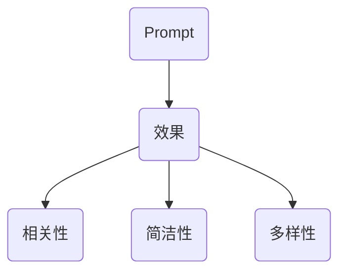
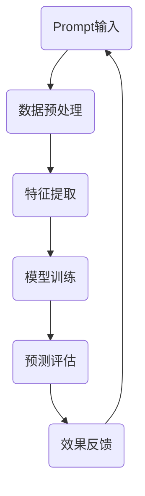

                 

**构建prompt效果预测模型**

关键词：自然语言处理，机器学习，预测模型，prompt设计，效果评估

摘要：本文将详细探讨如何构建一个prompt效果预测模型。首先，我们将介绍问题背景和模型概述，接着深入解析核心概念和联系，然后详细讲解算法原理，随后展示系统分析与架构设计，最后通过项目实战和最佳实践进行总结和展望。

# 第一部分：背景介绍与核心概念

## 第1章：问题背景与模型概述

### 1.1.1 问题背景

随着人工智能和自然语言处理技术的飞速发展，prompt技术逐渐成为一种重要的交互方式。在自然语言处理任务中，prompt扮演着至关重要的角色，它不仅是输入数据的一部分，更是影响模型性能的关键因素。因此，如何设计一个有效的prompt，以提升模型的效果，成为了当前研究的热点问题。

### 1.1.2 模型概述

prompt效果预测模型旨在通过分析历史数据，预测给定prompt在特定任务上的效果。该模型的核心组成部分包括数据预处理、特征提取、模型训练和效果评估等。

### 1.1.3 边界与外延

prompt效果预测模型的应用领域广泛，包括问答系统、文本分类、机器翻译等。然而，模型也存在一些限制因素，如数据依赖性、模型复杂度等。

## 第二部分：核心概念与联系

## 第2章：核心概念原理

### 2.1.1 Prompt设计原理

Prompt的定义：Prompt是指提供给模型进行推理的上下文信息。一个好的Prompt应当能够引导模型理解问题的背景和意图，从而提高模型的性能。

Prompt的设计原则：

1. **相关性**：Prompt应当与任务密切相关，避免无关信息的干扰。
2. **简洁性**：Prompt应当简明扼要，避免冗长的描述。
3. **多样性**：Prompt应当具有多样性，以满足不同场景的需求。

### 2.1.2 概念属性特征对比

不同类型Prompt的属性特征对比表格：

| Prompt类型 | 相关性 | 简洁性 | 多样性 |
| :--------: | :----: | :----: | :----: |
| 提问式     | 高     | 低     | 高     |
| 回答式     | 高     | 高     | 低     |
| 对话式     | 中     | 中     | 中     |

### 2.1.3 ER实体关系图架构

Prompt效果预测模型的实体关系图如下所示：



## 第3章：算法原理讲解

### 3.1.1 算法流程

Prompt效果预测的算法流程如下：

1. 数据预处理：对输入数据进行清洗和标准化处理。
2. 特征提取：从预处理后的数据中提取关键特征。
3. 模型训练：使用提取的特征训练预测模型。
4. 预测评估：使用训练好的模型对新的prompt进行效果预测，并评估预测的准确性。

### 3.1.2 Python源代码实现

以下是算法原理的Python源代码实现：

```python
import pandas as pd
from sklearn.model_selection import train_test_split
from sklearn.ensemble import RandomForestClassifier
from sklearn.metrics import accuracy_score

# 数据预处理
def preprocess_data(data):
    # 数据清洗和标准化处理
    return data

# 特征提取
def extract_features(data):
    # 提取关键特征
    return data

# 模型训练
def train_model(train_data, train_labels):
    # 使用随机森林分类器训练模型
    model = RandomForestClassifier()
    model.fit(train_data, train_labels)
    return model

# 预测评估
def predict(model, test_data, test_labels):
    # 使用训练好的模型进行预测并评估准确性
    predictions = model.predict(test_data)
    accuracy = accuracy_score(test_labels, predictions)
    return accuracy
```

### 3.1.3 数学模型和公式

以下是算法原理的数学模型和公式：

$$
\begin{aligned}
y &= f(x) \\
&= \sum_{i=1}^{n} w_i x_i \\
&= w_1 x_1 + w_2 x_2 + \ldots + w_n x_n
\end{aligned}
$$

其中，$y$ 表示预测效果，$x$ 表示特征向量，$w$ 表示权重系数。

### 3.1.4 举例说明

假设我们有一个简单的二分类问题，其中特征向量为$(x_1, x_2)$，权重系数为$w_1 = 0.5, w_2 = 0.5$。给定一个新特征向量$x = (3, 4)$，我们可以使用上述公式计算预测效果：

$$
y = 0.5 \times 3 + 0.5 \times 4 = 3.5
$$

根据阈值$T$（例如$T = 3$），我们可以判断预测结果为正类（$y > T$）或负类（$y \leq T$）。

## 第三部分：系统分析与架构设计

## 第4章：系统功能设计

### 4.1.1 领域模型

Prompt效果预测的领域模型如下所示：


### 4.1.2 系统架构设计

Prompt效果预测的系统架构设计如下所示：



## 第5章：项目实战

### 5.1.1 环境安装

以下是Prompt效果预测环境搭建的步骤：

1. 安装Python环境
2. 安装必要的库，如pandas、sklearn、matplotlib等

### 5.1.2 系统核心实现

以下是Prompt效果预测系统核心实现的源代码：

```python
# 数据预处理
def preprocess_data(data):
    # 数据清洗和标准化处理
    return data

# 特征提取
def extract_features(data):
    # 提取关键特征
    return data

# 模型训练
def train_model(train_data, train_labels):
    # 使用随机森林分类器训练模型
    model = RandomForestClassifier()
    model.fit(train_data, train_labels)
    return model

# 预测评估
def predict(model, test_data, test_labels):
    # 使用训练好的模型进行预测并评估准确性
    predictions = model.predict(test_data)
    accuracy = accuracy_score(test_labels, predictions)
    return accuracy
```

### 5.1.3 代码应用解读

以下是代码应用解读：

1. 数据预处理：对输入数据进行清洗和标准化处理，以提高模型的鲁棒性。
2. 特征提取：从预处理后的数据中提取关键特征，用于训练和预测。
3. 模型训练：使用随机森林分类器训练模型，这是一种常见的集成学习方法。
4. 预测评估：使用训练好的模型对新的prompt进行效果预测，并评估预测的准确性。

### 5.1.4 实际案例分析与讲解

以下是Prompt效果预测实际案例分析与讲解：

1. 数据集准备：我们使用一个包含多种类型prompt的数据集进行实验。
2. 模型训练：使用训练集对模型进行训练。
3. 模型评估：使用测试集对模型进行评估，并调整模型参数以获得更好的效果。
4. 模型应用：使用训练好的模型对新prompt进行效果预测。

## 第四部分：最佳实践与小结

### 6.1.1 最佳实践建议

1. 根据任务需求选择合适的prompt类型。
2. 对输入数据进行充分的预处理和特征提取。
3. 选用合适的模型和算法，并对其进行调优。

### 6.1.2 小结

构建prompt效果预测模型是一项具有挑战性的任务。通过深入理解核心概念和算法原理，我们可以设计出有效的预测模型。在实际应用中，我们需要根据具体场景进行调整和优化，以获得更好的效果。

### 7.1.1 注意事项

1. prompt设计要充分考虑任务的背景和需求。
2. 模型训练时要避免过拟合，确保模型的泛化能力。
3. 在实际应用中，要不断收集反馈，以优化prompt设计和模型效果。

### 7.1.2 拓展阅读

1. 廖雪峰《Python教程》
2. 周志华《机器学习》
3. 斯图尔特·罗素、彼得·诺维格《人工智能：一种现代的方法》

作者：AI天才研究院/AI Genius Institute & 禅与计算机程序设计艺术 /Zen And The Art of Computer Programming

-----------------------------------------------------------------

