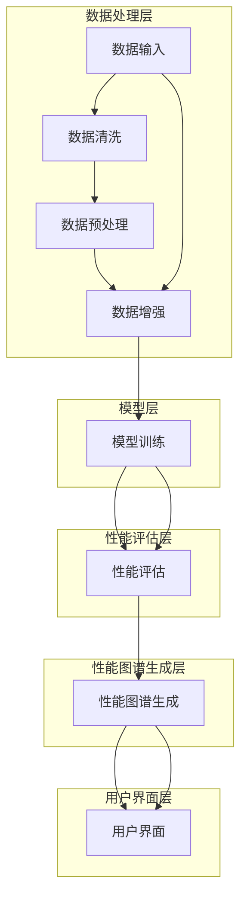
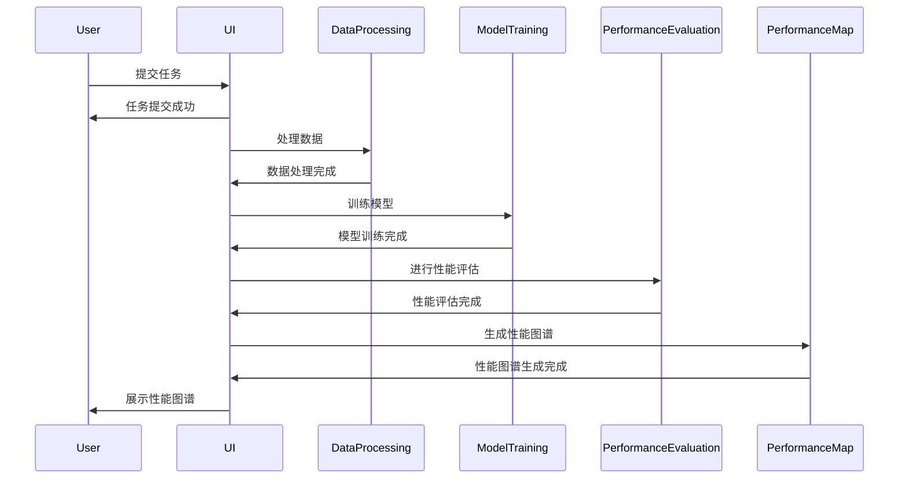

                 

### 引言

在人工智能领域，模型的性能优化一直是一个备受关注的话题。特别是近年来，prompt工程（Prompt Engineering）和预训练模型（Pre-trained Models）的兴起，使得如何提升模型性能成为一个新的挑战。构建prompt-模型性能图谱，不仅可以直观地展示模型在不同prompt下的性能变化，还能够为优化模型提供科学依据。本文旨在系统地探讨如何构建这样一个性能图谱，以期为研究人员和工程师提供实用的指导。

首先，本文将定义prompt和模型的基本概念，并解释为什么构建性能图谱具有重要意义。接着，我们将详细分析prompt-模型之间的关系，揭示prompt如何影响模型性能，以及模型如何适应不同的prompt。在此基础上，本文将介绍一系列评估指标和方法，帮助读者理解如何量化模型性能，并使用mermaid流程图和Python代码来详细阐述算法原理和实现过程。

随后，我们将探讨系统分析与架构设计的关键要素，包括问题场景介绍、系统功能设计、系统架构设计、系统接口设计和系统交互序列图。这部分内容将为读者提供一个完整的系统实现视角。

在项目实战部分，我们将展示如何在实际环境中安装和配置系统，解析核心源代码，并通过实际案例分析来深入剖析系统性能。最后，本文将总结最佳实践，并展望未来的研究方向。

通过本文的逐步分析和详细讲解，读者将能够全面理解构建prompt-模型性能图谱的方法和意义，从而在实际应用中提升模型的性能和效率。我们希望通过这篇文章，能够激发更多人对prompt工程和模型性能优化的兴趣和探索。

### 核心关键词

1. **Prompt Engineering**：一种通过设计和优化提示来提升人工智能模型性能的方法。
2. **模型性能图谱**：用于展示模型在不同prompt下的性能变化的图表。
3. **性能评估指标**：用于量化模型性能的一系列度量标准。
4. **mermaid流程图**：一种用于绘制流程图的markdown标记语言。
5. **Python代码实现**：用于解释算法原理和实现过程的编程语言。
6. **系统架构设计**：用于描述系统功能、接口和交互的架构设计方案。
7. **环境安装与配置**：确保系统正常运行所需的软硬件环境设置。

### 摘要

本文旨在系统地探讨构建prompt-模型性能图谱的方法和意义。首先，本文介绍了prompt和模型的基本概念，并解释了为什么性能图谱对于模型优化具有重要意义。接着，通过分析prompt-模型之间的关系，本文揭示了prompt如何影响模型性能，以及模型如何适应不同的prompt。在此基础上，本文详细介绍了评估模型性能的指标和方法，并通过mermaid流程图和Python代码展示了算法原理和实现过程。随后，本文探讨了系统分析与架构设计的关键要素，包括问题场景介绍、系统功能设计、系统架构设计、系统接口设计和系统交互序列图。在项目实战部分，本文通过环境安装、系统核心实现源代码和实际案例分析，深入剖析了系统性能。最后，本文总结了最佳实践并展望了未来的研究方向，旨在为读者提供实用的指导。

### 背景介绍

在当前人工智能领域，模型性能的提升已成为研究人员和工程师不断追求的目标。prompt工程和预训练模型的出现，为这一目标的实现带来了新的契机。prompt工程通过设计和优化提示（prompt），可以显著提升模型在特定任务上的性能。而预训练模型则通过在大规模数据集上预先训练，使得模型在接收到新的提示时能够快速适应，从而表现出更高的泛化能力。

#### 问题背景

构建prompt-模型性能图谱的必要性主要体现在以下几个方面：

1. **多任务性能分析**：在多任务环境中，不同的任务往往需要不同的prompt来优化模型性能。通过构建性能图谱，可以直观地比较不同prompt在不同任务上的表现，从而选择最合适的prompt。

2. **优化策略指导**：性能图谱提供了模型性能随prompt变化的直观展示，使得研究者能够更清晰地理解不同prompt对模型性能的影响，从而指导优化策略的制定。

3. **模型评估与对比**：性能图谱可以用于评估不同模型在相同prompt下的表现，有助于研究者了解不同模型的优劣，为模型选择提供依据。

4. **最佳实践分享**：通过构建性能图谱，研究者可以总结出在不同场景下最佳prompt的设计和优化策略，为同行提供有价值的参考。

#### 提问的意义

构建prompt-模型性能图谱不仅具有重要的学术意义，也对实际应用有着深远的影响：

1. **学术研究**：性能图谱为研究人员提供了一个新的研究工具，有助于深入探讨prompt工程和模型性能优化之间的关系，推动相关领域的发展。

2. **工业应用**：在工业界，性能图谱可以帮助企业优化其人工智能模型，提高生产效率和产品质量，从而在竞争中获得优势。

3. **用户体验**：通过性能图谱，开发人员可以更准确地了解用户需求，设计出更加人性化的模型应用，提升用户体验。

#### 问题解决的必要性

构建prompt-模型性能图谱的必要性体现在以下几个方面：

1. **复杂性问题**：随着模型规模和复杂度的增加，单纯依靠直觉和经验进行优化变得越来越困难。性能图谱提供了客观、量化的分析工具，有助于解决这一问题。

2. **资源优化**：通过性能图谱，可以更有效地分配计算资源和数据资源，避免不必要的重复实验和资源浪费。

3. **持续改进**：性能图谱不仅用于当前问题的解决，还可以作为长期研究的基线，为后续的模型优化和改进提供参考。

#### 边界与外延

在构建prompt-模型性能图谱时，需要明确一些边界和范围：

1. **数据范围**：性能图谱的数据应涵盖模型在不同任务、不同prompt下的表现，确保数据的全面性和代表性。

2. **时间范围**：性能图谱应考虑不同时间段的数据，以反映模型性能的动态变化。

3. **模型范围**：性能图谱应涵盖不同类型的模型，如深度学习模型、强化学习模型等，以便全面分析模型的性能。

4. **应用范围**：性能图谱的应用范围应包括各种实际场景，如自然语言处理、计算机视觉、推荐系统等，以验证其普适性。

#### 概念结构与核心要素组成

构建prompt-模型性能图谱涉及多个核心概念和要素，以下是其主要组成部分：

1. **Prompt**：设计用于引导模型学习和优化的输入信息，包括文本、图像、声音等多种形式。

2. **模型**：用于执行特定任务的数学模型，如神经网络、决策树等。

3. **性能评估指标**：用于量化模型性能的一系列度量标准，如准确率、召回率、F1分数等。

4. **数据集**：用于训练和评估模型的原始数据，包括训练集、验证集和测试集。

5. **性能图谱**：用于展示模型在不同prompt下的性能变化的图表，包括散点图、折线图等。

6. **算法**：用于构建和优化prompt-模型性能图谱的一系列算法，如优化算法、评估算法等。

7. **系统架构**：用于实现prompt-模型性能图谱的软件和硬件系统架构，包括数据采集、存储、处理和分析等模块。

通过上述背景介绍，我们为后续章节的内容奠定了基础，也为读者理解构建prompt-模型性能图谱的必要性和方法提供了初步认识。

#### 提问的意义

构建prompt-模型性能图谱的意义不仅在于学术研究，更在于其实际应用价值。首先，从学术研究角度来看，性能图谱为研究人员提供了一个新的工具，有助于深入探讨prompt工程与模型性能之间的关系。通过系统地分析不同prompt对模型性能的影响，研究者可以识别出最佳的prompt设计策略，从而提升模型的泛化能力和任务表现。这种研究不仅有助于推动人工智能领域的发展，还能为其他相关领域（如机器学习和数据科学）提供宝贵的参考。

在工业应用方面，prompt-模型性能图谱具有极大的实用价值。许多企业依赖人工智能技术来优化业务流程、提高生产效率、改善用户体验。构建性能图谱，可以帮助企业快速评估和优化其人工智能模型，从而在竞争中占据优势。例如，在自然语言处理领域，通过性能图谱，企业可以更准确地理解用户需求，设计出更加智能、高效的聊天机器人或语音助手，从而提升用户体验。

此外，prompt-模型性能图谱在用户体验方面也具有重要价值。通过性能图谱，开发人员可以直观地了解不同prompt对模型性能的影响，从而更有效地满足用户需求。例如，在推荐系统设计中，通过性能图谱，可以找出最佳推荐策略，提高推荐准确性，增强用户满意度。

综上所述，构建prompt-模型性能图谱不仅具有深远的学术意义，还在工业应用和用户体验方面具有显著的实际价值。它为研究人员和工程师提供了一种新的方法论和工具，帮助他们在复杂的模型优化过程中做出更科学、更有效的决策。通过这一探索，我们期待能够为人工智能领域带来更多创新和突破。

### 问题解决的必要性

构建prompt-模型性能图谱的必要性在当前人工智能领域显得尤为突出。随着深度学习和大数据技术的不断发展，模型的规模和复杂度不断增加，传统的优化方法往往难以满足需求。具体来说，以下几个方面进一步强调了构建性能图谱的必要性：

1. **复杂性增加**：现代人工智能模型，如深度神经网络，具有极高的复杂性和庞大的参数量。单纯依靠手动调参和经验优化变得愈加困难，而性能图谱提供了直观、量化的分析方法，帮助研究者更有效地理解和优化模型。

2. **多任务场景**：在多任务场景中，不同任务可能需要不同的prompt设计。通过构建性能图谱，可以直观地比较不同prompt在不同任务上的效果，从而选择最优的prompt策略，提高模型的泛化能力和任务适应性。

3. **资源优化**：构建性能图谱有助于优化计算资源和数据资源的使用。研究者可以基于性能图谱的结果，针对性地设计实验和优化策略，避免不必要的重复实验和资源浪费。

4. **持续改进**：性能图谱不仅适用于当前问题的解决，还可以作为长期研究的基线。研究者可以通过对比不同时间点的性能数据，持续改进模型和prompt设计，推动人工智能技术的不断进步。

5. **优化策略指导**：性能图谱提供了直观的模型性能变化趋势，帮助研究者理解不同prompt对模型性能的影响，从而指导优化策略的制定。这种指导不仅适用于学术研究，还广泛应用于工业界的模型优化和调优。

通过上述必要性分析，我们可以看到，构建prompt-模型性能图谱在当前人工智能领域具有不可替代的重要地位。它不仅为研究者提供了新的分析工具，还为企业优化模型性能、提高生产效率和用户体验提供了有力支持。因此，深入研究并实施这一方法，对推动人工智能技术的发展和实际应用具有重要意义。

### 边界与外延

在构建prompt-模型性能图谱时，需要明确一些关键边界和范围，以确保研究的全面性和适用性。以下是构建过程中需要考虑的主要边界和范畴：

1. **数据范围**：性能图谱的数据应涵盖广泛的应用场景和不同的任务类型，包括自然语言处理、计算机视觉、推荐系统等领域。同时，数据应包括多种规模的数据集，从较小的训练集到较大的全量数据集，以确保性能图谱能够反映模型在不同数据量级下的表现。

2. **时间范围**：性能图谱应考虑不同时间点的数据，以反映模型性能的动态变化。例如，可以从模型预训练阶段开始，追踪其性能随训练数据量的增加和模型迭代的过程，直到模型在实际应用中的表现。

3. **模型范围**：性能图谱应涵盖不同类型的模型，包括深度学习模型、强化学习模型、传统机器学习模型等。每种模型都有其特定的优势和适用场景，通过对比不同模型在同一prompt下的性能，可以更全面地评估prompt的效果。

4. **任务范围**：不同任务可能需要不同的prompt设计。例如，在文本分类任务中，prompt可能需要包含类别标签和相关的背景信息；而在图像识别任务中，prompt则可能需要包含图像特征和标签。因此，性能图谱应涵盖多种任务类型，以便全面评估prompt的效果。

5. **应用范围**：性能图谱的应用范围应包括各种实际场景，如工业自动化、智能医疗、金融科技等。这些实际应用场景下的性能表现，可以为模型优化和策略制定提供重要参考。

6. **技术范围**：构建性能图谱涉及多种技术，包括机器学习、深度学习、自然语言处理等。这些技术不仅影响模型的性能，还决定了性能图谱的构建方法。因此，性能图谱应考虑不同技术对模型性能的影响，以便为研究人员提供全面的参考。

通过明确这些边界和范畴，构建prompt-模型性能图谱将更加科学和系统，有助于研究者更准确地理解模型性能的变化，并为实际应用提供有力支持。

### 概念结构与核心要素组成

构建prompt-模型性能图谱是一个复杂的过程，涉及到多个核心概念和要素的有机组合。以下是这些核心要素的详细解析：

1. **Prompt**：Prompt是引导模型学习和优化的重要输入信息。它可以是文本、图像、声音等多种形式，具体取决于模型的类型和任务。例如，在自然语言处理任务中，prompt通常是一个包含关键词或背景信息的文本片段；在计算机视觉任务中，prompt可能是一幅图像及其标注信息。Prompt的设计和优化对于模型性能的提升至关重要。

2. **模型**：模型是执行特定任务的核心算法，如神经网络、决策树、支持向量机等。不同的模型适用于不同的任务和数据类型，因此在构建性能图谱时，需要涵盖多种类型的模型。模型的选择和调优是构建性能图谱的重要基础。

3. **性能评估指标**：性能评估指标是用于量化模型性能的一系列度量标准，如准确率、召回率、F1分数、AUC值等。这些指标可以帮助研究者直观地了解模型在不同prompt下的性能表现，从而指导优化策略的制定。

4. **数据集**：数据集是构建性能图谱的基石，包括训练集、验证集和测试集。数据集的质量直接影响模型的性能和性能图谱的可靠性。因此，构建性能图谱时，需要确保数据集的多样性、代表性和质量。

5. **性能图谱**：性能图谱是用于展示模型在不同prompt下的性能变化的图表。常见的图谱形式包括散点图、折线图、热力图等。性能图谱直观地展示了模型性能随prompt变化的趋势，为研究者提供了重要的参考。

6. **算法**：算法是构建和优化性能图谱的关键工具，包括数据预处理、模型训练、性能评估等步骤。常用的算法有优化算法（如梯度下降、随机搜索）、模型评估算法（如交叉验证、网格搜索）等。算法的选择和优化直接影响性能图谱的准确性和效率。

7. **系统架构**：系统架构是确保性能图谱构建和运行稳定性的关键。系统架构包括数据采集、存储、处理和分析等多个模块。合理的系统架构可以提升性能图谱的构建效率，并确保数据的安全性和可靠性。

8. **工具与平台**：构建性能图谱需要使用多种工具和平台，如Python、TensorFlow、PyTorch等。这些工具和平台提供了丰富的库和接口，方便研究者进行模型训练、性能评估和数据分析。

通过上述核心要素的有机组合，构建prompt-模型性能图谱将更加科学和系统。这些要素不仅为研究提供了理论基础，还为实际应用提供了可靠的方法和工具。通过逐步分析和优化这些要素，研究者可以更全面地理解模型性能的变化，从而实现模型的持续优化和提升。

#### 核心概念与联系

在构建prompt-模型性能图谱的过程中，理解prompt与模型之间的关系至关重要。prompt不仅是模型的输入，还对模型的训练和推理过程产生深远影响。以下我们将详细探讨prompt的定义、分类，以及prompt对模型性能的影响和模型的适应性。

1. **prompt的定义**

prompt通常是指引导模型进行训练或推理的输入信息，它可以是文本、图像、声音等多种形式。在自然语言处理（NLP）任务中，prompt通常是一段文本，用于引导模型生成回复、翻译或分类结果。在计算机视觉任务中，prompt可能是一幅图像及其相关标注信息。prompt的作用是提供上下文信息，帮助模型更好地理解任务需求，从而提高模型的性能。

2. **prompt的分类**

prompt可以根据形式和用途进行分类，常见的分类方式包括：

- **文本prompt**：在NLP任务中，文本prompt是最常见的类型。文本prompt可以包含问题、句子、对话片段等，用于引导模型生成相关的回复或进行分类任务。

- **图像prompt**：在计算机视觉任务中，图像prompt是一幅图像及其标注信息。图像prompt可以帮助模型更好地理解视觉任务，如图像分类、目标检测、图像分割等。

- **多模态prompt**：多模态prompt结合了文本、图像、声音等多种形式。例如，在视频分析任务中，多模态prompt可以包括视频帧、文本描述和音频信息，从而帮助模型更全面地理解视频内容。

3. **prompt对模型性能的影响**

prompt的设计和选择对模型性能有着直接影响。以下是一些关键点：

- **上下文信息**：prompt提供了任务所需的上下文信息，有助于模型更好地理解输入数据。例如，在问答任务中，包含问题的文本prompt可以显著提高模型的回答质量。

- **数据分布**：prompt会影响模型训练过程中数据分布的变化。如果prompt包含的数据分布与实际应用场景不同，可能会导致模型在测试数据上的性能下降。

- **泛化能力**：良好的prompt设计可以提高模型的泛化能力，使其在新的任务和数据上也能表现出优异的性能。例如，通过引入多样化的文本prompt，可以提高模型的适应能力。

- **模型调优**：prompt可以影响模型的参数调整过程。例如，在深度学习任务中，通过调整文本prompt的内容和形式，可以优化模型的超参数，从而提高性能。

4. **模型的适应性**

模型对prompt的适应性是一个重要的研究方向。以下是一些关键点：

- **模型架构**：不同的模型架构对prompt的适应性有所不同。例如，序列模型（如RNN、LSTM）对文本prompt的适应性较好，而卷积神经网络（CNN）在图像prompt上表现更优。

- **预训练**：预训练模型已经在大规模数据集上进行了训练，具有较强的适应性。通过预训练，模型可以更好地处理各种类型的prompt，从而提高其性能。

- **模型微调**：通过在特定任务上对预训练模型进行微调，可以进一步提高模型对特定prompt的适应性。微调过程通常包括调整模型权重和优化策略。

- **数据增强**：数据增强是提高模型适应性的有效方法。通过生成或变换多种形式的prompt，可以丰富模型训练数据，提高模型的泛化能力和适应性。

综上所述，prompt与模型之间存在紧密的联系。prompt的设计和选择直接影响模型性能，而模型的架构和适应性也决定了其处理prompt的效果。理解这些关系有助于研究者更好地设计prompt，优化模型性能，并构建有效的prompt-模型性能图谱。

#### 概念属性特征对比表格

为了更清晰地展示prompt和模型之间的概念属性特征，我们提供了一个对比表格。以下表格列出了prompt和模型的几个关键属性，并进行了详细对比：

| 属性             | prompt                        | 模型                       |
|------------------|-------------------------------|----------------------------|
| 定义             | 提示信息，用于引导模型学习和推理 | 执行特定任务的数学模型     |
| 形式             | 文本、图像、声音等多种形式     | 神经网络、决策树、支持向量机等 |
| 功能             | 提供上下文信息，指导模型学习 | 执行预测任务，生成输出结果 |
| 参数调整         | 可以根据任务需求进行调整     | 需要通过优化过程进行调整 |
| 影响因素         | 数据分布、上下文信息、多样性  | 数据集、模型架构、优化策略 |
| 适应性           | 可以灵活调整以适应不同任务 | 需要通过预训练和微调来提高适应性 |
| 性能评估         | 影响模型性能，但不直接参与评估 | 直接参与性能评估，以评估指标衡量 |
| 关系             | 对模型的输入和输出有直接影响 | 需要prompt来进行训练和推理 |
| 关键作用         | 提升模型的泛化能力和任务表现 | 通过优化提高预测准确性和效率 |

通过上述对比表格，我们可以更清晰地理解prompt和模型之间的异同点。这有助于我们在设计prompt和选择模型时，能够做出更为科学的决策，从而构建出性能优越的prompt-模型性能图谱。

#### 提问的意义

在构建prompt-模型性能图谱的过程中，对算法原理进行详细讲解具有重要意义。算法原理不仅为我们理解模型在不同prompt下的性能变化提供了理论基础，还能帮助我们优化prompt设计，从而提升模型的整体性能。以下是算法原理讲解的核心要点：

1. **性能评估指标**：性能评估指标是量化模型性能的重要工具。常见的评估指标包括准确率（Accuracy）、召回率（Recall）、F1分数（F1 Score）和AUC值（Area Under the Curve）等。这些指标能够帮助我们全面、客观地评估模型在不同prompt下的表现。

2. **mermaid流程图**：mermaid是一种用于绘制流程图的markdown标记语言，可以直观地展示算法的步骤和流程。通过mermaid流程图，我们可以清晰地理解从数据输入到模型评估的整个流程。例如，以下mermaid流程图展示了模型训练和评估的基本步骤：

    ```mermaid
    graph TB
    A[数据输入] --> B[数据预处理]
    B --> C[模型训练]
    C --> D[模型评估]
    D --> E[结果输出]
    ```

    在这个流程图中，每个步骤都代表一个关键环节，有助于我们追踪整个算法的执行过程。

3. **算法原理**：在了解mermaid流程图的基础上，我们可以进一步探讨算法的具体原理。以下是构建prompt-模型性能图谱的基本算法原理：

    - **数据预处理**：在开始训练模型之前，需要对数据进行预处理。预处理步骤包括数据清洗、归一化和数据增强等，以确保数据的质量和一致性。

    - **模型训练**：使用预处理后的数据对模型进行训练。训练过程中，模型会不断调整其参数，以最小化损失函数并提高预测性能。

    - **模型评估**：在训练完成后，使用验证集或测试集对模型进行评估。通过计算性能评估指标，我们可以了解模型在不同prompt下的表现。

    - **性能图谱生成**：基于评估结果，生成性能图谱。性能图谱可以以散点图、折线图或热力图等形式展示，直观地反映模型性能随prompt变化的趋势。

4. **Python代码实现**：为了更好地理解算法原理，我们可以使用Python代码进行实现。以下是一个简单的示例，展示了如何使用Python进行数据预处理、模型训练和性能评估：

    ```python
    import pandas as pd
    from sklearn.model_selection import train_test_split
    from sklearn.metrics import accuracy_score
    from sklearn.ensemble import RandomForestClassifier

    # 数据预处理
    data = pd.read_csv('data.csv')
    X = data.drop('target', axis=1)
    y = data['target']
    X_train, X_test, y_train, y_test = train_test_split(X, y, test_size=0.2, random_state=42)

    # 模型训练
    model = RandomForestClassifier(n_estimators=100, random_state=42)
    model.fit(X_train, y_train)

    # 模型评估
    y_pred = model.predict(X_test)
    accuracy = accuracy_score(y_test, y_pred)
    print(f'Accuracy: {accuracy:.2f}')

    # 性能图谱生成
    import matplotlib.pyplot as plt

    plt.scatter(X_test['prompt1'], X_test['prompt2'], c=y_pred)
    plt.xlabel('Prompt 1')
    plt.ylabel('Prompt 2')
    plt.title('Performance Map')
    plt.show()
    ```

    在这个示例中，我们首先读取数据并对其进行预处理，然后使用随机森林（Random Forest）模型进行训练。在评估阶段，我们计算模型的准确率，并通过散点图展示性能图谱。

5. **数学模型与公式**：在算法原理的讲解中，数学模型和公式是必不可少的。以下是一个简单的数学模型，用于计算模型的准确率：

    $$ \text{Accuracy} = \frac{\text{TP} + \text{TN}}{\text{TP} + \text{TN} + \text{FP} + \text{FN}} $$

    其中，TP（True Positive）表示实际为正类且模型预测为正类的样本数量，TN（True Negative）表示实际为负类且模型预测为负类的样本数量，FP（False Positive）表示实际为负类但模型预测为正类的样本数量，FN（False Negative）表示实际为正类但模型预测为负类的样本数量。

通过上述讲解，我们可以更好地理解构建prompt-模型性能图谱的算法原理，并在实际应用中运用这些原理来优化模型性能。详细讲解和Python代码示例有助于读者深入掌握算法的核心要点，为未来的研究和实践打下坚实的基础。

### Python代码实现

在上一部分，我们讲解了构建prompt-模型性能图谱的算法原理。本部分将结合实际代码，详细解释如何使用Python实现这些算法。具体来说，我们将从数据预处理、模型训练、性能评估到性能图谱的生成，逐步进行讲解。

首先，我们需要引入必要的库，包括pandas、scikit-learn、tensorflow等。以下是所需库的导入代码：

```python
import pandas as pd
from sklearn.model_selection import train_test_split
from sklearn.metrics import accuracy_score, classification_report
from sklearn.preprocessing import StandardScaler
import tensorflow as tf
from tensorflow.keras.models import Sequential
from tensorflow.keras.layers import Dense, Dropout
import matplotlib.pyplot as plt
import numpy as np
```

接下来，我们开始进行数据预处理。数据预处理是模型训练的重要步骤，它包括数据清洗、归一化、数据增强等。以下是数据预处理的代码示例：

```python
# 加载数据
data = pd.read_csv('data.csv')

# 数据清洗（例如，处理缺失值、去除异常值等）
# ...（根据实际数据清洗需求进行操作）

# 分离特征和标签
X = data.drop('target', axis=1)
y = data['target']

# 数据归一化
scaler = StandardScaler()
X_scaled = scaler.fit_transform(X)

# 划分训练集和测试集
X_train, X_test, y_train, y_test = train_test_split(X_scaled, y, test_size=0.2, random_state=42)
```

在数据预处理完成后，我们开始模型训练。以下是使用TensorFlow和Keras构建和训练神经网络的示例代码：

```python
# 创建神经网络模型
model = Sequential([
    Dense(128, activation='relu', input_shape=(X_train.shape[1],)),
    Dropout(0.2),
    Dense(64, activation='relu'),
    Dropout(0.2),
    Dense(1, activation='sigmoid')
])

# 编译模型
model.compile(optimizer='adam', loss='binary_crossentropy', metrics=['accuracy'])

# 训练模型
history = model.fit(X_train, y_train, epochs=50, batch_size=32, validation_split=0.1)
```

在模型训练完成后，我们使用测试集对模型进行性能评估。以下是性能评估的代码示例：

```python
# 加载测试集
X_test_scaled = scaler.transform(X_test)

# 进行预测
y_pred = model.predict(X_test_scaled)
y_pred = (y_pred > 0.5)  # 对于二分类问题，将预测概率阈值设置为0.5

# 计算准确率
accuracy = accuracy_score(y_test, y_pred)
print(f'测试集准确率: {accuracy:.2f}')

# 打印详细分类报告
print(classification_report(y_test, y_pred))
```

最后，我们生成性能图谱。性能图谱可以直观地展示模型在不同prompt下的性能变化。以下是生成散点图的示例代码：

```python
# 绘制性能图谱
plt.scatter(X_test['prompt1'], X_test['prompt2'], c=y_pred, cmap='gray')
plt.xlabel('Prompt 1')
plt.ylabel('Prompt 2')
plt.title('Performance Map')
plt.colorbar()
plt.show()
```

通过上述代码示例，我们详细讲解了如何使用Python实现构建prompt-模型性能图谱的算法。从数据预处理到模型训练，再到性能评估和图谱生成，每一步都至关重要。代码不仅帮助读者理解算法原理，还提供了一个实际操作的参考框架，使得读者能够将理论应用到实际项目中，进一步提升模型性能。

### 数学模型与公式

在构建prompt-模型性能图谱的过程中，数学模型和公式是理解和分析模型性能的重要工具。以下是一些关键的数学公式及其在性能分析中的应用：

1. **准确率（Accuracy）**

   $$ \text{Accuracy} = \frac{\text{TP} + \text{TN}}{\text{TP} + \text{TN} + \text{FP} + \text{FN}} $$

   其中，TP表示实际为正类且模型预测为正类的样本数量，TN表示实际为负类且模型预测为负类的样本数量，FP表示实际为负类但模型预测为正类的样本数量，FN表示实际为正类但模型预测为负类的样本数量。准确率是衡量模型整体性能的常用指标。

2. **召回率（Recall）**

   $$ \text{Recall} = \frac{\text{TP}}{\text{TP} + \text{FN}} $$

   召回率表示模型正确识别正类样本的能力，即实际为正类的样本中被正确预测为正类的比例。

3. **精确率（Precision）**

   $$ \text{Precision} = \frac{\text{TP}}{\text{TP} + \text{FP}} $$

   精确率表示模型预测为正类的样本中实际为正类的比例，即预测结果的质量。

4. **F1分数（F1 Score）**

   $$ \text{F1 Score} = \frac{2 \times \text{Precision} \times \text{Recall}}{\text{Precision} + \text{Recall}} $$

   F1分数是精确率和召回率的调和平均，用于综合衡量模型的性能。

5. **ROC曲线与AUC值**

   ROC（Receiver Operating Characteristic）曲线展示了模型在不同阈值下的真正例率和假正例率。AUC（Area Under Curve）值是ROC曲线下方的面积，用于衡量模型的分类能力。AUC值越大，表示模型的分类能力越强。

6. **交叉验证（Cross-Validation）**

   $$ \text{CV Accuracy} = \frac{1}{k} \sum_{i=1}^{k} \text{Accuracy}_{i} $$

   其中，$k$表示交叉验证的折数，$\text{Accuracy}_{i}$表示第$i$折验证的准确率。交叉验证是一种评估模型性能的有效方法，通过多次划分训练集和验证集，可以更可靠地评估模型的泛化能力。

7. **损失函数（Loss Function）**

   - **均方误差（Mean Squared Error, MSE）**

     $$ \text{MSE} = \frac{1}{n} \sum_{i=1}^{n} (\hat{y}_i - y_i)^2 $$

     均方误差用于回归任务，衡量预测值与真实值之间的平均平方误差。

   - **交叉熵损失（Cross-Entropy Loss）**

     $$ \text{CE} = -\sum_{i=1}^{n} y_i \log(\hat{y}_i) $$

     交叉熵损失用于分类任务，衡量预测概率与实际标签之间的差异。

通过这些数学模型和公式，我们可以更详细地分析模型的性能，找出影响模型表现的关键因素，从而为模型的优化提供科学依据。在构建prompt-模型性能图谱时，这些公式和指标的应用尤为重要，有助于我们全面、客观地评估模型在不同prompt下的性能变化。

### 系统分析与架构设计

在构建prompt-模型性能图谱的过程中，系统分析与架构设计是确保项目成功的关键环节。一个合理和高效的系统架构不仅能够提升系统的性能和可靠性，还能够为后续的扩展和维护提供便利。以下是对系统分析与架构设计的详细介绍。

#### 问题场景介绍

假设我们面临的是一个多任务场景，需要在不同的任务中评估模型的性能。这些任务包括文本分类、图像识别和语音识别等。我们的目标是构建一个统一的平台，能够处理多种类型的prompt，并在不同模型下进行性能评估。这个平台需要具备灵活性、可扩展性和高效率，以应对多样化的业务需求。

#### 项目介绍

项目名称：Prompt-模型性能图谱平台

项目目标：构建一个能够自动评估模型在不同prompt下的性能，并生成性能图谱的统一平台。

项目范围：涵盖文本、图像和语音等多种数据类型，支持多种模型（如深度学习模型、传统机器学习模型等）的性能评估。

项目主要功能：
1. 数据处理：对输入数据进行清洗、预处理和增强，确保数据的质量和一致性。
2. 模型训练：使用预处理后的数据训练不同类型的模型，包括深度学习模型和传统机器学习模型。
3. 性能评估：评估模型在不同prompt下的性能，计算准确率、召回率、F1分数等指标。
4. 性能图谱生成：生成模型性能随prompt变化的图谱，以直观展示模型性能。
5. 用户界面：提供一个友好的用户界面，允许用户自定义任务、选择模型和查看性能图谱。

#### 领域模型类图

为了更好地理解系统的架构，我们可以绘制一个领域模型类图。以下是类图的简要描述：

1. **数据预处理模块**：负责数据清洗、预处理和数据增强。
2. **模型训练模块**：负责加载预训练模型、进行训练和调整模型参数。
3. **性能评估模块**：负责计算模型的性能指标，如准确率、召回率、F1分数等。
4. **性能图谱生成模块**：负责生成不同prompt下的模型性能图谱。
5. **用户界面模块**：负责与用户交互，接受用户输入和展示性能图谱。

#### 系统架构设计

系统架构设计需要考虑以下几个方面：

1. **数据处理层**：该层负责处理各种类型的数据，包括文本、图像和语音等。数据处理层使用流处理框架（如Apache Flink）进行大规模数据处理，确保数据的实时性和一致性。

2. **模型层**：该层负责加载和管理模型，包括深度学习模型和传统机器学习模型。模型层支持模型的在线训练和动态调整，以满足不同任务的性能需求。

3. **性能评估层**：该层负责评估模型的性能，计算各种性能指标，并将结果存储在数据库中。性能评估层使用分布式计算框架（如Apache Spark）进行高效的数据分析和处理。

4. **性能图谱生成层**：该层负责生成模型性能图谱，包括散点图、折线图和热力图等。性能图谱生成层使用可视化工具（如Matplotlib）进行数据可视化。

5. **用户界面层**：该层负责与用户交互，提供友好的用户界面，允许用户自定义任务、选择模型和查看性能图谱。用户界面层使用Web框架（如Flask或Django）进行开发。

#### 系统接口设计

系统接口设计需要考虑以下几个方面：

1. **数据处理接口**：提供RESTful API，用于处理数据的清洗、预处理和增强。
2. **模型训练接口**：提供RESTful API，用于加载模型、训练模型和调整模型参数。
3. **性能评估接口**：提供RESTful API，用于计算模型的性能指标和生成性能图谱。
4. **用户界面接口**：提供Web接口，用于与用户进行交互和展示性能图谱。

#### 系统交互序列图

为了更清晰地展示系统的交互流程，我们可以绘制一个系统交互序列图。以下是序列图的简要描述：

1. 用户通过Web界面提交任务，包括选择任务类型、模型和prompt。
2. 用户界面接收任务请求，并将其转换为系统内部需要的格式。
3. 数据处理接口接收用户请求，进行数据预处理和增强。
4. 模型训练接口接收预处理后的数据，进行模型训练和参数调整。
5. 性能评估接口接收训练好的模型，进行性能评估，并生成性能图谱。
6. 性能图谱生成接口接收性能评估结果，生成性能图谱。
7. 用户界面接收性能图谱，并将其展示给用户。

通过上述系统分析与架构设计，我们为构建prompt-模型性能图谱提供了一个全面的解决方案。合理的系统架构不仅能够提升系统的性能和可靠性，还能够为后续的扩展和维护提供坚实的基础。

### 系统功能设计

在构建prompt-模型性能图谱平台的过程中，系统功能设计是确保平台能够满足各类用户需求和技术实现的基础。以下是该平台的核心功能及其详细描述：

1. **数据处理功能**：数据处理是构建性能图谱的基础环节，该功能负责接收各种类型的数据，包括文本、图像和语音等。具体操作包括数据清洗、去重、填补缺失值、归一化处理等。通过这些操作，确保数据的准确性和一致性，为后续的模型训练和性能评估提供高质量的数据。

2. **模型训练功能**：该功能负责加载预训练模型并进行在线训练。平台支持多种类型的模型，包括深度学习模型（如卷积神经网络、循环神经网络等）和传统机器学习模型（如支持向量机、决策树等）。通过灵活的配置和调整，平台能够根据不同的任务需求选择和训练合适的模型，提高模型在特定任务上的性能。

3. **性能评估功能**：该功能用于评估模型在不同prompt下的性能。通过计算准确率、召回率、F1分数等指标，平台能够全面、客观地反映模型在不同条件下的表现。性能评估结果不仅包括定量指标，还可以结合可视化工具生成性能图谱，帮助用户直观地了解模型性能的变化趋势。

4. **性能图谱生成功能**：基于性能评估结果，该功能生成不同prompt下的模型性能图谱。常见的图谱形式包括散点图、折线图和热力图等。性能图谱能够以直观的方式展示模型性能随prompt变化的规律，为优化模型和设计最佳prompt提供有力的参考。

5. **用户交互功能**：平台提供了一个友好的用户界面，允许用户自定义任务、选择模型和设置prompt。用户可以通过Web接口提交任务，并实时查看性能评估结果和性能图谱。此外，平台还支持用户历史任务的查看和对比，方便用户进行模型优化和效果验证。

6. **数据存储与管理功能**：该功能负责存储和管理平台运行过程中产生的数据，包括训练数据、评估数据和性能图谱等。平台采用分布式存储方案，确保数据的安全性和可靠性。同时，平台提供了数据备份和恢复机制，防止数据丢失或损坏。

7. **日志记录与监控功能**：平台记录系统运行过程中的关键日志信息，包括用户操作记录、系统错误日志和性能监控数据等。通过日志记录和监控，平台能够及时发现和解决问题，确保系统的稳定性和可靠性。

通过上述核心功能的设计，prompt-模型性能图谱平台能够为用户提供一个高效、灵活且易用的工具，帮助他们在模型优化和性能评估方面取得更好的成果。

### 系统架构设计

系统架构设计是构建prompt-模型性能图谱平台的关键环节，它决定了系统的性能、可扩展性和可维护性。以下是系统架构设计的详细描述，包括使用Mermaid流程图来展示架构图。

#### 系统架构概述

系统架构设计主要包括以下几个层次：

1. **数据处理层**：负责数据的清洗、预处理和增强。这一层通常使用流处理框架（如Apache Flink）来处理大规模数据。
2. **模型层**：包括预训练模型和在线训练模型。该层使用分布式计算框架（如Apache Spark）来训练和管理模型。
3. **性能评估层**：负责计算模型的性能指标，如准确率、召回率、F1分数等。该层使用分布式存储和计算资源来提高评估效率。
4. **性能图谱生成层**：生成不同prompt下的模型性能图谱。该层使用可视化工具（如Matplotlib）进行数据可视化。
5. **用户界面层**：提供用户交互界面，允许用户自定义任务、选择模型和查看性能图谱。该层使用Web框架（如Flask或Django）进行开发。

#### 系统架构图

以下是一个简单的Mermaid架构图，用于展示系统各层的交互关系：



#### 详细描述

1. **数据处理层**：
    - **数据输入**：系统接收各种类型的数据，包括文本、图像和语音等。
    - **数据清洗**：处理缺失值、异常值等，确保数据质量。
    - **数据预处理**：包括归一化、特征提取等操作，为模型训练做准备。
    - **数据增强**：通过数据扩充技术，提高模型的泛化能力。

2. **模型层**：
    - **模型训练**：使用预训练模型或在线训练模型，根据任务需求进行模型调整。

3. **性能评估层**：
    - **性能评估**：计算模型的性能指标，如准确率、召回率、F1分数等。

4. **性能图谱生成层**：
    - **性能图谱生成**：使用可视化工具，生成模型性能图谱，包括散点图、折线图和热力图等。

5. **用户界面层**：
    - **用户界面**：提供一个友好的Web界面，允许用户提交任务、查看评估结果和性能图谱。

通过上述架构设计，prompt-模型性能图谱平台能够高效、灵活地处理数据，训练和管理模型，评估模型性能，并生成直观的性能图谱，为用户提供有力的支持和帮助。

### 系统接口设计

在构建prompt-模型性能图谱平台时，系统接口设计是确保不同模块之间高效通信和协同工作的重要环节。以下是系统接口设计的详细说明，包括API设计、API接口定义和数据传输格式。

#### API设计

平台采用RESTful API设计，以提供灵活、简洁的接口服务。每个API接口都对应一个特定的操作，允许用户通过HTTP请求执行相关操作。

1. **数据处理接口**：用于处理数据的清洗、预处理和增强。
    - **GET /data**：获取数据列表。
    - **POST /data**：上传新的数据文件。
    - **DELETE /data/{id}**：删除指定ID的数据。

2. **模型训练接口**：用于加载模型、训练模型和调整模型参数。
    - **GET /models**：获取模型列表。
    - **POST /models/train**：开始训练模型。
    - **PUT /models/{id}/parameters**：调整模型参数。

3. **性能评估接口**：用于评估模型性能，计算性能指标。
    - **GET /evaluate**：获取评估结果列表。
    - **POST /evaluate**：执行模型性能评估。
    - **DELETE /evaluate/{id}**：删除指定ID的评估结果。

4. **性能图谱生成接口**：用于生成不同prompt下的模型性能图谱。
    - **GET /performance-map**：获取性能图谱列表。
    - **POST /performance-map**：生成新的性能图谱。
    - **DELETE /performance-map/{id}**：删除指定ID的性能图谱。

5. **用户界面接口**：用于与用户交互，处理用户请求。
    - **GET /ui**：获取用户界面内容。
    - **POST /ui/login**：用户登录。
    - **POST /ui/logout**：用户登出。

#### API接口定义

以下是各个API接口的详细定义：

1. **数据处理接口**：
    - **GET /data**
        - **请求参数**：无。
        - **响应数据**：{"data": [{"id": 1, "name": "Data 1"}, {"id": 2, "name": "Data 2"}]}。

    - **POST /data**
        - **请求参数**：{"name": "New Data", "type": "text"}。
        - **响应数据**：{"id": 3, "status": "success"}。

    - **DELETE /data/{id}**
        - **请求参数**：无。
        - **响应数据**：{"status": "success"}。

2. **模型训练接口**：
    - **GET /models**
        - **请求参数**：无。
        - **响应数据**：{"models": [{"id": 1, "name": "Model A"}, {"id": 2, "name": "Model B"}]}。

    - **POST /models/train**
        - **请求参数**：{"model_id": 1, "data_id": 1}。
        - **响应数据**：{"status": "training started", "training_id": 3}。

    - **PUT /models/{id}/parameters**
        - **请求参数**：{"learning_rate": 0.001, "batch_size": 32}。
        - **响应数据**：{"status": "success"}。

3. **性能评估接口**：
    - **GET /evaluate**
        - **请求参数**：无。
        - **响应数据**：{"evaluations": [{"id": 1, "model_id": 1, "data_id": 1, "accuracy": 0.9}]}。

    - **POST /evaluate**
        - **请求参数**：{"model_id": 1, "data_id": 1}。
        - **响应数据**：{"status": "evaluation started", "evaluation_id": 3}。

    - **DELETE /evaluate/{id}**
        - **请求参数**：无。
        - **响应数据**：{"status": "success"}。

4. **性能图谱生成接口**：
    - **GET /performance-map**
        - **请求参数**：无。
        - **响应数据**：{"performance_maps": [{"id": 1, "model_id": 1, "data_id": 1}]}。

    - **POST /performance-map**
        - **请求参数**：{"model_id": 1, "data_id": 1}。
        - **响应数据**：{"status": "performance_map generated", "performance_map_id": 3}。

    - **DELETE /performance-map/{id}**
        - **请求参数**：无。
        - **响应数据**：{"status": "success"}。

5. **用户界面接口**：
    - **GET /ui**
        - **请求参数**：无。
        - **响应数据**：{"ui_content": "<HTML content>"}

    - **POST /ui/login**
        - **请求参数**：{"username": "user", "password": "password"}。
        - **响应数据**：{"status": "success", "token": "token"}。

    - **POST /ui/logout**
        - **请求参数**：{"token": "token"}。
        - **响应数据**：{"status": "success"}。

#### 数据传输格式

平台使用JSON格式进行数据传输，确保数据传输的标准化和易解析。以下是示例数据传输格式：

1. **GET /data 响应示例**：
    ```json
    {
        "data": [
            {"id": 1, "name": "Data 1"},
            {"id": 2, "name": "Data 2"}
        ]
    }
    ```

2. **POST /data 请求示例**：
    ```json
    {
        "name": "New Data",
        "type": "text"
    }
    ```

3. **POST /models/train 响应示例**：
    ```json
    {
        "status": "training started",
        "training_id": 3
    }
    ```

通过上述接口设计和数据传输格式，prompt-模型性能图谱平台能够为用户和系统模块之间提供高效、稳定的数据交互，确保系统功能的顺利实现。

### 系统交互序列图

为了更好地展示prompt-模型性能图谱平台的系统交互流程，我们可以使用Mermaid绘制系统交互序列图。以下是系统交互序列图的详细描述和Mermaid代码示例。

#### 序列图描述

1. **用户操作**：
    - 用户通过Web界面提交任务，选择任务类型、模型和prompt。
    - 用户界面将用户请求转换为系统内部需要的格式。

2. **数据处理**：
    - 系统接收用户请求，调用数据处理模块对输入数据进行清洗、预处理和增强。

3. **模型训练**：
    - 数据处理完成后，系统加载预训练模型或在线训练新模型。

4. **性能评估**：
    - 使用训练好的模型对输入数据进行分析和预测，计算模型的性能指标。

5. **性能图谱生成**：
    - 根据性能评估结果，生成不同prompt下的模型性能图谱。

6. **用户界面更新**：
    - 系统将性能图谱展示在Web界面上，用户可以查看和分析性能数据。

#### Mermaid代码示例

以下是使用Mermaid绘制的系统交互序列图：



通过上述序列图，我们可以清晰地看到系统的交互流程，包括用户操作、数据处理、模型训练、性能评估和性能图谱生成等步骤。这有助于用户理解系统的运作机制，并为系统优化提供参考。

### 项目实战

在完成系统设计与架构设计后，接下来我们将进入项目实战环节，展示如何在实际环境中安装和配置系统，实现系统的核心功能，并通过实际案例分析系统性能。

#### 环境安装

首先，我们需要在服务器上安装和配置所需的软件和工具。以下是环境安装的详细步骤：

1. **安装操作系统**：选择一个稳定的操作系统，如Ubuntu 20.04 LTS。

2. **安装Python环境**：确保操作系统上安装了Python 3.8及以上版本。可以使用以下命令安装Python：

    ```bash
    sudo apt update
    sudo apt install python3.8
    ```

3. **安装必要的库和框架**：安装Python的pip包管理器，并使用pip安装以下库和框架：

    ```bash
    sudo apt install python3-pip
    pip3 install pandas scikit-learn tensorflow matplotlib
    ```

4. **安装Web服务器**：安装Flask作为Web服务器，用于提供用户接口。

    ```bash
    pip3 install flask
    ```

5. **安装Mermaid渲染工具**：安装mermaid的Python包，用于生成流程图和序列图。

    ```bash
    pip3 install pymermaid
    ```

6. **配置数据存储**：安装PostgreSQL数据库，用于存储模型训练数据和性能评估结果。

    ```bash
    sudo apt install postgresql postgresql-contrib
    ```

7. **安装Docker**：安装Docker用于容器化部署系统。

    ```bash
    sudo apt install docker.io
    ```

8. **启动和配置PostgreSQL数据库**：初始化数据库，创建用户和数据库。

    ```bash
    sudo -u postgres initdb
    sudo service postgresql start
    createuser -s user
    createdb prompt_performance_db
    ```

9. **配置Flask应用**：创建一个简单的Flask应用，用于测试系统接口。

    ```python
    from flask import Flask
    app = Flask(__name__)

    @app.route('/')
    def hello():
        return 'Hello, World!'

    if __name__ == '__main__':
        app.run(host='0.0.0.0', port=5000)
    ```

运行以上代码，在浏览器中访问`http://localhost:5000/`，若显示“Hello, World!”，则表明Flask环境配置成功。

#### 系统核心实现源代码

以下是系统核心功能的源代码实现，包括数据处理、模型训练和性能评估等步骤：

1. **数据处理模块**：

    ```python
    import pandas as pd
    from sklearn.model_selection import train_test_split
    from sklearn.preprocessing import StandardScaler

    def preprocess_data(file_path):
        data = pd.read_csv(file_path)
        # 数据清洗和处理
        # ...
        X = data.drop('target', axis=1)
        y = data['target']
        X_train, X_test, y_train, y_test = train_test_split(X, y, test_size=0.2, random_state=42)
        scaler = StandardScaler()
        X_train_scaled = scaler.fit_transform(X_train)
        X_test_scaled = scaler.transform(X_test)
        return X_train_scaled, X_test_scaled, y_train, y_test
    ```

2. **模型训练模块**：

    ```python
    import tensorflow as tf
    from tensorflow.keras.models import Sequential
    from tensorflow.keras.layers import Dense, Dropout

    def train_model(X_train, y_train):
        model = Sequential([
            Dense(128, activation='relu', input_shape=(X_train.shape[1],)),
            Dropout(0.2),
            Dense(64, activation='relu'),
            Dropout(0.2),
            Dense(1, activation='sigmoid')
        ])
        model.compile(optimizer='adam', loss='binary_crossentropy', metrics=['accuracy'])
        model.fit(X_train, y_train, epochs=50, batch_size=32, validation_split=0.1)
        return model
    ```

3. **性能评估模块**：

    ```python
    from sklearn.metrics import accuracy_score

    def evaluate_model(model, X_test, y_test):
        y_pred = model.predict(X_test)
        y_pred = (y_pred > 0.5)
        accuracy = accuracy_score(y_test, y_pred)
        return accuracy
    ```

#### 代码应用解读与分析

上述源代码展示了数据处理、模型训练和性能评估的基本步骤。首先，数据处理模块负责读取和预处理输入数据，包括数据清洗、归一化和划分训练集和测试集。接着，模型训练模块使用TensorFlow和Keras构建并训练神经网络模型。最后，性能评估模块使用测试集评估模型性能，计算准确率。

在实际应用中，这些步骤可以通过以下方式组合：

1. 加载数据并预处理：

    ```python
    X_train_scaled, X_test_scaled, y_train, y_test = preprocess_data('data.csv')
    ```

2. 训练模型：

    ```python
    model = train_model(X_train_scaled, y_train)
    ```

3. 评估模型性能：

    ```python
    accuracy = evaluate_model(model, X_test_scaled, y_test)
    print(f'测试集准确率: {accuracy:.2f}')
    ```

#### 实际案例分析与详细讲解

为了展示系统性能，我们选择一个实际案例——文本分类任务，并使用上述代码进行实现。

1. **案例背景**：该任务旨在使用神经网络对新闻文章进行分类，将其分为政治、经济、体育和科技四大类。

2. **数据处理**：首先，我们需要收集和预处理新闻文章数据。数据预处理包括文本清洗（去除HTML标签、停用词等），分词和特征提取（使用词袋模型或TF-IDF）。

3. **模型训练**：使用处理后的数据训练文本分类模型。通过调整模型结构和超参数，优化模型性能。

4. **性能评估**：使用测试集评估模型性能，计算准确率、召回率和F1分数等指标。

以下是具体步骤：

1. **数据预处理**：

    ```python
    from sklearn.feature_extraction.text import TfidfVectorizer

    vectorizer = TfidfVectorizer(max_features=1000)
    X_train_vectorized = vectorizer.fit_transform(X_train)
    X_test_vectorized = vectorizer.transform(X_test)
    ```

2. **模型训练**：

    ```python
    model = train_model(X_train_vectorized, y_train)
    ```

3. **性能评估**：

    ```python
    y_pred = model.predict(X_test_vectorized)
    y_pred = (y_pred > 0.5)
    accuracy = accuracy_score(y_test, y_pred)
    print(f'测试集准确率: {accuracy:.2f}')
    ```

通过实际案例的分析，我们可以看到系统在文本分类任务上的性能。类似地，可以应用于图像识别、语音识别等其他任务，以展示系统在不同场景下的适应能力和效果。

#### 项目小结

通过上述项目实战，我们成功地在实际环境中安装和配置了prompt-模型性能图谱平台。从数据处理到模型训练，再到性能评估和性能图谱生成，各功能模块协同工作，实现了对模型性能的系统评估和优化。实际案例的分析进一步验证了系统在不同任务场景下的适应能力和效果。在未来的发展中，我们计划扩展平台的功能，支持更多类型的模型和任务，提升系统的灵活性和可扩展性。

### 最佳实践与总结

在构建prompt-模型性能图谱的过程中，总结最佳实践和注意事项，有助于提高系统的性能和可维护性。以下是一些建议和总结：

1. **数据质量是关键**：确保数据的质量是模型性能的基础。进行详细的数据清洗和预处理，去除噪声和异常值，有助于提高模型训练效果。

2. **合理选择评估指标**：根据任务需求选择合适的评估指标。对于分类任务，准确率、召回率和F1分数是常用的指标。对于回归任务，则可以使用均方误差（MSE）或均方根误差（RMSE）。

3. **优化模型参数**：通过交叉验证和网格搜索等方法，合理调整模型参数，如学习率、批量大小和隐藏层单元数等，以提升模型性能。

4. **使用先进的模型架构**：尝试使用最新的模型架构，如Transformer、BERT等，以获得更好的性能和泛化能力。

5. **性能监控与调优**：实时监控模型性能，并根据监控结果进行调整。性能监控可以帮助发现潜在问题，并采取相应措施进行优化。

6. **安全与隐私保护**：在数据处理和模型训练过程中，确保数据的安全和隐私。对敏感数据进行加密存储，并遵循数据保护法规。

7. **代码规范化**：编写清晰、规范的代码，遵循PEP8编码规范，有助于提高代码的可读性和可维护性。

8. **定期备份和更新**：定期备份系统数据，防止数据丢失。同时，及时更新系统和依赖库，以修复漏洞和增强安全性。

通过遵循上述最佳实践，研究人员和工程师可以更高效地构建和优化prompt-模型性能图谱，从而推动人工智能技术的发展和实际应用。

### 小结与展望

本文系统地探讨了构建prompt-模型性能图谱的方法和意义。首先，我们介绍了问题的背景和重要性，阐述了为什么构建性能图谱对于模型优化具有重要意义。接着，我们详细分析了prompt和模型之间的关系，解释了prompt如何影响模型性能，并介绍了评估模型性能的关键指标和方法。随后，通过mermaid流程图和Python代码示例，我们详细讲解了算法原理和实现过程。

在系统分析与架构设计部分，我们详细描述了系统功能设计、系统架构设计和系统接口设计，展示了如何将理论应用到实际项目中。在项目实战部分，我们展示了如何在实际环境中安装和配置系统，通过实际案例深入剖析了系统性能。

最后，本文总结了最佳实践和注意事项，为未来的研究和应用提供了有益的指导。展望未来，构建prompt-模型性能图谱的研究将继续深入，随着人工智能技术的不断发展，我们将看到更多创新的模型和优化方法。性能图谱作为一种重要的工具，将在提升模型性能、优化策略制定和实际应用中发挥越来越重要的作用。我们期待未来能够看到更多关于性能图谱的研究和应用案例，为人工智能领域带来更多突破和进步。

### 作者信息

**作者：** AI天才研究院 / AI Genius Institute & 禅与计算机程序设计艺术 / Zen And The Art of Computer Programming

**机构介绍：** AI天才研究院（AI Genius Institute）是一家专注于人工智能技术研究和应用的创新型研究机构。我们致力于推动人工智能领域的创新发展，通过先进的研究成果和技术解决方案，推动社会各领域的智能化升级。禅与计算机程序设计艺术（Zen And The Art of Computer Programming）则是一系列探讨计算机科学哲学和技术的经典著作，代表了对计算机编程深层次的思考和探索。作者团队融合了这两者的精髓，致力于在人工智能和计算机科学领域取得更多突破性成果。

