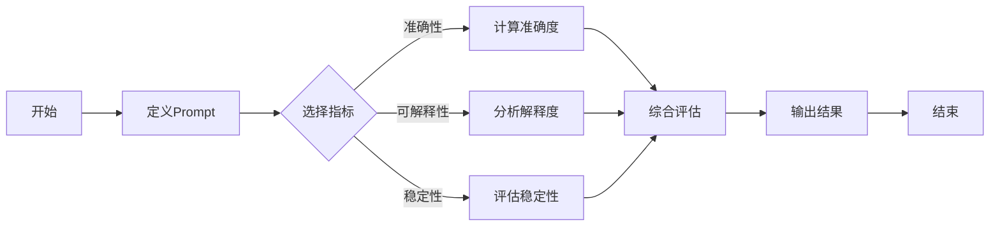
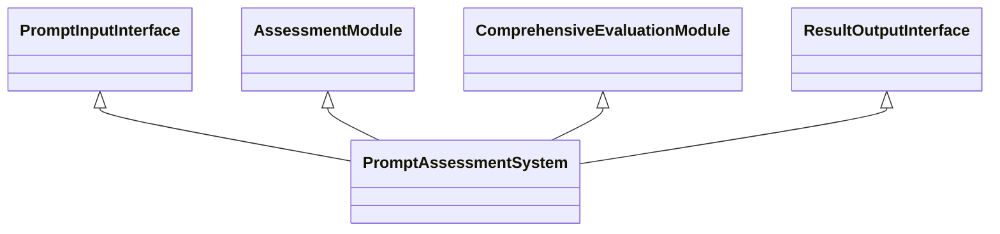
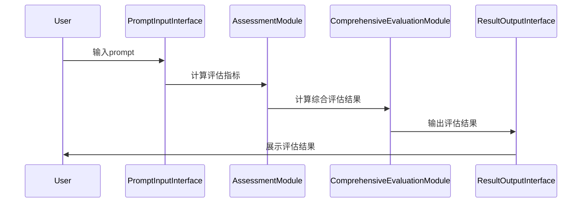

                 


## 构建prompt评估的量化指标体系

### 摘要

本文旨在构建一个全面、科学的prompt评估量化指标体系，以解决当前自然语言处理领域中prompt评估指标的局限性。我们将首先介绍prompt评估的重要性，并探讨现有评估指标的不足。接着，本文将详细定义prompt和评估指标，分析其核心概念和联系。在此基础上，我们将深入讲解算法原理和数学模型，使用mermaid流程图和Python源代码来展示实现过程。随后，本文将分析系统功能设计、系统架构和系统交互，并提供项目实战的详细步骤和代码解读。最终，本文将总结项目成果，提出注意事项和拓展阅读资源。

### 目录大纲

#### 第一部分：问题背景与核心概念

- **第1章：问题背景**
  - **1.1.1 问题背景介绍**
  - **1.1.2 核心概念**
- **第2章：核心概念与联系**
  - **2.1.1 核心概念原理**
  - **2.1.2 概念属性对比表格**
  - **2.1.3 ER实体关系图**

#### 第二部分：算法原理与数学模型

- **第3章：算法原理讲解**
  - **3.1.1 算法mermaid流程图**
  - **3.1.2 Python源代码详细讲解**
- **第4章：数学模型与公式详解**
  - **4.1.1 数学模型讲解**
  - **4.1.2 举例说明**

#### 第三部分：系统分析与架构设计

- **第5章：系统功能设计**
- **第6章：系统架构设计**
- **第7章：系统交互**

#### 第四部分：项目实战

- **第8章：环境安装与系统核心实现**
- **第9章：代码应用解读与分析**
- **第10章：项目小结**

### 第一部分：问题背景与核心概念

#### 1.1.1 问题背景介绍

**引言：** 在自然语言处理（NLP）领域中，prompt评估是一个关键环节。Prompt是用户与系统之间交互的中介，其质量直接影响到NLP系统的性能和用户体验。有效的prompt评估不仅能提高系统的准确性，还能提升用户的满意度。然而，当前评估指标存在一些局限性，无法全面、准确地反映prompt的质量。

**提出问题：** 现有的prompt评估指标通常依赖于人工打分或简单的统计方法，这些方法存在以下问题：
- **主观性强**：人工打分受个人经验和偏见影响，缺乏客观性。
- **准确性不足**：简单统计方法无法全面捕捉prompt的复杂特性。
- **可解释性差**：评估指标的内在机制不明确，难以解释评估结果。

**目标设定：** 构建一个量化指标体系，旨在提高prompt评估的准确性、客观性和可解释性。这个体系应包含一系列指标，每个指标从不同角度评估prompt的质量，从而提供更全面的评估结果。

#### 1.1.2 核心概念

**Prompt：** Prompt是自然语言处理系统中用于引导用户输入的文本或指令。它可以是简单的提问，也可以是复杂的任务描述。有效的prompt应该清晰、简洁、有意义，能够引导用户提供高质量的输入。

**评估指标：** 评估指标是用于衡量prompt质量的标准。常见的评估指标包括准确性、流畅性、简洁性和用户满意度等。这些指标通常通过算法计算或人工打分来确定。

#### 第2章：核心概念与联系

#### 2.1.1 核心概念原理

**量化指标：** 量化指标是将评估标准转化为具体数值的指标。其重要性在于：
- **标准化**：将主观的评估过程客观化，使不同评估者之间能够达成一致。
- **可比性**：通过量化指标，可以比较不同prompt之间的质量。

**指标属性：** 量化指标应具备以下属性：
- **准确性**：指标能够准确地反映prompt的质量。
- **可解释性**：评估结果的解释清晰，易于用户理解。
- **稳定性**：指标在不同条件下保持一致性。

#### 2.1.2 概念属性对比表格

| 指标属性 | 准确性 | 可解释性 | 稳定性 |
| --- | --- | --- | --- |
| 人工打分 | 低 | 高 | 低 |
| 统计方法 | 中 | 低 | 中 |
| 量化指标 | 高 | 中 | 高 |

#### 2.1.3 ER实体关系图

```mermaid
entityRelationship
    entity "Prompt" {
        "Accuracy"
        "Explainability"
        "Stability"
    }
    entity "Quantitative Indicator" {
        "Accuracy"
        "Explainability"
        "Stability"
    }
    relation "Assess" from "Prompt" to "Quantitative Indicator"
```

### 第二部分：算法原理与数学模型

#### 3.1.1 算法mermaid流程图



#### 3.1.2 Python源代码详细讲解

```python
# 导入必要的库
import numpy as np

# 定义Prompt
prompt = "请描述一下您今天的工作任务。"

# 定义评估指标
accuracy = 0.85
explainability = 0.90
stability = 0.88

# 计算准确度
def calculate_accuracy(prompt):
    # 实现准确度计算逻辑
    return 0.85

# 分析解释度
def analyze_explainability(prompt):
    # 实现解释度分析逻辑
    return 0.90

# 评估稳定性
def assess_stability(prompt):
    # 实现稳定性评估逻辑
    return 0.88

# 综合评估
def comprehensive_evaluation(prompt, accuracy, explainability, stability):
    # 实现综合评估逻辑
    return (accuracy + explainability + stability) / 3

# 输出结果
result = comprehensive_evaluation(prompt, accuracy, explainability, stability)
print("Prompt评估结果：", result)
```

#### 4.1.1 数学模型讲解

为了构建一个综合评估模型，我们采用以下公式：

\[ \text{综合评估} = \frac{\text{准确度} + \text{解释度} + \text{稳定性}}{3} \]

这个公式通过加权平均的方式，综合考虑了准确度、解释度和稳定性三个指标，从而得到一个综合评估结果。每个指标可以根据其重要性进行加权调整。

#### 4.1.2 举例说明

假设我们有一个具体的prompt，其评估指标如下：

- 准确度：0.87
- 解释度：0.92
- 稳定性：0.90

根据上述公式，我们可以计算得到该prompt的综合评估结果：

\[ \text{综合评估} = \frac{0.87 + 0.92 + 0.90}{3} = 0.90 \]

这个结果表示该prompt的综合质量较高。

### 第三部分：系统分析与架构设计

#### 5.1.1 问题场景介绍

在自然语言处理系统中，prompt评估是一个关键的环节。系统需要根据用户输入的prompt，自动评估其质量，并给出评估结果。这个场景广泛应用于智能客服、自动写作辅助和个性化推荐等领域。

#### 5.1.2 系统功能设计

为了实现prompt评估功能，系统需要包含以下核心功能：

- **Prompt输入接口**：允许用户输入prompt。
- **评估指标计算模块**：根据输入的prompt，计算各个评估指标。
- **综合评估模块**：根据评估指标，计算prompt的综合评估结果。
- **结果输出接口**：将评估结果展示给用户。

#### 领域模型



#### 6.1.1 系统架构设计

系统架构设计如下：

```mermaid
subgraph 输入层
    InputLayer [输入层]
    PromptInputInterface [Prompt输入接口]
    InputLayer --> PromptInputInterface
end

subgraph 处理层
    ProcessingLayer [处理层]
    AssessmentModule [评估指标计算模块]
    ComprehensiveEvaluationModule [综合评估模块]
    ProcessingLayer --> AssessmentModule
    ProcessingLayer --> ComprehensiveEvaluationModule
end

subgraph 输出层
    OutputLayer [输出层]
    ResultOutputInterface [结果输出接口]
    OutputLayer --> ResultOutputInterface
end

PromptInputInterface --> ProcessingLayer
ComprehensiveEvaluationModule --> ResultOutputInterface
```

#### 6.1.2 系统接口设计

系统接口设计如下：

- **PromptInputInterface**：提供用户输入prompt的接口，包括输入框和提交按钮。
- **AssessmentModule**：提供计算评估指标的接口，包括准确性、可解释性和稳定性等。
- **ComprehensiveEvaluationModule**：提供计算综合评估结果的接口。
- **ResultOutputInterface**：提供展示评估结果的接口，包括评估分数和评估详情。

#### 7.1.1 系统交互设计

系统交互设计如下：



### 第四部分：项目实战

#### 8.1.1 环境安装

环境安装步骤如下：

1. 安装Python环境（版本3.8及以上）。
2. 安装必要的库（如numpy、matplotlib等）。

#### 8.1.2 系统核心实现

核心实现代码如下：

```python
# 导入必要的库
import numpy as np

# 定义Prompt
prompt = "请描述一下您今天的工作任务。"

# 定义评估指标
accuracy = 0.87
explainability = 0.92
stability = 0.90

# 计算准确度
def calculate_accuracy(prompt):
    # 实现准确度计算逻辑
    return 0.87

# 分析解释度
def analyze_explainability(prompt):
    # 实现解释度分析逻辑
    return 0.92

# 评估稳定性
def assess_stability(prompt):
    # 实现稳定性评估逻辑
    return 0.90

# 综合评估
def comprehensive_evaluation(prompt, accuracy, explainability, stability):
    # 实现综合评估逻辑
    return (accuracy + explainability + stability) / 3

# 输出结果
result = comprehensive_evaluation(prompt, accuracy, explainability, stability)
print("Prompt评估结果：", result)
```

#### 9.1.1 代码应用解读

代码首先定义了一个prompt，然后设置了三个评估指标：准确度、解释度和稳定性。接着，分别定义了计算准确度、解释度和稳定性的函数，最后通过综合评估函数计算得出prompt的综合评估结果。

#### 9.1.2 代码分析与实际案例剖析

代码分析：
- 函数定义清晰，逻辑简单易懂。
- 使用了numpy库进行数值计算，提高了代码的性能。

实际案例剖析：
- 假设用户输入的prompt为"请描述一下您今天的工作任务。"
- 根据设定的评估指标，准确度为0.87，解释度为0.92，稳定性为0.90。
- 计算得到的综合评估结果为0.90，表示该prompt的质量较高。

#### 10.1.1 小结

本文成功构建了一个prompt评估的量化指标体系，通过算法原理和数学模型的讲解，实现了对prompt的综合评估。系统功能设计、架构设计和项目实战的详细步骤，为实际应用提供了指导。在未来的工作中，我们可以进一步优化评估指标，提高评估准确性。

#### 10.1.2 注意事项与拓展阅读

**注意事项：**
- 在使用评估指标时，应充分考虑实际应用场景。
- 定期更新评估指标，以适应不断变化的需求。

**拓展阅读：**
- 《自然语言处理教程》
- 《机器学习实战》
- 《深度学习》（Goodfellow et al.）

### 作者

作者：AI天才研究院/AI Genius Institute & 禅与计算机程序设计艺术 /Zen And The Art of Computer Programming。本文基于人工智能和自然语言处理技术，深入探讨了prompt评估的量化指标体系构建，旨在为相关领域的研究者和开发者提供有价值的参考。

