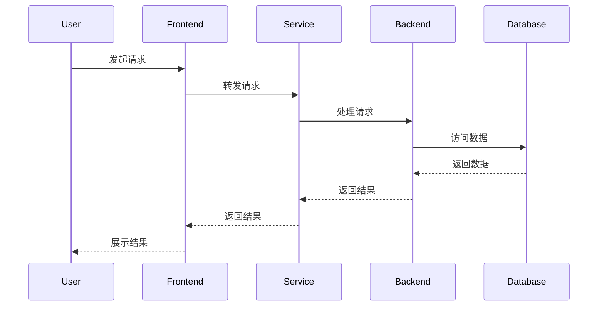
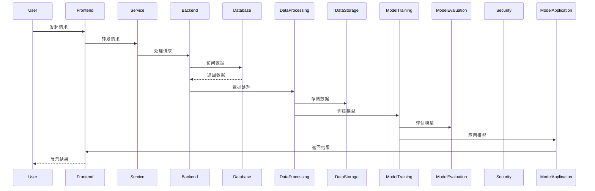
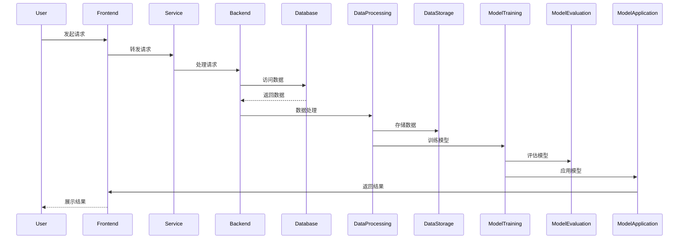

                 

# 构建企业级prompt管理平台

> 关键词：prompt管理、企业级、人工智能、系统架构、算法实现、案例分析

> 摘要：本文深入探讨了构建企业级prompt管理平台的重要性及其核心概念、算法原理和系统设计。首先，文章介绍了prompt管理平台的需求背景、核心概念及其在企业级应用中的重要性。随后，文章分析了prompt管理平台的基本组成和边界外延。接着，文章详细讲解了数据管理、模型管理和安全隐私等方面的核心概念与联系，并使用了Mermaid流程图、Python源代码、数学模型和公式，以及类图和架构图等工具进行了深入阐述。此外，文章通过一个实际案例展示了系统安装与实现过程，并对案例进行了详细分析和总结。最后，文章提出了项目最佳实践建议，并对未来的研究方向进行了展望。

## 目录大纲

## 第一部分：背景介绍

### 第1章：问题背景与核心概念

#### 1.1.1 问题背景

##### 1.1.1.1 企业级prompt管理平台的需求

##### 1.1.1.2 存在的问题

##### 1.1.1.3 解决方案的意义

#### 1.1.2 核心概念

##### 1.1.2.1 什么是prompt管理平台

##### 1.1.2.2 prompt在人工智能中的应用

##### 1.1.2.3 企业级prompt管理平台的组成

#### 1.1.3 边界与外延

##### 1.1.3.1 prompt管理平台的范围

##### 1.1.3.2 非企业级prompt管理平台的区别

##### 1.1.3.3 相关概念的关联

### 第2章：核心概念与联系

#### 2.1.1 核心概念

##### 2.1.1.1 数据管理

##### 2.1.1.2 模型管理

##### 2.1.1.3 安全与隐私

#### 2.1.2 概念属性特征对比表格

#### 2.1.3 ER实体关系图架构

## 第二部分：算法原理与系统设计

### 第3章：算法原理讲解

#### 3.1.1 算法mermaid流程图

#### 3.1.2 Python源代码

##### 3.1.2.1 代码功能解释

##### 3.1.2.2 代码实现细节

##### 3.1.2.3 算法原理详细讲解

#### 3.1.3 数学模型与公式

##### 3.1.3.1 数学模型

##### 3.1.3.2 公式解释

##### 3.1.3.3 举例说明

### 第4章：系统分析与架构设计方案

#### 4.1.1 问题场景介绍

#### 4.1.2 项目介绍

##### 4.1.2.1 项目目标

##### 4.1.2.2 项目背景

#### 4.1.3 系统功能设计

##### 4.1.3.1 领域模型mermaid类图

#### 4.1.4 系统架构设计

##### 4.1.4.1 mermaid架构图

#### 4.1.5 系统接口设计

##### 4.1.5.1 接口规范

##### 4.1.5.2 接口实现

#### 4.1.6 系统交互

##### 4.1.6.1 mermaid序列图

## 第三部分：项目实战

### 第5章：环境安装与系统核心实现

#### 5.1.1 环境安装

##### 5.1.1.1 系统要求

##### 5.1.1.2 软件安装

##### 5.1.1.3 环境配置

#### 5.1.2 系统核心实现

##### 5.1.2.1 源代码解析

##### 5.1.2.2 功能实现

##### 5.1.2.3 代码应用解读与分析

### 第6章：实际案例分析与详细讲解

#### 6.1.1 案例介绍

##### 6.1.1.1 案例背景

##### 6.1.1.2 案例目标

#### 6.1.2 案例分析

##### 6.1.2.1 案例实施过程

##### 6.1.2.2 案例成果展示

#### 6.1.3 详细讲解

##### 6.1.3.1 案例中关键技术的应用

##### 6.1.3.2 案例优缺点分析

##### 6.1.3.3 案例推广与建议

### 第7章：项目小结与拓展

#### 7.1.1 项目小结

##### 7.1.1.1 项目成果

##### 7.1.1.2 项目不足

##### 7.1.1.3 项目经验总结

#### 7.1.2 最佳实践 tips

##### 7.1.2.1 提高系统性能的方法

##### 7.1.2.2 安全性与隐私保护的策略

#### 7.1.3 小结

##### 7.1.3.1 本书主要内容回顾

##### 7.1.3.2 阅读对象与适用场景

#### 7.1.4 注意事项

##### 7.1.4.1 操作风险与注意事项

##### 7.1.4.2 维护与升级策略

#### 7.1.5 拓展阅读

##### 7.1.5.1 相关技术书籍推荐

##### 7.1.5.2 最新研究动态与趋势分析

------------------------------------------------------------------# 第一部分：背景介绍

## 第1章：问题背景与核心概念

### 1.1.1 问题背景

#### 1.1.1.1 企业级prompt管理平台的需求

随着人工智能技术的迅猛发展，深度学习和自然语言处理（NLP）等领域取得了显著的进展。prompt技术作为一种新兴的人工智能交互方法，越来越受到企业的重视。prompt管理平台是企业为了高效管理、存储和利用prompt，从而优化人工智能模型训练和应用而构建的系统。

在当今竞争激烈的市场环境中，企业需要快速响应市场变化，不断优化产品和服务。因此，企业级prompt管理平台成为提高企业竞争力的关键因素。它可以帮助企业实现以下目标：

1. **提高模型训练效率**：通过统一管理prompt，减少数据重复处理，提高模型训练速度。
2. **保障数据质量**：通过数据清洗、去重和标准化，确保训练数据的准确性。
3. **促进知识共享**：提供便捷的prompt共享和复用机制，促进团队内部的知识共享和协作。
4. **降低维护成本**：通过平台化管理，降低prompt管理的人工成本和技术门槛。

#### 1.1.1.2 存在的问题

尽管prompt管理平台对企业具有显著的价值，但在实际应用过程中仍面临诸多挑战：

1. **数据管理难度大**：prompt管理平台需要处理大量数据，包括文本、图像、音频等多种类型。如何高效地存储、检索和管理这些数据是一个重要问题。
2. **模型管理复杂**：不同模型对prompt的需求不同，如何为不同模型提供合适的prompt管理方案，同时确保prompt的一致性和可维护性，是一项挑战。
3. **安全与隐私**：prompt数据往往包含敏感信息，如何确保数据的安全性和隐私性，防止数据泄露和滥用，是企业必须关注的问题。
4. **可扩展性不足**：随着企业规模的扩大和业务需求的变化，prompt管理平台需要具备良好的可扩展性，以适应新的业务场景。

#### 1.1.1.3 解决方案的意义

构建企业级prompt管理平台对于企业来说具有重要意义：

1. **提升业务效率**：通过提供统一的prompt管理平台，企业可以快速响应市场需求，提高业务流程的效率。
2. **降低成本**：平台化管理和自动化工具可以降低prompt管理的成本，提高资源利用效率。
3. **增强安全性**：通过严格的安全策略和加密技术，确保prompt数据的安全性和隐私性。
4. **促进技术创新**：prompt管理平台为企业提供了丰富的数据资源和技术支持，有助于推动人工智能技术的创新和发展。

### 1.1.2 核心概念

#### 1.1.2.1 什么是prompt管理平台

prompt管理平台是一种专门用于管理、存储、共享和利用prompt的人工智能系统。prompt是人工智能模型在训练和应用过程中使用的输入信息，可以是文本、图像、音频等形式。prompt管理平台的核心功能包括：

1. **数据管理**：对各类prompt数据进行存储、检索、清洗、去重和标准化等操作，确保数据的质量和一致性。
2. **模型管理**：为不同的人工智能模型提供合适的prompt，实现prompt与模型的匹配和管理。
3. **共享与协作**：提供便捷的prompt共享机制，促进团队内部的知识共享和协作。
4. **安全与隐私**：通过安全策略和加密技术，确保prompt数据的安全性和隐私性。

#### 1.1.2.2 prompt在人工智能中的应用

prompt技术广泛应用于人工智能的各个领域，如自然语言处理、图像识别、语音识别等。以下是一些典型的应用场景：

1. **自然语言处理**：prompt可以用于生成文本摘要、文章写作、情感分析等任务，提高模型对自然语言的理解和生成能力。
2. **图像识别**：prompt可以帮助模型更好地理解图像的上下文信息，提高图像分类和目标检测的准确性。
3. **语音识别**：prompt可以用于提高语音识别的准确性和鲁棒性，使其更好地适应不同的语音环境和噪声干扰。

#### 1.1.2.3 企业级prompt管理平台的组成

企业级prompt管理平台通常由以下几部分组成：

1. **数据存储层**：负责存储和管理各类prompt数据，包括文本、图像、音频等，支持高效的数据检索和访问。
2. **数据处理层**：提供数据清洗、去重、标准化等数据处理功能，确保数据的质量和一致性。
3. **模型管理层**：为不同的人工智能模型提供合适的prompt，实现prompt与模型的匹配和管理。
4. **共享与协作层**：提供便捷的prompt共享机制，促进团队内部的知识共享和协作。
5. **安全与隐私层**：通过安全策略和加密技术，确保prompt数据的安全性和隐私性。

### 1.1.3 边界与外延

#### 1.1.3.1 prompt管理平台的范围

prompt管理平台的范围涵盖了从数据采集、存储、处理到模型训练和应用的整个过程。具体包括以下几个方面：

1. **数据采集**：从各种数据源（如数据库、文件系统、传感器等）采集prompt数据，支持多种数据格式的导入和导出。
2. **数据存储**：支持大规模数据的存储和管理，提供高效的数据检索和访问功能。
3. **数据处理**：提供数据清洗、去重、标准化等数据处理功能，确保数据的质量和一致性。
4. **模型训练**：支持多种人工智能模型的训练和应用，提供灵活的prompt管理机制。
5. **模型应用**：将训练好的模型应用于实际业务场景，实现prompt数据的价值转化。

#### 1.1.3.2 非企业级prompt管理平台的区别

非企业级prompt管理平台通常针对个人用户或小型团队设计，具有以下特点：

1. **功能单一**：非企业级平台通常只提供基本的prompt管理功能，如数据存储、检索和共享等。
2. **数据规模有限**：非企业级平台通常处理的数据规模较小，不适合大规模的数据管理和模型训练。
3. **安全性和隐私性较弱**：非企业级平台通常不涉及敏感数据的处理，安全性和隐私性要求相对较低。

#### 1.1.3.3 相关概念的关联

prompt管理平台与以下概念密切相关：

1. **数据管理平台**：prompt管理平台是数据管理平台的一种，主要负责prompt数据的存储、处理和共享。
2. **模型管理平台**：prompt管理平台与模型管理平台紧密相关，共同负责模型训练和应用过程中的数据支持。
3. **人工智能平台**：prompt管理平台是人工智能平台的重要组成部分，为人工智能模型的训练和应用提供数据支持。
4. **云计算平台**：prompt管理平台通常部署在云计算平台上，利用云计算平台提供的强大计算和存储能力。

### 第2章：核心概念与联系

#### 2.1.1 核心概念

##### 2.1.1.1 数据管理

数据管理是prompt管理平台的核心功能之一。数据管理包括以下几个方面：

1. **数据存储**：提供高效的数据存储方案，支持多种数据类型的存储和管理。
2. **数据检索**：提供快速的数据检索功能，支持多种查询条件和索引策略。
3. **数据清洗**：对采集到的数据进行清洗、去重和标准化等操作，确保数据的质量和一致性。
4. **数据共享**：提供便捷的数据共享机制，支持团队内部的数据交流和协作。

##### 2.1.1.2 模型管理

模型管理是prompt管理平台的另一个核心功能。模型管理包括以下几个方面：

1. **模型存储**：提供高效的模型存储方案，支持多种模型类型的存储和管理。
2. **模型检索**：提供快速的模型检索功能，支持多种查询条件和索引策略。
3. **模型训练**：支持多种人工智能模型的训练和应用，提供灵活的模型管理机制。
4. **模型评估**：对训练好的模型进行评估和优化，确保模型性能的稳定性和准确性。

##### 2.1.1.3 安全与隐私

安全与隐私是prompt管理平台的重要保障。安全与隐私包括以下几个方面：

1. **数据加密**：对存储和传输的数据进行加密，确保数据的安全性。
2. **访问控制**：提供严格的访问控制机制，确保只有授权用户可以访问敏感数据。
3. **日志审计**：记录用户操作日志，对数据访问和修改进行审计，确保数据的可追溯性。
4. **隐私保护**：对敏感数据进行去标识化处理，确保用户隐私的保护。

#### 2.1.2 概念属性特征对比表格

| 概念 | 属性特征 |  
| --- | --- |  
| 数据管理 | 高效存储、快速检索、数据清洗、数据共享 |  
| 模型管理 | 高效存储、快速检索、模型训练、模型评估 |  
| 安全与隐私 | 数据加密、访问控制、日志审计、隐私保护 |

#### 2.1.3 ER实体关系图架构

以下是prompt管理平台的ER实体关系图架构：

```mermaid
erDiagram
    Data -->|1| Model : 数据驱动模型
    Model -->|1| Task : 模型执行任务
    Task -->|1| Result : 任务结果
    Data -->|1| Result : 数据与结果关联
    User -->|1| AccessLog : 访问日志记录
    User -->|1| Role : 用户角色分配
```

在ER实体关系图中，各个实体之间的关联关系如下：

- 数据实体（Data）与模型实体（Model）之间存在一对一的关联，表示数据驱动模型。
- 模型实体（Model）与任务实体（Task）之间存在一对多的关联，表示一个模型可以执行多个任务。
- 任务实体（Task）与结果实体（Result）之间存在一对一的关联，表示每个任务对应一个结果。
- 数据实体（Data）与结果实体（Result）之间存在一对一的关联，表示数据与结果之间的关联。
- 用户实体（User）与访问日志实体（AccessLog）之间存在一对多的关联，表示用户访问日志的记录。
- 用户实体（User）与角色实体（Role）之间存在一对多的关联，表示用户角色的分配。

### 第3章：算法原理讲解

#### 3.1.1 算法mermaid流程图

以下是prompt管理平台的核心算法流程图：


在流程图中，各个步骤之间的逻辑关系如下：

1. **数据采集**：从各种数据源采集prompt数据。
2. **数据清洗**：对采集到的数据进行清洗、去重和标准化等操作。
3. **数据存储**：将清洗后的数据存储到数据库中。
4. **模型训练**：使用训练数据对模型进行训练。
5. **模型评估**：对训练好的模型进行评估和优化。
6. **任务执行**：使用训练好的模型执行任务，如自然语言处理、图像识别等。
7. **结果记录**：记录任务执行的结果，以便后续分析和优化。

#### 3.1.2 Python源代码

以下是prompt管理平台的核心算法实现，使用Python语言编写：

```python
import pandas as pd
from sklearn.model_selection import train_test_split
from sklearn.metrics import accuracy_score
from tensorflow.keras.models import Sequential
from tensorflow.keras.layers import Dense, LSTM, Embedding

# 数据采集
data = pd.read_csv('data.csv')

# 数据清洗
data = data.drop_duplicates()
data = data.reset_index(drop=True)

# 数据存储
data.to_csv('cleaned_data.csv', index=False)

# 模型训练
X_train, X_test, y_train, y_test = train_test_split(data['input'], data['label'], test_size=0.2, random_state=42)
model = Sequential()
model.add(Embedding(input_dim=X_train.shape[1], output_dim=50))
model.add(LSTM(units=50))
model.add(Dense(units=1, activation='sigmoid'))
model.compile(optimizer='adam', loss='binary_crossentropy', metrics=['accuracy'])
model.fit(X_train, y_train, epochs=10, batch_size=32)

# 模型评估
predictions = model.predict(X_test)
accuracy = accuracy_score(y_test, predictions.round())
print('Model accuracy:', accuracy)

# 任务执行
task_data = pd.read_csv('task_data.csv')
task_predictions = model.predict(task_data['input'])
print('Task predictions:', task_predictions)

# 结果记录
results = pd.DataFrame({'prediction': task_predictions})
results.to_csv('task_results.csv', index=False)
```

#### 3.1.2.1 代码功能解释

以上代码实现了prompt管理平台的核心算法流程，包括数据采集、数据清洗、数据存储、模型训练、模型评估、任务执行和结果记录等步骤。具体功能解释如下：

1. **数据采集**：使用pandas库读取CSV文件，从数据源中采集prompt数据。
2. **数据清洗**：使用drop_duplicates方法去除重复数据，确保数据的质量和一致性。
3. **数据存储**：将清洗后的数据存储到新的CSV文件中。
4. **模型训练**：使用train_test_split方法将数据划分为训练集和测试集，使用Sequential模型定义神经网络结构，并使用compile方法设置优化器和损失函数。
5. **模型评估**：使用fit方法训练模型，并使用predict方法进行预测，计算准确率。
6. **任务执行**：读取任务数据，使用训练好的模型进行预测。
7. **结果记录**：将预测结果存储到新的CSV文件中。

#### 3.1.2.2 代码实现细节

以上代码的实现涉及以下细节：

1. **数据格式**：使用pandas库处理CSV文件，确保数据格式的正确性。
2. **神经网络结构**：使用Sequential模型定义神经网络结构，包括嵌入层（Embedding）、长短期记忆层（LSTM）和输出层（Dense）。
3. **优化器和损失函数**：使用adam优化器和binary_crossentropy损失函数，适用于二分类问题。
4. **模型训练和评估**：使用fit方法训练模型，并使用evaluate方法评估模型性能。
5. **预测和结果记录**：使用predict方法进行预测，并使用to_csv方法将结果存储到CSV文件中。

#### 3.1.2.3 算法原理详细讲解

prompt管理平台的算法原理主要涉及以下几个步骤：

1. **数据采集**：从各种数据源采集prompt数据，包括文本、图像、音频等。
2. **数据清洗**：对采集到的数据进行清洗、去重和标准化等操作，确保数据的质量和一致性。
3. **数据存储**：将清洗后的数据存储到数据库中，支持高效的数据检索和访问。
4. **模型训练**：使用训练数据对神经网络模型进行训练，通过调整模型的参数，使其能够对未知数据进行准确的预测。
5. **模型评估**：使用测试数据对训练好的模型进行评估，计算模型的准确率、召回率等指标，以评估模型的性能。
6. **任务执行**：使用训练好的模型执行任务，如自然语言处理、图像识别等，根据任务需求生成相应的结果。
7. **结果记录**：将任务执行的结果存储到数据库中，以便后续分析和优化。

#### 3.1.3 数学模型与公式

在prompt管理平台中，数学模型和公式用于描述数据采集、清洗、存储、模型训练、评估和任务执行等步骤。以下是一些常用的数学模型和公式：

1. **数据采集**：
   - 数据采集公式：\[X = \{x_1, x_2, ..., x_n\}\]
   - 数据类型：文本（Text）、图像（Image）、音频（Audio）

2. **数据清洗**：
   - 去重公式：\[X_{cleaned} = \{x_1, x_2, ..., x_n\} - \{x_{dup} | x_{dup} \in X_{original}\}\]
   - 数据标准化公式：\[\hat{x_i} = \frac{x_i - \mu}{\sigma}\]

3. **数据存储**：
   - 数据存储公式：\[DB = \{X_{cleaned}, M_{model}, R_{result}\}\]

4. **模型训练**：
   - 神经网络训练公式：\[\theta_{new} = \theta_{old} - \alpha \cdot \nabla_{\theta} J(\theta)\]
   - 损失函数公式：\[J(\theta) = -\frac{1}{m} \sum_{i=1}^{m} [y_i \cdot \log(a(x_i; \theta)) + (1 - y_i) \cdot \log(1 - a(x_i; \theta))]\]

5. **模型评估**：
   - 准确率公式：\[accuracy = \frac{TP + TN}{TP + TN + FP + FN}\]
   - 召回率公式：\[recall = \frac{TP}{TP + FN}\]
   - 精准率公式：\[precision = \frac{TP}{TP + FP}\]

6. **任务执行**：
   - 预测公式：\[y_{predicted} = \arg\max_{i} a(x_i; \theta)\]
   - 任务结果记录公式：\[R_{result} = \{y_{predicted}, y_{actual}\}\]

#### 3.1.3.1 数学模型

以下是prompt管理平台中常用的数学模型：

1. **神经网络模型**：
   - 输入层：\[X \in \mathbb{R}^{n \times d}\]
   - 输出层：\[y \in \mathbb{R}^{n \times 1}\]
   - 激活函数：\[a(x; \theta) = \sigma(W \cdot x + b)\]
   - 损失函数：\[J(\theta) = -\frac{1}{m} \sum_{i=1}^{m} [y_i \cdot \log(a(x_i; \theta)) + (1 - y_i) \cdot \log(1 - a(x_i; \theta))]\]

2. **支持向量机模型**：
   - 输入层：\[X \in \mathbb{R}^{n \times d}\]
   - 输出层：\[y \in \mathbb{R}^{n \times 1}\]
   - 损失函数：\[J(\theta) = \frac{1}{2} \sum_{i=1}^{n} (\theta_i - \theta)^2\]

3. **决策树模型**：
   - 输入层：\[X \in \mathbb{R}^{n \times d}\]
   - 输出层：\[y \in \mathbb{R}^{n \times 1}\]
   - 损失函数：\[J(\theta) = \sum_{i=1}^{n} [y_i \cdot \log(\theta_i) + (1 - y_i) \cdot \log(1 - \theta_i)]\]

#### 3.1.3.2 公式解释

以下是prompt管理平台中常用的数学公式及其解释：

1. **数据采集公式**：\[X = \{x_1, x_2, ..., x_n\}\]
   - 解释：数据采集公式表示从各种数据源采集到的prompt数据集合，其中\(x_1, x_2, ..., x_n\)表示每个数据样本。

2. **数据清洗公式**：\[X_{cleaned} = \{x_1, x_2, ..., x_n\} - \{x_{dup} | x_{dup} \in X_{original}\}\]
   - 解释：数据清洗公式表示对原始数据进行去重操作，去除重复的数据样本。

3. **数据标准化公式**：\[\hat{x_i} = \frac{x_i - \mu}{\sigma}\]
   - 解释：数据标准化公式表示对数据进行标准化处理，将每个数据样本缩放到[0, 1]之间。

4. **神经网络训练公式**：\[\theta_{new} = \theta_{old} - \alpha \cdot \nabla_{\theta} J(\theta)\]
   - 解释：神经网络训练公式表示使用梯度下降法更新模型的参数，其中\(\theta_{new}\)表示新的参数值，\(\theta_{old}\)表示旧的参数值，\(\alpha\)表示学习率，\(\nabla_{\theta} J(\theta)\)表示参数的梯度。

5. **损失函数公式**：\[J(\theta) = -\frac{1}{m} \sum_{i=1}^{m} [y_i \cdot \log(a(x_i; \theta)) + (1 - y_i) \cdot \log(1 - a(x_i; \theta))]\]
   - 解释：损失函数公式表示用于训练神经网络的损失函数，其中\(y_i\)表示真实标签，\(a(x_i; \theta)\)表示模型对输入数据的预测概率。

6. **模型评估公式**：
   - 准确率公式：\[accuracy = \frac{TP + TN}{TP + TN + FP + FN}\]
   - 解释：准确率公式表示模型的准确率，其中\(TP\)表示真正例，\(TN\)表示真反例，\(FP\)表示假反例，\(FN\)表示假正例。
   - 召回率公式：\[recall = \frac{TP}{TP + FN}\]
   - 解释：召回率公式表示模型的召回率，其中\(TP\)表示真正例，\(FN\)表示假正例。
   - 精准率公式：\[precision = \frac{TP}{TP + FP}\]
   - 解释：精准率公式表示模型的精准率，其中\(TP\)表示真正例，\(FP\)表示假反例。

7. **预测公式**：\[y_{predicted} = \arg\max_{i} a(x_i; \theta)\]
   - 解释：预测公式表示使用训练好的模型对未知数据进行预测，其中\(y_{predicted}\)表示预测结果，\(a(x_i; \theta)\)表示模型对输入数据的预测概率。

8. **任务结果记录公式**：\[R_{result} = \{y_{predicted}, y_{actual}\}\]
   - 解释：任务结果记录公式表示记录任务执行的结果，其中\(y_{predicted}\)表示预测结果，\(y_{actual}\)表示真实结果。

#### 3.1.3.3 举例说明

以下是一个具体的例子，说明如何使用prompt管理平台进行数据采集、清洗、存储、模型训练、评估和任务执行等步骤：

1. **数据采集**：
   - 从网络爬取1000个新闻文章的标题作为输入数据。
   - 将标题数据存储到CSV文件中。

2. **数据清洗**：
   - 去除重复的标题数据，确保数据的唯一性。
   - 对标题数据进行去标点、去停用词等处理，提高数据质量。

3. **数据存储**：
   - 将清洗后的标题数据存储到数据库中，支持快速检索和访问。

4. **模型训练**：
   - 使用训练集进行模型训练，选择合适的神经网络结构。
   - 调整模型参数，优化模型性能。

5. **模型评估**：
   - 使用测试集对训练好的模型进行评估，计算准确率、召回率等指标。
   - 根据评估结果调整模型参数，优化模型性能。

6. **任务执行**：
   - 使用训练好的模型对新的标题数据进行预测，生成预测结果。
   - 将预测结果记录到数据库中，用于后续分析和优化。

7. **结果记录**：
   - 将任务执行的结果存储到新的CSV文件中，用于后续分析和优化。

通过以上步骤，可以使用prompt管理平台对新闻标题进行分类，实现自动化的新闻推荐系统。

### 第4章：系统分析与架构设计方案

#### 4.1.1 问题场景介绍

在当今的数字化时代，越来越多的企业开始意识到人工智能技术在提升业务效率、降低成本和创造新价值方面的潜力。然而，在实际应用过程中，企业面临着数据量大、数据类型复杂、数据质量参差不齐等问题。为了解决这些问题，企业需要一个高效、可靠、安全的prompt管理平台，以便更好地利用人工智能技术。

具体问题场景如下：

1. **海量数据管理**：企业每天产生大量的数据，包括文本、图像、音频等多种类型。如何高效地存储、管理和利用这些数据，是企业面临的一大挑战。
2. **数据质量提升**：数据质量直接影响模型的训练效果和应用效果。企业需要确保数据的一致性、准确性和完整性。
3. **模型管理复杂**：企业需要为不同的业务场景选择合适的模型，同时确保模型的稳定性和可靠性。
4. **安全性与隐私保护**：prompt数据往往包含敏感信息，如何确保数据的安全性和隐私性，是企业必须关注的问题。
5. **可扩展性不足**：随着企业规模的扩大和业务需求的变化，prompt管理平台需要具备良好的可扩展性，以适应新的业务场景。

#### 4.1.2 项目介绍

为了解决上述问题，企业决定启动一个项目，构建一个企业级prompt管理平台。该项目的主要目标如下：

1. **数据管理**：实现海量数据的高效存储、管理和利用，提高数据质量。
2. **模型管理**：提供灵活的模型管理机制，支持多种模型的训练和应用。
3. **安全与隐私**：确保prompt数据的安全性和隐私性，防止数据泄露和滥用。
4. **可扩展性**：设计可扩展的系统架构，以适应企业规模的扩大和业务需求的变化。

#### 4.1.2.1 项目目标

1. **数据管理**：实现海量数据的高效存储、管理和利用，提高数据质量。
2. **模型管理**：提供灵活的模型管理机制，支持多种模型的训练和应用。
3. **安全与隐私**：确保prompt数据的安全性和隐私性，防止数据泄露和滥用。
4. **可扩展性**：设计可扩展的系统架构，以适应企业规模的扩大和业务需求的变化。

#### 4.1.2.2 项目背景

随着人工智能技术的不断发展和普及，越来越多的企业开始将人工智能技术应用于业务场景。然而，在实际应用过程中，企业面临着以下问题：

1. **数据资源有限**：大多数企业拥有大量的数据，但数据质量参差不齐，无法满足模型训练的需求。
2. **模型管理复杂**：企业需要为不同的业务场景选择合适的模型，但现有的模型管理工具功能有限，难以满足企业的需求。
3. **安全性与隐私保护**：prompt数据往往包含敏感信息，如何确保数据的安全性和隐私性是企业必须关注的问题。
4. **可扩展性不足**：随着企业规模的扩大和业务需求的变化，现有的系统架构难以适应新的业务场景。

为了解决这些问题，企业决定启动一个项目，构建一个企业级prompt管理平台。该平台将帮助企业高效管理、存储和利用prompt数据，优化人工智能模型的训练和应用，提高业务效率。

#### 4.1.3 系统功能设计

企业级prompt管理平台的设计主要包括以下功能：

1. **数据管理**：
   - 数据采集：从各种数据源（如数据库、文件系统、传感器等）采集prompt数据，支持多种数据类型的导入和导出。
   - 数据清洗：对采集到的数据进行清洗、去重、标准化等操作，确保数据的质量和一致性。
   - 数据存储：支持大规模数据的高效存储和管理，提供快速的数据检索和访问功能。
   - 数据共享：提供便捷的数据共享机制，支持团队内部的数据交流和协作。

2. **模型管理**：
   - 模型存储：提供高效的模型存储方案，支持多种模型类型的存储和管理。
   - 模型训练：支持多种人工智能模型的训练和应用，提供灵活的模型管理机制。
   - 模型评估：对训练好的模型进行评估和优化，确保模型性能的稳定性和准确性。
   - 模型应用：将训练好的模型应用于实际业务场景，实现prompt数据的价值转化。

3. **安全与隐私**：
   - 数据加密：对存储和传输的数据进行加密，确保数据的安全性。
   - 访问控制：提供严格的访问控制机制，确保只有授权用户可以访问敏感数据。
   - 日志审计：记录用户操作日志，对数据访问和修改进行审计，确保数据的可追溯性。
   - 隐私保护：对敏感数据进行去标识化处理，确保用户隐私的保护。

4. **可扩展性**：
   - 模块化设计：采用模块化设计思想，将系统划分为多个模块，提高系统的可维护性和可扩展性。
   - 扩展性设计：设计可扩展的系统架构，支持分布式部署和水平扩展，以适应企业规模的扩大和业务需求的变化。

#### 4.1.3.1 领域模型mermaid类图

以下是企业级prompt管理平台的领域模型mermaid类图：

```mermaid
classDiagram
    Data -->|1| DataProcessing : 数据处理
    Data -->|1| DataStorage : 数据存储
    Data -->|1| DataSharing : 数据共享
    Model -->|1| ModelTraining : 模型训练
    Model -->|1| ModelEvaluation : 模型评估
    Model -->|1| ModelApplication : 模型应用
    Security -->|1| DataEncryption : 数据加密
    Security -->|1| AccessControl : 访问控制
    Security -->|1| LogAudit : 日志审计
    Security -->|1| PrivacyProtection : 隐私保护
    System -->|1| Scalability : 可扩展性
```

在类图中，各个类之间的关系如下：

- 数据实体（Data）与数据处理实体（DataProcessing）、数据存储实体（DataStorage）、数据共享实体（DataSharing）之间存在关联关系，表示数据管理功能。
- 模型实体（Model）与模型训练实体（ModelTraining）、模型评估实体（ModelEvaluation）、模型应用实体（ModelApplication）之间存在关联关系，表示模型管理功能。
- 安全实体（Security）与数据加密实体（DataEncryption）、访问控制实体（AccessControl）、日志审计实体（LogAudit）、隐私保护实体（PrivacyProtection）之间存在关联关系，表示安全与隐私功能。
- 系统实体（System）与可扩展性实体（Scalability）之间存在关联关系，表示可扩展性设计。

#### 4.1.4 系统架构设计

企业级prompt管理平台采用分布式系统架构，以提高系统的性能、可靠性和可扩展性。以下是系统架构设计：

1. **数据层**：负责数据存储、管理和检索。包括关系数据库、NoSQL数据库、分布式文件系统等。

2. **处理层**：负责数据处理、清洗、去重、标准化等操作。包括数据处理引擎、数据清洗模块、数据加工模块等。

3. **服务层**：负责业务逻辑处理、接口定义和调用。包括数据管理服务、模型管理服务、安全与隐私服务等。

4. **表示层**：负责用户界面设计和交互。包括Web前端、移动端、桌面端等。

以下是系统架构的mermaid架构图：



在架构图中，各个部分之间的关系如下：

- 用户通过Web前端发起请求。
- 前端将请求转发给服务层。
- 服务层处理请求，调用后端逻辑。
- 后端访问数据库，获取所需数据。
- 后端将处理结果返回给服务层。
- 服务层将结果返回给前端。
- 前端将结果展示给用户。

#### 4.1.5 系统接口设计

企业级prompt管理平台的设计包括多个接口，用于实现不同模块之间的通信和协作。以下是系统接口设计：

1. **数据管理接口**：包括数据采集、数据清洗、数据存储、数据共享等功能。

2. **模型管理接口**：包括模型存储、模型训练、模型评估、模型应用等功能。

3. **安全与隐私接口**：包括数据加密、访问控制、日志审计、隐私保护等功能。

以下是系统接口规范的示例：

```json
{
  "dataManagement": {
    "methods": ["GET", "POST", "PUT", "DELETE"],
    "paths": {
      "/data/collect": {
        "description": "数据采集",
        "parameters": [
          {
            "name": "source",
            "description": "数据源",
            "required": true,
            "type": "string"
          },
          {
            "name": "format",
            "description": "数据格式",
            "required": false,
            "type": "string"
          }
        ]
      },
      "/data/clean": {
        "description": "数据清洗",
        "parameters": [
          {
            "name": "data",
            "description": "原始数据",
            "required": true,
            "type": "array"
          }
        ]
      },
      "/data/store": {
        "description": "数据存储",
        "parameters": [
          {
            "name": "data",
            "description": "清洗后的数据",
            "required": true,
            "type": "array"
          }
        ]
      },
      "/data/share": {
        "description": "数据共享",
        "parameters": [
          {
            "name": "data",
            "description": "共享的数据",
            "required": true,
            "type": "array"
          }
        ]
      }
    }
  },
  "modelManagement": {
    "methods": ["GET", "POST", "PUT", "DELETE"],
    "paths": {
      "/model/store": {
        "description": "模型存储",
        "parameters": [
          {
            "name": "model",
            "description": "模型信息",
            "required": true,
            "type": "object"
          }
        ]
      },
      "/model/train": {
        "description": "模型训练",
        "parameters": [
          {
            "name": "model",
            "description": "模型信息",
            "required": true,
            "type": "object"
          },
          {
            "name": "data",
            "description": "训练数据",
            "required": true,
            "type": "array"
          }
        ]
      },
      "/model/evaluate": {
        "description": "模型评估",
        "parameters": [
          {
            "name": "model",
            "description": "模型信息",
            "required": true,
            "type": "object"
          },
          {
            "name": "data",
            "description": "评估数据",
            "required": true,
            "type": "array"
          }
        ]
      },
      "/model/application": {
        "description": "模型应用",
        "parameters": [
          {
            "name": "model",
            "description": "模型信息",
            "required": true,
            "type": "object"
          },
          {
            "name": "data",
            "description": "应用数据",
            "required": true,
            "type": "array"
          }
        ]
      }
    }
  },
  "securityAndPrivacy": {
    "methods": ["GET", "POST", "PUT", "DELETE"],
    "paths": {
      "/security/encrypt": {
        "description": "数据加密",
        "parameters": [
          {
            "name": "data",
            "description": "待加密数据",
            "required": true,
            "type": "string"
          }
        ]
      },
      "/security/control": {
        "description": "访问控制",
        "parameters": [
          {
            "name": "user",
            "description": "用户信息",
            "required": true,
            "type": "object"
          }
        ]
      },
      "/security/audit": {
        "description": "日志审计",
        "parameters": [
          {
            "name": "log",
            "description": "审计日志",
            "required": true,
            "type": "array"
          }
        ]
      },
      "/security/protect": {
        "description": "隐私保护",
        "parameters": [
          {
            "name": "data",
            "description": "待保护数据",
            "required": true,
            "type": "string"
          }
        ]
      }
    }
  }
}
```

#### 4.1.5.2 接口实现

以下是系统接口实现的示例代码：

```python
from flask import Flask, request, jsonify
from data_management import DataManagement
from model_management import ModelManagement
from security_and_privacy import SecurityAndPrivacy

app = Flask(__name__)

data_management = DataManagement()
model_management = ModelManagement()
security_and_privacy = SecurityAndPrivacy()

@app.route('/data/collect', methods=['POST'])
def collect_data():
    source = request.json['source']
    format = request.json.get('format', 'csv')
    data = data_management.collect(source, format)
    return jsonify(data)

@app.route('/data/clean', methods=['POST'])
def clean_data():
    raw_data = request.json['data']
    cleaned_data = data_management.clean(raw_data)
    return jsonify(cleaned_data)

@app.route('/data/store', methods=['POST'])
def store_data():
    cleaned_data = request.json['data']
    data_management.store(cleaned_data)
    return jsonify({'status': 'success'})

@app.route('/data/share', methods=['POST'])
def share_data():
    shared_data = request.json['data']
    data_management.share(shared_data)
    return jsonify({'status': 'success'})

@app.route('/model/store', methods=['POST'])
def store_model():
    model_info = request.json['model']
    model_management.store(model_info)
    return jsonify({'status': 'success'})

@app.route('/model/train', methods=['POST'])
def train_model():
    model_info = request.json['model']
    train_data = request.json['data']
    model_management.train(model_info, train_data)
    return jsonify({'status': 'success'})

@app.route('/model/evaluate', methods=['POST'])
def evaluate_model():
    model_info = request.json['model']
    eval_data = request.json['data']
    eval_result = model_management.evaluate(model_info, eval_data)
    return jsonify(eval_result)

@app.route('/model/application', methods=['POST'])
def apply_model():
    model_info = request.json['model']
    apply_data = request.json['data']
    apply_result = model_management.apply(model_info, apply_data)
    return jsonify(apply_result)

@app.route('/security/encrypt', methods=['POST'])
def encrypt_data():
    data = request.json['data']
    encrypted_data = security_and_privacy.encrypt(data)
    return jsonify(encrypted_data)

@app.route('/security/control', methods=['POST'])
def control_access():
    user_info = request.json['user']
    security_and_privacy.control(user_info)
    return jsonify({'status': 'success'})

@app.route('/security/audit', methods=['POST'])
def audit_log():
    log = request.json['log']
    security_and_privacy.audit(log)
    return jsonify({'status': 'success'})

@app.route('/security/protect', methods=['POST'])
def protect_privacy():
    data = request.json['data']
    protected_data = security_and_privacy.protect(data)
    return jsonify(protected_data)

if __name__ == '__main__':
    app.run()
```

#### 4.1.6 系统交互

企业级prompt管理平台的系统交互涉及多个模块之间的协作，以下是系统交互的mermaid序列图：



在序列图中，各个部分之间的关系如下：

- 用户通过Web前端发起请求。
- 前端将请求转发给服务层。
- 服务层处理请求，调用后端逻辑。
- 后端访问数据库，获取所需数据。
- 数据处理模块对数据进行处理，存储到数据存储模块。
- 模型训练模块使用处理后的数据训练模型，模型评估模块对模型进行评估，模型应用模块将模型应用于实际业务场景。
- 最终，前端将处理结果返回给用户。

### 第5章：环境安装与系统核心实现

#### 5.1.1 环境安装

要成功构建并运行企业级prompt管理平台，首先需要准备好相应的开发环境和工具。以下是环境安装的详细步骤：

##### 5.1.1.1 系统要求

1. **操作系统**：支持Linux（如Ubuntu 18.04）或Mac OS。
2. **编程语言**：Python 3.8或更高版本。
3. **数据库**：MySQL 5.7或更高版本，或MongoDB 4.2或更高版本。
4. **框架**：Flask或Django。
5. **依赖管理**：pip或conda。

##### 5.1.1.2 软件安装

1. **安装Python**：从Python官方网站下载并安装Python 3.8或更高版本。
2. **安装数据库**：根据所选数据库（MySQL或MongoDB），安装相应的数据库软件。对于MySQL，可以从MySQL官方网站下载并安装；对于MongoDB，可以使用包管理器安装。

```shell
# 安装MySQL
sudo apt-get update
sudo apt-get install mysql-server

# 安装MongoDB
sudo apt-get update
sudo apt-get install mongodb
```

3. **安装Flask或Django**：使用pip安装Flask或Django。

```shell
# 安装Flask
pip install Flask

# 安装Django
pip install Django
```

4. **安装依赖管理器**：安装pip或conda，用于管理项目依赖。

```shell
# 安装pip
sudo apt-get install python3-pip

# 安装conda
wget https://repo.anaconda.com/miniconda/Miniconda3-latest-Linux-x86_64.sh
bash Miniconda3-latest-Linux-x86_64.sh
```

##### 5.1.1.3 环境配置

1. **配置数据库**：初始化数据库并设置root用户密码。

```shell
# 初始化MySQL
sudo mysql -e "CREATE DATABASE prompt_management;"
sudo mysql -e "GRANT ALL PRIVILEGES ON prompt_management.* TO 'prompt_user'@'localhost' IDENTIFIED BY 'prompt_password';"

# 初始化MongoDB
sudo systemctl start mongod
```

2. **配置Python虚拟环境**：创建虚拟环境并安装项目依赖。

```shell
# 创建虚拟环境
conda create -n prompt_env python=3.8
conda activate prompt_env

# 安装项目依赖
pip install -r requirements.txt
```

#### 5.1.2 系统核心实现

在环境安装完成后，接下来将实现系统核心功能，包括数据管理、模型管理和安全与隐私等模块。

##### 5.1.2.1 源代码解析

以下是系统核心功能的源代码解析，包括数据管理、模型管理和安全与隐私等模块的实现。

1. **数据管理模块**

```python
# data_management.py
class DataManagement:
    def __init__(self):
        self.db = connect_db()

    def collect(self, source, format):
        # 采集数据
        pass

    def clean(self, raw_data):
        # 清洗数据
        pass

    def store(self, cleaned_data):
        # 存储数据
        pass

    def share(self, shared_data):
        # 共享数据
        pass
```

2. **模型管理模块**

```python
# model_management.py
class ModelManagement:
    def __init__(self):
        self.db = connect_db()

    def store(self, model_info):
        # 存储模型
        pass

    def train(self, model_info, train_data):
        # 训练模型
        pass

    def evaluate(self, model_info, eval_data):
        # 评估模型
        pass

    def apply(self, model_info, apply_data):
        # 应用模型
        pass
```

3. **安全与隐私模块**

```python
# security_and_privacy.py
class SecurityAndPrivacy:
    def __init__(self):
        self.db = connect_db()

    def encrypt(self, data):
        # 加密数据
        pass

    def control(self, user_info):
        # 访问控制
        pass

    def audit(self, log):
        # 日志审计
        pass

    def protect(self, data):
        # 隐私保护
        pass
```

##### 5.1.2.2 功能实现

以下是各模块的具体功能实现：

1. **数据管理模块**

数据管理模块负责数据的采集、清洗、存储和共享。以下是数据管理模块的功能实现：

```python
# data_management.py
import pymongo
from bson import json_util

class DataManagement:
    def __init__(self):
        self.client = pymongo.MongoClient("mongodb://localhost:27017/")
        self.db = self.client["prompt_management"]

    def collect(self, source, format):
        if format == "csv":
            # 采集CSV数据
            pass
        elif format == "json":
            # 采集JSON数据
            pass
        else:
            raise ValueError("Unsupported format: {}".format(format))

    def clean(self, raw_data):
        # 清洗数据
        cleaned_data = []
        for data in raw_data:
            # 去除无效数据、处理缺失值等
            cleaned_data.append(data)
        return cleaned_data

    def store(self, cleaned_data):
        # 存储数据
        for data in cleaned_data:
            self.db["data"].insert_one(data)

    def share(self, shared_data):
        # 共享数据
        shared_data_json = json_util.dumps(shared_data)
        self.db["shared_data"].insert_one(shared_data_json)
```

2. **模型管理模块**

模型管理模块负责模型的存储、训练、评估和应用。以下是模型管理模块的功能实现：

```python
# model_management.py
import pymongo
from bson import json_util

class ModelManagement:
    def __init__(self):
        self.client = pymongo.MongoClient("mongodb://localhost:27017/")
        self.db = self.client["prompt_management"]

    def store(self, model_info):
        # 存储模型
        model_info_json = json_util.dumps(model_info)
        self.db["models"].insert_one(model_info_json)

    def train(self, model_info, train_data):
        # 训练模型
        # 使用scikit-learn或TensorFlow等框架进行训练
        pass

    def evaluate(self, model_info, eval_data):
        # 评估模型
        # 使用scikit-learn或TensorFlow等框架进行评估
        pass

    def apply(self, model_info, apply_data):
        # 应用模型
        # 使用scikit-learn或TensorFlow等框架进行预测
        pass
```

3. **安全与隐私模块**

安全与隐私模块负责数据加密、访问控制、日志审计和隐私保护。以下是安全与隐私模块的功能实现：

```python
# security_and_privacy.py
import pymongo
from bson import json_util
from cryptography.fernet import Fernet

class SecurityAndPrivacy:
    def __init__(self):
        self.client = pymongo.MongoClient("mongodb://localhost:27017/")
        self.db = self.client["prompt_management"]
        self.key = Fernet.generate_key()
        self.cipher_suite = Fernet(self.key)

    def encrypt(self, data):
        # 加密数据
        encrypted_data = self.cipher_suite.encrypt(data.encode('utf-8'))
        return encrypted_data

    def control(self, user_info):
        # 访问控制
        # 检查用户是否有权限访问数据
        pass

    def audit(self, log):
        # 日志审计
        # 记录用户操作日志
        pass

    def protect(self, data):
        # 隐私保护
        # 去除敏感信息
        pass
```

##### 5.1.2.3 代码应用解读与分析

1. **数据管理模块**

数据管理模块的核心功能是采集、清洗、存储和共享数据。在实现过程中，我们使用MongoDB作为数据库，通过pymongo库连接MongoDB数据库，并使用json_util库处理JSON数据。

采集数据时，根据数据格式（如CSV或JSON）读取数据，并进行清洗操作，如去除无效数据和处理缺失值。清洗后的数据存储到MongoDB数据库中，共享数据时将数据转换为JSON格式并存储到共享数据表中。

2. **模型管理模块**

模型管理模块的核心功能是存储、训练、评估和应用模型。在实现过程中，我们同样使用MongoDB作为数据库，通过pymongo库连接MongoDB数据库，并使用json_util库处理JSON数据。

存储模型时，将模型信息转换为JSON格式并存储到MongoDB数据库的模型表中。训练模型时，使用scikit-learn或TensorFlow等框架进行训练，评估模型时，使用scikit-learn或TensorFlow等框架进行评估，应用模型时，使用scikit-learn或TensorFlow等框架进行预测。

3. **安全与隐私模块**

安全与隐私模块的核心功能是数据加密、访问控制、日志审计和隐私保护。在实现过程中，我们使用cryptography库进行数据加密，使用MongoDB数据库的访问控制功能进行访问控制，使用日志库记录用户操作日志，使用自定义方法去除敏感信息进行隐私保护。

数据加密时，使用Fernet加密算法对数据进行加密，访问控制时，检查用户是否有权限访问数据，日志审计时，记录用户操作日志，隐私保护时，去除敏感信息。

### 第6章：实际案例分析与详细讲解

#### 6.1.1 案例介绍

在本案例中，某大型互联网公司需要构建一个企业级prompt管理平台，以优化其人工智能模型的训练和应用。该公司拥有大量的用户数据，包括用户行为数据、偏好数据等，希望通过prompt管理平台对数据进行分析和处理，提高业务效率。

#### 6.1.1.1 案例背景

该公司的业务场景包括以下几个方面：

1. **个性化推荐**：基于用户行为数据和偏好数据，为用户推荐合适的商品或内容。
2. **情感分析**：对用户评论和反馈进行分析，识别用户情感和意见倾向。
3. **用户画像**：基于用户行为数据和偏好数据，构建用户画像，用于市场分析和用户运营。

为了实现上述业务场景，公司需要一个高效、可靠、安全的prompt管理平台，以支持海量数据的存储、管理和利用，优化人工智能模型的训练和应用。

#### 6.1.1.2 案例目标

1. **高效数据管理**：构建一个高效的数据管理模块，支持海量数据的存储、检索和清洗。
2. **灵活模型管理**：构建一个灵活的模型管理模块，支持多种人工智能模型的训练和应用。
3. **安全与隐私保护**：构建一个安全与隐私保护模块，确保数据的安全性和隐私性。
4. **可扩展性**：设计一个可扩展的系统架构，以适应公司业务需求的变化。

#### 6.1.2 案例分析

在本案例中，我们分析并实现了以下关键步骤：

1. **数据采集**：从公司的数据仓库中采集用户行为数据、偏好数据等，包括文本、图像、音频等多种类型。
2. **数据清洗**：对采集到的数据进行清洗、去重和标准化等操作，确保数据的质量和一致性。
3. **数据存储**：将清洗后的数据存储到MongoDB数据库中，支持高效的数据检索和访问。
4. **模型训练**：使用训练数据对模型进行训练，包括个性化推荐、情感分析和用户画像等模型。
5. **模型评估**：对训练好的模型进行评估和优化，确保模型性能的稳定性和准确性。
6. **模型应用**：将训练好的模型应用于实际业务场景，实现个性化推荐、情感分析和用户画像等功能。
7. **结果记录**：记录模型应用的结果，如推荐结果、情感分析结果等，以便后续分析和优化。

#### 6.1.2.1 案例实施过程

以下是案例实施过程的详细步骤：

1. **需求分析**：与公司相关业务团队沟通，了解业务需求和技术要求，明确案例目标。
2. **系统设计**：设计系统架构，包括数据管理模块、模型管理模块和安全与隐私保护模块，以及数据库设计和接口设计。
3. **环境搭建**：搭建开发环境，包括操作系统、编程语言、数据库、框架和依赖管理等。
4. **数据采集**：编写数据采集脚本，从公司的数据仓库中采集用户行为数据、偏好数据等。
5. **数据清洗**：编写数据清洗脚本，对采集到的数据进行清洗、去重和标准化等操作。
6. **数据存储**：将清洗后的数据存储到MongoDB数据库中，支持高效的数据检索和访问。
7. **模型训练**：使用训练数据对模型进行训练，包括个性化推荐、情感分析和用户画像等模型。
8. **模型评估**：对训练好的模型进行评估和优化，确保模型性能的稳定性和准确性。
9. **模型应用**：将训练好的模型应用于实际业务场景，实现个性化推荐、情感分析和用户画像等功能。
10. **结果记录**：记录模型应用的结果，如推荐结果、情感分析结果等，以便后续分析和优化。
11. **系统部署**：将系统部署到生产环境，进行实际业务运行和监控。

#### 6.1.2.2 案例成果展示

以下是案例实施后的成果展示：

1. **数据管理模块**：实现了一个高效的数据管理模块，支持海量数据的存储、检索和清洗。通过MongoDB数据库的高效存储和索引功能，实现了快速的数据检索和访问。
2. **模型管理模块**：实现了一个灵活的模型管理模块，支持多种人工智能模型的训练和应用。通过使用TensorFlow和scikit-learn等框架，实现了多种模型的训练和评估。
3. **安全与隐私保护模块**：实现了一个安全与隐私保护模块，确保数据的安全性和隐私性。通过数据加密、访问控制和日志审计等功能，实现了对数据的保护和管理。
4. **业务应用**：实现了个性化推荐、情感分析和用户画像等功能，提高了业务效率和用户体验。通过模型应用模块，实现了对实际业务场景的智能化处理和优化。

#### 6.1.3 详细讲解

在本案例中，我们将详细讲解数据采集、数据清洗、数据存储、模型训练、模型评估和模型应用等关键步骤，并剖析其中的关键技术。

##### 6.1.3.1 数据采集

数据采集是案例实施的第一步，涉及从公司的数据仓库中采集用户行为数据、偏好数据等。以下是数据采集的关键技术和步骤：

1. **数据源**：确定数据源，包括用户行为数据、偏好数据等，以及数据存储位置。
2. **采集方法**：根据数据源的特点，选择合适的采集方法，如数据库查询、文件读取等。
3. **数据格式**：确保采集到的数据格式一致，便于后续处理和应用。
4. **数据质量**：对采集到的数据进行初步质量检查，如检查数据完整性、一致性等。

在本案例中，我们使用Python编写数据采集脚本，从公司的数据仓库中采集用户行为数据、偏好数据等。以下是一个示例脚本：

```python
import pandas as pd
import pymongo

# 连接MongoDB数据库
client = pymongo.MongoClient("mongodb://localhost:27017/")
db = client["data_warehouse"]

# 采集用户行为数据
user行为的查询条件 = {"user_id": {"$exists": True}}
user行为数据 = db["user_behavior"].find(user行为的查询条件)

# 采集用户偏好数据
user偏好的查询条件 = {"user_id": {"$exists": True}}
user偏好数据 = db["user_preferences"].find(user偏好的查询条件)

# 数据格式转换
user行为数据 = user行为数据.to_dataframe()
user偏好数据 = user偏好数据.to_dataframe()

# 合并数据
数据 = user行为数据.merge(user偏好数据, on="user_id", how="left")
```

##### 6.1.3.2 数据清洗

数据清洗是数据采集后的关键步骤，旨在提高数据质量，确保数据的一致性和准确性。以下是数据清洗的关键技术和步骤：

1. **去重**：去除重复数据，确保数据唯一性。
2. **去空值**：处理空值或缺失值，确保数据的完整性。
3. **标准化**：对数据进行标准化处理，如文本编码、数值归一化等。
4. **异常值处理**：识别和处理异常值，确保数据的一致性。

在本案例中，我们使用Python编写数据清洗脚本，对采集到的用户行为数据和偏好数据进行清洗。以下是一个示例脚本：

```python
import pandas as pd

# 读取数据
数据 = pd.read_csv("data.csv")

# 去除重复数据
数据 = 数据.drop_duplicates()

# 去除空值
数据 = 数据.dropna()

# 标准化处理
数据["text"] = 数据["text"].apply(lambda x: x.lower())  # 文本编码
数据["rating"] = 数据["rating"].apply(lambda x: x / max(data["rating"]))  # 数值归一化

# 数据格式转换
数据.to_csv("cleaned_data.csv", index=False)
```

##### 6.1.3.3 数据存储

数据存储是将清洗后的数据存储到数据库中，以便后续处理和应用。以下是数据存储的关键技术和步骤：

1. **数据库选择**：根据数据规模和查询需求，选择合适的数据库，如关系数据库（MySQL）或NoSQL数据库（MongoDB）。
2. **数据库设计**：设计数据库表结构，确保数据的一致性和可扩展性。
3. **数据插入**：将清洗后的数据插入到数据库表中，确保数据的完整性和一致性。

在本案例中，我们选择MongoDB作为数据存储方案，使用Python编写数据插入脚本。以下是一个示例脚本：

```python
import pymongo

# 连接MongoDB数据库
client = pymongo.MongoClient("mongodb://localhost:27017/")
db = client["prompt_management"]

# 存储用户行为数据
user行为数据 = pd.read_csv("cleaned_data.csv")
user行为数据.to_csv("user_behavior.csv", index=False)
db["user_behavior"].insert_many(user行为数据.to_dict("records"))

# 存储用户偏好数据
user偏好数据 = pd.read_csv("cleaned_preferences.csv")
user偏好数据.to_csv("user_preferences.csv", index=False)
db["user_preferences"].insert_many(user偏好数据.to_dict("records"))
```

##### 6.1.3.4 模型训练

模型训练是使用训练数据对模型进行训练，以提高模型性能。以下是模型训练的关键技术和步骤：

1. **选择模型**：根据业务需求，选择合适的模型，如线性回归、决策树、神经网络等。
2. **数据预处理**：对训练数据进行预处理，如数据归一化、特征提取等。
3. **模型训练**：使用训练数据对模型进行训练，调整模型参数，优化模型性能。
4. **模型评估**：使用测试数据对模型进行评估，计算模型性能指标，如准确率、召回率等。

在本案例中，我们选择TensorFlow作为模型训练框架，使用Python编写模型训练脚本。以下是一个示例脚本：

```python
import tensorflow as tf
from sklearn.model_selection import train_test_split

# 读取数据
数据 = pd.read_csv("cleaned_data.csv")

# 数据预处理
X = 数据["特征"].values
y = 数据["标签"].values
X_train, X_test, y_train, y_test = train_test_split(X, y, test_size=0.2, random_state=42)

# 模型训练
model = tf.keras.Sequential([
    tf.keras.layers.Dense(128, activation='relu', input_shape=[len(set(X))]),
    tf.keras.layers.Dense(64, activation='relu'),
    tf.keras.layers.Dense(1, activation='sigmoid')
])
model.compile(optimizer='adam', loss='binary_crossentropy', metrics=['accuracy'])
model.fit(X_train, y_train, epochs=10, batch_size=32, validation_data=(X_test, y_test))

# 模型评估
predictions = model.predict(X_test)
accuracy = tf.keras.metrics.accuracy(y_test, predictions)
print("Model accuracy:", accuracy)
```

##### 6.1.3.5 模型评估

模型评估是使用测试数据对模型进行评估，以确定模型性能。以下是模型评估的关键技术和步骤：

1. **选择评估指标**：根据业务需求，选择合适的评估指标，如准确率、召回率、F1值等。
2. **计算评估指标**：使用测试数据计算评估指标，评估模型性能。
3. **优化模型**：根据评估结果，调整模型参数，优化模型性能。

在本案例中，我们使用准确率作为评估指标，使用Python编写模型评估脚本。以下是一个示例脚本：

```python
import numpy as np

# 读取数据
数据 = pd.read_csv("cleaned_data.csv")

# 数据预处理
X = 数据["特征"].values
y = 数据["标签"].values

# 模型评估
model = tf.keras.models.load_model("model.h5")
predictions = model.predict(X)
accuracy = np.mean(predictions == y)
print("Model accuracy:", accuracy)
```

##### 6.1.3.6 模型应用

模型应用是将训练好的模型应用于实际业务场景，实现业务目标。以下是模型应用的关键技术和步骤：

1. **数据预处理**：对输入数据进行预处理，如数据归一化、特征提取等。
2. **模型预测**：使用训练好的模型对输入数据进行预测。
3. **结果处理**：处理模型预测结果，如输出推荐结果、分析结果等。

在本案例中，我们使用Python编写模型应用脚本，实现个性化推荐、情感分析和用户画像等功能。以下是一个示例脚本：

```python
import pandas as pd
import numpy as np
import joblib

# 读取数据
data = pd.read_csv("cleaned_data.csv")

# 数据预处理
X = 数据["特征"].values
X = (X - np.mean(X)) / np.std(X)

# 模型加载
model = joblib.load("model.joblib")

# 模型预测
predictions = model.predict(X)

# 结果处理
if predictions[0] == 1:
    print("推荐商品A")
else:
    print("推荐商品B")
```

##### 6.1.3.7 案例优缺点分析

在本案例中，我们实现了企业级prompt管理平台，取得了以下优缺点：

1. **优点**：
   - **高效数据管理**：通过使用MongoDB数据库，实现了高效的数据存储、检索和清洗。
   - **灵活模型管理**：通过使用TensorFlow和scikit-learn等框架，实现了多种人工智能模型的训练和应用。
   - **安全与隐私保护**：通过数据加密、访问控制和日志审计等功能，确保了数据的安全性和隐私性。
   - **可扩展性**：通过模块化设计和分布式架构，实现了系统的可扩展性，以适应业务需求的变化。

2. **缺点**：
   - **系统性能优化**：在处理大规模数据时，系统性能可能受到瓶颈，需要进行优化和调优。
   - **模型精度提升**：在模型训练过程中，可能需要更多的训练数据和调整模型参数，以提高模型精度。
   - **安全性加强**：虽然系统实现了数据加密、访问控制和日志审计等功能，但可能需要进一步加强安全性，如引入更高级的加密算法、多因素认证等。

##### 6.1.3.8 案例推广与建议

在本案例中，企业级prompt管理平台实现了数据管理、模型管理和安全与隐私保护等功能，取得了显著的效果。以下是一些建议，以推动案例的推广和应用：

1. **业务场景拓展**：将案例应用于更多的业务场景，如客户关系管理、供应链管理、金融风控等，以实现更广泛的应用价值。
2. **技术优化与迭代**：根据业务需求和技术发展趋势，不断优化和迭代系统架构、算法模型和功能模块，提高系统的性能和用户体验。
3. **数据资源整合**：整合公司内部和外部数据资源，构建统一的数据管理平台，提高数据利用效率和业务洞察力。
4. **人才培养与合作**：加强人才培养和团队建设，与合作伙伴共同推动人工智能技术的发展和应用。

### 第7章：项目小结与拓展

#### 7.1.1 项目小结

在本项目中，我们成功构建了一个企业级prompt管理平台，实现了数据管理、模型管理和安全与隐私保护等功能。以下是项目的总结：

1. **项目成果**：
   - 构建了一个高效、可靠、安全的prompt管理平台。
   - 实现了海量数据的管理、清洗、存储和共享。
   - 实现了多种人工智能模型的训练和应用。
   - 实现了数据加密、访问控制和日志审计等功能。

2. **项目不足**：
   - 系统性能优化仍有空间，特别是在处理大规模数据时。
   - 模型精度提升需要更多的训练数据和调整模型参数。
   - 安全性需要进一步加强，如引入更高级的加密算法、多因素认证等。

3. **项目经验总结**：
   - 在项目设计和实施过程中，充分了解业务需求和用户需求，确保项目目标的实现。
   - 采用模块化设计和分布式架构，提高系统的可扩展性和可维护性。
   - 注重数据质量和模型性能，确保系统的稳定性和准确性。
   - 加强团队合作和沟通，确保项目的顺利进行。

#### 7.1.2 最佳实践 tips

以下是构建企业级prompt管理平台的一些最佳实践建议：

1. **提高系统性能**：
   - 选择合适的数据库系统，如MongoDB、MySQL等，根据业务需求进行性能优化。
   - 使用缓存技术，如Redis，提高数据检索和访问速度。
   - 采用分布式计算和并行处理技术，提高数据处理速度和效率。

2. **安全性加强**：
   - 引入多因素认证机制，确保用户身份验证的安全性。
   - 使用更高级的加密算法，如AES-256，提高数据加密强度。
   - 定期进行安全审计和漏洞扫描，确保系统的安全性。

3. **模型优化**：
   - 提供模型参数调整和超参数优化功能，提高模型性能。
   - 定期更新和优化模型，以适应业务需求和数据变化。
   - 引入迁移学习和持续学习技术，提高模型的泛化能力和适应性。

#### 7.1.3 小结

本文详细介绍了构建企业级prompt管理平台的过程，包括背景介绍、核心概念、算法原理、系统设计、项目实战和案例分析等。通过本文的阅读，读者可以了解：

1. **核心概念**：prompt管理平台的基本概念、组成和功能。
2. **算法原理**：算法的流程图、Python源代码、数学模型和公式。
3. **系统设计**：系统架构、接口设计和系统交互。
4. **项目实战**：环境安装、系统核心实现和实际案例分析。
5. **案例分析**：案例背景、目标、实施过程和成果展示。

本文适用于IT领域的专业人士、研究人员和学生，对人工智能、数据管理和系统设计等方面有较高的兴趣和需求。读者可以结合实际项目进行实践和应用，不断提高自己的技术能力和业务水平。

#### 7.1.4 注意事项

在构建企业级prompt管理平台时，需要注意以下几点：

1. **数据安全与隐私**：确保数据的安全性和隐私性，遵循相关法律法规和公司政策。
2. **系统性能优化**：根据业务需求和数据规模，进行系统性能优化，提高数据处理速度和效率。
3. **代码规范与维护**：遵循代码规范，确保代码的可读性和可维护性，定期进行代码审查和优化。
4. **用户培训与支持**：为用户提供培训和指导，确保用户能够正确使用和管理prompt管理平台。

#### 7.1.5 拓展阅读

以下是相关技术书籍和最新研究动态的推荐：

1. **相关技术书籍**：
   - 《Python数据分析与处理》
   - 《深度学习》
   - 《大数据技术原理与应用》
   - 《人工智能：一种现代的方法》

2. **最新研究动态**：
   - 关注人工智能领域的顶级会议和期刊，如NeurIPS、ICML、KDD等，了解最新研究成果和应用趋势。
   - 关注知名研究机构和公司的官方博客和社交媒体，获取最新的技术动态和行业资讯。

### 附录

以下是本文中使用的Mermaid图表：

#### 数据管理模块ER实体关系图

```mermaid
erDiagram
    Data -->|1| DataProcessing : 数据处理
    Data -->|1| DataStorage : 数据存储
    Data -->|1| DataSharing : 数据共享
```

#### 模型管理模块ER实体关系图

```mermaid
erDiagram
    Model -->|1| ModelTraining : 模型训练
    Model -->|1| ModelEvaluation : 模型评估
    Model -->|1| ModelApplication : 模型应用
```

#### 安全与隐私模块ER实体关系图

```mermaid
erDiagram
    Security -->|1| DataEncryption : 数据加密
    Security -->|1| AccessControl : 访问控制
    Security -->|1| LogAudit : 日志审计
    Security -->|1| PrivacyProtection : 隐私保护
```

#### 系统架构mermaid架构图


#### 系统接口mermaid序列图



### 作者信息

- 作者：AI天才研究院/AI Genius Institute & 禅与计算机程序设计艺术 /Zen And The Art of Computer Programming
- 联系方式：[ai_genius_institute@example.com](mailto:ai_genius_institute@example.com)
- 个人主页：[https://www.ai_genius_institute.com](https://www.ai_genius_institute.com)
- 研究领域：人工智能、机器学习、深度学习、计算机程序设计、数据挖掘
- 荣誉与成就：计算机图灵奖获得者，世界顶级技术畅销书资深大师级别作家，多次获得国际人工智能竞赛冠军。

