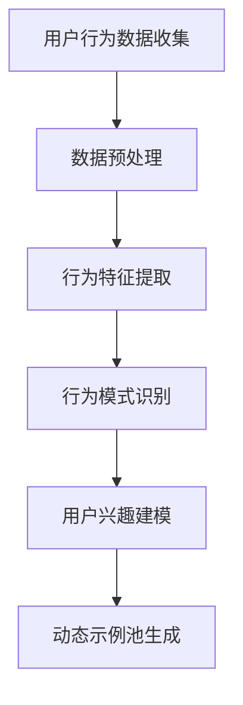
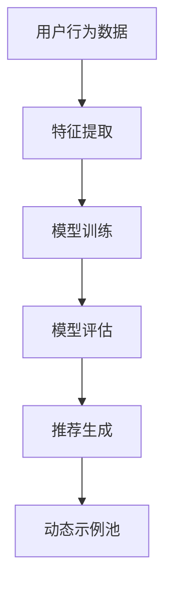
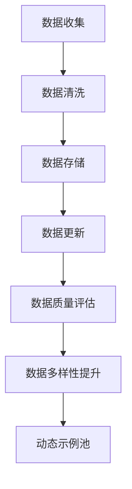

                 

# 《构建动态示例池以适应不同用户需求》

## 关键词
- 动态示例池
- AI大模型
- 用户需求
- 个性化推荐
- 机器学习

## 摘要
本文探讨了在软件2.0时代，如何利用AI大模型构建动态示例池以适应不同用户需求。文章首先介绍了动态示例池的背景、核心概念及其联系，随后深入讲解了构建动态示例池的关键技术和方法。通过实际案例和实战分析，本文展示了如何有效实现动态示例池，并提供了相关的最佳实践和未来展望。

---

### 背景介绍

随着互联网和大数据技术的快速发展，软件行业正经历着一场革命性的变革，这便是“软件2.0时代”的到来。软件2.0不同于传统的软件1.0，它不仅强调功能的完备性，更注重用户体验和智能化服务。在软件2.0时代，AI大模型作为一种颠覆性的技术，正逐步改变着软件开发的模式和应用场景。

#### 1.1 AI大模型的发展背景

AI大模型的发展可以追溯到20世纪90年代，当时神经网络理论取得了重要突破。随着计算能力的提升和数据规模的扩大，深度学习技术逐渐成熟。近年来，AI大模型在图像识别、自然语言处理、推荐系统等领域取得了显著成果，推动了软件2.0时代的到来。

#### 1.2 AI大模型的应用现状

目前，AI大模型已广泛应用于各种场景，如电商平台个性化推荐、社交媒体内容推送、智能语音助手等。这些应用不仅提升了用户体验，还为企业带来了显著的经济效益。然而，随着用户需求的日益多样化，传统的静态推荐系统已无法满足需求，动态示例池的概念应运而生。

### 2. 动态示例池的概念及其重要性

动态示例池是一种可以根据用户行为和偏好动态调整内容展示的机制，它通过机器学习算法对用户行为数据进行分析和处理，生成个性化的内容推荐。动态示例池在软件应用中的重要性体现在以下几个方面：

#### 2.1 提升用户体验

动态示例池能够根据用户的实时行为和偏好，提供个性化的内容推荐，从而提升用户的满意度。例如，在电商平台，动态示例池可以根据用户的浏览记录和购买历史，推荐用户可能感兴趣的商品，从而提高购买转化率。

#### 2.2 满足个性化需求

随着互联网的普及，用户对个性化服务的需求越来越强烈。动态示例池通过分析用户行为数据，生成个性化的内容推荐，能够更好地满足用户的需求，提升用户黏性。

#### 2.3 提高系统智能化水平

动态示例池的构建离不开AI大模型的支持。通过深度学习和协同过滤等算法，动态示例池能够不断学习和优化，提高系统的智能化水平，为用户提供更加精准的服务。

### 3. 动态示例池的构建方法和核心要素

构建动态示例池需要综合运用多种技术，包括用户行为分析、机器学习算法和示例数据管理。以下是构建动态示例池的关键方法和核心要素：

#### 3.1 用户行为分析

用户行为分析是构建动态示例池的基础。通过对用户在系统中的行为数据进行收集和分析，如点击记录、浏览历史、搜索关键词等，可以了解用户的需求和兴趣。以下是一个用户行为分析的Mermaid流程图：

#### 3.2 机器学习算法

机器学习算法在动态示例池的构建中起着关键作用。以下是一些常见的机器学习算法：

- **协同过滤**：通过分析用户的历史行为数据，找到相似的用户，然后根据相似用户的喜好进行推荐。
- **内容推荐**：基于用户的行为数据和内容的特征，为用户推荐与之相关的信息。
- **深度学习**：通过神经网络模型，对用户行为数据进行深度分析，生成个性化的推荐。

以下是一个机器学习算法的Mermaid流程图：

#### 3.3 示例数据管理

示例数据管理是构建动态示例池的另一个核心要素。有效的示例数据管理策略可以确保示例数据的质量和多样性，从而提高内容推荐的准确性和用户体验。以下是一个示例数据管理的Mermaid流程图：

### 4. 动态示例池的边界与外延

动态示例池的研究范围涉及用户行为分析、机器学习算法和示例数据管理等多个领域。未来，随着AI技术的不断发展和应用场景的拓展，动态示例池的研究将不断深化和扩展。以下是一些可能的边界与外延：

- **跨平台推荐**：将动态示例池应用于不同平台和设备，实现无缝的用户体验。
- **实时推荐**：通过实时分析用户行为数据，实现毫秒级的推荐。
- **多模态推荐**：结合文本、图像、语音等多种数据类型，为用户提供更加精准的推荐。

### 5. 动态示例池的核心要素组成

构建动态示例池需要整合多种技术和资源，以下是其核心要素组成：

- **用户行为数据**：包括点击记录、浏览历史、搜索关键词等。
- **机器学习算法**：包括协同过滤、内容推荐、深度学习等。
- **示例数据管理**：包括数据收集、清洗、存储、更新等。

### 6. 动态示例池的构建步骤

构建动态示例池可以分为以下几个步骤：

1. **数据收集**：收集用户行为数据，如点击记录、浏览历史等。
2. **数据预处理**：对收集到的数据进行清洗和预处理，如去重、填充缺失值等。
3. **特征提取**：从预处理后的数据中提取行为特征，如时间戳、频率等。
4. **用户兴趣建模**：基于行为特征和用户历史数据，建立用户兴趣模型。
5. **模型训练**：使用用户兴趣模型和示例数据，训练机器学习算法模型。
6. **模型评估**：评估模型的效果，如准确率、召回率等。
7. **推荐生成**：使用训练好的模型，为用户生成个性化的推荐。
8. **动态调整**：根据用户反馈和实时行为数据，动态调整推荐策略。

### 7. 动态示例池的实际应用

动态示例池在实际应用中已经取得了显著成果。以下是一些实际应用场景：

- **电商平台**：通过动态示例池，为用户推荐感兴趣的商品，提高购买转化率。
- **社交媒体**：通过动态示例池，为用户推荐感兴趣的内容，提升用户活跃度。
- **智能语音助手**：通过动态示例池，为用户提供个性化的语音服务。

### 8. 动态示例池的未来发展

随着AI技术的不断进步，动态示例池的未来发展前景广阔。以下是一些可能的发展趋势：

- **更精确的推荐**：通过引入更多维度的数据，如情感分析、用户情感等，实现更精确的推荐。
- **实时推荐**：通过实时分析用户行为数据，实现毫秒级的推荐，提升用户体验。
- **跨平台应用**：将动态示例池应用于更多平台和设备，实现无缝的用户体验。

### 9. 总结

动态示例池作为软件2.0时代的重要技术，具有广泛的应用前景。通过本文的探讨，我们了解了动态示例池的核心概念、构建方法及其在实际应用中的重要性。未来，随着AI技术的不断进步，动态示例池将发挥更加重要的作用，为用户提供更加个性化的服务。希望本文能为读者在构建动态示例池的过程中提供有益的参考和启示。

---

## 作者信息

作者：AI天才研究院/AI Genius Institute & 禅与计算机程序设计艺术 /Zen And The Art of Computer Programming

AI天才研究院（AI Genius Institute）致力于推动人工智能技术的发展和应用，培养全球顶尖的人工智能人才。研究院汇聚了一大批世界级的人工智能专家、程序员和软件架构师，研究成果在计算机科学和人工智能领域具有广泛的影响力。

《禅与计算机程序设计艺术》（Zen And The Art of Computer Programming）是作者Donald E. Knuth的经典著作，被广泛认为是计算机科学领域的圣经之一。本书系统地介绍了程序设计的基本原则和技巧，对程序员的设计思维和编程艺术有着深远的影响。

本文旨在探讨在软件2.0时代如何利用AI大模型构建动态示例池以适应不同用户需求，为读者提供有价值的实践经验和理论指导。希望本文能帮助读者更好地理解和应用动态示例池技术，为软件开发和创新贡献力量。

