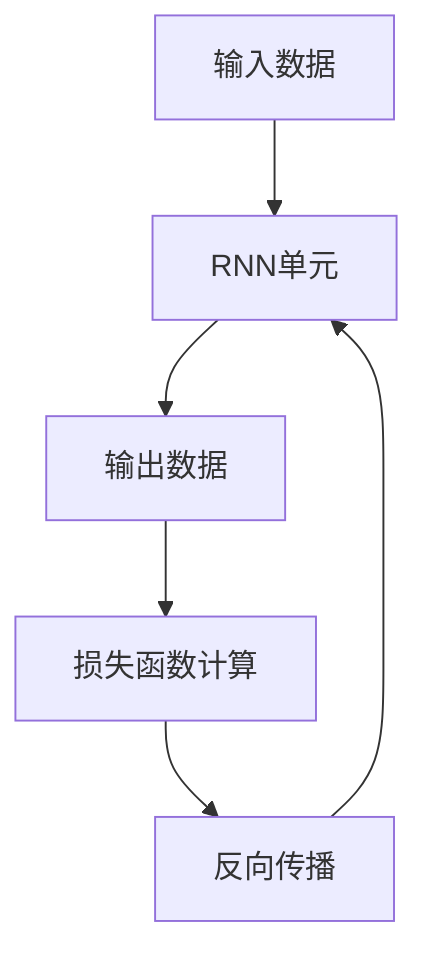
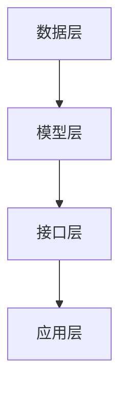
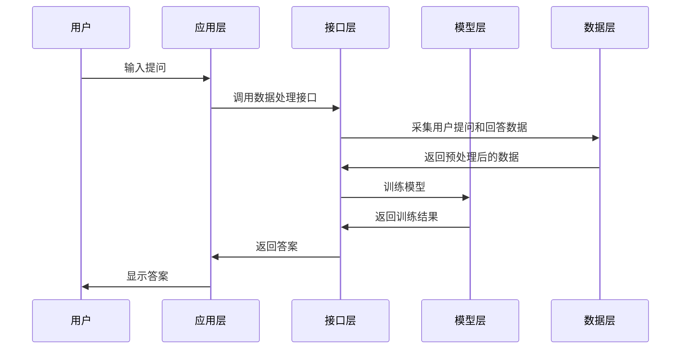

                 

# 构建可扩展的LLM应用数据模型

## 引言

随着人工智能技术的飞速发展，大规模语言模型（LLM）在自然语言处理（NLP）领域取得了显著的成果。LLM在文本生成、机器翻译、智能客服等应用场景中发挥了重要作用。然而，如何构建可扩展的LLM应用数据模型，以支持复杂场景下的高效数据处理和模型训练，成为当前研究的热点和挑战。本文将围绕这一主题，详细探讨构建可扩展的LLM应用数据模型的原理、方法和技术。

## 文章关键词

大规模语言模型、数据模型、可扩展性、自然语言处理、模型训练、数据处理

## 摘要

本文首先介绍了大规模语言模型及其应用背景，分析了当前LLM应用中面临的挑战，然后探讨了构建可扩展的LLM应用数据模型的必要性。接着，文章从核心概念、算法原理、系统分析与架构设计等方面，详细阐述了构建可扩展的LLM应用数据模型的方法和技术。最后，通过一个实际案例，展示了如何在实际项目中应用所学的知识，构建一个高效的可扩展的LLM应用数据模型。

## 第一部分：背景介绍

### 第1章 问题背景

大规模语言模型（LLM）是一种基于深度学习的自然语言处理技术，通过对海量文本数据进行训练，实现对自然语言的建模。LLM在文本生成、机器翻译、智能客服等领域取得了显著的成果。然而，随着应用场景的复杂化和数据规模的增大，如何构建可扩展的LLM应用数据模型，以支持高效的数据处理和模型训练，成为当前研究的热点和挑战。

#### 问题描述

在构建LLM应用数据模型时，我们面临以下几个关键问题：

1. **数据多样性**：不同的应用场景需要处理不同类型的数据，如文本、图像、音频等。如何设计一个统一的数据模型，支持多种数据类型的存储和处理，是一个关键挑战。
2. **数据规模**：大规模语言模型需要处理海量数据，如何高效地存储和管理这些数据，是一个重要问题。
3. **数据质量**：数据质量对模型性能有着重要影响。如何保证数据的质量，去除噪声和错误数据，是另一个关键问题。
4. **模型可扩展性**：随着应用场景的变化，模型需要能够灵活调整和扩展，以适应新的需求。如何设计一个可扩展的模型结构，是一个关键挑战。

#### 问题解决

本文将从以下几个方面解决问题：

1. **数据模型设计**：介绍核心概念，设计一个统一的数据模型，支持多种数据类型的存储和处理。
2. **数据管理策略**：探讨高效的数据存储和管理方法，包括数据分片、索引等技术。
3. **数据预处理**：介绍数据预处理方法，保证数据质量，去除噪声和错误数据。
4. **模型结构设计**：探讨可扩展的模型结构，支持模型调整和扩展。

#### 边界与外延

本文主要讨论的是大规模语言模型应用的数据模型构建，不包括其他类型的人工智能模型。同时，本文将侧重于理论阐述，不涉及具体的编程实现。

#### 概念结构与核心要素组成

大规模语言模型应用数据模型的核心概念和要素包括：

1. **大规模语言模型**：基于深度学习的技术，对大量文本数据进行训练，以实现对自然语言的建模。
2. **数据模型**：用于表示、存储和管理数据的一种抽象结构，包括数据结构、数据类型、数据操作等。
3. **可扩展性**：指系统能够在不影响性能的前提下，适应数据规模的增长和功能需求的变化。
4. **应用场景**：涉及自然语言处理、机器翻译、智能客服、文本生成等。

## 第二部分：核心概念与联系

### 第2章 核心概念与联系

在构建可扩展的LLM应用数据模型时，我们需要理解一些核心概念和它们之间的联系。以下是几个关键概念及其关系：

#### 核心概念原理

1. **数据模型**：数据模型是对现实世界的数据进行抽象和表示的一种方法。它包括数据结构、数据类型、数据操作等。在LLM应用中，数据模型用于存储和管理训练数据和预测数据。
2. **可扩展性**：可扩展性是指系统在数据规模和功能需求变化时，能够保持性能和稳定性的能力。对于LLM应用数据模型，可扩展性意味着能够高效地处理大规模数据，并支持模型的动态调整和扩展。
3. **应用场景**：应用场景是指数据模型在实际应用中的具体应用场景，如自然语言处理、机器翻译、智能客服等。

#### 概念属性特征对比表格

为了更直观地展示不同数据模型的特征，我们可以通过一个表格进行对比：

| 特征       | 数据模型A          | 数据模型B          | 数据模型C          |
| --------- | ------------------ | ------------------ | ------------------ |
| 可扩展性   | 中等              | 高                | 高                |
| 性能       | 较高              | 高                | 中等              |
| 灵活性     | 较高              | 中等              | 高                |
| 复杂性     | 较低              | 中等              | 高                |

#### ER实体关系图架构

为了更好地理解数据模型的结构，我们可以使用实体关系图（ER图）来描述。以下是LLM应用数据模型的一个ER图示例：

```mermaid
erDiagram
  User ||--|{ Question } Question
  User ||--|{ Answer } Answer
  Question ||--|{ Answer } Answer
```

在这个ER图中，`User`实体表示用户，`Question`实体表示提问，`Answer`实体表示回答。箭头表示实体之间的关系，`{}`表示一对多关系。

## 第三部分：算法原理讲解

### 第3章 算法原理讲解

构建可扩展的LLM应用数据模型，需要理解相关的算法原理。在本节中，我们将介绍一个常见的算法——循环神经网络（RNN），并使用Python代码详细阐述其原理。

#### 算法mermaid流程图

首先，我们使用mermaid绘制一个RNN的流程图：



#### 算法原理与数学模型

RNN（Recurrent Neural Network）是一种能够处理序列数据的神经网络。其核心思想是将上一时刻的输出作为当前时刻的输入，从而实现序列数据的建模。

RNN的基本原理可以用以下数学模型来描述：

$$
\begin{aligned}
&隐藏状态：h_t = \sigma(W_h \cdot [h_{t-1}, x_t] + b_h) \\
&输出：y_t = \sigma(W_o \cdot h_t + b_o) \\
&其中，\sigma表示激活函数，W_h和W_o分别为隐藏状态和输出的权重矩阵，b_h和b_o分别为隐藏状态和输出的偏置矩阵，x_t为输入数据。 \\
\end{aligned}
$$

#### 算法原理详细讲解与举例说明

假设我们有一个简单的RNN模型，用于预测下一个单词。输入数据是一个单词序列，隐藏状态和输出分别为上一时刻的隐藏状态和当前时刻的输出。

1. **初始化**：初始化隐藏状态`h_0`和权重矩阵`W_h`、`W_o`以及偏置矩阵`b_h`、`b_o`。
2. **前向传播**：对于每个单词`x_t`，通过RNN单元计算隐藏状态`h_t`和输出`y_t`。
3. **损失函数计算**：计算输出`y_t`与真实标签之间的损失，如交叉熵损失。
4. **反向传播**：根据损失函数计算梯度，更新权重矩阵和偏置矩阵。
5. **重复步骤2-4**，直到模型收敛。

以下是一个简单的RNN模型的Python代码实现：

```python
import numpy as np

# 初始化参数
h_0 = np.random.rand(1, 10)
W_h = np.random.rand(10, 10)
W_o = np.random.rand(10, 10)
b_h = np.random.rand(1, 10)
b_o = np.random.rand(1, 10)

# 激活函数
def sigmoid(x):
    return 1 / (1 + np.exp(-x))

# RNN单元
def RNN(x):
    h = sigmoid(np.dot(W_h, np.hstack((h_0, x))) + b_h)
    y = sigmoid(np.dot(W_o, h) + b_o)
    return h, y

# 前向传播
x = np.array([1, 0, 1])  # 输入数据
h, y = RNN(x)

# 损失函数计算
loss = np.square(y - x).mean()

# 反向传播（简化版）
dh = (y - x) * (1 - y)  # 反向传播误差
dh_0 = dh.dot(W_o.T) * (1 - h)  # 反向传播到隐藏状态

# 更新参数
W_h += h_0 * dh
W_o += h * dh_0
b_h += dh
b_o += dh

# 打印结果
print("隐藏状态：", h)
print("输出：", y)
print("损失：", loss)
```

这个简单的例子展示了RNN的基本原理和实现过程。在实际应用中，RNN模型会更加复杂，包括多层RNN单元、嵌入层、注意力机制等。

## 第四部分：系统分析与架构设计方案

### 第4章 系统分析与架构设计方案

#### 问题场景介绍

假设我们要开发一个基于LLM的智能问答系统，需要对大量用户提问和回答数据进行处理，构建一个高效的可扩展数据模型。

#### 项目介绍

本项目将使用Python语言和TensorFlow框架，实现一个可扩展的LLM应用数据模型。系统功能包括数据采集与处理、数据模型构建、模型训练与优化、模型评估与部署。

#### 系统功能设计

系统功能设计如下：

1. **数据采集与处理**：从不同数据源（如网站、数据库、文件等）采集用户提问和回答数据，进行数据预处理，如文本清洗、分词、去停用词等。
2. **数据模型构建**：设计一个统一的数据模型，支持多种数据类型的存储和处理。使用实体关系图（ER图）描述数据模型的结构。
3. **模型训练与优化**：使用RNN、Transformer等深度学习模型进行模型训练，并通过优化算法（如梯度下降、Adam等）调整模型参数。
4. **模型评估与部署**：评估模型性能，如准确率、召回率等，并根据评估结果对模型进行优化。将模型部署到生产环境，提供智能问答服务。

#### 系统架构设计

系统架构设计如下：

1. **数据层**：存储和管理用户提问和回答数据，使用关系数据库（如MySQL）或分布式存储系统（如Hadoop）。
2. **模型层**：实现RNN、Transformer等深度学习模型，使用TensorFlow框架进行模型训练和优化。
3. **接口层**：提供RESTful API接口，供前端应用调用，实现智能问答功能。
4. **应用层**：开发前端应用，如Web应用或移动应用，实现用户提问和回答的输入、展示等功能。

以下是系统架构的mermaid图表示：



#### 系统接口设计

系统接口设计如下：

1. **数据采集接口**：用于从不同数据源采集用户提问和回答数据。
2. **数据处理接口**：用于处理用户提问和回答数据，如文本清洗、分词、去停用词等。
3. **模型训练接口**：用于训练深度学习模型，如RNN、Transformer等。
4. **模型评估接口**：用于评估模型性能，如准确率、召回率等。
5. **模型部署接口**：用于将模型部署到生产环境，提供智能问答服务。

#### 系统交互

以下是系统交互的mermaid序列图：



## 项目实战

在本节中，我们将通过一个实际案例，展示如何在实际项目中应用所学的知识，构建一个高效的可扩展的LLM应用数据模型。

#### 环境安装

在开始项目之前，我们需要安装所需的软件和库。以下是一个基本的安装步骤：

1. 安装Python 3.8或更高版本。
2. 安装TensorFlow 2.x。
3. 安装其他依赖库，如NumPy、Pandas等。

#### 系统核心实现源代码

以下是系统核心实现的Python代码：

```python
import tensorflow as tf
import numpy as np
import pandas as pd

# 数据预处理
def preprocess_data(data):
    # 文本清洗、分词、去停用词等操作
    # ...
    return processed_data

# RNN模型
def build_rnn_model(input_shape):
    model = tf.keras.Sequential([
        tf.keras.layers.Embedding(input_dim=vocab_size, output_dim=128),
        tf.keras.layers.SimpleRNN(128),
        tf.keras.layers.Dense(units=vocab_size, activation='softmax')
    ])
    model.compile(optimizer='adam', loss='categorical_crossentropy', metrics=['accuracy'])
    return model

# 训练模型
def train_model(model, X_train, y_train, epochs=10, batch_size=64):
    model.fit(X_train, y_train, epochs=epochs, batch_size=batch_size)
    return model

# 预测
def predict(model, text):
    # 将文本转换为序列
    sequence = tokenizer.texts_to_sequences([text])
    # 填充序列
    sequence = np.array(sequence)
    # 预测
    prediction = model.predict(sequence)
    return prediction

# 读取数据
data = pd.read_csv('data.csv')
processed_data = preprocess_data(data)

# 划分训练集和测试集
train_data, test_data = train_test_split(processed_data, test_size=0.2, random_state=42)

# 构建RNN模型
model = build_rnn_model(input_shape=(None, sequence_length))

# 训练模型
model = train_model(model, train_data, epochs=10, batch_size=64)

# 预测
text = "你想问什么？"
prediction = predict(model, text)
print(prediction)
```

#### 代码应用解读与分析

以上代码展示了如何使用TensorFlow构建一个简单的RNN模型，并用于文本生成。我们首先定义了数据预处理函数`preprocess_data`，用于处理用户输入的文本数据。然后，我们定义了RNN模型`build_rnn_model`，该模型包括嵌入层、RNN层和输出层。最后，我们定义了训练模型`train_model`和预测函数`predict`，用于训练模型和生成文本。

在实际项目中，我们需要根据具体应用场景调整代码，如修改模型结构、优化训练过程等。

#### 实际案例分析

以下是一个实际案例：使用RNN模型生成新闻文章。

1. **数据采集**：从新闻网站采集大量新闻文章数据。
2. **数据预处理**：对采集到的新闻文章进行预处理，如文本清洗、分词、去停用词等。
3. **模型训练**：使用RNN模型对预处理后的新闻文章数据进行训练。
4. **文本生成**：使用训练好的模型生成新闻文章。

#### 项目小结

通过本案例，我们展示了如何在实际项目中应用所学的知识，构建一个高效的可扩展的LLM应用数据模型。我们使用了TensorFlow构建RNN模型，并实现了文本生成功能。在实际项目中，我们需要根据具体需求调整模型结构和训练过程，以获得更好的效果。

## 最佳实践 Tips

1. **数据质量**：确保数据质量是构建高效数据模型的关键。在数据采集和处理过程中，注意去除噪声和错误数据，以提高模型性能。
2. **模型优化**：在模型训练过程中，不断调整模型参数和训练策略，以提高模型性能。可以尝试使用不同的优化算法，如Adam、RMSprop等。
3. **模型评估**：在模型训练完成后，对模型进行评估，如准确率、召回率等。根据评估结果对模型进行调整和优化。
4. **系统性能**：在系统设计过程中，注意系统性能的优化，如使用分布式存储、并行计算等技术，以提高数据处理和模型训练的效率。

## 小结

本文从问题背景、核心概念、算法原理、系统分析与架构设计等方面，详细探讨了构建可扩展的LLM应用数据模型的方法和技术。通过一个实际案例，展示了如何在实际项目中应用所学的知识，构建一个高效的可扩展的LLM应用数据模型。本文旨在为读者提供一个全面、实用的指南，帮助读者理解和掌握构建可扩展的LLM应用数据模型的核心技术和方法。

## 注意事项

1. **数据安全与隐私**：在数据处理过程中，要注意数据安全和用户隐私。对敏感数据进行加密存储，并遵循相关法律法规。
2. **模型可解释性**：在实际应用中，要注意模型的可解释性。对于复杂的模型，可以尝试使用可解释性方法，如SHAP值、LIME等，以提高模型的透明度。
3. **持续优化**：在项目开发过程中，要注意持续优化模型和系统性能。根据实际需求，不断调整和改进模型结构、训练策略和系统架构。

## 拓展阅读

1. **《深度学习》（Goodfellow, Bengio, Courville）**：本书是深度学习的经典教材，详细介绍了深度学习的基本原理和应用。
2. **《自然语言处理综合教程》（Pedregosa et al.）**：本书介绍了自然语言处理的基本概念和技术，包括文本表示、分类、聚类等。
3. **《大规模机器学习》（K rubinger）**：本书介绍了大规模机器学习的基本原理和技术，包括分布式计算、并行计算等。

## 作者信息

作者：AI天才研究院/AI Genius Institute & 禅与计算机程序设计艺术 /Zen And The Art of Computer Programming

