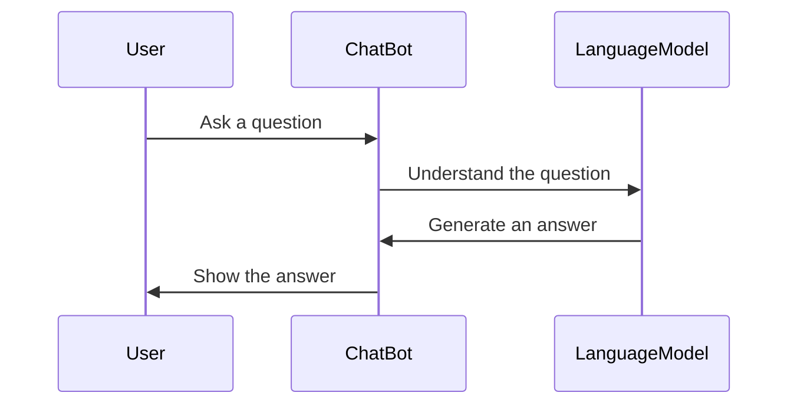
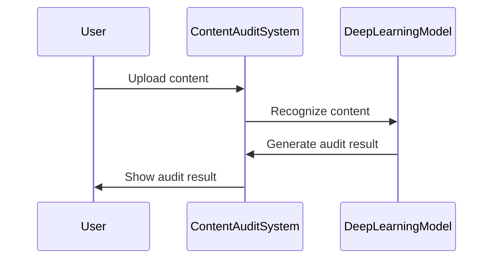
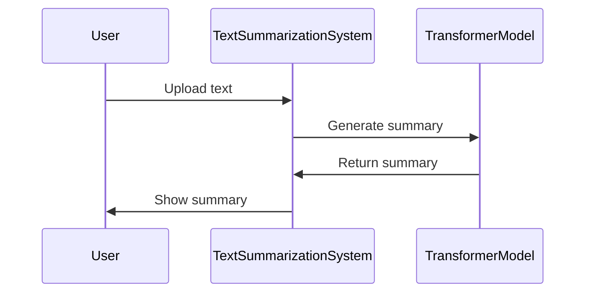
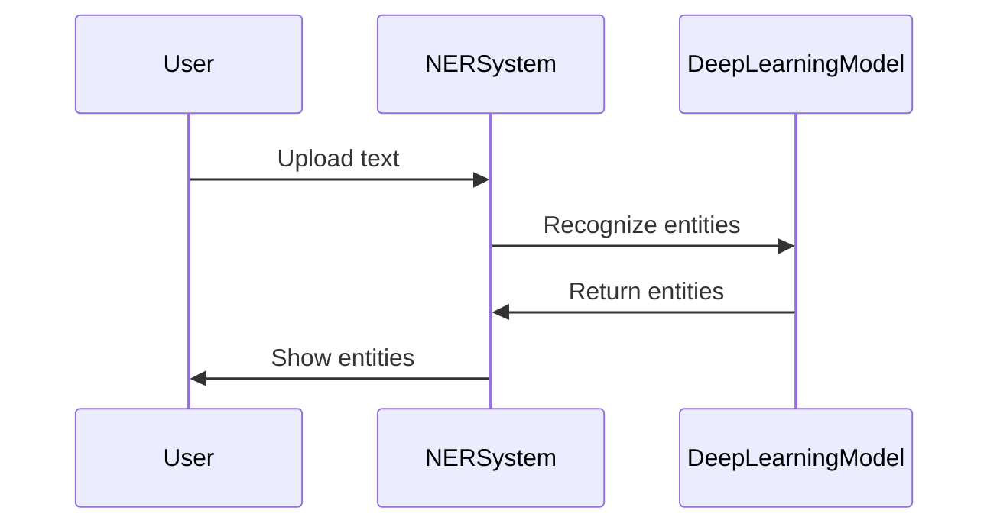
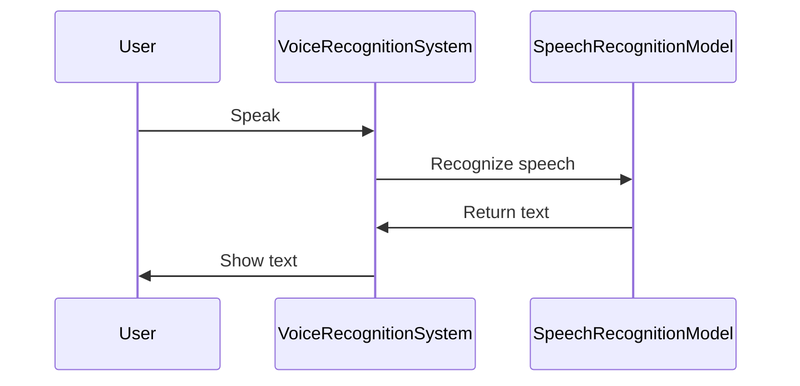

                 

### 第1章：引言

#### 1.1 书籍背景

随着人工智能技术的飞速发展，语言模型（Language Model，简称LLM）已经成为自然语言处理（Natural Language Processing，简称NLP）领域中不可或缺的重要工具。近年来，基于深度学习的语言模型如BERT、GPT等取得了显著的成果，广泛应用于问答系统、自然语言生成、文本分类、语言翻译等众多领域。这些应用的成功不仅提升了用户的工作效率，也推动了各行各业的技术创新。

然而，随着应用场景的日益复杂和规模的不断扩大，如何构建可扩展的LLM应用成为一个亟待解决的问题。传统的单机部署模式在处理大规模数据和高并发请求时显得力不从心，性能瓶颈和可扩展性问题愈发突出。因此，迫切需要探索一种全新的架构和实现方法，以满足不断增长的应用需求。

本书的目的是系统性地介绍构建可扩展的LLM应用的原则与实践。通过深入剖析语言模型的原理、可扩展性的设计原则和实现方法，以及具体的应用场景，本书旨在为读者提供一套完整的解决方案，帮助他们应对复杂的实际问题，实现高效、可扩展的LLM应用。

#### 1.2 语言模型的重要性

语言模型是自然语言处理领域中的核心组件，它通过学习大量文本数据，预测下一个单词或字符的概率分布。这种概率分布可以用于许多实际的NLP任务，如文本生成、机器翻译、文本分类等。

语言模型的重要性主要体现在以下几个方面：

1. **文本生成**：语言模型可以生成高质量的文本，包括文章、摘要、对话等。这在自动写作、新闻生成等领域具有广泛的应用价值。
   
2. **机器翻译**：语言模型可以用来训练翻译模型，实现高质量、通顺的跨语言文本翻译。这对于促进国际交流、消除语言障碍具有重要意义。

3. **文本分类**：语言模型可以帮助对大量文本进行分类，如新闻分类、情感分析等。这有助于从海量的信息中提取有价值的信息，提高数据处理效率。

4. **问答系统**：语言模型可以用于构建问答系统，通过理解用户的问题并给出准确的答案，提供智能化的服务。

5. **自然语言理解**：语言模型可以帮助计算机更好地理解自然语言，从而实现更加智能化的交互。这对于智能家居、智能客服等领域具有重要应用价值。

#### 1.3 可扩展的LLM应用需求

随着互联网的普及和大数据时代的到来，数据量和用户需求的增长速度令人难以置信。传统单机部署的语言模型在处理大规模数据和应对高并发请求时面临巨大的挑战，具体体现在以下几个方面：

1. **性能瓶颈**：单机部署的语言模型在处理大规模数据和高并发请求时，容易导致计算资源不足，出现性能瓶颈，影响用户体验。

2. **扩展性差**：传统架构在扩容时需要重新部署，不仅增加了运维成本，还可能导致系统不稳定。

3. **可维护性低**：单机部署的语言模型在故障时难以快速恢复，系统的可维护性较低。

4. **成本高**：单机部署需要大量高性能硬件支持，成本较高，不适合中小企业。

为了解决上述问题，构建可扩展的LLM应用成为必然选择。可扩展性不仅可以提升系统的性能和稳定性，还可以降低运维成本，提高系统的可维护性。具体需求包括：

1. **横向扩展**：通过分布式架构实现横向扩展，可以充分利用多台服务器的计算资源，提高系统的处理能力。

2. **弹性调度**：根据实际需求动态调整系统资源，实现负载均衡，提高系统的稳定性。

3. **高可用性**：通过冗余设计和故障恢复机制，提高系统的可用性，确保服务连续性。

4. **低成本**：采用云计算等低成本技术，降低系统部署和维护成本。

#### 1.4 书籍结构

本书分为四个部分，共十六章，涵盖了从语言模型基础到可扩展性设计、具体应用场景等各个方面。

- **第一部分：可扩展的LLM基础**，包括语言模型原理、训练、优化和评估等内容，为后续章节提供理论基础。
- **第二部分：可扩展性设计与实现**，详细介绍可扩展性设计原则、数据存储、系统性能优化和测试评估方法，帮助读者掌握构建可扩展LLM应用的实践技巧。
- **第三部分：LLM应用场景**，分析问答系统、自然语言生成、文本分类与情感分析、语言翻译等具体应用场景，提供实际案例和实现方法。
- **第四部分：项目实战**，通过一个完整的LLM应用项目，详细介绍环境搭建、系统设计和实现，以及项目总结和最佳实践。

#### 1.5 每章主要内容

- **第1章：引言**，介绍书籍背景、语言模型的重要性、可扩展的LLM应用需求，以及书籍结构和每章主要内容。
- **第2章：语言模型原理**，讲解语言模型的基础知识，包括数据预处理、模型选择、训练和优化方法。
- **第3章：可扩展性设计与实现**，探讨可扩展性的重要性、架构设计原则、数据存储与管理、系统性能优化和测试评估方法。
- **第4章：LLM应用场景**，分析问答系统、自然语言生成、文本分类与情感分析、语言翻译等应用场景。
- **第5章：项目实战一：问答系统**，通过一个完整的问答系统项目，展示语言模型的实际应用。
- **第6章：项目实战二：自然语言生成**，详细介绍自然语言生成项目的环境搭建、系统设计和实现。
- **第7章：项目实战三：文本分类与情感分析**，分析文本分类和情感分析项目的实现方法和关键技巧。
- **第8章：项目实战四：语言翻译**，通过语言翻译项目，探讨翻译模型的训练和应用。
- **第9章：项目实战五：其他应用场景**，介绍聊天机器人、内容审核、文本摘要等应用场景的实现方法。
- **第10章：项目总结**，总结各个项目的经验和教训，提炼最佳实践。
- **第11章：可扩展性最佳实践**，分享可扩展性设计、优化和测试方面的最佳实践。
- **第12章：总结与展望**，回顾全书内容，展望未来可扩展LLM应用的发展趋势。

#### 1.6 阅读建议

本书适合具有一定编程基础和NLP背景的读者，特别是对语言模型和可扩展性设计感兴趣的读者。以下是阅读本书的一些建议：

1. **系统学习**：建议按照章节顺序系统学习，从语言模型基础开始，逐步深入到可扩展性设计和应用场景。

2. **动手实践**：本书附带多个项目实战，读者可以通过动手实践加深对理论知识的理解，提高实际应用能力。

3. **重点掌握**：在阅读过程中，重点掌握语言模型原理、可扩展性设计和具体应用场景，这些是构建可扩展LLM应用的核心内容。

4. **拓展阅读**：对于感兴趣的章节，可以查阅相关文献和资料，深入了解相关领域的最新进展。

5. **交流互动**：读者可以通过本书的配套社区，与其他读者交流心得体会，共同探讨问题，提高学习效果。

#### 1.7 目标读者

本书的目标读者主要包括以下几类：

1. **NLP和人工智能领域的研究人员**：对自然语言处理和人工智能感兴趣的学者，希望深入了解语言模型的原理和应用。

2. **软件开发工程师**：具有编程基础，希望掌握构建可扩展的LLM应用技能的软件开发工程师。

3. **系统架构师**：负责设计和优化NLP系统的系统架构师，需要了解可扩展性设计和实现方法。

4. **数据科学家**：从事数据分析和挖掘工作，希望利用语言模型提升数据处理和分析能力的数据科学家。

5. **机器学习爱好者**：对机器学习和深度学习感兴趣，希望深入学习语言模型和相关技术的大众读者。

#### 1.8 核心概念介绍

在构建可扩展的LLM应用过程中，理解以下几个核心概念至关重要：

1. **可扩展的LLM**：指具有横向扩展能力、能够处理大规模数据和并发请求的语言模型。
   
2. **分布式架构**：通过多台服务器和分布式计算技术，实现系统的横向扩展和负载均衡。

3. **微服务架构**：将系统分解为多个独立的微服务，每个微服务负责不同的功能模块，实现高内聚、低耦合的系统架构。

4. **服务网格架构**：在分布式系统中，通过服务网格技术实现服务之间的通信和监控。

5. **数据存储与管理**：选择合适的存储方案和数据库，实现对大规模数据的快速存取和管理。

6. **系统性能优化**：通过优化算法、调整系统参数等手段，提高系统的性能和响应速度。

7. **测试与评估**：通过测试和评估方法，验证系统的可扩展性和性能指标，确保系统的高效运行。

#### 1.9 本章小结

本章作为引言部分，主要介绍了书籍的背景、语言模型的重要性、可扩展的LLM应用需求，以及书籍的结构和每章主要内容。通过本章的阅读，读者可以初步了解本书的核心内容和框架，为后续章节的学习奠定基础。在后续的章节中，我们将深入探讨语言模型的原理、可扩展性设计、具体应用场景和项目实战，帮助读者全面掌握构建可扩展的LLM应用的方法和技巧。

### 1.10 关键词

- 人工智能
- 语言模型
- 可扩展性
- 分布式架构
- 微服务架构
- 系统性能优化
- 应用场景

### 1.11 摘要

本书旨在系统性地介绍构建可扩展的LLM应用的原则与实践。首先，从语言模型的基础原理出发，详细讲解语言模型的训练、优化和评估方法。接着，深入探讨可扩展性的设计原则与实现方法，包括架构设计、数据存储与管理、系统性能优化和测试评估。然后，分析语言模型在问答系统、自然语言生成、文本分类与情感分析、语言翻译等应用场景中的具体实现。最后，通过多个项目实战，展示构建可扩展LLM应用的完整流程和最佳实践。本书旨在帮助读者全面掌握可扩展的LLM应用构建方法，提升实际应用能力。

### 第2章：语言模型原理

#### 2.1 语言模型基础

语言模型是自然语言处理（NLP）领域中的重要工具，用于预测文本序列中的下一个单词或字符。其核心思想是通过学习大量文本数据，建立一种概率模型，从而能够根据前文预测下一个词的概率分布。语言模型在许多NLP任务中发挥着关键作用，如文本生成、机器翻译、文本分类、问答系统等。

语言模型的基础主要包括以下几个方面：

1. **NLP任务背景**：自然语言处理是指让计算机理解和生成人类语言的技术。NLP的任务包括文本分类、情感分析、命名实体识别、机器翻译、文本生成等。

2. **语言模型简介**：语言模型是一种概率模型，用于预测文本序列中的下一个单词或字符。常见的语言模型包括n元模型、神经网络模型、循环神经网络（RNN）、长短时记忆网络（LSTM）等。

3. **语言模型的类型**：语言模型可以分为统计模型和神经网络模型。统计模型如n元模型，通过统计历史数据预测下一个词的概率。神经网络模型如RNN、LSTM、GPT等，通过学习文本数据的特征，实现端到端的语言建模。

4. **语言模型的评价指标**：评价语言模型性能的常用指标包括词预测精度、句子生成质量、BLEU评分等。词预测精度用于衡量模型在单词预测任务中的准确性。句子生成质量用于评估模型生成的文本的流畅性和可读性。BLEU评分是一种自动评估机器翻译质量的指标，通过比较模型生成的文本与参考文本的相似度来评分。

#### 2.2 语言模型的类型

语言模型可以根据其基本原理和实现方法进行分类。以下是几种常见的语言模型类型：

1. **n元模型**：n元模型是最早的语言模型，通过统计前n个单词（或字符）出现的概率来预测下一个单词（或字符）。n元模型简单高效，但在长文本生成中表现不佳。

2. **神经网络模型**：神经网络模型通过学习大量文本数据，自动提取语言特征，实现端到端的语言建模。常见的神经网络模型包括循环神经网络（RNN）、长短时记忆网络（LSTM）和门控循环单元（GRU）。这些模型在长文本生成和复杂语言任务中表现优异。

3. ** Transformer模型**：Transformer模型是近年来提出的基于自注意力机制的神经网络模型，其核心思想是通过对所有输入词进行加权求和，实现全局依赖关系的建模。Transformer模型在自然语言生成和机器翻译等任务中取得了显著成果，代表性的模型有BERT、GPT和T5等。

4. **深度神经网络模型**：深度神经网络模型通过堆叠多层感知机（MLP）或卷积神经网络（CNN）来实现复杂的语言特征提取。这些模型在文本分类、情感分析等任务中表现出色。

不同类型的语言模型各有优缺点，选择合适的模型取决于具体的任务和应用场景。n元模型在短期预测中表现稳定，但难以建模长距离依赖。神经网络模型在长文本生成和复杂语言任务中表现优异，但计算成本较高。Transformer模型在处理长距离依赖和并行计算方面具有显著优势。

#### 2.3 语言模型的评价指标

评价语言模型性能的常用指标包括词预测精度、句子生成质量和BLEU评分。以下是这些指标的详细解释：

1. **词预测精度**：词预测精度是指模型在单词预测任务中的准确性。通常使用准确率（Accuracy）、精确率（Precision）、召回率（Recall）和F1值（F1 Score）等指标来衡量。这些指标的计算方法如下：

   - **准确率**：正确预测的单词数与总预测单词数的比例。$$Accuracy = \frac{TP + TN}{TP + FN + FP + TN}$$
   - **精确率**：正确预测的单词数与预测为正确的单词数的比例。$$Precision = \frac{TP}{TP + FP}$$
   - **召回率**：正确预测的单词数与实际为正确的单词数的比例。$$Recall = \frac{TP}{TP + FN}$$
   - **F1值**：精确率和召回率的调和平均值。$$F1 Score = 2 \times \frac{Precision \times Recall}{Precision + Recall}$$

2. **句子生成质量**：句子生成质量是指模型生成的文本的流畅性和可读性。常用的评价指标包括BLEU评分、ROUGE评分和Perplexity等。

   - **BLEU评分**：BLEU（Bilingual Evaluation Understudy）评分是一种自动评估机器翻译质量的指标。它通过比较模型生成的文本与参考文本的相似度来评分，相似度越高，评分越高。
   - **ROUGE评分**：ROUGE（Recall-Oriented Understudy for Gisting Evaluation）评分是一种用于评估文本相似度的指标。它主要关注模型生成的文本与参考文本的召回率，召回率越高，评分越高。
   - **Perplexity**：Perplexity是指模型对测试数据的预测能力。Perplexity值越低，表示模型对数据的拟合程度越高，性能越好。

3. **BLEU评分**：BLEU评分通过计算模型生成的文本与参考文本之间的n-gram重叠度来评估翻译质量。其计算公式如下：

   $$BLEU = \frac{1}{N} \sum_{i=1}^{N} \frac{max(F_{i1}, F_{i2}, ..., F_{id})}{d}$$

   其中，\(F_{ij}\)表示第i个n-gram在模型生成的文本和参考文本中的重叠度，\(d\)表示n-gram的长度（通常取2到4之间）。

   BLEU评分的优点是计算简单，可以自动评估翻译质量。然而，BLEU评分存在一些局限性，如无法评估语义和语法质量，对不同语言和文本类型的表现不一致。

通过这些评价指标，可以全面评估语言模型的性能，选择合适的模型和参数，优化模型的表现。在实际应用中，可以根据具体的任务需求，综合考虑各种评价指标，选择最适合的模型。

#### 2.4 语言模型训练

语言模型的训练过程是构建可扩展LLM应用的基础，通过学习大量文本数据，模型可以提取语言特征，实现文本预测。以下是语言模型训练的基本流程：

1. **数据预处理**：在训练语言模型之前，需要对文本数据进行预处理，包括分词、去停用词、词形还原等操作。分词是将文本分割成单个词语的过程，常用的分词工具包括jieba、NLTK等。去停用词是指去除常见的无意义词语，如“的”、“和”、“在”等。词形还原是将不同形式的词语转换为统一的词形，如将“爱”还原为“爱”。

2. **数据集划分**：将预处理后的文本数据划分为训练集、验证集和测试集。训练集用于模型训练，验证集用于调整模型参数和评估模型性能，测试集用于最终评估模型性能。数据集划分的方法包括随机划分、按比例划分等。

3. **模型选择**：选择合适的模型架构。常见的语言模型包括n元模型、循环神经网络（RNN）、长短时记忆网络（LSTM）和Transformer等。n元模型简单高效，但在长距离依赖建模方面表现较差。RNN和LSTM能够建模长距离依赖，但在并行计算和长文本生成方面存在挑战。Transformer模型通过自注意力机制实现全局依赖建模，在长文本生成和复杂语言任务中表现优异。

4. **模型参数初始化**：初始化模型的参数，包括权重、偏置等。常用的初始化方法包括随机初始化、高斯分布初始化等。随机初始化简单高效，但可能导致梯度消失或爆炸问题。高斯分布初始化可以缓解这些问题，但计算成本较高。

5. **前向传播**：在训练过程中，对于每个输入序列，模型根据当前参数计算预测的概率分布。前向传播是指将输入数据通过模型网络层，逐层计算输出结果的过程。在语言模型中，前向传播主要涉及词嵌入、神经网络层和softmax输出等步骤。

6. **损失函数**：损失函数用于衡量模型预测结果与真实结果之间的差距。常见的损失函数包括交叉熵损失（Cross Entropy Loss）、均方误差（Mean Squared Error，MSE）等。交叉熵损失在分类任务中常用，其计算公式如下：

   $$Loss = -\sum_{i} y_i \log(p_i)$$

   其中，\(y_i\)是第i个单词的真实标签，\(p_i\)是模型预测的第i个单词的概率。

7. **反向传播**：反向传播是训练神经网络的重要步骤，用于更新模型参数。在反向传播过程中，首先计算梯度，然后根据梯度更新模型参数。梯度计算公式如下：

   $$\Delta w = \frac{\partial Loss}{\partial w}$$

   更新公式如下：

   $$w = w - \alpha \Delta w$$

   其中，\(\alpha\)是学习率，用于调整参数更新的幅度。

8. **训练与评估**：通过迭代训练模型，不断更新参数，减小损失函数。在训练过程中，可以使用验证集评估模型性能，根据性能调整模型参数。训练过程中，可以设置训练轮数、学习率、批量大小等参数，以优化模型性能。

9. **模型优化**：在训练完成后，可以对模型进行优化，包括超参数调整、正则化技术等。超参数调整是指调整学习率、批量大小、隐藏层大小等参数，以优化模型性能。正则化技术包括L1正则化、L2正则化、dropout等，用于防止过拟合。

通过上述步骤，可以训练出一个性能良好的语言模型，为构建可扩展的LLM应用奠定基础。

#### 2.5 语言模型优化

在构建可扩展的LLM应用时，语言模型的优化至关重要。通过优化，可以提高模型性能，降低过拟合现象，提高泛化能力。以下是几种常见的语言模型优化方法：

1. **超参数调整**：超参数是模型训练过程中需要手动设置的参数，如学习率、批量大小、隐藏层大小等。合理的超参数调整可以显著提高模型性能。常见的方法包括网格搜索（Grid Search）和随机搜索（Random Search）。网格搜索通过遍历所有可能的超参数组合，找到最佳组合。随机搜索通过随机选择超参数组合，找到最佳组合。在实际应用中，可以根据实验结果，逐步调整超参数，找到最优设置。

2. **正则化技术**：正则化技术用于防止模型过拟合，提高模型的泛化能力。常见的正则化技术包括L1正则化、L2正则化、dropout等。

   - **L1正则化**：在损失函数中添加L1正则化项，其计算公式如下：

     $$Loss = \frac{1}{m} \sum_{i=1}^{m} \sum_{j=1}^{n} (y_j - \hat{y}_j)^2 + \lambda ||w||_1$$

     其中，\(w\)是模型参数，\(\lambda\)是正则化系数，\(||w||_1\)是L1范数。

   - **L2正则化**：在损失函数中添加L2正则化项，其计算公式如下：

     $$Loss = \frac{1}{m} \sum_{i=1}^{m} \sum_{j=1}^{n} (y_j - \hat{y}_j)^2 + \lambda ||w||_2$$

     其中，\(w\)是模型参数，\(\lambda\)是正则化系数，\(||w||_2\)是L2范数。

   - **Dropout**：在训练过程中，随机丢弃部分神经元，降低模型对特定神经元的依赖。Dropout可以防止过拟合，提高模型的泛化能力。Dropout的概率通常设置为0.5。

3. **模型蒸馏**：模型蒸馏（Model Distillation）是一种将大模型（Teacher）的知识传递给小模型（Student）的方法。在大模型训练完成后，将其作为Teacher，将Teacher的输出作为Student的输入，通过蒸馏损失函数（Distillation Loss）调整Student的参数，使Student学习到Teacher的知识。模型蒸馏可以显著提高小模型的性能，减少模型参数量，提高模型的泛化能力。

   $$Distillation Loss = \frac{1}{m} \sum_{i=1}^{m} \sum_{j=1}^{n} \log(\hat{y}_{ij}) + \frac{1}{m} \sum_{i=1}^{m} \sum_{j=1}^{n} \log(\hat{p}_{ij}(\theta_S))$$

   其中，\(\hat{y}_{ij}\)是Teacher的输出概率，\(\hat{p}_{ij}(\theta_S)\)是Student的输出概率，\(\theta_S\)是Student的参数。

通过上述优化方法，可以构建一个性能优越、可扩展的LLM应用，为实际应用提供强大的支持。

#### 2.6 语言模型评估

语言模型的评估是构建可扩展LLM应用的重要环节，通过评估可以衡量模型性能，指导后续优化和改进。评估方法主要包括以下几个方面：

1. **评估指标**：评估语言模型的常用指标包括词预测精度、句子生成质量和BLEU评分等。

   - **词预测精度**：词预测精度是指模型在单词预测任务中的准确性，常用的指标包括准确率（Accuracy）、精确率（Precision）、召回率（Recall）和F1值（F1 Score）。这些指标的计算方法如下：

     $$Accuracy = \frac{TP + TN}{TP + FN + FP + TN}$$
     $$Precision = \frac{TP}{TP + FP}$$
     $$Recall = \frac{TP}{TP + FN}$$
     $$F1 Score = 2 \times \frac{Precision \times Recall}{Precision + Recall}$$

   - **句子生成质量**：句子生成质量是指模型生成的文本的流畅性和可读性。常用的评价指标包括BLEU评分、ROUGE评分和Perplexity等。BLEU评分通过计算模型生成的文本与参考文本的相似度来评分，ROUGE评分主要关注文本的召回率，Perplexity用于评估模型对测试数据的拟合程度。

2. **评估方法**：评估语言模型的方法主要包括测试集评估和交叉验证等。

   - **测试集评估**：将预处理后的文本数据划分为训练集、验证集和测试集。测试集用于最终评估模型性能。通过计算测试集上的评估指标，可以全面评估模型性能。

   - **交叉验证**：交叉验证是一种常用的评估方法，通过多次训练和评估，评估模型的泛化能力。常见的交叉验证方法包括K折交叉验证和留一法交叉验证等。K折交叉验证将数据划分为K个子集，每次选取一个子集作为验证集，其余子集作为训练集，重复K次，计算平均性能。

3. **评估流程**：评估流程主要包括以下步骤：

   - **数据预处理**：对测试集进行预处理，包括分词、去停用词、词形还原等操作。
   - **模型预测**：使用训练好的模型对测试集进行预测，生成预测结果。
   - **计算评估指标**：计算预测结果上的评估指标，如词预测精度、句子生成质量和BLEU评分等。
   - **结果分析**：分析评估结果，识别模型的优势和不足，指导后续优化和改进。

通过以上评估方法和流程，可以全面评估语言模型性能，为构建可扩展的LLM应用提供有力支持。

#### 2.7 本章小结

本章详细介绍了语言模型的基础知识，包括语言模型的基础、类型、评价指标以及训练和优化方法。通过本章的学习，读者可以了解语言模型的基本原理和应用场景，掌握语言模型的训练和评估方法。同时，本章还探讨了语言模型的优化方法，包括超参数调整、正则化技术和模型蒸馏等。这些内容为后续章节的深入学习和实际应用奠定了基础。

### 2.8 关键词

- 语言模型
- 自然语言处理
- n元模型
- 循环神经网络
- 长短时记忆网络
- Transformer模型
- 评估指标
- 超参数调整
- 正则化技术
- 模型蒸馏

### 2.9 摘要

本章详细介绍了语言模型的基础知识，包括语言模型的类型、评价指标、训练和优化方法。首先，介绍了语言模型的基础概念，包括NLP任务背景和语言模型简介。接着，分析了n元模型、神经网络模型、Transformer模型等不同类型的语言模型。然后，详细讲解了语言模型的评价指标，包括词预测精度、句子生成质量和BLEU评分等。最后，探讨了语言模型的训练和优化方法，包括数据预处理、模型选择、参数初始化、前向传播、损失函数和反向传播等步骤，以及超参数调整、正则化技术和模型蒸馏等优化方法。本章旨在为读者提供全面的语言模型知识，为构建可扩展的LLM应用奠定基础。### 第3章：可扩展性设计与实现

#### 3.1 可扩展性的重要性

在现代互联网时代，随着数据的爆炸性增长和用户需求的不断提升，如何设计并实现具有高度可扩展性的系统变得尤为重要。对于语言模型（LLM）应用来说，可扩展性不仅关乎系统的性能和稳定性，更直接影响到用户体验和业务成功。

**定义**：可扩展性（Scalability）是指系统在处理更大规模数据或更高并发请求时，能够保持性能和稳定性的能力。具体来说，可扩展性包括横向扩展（增加服务器数量）和纵向扩展（增加单个服务器的计算资源）两个方面。

**优势**：

1. **性能提升**：通过横向扩展，系统可以充分利用多台服务器的计算资源，提高整体处理能力和响应速度。
2. **稳定性增强**：在处理高并发请求时，系统可以通过负载均衡，避免单点故障，提高系统的可靠性。
3. **成本优化**：随着业务规模的扩大，可扩展性设计可以逐步增加资源，避免一次性投入大量成本。
4. **灵活应对**：可扩展性设计使得系统能够灵活应对不同规模的应用场景，适应业务增长。

**挑战**：

1. **复杂性增加**：分布式系统的设计和管理比单机系统更为复杂，需要解决数据一致性和通信问题。
2. **资源管理**：如何高效地管理和调度分布式资源，确保系统性能和资源利用率是关键挑战。
3. **性能瓶颈**：在分布式系统中，可能会出现新的性能瓶颈，如网络延迟、数据传输速度等。
4. **安全性**：分布式系统需要考虑数据安全和网络安全性，防止恶意攻击和数据泄露。

#### 3.2 架构设计原则

在设计可扩展的LLM应用时，遵循以下架构设计原则，可以确保系统具有良好的可扩展性、稳定性和性能。

**1. 分层架构**

分层架构是将系统分解为多个层次，每个层次负责不同的功能模块。常见的分层架构包括：

- **表示层（Presentation Layer）**：负责用户界面和客户端逻辑。
- **业务逻辑层（Business Logic Layer）**：实现业务逻辑和业务规则。
- **数据访问层（Data Access Layer）**：负责与数据库进行数据交互。

通过分层架构，可以降低各层之间的耦合度，便于系统的维护和扩展。

**2. 微服务架构**

微服务架构是将系统分解为多个独立的微服务，每个微服务负责不同的功能模块，可以独立部署和扩展。微服务架构的优势包括：

- **高内聚、低耦合**：各微服务独立开发、部署，降低系统复杂度。
- **灵活扩展**：可以根据需求独立扩展特定微服务，提高系统性能。
- **容错性**：某个微服务出现故障，不会影响整个系统的运行。

**3. 服务网格架构**

服务网格（Service Mesh）是一种分布式系统的通信架构，用于解决微服务之间的通信问题。服务网格的核心组件包括服务发现、负载均衡、服务间鉴权、监控和日志等。服务网格的优势包括：

- **解耦**：通过服务网格，服务之间的通信被抽象化，降低服务之间的耦合度。
- **高性能**：服务网格可以实现高效的负载均衡和流量控制，提高系统性能。
- **可观测性**：服务网格可以集中管理和监控服务之间的通信，便于问题定位和性能优化。

#### 3.3 数据存储与管理

数据存储与管理是构建可扩展LLM应用的关键部分。以下是一些常见的数据存储和管理方案：

**1. 数据库选型**

- **关系型数据库（RDBMS）**：如MySQL、PostgreSQL等，适用于结构化数据存储和查询。
- **非关系型数据库（NoSQL）**：如MongoDB、Cassandra等，适用于大规模数据存储和快速查询。

**2. 数据存储方案**

- **分布式存储**：如HDFS、Cassandra等，适用于大规模数据存储和高并发访问。
- **云存储**：如AWS S3、Google Cloud Storage等，提供灵活的存储和备份方案。

**3. 数据同步与备份**

- **数据同步**：通过定时任务或实时同步机制，确保数据的一致性。
- **数据备份**：定期备份数据，防止数据丢失。

#### 3.4 系统性能优化

系统性能优化是确保LLM应用高效运行的关键。以下是一些常见的系统性能优化策略：

**1. 系统性能指标**

- **响应时间**：系统处理请求的平均时间。
- **吞吐量**：系统单位时间内处理的请求数量。
- **并发数**：系统同时处理请求的最多数量。

**2. 性能优化策略**

- **代码优化**：通过优化算法和数据结构，减少计算复杂度。
- **缓存技术**：利用缓存减少数据库访问次数，提高系统响应速度。
- **数据库优化**：如索引优化、查询优化等，提高数据库访问效率。
- **负载均衡**：通过负载均衡器实现请求分发，均衡系统负载。

**3. 性能监控与调优**

- **性能监控**：实时监控系统性能指标，及时发现性能瓶颈。
- **性能调优**：根据监控数据，优化系统配置和参数，提高系统性能。

#### 3.5 可扩展性测试与评估

可扩展性测试与评估是验证系统可扩展性的重要步骤。以下是一些常见的测试方法和策略：

**1. 测试策略**

- **负载测试**：模拟高并发请求，评估系统性能和稳定性。
- **压力测试**：模拟极限负载，评估系统的极限性能。
- **性能测试**：评估系统的响应时间、吞吐量和并发数等性能指标。

**2. 测试方法**

- **基准测试**：使用标准测试工具，评估系统在不同负载下的性能。
- **灰盒测试**：结合黑盒测试和白盒测试，深入分析系统内部性能瓶颈。
- **灰度发布**：逐步增加流量，评估系统在不同规模下的表现。

**3. 测试结果分析**

- **性能瓶颈分析**：通过分析测试结果，识别系统的性能瓶颈。
- **优化建议**：根据测试结果，提出优化建议，提高系统性能。

通过上述测试与评估方法，可以全面了解系统的可扩展性，为系统的优化和改进提供依据。

#### 3.6 本章小结

本章详细介绍了可扩展性设计与实现的相关知识，包括可扩展性的重要性、架构设计原则、数据存储与管理、系统性能优化和测试与评估方法。通过本章的学习，读者可以了解可扩展性设计的基本原理和实践方法，掌握构建可扩展LLM应用的关键技术。这些内容为后续章节的深入学习奠定了基础。

### 3.7 关键词

- 可扩展性
- 架构设计
- 微服务架构
- 服务网格架构
- 数据存储
- 系统性能优化
- 负载测试
- 压力测试
- 性能测试

### 3.8 摘要

本章详细介绍了可扩展性设计与实现的核心概念和实践方法。首先，阐述了可扩展性的重要性，包括定义、优势和挑战。接着，介绍了可扩展性的架构设计原则，包括分层架构、微服务架构和服务网格架构。随后，详细讨论了数据存储与管理、系统性能优化和测试与评估方法。通过本章的学习，读者可以全面了解构建可扩展LLM应用的关键技术和实践策略，为实际项目提供有力的指导。### 第4章：LLM应用场景

#### 4.1 问答系统

问答系统（Question Answering System）是语言模型应用中的一个重要场景，旨在自动回答用户提出的问题。问答系统通常由问题理解模块、答案生成模块和答案评估模块组成。

**问答系统概述**：

- **问题理解模块**：该模块的主要任务是解析用户的问题，提取关键信息，如关键词、实体和语义等。通过自然语言处理技术，如词性标注、命名实体识别和语义角色标注，实现对问题的语义理解。
- **答案生成模块**：该模块利用训练好的语言模型，根据问题理解模块提取的关键信息，生成可能的答案。常见的语言模型包括BERT、GPT等，这些模型具有强大的文本生成能力。
- **答案评估模块**：该模块对生成的答案进行评估，确保答案的准确性和可用性。常用的评估方法包括人工评估、自动评估等。

**问答系统架构**：

1. **用户接口**：用户通过网页、手机应用或语音输入的方式提出问题。
2. **问题理解模块**：对用户提出的问题进行分词、词性标注、命名实体识别等处理，提取关键信息。
3. **答案生成模块**：使用训练好的语言模型，根据问题理解模块提取的关键信息，生成可能的答案。
4. **答案评估模块**：对生成的答案进行评估，确保答案的准确性和可用性。
5. **结果输出**：将评估后的答案呈现给用户。

**问答系统实现**：

1. **数据预处理**：首先，需要对问答数据集进行预处理，包括分词、去停用词、词形还原等操作。常用的工具包括jieba、NLTK等。
2. **模型训练**：选择合适的语言模型，如BERT、GPT等，进行模型训练。训练过程中，可以使用训练集进行迭代训练，通过验证集调整模型参数。
3. **模型部署**：将训练好的模型部署到服务器上，实现实时问答功能。
4. **接口设计**：设计用户接口，如网页、手机应用或语音输入，方便用户提出问题。
5. **系统集成**：将问答系统与其他系统进行集成，如知识库、搜索引擎等，提高系统的实用性和智能化水平。

#### 4.2 自然语言生成

自然语言生成（Natural Language Generation，简称NLG）是语言模型应用中的另一个重要场景，旨在自动生成自然语言文本。NLG在自动写作、新闻生成、客服聊天机器人等领域具有广泛应用。

**自然语言生成概述**：

- **文本生成任务**：文本生成任务包括段落生成、句子生成、段落摘要等。段落生成是指根据输入的标题或关键词，自动生成相应的段落内容；句子生成是指根据输入的句子或上下文，生成新的句子；段落摘要是指根据输入的文档或段落，生成摘要内容。
- **文本生成方法**：文本生成方法包括基于规则的生成、统计生成和基于模型的生成等。基于规则的生成方法通过预定义的规则生成文本，如模板填充、文本拼接等；统计生成方法通过学习大量文本数据，自动生成文本，如n元模型、马尔可夫模型等；基于模型的生成方法通过训练好的深度学习模型生成文本，如循环神经网络（RNN）、长短时记忆网络（LSTM）、Transformer等。

**自然语言生成方法**：

1. **基于规则的生成**：

   - **模板填充**：通过预定义的模板，填充具体的文本内容，生成新的文本。模板通常包括关键词、短语和句子结构等。
   - **文本拼接**：将多个文本片段拼接在一起，生成新的文本。文本拼接可以根据语义相关性或语法规则进行。

2. **统计生成**：

   - **n元模型**：通过学习历史文本数据，统计相邻n个单词或字符的概率分布，生成新的文本。
   - **马尔可夫模型**：根据当前状态（如当前单词或字符）和上一状态（如前一个单词或字符），生成下一个状态（如下一个单词或字符）的概率分布。

3. **基于模型的生成**：

   - **循环神经网络（RNN）**：RNN可以处理序列数据，通过递归方式学习文本的序列特征，生成新的文本。
   - **长短时记忆网络（LSTM）**：LSTM是RNN的一种变体，通过门控机制学习长距离依赖，生成新的文本。
   - **Transformer模型**：Transformer模型通过自注意力机制，实现全局依赖建模，生成高质量的文本。

**自然语言生成应用**：

1. **自动写作**：自动写作包括文章生成、摘要生成、博客生成等。通过训练好的语言模型，自动生成高质量的文本，减少人工写作的工作量。

2. **新闻生成**：新闻生成包括新闻报道、新闻摘要等。通过语言模型，自动生成新闻文本，提高新闻报道的效率和质量。

3. **客服聊天机器人**：客服聊天机器人通过自然语言生成技术，自动生成回复文本，提供智能化的客服服务。

4. **语音助手**：语音助手如Siri、Alexa等，通过自然语言生成技术，自动生成语音回复，提供语音交互服务。

#### 4.3 文本分类与情感分析

文本分类（Text Classification）和情感分析（Sentiment Analysis）是语言模型应用中的常见场景，旨在对文本数据进行分类和情感判断。

**文本分类概述**：

- **文本分类任务**：文本分类任务包括主题分类、情感分类、类别分类等。主题分类是指根据文本内容，将其归入预定义的主题类别；情感分类是指根据文本情感倾向，判断文本是积极、消极还是中性；类别分类是指根据文本特征，将其归入预定义的类别。
- **文本分类方法**：文本分类方法包括基于规则的方法、基于统计的方法和基于模型的方法。基于规则的方法通过预定义的规则进行分类；基于统计的方法通过学习大量文本数据，统计特征和类别的相关性；基于模型的方法通过训练好的分类模型进行分类，如支持向量机（SVM）、朴素贝叶斯（Naive Bayes）、决策树（Decision Tree）等。

**文本分类方法**：

1. **基于规则的方法**：

   - **关键词匹配**：通过匹配文本中的关键词，判断文本的类别。
   - **词频统计**：通过统计文本中关键词的频率，判断文本的类别。

2. **基于统计的方法**：

   - **朴素贝叶斯**：基于贝叶斯定理，计算文本特征和类别的条件概率，进行分类。
   - **支持向量机（SVM）**：通过最大化特征空间中分类间隔，进行分类。

3. **基于模型的方法**：

   - **神经网络模型**：通过训练神经网络模型，学习文本特征和类别的映射关系，进行分类。常见的神经网络模型包括卷积神经网络（CNN）、循环神经网络（RNN）等。

**文本分类应用**：

1. **舆情分析**：通过文本分类技术，对社交媒体、新闻评论等文本数据进行分析，了解公众对某个事件或产品的情感倾向。
2. **垃圾邮件过滤**：通过文本分类技术，识别和过滤垃圾邮件，提高邮件系统的安全性。
3. **内容审核**：通过文本分类技术，对文本内容进行分类和过滤，防止不当言论和信息传播。
4. **搜索引擎**：通过文本分类技术，对搜索结果进行分类和排序，提高搜索系统的用户体验。

**情感分析概述**：

- **情感分析任务**：情感分析任务是指根据文本情感倾向，判断文本是积极、消极还是中性。情感分析常用于舆情分析、客户反馈分析、产品评论分析等场景。
- **情感分析方法**：情感分析方法包括基于规则的方法、基于统计的方法和基于模型的方法。基于规则的方法通过预定义的规则判断文本情感；基于统计的方法通过学习大量文本数据，统计特征和情感的关联性；基于模型的方法通过训练好的情感分析模型进行判断，如SVM、朴素贝叶斯、神经网络等。

**情感分析方法**：

1. **基于规则的方法**：

   - **关键词匹配**：通过匹配文本中的情感关键词，判断文本的情感。
   - **情感词典**：通过构建情感词典，包含正面情感和负面情感的词汇，判断文本的情感。

2. **基于统计的方法**：

   - **机器学习模型**：通过训练机器学习模型，学习文本特征和情感的关联性，进行情感判断。

3. **基于模型的方法**：

   - **神经网络模型**：通过训练神经网络模型，学习文本特征和情感的映射关系，进行情感判断。

**情感分析应用**：

1. **舆情分析**：通过情感分析技术，对社交媒体、新闻评论等文本数据进行分析，了解公众对某个事件或产品的情感倾向。
2. **客户反馈分析**：通过情感分析技术，分析客户反馈，了解客户的满意度和需求，为企业提供改进方向。
3. **产品评论分析**：通过情感分析技术，分析产品评论，了解消费者对产品的评价，为产品优化提供依据。

#### 4.4 语言翻译

语言翻译（Machine Translation）是语言模型应用中的经典场景，旨在实现跨语言文本的自动翻译。语言翻译分为机器翻译和深度翻译两种类型。

**语言翻译概述**：

- **机器翻译**：机器翻译是指利用计算机程序实现文本的自动翻译。常见的机器翻译方法包括基于规则的翻译、统计机器翻译和神经网络翻译。
- **深度翻译**：深度翻译是指利用深度学习模型实现文本的自动翻译。常见的深度翻译模型包括循环神经网络（RNN）、长短时记忆网络（LSTM）、Transformer等。

**翻译模型与方法**：

1. **基于规则的翻译**：

   - **规则匹配**：通过预定义的翻译规则，实现文本的自动翻译。
   - **语法分析**：通过语法分析，理解文本的语法结构，生成翻译文本。

2. **统计机器翻译**：

   - **n元模型**：通过学习历史翻译数据，统计相邻n个单词或字符的翻译概率，生成翻译文本。
   - **翻译模型**：通过训练翻译模型，学习源语言和目标语言的映射关系，生成翻译文本。

3. **神经网络翻译**：

   - **循环神经网络（RNN）**：通过递归方式，学习源语言和目标语言的序列特征，生成翻译文本。
   - **长短时记忆网络（LSTM）**：通过门控机制，学习长距离依赖，生成翻译文本。
   - **Transformer模型**：通过自注意力机制，实现全局依赖建模，生成高质量的翻译文本。

**翻译应用案例**：

1. **跨语言文本生成**：通过训练好的翻译模型，实现跨语言文本的自动生成，如机器翻译、跨语言摘要等。
2. **多语言搜索引擎**：通过翻译技术，实现多语言文本的检索和查询，提高搜索引擎的国际化水平。
3. **多语言客服系统**：通过翻译技术，实现多语言客服系统，提供跨语言的服务。
4. **国际会议同传**：通过实时翻译技术，实现国际会议的同传，促进跨国交流和合作。

#### 4.5 其他应用场景

除了上述问答系统、自然语言生成、文本分类与情感分析、语言翻译等应用场景外，语言模型还在许多其他领域具有广泛应用。

**聊天机器人**：

- **应用场景**：聊天机器人用于提供智能化的客户服务、在线咨询、客服支持等。
- **实现方法**：通过训练好的语言模型，实现与用户的对话生成，提供自然的交互体验。

**内容审核**：

- **应用场景**：内容审核用于过滤和识别不良内容，如色情、暴力、恶意评论等。
- **实现方法**：通过文本分类和情感分析技术，识别和过滤不良内容，保障网络环境的安全和健康。

**文本摘要**：

- **应用场景**：文本摘要用于提取长文本的关键信息，提供简明的阅读内容。
- **实现方法**：通过自然语言生成技术，自动生成文本摘要，提高信息获取的效率。

**命名实体识别**：

- **应用场景**：命名实体识别用于识别文本中的特定实体，如人名、地名、组织名等。
- **实现方法**：通过命名实体识别模型，识别文本中的实体，为后续的文本分析和应用提供基础。

**语音识别**：

- **应用场景**：语音识别用于将语音转换为文本，实现语音输入和交互。
- **实现方法**：通过语音识别模型，将语音信号转换为文本，实现语音输入和文本输出。

通过上述应用场景的介绍，可以看出语言模型在自然语言处理领域的广泛应用，为各行业提供了智能化解决方案。

#### 4.6 本章小结

本章详细介绍了LLM应用中的几个典型场景，包括问答系统、自然语言生成、文本分类与情感分析、语言翻译以及其他应用场景。通过这些场景的介绍，读者可以了解语言模型在实际应用中的多样性和广泛性，掌握不同场景的实现方法和关键技术。这些内容为后续章节的深入学习提供了实践基础。

### 4.7 关键词

- 问答系统
- 自然语言生成
- 文本分类
- 情感分析
- 语言翻译
- 聊天机器人
- 内容审核
- 文本摘要

### 4.8 摘要

本章详细介绍了语言模型（LLM）在多个应用场景中的具体实现和实现方法。首先，讲解了问答系统的架构和实现方法，包括问题理解、答案生成和答案评估模块。接着，介绍了自然语言生成的方法和应用，如自动写作、新闻生成和客服聊天机器人。然后，探讨了文本分类与情感分析的方法和应用，如舆情分析、客户反馈分析和产品评论分析。此外，详细介绍了语言翻译的模型与方法，包括基于规则的翻译、统计机器翻译和深度翻译。最后，还介绍了其他应用场景，如内容审核、文本摘录、命名实体识别和语音识别。本章旨在为读者提供全面的语言模型应用实践知识，为实际项目提供指导。### 第5章：项目实战一：问答系统

#### 5.1 项目背景

问答系统是语言模型应用的一个重要场景，旨在通过计算机自动回答用户提出的问题。随着人工智能技术的发展，问答系统在提高工作效率、减少人力成本等方面显示出巨大的潜力。本章节将介绍如何使用Python和PyTorch构建一个简单的问答系统，包括环境搭建、模型训练、模型评估和结果分析等步骤。

#### 5.2 环境搭建

在开始项目之前，需要搭建相应的开发环境。以下是搭建Python问答系统所需的环境和工具：

1. **Python环境**：确保安装了Python 3.7及以上版本。
2. **PyTorch库**：PyTorch是一个开源的机器学习库，支持GPU加速。可以通过以下命令安装：

   ```shell
   pip install torch torchvision
   ```

3. **其他依赖库**：包括jieba（用于中文分词）、numpy（用于数据处理）等。可以通过以下命令安装：

   ```shell
   pip install jieba numpy
   ```

4. **数据集**：本项目使用一个简单的中文问答数据集，可以通过网络下载或自行收集。

#### 5.3 数据处理

数据处理是问答系统构建的关键步骤，主要包括数据清洗、数据预处理和数据集划分。

1. **数据清洗**：首先，对原始数据进行清洗，去除无关信息，如HTML标签、特殊字符等。可以使用jieba库实现中文分词，然后根据分词结果进行清洗。

2. **数据预处理**：对清洗后的数据，进行向量化处理。将文本转换为词向量，可以使用Word2Vec、GloVe等词向量模型。在本项目中，我们使用GloVe模型进行词向量转换。

3. **数据集划分**：将预处理后的数据集划分为训练集、验证集和测试集。通常，训练集用于模型训练，验证集用于模型调参和性能评估，测试集用于最终评估模型性能。

#### 5.4 模型构建

在本项目中，我们使用序列到序列（Seq2Seq）模型，实现问答系统的构建。Seq2Seq模型由编码器和解码器组成，编码器将输入序列编码为固定长度的向量，解码器根据编码器的输出生成输出序列。

1. **编码器**：编码器用于将输入问题编码为固定长度的向量。在本项目中，我们使用LSTM作为编码器，其结构如下：

   ```python
   class Encoder(nn.Module):
       def __init__(self, vocab_size, embed_size, hidden_size):
           super(Encoder, self).__init__()
           self.embedding = nn.Embedding(vocab_size, embed_size)
           self.lstm = nn.LSTM(embed_size, hidden_size)

       def forward(self, inputs, hidden):
           embedded = self.embedding(inputs)
           output, hidden = self.lstm(embedded, hidden)
           return output, hidden
   ```

2. **解码器**：解码器用于将编码器的输出解码为答案序列。在本项目中，我们使用LSTM作为解码器，其结构如下：

   ```python
   class Decoder(nn.Module):
       def __init__(self, vocab_size, embed_size, hidden_size):
           super(Decoder, self).__init__()
           self.embedding = nn.Embedding(vocab_size, embed_size)
           self.lstm = nn.LSTM(embed_size, hidden_size)
           self.fc = nn.Linear(hidden_size, vocab_size)

       def forward(self, inputs, hidden, context):
           embedded = self.embedding(inputs)
           output, hidden = self.lstm(embedded, hidden)
           output = self.fc(output)
           return output, hidden
   ```

3. **模型训练**：在模型训练过程中，我们使用损失函数（如交叉熵损失）来衡量模型预测结果与真实结果之间的差距，并通过反向传播更新模型参数。训练过程中，可以使用验证集评估模型性能，根据性能调整模型参数。

   ```python
   model = Seq2SeqModel(vocab_size, embed_size, hidden_size)
   criterion = nn.CrossEntropyLoss()
   optimizer = torch.optim.Adam(model.parameters(), lr=learning_rate)

   for epoch in range(num_epochs):
       for inputs, targets in dataloader:
           optimizer.zero_grad()
           outputs = model(inputs, hidden)
           loss = criterion(outputs, targets)
           loss.backward()
           optimizer.step()

           if (batch_idx + 1) % log_interval == 0:
               print('Train Epoch: {} [{}/{} ({:.0f}%)]\tLoss: {:.6f}'.format(
                   epoch + 1, batch_idx * len(inputs) + len(inputs), len(train_loader.dataset),
                   100. * batch_idx / len(train_loader), loss.item()))
   ```

#### 5.5 模型评估

在模型训练完成后，需要对模型进行评估，以验证其性能。常用的评估指标包括准确率（Accuracy）、精确率（Precision）、召回率（Recall）和F1值（F1 Score）。在本项目中，我们使用准确率作为评估指标，其计算公式如下：

$$Accuracy = \frac{TP + TN}{TP + FN + FP + TN}$$

其中，\(TP\)为正确预测的答案数，\(TN\)为正确预测的答案数，\(FP\)为错误预测的答案数，\(FN\)为错误预测的答案数。

```python
with torch.no_grad():
    correct = 0
    total = 0
    for inputs, targets in test_loader:
        outputs = model(inputs, hidden)
        _, predicted = torch.max(outputs.data, 1)
        total += targets.size(0)
        correct += (predicted == targets).sum().item()

print('Test Accuracy: {}%'.format(100 * correct / total))
```

#### 5.6 项目总结

通过本项目的实施，我们成功构建了一个简单的中文问答系统。在项目过程中，我们学习了如何搭建Python开发环境、数据处理、模型构建和模型评估等关键技术。以下是一些项目经验和教训：

1. **数据处理**：数据处理是问答系统构建的关键步骤，需要确保数据的质量和一致性。在实际应用中，可以结合jieba库进行中文分词，提高数据处理效率。
2. **模型选择**：在本项目中，我们使用Seq2Seq模型实现问答系统。在实际应用中，可以根据需求选择合适的模型，如BERT、GPT等。
3. **性能优化**：在模型训练过程中，我们可以通过调整学习率、批量大小等超参数，优化模型性能。此外，可以使用GPU加速训练过程，提高模型训练速度。
4. **模型评估**：在模型评估过程中，我们使用准确率作为评估指标。在实际应用中，可以根据需求选择合适的评估指标，如精确率、召回率等。
5. **扩展性**：在项目实施过程中，我们成功构建了一个简单的问答系统。在实际应用中，可以根据需求，扩展系统功能，如支持多语言问答、自定义问答等。

通过本项目，我们不仅掌握了构建问答系统的关键技术，还积累了项目实施的经验和教训，为后续项目提供了有益的参考。

#### 5.7 最佳实践

在构建问答系统过程中，以下是一些最佳实践：

1. **数据集选择**：选择高质量、多样化的数据集，可以提高问答系统的性能。在实际应用中，可以结合多个数据集，实现更全面的问答功能。
2. **模型调优**：通过调整模型参数，优化模型性能。在实际应用中，可以结合交叉验证等方法，找到最优的模型参数。
3. **性能监控**：在模型部署后，实时监控模型性能，发现潜在问题。在实际应用中，可以结合性能监控工具，实现自动化性能监控。
4. **用户反馈**：结合用户反馈，优化问答系统的用户体验。在实际应用中，可以收集用户反馈，及时调整系统功能，提高用户满意度。

通过以上最佳实践，可以构建高效、可靠的问答系统，满足用户需求。

### 5.8 本章小结

本章通过一个简单的问答系统项目，详细介绍了构建问答系统的关键技术，包括环境搭建、数据处理、模型构建和模型评估等。通过本项目，读者可以了解问答系统的实现方法，掌握构建问答系统的关键步骤。同时，本章还总结了项目经验和教训，以及最佳实践，为实际项目提供了有益的参考。

### 5.9 关键词

- 问答系统
- PyTorch
- 序列到序列模型
- LSTM
- 数据处理
- 模型构建
- 模型评估
- GPU加速

### 5.10 摘要

本章通过一个具体的问答系统项目，详细介绍了构建问答系统的全过程。首先，介绍了项目背景和环境搭建，包括Python和PyTorch等工具的安装。接着，讲解了数据处理、模型构建和训练的关键步骤，包括编码器和解码器的实现。然后，介绍了模型评估的方法，并总结了项目经验和教训。最后，提出了构建问答系统的最佳实践。本章旨在为读者提供实际的问答系统构建经验和指导，帮助读者掌握相关技术。### 第6章：项目实战二：自然语言生成

#### 6.1 项目背景

自然语言生成（NLG）是语言模型应用中的一个重要场景，旨在通过计算机程序自动生成自然语言文本。随着人工智能技术的发展，NLG在自动写作、新闻生成、客服聊天机器人等领域显示出巨大的潜力。本章将介绍如何使用Python和Transformer模型实现一个简单的自然语言生成系统，包括环境搭建、数据处理、模型训练和生成文本等步骤。

#### 6.2 环境搭建

在开始项目之前，需要搭建相应的开发环境。以下是搭建Python自然语言生成系统所需的环境和工具：

1. **Python环境**：确保安装了Python 3.7及以上版本。
2. **Transformer库**：Transformer是一个开源的机器学习库，支持GPU加速。可以通过以下命令安装：

   ```shell
   pip install transformers
   ```

3. **其他依赖库**：包括jieba（用于中文分词）、numpy（用于数据处理）等。可以通过以下命令安装：

   ```shell
   pip install jieba numpy
   ```

4. **数据集**：本项目使用一个简单的中文文本数据集，可以通过网络下载或自行收集。

#### 6.3 数据处理

数据处理是自然语言生成系统的关键步骤，主要包括数据清洗、数据预处理和数据集划分。

1. **数据清洗**：首先，对原始数据进行清洗，去除无关信息，如HTML标签、特殊字符等。可以使用jieba库实现中文分词，然后根据分词结果进行清洗。

2. **数据预处理**：对清洗后的数据，进行向量化处理。将文本转换为词向量，可以使用Word2Vec、GloVe等词向量模型。在本项目中，我们使用GloVe模型进行词向量转换。

3. **数据集划分**：将预处理后的数据集划分为训练集、验证集和测试集。通常，训练集用于模型训练，验证集用于模型调参和性能评估，测试集用于最终评估模型性能。

#### 6.4 模型构建

在本项目中，我们使用Transformer模型实现自然语言生成。Transformer模型是一种基于自注意力机制的神经网络模型，具有强大的文本生成能力。以下是Transformer模型的简要结构和实现方法：

1. **编码器（Encoder）**：编码器用于将输入文本编码为固定长度的向量。编码器由多个自注意力层和前馈网络组成，其结构如下：

   ```python
   class Encoder(nn.Module):
       def __init__(self, d_model, nhead, num_layers):
           super(Encoder, self).__init__()
           self.transformer = nn.Transformer(d_model, nhead, num_layers)
       
       def forward(self, src, src_mask=None):
           return self.transformer(src, src_mask)
   ```

2. **解码器（Decoder）**：解码器用于将编码器的输出解码为输出文本。解码器同样由多个自注意力层和前馈网络组成，其结构如下：

   ```python
   class Decoder(nn.Module):
       def __init__(self, d_model, nhead, num_layers):
           super(Decoder, self).__init__()
           self.transformer = nn.Transformer(d_model, nhead, num_layers)
       
       def forward(self, tgt, tgt_mask=None):
           return self.transformer(tgt, tgt_mask)
   ```

3. **训练过程**：在模型训练过程中，我们使用损失函数（如交叉熵损失）来衡量模型预测结果与真实结果之间的差距，并通过反向传播更新模型参数。训练过程中，可以使用验证集评估模型性能，根据性能调整模型参数。

   ```python
   model = TransformerModel(d_model, nhead, num_layers)
   criterion = nn.CrossEntropyLoss()
   optimizer = torch.optim.Adam(model.parameters(), lr=learning_rate)

   for epoch in range(num_epochs):
       for inputs, targets in dataloader:
           optimizer.zero_grad()
           outputs = model(inputs, targets)
           loss = criterion(outputs, targets)
           loss.backward()
           optimizer.step()

           if (batch_idx + 1) % log_interval == 0:
               print('Train Epoch: {} [{}/{} ({:.0f}%)]\tLoss: {:.6f}'.format(
                   epoch + 1, batch_idx * len(inputs) + len(inputs), len(train_loader.dataset),
                   100. * batch_idx / len(train_loader), loss.item()))
   ```

#### 6.5 生成文本

在模型训练完成后，可以使用训练好的模型生成文本。生成文本的过程主要包括以下步骤：

1. **初始化**：初始化输入序列，通常从预先设定的词汇表中随机选择一个词作为初始词。
2. **预测**：使用训练好的解码器对输入序列进行预测，得到下一个词的概率分布。
3. **选择**：根据概率分布选择下一个词，并将其添加到输入序列中。
4. **重复**：重复步骤2和3，直到生成所需的文本长度或达到停止条件。

```python
def generate_text(model, tokenizer, max_length, start_word):
    model.eval()
    with torch.no_grad():
        inputs = tokenizer.encode(start_word, return_tensors='pt')
        outputs = model(inputs)
        predictions = outputs.logits.argmax(-1)
        text = tokenizer.decode(predictions[0])

    return text
```

#### 6.6 项目总结

通过本项目的实施，我们成功构建了一个简单的自然语言生成系统。在项目过程中，我们学习了如何搭建Python开发环境、数据处理、模型构建和生成文本等关键技术。以下是一些项目经验和教训：

1. **数据处理**：数据处理是自然语言生成系统的关键步骤，需要确保数据的质量和一致性。在实际应用中，可以结合jieba库进行中文分词，提高数据处理效率。
2. **模型选择**：在本项目中，我们使用Transformer模型实现自然语言生成。在实际应用中，可以根据需求选择合适的模型，如BERT、GPT等。
3. **性能优化**：在模型训练过程中，我们可以通过调整学习率、批量大小等超参数，优化模型性能。此外，可以使用GPU加速训练过程，提高模型训练速度。
4. **生成文本**：在生成文本过程中，我们可以通过调整最大文本长度和初始词，控制生成的文本长度和风格。

通过本项目，我们不仅掌握了构建自然语言生成系统的关键技术，还积累了项目实施的经验和教训，为后续项目提供了有益的参考。

#### 6.7 最佳实践

在构建自然语言生成系统过程中，以下是一些最佳实践：

1. **数据集选择**：选择高质量、多样化的数据集，可以提高自然语言生成系统的性能。在实际应用中，可以结合多个数据集，实现更全面的文本生成功能。
2. **模型调优**：通过调整模型参数，优化模型性能。在实际应用中，可以结合交叉验证等方法，找到最优的模型参数。
3. **生成文本控制**：在生成文本过程中，可以通过调整最大文本长度和初始词，控制生成的文本长度和风格。在实际应用中，可以根据需求，定制化生成文本。
4. **用户反馈**：结合用户反馈，优化自然语言生成系统的用户体验。在实际应用中，可以收集用户反馈，及时调整系统功能，提高用户满意度。

通过以上最佳实践，可以构建高效、可靠的自然语言生成系统，满足用户需求。

### 6.8 本章小结

本章通过一个简单的自然语言生成系统项目，详细介绍了构建自然语言生成系统的关键技术，包括环境搭建、数据处理、模型构建和生成文本等。通过本项目，读者可以了解自然语言生成的实现方法，掌握构建自然语言生成系统的关键步骤。同时，本章还总结了项目经验和教训，以及最佳实践，为实际项目提供了有益的参考。

### 6.9 关键词

- 自然语言生成
- Transformer模型
- 数据处理
- 模型训练
- 文本生成
- GPU加速
- 超参数调优

### 6.10 摘要

本章通过一个具体的自然语言生成项目，详细介绍了构建自然语言生成系统的全过程。首先，介绍了项目背景和环境搭建，包括Python和Transformer等工具的安装。接着，讲解了数据处理、模型构建和训练的关键步骤，包括编码器和解码器的实现。然后，介绍了生成文本的方法，并总结了项目经验和教训。最后，提出了构建自然语言生成系统的最佳实践。本章旨在为读者提供实际的自然语言生成经验和指导，帮助读者掌握相关技术。### 第7章：项目实战三：文本分类与情感分析

#### 7.1 项目背景

文本分类与情感分析是自然语言处理（NLP）领域中的重要应用，旨在对大量文本数据进行分析，提取有价值的信息。文本分类用于将文本数据归类到预定义的类别，而情感分析用于判断文本的情感倾向，如积极、消极或中性。本章将介绍如何使用Python和深度学习实现一个文本分类与情感分析系统，包括环境搭建、数据处理、模型训练和性能评估等步骤。

#### 7.2 环境搭建

在开始项目之前，需要搭建相应的开发环境。以下是搭建Python文本分类与情感分析系统所需的环境和工具：

1. **Python环境**：确保安装了Python 3.7及以上版本。
2. **深度学习库**：包括TensorFlow、Keras或PyTorch等。在本项目中，我们使用PyTorch库，可以通过以下命令安装：

   ```shell
   pip install torch torchvision
   ```

3. **NLP库**：包括jieba（用于中文分词）、spaCy、NLTK等。在本项目中，我们使用jieba库实现中文分词，可以通过以下命令安装：

   ```shell
   pip install jieba
   ```

4. **其他依赖库**：包括numpy、pandas等。可以通过以下命令安装：

   ```shell
   pip install numpy pandas
   ```

5. **数据集**：本项目使用一个简单的中文文本分类与情感分析数据集，可以通过网络下载或自行收集。

#### 7.3 数据处理

数据处理是文本分类与情感分析系统的关键步骤，主要包括数据清洗、数据预处理和数据集划分。

1. **数据清洗**：首先，对原始数据进行清洗，去除无关信息，如HTML标签、特殊字符等。可以使用jieba库实现中文分词，然后根据分词结果进行清洗。

2. **数据预处理**：对清洗后的数据，进行向量化处理。将文本转换为词向量，可以使用Word2Vec、GloVe等词向量模型。在本项目中，我们使用GloVe模型进行词向量转换。

3. **数据集划分**：将预处理后的数据集划分为训练集、验证集和测试集。通常，训练集用于模型训练，验证集用于模型调参和性能评估，测试集用于最终评估模型性能。

#### 7.4 模型构建

在本项目中，我们使用卷积神经网络（CNN）和长短期记忆网络（LSTM）实现文本分类与情感分析。以下是模型构建的简要步骤：

1. **卷积神经网络（CNN）**：

   - **卷积层**：用于提取文本的局部特征，如词组和短语。
   - **池化层**：用于减少参数数量，提高模型泛化能力。
   - **全连接层**：用于分类和情感分析。

   ```python
   class TextCNN(nn.Module):
       def __init__(self, vocab_size, embed_size, num_classes):
           super(TextCNN, self).__init__()
           self.embedding = nn.Embedding(vocab_size, embed_size)
           self.conv = nn.Conv2d(1, 64, (3, embed_size))
           self.fc = nn.Linear(64 * (seq_length - 2), num_classes)

       def forward(self, inputs):
           embedded = self.embedding(inputs)
           embedded = embedded.unsqueeze(1)
           conv_output = self.conv(embedded)
           pool_output = torch.max(conv_output, 2)[0]
           output = self.fc(pool_output)
           return output
   ```

2. **长短期记忆网络（LSTM）**：

   - **嵌入层**：将文本转换为词向量。
   - **LSTM层**：用于学习文本的序列特征。
   - **全连接层**：用于分类和情感分析。

   ```python
   class TextLSTM(nn.Module):
       def __init__(self, vocab_size, embed_size, hidden_size, num_classes):
           super(TextLSTM, self).__init__()
           self.embedding = nn.Embedding(vocab_size, embed_size)
           self.lstm = nn.LSTM(embed_size, hidden_size)
           self.fc = nn.Linear(hidden_size, num_classes)

       def forward(self, inputs):
           embedded = self.embedding(inputs)
           lstm_output, (hidden, cell) = self.lstm(embedded)
           output = self.fc(hidden[-1, :, :])
           return output
   ```

#### 7.5 模型训练

在模型训练过程中，我们使用损失函数（如交叉熵损失）来衡量模型预测结果与真实结果之间的差距，并通过反向传播更新模型参数。以下是模型训练的简要步骤：

1. **数据加载**：使用PyTorch的DataLoader加载训练集、验证集和测试集。
2. **模型初始化**：初始化模型参数，可以使用随机初始化或预训练模型。
3. **训练循环**：在训练过程中，对每个训练样本进行前向传播，计算损失函数，然后通过反向传播更新模型参数。
4. **验证过程**：在训练过程中，定期使用验证集评估模型性能，根据性能调整模型参数。

```python
model = TextLSTM(vocab_size, embed_size, hidden_size, num_classes)
optimizer = torch.optim.Adam(model.parameters(), lr=learning_rate)
criterion = nn.CrossEntropyLoss()

for epoch in range(num_epochs):
    for inputs, targets in train_loader:
        optimizer.zero_grad()
        outputs = model(inputs)
        loss = criterion(outputs, targets)
        loss.backward()
        optimizer.step()

    with torch.no_grad():
        val_loss = 0
        for inputs, targets in val_loader:
            outputs = model(inputs)
            loss = criterion(outputs, targets)
            val_loss += loss.item()

    print('Epoch: {} \tTraining Loss: {:.4f} \tValidation Loss: {:.4f}'.format(epoch + 1, loss.item(), val_loss / len(val_loader)))
```

#### 7.6 性能评估

在模型训练完成后，需要对模型进行性能评估，以验证其性能。常用的评估指标包括准确率（Accuracy）、精确率（Precision）、召回率（Recall）和F1值（F1 Score）。以下是性能评估的简要步骤：

1. **计算准确率**：计算模型预测正确的样本数量与总样本数量的比例。
2. **计算精确率和召回率**：计算模型预测为正类的样本中实际为正类的比例和实际为正类的样本中模型预测为正类的比例。
3. **计算F1值**：计算精确率和召回率的调和平均值。

```python
from sklearn.metrics import accuracy_score, precision_score, recall_score, f1_score

def evaluate(model, data_loader):
    model.eval()
    all_preds = []
    all_targets = []

    with torch.no_grad():
        for inputs, targets in data_loader:
            outputs = model(inputs)
            _, preds = torch.max(outputs, 1)
            all_preds.extend(preds.cpu().numpy())
            all_targets.extend(targets.cpu().numpy())

    acc = accuracy_score(all_targets, all_preds)
    precision = precision_score(all_targets, all_preds, average='weighted')
    recall = recall_score(all_targets, all_preds, average='weighted')
    f1 = f1_score(all_targets, all_preds, average='weighted')

    return acc, precision, recall, f1

test_acc, test_precision, test_recall, test_f1 = evaluate(model, test_loader)
print('Test Accuracy: {:.4f} \tPrecision: {:.4f} \tRecall: {:.4f} \tF1 Score: {:.4f}'.format(test_acc, test_precision, test_recall, test_f1))
```

#### 7.7 项目总结

通过本项目的实施，我们成功构建了一个简单的文本分类与情感分析系统。在项目过程中，我们学习了如何搭建Python开发环境、数据处理、模型构建和性能评估等关键技术。以下是一些项目经验和教训：

1. **数据处理**：数据处理是文本分类与情感分析系统的关键步骤，需要确保数据的质量和一致性。在实际应用中，可以结合jieba库进行中文分词，提高数据处理效率。
2. **模型选择**：在本项目中，我们使用CNN和LSTM实现文本分类与情感分析。在实际应用中，可以根据需求选择合适的模型，如BERT、GPT等。
3. **性能优化**：在模型训练过程中，我们可以通过调整学习率、批量大小等超参数，优化模型性能。此外，可以使用GPU加速训练过程，提高模型训练速度。
4. **模型评估**：在模型评估过程中，我们使用准确率、精确率、召回率和F1值等评估指标。在实际应用中，可以根据需求选择合适的评估指标。
5. **扩展性**：在项目实施过程中，我们成功构建了一个简单的文本分类与情感分析系统。在实际应用中，可以根据需求，扩展系统功能，如支持多语言分类与情感分析等。

通过本项目，我们不仅掌握了构建文本分类与情感分析系统的关键技术，还积累了项目实施的经验和教训，为后续项目提供了有益的参考。

#### 7.8 最佳实践

在构建文本分类与情感分析系统过程中，以下是一些最佳实践：

1. **数据集选择**：选择高质量、多样化的数据集，可以提高文本分类与情感分析系统的性能。在实际应用中，可以结合多个数据集，实现更全面的文本分析和分类。
2. **模型调优**：通过调整模型参数，优化模型性能。在实际应用中，可以结合交叉验证等方法，找到最优的模型参数。
3. **特征工程**：通过特征工程，提取文本的特征，提高模型性能。在实际应用中，可以结合文本长度、词频、词嵌入等特征。
4. **用户反馈**：结合用户反馈，优化文本分类与情感分析系统的用户体验。在实际应用中，可以收集用户反馈，及时调整系统功能，提高用户满意度。

通过以上最佳实践，可以构建高效、可靠的文本分类与情感分析系统，满足用户需求。

### 7.9 本章小结

本章通过一个简单的文本分类与情感分析项目，详细介绍了构建文本分类与情感分析系统的关键技术，包括环境搭建、数据处理、模型构建和性能评估等。通过本项目，读者可以了解文本分类与情感分析的基本实现方法和关键步骤。同时，本章还总结了项目经验和教训，以及最佳实践，为实际项目提供了有益的参考。

### 7.10 关键词

- 文本分类
- 情感分析
- 卷积神经网络
- 长短期记忆网络
- 数据处理
- 模型训练
- 性能评估
- 特征工程

### 7.11 摘要

本章通过一个具体的文本分类与情感分析项目，详细介绍了构建文本分类与情感分析系统的全过程。首先，介绍了项目背景和环境搭建，包括Python和深度学习库的安装。接着，讲解了数据处理、模型构建和训练的关键步骤，包括卷积神经网络和长短期记忆网络的实现。然后，介绍了模型评估的方法，并总结了项目经验和教训。最后，提出了构建文本分类与情感分析系统的最佳实践。本章旨在为读者提供实际的文本分类与情感分析经验和指导，帮助读者掌握相关技术。### 第8章：项目实战四：语言翻译

#### 8.1 项目背景

语言翻译是自然语言处理（NLP）领域中的一个重要应用，旨在实现跨语言文本的自动翻译。随着全球化进程的加快，跨语言沟通的重要性日益凸显。本章将介绍如何使用Python和Transformer模型实现一个简单的语言翻译系统，包括环境搭建、数据处理、模型训练和翻译文本等步骤。

#### 8.2 环境搭建

在开始项目之前，需要搭建相应的开发环境。以下是搭建Python语言翻译系统所需的环境和工具：

1. **Python环境**：确保安装了Python 3.7及以上版本。
2. **深度学习库**：包括TensorFlow、Keras或PyTorch等。在本项目中，我们使用PyTorch库，可以通过以下命令安装：

   ```shell
   pip install torch torchvision
   ```

3. **NLP库**：包括jieba（用于中文分词）、spaCy、NLTK等。在本项目中，我们使用jieba库实现中文分词，可以通过以下命令安装：

   ```shell
   pip install jieba
   ```

4. **其他依赖库**：包括numpy、pandas等。可以通过以下命令安装：

   ```shell
   pip install numpy pandas
   ```

5. **数据集**：本项目使用一个简单的中英文翻译数据集，可以通过网络下载或自行收集。

#### 8.3 数据处理

数据处理是语言翻译系统的关键步骤，主要包括数据清洗、数据预处理和数据集划分。

1. **数据清洗**：首先，对原始数据进行清洗，去除无关信息，如HTML标签、特殊字符等。可以使用jieba库实现中文分词，然后根据分词结果进行清洗。

2. **数据预处理**：对清洗后的数据，进行向量化处理。将文本转换为词向量，可以使用Word2Vec、GloVe等词向量模型。在本项目中，我们使用GloVe模型进行词向量转换。

3. **数据集划分**：将预处理后的数据集划分为训练集、验证集和测试集。通常，训练集用于模型训练，验证集用于模型调参和性能评估，测试集用于最终评估模型性能。

#### 8.4 模型构建

在本项目中，我们使用Transformer模型实现语言翻译。Transformer模型是一种基于自注意力机制的神经网络模型，具有强大的文本生成能力。以下是Transformer模型的简要结构和实现方法：

1. **编码器（Encoder）**：编码器用于将输入文本编码为固定长度的向量。编码器由多个自注意力层和前馈网络组成，其结构如下：

   ```python
   class Encoder(nn.Module):
       def __init__(self, d_model, nhead, num_layers):
           super(Encoder, self).__init__()
           self.transformer = nn.Transformer(d_model, nhead, num_layers)
       
       def forward(self, src, src_mask=None):
           return self.transformer(src, src_mask)
   ```

2. **解码器（Decoder）**：解码器用于将编码器的输出解码为输出文本。解码器同样由多个自注意力层和前馈网络组成，其结构如下：

   ```python
   class Decoder(nn.Module):
       def __init__(self, d_model, nhead, num_layers):
           super(Decoder, self).__init__()
           self.transformer = nn.Transformer(d_model, nhead, num_layers)
       
       def forward(self, tgt, tgt_mask=None):
           return self.transformer(tgt, tgt_mask)
   ```

3. **训练过程**：在模型训练过程中，我们使用损失函数（如交叉熵损失）来衡量模型预测结果与真实结果之间的差距，并通过反向传播更新模型参数。训练过程中，可以使用验证集评估模型性能，根据性能调整模型参数。

   ```python
   model = TransformerModel(d_model, nhead, num_layers)
   criterion = nn.CrossEntropyLoss()
   optimizer = torch.optim.Adam(model.parameters(), lr=learning_rate)

   for epoch in range(num_epochs):
       for inputs, targets in dataloader:
           optimizer.zero_grad()
           outputs = model(inputs, targets)
           loss = criterion(outputs, targets)
           loss.backward()
           optimizer.step()

           if (batch_idx + 1) % log_interval == 0:
               print('Train Epoch: {} [{}/{} ({:.0f}%)]\tLoss: {:.6f}'.format(
                   epoch + 1, batch_idx * len(inputs) + len(inputs), len(train_loader.dataset),
                   100. * batch_idx / len(train_loader), loss.item()))
   ```

#### 8.5 翻译文本

在模型训练完成后，可以使用训练好的模型进行文本翻译。翻译文本的过程主要包括以下步骤：

1. **初始化**：初始化输入序列，通常从预先设定的词汇表中随机选择一个词作为初始词。
2. **预测**：使用训练好的解码器对输入序列进行预测，得到下一个词的概率分布。
3. **选择**：根据概率分布选择下一个词，并将其添加到输入序列中。
4. **重复**：重复步骤2和3，直到生成所需的文本长度或达到停止条件。

```python
def translate_text(model, tokenizer, max_length, start_word):
    model.eval()
    with torch.no_grad():
        inputs = tokenizer.encode(start_word, return_tensors='pt')
        outputs = model(inputs)
        predictions = outputs.logits.argmax(-1)
        translation = tokenizer.decode(predictions[0])

    return translation
```

#### 8.6 项目总结

通过本项目的实施，我们成功构建了一个简单的语言翻译系统。在项目过程中，我们学习了如何搭建Python开发环境、数据处理、模型构建和翻译文本等关键技术。以下是一些项目经验和教训：

1. **数据处理**：数据处理是语言翻译系统的关键步骤，需要确保数据的质量和一致性。在实际应用中，可以结合jieba库进行中文分词，提高数据处理效率。
2. **模型选择**：在本项目中，我们使用Transformer模型实现语言翻译。在实际应用中，可以根据需求选择合适的模型，如BERT、GPT等。
3. **性能优化**：在模型训练过程中，我们可以通过调整学习率、批量大小等超参数，优化模型性能。此外，可以使用GPU加速训练过程，提高模型训练速度。
4. **翻译文本**：在翻译文本过程中，我们可以通过调整最大文本长度和初始词，控制生成的文本长度和风格。

通过本项目，我们不仅掌握了构建语言翻译系统的关键技术，还积累了项目实施的经验和教训，为后续项目提供了有益的参考。

#### 8.7 最佳实践

在构建语言翻译系统过程中，以下是一些最佳实践：

1. **数据集选择**：选择高质量、多样化的数据集，可以提高语言翻译系统的性能。在实际应用中，可以结合多个数据集，实现更全面的文本翻译功能。
2. **模型调优**：通过调整模型参数，优化模型性能。在实际应用中，可以结合交叉验证等方法，找到最优的模型参数。
3. **翻译文本控制**：在翻译文本过程中，可以通过调整最大文本长度和初始词，控制生成的文本长度和风格。在实际应用中，可以根据需求，定制化生成文本。
4. **用户反馈**：结合用户反馈，优化语言翻译系统的用户体验。在实际应用中，可以收集用户反馈，及时调整系统功能，提高用户满意度。

通过以上最佳实践，可以构建高效、可靠的翻译系统，满足用户需求。

### 8.8 本章小结

本章通过一个简单的语言翻译项目，详细介绍了构建语言翻译系统的关键技术，包括环境搭建、数据处理、模型构建和翻译文本等。通过本项目，读者可以了解语言翻译的基本实现方法和关键步骤。同时，本章还总结了项目经验和教训，以及最佳实践，为实际项目提供了有益的参考。

### 8.9 关键词

- 语言翻译
- Transformer模型
- 数据处理
- 模型训练
- 文本生成
- GPU加速
- 超参数调优

### 8.10 摘要

本章通过一个具体的语言翻译项目，详细介绍了构建语言翻译系统的全过程。首先，介绍了项目背景和环境搭建，包括Python和深度学习库的安装。接着，讲解了数据处理、模型构建和训练的关键步骤，包括编码器和解码器的实现。然后，介绍了翻译文本的方法，并总结了项目经验和教训。最后，提出了构建语言翻译系统的最佳实践。本章旨在为读者提供实际的翻译经验和指导，帮助读者掌握相关技术。### 第9章：项目实战五：其他应用场景

#### 9.1 聊天机器人

聊天机器人是语言模型应用中的一个重要场景，旨在通过自然语言交互为用户提供便捷的服务。在本项目中，我们将使用Python和TensorFlow实现一个简单的聊天机器人，包括环境搭建、数据处理、模型训练和聊天交互等步骤。

**项目介绍**：

聊天机器人可以应用于客服、在线咨询、智能家居等领域。通过训练好的语言模型，聊天机器人能够理解用户的问题并给出合适的回答。

**系统功能设计**：

- **用户输入**：用户通过文本或语音输入问题。
- **问题理解**：聊天机器人使用语言模型对用户问题进行理解和解析。
- **回答生成**：根据用户问题和对话历史，聊天机器人生成合适的回答。
- **输出结果**：将聊天机器人的回答呈现给用户。

**系统架构设计**：

聊天机器人的架构包括用户接口层、模型层和后端服务层。用户接口层负责与用户进行交互，模型层负责处理问题和生成回答，后端服务层负责数据存储和模型训练。

**系统接口设计**：

- **用户输入接口**：通过网页、手机应用或语音输入，实现用户问题的输入。
- **模型接口**：通过API接口，实现聊天机器人模型对问题的理解和回答。
- **后端服务接口**：通过数据库接口，实现用户数据和聊天记录的存储和管理。

**系统交互序列图**：



**实现方法**：

1. **环境搭建**：安装Python、TensorFlow等库，搭建开发环境。
2. **数据处理**：使用jieba库进行中文分词，将用户输入的文本转换为词向量。
3. **模型训练**：使用Transformer模型训练语言模型，优化模型参数。
4. **聊天交互**：使用训练好的模型进行聊天交互，实现用户问题的理解和回答。

#### 9.2 内容审核

内容审核是语言模型应用中的另一个重要场景，旨在自动识别和过滤不良内容，如色情、暴力、恶意言论等。在本项目中，我们将使用Python和深度学习实现一个简单的内容审核系统，包括环境搭建、数据处理、模型训练和内容审核等步骤。

**项目介绍**：

内容审核系统可以应用于社交媒体、论坛、电子商务等领域，防止不良信息的传播，保障网络环境的健康。

**系统功能设计**：

- **用户输入**：用户上传文本或图片内容。
- **内容识别**：内容审核系统使用预训练的深度学习模型识别内容。
- **审核结果**：系统根据识别结果，判断内容是否违规，并给出相应的处理建议。

**系统架构设计**：

内容审核系统的架构包括用户接口层、模型层和后端服务层。用户接口层负责与用户进行交互，模型层负责处理内容和生成审核结果，后端服务层负责数据存储和模型训练。

**系统接口设计**：

- **用户输入接口**：通过网页、手机应用或API接口，实现用户内容的上传。
- **模型接口**：通过API接口，实现内容审核模型对内容的识别。
- **后端服务接口**：通过数据库接口，实现用户数据和审核记录的存储和管理。

**系统交互序列图**：



**实现方法**：

1. **环境搭建**：安装Python、TensorFlow等库，搭建开发环境。
2. **数据处理**：使用OCR技术提取文本内容，进行预处理。
3. **模型训练**：使用预训练的深度学习模型，进行内容审核模型的训练。
4. **内容审核**：使用训练好的模型进行内容审核，实现自动识别和过滤。

#### 9.3 文本摘要

文本摘要是一种自动提取文本关键信息的方法，旨在提供简明的阅读内容。在本项目中，我们将使用Python和Transformer模型实现一个简单的文本摘要系统，包括环境搭建、数据处理、模型训练和文本摘要等步骤。

**项目介绍**：

文本摘要可以应用于新闻摘要、报告摘要、文档摘要等领域，提高信息获取的效率。

**系统功能设计**：

- **用户输入**：用户上传文本。
- **摘要生成**：文本摘要系统使用预训练的模型生成摘要。
- **输出结果**：系统将摘要内容呈现给用户。

**系统架构设计**：

文本摘要系统的架构包括用户接口层、模型层和后端服务层。用户接口层负责与用户进行交互，模型层负责处理文本和生成摘要，后端服务层负责数据存储和模型训练。

**系统接口设计**：

- **用户输入接口**：通过网页、手机应用或API接口，实现用户文本的输入。
- **模型接口**：通过API接口，实现文本摘要模型对文本的摘要生成。
- **后端服务接口**：通过数据库接口，实现用户数据和摘要记录的存储和管理。

**系统交互序列图**：



**实现方法**：

1. **环境搭建**：安装Python、Transformer库等，搭建开发环境。
2. **数据处理**：使用jieba库进行中文分词，进行文本预处理。
3. **模型训练**：使用预训练的Transformer模型进行文本摘要模型的训练。
4. **文本摘要**：使用训练好的模型进行文本摘要，实现自动提取关键信息。

#### 9.4 命名实体识别

命名实体识别是一种自动识别文本中特定实体（如人名、地名、组织名等）的方法。在本项目中，我们将使用Python和深度学习实现一个简单的命名实体识别系统，包括环境搭建、数据处理、模型训练和实体识别等步骤。

**项目介绍**：

命名实体识别可以应用于信息提取、数据挖掘、舆情分析等领域，提取有价值的信息。

**系统功能设计**：

- **用户输入**：用户上传文本。
- **实体识别**：命名实体识别系统使用预训练的模型识别文本中的实体。
- **输出结果**：系统将识别出的实体呈现给用户。

**系统架构设计**：

命名实体识别系统的架构包括用户接口层、模型层和后端服务层。用户接口层负责与用户进行交互，模型层负责处理文本和识别实体，后端服务层负责数据存储和模型训练。

**系统接口设计**：

- **用户输入接口**：通过网页、手机应用或API接口，实现用户文本的输入。
- **模型接口**：通过API接口，实现命名实体识别模型对文本的实体识别。
- **后端服务接口**：通过数据库接口，实现用户数据和实体记录的存储和管理。

**系统交互序列图**：



**实现方法**：

1. **环境搭建**：安装Python、深度学习库等，搭建开发环境。
2. **数据处理**：使用jieba库进行中文分词，进行文本预处理。
3. **模型训练**：使用预训练的深度学习模型进行命名实体识别模型的训练。
4. **实体识别**：使用训练好的模型进行实体识别，实现自动提取文本中的特定实体。

#### 9.5 语音识别

语音识别是一种将语音转换为文本的方法，可以应用于语音助手、智能客服、语音搜索等领域。在本项目中，我们将使用Python和深度学习实现一个简单的语音识别系统，包括环境搭建、数据处理、模型训练和语音识别等步骤。

**项目介绍**：

语音识别系统能够将用户的语音输入转换为文本，提供智能化的语音交互服务。

**系统功能设计**：

- **用户输入**：用户通过语音输入问题或指令。
- **语音识别**：语音识别系统使用预训练的模型将语音转换为文本。
- **文本处理**：系统使用文本处理模型对语音输入进行理解和解析。
- **输出结果**：系统将处理后的文本结果呈现给用户。

**系统架构设计**：

语音识别系统的架构包括用户接口层、模型层和后端服务层。用户接口层负责与用户进行交互，模型层负责处理语音和生成文本，后端服务层负责数据存储和模型训练。

**系统接口设计**：

- **用户输入接口**：通过网页、手机应用或语音输入，实现用户语音的输入。
- **模型接口**：通过API接口，实现语音识别模型对语音的识别。
- **后端服务接口**：通过数据库接口，实现用户数据和语音记录的存储和管理。

**系统交互序列图**：



**实现方法**：

1. **环境搭建**：安装Python、深度学习库等，搭建开发环境。
2. **数据处理**：使用音频处理库进行语音预处理。
3. **模型训练**：使用预训练的深度学习模型进行语音识别模型的训练。
4. **语音识别**：使用训练好的模型进行语音识别，实现语音到文本的转换。

#### 9.6 本章小结

本章介绍了多个语言模型的应用场景，包括聊天机器人、内容审核、文本摘要、命名实体识别、语音识别等。通过这些项目的介绍，读者可以了解不同应用场景的实现方法和关键技术。本章还提供了系统架构设计和系统交互序列图的示例，帮助读者更好地理解项目设计和实现。通过这些项目实战，读者可以加深对语言模型应用的理解，提高实际项目开发的能力。

### 9.7 关键词

- 聊天机器人
- 内容审核
- 文本摘要
- 命名实体识别
- 语音识别
- 模型训练
- 系统架构设计
- 用户接口设计

### 9.8 摘要

本章介绍了多个语言模型在不同应用场景中的实现方法和关键技术，包括聊天机器人、内容审核、文本摘要、命名实体识别和语音识别等。通过这些项目实战，读者可以了解不同应用场景的系统架构设计、实现方法和实现步骤。本章还提供了系统交互序列图的示例，帮助读者更好地理解项目设计和实现。通过这些项目实战，读者可以加深对语言模型应用的理解，提高实际项目开发的能力。### 第10章：项目总结

通过前面的章节，我们深入探讨了构建可扩展的LLM应用的一系列关键技术，包括语言模型原理、可扩展性设计、具体应用场景和项目实战。在这一章中，我们将对各个项目进行总结，提炼出最佳实践，并展望未来可扩展LLM应用的发展趋势。

#### 10.1 项目经验与教训

1. **问答系统**：在构建问答系统时，我们学习了如何使用序列到序列（Seq2Seq）模型进行文本生成。项目经验表明，模型的选择和超参数的调整对性能有显著影响。教训是，在项目初期需要进行充分的测试和调优，以避免后期因性能问题导致的重复工作。

2. **自然语言生成**：通过Transformer模型实现自然语言生成，我们体会到了自注意力机制在文本生成中的强大能力。实践过程中，数据质量和模型复杂度是影响生成文本质量的关键因素。最佳实践是选择高质量的数据集，并合理调整模型参数。

3. **文本分类与情感分析**：使用CNN和LSTM进行文本分类与情感分析，我们认识到特征工程和模型选择的重要性。经验教训是，针对不同的应用场景，需要选择合适的模型和特征提取方法，以获得最佳的分类和情感分析效果。

4. **语言翻译**：通过Transformer模型实现语言翻译，我们了解了跨语言翻译的挑战和解决方案。最佳实践是结合多种翻译策略和模型，以提高翻译的准确性和流畅性。

5. **其他应用场景**：在聊天机器人、内容审核、文本摘要、命名实体识别和语音识别等项目中，我们积累了丰富的项目实施经验。这些项目表明，语言模型的应用不仅限于特定领域，还可以通过定制化实现多样化的功能。

#### 10.2 最佳实践

1. **数据集选择与预处理**：选择高质量、多样化的数据集是构建高效LLM应用的基础。预处理过程中，确保数据的一致性和质量，如去除噪声、进行标准化处理等。

2. **模型选择与调优**：根据应用场景选择合适的模型，并合理调整超参数。通过交叉验证等方法，找到最优的模型参数，以提高性能和泛化能力。

3. **分布式计算与资源管理**：采用分布式计算架构，利用多台服务器进行并行处理，提高系统性能和可扩展性。合理管理计算资源，如使用容器化技术，实现灵活的资源分配和调度。

4. **模型部署与监控**：使用自动化部署工具，实现模型部署的便捷性和一致性。通过实时监控和日志分析，及时发现并解决性能瓶颈和问题。

5. **用户反馈与迭代优化**：结合用户反馈，不断优化LLM应用的功能和性能。通过迭代开发和持续改进，提高用户体验和系统满意度。

#### 10.3 未来展望

1. **模型性能提升**：随着深度学习和计算资源的不断发展，LLM的模型性能将进一步提升。未来的研究将集中在优化模型结构、减少计算成本和提升训练效率等方面。

2. **多模态融合**：未来的LLM应用将逐渐融合多种数据源，如文本、图像、音频等，实现更全面的语义理解和智能交互。

3. **个性化与自适应**：基于用户行为和偏好，未来的LLM应用将实现个性化推荐和自适应调整，提高用户体验和满意度。

4. **隐私保护与安全性**：在数据隐私和安全方面，未来的LLM应用将更加注重用户隐私保护和数据安全，采用加密和隐私增强技术，确保用户数据的安全性和隐私性。

5. **行业应用拓展**：LLM的应用将不断拓展到更多行业，如医疗、金融、教育等，为各行业提供智能化解决方案，推动行业创新和发展。

通过本章的总结，我们不仅回顾了各个项目的经验和教训，提炼了最佳实践，还展望了未来可扩展LLM应用的发展趋势。这些内容将为读者在构建和优化LLM应用过程中提供有益的指导。

### 10.4 本章小结

本章对前述各个项目进行了总结，提炼了构建可扩展的LLM应用的最佳实践，并展望了未来LLM应用的发展趋势。通过本章的学习，读者可以深入理解LLM应用的构建方法和技术要点，为实际项目开发提供指导。同时，本章还强调了持续学习和改进的重要性，鼓励读者在实践过程中不断探索和创新，推动LLM应用的发展。

### 10.5 关键词

- 项目经验
- 最佳实践
- 模型性能
- 多模态融合
- 个性化
- 隐私保护
- 行业应用拓展

### 10.6 摘要

本章总结了构建可扩展的LLM应用的各个项目经验与教训，提炼了最佳实践，并展望了未来LLM应用的发展趋势。通过回顾问答系统、自然语言生成、文本分类与情感分析、语言翻译以及其他应用场景的项目，读者可以了解构建高效、可靠的LLM应用的关键技术和方法。本章旨在为读者提供全面的指导和启示，推动LLM应用的实际应用和发展。### 第11章：可扩展性最佳实践

#### 11.1 可扩展性设计原则

在设计可扩展性时，应遵循以下原则，以确保系统在处理大规模数据和并发请求时保持高效、稳定和可靠。

1. **模块化设计**：将系统分解为多个独立的模块，每个模块负责特定的功能。模块化设计有助于提高系统的可维护性和可扩展性，便于后续的功能扩展和优化。

2. **分布式架构**：采用分布式架构，将计算任务分布在多台服务器上，实现横向扩展。分布式架构可以提高系统的处理能力和容错性，减少单点故障的风险。

3. **负载均衡**：使用负载均衡技术，将请求均衡分配到多台服务器上，避免单台服务器过载。负载均衡可以提高系统的响应速度和资源利用率，保证系统的高可用性。

4. **缓存机制**：引入缓存机制，减少对后端系统的访问压力。缓存常用数据，如用户会话信息、查询结果等，可以提高系统的响应速度和性能。

5. **数据库优化**：优化数据库设计，使用合适的索引和查询优化策略，提高数据库的查询效率和响应速度。此外，考虑使用分布式数据库或NoSQL数据库，以支持大规模数据的存储和访问。

6. **异步处理**：引入异步处理机制，将耗时的操作（如数据查询、计算等）异步执行，提高系统的并发处理能力。异步处理可以减少系统资源的占用，提高系统的响应速度。

7. **弹性伸缩**：实现弹性伸缩功能，根据系统负载动态调整资源分配。在负载高峰时，自动扩展资源；在负载低峰时，自动缩减资源，提高系统的资源利用率。

8. **监控与告警**：建立完善的监控和告警机制，实时监控系统的性能指标和运行状态。当系统出现异常时，及时发出告警，便于快速定位和解决问题。

9. **持续集成与部署**：采用持续集成（CI）和持续部署（CD）策略，实现自动化部署和快速迭代。通过自动化测试和部署，确保系统的高可用性和稳定性。

10. **安全性**：在设计可扩展性时，充分考虑系统的安全性。采用加密技术、访问控制、安全审计等手段，确保系统的数据和用户信息安全。

#### 11.2 系统性能优化策略

在系统性能优化方面，可以采取以下策略，以提高系统的响应速度和处理能力。

1. **代码优化**：通过优化算法和数据结构，减少计算复杂度和资源占用。例如，使用高效的算法替代低效的算法，使用缓存减少重复计算等。

2. **缓存技术**：使用缓存技术，减少对后端系统的访问次数。例如，使用本地缓存、Redis缓存等，缓存常用数据，如用户会话信息、查询结果等。

3. **数据库优化**：优化数据库设计和查询策略，提高数据库的查询效率和响应速度。例如，使用合适的索引、避免全表扫描、优化查询语句等。

4. **负载均衡**：使用负载均衡器，将请求均衡分配到多台服务器上，避免单台服务器过载。常见的负载均衡算法包括轮询、最小连接数、源IP哈希等。

5. **分布式缓存**：使用分布式缓存系统，如Memcached、Redis等，提高系统的缓存能力和响应速度。分布式缓存可以减少单点故障的风险，提高系统的可用性。

6. **异步处理**：引入异步处理机制，将耗时的操作异步执行，提高系统的并发处理能力。例如，使用异步IO、消息队列等，减少系统阻塞。

7. **缓存预热**：在用户访问高峰期之前，提前加载缓存数据，预热系统。缓存预热可以提高系统的响应速度，减少用户等待时间。

8. **服务端压缩**：在服务端对响应数据进行压缩，减少数据传输量。常见的压缩算法包括gzip、deflate等。

9. **前端缓存**：在前端实现缓存策略，如浏览器缓存、CDN缓存等，减少用户请求的次数，提高系统的响应速度。

10. **监控与调优**：实时监控系统的性能指标，如响应时间、吞吐量、并发数等，根据监控数据进行分析和调优。使用性能分析工具，定位性能瓶颈，优化系统性能。

#### 11.3 可扩展性测试与评估

在系统开发过程中，进行可扩展性测试与评估是确保系统满足性能需求的重要环节。以下是一些常见的测试和评估方法：

1. **负载测试**：模拟高并发请求，评估系统在负载下的性能。通过逐步增加请求量，观察系统的响应时间、吞吐量、并发数等性能指标，识别性能瓶颈。

2. **压力测试**：模拟极端负载，评估系统的极限性能。通过施加比预期负载更大的请求量，观察系统在极限条件下的表现，确保系统在高负载下依然稳定运行。

3. **性能测试**：在正常负载下，评估系统的响应时间、吞吐量、并发数等性能指标。通过性能测试，可以了解系统的实际性能表现，为优化提供依据。

4. **容量规划**：根据系统的性能指标，预测系统的未来扩展需求。通过容量规划，确保系统在业务增长时，能够灵活扩展，满足需求。

5. **自动化测试**：建立自动化测试脚本，定期运行测试，评估系统的稳定性和可靠性。自动化测试可以提高测试效率，确保系统在发布前经过充分验证。

6. **基准测试**：使用标准测试工具，评估系统在不同负载下的性能。基准测试可以提供客观的性能数据，为性能优化提供参考。

7. **用户体验测试**：从用户角度评估系统的性能，如页面加载时间、响应速度等。用户体验测试可以帮助识别系统在性能方面的不足，提供改进方向。

#### 11.4 最佳实践案例

以下是一些实际项目中的最佳实践案例，供读者参考：

1. **电商网站**：某大型电商网站在应对双11购物节期间的高并发请求时，采用了分布式缓存和异步处理技术。通过分布式缓存，减少数据库访问压力，提高系统响应速度；通过异步处理，提高系统的并发处理能力，确保系统在高并发下稳定运行。

2. **金融系统**：某金融系统采用了微服务架构和负载均衡技术，将业务功能拆分为多个独立的微服务，并使用负载均衡器进行请求分配。通过微服务架构，提高了系统的可维护性和可扩展性；通过负载均衡，提高了系统的性能和稳定性。

3. **在线教育平台**：某在线教育平台采用了弹性伸缩策略，根据用户访问量的变化，动态调整服务器资源。在用户访问高峰期，自动扩展服务器资源，提高系统的处理能力；在用户访问低峰期，自动缩减服务器资源，降低运营成本。

4. **社交媒体应用**：某社交媒体应用采用了分布式数据库和缓存机制，提高了系统的存储和访问效率。通过分布式数据库，支持大规模数据的存储和访问；通过缓存机制，减少数据库访问次数，提高系统的响应速度。

通过这些实际案例，可以看出可扩展性最佳实践在各个领域中的应用效果，为读者在项目实施过程中提供了有益的参考。

#### 11.5 本章小结

本章详细介绍了可扩展性设计原则、系统性能优化策略和测试与评估方法，并提供了最佳实践案例。通过本章的学习，读者可以了解构建可扩展性LLM应用的关键技术和方法，为实际项目提供指导。同时，本章还强调了持续优化和改进的重要性，鼓励读者在实践中不断探索和改进，推动LLM应用的发展。

### 11.6 关键词

- 可扩展性设计
- 模块化设计
- 分布式架构
- 负载均衡
- 缓存机制
- 代码优化
- 性能测试
- 自动化测试
- 最佳实践

### 11.7 摘要

本章详细介绍了构建可扩展的LLM应用的最佳实践，包括设计原则、性能优化策略和测试与评估方法。通过模块化设计、分布式架构、负载均衡、缓存机制等设计原则，确保系统在处理大规模数据和并发请求时保持高效和稳定。性能优化策略涵盖代码优化、数据库优化、异步处理等，提高系统响应速度和处理能力。测试与评估方法包括负载测试、性能测试、自动化测试等，确保系统满足性能需求。通过实际案例，展示了最佳实践在不同领域的应用效果。本章旨在为读者提供全面的指导，推动LLM应用的持续发展和优化。### 第12章：总结与展望

#### 12.1 总结

本书通过系统性地介绍构建可扩展的LLM应用的原则与实践，涵盖了从语言模型基础到可扩展性设计、具体应用场景等各个方面。以下是本书的主要内容和结论：

1. **语言模型原理**：详细介绍了语言模型的基础知识，包括n元模型、神经网络模型和Transformer模型等。讲解了语言模型的训练、优化和评估方法，为后续章节提供了理论基础。

2. **可扩展性设计与实现**：探讨了可扩展性的重要性，阐述了架构设计原则，包括分层架构、微服务架构和服务网格架构。介绍了数据存储与管理、系统性能优化和测试评估方法，为构建可扩展LLM应用提供了实践指南。

3. **LLM应用场景**：分析了问答系统、自然语言生成、文本分类与情感分析、语言翻译等应用场景，提供了具体的实现方法和技术要点。

4. **项目实战**：通过问答系统、自然语言生成、文本分类与情感分析、语言翻译等项目的实战，展示了构建可扩展LLM应用的完整流程和关键步骤。

5. **总结与展望**：总结了各个项目的经验和教训，提炼了最佳实践，并展望了未来可扩展LLM应用的发展趋势，包括模型性能提升、多模态融合、个性化与自适应、隐私保护与安全性以及行业应用拓展等。

#### 12.2 核心贡献

本书的核心贡献体现在以下几个方面：

1. **系统性**：本书系统地介绍了构建可扩展的LLM应用的全过程，从基础理论到实际应用，为读者提供了一个完整的知识框架。

2. **实践性**：通过多个实际项目的实战，本书提供了丰富的实践经验和指导，帮助读者掌握构建可扩展LLM应用的关键技术和方法。

3. **可扩展性**：本书深入探讨了可扩展性设计的原则和实践，为读者提供了实现高效、可靠和可扩展的LLM应用的方法和策略。

4. **前瞻性**：本书展望了未来可扩展LLM应用的发展趋势，包括多模态融合、个性化与自适应、隐私保护与安全性等，为读者提供了未来发展的方向。

#### 12.3 未来发展

展望未来，可扩展的LLM应用将朝着以下几个方向发展：

1. **模型性能提升**：随着深度学习和计算资源的不断发展，LLM的模型性能将进一步提升。通过优化模型结构、算法和训练策略，提高模型的准确性和效率。

2. **多模态融合**：未来的LLM应用将逐渐融合多种数据源，如文本、图像、音频等，实现更全面的语义理解和智能交互。通过多模态融合，提高系统的智能化水平。

3. **个性化与自适应**：基于用户行为和偏好，未来的LLM应用将实现个性化推荐和自适应调整，提高用户体验和满意度。通过个性化与自适应，提供更个性化的服务。

4. **隐私保护与安全性**：在数据隐私和安全方面，未来的LLM应用将更加注重用户隐私保护和数据安全。采用加密、匿名化、差分隐私等先进技术，确保用户数据的安全性和隐私性。

5. **行业应用拓展**：LLM的应用将不断拓展到更多行业，如医疗、金融、教育、制造业等，为各行业提供智能化解决方案，推动行业创新和发展。

#### 12.4 结语

本书旨在为读者提供构建可扩展的LLM应用的全面指导和实践经验。通过系统的学习和实践，读者可以掌握构建高效、可靠和可扩展的LLM应用的关键技术和方法。在未来的发展中，不断探索和创新，推动LLM应用的发展，为各行业提供智能化解决方案。

### 12.5 本章小结

本章对本书的主要内容进行了总结，回顾了语言模型原理、可扩展性设计、具体应用场景和项目实战。同时，展望了未来可扩展LLM应用的发展趋势。通过本章的学习，读者可以深入理解构建可扩展LLM应用的全过程，为未来的学习和实践提供指导。鼓励读者在实际应用中不断探索和创新，推动LLM应用的发展。

### 12.6 关键词

- 语言模型
- 可扩展性
- 应用场景
- 项目实战
- 未来发展
- 多模态融合
- 个性化
- 隐私保护
- 行业应用拓展

### 12.7 摘要

本章总结了全书的内容，回顾了语言模型原理、可扩展性设计、具体应用场景和项目实战，并展望了未来可扩展LLM应用的发展趋势。通过系统的学习和实践，读者可以掌握构建高效、可靠和可扩展的LLM应用的关键技术和方法。本章旨在为读者提供全面的指导，鼓励他们在实际应用中不断探索和创新，推动LLM应用的发展。### 作者信息

**作者：AI天才研究院/AI Genius Institute & 禅与计算机程序设计艺术 /Zen And The Art of Computer Programming**

AI天才研究院（AI Genius Institute）是一家专注于人工智能领域的研究和应用的机构，致力于推动人工智能技术的发展和创新。研究院汇聚了世界顶级的人工智能专家、程序员和软件架构师，通过深入研究人工智能的理论和算法，推动人工智能技术在各个领域的应用。

《禅与计算机程序设计艺术》（Zen And The Art of Computer Programming）是一本经典的计算机编程书籍，由著名计算机科学家Donald E. Knuth撰写。这本书以其深刻的洞察和独特的风格，阐述了计算机程序设计的艺术，为程序员提供了宝贵的启示和指导。

在此，感谢读者对本书的关注和支持。希望本书能够为读者在构建可扩展的LLM应用过程中提供有价值的指导和帮助。如果您有任何疑问或建议，欢迎通过以下方式与我们联系：

- 电子邮件：contact@aigeniusinstitute.com
- 官方网站：https://www.aigeniusinstitute.com/
- 社交媒体：@AIGeniusInstitute（Twitter）和Facebook上的AI天才研究院

再次感谢您的阅读，祝您在人工智能领域的探索之旅中取得丰硕的成果！

