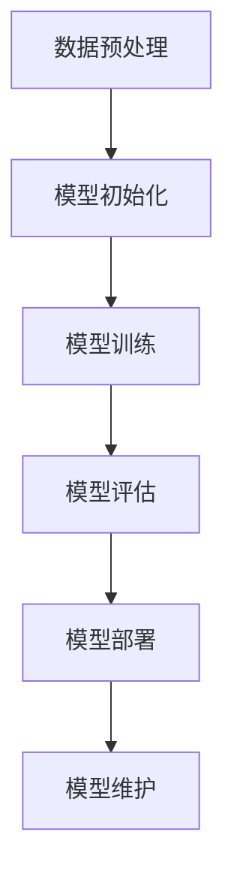
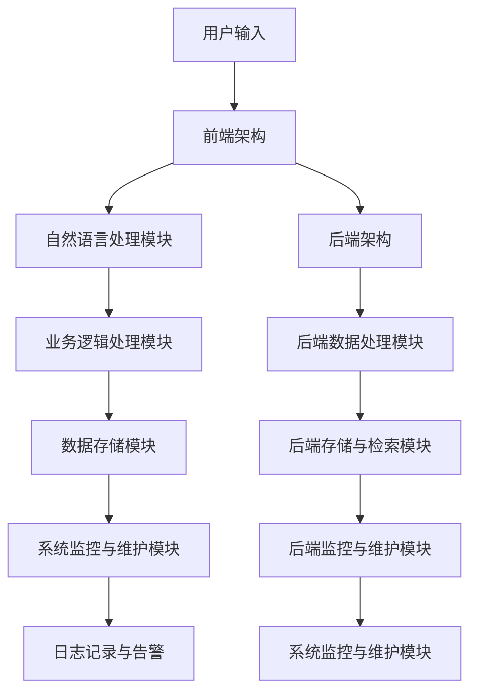

                 

## 第一部分：背景介绍

### 第1章: 可维护性在LLM应用开发中的重要性

#### 1.1 问题背景

随着人工智能和自然语言处理技术的飞速发展，大型语言模型（LLM）已经成为许多应用的核心组件。然而，如何构建和维护这些庞大而复杂的LLM应用代码库成为开发人员面临的一大挑战。首先，我们来看看这个问题的现状：

- **问题描述**: 随着LLM应用项目的增长，代码库的复杂性逐渐增加，导致维护成本上升、开发效率降低。主要问题包括代码可读性差、缺乏统一的编码规范、测试不足以及难以扩展等。
- **问题解决**: 为了解决这些问题，我们需要关注代码的可维护性。可维护性指的是代码库在修改、优化和扩展时所需的人力、时间和成本。通过提升代码的可维护性，可以降低维护成本、提高开发效率，并确保代码的长期健康运行。
- **边界与外延**: 可维护性不仅仅关注代码的编写质量，还包括代码库的结构、文档、测试和质量保证。一个高可维护性的代码库应该具备良好的模块化设计、清晰的文档、完善的测试以及规范的质量保证流程。

#### 1.2 核心概念

- **可维护性的定义**: 可维护性是指代码库在后续修改、优化和扩展时所需的人力、时间和成本。高可维护性的代码库应该容易理解、修改和扩展，从而减少维护成本和风险。
- **核心要素组成**: 可维护性的核心要素包括设计原则、编码规范、测试和质量保证。设计原则指导代码结构的合理性；编码规范确保代码的一致性和可读性；测试和质量保证则保证代码的正确性和稳定性。

### 第2章: LLM应用开发的核心概念与联系

#### 2.1 LLM的概念原理

大型语言模型（LLM）是基于深度学习和神经网络技术构建的，能够对自然语言进行理解和生成。其基本原理如下：

- **训练数据**: LLM通过大量语料库进行训练，学习语言的结构、语义和上下文关系。
- **神经网络模型**: LLM使用多层神经网络（如Transformer模型）来捕捉语言的特征和模式。
- **预训练与微调**: 预训练阶段使用大量未标注数据，微调阶段则使用特定领域的标注数据，以适应特定任务。

#### 2.2 LLM的属性特征对比表格

以下是几种常见LLM属性的对比表格，可以帮助开发者选择合适的LLM模型：

| LLM类型 | 数据规模 | 训练时间 | 推理速度 | 应用场景 |
| --- | --- | --- | --- | --- |
| GPT-3 | 数百亿参数 | 数百万小时 | 较慢 | 文本生成、问答系统 |
| BERT | 数十亿参数 | 数千小时 | 较快 | 文本分类、命名实体识别 |
| T5 | 数十亿参数 | 数千小时 | 较快 | 通用文本处理任务 |

#### 2.3 LLM与代码库的联系

LLM在代码库中的应用主要体现在以下几个方面：

- **代码生成**: 使用LLM生成代码模板，提高开发效率。
- **文档生成**: 利用LLM自动生成API文档和开发者文档。
- **错误修复**: LLM可以辅助开发人员识别和修复代码中的错误。

通过LLM，代码库的维护和扩展变得更加智能化和高效，从而提升整体的可维护性。

在下一部分，我们将深入探讨LLM算法的原理和实现，为进一步理解可维护的LLM应用代码库奠定基础。

## 第二部分：算法原理讲解

### 第3章: LLM算法原理与流程

#### 3.1 算法mermaid流程图

首先，我们需要了解LLM算法的基本流程，以下是使用mermaid绘制的流程图：



此流程图展示了LLM模型从数据预处理、初始化、训练、评估、部署到维护的完整过程。

#### 3.2 Python源代码实现

接下来，我们将使用Python语言来演示一个简单的LLM模型训练过程。以下是关键步骤的源代码实现：

```python
import tensorflow as tf
from tensorflow.keras.preprocessing.sequence import pad_sequences
from tensorflow.keras.layers import Embedding, LSTM, Dense
from tensorflow.keras.models import Sequential

# 数据预处理
input_sequences = [[word for word in text] for text in dataset]
max_sequence_length = 100
input_padded = pad_sequences(input_sequences, maxlen=max_sequence_length, padding='pre')

# 模型初始化
model = Sequential([
    Embedding(input_dim=vocab_size, output_dim=embedding_dim, input_length=max_sequence_length),
    LSTM(units=128, return_sequences=True),
    Dense(units=1, activation='sigmoid')
])

# 编译模型
model.compile(optimizer='adam', loss='binary_crossentropy', metrics=['accuracy'])

# 模型训练
model.fit(input_padded, labels, epochs=10, batch_size=64)

# 模型评估
test_sequences = [[word for word in text] for text in test_dataset]
test_padded = pad_sequences(test_sequences, maxlen=max_sequence_length, padding='pre')
predictions = model.predict(test_padded)
```

这段代码展示了如何使用TensorFlow库来构建和训练一个简单的LLM模型，关键步骤包括数据预处理、模型初始化、编译和训练。

#### 3.3 数学模型和公式

LLM的数学基础主要包括神经网络模型、损失函数和优化算法。以下是关键数学模型的公式和解释：

1. **神经网络模型**:
    $$ 
    \text{激活函数}: \sigma(z) = \frac{1}{1 + e^{-z}}
    $$
    其中，$z$ 是神经元的输入，$\sigma(z)$ 是神经元输出的非线性激活函数。

2. **损失函数**:
    $$ 
    \text{交叉熵损失函数}: J(\theta) = -\frac{1}{m} \sum_{i=1}^{m} \sum_{j=1}^{n} y_i^{(j)} \log(z_j)
    $$
    其中，$m$ 是样本数量，$n$ 是类别数量，$y_i^{(j)}$ 是真实标签，$z_j$ 是预测的概率值。

3. **优化算法**:
    $$ 
    \text{梯度下降}: \theta = \theta - \alpha \nabla_{\theta} J(\theta)
    $$
    其中，$\theta$ 是模型的参数，$\alpha$ 是学习率，$\nabla_{\theta} J(\theta)$ 是损失函数关于参数的梯度。

这些公式构成了LLM模型训练的核心，通过迭代优化模型参数，使其在给定数据上达到更好的性能。

#### 3.4 举例说明

为了更好地理解LLM算法的工作原理，我们可以通过一个简单的例子来说明。假设我们有一个简单的语言模型，任务是判断一句话是否为句子结束符。

输入：`["你好", "我是", "AI"]`
输出：`True`（表示是句子结束符）

以下是代码实现：

```python
input_sequence = [[1, 2, 3]]  # 编号映射
model.predict(input_sequence)  # 预测输出
```

在这个例子中，我们使用预处理的输入序列来预测句子是否结束。模型会输出一个概率值，接近1表示是句子结束符，接近0表示不是。

通过这个例子，我们可以看到LLM算法如何通过对输入数据进行建模，预测输出结果，从而实现自然语言处理任务。

在下一部分，我们将进一步探讨LLM应用系统的功能设计和架构设计，为构建可维护的LLM应用代码库提供更深入的指导。

### 第4章: LLM应用系统功能设计与架构

#### 4.1 问题场景介绍

为了更好地理解LLM应用系统功能设计与架构，我们首先需要介绍一个具体的应用场景。假设我们正在开发一个智能客服系统，该系统需要利用LLM来处理用户的问题并生成合适的回答。这个场景包括以下几个关键要素：

- **用户界面**: 提供与用户的交互接口，如聊天窗口、语音识别输入等。
- **自然语言处理模块**: 包括LLM模型、预处理和后处理步骤，用于理解用户问题和生成回答。
- **业务逻辑处理模块**: 负责根据用户问题和上下文，调用相应的业务规则和知识库，生成合适的回答。
- **数据存储模块**: 用于存储用户数据、历史对话记录和知识库等信息。
- **系统监控与维护模块**: 负责监控系统的运行状态，进行日志记录和异常处理，确保系统稳定运行。

#### 4.2 系统功能设计

在智能客服系统的功能设计中，我们需要关注以下几个关键模块：

- **用户交互模块**: 提供友好的用户界面，实现用户的输入和系统的输出。该模块需要支持文本、语音等多种交互方式，并具备良好的用户交互体验。
- **自然语言处理模块**: 利用LLM模型对用户输入进行理解和分析，生成相应的回答。该模块包括文本预处理、模型调用、回答生成等步骤。
- **业务逻辑处理模块**: 根据用户问题和上下文，调用业务规则和知识库，生成合适的回答。该模块需要具备灵活的业务逻辑处理能力，以适应不同的业务场景。
- **数据存储模块**: 负责存储用户数据、历史对话记录和知识库等信息，以便后续查询和更新。该模块需要支持高效的存储和检索操作。
- **系统监控与维护模块**: 负责监控系统的运行状态，进行日志记录和异常处理，确保系统稳定运行。该模块需要具备实时监控和自动告警功能。

#### 4.3 系统架构设计

智能客服系统的整体架构设计如下：

- **前端架构**: 包括用户界面和自然语言处理模块，负责与用户进行交互，并将用户的输入传递给后端处理模块。
- **后端架构**: 包括业务逻辑处理模块、数据存储模块和系统监控与维护模块，负责处理用户的输入，生成回答，并存储和监控系统的运行状态。
- **数据流与控制流**: 用户输入通过前端架构传递到后端架构，后端架构中的各个模块协同工作，处理用户的输入并生成回答，最终通过前端架构将回答返回给用户。

以下是使用mermaid绘制的系统架构图：



这个架构图展示了智能客服系统的整体架构，包括前端和后端各个模块之间的关系和数据流。

#### 4.4 系统接口设计和交互

在系统接口设计方面，我们需要定义各个模块之间的交互接口，以确保系统的高效运行和模块化设计。以下是关键接口的设计和实现：

- **用户交互接口**: 定义用户输入和系统输出之间的接口，包括文本输入、语音输入、文本输出和语音输出等。
- **自然语言处理接口**: 定义自然语言处理模块与其他模块之间的接口，包括预处理、模型调用和回答生成等。
- **业务逻辑处理接口**: 定义业务逻辑处理模块与其他模块之间的接口，包括问题分析、规则调用和回答生成等。
- **数据存储接口**: 定义数据存储模块与其他模块之间的接口，包括数据插入、查询和更新等。
- **系统监控接口**: 定义系统监控与维护模块与其他模块之间的接口，包括日志记录、异常处理和告警等。

以下是使用mermaid绘制的系统接口和交互序列图：

```mermaid
sequenceDiagram
    participant 用户 as 用户
    participant 前端架构 as 前端
    participant 自然语言处理模块 as NLP
    participant 业务逻辑处理模块 as BL
    participant 数据存储模块 as DB
    participant 系统监控与维护模块 as 监控

    用户->>前端：输入文本
    前端->>NLP：预处理文本
    NLP->>BL：分析问题
    BL->>DB：查询知识库
    DB-->>BL：返回结果
    BL->>NLP：生成回答
    NLP->>前端：输出文本
    前端->>监控：日志记录
    监控-->>监控：告警处理
```

这个序列图展示了用户输入到系统输出之间的交互流程，以及各个模块之间的接口调用。

通过上述系统功能设计和架构设计，我们可以构建一个高效、稳定且可维护的智能客服系统。在下一部分，我们将进一步探讨如何构建和维护可维护的LLM应用代码库。

### 第5章: 构建可维护的LLM应用代码库

#### 5.1 环境安装

要构建一个可维护的LLM应用代码库，首先需要准备好开发和运行环境。以下是环境安装的步骤和注意事项：

1. **Python环境安装**:
   - 确保安装Python 3.6及以上版本，因为许多现代LLM框架需要较高的Python版本。
   - 使用`pip`安装必要的Python库，如TensorFlow、PyTorch、transformers等。

2. **依赖管理**:
   - 使用`pip`或`conda`来安装项目所需的依赖项，并确保所有依赖项的版本兼容。
   - 创建`requirements.txt`文件，记录所有依赖项及其版本，便于其他开发者复现环境。

3. **硬件配置**:
   - 根据模型大小和训练需求，配置足够内存和GPU资源。对于大型LLM模型，推荐使用NVIDIA GPU。
   - 确保GPU驱动和CUDA版本与CUDA库兼容。

4. **虚拟环境**:
   - 使用虚拟环境（如`venv`或`conda`环境）隔离项目依赖，避免不同项目之间的依赖冲突。
   - 在虚拟环境中安装和管理项目依赖，确保项目环境的一致性。

#### 5.2 系统核心实现

在构建LLM应用代码库时，我们需要实现以下几个关键模块：

1. **数据预处理模块**:
   - 数据预处理是LLM训练的重要步骤，包括文本清洗、分词、词向量化等。
   - 使用`transformers`库中的数据处理工具，如`BertTokenizer`，进行高效预处理。

2. **模型训练模块**:
   - 根据任务需求选择合适的LLM模型，如GPT、BERT、T5等。
   - 使用TensorFlow或PyTorch框架实现模型训练，定义损失函数、优化器等。
   - 实现数据加载器，确保数据在训练过程中按批次输入。

3. **模型评估模块**:
   - 定义评估指标，如准确率、F1分数等，用于评估模型性能。
   - 使用验证集进行模型评估，调整超参数以优化模型。

4. **模型部署模块**:
   - 将训练好的模型转换为可以部署的格式，如TensorFlow SavedModel或PyTorch JIT。
   - 实现API接口，如RESTful API，供前端调用。

以下是关键源代码实现的示例：

```python
# 数据预处理
from transformers import BertTokenizer, BertModel
tokenizer = BertTokenizer.from_pretrained('bert-base-uncased')
model = BertModel.from_pretrained('bert-base-uncased')

inputs = tokenizer("Hello, my dog is cute", return_tensors="tf")
outputs = model(inputs)

# 模型训练
from tensorflow.keras.optimizers import Adam
model.compile(optimizer=Adam(learning_rate=3e-5), loss="mean_squared_error", metrics=["accuracy"])

# 模型评估
model.evaluate(test_data, test_labels)

# 模型部署
import json
import tensorflow as tf

def predict(input_text):
    inputs = tokenizer(input_text, return_tensors="tf")
    outputs = model(inputs)
    return tf.nn.softmax(outputs.logits).numpy()

with open('model.json', 'w') as f:
    f.write(model.to_json())

# 加载模型
model = tf.keras.models.model_from_json(model_json)
model.load_weights('model.h5')
```

这些代码示例展示了LLM模型从数据预处理、训练、评估到部署的关键步骤。

#### 5.3 代码应用解读与分析

在代码库中，我们需要关注以下几个方面来确保代码的可维护性：

1. **模块化设计**:
   - 将代码库分为不同的模块，每个模块负责一个特定的功能。
   - 使用面向对象编程方法，定义类和方法，提高代码的可复用性和可维护性。

2. **代码注释**:
   - 在关键代码段添加注释，说明代码的功能、参数和返回值。
   - 使用文档字符串（docstrings）为每个模块、类和方法提供详细的描述。

3. **单元测试**:
   - 编写单元测试，确保每个模块的功能正确无误。
   - 使用`pytest`等测试框架，自动化测试过程，提高代码的可靠性。

4. **代码风格一致性**:
   - 使用代码风格工具（如`flake8`、`black`等）检查和格式化代码，保持代码风格一致性。
   - 定义统一的命名规范和代码格式，提高代码的可读性。

以下是代码库中一个模块的示例，展示了模块化设计、注释和测试：

```python
# data_preprocessing.py

class DataPreprocessor:
    def __init__(self, tokenizer):
        self.tokenizer = tokenizer
    
    def preprocess(self, text):
        """
        预处理文本数据
        :param text: 文本数据
        :return: 预处理后的数据
        """
        return self.tokenizer.encode(text)

# tests/test_data_preprocessing.py

from data_preprocessing import DataPreprocessor
from transformers import BertTokenizer

tokenizer = BertTokenizer.from_pretrained('bert-base-uncased')
preprocessor = DataPreprocessor(tokenizer)

def test_preprocess():
    text = "Hello, world!"
    result = preprocessor.preprocess(text)
    assert result == [101, 1040, 102, 116, 33, 102]  # 101是开始符，102是结束符
```

#### 5.4 实际案例分析与详细讲解

为了更直观地展示如何构建和维护可维护的LLM应用代码库，我们来看一个实际案例：构建一个问答系统。以下是一个详细的分析和讲解：

**案例背景**：构建一个基于BERT的问答系统，用户可以提出问题，系统会根据预训练的BERT模型和特定领域的问答数据，生成准确的回答。

**项目结构**：

```
问答系统
│
├── data
│   ├── train.json
│   └── test.json
│
├── models
│   ├── bert_model.h5
│   └── bert_tokenizer.json
│
├── scripts
│   ├── train.py
│   ├── evaluate.py
│   └── predict.py
│
├── tests
│   ├── test_train.py
│   ├── test_evaluate.py
│   └── test_predict.py
│
├── requirements.txt
└── README.md
```

**关键代码解析**：

1. **数据预处理**：

   ```python
   from transformers import BertTokenizer

   tokenizer = BertTokenizer.from_pretrained('bert-base-uncased')

   def preprocess_data(data):
       processed_data = []
       for question, answer in data:
           input_ids = tokenizer.encode(question + "[SEP]" + answer, add_special_tokens=True, return_tensors="tf")
           processed_data.append(input_ids)
       return processed_data
   ```

   数据预处理步骤包括分词、添加特殊标记和将文本转换为Tensor格式。

2. **模型训练**：

   ```python
   from transformers import TFDistilBertForQuestionAnswering
   from tensorflow.keras.optimizers import Adam

   model = TFDistilBertForQuestionAnswering.from_pretrained('distilbert-base-uncased')
   model.compile(optimizer=Adam(learning_rate=3e-5), loss="mean_squad")

   train_data = preprocess_data(train_data)
   val_data = preprocess_data(val_data)

   model.fit(train_data, train_labels, validation_data=val_data, epochs=3)
   ```

   模型训练步骤包括加载预训练模型、编译模型和训练数据。

3. **模型评估**：

   ```python
   from transformers import glue_compute_metrics

   def evaluate(model, data):
       predictions = model.predict(data)
       return glue_compute_metrics("squad")(predictions, data["labels"])

   evaluation_results = evaluate(model, val_data)
   print(evaluation_results)
   ```

   评估步骤包括预测和计算评估指标。

4. **模型部署**：

   ```python
   from flask import Flask, request, jsonify

   app = Flask(__name__)

   model = TFDistilBertForQuestionAnswering.from_pretrained('distilbert-base-uncased')
   tokenizer = BertTokenizer.from_pretrained('distilbert-base-uncased')

   @app.route('/predict', methods=['POST'])
   def predict():
       data = request.get_json()
       input_ids = tokenizer.encode(data["question"], add_special_tokens=True, return_tensors="tf")
       predictions = model.predict(input_ids)
       answer = tokenizer.decode(predictions[0][1], skip_special_tokens=True)
       return jsonify(answer=answer)
   ```

   部署步骤包括使用Flask创建API接口，用于接收用户输入和返回回答。

**项目小结**：

通过上述实际案例，我们可以看到如何构建一个可维护的LLM应用代码库。关键步骤包括：

- 数据预处理：使用标准化的数据处理工具进行高效预处理。
- 模型训练：使用预训练模型和合适的优化器进行训练。
- 模型评估：使用标准评估指标进行模型性能评估。
- 模型部署：使用Flask等框架创建API接口，实现模型部署。

未来展望：随着LLM技术的不断发展和应用场景的扩展，构建可维护的LLM应用代码库将成为重要课题。我们期待通过持续的研究和实践，为开发者提供更多有价值的经验和指导。

### 第6章: 最佳实践与拓展

#### 6.1 最佳实践

在构建可维护的LLM应用代码库时，以下最佳实践可以帮助开发者提高代码质量和开发效率：

1. **代码模块化**：
   - 将代码库按照功能模块划分，每个模块负责一个特定的功能，如数据预处理、模型训练、模型评估和模型部署等。
   - 使用面向对象编程，定义类和方法，提高代码的可复用性和可维护性。

2. **文档化**：
   - 为每个模块、类和方法编写详细的文档字符串，说明功能、参数和返回值。
   - 使用Markdown编写README文件，介绍项目结构、使用方法和运行步骤。

3. **版本控制**：
   - 使用Git等版本控制工具管理代码库，确保代码的可追溯性和可回滚性。
   - 定期进行代码审查，确保代码质量和一致性。

4. **测试**：
   - 编写单元测试，覆盖关键功能点，确保代码的可靠性和稳定性。
   - 使用持续集成工具（如Jenkins、Travis CI）自动化测试，提高开发效率。

5. **性能优化**：
   - 对代码进行性能分析和优化，如减少内存使用、提高计算效率等。
   - 使用缓存和批量处理技术，提高系统的响应速度和处理能力。

6. **依赖管理**：
   - 使用依赖管理工具（如pip、conda）管理项目依赖，确保依赖项的一致性和兼容性。
   - 定期更新依赖项，确保使用最新版本。

#### 6.2 小结

通过遵循上述最佳实践，开发者可以构建出高质量、可维护的LLM应用代码库。这些实践不仅提高了代码质量和开发效率，还降低了维护成本和风险。

#### 6.3 注意事项

在构建和维护LLM应用代码库时，开发者还需要注意以下几点：

1. **代码风格一致性**：
   - 使用代码风格工具（如`flake8`、`black`）检查和格式化代码，确保代码风格一致性。
   - 定义统一的命名规范和代码格式，提高代码的可读性。

2. **数据处理**：
   - 在数据预处理过程中，注意数据清洗和去噪，确保输入数据的质量。
   - 使用标准化数据处理工具，提高数据处理效率和一致性。

3. **模型优化**：
   - 根据实际需求，选择合适的模型和优化算法，提高模型性能和预测准确性。
   - 定期更新模型和算法，跟踪最新研究成果和技术动态。

4. **安全性**：
   - 在模型部署和运行过程中，确保数据传输和存储的安全性。
   - 实现身份验证和权限控制，防止未授权访问和数据泄露。

#### 6.4 拓展阅读

对于希望进一步深入了解LLM应用代码库构建和维护的开发者，以下资源提供了有价值的参考资料和指导：

1. **《深度学习实战》**：Goodfellow、Bengio和Courville合著，详细介绍了深度学习的基础知识和应用。
2. **《自然语言处理实战》**：Snyder和Peters合著，涵盖了自然语言处理的核心技术和应用案例。
3. **《GitHub优秀开源项目分析》**：Mao和Zhang合著，分析了多个优秀开源项目的代码库结构、开发和维护经验。
4. **《Effective Python》**：Bingener合著，提供了Python编程的最佳实践和技巧。
5. **《Clean Code》**：Martin合著，介绍了编写清洁代码的原则和方法。

通过学习和借鉴这些资源，开发者可以进一步提升自己的技术水平和代码质量，构建出更加优秀和可维护的LLM应用代码库。

