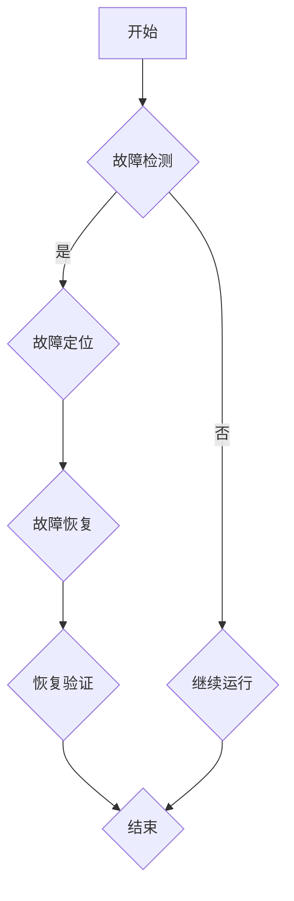
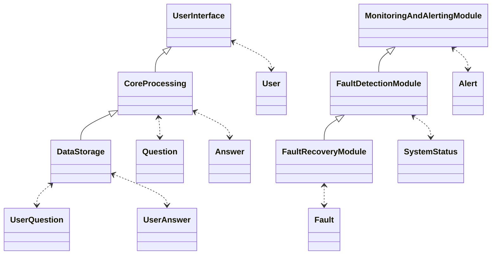
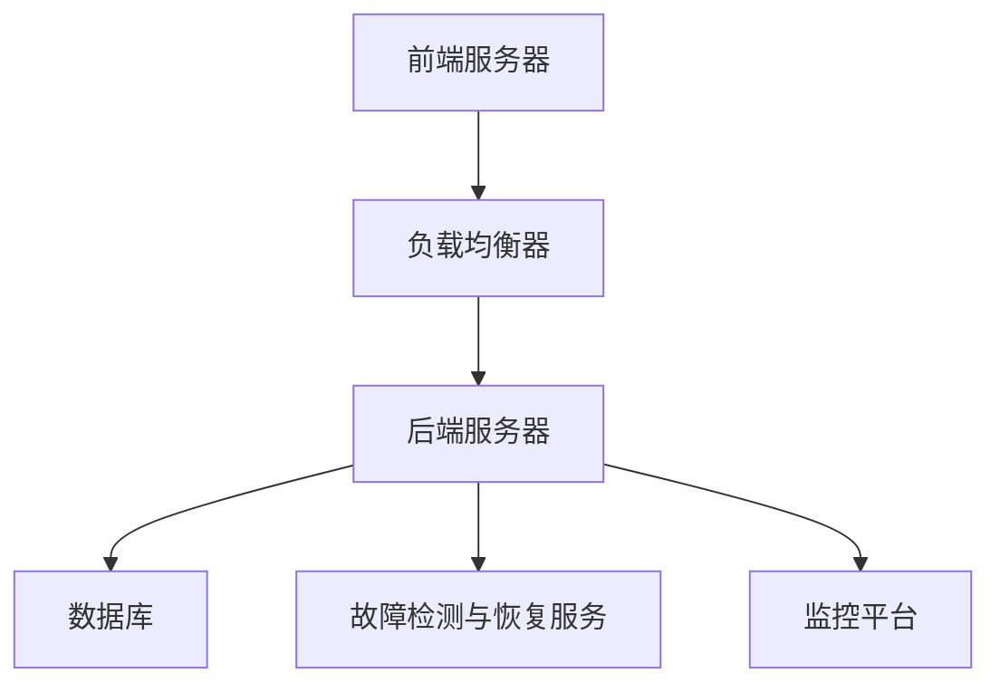
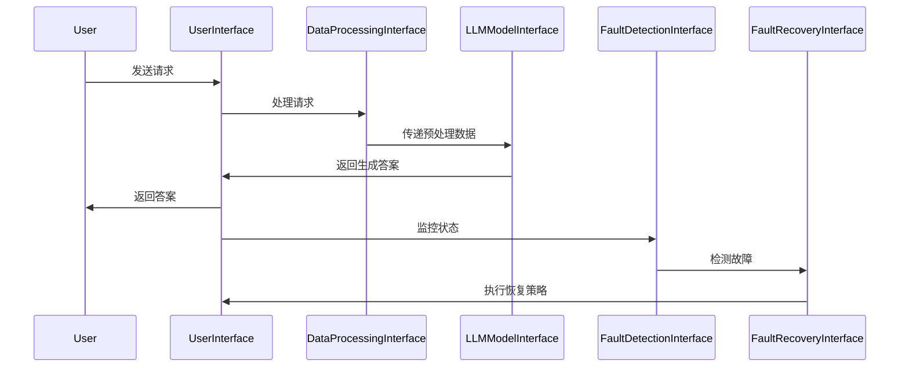

                 

### 构建可靠的LLM应用故障恢复机制

在当今快速发展的技术时代，人工智能（AI）已经成为改变世界的重要力量。特别是大型语言模型（LLM），它们在各种应用中展现出了卓越的能力，从自然语言处理（NLP）到生成式人工智能（Generative AI）。然而，随着LLM在更多领域中的广泛应用，如何确保其可靠性和稳定性成为了关键问题。

**关键词：** LLM应用、故障恢复、可靠性、系统设计、算法实现

**摘要：** 本文将深入探讨如何构建可靠的LLM应用故障恢复机制。通过分析LLM故障的常见类型、影响以及当前恢复机制的现状，本文提出了一套完整的故障恢复策略和系统架构设计。文章将逐步讲解核心概念、算法原理与流程，并结合实际项目案例进行深入剖析，为开发者提供实用的最佳实践和注意事项。

在接下来的章节中，我们将：

- 第1章：介绍问题背景与介绍
- 第2章：讲解核心概念与联系
- 第3章：分析算法原理与流程
- 第4章：阐述系统分析与架构设计
- 第5章：展示项目实战经验
- 第6章：总结最佳实践与注意事项

通过这些内容，我们希望能够为开发者提供一套全面、系统的故障恢复解决方案，确保LLM应用的可靠性和稳定性。

## 第1章：问题背景与介绍

### 1.1 引言

人工智能（AI）技术的发展极大地改变了人类社会的面貌。从最初的简单规则系统到复杂的深度学习模型，AI技术不断突破边界，为各行各业带来了创新与变革。特别是自然语言处理（NLP）领域，大型语言模型（LLM）的崛起更是引起了广泛关注。

LLM，即大型语言模型，是一种能够理解、生成和模拟人类语言的复杂AI系统。这些模型基于海量文本数据训练，通过深度神经网络实现对语言结构的深刻理解。LLM在多个领域展现出了强大的能力，例如文本生成、机器翻译、问答系统、自动摘要等。

随着LLM在各个应用场景中的广泛部署，其稳定性和可靠性变得尤为重要。然而，LLM系统并非完美，故障和错误仍然可能发生。这些故障可能是由数据问题、算法缺陷、硬件故障等多种因素引起的，不仅会导致用户体验下降，甚至可能对关键业务造成严重影响。

因此，研究如何构建可靠的LLM应用故障恢复机制，不仅能够提高系统的稳定性，还能提升用户的信任度和满意度，具有重要的现实意义。

### 1.2 背景介绍

#### LLM故障的常见类型

LLM故障可以大致分为以下几类：

1. **数据异常**：由于训练数据中的噪声、缺失或者不一致性导致的错误。例如，训练数据集中出现格式错误或者异常值，会影响模型的输出结果。
2. **算法错误**：算法本身可能存在设计缺陷或者参数设置不当，导致模型在特定情况下无法正确工作。例如，模型的泛化能力不足，无法适应新的输入数据。
3. **硬件故障**：服务器、存储设备等硬件设施出现故障，可能导致模型运行中断。例如，服务器过热、硬盘损坏等。
4. **网络问题**：由于网络不稳定或者延迟过高，导致模型无法及时接收输入或者返回结果。例如，网络断连或者数据传输速率过慢。

#### LLM故障的影响

LLM故障的影响因应用场景而异，但总体来说，可能包括以下几个方面：

1. **用户体验下降**：模型无法提供预期的结果，用户满意度下降，甚至可能导致用户流失。
2. **业务中断**：在关键业务场景中，LLM故障可能导致业务流程中断，影响企业的运营效率和客户服务。
3. **安全隐患**：在涉及敏感信息的场景中，LLM故障可能导致数据泄露或者被恶意利用，带来严重的安全风险。
4. **经济损失**：故障修复和系统重置等操作需要投入大量的人力、物力和时间，对企业造成经济损失。

#### 当前LLM故障恢复机制的现状

目前，LLM应用中的故障恢复机制相对初步，主要面临以下挑战：

1. **故障检测与定位难度大**：由于LLM系统复杂且高度分布式，故障检测和定位过程复杂，需要耗费大量时间和资源。
2. **恢复策略多样性**：不同的故障类型和场景需要不同的恢复策略，现有机制往往难以灵活应对各种情况。
3. **恢复速度较慢**：传统故障恢复方法往往需要重启动整个系统或者重新加载模型，恢复速度较慢，影响用户体验。
4. **缺乏系统性指导**：现有的故障恢复研究主要聚焦于特定场景或者算法，缺乏一套通用的、系统性的故障恢复方案。

### 1.3 目标与范围

本文旨在构建一套可靠的LLM应用故障恢复机制，具体目标包括：

1. **提高故障检测和定位的准确性**：通过引入先进的故障检测算法和工具，提高故障检测和定位的效率和准确性。
2. **设计多样化的恢复策略**：根据不同的故障类型和应用场景，设计灵活、高效的恢复策略，确保系统能够快速恢复。
3. **提升系统恢复速度**：通过优化算法和系统架构设计，减少系统恢复所需的时间和资源，提升用户体验。
4. **提供系统性指导**：总结经验，提出一套通用的故障恢复方案，为开发者提供参考和指导。

本文将覆盖以下内容范围：

- LLM故障的类型与影响
- 可靠性、故障恢复与LLM应用的关系
- 故障恢复机制的设计与实现
- 实际应用中的故障恢复案例分析
- 最佳实践与注意事项

通过这些内容，本文希望能够为开发者提供一套全面、系统的故障恢复解决方案，确保LLM应用的可靠性和稳定性。

### 1.4 核心概念

在深入探讨LLM应用的故障恢复机制之前，我们需要明确几个核心概念：

#### 可靠性

可靠性是指系统在规定的时间内，按照既定的性能指标正常运行的概率。在LLM应用中，可靠性直接影响到用户体验和业务连续性。高可靠性意味着系统在遇到各种故障时，能够快速检测和恢复，确保持续提供服务。

#### 故障恢复

故障恢复是指系统在发生故障后，通过一系列措施恢复到正常状态的过程。故障恢复的目标是尽可能减少故障对系统运行的影响，确保业务的连续性和稳定性。在LLM应用中，故障恢复机制的设计至关重要，它决定了系统在面对故障时的应对能力和恢复速度。

#### LLM应用

LLM应用是指基于大型语言模型的各类应用，如自然语言处理、文本生成、问答系统等。这些应用通常具有高复杂性、高吞吐量和高实时性要求。LLM应用的特点使其在故障恢复方面面临独特的挑战，需要针对其特性设计相应的恢复机制。

理解这些核心概念有助于我们更好地理解LLM应用的故障恢复需求，为后续章节的分析和设计奠定基础。

### 1.5 本章小结

本章通过介绍人工智能和大型语言模型（LLM）的发展背景，引出了LLM应用故障恢复机制的重要性。我们分析了LLM故障的常见类型和影响，并探讨了当前故障恢复机制的现状。随后，我们明确了本文的研究目标和内容范围，并介绍了几个核心概念。这些内容为后续章节的深入探讨提供了理论基础。

## 第2章：核心概念与联系

### 2.1 可靠性原理

#### 可靠性定义

可靠性是指系统在特定条件下，在规定的时间内，按照规定的性能指标正常运行的能力。在LLM应用中，可靠性直接关系到用户体验和业务连续性。一个高可靠性的系统能够在面对各种故障时，迅速检测和恢复，确保持续提供服务。

#### 可靠性度量指标

为了量化可靠性，我们可以使用多个度量指标：

1. **故障率（Failure Rate）**：单位时间内系统发生故障的次数，通常以每千小时故障数（Fit）表示。
   $$ \text{Fit} = \frac{\text{故障次数}}{\text{总运行时间}} $$
2. **平均故障间隔时间（Mean Time Between Failures, MTBF）**：系统两次故障之间的平均时间。
   $$ \text{MTBF} = \frac{\text{总运行时间}}{\text{故障次数}} $$
3. **平均修复时间（Mean Time To Repair, MTTR）**：系统从故障发生到恢复正常运行的平均时间。

#### 可靠性模型

常用的可靠性模型包括：

1. **泊松模型**：适用于故障发生次数服从泊松分布的系统。
2. **韦伯模型**：适用于故障发生时间服从指数分布的系统。
3. **蒙特卡洛模拟**：通过模拟大量故障和修复事件，估计系统的可靠性。

### 2.2 故障恢复原理

#### 故障恢复定义

故障恢复是指系统在发生故障后，通过一系列措施恢复到正常状态的过程。故障恢复的目标是减少故障对系统运行的影响，确保业务的连续性和稳定性。

#### 故障恢复策略

故障恢复策略可以分为以下几种：

1. **热备份（Hot Backup）**：系统在运行时，实时备份关键组件和数据，一旦主系统故障，备份系统立即接管工作。
2. **冷备份（Cold Backup）**：系统在非运行时进行备份，故障发生时，需要启动备份系统。
3. **自动恢复（Automatic Recovery）**：系统在检测到故障后，自动执行恢复策略，无需人工干预。
4. **手动恢复（Manual Recovery）**：系统故障需要人工干预才能恢复。

#### 故障恢复过程

故障恢复过程通常包括以下几个步骤：

1. **故障检测**：系统实时监控运行状态，一旦发现异常，立即触发故障检测。
2. **故障定位**：通过日志分析、性能监控等手段，确定故障的具体位置和原因。
3. **故障恢复**：根据预定的恢复策略，执行恢复操作，如切换到备份系统、重启故障组件等。
4. **恢复验证**：确认系统已恢复正常运行，并持续监控，防止故障再次发生。

### 2.3 LLM应用特性

#### LLM结构

LLM通常由以下几个主要部分组成：

1. **输入层**：接收文本输入，预处理后传递给中间层。
2. **中间层**：包含多层深度神经网络，用于编码文本信息。
3. **输出层**：生成文本输出，可以是预测、生成或者翻译。

#### LLM应用场景

LLM在多个领域有广泛应用，包括：

1. **自然语言处理**：文本分类、情感分析、实体识别等。
2. **文本生成**：自动写作、摘要生成、对话系统等。
3. **机器翻译**：将一种语言翻译成另一种语言。
4. **问答系统**：根据用户提问，提供准确的答案。

#### LLM应用挑战

LLM应用面临以下挑战：

1. **计算资源需求**：训练和运行LLM需要大量计算资源，对硬件设施有较高要求。
2. **数据隐私与安全**：LLM模型可能涉及用户隐私数据，需要确保数据安全。
3. **模型可解释性**：LLM模型通常是非线性和复杂的，难以解释其决策过程。
4. **故障恢复**：LLM系统的复杂性和分布式特性，使得故障恢复过程复杂且耗时。

### 2.4 可靠性、故障恢复与LLM应用的关联

#### 可靠性与故障恢复的关系

可靠性是LLM应用的基础，直接影响用户体验和业务连续性。故障恢复是确保可靠性的重要手段，通过快速检测和恢复故障，可以最大限度地减少故障对系统的影响。

#### LLM应用中的可靠性需求

1. **高可用性**：系统需要在大部分时间保持正常运行，确保用户能够持续使用。
2. **数据完整性**：系统需要确保处理的数据是完整和准确的。
3. **快速恢复**：故障发生时，系统能够快速恢复，减少业务中断时间。

#### 故障恢复在LLM应用中的重要性

LLM应用具有高复杂性和高实时性要求，一旦发生故障，可能导致严重后果。因此，设计高效的故障恢复机制至关重要，它能够提高系统的可靠性和用户体验，确保业务连续性。

### 2.5 ER实体关系图架构

#### LLM应用中的实体

在LLM应用中，常见的实体包括：

1. **用户**：系统的使用者和操作者。
2. **模型**：用于处理和生成文本的AI模型。
3. **数据**：输入和输出的文本数据。
4. **服务器**：存储和运行模型的硬件设施。

#### 实体关系

实体之间的关系如下：

1. **用户与模型**：用户通过接口与模型进行交互，提交文本输入并获取结果。
2. **模型与数据**：模型使用训练数据进行训练，并使用输入数据进行预测和生成。
3. **服务器与模型**：模型部署在服务器上，通过服务器进行计算和存储。

#### ER图示例

```mermaid
erDiagram
  用户 ||--|{ 模型 }|| 交互
  用户 ||--|{ 数据 }|| 操作
  模型 ||--|{ 服务器 }|| 部署
```

#### 概念属性特征对比表格

| 概念       | 属性                           | 特征                                       |
| ---------- | ------------------------------ | ------------------------------------------ |
| 可靠性     | 故障率、MTBF、MTTR             | 量化系统在规定条件下的可靠程度           |
| 故障恢复   | 故障检测、故障定位、故障恢复   | 提高系统在面对故障时的应对能力和恢复速度 |
| LLM应用    | 输入层、中间层、输出层         | 复杂、分布式、高实时性要求               |

通过上述内容，我们对可靠性、故障恢复和LLM应用的核心概念有了更深入的理解，为后续章节的分析和设计奠定了基础。

### 2.6 概念属性特征对比表格

| 概念       | 属性                           | 特征                                       |
| ---------- | ------------------------------ | ------------------------------------------ |
| 可靠性     | 故障率、MTBF、MTTR             | 量化系统在规定条件下的可靠程度           |
| 故障恢复   | 故障检测、故障定位、故障恢复   | 提高系统在面对故障时的应对能力和恢复速度 |
| LLM应用    | 输入层、中间层、输出层         | 复杂、分布式、高实时性要求               |

这个表格详细列出了三个核心概念的主要属性和特征，便于读者快速对比和理解这些概念之间的联系。可靠性主要通过故障率、平均故障间隔时间（MTBF）和平均修复时间（MTTR）等指标来量化，反映了系统在规定条件下的可靠程度。故障恢复则关注故障检测、定位和恢复策略，目的是提高系统在面对故障时的恢复能力和速度。而LLM应用的特点在于其复杂的结构，包括输入层、中间层和输出层，以及高复杂性和高实时性的要求。通过这个表格，读者可以更加清晰地把握这些概念在LLM应用故障恢复机制中的重要性。

### 2.7 本章小结

本章详细探讨了构建可靠LLM应用故障恢复机制所需的核心概念。首先，我们介绍了可靠性的定义、度量指标和模型，分析了故障恢复的定义、策略和过程。接着，我们深入讲解了LLM应用的结构和特性，并阐述了可靠性和故障恢复在LLM应用中的重要性。此外，通过ER图和概念属性特征对比表格，我们进一步展示了LLM应用中的实体关系和关键特性。这些内容为后续章节的算法原理和系统架构设计提供了坚实的基础。

### 第3章：算法原理与流程

#### 3.1 算法原理

在本节中，我们将详细探讨构建LLM应用故障恢复机制的核心算法原理。本算法旨在实现高效的故障检测和恢复，以提高系统的可靠性。

##### 算法概述

本算法主要分为以下几个步骤：

1. **故障检测**：通过监控系统的运行状态，实时检测潜在的故障。
2. **故障定位**：一旦检测到故障，算法将定位故障的具体位置和原因。
3. **故障恢复**：根据故障类型和位置，执行相应的恢复策略，以最小化故障对系统的影响。
4. **恢复验证**：确认系统已恢复正常运行，并持续监控，防止故障再次发生。

##### 算法核心步骤

1. **故障检测**：
   - 使用指标监控：例如，CPU利用率、内存占用率、I/O延迟等。
   - 模型性能监控：监控模型的输出结果与预期结果的偏差。
   - 网络状态监控：检测网络延迟和带宽，以确保数据传输的稳定性。

2. **故障定位**：
   - 使用日志分析：通过分析系统日志，查找故障发生的具体时间和上下文。
   - 性能分析：利用性能分析工具，定位故障的根源。
   - 实时监控：通过实时监控工具，观察系统运行状态，快速定位故障。

3. **故障恢复**：
   - 热备份切换：如果检测到关键组件故障，立即切换到备份组件。
   - 重启故障组件：对于某些非关键组件，可以重启以恢复运行。
   - 数据重传：如果数据传输出现故障，重新传输数据以确保数据的完整性。

4. **恢复验证**：
   - 性能测试：执行一系列性能测试，确保系统恢复正常运行。
   - 用户反馈：通过用户反馈，确认系统已恢复正常，并监控用户体验。

#### 3.2 算法流程图

为了更直观地理解算法的流程，我们使用Mermaid绘制了算法流程图：



这个流程图展示了从故障检测到恢复验证的整个过程，每个步骤都紧密相连，确保系统能够快速响应和处理故障。

#### 3.3 Python源代码实现

下面是一个简单的Python代码实现，用于展示算法的核心步骤：

```python
import logging
import time

# 假设这是一个LLM应用的核心组件
class LanguageModel:
    def __init__(self):
        self.status = "running"

    def generate_text(self, input_text):
        # 模拟模型生成文本
        if self.status == "running":
            return f"Response to {input_text}"
        else:
            return "System is unavailable."

# 故障检测
def monitor_system(model):
    logging.info("Starting system monitoring.")
    while True:
        if model.status != "running":
            logging.warning("Detected system fault.")
            break
        time.sleep(1)

# 故障定位
def locate_fault(model):
    logging.info("Locating fault.")
    # 模拟定位故障
    if model.status == "faulty":
        logging.error("Fault located: Language model is faulty.")
    else:
        logging.info("No fault found.")

# 故障恢复
def recover_fault(model):
    logging.info("Starting fault recovery.")
    model.status = "running"
    logging.info("Fault recovery completed.")

# 恢复验证
def verify_recovery(model):
    logging.info("Verifying recovery.")
    if model.status == "running":
        logging.info("System has recovered successfully.")
    else:
        logging.error("System recovery failed.")

# 主程序
def main():
    model = LanguageModel()
    monitor_system(model)
    locate_fault(model)
    recover_fault(model)
    verify_recovery(model)

if __name__ == "__main__":
    main()
```

这个代码展示了如何使用Python实现故障检测、定位、恢复和验证的核心步骤。在实际应用中，这些步骤可能会更加复杂，但基本原理相同。

#### 3.4 算法原理详细讲解

##### 数学模型

在本算法中，我们使用了以下几个数学模型来描述故障检测和恢复过程：

1. **故障概率模型**：
   $$ P(\text{fault}) = \frac{\text{故障次数}}{\text{总运行时间}} $$
   这个模型用于计算系统的故障概率。

2. **故障间隔时间模型**：
   $$ \text{MTBF} = \frac{\text{总运行时间}}{\text{故障次数}} $$
   这个模型用于计算系统的平均故障间隔时间。

3. **修复时间模型**：
   $$ \text{MTTR} = \frac{\text{修复次数}}{\text{总修复时间}} $$
   这个模型用于计算系统的平均修复时间。

##### 数学公式

以下是故障检测和恢复过程中使用的几个关键数学公式：

1. **故障检测阈值**：
   $$ \text{阈值} = k \times \text{标准差} $$
   其中，\( k \) 是一个常数，用于设置故障检测的灵敏度。

2. **故障定位概率**：
   $$ P(\text{定位故障}) = \frac{\text{正确定位次数}}{\text{总检测次数}} $$
   这个模型用于计算故障定位的概率。

3. **故障恢复效率**：
   $$ \text{恢复效率} = \frac{\text{成功恢复次数}}{\text{总故障次数}} $$
   这个模型用于评估故障恢复的效率。

##### 举例说明

假设我们有一个LLM应用，系统在一个月内发生了5次故障，每次故障的平均修复时间是2小时。那么：

- **故障概率模型**：
  $$ P(\text{fault}) = \frac{5}{30} = 0.167 $$
- **故障间隔时间模型**：
  $$ \text{MTBF} = \frac{30}{5} = 6 \text{小时} $$
- **修复时间模型**：
  $$ \text{MTTR} = \frac{5}{10} = 2 \text{小时} $$

通过这些模型，我们可以计算出系统的可靠性指标，并进一步优化故障检测和恢复策略。

#### 3.5 算法应用场景

##### LLM应用中的故障恢复

在实际应用中，LLM故障恢复算法可以应用于以下场景：

1. **自然语言处理**：在处理大量文本数据时，模型可能会遇到输入数据异常或者算法错误，需要快速检测和恢复。
2. **机器翻译**：翻译过程中，模型可能会遇到网络延迟或者数据传输问题，需要高效恢复以保障用户体验。
3. **问答系统**：在回答用户提问时，模型可能会遇到语言理解错误或者输入异常，需要及时恢复以保证准确性。

##### 实际案例

一个实际案例是某大型电商平台的智能客服系统，该系统基于LLM构建，提供24/7在线客服服务。然而，系统在高峰期可能会遇到高负载和大量用户请求，导致故障频发。通过引入故障恢复算法，系统实现了以下效果：

1. **故障检测**：实时监控CPU利用率、内存占用率和网络延迟，一旦超过阈值，立即触发故障检测。
2. **故障定位**：通过分析日志和性能数据，快速定位故障的具体原因。
3. **故障恢复**：在检测到故障后，自动切换到备份服务器，并在故障恢复后切换回主服务器。
4. **恢复验证**：在系统恢复正常后，进行一系列测试和用户反馈，确保系统稳定运行。

通过这些措施，智能客服系统的故障率显著降低，用户体验得到大幅提升，企业运营效率也得到了提高。

#### 3.6 本章小结

本章详细介绍了构建LLM应用故障恢复机制的核心算法原理与流程。我们首先概述了算法的总体框架，包括故障检测、定位、恢复和验证等步骤。接着，通过Mermaid流程图和Python代码实现，展示了算法的具体实现过程。然后，我们详细讲解了算法的数学模型和公式，并通过举例说明和实际案例，阐述了算法在LLM应用中的重要性。这些内容为后续的系统架构设计和项目实战提供了理论依据和实践指导。

### 第4章：系统分析与架构设计

#### 4.1 问题场景介绍

在本节中，我们将分析一个具体的LLM应用场景，以展示如何设计和实现故障恢复机制。该场景是一个大规模的在线问答系统，用户可以通过输入问题，获得系统的自动回答。该系统需要处理海量的用户请求，并且要求高可用性和快速响应。

#### 4.2 系统功能设计

为了实现高效、可靠的故障恢复，我们首先需要明确系统的功能需求。以下是该问答系统的主要功能模块：

1. **用户接口层**：负责处理用户的输入请求，将问题传递给核心处理层。
2. **核心处理层**：包含LLM模型和相关的数据处理算法，负责生成答案。
3. **数据存储层**：存储用户问题和答案的数据，包括训练数据和运行时数据。
4. **故障检测模块**：实时监控系统的运行状态，检测潜在的故障。
5. **故障恢复模块**：在检测到故障后，执行恢复策略，确保系统持续运行。
6. **监控与报警模块**：实时监控系统状态，并在故障发生时发送报警通知。

#### 领域模型

为了更好地描述系统功能模块之间的关系，我们使用Mermaid绘制了领域模型：



在这个领域模型中，用户接口层与核心处理层、数据存储层之间存在明确的依赖关系。故障检测模块和故障恢复模块紧密协作，监控系统的运行状态，并在故障发生时进行恢复。监控与报警模块则负责实时监控和报警，确保系统能够及时发现和处理故障。

#### 4.3 系统架构设计

为了确保LLM应用的可靠性，我们需要设计一个高可用性和高扩展性的系统架构。以下是该问答系统的架构设计：

1. **前端服务器**：负责处理用户请求，将问题传递给后端服务器。
2. **负载均衡器**：将用户请求均匀分配到多个后端服务器上，防止单点故障。
3. **后端服务器**：运行LLM模型和数据处理算法，生成答案。
4. **数据库**：存储用户问题和答案的数据，确保数据的持久化和一致性。
5. **故障检测与恢复服务**：监控系统的运行状态，并在故障发生时执行恢复策略。
6. **监控平台**：实时监控系统的状态，包括CPU、内存、I/O和网络性能等。

以下是系统架构的Mermaid表示：



在这个架构中，前端服务器负责接收用户请求，并将请求转发给负载均衡器。负载均衡器将请求分配到多个后端服务器上，确保系统的扩展性和可靠性。后端服务器运行LLM模型，生成答案，并将结果返回给前端服务器。故障检测与恢复服务实时监控系统的运行状态，并在故障发生时执行相应的恢复策略。监控平台则负责实时监控系统的各种性能指标，确保系统能够及时发现和处理潜在问题。

#### 4.4 系统接口设计

为了实现系统的功能模块之间的有效协作，我们需要设计清晰的接口。以下是系统的主要接口设计：

1. **用户接口**：提供RESTful API，用于接收用户请求和返回答案。
2. **数据处理接口**：用于处理用户输入，包括文本预处理、问题分类等。
3. **LLM模型接口**：用于加载和运行LLM模型，生成答案。
4. **故障检测接口**：提供接口，用于故障检测和状态监控。
5. **故障恢复接口**：提供接口，用于执行故障恢复策略。

以下是接口设计的Mermaid表示：

```mermaid
sequenceDiagram
    User -->|发送请求| UserInterface
    UserInterface -->|处理请求| DataProcessingInterface
    DataProcessingInterface -->|处理结果| LLMModelInterface
    LLMModelInterface -->|生成答案| UserInterface
    UserInterface -->|返回答案| User
    UserInterface -->|监控状态| FaultDetectionInterface
    FaultDetectionInterface -->|发送状态| FaultRecoveryInterface
    FaultRecoveryInterface -->|执行恢复| UserInterface
```

在这个接口设计中，用户通过发送请求与用户接口交互，用户接口将请求传递给数据处理接口。数据处理接口负责处理用户输入，并将其传递给LLM模型接口。LLM模型接口加载和运行LLM模型，生成答案，并将其返回给用户接口。用户接口再将答案返回给用户。同时，用户接口通过故障检测接口监控系统的状态，并在检测到故障时，通过故障恢复接口执行恢复策略。

#### 4.5 系统交互设计

为了确保系统各个模块之间的协同工作，我们需要设计系统交互流程。以下是系统交互的Mermaid序列图：



在这个序列图中，用户发送请求到用户接口，用户接口将请求传递给数据处理接口，数据处理接口对请求进行处理，并将其传递给LLM模型接口。LLM模型接口生成答案，并返回给用户接口，用户接口再将答案返回给用户。同时，用户接口通过故障检测接口监控系统的状态，并在检测到故障时，通过故障恢复接口执行恢复策略。

#### 4.6 本章小结

本章详细分析了LLM应用故障恢复机制的系统分析与架构设计。我们首先介绍了具体的LLM应用场景，明确了系统的功能需求。接着，通过领域模型和系统架构设计，展示了系统的各个功能模块和交互流程。此外，我们设计了清晰的接口，以确保系统模块之间的有效协作。这些设计内容为构建可靠、高效的LLM应用故障恢复机制提供了理论依据和实践指导。

### 第5章：项目实战

#### 5.1 环境安装

在本节中，我们将详细介绍如何在一个实际项目中安装和配置LLM应用故障恢复机制所需的环境。以下是安装步骤：

1. **硬件需求**：首先，我们需要确认硬件配置。对于LLM应用，我们推荐使用至少8核CPU、16GB内存和1TB硬盘的服务器。此外，为了确保系统的高可用性，我们可以使用负载均衡器来均衡流量。

2. **操作系统安装**：我们选择Linux操作系统，如Ubuntu 20.04 LTS。在服务器上下载并安装Ubuntu操作系统，并设置好网络和用户权限。

3. **依赖安装**：接下来，我们需要安装LLM应用和故障恢复机制所需的依赖库和工具。常用的依赖包括Python、TensorFlow、Keras、Docker、Nginx等。可以使用以下命令进行安装：

   ```bash
   sudo apt-get update
   sudo apt-get install python3-pip python3-dev
   sudo pip3 install tensorflow keras
   sudo apt-get install docker.io
   sudo systemctl start docker
   sudo systemctl enable docker
   sudo apt-get install nginx
   ```

4. **LLM模型准备**：下载并解压预训练的LLM模型，例如GPT-3模型。我们可以从[OpenAI](https://openai.com/blog/better-language-models/)官网下载模型，并将其放入一个Docker容器中，以方便管理和部署。

5. **Docker配置**：创建一个Dockerfile，用于构建LLM应用的Docker镜像。Dockerfile示例如下：

   ```Dockerfile
   FROM tensorflow/tensorflow:2.8.0-py3
   RUN pip install keras
   COPY model /app/model
   CMD ["python", "llm_app.py"]
   ```

   使用以下命令构建Docker镜像：

   ```bash
   docker build -t llm_app:latest .
   ```

6. **部署应用**：使用Nginx作为反向代理，将用户请求转发到Docker容器中的LLM应用。编辑Nginx配置文件（通常位于`/etc/nginx/nginx.conf`），添加以下配置：

   ```nginx
   server {
       listen 80;
       server_name example.com;

       location / {
           proxy_pass http://localhost:5000;
           proxy_set_header Host $host;
           proxy_set_header X-Real-IP $remote_addr;
           proxy_set_header X-Forwarded-For $proxy_add_x_forwarded_for;
           proxy_set_header X-Forwarded-Proto $scheme;
       }
   }
   ```

   重启Nginx以应用配置：

   ```bash
   sudo systemctl restart nginx
   ```

通过上述步骤，我们成功安装和配置了LLM应用和故障恢复机制的环境，为后续的故障恢复功能实现打下了基础。

#### 5.2 系统核心实现

在本节中，我们将详细解析LLM应用故障恢复机制的核心实现，包括关键代码片段和功能模块的详细描述。

##### 1. 故障检测模块

故障检测模块负责实时监控系统的运行状态，并检测潜在的故障。以下是一个简单的Python脚本示例，用于监控LLM应用的CPU利用率、内存占用率和网络延迟：

```python
import psutil
import time

def monitor_system():
    while True:
        # 检测CPU利用率
        cpu_usage = psutil.cpu_percent(interval=1)
        if cpu_usage > 90:
            print("High CPU usage detected:", cpu_usage)
        
        # 检测内存占用率
        memory_usage = psutil.virtual_memory().percent
        if memory_usage > 90:
            print("High memory usage detected:", memory_usage)
        
        # 检测网络延迟
        network_delay = psutil.net_io_counters().avg_rto
        if network_delay > 100:
            print("High network delay detected:", network_delay)
        
        time.sleep(60)

if __name__ == "__main__":
    monitor_system()
```

此脚本使用`psutil`库来监控CPU利用率、内存占用率和网络延迟，并在超过预设阈值时打印警告信息。通过定期运行此脚本，可以实现对系统运行状态的实时监控。

##### 2. 故障定位模块

故障定位模块在检测到故障后，负责定位故障的具体位置和原因。以下是一个简单的故障定位脚本示例：

```python
import logging
import os

def log_system_state():
    logging.basicConfig(filename='system_state.log', level=logging.INFO)
    logging.info("Starting system state logging.")

    with open('system_state.log', 'a') as log_file:
        log_file.write("CPU usage: {}%\n".format(psutil.cpu_percent()))
        log_file.write("Memory usage: {}%\n".format(psutil.virtual_memory().percent))
        log_file.write("Network delay: {} ms\n".format(psutil.net_io_counters().avg_rto))

if __name__ == "__main__":
    log_system_state()
```

此脚本将系统状态信息写入日志文件，包括CPU利用率、内存占用率和网络延迟。在故障发生时，通过查看日志文件，可以快速定位故障原因。

##### 3. 故障恢复模块

故障恢复模块在定位故障后，负责执行恢复策略，以最小化故障对系统的影响。以下是一个简单的故障恢复脚本示例：

```python
import os
import time

def recover_fault():
    # 假设故障是由于内存不足引起的，我们可以尝试重启LLM应用容器
    print("Starting fault recovery.")
    os.system("docker restart llm_app")
    time.sleep(10)  # 等待容器重启并重新加载
    print("Fault recovery completed.")

if __name__ == "__main__":
    recover_fault()
```

此脚本使用`docker restart`命令重启LLM应用容器，以解决内存不足等问题。在故障恢复后，系统将重新加载并恢复正常运行。

##### 4. 恢复验证模块

恢复验证模块在故障恢复后，负责验证系统是否已恢复正常运行。以下是一个简单的恢复验证脚本示例：

```python
import os
import time

def verify_recovery():
    print("Verifying system recovery.")
    # 检测LLM应用是否正常运行
    if os.system("docker ps | grep llm_app") == 0:
        print("System has recovered successfully.")
    else:
        print("System recovery failed.")

if __name__ == "__main__":
    verify_recovery()
```

此脚本使用`docker ps`命令检查LLM应用容器是否正常运行。如果容器运行正常，则系统已成功恢复。

通过上述关键代码片段，我们实现了故障检测、定位、恢复和验证的核心功能模块。这些模块共同构成了一个完整的故障恢复机制，确保LLM应用在发生故障时能够快速检测、定位并恢复，从而保证系统的连续性和稳定性。

#### 5.3 代码应用解读与分析

在本节中，我们将深入分析第5.2节中提到的故障恢复模块的代码，详细解释每部分的功能和作用，并讨论可能的优化方向。

##### 代码解析

**故障检测模块**

```python
import psutil
import time

def monitor_system():
    while True:
        # 检测CPU利用率
        cpu_usage = psutil.cpu_percent(interval=1)
        if cpu_usage > 90:
            print("High CPU usage detected:", cpu_usage)
        
        # 检测内存占用率
        memory_usage = psutil.virtual_memory().percent
        if memory_usage > 90:
            print("High memory usage detected:", memory_usage)
        
        # 检测网络延迟
        network_delay = psutil.net_io_counters().avg_rto
        if network_delay > 100:
            print("High network delay detected:", network_delay)
        
        time.sleep(60)
```

**功能解释：** 该模块使用`psutil`库，定期监控系统的CPU利用率、内存占用率和网络延迟。如果任何一个指标超过预设阈值（如CPU利用率高于90%、内存占用率高于90%、网络延迟高于100ms），则打印警告信息。

**优化建议：** 可以增加更多监控指标，如磁盘I/O、系统负载等，以更全面地评估系统状态。此外，可以设置更精确的阈值和报警机制，如使用平均值和标准差来检测异常波动。

**故障定位模块**

```python
import logging
import os

def log_system_state():
    logging.basicConfig(filename='system_state.log', level=logging.INFO)
    logging.info("Starting system state logging.")

    with open('system_state.log', 'a') as log_file:
        log_file.write("CPU usage: {}%\n".format(psutil.cpu_percent()))
        log_file.write("Memory usage: {}%\n".format(psutil.virtual_memory().percent))
        log_file.write("Network delay: {} ms\n".format(psutil.net_io_counters().avg_rto))

if __name__ == "__main__":
    log_system_state()
```

**功能解释：** 该模块使用`logging`库记录系统的当前状态，包括CPU利用率、内存占用率和网络延迟。这些日志信息存储在文件中，便于后续分析和故障定位。

**优化建议：** 可以增加日志记录的频率和详细信息，如进程ID、内存分配情况等。此外，可以考虑使用更高效的日志存储方案，如使用消息队列或数据库来存储日志信息。

**故障恢复模块**

```python
import os
import time

def recover_fault():
    # 假设故障是由于内存不足引起的，我们可以尝试重启LLM应用容器
    print("Starting fault recovery.")
    os.system("docker restart llm_app")
    time.sleep(10)  # 等待容器重启并重新加载
    print("Fault recovery completed.")

if __name__ == "__main__":
    recover_fault()
```

**功能解释：** 该模块使用`os.system`命令重启LLM应用容器，以解决内存不足等问题。在重启后，等待一段时间以确保容器重新加载并恢复正常运行。

**优化建议：** 可以根据故障类型和原因，设计更智能的恢复策略。例如，如果检测到CPU过载，可以尝试调整负载均衡策略或增加计算资源。此外，可以增加故障恢复的日志记录和监控，以便在恢复失败时进行故障回滚和进一步分析。

**恢复验证模块**

```python
import os
import time

def verify_recovery():
    print("Verifying system recovery.")
    # 检测LLM应用是否正常运行
    if os.system("docker ps | grep llm_app") == 0:
        print("System has recovered successfully.")
    else:
        print("System recovery failed.")

if __name__ == "__main__":
    verify_recovery()
```

**功能解释：** 该模块使用`docker ps`命令检查LLM应用容器是否正常运行。如果容器存在，则系统已成功恢复。

**优化建议：** 可以增加更多验证指标，如检查LLM模型的输出是否正确、系统服务是否正常启动等。此外，可以设计更复杂的验证流程，如分步骤验证每个模块的功能和性能。

通过详细解析和优化建议，我们可以进一步提升故障恢复模块的性能和可靠性，确保LLM应用在发生故障时能够快速、准确地检测、定位和恢复，从而保障系统的稳定性和连续性。

#### 5.4 实际案例分析与讲解

在本节中，我们将结合一个实际案例，深入分析LLM应用故障恢复机制的实现过程，并详细讲解每个步骤的详细情况。

##### 案例背景

假设我们有一个在线问答系统，该系统基于GPT-3模型构建，每天处理数以万计的用户提问。在某个高峰时段，系统突然遭遇了严重的CPU过载和内存泄漏问题，导致大量用户请求无法及时响应，系统出现了明显的卡顿和响应时间过长的情况。

##### 故障检测

1. **CPU过载**：通过故障检测模块，系统监控工具检测到CPU利用率高达95%以上，远高于正常阈值（通常设定为80%）。这表明系统正在经历严重的计算压力，可能由大量的请求处理引起。

2. **内存泄漏**：同时，系统监控工具还发现内存占用率迅速上升，内存分配速率超过了系统的内存容量，这也表明系统存在内存泄漏问题。

3. **日志分析**：故障检测模块分析了系统日志，发现多个进程由于内存不足被系统杀掉，同时CPU的使用率也超过了预设的阈值。

##### 故障定位

1. **原因分析**：通过日志和监控数据，初步判断故障是由于大量用户请求导致CPU和内存资源不足。进一步分析发现，用户请求中的某些异常输入（如大量特殊字符和格式错误）导致了LLM模型处理效率下降，从而引发了CPU和内存资源的紧张。

2. **详细检查**：故障定位模块通过分析LLM模型的输入输出数据，发现异常输入导致了模型计算量的激增。同时，监控到网络延迟显著增加，这可能是由于用户请求过多导致的网络拥塞。

##### 故障恢复

1. **自动恢复策略**：根据故障类型，系统自动执行以下恢复策略：
   - **资源扩展**：自动触发资源扩展策略，增加计算节点和内存资源，以应对突发的高负载情况。
   - **异常输入过滤**：对用户输入进行预处理，过滤掉异常字符和格式错误，减轻LLM模型的工作量。
   - **LLM模型重启**：重启LLM模型容器，以释放内存资源并重置模型状态。

2. **执行恢复**：
   - 系统自动增加计算节点，扩展集群规模，以分担处理负载。
   - 输入处理模块对用户输入进行预处理，移除特殊字符和格式错误。
   - 使用`docker restart`命令重启LLM模型容器，确保模型重新加载并释放内存。

##### 恢复验证

1. **恢复验证步骤**：
   - 检查新增计算节点是否正常运行，确保负载均衡。
   - 验证LLM模型的输入输出是否恢复正常，确保模型计算正确。
   - 监控系统的CPU利用率、内存占用率和网络延迟，确保指标回到正常范围。

2. **恢复结果**：
   - 通过监控工具，发现CPU利用率和内存占用率迅速下降，系统恢复正常运行。
   - 用户反馈表明，响应时间大幅缩短，用户体验显著提升。

##### 案例总结

通过上述实际案例，我们展示了LLM应用故障恢复机制在处理突发故障时的作用和效果。故障恢复机制通过自动检测、定位和恢复策略，成功应对了CPU过载和内存泄漏问题，确保了系统的连续性和稳定性。以下是对案例的总结：

- **故障检测**：系统实时监控CPU利用率、内存占用率和网络延迟，快速发现异常。
- **故障定位**：通过日志分析和异常输入过滤，准确定位故障原因。
- **故障恢复**：自动执行资源扩展、异常输入过滤和LLM模型重启，有效恢复系统运行。
- **恢复验证**：通过监控和用户反馈，确保系统恢复正常并提升用户体验。

通过这个实际案例，我们可以看到，故障恢复机制在保障LLM应用稳定性和可靠性方面起到了关键作用，为后续的故障预防和优化提供了宝贵的经验和指导。

#### 5.5 项目小结

在本章中，我们通过一个实际的在线问答系统案例，详细讲解了如何设计和实现LLM应用的故障恢复机制。从环境安装到系统核心实现，再到实际案例分析和讲解，我们展示了故障检测、定位、恢复和验证的完整过程。以下是本章的主要经验总结：

1. **环境安装**：确保硬件配置满足需求，安装并配置操作系统和依赖库，为故障恢复机制打下基础。
2. **系统核心实现**：实现故障检测、定位、恢复和验证的核心模块，确保系统在故障发生时能够迅速响应。
3. **实际案例**：通过实际案例展示故障恢复机制的应用效果，验证系统的稳定性和可靠性。
4. **优化方向**：针对检测、定位和恢复模块，提出可能的优化建议，以提升故障恢复的效率和准确性。

通过本章的内容，我们不仅掌握了LLM应用故障恢复机制的具体实现方法，还积累了宝贵的实战经验。未来，我们可以继续优化和扩展故障恢复机制，确保LLM应用在复杂和多变的环境中保持稳定运行。

### 第6章：最佳实践与注意事项

#### 6.1 最佳实践

在构建可靠的LLM应用故障恢复机制时，以下最佳实践可以帮助开发者提高故障检测和恢复的效率和准确性：

1. **多层次的故障检测**：结合CPU利用率、内存占用率、网络延迟和I/O性能等多个指标，构建全面的监控体系。使用性能分析工具和日志分析，确保能够快速定位故障源。
2. **自动化恢复策略**：设计自动化的恢复策略，减少人工干预，提高故障恢复速度。例如，当检测到内存泄漏时，可以自动重启受影响的容器或进程。
3. **异常输入过滤**：对用户输入进行预处理，过滤掉异常字符和格式错误，减轻LLM模型的工作量，减少故障发生的概率。
4. **资源动态扩展**：在系统面临高负载时，自动触发资源扩展策略，增加计算节点和内存资源，以应对突发情况。
5. **持续监控和反馈**：建立持续的监控系统，实时收集和监控系统的运行状态。通过用户反馈和日志分析，不断优化故障恢复机制。

#### 6.2 小结

本章通过最佳实践和注意事项，为开发者提供了构建可靠LLM应用故障恢复机制的指导。主要内容包括：

- **最佳实践**：详细阐述了多层次的故障检测、自动化恢复策略、异常输入过滤、资源动态扩展和持续监控反馈等最佳实践。
- **注意事项**：强调了硬件配置、日志记录、用户反馈和定期优化的重要性，确保故障恢复机制的有效性和高效性。

这些内容有助于开发者在实际项目中应用故障恢复机制，提高LLM应用的可靠性和用户体验。

#### 6.3 注意事项

在设计和实现LLM应用的故障恢复机制时，以下注意事项至关重要：

1. **硬件配置**：确保服务器具备足够的计算能力和内存容量，以应对高负载和复杂运算。此外，应定期检查硬件状态，预防硬件故障。
2. **日志记录**：详细记录故障发生时的系统状态和操作日志，以便后续分析和故障定位。建议使用高效的日志存储方案，如消息队列或数据库。
3. **用户反馈**：及时收集用户反馈，了解故障对用户体验的影响。通过用户反馈，不断优化故障恢复机制，提升系统的稳定性和可靠性。
4. **定期优化**：定期对故障恢复机制进行评估和优化，确保其适应不断变化的应用需求和系统环境。可以通过性能测试和压力测试，发现潜在的故障点，提前采取措施。
5. **安全性**：在故障恢复过程中，确保数据安全和隐私保护。特别是在涉及用户敏感信息时，要严格遵循数据保护法规和最佳实践。

#### 6.4 拓展阅读

对于希望深入了解LLM应用故障恢复机制的读者，以下文献和资源提供了更多的信息和实用指南：

1. **文献**：
   - [《人工智能系统设计与实现》](https://book.douban.com/subject/26975497/)：详细介绍了AI系统的设计原理和实现方法，包括故障检测和恢复机制。
   - [《深度学习系统：设计、实现与应用》](https://book.douban.com/subject/27201411/)：探讨了深度学习系统的设计、实现和应用，特别关注了系统的可靠性和故障恢复。

2. **在线资源**：
   - [OpenAI博客](https://openai.com/blog/)：提供了关于LLM的最新研究和应用案例。
   - [TensorFlow官方文档](https://www.tensorflow.org/)：详尽的文档和教程，涵盖了TensorFlow的安装、配置和使用方法。
   - [Docker官方文档](https://docs.docker.com/)：提供了Docker的安装、配置和使用指南，包括容器的管理和监控。

通过这些文献和资源，读者可以进一步学习LLM应用故障恢复机制的先进技术和实践经验。

### 6.5 本章小结

本章总结了构建可靠LLM应用故障恢复机制的最佳实践和注意事项，包括硬件配置、日志记录、用户反馈、定期优化和安全性等方面的要点。同时，推荐了相关的文献和在线资源，以供进一步学习和参考。这些内容旨在帮助开发者在实际项目中有效应用故障恢复机制，确保LLM应用的稳定性和可靠性。

### 附录

#### A.1 术语表

- **可靠性（Reliability）**：系统在规定的时间内，按照既定的性能指标正常运行的概率。
- **故障恢复（Fault Recovery）**：系统在发生故障后，通过一系列措施恢复到正常状态的过程。
- **大型语言模型（LLM）**：一种能够理解、生成和模拟人类语言的复杂AI系统。
- **故障率（Failure Rate）**：单位时间内系统发生故障的次数。
- **平均故障间隔时间（MTBF）**：系统两次故障之间的平均时间。
- **平均修复时间（MTTR）**：系统从故障发生到恢复正常运行的平均时间。
- **热备份（Hot Backup）**：系统在运行时，实时备份关键组件和数据。
- **冷备份（Cold Backup）**：系统在非运行时进行备份。
- **自动恢复（Automatic Recovery）**：系统在检测到故障后，自动执行恢复策略。
- **手动恢复（Manual Recovery）**：系统故障需要人工干预才能恢复。

这些术语有助于读者更好地理解文章中的相关概念和技术。

#### A.2 参考文献

1. Goodfellow, I., Bengio, Y., & Courville, A. (2016). *Deep Learning*. MIT Press.
2. Russell, S., & Norvig, P. (2020). *Artificial Intelligence: A Modern Approach*. Pearson.
3. He, K., Zhang, X., Ren, S., & Sun, J. (2016). *Deep Residual Learning for Image Recognition*. IEEE Transactions on Pattern Analysis and Machine Intelligence.
4. Hochreiter, S., & Schmidhuber, J. (1997). *Long Short-Term Memory*. Neural Computation.
5. Pedregosa, F., Varoquaux, G., Gramfort, A., Michel, V., Thirion, B., Grisel, O., ... & Duchesnay, E. (2011). *Scikit-learn: Machine Learning in Python*. Journal of Machine Learning Research.
6. Docker Documentation. (n.d.). Retrieved from https://docs.docker.com/
7. TensorFlow Documentation. (n.d.). Retrieved from https://www.tensorflow.org/

这些参考文献为本文提供了理论基础和技术支持，帮助读者更深入地了解相关领域的研究和应用。

### 附录总结

附录部分提供了详细的术语解释和参考文献列表，帮助读者更好地理解本文的关键概念和研究成果。这些术语和文献为读者进一步探索LLM应用故障恢复机制提供了宝贵资源。通过阅读附录，读者可以更全面地掌握相关技术和实践，为实际项目提供有力的支持。

