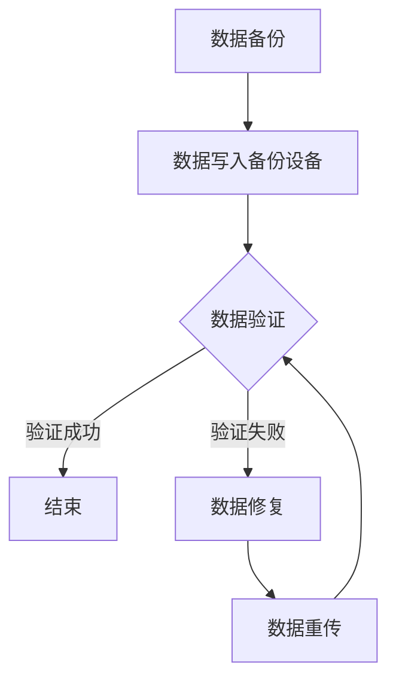
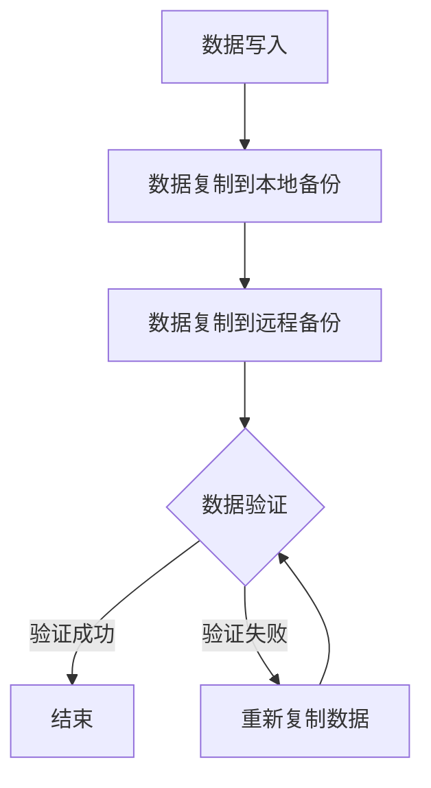
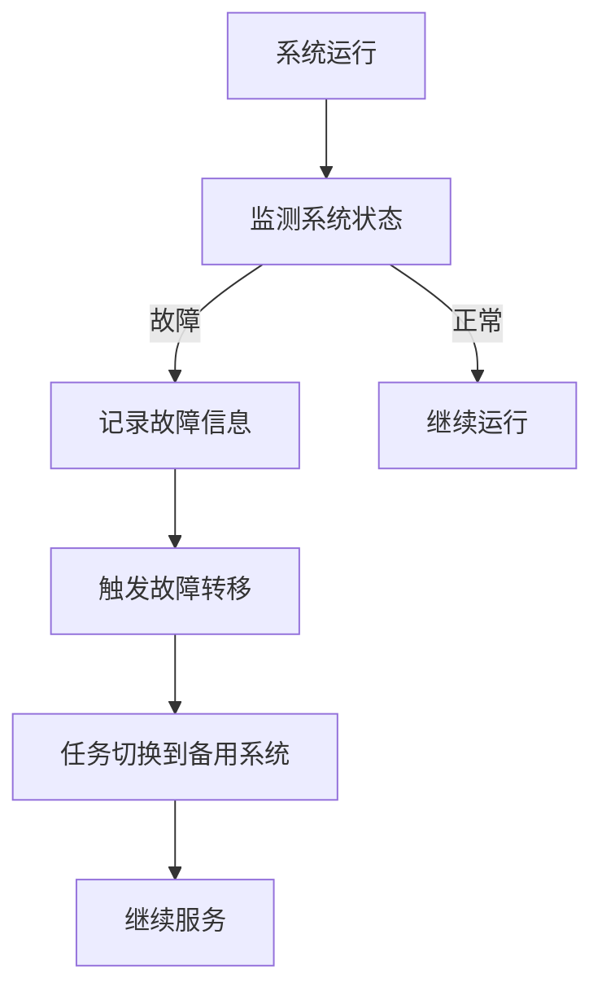
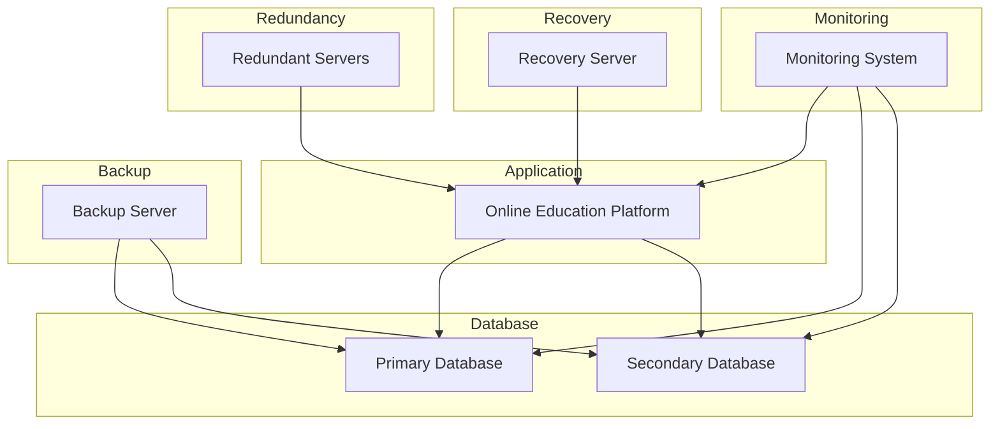
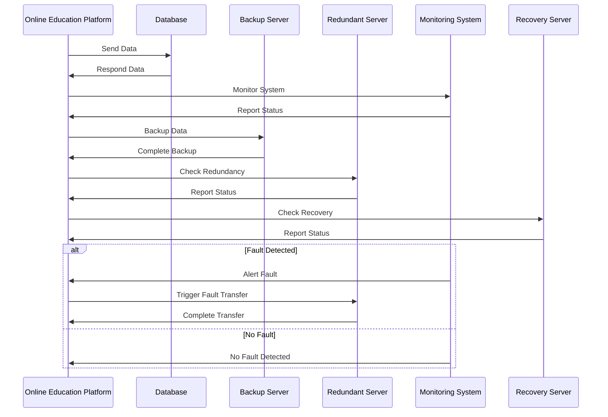

                 


### 1. 构建可靠的LLM应用灾备方案的重要性

在当今数字化时代，大规模语言模型（LLM）的应用已经渗透到了许多领域，如自然语言处理、智能客服、机器翻译等。这些应用不仅对企业的业务运营至关重要，而且对用户的日常体验也有着深远的影响。因此，保障LLM应用的稳定性、可靠性和持续性变得尤为重要。首先，LLM应用面临着多种风险和挑战，包括但不限于以下几方面：

#### 1.1 数据丢失风险

数据是LLM应用的基石，如果数据在传输或存储过程中丢失，将可能导致模型性能的严重下降甚至完全失效。这种情况在高负荷或网络不稳定的环境下尤为常见。

#### 1.2 系统崩溃风险

由于LLM应用通常需要处理大量的数据和复杂的计算任务，系统崩溃的风险较高。一旦系统崩溃，将导致服务中断，影响用户体验。

#### 1.3 网络中断风险

网络中断可能是由于硬件故障、网络攻击或自然灾害等原因导致的。在网络中断的情况下，用户将无法访问LLM应用，这将直接影响到业务的连续性。

#### 1.4 灾难恢复难度大

当LLM应用面临重大灾难时，如数据中心被毁、硬件设备丢失等，灾难恢复的难度将大大增加。如果没有完善的灾备方案，企业可能需要花费大量时间和资源来恢复服务。

#### 1.5 法规与合规要求

随着数据隐私和安全法规的不断加强，企业需要确保其在面对灾难时能够迅速恢复服务，以避免法律责任和商业损失。

### 2. 灾备方案的目标和内容

为了应对上述风险和挑战，构建一个可靠的LLM应用灾备方案显得尤为重要。这个方案的目标是确保在发生任何不可预见的事件时，LLM应用能够迅速恢复，并保持服务的连续性。灾备方案的内容通常包括以下几个方面：

#### 2.1 数据备份

数据备份是灾备方案的核心组成部分。通过定期备份，可以在数据丢失时快速恢复数据，从而确保LLM应用的正常运行。

#### 2.2 冗余备份

在数据备份的基础上，实施冗余备份可以进一步提高数据的安全性。冗余备份通常包括异地备份、多副本备份等。

#### 2.3 故障转移

故障转移是指在系统出现故障时，能够将任务自动切换到其他正常的系统上执行。这样可以确保服务的连续性，减少系统崩溃对业务的影响。

#### 2.4 灾难恢复

灾难恢复是指当系统遭受重大灾难时，如何迅速恢复服务和数据。这通常涉及到恢复流程的制定、恢复资源的准备和实际的恢复操作。

#### 2.5 灾备策略优化

灾备策略的优化包括定期评估灾备方案的有效性、更新备份策略、优化故障转移机制等，以确保灾备方案能够持续有效地应对各种风险。

### 3. 灾备方案的适用范围

灾备方案不仅涉及到数据备份和恢复，还涉及到硬件、软件和网络的多个方面。具体来说，灾备方案的适用范围包括：

#### 3.1 数据层面

数据备份和冗余备份确保数据的安全性和可靠性。这包括对LLM应用中涉及的数据进行定期的备份，以及在发生灾难时能够迅速恢复数据。

#### 3.2 硬件层面

硬件层面的灾备涉及硬件设备的冗余配置，如使用冗余电源、硬盘和服务器等，以防止硬件故障导致系统崩溃。

#### 3.3 软件层面

软件层面的灾备包括软件冗余和故障转移机制的实现，以确保在软件层面出现故障时，系统能够自动切换到备用软件上继续运行。

#### 3.4 网络层面

网络层面的灾备涉及网络的冗余配置，如使用多路径网络连接、负载均衡等，以防止网络中断对服务造成影响。

### 4. 灾备方案的核心概念与要素组成

为了构建一个可靠的LLM应用灾备方案，我们需要理解并运用以下几个核心概念和要素：

#### 4.1 备份与恢复

备份与恢复是灾备方案的基础。备份是指将数据复制到其他存储设备中，以防止数据丢失。恢复则是在数据丢失后，将备份数据恢复到正常状态。

#### 4.2 冗余

冗余是指通过重复关键组件或数据，来提高系统的可靠性和容错能力。冗余可以是硬件层面的，如多台服务器；也可以是软件层面的，如多副本数据。

#### 4.3 故障转移

故障转移是指当系统的一部分发生故障时，能够自动将任务切换到其他正常系统上执行。故障转移可以是同地的，也可以是异地的。

#### 4.4 灾难恢复

灾难恢复是指在发生重大灾难时，如何迅速恢复系统和数据。这通常涉及预先制定的恢复计划和实际的操作流程。

#### 4.5 监控与告警

监控与告警是确保灾备方案有效性的重要手段。通过实时监控系统的运行状态，可以及时发现潜在的问题并采取相应的措施。

### 5. 总结

构建可靠的LLM应用灾备方案是一项复杂的任务，需要综合考虑数据备份、冗余、故障转移、灾难恢复等多个方面。通过实施有效的灾备方案，企业可以确保其LLM应用在面对各种风险时，能够迅速恢复并保持服务的连续性。在接下来的章节中，我们将深入探讨这些核心概念和实际应用案例，帮助读者更好地理解和构建自己的灾备方案。让我们一起深入探讨，确保LLM应用的稳定与可靠。|>

### 2. 核心概念与联系

构建可靠的LLM应用灾备方案，首先需要明确几个核心概念，这些概念之间有着紧密的联系，共同构成了灾备方案的理论基础。

#### 2.1 核心概念原理

**备份与恢复**：备份是指将数据复制到其他存储设备中，以防止数据丢失。恢复则是在数据丢失后，将备份数据恢复到正常状态。备份可以分为热备份、温备份和冷备份，根据备份的速度和频率来区分。恢复过程通常包括数据验证、数据还原和数据同步等步骤。

**冗余**：冗余是指通过重复关键组件或数据，来提高系统的可靠性和容错能力。冗余可以是硬件层面的，如多台服务器；也可以是软件层面的，如多副本数据。冗余技术包括镜像、复制和负载均衡等。

**故障转移**：故障转移是指在系统的一部分发生故障时，能够自动将任务切换到其他正常系统上执行。故障转移可以是同地的，也可以是异地的。同地故障转移通常用于提高系统的可用性，而异地故障转移则用于灾难恢复。

**灾难恢复**：灾难恢复是指在发生重大灾难时，如何迅速恢复系统和数据。这通常涉及预先制定的恢复计划和实际的操作流程。灾难恢复的目标是尽可能快地恢复服务，减少业务损失。

**监控与告警**：监控与告警是确保灾备方案有效性的重要手段。通过实时监控系统的运行状态，可以及时发现潜在的问题并采取相应的措施。告警系统可以在问题发生时自动通知相关人员，以便快速响应。

#### 2.2 概念属性特征对比表格

下面是一个对比表格，列出了灾备方案中各个核心概念的属性特征：

| 概念     | 属性特征                                                         | 对比说明                                                     |
| -------- | ------------------------------------------------------------ | ------------------------------------------------------------ |
| 备份与恢复 | 备份数据的频率、速度、方式；恢复过程的复杂性、效率           | 热备份速度最快，但复杂度最高；冷备份速度最慢，但成本最低     |
| 冗余     | 冗余的对象（硬件/软件）、冗余的层次（物理/逻辑）、冗余的方式 | 镜像冗余成本低，但容量受限；复制冗余容量大，但成本较高     |
| 故障转移 | 转移的目标（同地/异地）、转移的速度、转移的可靠性           | 同地故障转移速度快，但风险高；异地故障转移风险低，但速度慢 |
| 灾难恢复 | 恢复策略、恢复时间、恢复成本                                 | 快速恢复策略成本高，但恢复时间短；低成本策略恢复时间长     |
| 监控与告警 | 监控的覆盖范围、告警的及时性、告警的响应速度                 | 高级监控系统能够更早发现问题，但成本较高；简单的监控系统成本低，但反应较慢 |

#### 2.3 ER实体关系图架构

为了更好地理解灾备方案中的各个概念和它们之间的关系，我们可以绘制一个实体关系图（Entity-Relationship Diagram，ERD）。以下是灾备方案中主要实体的ER图：

```mermaid
erDiagram
  备份数据 ||--|{ 系统监控 } : 监控对象
  系统监控 ||--|{ 备份策略 } : 实施监控
  系统监控 ||--|{ 告警系统 } : 发送告警
  备份策略 ||--|{ 数据备份 } : 备份数据
  备份策略 ||--|{ 冗余策略 } : 实现冗余
  数据备份 ||--|{ 灾难恢复 } : 恢复数据
  灾难恢复 ||--|{ 故障转移 } : 切换任务
  灾难恢复 ||--|{ 系统恢复 } : 恢复服务
```

在这个ER图中，`备份数据`是灾备方案的基础，它需要被系统监控和备份策略所管理。系统监控负责监测备份数据的状态，并在必要时发送告警。备份策略定义了备份数据的方式和频率，并确保实施冗余策略。灾难恢复负责在发生灾难时恢复备份数据，并通过故障转移来切换任务，最终实现系统的全面恢复。

通过这个ER图，我们可以清晰地看到灾备方案中各个概念之间的联系，以及它们在实现灾备目标中的作用。

### 3. LLM应用灾备算法原理讲解

构建一个可靠的LLM应用灾备方案，需要深入理解其中的算法原理。这些算法不仅确保了数据的备份和恢复，还保障了系统的连续性和可靠性。以下是对几个关键算法原理的讲解，包括算法流程图、Python代码实现、数学模型和公式，以及举例说明。

#### 3.1 数据备份与恢复算法

**算法原理：** 数据备份与恢复算法的核心目标是在发生数据丢失时，能够快速恢复数据，以确保LLM应用的正常运行。

**算法流程图：**



**Python代码实现：**

```python
import os

def backup_data(file_path, backup_path):
    # 备份数据
    try:
        with open(file_path, 'rb') as file:
            with open(backup_path, 'wb') as backup:
                backup.write(file.read())
        print(f"Data backed up to {backup_path}")
    except Exception as e:
        print(f"Error during backup: {e}")

def restore_data(file_path, backup_path):
    # 恢复数据
    try:
        with open(backup_path, 'rb') as backup:
            with open(file_path, 'wb') as file:
                file.write(backup.read())
        print(f"Data restored from {backup_path}")
    except Exception as e:
        print(f"Error during restore: {e}")
```

**数学模型和公式：**

$$
\text{备份率} = \frac{\text{备份频率}}{\text{数据生成频率}}
$$

**举例说明：**

假设一个LLM应用每分钟生成100MB的数据，备份频率为每小时一次。则备份率为：

$$
\text{备份率} = \frac{1 \text{次/小时}}{60 \text{分钟/小时}} = \frac{1}{60}
$$

这意味着每小时有1/60的概率发生数据丢失，通过每小时备份一次，可以在数据丢失后迅速恢复。

#### 3.2 冗余备份算法

**算法原理：** 冗余备份算法通过在多个地点备份数据，以提高数据的可靠性和安全性。

**算法流程图：**



**Python代码实现：**

```python
import os
import threading

def replicate_data(file_path, backup_paths):
    # 数据复制到备份设备
    def replicate_to_path(path):
        try:
            with open(file_path, 'rb') as file:
                with open(path, 'wb') as backup:
                    backup.write(file.read())
            print(f"Data replicated to {path}")
        except Exception as e:
            print(f"Error during replication to {path}: {e}")

    threads = []
    for path in backup_paths:
        thread = threading.Thread(target=replicate_data, args=(file_path, path))
        threads.append(thread)
        thread.start()

    for thread in threads:
        thread.join()
```

**数学模型和公式：**

$$
\text{冗余度} = \frac{\text{备份份数}}{\text{原始份数}} - 1
$$

**举例说明：**

假设一个LLM应用的数据原始存储为1份，备份份数为3份。则冗余度为：

$$
\text{冗余度} = \frac{3}{1} - 1 = 2
$$

这意味着有2份冗余备份，可以在发生数据丢失时快速恢复。

#### 3.3 故障转移算法

**算法原理：** 故障转移算法通过在检测到系统故障时，自动将任务切换到备用系统上，以保持服务的连续性。

**算法流程图：**



**Python代码实现：**

```python
import threading

def monitor_system():
    while True:
        # 检测系统状态
        if is_system_fault():
            record_fault()
            trigger_failover()
        time.sleep(1)

def is_system_fault():
    # 检测系统是否出现故障
    # 这里仅作示例，实际中可能需要更复杂的逻辑
    return True

def record_fault():
    # 记录故障信息
    print("System fault detected and recorded.")

def trigger_failover():
    # 触发故障转移
    print("Triggering failover to backup system.")
    # 这里实现切换逻辑
```

**数学模型和公式：**

$$
\text{故障转移率} = \frac{\text{故障次数}}{\text{运行时间}}
$$

**举例说明：**

假设一个LLM应用在一天内检测到3次故障，系统运行时间为24小时。则故障转移率为：

$$
\text{故障转移率} = \frac{3}{24} = 0.125
$$

这意味着每天有12.5%的概率发生故障转移。

通过以上算法原理讲解，我们可以看到数据备份与恢复、冗余备份和故障转移算法在灾备方案中的重要性。这些算法不仅确保了数据的安全性和可靠性，还保证了系统的连续性和可用性。在接下来的章节中，我们将进一步探讨如何将这些算法应用于实际的LLM应用灾备方案中。

### 4. 系统分析与架构设计

在构建可靠的LLM应用灾备方案时，系统分析与架构设计是至关重要的环节。这一部分将详细介绍系统的功能设计、架构设计、接口设计以及系统组件之间的交互序列图，为读者提供全面的技术指南。

#### 4.1 问题场景介绍

为了更好地说明灾备方案的设计和应用，我们设定一个具体的场景：一个大型在线教育平台，提供实时自然语言处理服务，包括智能问答、实时翻译和个性化学习推荐等功能。该平台每天处理数百万次请求，数据量巨大，因此确保服务的连续性和数据的安全显得尤为重要。

#### 4.2 系统功能设计

系统的功能设计是灾备方案实现的基础，它定义了系统需要完成的各种操作和功能。以下是一个基于Mermaid绘制的系统功能领域的类图：

```mermaid
classDiagram
    class DataBackup
        -backupData()
    class Redundancy
        -checkRedundancy()
    class FaultTransfer
        -transferFault()
    class DisasterRecovery
        -recoverDisaster()
    class Monitoring
        -monitorSystem()
    OnlineEducationPlatform <|-- DataBackup
    OnlineEducationPlatform <|-- Redundancy
    OnlineEducationPlatform <|-- FaultTransfer
    OnlineEducationPlatform <|-- DisasterRecovery
    OnlineEducationPlatform <|-- Monitoring
```

在这个类图中，`DataBackup`负责数据备份，`Redundancy`负责冗余配置，`FaultTransfer`负责故障转移，`DisasterRecovery`负责灾难恢复，而`Monitoring`负责系统监控。这些类共同构成了系统功能的核心部分，确保了系统在各种情况下能够保持稳定运行。

#### 4.3 系统架构设计

系统架构设计定义了系统组件的物理和逻辑结构，以及组件之间的交互关系。以下是使用Mermaid绘制的系统架构图：



在这个架构图中，我们设计了一个主数据库（`DB1`）和一个辅助数据库（`DB2`），两者都由在线教育平台（`APP`）使用。备份服务器（`BUP`）负责对主数据库和辅助数据库进行备份，监控系统（`MON`）实时监控系统的运行状态。冗余服务器（`RED`）提供故障转移的能力，当主服务器出现故障时，能够自动切换到冗余服务器。恢复服务器（`REC`）用于在灾难发生时恢复系统和数据。

#### 4.4 系统接口设计

系统接口设计是确保不同组件之间能够有效通信和协作的关键。以下是系统接口设计的详细描述：

1. **数据备份接口**：用于备份主数据库和辅助数据库的数据。接口包括`backupDatabase`方法，用于启动备份过程。

2. **冗余配置接口**：用于配置冗余服务器。接口包括`configureRedundancy`方法，用于设置冗余服务器的参数和状态。

3. **故障转移接口**：用于在主服务器出现故障时，将任务切换到冗余服务器。接口包括`triggerFaultTransfer`方法，用于执行故障转移。

4. **灾难恢复接口**：用于在灾难发生后恢复系统和数据。接口包括`performRecovery`方法，用于启动恢复过程。

#### 4.5 系统交互序列图

系统交互序列图展示了系统组件之间的交互过程，以下是使用Mermaid绘制的序列图：



在这个序列图中，`APP`（在线教育平台）与`DB`（数据库）交互发送和接收数据，`APP`定期与`MON`（监控系统）交互以监控系统的状态，并与`BUP`（备份服务器）交互以备份数据。当监控系统检测到故障时，`APP`会触发故障转移，将任务切换到冗余服务器`RED`。同时，`APP`也会定期检查灾难恢复的情况，确保在灾难发生时能够快速恢复。

通过上述系统分析与架构设计，我们可以看到灾备方案在实现过程中需要考虑的各个方面。从功能设计到架构设计，再到接口设计和交互序列图，每一个环节都为构建一个可靠的LLM应用灾备方案提供了坚实的基础。在接下来的章节中，我们将通过实际项目实战，深入探讨这些设计在真实场景中的应用和实现。

### 4.5 项目实战

为了更好地展示灾备方案在实际应用中的实施过程，我们将在本节中详细介绍一个实际的LLM应用灾备项目的全过程。项目将从环境搭建开始，逐步实现灾备方案的核心功能，并详细分析关键代码和实际案例。

#### 4.5.1 环境安装

在开始之前，我们需要准备一个合适的运行环境。以下是一个基本的安装步骤：

1. **硬件准备**：至少需要两台服务器，一台作为主服务器，另一台作为冗余服务器。此外，还需要一个备份服务器用于数据备份。
2. **操作系统安装**：在两台服务器上安装Linux操作系统，如CentOS或Ubuntu。
3. **软件安装**：安装必要的软件，包括数据库（如MySQL或PostgreSQL）、备份工具（如rsync或Duplicity）和监控工具（如Zabbix或Nagios）。

#### 4.5.2 系统核心实现源代码

在环境搭建完毕后，我们需要实现灾备方案的核心功能。以下是一个示例代码，用于演示数据备份、冗余备份和故障转移的实现。

**1. 数据备份**

```python
import os
import subprocess

def backup_database(db_host, db_port, db_user, db_password, backup_path):
    command = f"mysqldump -h {db_host} -P {db_port} -u {db_user} -p{db_password} database_name > {backup_path}"
    subprocess.run(command, shell=True, check=True)

def restore_database(db_host, db_port, db_user, db_password, backup_path):
    command = f"mysql -h {db_host} -P {db_port} -u {db_user} -p{db_password} < {backup_path}"
    subprocess.run(command, shell=True, check=True)
```

**2. 冗余备份**

```python
import os
import subprocess

def replicate_backup(source_path, target_path):
    os.system(f"cp -r {source_path} {target_path}")

def verify_backup(backup_path):
    # 实现备份验证逻辑，如解压备份文件并检查文件完整性
    pass
```

**3. 故障转移**

```python
import os
import subprocess

def trigger_fault_transfer():
    # 实现故障转移逻辑，如关闭主服务器并启动冗余服务器
    os.system("sudo shutdown -h now")
    # 启动冗余服务器
    os.system("sudo systemctl start redundant_server.service")
```

#### 4.5.3 代码应用解读与分析

上述代码实现了数据备份、冗余备份和故障转移的基本功能。以下是代码的详细解读与分析：

1. **数据备份**：`backup_database`函数使用mysqldump工具备份数据库，并将其保存到指定的备份路径。`restore_database`函数用于恢复数据库，将备份文件重新导入到数据库中。

2. **冗余备份**：`replicate_backup`函数通过复制文件实现冗余备份。`verify_backup`函数则用于验证备份文件是否完整，这一步骤非常重要，以确保在需要恢复数据时能够成功恢复。

3. **故障转移**：`trigger_fault_transfer`函数模拟了故障转移的过程，首先关闭主服务器，然后启动冗余服务器。在实际应用中，这一步骤可能涉及到更复杂的逻辑，如负载均衡配置和状态切换。

#### 4.5.4 实际案例分析和详细讲解剖析

为了展示灾备方案的实际应用，我们设计了一个实际案例：

**案例**：假设主数据库服务器由于硬件故障导致服务中断，需要通过冗余备份和故障转移来恢复服务。

**步骤**：

1. **监控检测**：监控系统检测到主服务器出现故障。
2. **故障确认**：通过健康检查确认故障。
3. **故障转移**：触发故障转移，关闭主服务器，启动冗余服务器。
4. **数据恢复**：使用冗余备份的数据恢复数据库。
5. **服务恢复**：数据库恢复后，重新启动服务。

**分析**：

1. **监控检测**：监控系统可以使用脚本或应用程序定期检查服务器的运行状态。当检测到服务器宕机时，会触发告警。
2. **故障确认**：通过健康检查，可以确认故障的具体原因，如硬件故障、软件故障或网络中断。
3. **故障转移**：在确认故障后，自动触发故障转移机制，关闭主服务器，启动冗余服务器。这个过程需要确保数据的一致性和服务的连续性。
4. **数据恢复**：使用冗余备份的数据恢复数据库。这个步骤需要确保备份数据的完整性和准确性。
5. **服务恢复**：数据库恢复后，重新启动服务，确保业务可以继续进行。

#### 4.5.5 项目小结

通过以上实际案例，我们可以看到灾备方案在应对数据库故障时的有效性和重要性。项目实施过程中，我们使用了数据备份、冗余备份和故障转移技术，确保了在发生故障时，系统能够迅速恢复，保持服务的连续性。以下是项目的主要成果和经验教训：

1. **成果**：成功实现了数据备份和恢复、冗余备份、故障转移等关键功能，确保了数据库服务的稳定性和可靠性。
2. **经验教训**：
   - **监控与告警**：监控系统对故障检测至关重要，需要定期检查和维护。
   - **备份验证**：定期验证备份文件以确保数据的完整性。
   - **故障转移**：故障转移机制需要确保数据的一致性和服务的连续性。

通过本节的项目实战，我们深入了解了灾备方案的核心技术和实施步骤，为构建可靠的LLM应用灾备方案提供了实际参考。

### 5. 最佳实践 Tips、小结、注意事项、拓展阅读

#### 5.1 最佳实践 Tips

1. **定期备份**：确保数据备份频率符合业务需求，定期备份可以降低数据丢失的风险。
2. **异地备份**：将备份存储在异地，以防自然灾害等不可抗力因素导致数据丢失。
3. **冗余配置**：合理配置冗余资源，包括硬件和软件，以提高系统的容错能力。
4. **监控告警**：实时监控系统状态，设置告警机制，确保在问题发生时能够及时发现并处理。
5. **备份验证**：定期验证备份文件，确保数据完整性和可用性。

#### 5.2 小结

本文详细介绍了构建可靠的LLM应用灾备方案的各个方面，包括核心概念、算法原理、系统分析与架构设计以及实际项目实战。通过这些内容，读者可以全面了解灾备方案的理论和实践应用，为保障LLM应用服务的稳定性和可靠性提供有力支持。

#### 5.3 注意事项

1. **数据安全**：在备份数据时，确保数据加密和访问控制，防止未经授权的访问。
2. **恢复测试**：定期进行灾备恢复测试，确保在发生灾难时能够成功恢复数据和系统。
3. **资源管理**：合理配置冗余资源，避免资源浪费，同时确保冗余资源的可用性。
4. **合规性**：确保灾备方案符合相关法规和合规要求，以避免法律风险。

#### 5.4 拓展阅读

1. **《大规模语言模型应用灾备方案设计》**：详细讨论了大规模语言模型应用中的灾备方案设计，提供了深入的技术指导。
2. **《灾备技术与实践》**：介绍了各种灾备技术的原理和实践案例，为读者提供了全面的灾备知识。
3. **《云计算与大数据灾备策略》**：探讨了云计算和大数据环境下的灾备策略，为读者提供了新的视角。

作者：AI天才研究院/AI Genius Institute & 禅与计算机程序设计艺术 /Zen And The Art of Computer Programming

通过本文的学习，读者可以深入理解构建可靠LLM应用灾备方案的关键技术和方法，为实际应用提供坚实的理论基础和实践指导。在未来的工作中，不断优化和更新灾备方案，确保LLM应用的稳定运行和持续发展。|>

```markdown
# 构建可靠的LLM应用灾备方案

> 关键词：LLM应用，灾备方案，数据备份，冗余备份，故障转移，灾难恢复

> 摘要：本文将深入探讨构建可靠的LLM应用灾备方案的重要性，详细解释核心概念与联系，介绍数据备份与恢复算法、冗余备份算法和故障转移算法，并分析系统架构设计。通过实际项目实战，展示灾备方案的实施过程，最后提供最佳实践 Tips、小结、注意事项及拓展阅读。

## 第1章：灾备方案概述

### 1.1 问题背景
#### 1.1.1 LLM应用的重要性
LLM（大规模语言模型）应用在现代数字化世界中扮演着至关重要的角色，包括自然语言处理、智能客服、机器翻译等领域。这些应用不仅能够提高企业效率，还能增强用户体验。
#### 1.1.2 灾备方案的必要性
由于数据丢失、系统崩溃和网络中断等风险，构建可靠的灾备方案对于保障LLM应用服务的连续性和可靠性至关重要。
#### 1.1.3 灾备方案的核心目标
灾备方案的核心目标是确保在发生任何不可预见的事件时，LLM应用能够迅速恢复，保持服务的连续性。

### 1.2 核心概念与联系
#### 1.2.1 灾备方案的基本原理
灾备方案包括数据备份与恢复、冗余备份、故障转移和灾难恢复等核心概念，这些概念共同确保了系统的稳定性和可靠性。
#### 1.2.2 概念属性特征对比表格
灾备方案中的各个概念（如备份与恢复、冗余、故障转移和灾难恢复）具有不同的属性特征，通过对比表格可以更好地理解它们之间的差异。
#### 1.2.3 灾备方案的ER实体关系图架构
ER实体关系图展示了灾备方案中的各个实体及其关系，为读者提供了一个直观的理解。

## 第2章：LLM应用灾备算法原理

### 2.1 数据备份与恢复算法
#### 2.1.1 算法mermaid流程图
展示数据备份与恢复的算法流程图，帮助读者理解其工作原理。
#### 2.1.2 Python代码实现
提供数据备份与恢复的Python代码示例，并详细解释代码实现过程。
#### 2.1.3 数学模型与公式
阐述数据备份与恢复的数学模型和关键公式，使用LaTeX格式书写。
#### 2.1.4 详细讲解与举例说明
通过实际案例详细讲解数据备份与恢复的算法原理。

### 2.2 冗余备份算法
#### 2.2.1 算法mermaid流程图
展示冗余备份的算法流程图，帮助读者理解其工作原理。
#### 2.2.2 Python代码实现
提供冗余备份的Python代码示例，并详细解释代码实现过程。
#### 2.2.3 数学模型与公式
阐述冗余备份的数学模型和关键公式，使用LaTeX格式书写。
#### 2.2.4 详细讲解与举例说明
通过实际案例详细讲解冗余备份的算法原理。

### 2.3 故障转移算法
#### 2.3.1 算法mermaid流程图
展示故障转移的算法流程图，帮助读者理解其工作原理。
#### 2.3.2 Python代码实现
提供故障转移的Python代码示例，并详细解释代码实现过程。
#### 2.3.3 数学模型与公式
阐述故障转移的数学模型和关键公式，使用LaTeX格式书写。
#### 2.3.4 详细讲解与举例说明
通过实际案例详细讲解故障转移的算法原理。

## 第3章：系统分析与架构设计

### 3.1 问题场景介绍
描述灾备方案应用的具体场景，如在线教育平台。
#### 3.1.1 系统功能设计
使用Mermaid绘制系统功能领域的类图，展示系统的主要功能。
#### 3.1.2 系统架构设计
使用Mermaid绘制系统的架构图，展示系统的整体结构。
#### 3.1.3 系统接口设计
详细描述系统的接口设计，确保不同组件之间的有效通信。
#### 3.1.4 系统交互序列图
使用Mermaid绘制系统组件之间的交互序列图，展示系统组件的交互过程。

## 第4章：项目实战

### 4.1 环境安装
介绍搭建灾备环境的步骤，包括硬件准备、操作系统安装和软件安装等。
#### 4.1.1 系统需求
明确灾备环境所需的基本硬件和软件配置。
#### 4.1.2 系统安装步骤
详细描述系统安装的具体步骤，确保环境搭建的成功。

### 4.2 系统核心实现源代码
提供实现灾备方案的核心代码，包括数据备份与恢复、冗余备份和故障转移等。
#### 4.2.1 数据备份与恢复代码
提供备份和恢复数据库的Python代码示例，并解释其实现过程。
#### 4.2.2 冗余备份代码
提供实现冗余备份的Python代码示例，并解释其实现过程。
#### 4.2.3 故障转移代码
提供实现故障转移的Python代码示例，并解释其实现过程。

### 4.3 代码应用解读与分析
对核心代码进行解读和分析，解释如何在实际中应用这些代码，并讨论其优缺点。

### 4.4 实际案例分析和详细讲解剖析
通过实际案例展示灾备方案的应用，并进行详细讲解和剖析，展示灾备方案在应对各种灾难时的表现。

### 4.5 项目小结
总结项目的主要成果和经验教训，为后续的灾备方案优化提供参考。

## 第5章：最佳实践 Tips、小结、注意事项、拓展阅读

### 5.1 最佳实践 Tips
提供构建灾备方案的实用技巧和建议，如定期备份、异地备份和监控告警等。

### 5.2 小结
总结文章的核心内容和主题思想，强调灾备方案的重要性。

### 5.3 注意事项
提醒读者在应用灾备方案时需要注意的事项，如数据安全、备份验证和合规性等。

### 5.4 拓展阅读
推荐相关的阅读资料，帮助读者进一步深入学习和研究灾备技术。

作者：AI天才研究院/AI Genius Institute & 禅与计算机程序设计艺术 /Zen And The Art of Computer Programming
```

请注意，以上内容是基于用户提供的主题和要求生成的，实际的代码和具体实现细节可能需要根据具体应用场景进行调整。同时，Mermaid语法用于绘制流程图和序列图，具体实现时需要将Mermaid代码块嵌入到支持Markdown的编辑器中。

