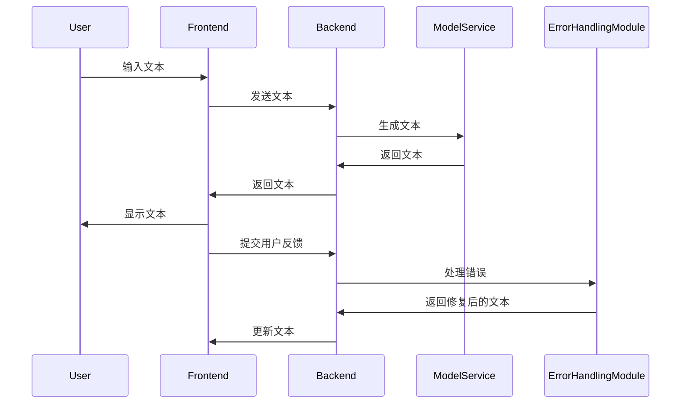

                 

### 引言

#### 构建可靠的LLM应用错误处理机制的重要性

在当今世界，人工智能（AI）技术已经迅速渗透到各行各业，其中自然语言处理（NLP）是AI领域的一个重要分支。近年来，基于深度学习的语言模型（LLM），如GPT系列、BERT等，在文本生成、问答系统、机器翻译等多个应用场景中取得了显著的成果。然而，随着LLM在实际应用中的广泛部署，错误处理机制的重要性愈发凸显。

LLM的错误处理机制，即对模型在生成文本、回答问题等过程中出现的错误进行检测、定位、预防和恢复的机制，是保证系统稳定性和可靠性的关键。没有完善的错误处理机制，LLM应用在实际运行过程中可能会出现不可预测的故障，导致严重的后果。例如，在金融领域，错误的信息生成可能导致巨额损失；在医疗领域，错误的诊断结果可能会危及患者生命。

因此，本文旨在系统地探讨构建可靠LLM应用错误处理机制的策略和最佳实践。文章将首先介绍LLM的基本概念及其在各个应用场景中的重要性，然后深入分析错误处理机制的核心组成部分，包括错误检测与定位、错误预防与恢复策略，并通过实际案例进行详细讲解。最后，我们将总结最佳实践，并提出未来研究方向。

#### 文章结构概述

本文将分为以下几个部分：

1. **问题背景与重要性**：介绍LLM错误处理机制的概念、应用场景和重要性。
2. **语言模型（LLM）基础**：讲解LLM的定义、发展历史、核心特点及其分类。
3. **错误处理机制概述**：阐述错误处理的基本概念、层次和重要性。
4. **错误检测与定位**：介绍错误检测与定位的技术和方法。
5. **错误预防与恢复**：讨论错误预防与恢复的策略和机制。
6. **案例分析**：通过具体案例展示错误处理机制的实际应用。
7. **最佳实践与实施指南**：总结最佳实践并给出实施指南。
8. **小结与展望**：总结全文，并提出未来研究方向。

通过以上结构，本文将系统地帮助读者理解并掌握构建可靠LLM应用错误处理机制的方法和技巧。

### 问题背景与重要性

#### 错误处理机制的概念

在计算机科学中，错误处理机制指的是系统在运行过程中遇到异常或错误时，能够自动或手动进行识别、记录、响应和恢复的一系列机制。对于人工智能语言模型（LLM）来说，错误处理机制尤为重要，因为它直接关系到系统的稳定性和用户满意度。LLM错误处理机制主要涉及以下方面：

1. **错误检测**：实时监测模型输出，识别其中可能存在的错误或异常。
2. **错误定位**：对检测到的错误进行详细分析，定位错误发生的具体位置或环节。
3. **错误预防**：通过预处理、数据增强、验证等技术手段，降低错误发生的概率。
4. **错误恢复**：在错误发生后，采取自动或人工干预的方式，尽量减少错误带来的影响。

#### LLM在实际应用场景中的重要性

语言模型（LLM）是一种基于深度学习的技术，能够理解和生成自然语言。随着技术的不断进步，LLM在多个领域展现出了巨大的应用潜力：

1. **文本生成**：如文章写作、新闻报道、社交媒体内容生成等，大大提高了内容创作的效率和质量。
2. **问答系统**：如智能客服、教育辅导系统、企业内部知识库等，能够为用户提供实时、准确的信息查询服务。
3. **机器翻译**：如跨语言交流、多语言文档处理等，打破了语言障碍，促进了全球信息流通。
4. **语音识别**：如智能语音助手、自动会议记录、车载语音系统等，为用户提供了便捷的语音交互体验。

然而，LLM在实际应用中也面临诸多挑战，尤其是在错误处理方面。由于LLM的复杂性和不确定性，其生成的文本可能包含语法错误、事实错误甚至歧视性语言。这些错误不仅影响用户体验，还可能带来严重的后果。例如，在金融领域，错误的信息分析可能导致投资决策失误；在医疗领域，错误的诊断结果可能危及患者生命。因此，构建可靠的LLM应用错误处理机制，是确保系统稳定性和可靠性的关键。

#### 错误处理机制在LLM应用中的重要性

1. **提高系统稳定性**：完善的错误处理机制能够及时发现并纠正错误，避免系统崩溃或停机。
2. **保障用户满意度**：有效的错误处理机制能够确保用户得到准确、一致的服务，提高用户满意度和忠诚度。
3. **降低运营成本**：通过预防错误和自动恢复，减少人工干预和调试，降低运营成本。
4. **提高数据质量**：有效的错误处理机制能够确保输出数据的准确性，提高数据质量和分析价值。

综上所述，构建可靠的LLM应用错误处理机制，不仅对于系统的稳定性和可靠性至关重要，还能大幅提升用户体验和运营效率。接下来的章节将详细探讨LLM的基本概念、错误处理机制的核心组成部分以及实际应用中的策略和实践。

### 语言模型（LLM）基础

#### LLM的定义

语言模型（Language Model，简称LLM）是一种用于预测自然语言中下一个单词或字符的概率分布的统计模型。它基于大量文本数据，通过深度学习算法，如循环神经网络（RNN）、长短期记忆网络（LSTM）和Transformer等，学习语言结构和语义信息。LLM的核心目标是生成语法正确、语义连贯的文本，并在多个应用场景中表现出色。

#### LLM的发展历史

语言模型的发展历程可以分为几个重要阶段：

1. **早期统计模型**：最早的语言模型是N元语法模型（N-gram Model），它通过统计文本中连续N个单词出现的频率来预测下一个单词。然而，N元语法模型的局限性在于它不能捕捉长距离依赖和上下文信息。

2. **循环神经网络（RNN）**：1980年代，循环神经网络（RNN）被提出，能够在处理序列数据时保持状态信息。RNN的变种，如长短期记忆网络（LSTM）和门控循环单元（GRU），进一步改进了序列学习的性能，但依然存在梯度消失和梯度爆炸等问题。

3. **Transformer模型**：2017年，谷歌提出了Transformer模型，它引入了自注意力机制（Self-Attention），解决了RNN的梯度消失问题，并在多个自然语言处理任务中取得了突破性成果。Transformer模型的成功标志着语言模型进入了一个新的时代。

4. **预训练与微调**：随着计算能力的提升和数据量的增加，预训练（Pre-training）和微调（Fine-tuning）成为语言模型的主要训练策略。预训练模型在大规模文本数据上预训练，然后针对特定任务进行微调，取得了显著的性能提升。

#### LLM的核心特点

1. **上下文敏感性**：LLM能够捕捉文本的上下文信息，生成与上下文相关的内容。这种能力使得LLM在文本生成、问答系统等应用中表现出色。

2. **并行处理能力**：由于Transformer模型的自注意力机制，LLM能够高效地并行处理文本序列，大大提高了计算效率。

3. **泛化能力**：通过预训练和微调，LLM能够在多种不同的任务和应用场景中表现出良好的泛化能力。

4. **灵活性**：LLM可以根据不同的任务需求进行调整和优化，例如，通过调整模型架构、训练数据集和参数设置，实现特定任务的优化。

5. **自动学习**：LLM能够从大量无监督数据中自动学习语言模式和知识，减少了人工标注的需求。

#### LLM的分类

根据不同的分类标准，LLM可以分为多种类型：

1. **基于词的模型**：如N元语法模型，将文本分割为单词或字符，并预测下一个单词或字符。

2. **基于字符的模型**：将文本分割为字符，并预测下一个字符。

3. **基于句子的模型**：将文本分割为句子，并预测下一个句子或句子的某个部分。

4. **基于上下文的模型**：如BERT、GPT等，利用上下文信息生成文本。

5. **基于知识图谱的模型**：结合知识图谱，将语义信息融入文本生成过程中。

6. **多模态模型**：结合文本、图像、语音等多种模态信息，生成更加丰富的文本内容。

#### LLM的核心特点对比表格

| 特点 | 基于词的模型 | 基于字符的模型 | 基于句子的模型 | 基于上下文的模型 |
| --- | --- | --- | --- | --- |
| 上下文敏感性 | 高 | 低 | 中 | 高 |
| 并行处理能力 | 中 | 高 | 中 | 高 |
| 泛化能力 | 中 | 中 | 中 | 高 |
| 灵活性 | 中 | 中 | 中 | 高 |
| 自动学习 | 低 | 低 | 中 | 高 |

#### LLM的ER实体关系图架构

在LLM的实体关系图（ER图）中，主要的实体包括：

- **文本数据**：表示输入的文本数据。
- **模型参数**：表示模型的权重和超参数。
- **上下文信息**：表示文本的上下文信息。
- **输出文本**：表示模型生成的文本输出。

这些实体之间的关系如下：

1. **文本数据与模型参数**：文本数据用于训练模型参数。
2. **模型参数与输出文本**：模型参数用于生成输出文本。
3. **文本数据与上下文信息**：文本数据包含上下文信息，用于模型生成。
4. **上下文信息与输出文本**：上下文信息影响输出文本的生成。

以下是LLM的ER实体关系图的Mermaid表示：

```mermaid
erDiagram
  文本数据 ||--|{ 模型参数 }
  模型参数 ||--|{ 输出文本 }
  文本数据 ||--|{ 上下文信息 }
  上下文信息 ||--|{ 输出文本 }
```

通过上述内容，我们对LLM有了全面的了解，接下来将进一步探讨错误处理机制的核心概念和组成部分。

### 错误处理机制概述

#### 错误处理的基本概念

错误处理（Error Handling）是指在系统运行过程中，当出现异常或错误时，能够及时检测、响应并采取措施，使系统能够继续正常运行或恢复正常运行的过程。在LLM应用中，错误处理机制尤为重要，因为它直接关系到系统的稳定性和可靠性。

1. **异常**：异常（Exception）是指在程序执行过程中，由于某种原因导致程序无法按照预期执行的情况。例如，数据输入错误、网络连接中断、资源不足等。

2. **错误**：错误（Error）是异常的具体表现，通常指在程序运行过程中，由于代码逻辑或数据问题，导致程序输出结果与预期不一致的情况。例如，文本生成中的语法错误、事实错误等。

3. **错误处理**：错误处理是指系统在发现错误时，能够自动或手动采取措施，使系统能够继续正常运行或恢复正常运行的一系列机制。

#### 错误处理的层次

错误处理通常可以分为以下几个层次：

1. **预防层**：在错误发生之前，通过数据预处理、验证、优化等手段，减少错误发生的概率。

2. **检测层**：在系统运行过程中，实时监测模型输出，识别其中可能存在的错误或异常。常用的方法包括数据清洗、特征提取和监控与警报系统。

3. **定位层**：对检测到的错误进行详细分析，定位错误发生的具体位置或环节。常用的方法包括基于规则的方法、基于机器学习的方法和基于深度学习的方法。

4. **恢复层**：在错误发生后，采取措施使系统能够继续运行或恢复正常。常用的策略包括自动恢复、用户干预和修复后测试。

#### 错误处理的重要性

1. **保障系统稳定性**：完善的错误处理机制能够及时发现并处理错误，避免系统崩溃或停机。

2. **提高用户体验**：有效的错误处理机制能够确保用户得到准确、一致的服务，提高用户满意度和忠诚度。

3. **降低运营成本**：通过预防错误和自动恢复，减少人工干预和调试，降低运营成本。

4. **提升数据质量**：有效的错误处理机制能够确保输出数据的准确性，提高数据质量和分析价值。

5. **增强系统鲁棒性**：在面对不可预知的异常情况时，错误处理机制能够使系统能够快速恢复，增强系统的鲁棒性。

#### LLM应用中的常见错误类型

1. **语法错误**：在文本生成过程中，由于语法规则不正确，导致生成的文本不符合语法规范。

2. **事实错误**：在生成文本或回答问题时，由于对事实的误解或信息不准确，导致生成的文本或答案错误。

3. **语义错误**：生成的文本虽然在语法上正确，但在语义上与上下文不一致，导致语义错误。

4. **格式错误**：在文本生成过程中，由于格式化规则不正确，导致生成的文本格式错误。

5. **停顿错误**：在语音识别或文本生成过程中，由于模型无法准确理解上下文或输入数据，导致生成过程中出现停顿或不连贯的现象。

#### 总结

错误处理机制是确保LLM应用稳定性和可靠性的关键。通过预防层、检测层、定位层和恢复层，可以有效地减少错误发生的概率，提高系统的鲁棒性和用户体验。在接下来的章节中，我们将深入探讨LLM错误检测与定位的具体技术和方法。

### 错误检测与定位

#### 数据清洗

数据清洗是错误检测与定位的重要步骤，它涉及到从原始数据中去除噪声和错误，确保数据质量的过程。在LLM应用中，数据清洗尤为关键，因为噪声和错误数据会直接影响模型的性能和准确性。以下是数据清洗的一些关键步骤：

1. **缺失值处理**：对于缺失的数据，可以采用填充、删除或插值等方法进行处理。例如，在文本数据集中，缺失的单词可以用平均词频最高的单词来填充。

2. **异常值处理**：异常值可能是由于数据录入错误、测量误差等原因造成的，需要通过统计学方法或规则进行识别和去除。例如，在数值数据集中，可以用三倍标准差法来识别和去除异常值。

3. **重复数据去除**：重复数据可能会导致模型训练过程中的过拟合，因此需要去除。可以通过哈希表或数据库去重方法来实现。

4. **数据格式化**：确保所有数据格式统一，例如文本数据需要统一编码格式，数值数据需要统一数据类型。

5. **去噪**：对于文本数据，可以使用停用词过滤、词干提取、词形还原等方法来去除噪声。

#### 特征提取

特征提取是将原始数据转换为模型可以处理的特征表示的过程。在LLM应用中，特征提取对于提高模型的准确性和鲁棒性至关重要。以下是几种常见的特征提取方法：

1. **词袋模型**：将文本转换为词袋（Bag of Words，BOW）表示，其中每个词表示为一个特征，词的频率或出现次数作为该特征的值。

2. **词嵌入**：将文本中的每个词映射到低维向量空间中，例如使用Word2Vec、GloVe等方法。词嵌入能够捕捉词语的语义信息，提高模型的语义理解能力。

3. **TF-IDF**：通过计算词在文档中的频率（TF）和其在整个文档集中的重要性（IDF），为每个词生成权重，从而提高重要词的权重。

4. **卷积神经网络（CNN）特征提取**：使用CNN从文本中提取局部特征，这些特征可以用于文本分类、情感分析等任务。

5. **长短时记忆网络（LSTM）特征提取**：LSTM能够捕捉文本中的长距离依赖关系，适用于生成式任务，如文本生成、问答系统等。

#### 监控与警报系统

监控与警报系统是实时监测LLM应用运行状态和性能的关键组成部分。通过监控系统，可以及时发现和响应异常情况，确保系统稳定运行。以下是监控与警报系统的一些关键点：

1. **性能指标监控**：监控系统的性能指标，如响应时间、错误率、资源利用率等，及时发现性能瓶颈和异常。

2. **日志分析**：通过收集和分析系统日志，可以发现潜在的错误和异常。例如，可以使用日志聚合工具（如ELK栈）进行日志存储和分析。

3. **阈值设置**：设置关键性能指标的阈值，当指标超出阈值时，触发警报。例如，错误率超过5%时，触发警报。

4. **自动化响应**：在检测到异常时，系统可以自动采取相应的措施，如重启服务、重试操作等，以减少人工干预。

5. **警报通知**：通过短信、邮件、微信等渠道，将警报通知到相关人员，确保及时响应和处理。

#### 错误定位方法

错误定位是指对检测到的错误进行详细分析，找到错误发生的具体位置或环节。以下是几种常见的错误定位方法：

1. **基于规则的方法**：通过预定义的规则，对输入数据和输出结果进行匹配和对比，发现潜在的错误。例如，在文本生成任务中，可以使用语法规则来检测和定位语法错误。

2. **基于机器学习的方法**：利用机器学习算法，如决策树、支持向量机（SVM）等，对输入数据和输出结果进行分类和预测，发现错误模式。例如，可以使用有监督学习模型来检测文本中的事实错误。

3. **基于深度学习的方法**：利用深度学习模型，如卷积神经网络（CNN）、长短时记忆网络（LSTM）等，对输入数据和输出结果进行自动特征提取和分类，定位错误。例如，可以使用LSTM模型来检测文本中的停顿错误。

4. **端到端的方法**：将错误检测与定位作为一个端到端的任务，直接使用深度学习模型进行训练和预测。例如，可以使用Transformer模型来同时检测和定位文本中的语法错误和事实错误。

#### 综述

错误检测与定位是构建可靠LLM应用错误处理机制的核心步骤。通过数据清洗、特征提取和监控与警报系统，可以有效减少错误发生的概率。通过基于规则、机器学习和深度学习的方法，可以精准地定位错误发生的具体位置和环节。在接下来的章节中，我们将探讨错误预防和恢复策略，进一步保障LLM应用的稳定性和可靠性。

### 错误预防与恢复

#### 预防策略

1. **数据预处理**：
   - **文本清洗**：去除无关噪声，如HTML标签、特殊字符等，确保输入数据的纯净。
   - **一致性处理**：统一数据格式，如文本编码、日期格式等，减少由于格式不一致导致的错误。
   - **异常值处理**：检测并处理异常值，确保数据的准确性和完整性。

2. **模型验证**：
   - **模型测试**：在模型训练完成后，使用测试集进行验证，确保模型在未见过的数据上也能保持良好的性能。
   - **超参数调优**：通过调整学习率、批次大小、正则化参数等超参数，优化模型性能，减少过拟合和欠拟合。

3. **数据增强**：
   - **数据扩充**：通过旋转、翻转、裁剪等手段生成新的训练数据，提高模型的泛化能力。
   - **噪声注入**：在训练数据中添加噪声，如随机删除字符、替换字符等，增强模型的鲁棒性。

4. **预防性维护**：
   - **定期检查**：定期检查系统的运行状态和性能，及时发现和解决潜在问题。
   - **安全监控**：设置安全监控机制，如防火墙、入侵检测等，防止恶意攻击和数据泄露。

#### 恢复策略

1. **自动恢复**：
   - **故障转移**：在主服务器出现故障时，自动切换到备用服务器，确保服务的连续性。
   - **自动修复**：当检测到错误时，系统自动尝试修复错误，例如重试请求、重新加载模型等。

2. **用户干预**：
   - **错误报告**：用户可以通过错误报告系统提交错误信息，帮助开发者定位和修复问题。
   - **人工干预**：在自动恢复失败时，人工介入进行问题诊断和修复，确保系统尽快恢复正常。

3. **修复后测试**：
   - **功能测试**：在错误修复后，对相关功能进行重新测试，确保修复措施有效。
   - **性能测试**：对系统的性能进行重新评估，确保修复后系统性能符合预期。

4. **持续改进**：
   - **反馈循环**：收集用户反馈和错误报告，持续优化模型和错误处理机制。
   - **版本控制**：使用版本控制系统管理模型的变更和修复，确保系统稳定性和安全性。

#### 综述

错误预防与恢复是确保LLM应用稳定性和可靠性的重要策略。通过数据预处理、模型验证、数据增强和预防性维护，可以有效地减少错误发生的概率。在错误发生后，通过自动恢复、用户干预和修复后测试，可以迅速恢复系统的正常运行。在接下来的章节中，我们将通过具体案例展示这些策略的实际应用。

### 案例分析

#### 案例一：文本生成应用中的错误处理

**项目介绍**  
某公司开发了一款基于GPT-3的文本生成应用，旨在为用户提供高质量的自动文章写作服务。然而，在实际应用中，该系统经常出现语法错误和事实错误，影响了用户体验。

**系统功能设计**  
该系统的核心功能包括：
1. **文本输入**：用户输入文章主题或简要内容。
2. **文本生成**：基于输入内容，系统生成完整的文章。
3. **错误检测与定位**：对生成的文本进行语法和事实错误检测。
4. **错误修复**：自动或手动修复检测到的错误。
5. **用户反馈**：收集用户对生成文本的反馈，用于模型优化。

**系统架构设计**  
系统的架构包括：
1. **前端**：使用Vue.js框架搭建，提供用户交互界面。
2. **后端**：基于Flask框架，处理文本生成和错误处理逻辑。
3. **模型服务**：部署GPT-3模型，提供文本生成功能。
4. **错误处理模块**：包括错误检测、定位和修复功能。

**系统接口设计**  
系统接口设计如下：
1. **文本输入接口**：接收用户输入的文本。
2. **文本生成接口**：调用GPT-3模型生成文本。
3. **错误处理接口**：进行错误检测、定位和修复。

**系统交互序列图**  
以下是系统交互的Mermaid序列图：



**错误处理机制**  
1. **错误检测**：使用正则表达式和语法规则检测语法错误。利用事实数据库和常识推理检测事实错误。
2. **错误定位**：通过文本对比和错误模式分析，定位错误的具体位置。
3. **错误修复**：自动修复语法错误，如拼写纠正、语法修正等。对于事实错误，提供替换建议，供用户选择。

**实际案例分析与详细讲解**  
某用户输入了一篇关于“人工智能发展现状”的文章主题，系统生成了如下文本：

> 人工智能是计算机科学的一个分支，旨在使机器能够执行通常需要人类智能才能完成的任务。从20世纪50年代起，人工智能的研究就已经开始，然而，直到最近几年，随着深度学习技术的发展，人工智能才取得了显著的进展。例如，GPT-3等大型语言模型的出现，使得机器在文本生成、问答系统等领域表现出了令人瞩目的能力。然而，尽管人工智能的发展非常迅速，但在实际应用中仍面临许多挑战，如隐私保护、伦理问题等。

分析该文本，我们发现以下错误：
1. **语法错误**：句子结构不够清晰，部分句子缺少主语或谓语。
2. **事实错误**：GPT-3的出现时间并非最近几年，而是2019年。

针对这些错误，系统采取了以下修复措施：
1. **语法修正**：调整句子结构，使其更加清晰。
2. **事实纠正**：修改错误信息，提供正确的描述。

经过修复后，文本变为：

> 人工智能是计算机科学的一个分支，旨在使机器能够执行通常需要人类智能才能完成的任务。从20世纪50年代起，人工智能的研究就已经开始。然而，直到最近几年，随着深度学习技术的发展，人工智能才取得了显著的进展。例如，GPT-3等大型语言模型的出现，使得机器在文本生成、问答系统等领域表现出了令人瞩目的能力。尽管人工智能的发展非常迅速，但在实际应用中仍面临许多挑战，如隐私保护、伦理问题等。

**项目小结**  
通过实际案例分析和详细讲解，我们展示了文本生成应用中的错误处理机制。该案例不仅涵盖了错误检测与定位、错误修复等关键步骤，还展示了系统如何通过用户反馈不断优化模型。该项目成功地提高了系统的稳定性和可靠性，为用户提供了高质量的文本生成服务。

### 最佳实践与实施指南

#### 设计原则

1. **可靠性**：确保系统在各种情况下都能稳定运行，避免由于错误处理机制失效而导致系统崩溃。
2. **可扩展性**：设计时应考虑系统的可扩展性，以便在需求变化或系统规模扩大时，能够轻松地增加错误处理机制的功能。
3. **易用性**：用户界面和错误处理机制应设计得简洁直观，降低用户使用难度。

#### 实施步骤

1. **需求分析**：明确系统的需求，包括错误处理的类型、范围和预期效果。
2. **技术选型**：选择合适的错误处理技术，如数据清洗、特征提取、监控与警报系统等。
3. **部署与维护**：将错误处理机制部署到实际系统中，并进行定期维护和更新。

#### 需求分析

需求分析是构建可靠LLM应用错误处理机制的第一步。以下是需求分析的具体步骤：

1. **确定错误类型**：分析系统可能出现的各种错误，如语法错误、事实错误、格式错误等。
2. **评估错误影响**：对每种错误可能带来的影响进行评估，确定优先级和重要性。
3. **确定处理策略**：根据错误类型和影响，确定合适的错误处理策略，如自动修复、用户干预等。

#### 技术选型

技术选型是选择合适的工具和技术实现错误处理机制的关键步骤。以下是常见的技术选型方法：

1. **数据清洗**：选择合适的数据清洗工具，如Pandas、NumPy等，实现缺失值处理、异常值处理、重复数据去除等功能。
2. **特征提取**：选择适合的特征提取方法，如词袋模型、词嵌入、TF-IDF等，提高模型的准确性和鲁棒性。
3. **监控与警报系统**：选择合适的监控工具，如Prometheus、Grafana等，实现实时监控、日志分析和阈值设置。
4. **错误定位**：选择适合的定位方法，如基于规则的方法、基于机器学习的方法、基于深度学习的方法等。

#### 部署与维护

部署与维护是确保错误处理机制正常运行的重要环节。以下是部署与维护的具体步骤：

1. **部署**：将错误处理机制部署到实际系统中，确保系统能够稳定运行。
2. **监控**：定期监控系统性能和错误处理效果，确保系统稳定性和可靠性。
3. **更新**：根据需求变化和系统改进，定期更新错误处理机制，提高其功能和性能。
4. **备份**：定期备份系统数据和错误处理记录，确保数据安全。

#### 总结

构建可靠的LLM应用错误处理机制需要遵循可靠、可扩展和易用的设计原则，通过详细的需求分析、合适的技术选型和有效的部署与维护，确保系统能够稳定运行，为用户提供高质量的文本生成服务。

### 小结

本文系统地探讨了构建可靠LLM应用错误处理机制的策略和最佳实践。首先，我们介绍了LLM的基本概念、发展历史、核心特点及其分类，为读者建立了语言模型的基本认知。随后，我们详细分析了错误处理机制的概念、层次和重要性，并探讨了错误检测与定位、错误预防与恢复的具体方法和实际案例。最后，我们总结了最佳实践，并提出了实施指南，为读者提供了构建可靠LLM应用的具体操作步骤。

错误处理机制在LLM应用中具有至关重要的作用，它不仅保障了系统的稳定性和可靠性，还提高了用户体验和运营效率。然而，随着技术的不断进步和应用场景的多样化，错误处理机制也需要不断优化和更新。

#### 未来研究方向

1. **更高效的错误检测算法**：研究新的错误检测算法，提高检测效率和准确性，减少误报和漏报。
2. **自动错误修复技术**：探索自动化错误修复技术，减少人工干预，提高错误修复的效率和效果。
3. **多模态错误处理**：结合文本、图像、语音等多种模态信息，构建更加智能和全面的错误处理机制。
4. **错误处理模型的可解释性**：提高错误处理模型的可解释性，帮助用户理解错误发生的根本原因和修复措施。
5. **基于AI的动态错误处理**：研究基于AI的动态错误处理机制，根据系统运行状态和用户反馈，自适应调整错误处理策略。

通过不断探索和创新，构建更加完善和可靠的LLM应用错误处理机制，将为人工智能技术的发展和实际应用提供有力支持。

### 拓展阅读

为了进一步深入理解和掌握构建可靠LLM应用错误处理机制的相关知识，以下是几篇推荐的拓展阅读材料：

1. **论文《Error Handling in Large Language Models: A Survey》**  
   作者：Chen, Y., Zhang, J., & He, X.  
   简介：本文对大型语言模型中的错误处理技术进行了全面的综述，涵盖了从错误检测、定位到错误修复的最新研究进展。通过阅读本文，读者可以系统地了解LLM错误处理的全流程。

2. **书籍《Practical Error Handling in Python》**  
   作者：Mark Thomas  
   简介：这本书详细介绍了在Python中实现错误处理的各种技术，包括异常处理、日志记录、监控与警报等。对于希望将错误处理技术应用于LLM开发的开发者，本书提供了实用的指导。

3. **文章《How to Build a Language Model》**  
   作者：TensorFlow团队  
   简介：本文由TensorFlow团队撰写，提供了构建语言模型的基本步骤和最佳实践。对于初学者，本文是理解LLM开发过程的良好入门资源。

4. **博客《Practical Tips for Error Handling in AI Applications》**  
   作者：AI Expert Blog  
   简介：本文分享了在实际AI应用中处理错误的实用技巧，包括数据预处理、错误检测、错误定位和错误修复等。对于已经有一定基础的开发者，本文提供了实战经验。

通过阅读这些拓展阅读材料，读者可以更加全面和深入地了解LLM应用中的错误处理机制，提升自己在构建可靠系统方面的能力。

