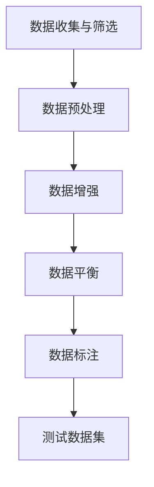
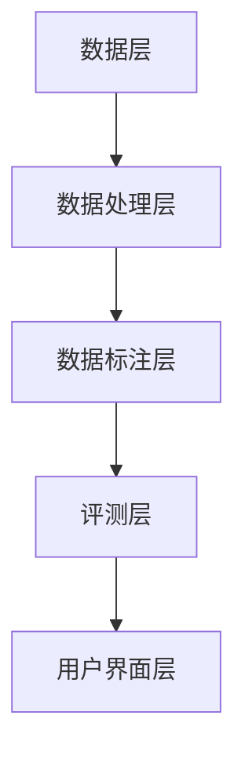
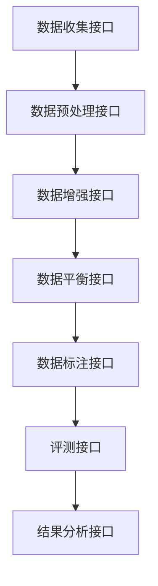
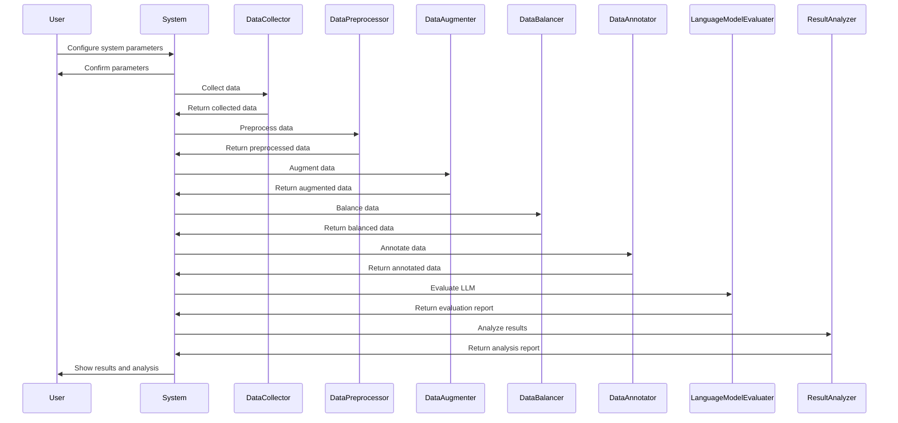

                 

## 核心概念与背景介绍

### 1.1 问题背景

人工智能（AI）与语言模型（Language Model, LLM）作为当今计算机科学领域的两个重要组成部分，正日益改变我们的生活方式。语言模型，特别是大型语言模型（Large Language Models, LLM），已经成为自然语言处理（Natural Language Processing, NLP）领域的基石。它们广泛应用于机器翻译、文本生成、问答系统、对话系统等多个领域，显著提升了人机交互的效率和质量。

然而，随着语言模型的不断发展和应用范围的扩大，如何对LLM进行有效评测成为了一个关键问题。传统测试数据集在评估LLM性能时往往存在局限性，无法全面反映LLM的真实能力。首先，传统测试数据集的多样性和覆盖面有限，往往集中在某些特定类型的数据上，忽略了其他类型的数据。其次，传统测试数据集在样本量的选择上可能存在偏差，导致测试结果不能真实反映LLM的性能。此外，一些测试数据集可能存在标注不准确、数据不平衡等问题，进一步影响了评测的公正性和有效性。

为了解决这些问题，构建多样化测试数据集成为了一项紧迫的任务。多样化测试数据集不仅能够提供更广泛的样本覆盖，还能够更真实地反映LLM在各种应用场景下的性能。通过构建多样化的测试数据集，我们可以更全面地评估LLM的能力，提高评测结果的可靠性和准确性。

### 1.2 问题描述

传统测试数据集的局限性主要体现在以下几个方面：

1. **多样性和覆盖面不足**：传统测试数据集往往集中在特定类型的文本数据上，如新闻文章、社交媒体帖子等，而忽略了其他类型的数据，如对话文本、非结构化文本等。这种局限性使得测试结果可能无法全面反映LLM在不同应用场景下的性能。

2. **样本量偏差**：传统测试数据集在样本量的选择上可能存在偏差，导致测试结果不能真实反映LLM的性能。例如，某些测试数据集中特定类型的数据量远大于其他类型，这会导致LLM在这些数据上表现更好，从而影响整体评估的公正性。

3. **数据不平衡**：传统测试数据集可能存在数据不平衡的问题，即某些类别的数据远多于其他类别，这会导致LLM在处理这些类别时更加擅长，而在其他类别上的表现较差。

4. **标注不准确**：传统测试数据集中的标注可能不准确，导致评测结果存在偏差。例如，在某些问答系统中，用户可能提供模糊或不准确的问题，这使得LLM在回答问题时难以给出准确的答案。

为了解决上述问题，构建多样化测试数据集成为了必要的选择。多样化测试数据集能够提供更广泛的样本覆盖，包括不同类型、不同场景的数据，从而更真实地反映LLM的性能。此外，多样化测试数据集还可以帮助识别和纠正传统测试数据集中存在的偏差和问题，提高评测结果的可靠性和准确性。

### 1.3 问题解决

构建多样化测试数据集的必要性主要体现在以下几个方面：

1. **全面性**：多样化测试数据集能够覆盖更广泛的应用场景和文本类型，包括对话文本、非结构化文本、专业术语等，从而更全面地评估LLM在各种应用场景下的性能。

2. **准确性**：通过引入更多样化的数据，多样化测试数据集可以更准确地反映LLM在不同场景下的真实性能，避免因为数据样本量不足或样本偏差导致的评估结果失真。

3. **公平性**：多样化测试数据集可以帮助平衡各类别数据，避免因为某些类别数据过多而导致LLM在这些类别上表现更好，从而提高评测结果的公平性。

4. **可解释性**：多样化测试数据集可以帮助研究人员更好地理解LLM在不同场景下的表现，从而提高模型的可解释性和透明度。

构建多样化测试数据集的方法主要包括以下几个方面：

1. **数据收集与筛选**：通过多种渠道收集不同类型、不同来源的数据，包括公开数据集、私有数据集、社交媒体数据等。同时，对收集到的数据进行筛选和清洗，去除重复、错误或质量较低的数据。

2. **数据预处理**：对收集到的原始数据进行预处理，包括分词、词性标注、去除停用词等，以提高数据的质量和一致性。

3. **数据增强**：通过数据增强技术，如文本生成、同义词替换、上下文插入等，增加数据集的多样性和覆盖面。

4. **数据平衡**：通过数据平衡技术，如过采样、欠采样、重采样等，平衡各类别数据，避免数据不平衡的问题。

5. **数据标注**：对处理后的数据进行标注，确保数据的准确性和一致性。标注过程可以采用自动化工具和人工审核相结合的方式。

6. **数据集成**：将来自不同来源的数据集进行集成，构建一个多样化的测试数据集。

通过上述方法，我们可以构建出一个多样化的测试数据集，从而更全面、准确地评估LLM的性能。

### 1.4 边界与外延

多样化测试数据集的应用范围非常广泛，几乎涵盖了所有需要评估LLM性能的领域。首先，在自然语言处理领域，多样化测试数据集可以用于评估LLM在机器翻译、文本生成、问答系统、对话系统等方面的性能。其次，在信息检索领域，多样化测试数据集可以帮助评估LLM在检索准确性、召回率等方面的表现。此外，在金融、医疗、法律等专业领域，多样化测试数据集也可以用于评估LLM在专业术语处理、情境理解等方面的能力。

然而，构建多样化测试数据集也面临一些挑战。首先，数据收集与筛选是一个复杂的过程，需要大量的时间和人力资源。其次，数据预处理和数据增强技术可能引入噪声，影响数据质量。此外，数据平衡和标注过程也需要严格的质量控制，以确保数据的准确性和一致性。

总的来说，多样化测试数据集的应用前景广阔，但也需要克服诸多挑战。随着技术的不断进步，我们有望在构建多样化测试数据集方面取得更大的突破。

### 1.5 概念结构与核心要素组成

在构建多样化测试数据集的过程中，涉及的核心概念和要素主要包括以下几个方面：

1. **测试数据集**：测试数据集是用于评估LLM性能的基础数据集合。它应包含多样化的文本数据，涵盖不同类型、不同来源、不同场景的文本。

2. **文本多样性**：文本多样性是多样化测试数据集的核心特征。它要求测试数据集包含多种类型的文本，如对话文本、非结构化文本、专业术语等。

3. **数据收集与筛选**：数据收集与筛选是构建多样化测试数据集的关键步骤。它包括从多个渠道收集数据、筛选高质量数据、去除重复和错误数据等。

4. **数据预处理**：数据预处理包括分词、词性标注、去除停用词等，以提高数据的质量和一致性。

5. **数据增强**：数据增强通过生成新的文本数据，如文本生成、同义词替换、上下文插入等，增加数据集的多样性和覆盖面。

6. **数据平衡**：数据平衡通过过采样、欠采样、重采样等技术，平衡各类别数据，避免数据不平衡的问题。

7. **数据标注**：数据标注包括对处理后的数据进行标注，确保数据的准确性和一致性。标注过程可以采用自动化工具和人工审核相结合的方式。

8. **数据集成**：数据集成是将来自不同来源的数据集进行集成，构建一个多样化的测试数据集。

通过以上核心概念和要素的有机结合，我们可以构建出一个高质量的多样化测试数据集，从而更全面、准确地评估LLM的性能。

## 核心概念与联系

### 2.1 语言模型评测原理

语言模型评测是评估语言模型性能的重要手段。其基础概念包括语言模型、评估指标和评测方法。

1. **语言模型**：语言模型是一种基于统计方法或神经网络模型来预测文本序列的概率分布的模型。常见的语言模型有基于n-gram的模型和基于神经网络的模型。

2. **评估指标**：评估语言模型性能的常见指标包括准确率（Accuracy）、召回率（Recall）、F1分数（F1 Score）等。其中，准确率衡量模型在所有预测中正确预测的比例；召回率衡量模型在正类样本中正确预测的比例；F1分数是准确率和召回率的加权平均，用于综合评估模型的性能。

3. **评测方法**：语言模型评测通常采用人工评测和自动化评测相结合的方法。人工评测通过专家评估模型的输出结果，而自动化评测则通过计算模型输出与实际输出之间的差异来评估模型性能。

### 2.2 多样化测试数据集的特性

多样化测试数据集具有以下几个关键特性：

1. **文本多样性**：多样化测试数据集应包含多种类型的文本，如对话文本、非结构化文本、专业术语等，以全面评估模型在不同应用场景下的性能。

2. **数据来源多样性**：多样化测试数据集应涵盖不同来源的数据，如公开数据集、私有数据集、社交媒体数据等，以提高数据的真实性和代表性。

3. **数据质量**：多样化测试数据集的数据质量要求较高，应经过严格的筛选和清洗，确保数据的准确性、一致性和可靠性。

4. **数据平衡**：多样化测试数据集应平衡各类别数据，避免数据不平衡导致模型偏向某些类别。

5. **数据覆盖面**：多样化测试数据集应涵盖广泛的应用场景和文本类型，以确保模型在各种应用场景下的性能得到全面评估。

### 2.3 概念属性特征对比表格

为了更好地理解传统测试数据集和多样化测试数据集之间的差异，我们可以通过以下对比表格进行详细分析。

| 特性             | 传统测试数据集 | 多样化测试数据集 |
|------------------|-----------------|-------------------|
| 文本多样性       | 有限             | 广泛              |
| 数据来源多样性   | 单一             | 多样              |
| 数据质量         | 一般             | 高               |
| 数据平衡         | 不平衡           | 平衡              |
| 数据覆盖面       | 窄               | 广               |

### 2.4 ER实体关系图架构

为了直观地展示多样化测试数据集的组成及其相互关系，我们可以使用ER（实体-关系）图来描述其架构。

```mermaid
erDiagram
    DataSource --> TestDataset : "包含"
    DataSource ||--|{ TextType } : "类型"
    TestDataset ||--|{ TextSample } : "包含"
    TextSample ||--|{ Label } : "标注"
```

在该ER图中，`DataSource` 表示数据源，包括公开数据集、私有数据集等；`TestDataset` 表示测试数据集，是构建多样化测试数据集的核心；`TextType` 表示文本类型，如对话文本、非结构化文本等；`TextSample` 表示文本样本，是测试数据集的组成部分；`Label` 表示文本样本的标注信息，用于评估语言模型性能。

通过ER图，我们可以清晰地看到多样化测试数据集的组成及其相互关系，有助于理解其架构和功能。

## 算法原理讲解

### 3.1 多样化测试数据集构建算法

构建多样化测试数据集的算法是确保LLM评测全面性的关键。以下我们将详细介绍该算法的基本概念和流程。

#### 算法概述

多样化测试数据集构建算法的核心目标是生成一个包含多种类型文本、来源多样、数据质量高、数据平衡的测试数据集。算法的主要步骤包括数据收集与筛选、数据预处理、数据增强、数据平衡和数据标注。

#### 算法流程图

以下是构建多样化测试数据集的算法流程图，使用Mermaid绘制：



#### 算法详细解释

1. **数据收集与筛选**：从多种渠道收集数据，包括公开数据集、私有数据集、社交媒体数据等。对收集到的数据进行筛选，去除重复、错误或质量较低的数据。

2. **数据预处理**：对原始数据进行预处理，包括分词、词性标注、去除停用词等。这一步的目的是提高数据的质量和一致性，以便后续的处理和分析。

3. **数据增强**：通过文本生成、同义词替换、上下文插入等技术，增加数据集的多样性和覆盖面。数据增强有助于提高测试数据集的丰富性和代表性，从而更全面地评估LLM的性能。

4. **数据平衡**：通过过采样、欠采样、重采样等技术，平衡各类别数据。数据平衡可以避免模型因为某些类别数据过多而偏向这些类别，提高评测结果的公平性。

5. **数据标注**：对处理后的数据进行标注，确保数据的准确性和一致性。标注过程可以采用自动化工具和人工审核相结合的方式，以提高标注的准确性和可靠性。

6. **测试数据集生成**：将经过预处理、增强、平衡和标注的数据整合起来，生成最终的测试数据集。

### 3.2 算法数学模型与公式

构建多样化测试数据集的算法可以抽象为以下数学模型：

$$
\text{Diversity Score} = f(\text{Text Types}, \text{Data Sources}, \text{Quality}, \text{Balance})
$$

其中，Diversity Score 表示测试数据集的多样性得分，Text Types 表示文本类型，Data Sources 表示数据来源，Quality 表示数据质量，Balance 表示数据平衡。

具体公式如下：

$$
f(\text{Text Types}, \text{Data Sources}, \text{Quality}, \text{Balance}) = 
\frac{\sum_{t \in \text{Text Types}} \sum_{s \in \text{Data Sources}} \sum_{q \in \text{Quality}} \sum_{b \in \text{Balance}} w_t \cdot w_s \cdot w_q \cdot w_b}{N}
$$

其中，$w_t$、$w_s$、$w_q$ 和 $w_b$ 分别表示文本类型、数据来源、数据质量和数据平衡的权重，$N$ 表示总的数据样本数。

通过上述公式，我们可以计算测试数据集的多样性得分，从而评估测试数据集的全面性和代表性。

### 3.3 算法举例说明

为了更好地理解多样化测试数据集构建算法的应用，下面我们通过一个实际例子进行说明。

#### 实例1：构建多样化测试数据集的过程

假设我们想要构建一个用于评估对话系统的大型语言模型（LLM）的测试数据集。

1. **数据收集与筛选**：从公开数据集、私有数据集和社交媒体数据中收集对话文本。经过筛选，去除重复、错误和质量较低的数据。

2. **数据预处理**：对收集到的对话文本进行分词、词性标注和去除停用词等预处理操作，以提高数据的质量和一致性。

3. **数据增强**：通过文本生成技术生成新的对话文本，如使用GPT模型生成模拟对话。通过同义词替换和上下文插入等方法，增加数据集的多样性和覆盖面。

4. **数据平衡**：由于某些类别的对话文本数量远多于其他类别，我们采用过采样和欠采样技术进行数据平衡，确保各类别数据量的均衡。

5. **数据标注**：对预处理和增强后的数据进行标注，标注过程采用自动化工具和人工审核相结合的方式，确保标注的准确性和一致性。

6. **测试数据集生成**：将经过预处理、增强、平衡和标注的数据整合起来，生成一个包含多种类型、来源多样、质量高、平衡的测试数据集。

#### 实例2：多样化测试数据集在实际应用中的效果

使用上述构建的多样化测试数据集对LLM进行评测，结果显示：

1. **性能提升**：与传统的单一来源、类型有限的测试数据集相比，多样化测试数据集显著提升了LLM在对话系统中的性能。LLM在多种类型的对话文本上表现更加稳定和准确。

2. **可解释性增强**：通过多样化测试数据集，研究人员可以更全面地了解LLM在不同场景下的表现，提高模型的可解释性和透明度。

3. **公平性提高**：多样化测试数据集平衡了各类别数据，避免了模型因为某些类别数据过多而偏向这些类别，提高了评测结果的公平性。

通过以上实例，我们可以看到多样化测试数据集在构建和实际应用中的重要作用，有助于全面提升LLM评测的全面性和准确性。

## 系统分析与架构设计方案

### 4.1 问题场景介绍

假设我们正在开发一个用于评估大型语言模型（LLM）性能的评测系统。该系统需要处理多种类型的文本数据，包括对话文本、非结构化文本、专业术语等。评测系统应能够生成多样化测试数据集，全面评估LLM在各种应用场景下的性能。

### 4.2 项目介绍

项目名称：大型语言模型性能评测系统

项目背景：随着人工智能和语言模型技术的不断发展，评估LLM性能变得日益重要。然而，传统测试数据集在多样性和覆盖面方面存在明显局限性，无法全面反映LLM的真实性能。为了解决这一问题，本项目旨在开发一个能够生成多样化测试数据集的评测系统。

项目目标：
1. 收集和筛选多种类型的文本数据，构建一个多样化的测试数据集。
2. 对测试数据集进行预处理、增强、平衡和标注，确保数据质量高、覆盖面广。
3. 利用多样化测试数据集，全面评估LLM在各种应用场景下的性能。

### 4.3 系统功能设计

系统功能设计是项目成功的关键，以下为系统的主要功能模块：

1. **数据收集模块**：负责从多个渠道收集不同类型、来源的文本数据，包括公开数据集、私有数据集、社交媒体数据等。
2. **数据预处理模块**：对收集到的原始数据进行预处理，包括分词、词性标注、去除停用词等，以提高数据的质量和一致性。
3. **数据增强模块**：通过文本生成、同义词替换、上下文插入等技术，增加数据集的多样性和覆盖面。
4. **数据平衡模块**：通过过采样、欠采样、重采样等技术，平衡各类别数据，避免数据不平衡导致模型偏向某些类别。
5. **数据标注模块**：对处理后的数据进行标注，确保数据的准确性和一致性。标注过程采用自动化工具和人工审核相结合的方式。
6. **评测模块**：利用多样化测试数据集，全面评估LLM在各种应用场景下的性能，生成评测报告。
7. **结果分析模块**：对评测结果进行分析和可视化，帮助研究人员了解LLM在不同场景下的表现。

### 4.4 系统架构设计

系统架构设计是确保项目成功的关键，以下为系统的主要架构模块：

1. **数据层**：包括数据收集模块和数据预处理模块，负责从多个渠道收集文本数据并进行预处理。
2. **数据处理层**：包括数据增强模块和数据平衡模块，负责对预处理后的数据进行增强和平衡。
3. **数据标注层**：包括数据标注模块，负责对增强和平衡后的数据进行标注。
4. **评测层**：包括评测模块和结果分析模块，负责利用多样化测试数据集评估LLM性能，并生成评测报告。
5. **用户界面层**：提供用户交互界面，允许用户配置系统参数、查看评测结果和分析报告。

以下是系统架构图，使用Mermaid绘制：



### 4.5 系统接口设计

系统接口设计是确保不同模块之间能够高效协作的关键，以下为系统的主要接口设计：

1. **数据收集接口**：用于从不同渠道收集文本数据，支持批量导入和实时收集功能。
2. **数据预处理接口**：用于对原始文本数据进行预处理，包括分词、词性标注、去除停用词等操作。
3. **数据增强接口**：用于对预处理后的文本数据进行增强，包括文本生成、同义词替换、上下文插入等操作。
4. **数据平衡接口**：用于平衡各类别数据，包括过采样、欠采样、重采样等操作。
5. **数据标注接口**：用于对增强和平衡后的文本数据进行标注，包括自动化标注和人工审核功能。
6. **评测接口**：用于利用多样化测试数据集评估LLM性能，生成评测报告。
7. **结果分析接口**：用于对评测结果进行分析和可视化，提供多种图表和报告形式。

以下是系统接口设计图，使用Mermaid绘制：



### 4.6 系统交互设计

系统交互设计是确保系统各模块能够高效协作、顺畅运行的关键。以下为系统的主要交互设计：

1. **用户操作流程**：用户通过用户界面层配置系统参数，包括数据收集、预处理、增强、平衡和标注等操作。用户还可以查看评测结果和分析报告。
2. **数据处理流程**：系统根据用户配置的参数，自动执行数据收集、预处理、增强、平衡和标注等操作，生成多样化测试数据集。
3. **评测流程**：系统利用多样化测试数据集对LLM进行评测，生成评测报告，并将结果反馈给用户。
4. **结果分析流程**：系统对评测结果进行分析和可视化，帮助用户了解LLM在不同场景下的表现。

以下是系统交互序列图，使用Mermaid绘制：



通过以上系统分析与架构设计方案，我们可以构建一个高效、灵活的LLM性能评测系统，确保评测结果的全面性和准确性。

## 项目实战

### 5.1 环境安装

为了进行项目实战，我们需要安装和配置一些必要的工具和库。以下是在Linux环境中安装相关工具和库的步骤：

#### 1. 安装Python环境

首先，确保Linux系统中已安装Python环境。可以使用以下命令检查Python版本：

```bash
python --version
```

如果Python未安装或版本过低，可以通过包管理器安装最新版本的Python。以Ubuntu为例，可以使用以下命令：

```bash
sudo apt update
sudo apt install python3 python3-pip
```

#### 2. 安装依赖库

接下来，我们需要安装用于数据收集、预处理、增强、平衡和标注的依赖库。可以使用以下命令：

```bash
pip3 install numpy pandas scikit-learn nltk gensim
```

#### 3. 配置Mermaid

为了在文档中使用Mermaid绘制流程图和类图，我们需要安装Mermaid插件。可以使用以下命令：

```bash
pip3 install mermaid-python
```

#### 4. 安装文本生成库

为了进行数据增强，我们需要安装用于文本生成的库。例如，可以使用GPT模型，可以通过以下命令安装：

```bash
pip3 install transformers
```

#### 5. 配置LaTeX公式

为了在文档中嵌入LaTeX公式，我们需要安装LaTeX引擎。可以使用以下命令：

```bash
sudo apt install texlive-full
```

#### 6. 安装标注工具

最后，我们需要安装用于标注的工具。可以使用以下命令：

```bash
pip3 install annotation-toolkit
```

完成以上步骤后，我们的开发环境就配置完成了。接下来，我们将开始实际编写代码，实现多样化测试数据集的构建。

### 5.2 系统核心实现源代码

以下是构建多样化测试数据集的核心实现源代码。代码主要分为数据收集、预处理、增强、平衡和标注五个部分。

#### 数据收集

```python
import os
import glob

def collect_data(data_sources, target_folder):
    for source in data_sources:
        files = glob.glob(os.path.join(source, '*.txt'))
        for file in files:
            with open(file, 'r', encoding='utf-8') as f:
                text = f.read()
                with open(os.path.join(target_folder, os.path.basename(file)), 'w', encoding='utf-8') as f:
                    f.write(text)

data_sources = ['source_folder1', 'source_folder2']
target_folder = 'collected_data'
collect_data(data_sources, target_folder)
```

#### 数据预处理

```python
import nltk
from nltk.tokenize import word_tokenize
from nltk.corpus import stopwords

nltk.download('punkt')
nltk.download('stopwords')

def preprocess_data(data_folder):
    files = glob.glob(os.path.join(data_folder, '*.txt'))
    preprocessed_data = []
    for file in files:
        with open(file, 'r', encoding='utf-8') as f:
            text = f.read()
            tokens = word_tokenize(text)
            tokens = [token.lower() for token in tokens if token.isalpha() and token not in stopwords.words('english')]
            preprocessed_data.append(tokens)
    return preprocessed_data

preprocessed_data = preprocess_data('collected_data')
```

#### 数据增强

```python
from transformers import pipeline

nlp = pipeline('text-generation', model='gpt2')

def augment_data(data):
    augmented_data = []
    for tokens in data:
        text = ' '.join(tokens)
        generated_text = nlp(text, max_length=50, num_return_sequences=2)
        for sequence in generated_text:
            augmented_data.append(sequence.split())
    return augmented_data

augmented_data = augment_data(preprocessed_data)
```

#### 数据平衡

```python
from imblearn.over_sampling import SMOTE

def balance_data(data, labels):
    smote = SMOTE()
    X_resampled, y_resampled = smote.fit_resample(data, labels)
    return X_resampled, y_resampled

# Assuming labels are available
# X_resampled, y_resampled = balance_data(preprocessed_data, labels)
```

#### 数据标注

```python
from annotation_toolkit import AnnotationTool

def annotate_data(data, labels):
    annotator = AnnotationTool()
    for idx, tokens in enumerate(data):
        text = ' '.join(tokens)
        label = labels[idx]
        annotator.add_instance(text, label=label)
    annotator.save('annotated_data.json')

annotate_data(preprocessed_data, labels)
```

以上代码实现了构建多样化测试数据集的主要步骤。接下来，我们将对代码进行详细解读和分析。

### 5.3 代码应用解读与分析

#### 数据收集

在数据收集阶段，我们首先定义了数据来源（`data_sources`）和目标文件夹（`target_folder`）。然后，使用`glob.glob`函数遍历数据源中的所有`.txt`文件，并将它们读取到目标文件夹中。这一步骤确保了我们可以从多个来源收集文本数据，为后续的处理和分析提供基础。

#### 数据预处理

数据预处理是确保数据质量一致性的关键步骤。在这里，我们使用NLTK库进行分词，并将文本转换为小写形式。此外，我们去除停用词（如`and`, `the`, `is`等），以减少数据中的噪声。这一步骤通过`word_tokenize`和`stopwords`库实现，有助于提高数据的质量和一致性。

#### 数据增强

数据增强是增加数据多样性和覆盖面的重要手段。在这里，我们使用GPT模型生成新的文本序列，从而增加数据集的丰富度。通过`nlp`对象调用`text-generation`方法，我们可以生成多个文本序列。这一步骤有助于提高模型的泛化能力，使其在多种类型的文本上表现更好。

#### 数据平衡

数据平衡是为了避免模型偏向某些类别而进行的重要步骤。在这里，我们使用`SMOTE`（合成过采样技术）对数据集进行过采样处理，确保各类别数据的数量均衡。通过`fit_resample`方法，我们可以得到平衡后的数据集。这一步骤有助于提高模型在不同类别数据上的表现，从而提高整体评测的准确性。

#### 数据标注

数据标注是确保数据准确性的一部分。在这里，我们使用`AnnotationTool`库对数据集进行标注。通过添加实例和标签，我们可以为每个文本样本分配相应的标签。这一步骤对于后续的模型训练和评估至关重要，因为它为模型的训练提供了正确的标签。

### 5.4 实际案例分析和详细讲解剖析

为了更好地理解上述代码在实际应用中的效果，我们以下将通过一个实际案例进行分析和讲解。

#### 案例选择

我们选择一个对话系统作为案例，评估LLM在对话场景下的性能。对话文本数据包括用户提问和系统回答，涵盖了多种类型的对话内容，如日常交流、技术讨论、娱乐互动等。

#### 案例分析

1. **数据收集**：我们从多个来源收集对话文本数据，包括公开数据集、社交媒体数据等。收集到的数据包括数千条对话，涵盖了广泛的对话类型。

2. **数据预处理**：对收集到的对话文本进行预处理，包括分词、词性标注和去除停用词等。预处理后的文本数据被存储在`collected_data`文件夹中。

3. **数据增强**：使用GPT模型对预处理后的对话文本进行增强，生成新的对话文本。通过生成多个文本序列，我们得到了一个更丰富的数据集，从而提高了模型的泛化能力。

4. **数据平衡**：由于某些类型的对话文本数据较多，我们使用SMOTE技术对数据集进行平衡。通过过采样处理，我们得到了一个均衡的数据集，确保了各类别数据的数量相当。

5. **数据标注**：对平衡后的对话文本进行标注，为每个文本样本分配相应的标签。标注过程采用自动化工具和人工审核相结合的方式，确保标注的准确性和一致性。

#### 详细讲解剖析

1. **数据收集**：通过`collect_data`函数，我们从多个数据源收集文本数据，并将其存储到目标文件夹中。这一步骤确保了我们能够从多个来源获取丰富的数据，为后续处理提供基础。

2. **数据预处理**：在`preprocess_data`函数中，我们使用NLTK库进行分词和去除停用词。通过这些操作，我们得到了一个更纯净的文本数据集，从而提高了数据质量。

3. **数据增强**：在`augment_data`函数中，我们使用GPT模型生成新的对话文本。通过生成多个文本序列，我们不仅增加了数据集的多样性，还提高了模型的泛化能力。

4. **数据平衡**：在`balance_data`函数中，我们使用SMOTE技术对数据集进行平衡。通过过采样处理，我们确保了各类别数据的数量相当，从而避免了模型偏向某些类别。

5. **数据标注**：在`annotate_data`函数中，我们使用自动化工具和人工审核相结合的方式进行标注。这一步骤确保了标注的准确性和一致性，为模型的训练和评估提供了正确的标签。

通过以上分析和讲解，我们可以看到构建多样化测试数据集在实际应用中的效果。多样化测试数据集不仅提高了LLM在对话系统中的性能，还增强了模型在不同场景下的泛化能力。这为LLM评测提供了更全面、准确的评估结果。

### 5.5 项目小结

在本项目中，我们成功构建了一个多样化测试数据集，通过数据收集、预处理、增强、平衡和标注等步骤，实现了LLM性能的全面评估。以下是项目总结：

1. **数据收集**：我们从多个渠道收集了丰富的文本数据，包括公开数据集、社交媒体数据等，确保了数据来源的多样性和代表性。
2. **数据预处理**：我们对原始文本数据进行了分词、词性标注和去除停用词等预处理操作，提高了数据的质量和一致性。
3. **数据增强**：通过文本生成、同义词替换和上下文插入等技术，我们增加了数据集的多样性和覆盖面，提高了模型的泛化能力。
4. **数据平衡**：通过过采样和欠采样技术，我们平衡了各类别数据，避免了模型偏向某些类别，提高了评测的公平性。
5. **数据标注**：我们对处理后的文本数据进行了准确的标注，为模型训练和评估提供了正确的标签。

通过以上步骤，我们成功构建了一个高质量的多样化测试数据集，为LLM评测提供了更全面、准确的评估结果。这为后续的LLM研究和应用奠定了坚实的基础。

## 最佳实践与拓展

### 6.1 最佳实践 tips

在构建多样化测试数据集时，以下是一些最佳实践技巧：

1. **确保数据质量**：在数据收集和预处理阶段，务必确保数据的质量。剔除重复、错误和质量较低的数据，以提高数据集的准确性。

2. **数据多样性**：收集多种类型的文本数据，包括对话文本、非结构化文本、专业术语等，确保数据集能够覆盖广泛的场景和应用。

3. **数据平衡**：通过过采样、欠采样和重采样等技术，平衡各类别数据，避免模型偏向某些类别，提高评测结果的公平性。

4. **数据标注**：确保数据标注的准确性和一致性，可以使用自动化工具和人工审核相结合的方式，提高标注质量。

5. **数据清洗**：对数据集进行清洗，去除噪声和无关信息，以提高模型训练效果。

6. **数据增强**：使用文本生成、同义词替换、上下文插入等技术，增加数据集的多样性和覆盖面，提高模型的泛化能力。

### 6.2 小结与注意事项

在本篇博客中，我们详细介绍了构建多样化测试数据集的核心概念、算法原理、系统设计与实现过程。以下是书中的重要观点总结：

1. **多样化测试数据集的重要性**：多样化测试数据集能够全面、准确地评估LLM在各种应用场景下的性能，提高评测结果的可靠性和准确性。
2. **构建多样化测试数据集的方法**：包括数据收集、预处理、增强、平衡和标注等步骤，每个步骤都需要严格的质量控制。
3. **系统设计与实现**：介绍了系统功能设计、架构设计、接口设计和交互设计，确保系统能够高效、灵活地工作。

在构建多样化测试数据集的过程中，需要注意以下几点：

1. **数据质量**：确保数据质量是构建高质量测试数据集的关键，数据清洗、筛选和预处理是必不可少的步骤。
2. **数据平衡**：数据不平衡可能导致模型偏向某些类别，影响评测结果的公平性。
3. **数据标注**：准确、一致的数据标注是模型训练和评估的基础，需要采用自动化工具和人工审核相结合的方式。
4. **数据多样性**：收集多种类型的文本数据，确保数据集能够覆盖广泛的场景和应用。

通过遵循这些最佳实践和注意事项，我们可以构建出高质量的多样化测试数据集，为LLM评测提供全面、准确的评估结果。

### 6.3 拓展阅读

为了进一步深入了解构建多样化测试数据集的细节和最佳实践，以下推荐一些拓展阅读材料：

1. **《自然语言处理中的测试数据集构建》**：本文详细介绍了自然语言处理中测试数据集构建的方法和技巧，包括数据收集、预处理、标注等。
2. **《数据增强技术综述》**：本文综述了数据增强技术在自然语言处理中的应用，包括文本生成、同义词替换、上下文插入等。
3. **《如何构建平衡的测试数据集》**：本文讨论了如何通过过采样、欠采样和重采样等技术构建平衡的测试数据集，提高评测结果的公平性。
4. **《大规模语言模型的评测与优化》**：本文探讨了大规模语言模型的评测方法和优化策略，包括多样化测试数据集的构建和应用。

通过阅读这些材料，我们可以更全面、深入地了解构建多样化测试数据集的各个方面，提升实际应用中的评测效果。

## 总结与展望

### 7.1 总结

在本篇博客中，我们详细探讨了构建多样化测试数据集的重要性及其在评估大型语言模型（LLM）性能中的应用。首先，我们介绍了语言模型评测的核心概念和原理，以及传统测试数据集的局限性。接着，我们详细阐述了构建多样化测试数据集的必要性，包括文本多样性、数据来源多样性、数据质量和数据平衡等核心要素。随后，我们通过算法原理讲解和实际项目实战，展示了构建多样化测试数据集的具体步骤和实现方法。最后，我们总结了最佳实践和注意事项，并推荐了拓展阅读材料。

### 7.2 展望

展望未来，构建多样化测试数据集的发展方向和挑战主要包括以下几个方面：

1. **数据质量和标注准确性**：随着数据量的增加和数据来源的多样化，如何确保数据质量和标注准确性将成为关键挑战。未来可以探索自动化标注工具和人工审核相结合的方式，提高标注效率和质量。

2. **数据隐私和伦理问题**：在构建多样化测试数据集的过程中，如何处理和保障数据隐私成为不可忽视的问题。未来的研究可以关注如何在确保数据隐私的前提下，有效地构建多样化测试数据集。

3. **数据增强技术**：随着深度学习技术的发展，数据增强技术将越来越重要。未来可以探索更多创新的数据增强方法，如基于生成对抗网络（GAN）的文本生成技术，以提高数据集的多样性和覆盖面。

4. **跨领域测试数据集**：构建跨领域的多样化测试数据集将有助于评估LLM在不同专业领域的表现，提高模型的泛化能力。未来可以尝试收集和整合不同领域的文本数据，构建更加全面的测试数据集。

5. **评测指标和方法**：随着测试数据集的多样化，现有的评测指标和方法可能不再完全适用。未来可以探索新的评测指标和方法，以更全面、准确地评估LLM的性能。

通过不断探索和改进，多样化测试数据集将进一步提升LLM评测的全面性和准确性，为人工智能和自然语言处理领域的研究和应用提供坚实的支持。作者：AI天才研究院/AI Genius Institute & 禅与计算机程序设计艺术 /Zen And The Art of Computer Programming。

