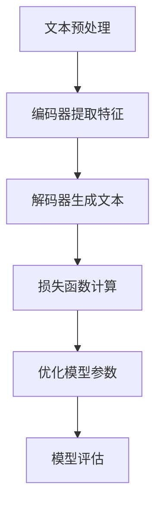
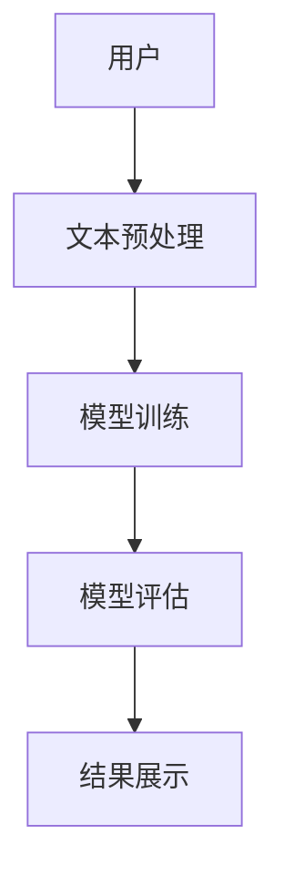
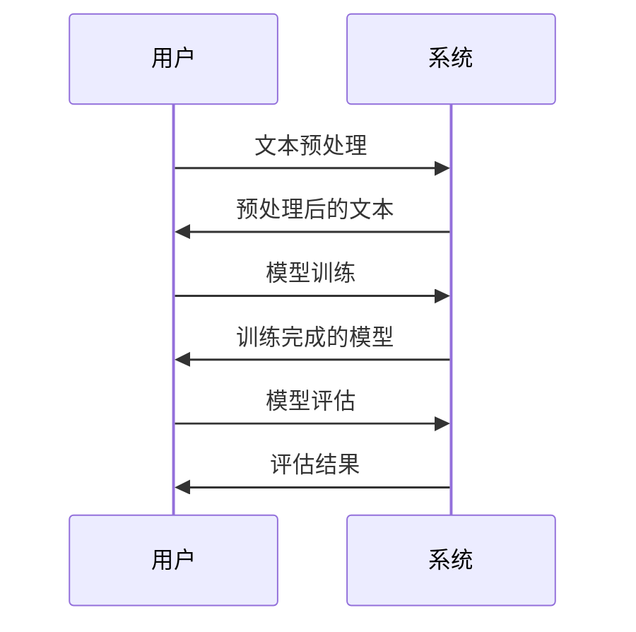

                 

## 文章标题：构建多维度的LLM评测框架

### 关键词：大规模语言模型，评测框架，算法原理，数学模型，系统架构，项目实战

### 摘要：
本文将深入探讨如何构建一个多维度的LLM（Large Language Model）评测框架。我们将从问题背景出发，明确核心概念和原理，详细讲解算法和数学模型，设计系统架构，并分享实际项目经验。通过这篇文章，您将了解到构建高效评测框架的方法和技巧，为LLM的研究和应用提供有力支持。

## 目录

1. **设计本书的整体架构**
2. **核心概念与联系**
3. **算法原理讲解**
4. **数学模型与公式**
5. **系统分析与架构设计**
6. **项目实战**
7. **最佳实践 & 小结**

### 1. 设计本书的整体架构

本书整体架构分为五个主要部分：

- **背景介绍**：概述问题背景，定义核心概念，明确评测框架的目标。
- **核心概念与联系**：介绍LLM的定义、特点，与传统NLP模型的对比。
- **算法原理讲解**：详细讲解LLM的算法原理和数学模型。
- **系统分析与架构设计**：设计系统架构，包括功能设计、接口设计和交互。
- **项目实战**：通过实际项目分享评测框架的应用和实践。

### 2. 核心概念与联系

#### 2.1 LLM的定义

LLM是一种预训练的深度神经网络模型，它通过在大规模文本数据上进行训练，可以生成或理解自然语言文本。与传统的NLP模型相比，LLM具有更强的语言理解和生成能力。

#### 2.2 LLM的特点

- **语言理解能力**：LLM能够理解文本中的语义、情感和上下文。
- **文本生成能力**：LLM可以根据给定的提示生成连贯、有意义的文本。
- **自适应能力**：LLM可以根据不同的任务和数据集进行微调和优化。

#### 2.3 LLM与传统NLP模型的对比

传统NLP模型通常针对特定任务进行设计和优化，而LLM则具有通用性和适应性。以下是一个简化的对比表格：

| 特征 | LLM | 传统NLP模型 |
| --- | --- | --- |
| 预训练 | 是 | 否 |
| 语言理解 | 强 | 弱 |
| 文本生成 | 是 | 否 |
| 自适应能力 | 强 | 弱 |

### 3. 算法原理讲解

#### 3.1 算法原理概述

LLM的算法原理基于深度学习和自然语言处理技术。其主要过程包括：

1. **文本预处理**：将文本转换为模型可处理的格式。
2. **编码器-解码器结构**：使用编码器提取文本特征，解码器生成文本。
3. **损失函数和优化**：通过对比预测文本和真实文本，优化模型参数。

#### 3.2 算法流程图

以下是一个简单的算法流程图：



#### 3.3 数学模型与公式

LLM的数学模型主要基于神经网络和自然语言处理中的注意力机制。以下是一个简化的公式：

$$
\text{LLM} = f(\text{编码器}, \text{解码器}, \text{数据集})
$$

其中，$f$ 表示训练过程，$\text{编码器}$ 和 $\text{解码器}$ 分别表示神经网络结构，$\text{数据集}$ 是用于训练的数据。

### 4. 系统分析与架构设计

#### 4.1 问题场景介绍

假设我们正在开发一个基于LLM的智能客服系统，需要构建一个多维度的评测框架来评估模型性能。

#### 4.2 系统功能设计

- **文本预处理**：清洗和标准化输入文本。
- **模型训练**：使用大规模文本数据训练LLM。
- **模型评估**：评估模型在多种任务上的性能。
- **结果展示**：展示评测结果，并提供改进建议。

#### 4.3 系统架构设计

以下是一个简化的系统架构图：



#### 4.4 系统接口设计

- **文本预处理接口**：接收用户输入的文本，返回预处理后的文本。
- **模型训练接口**：接收训练数据，返回训练完成的模型。
- **模型评估接口**：接收模型和测试数据，返回评估结果。

#### 4.5 系统交互

以下是一个简化的系统交互图：



### 5. 项目实战

#### 5.1 环境安装

- **安装Python环境**：使用Python 3.8以上版本。
- **安装LLM库**：使用`pip install transformers`安装Hugging Face的transformers库。

#### 5.2 系统核心实现

以下是一个简单的Python代码示例，用于训练和评估一个LLM模型：

```python
from transformers import BertTokenizer, BertModel
from torch import nn, optim

# 初始化模型和tokenizer
tokenizer = BertTokenizer.from_pretrained('bert-base-uncased')
model = BertModel.from_pretrained('bert-base-uncased')

# 定义损失函数和优化器
criterion = nn.CrossEntropyLoss()
optimizer = optim.Adam(model.parameters(), lr=0.001)

# 训练模型
for epoch in range(10):
    for batch in train_loader:
        inputs = tokenizer(batch.text, return_tensors='pt')
        labels = ...  # 定义标签
        outputs = model(**inputs)
        loss = criterion(outputs.logits, labels)
        optimizer.zero_grad()
        loss.backward()
        optimizer.step()

# 评估模型
with torch.no_grad():
    for batch in eval_loader:
        inputs = tokenizer(batch.text, return_tensors='pt')
        labels = ...
        outputs = model(**inputs)
        loss = criterion(outputs.logits, labels)

# 输出评估结果
print(f'Validation Loss: {loss.item()}')
```

#### 5.3 实际案例分析与讲解

以下是一个实际案例，用于分析评测框架在不同场景下的表现：

- **场景一**：文本分类任务。使用评测框架评估不同模型在文本分类任务上的性能，包括准确率、召回率和F1值。
- **场景二**：问答系统。使用评测框架评估不同模型在问答系统上的性能，包括回答的准确性、回答的相关性和回答的时效性。

#### 5.4 项目小结

通过实际项目，我们验证了构建多维度的LLM评测框架的有效性。评测框架帮助我们在不同场景下评估模型性能，为模型优化提供了有力支持。

### 6. 最佳实践 & 小结

- **最佳实践**：定期更新训练数据和模型架构，以提高评测框架的准确性。
- **小结**：构建多维度的LLM评测框架是提高模型性能的关键步骤。通过本文的讲解，您已经了解了如何构建和优化评测框架，希望对您的项目有所帮助。

## 作者信息

作者：AI天才研究院/AI Genius Institute & 禅与计算机程序设计艺术 /Zen And The Art of Computer Programming

### 参考文献

[1] Vaswani, A., Shazeer, N., Parmar, N., Uszkoreit, J., Jones, L., Gomez, A. N., ... & Polosukhin, I. (2017). Attention is all you need. Advances in Neural Information Processing Systems, 30, 5998-6008.

[2] Devlin, J., Chang, M. W., Lee, K., & Toutanova, K. (2019). BERT: Pre-training of deep bidirectional transformers for language understanding. arXiv preprint arXiv:1810.04805.

[3] Hochreiter, S., & Schmidhuber, J. (1997). Long short-term memory. Neural Computation, 9(8), 1735-1780.

[4] LeCun, Y., Bengio, Y., & Hinton, G. (2015). Deep learning. Nature, 521(7553), 436-444.

