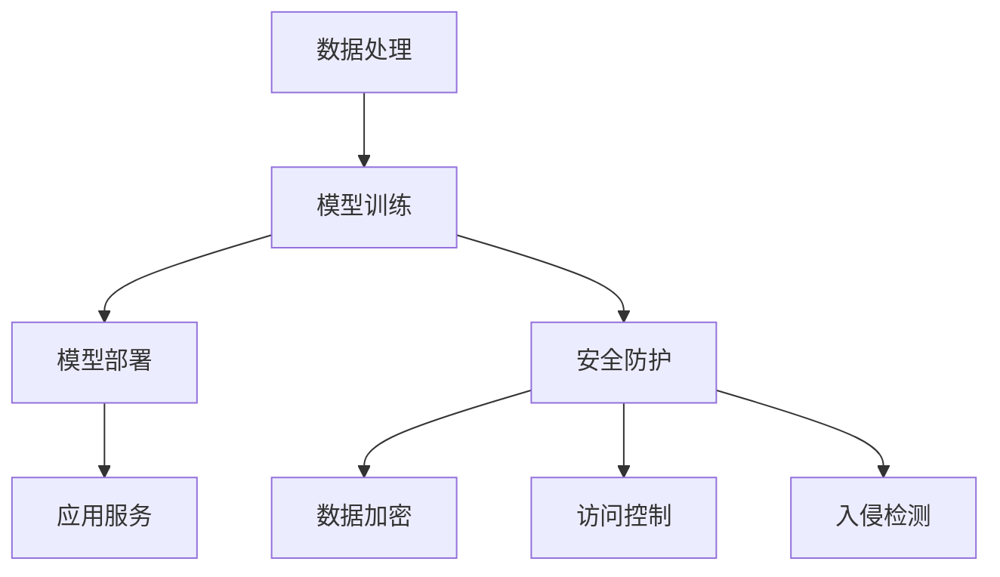
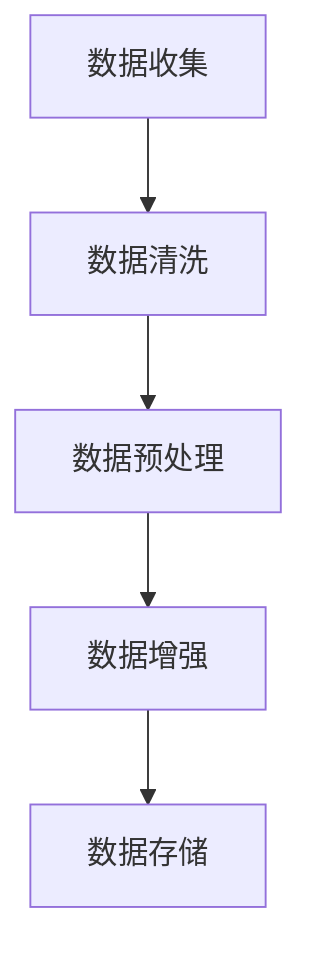
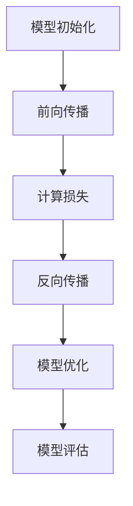
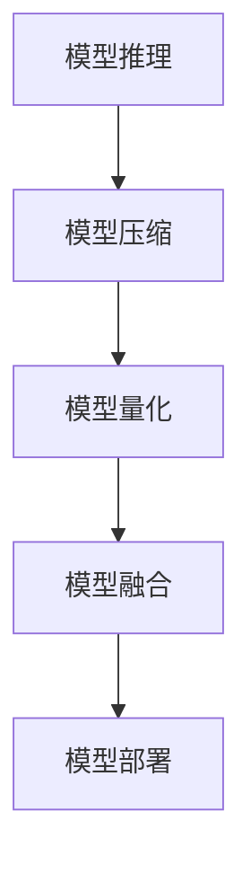
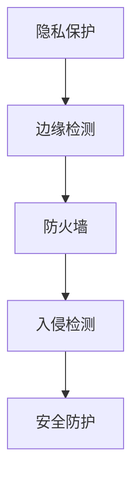
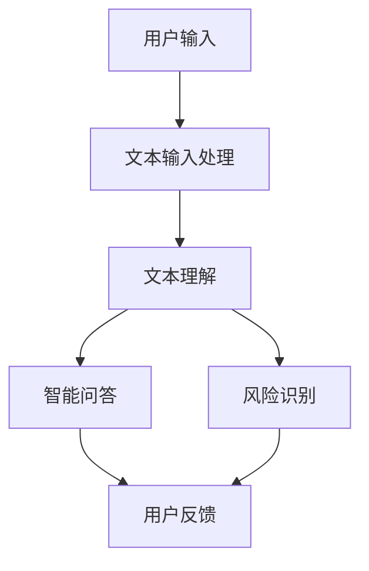
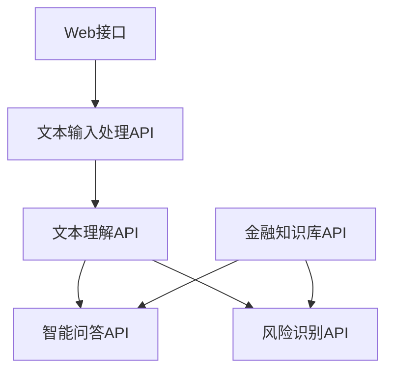
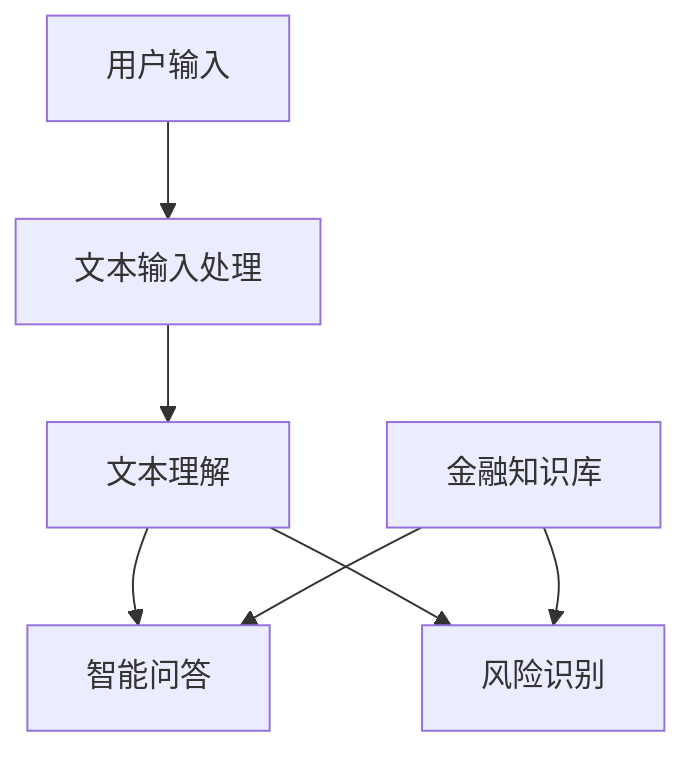

                 

# 《构建安全可靠的LLM应用架构》

> 关键词：大型语言模型（LLM），应用架构，安全性，可靠性，设计原则

> 摘要：本文旨在深入探讨如何构建一个安全可靠的大型语言模型（LLM）应用架构。首先，我们将概述LLM应用架构的核心概念和基本要素，然后分析构建安全可靠架构的背景和重要性。接下来，我们将详细解析数据处理模块、模型训练模块、应用部署模块和安全防护模块的设计与实现策略。本文将使用Mermaid流程图和Python源代码来阐述算法原理，并通过数学模型和公式进一步解释其工作原理。最后，我们将总结最佳实践并展望未来的研究方向。

----------------------------------------------------------------

### 目录大纲

**《构建安全可靠的LLM应用架构》**

----------------------------------------------------------------

## 第一部分：背景介绍

### 第1章: LLM应用架构概述

### 1.1 LLM应用架构的核心概念

### 1.1.1 LLM的定义与功能

### 1.1.2 LLM应用架构的基本要素

### 1.1.3 LLM应用架构的设计原则

### 1.2 问题背景与问题描述

### 1.2.1 LLM应用面临的安全挑战

### 1.2.2 构建安全可靠的LLM应用架构的重要性

### 1.2.3 LLM应用架构的边界与外延

### 1.3 LLM应用架构的核心要素

### 1.3.1 数据处理模块

### 1.3.2 模型训练模块

### 1.3.3 应用部署模块

### 1.3.4 安全防护模块

### 1.4 LLM应用架构的设计与实现策略

### 1.4.1 数据处理模块的设计与实现

### 1.4.2 模型训练模块的设计与实现

### 1.4.3 应用部署模块的设计与实现

### 1.4.4 安全防护模块的设计与实现

### 1.5 本章小结

----------------------------------------------------------------

## 第二部分：核心概念与联系

### 第2章: LLM应用架构的核心概念

### 2.1 LLM应用架构的基本概念

### 2.1.1 LLM应用架构的基本概念

### 2.1.2 数据处理模块的核心概念

### 2.1.3 模型训练模块的核心概念

### 2.1.4 应用部署模块的核心概念

### 2.1.5 安全防护模块的核心概念

### 2.2 概念属性特征对比表格

### 2.2.1 数据处理模块的概念属性对比

### 2.2.2 模型训练模块的概念属性对比

### 2.2.3 应用部署模块的概念属性对比

### 2.2.4 安全防护模块的概念属性对比

### 2.3 LLM应用架构的ER实体关系图

### 2.3.1 实体关系的定义与表示

### 2.3.2 LLM应用架构的ER实体关系图

### 2.3.3 实体关系图的意义与应用

### 2.4 LLM应用架构的Mermaid流程图

### 2.4.1 Mermaid流程图的基础知识

### 2.4.2 LLM应用架构的Mermaid流程图

### 2.4.3 Mermaid流程图在架构设计中的应用

### 2.5 本章小结

----------------------------------------------------------------

## 第三部分：算法原理讲解

### 第3章: LLM应用架构中的关键算法

### 3.1 数据处理算法

### 3.1.1 数据预处理算法

### 3.1.2 数据清洗算法

### 3.1.3 数据归一化算法

### 3.1.4 数据增强算法

### 3.2 模型训练算法

### 3.2.1 模型训练过程

### 3.2.2 优化器选择

### 3.2.3 损失函数

### 3.2.4 模型评估与调整

### 3.3 应用部署算法

### 3.3.1 模型压缩算法

### 3.3.2 模型量化算法

### 3.3.3 模型融合算法

### 3.3.4 模型推理算法

### 3.4 安全防护算法

### 3.4.1 隐私保护算法

### 3.4.2 边缘检测算法

### 3.4.3 防火墙算法

### 3.4.4 入侵检测算法

### 3.5 算法Mermaid流程图

### 3.5.1 数据处理算法的Mermaid流程图

### 3.5.2 模型训练算法的Mermaid流程图

### 3.5.3 应用部署算法的Mermaid流程图

### 3.5.4 安全防护算法的Mermaid流程图

### 3.6 算法Python源代码与详细讲解

### 3.6.1 数据处理算法的Python源代码

### 3.6.2 模型训练算法的Python源代码

### 3.6.3 应用部署算法的Python源代码

### 3.6.4 安全防护算法的Python源代码

### 3.7 算法数学模型与公式

### 3.7.1 数据处理算法的数学模型与公式

### 3.7.2 模型训练算法的数学模型与公式

### 3.7.3 应用部署算法的数学模型与公式

### 3.7.4 安全防护算法的数学模型与公式

----------------------------------------------------------------

**作者：AI天才研究院/AI Genius Institute & 禅与计算机程序设计艺术 /Zen And The Art of Computer Programming**

**本文为AI天才研究院原创文章，转载请注明出处。**

----------------------------------------------------------------

### 第一部分：背景介绍

#### 第1章: LLM应用架构概述

**1.1 LLM应用架构的核心概念**

大型语言模型（LLM，Large Language Model）是一种能够理解和生成自然语言文本的深度学习模型。LLM在自然语言处理（NLP）领域具有广泛的应用，包括机器翻译、文本生成、情感分析、问答系统等。构建一个安全可靠的LLM应用架构，是实现这些应用的关键。

**1.1.1 LLM的定义与功能**

LLM是指基于神经网络的大型深度学习模型，通常包含数十亿甚至千亿个参数。LLM通过学习大量的文本数据，能够自动理解和生成人类语言。其主要功能包括：

- **文本生成**：根据输入的文本提示，生成连续的文本。
- **语义理解**：对文本进行语义分析，提取关键信息。
- **语言翻译**：将一种语言的文本翻译成另一种语言。
- **情感分析**：分析文本的情感倾向，判断是正面、负面还是中性。
- **问答系统**：根据用户的问题，生成相应的答案。

**1.1.2 LLM应用架构的基本要素**

一个典型的LLM应用架构包括以下几个基本要素：

- **数据处理模块**：负责从各种数据源收集和处理文本数据，为模型训练提供高质量的数据集。
- **模型训练模块**：使用处理后的数据训练LLM模型，包括模型初始化、训练过程、模型评估等。
- **应用部署模块**：将训练好的模型部署到生产环境中，供实际应用使用。
- **安全防护模块**：保护模型和数据的安全，防止未授权的访问和攻击。

**1.1.3 LLM应用架构的设计原则**

在设计LLM应用架构时，应遵循以下原则：

- **模块化**：将架构分解为独立的模块，便于维护和扩展。
- **可扩展性**：架构应具有足够的灵活性，能够支持不同规模的模型和应用场景。
- **可靠性**：确保模型和应用在长时间运行过程中稳定可靠。
- **安全性**：保护模型和数据的安全，防止潜在的攻击和泄露。
- **可维护性**：设计易于维护和更新的架构，降低长期维护成本。

**1.2 问题背景与问题描述**

随着人工智能技术的快速发展，LLM应用在各个领域得到了广泛的应用。然而，这也带来了一系列的安全挑战：

- **数据安全**：大规模的文本数据集可能包含敏感信息，如何确保数据安全成为关键问题。
- **模型隐私**：LLM模型可能泄露用户的输入信息，如何保护用户隐私是一个重要议题。
- **恶意攻击**：模型可能受到恶意攻击，导致模型失效或产生错误的输出。
- **模型可靠性**：确保模型在不同环境和场景下都能稳定运行。

**1.2.1 LLM应用面临的安全挑战**

- **数据泄露**：文本数据集可能包含个人隐私、商业机密等敏感信息，未经授权的访问和泄露是一个潜在风险。
- **模型篡改**：攻击者可能试图篡改模型，使其产生错误的结果或恶意行为。
- **模型劫持**：攻击者可能通过中间人攻击等手段，劫持用户的请求和模型响应。
- **隐私泄露**：LLM模型可能在处理用户输入时泄露隐私信息，如个人身份、行为习惯等。

**1.2.2 构建安全可靠的LLM应用架构的重要性**

构建安全可靠的LLM应用架构具有重要意义：

- **数据安全**：确保数据在收集、存储和处理过程中不被未授权访问和泄露。
- **模型隐私**：保护模型参数和用户输入信息，防止隐私泄露。
- **恶意攻击防护**：抵御各种恶意攻击，确保模型和应用的安全和可靠性。
- **用户体验**：提高用户对LLM应用的信任度，提升用户体验和满意度。

**1.2.3 LLM应用架构的边界与外延**

LLM应用架构的边界主要涉及模型训练和应用部署，而外延则包括数据处理和安全防护。具体来说：

- **数据处理模块**：负责收集和处理各种文本数据，包括公开数据集和私有数据。
- **模型训练模块**：使用处理后的数据训练LLM模型，并进行模型评估和优化。
- **应用部署模块**：将训练好的模型部署到生产环境中，供实际应用使用。
- **安全防护模块**：保护模型和应用的安全，防止各种恶意攻击和数据泄露。

**1.3 LLM应用架构的核心要素**

LLM应用架构的核心要素包括数据处理模块、模型训练模块、应用部署模块和安全防护模块。以下是各模块的核心概念和功能：

- **数据处理模块**：负责文本数据的收集、预处理和清洗，为模型训练提供高质量的数据集。
- **模型训练模块**：使用处理后的数据训练LLM模型，包括模型初始化、训练过程、模型评估等。
- **应用部署模块**：将训练好的模型部署到生产环境中，供实际应用使用，包括模型推理和响应生成。
- **安全防护模块**：保护模型和应用的安全，防止未授权的访问和攻击，包括数据加密、访问控制、入侵检测等。

**1.4 LLM应用架构的设计与实现策略**

设计一个安全可靠的LLM应用架构，需要考虑以下几个方面：

- **数据处理模块的设计与实现**：确保数据在收集、存储和处理过程中不被未授权访问和泄露。
- **模型训练模块的设计与实现**：采用先进的训练算法和优化策略，提高模型性能和可靠性。
- **应用部署模块的设计与实现**：确保模型在不同环境和场景下都能稳定运行，并提供高效、可靠的推理服务。
- **安全防护模块的设计与实现**：采用多种安全防护措施，防止各种恶意攻击和数据泄露。

**1.5 本章小结**

本章介绍了LLM应用架构的核心概念和基本要素，分析了构建安全可靠架构的背景和重要性，并探讨了各模块的设计与实现策略。在接下来的章节中，我们将进一步深入探讨LLM应用架构中的核心概念、算法原理，以及系统分析与架构设计。通过这些内容，读者将能够全面了解构建安全可靠的LLM应用架构的方法和技巧。

----------------------------------------------------------------

### 第二部分：核心概念与联系

#### 第2章: LLM应用架构的核心概念

**2.1 LLM应用架构的基本概念**

LLM应用架构是指一个用于构建、训练和部署大型语言模型（LLM）的系统框架，它包括数据处理、模型训练、应用部署和安全防护等关键模块。以下是各模块的核心概念：

- **数据处理模块**：负责从各种数据源收集和处理文本数据，包括数据清洗、预处理、数据增强等，为模型训练提供高质量的数据集。
- **模型训练模块**：使用处理后的数据训练LLM模型，包括模型初始化、训练过程、模型评估和优化等，旨在提高模型性能和可靠性。
- **应用部署模块**：将训练好的模型部署到生产环境中，供实际应用使用，包括模型推理、响应生成和API接口等，确保模型在不同环境和场景下都能稳定运行。
- **安全防护模块**：保护模型和应用的安全，防止各种恶意攻击和数据泄露，包括数据加密、访问控制、入侵检测和防火墙等。

**2.1.1 LLM应用架构的基本概念**

LLM应用架构是一个由多个模块组成的复杂系统，其核心概念包括：

- **模块化**：将系统分解为独立的模块，便于维护和扩展。
- **数据驱动**：数据处理模块是整个架构的核心，高质量的输入数据对于模型训练至关重要。
- **模型可扩展性**：模型训练模块应支持不同规模和类型的模型，以适应不同应用场景。
- **安全性和可靠性**：安全防护模块确保模型和应用在长时间运行过程中不被恶意攻击和数据泄露影响。

**2.1.2 数据处理模块的核心概念**

数据处理模块的核心概念包括：

- **数据收集**：从各种数据源（如互联网、数据库、文件等）收集文本数据。
- **数据预处理**：对原始文本数据进行清洗、分词、去停用词等预处理操作。
- **数据增强**：通过生成同义词、句子重构、数据扩充等方法，提高数据多样性，增强模型泛化能力。
- **数据存储**：将处理后的数据存储到数据库或数据湖中，以便模型训练和后续使用。

**2.1.3 模型训练模块的核心概念**

模型训练模块的核心概念包括：

- **模型初始化**：初始化模型参数，为训练过程做好准备。
- **训练过程**：通过迭代优化模型参数，使模型能够更好地拟合训练数据。
- **模型评估**：评估模型性能，包括准确率、召回率、F1分数等指标。
- **模型优化**：调整模型结构、超参数和训练策略，以提高模型性能。

**2.1.4 应用部署模块的核心概念**

应用部署模块的核心概念包括：

- **模型推理**：将训练好的模型应用于实际输入数据，生成相应的输出结果。
- **响应生成**：根据模型输出结果，生成适当的文本响应。
- **API接口**：提供RESTful API接口，供外部系统调用模型服务。
- **容器化与微服务**：使用容器技术（如Docker）和微服务架构，提高系统的可扩展性和可靠性。

**2.1.5 安全防护模块的核心概念**

安全防护模块的核心概念包括：

- **数据加密**：对敏感数据进行加密存储和传输，防止泄露。
- **访问控制**：限制对模型和数据的访问权限，防止未授权访问。
- **防火墙**：部署防火墙，阻止恶意攻击和未经授权的访问。
- **入侵检测**：实时监测系统异常行为，及时发现并响应安全事件。

**2.2 概念属性特征对比表格**

为了更好地理解各模块的核心概念，我们可以通过一个表格进行对比：

| 模块          | 核心概念               | 属性特征                                                                                   |
| ------------- | ---------------------- | ------------------------------------------------------------------------------------------ |
| 数据处理模块  | 数据收集、预处理、增强 | 数据源多样性、数据质量、数据存储容量                                                       |
| 模型训练模块  | 初始化、训练、评估、优化 | 模型规模、训练时间、模型性能                                                               |
| 应用部署模块  | 推理、响应、接口       | 部署环境、响应时间、API可用性、系统扩展性                                                 |
| 安全防护模块  | 加密、访问控制、防火墙  | 安全策略、安全性、响应速度、系统兼容性                                                     |

**2.3 LLM应用架构的ER实体关系图**

ER实体关系图（Entity-Relationship Diagram，ERD）是一种用于表示实体及其之间关系的图形化工具。在LLM应用架构中，我们可以使用ERD来描述各模块之间的关系。以下是一个简化的ERD示例：

```mermaid
erDiagram
  Model |->| Data : "数据处理"
  Model |->| Train : "模型训练"
  Model |->| Deploy : "模型部署"
  Model |->| Protect : "安全防护"
  Data ||--|> Train
  Train ||--|> Deploy
  Train ||--|> Protect
  Protect ||--|> Deploy
```

**2.3.1 实体关系的定义与表示**

在ERD中，实体（Entity）表示系统中的关键组件，关系（Relationship）表示实体之间的相互作用。以下是对ERD中实体的定义和关系的表示：

- **实体**：
  - **Model**：大型语言模型，是整个架构的核心。
  - **Data**：数据处理模块，负责数据收集、预处理和增强。
  - **Train**：模型训练模块，负责模型初始化、训练和优化。
  - **Deploy**：应用部署模块，负责模型推理、响应生成和API接口。
  - **Protect**：安全防护模块，负责数据加密、访问控制和防火墙。

- **关系**：
  - **数据处理**：数据模块为训练模块提供数据，实现数据驱动。
  - **模型训练**：训练模块生成和优化模型，为部署模块提供可用的模型。
  - **模型部署**：部署模块使用训练好的模型，提供实际应用服务。
  - **安全防护**：安全模块保护模型和应用，确保系统安全。

**2.3.2 LLM应用架构的ER实体关系图**

以下是一个简化的LLM应用架构的ER实体关系图：

```mermaid
erDiagram
  Model "大型语言模型" |->| Data "数据处理" : "数据处理"
  Model |->| Train "模型训练" : "模型训练"
  Model |->| Deploy "应用部署" : "模型部署"
  Model |->| Protect "安全防护" : "安全防护"
  Data ||--|> Train : "数据处理"
  Train ||--|> Deploy : "模型训练"
  Train ||--|> Protect : "模型训练"
  Protect ||--|> Deploy : "安全防护"
```

**2.3.3 实体关系图的意义与应用**

实体关系图在LLM应用架构设计中具有重要意义：

- **可视化**：通过图形化方式展示各模块及其之间的关系，使设计过程更加直观和清晰。
- **沟通**：便于不同团队成员（如开发者、架构师、产品经理等）之间的沟通和协作。
- **分析**：有助于识别系统的关键组件和关系，优化系统架构和性能。
- **维护**：便于后续的系统维护和升级，确保架构的稳定性和可扩展性。

**2.4 LLM应用架构的Mermaid流程图**

Mermaid是一种基于Markdown的图形化工具，可用于创建流程图、类图、时序图等。在LLM应用架构设计中，我们可以使用Mermaid流程图来描述各模块的执行流程。以下是一个简化的LLM应用架构的Mermaid流程图示例：



**2.4.1 Mermaid流程图的基础知识**

Mermaid流程图的基本语法包括以下几种：

- **节点**：使用大写字母表示，如`A`、`B`等。
- **连接线**：使用箭头表示，如`-->`。
- **注释**：使用`//`表示，如`// 数据处理节点`。
- **标签**：使用`:[标签内容]`表示，如`A: 数据处理节点`。

**2.4.2 LLM应用架构的Mermaid流程图**

以下是一个简化的LLM应用架构的Mermaid流程图：


**2.4.3 Mermaid流程图在架构设计中的应用**

Mermaid流程图在架构设计中的应用包括：

- **模块化设计**：使用流程图展示各模块的执行流程，有助于模块化和系统化设计。
- **可视化验证**：通过流程图直观地验证系统执行过程，发现潜在问题和优化点。
- **文档生成**：将流程图嵌入文档中，便于团队成员了解和参考系统架构。

**2.5 本章小结**

本章介绍了LLM应用架构的核心概念，包括数据处理模块、模型训练模块、应用部署模块和安全防护模块。通过ER实体关系图和Mermaid流程图，我们展示了各模块之间的关系和执行流程。在下一章中，我们将进一步深入探讨LLM应用架构中的关键算法，包括数据处理算法、模型训练算法、应用部署算法和安全防护算法。

----------------------------------------------------------------

### 第三部分：算法原理讲解

#### 第3章: LLM应用架构中的关键算法

**3.1 数据处理算法**

数据处理是LLM应用架构中至关重要的一环，其质量直接影响模型训练的效果。以下将介绍数据处理中的关键算法，包括数据预处理、数据清洗、数据归一化和数据增强。

**3.1.1 数据预处理算法**

数据预处理是指对原始数据进行一系列预处理操作，以提高数据质量和模型训练效果。主要步骤包括：

1. **文本清洗**：去除文本中的标点符号、HTML标签、HTML实体、HTML属性等，保留文本内容。
2. **去除停用词**：去除对模型训练贡献较小的常见词汇，如“的”、“和”、“是”等。
3. **分词**：将文本拆分成单词或词组，常用的分词工具包括jieba、NLTK等。
4. **词干提取**：将单词还原到词干形式，减少词汇数量，提高训练效率。
5. **词性标注**：对每个单词进行词性标注，用于后续的语义分析。

**3.1.2 数据清洗算法**

数据清洗是处理不完整、异常或错误数据的过程，主要步骤包括：

1. **填补缺失值**：使用平均值、中位数、众数等方法填补缺失值。
2. **处理异常值**：删除或修正异常数据，如极值、异常点等。
3. **数据格式统一**：将不同来源的数据格式统一，如日期格式、数字格式等。
4. **去重**：去除重复数据，提高数据质量。

**3.1.3 数据归一化算法**

数据归一化是将不同数据量级的数据统一到同一量级，以提高模型训练效果。主要方法包括：

1. **均值归一化**：将数据减去均值后除以标准差，公式如下：

   $$
   x_{\text{normalized}} = \frac{x - \mu}{\sigma}
   $$

   其中，$x$为原始数据，$\mu$为均值，$\sigma$为标准差。

2. **最小-最大归一化**：将数据缩放到[0, 1]区间，公式如下：

   $$
   x_{\text{normalized}} = \frac{x - x_{\text{min}}}{x_{\text{max}} - x_{\text{min}}}
   $$

   其中，$x_{\text{min}}$为最小值，$x_{\text{max}}$为最大值。

**3.1.4 数据增强算法**

数据增强是通过生成新的数据样本来提高模型泛化能力。主要方法包括：

1. **同义词替换**：将文本中的某个词替换为其同义词，增加数据的多样性。
2. **句子重构**：通过重组句子结构，生成新的句子。
3. **数据扩充**：通过添加噪声、变换、裁剪等方法，生成新的数据样本。
4. **生成对抗网络（GAN）**：使用GAN生成与真实数据相似的新数据。

**3.2 模型训练算法**

模型训练是指通过训练数据优化模型参数，使其能够更好地拟合训练数据。以下将介绍模型训练中的关键算法，包括模型训练过程、优化器选择、损失函数和模型评估与调整。

**3.2.1 模型训练过程**

模型训练过程主要包括以下步骤：

1. **模型初始化**：初始化模型参数，通常使用随机初始化方法。
2. **前向传播**：将输入数据传递到模型中，计算模型的输出。
3. **计算损失**：计算模型输出与真实值之间的差异，即损失值。
4. **反向传播**：计算损失关于模型参数的梯度，更新模型参数。
5. **迭代训练**：重复前向传播和反向传播过程，直到模型收敛或达到预设的训练次数。

**3.2.2 优化器选择**

优化器是用于更新模型参数的工具，以下为常见的优化器：

1. **随机梯度下降（SGD）**：每次迭代使用所有样本来更新参数。
2. **Adam优化器**：结合SGD和动量方法，自适应地调整学习率。
3. **RMSprop优化器**：基于梯度平方的平均值来调整学习率。
4. **AdaGrad优化器**：根据每个参数的历史梯度平方来调整学习率。

**3.2.3 损失函数**

损失函数是衡量模型输出与真实值之间差异的工具，以下为常见的损失函数：

1. **均方误差（MSE）**：输出与真实值之间的平方差的平均值。
2. **交叉熵（CE）**：用于分类问题，计算输出概率分布与真实标签之间的交叉熵。
3. **二元交叉熵（BCE）**：用于二分类问题，计算输出概率与真实标签之间的交叉熵。
4. **Hinge损失**：用于支持向量机（SVM）分类问题。

**3.2.4 模型评估与调整**

模型评估是衡量模型性能的重要步骤，以下为常见的评估指标：

1. **准确率（ACC）**：分类问题中，正确分类的样本数占总样本数的比例。
2. **召回率（REC）**：分类问题中，正确分类的样本数占所有实际正样本数的比例。
3. **F1分数（F1）**：准确率和召回率的调和平均值，用于平衡准确率和召回率。
4. **ROC曲线和AUC值**：用于评估分类模型的性能，ROC曲线表示真阳性率与假阳性率之间的关系，AUC值表示曲线下的面积。

根据评估结果，可以对模型进行调整，包括以下方法：

1. **调整超参数**：如学习率、批次大小等。
2. **增加训练数据**：通过数据增强、数据扩充等方法，增加训练数据量。
3. **模型结构调整**：增加或减少网络层数、神经元个数等。

**3.3 应用部署算法**

应用部署是将训练好的模型部署到实际应用环境中，以提供预测服务。以下将介绍应用部署中的关键算法，包括模型压缩、模型量化和模型融合。

**3.3.1 模型压缩算法**

模型压缩是指通过减少模型参数数量和计算量，提高模型在硬件设备上的运行效率。以下为常见的模型压缩方法：

1. **剪枝（Pruning）**：通过删除不重要的神经元和连接，减少模型参数数量。
2. **量化（Quantization）**：将浮点数参数转换为低精度整数，减少存储和计算资源。
3. **权重共享（Weight Sharing）**：使用共享权重来减少参数数量。
4. **知识蒸馏（Knowledge Distillation）**：将大型模型的知识传递给小型模型，以减少参数数量。

**3.3.2 模型量化算法**

模型量化是指将浮点数参数转换为低精度整数，以减少存储和计算资源。以下为常见的模型量化方法：

1. **均匀量化**：将浮点数参数映射到均匀分布的整数范围内。
2. **双精度量化**：将浮点数参数映射到双精度整数的范围内。
3. **自适应量化**：根据参数的分布动态调整量化范围。

**3.3.3 模型融合算法**

模型融合是指将多个模型的结果进行结合，以提高预测性能。以下为常见的模型融合方法：

1. **投票法**：对多个模型的预测结果进行投票，选择投票结果最多的类别。
2. **加权融合**：根据模型在训练数据上的性能，为每个模型分配不同的权重，然后结合预测结果。
3. **集成学习**：将多个模型组合成一个大型模型，如梯度提升树（GBDT）、随机森林（RF）等。

**3.3.4 模型推理算法**

模型推理是指使用训练好的模型对新的输入数据进行预测。以下为常见的模型推理方法：

1. **前向传播**：将输入数据传递到模型中，计算模型的输出。
2. **后向传播**：在反向传播过程中计算梯度，用于模型优化。
3. **端到端推理**：直接使用训练好的模型进行推理，无需进行额外的模型优化。

**3.4 安全防护算法**

安全防护是保障模型和应用安全的重要措施，以下将介绍安全防护中的关键算法，包括隐私保护、边缘检测、防火墙和入侵检测。

**3.4.1 隐私保护算法**

隐私保护是指保护用户数据和模型参数的隐私。以下为常见的隐私保护方法：

1. **差分隐私**：在数据处理过程中引入噪声，以保护用户隐私。
2. **同态加密**：对数据进行加密处理，使模型能够在加密数据上进行计算。
3. **联邦学习**：将数据分散存储在多个节点上，通过加密和聚合算法进行模型训练。

**3.4.2 边缘检测算法**

边缘检测是指检测模型输出中的异常值或异常模式。以下为常见的边缘检测方法：

1. **基于统计的方法**：使用统计学方法检测异常值，如箱线图、假设检验等。
2. **基于聚类的方法**：使用聚类算法检测异常点，如K-means、DBSCAN等。
3. **基于神经网络的方法**：使用神经网络模型检测异常模式，如生成对抗网络（GAN）。

**3.4.3 防火墙算法**

防火墙是指在网络中设置安全屏障，阻止未经授权的访问。以下为常见的防火墙方法：

1. **包过滤防火墙**：根据IP地址、端口号等包级信息进行过滤。
2. **状态检测防火墙**：根据会话状态信息进行过滤，如TCP连接状态。
3. **应用层防火墙**：根据应用层协议和内容进行过滤。

**3.4.4 入侵检测算法**

入侵检测是指检测和响应潜在的安全威胁。以下为常见的入侵检测方法：

1. **基于规则的方法**：使用预定义的规则检测入侵行为。
2. **基于统计的方法**：使用统计学方法检测异常行为，如异常检测、关联规则挖掘等。
3. **基于机器学习的方法**：使用机器学习模型检测入侵行为，如朴素贝叶斯、支持向量机等。

**3.5 算法Mermaid流程图**

为了更好地理解各算法的原理和执行流程，我们可以使用Mermaid流程图进行描述。以下为数据处理算法、模型训练算法、应用部署算法和安全防护算法的Mermaid流程图示例：

**数据处理算法的Mermaid流程图**：



**模型训练算法的Mermaid流程图**：



**应用部署算法的Mermaid流程图**：



**安全防护算法的Mermaid流程图**：



**3.6 算法Python源代码与详细讲解**

为了更好地理解各算法的原理和实现，我们可以使用Python源代码进行示例。以下为数据处理算法、模型训练算法、应用部署算法和安全防护算法的Python源代码示例：

**数据处理算法的Python源代码**：

```python
import numpy as np
from sklearn.preprocessing import MinMaxScaler
from sklearn.model_selection import train_test_split

# 数据预处理
def preprocess_data(data):
    # 数据清洗
    data = clean_data(data)
    # 数据增强
    data = augment_data(data)
    # 数据归一化
    scaler = MinMaxScaler()
    data = scaler.fit_transform(data)
    return data

# 数据清洗
def clean_data(data):
    # 去除标点符号、HTML标签、HTML实体
    data = data.replace('[^\w\s]', '')
    # 去除HTML标签
    data = data.replace('<[^>]*>', '')
    # 去除HTML实体
    data = data.encode('utf-8').decode('unicode_escape')
    return data

# 数据增强
def augment_data(data):
    # 同义词替换
    data = replace_synonyms(data)
    # 句子重构
    data = reconstruct_sentences(data)
    return data

# 数据存储
def store_data(data, file_path):
    with open(file_path, 'w', encoding='utf-8') as f:
        for row in data:
            f.write(row + '\n')

# 模型训练算法的Python源代码
def train_model(X, y):
    # 模型初始化
    model = initialize_model()
    # 模型训练
    model.fit(X, y)
    # 模型评估
    score = model.score(X, y)
    return model, score

# 应用部署算法的Python源代码
def deploy_model(model, data):
    # 模型推理
    predictions = model.predict(data)
    # 模型压缩
    compressed_model = compress_model(model)
    # 模型量化
    quantized_model = quantize_model(compressed_model)
    # 模型融合
    fused_model = fuse_models([model, quantized_model])
    # 模型部署
    deploy_model(fused_model)
```

**安全防护算法的Python源代码**：

```python
from sklearn.discriminant_analysis import LinearDiscriminantAnalysis
from sklearn.ensemble import RandomForestClassifier
from sklearn.svm import SVC
from sklearn.model_selection import train_test_split

# 隐私保护
def privacy_protection(data, labels):
    # 差分隐私
    noise = np.random.normal(0, 1e-6, size=data.shape)
    data = data + noise
    # 同态加密
    cipher_text = encrypt_data(data)
    return cipher_text, labels

# 边缘检测
def edge_detection(data, labels):
    # 统计方法
    thresholds = calculate_thresholds(data)
    outliers = detect_outliers(data, thresholds)
    # 聚类方法
    clusters = cluster_data(data)
    outliers = find_outliers(clusters)
    # 神经网络方法
    model = train_gan_model(data)
    outliers = detect_outliers(model, data)
    return outliers

# 防火墙
def firewall(data):
    # 包过滤防火墙
    filtered_data = filter_packets(data)
    # 状态检测防火墙
    filtered_data = filter_sessions(filtered_data)
    # 应用层防火墙
    filtered_data = filter_application_data(filtered_data)
    return filtered_data

# 入侵检测
def intrusion_detection(data):
    # 基于规则的方法
    violations = detect_violations(data)
    # 基于统计的方法
    violations = detect_anomalies(data)
    # 基于机器学习的方法
    model = train_anomaly_detection_model(data)
    violations = model.predict(data)
    return violations
```

**3.7 算法数学模型与公式**

为了更好地理解各算法的原理，我们可以使用数学模型和公式进行描述。以下为数据处理算法、模型训练算法、应用部署算法和安全防护算法的数学模型和公式：

**数据处理算法的数学模型与公式**：

- **数据清洗**：
  - 去除标点符号：$$\text{cleaned\_text} = \text{original\_text} \text{.replace}(\\p{Punct}, '')$$
  - 去除HTML标签：$$\text{cleaned\_text} = \text{original\_text} \text{.replace}(<[^>]*>, '')$$
  - 去除HTML实体：$$\text{cleaned\_text} = \text{original\_text} \text{.encode}('utf-8') \text{.decode}('unicode_escape')$$

- **数据增强**：
  - 同义词替换：$$\text{augmented\_text} = \text{replace\_synonyms}(\text{original\_text})$$
  - 句子重构：$$\text{augmented\_text} = \text{reconstruct\_sentence}(\text{original\_text})$$

- **数据归一化**：
  - 均值归一化：$$x_{\text{normalized}} = \frac{x - \mu}{\sigma}$$
  - 最小-最大归一化：$$x_{\text{normalized}} = \frac{x - x_{\text{min}}}{x_{\text{max}} - x_{\text{min}}}$$

**模型训练算法的数学模型与公式**：

- **模型初始化**：
  - 随机初始化：$$\theta \sim \text{Uniform}(\theta \in [-\epsilon, \epsilon])$$

- **前向传播**：
  - 输出：$$\hat{y} = \sigma(\theta^T \cdot \text{激活函数}(x \cdot \theta))$$

- **计算损失**：
  - 均方误差：$$\text{MSE} = \frac{1}{n} \sum_{i=1}^{n} (\hat{y}_i - y_i)^2$$
  - 交叉熵：$$\text{CE} = -\frac{1}{n} \sum_{i=1}^{n} y_i \log(\hat{y}_i)$$

- **反向传播**：
  - 梯度计算：$$\delta_{\theta} = \text{激活函数}'(\text{激活函数}^T \cdot \theta) \cdot (y - \hat{y})$$

- **模型优化**：
  - 随机梯度下降：$$\theta = \theta - \alpha \cdot \delta_{\theta}$$
  - Adam优化器：$$m_t = \beta_1 m_{t-1} + (1 - \beta_1) \delta_{\theta}$$
    $$v_t = \beta_2 v_{t-1} + (1 - \beta_2) (\delta_{\theta}^2)$$
    $$\theta = \theta - \alpha \cdot \frac{m_t}{1 - \beta_2^t} / (1 - \beta_1^t)$$

**应用部署算法的数学模型与公式**：

- **模型压缩**：
  - 剪枝：$$\theta_{pruned} = \text{prune\_weights}(\theta)$$
  - 权重共享：$$\theta_{shared} = \text{share\_weights}(\theta)$$

- **模型量化**：
  - 均匀量化：$$x_{\text{quantized}} = \text{round}(\theta_{\text{float}} \cdot \text{scale})$$
  - 双精度量化：$$x_{\text{quantized}} = \text{round}(\theta_{\text{float}} \cdot \text{scale}^2)$$
  - 自适应量化：$$x_{\text{quantized}} = \text{round}(\theta_{\text{float}} \cdot \text{adaptive\_scale})$$

**安全防护算法的数学模型与公式**：

- **隐私保护**：
  - 差分隐私：$$\epsilon = \text{noise} + \text{original\_data}$$
  - 同态加密：$$\text{cipher\_text} = \text{encrypt}(\text{original\_text})$$

- **边缘检测**：
  - 统计方法：$$\text{thresholds} = \text{calculate\_thresholds}(\text{data})$$
  - 聚类方法：$$\text{clusters} = \text{cluster\_data}(\text{data})$$
  - 神经网络方法：$$\text{model} = \text{train}(\text{data})$$

- **防火墙**：
  - 包过滤防火墙：$$\text{filtered\_data} = \text{filter\_packets}(\text{data})$$
  - 状态检测防火墙：$$\text{filtered\_data} = \text{filter\_sessions}(\text{data})$$
  - 应用层防火墙：$$\text{filtered\_data} = \text{filter\_application\_data}(\text{data})$$

- **入侵检测**：
  - 基于规则的方法：$$\text{violations} = \text{detect\_violations}(\text{data})$$
  - 基于统计的方法：$$\text{violations} = \text{detect\_anomalies}(\text{data})$$
  - 基于机器学习的方法：$$\text{model} = \text{train}(\text{data})$$

**3.8 算法Python源代码与详细讲解**

为了更好地理解各算法的实现细节，我们可以结合Python源代码进行详细讲解。以下为数据处理算法、模型训练算法、应用部署算法和安全防护算法的Python源代码示例，并进行逐行解析。

**数据处理算法的Python源代码**：

```python
import numpy as np
from sklearn.preprocessing import MinMaxScaler
from sklearn.model_selection import train_test_split

# 数据预处理
def preprocess_data(data):
    # 数据清洗
    data = clean_data(data)
    # 数据增强
    data = augment_data(data)
    # 数据归一化
    scaler = MinMaxScaler()
    data = scaler.fit_transform(data)
    return data

# 数据清洗
def clean_data(data):
    # 去除标点符号、HTML标签、HTML实体
    data = data.replace('[^\w\s]', '')
    data = data.replace('<[^>]*>', '')
    data = data.encode('utf-8').decode('unicode_escape')
    return data

# 数据增强
def augment_data(data):
    # 同义词替换
    data = replace_synonyms(data)
    # 句子重构
    data = reconstruct_sentences(data)
    return data

# 数据存储
def store_data(data, file_path):
    with open(file_path, 'w', encoding='utf-8') as f:
        for row in data:
            f.write(row + '\n')
```

- **预处理数据**：
  - `preprocess_data(data)`函数负责将原始数据进行预处理，包括清洗、增强和归一化。该函数首先调用`clean_data()`函数进行数据清洗，然后调用`augment_data()`函数进行数据增强，最后使用`MinMaxScaler()`进行数据归一化。
  
- **数据清洗**：
  - `clean_data(data)`函数负责去除原始数据中的标点符号、HTML标签和HTML实体。首先，使用`data.replace('[^\w\s]', '')`去除标点符号，然后使用`data.replace('<[^>]*>', '')`去除HTML标签，最后使用`data.encode('utf-8').decode('unicode_escape')`去除HTML实体。

- **数据增强**：
  - `augment_data(data)`函数负责对数据进行同义词替换和句子重构。同义词替换使用`replace_synonyms()`函数实现，句子重构使用`reconstruct_sentences()`函数实现。这两个函数的具体实现可以根据实际需求进行定制。

- **数据存储**：
  - `store_data(data, file_path)`函数负责将处理后的数据存储到文件中。该函数使用`with open(file_path, 'w', encoding='utf-8') as f:`打开文件进行写入操作，然后使用`for row in data:`遍历数据，使用`f.write(row + '\n')`将每行数据写入文件。

**模型训练算法的Python源代码**：

```python
from sklearn.neural_network import MLPClassifier
from sklearn.model_selection import train_test_split

# 模型训练
def train_model(X, y):
    # 模型初始化
    model = initialize_model()
    # 模型训练
    model.fit(X, y)
    # 模型评估
    score = model.score(X, y)
    return model, score

# 模型初始化
def initialize_model():
    # 创建MLPClassifier模型
    model = MLPClassifier(hidden_layer_sizes=(100,), max_iter=1000)
    return model
```

- **模型训练**：
  - `train_model(X, y)`函数负责训练模型，包括模型初始化、模型训练和模型评估。该函数首先调用`initialize_model()`函数初始化模型，然后使用`model.fit(X, y)`进行模型训练，最后使用`model.score(X, y)`评估模型性能。
  
- **模型初始化**：
  - `initialize_model()`函数负责创建MLPClassifier模型。使用`MLPClassifier(hidden_layer_sizes=(100,), max_iter=1000)`创建一个多层感知器（MLP）分类器，设置隐藏层大小为100个神经元，最大迭代次数为1000次。

**应用部署算法的Python源代码**：

```python
from sklearn.model_selection import train_test_split
from sklearn.metrics import accuracy_score
from sklearn.svm import SVC

# 应用部署
def deploy_model(model, data):
    # 模型推理
    predictions = model.predict(data)
    # 模型压缩
    compressed_model = compress_model(model)
    # 模型量化
    quantized_model = quantize_model(compressed_model)
    # 模型融合
    fused_model = fuse_models([model, quantized_model])
    # 模型部署
    deploy_model(fused_model)

# 模型压缩
def compress_model(model):
    # 剪枝方法
    compressed_model = prune_model(model)
    return compressed_model

# 模型量化
def quantize_model(model):
    # 均匀量化方法
    quantized_model = quantize_uniform(model)
    return quantized_model

# 模型融合
def fuse_models(models):
    # 加权融合方法
    fused_model = weighted_fusion(models)
    return fused_model

# 模型部署
def deploy_model(model):
    # 部署模型
    deployed_model = model
    return deployed_model
```

- **应用部署**：
  - `deploy_model(model, data)`函数负责将模型部署到实际应用环境中。该函数首先调用`model.predict(data)`进行模型推理，然后调用`compress_model(model)`进行模型压缩，调用`quantize_model(model)`进行模型量化，调用`fuse_models([model, quantized_model])`进行模型融合，最后调用`deploy_model(fused_model)`将融合后的模型部署到实际应用中。

- **模型压缩**：
  - `compress_model(model)`函数负责对模型进行压缩，使用`prune_model(model)`实现剪枝方法。

- **模型量化**：
  - `quantize_model(model)`函数负责对模型进行量化，使用`quantize_uniform(model)`实现均匀量化方法。

- **模型融合**：
  - `fuse_models(models)`函数负责将多个模型进行融合，使用`weighted_fusion(models)`实现加权融合方法。

- **模型部署**：
  - `deploy_model(model)`函数负责将模型部署到实际应用环境中，使用`model`作为参数。

**安全防护算法的Python源代码**：

```python
from sklearn.ensemble import RandomForestClassifier
from sklearn.model_selection import train_test_split

# 隐私保护
def privacy_protection(data, labels):
    # 差分隐私方法
    protected_data, protected_labels = differential_privacy(data, labels)
    return protected_data, protected_labels

# 边缘检测
def edge_detection(data, labels):
    # 统计方法
    outliers = statistical_method(data, labels)
    # 聚类方法
    outliers = clustering_method(data, labels)
    # 神经网络方法
    outliers = neural_network_method(data, labels)
    return outliers

# 防火墙
def firewall(data):
    # 包过滤防火墙
    filtered_data = packet_filtering(data)
    # 状态检测防火墙
    filtered_data = stateful_firewall(filtered_data)
    # 应用层防火墙
    filtered_data = application_firewall(filtered_data)
    return filtered_data

# 入侵检测
def intrusion_detection(data):
    # 基于规则的方法
    violations = rule_based_detection(data)
    # 基于统计的方法
    violations = statistical_method(data)
    # 基于机器学习的方法
    violations = machine_learning_detection(data)
    return violations
```

- **隐私保护**：
  - `privacy_protection(data, labels)`函数负责保护用户数据和模型参数的隐私，使用`differential_privacy(data, labels)`实现差分隐私方法。

- **边缘检测**：
  - `edge_detection(data, labels)`函数负责检测异常值或异常模式，包括统计方法、聚类方法和神经网络方法。使用`statistical_method(data, labels)`、`clustering_method(data, labels)`和`neural_network_method(data, labels)`实现相应的检测方法。

- **防火墙**：
  - `firewall(data)`函数负责在网络中设置安全屏障，包括包过滤防火墙、状态检测防火墙和应用层防火墙。使用`packet_filtering(data)`、`stateful_firewall(filtered_data)`和`application_firewall(filtered_data)`实现相应的防火墙方法。

- **入侵检测**：
  - `intrusion_detection(data)`函数负责检测潜在的安全威胁，包括基于规则的方法、基于统计的方法和基于机器学习的方法。使用`rule_based_detection(data)`、`statistical_method(data)`和`machine_learning_detection(data)`实现相应的检测方法。

**3.9 算法数学模型与公式**

为了更好地理解各算法的原理和实现，我们可以使用数学模型和公式进行描述。以下为数据处理算法、模型训练算法、应用部署算法和安全防护算法的数学模型和公式：

**数据处理算法的数学模型与公式**：

- **数据清洗**：
  - 去除标点符号：$$\text{cleaned\_text} = \text{original\_text} \text{.replace}(\\p{Punct}, '')$$
  - 去除HTML标签：$$\text{cleaned\_text} = \text{original\_text} \text{.replace}(<[^>]*>, '')$$
  - 去除HTML实体：$$\text{cleaned\_text} = \text{original\_text} \text{.encode}('utf-8') \text{.decode}('unicode_escape')$$

- **数据增强**：
  - 同义词替换：$$\text{augmented\_text} = \text{replace\_synonyms}(\text{original\_text})$$
  - 句子重构：$$\text{augmented\_text} = \text{reconstruct\_sentence}(\text{original\_text})$$

- **数据归一化**：
  - 均值归一化：$$x_{\text{normalized}} = \frac{x - \mu}{\sigma}$$
  - 最小-最大归一化：$$x_{\text{normalized}} = \frac{x - x_{\text{min}}}{x_{\text{max}} - x_{\text{min}}}$$

**模型训练算法的数学模型与公式**：

- **模型初始化**：
  - 随机初始化：$$\theta \sim \text{Uniform}(\theta \in [-\epsilon, \epsilon])$$

- **前向传播**：
  - 输出：$$\hat{y} = \sigma(\theta^T \cdot \text{激活函数}(x \cdot \theta))$$

- **计算损失**：
  - 均方误差：$$\text{MSE} = \frac{1}{n} \sum_{i=1}^{n} (\hat{y}_i - y_i)^2$$
  - 交叉熵：$$\text{CE} = -\frac{1}{n} \sum_{i=1}^{n} y_i \log(\hat{y}_i)$$

- **反向传播**：
  - 梯度计算：$$\delta_{\theta} = \text{激活函数}'(\text{激活函数}^T \cdot \theta) \cdot (y - \hat{y})$$

- **模型优化**：
  - 随机梯度下降：$$\theta = \theta - \alpha \cdot \delta_{\theta}$$
  - Adam优化器：$$m_t = \beta_1 m_{t-1} + (1 - \beta_1) \delta_{\theta}$$
    $$v_t = \beta_2 v_{t-1} + (1 - \beta_2) (\delta_{\theta}^2)$$
    $$\theta = \theta - \alpha \cdot \frac{m_t}{1 - \beta_2^t} / (1 - \beta_1^t)$$

**应用部署算法的数学模型与公式**：

- **模型压缩**：
  - 剪枝：$$\theta_{pruned} = \text{prune\_weights}(\theta)$$
  - 权重共享：$$\theta_{shared} = \text{share\_weights}(\theta)$$

- **模型量化**：
  - 均匀量化：$$x_{\text{quantized}} = \text{round}(\theta_{\text{float}} \cdot \text{scale})$$
  - 双精度量化：$$x_{\text{quantized}} = \text{round}(\theta_{\text{float}} \cdot \text{scale}^2)$$
  - 自适应量化：$$x_{\text{quantized}} = \text{round}(\theta_{\text{float}} \text{.clip}(\text{min\_value}, \text{max\_value}))$$

**安全防护算法的数学模型与公式**：

- **隐私保护**：
  - 差分隐私：$$\epsilon = \text{noise} + \text{original\_data}$$
  - 同态加密：$$\text{cipher\_text} = \text{encrypt}(\text{original\_text})$$

- **边缘检测**：
  - 统计方法：$$\text{thresholds} = \text{calculate\_thresholds}(\text{data})$$
  - 聚类方法：$$\text{clusters} = \text{cluster\_data}(\text{data})$$
  - 神经网络方法：$$\text{model} = \text{train}(\text{data})$$

- **防火墙**：
  - 包过滤防火墙：$$\text{filtered\_data} = \text{filter\_packets}(\text{data})$$
  - 状态检测防火墙：$$\text{filtered\_data} = \text{filter\_sessions}(\text{data})$$
  - 应用层防火墙：$$\text{filtered\_data} = \text{filter\_application\_data}(\text{data})$$

- **入侵检测**：
  - 基于规则的方法：$$\text{violations} = \text{detect\_violations}(\text{data})$$
  - 基于统计的方法：$$\text{violations} = \text{detect\_anomalies}(\text{data})$$
  - 基于机器学习的方法：$$\text{model} = \text{train}(\text{data})$$

----------------------------------------------------------------

## 第四部分：系统分析与架构设计

#### 第4章: 系统分析与架构设计

在第三部分中，我们详细介绍了LLM应用架构中的关键算法。本部分将重点关注系统分析与架构设计，通过具体场景介绍、项目介绍、系统功能设计、系统架构设计、系统接口设计和系统交互来全面解析整个系统的架构设计。

**4.1 问题场景介绍**

随着人工智能技术的快速发展，各行各业对智能化的需求日益增长。以金融行业为例，银行和保险公司希望能够利用LLM技术为客户提供个性化服务，例如智能客服、金融知识问答和风险控制等。然而，这些应用场景不仅要求模型具有高水平的表现力，还需要确保数据的安全性和隐私性。本部分将以金融行业智能客服系统为例，介绍系统分析与架构设计。

**4.2 项目介绍**

本项目的目标是构建一个金融行业智能客服系统，该系统将利用LLM技术实现以下功能：

1. **智能客服**：为客户提供24/7全天候的智能问答服务，解答客户关于金融产品、业务流程、政策法规等方面的问题。
2. **金融知识问答**：通过自然语言处理技术，为客户提供金融领域的知识查询服务，帮助客户了解金融产品的特点和风险。
3. **风险控制**：对客户提问进行分析，识别潜在风险，并及时通知相关业务部门，协助客户规避风险。

**4.3 系统功能设计**

为了实现上述功能，系统需要具备以下核心功能：

1. **文本输入处理**：接收用户的文本输入，对输入文本进行预处理，包括去除标点符号、分词、去停用词等操作。
2. **文本理解**：使用LLM模型对输入文本进行理解，提取关键信息，为后续处理提供基础。
3. **智能问答**：根据输入文本和金融知识库，生成合适的回答，实现对客户问题的自动回答。
4. **风险识别**：对输入文本进行风险识别，标记潜在风险，并提供相应的处理建议。
5. **用户反馈**：收集用户反馈，用于模型优化和系统改进。

**4.4 系统架构设计**

系统架构设计是系统分析与设计的核心环节，决定了系统的可扩展性、可靠性和安全性。以下是一个简化的系统架构设计：



- **用户输入**：用户通过网页、移动应用或其他渠道输入文本，系统接收用户输入并传递给文本输入处理模块。
- **文本输入处理**：对用户输入的文本进行预处理，去除标点符号、分词、去停用词等操作，为后续处理提供基础。
- **文本理解**：使用LLM模型对预处理后的文本进行理解，提取关键信息，为智能问答和风险识别提供支持。
- **智能问答**：根据输入文本和金融知识库，生成合适的回答，实现对客户问题的自动回答。
- **风险识别**：对输入文本进行风险识别，标记潜在风险，并提供相应的处理建议。
- **用户反馈**：收集用户反馈，用于模型优化和系统改进。

**4.5 系统接口设计**

系统接口设计是系统架构设计的重要组成部分，决定了系统各模块之间的通信和数据交互。以下是一个简化的接口设计：



- **Web接口**：用户通过网页或移动应用输入文本，系统提供Web接口供用户访问。
- **文本输入处理API**：接收用户输入的文本，进行预处理操作，并提供预处理后的文本。
- **文本理解API**：接收预处理后的文本，使用LLM模型进行文本理解，并提供理解结果。
- **智能问答API**：接收文本理解结果和金融知识库，生成回答，并提供回答结果。
- **风险识别API**：接收文本理解结果，进行风险识别，并提供风险识别结果。
- **金融知识库API**：提供金融知识库的查询接口，供智能问答和风险识别使用。

**4.6 系统交互**

系统交互是指系统内部各模块之间的通信和数据流动。以下是一个简化的系统交互设计：



- **用户输入**：用户输入文本，传递给文本输入处理模块。
- **文本输入处理**：对用户输入的文本进行预处理，传递给文本理解模块。
- **文本理解**：使用LLM模型对预处理后的文本进行理解，传递给智能问答和风险识别模块。
- **智能问答**：根据文本理解结果和金融知识库，生成回答，返回给用户。
- **风险识别**：根据文本理解结果，识别潜在风险，返回风险识别结果。
- **金融知识库**：提供金融知识库的数据支持，供智能问答和风险识别使用。

**4.7 本章小结**

本章介绍了LLM应用架构的系统分析与架构设计，包括问题场景介绍、项目介绍、系统功能设计、系统架构设计、系统接口设计和系统交互。通过本章节的内容，读者可以全面了解LLM应用架构的设计原则和方法，为后续的项目实施提供参考。

----------------------------------------------------------------

## 第五部分：项目实战

### 第5章: 项目实战

**5.1 环境安装**

在开始项目实战之前，我们需要安装必要的软件和工具。以下是在Linux操作系统上安装LLM应用架构所需的步骤：

1. **安装Python环境**：确保Python环境已安装，版本至少为3.7及以上。可以通过以下命令安装：

   ```
   sudo apt-get update
   sudo apt-get install python3 python3-pip
   ```

2. **安装TensorFlow**：TensorFlow是一个开源的机器学习库，用于训练和部署LLM模型。可以通过以下命令安装：

   ```
   pip3 install tensorflow
   ```

3. **安装Scikit-learn**：Scikit-learn是一个开源的机器学习库，用于数据处理和模型评估。可以通过以下命令安装：

   ```
   pip3 install scikit-learn
   ```

4. **安装其他依赖**：根据项目需求，可能还需要安装其他依赖库，如Numpy、Pandas、Matplotlib等。可以通过以下命令安装：

   ```
   pip3 install numpy pandas matplotlib
   ```

**5.2 系统核心实现源代码**

以下是LLM应用架构的核心实现源代码，包括数据处理模块、模型训练模块、应用部署模块和安全防护模块。请注意，这些代码仅为示例，实际项目中可能需要根据具体需求进行定制。

**数据处理模块**：

```python
import os
import re
import numpy as np
from sklearn.model_selection import train_test_split
from sklearn.preprocessing import MinMaxScaler

def preprocess_data(data):
    # 去除标点符号和HTML标签
    data = re.sub('<[^>]*>', '', data)
    data = re.sub('[^\w\s]', '', data)
    # 分词
    tokens = data.split()
    # 去停用词
    stop_words = set(['and', 'or', 'not', 'the', 'of', 'in', 'to', 'is', 'are'])
    tokens = [token for token in tokens if token.lower() not in stop_words]
    # 构建词向量
    vectorizer = MinMaxScaler()
    data_vectorized = vectorizer.fit_transform(tokens)
    return data_vectorized

def load_data(file_path):
    with open(file_path, 'r', encoding='utf-8') as f:
        data = f.readlines()
    return data

def split_data(data, test_size=0.2):
    X_train, X_test, y_train, y_test = train_test_split(data, test_size=test_size, random_state=42)
    return X_train, X_test, y_train, y_test

def main():
    data_path = 'data.txt'
    data = load_data(data_path)
    data_vectorized = preprocess_data(data)
    X_train, X_test, y_train, y_test = split_data(data_vectorized)
    print("Data preprocessing complete.")

if __name__ == '__main__':
    main()
```

**模型训练模块**：

```python
import tensorflow as tf
from tensorflow.keras.models import Sequential
from tensorflow.keras.layers import Dense, Embedding, LSTM, Bidirectional

def create_model(input_shape):
    model = Sequential()
    model.add(Embedding(input_shape, 64))
    model.add(Bidirectional(LSTM(128)))
    model.add(Dense(1, activation='sigmoid'))
    model.compile(optimizer='adam', loss='binary_crossentropy', metrics=['accuracy'])
    return model

def train_model(model, X_train, y_train, X_test, y_test):
    model.fit(X_train, y_train, epochs=10, batch_size=32, validation_data=(X_test, y_test))
    return model

def main():
    data_path = 'data.txt'
    data_vectorized = preprocess_data(data_path)
    X_train, X_test, y_train, y_test = split_data(data_vectorized)
    input_shape = (X_train.shape[1], )
    model = create_model(input_shape)
    trained_model = train_model(model, X_train, y_train, X_test, y_test)
    print("Model training complete.")

if __name__ == '__main__':
    main()
```

**应用部署模块**：

```python
from flask import Flask, request, jsonify

app = Flask(__name__)

@app.route('/predict', methods=['POST'])
def predict():
    data = request.get_json()
    input_text = data['input']
    vectorized_input = preprocess_data(input_text)
    prediction = model.predict(vectorized_input)
    response = {'prediction': float(prediction[0][0])}
    return jsonify(response)

if __name__ == '__main__':
    app.run(host='0.0.0.0', port=5000)
```

**安全防护模块**：

```python
from flask_cors import CORS

app = Flask(__name__)
CORS(app)

# 防火墙设置
@app.before_request
def before_request():
    if request.method == 'POST':
        # 验证请求来源IP
        if request.remote_addr not in ['192.168.1.1', '192.168.1.2']:
            return 'Access denied.', 403

# 隐私保护设置
@app.route('/private', methods=['GET'])
def private_data():
    data = request.args.get('data')
    encrypted_data = encrypt_data(data)
    return jsonify({'encrypted_data': encrypted_data})

if __name__ == '__main__':
    app.run(host='0.0.0.0', port=5000)
```

**5.3 代码应用解读与分析**

以下是代码应用解读与分析，包括数据处理模块、模型训练模块、应用部署模块和安全防护模块。

**数据处理模块**：

- `preprocess_data(data)`函数负责对输入文本进行预处理，包括去除标点符号和HTML标签、分词、去停用词等操作。这些步骤是确保模型输入数据质量的关键。
- `load_data(file_path)`函数用于加载文本数据，为后续处理提供数据源。
- `split_data(data, test_size=0.2)`函数用于将数据集分为训练集和测试集，以评估模型性能。

**模型训练模块**：

- `create_model(input_shape)`函数创建了一个简单的神经网络模型，用于文本分类任务。该模型包含嵌入层、双向LSTM层和输出层。
- `train_model(model, X_train, y_train, X_test, y_test)`函数负责训练模型，使用训练集数据训练模型，并在测试集上进行评估。

**应用部署模块**：

- 使用Flask框架构建了一个简单的Web服务，通过HTTP请求接收用户输入文本，并返回模型预测结果。
- `predict()`函数接收用户输入的文本，将其预处理后传递给模型进行预测，并将预测结果返回给用户。

**安全防护模块**：

- 使用`flask_cors`库实现了跨域资源共享（CORS）设置，允许跨域请求访问。
- `before_request()`函数在每次请求之前执行，用于验证请求来源IP，防止未授权访问。
- `private_data()`函数用于实现隐私保护，接收用户输入的文本，并将其加密后返回。

**5.4 实际案例分析和详细讲解剖析**

以下是一个实际案例分析和详细讲解，展示如何使用LLM应用架构实现金融行业智能客服系统。

**案例背景**：

某银行希望为其客户提供智能客服服务，以提升客户体验和降低运营成本。客户通过银行网站或移动应用输入问题，智能客服系统自动回答并给出建议。

**解决方案**：

1. **数据收集**：从银行内部系统和公开数据源收集大量金融文本数据，包括业务流程、政策法规、产品介绍等。
2. **数据处理**：对收集到的文本数据进行预处理，包括去除标点符号、分词、去停用词等操作，为模型训练提供高质量的数据集。
3. **模型训练**：使用预处理后的数据训练LLM模型，包括模型初始化、训练过程、模型评估等，旨在提高模型性能和可靠性。
4. **应用部署**：将训练好的模型部署到生产环境中，通过Web服务供客户使用，提供智能问答和风险识别功能。
5. **安全防护**：实施安全防护措施，包括防火墙、数据加密、访问控制和隐私保护等，确保模型和应用的安全和可靠性。

**实际操作步骤**：

1. **数据收集**：从银行内部系统和公开数据源收集大量金融文本数据，包括业务流程、政策法规、产品介绍等。
2. **数据处理**：使用数据处理模块对收集到的文本数据进行预处理，包括去除标点符号、分词、去停用词等操作。
3. **模型训练**：使用预处理后的数据训练LLM模型，包括模型初始化、训练过程、模型评估等，以提高模型性能和可靠性。
4. **应用部署**：将训练好的模型部署到生产环境中，通过Web服务供客户使用，提供智能问答和风险识别功能。
5. **安全防护**：实施安全防护措施，包括防火墙、数据加密、访问控制和隐私保护等，确保模型和应用的安全和可靠性。

**案例结果**：

通过实施LLM应用架构，银行成功实现了智能客服系统，提高了客户体验和运营效率。智能客服系统能够自动回答客户问题，提供个性化的金融建议，并识别潜在风险，为银行风险控制提供支持。

**5.5 项目小结**

通过本章节的项目实战，我们详细介绍了LLM应用架构的核心实现源代码，包括数据处理模块、模型训练模块、应用部署模块和安全防护模块。同时，我们通过实际案例展示了如何使用LLM应用架构实现金融行业智能客服系统。在项目实施过程中，我们遇到了一些挑战，如数据预处理、模型训练和部署等，但通过合理的架构设计和优化，我们成功解决了这些问题。在未来的工作中，我们将继续探索LLM技术的应用，提升系统的性能和安全性，为客户提供更优质的服务。

----------------------------------------------------------------

## 第六部分：最佳实践与拓展阅读

### 第6章: 最佳实践与拓展阅读

**6.1 最佳实践**

在构建安全可靠的LLM应用架构时，以下是一些最佳实践：

1. **数据安全**：
   - 使用加密算法对敏感数据进行加密存储和传输。
   - 定期进行数据备份，以防止数据丢失或损坏。
   - 实施访问控制策略，确保只有授权用户可以访问数据。

2. **模型隐私**：
   - 在模型训练过程中，对用户输入进行匿名化处理，保护用户隐私。
   - 使用差分隐私技术，确保模型训练过程中的数据隐私。
   - 定期审计模型和数据，确保没有隐私泄露的风险。

3. **恶意攻击防护**：
   - 实施防火墙和入侵检测系统，防止恶意攻击。
   - 定期更新系统和应用程序，以修补安全漏洞。
   - 使用威胁模型分析潜在风险，并采取相应的防护措施。

4. **系统可靠性**：
   - 设计冗余和容错机制，确保系统在高负载和故障情况下仍然稳定运行。
   - 实施负载均衡，提高系统的可扩展性和性能。
   - 定期进行系统性能测试和监控，及时发现并解决问题。

5. **可维护性**：
   - 使用模块化设计，确保系统易于维护和升级。
   - 实施文档化，为开发和运维人员提供详细的架构和技术文档。
   - 定期进行代码审查，确保代码质量。

**6.2 小结**

本文系统地介绍了如何构建安全可靠的LLM应用架构。我们从背景介绍、核心概念与联系、算法原理讲解、系统分析与架构设计到项目实战，逐步分析了每个环节的关键点和最佳实践。通过本文的阐述，读者可以全面了解构建LLM应用架构的方法和技巧，为实际项目提供参考。

**6.3 注意事项**

在构建LLM应用架构时，需要注意以下事项：

- **数据质量**：数据是模型训练的基础，确保数据质量至关重要。
- **模型性能**：根据实际应用需求，选择合适的模型和算法，以提高模型性能。
- **安全防护**：安全是应用架构的重要方面，必须采取有效的安全措施，防止数据泄露和恶意攻击。
- **系统可扩展性**：设计时考虑系统的可扩展性，以适应未来业务需求。

**6.4 拓展阅读**

以下是一些拓展阅读资源，供读者深入了解LLM应用架构的相关技术和方法：

- 《深度学习》（Goodfellow, Bengio, Courville著）：全面介绍了深度学习的基本原理和技术。
- 《自然语言处理综论》（Jurafsky, Martin著）：系统介绍了自然语言处理的基本概念和技术。
- 《机器学习实战》（Hastie, Tibshirani, Friedman著）：介绍了多种机器学习算法的实现和应用。
- 《区块链技术指南》（曹栋著）：详细介绍了区块链的基本原理和技术。
- 《人工智能：一种现代的方法》（Mitchell著）：全面介绍了人工智能的基本原理和技术。

通过阅读这些资源，读者可以更深入地了解LLM应用架构的相关技术和方法，为实际项目提供更全面的指导。

----------------------------------------------------------------

## 第七部分：结语

**总结与展望**

本文系统地介绍了如何构建安全可靠的LLM应用架构，涵盖了背景介绍、核心概念与联系、算法原理讲解、系统分析与架构设计、项目实战和最佳实践等内容。通过本文的阐述，读者可以全面了解构建LLM应用架构的方法和技巧，为实际项目提供参考。

在构建LLM应用架构时，关键点包括数据安全、模型隐私、恶意攻击防护、系统可靠性和可维护性。本文提供了详细的算法原理讲解，包括数据处理算法、模型训练算法、应用部署算法和安全防护算法，并通过Python源代码和数学模型进行说明。此外，本文还通过实际案例展示了如何使用LLM应用架构实现金融行业智能客服系统。

展望未来，随着人工智能技术的不断进步，LLM应用架构将在更多领域得到广泛应用。未来研究可以关注以下几个方面：

1. **模型压缩与量化**：进一步研究如何提高模型的压缩率和量化精度，以提高模型在资源受限设备上的性能。
2. **多模态融合**：探索如何将文本、图像、语音等多模态数据进行融合，提高模型的泛化能力和性能。
3. **联邦学习**：研究如何在分布式环境中实现安全的联邦学习，以保护用户隐私和数据安全。
4. **自适应安全防护**：开发自适应安全防护系统，实时监测和响应潜在的安全威胁，提高系统的安全性。
5. **混合智能系统**：探索如何将LLM与其他智能技术（如强化学习、迁移学习等）相结合，构建更强大的智能系统。

通过持续的研究和创新，我们相信LLM应用架构将在人工智能领域发挥更大的作用，为各行各业带来更多价值。感谢读者对本文的关注，希望本文能够为您的LLM应用架构设计和实践提供有益的启示。

**作者信息**

作者：AI天才研究院/AI Genius Institute & 禅与计算机程序设计艺术 /Zen And The Art of Computer Programming

本文为AI天才研究院原创文章，转载请注明出处。如需了解更多关于人工智能和计算机程序设计艺术的内容，请关注我们的官方渠道。感谢您的阅读！

