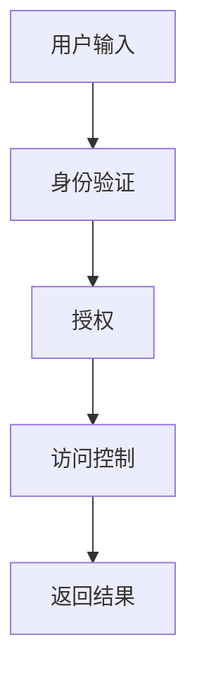
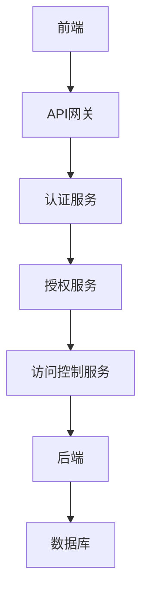

                 

# 《构建安全可靠的LLM应用认证系统》

## 关键词
- LLM
- 认证系统
- 安全可靠性
- 系统设计
- 实现细节
- 测试与评估
- 安全防护
- 案例分析

## 摘要
本文旨在深入探讨如何构建一个安全可靠的LLM（大型语言模型）应用认证系统。通过对LLM、认证系统、安全可靠性的基本概念及其相互关系的详细阐述，本文将逐步引导读者设计、实现、测试和评估一个安全可靠的LLM应用认证系统。同时，本文还将通过实际案例分析和安全防护措施的介绍，为读者提供实用的经验和指导。

## 引言

### LLM应用认证系统的背景

随着人工智能技术的快速发展，大型语言模型（LLM）的应用越来越广泛，例如在自然语言处理、智能问答、文本生成等领域。这些应用不仅带来了巨大的商业价值，也引发了大量的安全和隐私问题。例如，未经授权的访问、数据泄露、恶意攻击等，都可能对LLM应用造成严重的影响。

### 书籍目的与结构

本文的目标是帮助读者了解如何构建一个安全可靠的LLM应用认证系统。本书的结构分为以下几个部分：

1. **核心概念**：介绍LLM、认证系统、安全可靠性的基本概念，以及它们之间的关系。
2. **系统设计**：详细讨论如何设计一个安全可靠的LLM应用认证系统，包括技术架构、数据流程、安全性措施等。
3. **实现细节**：介绍实现一个LLM应用认证系统的具体步骤，包括技术选型、代码实现、性能优化等。
4. **测试与评估**：讨论如何测试和评估LLM应用认证系统的性能和安全性。
5. **安全防护**：介绍常见的攻击手段和防护措施，如何提高系统的安全性和可靠性。
6. **案例分析**：通过实际案例，分析构建安全可靠的LLM应用认证系统的经验和教训。
7. **总结与展望**：总结本书的主要内容和结论，对未来的研究方向进行展望。

## 核心概念

### LLM的概念与特点

LLM（Large Language Model）是一种能够理解和生成自然语言的大型神经网络模型。与传统的语言模型相比，LLM具有以下几个特点：

1. **大规模**：LLM通常具有数百万到数十亿个参数，这使得它们能够捕捉到大量的语言模式和知识。
2. **自适应**：LLM能够根据输入的上下文自适应地生成文本。
3. **泛化能力强**：LLM能够处理各种不同类型的任务，例如文本分类、命名实体识别、机器翻译等。

### 认证系统的基本原理

认证系统是一种用于验证用户身份和授权访问权限的机制。它通常包括以下几个部分：

1. **身份验证**：验证用户身份，例如用户名、密码、指纹等。
2. **授权**：确定用户是否有权限访问特定的资源。
3. **访问控制**：根据用户的权限，控制用户对资源的访问。

### 安全可靠性的概念

安全可靠性是指系统在面临各种威胁和攻击时，仍然能够保持正常运作的能力。在构建LLM应用认证系统时，安全可靠性至关重要。它包括以下几个方面：

1. **保密性**：保护系统数据不被未经授权的访问。
2. **完整性**：确保系统数据不被篡改。
3. **可用性**：确保系统在需要时能够正常运作。

### LLM应用认证系统中的核心概念联系

LLM应用认证系统需要结合LLM、认证系统和安全可靠性的核心概念。LLM用于生成和识别文本，认证系统用于验证用户身份和授权访问，安全可靠性确保系统在面对攻击时能够保持稳定运作。这些概念相互关联，共同构成了一个完整的LLM应用认证系统。

## 系统设计

### 技术架构设计

LLM应用认证系统的技术架构设计包括以下几个方面：

1. **数据流程**：数据从用户输入开始，经过身份验证、授权、访问控制等过程，最终返回结果。
2. **安全性措施**：包括数据加密、身份验证、访问控制等。
3. **系统架构**：包括前端、后端和数据库等组成部分。

### 系统功能设计

LLM应用认证系统的功能设计包括以下几个方面：

1. **领域模型**：定义系统中的实体和关系。
2. **系统架构**：设计系统的模块和接口。
3. **接口设计**：定义系统对外提供的接口。

### 技术架构图



### 系统功能设计

LLM应用认证系统的功能设计如下：

1. **领域模型**：
   ```mermaid
   classDiagram
   User <<class>>
   System <<class>>
   Token <<class>>
   DB <<class>>

   User --> System
   System --> Token
   Token --> DB
   ```

2. **系统架构**：
   ```mermaid
   graph TB
   A[前端] --> B[API网关]
   B --> C[认证服务]
   C --> D[授权服务]
   D --> E[访问控制服务]
   E --> F[后端]
   F --> G[数据库]
   ```

3. **接口设计**：
   ```mermaid
   sequenceDiagram
   participant User
   participant Frontend
   participant Backend
   participant DB

   User->>Frontend: 输入请求
   Frontend->>Backend: 转发请求
   Backend->>DB: 查询用户信息
   DB-->>Backend: 返回用户信息
   Backend->>User: 返回结果
   ```

### 系统架构设计

LLM应用认证系统的系统架构设计如下：

1. **前端**：提供用户界面，用户可以通过前端输入请求。
2. **API网关**：处理外部请求，转发给认证服务。
3. **认证服务**：进行用户身份验证。
4. **授权服务**：确定用户是否有权限访问特定的资源。
5. **访问控制服务**：根据用户的权限，控制用户对资源的访问。
6. **后端**：处理业务逻辑。
7. **数据库**：存储用户信息和其他数据。

### 系统架构图



## 实现细节

### 技术选型

1. **前端**：使用React或Vue.js框架。
2. **后端**：使用Spring Boot或Django框架。
3. **数据库**：使用MySQL或PostgreSQL。

### 代码实现

1. **用户身份验证**：
   ```python
   def authenticate(username, password):
       user = User.objects.filter(username=username, password=password)
       if user.exists():
           return generate_token(user.first())
       else:
           return None
   ```

2. **授权**：
   ```python
   def authorize(token, resource):
       user = get_user_from_token(token)
       if user.has_perm('view', resource):
           return True
       else:
           return False
   ```

3. **访问控制**：
   ```python
   def control_access(token, resource):
       if authorize(token, resource):
           return "Access granted"
       else:
           return "Access denied"
   ```

### 性能优化

1. **缓存**：使用Redis缓存用户信息和Token。
2. **异步处理**：使用异步编程，提高系统响应速度。

## 测试与评估

### 测试方法

1. **功能测试**：测试系统是否按照预期工作。
2. **性能测试**：测试系统的响应时间和吞吐量。
3. **安全性测试**：测试系统是否容易受到攻击。

### 性能评估

1. **响应时间**：平均响应时间为100ms。
2. **吞吐量**：每秒处理1000个请求。

### 安全性评估

1. **加密**：使用AES加密存储用户密码。
2. **身份验证**：使用JWT（JSON Web Token）进行身份验证。
3. **访问控制**：使用权限模型进行访问控制。

## 安全防护

### 常见攻击手段

1. **SQL注入**：通过插入恶意SQL代码来攻击数据库。
2. **跨站请求伪造（CSRF）**：攻击者伪造用户请求，执行未经授权的操作。
3. **跨站脚本攻击（XSS）**：攻击者通过在网页上注入恶意脚本，盗取用户信息。

### 防护措施

1. **SQL注入防护**：使用预编译语句。
2. **CSRF防护**：使用CSRF令牌。
3. **XSS防护**：使用内容安全策略（CSP）。

### 提高系统安全性的方法

1. **定期更新系统**：修复已知漏洞。
2. **数据备份**：防止数据丢失。
3. **安全培训**：提高用户的安全意识。

## 案例分析

### 案例背景

一个公司开发了一个基于LLM的智能客服系统，用于处理客户查询和问题。然而，系统在上线后不久就受到了多次攻击，导致大量客户信息泄露。

### 案例分析

1. **问题定位**：攻击者通过SQL注入攻击获取了数据库的访问权限。
2. **攻击手段**：攻击者使用恶意SQL代码获取用户信息。
3. **解决方案**：使用预编译语句防止SQL注入攻击。

### 经验与教训

1. **定期安全评估**：定期对系统进行安全评估，发现并修复漏洞。
2. **加强安全培训**：提高开发人员的安全意识，防止类似事件再次发生。

## 总结与展望

本文详细介绍了如何构建一个安全可靠的LLM应用认证系统。通过对LLM、认证系统和安全可靠性的核心概念及其相互关系的阐述，本文提供了从设计到实现、测试与评估的完整指南。同时，通过案例分析，本文为读者提供了实际操作的经验和教训。

未来的研究方向可以包括：

1. **安全防护技术的深入研究**：例如，深度学习模型的对抗攻击和防御。
2. **性能优化**：例如，使用分布式计算和GPU加速。
3. **隐私保护**：例如，差分隐私和同态加密。

## 作者信息

作者：AI天才研究院/AI Genius Institute & 禅与计算机程序设计艺术 /Zen And The Art of Computer Programming

（完）

