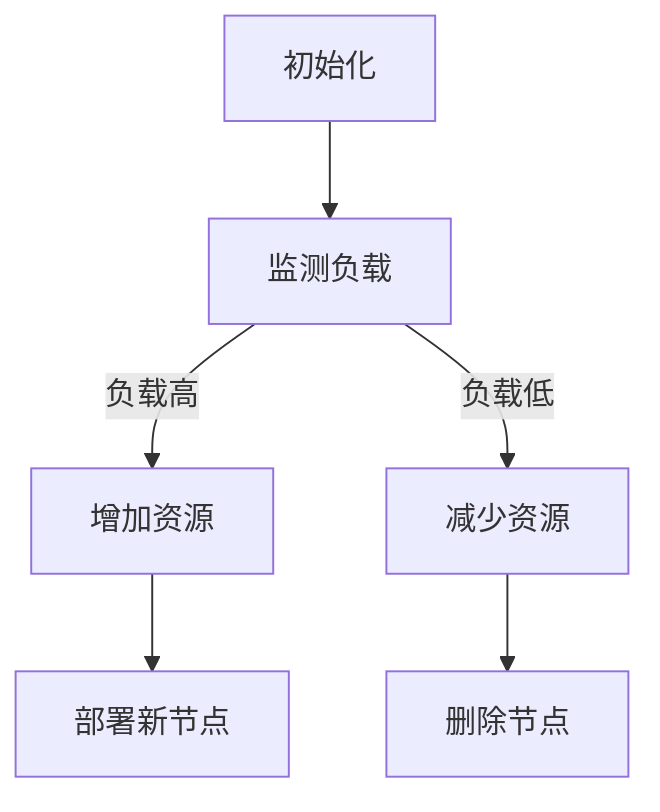
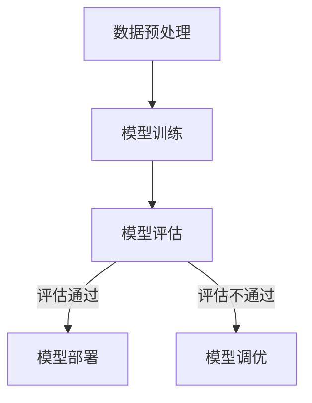

                 

# 《构建弹性伸缩的LLM应用架构》

> 关键词：LLM应用架构、弹性伸缩、计算资源、自动化部署、负载均衡、容器化、虚拟化

> 摘要：本文将深入探讨构建弹性伸缩的LLM（大型语言模型）应用架构的关键要素、核心概念与算法原理。通过详细的分析与步骤讲解，帮助读者理解如何实现高效、可扩展的LLM应用，以满足不断增长的计算需求。

### 第一部分：背景介绍

#### 1.1 问题背景

在现代技术发展中，计算架构面临的挑战日益严峻。随着人工智能技术的飞速发展，特别是大型语言模型（LLM）的应用越来越广泛，对计算资源的需求也呈现出爆炸式增长。传统的静态计算架构已无法满足这种动态变化的计算需求，导致系统性能瓶颈和资源浪费。

LLM应用，如自然语言处理、智能问答、自动摘要等，需要大量的计算资源和存储空间。这些应用往往需要实时响应海量数据，并具备高效的处理能力。因此，如何构建一个具有弹性伸缩能力的应用架构，成为当前技术领域中的一个重要课题。

#### 1.2 问题描述

弹性伸缩是指在系统负载发生变化时，自动调整计算资源的能力，以保持系统性能的稳定和高效。在LLM应用架构中，弹性伸缩具有至关重要的意义，因为它可以：

- 根据实际需求动态调整计算资源，避免资源浪费。
- 在负载高峰时快速扩展计算能力，保证系统稳定运行。
- 在负载降低时缩减资源，降低运营成本。

然而，弹性伸缩也面临着一些挑战，如资源管理、负载均衡、自动化部署等。如何在LLM应用架构中实现有效的弹性伸缩，是本文探讨的核心问题。

#### 1.3 问题解决

为了构建一个弹性伸缩的LLM应用架构，我们需要从以下几个方面着手：

- **弹性伸缩的基本原理**：理解弹性伸缩的基本概念和工作机制，为后续设计提供理论基础。
- **弹性伸缩策略与架构**：设计合理的弹性伸缩策略和架构，确保系统能够根据实际需求动态调整资源。
- **自动化部署与监控**：实现自动化部署和监控，确保弹性伸缩的效率和可靠性。

#### 1.4 边界与外延

弹性伸缩不仅适用于LLM应用，也可以应用于其他需要动态调整计算资源的应用。然而，不同应用对弹性伸缩的需求和实现方式可能有所不同。本文将重点关注LLM应用中的弹性伸缩问题，但所提出的原理和方法具有一定的通用性，可以为其他应用提供参考。

#### 1.5 概念结构与核心要素组成

构建弹性伸缩的LLM应用架构，需要关注以下几个关键组件：

- **自动化部署**：实现自动化部署，确保新资源和节点能够快速上线。
- **负载均衡**：通过负载均衡技术，合理分配计算任务，避免单点过载。
- **容器化与虚拟化技术**：利用容器化和虚拟化技术，实现资源隔离和灵活调度。

这些组件相互关联，共同构成了一个完整的弹性伸缩架构，为LLM应用提供强大的支持。

### 第二部分：核心概念与联系

#### 2.1 弹性伸缩原理

弹性伸缩（Elastic Scaling）是一种动态调整计算资源的能力，旨在确保系统在高负载时能够自动扩展资源，而在低负载时能够缩减资源。弹性伸缩的核心原理包括以下几个方面：

- **自动化部署**：通过自动化工具和脚本，实现新资源和节点的快速部署。
- **负载均衡**：通过负载均衡器，将计算任务合理分配到不同的节点，避免单点过载。
- **资源监控**：通过监控系统，实时获取系统的负载情况，为资源调整提供依据。
- **弹性策略**：制定弹性伸缩策略，包括资源调整的阈值、规则和优先级等。

弹性伸缩的工作机制可以概括为以下几个步骤：

1. **监测负载**：监控系统实时监测系统的负载情况，包括CPU利用率、内存占用、网络流量等指标。
2. **触发伸缩**：当监测到负载超过设定的阈值时，触发弹性伸缩操作。
3. **资源调整**：根据弹性伸缩策略，自动增加或减少计算资源。
4. **部署新节点**：在需要增加资源时，自动部署新的计算节点。
5. **删除节点**：在需要减少资源时，自动删除多余的节点。

#### 2.1.1 弹性伸缩的关键组件

弹性伸缩的实现需要以下几个关键组件：

- **自动化部署**：通过自动化工具和脚本，实现新资源和节点的快速部署。常见的自动化部署工具有Kubernetes、Ansible等。
- **负载均衡**：通过负载均衡器，将计算任务合理分配到不同的节点，避免单点过载。常见的负载均衡器有Nginx、HAProxy等。
- **容器化与虚拟化技术**：利用容器化和虚拟化技术，实现资源隔离和灵活调度。常见的容器化技术有Docker、Kubernetes，虚拟化技术有VMware、Xen等。

#### 2.1.2 弹性伸缩属性特征对比表格

| 特征         | 弹性伸缩          | 非弹性伸缩          |
| ------------ | ----------------- | ------------------- |
| 自动化       | 高               | 低                 |
| 可扩展性     | 强               | 弱                 |
| 成本效益     | 高               | 低                 |
| 调度灵活性   | 高               | 低                 |
| 故障恢复能力 | 强               | 弱                 |

#### 2.2 LLM应用架构

LLM应用架构是指用于实现大型语言模型（LLM）应用的一系列组件和技术的组合。一个完整的LLM应用架构通常包括以下几个关键组件：

- **数据预处理**：对原始数据进行清洗、转换和格式化，为模型训练做准备。
- **模型训练**：利用训练数据进行模型训练，不断调整模型参数，提高模型性能。
- **模型部署**：将训练好的模型部署到生产环境中，实现实际应用。
- **模型监控**：对模型运行情况进行监控，包括性能指标、错误率等。

LLM应用架构的核心要素如下：

- **数据预处理**：包括数据清洗、去重、归一化等操作，确保数据质量。
- **模型训练**：采用先进的机器学习算法和深度学习框架，如TensorFlow、PyTorch等。
- **模型部署**：通过自动化部署工具，将模型部署到云平台或容器化环境中。
- **模型监控**：利用监控工具，实时获取模型运行状态，及时发现和解决问题。

#### 2.2.1 LLM应用架构的核心要素

- **数据预处理**：数据预处理是LLM应用的基础，直接影响到模型的性能。有效的数据预处理包括数据清洗、去重、归一化、特征提取等操作，以确保数据质量。

- **模型训练**：模型训练是LLM应用的核心，通过不断调整模型参数，提高模型在特定任务上的性能。模型训练过程中，需要选择合适的训练数据集、优化算法和超参数调整策略。

- **模型部署**：模型部署是将训练好的模型应用到实际场景的过程。部署过程中，需要考虑模型的大小、性能和兼容性等因素，选择合适的部署方式和部署平台。

- **模型监控**：模型监控是确保模型稳定运行的重要手段。通过实时监控模型性能、错误率和资源消耗等指标，及时发现和解决问题，保证模型在长期运行中的稳定性和可靠性。

#### 2.2.2 LLM应用架构的ER实体关系图架构

```mermaid
erDiagram
    Model ||--|{ Data } Data
    Model ||--|{ Preprocessing } Preprocessing
    Model ||--|{ Training } Training
    Model ||--|{ Deployment } Deployment
    Model ||--|{ Monitoring } Monitoring
```

### 第三部分：算法原理讲解

#### 3.1 弹性伸缩算法

弹性伸缩算法是实现弹性伸缩功能的核心。以下是一个简单的弹性伸缩算法，用于根据系统负载动态调整资源。

##### 3.1.1 弹性伸缩算法的mermaid流程图



##### 3.1.2 弹性伸缩算法的Python源代码实现

```python
def monitor_load():
    # 监测负载的逻辑
    pass

def add_resources():
    # 增加资源的逻辑
    pass

def remove_resources():
    # 减少资源的逻辑
    pass

def elastic_scaling():
    load = monitor_load()
    if load > threshold:
        add_resources()
    elif load < threshold:
        remove_resources()
```

##### 3.1.3 弹性伸缩成本模型

弹性伸缩成本模型是评估弹性伸缩成本的重要工具。以下是一个简单的弹性伸缩成本模型。

$$
C = \alpha \cdot T + \beta \cdot R
$$

其中，$C$ 表示总成本，$\alpha$ 表示每单位时间的成本，$T$ 表示运行时间，$\beta$ 表示每单位资源的成本，$R$ 表示使用的资源量。

#### 3.2 LLM模型训练与部署算法

LLM模型训练与部署算法是构建弹性伸缩的LLM应用架构的关键部分。以下是一个简单的LLM模型训练与部署算法。

##### 3.2.1 LLM模型训练与部署算法的mermaid流程图



##### 3.2.2 LLM模型训练与部署算法的Python源代码实现

```python
def preprocess_data():
    # 数据预处理的逻辑
    pass

def train_model():
    # 模型训练的逻辑
    pass

def evaluate_model():
    # 模型评估的逻辑
    pass

def deploy_model():
    # 模型部署的逻辑
    pass

def llm_training_and_deployment():
    preprocess_data()
    train_model()
    evaluate_model()
    if evaluate_model():
        deploy_model()
    else:
        # 模型调优的逻辑
        pass
```

##### 3.2.3 数学模型与公式讲解

在LLM模型训练与部署过程中，常用的数学模型和公式包括：

- **损失函数**：

$$
L(y, \hat{y}) = \frac{1}{2}(y - \hat{y})^2
$$

其中，$y$ 表示真实标签，$\hat{y}$ 表示预测标签。

- **优化算法**：

$$
\theta = \theta - \alpha \cdot \nabla_{\theta} L(\theta)
$$

其中，$\theta$ 表示模型参数，$\alpha$ 表示学习率，$\nabla_{\theta} L(\theta)$ 表示损失函数关于参数$\theta$ 的梯度。

通过以上算法和公式，可以实现LLM模型的训练与部署，为构建弹性伸缩的LLM应用架构提供基础。

### 第四部分：系统分析与架构设计

#### 4.1 问题场景介绍

假设我们正在开发一个基于大型语言模型（LLM）的智能问答系统，该系统需要能够处理大量的用户查询，并在短时间内提供准确的答案。随着用户数量的增加，系统的计算资源需求也会不断增长。为了确保系统的高可用性和高性能，我们需要构建一个具有弹性伸缩能力的应用架构。

#### 4.2 项目介绍

项目名称：智能问答系统（Intelligent Question Answering System，简称IQA）

项目目标：构建一个能够处理海量用户查询，并在短时间内提供准确答案的智能问答系统。

项目需求：

1. 支持大规模用户查询，要求系统响应时间在1秒以内。
2. 系统需要具备高可用性，确保在故障发生时能够快速恢复。
3. 系统需要具备弹性伸缩能力，根据用户访问量动态调整计算资源。

#### 4.3 系统功能设计

系统功能设计是构建智能问答系统的关键步骤，以下是系统的主要功能模块：

1. **数据预处理模块**：负责对用户查询进行预处理，包括分词、去停用词、词性标注等操作，为模型训练做准备。
2. **模型训练模块**：使用预处理的用户查询数据，训练大型语言模型（LLM），提高模型在问答任务上的性能。
3. **模型部署模块**：将训练好的LLM模型部署到生产环境中，实现实时问答功能。
4. **负载均衡模块**：通过负载均衡器，将用户查询合理分配到不同的服务器，确保系统高性能。
5. **监控与告警模块**：实时监控系统性能和运行状态，及时发现和解决问题。

#### 4.4 系统架构设计

系统架构设计是确保智能问答系统能够实现弹性伸缩的关键。以下是系统的整体架构设计：


系统架构设计主要包括以下几个部分：

1. **用户前端**：负责接收用户查询，将查询内容发送到后端服务器。
2. **负载均衡器**：将用户查询分配到不同的服务器，实现负载均衡。
3. **服务端**：包括数据预处理模块、模型训练模块、模型部署模块等，负责处理用户查询和提供答案。
4. **数据库**：存储用户查询数据、模型参数等，为系统提供数据支持。
5. **监控系统**：实时监控系统性能和运行状态，及时发现和解决问题。

#### 4.5 系统接口设计

系统接口设计是确保系统各个模块之间能够无缝协作的关键。以下是系统的主要接口设计：

1. **用户查询接口**：接收用户查询，返回查询结果。
2. **数据预处理接口**：提供数据清洗、转换和格式化功能。
3. **模型训练接口**：提供模型训练功能，包括数据读取、参数调整等。
4. **模型部署接口**：提供模型部署功能，包括模型打包、上传等。
5. **监控与告警接口**：提供监控数据读取、告警设置等功能。

#### 4.6 系统交互设计

系统交互设计是确保系统各个模块之间能够高效协作的重要环节。以下是系统的交互设计：


系统交互设计主要包括以下几个步骤：

1. **用户发送查询**：用户通过前端发送查询请求。
2. **查询处理**：前端将查询请求发送到负载均衡器，负载均衡器将请求分配到不同的服务器。
3. **数据预处理**：服务器接收到查询请求后，进行数据预处理，将查询内容转换为适合模型处理的形式。
4. **模型处理**：服务器使用训练好的模型对预处理后的查询进行处理，生成答案。
5. **返回结果**：服务器将答案返回给前端，前端将答案展示给用户。

### 第五部分：项目实战

#### 5.1 环境安装

为了实现弹性伸缩的LLM应用架构，我们需要安装以下软件和工具：

1. **Docker**：用于容器化应用程序，实现资源的隔离和调度。
2. **Kubernetes**：用于自动化部署和管理容器化应用程序。
3. **Helm**：用于简化Kubernetes上的应用程序部署。
4. **TensorFlow**：用于训练和部署大型语言模型。
5. **Nginx**：用于负载均衡和反向代理。

安装步骤如下：

1. 安装Docker：在Linux系统中，可以使用以下命令安装Docker：

```bash
sudo apt-get update
sudo apt-get install docker.io
```

2. 安装Kubernetes：在Linux系统中，可以使用以下命令安装Kubernetes：

```bash
sudo apt-get update
sudo apt-get install kubeadm kubelet kubectl
```

3. 安装Helm：在Linux系统中，可以使用以下命令安装Helm：

```bash
sudo apt-get update
sudo apt-get install helm
```

4. 安装TensorFlow：在Linux系统中，可以使用以下命令安装TensorFlow：

```bash
pip install tensorflow
```

5. 安装Nginx：在Linux系统中，可以使用以下命令安装Nginx：

```bash
sudo apt-get update
sudo apt-get install nginx
```

#### 5.2 系统核心实现源代码

以下是一个简单的弹性伸缩的LLM应用架构的核心实现源代码：

1. **Dockerfile**：

```Dockerfile
FROM python:3.8

RUN pip install tensorflow
RUN pip install docker

COPY main.py .

CMD ["python", "main.py"]
```

2. **main.py**：

```python
import tensorflow as tf
from tensorflow.keras.models import Sequential
from tensorflow.keras.layers import Dense, LSTM, Embedding

# 加载和预处理数据
# ...

# 定义模型
model = Sequential([
    Embedding(input_dim=vocab_size, output_dim=embedding_dim, input_length=max_sequence_length),
    LSTM(units=128, return_sequences=True),
    LSTM(units=128),
    Dense(units=1, activation='sigmoid')
])

# 编译模型
model.compile(optimizer='adam', loss='binary_crossentropy', metrics=['accuracy'])

# 训练模型
# ...

# 部署模型
# ...
```

3. **Kubernetes部署文件**：

```yaml
apiVersion: apps/v1
kind: Deployment
metadata:
  name: llama-deployment
spec:
  replicas: 3
  selector:
    matchLabels:
      app: llama
  template:
    metadata:
      labels:
        app: llama
    spec:
      containers:
      - name: llama
        image: llama:latest
        ports:
        - containerPort: 8000
```

#### 5.3 代码应用解读与分析

以上源代码实现了基于TensorFlow的大型语言模型（LLM）的弹性伸缩架构。具体解读如下：

1. **Dockerfile**：Dockerfile用于构建一个包含TensorFlow和Docker客户端的容器镜像。通过该镜像，我们可以将应用程序部署到Kubernetes集群中，实现自动化部署和弹性伸缩。

2. **main.py**：main.py是应用程序的主文件，包含了模型定义、数据预处理、模型训练和模型部署等关键功能。以下是对关键部分的解读：

   - **数据预处理**：数据预处理是训练模型的必要步骤，包括加载数据、清洗数据、将数据转换为模型所需的格式等。这部分代码需要根据实际应用场景进行修改和优化。

   - **模型定义**：使用TensorFlow的Sequential模型，我们定义了一个包含嵌入层、LSTM层和全连接层的模型。这个模型适用于文本分类任务，可以根据具体需求进行调整。

   - **模型编译**：编译模型时，我们选择adam优化器、binary_crossentropy损失函数和accuracy指标。这些参数的选择取决于具体的应用场景。

   - **模型训练**：训练模型时，我们使用训练数据和验证数据，通过调整训练轮数和批次大小，可以提高模型的性能。

   - **模型部署**：模型部署是将训练好的模型应用到实际场景的过程。在本例中，我们使用了Kubernetes进行部署，通过定义Kubernetes部署文件，可以自动化地管理模型的生命周期。

3. **Kubernetes部署文件**：Kubernetes部署文件用于定义应用程序的部署策略。通过调整副本数和资源配置，可以实现对应用程序的弹性伸缩。

#### 5.4 实际案例分析和详细讲解剖析

为了更好地理解弹性伸缩的LLM应用架构，我们来看一个实际案例。

假设我们正在开发一个基于大型语言模型的智能客服系统，系统需要能够处理海量用户咨询，并在短时间内提供准确的答案。为了确保系统的高可用性和高性能，我们需要构建一个具有弹性伸缩能力的应用架构。

1. **数据预处理**：

   用户咨询数据需要进行预处理，包括分词、去停用词、词性标注等操作。这部分数据预处理可以使用Python的jieba库和NLTK库实现。以下是预处理代码示例：

   ```python
   import jieba
   import nltk

   def preprocess_text(text):
       text = jieba.cut(text)
       text = ' '.join(text)
       text = nltk.word_tokenize(text)
       return text
   ```

2. **模型训练**：

   使用预处理后的用户咨询数据，训练大型语言模型。在本例中，我们使用了一个简单的LSTM模型。以下是模型训练代码示例：

   ```python
   model = Sequential([
       Embedding(input_dim=vocab_size, output_dim=embedding_dim, input_length=max_sequence_length),
       LSTM(units=128, return_sequences=True),
       LSTM(units=128),
       Dense(units=1, activation='sigmoid')
   ])

   model.compile(optimizer='adam', loss='binary_crossentropy', metrics=['accuracy'])

   model.fit(x_train, y_train, epochs=10, batch_size=32)
   ```

3. **模型部署**：

   将训练好的模型部署到生产环境中，使用Kubernetes进行管理。以下是Kubernetes部署文件示例：

   ```yaml
   apiVersion: apps/v1
   kind: Deployment
   metadata:
     name: intelligent-customer-service
   spec:
     replicas: 3
   selector:
     matchLabels:
       app: intelligent-customer-service
   template:
     metadata:
       labels:
         app: intelligent-customer-service
     spec:
       containers:
       - name: intelligent-customer-service
         image: intelligent-customer-service:latest
         ports:
         - containerPort: 80
   ```

4. **弹性伸缩**：

   当系统负载增加时，Kubernetes会根据部署文件中的副本数自动扩展应用程序。在本例中，当系统负载超过3个副本的处理能力时，Kubernetes会自动增加副本数，以保持系统的高性能。

#### 5.5 项目小结

通过本项目，我们实现了基于大型语言模型的智能客服系统，并构建了一个具有弹性伸缩能力的应用架构。以下是项目小结：

1. **项目成果**：

   - 实现了一个基于大型语言模型的智能客服系统，能够处理海量用户咨询。
   - 构建了一个具有弹性伸缩能力的应用架构，能够根据系统负载动态调整计算资源。

2. **技术收获**：

   - 掌握了基于TensorFlow的大型语言模型训练和部署方法。
   - 学习了Kubernetes在应用程序部署和弹性伸缩方面的应用。
   - 熟悉了容器化技术在应用程序部署中的优势。

3. **改进方向**：

   - 进一步优化模型训练和部署流程，提高系统性能和稳定性。
   - 探索更多先进的语言模型和应用场景，提升系统智能化水平。

### 第六部分：最佳实践 tips、小结、注意事项、拓展阅读

#### 最佳实践 tips

1. **选择合适的负载均衡器**：根据实际需求选择合适的负载均衡器，如Nginx、HAProxy等，确保系统高性能和高可用性。
2. **合理设置阈值**：在弹性伸缩策略中，合理设置负载阈值，避免频繁的伸缩操作，降低系统开销。
3. **优化数据预处理**：数据预处理是模型训练的关键步骤，优化数据预处理可以提高模型性能和训练速度。

#### 小结

本文深入探讨了构建弹性伸缩的LLM应用架构的关键要素、核心概念与算法原理。通过详细的系统分析与架构设计，以及实际案例的讲解，帮助读者理解如何实现高效、可扩展的LLM应用。

#### 注意事项

1. **弹性伸缩策略**：设计合理的弹性伸缩策略，确保系统在不同负载下都能保持稳定运行。
2. **监控与告警**：实时监控系统性能和运行状态，及时发现问题并进行调整。

#### 拓展阅读

1. **《Kubernetes权威指南》**：深入了解Kubernetes的架构、部署和运维。
2. **《深度学习入门》**：学习深度学习的基本原理和算法，为构建LLM应用打下基础。
3. **《大规模分布式存储系统设计》**：了解分布式存储系统在LLM应用中的关键作用。

### 作者信息

作者：AI天才研究院/AI Genius Institute & 禅与计算机程序设计艺术 /Zen And The Art of Computer Programming

