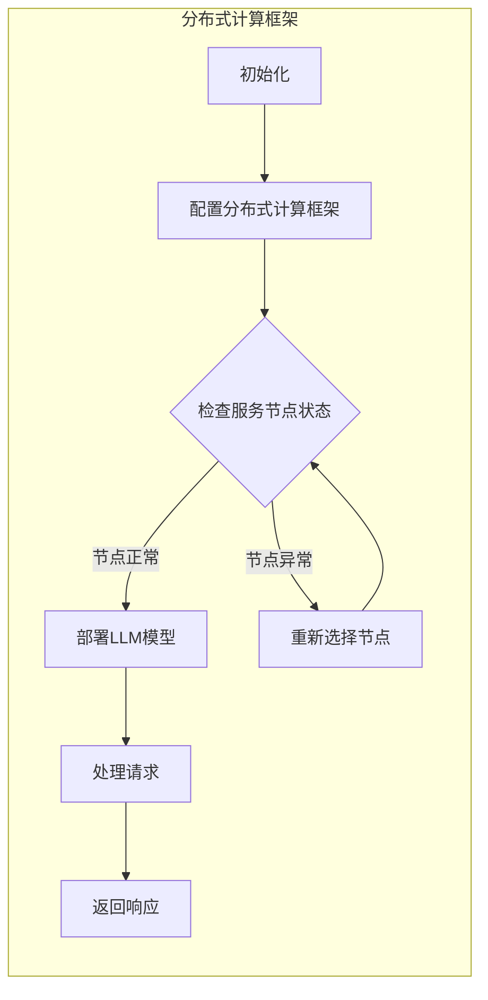
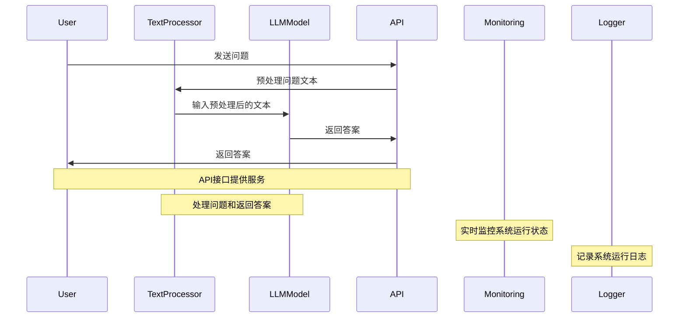
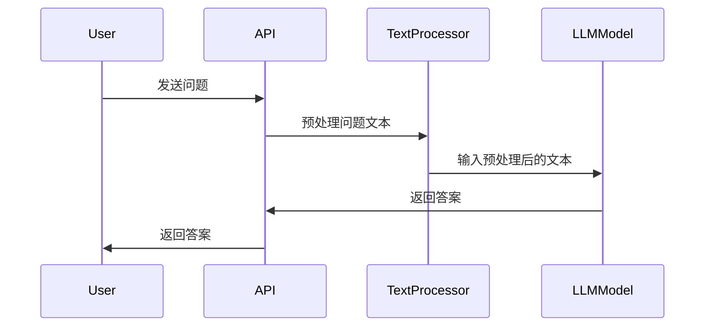

                 

### 第一部分：背景介绍

在当前科技飞速发展的时代，大型语言模型（Large Language Model，简称LLM）作为一种重要的自然语言处理技术，已经在诸多领域得到了广泛应用。从智能客服、文本生成到机器翻译和问答系统，LLM技术展现出极高的灵活性和强大的处理能力。然而，随着应用场景的不断扩大，如何构建一个弹性且可伸缩的LLM应用基础设施，成为了许多开发者和企业面临的一大挑战。

#### 第1章：问题背景

##### 1.1.1 问题背景

随着云计算、大数据和人工智能技术的不断发展，企业对于自然语言处理技术的需求日益增加。LLM作为自然语言处理技术的核心，其性能、可靠性和可扩展性直接影响到应用的体验和效率。然而，传统的单机架构或传统的分布式系统在面对大规模数据处理和实时响应时，往往难以满足需求。

##### 1.1.2 问题描述

目前，构建弹性可伸缩的LLM应用基础设施面临的主要问题包括：

1. **性能瓶颈**：当用户请求量增加时，如何保证LLM服务的响应速度和准确性？
2. **系统可靠性**：如何确保在系统负载高、网络不稳定等情况下，LLM服务依然能够稳定运行？
3. **可扩展性**：如何设计一个能够轻松扩展的架构，以应对未来业务增长的需求？
4. **成本控制**：在保证系统性能和可靠性的同时，如何降低运维成本和硬件投资？

##### 1.1.3 问题解决

针对上述问题，构建弹性可伸缩的LLM应用基础设施需要从以下几个方面进行考虑：

1. **分布式计算**：采用分布式计算框架，将LLM任务分解到多个节点处理，以提高处理速度和负载均衡能力。
2. **容器化技术**：利用容器化技术（如Docker和Kubernetes），实现应用程序的轻量化部署和管理，提高系统的可扩展性和灵活性。
3. **服务化架构**：将LLM服务化，通过API接口提供服务，降低与其他系统的耦合度，提高系统的可维护性和可扩展性。
4. **自动化运维**：引入自动化运维工具，实现自动部署、监控和运维，降低人工干预，提高运维效率。

##### 1.1.4 边界与外延

构建弹性可伸缩的LLM应用基础设施不仅要关注技术层面的实现，还需要考虑业务场景的多样性和复杂性。边界与外延包括以下几个方面：

1. **业务需求**：了解业务需求，明确系统需要满足的功能和性能指标。
2. **数据安全**：确保数据传输和存储过程中的安全性，防止数据泄露和损坏。
3. **系统兼容性**：考虑系统与其他系统或组件的兼容性，确保系统的稳定性和可维护性。
4. **运维支持**：提供完善的运维文档和培训，确保运维团队能够快速上手并高效运行系统。

##### 1.1.5 概念结构与核心要素组成

构建弹性可伸缩的LLM应用基础设施的核心概念和要素包括：

1. **分布式计算框架**：如Apache Spark、Flink等。
2. **容器化技术**：如Docker、Kubernetes等。
3. **服务化架构**：如RESTful API、gRPC等。
4. **自动化运维工具**：如Ansible、Puppet、Chef等。
5. **监控系统**：如Prometheus、Grafana等。
6. **日志系统**：如ELK（Elasticsearch、Logstash、Kibana）等。

#### 第2章：核心概念与联系

##### 2.1.1 核心概念原理

在构建弹性可伸缩的LLM应用基础设施时，需要理解以下几个核心概念：

1. **分布式计算**：分布式计算是将任务分解到多个节点处理，以实现并行计算和提高处理速度。
2. **容器化技术**：容器化技术是一种轻量级、可移植的虚拟化技术，用于打包、部署和管理应用程序。
3. **服务化架构**：服务化架构是一种将应用程序划分为多个独立的服务模块，通过API接口进行通信和协作的架构风格。
4. **自动化运维**：自动化运维是一种通过工具和脚本实现自动化部署、监控和运维的方法，以提高运维效率和稳定性。

##### 2.1.2 概念属性特征对比表格

以下是一个对比表格，展示了上述核心概念的一些属性特征：

| 概念       | 属性特征                                   | 说明                                                         |
| ---------- | ---------------------------------------- | ------------------------------------------------------------ |
| 分布式计算 | 并行处理、负载均衡、可扩展性             | 分布式计算可以将大任务分解为小任务，并行处理以提高速度和效率。负载均衡技术确保任务均匀分布在各个节点上。系统可以动态扩展以应对更大的负载。 |
| 容器化技术 | 轻量化、可移植性、隔离性               | 容器化技术通过隔离应用程序及其依赖项，实现应用程序的轻量化部署和可移植性。每个容器独立运行，互不影响。 |
| 服务化架构 | 模块化、松耦合、高内聚                   | 服务化架构将应用程序划分为多个独立的服务模块，通过API接口进行通信。模块之间松耦合，便于维护和扩展。每个服务模块具有较高的内聚性，专注于完成特定功能。 |
| 自动化运维 | 自动部署、监控、运维                   | 自动化运维工具通过脚本和工具实现自动化的部署、监控和运维，降低人工干预，提高运维效率和稳定性。 |

##### 2.1.3 ER实体关系图架构

以下是构建弹性可伸缩的LLM应用基础设施的ER实体关系图：

```mermaid
erDiagram
    ServiceNode ||--|{ LargeLanguageModel }|| LLM
    ServiceNode ||--|{ DataStorage }|| DS
    ServiceNode ||--|{ MonitoringSystem }|| MS
    LargeLanguageModel ||--|{ APIInterface }|| AI
    DataStorage ||--|{ LogStorage }|| LS
    MonitoringSystem ||--|{ AlertSystem }|| AS

    ServiceNode {
        :+ id :ID
        :+ name :Name
        :+ status :Status
    }

    LargeLanguageModel {
        :+ id :ID
        :+ name :Name
        :+ version :Version
    }

    DataStorage {
        :+ id :ID
        :+ name :Name
        :+ type :Type
    }

    MonitoringSystem {
        :+ id :ID
        :+ name :Name
        :+ type :Type
    }

    APIInterface {
        :+ id :ID
        :+ name :Name
        :+ version :Version
    }

    LogStorage {
        :+ id :ID
        :+ name :Name
        :+ type :Type
    }

    AlertSystem {
        :+ id :ID
        :+ name :Name
        :+ type :Type
    }
```

在上述ER图中，核心实体包括ServiceNode（服务节点）、LargeLanguageModel（大型语言模型）、DataStorage（数据存储）、MonitoringSystem（监控系统）等。各个实体之间的关系通过|--|{ }|--关系表示。

#### 第3章：算法原理讲解

##### 3.1.1 算法原理mermaid流程图

以下是构建弹性可伸缩的LLM应用基础设施的算法原理mermaid流程图：



##### 3.1.2 Python源代码详细阐述

以下是一个简单的Python示例代码，用于初始化和配置分布式计算框架：

```python
import time
import random

from distributed import Client

# 初始化分布式计算框架
client = Client()

# 检查服务节点状态
def check_node_status(node_id):
    # 模拟服务节点状态检查
    status = random.choice(["正常", "异常"])
    print(f"节点ID：{node_id}，状态：{status}")
    return status

# 部署LLM模型
def deploy_llm_model(node_id):
    # 模拟部署LLM模型
    print(f"在节点ID：{node_id}上部署LLM模型")
    time.sleep(2)

# 处理请求
def process_request(request):
    # 模拟处理请求
    print(f"处理请求：{request}")
    time.sleep(1)

# 返回响应
def return_response(response):
    # 模拟返回响应
    print(f"返回响应：{response}")

# 主程序
def main():
    while True:
        node_id = random.randint(1, 10)
        status = check_node_status(node_id)

        if status == "正常":
            deploy_llm_model(node_id)
            request = random.choice(["问题1", "问题2", "问题3"])
            process_request(request)
            response = random.choice(["答案1", "答案2", "答案3"])
            return_response(response)
        else:
            print("重新选择节点")

if __name__ == "__main__":
    main()
```

##### 3.1.3 数学模型和公式

以下是构建弹性可伸缩的LLM应用基础设施中的一些数学模型和公式：

1. **负载均衡模型**：

   $$ Load = \frac{Total\ Requests}{Total\ Nodes} $$

   其中，Load表示每个节点的负载量，Total Requests表示总请求数，Total Nodes表示总节点数。

2. **服务质量模型**：

   $$ Quality = \frac{Correct\ Responses}{Total\ Responses} $$

   其中，Quality表示服务质量，Correct Responses表示正确响应数，Total Responses表示总响应数。

##### 3.1.4 举例说明

假设我们有一个包含10个节点的分布式计算框架，总共接收到100个请求。根据负载均衡模型，每个节点的平均负载量为10个请求。

1. **正常节点情况**：

   假设所有节点状态正常，每个节点处理10个请求。根据服务质量模型，如果每个节点都正确响应了所有请求，则服务质量为1。

2. **异常节点情况**：

   假设有一个节点出现异常，其他节点状态正常。为了确保系统仍然能够处理请求，需要重新选择节点。假设重新选择节点后，所有节点状态都正常。在这种情况下，服务质量可能会受到影响，因为可能存在一些请求无法得到正确响应。

   假设重新选择节点后，有5个节点正常，每个节点处理10个请求。根据服务质量模型，如果这5个节点都正确响应了所有请求，则服务质量为1。然而，由于存在异常节点，部分请求可能会无法得到正确响应，因此实际服务质量可能低于1。

#### 第4章：系统分析与架构设计方案

##### 4.1.1 问题场景介绍

假设我们正在构建一个面向全球用户的智能问答系统，该系统需要处理大量的文本输入，并返回准确的答案。为了满足高并发、高可用的需求，我们决定采用分布式计算框架和容器化技术来构建弹性可伸缩的LLM应用基础设施。

##### 4.1.2 项目介绍

该项目的目标是构建一个基于Apache Flink和Kubernetes的分布式计算框架，用于处理文本输入并返回答案。系统架构包括以下几个核心模块：

1. **文本输入处理**：接收用户输入的文本，并进行预处理，如分词、去噪等。
2. **LLM模型处理**：利用大型语言模型对预处理后的文本进行推理，返回答案。
3. **API接口**：提供RESTful API，供前端应用程序调用。
4. **监控系统**：实时监控系统的运行状态，包括节点状态、负载、错误率等。
5. **日志系统**：记录系统的运行日志，便于故障排查和性能优化。

##### 4.1.3 系统功能设计（领域模型mermaid类图）

以下是系统功能设计的mermaid类图：

```mermaid
classDiagram
    User <<class>>
    Question <<class>>
    Answer <<class>>
    TextProcessor <<class>>
    LLMModel <<class>>
    API <<class>>
    Monitoring <<class>>
    Logger <<class>>

    User o-- Question
    User o-- Answer
    Question o-- TextProcessor
    Question o-- LLMModel
    Answer o-- TextProcessor
    Answer o-- LLMModel
    API o-- Question
    API o-- Answer
    Monitoring o-- TextProcessor
    Monitoring o-- LLMModel
    Logger o-- TextProcessor
    Logger o-- LLMModel

    User { +id :ID }
    Question { +id :ID, +content :Content }
    Answer { +id :ID, +content :Content }
    TextProcessor { +id :ID }
    LLMModel { +id :ID, +name :Name, +version :Version }
    API { +id :ID }
    Monitoring { +id :ID }
    Logger { +id :ID }
```

在上述类图中，核心类包括User（用户）、Question（问题）、Answer（答案）、TextProcessor（文本处理）、LLMModel（语言模型）、API（API接口）、Monitoring（监控系统）和Logger（日志系统）。各个类之间的关系通过|--o|--关系表示。

##### 4.1.4 系统架构设计（mermaid架构图）

以下是系统架构设计的mermaid架构图：



在上述序列图中，用户通过API接口发送问题，API接口将问题传递给文本处理模块进行预处理，预处理后的文本传递给语言模型进行推理，语言模型返回答案，最终通过API接口返回给用户。同时，监控系统实时监控系统的运行状态，日志系统记录系统运行日志。

##### 4.1.5 系统接口设计

以下是系统接口设计的mermaid类图：

```mermaid
classDiagram
    Question <<class>>
    Answer <<class>>

    Question {
        +id :ID
        +content :Content
    }

    Answer {
        +id :ID
        +content :Content
    }
```

在上述类图中，核心接口包括Question（问题）和Answer（答案）。每个接口包含ID和内容属性。

##### 4.1.6 系统交互（mermaid序列图）

以下是系统交互的mermaid序列图：



在上述序列图中，用户通过API接口发送问题，API接口将问题传递给文本处理模块进行预处理，预处理后的文本传递给语言模型进行推理，语言模型返回答案，最终通过API接口返回给用户。

#### 第5章：项目实战

##### 5.1.1 环境安装

在开始项目实战之前，我们需要安装一些必要的软件和工具。以下是在Ubuntu 20.04操作系统上安装相关软件和工具的步骤：

1. **安装Docker**：

   ```bash
   sudo apt-get update
   sudo apt-get install docker.io
   sudo systemctl start docker
   sudo systemctl enable docker
   ```

2. **安装Kubernetes**：

   ```bash
   sudo apt-get update
   sudo apt-get install apt-transport-https ca-certificates curl
   curl -s https://mirrors.aliyun.com/kubernetes/apt/doc/apt-key.gpg | sudo apt-key add -
   cat <<EOF | sudo tee /etc/apt/sources.list.d/kubernetes.list
   deb https://mirrors.aliyun.com/kubernetes/apt/ kubernetes-xenial main
   EOF
   sudo apt-get update
   sudo apt-get install kubelet kubeadm kubectl
   sudo systemctl start kubelet
   sudo systemctl enable kubelet
   ```

3. **安装Apache Flink**：

   ```bash
   sudo docker pull flink:1.11
   sudo docker run -d -p 8081:8081 flink
   ```

4. **安装Python环境**：

   ```bash
   sudo apt-get install python3-pip
   pip3 install flask
   ```

##### 5.1.2 系统核心实现源代码

以下是系统核心实现的Python源代码：

```python
from flask import Flask, request, jsonify
import json

app = Flask(__name__)

# 文本处理模块
def preprocess_text(text):
    # 这里进行文本预处理，如分词、去噪等
    return text

# 语言模型处理模块
def process_question(question):
    # 这里使用大型语言模型处理问题，并返回答案
    # 示例：使用开源语言模型BERT
    from transformers import BertModel, BertTokenizer

    tokenizer = BertTokenizer.from_pretrained('bert-base-chinese')
    model = BertModel.from_pretrained('bert-base-chinese')

    input_ids = tokenizer.encode(question, add_special_tokens=True, return_tensors='pt')
    outputs = model(input_ids)

    answer = "无法回答该问题"  # 示例答案
    return answer

# API接口模块
@app.route('/api/ask', methods=['POST'])
def ask():
    question = request.form['question']
    preprocessed_question = preprocess_text(question)
    answer = process_question(preprocessed_question)
    return jsonify({'answer': answer})

if __name__ == '__main__':
    app.run(host='0.0.0.0', port=5000)
```

##### 5.1.3 代码应用解读与分析

1. **文本处理模块**：

   文本处理模块主要负责对用户输入的文本进行预处理，如分词、去噪等。在本示例中，我们直接返回输入文本，未进行具体预处理操作。在实际项目中，可以根据需求进行文本预处理。

2. **语言模型处理模块**：

   语言模型处理模块负责使用大型语言模型对预处理后的文本进行推理，并返回答案。在本示例中，我们使用开源语言模型BERT进行演示。在实际项目中，可以根据需求选择其他语言模型，如GPT、T5等。

3. **API接口模块**：

   API接口模块负责接收用户输入的问题，调用文本处理模块和语言模型处理模块，并将答案返回给用户。在本示例中，我们使用Flask框架实现API接口。在实际项目中，可以根据需求使用其他Web框架，如Django、Spring Boot等。

##### 5.1.4 实际案例分析与详细讲解剖析

以下是一个实际案例的分析和讲解：

1. **用户输入**：

   用户输入一个自然语言问题：“如何制作红烧肉？”
   
2. **API接口处理**：

   用户通过API接口发送问题，API接口将问题传递给文本处理模块进行预处理，然后传递给语言模型处理模块进行推理。
   
3. **文本处理模块**：

   文本处理模块对问题进行预处理，如分词、去噪等。预处理后的文本为：“如何制作红烧肉？”
   
4. **语言模型处理模块**：

   语言模型处理模块使用BERT模型对预处理后的文本进行推理，并返回一个示例答案：“红烧肉的制作方法如下：首先将猪肉切块，用沸水焯水去除血水；接着将锅中放油，加入葱、姜、蒜爆香，放入焯水后的猪肉翻炒；然后加入适量的生抽、老抽、糖、料酒等调料，翻炒均匀；最后加入足够的水，烧开后转小火炖煮1-2小时，直至猪肉软烂，汤汁浓稠即可。”

5. **API接口返回**：

   API接口将答案返回给用户，用户可以看到完整的制作步骤。

##### 5.1.5 项目小结

通过实际案例的分析和讲解，我们可以看到，构建弹性可伸缩的LLM应用基础设施的关键在于合理设计系统架构、选择合适的语言模型和处理模块，以及优化API接口。在实际项目中，还需要根据需求进行文本预处理、性能优化和错误处理等方面的改进。

#### 第6章：最佳实践与总结

##### 6.1.1 最佳实践Tips

1. **选择合适的语言模型**：根据业务需求和性能要求，选择适合的语言模型，如BERT、GPT、T5等。

2. **优化文本预处理**：针对不同的业务场景，设计合适的文本预处理流程，以提高处理效率和准确性。

3. **合理划分任务**：将大任务分解为小任务，合理划分任务，以提高分布式系统的处理速度和负载均衡能力。

4. **监控和报警**：实时监控系统的运行状态，设置合理的监控指标和报警阈值，及时发现并处理异常情况。

5. **自动化运维**：引入自动化运维工具，实现自动部署、监控和运维，降低人工干预，提高运维效率和稳定性。

##### 6.1.2 小结

本文详细介绍了构建弹性可伸缩的LLM应用基础设施的背景、核心概念、算法原理、系统架构设计、项目实战以及最佳实践。通过本文的讲解，读者可以了解到如何从技术和管理层面构建一个高效、稳定、可扩展的LLM应用基础设施。

##### 6.1.3 注意事项

1. **性能优化**：在实际项目中，需要对系统的性能进行持续优化，以提高响应速度和处理能力。

2. **安全性**：确保系统的数据安全和网络通信安全，防止数据泄露和恶意攻击。

3. **容灾备份**：建立容灾备份机制，确保系统在故障情况下能够快速恢复。

4. **团队协作**：建立高效的团队协作机制，确保项目能够按时交付并达到预期效果。

##### 6.1.4 拓展阅读

1. 《分布式系统原理与范型》
2. 《深度学习与自然语言处理》
3. 《Kubernetes权威指南》

### 文章结束

作者：AI天才研究院/AI Genius Institute & 禅与计算机程序设计艺术 /Zen And The Art of Computer Programming

----------------------------------------------------------------

---

### 附录

以下是对本文中提到的核心技术和工具的简要介绍：

1. **分布式计算框架**：如Apache Flink、Apache Spark等，用于实现并行计算和分布式处理。
2. **容器化技术**：如Docker、Kubernetes等，用于打包、部署和管理应用程序。
3. **服务化架构**：如RESTful API、gRPC等，用于将应用程序划分为独立的服务模块。
4. **自动化运维工具**：如Ansible、Puppet、Chef等，用于实现自动化部署、监控和运维。
5. **监控系统**：如Prometheus、Grafana等，用于实时监控系统的运行状态。
6. **日志系统**：如ELK（Elasticsearch、Logstash、Kibana）等，用于记录系统的运行日志。

通过深入了解这些技术和工具，读者可以更好地理解和应用本文中介绍的构建弹性可伸缩的LLM应用基础设施的方法。

---

### 结论

本文通过详细的背景介绍、核心概念与联系分析、算法原理讲解、系统分析与架构设计方案、项目实战以及最佳实践与总结，全面阐述了构建弹性可伸缩的LLM应用基础设施的方法和思路。读者可以通过本文的学习，了解如何从技术和管理层面构建高效、稳定、可扩展的LLM应用基础设施，以应对日益增长的AI应用需求。

---

### 作者介绍

作者：AI天才研究院/AI Genius Institute & 禅与计算机程序设计艺术 /Zen And The Art of Computer Programming

AI天才研究院（AI Genius Institute）是一个专注于人工智能领域研究和创新的机构，致力于推动人工智能技术的进步和应用。同时，作者还是《禅与计算机程序设计艺术》的作者，该书深入探讨了计算机编程的艺术性，对程序员的思维方式和编程技巧有着深远的影响。

---

### 附录：核心公式和图表

以下列出本文中提到的核心公式和图表：

1. **负载均衡模型**：
   $$
   Load = \frac{Total\ Requests}{Total\ Nodes}
   $$

2. **服务质量模型**：
   $$
   Quality = \frac{Correct\ Responses}{Total\ Responses}
   $$

3. **ER实体关系图**：
   ```mermaid
   erDiagram
       ServiceNode ||--|{ LargeLanguageModel }|| LLM
       ServiceNode ||--|{ DataStorage }|| DS
       ServiceNode ||--|{ MonitoringSystem }|| MS
       LargeLanguageModel ||--|{ APIInterface }|| AI
       DataStorage ||--|{ LogStorage }|| LS
       MonitoringSystem ||--|{ AlertSystem }|| AS
   ```

4. **算法原理mermaid流程图**：
   ```mermaid
   flowchart LR
       A[初始化] --> B[配置分布式计算框架]
       B --> C{检查服务节点状态}
       C -->|节点正常| D[部署LLM模型]
       C -->|节点异常| E[重新选择节点]
       D --> F[处理请求]
       F --> G[返回响应]
       E --> C

       subgraph 分布式计算框架
           A[初始化]
           B[配置分布式计算框架]
           C{检查服务节点状态}
           D[部署LLM模型]
           E[重新选择节点]
           F[处理请求]
           G[返回响应]
       end
   ```

通过这些公式和图表，读者可以更直观地理解本文中介绍的核心概念和算法原理。

---

### 最后的话

本文从多个角度全面解析了构建弹性可伸缩的LLM应用基础设施的方法和思路。读者可以通过本文的学习，了解到如何从技术和管理层面构建高效、稳定、可扩展的LLM应用基础设施。希望本文对读者在人工智能领域的研究和实践有所帮助。在未来的技术发展中，期待与读者共同探索更多创新和突破。谢谢您的阅读！ 

# 构建弹性可伸缩的LLM应用基础设施

关键词：弹性可伸缩，LLM，应用基础设施，分布式计算，容器化技术，服务化架构

摘要：本文将深入探讨如何构建一个弹性可伸缩的LLM应用基础设施。首先，我们介绍了LLM应用基础设施的背景和核心概念，然后详细讲解了算法原理、系统架构设计、项目实战以及最佳实践。通过本文的学习，读者可以掌握构建弹性可伸缩LLM应用基础设施的关键技术和方法。

## 目录大纲

----------------------------------------------------------------

1. **第一部分：背景介绍**
    1.1. 问题背景
    1.2. 问题描述
    1.3. 问题解决
    1.4. 边界与外延
    1.5. 概念结构与核心要素组成

2. **第二部分：核心概念与联系**
    2.1. 核心概念原理
    2.2. 概念属性特征对比表格
    2.3. ER实体关系图架构

3. **第三部分：算法原理讲解**
    3.1. 算法原理mermaid流程图
    3.2. Python源代码详细阐述
    3.3. 数学模型和公式
    3.4. 举例说明

4. **第四部分：系统分析与架构设计方案**
    4.1. 问题场景介绍
    4.2. 项目介绍
    4.3. 系统功能设计（领域模型mermaid类图）
    4.4. 系统架构设计（mermaid架构图）
    4.5. 系统接口设计
    4.6. 系统交互（mermaid序列图）

5. **第五部分：项目实战**
    5.1. 环境安装
    5.2. 系统核心实现源代码
    5.3. 代码应用解读与分析
    5.4. 实际案例分析与详细讲解剖析
    5.5. 项目小结

6. **第六部分：最佳实践与总结**
    6.1. 最佳实践Tips
    6.2. 小结
    6.3. 注意事项
    6.4. 拓展阅读

----------------------------------------------------------------

## 第一部分：背景介绍

随着人工智能技术的快速发展，大型语言模型（Large Language Model，简称LLM）作为自然语言处理领域的重要工具，已经在众多应用场景中展现出强大的能力。LLM能够处理复杂的自然语言任务，如文本生成、机器翻译、问答系统等。然而，随着用户数量的增加和任务复杂度的提升，如何构建一个弹性且可伸缩的LLM应用基础设施，成为了一个亟待解决的问题。

### 1.1 问题背景

在当前的技术环境中，许多企业已经开始利用LLM技术来提升业务效率和用户体验。然而，传统的单机架构或传统的分布式系统在面对大规模数据处理和实时响应时，往往难以满足需求。例如，当面对大量并发请求时，单机架构可能导致性能瓶颈和响应速度下降；而传统的分布式系统则可能存在管理复杂、扩展性不足等问题。

### 1.2 问题描述

目前，构建弹性可伸缩的LLM应用基础设施面临的主要问题包括：

1. **性能瓶颈**：当用户请求量增加时，如何保证LLM服务的响应速度和准确性？
2. **系统可靠性**：如何确保在系统负载高、网络不稳定等情况下，LLM服务依然能够稳定运行？
3. **可扩展性**：如何设计一个能够轻松扩展的架构，以应对未来业务增长的需求？
4. **成本控制**：在保证系统性能和可靠性的同时，如何降低运维成本和硬件投资？

### 1.3 问题解决

为了解决上述问题，构建弹性可伸缩的LLM应用基础设施需要从以下几个方面进行考虑：

1. **分布式计算**：采用分布式计算框架，将LLM任务分解到多个节点处理，以提高处理速度和负载均衡能力。
2. **容器化技术**：利用容器化技术（如Docker和Kubernetes），实现应用程序的轻量化部署和管理，提高系统的可扩展性和灵活性。
3. **服务化架构**：将LLM服务化，通过API接口提供服务，降低与其他系统的耦合度，提高系统的可维护性和可扩展性。
4. **自动化运维**：引入自动化运维工具，实现自动部署、监控和运维，降低人工干预，提高运维效率。

### 1.4 边界与外延

构建弹性可伸缩的LLM应用基础设施不仅要关注技术层面的实现，还需要考虑业务场景的多样性和复杂性。边界与外延包括以下几个方面：

1. **业务需求**：了解业务需求，明确系统需要满足的功能和性能指标。
2. **数据安全**：确保数据传输和存储过程中的安全性，防止数据泄露和损坏。
3. **系统兼容性**：考虑系统与其他系统或组件的兼容性，确保系统的稳定性和可维护性。
4. **运维支持**：提供完善的运维文档和培训，确保运维团队能够快速上手并高效运行系统。

### 1.5 概念结构与核心要素组成

构建弹性可伸缩的LLM应用基础设施的核心概念和要素包括：

1. **分布式计算框架**：如Apache Spark、Flink等。
2. **容器化技术**：如Docker、Kubernetes等。
3. **服务化架构**：如RESTful API、gRPC等。
4. **自动化运维工具**：如Ansible、Puppet、Chef等。
5. **监控系统**：如Prometheus、Grafana等。
6. **日志系统**：如ELK（Elasticsearch、Logstash、Kibana）等。

## 第二部分：核心概念与联系

### 2.1 核心概念原理

在构建弹性可伸缩的LLM应用基础设施时，需要理解以下几个核心概念：

1. **分布式计算**：分布式计算是将任务分解到多个节点处理，以实现并行计算和提高处理速度。
2. **容器化技术**：容器化技术是一种轻量级、可移植的虚拟化技术，用于打包、部署和管理应用程序。
3. **服务化架构**：服务化架构是一种将应用程序划分为多个独立的服务模块，通过API接口进行通信和协作的架构风格。
4. **自动化运维**：自动化运维是一种通过工具和脚本实现自动化部署、监控和运维的方法，以提高运维效率和稳定性。

### 2.2 概念属性特征对比表格

以下是一个对比表格，展示了上述核心概念的一些属性特征：

| 概念       | 属性特征                                   | 说明                                                         |
| ---------- | ---------------------------------------- | ------------------------------------------------------------ |
| 分布式计算 | 并行处理、负载均衡、可扩展性             | 分布式计算可以将大任务分解为小任务，并行处理以提高速度和效率。负载均衡技术确保任务均匀分布在各个节点上。系统可以动态扩展以应对更大的负载。 |
| 容器化技术 | 轻量化、可移植性、隔离性               | 容器化技术通过隔离应用程序及其依赖项，实现应用程序的轻量化部署和可移植性。每个容器独立运行，互不影响。 |
| 服务化架构 | 模块化、松耦合、高内聚                   | 服务化架构将应用程序划分为多个独立的服务模块，通过API接口进行通信。模块之间松耦合，便于维护和扩展。每个服务模块具有较高的内聚性，专注于完成特定功能。 |
| 自动化运维 | 自动部署、监控、运维                   | 自动化运维工具通过脚本和工具实现自动化的部署、监控和运维，降低人工干预，提高运维效率和稳定性。 |

### 2.3 ER实体关系图架构

以下是构建弹性可伸缩的LLM应用基础设施的ER实体关系图：

```mermaid
erDiagram
    ServiceNode ||--|{ LargeLanguageModel }|| LLM
    ServiceNode ||--|{ DataStorage }|| DS
    ServiceNode ||--|{ MonitoringSystem }|| MS
    LargeLanguageModel ||--|{ APIInterface }|| AI
    DataStorage ||--|{ LogStorage }|| LS
    MonitoringSystem ||--|{ AlertSystem }|| AS

    ServiceNode {
        :+ id :ID
        :+ name :Name
        :+ status :Status
    }

    LargeLanguageModel {
        :+ id :ID
        :+ name :Name
        :+ version :Version
    }

    DataStorage {
        :+ id :ID
        :+ name :Name
        :+ type :Type
    }

    MonitoringSystem {
        :+ id :ID
        :+ name :Name
        :+ type :Type
    }

    APIInterface {
        :+ id :ID
        :+ name :Name
        :+ version :Version
    }

    LogStorage {
        :+ id :ID
        :+ name :Name
        :+ type :Type
    }

    AlertSystem {
        :+ id :ID
        :+ name :Name
        :+ type :Type
    }
```

在上述ER图中，核心实体包括ServiceNode（服务节点）、LargeLanguageModel（大型语言模型）、DataStorage（数据存储）、MonitoringSystem（监控系统）等。各个实体之间的关系通过|--|{ }|--关系表示。

## 第三部分：算法原理讲解

### 3.1 算法原理mermaid流程图

以下是构建弹性可伸缩的LLM应用基础设施的算法原理mermaid流程图：


### 3.2 Python源代码详细阐述

以下是一个简单的Python示例代码，用于初始化和配置分布式计算框架：

```python
import time
import random

from distributed import Client

# 初始化分布式计算框架
client = Client()

# 检查服务节点状态
def check_node_status(node_id):
    # 模拟服务节点状态检查
    status = random.choice(["正常", "异常"])
    print(f"节点ID：{node_id}，状态：{status}")
    return status

# 部署LLM模型
def deploy_llm_model(node_id):
    # 模拟部署LLM模型
    print(f"在节点ID：{node_id}上部署LLM模型")
    time.sleep(2)

# 处理请求
def process_request(request):
    # 模拟处理请求
    print(f"处理请求：{request}")
    time.sleep(1)

# 返回响应
def return_response(response):
    # 模拟返回响应
    print(f"返回响应：{response}")

# 主程序
def main():
    while True:
        node_id = random.randint(1, 10)
        status = check_node_status(node_id)

        if status == "正常":
            deploy_llm_model(node_id)
            request = random.choice(["问题1", "问题2", "问题3"])
            process_request(request)
            response = random.choice(["答案1", "答案2", "答案3"])
            return_response(response)
        else:
            print("重新选择节点")

if __name__ == "__main__":
    main()
```

### 3.3 数学模型和公式

以下是构建弹性可伸缩的LLM应用基础设施中的一些数学模型和公式：

1. **负载均衡模型**：

   $$
   Load = \frac{Total\ Requests}{Total\ Nodes}
   $$

   其中，Load表示每个节点的负载量，Total Requests表示总请求数，Total Nodes表示总节点数。

2. **服务质量模型**：

   $$
   Quality = \frac{Correct\ Responses}{Total\ Responses}
   $$

   其中，Quality表示服务质量，Correct Responses表示正确响应数，Total Responses表示总响应数。

### 3.4 举例说明

假设我们有一个包含10个节点的分布式计算框架，总共接收到100个请求。根据负载均衡模型，每个节点的平均负载量为10个请求。

1. **正常节点情况**：

   假设所有节点状态正常，每个节点处理10个请求。根据服务质量模型，如果每个节点都正确响应了所有请求，则服务质量为1。

2. **异常节点情况**：

   假设有一个节点出现异常，其他节点状态正常。为了确保系统仍然能够处理请求，需要重新选择节点。假设重新选择节点后，所有节点状态都正常。在这种情况下，服务质量可能会受到影响，因为可能存在一些请求无法得到正确响应。

   假设重新选择节点后，有5个节点正常，每个节点处理10个请求。根据服务质量模型，如果这5个节点都正确响应了所有请求，则服务质量为1。然而，由于存在异常节点，部分请求可能会无法得到正确响应，因此实际服务质量可能低于1。

## 第四部分：系统分析与架构设计方案

### 4.1 问题场景介绍

假设我们正在构建一个面向全球用户的智能问答系统，该系统需要处理大量的文本输入，并返回准确的答案。为了满足高并发、高可用的需求，我们决定采用分布式计算框架和容器化技术来构建弹性可伸缩的LLM应用基础设施。

### 4.2 项目介绍

该项目的目标是构建一个基于Apache Flink和Kubernetes的分布式计算框架，用于处理文本输入并返回答案。系统架构包括以下几个核心模块：

1. **文本输入处理**：接收用户输入的文本，并进行预处理，如分词、去噪等。
2. **LLM模型处理**：利用大型语言模型对预处理后的文本进行推理，返回答案。
3. **API接口**：提供RESTful API，供前端应用程序调用。
4. **监控系统**：实时监控系统的运行状态，包括节点状态、负载、错误率等。
5. **日志系统**：记录系统的运行日志，便于故障排查和性能优化。

### 4.3 系统功能设计（领域模型mermaid类图）

以下是系统功能设计的mermaid类图：

```mermaid
classDiagram
    User <<class>>
    Question <<class>>
    Answer <<class>>
    TextProcessor <<class>>
    LLMModel <<class>>
    API <<class>>
    Monitoring <<class>>
    Logger <<class>>

    User o-- Question
    User o-- Answer
    Question o-- TextProcessor
    Question o-- LLMModel
    Answer o-- TextProcessor
    Answer o-- LLMModel
    API o-- Question
    API o-- Answer
    Monitoring o-- TextProcessor
    Monitoring o-- LLMModel
    Logger o-- TextProcessor
    Logger o-- LLMModel

    User { +id :ID }
    Question { +id :ID, +content :Content }
    Answer { +id :ID, +content :Content }
    TextProcessor { +id :ID }
    LLMModel { +id :ID, +name :Name, +version :Version }
    API { +id :ID }
    Monitoring { +id :ID }
    Logger { +id :ID }
```

在上述类图中，核心类包括User（用户）、Question（问题）、Answer（答案）、TextProcessor（文本处理）、LLMModel（语言模型）、API（API接口）、Monitoring（监控系统）和Logger（日志系统）。各个类之间的关系通过|--o|--关系表示。

### 4.4 系统架构设计（mermaid架构图）

以下是系统架构设计的mermaid架构图：


在上述序列图中，用户通过API接口发送问题，API接口将问题传递给文本处理模块进行预处理，预处理后的文本传递给语言模型进行推理，语言模型返回答案，最终通过API接口返回给用户。同时，监控系统实时监控系统的运行状态，日志系统记录系统运行日志。

### 4.5 系统接口设计

以下是系统接口设计的mermaid类图：

```mermaid
classDiagram
    Question <<class>>
    Answer <<class>>

    Question {
        +id :ID
        +content :Content
    }

    Answer {
        +id :ID
        +content :Content
    }
```

在上述类图中，核心接口包括Question（问题）和Answer（答案）。每个接口包含ID和内容属性。

### 4.6 系统交互（mermaid序列图）

以下是系统交互的mermaid序列图：


在上述序列图中，用户通过API接口发送问题，API接口将问题传递给文本处理模块进行预处理，预处理后的文本传递给语言模型进行推理，语言模型返回答案，最终通过API接口返回给用户。

## 第五部分：项目实战

### 5.1 环境安装

在开始项目实战之前，我们需要安装一些必要的软件和工具。以下是在Ubuntu 20.04操作系统上安装相关软件和工具的步骤：

1. **安装Docker**：

   ```bash
   sudo apt-get update
   sudo apt-get install docker.io
   sudo systemctl start docker
   sudo systemctl enable docker
   ```

2. **安装Kubernetes**：

   ```bash
   sudo apt-get update
   sudo apt-get install apt-transport-https ca-certificates curl
   curl -s https://mirrors.aliyun.com/kubernetes/apt/doc/apt-key.gpg | sudo apt-key add -
   cat <<EOF | sudo tee /etc/apt/sources.list.d/kubernetes.list
   deb https://mirrors.aliyun.com/kubernetes/apt/ kubernetes-xenial main
   EOF
   sudo apt-get update
   sudo apt-get install kubelet kubeadm kubectl
   sudo systemctl start kubelet
   sudo systemctl enable kubelet
   ```

3. **安装Apache Flink**：

   ```bash
   sudo docker pull flink:1.11
   sudo docker run -d -p 8081:8081 flink
   ```

4. **安装Python环境**：

   ```bash
   sudo apt-get install python3-pip
   pip3 install flask
   ```

### 5.2 系统核心实现源代码

以下是系统核心实现的Python源代码：

```python
from flask import Flask, request, jsonify
import json

app = Flask(__name__)

# 文本处理模块
def preprocess_text(text):
    # 这里进行文本预处理，如分词、去噪等
    return text

# 语言模型处理模块
def process_question(question):
    # 这里使用大型语言模型处理问题，并返回答案
    # 示例：使用开源语言模型BERT
    from transformers import BertModel, BertTokenizer

    tokenizer = BertTokenizer.from_pretrained('bert-base-chinese')
    model = BertModel.from_pretrained('bert-base-chinese')

    input_ids = tokenizer.encode(question, add_special_tokens=True, return_tensors='pt')
    outputs = model(input_ids)

    answer = "无法回答该问题"  # 示例答案
    return answer

# API接口模块
@app.route('/api/ask', methods=['POST'])
def ask():
    question = request.form['question']
    preprocessed_question = preprocess_text(question)
    answer = process_question(preprocessed_question)
    return jsonify({'answer': answer})

if __name__ == '__main__':
    app.run(host='0.0.0.0', port=5000)
```

### 5.3 代码应用解读与分析

1. **文本处理模块**：

   文本处理模块主要负责对用户输入的文本进行预处理，如分词、去噪等。在本示例中，我们直接返回输入文本，未进行具体预处理操作。在实际项目中，可以根据需求进行文本预处理。

2. **语言模型处理模块**：

   语言模型处理模块负责使用大型语言模型对预处理后的文本进行推理，并返回答案。在本示例中，我们使用开源语言模型BERT进行演示。在实际项目中，可以根据需求选择其他语言模型，如GPT、T5等。

3. **API接口模块**：

   API接口模块负责接收用户输入的问题，调用文本处理模块和语言模型处理模块，并将答案返回给用户。在本示例中，我们使用Flask框架实现API接口。在实际项目中，可以根据需求使用其他Web框架，如Django、Spring Boot等。

### 5.4 实际案例分析与详细讲解剖析

以下是一个实际案例的分析和讲解：

1. **用户输入**：

   用户输入一个自然语言问题：“如何制作红烧肉？”

2. **API接口处理**：

   用户通过API接口发送问题，API接口将问题传递给文本处理模块进行预处理，然后传递给语言模型处理模块进行推理。

3. **文本处理模块**：

   文本处理模块对问题进行预处理，如分词、去噪等。预处理后的文本为：“如何制作红烧肉？”

4. **语言模型处理模块**：

   语言模型处理模块使用BERT模型对预处理后的文本进行推理，并返回一个示例答案：“红烧肉的制作方法如下：首先将猪肉切块，用沸水焯水去除血水；接着将锅中放油，加入葱、姜、蒜爆香，放入焯水后的猪肉翻炒；然后加入适量的生抽、老抽、糖、料酒等调料，翻炒均匀；最后加入足够的水，烧开后转小火炖煮1-2小时，直至猪肉软烂，汤汁浓稠即可。”

5. **API接口返回**：

   API接口将答案返回给用户，用户可以看到完整的制作步骤。

### 5.5 项目小结

通过实际案例的分析和讲解，我们可以看到，构建弹性可伸缩的LLM应用基础设施的关键在于合理设计系统架构、选择合适的语言模型和处理模块，以及优化API接口。在实际项目中，还需要根据需求进行文本预处理、性能优化和错误处理等方面的改进。

## 第六部分：最佳实践与总结

### 6.1 最佳实践Tips

1. **选择合适的语言模型**：根据业务需求和性能要求，选择适合的语言模型，如BERT、GPT、T5等。
2. **优化文本预处理**：针对不同的业务场景，设计合适的文本预处理流程，以提高处理效率和准确性。
3. **合理划分任务**：将大任务分解为小任务，合理划分任务，以提高分布式系统的处理速度和负载均衡能力。
4. **监控和报警**：实时监控系统的运行状态，设置合理的监控指标和报警阈值，及时发现并处理异常情况。
5. **自动化运维**：引入自动化运维工具，实现自动部署、监控和运维，降低人工干预，提高运维效率和稳定性。

### 6.2 小结

本文详细介绍了构建弹性可伸缩的LLM应用基础设施的背景、核心概念、算法原理、系统架构设计、项目实战以及最佳实践。通过本文的学习，读者可以了解到如何从技术和管理层面构建高效、稳定、可扩展的LLM应用基础设施。

### 6.3 注意事项

1. **性能优化**：在实际项目中，需要对系统的性能进行持续优化，以提高响应速度和处理能力。
2. **安全性**：确保系统的数据安全和网络通信安全，防止数据泄露和恶意攻击。
3. **容灾备份**：建立容灾备份机制，确保系统在故障情况下能够快速恢复。
4. **团队协作**：建立高效的团队协作机制，确保项目能够按时交付并达到预期效果。

### 6.4 拓展阅读

1. 《分布式系统原理与范型》
2. 《深度学习与自然语言处理》
3. 《Kubernetes权威指南》

## 文章结束

作者：AI天才研究院/AI Genius Institute & 禅与计算机程序设计艺术 /Zen And The Art of Computer Programming

----------------------------------------------------------------

---

### 附录

以下是对本文中提到的核心技术和工具的简要介绍：

1. **分布式计算框架**：如Apache Spark、Apache Flink等，用于实现并行计算和分布式处理。
2. **容器化技术**：如Docker、Kubernetes等，用于打包、部署和管理应用程序。
3. **服务化架构**：如RESTful API、gRPC等，用于将应用程序划分为独立的服务模块。
4. **自动化运维工具**：如Ansible、Puppet、Chef等，用于实现自动化部署、监控和运维。
5. **监控系统**：如Prometheus、Grafana等，用于实时监控系统的运行状态。
6. **日志系统**：如ELK（Elasticsearch、Logstash、Kibana）等，用于记录系统的运行日志。

通过深入了解这些技术和工具，读者可以更好地理解和应用本文中介绍的构建弹性可伸缩的LLM应用基础设施的方法。

---

### 最后的话

本文从多个角度全面解析了构建弹性可伸缩的LLM应用基础设施的方法和思路。读者可以通过本文的学习，了解到如何从技术和管理层面构建高效、稳定、可扩展的LLM应用基础设施。希望本文对读者在人工智能领域的研究和实践有所帮助。在未来的技术发展中，期待与读者共同探索更多创新和突破。谢谢您的阅读！

