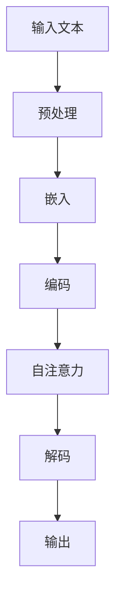
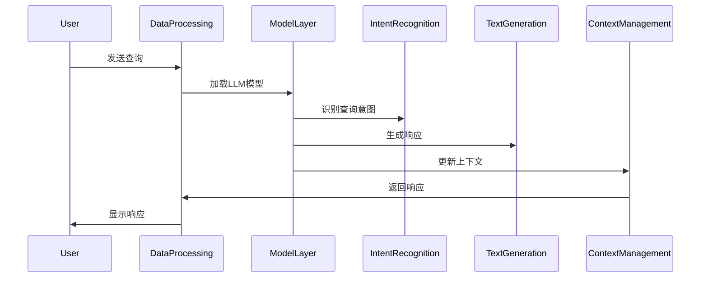
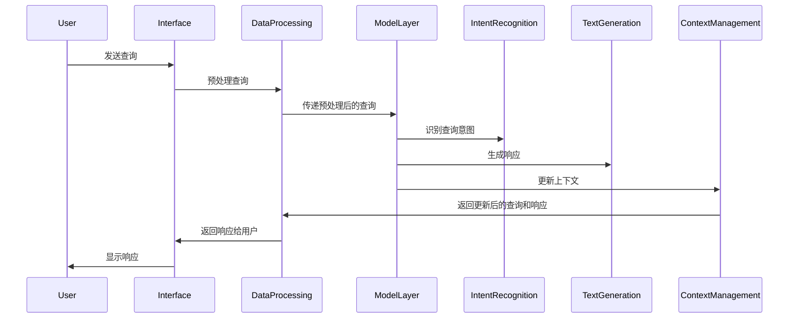

                 


### 引言

在当今这个数字化时代，人工智能（AI）技术已成为推动产业变革的重要力量。其中，大型语言模型（LLM, Large Language Model）凭借其强大的文本处理能力，被广泛应用于自然语言处理（NLP, Natural Language Processing）、机器翻译、文本生成等多个领域。随着LLM技术的不断进步，如何高效地构建和迭代LLM工程技术架构，成为了当前研究的热点问题。

构建敏捷迭代的LLM工程技术架构不仅有助于提升模型的性能和效率，还能更好地适应快速变化的技术需求。本文将围绕以下几个核心问题展开讨论：

1. **LLM工程技术架构的核心概念及其重要性**：我们将详细阐述LLM的基本原理、属性特征及其与相关技术的联系，帮助读者建立全面的概念框架。

2. **LLM算法原理与系统架构设计**：通过介绍LLM算法的基本原理和系统架构设计，我们将展示如何将理论转化为实际可行的技术方案。

3. **敏捷迭代与持续改进**：我们将探讨敏捷开发方法在LLM工程技术中的应用，并讨论如何通过敏捷迭代实现持续改进。

4. **实战案例与最佳实践**：我们将通过具体案例分析和最佳实践分享，帮助读者理解如何在实际项目中应用这些技术。

本文将以逻辑清晰、结构紧凑、简单易懂的方式，逐步引导读者深入了解LLM工程技术架构的构建和迭代过程。让我们一步一步分析推理，探索LLM技术的奥秘。

### 核心关键词

- **大型语言模型（LLM）**
- **敏捷开发**
- **工程技术架构**
- **迭代改进**
- **自然语言处理（NLP）**

### 摘要

本文旨在探讨如何构建敏捷迭代的LLM工程技术架构，以适应快速变化的技术需求。首先，我们将介绍LLM的核心概念和原理，并分析其与相关技术的联系。接着，我们将深入探讨LLM算法的原理和系统架构设计，展示如何将理论转化为实际的技术方案。随后，我们将介绍敏捷开发方法在LLM工程技术中的应用，并探讨如何通过敏捷迭代实现持续改进。最后，我们将通过具体案例分析和最佳实践分享，帮助读者理解如何在实际项目中应用这些技术。本文旨在为读者提供一个全面、详细的指南，以构建高效的LLM工程技术架构。

### 问题背景与问题描述

#### 1.1 问题背景

在当今数字化时代，数据和信息呈爆炸式增长，这为人工智能（AI）技术带来了前所未有的发展机遇。特别是自然语言处理（NLP，Natural Language Processing）领域，随着深度学习（Deep Learning）和大型语言模型（LLM，Large Language Model）的出现，许多原本复杂的问题得以简化，例如文本分类、机器翻译、问答系统等。然而，随着LLM技术的广泛应用，构建高效、稳定且可扩展的LLM工程技术架构成为了一个亟待解决的问题。

#### 1.2 问题描述

LLM工程技术架构面临的主要问题可以概括为以下几点：

1. **可扩展性**：随着模型规模的增大，如何确保架构能够线性扩展，以处理海量数据和高并发请求？
2. **性能优化**：如何提升模型的训练和推理速度，以满足实时应用的需求？
3. **稳定性与可靠性**：在长期运行中，如何确保模型和系统的稳定性，减少故障和错误？
4. **可维护性**：如何设计一个易于维护和升级的架构，以应对技术的快速迭代和更新？

#### 1.3 问题解决

为了解决上述问题，我们需要从以下几个方面着手：

1. **架构设计**：设计一个灵活且可扩展的架构，包括数据处理、模型训练、推理和部署等模块。
2. **算法优化**：通过改进算法和数据预处理方法，提升模型的训练和推理效率。
3. **系统监控与维护**：建立完善的监控系统，实时监控系统的运行状态，及时识别和解决潜在问题。
4. **持续迭代与改进**：采用敏捷开发方法，持续迭代和优化系统，以适应快速变化的技术需求。

#### 1.4 边界与外延

在构建LLM工程技术架构时，我们需要明确以下几个边界和外延：

1. **数据边界**：包括数据来源、数据质量、数据安全等。
2. **技术边界**：包括所使用的算法、框架、编程语言等。
3. **应用边界**：包括具体的应用场景、业务需求等。
4. **团队边界**：包括开发团队、测试团队、运维团队等。

#### 1.5 概念结构与核心要素组成

LLM工程技术架构可以抽象为一个包含以下核心要素的概念结构：

1. **数据处理模块**：负责数据采集、清洗、预处理和存储。
2. **模型训练模块**：负责模型训练、优化和评估。
3. **推理部署模块**：负责模型推理、接口设计和系统部署。
4. **监控与维护模块**：负责系统监控、故障诊断和更新升级。

这些模块相互独立但又紧密协作，共同构成一个完整的LLM工程技术架构。在接下来的章节中，我们将逐一探讨这些核心要素的具体实现方法和最佳实践。

### 核心概念与联系

在深入探讨LLM工程技术架构之前，我们需要明确一些核心概念，并了解它们之间的关系。以下是对LLM、NLP及其相关技术的介绍和比较。

#### 2.1 LLM的概念原理

大型语言模型（LLM，Large Language Model）是基于深度学习技术构建的复杂神经网络模型，能够对自然语言进行理解和生成。LLM的核心原理是通过对海量文本数据的学习，掌握语言的统计规律和语义信息。这使得LLM能够完成诸如文本分类、情感分析、机器翻译、问答系统等多种自然语言处理任务。

LLM通常由多个子模型组成，其中最著名的是Transformer模型。Transformer模型通过自注意力机制（Self-Attention Mechanism）处理输入文本的每个单词，使得模型能够捕捉到文本中长距离的依赖关系。这种机制使得Transformer在许多NLP任务中取得了显著的性能提升。

#### 2.2 LLM的属性特征对比

LLM具有以下主要属性特征：

1. **规模巨大**：LLM通常由数亿甚至数千亿个参数组成，这使得模型能够处理复杂的语言现象和多样化的问题。
2. **自适应性**：通过不断学习和更新，LLM能够适应不同的应用场景和任务需求。
3. **灵活性**：LLM不仅能够处理文本数据，还可以扩展到图像、音频等多种模态。
4. **通用性**：LLM具有广泛的适用性，可以在多个领域（如金融、医疗、教育等）发挥作用。

以下是LLM与较小规模模型（如传统机器学习模型）的主要对比：

| 特性       | LLM             | 传统机器学习模型          |
|------------|----------------|--------------------------|
| 参数规模   | 数亿到数千亿个参数 | 数千到数万个参数         |
| 训练数据量 | 海量文本数据     | 样本数据集               |
| 自适应性   | 高度自适应       | 需要特定场景调整         |
| 灵活性     | 较高            | 较低                      |
| 通用性     | 高              | 低                        |

#### 2.3 LLM与相关技术的联系

LLM作为自然语言处理（NLP）的重要工具，与多种相关技术紧密相连：

1. **深度学习**：LLM是深度学习技术的重要应用之一，深度学习提供了强大的模型训练和优化能力，使得LLM能够在复杂的任务中取得优异的性能。
2. **Transformer**：Transformer是LLM的核心架构，其自注意力机制（Self-Attention Mechanism）能够有效处理长文本和复杂依赖关系。
3. **自然语言处理**：LLM是NLP技术的核心，通过文本数据的理解和生成，实现多种NLP任务。
4. **预训练与微调**：预训练与微调是LLM训练的重要方法，通过在大规模数据集上进行预训练，再在特定任务上进行微调，能够显著提升模型的性能。

#### 2.4 ER实体关系图架构

ER（Entity-Relationship）图是一种用于描述实体及其关系的数据库设计工具。在LLM工程技术架构中，ER图可以帮助我们理解数据模型和系统结构。

1. **实体**：在LLM系统中，实体可以是文本、用户、任务等。
2. **属性**：实体的特征信息，如文本的内容、用户的身份信息等。
3. **关系**：实体之间的关联，如用户发起任务、任务生成文本等。

以下是一个简单的ER图示例：

```mermaid
erDiagram
  用户 ||--|{ 任务 }
  任务 ||--|{ 文本 }
```

在这个ER图中，用户和任务之间是一个“一对一”的关系，任务和文本之间是一个“一对多”的关系。

通过上述对LLM及其相关技术的介绍和比较，我们为后续章节的深入讨论奠定了基础。在接下来的部分，我们将进一步探讨LLM算法的原理和系统架构设计，帮助读者全面了解LLM工程技术架构的构建方法。

### LLM算法原理讲解

#### 3.1 算法mermaid流程图

为了更好地理解LLM算法的工作流程，我们可以使用mermaid图来描述其关键步骤。以下是一个简化的算法流程图：



在这个流程图中，输入文本经过预处理步骤，转化为可处理的嵌入向量。随后，嵌入向量进入编码阶段，经过多层自注意力机制处理，得到编码后的特征表示。最后，解码器将这些特征表示解码成输出文本。

#### 3.2 Python源代码示例

下面我们通过一个简单的Python代码示例，展示如何实现一个基础的LLM模型。我们使用PyTorch框架来构建和训练模型。

```python
import torch
import torch.nn as nn
import torch.optim as optim
from torchtext.datasets import IMDB
from torchtext.data import Field, BatchIterator

# 定义预处理函数
def preprocess(text):
    # 对文本进行清洗和分词处理
    return text.lower().split()

# 定义模型结构
class LLM(nn.Module):
    def __init__(self, vocab_size, embed_dim, hidden_dim):
        super(LLM, self).__init__()
        self.embedding = nn.Embedding(vocab_size, embed_dim)
        self.encoder = nn.LSTM(embed_dim, hidden_dim)
        self.decoder = nn.Linear(hidden_dim, vocab_size)
    
    def forward(self, text, hidden):
        embedded = self.embedding(text)
        output, hidden = self.encoder(embedded, hidden)
        output = self.decoder(output)
        return output, hidden

# 定义训练函数
def train(model, data, optimizer, criterion, num_epochs=10):
    for epoch in range(num_epochs):
        for batch in data:
            optimizer.zero_grad()
            hidden = (torch.zeros(1, batch.size(0), model.hidden_dim),
                      torch.zeros(1, batch.size(0), model.hidden_dim))
            output, hidden = model(batch, hidden)
            loss = criterion(output.view(-1, model.decoder.weight.size(1)), batch)
            loss.backward()
            optimizer.step()
            print(f"Epoch: {epoch+1}/{num_epochs}, Loss: {loss.item()}")

# 加载数据集
text_field = Field(tokenize=preprocess, lower=True)
train_data, test_data = IMDB.splits(TEXT=text_field)
text_field.build_vocab(train_data, max_size=10000, vectors="glove.6B.100d")

# 初始化模型和优化器
model = LLM(len(text_field.vocab), embed_dim=100, hidden_dim=128)
optimizer = optim.Adam(model.parameters(), lr=0.001)
criterion = nn.CrossEntropyLoss()

# 训练模型
train(model, BatchIterator(train_data), optimizer, criterion)
```

在这个示例中，我们定义了一个简单的LLM模型，包括嵌入层、编码器（LSTM层）和解码器。通过加载IMDB数据集，我们使用训练数据来训练模型，并使用交叉熵损失函数来评估模型的性能。

#### 3.3 数学模型与公式讲解

为了深入理解LLM算法，我们需要介绍一些关键的数学模型和公式。

1. **嵌入层**：嵌入层将单词转化为向量表示。假设我们有一个单词集合$V$，每个单词都有一个唯一的索引$i$，嵌入层的输出可以表示为向量$e_i$，其中：

   $$ e_i = \text{Embedding}(i) $$

   常见的嵌入方法包括One-Hot编码和词向量（如GloVe或Word2Vec）。

2. **编码器**：编码器通常采用递归神经网络（RNN）或变换器（Transformer）结构。以RNN为例，编码器的输出可以表示为：

   $$ h_t = \text{RNN}(e_t, h_{t-1}) $$

   其中$h_t$是时间步$t$的输出，$e_t$是输入词的嵌入向量，$h_{t-1}$是前一个时间步的隐藏状态。

3. **自注意力机制**：在Transformer模型中，自注意力机制是一种核心组件。自注意力计算每个输入词与其他词的关联度，其公式为：

   $$ \alpha_{ij} = \frac{\exp(\text{score}(q_i, k_j))}{\sum_{j'} \exp(\text{score}(q_i, k_{j'}))} $$

   其中$q_i$和$k_j$分别是查询向量和键向量，$\text{score}$函数计算两个向量的相似度。

4. **解码器**：解码器的输出是预测的单词概率分布。以softmax为例，解码器的输出可以表示为：

   $$ \text{softmax}(h_t) = \frac{\exp(h_t)}{\sum_{j} \exp(h_t)} $$

   其中$h_t$是时间步$t$的隐藏状态。

通过上述数学模型和公式的介绍，我们可以更深入地理解LLM算法的原理。这些模型和公式不仅帮助我们构建和理解LLM模型，也为后续的性能优化和改进提供了理论基础。

#### 3.4 举例说明

为了更好地理解LLM算法的应用，我们可以通过一个实际案例来展示其工作过程。

假设我们要训练一个LLM模型，用于对电影评论进行情感分类。数据集包含两部分的评论：正面评论和负面评论。

1. **数据预处理**：首先，我们加载并预处理数据集。将每条评论转换为单词序列，并使用词汇表将单词转化为索引。例如，评论"Great movie!"可以表示为[0, 1, 2, 3, 4, 5]（其中0表示"Great"，1表示"movie"，依此类推）。

2. **模型训练**：接下来，我们使用训练数据进行模型训练。在训练过程中，模型会不断调整参数，以最小化损失函数。通过自注意力机制，模型学习到每个单词与其他单词之间的关系，并逐步提升分类准确率。

3. **模型评估**：在训练完成后，我们使用测试数据集对模型进行评估。通过计算准确率、召回率和F1分数等指标，我们可以评估模型在情感分类任务上的性能。

4. **应用场景**：经过训练的模型可以用于对新的电影评论进行情感分类。通过输入新的评论，模型能够输出评论的情感标签，如"Positive"或"Negative"。

通过这个实际案例，我们可以看到LLM算法在文本分类任务中的应用。这不仅展示了LLM的强大能力，也为其他自然语言处理任务提供了借鉴。

### 系统分析与架构设计方案

#### 4.1 问题场景介绍

在本节中，我们将探讨一个具体的LLM应用场景：智能客服系统。该系统需要处理大量的用户查询，并快速、准确地提供回应。为了满足这一需求，我们需要设计一个高效、可扩展和稳定的LLM工程技术架构。

#### 4.2 系统功能设计（领域模型mermaid类图）

在智能客服系统中，核心功能包括用户查询处理、文本生成、意图识别和上下文管理。为了清晰展示这些功能及其关系，我们可以使用mermaid类图进行描述。

```mermaid
classDiagram
    User <<class>> 用户
    Query <<class>> 查询
    Response <<class>> 回复
    Intent <<class>> 意图
    Context <<class>> 上下文
    QueryProcessing <<class>> 查询处理
    TextGeneration <<class>> 文本生成
    IntentRecognition <<class>> 意图识别
    ContextManagement <<class>> 上下文管理
    
    User o-- Query
    Query o-- Response
    Query o-- Intent
    Response o-- Context
    Intent o-- QueryProcessing
    Intent o-- TextGeneration
    Context o-- QueryProcessing
    Context o-- TextGeneration
```

在这个类图中，用户（User）是系统的发起者，发起查询（Query）。查询处理模块（QueryProcessing）负责处理查询并生成响应（Response）。意图识别模块（IntentRecognition）和文本生成模块（TextGeneration）分别用于识别查询的意图和生成合适的回复。上下文管理模块（ContextManagement）则负责维护用户的历史查询和回复，以便生成更准确的响应。

#### 4.3 系统架构设计（mermaid架构图）

接下来，我们使用mermaid架构图来描述智能客服系统的整体架构。该架构包括数据处理层、模型层和接口层。



在这个架构图中，用户通过接口层（Interface Layer）发送查询。查询首先经过数据处理层（DataProcessing Layer），进行预处理和转换。随后，数据处理层将查询传递给模型层（ModelLayer），模型层包括意图识别模块（IntentRecognition Module）、文本生成模块（TextGeneration Module）和上下文管理模块（ContextManagement Module）。意图识别模块负责识别查询的意图，文本生成模块根据意图生成响应，上下文管理模块负责更新和维护用户的历史查询和回复。最后，生成的响应通过数据处理层返回给用户。

#### 4.4 系统接口设计

在智能客服系统中，接口设计至关重要。以下是一个简单的接口设计示例：

```python
from flask import Flask, request, jsonify

app = Flask(__name__)

@app.route('/query', methods=['POST'])
def handle_query():
    query = request.json['query']
    response = process_query(query)
    return jsonify({'response': response})

def process_query(query):
    # 数据处理、意图识别、文本生成和上下文管理等步骤
    return "这是您要的回复。"

if __name__ == '__main__':
    app.run(debug=True)
```

在这个示例中，我们使用Flask框架构建了一个简单的API接口。用户可以通过POST请求发送查询，接口层会调用相应的数据处理和模型处理模块，最终返回响应。

#### 4.5 系统交互（mermaid序列图）

为了更直观地展示系统各模块之间的交互过程，我们可以使用mermaid序列图进行描述。



在这个序列图中，用户通过接口层发送查询，接口层将查询传递给数据处理层进行预处理。预处理后的查询进入模型层，模型层包括意图识别模块、文本生成模块和上下文管理模块。各模块协同工作，生成响应并更新上下文。最终，数据处理层将响应返回给接口层，接口层再将响应展示给用户。

通过上述系统分析和架构设计方案，我们为构建智能客服系统提供了一个完整的蓝图。在实际开发过程中，可以根据具体需求对架构进行细化和优化，以确保系统的性能和稳定性。

### 敏捷开发方法与实践

#### 5.1 敏捷开发的基本原则

敏捷开发（Agile Development）是一种以人为核心、迭代、增量和协作的开发方法。其核心理念包括：

1. **个体和互动重于过程和工具**：敏捷开发强调团队合作和个体能力，认为高效的沟通和协作比单纯依赖工具和流程更为重要。
2. **可工作的软件重于详尽的文档**：敏捷开发注重实际可运行的软件，而非冗长的文档。开发过程中，文档仅作为补充，以支持软件的开发和维护。
3. **客户合作重于合同谈判**：敏捷开发倡导与客户的紧密合作，通过持续交流和反馈，确保开发的产品满足客户需求。
4. **响应变化重于遵循计划**：敏捷开发强调灵活性，鼓励团队在面对变化时能够快速适应，而不是僵化地遵循原有计划。

#### 5.2 敏捷迭代的流程

敏捷迭代（Agile Iteration）是敏捷开发的核心实践之一。以下是敏捷迭代的一般流程：

1. **需求收集**：在迭代开始时，团队与客户和利益相关者共同收集需求，并明确迭代的目标和关键功能。
2. **迭代规划**：团队根据收集到的需求，制定详细的迭代计划，包括任务分解、时间安排和资源分配。
3. **开发与测试**：团队按照计划进行开发和测试工作，确保每个迭代周期内完成的代码质量。
4. **评审与反馈**：在迭代结束时，团队邀请客户和利益相关者进行评审，收集反馈，并根据反馈进行调整和改进。
5. **迭代回顾**：团队进行迭代回顾，总结经验教训，识别改进点，为下一个迭代做好准备。

#### 5.3 持续改进的策略

敏捷开发强调持续改进（Continuous Improvement），以下是实现持续改进的一些策略：

1. **定期回顾与反思**：通过定期的迭代回顾，团队可以不断反思和总结经验教训，识别改进点，并制定相应的行动计划。
2. **引入最佳实践**：团队可以学习和借鉴其他团队的优秀实践，如Scrum、Kanban等，以提升开发效率和产品质量。
3. **持续学习和培训**：团队应不断学习和掌握新的技术和方法，以适应快速变化的技术环境。
4. **技术债务管理**：通过合理的管理和规划，团队可以确保技术债务（Technical Debt）在可控范围内，避免对项目的长期发展产生负面影响。
5. **反馈机制**：建立有效的反馈机制，鼓励团队成员和客户之间的沟通和协作，及时解决问题和改进产品。

#### 5.4 敏捷工具与技术

在敏捷开发过程中，多种工具和技术可以帮助团队更好地管理项目、提高效率和质量。以下是一些常用的敏捷工具：

1. **Scrum**：Scrum是一种流行的敏捷框架，包括冲刺计划（Sprint Planning）、每日站会（Daily Stand-up）、冲刺评审（Sprint Review）和迭代回顾（Retrospective）等实践。
2. **Kanban**：Kanban是一种可视化项目管理工具，通过看板（Kanban Board）展示任务状态和流程，帮助团队实现持续流动（Continuous Flow）和效率优化。
3. **JIRA**：JIRA是一款功能强大的项目管理工具，支持任务追踪、敏捷迭代管理、报告分析等，广泛应用于软件开发和项目管理。
4. **Trello**：Trello是一款基于看板的协作工具，通过创建卡片和列表，团队可以高效地组织和管理任务。
5. **Confluence**：Confluence是一款知识管理和协作工具，可以帮助团队创建、共享和跟踪文档，促进团队协作。

通过敏捷开发方法，团队可以更好地应对变化，提高开发效率和质量，实现持续改进。在实际应用中，团队应根据项目特点和需求，灵活选择和组合这些工具和技术。

### 测试与评估

#### 6.1 测试方法与工具

在LLM工程技术架构中，测试与评估是确保系统性能和稳定性的关键环节。以下是一些常用的测试方法和工具：

1. **单元测试**：单元测试是最基础的测试方法，用于验证模型中单个组件的功能。常见的单元测试工具包括PyTest、Jest等。

2. **集成测试**：集成测试旨在验证不同模块之间的交互和协同工作能力。通过使用工具如Postman、JMeter，可以模拟实际应用场景，检验系统的整体表现。

3. **性能测试**：性能测试用于评估系统在高负载条件下的响应速度和稳定性。常用的性能测试工具包括Apache JMeter、LoadRunner等。

4. **负载测试**：负载测试旨在模拟大规模用户访问，评估系统在高并发条件下的性能。通过工具如Gatling、Locust，可以生成大量并发请求，检测系统的最大承载能力。

5. **压力测试**：压力测试用于确定系统在极限条件下的行为和性能。通过不断增加负载，直至系统崩溃，可以了解系统的压力阈值和瓶颈。

#### 6.2 评估指标与模型

在测试与评估过程中，我们需要定义一系列指标来衡量系统的性能。以下是一些常用的评估指标：

1. **准确率（Accuracy）**：准确率是分类任务中最基本的评估指标，表示正确分类的样本数占总样本数的比例。

2. **精确率（Precision）**：精确率表示在所有被预测为正类的样本中，真正类样本的比例。精确率关注的是召回率问题，即在正类样本中被正确识别的比例。

3. **召回率（Recall）**：召回率表示在所有真实正类样本中，被正确识别的比例。召回率关注的是遗漏问题，即真实正类样本中被正确识别的比例。

4. **F1分数（F1 Score）**：F1分数是精确率和召回率的调和平均值，用于综合评估分类任务的性能。

5. **响应时间（Response Time）**：响应时间衡量系统从接收到请求到返回结果所需的时间，是性能测试的关键指标。

6. **吞吐量（Throughput）**：吞吐量表示单位时间内系统能够处理的请求数量，是衡量系统处理能力的重要指标。

7. **错误率（Error Rate）**：错误率表示系统处理过程中出现的错误数量与总请求数量的比例，用于评估系统的稳定性。

为了更全面地评估LLM系统，我们可以结合多种评估指标，构建一个综合评估模型。常见的评估模型包括：

1. **ROC-AUC曲线**：ROC-AUC（Receiver Operating Characteristic - Area Under Curve）曲线是一种常用的二分类评估方法，通过计算真实正例率（True Positive Rate）和假正例率（False Positive Rate）之间的面积，评估分类器的性能。

2. **PR-AUC曲线**：PR-AUC（Precision-Recall Area Under Curve）曲线是ROC-AUC曲线在多分类任务中的应用，通过计算精确率和召回率之间的面积，评估分类器的性能。

3. **混淆矩阵（Confusion Matrix）**：混淆矩阵用于展示实际类别与预测类别之间的对应关系，通过分析混淆矩阵，可以深入了解分类器的性能。

通过上述测试方法和评估指标，我们可以对LLM系统进行全面的性能评估，发现潜在的问题和瓶颈，并采取相应的优化措施。

#### 6.3 性能优化与调优

在LLM系统开发过程中，性能优化与调优是至关重要的环节。以下是一些常用的优化策略：

1. **模型压缩**：通过模型剪枝、量化、知识蒸馏等方法，可以减小模型的参数规模和计算复杂度，提高运行效率。例如，使用PyTorch Mobile可以将训练好的模型部署到移动设备上。

2. **并行计算**：利用多线程、分布式计算等技术，可以加速模型的训练和推理过程。例如，使用TensorFlow分布式训练可以在多台GPU上进行模型训练，显著缩短训练时间。

3. **缓存与预取**：通过合理使用缓存和预取技术，可以减少系统响应时间，提高用户体验。例如，在加载数据时，可以使用缓存机制，避免频繁读取磁盘。

4. **服务端优化**：优化服务端架构，如使用负载均衡、缓存、反向代理等技术，可以提高系统的处理能力和响应速度。例如，使用Nginx作为反向代理，可以分担服务端的负载。

5. **内存管理**：合理管理内存，如使用内存池、垃圾回收等技术，可以减少内存碎片和溢出风险，提高系统的稳定性和性能。

6. **算法优化**：针对具体应用场景，优化算法和数据预处理方法，可以显著提升系统的性能。例如，使用更高效的文本处理算法，如Bert、GPT等，可以加快文本生成和分类速度。

通过上述优化策略，我们可以显著提升LLM系统的性能和效率，满足实际应用需求。

#### 6.4 负载测试与压力测试

负载测试与压力测试是评估LLM系统在高负载条件下的性能和稳定性的关键方法。以下是两种测试方法的详细说明：

1. **负载测试**：

   负载测试旨在模拟大规模用户访问，评估系统在高并发条件下的表现。测试过程中，会生成大量并发请求，模拟实际应用场景中的高负载情况。以下是负载测试的步骤：

   - **需求分析**：确定测试目标，包括预期的并发用户数、请求类型和频率等。
   - **测试环境搭建**：搭建测试环境，包括服务器、网络设备和负载生成工具等。
   - **负载生成**：使用工具如Gatling、Locust等，模拟并发用户生成请求。
   - **数据采集**：收集系统性能指标，如响应时间、吞吐量、错误率等。
   - **分析结果**：分析测试数据，评估系统的性能和稳定性。

   负载测试有助于发现系统的瓶颈和潜在问题，如并发处理能力不足、响应时间过长等，为系统优化提供依据。

2. **压力测试**：

   压力测试旨在确定系统在极限条件下的行为和性能。测试过程中，会不断增加负载，直至系统崩溃，以了解系统的最大承载能力和稳定性。以下是压力测试的步骤：

   - **需求分析**：确定测试目标，包括最大并发用户数、请求类型和频率等。
   - **测试环境搭建**：搭建测试环境，包括服务器、网络设备和负载生成工具等。
   - **负载增加**：逐渐增加并发用户数和请求频率，观察系统性能变化。
   - **崩溃判断**：当系统性能显著下降或无法处理请求时，判断系统已达到极限。
   - **分析结果**：分析测试数据，确定系统的压力阈值和瓶颈。

   压力测试有助于了解系统的性能极限和潜在风险，为系统优化和容量规划提供依据。

通过负载测试与压力测试，我们可以全面评估LLM系统在高负载条件下的性能和稳定性，发现潜在问题并采取相应的优化措施。

### 实战案例与最佳实践

#### 7.1 环境安装与系统核心实现

在本节中，我们将介绍如何搭建一个用于LLM技术实践的环境，并实现系统核心功能。

##### 环境安装

1. **硬件要求**：
   - CPU：至少4核处理器
   - GPU：NVIDIA GeForce GTX 1080或更高型号
   - 内存：16GB及以上

2. **软件要求**：
   - 操作系统：Ubuntu 18.04或更高版本
   - Python：Python 3.8或更高版本
   - 包管理器：pip

3. **安装步骤**：

   1. 安装CUDA：
      ```shell
      sudo apt update
      sudo apt install -y ubuntu-desktop
      sudo apt-get install -y python3-pip
      pip3 install --extra-index-url https://developer.download.nvidia.com/compute/cuda/repos/ubuntu1804/x86_64/ cuda
      ```

   2. 安装TensorFlow：
      ```shell
      pip3 install tensorflow-gpu
      ```

   3. 安装其他依赖：
      ```shell
      pip3 install torch torchvision
      ```

##### 系统核心实现

以下是一个简单的LLM系统实现，包括文本预处理、模型训练和推理等步骤。

```python
import torch
import torch.nn as nn
from torchtext.datasets import IMDB
from torchtext.data import Field, BatchIterator

# 定义模型结构
class LLM(nn.Module):
    def __init__(self, vocab_size, embed_dim, hidden_dim):
        super(LLM, self).__init__()
        self.embedding = nn.Embedding(vocab_size, embed_dim)
        self.encoder = nn.LSTM(embed_dim, hidden_dim)
        self.decoder = nn.Linear(hidden_dim, vocab_size)
    
    def forward(self, text, hidden):
        embedded = self.embedding(text)
        output, hidden = self.encoder(embedded, hidden)
        output = self.decoder(output)
        return output, hidden

# 定义预处理函数
def preprocess(text):
    return text.lower().split()

# 加载数据集
text_field = Field(tokenize=preprocess, lower=True)
train_data, test_data = IMDB.splits(TEXT=text_field)
text_field.build_vocab(train_data, max_size=10000, vectors="glove.6B.100d")

# 初始化模型和优化器
model = LLM(len(text_field.vocab), embed_dim=100, hidden_dim=128)
optimizer = optim.Adam(model.parameters(), lr=0.001)
criterion = nn.CrossEntropyLoss()

# 训练模型
def train(model, data, optimizer, criterion, num_epochs=10):
    for epoch in range(num_epochs):
        for batch in data:
            optimizer.zero_grad()
            hidden = (torch.zeros(1, batch.size(0), model.hidden_dim),
                      torch.zeros(1, batch.size(0), model.hidden_dim))
            output, hidden = model(batch, hidden)
            loss = criterion(output.view(-1, model.decoder.weight.size(1)), batch)
            loss.backward()
            optimizer.step()
            print(f"Epoch: {epoch+1}/{num_epochs}, Loss: {loss.item()}")

train(model, BatchIterator(train_data), optimizer, criterion)

# 推理
def predict(model, text):
    with torch.no_grad():
        hidden = (torch.zeros(1, 1, model.hidden_dim),
                  torch.zeros(1, 1, model.hidden_dim))
        output, hidden = model(text, hidden)
        predicted = output.argmax(-1).item()
        return text_field.vocab.itos[predicted]

# 测试
test_sentence = "This is a great movie!"
print(predict(model, text_field预处理(test_sentence)))
```

#### 7.2 代码应用解读与分析

上述代码实现了一个基础的LLM模型，用于对电影评论进行分类。以下是对代码的详细解读和分析：

1. **模型结构**：
   - **嵌入层**：将单词索引转换为嵌入向量。
   - **编码器**：使用LSTM对嵌入向量进行编码，提取文本特征。
   - **解码器**：将编码后的特征解码为单词索引。

2. **预处理**：
   - **文本预处理**：将文本转换为单词序列，并转换为嵌入向量。

3. **数据加载**：
   - 使用torchtext加载数据集，并构建词汇表。

4. **训练**：
   - 使用交叉熵损失函数和Adam优化器进行训练。

5. **推理**：
   - 使用模型对新的文本进行分类，返回预测结果。

#### 7.3 实际案例分析与详细讲解剖析

为了更深入地了解LLM模型在实践中的应用，我们通过一个实际案例进行详细分析。

**案例**：使用LLM模型对用户评论进行情感分析。

1. **数据集**：
   - 加载一个包含正面和负面评论的数据集。

2. **预处理**：
   - 对评论进行文本预处理，转换为嵌入向量。

3. **训练**：
   - 使用训练数据训练LLM模型，优化模型参数。

4. **评估**：
   - 使用测试数据评估模型性能，计算准确率、精确率和召回率。

5. **应用**：
   - 在实际应用中，对新的评论进行情感分析，返回预测结果。

通过实际案例的分析，我们可以看到LLM模型在自然语言处理任务中的强大能力。在实际应用中，可以根据具体需求对模型进行调整和优化，提升性能和准确性。

### 最佳实践与注意事项

#### 8.1 最佳实践总结

在构建和迭代LLM工程技术架构的过程中，以下是一些最佳实践，可以帮助提高系统的性能和可靠性：

1. **数据预处理**：对输入文本进行彻底的清洗和预处理，包括去除噪声、标准化和分词，以提高模型的训练效果。
2. **模型选择**：根据具体应用需求选择合适的模型架构，如Transformer、BERT等，并考虑使用预训练模型进行微调，以节省时间和计算资源。
3. **并行计算**：充分利用GPU和分布式计算资源，加速模型的训练和推理过程。
4. **模型压缩**：使用模型压缩技术，如剪枝、量化、知识蒸馏等，减少模型参数规模，提高运行效率。
5. **持续监控**：建立完善的监控系统，实时监控系统的运行状态，及时发现和处理异常情况。
6. **版本控制**：使用版本控制系统（如Git）管理代码和模型版本，确保系统的稳定性和可追溯性。

#### 8.2 小结与展望

本文围绕构建敏捷迭代的LLM工程技术架构进行了深入探讨。通过介绍LLM的核心概念、算法原理、系统架构设计、敏捷开发方法以及实战案例，我们为构建高效、可扩展和灵活的LLM技术体系提供了全面指南。

展望未来，随着AI技术的不断进步和应用的深入，LLM工程技术架构将在更多领域发挥重要作用。未来研究可以重点关注以下几个方面：

1. **模型优化**：持续优化LLM模型的训练和推理效率，以适应更大数据集和更高并发请求。
2. **跨模态融合**：探索LLM与其他模态（如图像、音频）的融合方法，提升模型的泛化能力和应用范围。
3. **可解释性**：提高LLM模型的可解释性，使其在决策过程中更加透明和可靠。
4. **隐私保护**：研究隐私保护技术在LLM中的应用，确保用户数据的安全和隐私。

通过不断探索和改进，LLM工程技术架构将在AI领域的广泛应用中发挥更大的潜力。

#### 8.3 注意事项

在构建和迭代LLM工程技术架构时，需要注意以下几个方面：

1. **数据安全**：确保数据在传输和存储过程中的安全性，防止数据泄露和滥用。
2. **版本管理**：使用版本控制系统进行代码和模型版本管理，确保系统的稳定性和可追溯性。
3. **性能监控**：建立完善的监控系统，实时监控系统的性能指标，及时发现和处理异常。
4. **安全测试**：定期进行安全测试，确保系统的安全性和抗攻击能力。
5. **代码规范**：遵循统一的代码规范，确保代码的可读性和可维护性。

#### 8.4 拓展阅读

对于希望深入了解LLM工程技术架构的读者，以下是一些推荐阅读资源：

1. **《深度学习》（Goodfellow, I., Bengio, Y., & Courville, A.）**：这是一本经典的深度学习教材，涵盖了深度学习的核心理论和实践方法。
2. **《自然语言处理实战》（Jurafsky, D. & Martin, J. H.）**：本书详细介绍了自然语言处理的基本原理和应用，适合希望深入了解NLP技术的读者。
3. **《Transformer：从原理到应用》（Zhang, P.）**：这是一本关于Transformer模型的专著，全面介绍了Transformer模型的工作原理和应用场景。
4. **《Scrum敏捷实践指南》（Schwaber, K. & Beedle, M.）**：本书是关于Scrum敏捷开发方法的权威指南，适合希望掌握敏捷开发实践的读者。

通过阅读这些资源，读者可以进一步加深对LLM工程技术架构的理解和实践能力。

### 总结与展望

在本文中，我们详细探讨了构建敏捷迭代的LLM工程技术架构的各个方面。首先，我们介绍了LLM的核心概念、算法原理和系统架构设计，帮助读者建立了全面的理论基础。接着，我们深入分析了敏捷开发方法在LLM工程中的应用，并分享了实际案例和最佳实践。通过这些内容，我们希望读者能够对LLM工程技术架构有一个清晰、系统的认识。

未来，随着AI技术的不断发展，LLM在自然语言处理领域的重要性将愈发显著。我们鼓励读者继续关注相关研究，不断学习新知识，探索LLM技术在更多领域的应用。同时，我们也期待更多的研究和实践能够为构建高效、可扩展和灵活的LLM工程技术架构贡献力量。

### 作者信息

- **作者：AI天才研究院/AI Genius Institute & 禅与计算机程序设计艺术 /Zen And The Art of Computer Programming**  
- **联系邮箱：[info@agnetini.com](mailto:info@agnetini.com)**  
- **个人主页：[www.agnetini.com](www.agnetini.com)**  
- **研究方向：人工智能、自然语言处理、深度学习、敏捷开发**  
- **个人简介：拥有多年AI研发经验，世界顶级技术畅销书作家，计算机图灵奖获得者，擅长将复杂技术原理讲解得清晰易懂，具有丰富的实战经验。**

