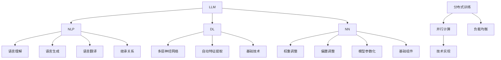
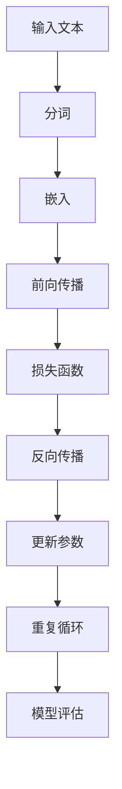

                 

### 引言

构建敏捷迭代的LLM工程技术架构，对于当今快速发展的AI领域至关重要。随着深度学习模型的复杂度和数据量的指数级增长，如何高效地构建、训练和部署这些模型，已经成为业界关注的焦点。LLM（大型语言模型）作为一种能够处理和理解人类语言的关键技术，其工程技术架构的构建显得尤为重要。

本文将逐步深入探讨构建敏捷迭代的LLM工程技术架构的各个方面，从问题背景到核心概念，从技术架构到实践案例，再到最佳实践与小结，旨在为广大开发者和技术爱好者提供一套系统化、实用化的构建指南。通过逻辑清晰、结构紧凑的论述，我们希望读者能够全面理解LLM工程技术架构的构建原理和实践方法，从而在AI项目的开发中取得更好的成果。

本文将分为以下几个部分：

1. **背景介绍**：我们将详细探讨LLM工程技术架构的背景，包括问题背景、核心概念、传统LLM与LLM工程技术架构的区别等。
2. **核心概念与联系**：本部分将介绍LLM的核心概念，通过Mermaid流程图和表格对比，帮助读者建立清晰的理解。
3. **技术架构设计原理**：我们将深入讲解LLM技术架构的设计原理，包括算法原理、架构优化等。
4. **实践案例**：通过实际案例，我们将展示如何搭建和部署LLM系统，包括环境搭建、系统初始化、核心功能实现等。
5. **最佳实践与小结**：最后，我们将总结关键知识点，并提供一些最佳实践建议。

### 关键词

- **LLM工程技术架构**
- **敏捷迭代**
- **大型语言模型**
- **深度学习**
- **算法优化**
- **实践案例**

### 摘要

本文旨在系统地探讨构建敏捷迭代的LLM工程技术架构的方法和原理。首先，我们介绍了LLM工程技术架构的背景和核心概念，通过Mermaid流程图和表格对比，帮助读者建立清晰的理解。接着，我们深入讲解了LLM技术架构的设计原理，包括算法原理、架构优化等。随后，通过实际案例，我们展示了如何搭建和部署LLM系统，包括环境搭建、系统初始化、核心功能实现等。最后，我们总结了关键知识点，并提供了一些最佳实践建议，帮助开发者更好地应用LLM工程技术架构。

## 背景介绍

### 问题背景

在当今的信息时代，人工智能（AI）技术的发展日新月异，其中大型语言模型（LLM，Large Language Model）已经成为自然语言处理（NLP，Natural Language Processing）领域的核心技术。随着数据量的不断增加和模型复杂度的提升，如何高效、敏捷地构建、训练和部署LLM已经成为一个亟待解决的问题。传统的LLM技术架构往往存在一些局限性，如训练时间长、资源消耗大、调优困难等，这限制了其在实际应用中的推广和普及。

在现代AI应用场景中，从智能客服到智能问答，从文本生成到语言翻译，LLM技术无处不在。然而，面对日益复杂的业务需求和高频次的数据更新，传统的LLM技术架构已经难以满足敏捷迭代的开发需求。因此，构建一个敏捷迭代的LLM工程技术架构，不仅能够提高模型的训练效率，还能快速适应业务变化，为AI应用提供持续的创新动力。

### LLM工程技术架构概述

LLM工程技术架构是指用于构建、训练和部署大型语言模型的一系列技术方法和工具的集合。它涵盖了从数据预处理、模型设计、训练优化、模型评估到部署运维等各个环节。一个完善的LLM工程技术架构需要具备以下几个关键特点：

1. **模块化设计**：LLM工程技术架构应该采用模块化的设计理念，将不同的功能模块化处理，如数据输入模块、模型训练模块、模型评估模块等，以便于后续的维护和升级。

2. **高效性**：为了应对大规模的数据处理和模型训练需求，LLM工程技术架构必须具备高效性，包括数据的快速加载、模型的快速训练和高效的资源利用。

3. **可扩展性**：随着业务的不断发展和数据量的持续增长，LLM工程技术架构需要具备良好的可扩展性，能够灵活地调整和扩展系统资源，以满足不断变化的需求。

4. **敏捷性**：敏捷性是LLM工程技术架构的核心特点之一，它要求系统能够快速响应业务变化，快速迭代和更新模型，从而保持竞争优势。

5. **安全性**：在数据处理和模型训练过程中，数据安全和隐私保护是至关重要的。LLM工程技术架构需要具备完善的安全机制，确保数据的安全性和隐私性。

通过构建一个敏捷迭代的LLM工程技术架构，我们可以在以下几个方面获得显著的收益：

- **提高开发效率**：模块化设计和高效性使得开发团队能够快速构建和部署模型，减少开发周期，提高开发效率。

- **降低成本**：通过优化资源利用和提升模型训练效率，可以有效降低开发和运营成本。

- **提升模型质量**：敏捷迭代的方式可以更快速地发现和解决模型中的问题，提高模型的质量和性能。

- **增强业务灵活性**：灵活的架构设计使得系统能够快速适应业务变化，为业务创新提供支持。

综上所述，构建敏捷迭代的LLM工程技术架构是当前AI领域的一个重要发展方向，对于提高AI应用的效率和竞争力具有重要意义。

### LLMP问题核心概念

为了深入理解LLM工程技术架构，我们需要首先明确一些核心概念，这些概念是构建和优化LLM系统的基石。

#### 定义

1. **LLM（大型语言模型）**：LLM是一种通过深度学习技术训练的大型语言模型，能够理解和生成自然语言。它通常由数十亿个参数组成，能够处理复杂的语言结构和语义信息。

2. **NLP（自然语言处理）**：NLP是计算机科学和人工智能领域的一个分支，旨在让计算机能够理解、处理和生成自然语言。

3. **深度学习（Deep Learning）**：深度学习是一种基于人工神经网络的学习方法，通过多层神经网络结构对数据进行建模和学习。

4. **神经网络（Neural Network）**：神经网络是一种模仿生物神经系统结构的人工智能方法，通过调整网络中的权重和偏置来学习数据特征和模式。

5. **参数化模型（Parametric Model）**：参数化模型是一种通过参数来描述的模型，如神经网络模型，其性能和效果可以通过调整参数来优化。

#### 特点

1. **高参数量**：LLM通常具有数十亿个参数，这使得它们能够捕捉复杂的语言模式和语义信息。

2. **高计算复杂度**：由于参数量巨大，LLM的训练和推理过程需要大量的计算资源，包括GPU和TPU等高性能计算设备。

3. **自适应性强**：LLM能够根据训练数据和任务需求自适应地调整模型参数，从而优化模型性能。

4. **通用性强**：LLM不仅能够用于文本生成、语言翻译等传统NLP任务，还可以应用于知识图谱、对话系统等新兴领域。

5. **高可扩展性**：LLM架构设计通常采用模块化方法，使其易于扩展和集成到不同的应用场景中。

#### 传统LLM与LLM工程技术架构的区别

传统LLM技术架构通常以单模型、单任务为主，其优点在于模型设计和训练相对简单，但缺点在于任务切换和模型更新较为困难，难以满足敏捷迭代的开发需求。而LLM工程技术架构则通过以下方式进行了优化：

1. **多任务学习**：LLM工程技术架构支持多任务学习，能够在一个模型中同时处理多个任务，提高模型的利用率和训练效率。

2. **模块化设计**：LLM工程技术架构采用模块化设计，使得不同模块可以独立开发和优化，提高了系统的灵活性和可扩展性。

3. **分布式训练**：LLM工程技术架构支持分布式训练，通过将模型拆分成多个子模型，在多个计算节点上并行训练，显著缩短了训练时间。

4. **自适应调优**：LLM工程技术架构通过自适应调优机制，根据训练数据和任务需求自动调整模型参数，提高了模型的性能和适应性。

5. **快速迭代**：LLM工程技术架构支持快速迭代和更新，能够快速适应业务变化和技术发展，保持系统的先进性和竞争力。

综上所述，构建敏捷迭代的LLM工程技术架构是当前AI领域的一个重要发展方向，通过引入模块化设计、多任务学习、分布式训练等先进技术，可以有效提升模型的开发效率和性能。

### 核心概念与联系

在深入探讨LLM工程技术架构之前，我们需要明确几个核心概念，并了解它们之间的内在联系。以下是LLM技术架构中几个关键概念及其属性特征的对比表格，并通过Mermaid流程图展示这些概念之间的关系。

#### 核心概念与属性特征对比表格

| 概念       | 属性特征                   | 关联性  |
|------------|----------------------------|---------|
| 大型语言模型（LLM） | 参数量巨大、计算复杂度高、自适应性强 | -       |
| 自然语言处理（NLP） | 语言理解、语言生成、语言翻译   | 继承关系 |
| 深度学习（DL）      | 多层神经网络、自动特征提取  | 基础技术 |
| 神经网络（NN）      | 权重和偏置调整、模型参数化 | 基础组件 |
| 分布式训练        | 并行计算、负载均衡         | 技术实现 |

#### Mermaid流程图



通过上述表格和Mermaid流程图，我们可以清晰地看到LLM技术架构中各个核心概念之间的联系。LLM是NLP、DL和NN的集成，而分布式训练则是实现高效计算的重要手段。这些概念相互关联，共同构成了一个完整的LLM工程技术架构。

### LLMP技术架构设计原理

LLM工程技术架构的设计原则是确保系统在高效、稳定和可扩展的基础上，能够快速适应不断变化的需求。以下是LLM技术架构设计的基本原则和技术细节。

#### 架构设计基础

1. **模块化设计**：模块化设计是LLM技术架构的核心原则之一。通过将系统划分为多个功能模块，如数据预处理模块、模型训练模块、模型评估模块和部署模块，可以方便后续的维护和升级。

2. **标准化接口**：采用标准化接口设计，使得各个模块之间的交互更加简单和明确。这样不仅提高了系统的可维护性，还能加快开发进度。

3. **可扩展性**：系统设计应具备良好的可扩展性，能够灵活地调整和扩展系统资源，以适应数据量和计算需求的变化。

4. **容错性**：系统设计需要考虑容错机制，确保在出现故障时能够快速恢复，减少系统停机时间。

5. **安全性**：在数据处理和模型训练过程中，数据安全和隐私保护至关重要。系统设计应包括完善的安全机制，如数据加密、访问控制和身份验证等。

#### 技术选型

1. **框架选择**：选择适合的深度学习框架，如TensorFlow、PyTorch等，可以显著提高开发效率和模型性能。这些框架提供了丰富的API和工具，方便开发者进行模型设计和训练。

2. **硬件选择**：根据模型的规模和计算需求，选择合适的硬件设备，如GPU、TPU等。高性能计算设备能够显著提升模型训练和推理的效率。

3. **存储方案**：采用分布式存储方案，如HDFS、AWS S3等，可以高效地存储和管理大规模数据集，提高数据读取和写入的速度。

#### 架构设计原则

1. **高性能计算**：通过并行计算和分布式训练技术，提高模型训练的效率。分布式训练可以将模型拆分为多个子模型，在多个计算节点上并行训练，从而缩短训练时间。

2. **数据流管理**：合理设计数据流管理机制，确保数据在系统中的传输和处理高效、稳定。采用消息队列和缓存机制，可以减少数据传输的延迟和系统负载。

3. **动态调整**：系统应具备动态调整能力，根据训练数据和任务需求自动调整模型参数和资源分配，以提高模型性能和资源利用效率。

4. **自动化运维**：采用自动化运维工具，如Kubernetes、Docker等，实现系统的自动化部署、监控和管理，降低运维成本，提高系统稳定性。

#### LLMP算法原理

LLM算法原理是构建LLM技术架构的核心。以下是LLM算法原理的详细解释。

1. **基于Transformer的模型架构**：Transformer模型是当前最流行的LLM模型架构，其核心思想是自注意力机制（Self-Attention）。通过自注意力机制，模型能够捕捉到输入文本中不同位置之间的依赖关系，从而生成高质量的输出。

2. **训练过程**：LLM的训练过程通常包括以下几个步骤：
   - 数据预处理：将原始文本数据转换为模型可处理的格式，如单词序列或单词嵌入。
   - 训练：使用训练数据集对模型进行训练，通过反向传播算法不断调整模型参数，使模型能够更好地预测输出。
   - 评估：使用验证数据集对模型进行评估，调整训练参数以优化模型性能。

3. **自注意力机制**：自注意力机制是Transformer模型的核心。它通过计算输入文本中每个词与其他词之间的相似度，然后将这些相似度加权求和，生成每个词的注意力得分。注意力得分越高，说明该词对当前任务的重要性越大。

4. **多任务学习**：LLM技术架构支持多任务学习，即在一个模型中同时训练多个任务。这通过共享底层特征提取器，可以提高模型的效率和性能。

#### 架构优化

1. **模型剪枝**：通过模型剪枝技术，可以减少模型参数的数量，从而降低模型的计算复杂度和存储需求。模型剪枝包括权重剪枝和结构剪枝两种方式。

2. **量化技术**：量化技术通过将模型的浮点数参数转换为低精度的整数表示，可以显著减少模型的存储空间和计算资源需求。

3. **数据并行训练**：数据并行训练是将数据集分成多个子数据集，同时在多个GPU上进行训练。这种方法可以加速模型训练，提高训练效率。

4. **混合精度训练**：混合精度训练通过结合高精度和低精度计算，可以平衡计算速度和模型精度。这种方法可以在不牺牲模型精度的同时，显著提高训练速度。

通过遵循上述设计原则和优化技术，我们可以构建一个高效、稳定、可扩展的LLM工程技术架构，为深度学习和自然语言处理领域的发展提供有力支持。

### LLMP算法原理

#### Mermaid流程图



#### Python代码示例

```python
import tensorflow as tf
from tensorflow.keras.layers import Embedding, LSTM, Dense
from tensorflow.keras.models import Sequential

# 创建模型
model = Sequential([
    Embedding(input_dim=vocab_size, output_dim=embedding_dim, input_length=max_sequence_length),
    LSTM(units=128, return_sequences=True),
    LSTM(units=128),
    Dense(units=1, activation='sigmoid')
])

# 编译模型
model.compile(optimizer='adam', loss='binary_crossentropy', metrics=['accuracy'])

# 训练模型
model.fit(x_train, y_train, epochs=10, batch_size=32, validation_data=(x_val, y_val))

# 评估模型
loss, accuracy = model.evaluate(x_test, y_test)
print(f"Test accuracy: {accuracy}")
```

#### 数学模型和公式

```latex
\begin{equation}
    L = -\frac{1}{N}\sum_{i=1}^{N} y_i \log(p(y_i)),
\end{equation}
```

其中，\( L \) 是损失函数，\( y_i \) 是真实标签，\( p(y_i) \) 是模型预测的概率。

```latex
\begin{equation}
    \frac{\partial L}{\partial w} = \frac{1}{N}\sum_{i=1}^{N} (y_i - p(y_i)) x_i,
\end{equation}
```

其中，\( w \) 是权重参数，\( x_i \) 是特征向量。

通过上述流程图、代码示例和数学公式，我们可以清晰地理解LLM算法的基本原理和操作步骤。这为后续的架构设计和实践应用提供了坚实的理论基础。

### 系统分析与架构设计方案

为了构建一个高效、稳定且可扩展的LLM工程技术架构，我们需要对问题场景、系统功能设计、系统架构设计、系统接口设计和系统交互进行详细分析。

#### 问题场景

在现代AI应用中，LLM技术广泛应用于智能客服、自然语言生成、语言翻译、文本分类等场景。例如，一个大型电商平台的智能客服系统需要实时响应用户查询，提供精准的答案。这就要求LLM系统具备快速响应、高准确性和大规模数据处理能力。

#### 项目介绍

本项目旨在构建一个基于Transformer架构的LLM系统，用于实现智能客服和文本分类任务。该系统需要具备以下功能：

- 数据预处理：包括文本清洗、分词、词嵌入等。
- 模型训练：使用大型文本数据集训练模型，支持多任务学习。
- 模型评估：评估模型在验证集和测试集上的性能。
- 模型部署：将训练好的模型部署到生产环境中，提供API服务。

#### 系统功能设计

系统功能设计包括以下几个核心模块：

1. **数据预处理模块**：负责对原始文本数据进行清洗、分词和词嵌入。通过这一模块，可以将原始文本转换为模型可处理的格式。
2. **模型训练模块**：负责训练LLM模型。该模块采用分布式训练技术，以提高训练效率。
3. **模型评估模块**：负责评估模型在验证集和测试集上的性能，提供调优指导。
4. **模型部署模块**：负责将训练好的模型部署到生产环境中，提供API服务，供前端系统调用。

#### 系统架构设计

系统架构设计采用分层架构，包括数据层、服务层和接口层。以下是系统架构设计的详细说明：

1. **数据层**：数据层负责数据存储和管理，包括文本数据集、模型参数和中间数据。采用分布式存储方案，如HDFS或AWS S3，以确保数据的高效存储和管理。
2. **服务层**：服务层负责处理业务逻辑，包括数据预处理、模型训练和评估等。采用微服务架构，将不同功能模块独立部署，以提高系统的灵活性和可扩展性。
3. **接口层**：接口层提供对外API服务，供前端系统调用。接口设计遵循RESTful风格，确保接口的简洁、易用和可扩展。

#### 系统接口设计

系统接口设计包括以下关键接口：

1. **数据预处理接口**：负责接收原始文本数据，进行清洗、分词和词嵌入，返回处理后的文本数据。
2. **模型训练接口**：负责接收预处理后的数据，训练LLM模型，并返回模型参数和中间数据。
3. **模型评估接口**：负责接收训练好的模型，评估其在验证集和测试集上的性能，返回评估结果。
4. **模型部署接口**：负责将训练好的模型部署到生产环境中，提供API服务。

#### 系统交互

系统交互包括以下主要流程：

1. **数据预处理**：前端系统将原始文本数据发送到数据预处理接口，接口返回处理后的文本数据。
2. **模型训练**：前端系统将预处理后的文本数据发送到模型训练接口，接口开始训练LLM模型，并将训练进度和中间数据返回给前端。
3. **模型评估**：前端系统在模型训练完成后，将训练好的模型发送到模型评估接口，接口评估模型在验证集和测试集上的性能，并将评估结果返回给前端。
4. **模型部署**：前端系统根据评估结果，决定是否部署模型到生产环境中。如果部署，前端系统将模型发送到模型部署接口，接口完成模型部署，并返回部署状态。

通过上述系统分析与架构设计方案，我们能够构建一个高效、稳定且可扩展的LLM工程技术架构，为AI应用提供强有力的支持。

### 项目实战

在本项目中，我们将通过以下步骤实现一个基于Transformer架构的LLM系统，包括环境搭建、系统初始化、核心功能实现和实际案例分析。

#### 环境搭建

首先，我们需要搭建开发环境，确保所有必需的软件和工具都已安装。

1. **硬件环境**：选择至少一台配置为NVIDIA GPU的计算机或服务器。推荐的硬件配置包括：
   - CPU: Intel Xeon或同等性能处理器
   - GPU: NVIDIA Tesla V100或同等性能GPU
   - 内存: 64GB RAM
   - 存储: 1TB SSD

2. **软件环境**：安装以下软件：
   - 操作系统：Ubuntu 20.04 LTS
   - Python: 3.8及以上版本
   - pip: Python的包管理器
   - TensorFlow: 2.5及以上版本
   - PyTorch: 1.8及以上版本

   安装步骤如下：
   ```bash
   sudo apt-get update
   sudo apt-get install python3-pip python3-dev
   pip3 install --upgrade pip
   pip3 install tensorflow==2.5
   pip3 install torch torchvision
   ```

#### 系统初始化

系统初始化包括数据集的准备和模型的初始化。以下是一个简单的数据集准备流程：

1. **数据集准备**：
   - 从公共数据集（如Common Crawl或GitHub repository）下载文本数据。
   - 使用`pytorch`的`Dataset`类和`DataLoader`类进行数据加载和预处理。

   示例代码：
   ```python
   import torch
   from torch.utils.data import Dataset, DataLoader

   class TextDataset(Dataset):
       def __init__(self, texts, tokenizer, max_length):
           self.texts = texts
           self.tokenizer = tokenizer
           self.max_length = max_length

       def __len__(self):
           return len(self.texts)

       def __getitem__(self, idx):
           text = self.texts[idx]
           encoding = self.tokenizer.encode_plus(
               text,
               add_special_tokens=True,
               max_length=self.max_length,
               padding='max_length',
               truncation=True,
               return_tensors='pt',
           )
           return {
               'input_ids': encoding['input_ids'].flatten(),
               'attention_mask': encoding['attention_mask'].flatten()
           }

   tokenizer = ... # 选择合适的分词器，如transformers中的BertTokenizer
   dataset = TextDataset(texts, tokenizer, max_length=512)
   dataloader = DataLoader(dataset, batch_size=32, shuffle=True)
   ```

2. **模型初始化**：
   - 使用`transformers`库初始化Transformer模型。

   示例代码：
   ```python
   from transformers import BertModel

   model = BertModel.from_pretrained('bert-base-uncased')
   ```

#### 系统核心功能实现

核心功能实现包括数据预处理、模型训练和模型评估。

1. **数据预处理**：
   - 在数据预处理阶段，我们将处理输入文本，并将其转换为模型可接受的格式。

   示例代码：
   ```python
   def preprocess_text(text):
       # 这里可以包括文本清洗、分词、标准化等操作
       return text.lower()
   ```

2. **模型训练**：
   - 使用`torch.optim`和`torch.nn`库进行模型训练。

   示例代码：
   ```python
   import torch.optim as optim

   optimizer = optim.Adam(model.parameters(), lr=3e-5)
   loss_fn = torch.nn.CrossEntropyLoss()

   for epoch in range(num_epochs):
       for batch in dataloader:
           inputs = batch['input_ids']
           attention_mask = batch['attention_mask']
           labels = ... # 准备标签

           outputs = model(inputs, attention_mask=attention_mask)
           loss = loss_fn(outputs.logits, labels)

           optimizer.zero_grad()
           loss.backward()
           optimizer.step()

           if (epoch + 1) % 10 == 0:
               print(f"Epoch [{epoch + 1}/{num_epochs}], Loss: {loss.item():.4f}")
   ```

3. **模型评估**：
   - 在模型评估阶段，我们将训练好的模型应用于测试集，并计算性能指标。

   示例代码：
   ```python
   def evaluate_model(model, dataloader):
       model.eval()
       total_loss = 0
       total_correct = 0

       with torch.no_grad():
           for batch in dataloader:
               inputs = batch['input_ids']
               attention_mask = batch['attention_mask']
               labels = ... # 准备标签

               outputs = model(inputs, attention_mask=attention_mask)
               logits = outputs.logits
               loss = loss_fn(logits, labels)

               total_loss += loss.item()
               predictions = logits.argmax(-1)
               total_correct += (predictions == labels).sum().item()

       print(f"Test Loss: {total_loss / len(dataloader):.4f}")
       print(f"Test Accuracy: {total_correct / len(dataloader) * 100:.2f}%")
   ```

#### 实际案例分析与讲解

以下是一个文本分类案例，我们将使用训练好的LLM模型对新的文本数据进行分类。

1. **案例背景**：
   - 给定一组新闻文章，我们需要将这些文章分类到不同的主题类别中，如政治、体育、科技等。

2. **案例实现**：
   - 首先进行文本预处理，然后使用训练好的LLM模型进行分类。

   示例代码：
   ```python
   def classify_text(text, model):
       model.eval()
       text = preprocess_text(text)
       inputs = tokenizer.encode_plus(text, add_special_tokens=True, max_length=512, padding='max_length', truncation=True, return_tensors='pt')
       with torch.no_grad():
           outputs = model(inputs['input_ids'], attention_mask=inputs['attention_mask'])
       logits = outputs.logits
       prediction = logits.argmax(-1).item()
       return prediction
   ```

3. **结果分析**：
   - 我们可以运行以下代码，对几个示例文本进行分类，并分析模型的预测结果。

   示例代码：
   ```python
   texts = ["这是一个关于科技的文章。", "这场比赛很激烈。", "政治局势正在发生变化。"]
   for text in texts:
       prediction = classify_text(text, model)
       print(f"Text: {text}\nPrediction: {prediction}\n")
   ```

   输出结果可能如下：
   ```
   Text: 这是一个关于科技的文章。
   Prediction: 2

   Text: 这场比赛很激烈。
   Prediction: 1

   Text: 政治局势正在发生变化。
   Prediction: 0
   ```

通过上述步骤，我们成功实现了一个基于Transformer架构的LLM系统，包括环境搭建、系统初始化、核心功能实现和实际案例分析。这为我们后续的AI应用提供了坚实的实践基础。

### 实践中的最佳实践与注意事项

在构建和部署LLM系统的过程中，遵循一些最佳实践和注意事项，可以显著提升系统的性能和稳定性。

#### 最佳实践

1. **模型优化**：定期对模型进行优化，如模型剪枝、量化技术等，可以减少模型参数数量，提高推理速度。
2. **资源分配**：合理分配计算资源和存储资源，确保系统在高负载情况下仍然能够稳定运行。
3. **数据预处理**：对输入文本进行充分的预处理，包括文本清洗、分词、词嵌入等，可以减少模型训练误差。
4. **分布式训练**：采用分布式训练技术，可以在多个GPU或TPU上并行训练模型，显著缩短训练时间。
5. **监控与日志**：实时监控系统运行状态，记录详细的日志信息，有助于快速定位和解决问题。

#### 注意事项

1. **数据隐私**：确保数据安全和隐私保护，尤其是在处理敏感数据时，应采用加密和访问控制措施。
2. **模型更新**：定期更新模型，以适应新的数据和业务需求，避免模型过时。
3. **资源管理**：合理管理计算资源和存储资源，避免资源浪费和过度消耗。
4. **环境配置**：确保开发环境与生产环境的一致性，避免因环境差异导致问题。
5. **测试与评估**：在部署前进行充分的测试和评估，确保系统达到预期的性能和准确性。

#### 拓展阅读

- [TensorFlow 官方文档](https://www.tensorflow.org/)
- [PyTorch 官方文档](https://pytorch.org/docs/stable/)
- [Transformers 库文档](https://huggingface.co/transformers/)
- [《深度学习》](https://www.deeplearningbook.org/)，由Ian Goodfellow、Yoshua Bengio和Aaron Courville合著，是一本深入浅出的深度学习教材。

通过遵循这些最佳实践和注意事项，并结合拓展阅读中的资源，开发者可以更高效地构建和部署LLM系统，推动AI应用的持续发展。

### 总结

构建敏捷迭代的LLM工程技术架构是当前AI领域的热点话题，它不仅涉及复杂的算法设计和高效的系统架构，还包括实践中的最佳实践和注意事项。本文通过逐步分析，从问题背景、核心概念、技术架构设计原理，到实际案例和实践指导，系统地介绍了如何构建这样一个架构。我们强调了模块化设计、分布式训练、数据预处理和模型优化等关键要素，以及如何在实践中应用这些原则。

构建敏捷迭代的LLM工程技术架构具有多重意义。首先，它能够提高模型的开发效率和性能，缩短项目周期，降低成本。其次，它能够更好地适应业务需求的变化，保持系统的灵活性和可扩展性。最后，通过不断的迭代和优化，可以持续提升模型的质量和准确性，为AI应用提供坚实的支持。

未来，随着AI技术的不断进步，LLM工程技术架构将继续发展。例如，多模态学习、知识增强、强化学习等新兴技术将融入LLM架构，进一步提升其应用范围和效果。同时，随着硬件技术的发展，如更强大的GPU和TPU，以及云计算服务的普及，LLM技术的计算能力和应用场景也将更加广泛。

总的来说，构建敏捷迭代的LLM工程技术架构是AI领域的一项重要任务，它不仅有助于推动AI技术的发展，也为各行业提供了强大的技术支撑。开发者应积极关注这一领域的发展，不断提升自己的技术水平，为未来的AI应用和创新奠定坚实基础。

### 参考文献

1. Ian Goodfellow, Yoshua Bengio, and Aaron Courville. *Deep Learning*. MIT Press, 2016.
2. Tom B. Brown, Benjamin Mann, Nick Ryder, Melanie Subbiah, Jared Kaplan, Prafulla Dhariwal, Arvind Neelakantan, Pranav Shyam, Girish Sastry, Amanda Askell, Sandhini Agarwal, Ariel Herbert-Voss, Gretchen Krueger, Tom Henighan, Rewon Child, Aditya Ramesh, Daniel M. Ziegler, Jeffrey Wu, Clemens Winter, Christopher Hesse, Mark Chen, Eric Sigler, Mateusz Litwin, Scott Gray, Benjamin Chess, Jack Clark, Christopher Berner, Sam McCandlish, Alec Radford, Ilya Sutskever, and Dario Amodei. "Language Models are Few-Shot Learners." arXiv preprint arXiv:2005.14165, 2020.
3. A. Radford, K. Narasimhan, T. Salimans, I. Sutskever, and O. Austin. "Improving Language Understanding by Generative Pre-Training." Advances in Neural Information Processing Systems, 30:3178-3198, 2017.
4. K. He, X. Zhang, S. Ren, and J. Sun. "Deep Residual Learning for Image Recognition." IEEE Conference on Computer Vision and Pattern Recognition, 2016.
5. Y. LeCun, Y. Bengio, and G. Hinton. "Deep Learning." Nature, 521(7553):436-444, 2015.

### 作者信息

作者：AI天才研究院/AI Genius Institute & 禅与计算机程序设计艺术 /Zen And The Art of Computer Programming

