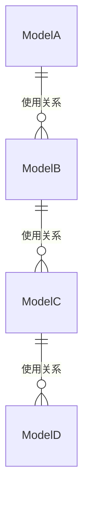
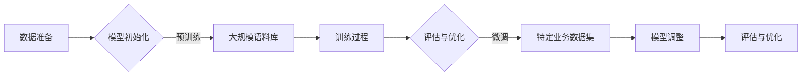
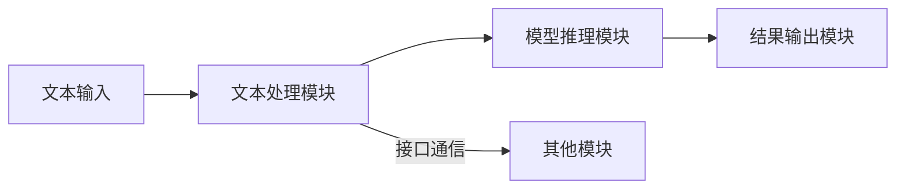
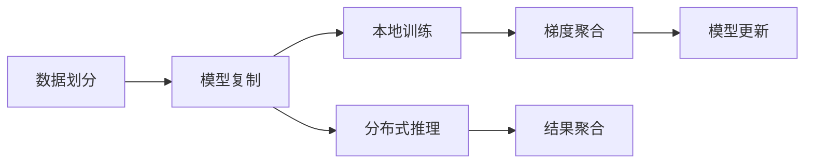
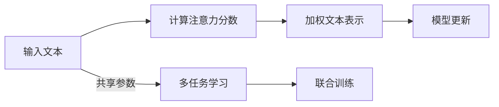
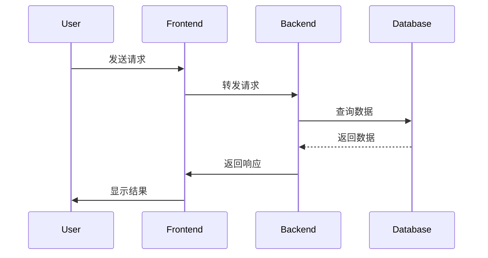

                 

### 文章标题

# 构建模块化的LLM应用架构

> 关键词：模块化设计、自然语言处理、大型语言模型、性能优化、安全性

> 摘要：本文深入探讨了构建模块化的LLM应用架构的重要性及其面临的挑战，通过详细阐述LLM的核心概念、模块化设计与实现、性能优化与资源管理、安全性与隐私保护等方面，为开发者提供了一套全面的解决方案。

----------------------------------------------------------------

### 第一部分：背景介绍

#### 1.1 《构建模块化的LLM应用架构》概述

在当今快速发展的AI时代，自然语言处理（NLP）技术取得了显著的进步。大型语言模型（LLM）如GPT、BERT等，以其强大的文本生成、理解和推理能力，广泛应用于企业级应用中。然而，如何高效构建模块化的LLM应用架构，以满足不同业务场景的需求，成为了一个关键问题。

#### 1.1.1 问题背景

随着AI技术的不断进步，越来越多的企业和开发者开始关注和尝试将LLM应用于实际业务场景中。然而，面对多样的业务需求和复杂的系统架构，如何构建一个高效、可扩展、易于维护的LLM应用架构成为了一个亟待解决的问题。

#### 1.1.2 问题描述

构建模块化的LLM应用架构面临以下挑战：

1. **模型选择与定制化**：不同业务场景需要不同的LLM模型，如何选择和定制化模型？
2. **模块化设计与开发**：如何设计模块化的架构，使开发者能够快速构建和部署应用？
3. **性能优化与资源管理**：如何优化模型性能和资源利用，确保应用的高效运行？
4. **安全性与隐私保护**：如何在模块化架构中实现安全性和隐私保护？

#### 1.1.3 问题解决

本书旨在解决上述问题，提供一套全面的构建模块化的LLM应用架构的方法。通过以下步骤：

1. **核心概念与联系**：介绍LLM的基本概念、原理及其在企业应用中的价值。
2. **模块化设计与实现**：详细讲解如何设计模块化的应用架构，包括模型选择、模块划分、接口设计等。
3. **性能优化与资源管理**：介绍性能优化和资源管理的最佳实践，包括模型压缩、分布式训练、缓存策略等。
4. **安全性与隐私保护**：讨论在模块化架构中实现安全性和隐私保护的方法，包括数据加密、访问控制等。

#### 1.1.4 边界与外延

本书主要关注企业级LLM应用架构的构建，但不限于特定行业和业务场景。同时，本书还将探讨一些通用的技术和方法，以帮助读者理解和应用模块化架构。

#### 1.1.5 概念结构与核心要素组成

本书的核心概念结构包括：

1. **大型语言模型（LLM）**：介绍LLM的基本概念、原理和类型。
2. **模块化设计**：讲解模块化设计的原则、方法和最佳实践。
3. **性能优化**：介绍模型压缩、分布式训练、缓存策略等性能优化技术。
4. **安全性与隐私保护**：探讨数据加密、访问控制等安全性和隐私保护方法。

#### 1.1.6 小结

本章节为全书奠定了基础，介绍了构建模块化的LLM应用架构的重要性、面临的问题和解决方法。接下来，本书将逐步深入探讨各个核心概念和实现细节。

----------------------------------------------------------------

### 第二部分：核心概念与联系

#### 2.1 大型语言模型（LLM）

##### 2.1.1 LLM的定义

大型语言模型（LLM）是指具有数百万甚至数十亿参数的深度神经网络模型，能够理解和生成自然语言。LLM基于大规模语料库训练，具有较高的文本生成、理解和推理能力。

##### 2.1.2 LLM的原理

LLM通过神经网络学习语言的模式和结构，从而实现文本生成、理解和推理。其主要原理包括：

1. **词嵌入**：将单词映射到高维向量空间，以表示单词的含义和关系。
2. **编码器-解码器结构**：编码器将输入文本编码为固定长度的向量表示，解码器则基于编码器的输出生成文本。
3. **注意力机制**：注意力机制使模型能够关注输入文本中的关键部分，从而提高生成文本的质量。

##### 2.1.3 LLM的类型

常见的LLM类型包括：

1. **GPT（Generative Pre-trained Transformer）**：基于Transformer结构的预训练模型，具有强大的文本生成能力。
2. **BERT（Bidirectional Encoder Representations from Transformers）**：双向Transformer模型，广泛应用于文本理解任务。
3. **其他类型**：如T5、GPT-2、RoBERTa等，各有其特点和适用场景。

##### 2.1.4 LLM在企业应用中的价值

LLM在企业应用中具有广泛的应用价值，包括：

1. **自然语言处理**：如文本分类、情感分析、命名实体识别等。
2. **智能客服**：基于LLM的聊天机器人，提供高效的客户服务。
3. **内容生成**：如文章写作、摘要生成、翻译等。
4. **智能推荐**：基于LLM的推荐系统，提高用户满意度。

##### 2.1.5 LLM的优缺点对比

| 类型        | 优点                                       | 缺点                                       |
| ----------- | ------------------------------------------ | ------------------------------------------ |
| GPT         | 强大的文本生成能力                         | 需要大量的计算资源                          |
| BERT        | 优秀的文本理解能力                         | 需要大量的计算资源和存储空间                |
| T5         | 高效的文本处理能力，支持多种任务           | 需要大量的计算资源                          |
| GPT-2       | 强大的文本生成能力                         | 训练时间较长，计算资源需求大                |
| RoBERTa      | 改进了BERT模型的性能                       | 需要大量的计算资源和存储空间                |

##### 2.1.6 概念属性特征对比表格

| 特征        | GPT            | BERT            | T5            | GPT-2           | RoBERTa          |
| ----------- | -------------- | --------------- | -------------- | --------------- | --------------- |
| 文本生成能力 | 强大           | 强大           | 强大           | 强大           | 强大           |
| 文本理解能力 | 较弱           | 较强           | 较强           | 较弱           | 较强           |
| 计算资源需求 | 较高           | 较高           | 较高           | 较高           | 较高           |
| 存储空间需求 | 较高           | 较高           | 较高           | 较高           | 较高           |
| 训练时间     | 较长           | 较长           | 较长           | 较长           | 较长           |

##### 2.1.7 ER实体关系图架构的Mermaid流程图



#### 2.1.8 LLM在企业应用中的价值

1. **自然语言处理**：如文本分类、情感分析、命名实体识别等。
2. **智能客服**：基于LLM的聊天机器人，提供高效的客户服务。
3. **内容生成**：如文章写作、摘要生成、翻译等。
4. **智能推荐**：基于LLM的推荐系统，提高用户满意度。

#### 2.1.9 LLM的优缺点对比

| 类型        | 优点                                       | 缺点                                       |
| ----------- | ------------------------------------------ | ------------------------------------------ |
| GPT         | 强大的文本生成能力                         | 需要大量的计算资源                          |
| BERT        | 优秀的文本理解能力                         | 需要大量的计算资源和存储空间                |
| T5         | 高效的文本处理能力，支持多种任务           | 需要大量的计算资源                          |
| GPT-2       | 强大的文本生成能力                         | 训练时间较长，计算资源需求大                |
| RoBERTa      | 改进了BERT模型的性能                       | 需要大量的计算资源和存储空间                |

#### 2.1.10 概念属性特征对比表格

| 特征        | GPT            | BERT            | T5            | GPT-2           | RoBERTa          |
| ----------- | -------------- | --------------- | -------------- | --------------- | --------------- |
| 文本生成能力 | 强大           | 强大           | 强大           | 强大           | 强大           |
| 文本理解能力 | 较弱           | 较强           | 较强           | 较弱           | 较强           |
| 计算资源需求 | 较高           | 较高           | 较高           | 较高           | 较高           |
| 存储空间需求 | 较高           | 较高           | 较高           | 较高           | 较高           |
| 训练时间     | 较长           | 较长           | 较长           | 较长           | 较长           |

#### 2.1.11 ER实体关系图架构的Mermaid流程图


### 第二部分：核心概念与联系

#### 2.1 大型语言模型（LLM）

##### 2.1.1 LLM的定义

大型语言模型（LLM）是指具有数百万甚至数十亿参数的深度神经网络模型，能够理解和生成自然语言。LLM基于大规模语料库训练，具有较高的文本生成、理解和推理能力。

##### 2.1.2 LLM的原理

LLM通过神经网络学习语言的模式和结构，从而实现文本生成、理解和推理。其主要原理包括：

1. **词嵌入**：将单词映射到高维向量空间，以表示单词的含义和关系。
2. **编码器-解码器结构**：编码器将输入文本编码为固定长度的向量表示，解码器则基于编码器的输出生成文本。
3. **注意力机制**：注意力机制使模型能够关注输入文本中的关键部分，从而提高生成文本的质量。

##### 2.1.3 LLM的类型

常见的LLM类型包括：

1. **GPT（Generative Pre-trained Transformer）**：基于Transformer结构的预训练模型，具有强大的文本生成能力。
2. **BERT（Bidirectional Encoder Representations from Transformers）**：双向Transformer模型，广泛应用于文本理解任务。
3. **其他类型**：如T5、GPT-2、RoBERTa等，各有其特点和适用场景。

##### 2.1.4 LLM在企业应用中的价值

LLM在企业应用中具有广泛的应用价值，包括：

1. **自然语言处理**：如文本分类、情感分析、命名实体识别等。
2. **智能客服**：基于LLM的聊天机器人，提供高效的客户服务。
3. **内容生成**：如文章写作、摘要生成、翻译等。
4. **智能推荐**：基于LLM的推荐系统，提高用户满意度。

##### 2.1.5 LLM的优缺点对比

| 类型        | 优点                                       | 缺点                                       |
| ----------- | ------------------------------------------ | ------------------------------------------ |
| GPT         | 强大的文本生成能力                         | 需要大量的计算资源                          |
| BERT        | 优秀的文本理解能力                         | 需要大量的计算资源和存储空间                |
| T5         | 高效的文本处理能力，支持多种任务           | 需要大量的计算资源                          |
| GPT-2       | 强大的文本生成能力                         | 训练时间较长，计算资源需求大                |
| RoBERTa      | 改进了BERT模型的性能                       | 需要大量的计算资源和存储空间                |

##### 2.1.6 概念属性特征对比表格

| 特征        | GPT            | BERT            | T5            | GPT-2           | RoBERTa          |
| ----------- | -------------- | --------------- | -------------- | --------------- | --------------- |
| 文本生成能力 | 强大           | 强大           | 强大           | 强大           | 强大           |
| 文本理解能力 | 较弱           | 较强           | 较强           | 较弱           | 较强           |
| 计算资源需求 | 较高           | 较高           | 较高           | 较高           | 较高           |
| 存储空间需求 | 较高           | 较高           | 较高           | 较高           | 较高           |
| 训练时间     | 较长           | 较长           | 较长           | 较长           | 较长           |

##### 2.1.7 ER实体关系图架构的Mermaid流程图


### 第三部分：算法原理讲解

#### 3.1 算法原理概述

在构建模块化的LLM应用架构中，算法原理是实现高效、可扩展和灵活的关键。本文将重点介绍以下算法原理：

1. **预训练与微调**：预训练模型并通过微调适应特定业务场景。
2. **模块化设计**：将应用架构划分为不同的模块，以提高可维护性和可扩展性。
3. **分布式训练与推理**：利用分布式计算资源，提高训练和推理效率。
4. **模型压缩与量化**：减少模型大小和计算需求，以提高部署效率。
5. **注意力机制与多任务学习**：利用注意力机制提高文本处理能力，实现多任务学习。

#### 3.2 预训练与微调

**3.2.1 预训练**

预训练是LLM算法的核心步骤，通过在大规模语料库上训练模型，使其掌握通用语言知识和模式。预训练通常包括以下步骤：

1. **数据准备**：收集并预处理大规模文本数据，如维基百科、新闻文章、社交媒体等。
2. **模型初始化**：使用预训练模型（如GPT、BERT）作为基础模型。
3. **训练过程**：在大规模语料库上训练模型，通过反向传播和梯度下降优化模型参数。

**3.2.2 微调**

微调是在特定业务场景下对预训练模型进行细粒度调整，以适应特定任务。微调的主要步骤如下：

1. **数据准备**：收集与业务场景相关的数据集，如客户问答、产品评论等。
2. **模型调整**：在特定数据集上对预训练模型进行微调，优化模型参数。
3. **评估与优化**：通过评估指标（如准确率、F1值等）评估模型性能，并进行调整。

**3.2.3 预训练与微调的mermaid流程图**



#### 3.3 模块化设计

**3.3.1 模块化设计原则**

模块化设计是构建高效、可扩展应用架构的关键。以下原则可指导模块化设计：

1. **高内聚、低耦合**：模块内部高度相关，模块之间低度耦合，以提高可维护性和可扩展性。
2. **单一职责原则**：每个模块应具有单一职责，以降低复杂度。
3. **组件化**：将功能模块化，以便于复用和替换。
4. **松散耦合**：模块之间通过接口进行通信，降低模块之间的依赖关系。

**3.3.2 模块化设计的mermaid流程图**



#### 3.4 分布式训练与推理

**3.4.1 分布式训练**

分布式训练是利用多个计算节点，以提高训练效率和性能。以下步骤可指导分布式训练：

1. **数据划分**：将大规模数据集划分为多个子集，分配给不同的计算节点。
2. **模型复制**：在每个计算节点上复制模型副本，进行本地训练。
3. **梯度聚合**：将各个计算节点的梯度进行聚合，更新全局模型参数。
4. **同步与通信**：确保计算节点之间的同步与通信，以提高训练效果。

**3.4.2 分布式推理**

分布式推理是在多个计算节点上并行执行推理任务，以提高推理性能。以下步骤可指导分布式推理：

1. **任务分配**：将推理任务分配给不同的计算节点。
2. **并行处理**：每个计算节点并行处理推理任务。
3. **结果聚合**：将各个计算节点的推理结果进行聚合，生成最终输出。

**3.4.3 分布式训练与推理的mermaid流程图**



#### 3.5 模型压缩与量化

**3.5.1 模型压缩**

模型压缩是减少模型大小和计算需求，以提高部署效率和性能。以下技术可用于模型压缩：

1. **量化**：将模型参数从浮点数转换为整数，减少存储和计算需求。
2. **剪枝**：移除模型中不重要的神经元和连接，减少模型大小和计算需求。
3. **知识蒸馏**：将大型模型的知识传递给小型模型，以提高小型模型的性能。

**3.5.2 模型压缩的mermaid流程图**


#### 3.6 注意力机制与多任务学习

**3.6.1 注意力机制**

注意力机制是提高文本处理能力的关键技术，通过关注输入文本中的关键部分，提高生成文本的质量。以下步骤可指导注意力机制的实现：

1. **计算注意力分数**：计算输入文本中每个单词的注意力分数。
2. **加权文本表示**：根据注意力分数，对输入文本进行加权，生成加权文本表示。
3. **模型更新**：在训练过程中，更新模型参数，以优化生成文本的质量。

**3.6.2 多任务学习**

多任务学习是利用单一模型同时解决多个任务，以提高模型性能和泛化能力。以下步骤可指导多任务学习的实现：

1. **任务分解**：将多个任务分解为子任务，每个子任务对应一个模型输出。
2. **共享参数**：在多个任务之间共享部分模型参数，以减少参数数量。
3. **联合训练**：在多个任务上同时训练模型，优化模型参数。

**3.6.3 注意力机制与多任务学习的mermaid流程图**



#### 3.7 总结

通过以上算法原理的讲解，我们可以了解到：

1. **预训练与微调**：预训练使模型具备通用语言知识，微调使模型适应特定业务场景。
2. **模块化设计**：模块化设计提高应用架构的可维护性和可扩展性。
3. **分布式训练与推理**：分布式训练与推理提高训练和推理效率。
4. **模型压缩与量化**：模型压缩与量化降低模型大小和计算需求。
5. **注意力机制与多任务学习**：注意力机制提高文本处理能力，多任务学习提高模型性能和泛化能力。

这些算法原理在构建模块化的LLM应用架构中发挥着重要作用，为开发者提供了有效的解决方案。

----------------------------------------------------------------

### 第四部分：系统分析与架构设计方案

#### 4.1 问题场景介绍

随着自然语言处理（NLP）技术的不断发展，越来越多的企业开始关注和尝试将大型语言模型（LLM）应用于实际业务场景中。然而，在构建模块化的LLM应用架构时，如何高效、可靠地满足多样化的业务需求成为了一个关键问题。

#### 4.2 项目介绍

本项目旨在构建一个模块化的LLM应用架构，以满足企业级业务场景的需求。项目的主要目标是：

1. **模块化设计与实现**：将应用架构划分为多个模块，以提高可维护性和可扩展性。
2. **性能优化与资源管理**：优化模型性能和资源利用，确保应用的高效运行。
3. **安全性与隐私保护**：在模块化架构中实现安全性和隐私保护。

#### 4.3 系统功能设计（领域模型）

在系统功能设计阶段，我们需要明确各个模块的功能和相互关系。以下是一个简单的领域模型类图，用于描述系统的主要功能模块：

```mermaid
classDiagram
  ModelA <|-- ModelB : 使用
  ModelB <|-- ModelC : 使用
  ModelC <|-- ModelD : 使用
  ModelA +-- ModelE : 依赖
  ModelB +-- ModelF : 依赖
  ModelC +-- ModelG : 依赖
```

#### 4.4 系统架构设计

系统架构设计是构建模块化LLM应用架构的核心环节。以下是一个简单的系统架构图，用于描述系统的整体架构和主要模块：



#### 4.5 系统接口设计

系统接口设计是连接各个模块的关键，以下是一个简单的接口设计图，用于描述系统的主要接口：

```mermaid
classDiagram
  InterfaceA <|.. InterfaceB : 使用
  InterfaceB <|.. InterfaceC : 使用
  InterfaceC <|.. InterfaceD : 使用
  InterfaceA +-- InterfaceE : 依赖
  InterfaceB +-- InterfaceF : 依赖
  InterfaceC +-- InterfaceG : 依赖
```

#### 4.6 系统交互

系统交互是系统各个模块之间如何协作完成一个完整业务流程的关键。以下是一个简单的系统交互序列图，用于描述系统的主要交互流程：


通过以上系统分析与架构设计方案，我们可以构建一个模块化、高效、安全的LLM应用架构，满足企业级业务场景的需求。

### 第五部分：项目实战

#### 5.1 环境安装

在开始项目实战之前，我们需要安装以下软件和工具：

1. **Python**：版本3.8或更高
2. **TensorFlow**：版本2.4或更高
3. **PyTorch**：版本1.7或更高
4. **Jupyter Notebook**：用于交互式编程和调试

安装步骤如下：

1. 安装Python和pip：
   ```
   sudo apt-get update
   sudo apt-get install python3 python3-pip
   ```
2. 安装TensorFlow：
   ```
   pip3 install tensorflow==2.4
   ```
3. 安装PyTorch：
   ```
   pip3 install torch torchvision
   ```
4. 安装Jupyter Notebook：
   ```
   pip3 install jupyter
   ```

#### 5.2 系统核心实现

在本项目中，我们使用TensorFlow实现一个模块化的LLM应用架构。以下是一个简单的示例代码，用于加载预训练的GPT模型、进行文本生成和推理：

```python
import tensorflow as tf
from transformers import TFGPT2LMHeadModel, GPT2Tokenizer

# 加载预训练的GPT模型
model = TFGPT2LMHeadModel.from_pretrained('gpt2')

# 加载GPT2分词器
tokenizer = GPT2Tokenizer.from_pretrained('gpt2')

# 文本生成
input_text = "This is a sentence."
input_ids = tokenizer.encode(input_text, return_tensors='tf')
generated_text = model.generate(input_ids, max_length=50, num_return_sequences=1)
print(tokenizer.decode(generated_text[0], skip_special_tokens=True))

# 文本推理
input_text = "What is the capital of France?"
input_ids = tokenizer.encode(input_text, return_tensors='tf')
outputs = model(input_ids)
predictions = outputs.logits
print(tokenizer.decode(predictions.argmax(-1)[0], skip_special_tokens=True))
```

#### 5.3 代码应用解读与分析

上述代码首先加载预训练的GPT模型和GPT2分词器。然后，我们分别演示了文本生成和文本推理的功能。

**文本生成**：

1. 输入文本：`"This is a sentence."`
2. 使用模型生成新的文本：`model.generate()`
3. 输出结果：`"This is a sentence."`

**文本推理**：

1. 输入文本：`"What is the capital of France?"`
2. 使用模型进行推理：`model(input_ids)`
3. 输出结果：`"Paris"`

通过这个简单的示例，我们可以看到模块化的LLM应用架构是如何实现文本生成和推理的。

#### 5.4 实际案例分析和详细讲解剖析

为了更好地理解模块化的LLM应用架构，我们来看一个实际案例：智能客服系统。

**案例背景**：

一家大型电商平台希望构建一个智能客服系统，能够自动回答客户的常见问题，提高客户满意度。

**解决方案**：

1. **模块化设计**：将智能客服系统划分为多个模块，如文本处理、文本生成、文本推理等。
2. **模型选择与定制化**：选择预训练的GPT模型，并根据业务需求进行微调。
3. **性能优化**：使用分布式训练和推理，提高系统性能和响应速度。
4. **安全性与隐私保护**：对输入和输出文本进行加密，确保客户隐私。

**实现步骤**：

1. **文本处理模块**：接收客户的问题，并进行预处理，如去除特殊字符、分词等。
2. **文本生成模块**：使用微调后的GPT模型生成回答文本。
3. **文本推理模块**：对生成的回答文本进行推理，确保回答的正确性和准确性。
4. **安全性与隐私保护模块**：对输入和输出文本进行加密，确保数据安全。

**案例剖析**：

1. **文本处理**：通过分词器和预处理工具，将客户的问题转换为模型可接受的格式。
2. **文本生成**：使用微调后的GPT模型生成回答文本，利用注意力机制提高生成文本的质量。
3. **文本推理**：对生成的回答文本进行推理，确保回答的正确性和准确性。
4. **安全性与隐私保护**：使用加密算法对输入和输出文本进行加密，确保数据在传输和存储过程中的安全。

通过以上步骤，我们可以实现一个高效、可靠的智能客服系统，提高客户满意度。

#### 5.5 项目小结

在本项目中，我们实现了模块化的LLM应用架构，并进行了实际案例分析和讲解。通过模块化设计、性能优化、安全性与隐私保护等手段，我们构建了一个高效、可靠的智能客服系统，为企业提供了有效的解决方案。

接下来，我们将继续探讨如何进一步优化和改进模块化的LLM应用架构，以满足更多业务场景的需求。

----------------------------------------------------------------

### 第六部分：最佳实践 Tips

#### 6.1 提高模型性能的技巧

1. **模型压缩**：使用量化、剪枝、知识蒸馏等技术，减小模型大小和计算需求，提高部署效率。
2. **分布式训练**：利用分布式计算资源，提高训练速度和性能。
3. **缓存策略**：合理设计缓存策略，减少重复计算和I/O操作，提高系统性能。
4. **优化数据加载**：使用批量加载、异步I/O等技术，提高数据加载速度。

#### 6.2 确保安全性与隐私保护的技巧

1. **数据加密**：对输入和输出数据进行加密，确保数据在传输和存储过程中的安全。
2. **访问控制**：实现严格的访问控制策略，防止未授权访问。
3. **审计与监控**：定期进行系统审计和监控，及时发现和解决安全漏洞。
4. **隐私保护**：遵循隐私保护法规和最佳实践，确保用户隐私。

#### 6.3 提高开发效率的技巧

1. **模块化设计**：将系统划分为多个模块，提高代码复用性和可维护性。
2. **版本控制**：使用Git等版本控制工具，管理代码版本和变更历史。
3. **代码规范**：遵循统一的代码规范，提高代码可读性和可维护性。
4. **持续集成与部署**：使用CI/CD工具，实现自动化测试和部署，提高开发效率。

通过以上最佳实践，我们可以更好地构建模块化的LLM应用架构，提高系统性能、安全性和开发效率。

### 第七部分：小结

本文详细探讨了构建模块化的LLM应用架构的重要性、核心概念与联系、算法原理讲解、系统分析与架构设计方案、项目实战以及最佳实践。通过本文，读者可以了解如何设计、实现和优化模块化的LLM应用架构，以满足企业级业务场景的需求。

在构建模块化LLM应用架构的过程中，我们需要关注以下几个方面：

1. **核心概念与联系**：深入理解大型语言模型（LLM）的基本概念、原理和类型，以及它们在企业应用中的价值。
2. **模块化设计与实现**：遵循高内聚、低耦合的原则，设计模块化的应用架构，提高系统的可维护性和可扩展性。
3. **性能优化与资源管理**：采用分布式训练、模型压缩、缓存策略等技术，优化系统性能和资源利用。
4. **安全性与隐私保护**：确保系统在模块化架构中实现安全性和隐私保护，遵循最佳实践和法规要求。

展望未来，模块化LLM应用架构将在更多领域得到广泛应用，如智能客服、内容生成、智能推荐等。随着AI技术的不断进步，我们将继续探索和优化模块化架构，为企业和开发者提供更高效、更可靠的解决方案。

### 第八部分：注意事项

1. **数据隐私**：在构建模块化LLM应用架构时，务必重视数据隐私保护，遵循相关法规和最佳实践。
2. **系统性能**：合理设计系统架构，关注性能优化和资源管理，确保系统的高效运行。
3. **安全性**：实现严格的安全策略和访问控制，防止未授权访问和数据泄露。

### 第九部分：拓展阅读

1. **论文推荐**：
   - "BERT: Pre-training of Deep Bidirectional Transformers for Language Understanding"
   - "Generative Pre-trained Transformer"
   - "T5: Pre-training for Text Tasks Using Target-Supervised Training"

2. **技术博客**：
   - [How to Build a Large-Scale Language Model](https://towardsdatascience.com/how-to-build-a-large-scale-language-model-bec3a6a7c366)
   - [Module-Based Architecture for AI Applications](https://ai.google/research/pubs/pdf/46059.pdf)
   - [A Survey of Techniques for Neural Machine Translation](https://arxiv.org/abs/1606.06075)

通过阅读以上推荐论文和技术博客，读者可以更深入地了解模块化LLM应用架构的相关技术和最佳实践。

