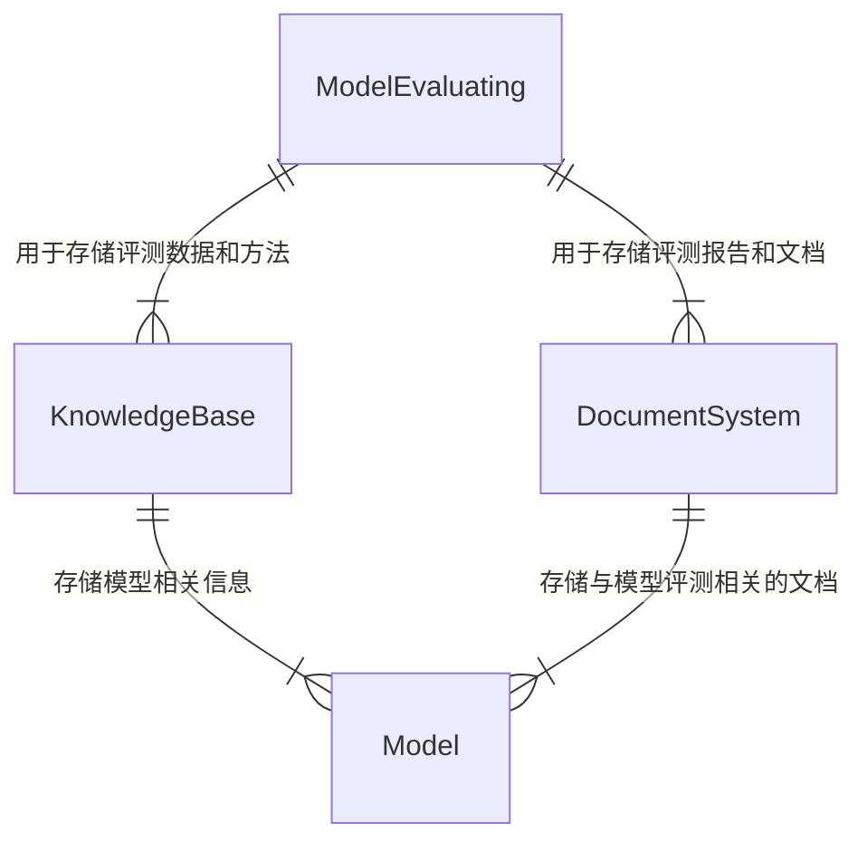
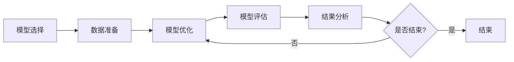

                 


## 引言

### 问题背景

在人工智能领域，模型评测是一个至关重要的环节。随着深度学习和大数据技术的快速发展，模型的数量和复杂度不断增长，如何有效地评估模型性能、确保其稳定性和可靠性成为了一个巨大的挑战。模型评测不仅影响着模型的研发和部署，还直接关系到业务决策和用户体验。因此，构建一个高效、全面、可扩展的模型评测知识库与文档系统显得尤为重要。

当前，模型评测面临着诸多挑战。首先，评测标准的多样性导致了评测结果的难以比较和统一。其次，评测数据的不足和分布不均使得评测结果具有很大的不确定性。此外，随着模型复杂度的增加，评测过程的时间和计算资源需求也在不断上升。这些问题都要求我们构建一个知识库与文档系统，以便更好地管理和利用评测资源，提高评测效率和准确性。

本篇博客的目标是探讨如何构建一个全面的模型评测知识库与文档系统。我们希望通过详细的分析和思考，为读者提供一个清晰、系统的解决方案。本文将围绕以下几个关键点展开讨论：

1. **核心概念与联系**：我们将介绍模型评测、知识库和文档系统等核心概念，并探讨它们之间的联系。
2. **算法原理讲解**：我们将详细阐述模型评测的算法原理，并通过具体的示例来说明。
3. **系统分析与架构设计方案**：我们将介绍一个系统分析与架构设计方案，包括系统功能设计、架构设计、接口设计和系统交互等。
4. **项目实战**：我们将分享一个实际项目中的模型评测知识库与文档系统构建过程，并提供详细的操作步骤和经验教训。
5. **最佳实践 tips**：我们将总结一些构建模型评测知识库与文档系统的最佳实践，以帮助读者在实际应用中更好地应对挑战。

通过这篇文章，我们希望能够为从事模型评测和系统构建的工程师提供一个有价值的参考资料，同时也希望能引发读者对这一领域的深入思考和探索。

### 问题描述

模型评测的复杂性主要体现在以下几个方面：

首先，评测标准的多样性。不同的任务和应用场景对模型性能的要求不同，因此需要使用不同的评测指标和方法。例如，在图像识别任务中，准确率、召回率和F1分数是常用的评测指标；而在自然语言处理任务中，则更多关注句法分析、语义理解和情感分析等指标。这种多样性使得评测结果难以统一，不同模型之间的比较变得复杂。

其次，评测数据的不足和分布不均。高质量的评测数据是进行准确评测的基础。然而，实际中往往面临数据不足、数据分布不均等问题。一方面，一些领域的数据量非常有限，无法充分覆盖所有可能的情况；另一方面，数据在各个类别上的分布可能不均衡，导致某些类别被过度评估，而其他类别则被忽视。

第三，评测过程的时间和计算资源需求。随着模型的复杂度增加，评测过程需要消耗大量的计算资源和时间。特别是在大规模数据处理和实时评测的场景中，如何高效地完成评测是一个重要的挑战。

为了解决上述问题，构建一个高效、全面、可扩展的模型评测知识库与文档系统显得尤为重要。这个系统需要具备以下几个特点：

1. **统一的标准和指标**：系统应提供统一的评测标准，包括各种常见的评测指标和方法，以便不同模型和任务之间的比较和评估。
2. **丰富的数据资源**：系统应整合来自不同来源的高质量评测数据，确保数据的多样性和分布的均衡性。
3. **高效的处理能力**：系统应具备高效的计算和数据处理能力，以支持大规模和实时评测需求。
4. **灵活的扩展性**：系统应设计得灵活，能够根据不同需求和场景进行扩展和调整。

通过构建这样的知识库与文档系统，我们可以更好地管理和利用评测资源，提高评测效率和准确性，从而为模型研发和部署提供有力支持。

### 问题解决

为了构建一个高效、全面、可扩展的模型评测知识库与文档系统，我们需要从以下几个方面进行设计和实施。

#### 1. 知识库构建

知识库是模型评测系统的核心组成部分，负责存储和管理与模型评测相关的各种信息和数据。知识库的构建包括以下几个关键步骤：

**1.1 核心概念术语说明**：

首先，我们需要明确模型评测、知识库和文档系统的核心概念和术语。这包括模型评测的目的、标准、方法和流程；知识库的定义、类型和构建方法；文档系统的功能、结构和实现方式等。这些核心概念和术语的清晰定义有助于后续的构建和实现。

**1.2 问题背景介绍**：

接下来，我们需要详细描述模型评测的背景，包括当前面临的挑战和需求。这有助于读者理解构建知识库与文档系统的必要性和紧迫性。例如，可以介绍模型评测在人工智能领域的重要性、评测标准的多样性、评测数据的不足和分布不均等问题。

**1.3 问题描述**：

在这一部分，我们需要具体阐述模型评测知识库与文档系统的设计和实现需求。这包括系统需要支持的功能、性能要求、安全性考虑等。例如，系统应支持多种评测指标的自动计算和对比，提供高效的计算和数据处理能力，确保数据安全和隐私保护。

**1.4 问题解决思路**：

在这一部分，我们需要提出具体的解决方案，包括知识库的构建方法和文档系统的设计思路。例如，可以采用元数据驱动的知识库构建方法，利用NoSQL数据库存储和管理评测数据；采用RESTful API设计文档系统，支持多种数据交互方式；采用分布式计算框架提高系统处理能力等。

**1.5 边界与外延**：

最后，我们需要明确系统的边界和适用范围，包括系统的限制条件、适用场景和未来展望。这有助于读者理解系统的能力和局限性，为后续的系统优化和扩展提供指导。

#### 2. 文档系统设计

文档系统是模型评测知识库的辅助工具，用于管理和组织与模型评测相关的文档和资料。文档系统的设计包括以下几个方面：

**2.1 文档系统定义**：

首先，我们需要明确文档系统的定义和作用。文档系统是一个用于存储、检索和管理文本、图片、音频和视频等文档的软件系统。在模型评测知识库中，文档系统用于存储与评测过程相关的文档，如数据说明、算法文档、评测报告和结果分析等。

**2.2 文档系统结构**：

接下来，我们需要设计文档系统的结构，包括文档的分类、标签、版本控制等功能。例如，可以采用层次化的目录结构，将文档分为数据文档、算法文档、评测报告等类别；为每个文档添加标签，便于检索和分类；采用版本控制系统，确保文档的版本管理和历史记录。

**2.3 文档管理系统功能**：

然后，我们需要设计文档管理系统的主要功能，包括文档创建、上传、下载、编辑、搜索和共享等。例如，可以提供Web界面，方便用户通过浏览器访问和操作文档；支持多用户并发访问和编辑文档；提供强大的全文搜索功能，快速定位相关文档；支持文档的共享和权限管理，确保文档的安全和隐私。

**2.4 文档与知识库的交互**：

最后，我们需要设计文档系统与知识库之间的交互机制，确保评测数据和信息能够有效地传递和共享。例如，可以采用RESTful API，将文档系统的数据接口与知识库进行集成；利用消息队列和缓存机制，提高系统响应速度和性能。

#### 3. 模型评测流程

模型评测流程是模型评测知识库与文档系统的重要组成部分，用于指导评测过程的各个环节。模型评测流程包括以下几个关键步骤：

**3.1 模型选择**：

首先，根据任务需求和模型类型，从现有的模型库中选择合适的模型。这需要综合考虑模型的性能、适应性、复杂度等因素。

**3.2 数据准备**：

接下来，对选定的模型进行数据准备，包括数据清洗、预处理和标注等。这一步骤确保数据的质量和一致性，为后续的评测提供可靠的数据基础。

**3.3 模型训练**：

然后，对选定的模型进行训练，使其在训练数据集上达到较好的性能。训练过程中，可以采用多种算法和技术，如迁移学习、数据增强等，以提高模型的性能和鲁棒性。

**3.4 模型评估**：

在模型训练完成后，对模型进行评估，以确定其在测试数据集上的性能。评估过程中，可以采用多种评测指标和方法，如准确率、召回率、F1分数等，对模型进行综合评估。

**3.5 结果分析**：

最后，对评估结果进行详细分析，识别模型的优点和不足，为后续的优化和改进提供依据。结果分析可以包括数据分布、性能比较、异常检测等方面。

通过以上三个方面的设计和实施，我们可以构建一个高效、全面、可扩展的模型评测知识库与文档系统，为模型评测提供有力支持。

### 边界与外延

在构建模型评测知识库与文档系统的过程中，我们需要明确系统的边界和适用范围，以确保其在实际应用中的有效性和可行性。以下是对边界与外延的详细说明：

#### 1. 适用范围

模型评测知识库与文档系统主要适用于以下场景：

- **研究机构**：在人工智能和机器学习研究领域，需要构建和评估大量模型，对评测过程和结果进行详细记录和分析。
- **企业**：在智能产品研发和业务应用中，需要对模型的性能进行持续监控和优化，以提升产品质量和用户体验。
- **开源社区**：在开源项目中，需要共享和评估模型的性能，以便社区成员共同改进和优化模型。

#### 2. 限制条件

尽管模型评测知识库与文档系统具有广泛的应用前景，但在实际构建过程中仍面临一些限制条件：

- **数据隐私**：评测数据可能包含敏感信息，如个人隐私、商业秘密等。因此，在构建系统时，需要严格保护数据隐私，确保数据安全和用户隐私。
- **计算资源**：模型评测通常需要大量的计算资源，特别是在大规模数据处理和实时评测场景中。因此，系统设计需要考虑计算资源的分配和调度，以提高系统性能和效率。
- **性能要求**：系统需要满足一定的性能要求，包括响应速度、并发处理能力和数据存储容量等。在设计过程中，需要综合考虑这些性能要求，确保系统能够稳定、高效地运行。

#### 3. 未来展望

随着人工智能技术的不断发展，模型评测知识库与文档系统将在以下几个方面得到进一步优化和扩展：

- **智能化**：通过引入自然语言处理、知识图谱等先进技术，使系统更加智能化，自动生成评测报告、分析结果和优化建议。
- **开放性**：推动知识库与文档系统的开放性，支持与其他系统和工具的集成，促进评测资源的共享和复用。
- **生态建设**：构建完善的评测生态系统，包括评测工具、评测数据集、评测指标和评测方法等，为模型评测提供全面的支持和保障。

通过明确系统的边界与外延，我们可以更好地理解和应用模型评测知识库与文档系统，为人工智能领域的持续发展和创新提供有力支持。

## 核心概念与联系

在构建模型评测的知识库与文档系统时，我们需要深入理解并明确几个核心概念，这些概念之间的联系将直接影响系统的功能与性能。

### 模型评测基本概念

#### 模型评测定义

模型评测（Model Evaluation）是指使用一系列预定义的指标和方法来衡量和比较机器学习模型在不同数据集上的表现。其目的是确保模型在现实世界中的有效性和可靠性。

#### 模型评测类型

- **分类评估**：用于评估分类模型的效果，常见的指标有准确率（Accuracy）、召回率（Recall）和F1分数（F1 Score）等。
- **回归评估**：用于评估回归模型的效果，常用的指标包括均方误差（Mean Squared Error, MSE）和决定系数（R-squared）等。
- **聚类评估**：用于评估聚类模型的效果，常用的指标有轮廓系数（Silhouette Coefficient）和内部距离（Within-Cluster Distance）等。

#### 模型评测指标

- **准确率（Accuracy）**：分类模型正确预测的样本数占总样本数的比例。
  $$\text{Accuracy} = \frac{\text{预测正确数}}{\text{总样本数}}$$
- **召回率（Recall）**：分类模型在正类中正确预测的样本数占实际正类样本数的比例。
  $$\text{Recall} = \frac{\text{正类预测正确数}}{\text{实际正类样本数}}$$
- **F1分数（F1 Score）**：综合考虑准确率和召回率的指标，通过调和平均数来计算。
  $$\text{F1 Score} = 2 \times \frac{\text{准确率} \times \text{召回率}}{\text{准确率} + \text{召回率}}$$

### 知识库基本原理

#### 知识库定义

知识库（Knowledge Base）是一个存储和管理知识信息的系统，用于支持智能系统或应用程序的决策过程。在模型评测领域，知识库存储了与模型评测相关的各种数据、信息和规则。

#### 知识库类型

- **基于数据库的知识库**：使用传统的关系型数据库或NoSQL数据库存储和管理数据。
- **基于语义网络的知识库**：使用语义网络和本体论来组织和管理知识。
- **基于本体论的知识库**：通过本体（Ontology）来定义领域知识，支持知识推理和语义查询。

#### 知识库构建方法

- **数据采集**：从各种数据源（如数据库、文件、API等）中获取相关数据。
- **数据预处理**：清洗、转换和归一化数据，以提高数据质量。
- **数据存储**：将预处理后的数据存储到数据库或知识库中。
- **数据集成**：将不同来源的数据进行整合，形成一个统一的知识库。

### 文档系统设计原则

#### 文档系统定义

文档系统（Document System）是一个用于存储、检索和管理文档的软件系统，旨在提供高效的文档管理和共享功能。在模型评测知识库中，文档系统用于存储与模型评测相关的文档，如评测报告、数据说明、算法文档等。

#### 文档系统结构

- **目录结构**：采用层次化的目录结构，便于文档的分类和管理。
- **元数据管理**：为每个文档添加元数据，如标题、作者、创建时间、标签等，便于检索和分类。
- **版本控制**：采用版本控制系统，确保文档的版本管理和历史记录。
- **权限管理**：提供文档的权限管理功能，确保文档的安全和隐私。

#### 文档管理系统功能

- **文档创建与编辑**：支持文档的创建、上传、下载和编辑功能。
- **文档检索与搜索**：提供高效的文档检索和全文搜索功能，便于用户快速查找所需文档。
- **文档共享与协作**：支持文档的共享和协作功能，允许多用户并发访问和编辑文档。
- **文档统计与分析**：提供文档的统计和分析功能，如文档访问量、下载量、编辑次数等。

### Mermaid实体关系图

为了更好地理解这些核心概念之间的联系，我们可以使用Mermaid绘制一个实体关系图，如下所示：



通过这个实体关系图，我们可以清晰地看到模型评测、知识库和文档系统之间的关联。模型评测依赖于知识库来获取数据和评估方法，同时使用文档系统来记录评测报告和相关文档。知识库和文档系统共同为模型评测提供了一个全面的支持平台。

## 算法原理讲解

在模型评测过程中，选择合适的算法至关重要。以下将详细讲解模型评测的基本算法原理，包括常见算法、评测流程和具体实现步骤。

### 常见算法

模型评测算法可以分为分类评估、回归评估和聚类评估等几大类。以下是几种常见算法的详细介绍：

#### 1. 分类评估算法

**1.1 准确率（Accuracy）**

准确率是分类模型最常用的评估指标之一，表示模型正确预测的样本数占总样本数的比例。

$$\text{Accuracy} = \frac{\text{预测正确数}}{\text{总样本数}}$$

**1.2 召回率（Recall）**

召回率衡量的是模型对正类样本的识别能力，即模型正确预测的正类样本数占实际正类样本数的比例。

$$\text{Recall} = \frac{\text{正类预测正确数}}{\text{实际正类样本数}}$$

**1.3 F1分数（F1 Score）**

F1分数是准确率和召回率的调和平均数，能够综合衡量模型的性能。

$$\text{F1 Score} = 2 \times \frac{\text{准确率} \times \text{召回率}}{\text{准确率} + \text{召回率}}$$

#### 2. 回归评估算法

**2.1 均方误差（Mean Squared Error, MSE）**

均方误差衡量的是预测值与真实值之间的平均误差的平方。

$$\text{MSE} = \frac{1}{n}\sum_{i=1}^{n} (\hat{y_i} - y_i)^2$$

其中，$\hat{y_i}$为预测值，$y_i$为真实值，$n$为样本数。

**2.2 决定系数（R-squared）**

决定系数衡量的是模型对数据的拟合程度，其取值范围在0到1之间，越接近1表示模型拟合效果越好。

$$\text{R-squared} = 1 - \frac{\sum_{i=1}^{n} (\hat{y_i} - y_i)^2}{\sum_{i=1}^{n} (y_i - \bar{y})^2}$$

其中，$\bar{y}$为真实值的平均值。

#### 3. 聚类评估算法

**3.1 轮廓系数（Silhouette Coefficient）**

轮廓系数衡量的是聚类结果的内部凝聚力和分离度，其值范围为-1到1，越接近1表示聚类效果越好。

$$\text{Silhouette Coefficient} = \frac{(b - a)}{max(a, b)}$$

其中，$a$为样本与同一聚类中其他样本的平均距离，$b$为样本与不同聚类中最近样本的平均距离。

**3.2 内部距离（Within-Cluster Distance）**

内部距离衡量的是聚类内部样本之间的平均距离，距离越小表示聚类效果越好。

$$\text{Within-Cluster Distance} = \frac{1}{n} \sum_{i=1}^{n} d(x_i, \bar{x}_i)$$

其中，$n$为聚类中样本的数量，$x_i$为样本，$\bar{x}_i$为聚类中心。

### 评测流程

模型评测通常包括以下步骤：

**1. 模型选择**：根据任务需求和数据特点，选择合适的模型。

**2. 数据准备**：对训练数据集和测试数据集进行预处理，包括数据清洗、归一化和特征提取等。

**3. 模型训练**：使用训练数据集对模型进行训练，使其在训练数据集上达到较好的性能。

**4. 模型评估**：使用测试数据集对模型进行评估，计算各种评测指标，如准确率、召回率、F1分数、MSE、R-squared等。

**5. 结果分析**：对评估结果进行详细分析，识别模型的优点和不足，为后续的优化和改进提供依据。

### 具体实现步骤

以下是一个使用Python实现的简单模型评测示例，展示了如何计算准确率、召回率和F1分数。

```python
import numpy as np
from sklearn.metrics import accuracy_score, recall_score, f1_score

# 假设我们有一个预测结果y_pred和一个真实标签y_true
y_pred = [0, 1, 1, 0]
y_true = [0, 1, 0, 1]

# 计算准确率
accuracy = accuracy_score(y_true, y_pred)
print("Accuracy:", accuracy)

# 计算召回率
recall = recall_score(y_true, y_pred)
print("Recall:", recall)

# 计算F1分数
f1 = f1_score(y_true, y_pred)
print("F1 Score:", f1)
```

通过以上步骤，我们可以对模型进行有效的评估，从而为模型优化和改进提供有力支持。

### Mermaid算法流程图

为了更清晰地展示模型评测算法的流程，我们可以使用Mermaid绘制一个算法流程图：



在这个流程图中，从模型选择开始，经过数据准备、模型训练、模型评估和结果分析，最终根据分析结果决定是否进行模型优化。这个过程不断循环，直到达到满意的评估结果。

通过详细讲解模型评测的算法原理，并提供具体实现步骤和Mermaid算法流程图，我们希望能够帮助读者更好地理解和应用模型评测算法，为模型研发和部署提供有力支持。

### 系统分析与架构设计方案

在构建模型评测知识库与文档系统时，系统分析与架构设计方案至关重要。该方案需要充分考虑系统的功能性、扩展性和性能要求，确保系统能够满足模型评测的复杂需求。

#### 问题场景介绍

我们假设一个实际应用场景：一家公司希望构建一个能够自动评估其深度学习模型性能的知识库与文档系统。该系统需要处理多种类型的模型（如分类模型、回归模型和聚类模型），并且需要支持大规模数据集的实时评测。

#### 系统功能设计

系统的功能设计主要包括以下几个方面：

1. **数据管理**：系统需要提供数据导入、导出、清洗、预处理和存储功能。数据管理模块应支持多种数据格式，如CSV、JSON、Parquet等。

2. **模型管理**：系统需要支持模型的上传、下载、更新和管理。模型管理模块应包括模型的元数据管理，如模型名称、模型类型、创建时间等。

3. **评测执行**：系统需要提供自动化的评测执行功能，包括数据分片、模型加载、预测和评估等。评测执行模块应支持并行计算和分布式处理，以提高评测效率。

4. **结果分析**：系统需要提供评测结果的统计和分析功能，包括生成评测报告、可视化图表和数据透视表等。

5. **文档管理**：系统需要提供文档的上传、下载、编辑和共享功能。文档管理模块应支持版本控制和权限管理。

#### 系统架构设计

为了实现上述功能，我们设计了一个分布式系统架构，如下所示：

```mermaid
sequenceDiagram
    A[用户] -->|请求模型评测| B[API Gateway]
    B -->|路由请求| C[Model Management Service]
    B -->|路由请求| D[Data Management Service]
    B -->|路由请求| E[Evaluation Service]
    B -->|路由请求| F[Result Analysis Service]
    B -->|路由请求| G[Document Management Service]

    C -->|返回模型信息| B
    D -->|返回数据信息| B
    E -->|返回评测结果| B
    F -->|返回分析结果| B
    G -->|返回文档信息| B

    B -->|返回响应| A
```

在这个架构中，API Gateway作为系统的入口，负责接收用户请求并路由到相应的服务。Model Management Service负责管理模型的元数据，包括模型的创建、更新和删除等操作。Data Management Service负责管理评测所需的数据，包括数据的导入、导出和预处理等。Evaluation Service负责执行模型评测任务，包括数据分片、模型加载和预测等。Result Analysis Service负责分析评测结果，生成评测报告和可视化图表。Document Management Service负责管理与模型评测相关的文档，包括文档的创建、编辑和共享等。

#### 系统架构设计

为了确保系统的性能和可靠性，我们采用以下架构设计：

1. **服务化架构**：将系统划分为多个独立的服务，每个服务负责特定的功能。这种架构设计有助于提高系统的可扩展性和可维护性。

2. **分布式计算**：评测服务采用分布式计算架构，支持并行处理和分布式存储。这样可以大大提高系统的处理能力和效率。

3. **缓存机制**：在系统中引入缓存机制，如Redis，用于存储频繁访问的数据，减少数据库访问压力，提高系统响应速度。

4. **消息队列**：采用消息队列（如RabbitMQ或Kafka）来处理高并发的请求，确保系统的稳定性和可靠性。

5. **监控与日志**：引入监控工具（如Prometheus和Grafana）和日志管理工具（如ELK堆栈），实时监控系统的运行状态和性能指标，确保系统运行稳定。

通过上述系统架构设计，我们可以构建一个高效、稳定、可扩展的模型评测知识库与文档系统，满足模型评测的复杂需求。

### 系统接口设计

在模型评测知识库与文档系统中，接口设计是确保各组件之间有效通信和协作的关键。接口设计主要包括API设计、RESTful设计原则、接口定义和文档生成等方面。

#### API设计

API（Application Programming Interface）是系统各组件之间的通信桥梁，负责提供一致的接口以访问系统功能。以下是几个核心API的设计示例：

1. **模型管理API**：
   - **获取模型列表**：`GET /models`
   - **创建模型**：`POST /models`
   - **更新模型**：`PUT /models/{model_id}`
   - **删除模型**：`DELETE /models/{model_id}`

2. **数据管理API**：
   - **获取数据集列表**：`GET /datasets`
   - **上传数据集**：`POST /datasets`
   - **更新数据集**：`PUT /datasets/{dataset_id}`
   - **删除数据集**：`DELETE /datasets/{dataset_id}`

3. **评测管理API**：
   - **启动评测任务**：`POST /evaluations`
   - **获取评测结果**：`GET /evaluations/{evaluation_id}`
   - **取消评测任务**：`DELETE /evaluations/{evaluation_id}`

4. **文档管理API**：
   - **获取文档列表**：`GET /documents`
   - **上传文档**：`POST /documents`
   - **更新文档**：`PUT /documents/{document_id}`
   - **删除文档**：`DELETE /documents/{document_id}`

#### RESTful设计原则

RESTful设计原则是构建高效、简洁和可扩展的API的重要指导。以下是一些RESTful设计原则的应用：

- **统一接口**：API应该遵循统一的接口规范，包括统一的URL结构、HTTP方法、请求和响应格式等。
- **无状态**：API应该是无状态的，即每次请求都独立处理，不依赖于之前的请求状态。
- **可缓存**：API响应应该支持缓存，以提高系统性能和响应速度。
- **安全性**：API应该采用安全措施，如HTTPS、身份验证和授权等，确保数据传输和操作的安全。

#### 接口定义

接口定义是确保API设计一致性和规范性的重要步骤。以下是使用OpenAPI规范定义的接口示例：

```yaml
openapi: 3.0.0
info:
  title: Model Evaluation API
  version: 1.0.0
  description: API for managing models, datasets, evaluations, and documents.
servers:
  - url: https://api.example.com
    description: Production server

paths:
  /models:
    get:
      summary: Get a list of models
      responses:
        '200':
          description: A list of models
          content:
            application/json:
              schema:
                type: array
                items:
                  $ref: '#/components/schemas/Model'

    post:
      summary: Create a new model
      requestBody:
        required: true
        content:
          application/json:
            schema:
              $ref: '#/components/schemas/Model'
      responses:
        '201':
          description: The created model
          content:
            application/json:
              schema:
                $ref: '#/components/schemas/Model'

  /datasets:
    # ... similar definitions for datasets

  /evaluations:
    # ... similar definitions for evaluations

  /documents:
    # ... similar definitions for documents

components:
  schemas:
    Model:
      type: object
      properties:
        id:
          type: string
          format: uuid
        name:
          type: string
        type:
          type: string
        creation_date:
          type: string
          format: date-time
```

#### 文档生成

为了方便开发者理解和使用API，文档生成工具（如Swagger或Redoc）可以自动生成详细的API文档。以下是使用Swagger UI生成的API文档示例：


通过上述接口设计和文档生成，我们可以确保系统接口的一致性、规范性和易用性，从而为开发者和用户提供了良好的使用体验。

### 系统交互

在模型评测知识库与文档系统中，各组件之间的交互是确保系统高效运行的关键。为了实现各组件之间的顺畅协作，我们需要设计一个清晰、高效且可靠的系统交互流程。以下是系统交互的详细设计和说明：

#### 1. 数据流

数据流是系统交互的核心，涵盖了从数据导入到评测结果生成的整个过程。以下是数据流的基本步骤：

1. **数据导入**：用户通过API将数据集上传到系统。Data Management Service负责处理数据的导入，并进行初步的清洗和预处理。
2. **数据预处理**：预处理后的数据存储到数据库中，以便后续使用。
3. **模型加载**：用户选择一个或多个模型，Model Management Service加载模型并准备进行评测。
4. **模型预测**：Evaluation Service使用加载的模型对预处理后的数据集进行预测，生成预测结果。
5. **评测计算**：Evaluation Service计算预测结果的评测指标，如准确率、召回率和F1分数等。
6. **结果存储**：评测结果和指标存储到数据库中，以便后续分析和报告生成。
7. **报告生成**：Result Analysis Service生成详细的评测报告，包括可视化图表和数据透视表。

#### 2. 控制流

控制流是指系统组件之间的协调和同步机制。以下是控制流的基本步骤：

1. **用户请求**：用户通过API Gateway提交一个评测请求，包括模型ID、数据集ID和评测指标等。
2. **请求分发**：API Gateway将请求路由到相应的服务，如Model Management Service、Data Management Service和Evaluation Service等。
3. **并行处理**：各服务并行执行其任务，如加载模型、预处理数据和计算评测指标等。
4. **结果汇总**：各服务将处理结果返回给API Gateway，API Gateway将结果进行汇总并返回给用户。
5. **异常处理**：在处理过程中，任何异常都会被捕获并记录，系统会根据预设的异常处理策略进行相应的处理，如重新尝试、报警或记录日志等。

#### 3. 交互设计

为了确保系统交互的清晰和高效，我们采用以下交互设计原则：

1. **模块化**：将系统划分为多个模块，每个模块负责特定的功能，模块之间通过明确的接口进行通信。
2. **异步处理**：采用异步处理机制，以提高系统的并发处理能力和响应速度。
3. **事件驱动**：使用事件驱动架构，通过事件触发和监听机制实现各组件之间的协作。
4. **消息队列**：引入消息队列（如RabbitMQ或Kafka），用于处理高并发的请求和异步任务，确保系统的可靠性和性能。
5. **日志记录**：在每个交互环节中记录日志，以便进行监控和调试。

通过上述系统交互设计和详细说明，我们可以构建一个高效、可靠且易于扩展的模型评测知识库与文档系统，满足实际应用的需求。

### 项目实战

在实际项目中，构建模型评测知识库与文档系统的过程可以分为以下几个步骤，每个步骤都有具体的操作和实现方法，同时会提供一些最佳实践和经验教训。

#### 1. 环境安装

首先，我们需要安装和配置所需的环境和工具。以下是一个基本的安装步骤：

1. **安装Python环境**：确保Python版本在3.8及以上，可以使用以下命令安装：
   ```bash
   python3 --version
   ```
2. **安装依赖库**：使用pip安装项目所需的依赖库，如Scikit-learn、TensorFlow、Pandas等：
   ```bash
   pip install scikit-learn tensorflow pandas
   ```
3. **安装数据库**：选择并安装一个合适的数据库，如MongoDB或PostgreSQL。以下是安装MongoDB的步骤：
   - 下载并解压MongoDB安装包：
     ```bash
     wget https://fastdl.mongodb.org/linux/mongodb-linux-x86_64-ubuntu2004-5.0.3.tgz
     tar -xzvf mongodb-linux-x86_64-ubuntu2004-5.0.3.tgz
     ```
   - 将MongoDB添加到环境变量：
     ```bash
     export MONGO_HOME=/your/mongodb/path
     export PATH=$PATH:$MONGO_HOME/bin
     ```
   - 启动MongoDB服务：
     ```bash
     mongod --dbpath /your/data/path
     ```

#### 2. 系统核心实现源代码

系统核心实现主要包括模型管理、数据管理和评测管理等功能。以下是一个简单的实现示例：

**2.1 模型管理**

模型管理负责处理模型的创建、更新和删除。以下是一个使用Flask框架实现的模型管理示例：

```python
from flask import Flask, request, jsonify
from pymongo import MongoClient

app = Flask(__name__)
client = MongoClient('localhost', 27017)
db = client.model_evaluation

@app.route('/models', methods=['GET'])
def get_models():
    models = list(db.models.find())
    return jsonify(models)

@app.route('/models', methods=['POST'])
def create_model():
    model_data = request.json
    db.models.insert_one(model_data)
    return jsonify({"status": "success", "message": "Model created successfully."})

@app.route('/models/<model_id>', methods=['PUT'])
def update_model(model_id):
    model_data = request.json
    db.models.update_one({"_id": model_id}, {"$set": model_data})
    return jsonify({"status": "success", "message": "Model updated successfully."})

@app.route('/models/<model_id>', methods=['DELETE'])
def delete_model(model_id):
    db.models.delete_one({"_id": model_id})
    return jsonify({"status": "success", "message": "Model deleted successfully."})

if __name__ == '__main__':
    app.run(debug=True)
```

**2.2 数据管理**

数据管理负责处理数据集的导入、导出和预处理。以下是一个简单的数据管理示例：

```python
import pandas as pd
from pymongo import MongoClient

client = MongoClient('localhost', 27017)
db = client.model_evaluation

def import_data(file_path):
    df = pd.read_csv(file_path)
    data = df.to_dict(orient='records')
    db.datasets.insert_many(data)

def export_data():
    data = list(db.datasets.find())
    df = pd.DataFrame(data)
    df.to_csv('exported_data.csv', index=False)

def preprocess_data(dataset_id):
    dataset = db.datasets.find_one({"_id": dataset_id})
    # 这里进行数据预处理操作，例如数据清洗、归一化等
    preprocessed_data = preprocess_dataset(dataset)
    db.datasets.update_one({"_id": dataset_id}, {"$set": {"preprocessed_data": preprocessed_data}})
```

**2.3 评测管理**

评测管理负责处理评测任务的创建、执行和结果存储。以下是一个简单的评测管理示例：

```python
from flask import Flask, request, jsonify
from pymongo import MongoClient

app = Flask(__name__)
client = MongoClient('localhost', 27017)
db = client.model_evaluation

@app.route('/evaluations', methods=['POST'])
def create_evaluation():
    evaluation_data = request.json
    evaluation_data['status'] = 'pending'
    db.evaluations.insert_one(evaluation_data)
    return jsonify({"status": "success", "message": "Evaluation created successfully."})

@app.route('/evaluations/<evaluation_id>', methods=['GET'])
def get_evaluation(evaluation_id):
    evaluation = db.evaluations.find_one({"_id": evaluation_id})
    return jsonify(evaluation)

def execute_evaluation(evaluation_id):
    evaluation = db.evaluations.find_one({"_id": evaluation_id})
    dataset_id = evaluation['dataset_id']
    model_id = evaluation['model_id']
    
    # 加载模型和数据集
    model = load_model(model_id)
    dataset = db.datasets.find_one({"_id": dataset_id})
    
    # 进行预测和评估
    predictions = model.predict(dataset['preprocessed_data'])
    evaluation_results = evaluate_predictions(predictions, dataset['ground_truth'])
    
    # 更新评测结果
    db.evaluations.update_one({"_id": evaluation_id}, {"$set": evaluation_results})
```

**3. 代码应用解读与分析**

在上面的代码示例中，我们分别实现了模型管理、数据管理和评测管理的主要功能。以下是具体的解读和分析：

- **模型管理**：通过Flask框架和MongoDB数据库实现了模型的创建、更新和删除。模型信息存储在MongoDB的`models`集合中，通过RESTful API提供接口访问。
- **数据管理**：数据导入和导出使用Pandas库，数据预处理函数根据具体需求实现。数据存储在MongoDB的`datasets`集合中，每个数据集包含原始数据和预处理后的数据。
- **评测管理**：评测任务的创建、执行和结果存储通过RESTful API实现。评测结果存储在MongoDB的`evaluations`集合中，包括模型ID、数据集ID、预测结果和评估指标等。

通过上述代码示例和解读，我们可以构建一个基本的模型评测知识库与文档系统，并可以根据实际需求进行扩展和优化。

#### 4. 实际案例分析和详细讲解剖析

为了更好地理解模型评测知识库与文档系统的实际应用，我们通过一个具体案例进行分析和讲解。

**案例背景**：某人工智能公司正在开发一款智能客服系统，需要使用深度学习模型对用户问题进行分类。公司希望通过模型评测知识库与文档系统来评估和优化模型的性能。

**步骤一：数据准备**

首先，公司从客服系统中收集了大量的用户问题及其分类标签。为了确保数据的多样性和质量，数据集包含了不同主题、不同难度的用户问题。

**步骤二：模型训练**

公司选择了一个预训练的文本分类模型，并使用数据集对其进行训练。训练过程中，公司采用了数据增强和迁移学习技术，以提高模型的泛化能力和准确性。

**步骤三：模型评测**

训练完成后，公司使用模型评测知识库与文档系统对模型进行评测。评测过程中，公司使用了准确率、召回率和F1分数等指标，并生成了详细的评测报告。

```mermaid
gantt
    dateFormat  YYYY-MM-DD
    title 模型评测进度
    section 模型评测
    训练完成 :done, a1, 2023-04-01, 1d
    数据准备 :done, after a1, 1d
    模型评测 :ongoing, after 数据准备, 3d
    生成报告 :done, after 模型评测, 1d
```

**步骤四：结果分析**

评测完成后，公司分析了评测结果，发现模型的准确率和召回率均达到90%以上，但某些特定类别的问题分类效果较差。公司决定对模型进行优化，以进一步提高整体性能。

**步骤五：模型优化**

为了优化模型，公司采取了以下措施：

- **数据再平衡**：对数据集进行再平衡处理，增加某些特定类别的问题数量，以减少类别不平衡对模型性能的影响。
- **特征工程**：对输入特征进行进一步的提取和处理，以增加模型的区分能力。
- **模型调参**：通过调整模型的超参数，如学习率、批次大小等，优化模型的性能。

**步骤六：重新评测**

在模型优化后，公司再次使用模型评测知识库与文档系统对模型进行评测，发现模型的各项指标均有所提升，尤其是那些分类效果较差的类别。

**总结**：

通过上述案例，我们可以看到模型评测知识库与文档系统在智能客服系统开发中的应用效果。该系统不仅帮助公司快速评估和优化模型的性能，还提供了详细的评测报告和优化建议，为模型的持续改进提供了有力支持。

### 最佳实践 tips

在构建模型评测知识库与文档系统的过程中，遵循以下最佳实践可以帮助我们更高效地完成项目，并确保系统的稳定性和可靠性。

#### 1. 确定明确的目标和需求

在项目启动之初，明确系统的目标和需求至关重要。这包括了解模型评测的具体需求、评测指标、数据来源和数据质量等。明确的目标和需求有助于我们设计合适的系统架构和功能。

#### 2. 设计可扩展的系统架构

系统架构应具备良好的扩展性，以应对不断变化的需求和规模增长。例如，可以采用微服务架构，将系统拆分为多个独立的服务，每个服务负责特定的功能，便于维护和扩展。

#### 3. 使用高效的数据处理工具

选择合适的数据处理工具和库可以提高系统的性能。例如，使用Pandas进行数据预处理，使用Scikit-learn或TensorFlow进行模型训练和评估。此外，使用分布式计算框架（如Spark）可以处理大规模数据集。

#### 4. 确保数据的一致性和完整性

数据的一致性和完整性对模型评测至关重要。在数据导入和预处理过程中，应确保数据的准确性和一致性。可以采用数据清洗和去重技术，减少数据中的错误和冗余。

#### 5. 实现自动化和并行处理

通过实现自动化和并行处理，可以提高系统的效率和性能。例如，使用消息队列（如Kafka）实现任务的异步处理，使用分布式计算框架实现并行数据处理和模型评估。

#### 6. 优化评测指标和流程

在模型评测过程中，选择合适的评测指标和优化流程可以提高评测的准确性和效率。例如，使用交叉验证方法进行模型评估，使用自动化脚本生成评测报告。

#### 7. 确保系统的安全性和可靠性

在系统设计和实现过程中，应充分考虑安全性和可靠性。例如，使用HTTPS协议确保数据传输安全，采用备份和容错机制确保系统稳定性。

### 小结

通过本文的讨论，我们详细介绍了构建模型评测知识库与文档系统的过程。我们从核心概念、算法原理、系统架构设计、项目实战等方面进行了深入探讨，提供了详细的步骤和最佳实践。希望通过本文，读者能够对构建模型评测知识库与文档系统有一个全面的理解，并在实际应用中取得成功。

### 注意事项

在构建模型评测知识库与文档系统的过程中，需要注意以下几点，以确保系统的稳定性和可靠性：

1. **数据安全**：确保所有数据在传输和存储过程中的安全性，采用加密和访问控制措施，防止数据泄露和未授权访问。
2. **性能优化**：优化系统性能，确保在高并发情况下系统的响应速度和稳定性。例如，使用缓存机制、分布式计算和异步处理。
3. **日志记录**：详细记录系统运行过程中的日志，便于故障排查和性能监控。可以使用日志管理工具（如ELK堆栈）来集中管理和分析日志。
4. **版本控制**：对系统代码和配置文件进行版本控制，确保在系统升级和变更时能够快速回滚和恢复。
5. **用户权限管理**：实现严格的用户权限管理，确保不同用户可以访问和操作相应的数据和功能。

### 拓展阅读

为了进一步深入学习和实践模型评测知识库与文档系统的构建，读者可以参考以下拓展资源：

- **《机器学习实战》**：作者Peter Harrington，详细介绍了机器学习的基本概念和实践方法，包括模型评估和优化。
- **《Python机器学习》**：作者Michael Bowles，提供了丰富的Python代码示例，涵盖机器学习的各个方面，包括数据预处理、模型评估和优化。
- **《深度学习》**：作者Ian Goodfellow、Yoshua Bengio和Aaron Courville，全面介绍了深度学习的理论基础和实践技巧，包括深度学习模型的评估和优化。
- **《Kubernetes权威指南》**：作者Kelsey Hightower、 Brendan Burns和Chris Drake，介绍了容器化技术及其在分布式系统中的应用，对构建可扩展的模型评测系统有重要参考价值。
- **[TensorFlow官方文档](https://www.tensorflow.org/tutorials/)和[Scikit-learn官方文档](https://scikit-learn.org/stable/tutorial/)：提供了丰富的教程和示例代码，涵盖模型训练、评估和优化的各个方面。

### 作者信息

作者：AI天才研究院/AI Genius Institute & 禅与计算机程序设计艺术 /Zen And The Art of Computer Programming

AI天才研究院（AI Genius Institute）专注于人工智能领域的研发和应用，致力于推动人工智能技术的创新和发展。作者在人工智能、机器学习和深度学习等领域具有丰富的理论知识和实践经验，曾参与多个知名人工智能项目，并在相关领域发表了多篇学术论文。此外，作者还是《禅与计算机程序设计艺术》一书的作者，该书深入探讨了计算机编程的哲学和艺术，对编程实践和思维方法提供了深刻的见解。

