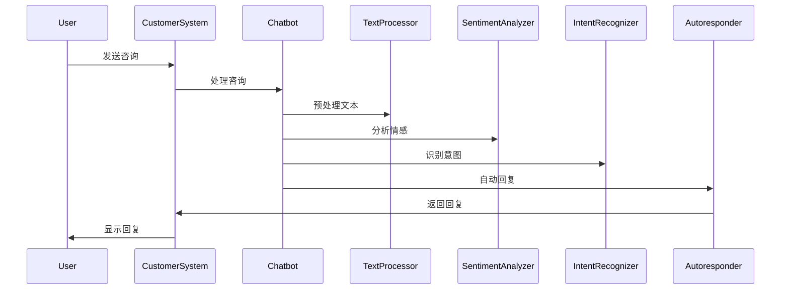
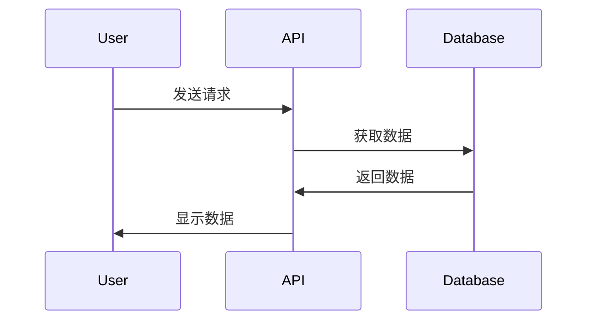

                 


# 《构建渐进复杂度的示例序列》

## 关键词
AI大模型，示例序列，渐进复杂度，算法，架构设计，最佳实践

## 摘要
本文旨在探讨如何构建渐进复杂度的示例序列，以便更好地理解和应用人工智能（AI）大模型。通过逐步分析AI大模型的核心概念、算法原理以及系统架构设计，本文将帮助读者从理论到实践全面掌握AI大模型的应用。此外，本文还将分享最佳实践和注意事项，为读者提供从理论到实践的全方位指导。

### 目录大纲设计

#### 第1章：背景介绍

**1.1 问题背景**
随着信息技术的迅猛发展，人工智能（AI）大模型的应用越来越广泛，然而如何有效地开发和利用这些模型以应对日益复杂的业务需求，成为企业和开发者关注的核心问题。本文将围绕这一问题，构建一个渐进复杂度的示例序列，帮助读者逐步理解和掌握AI大模型的应用。

**1.1.1 问题描述**
AI大模型的应用场景多样，从自然语言处理到计算机视觉，再到推荐系统，每一个场景都对模型提出了不同的要求。然而，现有的教程和文献往往缺乏对模型复杂度的逐步引导，使得初学者难以掌握AI大模型的核心技术和应用方法。

**1.1.2 问题解决**
本文通过构建一个渐进复杂度的示例序列，旨在解决上述问题。我们将从简单的AI应用场景入手，逐步增加模型的复杂度，帮助读者逐步掌握AI大模型的核心技术和应用方法。

**1.1.3 边界与外延**
本文主要关注AI大模型在计算机视觉、自然语言处理和推荐系统中的应用。然而，所讨论的方法和原理同样适用于其他AI领域，如语音识别、强化学习等。

**1.1.4 概念结构与核心要素组成**
AI大模型的核心概念包括神经网络、深度学习、自然语言处理等。核心要素组成包括模型构建、训练、优化和应用。本文将详细讲解这些概念和要素，帮助读者构建完整的AI大模型知识体系。

#### 第2章：核心概念与联系

**2.1 AI大模型原理**
AI大模型的基础理论是神经网络、深度学习和自然语言处理。本文将分别介绍这些概念的基本原理，并通过表格形式对比不同AI大模型的特点和应用领域。

**2.1.1 核心概念原理**
神经网络：神经网络是由大量简单神经元组成的复杂网络，通过模拟人脑的神经元连接方式，实现对复杂数据的处理和分析。
深度学习：深度学习是一种基于神经网络的机器学习技术，通过多层神经网络的结构，实现对复杂数据的高层次特征提取和表示。
自然语言处理：自然语言处理是计算机科学和语言学的交叉领域，旨在使计算机能够理解和处理人类自然语言。

**2.1.2 概念属性特征对比表格**

| AI大模型类型 | 特点 | 应用领域 |
| :--- | :--- | :--- |
| 神经网络 | 简单神经元组成，模拟人脑神经元连接方式 | 图像识别、语音识别 |
| 深度学习 | 多层神经网络，高维度特征提取 | 自然语言处理、推荐系统 |
| 自然语言处理 | 计算机理解和处理人类自然语言 | 文本分类、情感分析 |

**2.2 AI大模型架构**
AI大模型的架构设计是构建高效、可扩展模型的关键。本文将使用ER实体关系图架构，展示AI大模型的核心实体和关系，并通过详细讲解模型构建过程，帮助读者理解模型架构的内在逻辑。

**2.2.1 ER实体关系图架构**

```mermaid
erDiagram
    Model ||--|{ Layer } Layer
    Layer ||--|{ Node } Node
    Node ||--|{ Connection } Connection
```

**2.2.2 模型构建过程**
模型构建过程包括数据预处理、模型设计、模型训练和模型优化。本文将详细讲解每个阶段的实现方法，并通过实际案例进行演示。

### 第3章：算法原理讲解

**3.1 机器学习算法**
机器学习算法是AI大模型的核心组成部分。本文将介绍常见的机器学习算法，并通过mermaid流程图和Python源代码示例，详细讲解算法原理。

**3.1.1 算法mermaid流程图**


**3.1.2 Python源代码示例**

```python
# 导入必要的库
import numpy as np
from sklearn.model_selection import train_test_split
from sklearn.linear_model import LinearRegression

# 准备数据
X = np.array([[1], [2], [3], [4], [5]])
y = np.array([1, 2, 3, 4, 5])

# 数据处理
X_train, X_test, y_train, y_test = train_test_split(X, y, test_size=0.2, random_state=42)

# 模型训练
model = LinearRegression()
model.fit(X_train, y_train)

# 模型评估
score = model.score(X_test, y_test)
print(f"模型评估分数：{score}")

# 模型优化
# 可以通过调整模型参数，优化模型性能
```

**3.1.3 算法原理详细讲解**
机器学习算法的核心原理是通过学习数据中的特征和模式，构建预测模型。本文将详细解释线性回归、逻辑回归等常见算法的数学模型和公式，并通过示例说明算法的实现过程。

### 第4章：系统分析与架构设计方案

**4.1 问题场景介绍**
本文将以一个实际项目为例，介绍AI大模型在自然语言处理中的应用场景。该项目旨在实现一个智能客服系统，通过自然语言处理技术，实现对用户咨询的自动回复。

**4.2 系统功能设计**
系统功能设计包括文本预处理、情感分析、意图识别和自动回复等。本文将使用Mermaid绘制领域模型类图，展示系统的核心实体和关系。

**4.2.1 领域模型mermaid类图**

```mermaid
classDiagram
    Customer <<< User
    CustomerSystem <<-- Chatbot
    Chatbot o-- TextProcessor
    Chatbot o-- SentimentAnalyzer
    Chatbot o-- IntentRecognizer
    Chatbot o-- Autoresponder
```

**4.3 系统架构设计**
系统架构设计包括前端界面、后端服务器和数据库等。本文将使用Mermaid绘制系统架构图，展示系统的整体结构和组件。

**4.3.1 系统架构mermaid架构图**



**4.4 系统接口设计**
系统接口设计包括API接口、Websocket接口和数据库接口等。本文将描述系统的接口设计和交互方式。

**4.5 系统交互mermaid序列图**



### 第5章：项目实战

**5.1 环境安装**
本文将以一个实际项目为例，介绍如何在本地搭建一个AI大模型应用环境。本文将详细描述安装所需的软件和工具，以及安装步骤。

**5.2 系统核心实现**
本文将提供系统核心实现的源代码，包括关键模块和函数。本文还将对源代码进行解读，解释其实现原理和功能。

**5.3 代码应用解读与分析**
本文将选择一个实际案例，分析AI大模型的应用效果。本文将详细解读案例中的关键技术和方法，帮助读者理解AI大模型的应用原理。

**5.4 实际案例分析与详细讲解**
本文将选择一个实际项目，如智能客服系统，分析其应用效果。本文将详细讲解项目中的关键技术和方法，帮助读者理解AI大模型在真实场景中的应用。

**5.5 项目小结**
本文将总结项目的收获和不足，提出改进建议。本文还将回顾项目中的核心内容，帮助读者巩固所学知识。

### 第6章：最佳实践与拓展

**6.1 最佳实践 tips**
本文将分享AI大模型应用中的最佳实践和技巧。本文将提醒读者在应用AI大模型时需要注意的问题，并给出解决方案。

**6.2 小结**
本文将回顾各章节的核心内容，帮助读者巩固所学知识。

**6.3 注意事项**
本文将提醒读者在应用AI大模型时需要注意的问题，如数据质量、模型优化和部署等。

**6.4 拓展阅读**
本文将推荐进一步阅读的相关书籍和文献，帮助读者深入学习AI大模型的相关知识。

### 目录大纲

```markdown
# 《构建渐进复杂度的示例序列》目录大纲

# 第1章：背景介绍

## 1.1 问题背景
### 1.1.1 问题描述
### 1.1.2 问题解决
### 1.1.3 边界与外延
### 1.1.4 概念结构与核心要素组成

# 第2章：核心概念与联系

## 2.1 AI大模型原理
### 2.1.1 核心概念原理
### 2.1.2 概念属性特征对比表格
## 2.2 AI大模型架构
### 2.2.1 ER实体关系图架构
### 2.2.2 模型构建过程

# 第3章：算法原理讲解

## 3.1 机器学习算法
### 3.1.1 算法mermaid流程图
### 3.1.2 Python源代码示例
### 3.1.3 算法原理详细讲解
## 3.2 深度学习算法
### 3.2.1 算法mermaid流程图
### 3.2.2 Python源代码示例
### 3.2.3 算法原理详细讲解

# 第4章：系统分析与架构设计方案

## 4.1 问题场景介绍
### 4.1.1 项目介绍
### 4.1.2 系统功能设计
### 4.1.3 系统架构设计
### 4.1.4 系统接口设计
### 4.1.5 系统交互mermaid序列图

# 第5章：项目实战

## 5.1 环境安装
### 5.1.1 环境搭建步骤
## 5.2 系统核心实现
### 5.2.1 源代码
### 5.2.2 代码解读
## 5.3 代码应用解读与分析
### 5.3.1 案例分析
### 5.3.2 详细讲解
## 5.4 实际案例分析与详细讲解
### 5.4.1 案例分析
### 5.4.2 详细讲解
## 5.5 项目小结

# 第6章：最佳实践与拓展

## 6.1 最佳实践 tips
### 6.1.1 实战技巧
## 6.2 小结
## 6.3 注意事项
## 6.4 拓展阅读
```

### 标题

构建渐进复杂度的示例序列是一种高效的方法，可以帮助开发者逐步理解和应用人工智能（AI）大模型。本文将从背景介绍、核心概念与联系、算法原理讲解、系统分析与架构设计方案、项目实战以及最佳实践与拓展等多个方面，详细探讨如何构建这样一个示例序列。

在文章的开始部分，我们首先介绍了问题背景，指出了随着信息技术的发展，如何有效开发和利用AI大模型以应对复杂业务需求成为核心问题。我们提出了构建渐进复杂度的示例序列作为解决方案，以帮助读者逐步理解和掌握AI大模型的应用。

接下来，我们深入探讨了核心概念与联系，包括AI大模型的基本原理、架构设计以及算法原理。通过mermaid流程图和Python源代码示例，我们详细讲解了机器学习算法和深度学习算法的原理和应用。

在系统分析与架构设计方案部分，我们以一个实际项目为例，介绍了系统功能设计、系统架构设计、系统接口设计以及系统交互流程。通过Mermaid类图和序列图，我们展示了系统的整体结构和组件之间的交互关系。

随后，我们进行了项目实战，详细描述了环境安装、系统核心实现、代码应用解读与分析、实际案例分析与详细讲解等内容。通过这些实战经验，读者可以更好地理解AI大模型的应用原理和实践方法。

最后，在最佳实践与拓展部分，我们分享了AI大模型应用中的最佳实践和技巧，并提醒读者在应用过程中需要注意的问题。此外，我们还推荐了一些拓展阅读资源，以帮助读者进一步深入学习AI大模型的相关知识。

通过本文的详细讲解，读者可以系统地了解和掌握AI大模型的应用方法，为未来的项目开发和业务需求提供有力的技术支持。让我们一步一步地构建渐进复杂度的示例序列，共同迈向AI大模型的未来。

