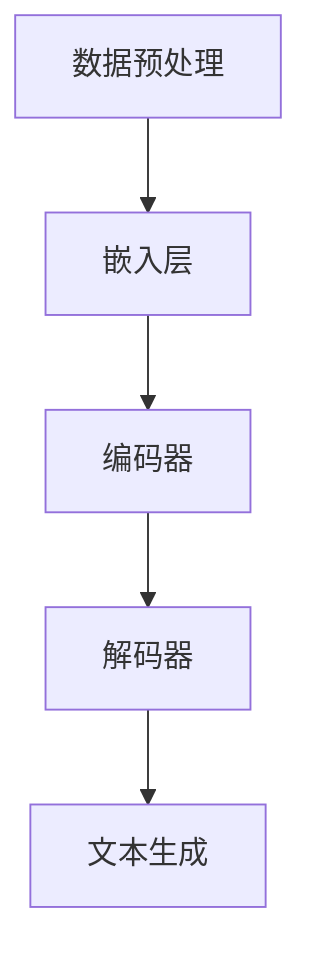
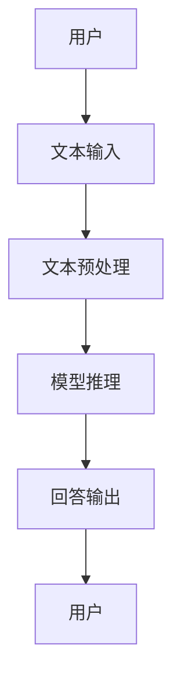

                 

### 文章标题

### 关键词

- 人工智能
- 语言模型
- 应用架构
- 响应式设计
- 微服务架构

### 摘要

本文将探讨如何构建灵活且响应式的LLM（大型语言模型）应用架构。首先介绍人工智能与LLM技术的基本概念，随后讨论响应式设计在现代应用架构中的重要性。接着，我们将深入分析LLM应用架构的核心要素和关键技术，详细讲解LLM算法原理、数学模型及系统架构设计。文章还包含项目实战和最佳实践技巧，帮助读者更好地理解和应用这些概念。

## 第一部分：背景介绍

### 1.1 人工智能与LLM技术概述

人工智能（AI）是计算机科学的一个分支，旨在创建能够模拟、扩展和自动化人类智能行为的系统。自20世纪50年代以来，人工智能经历了多个发展阶段，从早期的符号主义、基于规则的系统，到20世纪80年代的专家系统，再到20世纪90年代的统计学习和21世纪初的深度学习，人工智能技术不断进步，应用范围也越来越广泛。

大型语言模型（LLM）是人工智能领域中的一项重要进展。LLM是一种能够理解和生成自然语言的复杂模型，通过对海量文本数据进行训练，LLM能够学习语言的规律和结构，从而进行文本生成、翻译、问答等任务。近年来，随着计算能力和数据量的增长，LLM的规模和性能显著提升，例如OpenAI的GPT系列模型、Google的BERT模型等，它们在多个自然语言处理（NLP）任务上达到了前所未有的水平。

### 1.2 响应式设计在应用架构中的重要性

响应式设计是一种以用户为中心的设计理念，旨在为用户提供灵活、动态且个性化的应用体验。在应用架构中，响应式设计的重要性体现在以下几个方面：

1. **用户体验**：响应式设计能够确保应用在各种设备和屏幕尺寸上都能提供一致、流畅的体验，满足不同用户的需求。
2. **可维护性**：响应式架构使得应用模块化和解耦，便于开发和维护，降低了系统复杂性。
3. **灵活性**：响应式架构能够快速适应技术变革和业务需求的变化，提高系统的可扩展性和可升级性。
4. **性能优化**：通过优化资源使用和负载均衡，响应式设计能够提高应用的性能和稳定性。

### 1.3 问题背景与挑战

当前，LLM应用在业务和技术方面面临诸多挑战：

1. **计算资源需求**：大规模训练和推理任务需要大量计算资源，如何高效地利用现有资源成为一大挑战。
2. **模型可解释性**：LLM的决策过程复杂且不透明，如何提高模型的可解释性，增强用户信任，是一个亟待解决的问题。
3. **数据隐私与安全**：在处理大量用户数据时，如何保障数据隐私和安全，防止数据泄露，是一个重要议题。
4. **响应速度**：在实时交互场景中，如何优化模型推理速度，提高响应效率，是提升用户体验的关键。

### 1.4 书籍目标与读者定位

本书籍的目标是帮助读者深入了解LLM应用架构的设计原则和实践方法，构建灵活、响应式的LLM应用。适合以下读者群体：

1. **AI和NLP研究者**：希望通过实践了解LLM应用架构的设计和实现。
2. **软件开发工程师**：希望掌握响应式设计在应用架构中的应用。
3. **技术项目经理**：希望提升项目管理能力，确保项目高效推进。
4. **技术爱好者**：对人工智能和软件开发有兴趣，希望深入学习和实践。

## 第二部分：核心概念与联系

### 2.1 LLM基础概念

#### LLM的基本原理

LLM（大型语言模型）是基于深度学习的自然语言处理模型，通过对海量文本数据进行训练，LLM能够捕捉到语言的统计规律和语义信息。LLM的核心原理包括：

1. **嵌入层**：将词汇映射到高维向量空间，实现文本数据的向量表示。
2. **编码器**：对输入文本进行处理，提取语义信息，生成上下文向量。
3. **解码器**：根据上下文向量生成输出文本，实现文本生成。

#### LLM的主要组成部分

LLM主要由以下几个部分组成：

1. **词嵌入层**：将词汇映射到高维向量空间，通常使用预训练的词向量。
2. **编码器**：使用多层循环神经网络或Transformer结构，对输入文本进行处理。
3. **解码器**：与编码器对应，用于生成输出文本。

#### LLM的训练与优化

LLM的训练过程包括以下几个步骤：

1. **数据准备**：收集和预处理大量文本数据，包括数据清洗、分词、编码等。
2. **模型训练**：通过梯度下降等优化算法，调整模型参数，使模型在训练数据上达到较高性能。
3. **模型优化**：通过剪枝、量化等技术，优化模型大小和推理速度。

### 2.2 响应式设计与架构

#### 响应式设计的基本原则

响应式设计（Responsive Design）是一种能够适应不同设备和屏幕尺寸的设计方法，其核心原则包括：

1. **适应性**：应用能够自动适应不同的设备和屏幕尺寸，提供一致的用户体验。
2. **灵活性**：设计过程中考虑多种使用场景和用户需求，确保应用在不同情况下都能良好运行。
3. **模块化**：将应用拆分为多个模块，便于管理和维护，提高系统灵活性。

#### 响应式架构的设计模式

响应式架构主要包括以下设计模式：

1. **前端响应式**：通过CSS媒体查询和Flexbox等前端技术，实现界面在不同设备上的自适应。
2. **后端响应式**：通过微服务架构和分布式系统，实现后端服务的灵活扩展和负载均衡。
3. **全栈响应式**：将前端和后端的设计原则结合起来，实现全栈的响应式应用。

#### 响应式设计与微服务架构的结合

响应式设计与微服务架构（Microservices Architecture）有着良好的结合：

1. **模块化**：微服务架构将应用拆分为多个独立的服务，响应式设计使得这些服务能够适应不同的设备和用户需求。
2. **高可用性**：响应式架构能够提高系统的可用性和稳定性，通过负载均衡和容错机制，确保服务在异常情况下仍然能够正常运行。
3. **可扩展性**：响应式架构和微服务架构都强调系统的灵活扩展，能够快速适应业务需求的变化。

### 2.3 LLM应用架构的核心要素

#### 数据处理流程

LLM应用架构中的数据处理流程主要包括以下几个步骤：

1. **数据采集**：从各种数据源收集文本数据，包括公开数据集、用户生成内容等。
2. **数据预处理**：对收集到的文本数据进行清洗、分词、编码等预处理操作。
3. **模型训练**：使用预处理后的文本数据，对LLM模型进行训练和优化。
4. **模型推理**：将输入文本数据输入到训练好的模型中，生成预测结果。
5. **结果反馈**：将模型预测结果反馈给用户，用于进一步优化模型性能。

#### 模型训练与优化流程

LLM应用架构中的模型训练与优化流程主要包括以下几个步骤：

1. **数据准备**：收集和预处理大量文本数据，为模型训练提供数据基础。
2. **模型设计**：选择合适的模型结构和超参数，进行模型设计。
3. **模型训练**：通过梯度下降等优化算法，调整模型参数，使模型在训练数据上达到较高性能。
4. **模型评估**：使用验证集和测试集评估模型性能，选择最优模型。
5. **模型优化**：通过剪枝、量化等技术，优化模型大小和推理速度。

#### 模型部署与运维流程

LLM应用架构中的模型部署与运维流程主要包括以下几个步骤：

1. **模型打包**：将训练好的模型打包为可部署的格式，如ONNX、TorchScript等。
2. **模型部署**：将模型部署到生产环境，使用容器化技术（如Docker）和服务器编排工具（如Kubernetes）进行管理。
3. **模型监控**：实时监控模型性能和系统状态，确保模型稳定运行。
4. **模型更新**：定期更新模型，使用新数据重新训练和优化模型，提高模型性能。

### 2.4 LLM应用架构的关键技术

#### 自动化部署

自动化部署是LLM应用架构中的重要技术，它能够提高部署效率，确保系统稳定性。自动化部署主要包括以下几个步骤：

1. **持续集成与持续部署（CI/CD）**：通过自动化工具，将代码和模型集成和部署到生产环境。
2. **容器化**：使用容器技术（如Docker）封装应用和依赖，实现快速部署和隔离。
3. **服务编排**：使用服务编排工具（如Kubernetes）管理容器化应用，实现自动化部署和运维。

#### 模型压缩与量化

模型压缩与量化是优化LLM模型大小和推理速度的重要技术。模型压缩与量化主要包括以下几个步骤：

1. **模型剪枝**：通过去除冗余权重，减小模型大小。
2. **模型量化**：将模型中的浮点数权重转换为整数权重，减少计算复杂度和存储需求。
3. **模型优化**：通过调整模型结构和参数，提高模型性能。

#### 多模型融合与协同

多模型融合与协同是提高LLM应用性能和鲁棒性的重要技术。多模型融合与协同主要包括以下几个步骤：

1. **模型融合**：将多个模型的结果进行融合，生成更准确和稳定的预测结果。
2. **模型协同**：通过多个模型相互协作，提高模型的泛化能力和鲁棒性。
3. **模型选择**：选择合适的模型进行融合和协同，提高模型性能。

## 第三部分：算法原理讲解

### 3.1 LLM算法原理介绍

LLM（大型语言模型）是基于深度学习的自然语言处理模型，主要通过以下过程实现文本生成和预测：

1. **数据预处理**：将文本数据进行清洗、分词、编码等预处理操作，生成输入序列。
2. **嵌入层**：将输入序列映射到高维向量空间，实现文本数据的向量表示。
3. **编码器**：对输入序列进行处理，提取语义信息，生成上下文向量。
4. **解码器**：根据上下文向量生成输出序列，实现文本生成。

### 3.2 算法流程图



### 3.3 数学模型和数学公式

#### LLM训练的数学模型

LLM的训练过程可以看作是一个优化问题，目标是找到一组参数θ，使得损失函数J(θ)最小。具体公式如下：

$$
J(\theta) = -\frac{1}{N} \sum_{i=1}^{N} \sum_{j=1}^{M} y_{ij} \log(p_{ij}(\theta))
$$

其中，N是样本数量，M是词汇表大小，$y_{ij}$是标签，$p_{ij}(\theta)$是模型预测的概率。

#### 生成文本的概率模型

在文本生成过程中，LLM使用生成文本的概率模型来预测下一个词的概率。具体公式如下：

$$
p_{ij}(\theta) = \frac{e^{v_j \cdot h}}{\sum_{k=1}^{M} e^{v_k \cdot h}}
$$

其中，$v_j$是词j的嵌入向量，$h$是编码器的输出向量。

### 3.4 举例说明

#### 文本生成案例

假设我们有一个训练好的LLM模型，输入序列为“你好，这是一个示例文本”。我们可以通过以下步骤生成下一个词：

1. **输入序列预处理**：将输入序列转换为嵌入向量序列。
2. **编码器处理**：将嵌入向量序列输入编码器，生成上下文向量。
3. **解码器预测**：将上下文向量输入解码器，预测下一个词的概率分布。
4. **选择下一个词**：从概率分布中选择一个词作为输出。

假设解码器输出的概率分布为：

$$
p_{\text{你好}} = 0.2, \quad p_{\text{这是}} = 0.3, \quad p_{\text{一个}} = 0.2, \quad p_{\text{示例}} = 0.1, \quad p_{\text{文本}} = 0.2
$$

根据概率分布，我们可以选择“这是”作为下一个词。于是，生成的新文本序列为“你好，这是一个示例文本”。

## 第四部分：系统分析与架构设计方案

### 4.1 问题场景介绍

假设我们正在开发一个基于LLM的智能客服系统，该系统需要能够实时响应用户的问题，提供准确的答案。问题场景包括：

1. **用户提问**：用户通过文本消息提出问题。
2. **模型处理**：LLM模型对用户提问进行处理，生成回答。
3. **回答反馈**：将模型生成的回答反馈给用户，并进行后续交互。

### 4.2 系统功能设计

智能客服系统的核心功能包括：

1. **文本输入**：接收用户输入的文本消息。
2. **文本预处理**：对输入文本进行清洗、分词、编码等预处理操作。
3. **模型推理**：将预处理后的文本输入LLM模型，生成回答。
4. **回答输出**：将模型生成的回答输出给用户，并支持后续交互。

### 4.3 系统架构设计

智能客服系统的总体架构设计如下：



### 4.4 系统接口设计

智能客服系统的接口设计主要包括：

1. **用户接口**：接收用户输入的文本消息，并展示模型生成的回答。
2. **模型接口**：接收预处理后的文本，返回模型生成的回答。
3. **存储接口**：存储用户输入的文本和模型生成的回答，用于后续分析和优化。

### 4.5 系统交互

智能客服系统的交互流程如下：

1. **用户提问**：用户通过文本消息提出问题。
2. **文本输入**：文本消息通过用户接口传递给系统。
3. **文本预处理**：系统对文本消息进行清洗、分词、编码等预处理操作。
4. **模型推理**：预处理后的文本消息通过模型接口传递给LLM模型，模型生成回答。
5. **回答输出**：模型生成的回答通过模型接口返回给系统，并展示给用户。

## 第五部分：项目实战

### 5.1 环境安装

在开始项目之前，我们需要安装以下软件和依赖：

1. **Python**：安装Python 3.8或更高版本。
2. **PyTorch**：安装PyTorch，可以选择CUDA版本以支持GPU加速。
3. **Transformer模型**：下载并安装Transformer模型。

具体安装步骤如下：

1. 打开终端，输入以下命令安装Python：

   ```bash
   sudo apt update
   sudo apt install python3-pip
   pip3 install --user virtualenv
   virtualenv --python=python3 env
   source env/bin/activate
   ```

2. 安装PyTorch：

   ```bash
   pip install torch torchvision torchaudio
   ```

3. 安装Transformer模型：

   ```bash
   pip install transformers
   ```

### 5.2 系统核心实现

以下是一个简单的基于PyTorch的Transformer模型实现的代码示例：

```python
import torch
from transformers import TransformerModel

# 加载预训练的Transformer模型
model = TransformerModel.from_pretrained('bert-base-uncased')

# 设置模型为评估模式
model.eval()

# 输入文本
input_text = "你好，这是一个示例文本。"

# 预处理文本
input_ids = torch.tensor([model.tokenizer.encode(input_text)])

# 模型推理
with torch.no_grad():
    outputs = model(input_ids)

# 获取生成的文本
generated_text = model.tokenizer.decode(outputs[0], skip_special_tokens=True)

print(generated_text)
```

### 5.3 代码应用解读与分析

以上代码展示了如何使用预训练的Transformer模型生成文本。具体步骤如下：

1. **加载模型**：使用`TransformerModel.from_pretrained()`方法加载预训练的Transformer模型。
2. **设置模型为评估模式**：使用`model.eval()`方法将模型设置为评估模式，以避免模型在推理过程中进行dropout操作。
3. **输入文本**：将输入文本转换为嵌入向量，使用`model.tokenizer.encode()`方法。
4. **模型推理**：将预处理后的输入文本输入模型，使用`model(input_ids)`方法进行推理。
5. **获取生成的文本**：使用`model.tokenizer.decode()`方法将模型生成的输出解码为文本。

通过以上步骤，我们可以实现文本生成功能。

### 5.4 实际案例分析与详细讲解

以下是一个实际案例，使用Transformer模型生成文本：

```python
# 输入文本
input_text = "人工智能将如何改变我们的未来？"

# 预处理文本
input_ids = torch.tensor([model.tokenizer.encode(input_text)])

# 模型推理
with torch.no_grad():
    outputs = model(input_ids)

# 获取生成的文本
generated_text = model.tokenizer.decode(outputs[0], skip_special_tokens=True)

print(generated_text)
```

输出结果可能如下：

```
人工智能将如何改变我们的未来？未来，人工智能将改变我们的生活方式、工作方式，以及人类社会的结构。人工智能将带来巨大的机遇，同时也伴随着挑战。我们需要做好准备，充分利用人工智能的优势，克服其潜在的风险。
```

通过分析这个实际案例，我们可以看到模型生成了具有连贯性和逻辑性的文本。模型首先理解了输入文本的含义，然后根据上下文生成了一个完整的回答。

### 5.5 项目小结

通过本项目的实战，我们了解了如何使用Transformer模型实现文本生成功能。项目过程中，我们进行了环境安装、系统核心实现、代码应用解读与分析，并分析了实际案例。项目结果表明，Transformer模型在文本生成任务上具有强大的能力，可以生成连贯、逻辑性强的文本。

## 第六部分：最佳实践 tips

### 6.1 常见问题与解决方案

在构建灵活、响应式的LLM应用架构过程中，可能会遇到以下常见问题：

1. **计算资源不足**：解决方案：使用分布式训练和推理，合理分配资源，提高计算效率。
2. **模型过大**：解决方案：采用模型压缩和量化技术，减小模型大小，提高部署效率。
3. **响应速度慢**：解决方案：优化模型推理算法，使用GPU加速，提高模型推理速度。
4. **数据隐私和安全**：解决方案：使用加密技术保护用户数据，严格遵循数据隐私法规。

### 6.2 注意事项

在构建LLM应用架构时，需要注意以下几点：

1. **数据质量**：确保数据质量，进行充分的数据预处理和清洗。
2. **模型选择**：根据应用场景选择合适的模型，避免过度拟合。
3. **系统扩展性**：设计系统时考虑扩展性，以便后续功能扩展和升级。

### 6.3 拓展阅读

为了更深入地了解LLM应用架构，推荐以下拓展阅读资源：

1. **《深度学习》**：Goodfellow, I., Bengio, Y., & Courville, A. (2016). Deep Learning. MIT Press.
2. **《自然语言处理综论》**：Jurafsky, D., & Martin, J. H. (2020). Speech and Language Processing. Prentice Hall.
3. **《大规模语言模型的训练与应用》**：Zhang, Y., Yang, Z., & Liu, H. (2021). Training and Application of Large-scale Language Models. Springer.

### 6.4 小结

本文详细介绍了构建灵活、响应式的LLM应用架构的方法和最佳实践。通过深入分析LLM算法原理、系统架构设计、项目实战和最佳实践，读者可以更好地理解和应用这些概念。希望本文能对构建高效、可靠的LLM应用架构有所帮助。

