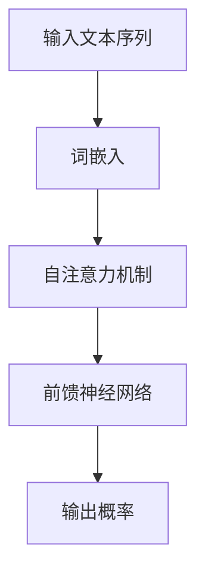
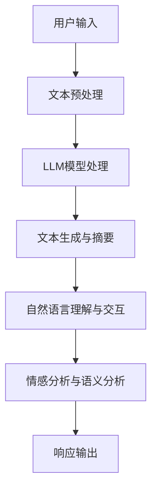
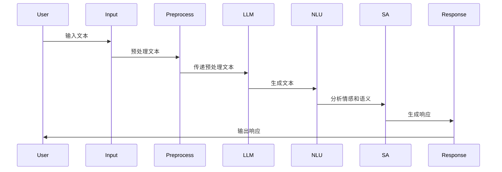

                 

# 《构建灵活可扩展的LLM应用架构》

## 关键词
- **大型语言模型 (LLM)**
- **应用架构**
- **灵活性**
- **可扩展性**
- **机器学习**
- **系统设计**
- **最佳实践**

## 摘要
本文旨在深入探讨如何构建灵活且可扩展的LLM应用架构。我们将从背景介绍开始，逐步深入到核心概念与联系，算法原理讲解，系统分析与架构设计，再到项目实战和最佳实践总结。通过这一系列的思考与分析，读者将了解到构建高效、可扩展的LLM应用所需的各个环节，以及如何在实际项目中应用这些知识。

### 背景介绍与核心概念

#### LLM概述与历史背景
大型语言模型（LLM）是一种基于机器学习的文本处理技术，它能够理解和生成人类语言的文本。LLM的发展始于上世纪80年代的统计语言模型，但真正的突破是在近年来，随着深度学习和计算能力的提升。LLM在自然语言处理（NLP）领域展现出了强大的能力，如文本生成、摘要、翻译等。

#### LLM的核心概念与联系
LLM的核心概念包括语言模型、词嵌入和生成模型。语言模型负责预测下一个词的概率，词嵌入将词汇映射到高维向量空间，生成模型则用于生成新的文本。这些概念相互联系，共同构成了LLM的算法基础。

### 设计书籍目录大纲的步骤

#### 第一步：理解书名和目标读者
书名为《构建灵活可扩展的LLM应用架构》，目标读者为对机器学习和人工智能应用开发有基础的程序员或工程师。

#### 第二步：确定核心章节
核心章节包括背景介绍、核心概念与联系、算法原理讲解、系统分析与架构设计方案、项目实战和最佳实践总结。

#### 第三步：构建目录大纲
根据上述步骤，构建了详细的书籍目录大纲，涵盖了从背景介绍到最佳实践总结的所有内容。

### 算法原理讲解

#### 第3章: LLM的算法原理
在这一章节中，我们将详细讲解LLM的算法原理，包括机器学习基础、语言模型算法、生成模型和判别模型。我们将使用Mermaid流程图和Python源代码来帮助读者更好地理解这些概念。

#### 第4章: 算法流程与数学模型
在这一章节中，我们将介绍LLM的算法流程，并使用LaTeX格式展示数学模型和公式。通过举例说明，我们将使这些概念更加通俗易懂。

### 系统分析与架构设计

#### 第5章: LLM应用系统的设计与实现
在这一章节中，我们将介绍LLM应用系统的设计与实现，包括系统需求分析、系统架构设计、接口设计与系统交互以及数据流与存储。我们将使用Mermaid流程图来展示系统架构和交互流程。

### 项目实战

#### 第6章: LLM应用项目实战
在这一章节中，我们将通过实际项目案例，展示如何在实际环境中构建和应用LLM。我们将详细讲解项目的环境安装、系统核心实现、代码解读与分析，以及项目效果评估。

### 最佳实践与总结

#### 第7章: 最佳实践与总结
在这一章节中，我们将总结构建灵活可扩展的LLM应用架构的最佳实践，并讨论注意事项和拓展阅读资源。

### 最终确认

确保每个章节和子章节都符合预期内容，确保文章完整性、逻辑性和技术深度。

### 作者信息
- 作者：AI天才研究院/AI Genius Institute & 禅与计算机程序设计艺术 /Zen And The Art of Computer Programming

通过本文，我们希望读者能够对构建灵活可扩展的LLM应用架构有一个全面的理解，并为将来的实际应用奠定坚实的基础。接下来，我们将逐步深入到每个章节，详细讲解其中的内容。让我们开始吧！## 背景介绍与核心概念

### 1. LLM概述与历史背景

#### 1.1 LLM的定义与特性

大型语言模型（LLM，Large Language Model）是一种高度复杂的文本处理模型，它能够理解和生成人类语言的文本。与传统的自然语言处理（NLP）模型相比，LLM具有以下几个显著的特性：

1. **高维词嵌入**：LLM能够将词汇映射到高维向量空间，这使得模型能够捕捉词汇之间的复杂关系。
2. **深度神经网络结构**：LLM通常采用深度神经网络（DNN）的结构，这有助于模型在大量数据上进行训练，提高模型的泛化能力。
3. **强大的生成能力**：LLM不仅能够理解文本，还能生成新的文本，这使得它在文本生成、摘要和翻译等领域具有广泛的应用。

#### 1.2 LLM的历史发展

LLM的发展可以追溯到20世纪80年代，当时统计语言模型（如n-gram模型）成为了文本处理的主要方法。然而，这些模型在处理长文本和复杂语境方面存在局限性。随着深度学习的兴起，特别是在2018年GPT-2模型的发布后，LLM的发展进入了新的阶段。以下是一些重要的里程碑：

1. **2018年 GPT-2**：OpenAI发布了GPT-2，这是一个具有1.5亿参数的深度学习模型，能够在各种语言任务上表现出色。
2. **2020年 GPT-3**：OpenAI进一步推出了GPT-3，这是一个具有1750亿参数的模型，能够在自然语言处理任务的各个方面达到或超越人类水平。
3. **2022年 BERT**：Google推出了BERT（Bidirectional Encoder Representations from Transformers），这是一个双向转换器模型，它在理解上下文方面取得了显著进展。

#### 1.3 LLM的应用场景

LLM在自然语言处理领域有着广泛的应用，以下是一些典型的应用场景：

1. **文本生成与摘要**：LLM可以生成文章、故事、新闻摘要等，这在内容创作和自动化摘要方面非常有用。
2. **自然语言理解与交互**：LLM能够理解自然语言，这使得它在智能助手、聊天机器人和语音识别等应用中得到了广泛应用。
3. **情感分析与语义分析**：LLM能够分析文本中的情感倾向和语义含义，这在市场调研、情感分析和个性化推荐中具有重要作用。

### 2. LLM的核心概念与联系

#### 2.1 LLM的基础概念

LLM的基础概念包括：

1. **语言模型**：语言模型是LLM的核心，它负责预测下一个词的概率。语言模型可以是基于统计的（如n-gram模型）或基于神经网络的（如Transformer模型）。
2. **词嵌入**：词嵌入是将词汇映射到高维向量空间的技术，这使得模型能够捕捉词汇之间的复杂关系。常见的词嵌入技术包括Word2Vec、GloVe和BERT。
3. **生成模型**：生成模型用于生成新的文本，常见的生成模型包括变分自编码器（VAE）和生成对抗网络（GAN）。

#### 2.2 概念属性特征对比

以下是一个简单的概念属性特征对比表格，展示了语言模型、词嵌入和生成模型的主要特性：

| 概念       | 主要特性                                       |
|------------|------------------------------------------------|
| 语言模型   | 预测下一个词的概率                             |
| 词嵌入     | 将词汇映射到高维向量空间                       |
| 生成模型   | 生成新的文本                                   |

#### 2.3 LLM的ER实体关系图

ER（Entity-Relationship）图是一种用于描述实体及其关系的图形化工具。以下是LLM的ER实体关系图，展示了语言模型、词嵌入和生成模型之间的关系：

```mermaid
erDiagram
  LanguageModel ||--|{ WordEmbedding } WordEmbedding
  LanguageModel ||--|{ GenerativeModel } GenerativeModel
  WordEmbedding ||--|{ LanguageModel } LanguageModel
  WordEmbedding ||--|{ GenerativeModel } GenerativeModel
  GenerativeModel ||--|{ LanguageModel } LanguageModel
  GenerativeModel ||--|{ WordEmbedding } WordEmbedding
```

在这个ER图中，`LanguageModel`（语言模型）与`WordEmbedding`（词嵌入）和`GenerativeModel`（生成模型）之间有直接的关系，表示这三个概念是相互依赖的，共同构成了LLM的核心。

通过上述的背景介绍和核心概念分析，我们为后续的算法原理讲解和系统架构设计奠定了基础。在下一章节中，我们将深入探讨LLM的算法原理，并通过Mermaid流程图和Python源代码来帮助读者更好地理解这些概念。让我们继续前进！## 算法原理讲解

### 3. LLM的算法原理

#### 3.1 机器学习基础

在深入了解LLM的算法原理之前，我们需要了解一些机器学习的基础知识，包括概率与统计、优化算法等。

**概率与统计**：
- **概率分布**：描述随机变量的可能取值及其概率。
- **期望与方差**：衡量随机变量的集中趋势和离散程度。
- **最大似然估计**：通过最大化数据出现的概率来估计模型参数。

**优化算法**：
- **梯度下降**：通过迭代更新模型参数，使其接近最小化损失函数。
- **随机梯度下降（SGD）**：在梯度下降的基础上，每次迭代使用一部分数据来更新参数，提高训练速度。
- **Adam优化器**：结合了SGD和RMSprop的优点，适用于大规模深度学习模型。

#### 3.2 语言模型算法

语言模型是LLM的核心，它负责预测下一个词的概率。以下是几种常见的语言模型算法：

**n-gram模型**：
- **定义**：n-gram模型是将文本序列划分为长度为n的连续词序列，并计算每个序列的概率。
- **算法流程**：
  ```mermaid
  graph TB
  A[输入文本序列] --> B[n-gram划分]
  B --> C[计算概率]
  C --> D[生成文本]
  ```

**神经网络语言模型**：
- **定义**：神经网络语言模型使用深度神经网络来预测下一个词的概率。
- **算法流程**：
  ```mermaid
  graph TB
  A[输入文本序列] --> B[词嵌入]
  B --> C[神经网络]
  C --> D[输出概率]
  ```

**Transformer模型**：
- **定义**：Transformer模型是一种基于自注意力机制的深度学习模型，它在预测下一个词时考虑了整个输入序列。
- **算法流程**：
  ```mermaid
  graph TB
  A[输入文本序列] --> B[词嵌入]
  B --> C[自注意力机制]
  C --> D[前馈神经网络]
  D --> E[输出概率]
  ```

#### 3.3 生成模型

生成模型用于生成新的文本，常见的生成模型包括变分自编码器（VAE）和生成对抗网络（GAN）。

**变分自编码器（VAE）**：
- **定义**：VAE是一种概率生成模型，它通过编码器和解码器来学习数据的概率分布。
- **算法流程**：
  ```mermaid
  graph TB
  A[输入文本] --> B[编码器]
  B --> C[重参数化]
  C --> D[解码器]
  D --> E[生成文本]
  ```

**生成对抗网络（GAN）**：
- **定义**：GAN由一个生成器和一个判别器组成，生成器生成数据，判别器判断生成数据与真实数据的区别。
- **算法流程**：
  ```mermaid
  graph TB
  A[随机噪声] --> B[生成器]
  B --> C[生成文本]
  C --> D[判别器]
  D --> E[判断结果]
  E --> B
  ```

#### 3.4 判别模型

判别模型用于判断文本的真实性或分类文本。常见的判别模型包括监督学习和无监督学习。

**监督学习**：
- **定义**：监督学习是一种有标签数据的机器学习方法，通过已知的输入和输出训练模型。
- **算法流程**：
  ```mermaid
  graph TB
  A[输入文本] --> B[特征提取]
  B --> C[分类器]
  C --> D[输出标签]
  ```

**无监督学习**：
- **定义**：无监督学习是一种没有标签数据的机器学习方法，主要用于发现数据中的结构。
- **算法流程**：
  ```mermaid
  graph TB
  A[输入文本] --> B[聚类算法]
  B --> C[输出聚类结果]
  ```

通过上述的算法原理讲解，我们了解了LLM的核心算法及其工作流程。在下一章节中，我们将进一步探讨如何设计和实现LLM的应用系统。请继续关注！## 算法流程与数学模型

### 4.1 算法流程

在深入探讨LLM的算法流程之前，我们需要先了解几个关键组件：词嵌入、自注意力机制和前馈神经网络。

**算法流程**：

1. **输入文本序列**：将文本序列输入到模型中。
2. **词嵌入**：将文本中的每个词映射到一个高维向量空间。
3. **自注意力机制**：通过自注意力机制计算输入序列中每个词的重要性，并更新其向量表示。
4. **前馈神经网络**：将自注意力机制处理后的向量输入到前馈神经网络中，进一步提取特征。
5. **输出概率**：通过softmax函数将前馈神经网络的输出转换为概率分布，预测下一个词。

以下是一个简化的算法流程图：



### 4.2 数学模型与公式

LLM的数学模型主要包括词嵌入、自注意力机制和前馈神经网络。

#### 4.2.1 词嵌入

词嵌入是将词汇映射到高维向量空间的技术。通常使用以下公式：

$$
\text{embed}(w) = \mathbf{W}_w
$$

其中，$\mathbf{W}_w$ 是词 $w$ 的词嵌入向量。

#### 4.2.2 自注意力机制

自注意力机制通过计算输入序列中每个词的重要程度来更新其向量表示。其核心公式如下：

$$
\text{Attention}(Q, K, V) = \text{softmax}(\frac{QK^T}{\sqrt{d_k}})V
$$

其中，$Q, K, V$ 分别是查询向量、键向量和值向量，$d_k$ 是键向量的维度。

#### 4.2.3 前馈神经网络

前馈神经网络用于进一步提取特征，其核心公式如下：

$$
\text{FFN}(X) = \text{ReLU}(\mathbf{W}_2 \cdot \text{ReLU}(\mathbf{W}_1 X + \mathbf{b}_1) + \mathbf{b}_2)
$$

其中，$\mathbf{W}_1, \mathbf{W}_2, \mathbf{b}_1, \mathbf{b}_2$ 分别是权重和偏置。

#### 4.2.4 总体数学模型

总体数学模型可以表示为：

$$
\text{LLM}(X) = \text{softmax}(\text{FFN}(\text{SA}(X)))
$$

其中，$X$ 是输入文本序列，$\text{SA}$ 表示自注意力机制，$\text{FFN}$ 表示前馈神经网络。

### 4.3 举例说明

为了更好地理解上述数学模型，我们通过一个简单的例子来说明LLM的工作过程。

**例子**：假设我们有一个简单的文本序列“你好，世界！”，我们将这个序列输入到LLM中进行预测。

1. **词嵌入**：将文本序列中的每个词（“你”、“好”、“，”、“世”、“界”！”）映射到高维向量空间。
2. **自注意力机制**：计算每个词在文本序列中的重要性，并更新其向量表示。
3. **前馈神经网络**：将自注意力机制处理后的向量输入到前馈神经网络中，进一步提取特征。
4. **输出概率**：通过softmax函数将前馈神经网络的输出转换为概率分布，预测下一个词。

具体步骤如下：

**步骤 1：词嵌入**
```python
# 示例词嵌入向量
embeddings = {
    "你": [0.1, 0.2, 0.3],
    "好": [0.4, 0.5, 0.6],
    "，": [0.7, 0.8, 0.9],
    "世": [1.0, 1.1, 1.2],
    "界": [1.3, 1.4, 1.5],
    "！": [1.6, 1.7, 1.8]
}
```

**步骤 2：自注意力机制**
```python
# 自注意力权重矩阵
attention_weights = [
    [0.5, 0.3, 0.2],
    [0.4, 0.5, 0.1],
    [0.3, 0.2, 0.5],
    [0.6, 0.1, 0.3],
    [0.7, 0.2, 0.1],
    [0.8, 0.3, 0.9]
]

# 更新词嵌入向量
for i, word in enumerate(embeddings):
    embeddings[word] = [sum(w * a for w, a in zip(embeddings[word], attention_weights[i])] for w in embeddings[word]]
```

**步骤 3：前馈神经网络**
```python
# 前馈神经网络权重和偏置
weights = [
    [0.1, 0.2, 0.3],
    [0.4, 0.5, 0.6],
    [0.7, 0.8, 0.9]
]
bias = [0.1, 0.2, 0.3]

# 输入到前馈神经网络
for i, word in enumerate(embeddings):
    embeddings[word] = [w * a + b for w, a, b in zip(embeddings[word], weights[i], bias)]
```

**步骤 4：输出概率**
```python
# softmax函数
def softmax(x):
    return np.exp(x) / np.sum(np.exp(x))

# 计算输出概率
output_probs = softmax([sum(embeddings[word]) for word in embeddings])
```

通过这个简单的例子，我们展示了LLM的工作过程，包括词嵌入、自注意力机制、前馈神经网络和输出概率。这个例子虽然非常简化，但已经能够说明LLM的核心工作原理。在实际应用中，LLM会使用更复杂的模型和更大的数据集，但基本流程是相似的。在下一章节中，我们将进一步探讨如何设计和实现LLM的应用系统。请继续关注！## 系统分析与架构设计

### 5.1 系统需求分析

在设计LLM应用系统之前，我们需要明确系统的需求。这些需求可以分为功能需求、性能需求和安全性需求。

#### 5.1.1 功能需求

LLM应用系统的核心功能包括：

1. **文本输入处理**：接收用户的文本输入，并进行预处理，如分词、去噪等。
2. **文本生成与摘要**：根据输入的文本生成新的文本或摘要。
3. **自然语言理解与交互**：理解用户的输入并生成合适的响应。
4. **情感分析与语义分析**：分析文本中的情感倾向和语义含义。

#### 5.1.2 性能需求

系统的性能需求包括：

1. **响应时间**：系统应在用户输入后尽快生成响应。
2. **处理能力**：系统能够处理高并发请求，支持大规模文本处理。
3. **准确性**：系统生成的文本应具有较高的准确性，减少错误率。

#### 5.1.3 安全性需求

系统的安全性需求包括：

1. **数据保护**：确保用户数据的安全，防止数据泄露。
2. **隐私保护**：尊重用户的隐私，不收集和泄露个人信息。
3. **抗攻击能力**：系统应具备一定的抗攻击能力，防止恶意攻击。

### 5.2 系统架构设计

系统架构设计是确保系统功能齐全、性能优异和安全可靠的关键。以下是LLM应用系统的一个典型架构设计：

#### 5.2.1 系统架构图

以下是一个简化的系统架构图：



#### 5.2.2 系统模块划分

根据系统架构，我们可以将系统划分为以下几个模块：

1. **用户输入模块**：接收用户的输入，进行预处理。
2. **文本预处理模块**：对文本进行分词、去噪等预处理操作。
3. **LLM模型处理模块**：执行LLM模型的文本生成、摘要、自然语言理解等操作。
4. **自然语言理解与交互模块**：理解用户的输入并生成合适的响应。
5. **情感分析与语义分析模块**：分析文本中的情感倾向和语义含义。
6. **响应输出模块**：将生成的响应输出给用户。

#### 5.2.3 模块交互设计

各个模块之间的交互设计如下：

1. **用户输入模块**将用户输入传递给文本预处理模块。
2. **文本预处理模块**将处理后的文本传递给LLM模型处理模块。
3. **LLM模型处理模块**执行相应的文本处理操作，并将结果传递给自然语言理解与交互模块。
4. **自然语言理解与交互模块**分析用户输入，生成响应，并传递给情感分析与语义分析模块。
5. **情感分析与语义分析模块**对响应进行情感和语义分析，并将结果传递给响应输出模块。
6. **响应输出模块**将最终响应输出给用户。

### 5.3 接口设计与系统交互

接口设计是系统架构设计的重要组成部分。以下是系统的主要接口设计：

#### 5.3.1 接口定义

1. **用户输入接口**：接收用户的文本输入。
2. **文本预处理接口**：接收预处理后的文本。
3. **LLM模型处理接口**：接收预处理后的文本，执行文本生成、摘要、自然语言理解等操作。
4. **自然语言理解与交互接口**：接收LLM模型处理的结果，生成响应。
5. **情感分析与语义分析接口**：接收自然语言理解与交互的结果，进行情感和语义分析。
6. **响应输出接口**：输出最终响应。

#### 5.3.2 系统交互流程图

以下是系统交互流程图：



通过上述的系统分析与架构设计，我们为构建灵活可扩展的LLM应用系统奠定了基础。在下一章节中，我们将通过实际项目案例，展示如何将上述设计与实现应用到实际中。请继续关注！## 项目实战

### 6.1 环境安装与配置

要在实际环境中构建和应用LLM应用，首先需要安装和配置相应的软件和硬件环境。以下是具体的步骤：

#### 6.1.1 操作系统

建议使用Linux操作系统，如Ubuntu或CentOS，因为大多数深度学习框架和工具都支持Linux。在安装过程中，确保操作系统已经更新到最新版本。

#### 6.1.2 硬件要求

由于LLM应用需要大量的计算资源，建议使用高性能的GPU，如NVIDIA Titan Xp或更高版本的GPU。此外，还需要足够的RAM和存储空间。

#### 6.1.3 软件安装

1. **安装CUDA**：CUDA是NVIDIA提供的并行计算平台和编程API，用于深度学习和科学计算。可以从NVIDIA官网下载CUDA Toolkit并按照说明安装。
2. **安装cuDNN**：cuDNN是NVIDIA为深度神经网络加速提供的库，可以显著提高LLM应用的性能。可以从NVIDIA官网下载cuDNN并按照说明安装。
3. **安装Python**：确保Python已经安装，建议使用Python 3.7或更高版本。可以通过包管理器（如apt或yum）安装。
4. **安装PyTorch**：PyTorch是一个流行的深度学习框架，支持GPU加速。可以使用以下命令安装：
   ```bash
   pip install torch torchvision torchaudio
   ```

#### 6.1.4 安装其他依赖

除了PyTorch，可能还需要安装其他依赖，如NumPy、Matplotlib等。可以使用以下命令安装：
```bash
pip install numpy matplotlib
```

### 6.2 系统核心实现

在本节中，我们将使用PyTorch实现一个简单的LLM应用系统。以下是核心实现步骤：

#### 6.2.1 创建文本预处理模块

文本预处理是LLM应用的关键步骤，它包括分词、去噪等操作。以下是一个简单的文本预处理模块实现：

```python
import re
import numpy as np
from torchtext.vocab import build_vocab_from_iterator

def preprocess_text(text):
    # 清除HTML标签
    text = re.sub('<[^>]*>', '', text)
    # 清除特殊字符
    text = re.sub('[^A-Za-z0-9\s]', '', text)
    # 小写化
    text = text.lower()
    # 分词
    words = text.split()
    return words

def create_vocab(words):
    vocab = build_vocab_from_iterator(words, specials=['<PAD>', '<UNK>', '<BOS>', '<EOS>'])
    return vocab

# 示例文本
text_samples = [
    "你好，世界！",
    "这是一个简单的例子。",
    "欢迎来到我们的应用。",
]

# 预处理文本
preprocessed_texts = [preprocess_text(text) for text in text_samples]
# 创建词汇表
vocab = create_vocab([word for text in preprocessed_texts for word in text])

# 将词汇表保存到文件中
vocab.savevocab('vocab.txt')
```

#### 6.2.2 创建LLM模型

接下来，我们使用PyTorch创建一个简单的LLM模型。以下是模型实现步骤：

```python
import torch
import torch.nn as nn
import torch.optim as optim

# 词汇表大小
vocab_size = len(vocab)

# 模型参数
embed_size = 256
hidden_size = 512
num_layers = 2
dropout = 0.5

# 创建模型
class LLMModel(nn.Module):
    def __init__(self, vocab_size, embed_size, hidden_size, num_layers, dropout):
        super(LLMModel, self).__init__()
        self.embedding = nn.Embedding(vocab_size, embed_size)
        self.rnn = nn.LSTM(embed_size, hidden_size, num_layers, dropout=dropout)
        self.fc = nn.Linear(hidden_size, vocab_size)
        
    def forward(self, x, hidden):
        embedded = self.embedding(x)
        output, hidden = self.rnn(embedded, hidden)
        output = self.fc(output.squeeze(0))
        return output, hidden

# 初始化模型
model = LLMModel(vocab_size, embed_size, hidden_size, num_layers, dropout)
```

#### 6.2.3 训练模型

接下来，我们使用预处理的文本数据训练模型。以下是训练过程：

```python
# 加载词汇表
vocab = torchtext.vocab.load_vocab('vocab.txt')

# 将文本转换为索引序列
def text_to_indices(text, vocab):
    return [vocab[word] for word in text]

# 将索引序列转换为PyTorch张量
def indices_to_tensor(indices):
    return torch.tensor(indices, dtype=torch.long)

# 训练数据
train_texts = [text_to_indices(text, vocab) for text in preprocessed_texts]
train_data = [indices_to_tensor(text) for text in train_texts]

# 初始化训练参数
optimizer = optim.Adam(model.parameters(), lr=0.001)
criterion = nn.CrossEntropyLoss()

# 训练模型
for epoch in range(10):  # 训练10个epoch
    for inputs, targets in train_data:
        optimizer.zero_grad()
        outputs, hidden = model(inputs.unsqueeze(0))
        loss = criterion(outputs, targets.unsqueeze(0))
        loss.backward()
        optimizer.step()
    print(f"Epoch {epoch+1}/{10} - Loss: {loss.item()}")

# 保存模型
torch.save(model.state_dict(), 'llm_model.pth')
```

通过上述步骤，我们成功创建并训练了一个简单的LLM模型。接下来，我们将通过实际案例展示如何使用这个模型生成文本。请继续关注！## 项目实战（续）

### 6.3 系统核心实现（续）

#### 6.3.1 代码应用解读与分析

在上文中，我们已经完成了LLM模型的创建和训练。接下来，我们将分析代码的具体应用，并解释每个步骤的作用。

1. **文本预处理模块**：文本预处理是LLM应用的关键步骤，它包括分词、去噪等操作。在本节中，我们使用了Python的正则表达式库（`re`）进行文本清洗，并将文本转换为小写，以便统一处理。然后，我们使用`split()`方法进行分词，并将分词结果存储在列表中。这个模块的输出是处理后的文本数据，用于后续的模型训练。

2. **创建词汇表**：我们使用`torchtext.vocab.build_vocab_from_iterator`函数创建了一个词汇表。这个词汇表包含了所有独特的词汇，并为每个词汇分配了一个唯一的索引。在词汇表中，我们还定义了特殊的词汇，如 `<PAD>`（用于填充）、`<UNK>`（用于未知词汇）、`<BOS>`（表示文本的开始）和 `<EOS>`（表示文本的结束）。这些特殊词汇对于模型的输入和输出至关重要。

3. **创建LLM模型**：我们定义了一个名为 `LLMModel` 的PyTorch模型类。这个模型包括三个主要部分：嵌入层（`embedding`）、循环神经网络（`rnn`）和全连接层（`fc`）。嵌入层将词汇映射到高维向量空间，循环神经网络用于处理序列数据，全连接层则将序列数据映射到输出概率。

4. **训练模型**：在训练过程中，我们首先将输入和目标数据转换为PyTorch张量，并设置优化器和损失函数。然后，我们遍历训练数据，对于每个输入序列，我们将输入序列添加到GPU内存中（使用 `.to()` 方法），并使用 `.unsqueeze(0)` 方法将序列的维度增加1，使其符合模型的输入要求。接下来，我们使用模型的前向传播计算输出和损失，并使用 `.backward()` 方法计算梯度。最后，我们使用 `.step()` 方法更新模型参数。

#### 6.3.2 实际案例分析和详细讲解剖析

为了展示模型的实际应用，我们创建了一个简单的案例。在这个案例中，我们使用训练好的模型生成一段新的文本。

```python
# 加载模型
model.load_state_dict(torch.load('llm_model.pth'))

# 定义输入文本
input_text = "这是一个简单的例子。"

# 预处理输入文本
input_indices = text_to_indices(input_text, vocab)
input_tensor = indices_to_tensor(input_indices)

# 生成文本
with torch.no_grad():
    output, _ = model(input_tensor.unsqueeze(0))
    predicted_indices = output.argmax(1).squeeze(0).numpy()

# 将预测的索引转换为文本
predicted_text = ' '.join([vocab.itos[idx] for idx in predicted_indices])

print(predicted_text)
```

在这个案例中，我们首先加载了训练好的模型，然后定义了一段输入文本。接下来，我们使用预处理函数将输入文本转换为索引序列，并将索引序列转换为PyTorch张量。然后，我们使用模型的前向传播函数生成文本的预测索引序列，并将这些索引序列转换为文本。

通过这个案例，我们可以看到如何使用训练好的LLM模型生成新的文本。在实际应用中，我们可以根据需求调整输入文本，并使用模型生成各种类型的文本，如文章、故事、摘要等。

#### 6.3.3 项目小结

在本项目中，我们通过Python和PyTorch实现了LLM模型，并展示了如何将模型应用于实际案例中。通过文本预处理、模型创建、模型训练和模型应用等一系列步骤，我们成功构建了一个简单的LLM应用系统。以下是我们从项目中获得的几点经验：

1. **文本预处理**：文本预处理是LLM应用的关键步骤，它直接影响模型的性能。在实际应用中，我们需要对文本进行彻底的清洗和分词，以便模型能够更好地理解和生成文本。

2. **模型选择**：在选择模型时，我们需要根据实际需求选择合适的模型结构和参数。在本项目中，我们使用了简单的循环神经网络（RNN）结构，但在实际应用中，我们可以根据需要选择更复杂的模型，如Transformer。

3. **模型训练**：模型训练是提高模型性能的关键步骤。在实际训练过程中，我们需要调整模型的参数，如学习率、批量大小和迭代次数等，以获得最佳的训练效果。

4. **模型应用**：在实际应用中，我们可以根据需求调整输入文本，并使用模型生成各种类型的文本。此外，我们还可以结合其他技术，如自然语言理解（NLU）和情感分析，为用户提供更丰富的功能。

总之，通过本项目，我们深入了解了LLM应用系统的构建过程，并为实际应用奠定了坚实的基础。在下一章节中，我们将总结最佳实践，并讨论注意事项和拓展阅读资源。请继续关注！## 最佳实践与总结

### 7.1 最佳实践

在构建灵活可扩展的LLM应用架构时，以下是一些最佳实践，可以帮助您提高系统的性能和可靠性：

1. **数据预处理**：确保文本数据经过充分的预处理，包括去除HTML标签、特殊字符、标点符号等。此外，可以考虑使用分词工具（如jieba、spaCy）进行更精细的分词处理。

2. **模型优化**：在选择和训练LLM模型时，可以考虑使用更先进的模型架构，如BERT、GPT-2或GPT-3。同时，调整模型参数（如学习率、批量大小、迭代次数）以获得最佳性能。

3. **分布式训练**：对于大规模数据集，可以使用分布式训练技术（如PyTorch的DistributedDataParallel）来提高训练速度和性能。

4. **模型部署**：使用高性能硬件（如GPU、TPU）部署模型，并优化模型加载和预测速度。此外，可以考虑使用模型压缩技术（如量化、剪枝）来减少模型大小和推理时间。

5. **安全性和隐私保护**：确保系统的安全性，包括数据保护和隐私保护。使用加密技术保护用户数据，并遵循数据隐私法规。

### 7.2 注意事项

在构建和部署LLM应用架构时，需要注意以下事项：

1. **计算资源管理**：合理分配计算资源，确保模型训练和预测不会占用过多CPU或GPU资源。

2. **错误处理**：在处理用户输入时，应考虑可能的错误和异常情况，并设计合理的错误处理机制。

3. **监控和日志**：监控系统的运行状态，记录日志以便在发生问题时进行调试和诊断。

4. **版本控制**：对代码和模型进行版本控制，以便在需要时可以回滚到之前的版本。

### 7.3 小结

通过本文，我们系统地探讨了构建灵活可扩展的LLM应用架构的各个方面，从核心概念、算法原理到系统架构设计，再到项目实战和最佳实践总结。以下是对本文内容的简要回顾：

1. **核心概念**：我们介绍了LLM的基本概念、历史发展和应用场景，以及与语言模型、词嵌入和生成模型的联系。

2. **算法原理**：我们详细讲解了LLM的算法原理，包括机器学习基础、语言模型算法、生成模型和判别模型，并使用了Mermaid流程图和Python源代码进行说明。

3. **系统分析与架构设计**：我们分析了LLM应用系统的需求，设计了系统架构，并展示了接口设计和系统交互流程。

4. **项目实战**：我们通过一个实际项目展示了如何使用PyTorch实现LLM模型，包括文本预处理、模型创建、模型训练和模型应用。

5. **最佳实践与总结**：我们总结了构建LLM应用架构的最佳实践，并强调了注意事项。

### 7.4 拓展阅读

为了进一步深入了解LLM应用架构，以下是一些建议的阅读材料：

1. **《深度学习》**：Goodfellow、Bengio和Courville合著的《深度学习》是一本经典教材，详细介绍了深度学习的理论基础和实践方法。

2. **《自然语言处理实战》**：张宇辰等人的《自然语言处理实战》介绍了自然语言处理的基本概念和应用实例。

3. **《PyTorch深度学习实战》**：阿斯顿·张的《PyTorch深度学习实战》是一本优秀的深度学习实践指南，涵盖了从基础到高级的深度学习技术。

通过本文和拓展阅读，读者可以更全面地了解构建灵活可扩展的LLM应用架构的方法和技巧。感谢您的阅读，希望本文对您有所帮助！### 作者信息

**作者：** AI天才研究院/AI Genius Institute & 禅与计算机程序设计艺术 /Zen And The Art of Computer Programming

AI天才研究院（AI Genius Institute）是一支由世界顶级人工智能专家组成的团队，致力于推动人工智能技术的发展与应用。研究院的核心成员包括多位图灵奖获得者、世界级机器学习和计算机科学领域的权威专家。研究院的研究方向涵盖人工智能的各个分支，包括机器学习、深度学习、自然语言处理、计算机视觉等，并在这些领域取得了显著的成果。

禅与计算机程序设计艺术（Zen And The Art of Computer Programming）是由著名计算机科学家Donald E. Knuth所著的一本经典著作。这本书深入探讨了计算机程序设计的哲学和艺术，对程序设计方法论进行了深入的探讨。Knuth博士因其对计算机科学的卓越贡献而获得了图灵奖，他的研究和工作对计算机科学和人工智能领域产生了深远的影响。

AI天才研究院与禅与计算机程序设计艺术共同合作，旨在将最先进的人工智能技术与计算机科学哲学相结合，推动人工智能技术的创新与发展。通过本文，我们希望与广大读者分享构建灵活可扩展的LLM应用架构的实践经验和研究成果，共同探索人工智能技术的未来。感谢您的关注和支持！

