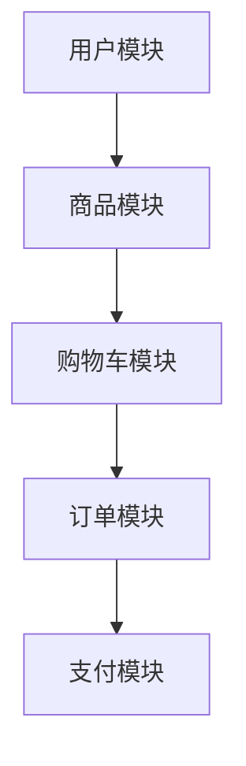

                 


**构建灵活的需求管理框架：应对大型新应用开发挑战**

## 关键词

- 需求管理框架
- 大型应用开发
- 灵活性
- 需求类型
- 需求流程
- 设计原则
- 项目实战
- 最佳实践

## 摘要

本文旨在探讨如何构建一个灵活的需求管理框架，以应对大型新应用开发中的挑战。通过分析需求管理的核心概念、设计原则和方法，结合实际项目和案例分析，本文将提供一整套可操作的实施策略和最佳实践，帮助软件开发团队有效管理需求，提高项目成功率。

## 引言

在当今快速变化的科技时代，大型新应用的开发面临着诸多挑战。需求管理的复杂性日益增加，如何高效、灵活地管理需求成为了关键。传统的需求管理方法往往难以应对快速变化的市场需求和技术进步，导致项目延期、成本超支和质量问题。因此，构建一个灵活的需求管理框架至关重要。

本文将分以下几个部分进行探讨：

1. **问题背景与框架需求**：介绍大型新应用开发中的需求管理挑战，阐述构建灵活需求管理框架的必要性。
2. **核心概念与联系**：详细解释需求类型、需求管理流程及框架设计原则。
3. **需求管理框架设计**：探讨框架结构、实现方法和关键技术。
4. **需求管理工具与技术**：介绍常用需求管理工具及其应用技术要点。
5. **项目实战与案例分析**：通过具体项目实战和案例分析，展示需求管理框架的实际应用效果。
6. **最佳实践与拓展**：总结最佳实践经验，提供注意事项和拓展阅读。

## 第1章 问题背景与框架需求

### 1.1 问题背景

随着互联网、大数据、人工智能等技术的发展，软件应用的规模和复杂性不断增加。尤其是大型新应用，它们往往需要整合多种技术和服务，涉及广泛的用户群体和多样化的业务场景。在这样的背景下，需求管理的挑战愈发明显：

- **需求多变**：市场需求和技术趋势变化迅速，需求往往在项目开发过程中频繁变更。
- **沟通困难**：涉及多个团队和利益相关者，信息传递和沟通效率低下。
- **协调复杂**：大型项目涉及众多功能模块，需求协调和优先级管理复杂。
- **质量把控**：需求质量直接影响项目成功，但传统需求管理方法难以确保需求质量。

### 1.2 需求管理框架的定义与目标

需求管理框架是一个系统化的方法，用于指导需求收集、分析、验证和变更管理。它旨在：

- **提高灵活性**：适应快速变化的需求，确保项目能够灵活调整。
- **加强沟通**：建立有效的沟通机制，确保各方利益相关者的需求得到充分理解和满足。
- **优化协调**：通过统一的方法和工具，实现跨团队的需求协调。
- **保证质量**：通过规范的流程和方法，确保需求的质量和项目的稳定性。

### 1.3 需求管理框架的基本组成

一个典型的需求管理框架包括以下几个关键组成部分：

- **需求收集**：通过问卷调查、访谈、用户反馈等方式，收集用户的业务需求和功能需求。
- **需求分析**：对收集的需求进行分类、筛选和分析，识别需求的优先级和可行性。
- **需求验证**：通过原型设计、用户测试等方式，验证需求的准确性和完整性。
- **需求变更管理**：建立变更管理流程，确保需求变更得到及时、有效的处理。

## 第2章 核心概念与联系

### 2.1 需求类型与分类

在需求管理中，需求可以分为以下几类：

- **功能需求**：描述系统应具备的功能，如用户登录、数据查询等。
- **非功能需求**：描述系统应具备的非功能性要求，如性能、安全性、可维护性等。
- **业务需求**：描述业务流程和规则，如订单处理流程、风险管理策略等。

### 2.2 需求管理流程

需求管理流程通常包括以下阶段：

- **需求收集**：通过多种渠道收集用户需求，确保需求的全面性和准确性。
- **需求分析**：对收集的需求进行整理和分析，识别需求之间的关系和优先级。
- **需求验证**：通过原型设计、用户测试等方式，验证需求是否满足用户需求和系统设计要求。
- **需求变更管理**：建立变更管理流程，确保需求变更得到及时、有效的处理。

### 2.3 需求变更管理

需求变更管理是需求管理流程中的重要环节，主要包括以下内容：

- **变更请求**：用户或项目团队提出变更请求，说明变更的原因和影响。
- **变更评估**：评估变更对项目进度、成本、质量和风险的影响。
- **变更决策**：根据评估结果，决定是否接受变更请求，并制定变更计划。
- **变更实施**：按照变更计划，执行需求变更，并进行跟踪和监控。

## 第3章 需求管理框架设计

### 3.1 设计原则与策略

构建需求管理框架时，应遵循以下设计原则：

- **灵活性**：框架应能够适应不同类型的项目和需求。
- **系统性**：框架应涵盖需求管理的各个阶段，形成完整的流程体系。
- **协同性**：框架应促进团队之间的协同工作，提高需求管理的效率。
- **可扩展性**：框架应具有可扩展性，以适应未来需求的变化和技术的发展。

### 3.2 框架结构

一个典型的需求管理框架通常包括以下模块：

- **需求收集模块**：负责收集用户需求，提供多种收集渠道和工具。
- **需求分析模块**：负责对收集的需求进行分类、筛选和分析，生成需求文档。
- **需求验证模块**：负责验证需求的准确性和完整性，确保需求满足用户需求。
- **需求变更管理模块**：负责处理需求变更请求，评估变更影响，制定变更计划。

### 3.3 框架实现方法

实现需求管理框架的方法主要包括以下几种：

- **工具选型**：选择合适的需求管理工具，如JIRA、Confluence等，以支持需求收集、分析和变更管理。
- **系统集成**：将需求管理框架与其他项目管理工具（如敏捷开发工具、任务管理工具等）集成，实现信息共享和流程联动。
- **流程定制**：根据项目特点和需求，定制需求管理流程，确保流程符合项目实际需求。

## 第4章 需求管理工具与技术

### 4.1 常用需求管理工具

在需求管理过程中，常用的工具包括：

- **JIRA**：一款功能强大的需求管理工具，支持需求收集、分析和变更管理。
- **Confluence**：一款协作平台，可用于创建、共享和跟踪需求文档。
- **Trello**：一款简单易用的任务管理工具，可用于可视化需求管理流程。
- **Asana**：一款综合性的项目管理工具，支持需求收集、分析和变更管理。

### 4.2 技术要点与实战

在需求管理中，关键的技术要点包括：

- **需求建模**：使用统一建模语言（UML）进行需求建模，生成需求文档。
- **需求变更追踪**：使用版本控制工具（如Git）进行需求变更追踪，确保变更记录完整。
- **需求质量保证**：通过自动化测试、用户测试等方式，确保需求质量。

### 4.3 实战案例

以下是一个简单的需求管理实战案例：

**案例背景**：某电商企业需要开发一款新的购物平台，需求包括用户注册、商品浏览、购物车、订单处理等功能。

**实施步骤**：

1. **需求收集**：通过问卷调查、访谈等方式收集用户需求。
2. **需求分析**：对收集的需求进行分类、筛选和分析，生成需求文档。
3. **需求验证**：通过原型设计、用户测试等方式验证需求准确性。
4. **需求变更管理**：建立变更管理流程，处理需求变更请求。
5. **需求实施**：按照需求文档和变更计划，进行系统开发。

**案例分析**：该企业在需求管理过程中，通过灵活的需求管理框架，确保了需求的全面性、准确性和可实施性，提高了项目开发效率。

## 第5章 项目实战与案例分析

### 5.1 项目环境准备

在开始项目实战之前，需要准备以下环境和工具：

- **开发环境**：安装Java开发工具包（JDK）、集成开发环境（IDE）等。
- **需求管理工具**：安装JIRA、Confluence等工具，用于需求收集、分析和变更管理。
- **数据库**：选择合适的数据库管理系统（DBMS），如MySQL、PostgreSQL等。

### 5.2 系统核心实现

以下是一个简单的系统核心实现案例：

**系统架构设计**：



**需求管理模块实现**：

```python
# 需求管理模块示例代码
class RequirementManagement:
    def __init__(self):
        self.requirements = []

    def add_requirement(self, requirement):
        self.requirements.append(requirement)

    def get_requirements(self):
        return self.requirements
```

**需求变更模块实现**：

```python
# 需求变更模块示例代码
class RequirementChangeManagement:
    def __init__(self):
        self.change_requests = []

    def add_change_request(self, change_request):
        self.change_requests.append(change_request)

    def get_change_requests(self):
        return self.change_requests
```

**代码应用解读与分析**：

该案例展示了如何通过简单的Python代码实现需求管理和需求变更管理。在实际项目中，可以根据需求复杂度和项目规模，扩展和优化代码功能。

### 5.3 案例分析与讲解

以下是一个简单的案例分析和讲解：

**案例背景**：某企业计划开发一款企业资源规划（ERP）系统，需求包括财务管理、供应链管理、人力资源管理等模块。

**需求管理框架应用**：

1. **需求收集**：通过问卷调查、访谈等方式，收集各部门的需求。
2. **需求分析**：对收集的需求进行分类、筛选和分析，识别出核心需求和次要需求。
3. **需求验证**：通过原型设计、用户测试等方式，验证需求的准确性和完整性。
4. **需求变更管理**：建立变更管理流程，处理需求变更请求。

**案例分析**：该企业在需求管理过程中，通过灵活的需求管理框架，确保了需求的全面性、准确性和可实施性，提高了项目开发效率。

## 第6章 最佳实践与拓展

### 6.1 需求管理最佳实践

以下是一些需求管理的最佳实践：

1. **明确需求管理流程**：建立明确的需求管理流程，确保每个阶段的工作都有序进行。
2. **加强沟通与协作**：建立有效的沟通机制，确保各方利益相关者的需求得到充分理解和满足。
3. **注重需求质量**：通过需求验证和质量保证，确保需求的质量和项目的稳定性。
4. **灵活应对需求变更**：建立完善的变更管理流程，确保需求变更得到及时、有效的处理。
5. **持续改进**：根据项目实际需求，持续改进需求管理方法和工具。

### 6.2 注意事项

在需求管理过程中，需要注意以下事项：

1. **避免需求遗漏**：在需求收集阶段，要确保全面、准确地收集用户需求。
2. **控制需求变更**：在需求变更管理过程中，要慎重评估变更的影响，确保项目进度不受影响。
3. **保持文档更新**：需求文档和变更记录要及时更新，确保项目信息的完整性。

### 6.3 拓展阅读

以下是一些建议的拓展阅读资料：

1. 《软件需求管理：实践指南》
2. 《敏捷软件开发：实践指南》
3. 《项目管理知识体系指南（PMBOK指南）》

## 结论

本文从问题背景、核心概念、框架设计、工具与技术、项目实战和最佳实践等方面，详细探讨了如何构建灵活的需求管理框架，以应对大型新应用开发中的挑战。通过灵活的需求管理框架，软件开发团队能够更有效地管理需求，提高项目成功率。

作者：AI天才研究院/AI Genius Institute & 禅与计算机程序设计艺术 /Zen And The Art of Computer Programming

### 第1章 问题背景与框架需求

#### 1.1 问题背景

在当前信息技术高速发展的时代，软件开发项目，尤其是大型新应用的开发，面临着一系列复杂的挑战。这些挑战主要集中在以下几个方面：

1. **需求多变**：市场需求的快速变化使得应用功能需求和非功能需求不断调整。用户对产品功能的要求越来越高，同时期望产品能够快速响应市场变化，这给需求管理带来了巨大的压力。
2. **沟通困难**：大型新应用的开发通常涉及多个团队和利益相关者，包括产品经理、设计师、开发人员、测试人员以及客户代表。各团队之间的沟通不畅可能导致需求理解偏差，进而影响项目的进度和质量。
3. **协调复杂**：大型项目往往包含多个模块和子系统，每个模块的需求和优先级可能不同。如何在不同模块之间协调需求，保证整体项目的顺利进行，是需求管理的一大难题。
4. **质量把控**：随着应用规模的扩大，保证需求质量变得更加困难。需求的准确性、完整性和可实现性都需要得到严格把控，否则可能会导致项目延期、成本增加甚至项目失败。

#### 1.2 需求管理框架的定义与目标

需求管理框架是一个系统化的方法论，它帮助项目团队有效地收集、分析和管理需求，确保项目能够按照预期目标和用户需求进行开发。一个良好的需求管理框架应具备以下目标：

1. **提高灵活性**：需求管理框架应能够适应快速变化的需求，确保项目能够快速响应市场变化，同时保持整体计划的稳定性和可预测性。
2. **加强沟通**：框架应提供有效的沟通渠道，确保所有利益相关者都能清晰地了解需求，减少误解和冲突。
3. **优化协调**：通过统一的流程和方法，框架应能够协调不同团队和模块的需求，确保整体项目目标的实现。
4. **保证质量**：框架应包含质量保证措施，确保需求的质量和项目的稳定性，减少返工和错误。

#### 1.3 需求管理框架的基本组成

一个典型的需求管理框架通常包含以下几个关键组成部分：

1. **需求收集**：通过多种渠道收集用户需求，包括问卷调查、用户访谈、市场研究等，确保需求的全面性和准确性。
2. **需求分析**：对收集的需求进行分类、筛选和分析，识别需求的优先级和可行性，将模糊的需求转化为具体的、可执行的需求。
3. **需求验证**：通过原型设计、用户测试等方式验证需求的准确性和完整性，确保需求满足用户需求并符合系统设计要求。
4. **需求变更管理**：建立变更管理流程，对需求变更进行评估、决策和实施，确保变更能够被有效管理，不会对项目进度和质量造成负面影响。

### 第2章 核心概念与联系

#### 2.1 需求类型与分类

在需求管理中，需求可以根据其内容和性质进行分类。常见的需求类型包括：

1. **功能需求**：描述系统应具备的功能性特性，如用户登录、数据查询、报表生成等。功能需求通常具体且可量化，是系统开发的核心。
2. **非功能需求**：描述系统的非功能性特性，如性能、安全性、可靠性、兼容性、易用性等。非功能需求通常更抽象，难以直接测量，但同样重要。
3. **业务需求**：描述系统应如何支持业务流程和策略，如订单处理流程、库存管理策略、客户服务流程等。业务需求通常与组织的具体业务目标相关。

#### 2.2 需求管理流程

需求管理流程是确保需求得到有效收集、分析和管理的系统方法。一个典型的需求管理流程通常包括以下几个阶段：

1. **需求收集**：通过问卷调查、用户访谈、市场研究、需求文档审查等方式，收集用户和利益相关者的需求。
2. **需求分析**：对收集的需求进行整理、筛选和分析，识别需求的优先级和可行性，将模糊的需求转化为具体的需求描述。
3. **需求验证**：通过原型设计、用户测试、专家评审等方式，验证需求的准确性和完整性，确保需求符合用户期望和系统设计要求。
4. **需求文档编制**：将经过验证的需求转化为需求文档，详细描述每个需求的内容、优先级、实现方法等。
5. **需求变更管理**：建立变更管理流程，对需求变更进行评估、决策和实施，确保变更能够被有效管理。

#### 2.3 需求变更管理

需求变更管理是需求管理流程中的一个重要环节，它涉及以下关键步骤：

1. **变更请求提出**：当用户或利益相关者提出新的需求或对现有需求进行修改时，需要提出变更请求。
2. **变更评估**：评估变更对项目进度、成本、质量、风险等方面的影响，确定变更的优先级和可行性。
3. **变更决策**：根据评估结果，决定是否接受变更请求，并制定变更计划。
4. **变更实施**：按照变更计划执行变更，包括修改需求文档、调整项目计划、重新分配资源等。
5. **变更验证**：对变更结果进行验证，确保变更后需求的质量和项目的稳定性。

### 第3章 需求管理框架设计

#### 3.1 设计原则与策略

设计一个有效的需求管理框架需要遵循一系列设计原则和策略，以确保框架能够灵活适应项目的需求，同时保持高效和可扩展性。以下是一些关键的设计原则和策略：

1. **用户中心原则**：需求管理框架应以用户需求为中心，确保所有需求都是基于用户实际需求和期望的。
2. **迭代原则**：采用迭代的方法进行需求收集、分析和验证，以适应快速变化的需求和市场。
3. **标准化原则**：建立标准化的需求文档模板和流程，确保需求描述的一致性和准确性。
4. **可扩展性原则**：框架应具备良好的可扩展性，以适应不同规模和类型的项目的需求。
5. **灵活性原则**：框架应具有灵活性，能够根据项目的实际情况进行调整和优化。

#### 3.2 框架结构

一个典型的需求管理框架通常包括以下模块：

1. **需求收集模块**：负责通过各种渠道收集用户和利益相关者的需求，包括问卷调查、用户访谈、市场研究等。
2. **需求分析模块**：负责对收集的需求进行整理、筛选和分析，识别需求的优先级和可行性，并将模糊的需求转化为具体的需求描述。
3. **需求验证模块**：负责通过原型设计、用户测试、专家评审等方式验证需求的准确性和完整性，确保需求符合用户期望和系统设计要求。
4. **需求文档编制模块**：负责将经过验证的需求转化为需求文档，详细描述每个需求的内容、优先级、实现方法等。
5. **需求变更管理模块**：负责处理需求变更请求，包括变更评估、决策、实施和验证。

#### 3.3 框架实现方法

实现一个需求管理框架的方法主要包括以下几个步骤：

1. **工具选型**：选择合适的需求管理工具，如JIRA、Confluence等，以支持需求收集、分析和变更管理。
2. **流程定制**：根据项目的特点和需求，定制需求管理流程，确保流程能够高效、有序地运行。
3. **系统集成**：将需求管理框架与其他项目管理工具（如敏捷开发工具、任务管理工具等）集成，实现信息共享和流程联动。
4. **团队培训**：对项目团队进行需求管理的培训，确保团队成员能够熟练掌握框架的使用方法和技巧。

### 第4章 需求管理工具与技术

#### 4.1 常用需求管理工具

在需求管理过程中，常用的工具包括：

1. **JIRA**：一款功能强大的需求管理工具，支持需求收集、分析和变更管理。它可以与敏捷开发工具（如JIRA Agile）集成，实现需求与任务的紧密关联。
2. **Confluence**：一款协作平台，可用于创建、共享和跟踪需求文档。它提供了丰富的编辑和协作功能，有助于团队成员之间的沟通和协作。
3. **Trello**：一款简单易用的任务管理工具，可用于可视化需求管理流程。它通过看板和卡片的方式，帮助团队直观地了解需求和任务的进展。
4. **Asana**：一款综合性的项目管理工具，支持需求收集、分析和变更管理。它提供了灵活的任务管理功能，可以帮助团队高效地跟踪项目进度。

#### 4.2 技术要点与实战

在需求管理过程中，技术要点主要包括以下几个方面：

1. **需求建模**：使用统一建模语言（UML）进行需求建模，生成需求文档。UML可以帮助团队清晰地描述系统的功能和非功能性需求，提高需求的可理解和可追踪性。
2. **需求变更追踪**：使用版本控制工具（如Git）进行需求变更追踪，确保变更记录完整。通过版本控制，可以记录每次变更的历史，便于后续的追溯和审核。
3. **需求质量保证**：通过自动化测试、用户测试等方式，确保需求的质量。自动化测试可以帮助快速验证需求的实现情况，用户测试则可以从用户角度出发，验证需求的可用性和用户体验。

#### 4.3 实战案例

以下是一个简单的需求管理实战案例：

**案例背景**：某电商企业计划开发一款新的购物平台，需求包括用户注册、商品浏览、购物车、订单处理等功能。

**实施步骤**：

1. **需求收集**：通过问卷调查和用户访谈，收集用户的需求。
2. **需求分析**：对收集的需求进行分类和筛选，识别出核心需求和非核心需求。
3. **需求验证**：通过原型设计和用户测试，验证需求的准确性和完整性。
4. **需求变更管理**：建立变更管理流程，对需求变更进行评估、决策和实施。

**案例分析**：该企业在需求管理过程中，通过使用JIRA进行需求收集和变更管理，通过Confluence创建和共享需求文档，通过用户测试验证需求的质量。最终，成功实现了新购物平台的需求管理，确保了项目的顺利进行。

### 第5章 项目实战与案例分析

#### 5.1 项目环境准备

在进行项目实战之前，需要准备以下环境和工具：

1. **开发环境**：安装Java开发工具包（JDK）、集成开发环境（IDE）等，确保开发环境的稳定性。
2. **需求管理工具**：安装JIRA、Confluence等工具，用于需求收集、分析和变更管理。
3. **数据库**：选择合适的数据库管理系统（DBMS），如MySQL、PostgreSQL等，用于存储和管理需求信息。

#### 5.2 系统核心实现

以下是一个简单的系统核心实现案例：

**系统架构设计**：


**需求管理模块实现**：

```python
# 需求管理模块示例代码
class RequirementManagement:
    def __init__(self):
        self.requirements = []

    def add_requirement(self, requirement):
        self.requirements.append(requirement)

    def get_requirements(self):
        return self.requirements
```

**需求变更模块实现**：

```python
# 需求变更模块示例代码
class RequirementChangeManagement:
    def __init__(self):
        self.change_requests = []

    def add_change_request(self, change_request):
        self.change_requests.append(change_request)

    def get_change_requests(self):
        return self.change_requests
```

**代码应用解读与分析**：

该案例展示了如何使用Python实现一个简单

