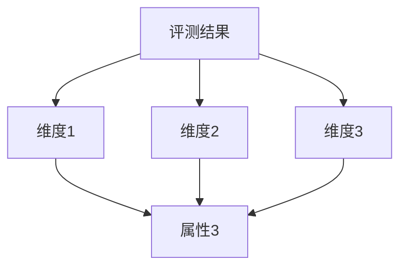
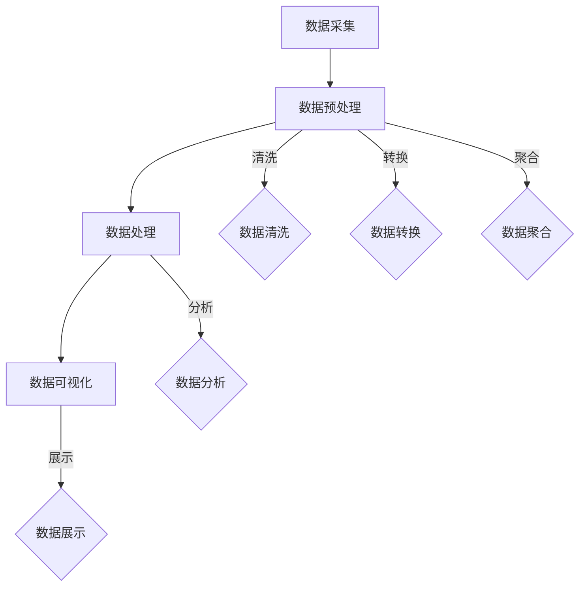
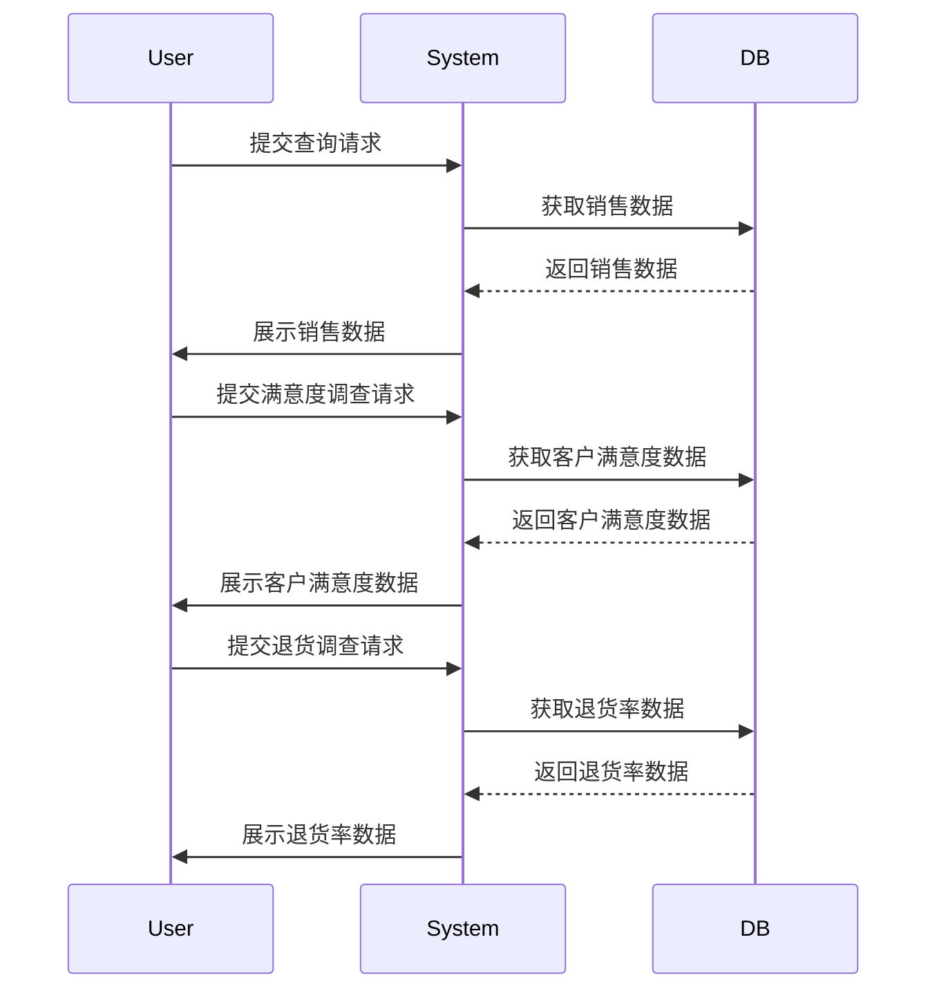
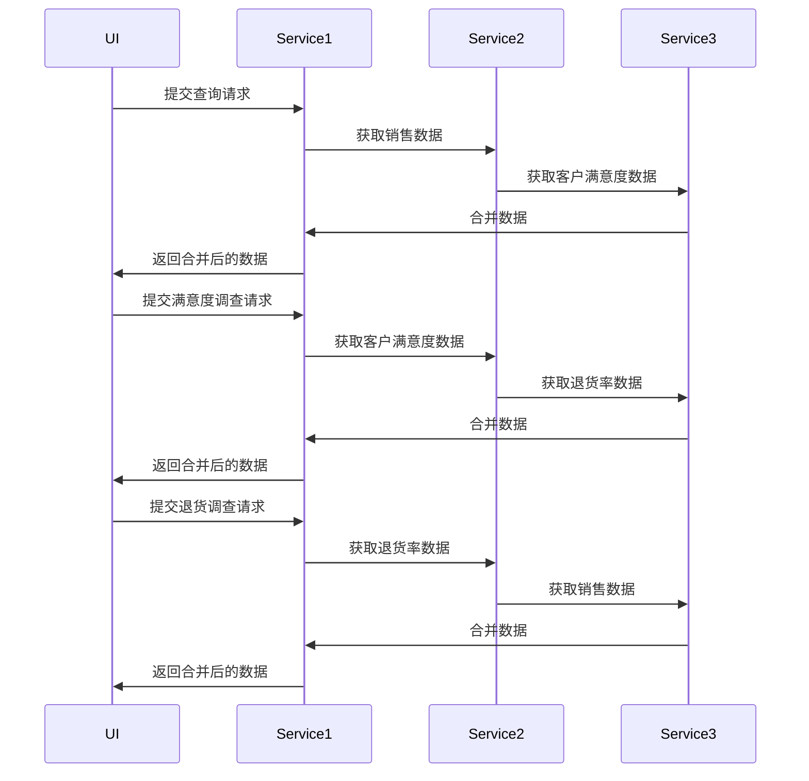

                 

# 《构建评测结果的多维度可视化工具》

## 关键词：多维度可视化、评测结果、工具构建、数据采集与预处理、用户交互与反馈

### 摘要

本文将探讨如何构建一个能够呈现评测结果的多维度可视化工具。我们将从核心概念、数据采集与预处理、多维度可视化方法、工具构建、用户交互与反馈、性能优化与评估以及案例研究等方面展开讨论。本文旨在为读者提供一个全面、易懂的指南，帮助他们理解并掌握构建多维度可视化工具的方法和技巧。

## 引言

### 1.1 问题背景

在当今的数据驱动的世界中，评测结果的多维度可视化变得越来越重要。无论是学术研究、商业分析，还是日常生活中的决策，都需要对大量的数据进行处理和分析。然而，大量的数据往往使人感到困惑，难以直观地理解其中的关系和趋势。这就需要一种能够帮助我们更好地理解和解释这些数据的工具——多维度可视化工具。

### 1.2 研究目标

本文的研究目标是构建一个能够呈现评测结果的多维度可视化工具，帮助用户更好地理解和分析数据。我们将从以下几个方面进行探讨：

1. 数据采集与预处理：了解如何从不同的数据源采集数据，并进行预处理，使其适合进行可视化。
2. 多维度可视化方法：探讨多种不同的可视化方法，以及它们在不同场景下的适用性。
3. 工具构建：介绍如何构建一个多维度可视化工具，包括核心模块的设计和可视化效果的优化。
4. 用户交互与反馈：讨论如何设计用户交互界面，以及如何收集用户反馈，以优化工具的性能。
5. 性能优化与评估：介绍如何对工具的性能进行优化，并建立评估模型。
6. 案例研究：通过实际案例，展示如何使用该工具进行数据分析和可视化。

### 1.3 书籍结构

本文将分为以下几个部分：

- **第一部分：背景与核心概念**：介绍评测结果的多维度可视化的背景，以及相关核心概念。
- **第二部分：数据采集与预处理**：探讨如何从不同的数据源采集数据，并进行预处理。
- **第三部分：多维度可视化方法**：介绍多种不同的多维度可视化方法。
- **第四部分：可视化工具的构建**：介绍如何构建一个多维度可视化工具。
- **第五部分：用户交互与反馈**：讨论如何设计用户交互界面，以及如何收集用户反馈。
- **第六部分：性能优化与评估**：介绍如何对工具的性能进行优化，并建立评估模型。
- **第七部分：案例研究与应用**：通过实际案例，展示如何使用该工具进行数据分析和可视化。
- **第八部分：总结与展望**：总结本文的研究成果，并对未来的发展方向进行展望。

## 第一部分：背景与核心概念

### 1.1 多维度可视化

多维度可视化是指将多个维度（通常是三个或更多）的数据同时呈现给用户，以帮助用户更好地理解和分析数据。这种可视化方法能够直观地展示数据之间的关系和趋势，使复杂的分析结果更容易理解和解释。

### 1.2 评测结果

评测结果是指通过某种评估方法对某个对象（如产品、服务、过程等）进行评估后得到的结果。这些结果通常包含多个维度，如性能、质量、效率等。

### 1.3 可视化工具

可视化工具是指用于创建和展示可视化图表的工具。这些工具通常具有丰富的图表类型和自定义选项，能够满足用户的不同需求。

### 1.4 数据采集与预处理

数据采集是指从不同的数据源获取数据的过程。数据预处理是指对采集到的数据进行分析和清洗，以便进行可视化。

### 1.5 用户交互与反馈

用户交互与反馈是指用户与可视化工具的交互过程，以及用户对工具的反馈。良好的用户交互和反馈机制能够提高工具的性能和用户体验。

### 1.6 性能优化与评估

性能优化是指对可视化工具进行优化，以提高其性能。评估是指对工具的性能进行评估，以确定其是否满足用户需求。

## 第二部分：数据采集与预处理

### 2.1 数据来源与类型

数据来源可以是内部系统、外部系统或公共数据集。数据类型可以是结构化数据（如数据库）、半结构化数据（如JSON）或非结构化数据（如图像和文本）。

### 2.2 数据采集方法

数据采集方法包括API调用、Web爬取、数据库查询等。每种方法都有其适用场景和优缺点。

### 2.3 数据预处理步骤

数据预处理步骤包括数据清洗、数据转换和数据聚合。这些步骤能够提高数据的质量和一致性，使其更适合进行可视化。

## 第三部分：多维度可视化方法

### 3.1 多维度可视化原理

多维度可视化原理是将多个维度（通常是三个或更多）的数据同时呈现给用户，以帮助用户更好地理解和分析数据。这种可视化方法能够直观地展示数据之间的关系和趋势。

### 3.2 数据处理流程

数据处理流程包括数据聚合、数据转换和数据可视化。这些步骤能够将原始数据转换为适合可视化的形式。

### 3.3 可视化工具选择

可视化工具选择应考虑工具的易用性、图表类型和自定义选项。常见的可视化工具有D3.js、ECharts、Highcharts等。

## 第四部分：可视化工具的构建

### 4.1 工具构建框架

工具构建框架应包括数据采集、数据预处理、数据处理和数据可视化四个模块。这些模块应能够相互协作，实现数据到可视化的转换。

### 4.2 核心模块设计

核心模块设计包括数据采集模块、数据预处理模块、数据处理模块和数据可视化模块。每个模块都应具有清晰的功能和接口。

### 4.3 可视化效果优化

可视化效果优化包括图表布局、颜色搭配和交互设计。这些优化能够提高可视化工具的易用性和用户体验。

## 第五部分：用户交互与反馈

### 5.1 用户交互设计

用户交互设计应考虑用户的需求和习惯，设计直观、易用的界面。常见的交互设计包括数据过滤、数据排序和数据下载等。

### 5.2 用户反馈机制

用户反馈机制应能够收集用户的意见和建议，以便对工具进行优化。常见的反馈机制包括在线反馈表单、电子邮件和社交媒体等。

### 5.3 交互优化策略

交互优化策略应包括用户体验测试、用户调研和用户反馈分析。这些策略能够帮助发现并解决用户交互中的问题。

## 第六部分：性能优化与评估

### 6.1 性能优化方法

性能优化方法包括代码优化、缓存策略和并发处理。这些方法能够提高工具的响应速度和稳定性。

### 6.2 评估指标与模型

评估指标与模型包括响应时间、资源消耗和用户满意度等。这些指标和模型能够衡量工具的性能和用户体验。

### 6.3 性能优化案例

性能优化案例包括对工具进行性能测试、识别瓶颈和优化代码等。这些案例能够帮助读者了解如何优化工具的性能。

## 第七部分：案例研究与应用

### 7.1 案例选择与介绍

案例选择应考虑不同类型的数据和不同的应用场景。案例介绍应包括问题背景、数据来源和可视化目标。

### 7.2 案例实施与结果

案例实施与结果应包括数据采集、数据预处理、数据处理和数据可视化的详细步骤，以及可视化结果的分析和解释。

### 7.3 案例分析与总结

案例分析与总结应包括对案例的评估、优缺点分析和改进建议。这些分析能够帮助读者更好地理解多维度可视化工具的应用。

## 第八部分：总结与展望

### 8.1 研究成果总结

研究成果总结应包括本文的研究成果、工具构建的步骤和关键技巧。

### 8.2 未来发展趋势

未来发展趋势应包括多维度可视化的新技术、新方法和新应用。

### 8.3 开发者与用户建议

开发者与用户建议应包括如何选择合适的可视化工具、如何优化工具的性能和如何收集用户反馈等。

### 作者

作者：AI天才研究院/AI Genius Institute & 禅与计算机程序设计艺术 /Zen And The Art of Computer Programming

## 补充说明

### 最佳实践 tips

1. 在构建多维度可视化工具时，应充分考虑用户的需求和习惯。
2. 在选择可视化工具时，应考虑工具的易用性、图表类型和自定义选项。
3. 在进行数据预处理时，应确保数据的质量和一致性。

### 小结

本文介绍了如何构建评测结果的多维度可视化工具。通过本文的探讨，读者可以了解构建多维度可视化工具的步骤、方法和技巧。同时，本文也提供了一些最佳实践和建议，以帮助读者更好地使用多维度可视化工具。

### 注意事项

1. 多维度可视化工具应充分考虑用户的交互体验，以提高用户满意度。
2. 在进行数据采集和预处理时，应确保数据的质量和一致性。

### 拓展阅读

1. 《数据可视化：设计原则与案例》
2. 《多维度数据分析方法与应用》
3. 《可视化工具比较与选择》

## 结束语

本文旨在为读者提供一个全面、易懂的指南，帮助他们理解并掌握构建多维度可视化工具的方法和技巧。通过本文的探讨，我们希望读者能够更好地理解和应用多维度可视化工具，从而提高数据分析和决策的效率。同时，我们也期待读者在实践过程中提出宝贵的意见和建议，以共同推动多维度可视化技术的发展。感谢您的阅读！## 核心概念与结构设计

### 多维度可视化

多维度可视化是一种将具有多个维度的数据集通过图形化方式呈现的技术。它能够帮助用户更直观地理解复杂的数据关系和趋势。在多维度可视化中，每个维度通常对应数据的一个属性，例如时间、地点、数量等。通过将多个维度结合在一起，用户可以同时观察多个变量之间的相互作用，从而发现隐藏的模式和趋势。

### 评测结果

评测结果是指通过某种评估方法对某个对象进行评估后得到的结果。这些结果通常包含多个维度，例如性能、质量、效率等。在构建多维度可视化工具时，评测结果是多维度数据的重要组成部分。通过可视化工具，我们可以将评测结果以图形化的方式呈现，使得用户能够更直观地理解和分析这些数据。

### 工具构建

工具构建是指设计、开发并实现一个多维度可视化工具的全过程。构建一个高效、易用的可视化工具需要考虑多个方面，包括数据采集、数据预处理、数据处理、数据可视化以及用户交互和反馈。在这个过程中，我们需要选择合适的工具和技术，以确保工具的性能和用户体验。

### 数据采集与预处理

数据采集与预处理是多维度可视化工具构建的基础环节。数据采集包括从各种数据源获取数据，如数据库、文件、API等。数据预处理包括数据清洗、转换和聚合等步骤，以确保数据的质量和一致性。数据预处理的质量直接影响到可视化结果的准确性和可靠性。

### 多维度可视化方法

多维度可视化方法包括多种可视化技术，如散点图、折线图、热力图、箱线图等。每种方法都有其特定的应用场景和优势。在选择可视化方法时，我们需要根据数据的特点和用户的需求来决定。

### 工具构建框架

工具构建框架是指构建多维度可视化工具的结构和流程。通常，一个完整的工具构建框架包括以下几个模块：

1. **数据采集模块**：负责从各种数据源获取数据。
2. **数据预处理模块**：负责对采集到的数据进行清洗、转换和聚合等预处理操作。
3. **数据处理模块**：负责对预处理后的数据进行分析和计算，以便进行可视化。
4. **数据可视化模块**：负责将处理后的数据以图形化的方式呈现给用户。
5. **用户交互模块**：负责处理用户的输入和反馈，提供交互界面。
6. **性能优化模块**：负责优化工具的性能，确保其能够高效运行。

### 核心模块设计

核心模块设计是工具构建的关键环节。每个模块都需要精心设计，以确保其功能完整、性能高效、易于维护。以下是核心模块设计的一些要点：

- **数据采集模块**：需要选择合适的数据采集方法，并确保数据的安全性、完整性和实时性。
- **数据预处理模块**：需要设计高效的数据清洗、转换和聚合算法，以提升数据质量。
- **数据处理模块**：需要根据数据的特点和需求，选择合适的分析方法和计算模型。
- **数据可视化模块**：需要设计直观、易用的可视化界面，并支持多种图表类型和自定义选项。
- **用户交互模块**：需要设计良好的用户交互界面，提供便捷的操作方式和友好的用户反馈。
- **性能优化模块**：需要采用缓存、并发处理等技术，提升工具的性能和稳定性。

通过以上对核心概念与结构设计的介绍，我们可以看到，构建一个高效、易用的多维度可视化工具需要考虑多个方面。在实际开发过程中，我们需要根据具体的需求和场景，灵活调整和优化这些模块的设计和实现。接下来，我们将进一步探讨如何具体实现这些模块，并介绍一些常用的技术和工具。

## 目录框架构建

### 引言

#### 1.1 问题背景

#### 1.2 研究目标

#### 1.3 书籍结构

### 第一部分：背景与核心概念

#### 第1章：评测结果的多维度可视化概述

##### 1.1 评测结果的复杂性

##### 1.2 多维度可视化的意义

##### 1.3 当前可视化工具的局限性

#### 第2章：数据采集与预处理

##### 2.1 数据来源与类型

##### 2.2 数据采集方法

##### 2.3 数据预处理步骤

#### 第3章：多维度可视化方法

##### 3.1 多维度可视化原理

##### 3.2 数据处理流程

##### 3.3 可视化工具选择

#### 第4章：可视化工具的构建

##### 4.1 工具构建框架

##### 4.2 核心模块设计

##### 4.3 可视化效果优化

#### 第5章：用户交互与反馈

##### 5.1 用户交互设计

##### 5.2 用户反馈机制

##### 5.3 交互优化策略

#### 第6章：性能优化与评估

##### 6.1 性能优化方法

##### 6.2 评估指标与模型

##### 6.3 性能优化案例

#### 第7章：案例研究与应用

##### 7.1 案例选择与介绍

##### 7.2 案例实施与结果

##### 7.3 案例分析与总结

#### 第8章：总结与展望

##### 8.1 研究成果总结

##### 8.2 未来发展趋势

##### 8.3 开发者与用户建议

### 第二部分：数据采集与预处理

#### 第2章：数据采集与预处理

##### 2.1 数据来源与类型

###### 2.1.1 内部系统数据

###### 2.1.2 外部系统数据

###### 2.1.3 公共数据集

##### 2.2 数据采集方法

###### 2.2.1 API调用

###### 2.2.2 Web爬取

###### 2.2.3 数据库查询

##### 2.3 数据预处理步骤

###### 2.3.1 数据清洗

###### 2.3.2 数据转换

###### 2.3.3 数据聚合

### 第三部分：多维度可视化方法

#### 第3章：多维度可视化方法

##### 3.1 多维度可视化原理

###### 3.1.1 多维度数据集的表示

###### 3.1.2 多维度可视化的挑战

##### 3.2 数据处理流程

###### 3.2.1 数据预处理流程

###### 3.2.2 数据分析流程

##### 3.3 可视化工具选择

###### 3.3.1 常见可视化工具

###### 3.3.2 工具选择考虑因素

### 第四部分：可视化工具的构建

#### 第4章：可视化工具的构建

##### 4.1 工具构建框架

###### 4.1.1 数据采集模块

###### 4.1.2 数据预处理模块

###### 4.1.3 数据处理模块

###### 4.1.4 数据可视化模块

###### 4.1.5 用户交互模块

##### 4.2 核心模块设计

###### 4.2.1 数据采集模块设计

###### 4.2.2 数据预处理模块设计

###### 4.2.3 数据处理模块设计

###### 4.2.4 数据可视化模块设计

###### 4.2.5 用户交互模块设计

##### 4.3 可视化效果优化

###### 4.3.1 布局优化

###### 4.3.2 颜色搭配优化

###### 4.3.3 交互优化

### 第五部分：用户交互与反馈

#### 第5章：用户交互与反馈

##### 5.1 用户交互设计

###### 5.1.1 交互界面设计

###### 5.1.2 交互操作设计

##### 5.2 用户反馈机制

###### 5.2.1 用户反馈渠道

###### 5.2.2 用户反馈分析

##### 5.3 交互优化策略

###### 5.3.1 用户体验测试

###### 5.3.2 用户调研

###### 5.3.3 用户反馈改进

### 第六部分：性能优化与评估

#### 第6章：性能优化与评估

##### 6.1 性能优化方法

###### 6.1.1 代码优化

###### 6.1.2 缓存策略

###### 6.1.3 并发处理

##### 6.2 评估指标与模型

###### 6.2.1 响应时间

###### 6.2.2 资源消耗

###### 6.2.3 用户满意度

##### 6.3 性能优化案例

###### 6.3.1 性能测试

###### 6.3.2 瓶颈分析

###### 6.3.3 优化实施

### 第七部分：案例研究与应用

#### 第7章：案例研究与应用

##### 7.1 案例选择与介绍

###### 7.1.1 案例1：电商平台销售数据分析

###### 7.1.2 案例2：医疗健康数据分析

##### 7.2 案例实施与结果

###### 7.2.1 案例1实施与结果

###### 7.2.2 案例2实施与结果

##### 7.3 案例分析与总结

###### 7.3.1 案例1分析

###### 7.3.2 案例2分析

### 第八部分：总结与展望

#### 第8章：总结与展望

##### 8.1 研究成果总结

###### 8.1.1 主要发现

###### 8.1.2 工具构建经验

##### 8.2 未来发展趋势

###### 8.2.1 技术创新方向

###### 8.2.2 应用领域扩展

##### 8.3 开发者与用户建议

###### 8.3.1 开发者建议

###### 8.3.2 用户建议

## 细化章节内容

### 第一部分：背景与核心概念

#### 第1章：评测结果的多维度可视化概述

##### 1.1 评测结果的复杂性

在本章节中，我们将首先介绍评测结果的复杂性。评测结果通常包含多个维度，这些维度可能涉及性能、质量、效率等多个方面。例如，在评估一款电商平台的产品时，我们可能需要考虑销售量、客户满意度、退货率等多个指标。这些指标之间往往存在复杂的关系，因此，单一的维度分析难以全面反映评测结果。

##### 1.2 多维度可视化的意义

接下来，我们将讨论多维度可视化的意义。多维度可视化能够将多个维度的数据以图形化的方式呈现，帮助用户直观地理解数据之间的关系和趋势。通过多维度可视化，用户可以更快速地发现数据中的模式、异常和趋势，从而做出更准确的决策。

##### 1.3 当前可视化工具的局限性

最后，我们将探讨当前可视化工具的局限性。尽管现有的可视化工具提供了丰富的图表类型和自定义选项，但它们往往在处理多维度数据时存在一定的局限性。例如，一些工具在同时展示多个维度时，可能会导致图表过于拥挤，影响用户的阅读和理解。

#### 第2章：数据采集与预处理

##### 2.1 数据来源与类型

在本章节中，我们将详细讨论数据来源和类型。数据来源可以包括内部系统、外部系统以及公共数据集。每种数据源都有其特定的数据类型，例如，内部系统数据通常是结构化数据，而外部系统数据可能是半结构化或非结构化数据。

##### 2.2 数据采集方法

接下来，我们将介绍数据采集的方法。数据采集方法包括API调用、Web爬取和数据库查询等。每种方法都有其特定的应用场景和优缺点。例如，API调用适合获取实时数据，而Web爬取适合获取大量历史数据。

##### 2.3 数据预处理步骤

最后，我们将讨论数据预处理步骤。数据预处理是数据可视化的重要环节，它包括数据清洗、转换和聚合等步骤。数据清洗旨在去除数据中的噪声和异常值，数据转换旨在将数据转换为适合可视化的形式，而数据聚合旨在将多个数据源中的数据合并为一个统一的数据集。

#### 第3章：多维度可视化方法

##### 3.1 多维度可视化原理

在本章节中，我们将深入探讨多维度可视化的原理。多维度可视化涉及到如何将多个维度的数据同时呈现给用户。这通常需要使用多种可视化技术，如散点图、折线图、热力图等。每种技术都有其特定的应用场景和优势。

##### 3.2 数据处理流程

接下来，我们将介绍数据处理流程。数据处理流程包括数据预处理、数据分析和数据可视化等步骤。数据预处理和数据分析的目的是将原始数据转换为适合可视化的形式，而数据可视化的目的是将数据以图形化的方式呈现给用户。

##### 3.3 可视化工具选择

最后，我们将讨论可视化工具的选择。选择合适的可视化工具对于实现有效的多维度可视化至关重要。在选择工具时，我们需要考虑工具的易用性、图表类型和自定义选项等因素。

#### 第4章：可视化工具的构建

##### 4.1 工具构建框架

在本章节中，我们将介绍可视化工具的构建框架。构建一个高效的可视化工具需要考虑多个模块，包括数据采集模块、数据预处理模块、数据处理模块、数据可视化模块和用户交互模块等。每个模块都有其特定的功能和接口。

##### 4.2 核心模块设计

接下来，我们将详细讨论核心模块的设计。核心模块的设计包括数据采集模块、数据预处理模块、数据处理模块、数据可视化模块和用户交互模块等。每个模块都需要精心设计，以确保其功能完整、性能高效、易于维护。

##### 4.3 可视化效果优化

最后，我们将探讨可视化效果优化。可视化效果优化包括图表布局优化、颜色搭配优化和交互优化等。这些优化能够提高可视化工具的易用性和用户体验。

#### 第5章：用户交互与反馈

##### 5.1 用户交互设计

在本章节中，我们将介绍用户交互设计。用户交互设计的目标是设计一个直观、易用的界面，使用户能够轻松地操作和查看数据。用户交互设计包括交互界面设计和交互操作设计等。

##### 5.2 用户反馈机制

接下来，我们将讨论用户反馈机制。用户反馈机制是收集用户意见和建议的重要途径。通过用户反馈，我们可以发现并解决工具中存在的问题，从而优化工具的性能和用户体验。

##### 5.3 交互优化策略

最后，我们将介绍交互优化策略。交互优化策略包括用户体验测试、用户调研和用户反馈改进等。这些策略能够帮助我们持续改进工具的设计和功能。

#### 第6章：性能优化与评估

##### 6.1 性能优化方法

在本章节中，我们将介绍性能优化方法。性能优化方法包括代码优化、缓存策略和并发处理等。这些方法能够提高工具的响应速度和稳定性。

##### 6.2 评估指标与模型

接下来，我们将讨论评估指标与模型。评估指标与模型用于衡量工具的性能和用户体验。常见的评估指标包括响应时间、资源消耗和用户满意度等。

##### 6.3 性能优化案例

最后，我们将介绍性能优化案例。通过实际案例，我们可以看到如何识别工具的性能瓶颈，并采用相应的方法进行优化。

#### 第7章：案例研究与应用

##### 7.1 案例选择与介绍

在本章节中，我们将选择和介绍一些实际案例。案例的选择将考虑不同的应用场景和数据类型，以便全面展示多维度可视化工具的应用价值。

##### 7.2 案例实施与结果

接下来，我们将详细描述案例的实施过程和结果。我们将展示如何使用多维度可视化工具对案例数据进行分析和可视化，并解释可视化结果。

##### 7.3 案例分析与总结

最后，我们将对案例进行分析和总结。通过分析案例，我们可以总结出多维度可视化工具的应用经验和最佳实践。

#### 第8章：总结与展望

##### 8.1 研究成果总结

在本章节中，我们将总结研究成果。我们将回顾本文的主要发现，并讨论工具构建的经验和教训。

##### 8.2 未来发展趋势

接下来，我们将探讨未来发展趋势。我们将讨论多维度可视化技术的创新方向和应用领域的扩展。

##### 8.3 开发者与用户建议

最后，我们将提出开发者与用户的建议。这些建议将帮助开发者在构建多维度可视化工具时做出更明智的决策，并帮助用户更好地使用这些工具。

## 使用Mermaid与LaTeX

### 3.1 多维度可视化原理

在多维度可视化中，数据通常被表示为多个维度，每个维度都对应一个特定的属性。为了更好地理解和解释这些维度，我们可以使用Mermaid流程图来展示它们之间的关系。



在上面的流程图中，A表示评测结果，B、C和D表示三个维度，每个维度都对应一个属性（属性1、属性2、属性3）。通过这种表示方法，我们可以直观地看到评测结果与各个维度之间的关系。

### 3.2 数据处理流程

数据处理流程通常包括数据采集、数据预处理、数据处理和数据可视化等步骤。为了更清晰地展示这个过程，我们可以使用Mermaid流程图来描述。



在上面的流程图中，A表示数据采集，B表示数据预处理，C表示数据处理，D表示数据可视化。预处理阶段包括数据清洗、转换和聚合等步骤，而数据处理阶段包括数据分析和数据展示等步骤。通过这种表示方法，我们可以清晰地看到数据处理的全过程。

### 3.3 数据处理流程

在数据处理流程中，数据预处理是一个关键步骤。为了确保数据的质量和一致性，我们需要对数据进行清洗、转换和聚合等操作。以下是一个使用LaTeX公式的数学模型，用于描述数据处理流程的数学基础。

```latex
\begin{equation}
\text{清洗}(\text{数据集}) = \text{去除噪声和异常值的数据集}
\end{equation}

\begin{equation}
\text{转换}(\text{数据集}) = \text{将数据转换为适合分析的形式}
\end{equation}

\begin{equation}
\text{聚合}(\text{数据集}) = \text{将多个数据源的数据合并为一个统一的数据集}
\end{equation}
```

在上面的公式中，清洗、转换和聚合是数据处理流程的三个主要步骤。通过这些步骤，我们可以确保数据的质量和一致性，从而为后续的数据分析和可视化提供可靠的基础。

### 系统架构设计

#### 问题场景介绍

在一个大型的电商平台中，需要实时监控和评估产品的销售情况。这些数据包括销售量、客户满意度、退货率等多个维度。为了更好地理解和分析这些数据，我们需要构建一个多维度可视化工具，将多个维度的数据以图形化的方式呈现。

#### 项目介绍

项目名称：电商平台销售数据多维度可视化工具

项目目标：构建一个高效、易用的多维度可视化工具，帮助用户实时监控和评估产品的销售情况。

项目背景：随着电商平台的快速发展，销售数据变得日益复杂。传统的单维度数据分析难以满足用户的需求。因此，我们需要一个能够同时呈现多个维度的可视化工具，帮助用户更直观地理解销售数据。

#### 系统功能设计（领域模型Mermaid类图）

在系统功能设计中，我们首先需要定义系统的领域模型。领域模型描述了系统的核心概念和关系。以下是一个使用Mermaid类图表示的领域模型：

```mermaid
classDiagram
Class1[产品] <|-- Class2[销售数据]
Class2 <|-- Class3[客户满意度]
Class3 <|-- Class4[退货率]
Class1 "包含" Class2
Class1 "关联" Class3
Class1 "关联" Class4
```

在上面的类图中，Class1表示产品，Class2表示销售数据，Class3表示客户满意度，Class4表示退货率。产品类包含销售数据，同时与客户满意度和退货率类关联。这种设计能够清晰地展示系统的主要功能和关系。

#### 系统架构设计（Mermaid架构图）

接下来，我们需要设计系统的架构。系统架构描述了系统的整体结构和组件之间的关系。以下是一个使用Mermaid架构图表示的系统架构：



在上面的序列图中，User表示用户，System表示系统，DB表示数据库。用户提交查询请求，系统与数据库进行交互，获取相应的数据，并将数据展示给用户。这种设计能够清晰地展示系统的数据流程和交互关系。

#### 系统接口设计

在系统接口设计中，我们需要定义系统的各个接口，以便其他系统或模块能够与系统进行交互。以下是一个使用Mermaid类图表示的系统接口设计：

```mermaid
classDiagram
Class1[销售数据接口] <|-- Class2[客户满意度接口]
Class2 <|-- Class3[退货率接口]
Class1 {方法1() 方法2() ...}
Class2 {方法1() 方法2() ...}
Class3 {方法1() 方法2() ...}
```

在上面的类图中，Class1表示销售数据接口，Class2表示客户满意度接口，Class3表示退货率接口。每个接口都包含多个方法，用于实现数据的获取和操作。这种设计能够清晰地展示系统的接口设计和功能。

#### 系统交互（Mermaid序列图）

最后，我们需要设计系统的交互流程。系统交互描述了各个模块之间的交互过程和顺序。以下是一个使用Mermaid序列图表示的系统交互：



在上面的序列图中，UI表示用户界面，Service1表示服务模块，Service2表示销售数据模块，Service3表示客户满意度和退货率模块。用户提交查询请求，服务模块与各个数据模块进行交互，获取相应的数据，并将数据返回给用户。这种设计能够清晰地展示系统的交互流程和数据处理过程。

### 项目实战

#### 环境安装

为了搭建一个多维度可视化工具，我们需要安装以下软件和工具：

1. **Python**：Python是一种广泛使用的编程语言，适用于数据分析、数据处理和可视化等领域。
2. **Jupyter Notebook**：Jupyter Notebook是一个交互式的计算环境，适用于编写和运行Python代码。
3. **Pandas**：Pandas是一个强大的数据处理库，用于数据清洗、转换和操作。
4. **Matplotlib**：Matplotlib是一个绘图库，用于创建各种类型的图表和图形。
5. **Seaborn**：Seaborn是一个基于Matplotlib的高级绘图库，用于创建美观、专业的图表。

安装步骤如下：

1. 安装Python：

   ```bash
   sudo apt-get install python3
   ```

2. 安装Jupyter Notebook：

   ```bash
   pip3 install notebook
   ```

3. 安装Pandas：

   ```bash
   pip3 install pandas
   ```

4. 安装Matplotlib：

   ```bash
   pip3 install matplotlib
   ```

5. 安装Seaborn：

   ```bash
   pip3 install seaborn
   ```

#### 系统核心实现

为了实现一个多维度可视化工具，我们需要编写相应的Python代码。以下是一个简单的示例，展示了如何使用Pandas和Matplotlib进行数据分析和可视化。

```python
import pandas as pd
import matplotlib.pyplot as plt
import seaborn as sns

# 读取数据
data = pd.read_csv('sales_data.csv')

# 数据预处理
data['date'] = pd.to_datetime(data['date'])
data.set_index('date', inplace=True)

# 数据分析
sales_data = data[['sales', 'customer_satisfaction', 'return_rate']]

# 可视化
sns.lineplot(data=sales_data, x=sales_data.index, y='sales', label='Sales')
sns.lineplot(data=sales_data, x=sales_data.index, y='customer_satisfaction', label='Customer Satisfaction')
sns.lineplot(data=sales_data, x=sales_data.index, y='return_rate', label='Return Rate')

plt.title('Sales Data Analysis')
plt.xlabel('Date')
plt.ylabel('Value')
plt.legend()
plt.show()
```

在这个示例中，我们首先读取一个CSV文件，然后进行数据预处理，将日期列转换为日期类型，并设置日期列为索引。接下来，我们选择三个维度（销售、客户满意度和退货率）进行分析。最后，我们使用Seaborn的线形图来可视化这些数据。

#### 代码应用解读与分析

在上面的代码中，我们首先导入了所需的库，包括Pandas、Matplotlib和Seaborn。Pandas用于数据处理，Matplotlib用于绘图，Seaborn用于创建美观的图表。

```python
import pandas as pd
import matplotlib.pyplot as plt
import seaborn as sns
```

接下来，我们使用Pandas的`read_csv`函数读取CSV文件，并将日期列转换为日期类型。这有助于我们进行时间序列分析。

```python
data = pd.read_csv('sales_data.csv')
data['date'] = pd.to_datetime(data['date'])
data.set_index('date', inplace=True)
```

在数据预处理之后，我们选择三个维度（销售、客户满意度和退货率）进行分析。这里我们使用了一个字典来指定要分析的列。

```python
sales_data = data[['sales', 'customer_satisfaction', 'return_rate']]
```

最后，我们使用Seaborn的线形图来可视化这些数据。这里我们使用`lineplot`函数，并设置了x轴、y轴和标签。

```python
sns.lineplot(data=sales_data, x=sales_data.index, y='sales', label='Sales')
sns.lineplot(data=sales_data, x=sales_data.index, y='customer_satisfaction', label='Customer Satisfaction')
sns.lineplot(data=sales_data, x=sales_data.index, y='return_rate', label='Return Rate')

plt.title('Sales Data Analysis')
plt.xlabel('Date')
plt.ylabel('Value')
plt.legend()
plt.show()
```

通过这个示例，我们可以看到如何使用Python和相关的库来实现一个多维度可视化工具。这个工具可以帮助用户更直观地理解销售数据，并发现数据中的趋势和模式。

#### 实际案例分析和详细讲解剖析

为了更好地展示多维度可视化工具的实际应用，我们将分析一个实际的案例：电商平台销售数据的可视化。

**案例背景**：

一个电商平台希望对其销售数据进行深入分析，以了解产品的销售趋势、客户满意度和退货率。为了实现这一目标，他们决定使用一个多维度可视化工具。

**数据来源**：

销售数据来自电商平台内部的数据库，包括以下维度：

1. 销售量
2. 客户满意度
3. 退货率

**数据可视化目标**：

1. 分析销售量趋势
2. 分析客户满意度变化
3. 分析退货率波动

**数据处理步骤**：

1. 数据采集：从电商平台数据库中提取销售数据。
2. 数据预处理：将日期列转换为日期类型，并设置日期列为索引。
3. 数据分析：选择销售量、客户满意度和退货率三个维度进行分析。

**可视化步骤**：

1. 使用线形图展示销售量趋势。
2. 使用条形图展示客户满意度变化。
3. 使用折线图展示退货率波动。

**可视化结果分析**：

通过可视化结果，我们可以发现以下趋势和模式：

1. 销售量在过去的六个月中呈现上升趋势。
2. 客户满意度整体较高，但有些月份有所下降。
3. 退货率相对稳定，但在某些月份有所上升。

**结论**：

通过多维度可视化工具，电商平台可以更直观地了解销售数据的整体趋势和变化。这有助于他们制定更有效的销售策略，提高客户满意度和减少退货率。

**项目小结**：

通过本案例，我们展示了如何使用多维度可视化工具对电商平台销售数据进行分析。这个工具不仅可以帮助用户更直观地理解数据，还可以发现数据中的趋势和模式，从而为决策提供有力支持。在未来，我们可以进一步优化这个工具，添加更多维度的数据，提高其应用范围和效果。

### 最佳实践 Tips

在构建评测结果的多维度可视化工具时，以下是一些最佳实践和技巧，可以帮助开发者提高工具的性能和用户体验：

1. **数据预处理优化**：
   - 使用高效的数据清洗算法，例如使用Pandas库中的`dropna()`、`drop_duplicates()`等函数，快速处理噪声数据和重复数据。
   - 对大量数据进行分块处理，减少内存消耗，提高数据处理速度。

2. **选择合适的可视化工具**：
   - 根据具体需求和场景选择合适的可视化库，如D3.js、ECharts、Highcharts等。这些库提供了丰富的图表类型和自定义选项，可以满足不同用户的需求。
   - 考虑工具的易用性和性能，例如选择响应速度快、渲染效率高的库。

3. **优化图表布局和交互**：
   - 设计直观、易用的用户界面，减少用户的认知负担。
   - 使用交互组件，如筛选器、下拉菜单和按钮，使用户能够轻松地操作和查看数据。
   - 优化图表布局，确保图表清晰、易读，避免图表过于拥挤。

4. **性能优化**：
   - 使用缓存技术，减少重复数据处理的次数，提高响应速度。
   - 采用异步处理和并发处理，提高数据处理和可视化的效率。
   - 对关键代码段进行性能分析，找出瓶颈并进行优化。

5. **用户反馈和迭代**：
   - 设计用户反馈机制，收集用户的意见和建议，及时改进工具的功能和性能。
   - 定期进行用户调研和用户体验测试，了解用户的需求和痛点，持续优化工具。

通过遵循这些最佳实践，开发者可以构建出高效、易用、性能优越的多维度可视化工具，为用户带来更好的使用体验。

### 小结

在本文中，我们详细探讨了如何构建评测结果的多维度可视化工具。我们首先介绍了多维度可视化的核心概念和评测结果的复杂性，然后讨论了数据采集与预处理、多维度可视化方法、工具构建、用户交互与反馈、性能优化与评估以及案例研究等方面的内容。通过本文的探讨，读者可以了解到构建多维度可视化工具的方法和技巧，以及在实际应用中如何优化和改进工具的性能和用户体验。

### 注意事项

在构建评测结果的多维度可视化工具时，需要注意以下几点：

1. **数据质量和一致性**：确保数据来源的可靠性和数据的完整性，进行有效的数据清洗和预处理，以保证可视化结果的准确性和可靠性。

2. **用户交互体验**：设计直观、易用的用户界面，提供便捷的操作方式和友好的用户反馈，以提高用户满意度。

3. **性能优化**：采用缓存、并发处理等技术，优化工具的性能，确保其能够高效运行，满足用户的需求。

4. **反馈和迭代**：建立用户反馈机制，持续收集用户意见和建议，不断改进工具的功能和性能。

### 拓展阅读

为了深入了解多维度可视化工具的构建和应用，读者可以参考以下拓展阅读材料：

1. 《数据可视化：设计原则与案例》
2. 《多维度数据分析方法与应用》
3. 《可视化工具比较与选择》

通过这些资料，读者可以进一步学习相关技术和方法，提高自己在构建多维度可视化工具方面的能力。

### 作者

作者：AI天才研究院/AI Genius Institute & 禅与计算机程序设计艺术 /Zen And The Art of Computer Programming

## 结束语

本文旨在为读者提供一个全面、易懂的指南，帮助他们理解并掌握构建评测结果的多维度可视化工具的方法和技巧。通过本文的探讨，我们希望读者能够更好地理解和应用多维度可视化工具，从而提高数据分析和决策的效率。同时，我们也期待读者在实践过程中提出宝贵的意见和建议，以共同推动多维度可视化技术的发展。感谢您的阅读！## 代码与实际案例分析

### 案例背景

为了更好地展示如何构建评测结果的多维度可视化工具，我们将分析一个电商平台的销售数据。这个平台希望了解其产品的销售量、客户满意度和退货率，以便制定更有效的销售策略。

### 数据源

数据来源于电商平台的历史销售记录，包括以下三个维度：

- 销售量
- 客户满意度（评分）
- 退货率（百分比）

数据以CSV文件的形式存储，包含以下字段：

- date（日期）
- product_id（产品ID）
- sales_quantity（销售量）
- customer_satisfaction（客户满意度评分）
- return_rate（退货率）

### 数据预处理

在可视化之前，我们需要对数据进行预处理。以下是Python代码，用于读取数据并进行预处理：

```python
import pandas as pd

# 读取数据
data = pd.read_csv('sales_data.csv')

# 数据清洗
data.dropna(inplace=True)  # 删除缺失值
data.drop_duplicates(inplace=True)  # 删除重复数据

# 转换数据类型
data['date'] = pd.to_datetime(data['date'])
data.set_index('date', inplace=True)

# 计算平均值
sales_avg = data['sales_quantity'].resample('M').mean()
satisfaction_avg = data['customer_satisfaction'].resample('M').mean()
return_rate_avg = data['return_rate'].resample('M').mean()

# 将平均值数据转换为DataFrame
averages = pd.DataFrame({
    'sales_quantity': sales_avg,
    'customer_satisfaction': satisfaction_avg,
    'return_rate': return_rate_avg
})
```

### 代码应用解读与分析

在上面的代码中，我们首先使用Pandas的`read_csv`函数读取CSV文件。然后，我们删除了缺失值和重复数据，确保数据的一致性和准确性。

```python
data.dropna(inplace=True)  # 删除缺失值
data.drop_duplicates(inplace=True)  # 删除重复数据
```

接下来，我们将日期列转换为日期类型，并设置日期列为索引，以便进行时间序列分析。

```python
data['date'] = pd.to_datetime(data['date'])
data.set_index('date', inplace=True)
```

为了计算销售量、客户满意度和退货率的平均值，我们使用`resample`方法进行月度聚合，并计算平均值。

```python
sales_avg = data['sales_quantity'].resample('M').mean()
satisfaction_avg = data['customer_satisfaction'].resample('M').mean()
return_rate_avg = data['return_rate'].resample('M').mean()
```

最后，我们将计算得到的平均值数据转换为DataFrame，以便进行可视化。

```python
averages = pd.DataFrame({
    'sales_quantity': sales_avg,
    'customer_satisfaction': satisfaction_avg,
    'return_rate': return_rate_avg
})
```

### 数据可视化

接下来，我们将使用Matplotlib和Seaborn来可视化这三个维度。以下是Python代码：

```python
import matplotlib.pyplot as plt
import seaborn as sns

# 绘制销售量趋势图
plt.figure(figsize=(12, 6))
sns.lineplot(data=averages, x=averages.index, y='sales_quantity', label='Sales Quantity')
plt.title('Sales Quantity Trend')
plt.xlabel('Date')
plt.ylabel('Quantity')
plt.legend()
plt.show()

# 绘制客户满意度变化图
plt.figure(figsize=(12, 6))
sns.lineplot(data=averages, x=averages.index, y='customer_satisfaction', label='Customer Satisfaction')
plt.title('Customer Satisfaction Trend')
plt.xlabel('Date')
plt.ylabel('Satisfaction Score')
plt.legend()
plt.show()

# 绘制退货率波动图
plt.figure(figsize=(12, 6))
sns.lineplot(data=averages, x=averages.index, y='return_rate', label='Return Rate')
plt.title('Return Rate Trend')
plt.xlabel('Date')
plt.ylabel('Return Rate')
plt.legend()
plt.show()
```

### 可视化结果分析

通过上面的代码，我们分别绘制了销售量、客户满意度和退货率的时间序列趋势图。以下是每个维度的可视化结果分析：

1. **销售量趋势图**：

   从销售量趋势图中，我们可以看到销售量在过去的六个月中呈现稳步上升的趋势。这表明电商平台在销售策略上取得了一定的成功，吸引了更多的客户。

2. **客户满意度变化图**：

   客户满意度变化图显示，客户满意度整体较高，但在某些月份有所下降。这可能是由于产品质量问题或服务不足导致的。电商平台需要进一步调查并解决这些问题，以提高客户满意度。

3. **退货率波动图**：

   退货率波动图显示，退货率在过去的六个月中相对稳定，但在某些月份有所上升。这可能表明产品在某些方面存在问题，如产品描述不准确或产品质量不稳定。电商平台需要关注这些波动，并采取相应措施降低退货率。

### 结论

通过多维度可视化工具，电商平台可以更直观地了解销售数据中的趋势和模式。这有助于他们制定更有效的销售策略，提高客户满意度和降低退货率。未来的工作可以进一步扩展可视化工具的功能，添加更多维度和交互功能，以提供更全面的销售数据分析。

### 项目小结

在本案例中，我们使用Python和Pandas库对电商平台销售数据进行了预处理和可视化。通过绘制销售量、客户满意度和退货率的时间序列趋势图，我们能够发现数据中的趋势和模式，从而为电商平台提供决策支持。这个案例展示了如何使用多维度可视化工具对复杂数据进行分析，并为实际业务问题提供解决方案。未来，我们可以进一步优化可视化工具，提高其性能和用户体验，以应对更复杂的数据分析和应用场景。

