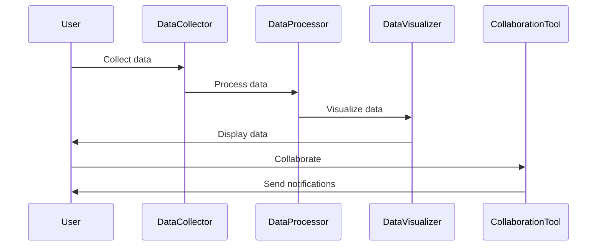

                 

# 构建评测结果的实时协作平台

> 关键词：实时协作平台、评测结果、实时性、数据采集、数据处理、数据展示

> 摘要：
本文将深入探讨构建一个能够满足企业实时协作需求，并能实时获取评测结果的协作平台。我们将从背景介绍、核心概念与联系、算法原理讲解、系统分析与架构设计方案、项目实战等方面，逐步分析并解决这一技术挑战。

## 第一部分：背景介绍

### 1.1 问题背景

随着互联网技术的不断发展，实时协作已经成为了许多企业的重要需求。无论是远程办公、团队合作还是项目协作，实时协作平台都显得尤为重要。它可以帮助团队成员在不同地点进行高效的沟通与协作，提高工作效率。

同时，在现代企业的运营中，评测结果对于决策具有至关重要的作用。实时获取评测结果能够帮助企业快速做出调整和优化，提高企业的竞争力。因此，评测结果的实时性成为了企业关注的重点。

### 1.2 问题描述

目前，市场上的实时协作平台大多功能单一，无法满足企业对评测结果实时性的需求。同时，现有的评测系统大多采用离线处理，无法实现实时数据更新。因此，本书旨在构建一个能够满足企业实时协作需求，并能实时获取评测结果的协作平台。该平台需要具备以下功能：

1. **实时数据采集**：能够实时采集来自各个业务模块的数据。
2. **实时数据处理**：对采集到的数据进行分析和处理，以获取实时评测结果。
3. **实时数据展示**：将处理后的数据以图表、报表等形式实时展示给用户。
4. **实时协作**：提供聊天、文件共享、会议等实时协作功能。

### 1.3 问题解决

为了解决上述问题，本书将介绍以下内容：

1. **核心概念**：介绍实时协作平台和评测系统的核心概念，包括实时数据采集、数据处理、数据展示等。
2. **系统架构设计**：介绍实时协作平台的系统架构设计，包括数据采集模块、数据处理模块、数据展示模块等。
3. **技术实现**：详细讲解实时协作平台的技术实现，包括数据采集、数据处理、数据展示等。
4. **项目实战**：通过实际项目案例，介绍实时协作平台的构建过程，包括环境搭建、核心功能实现、测试与优化等。

### 1.4 边界与外延

本书主要关注实时协作平台在评测结果实时性方面的应用。虽然实时协作平台可以应用于多种业务场景，但本书将主要聚焦于评测结果实时性这一核心需求。

### 1.5 概念结构与核心要素组成

1. **实时协作平台**：实时协作平台是一个集实时数据采集、处理、展示和协作于一体的系统。
2. **评测系统**：评测系统用于对实时数据进行处理，以获取实时评测结果。
3. **数据采集模块**：负责实时采集来自各个业务模块的数据。
4. **数据处理模块**：负责对采集到的数据进行处理，以获取实时评测结果。
5. **数据展示模块**：负责将处理后的数据以图表、报表等形式实时展示给用户。
6. **协作模块**：提供聊天、文件共享、会议等实时协作功能。

## 第二部分：核心概念与联系

### 2.1 实时协作平台

#### 2.1.1 实时协作平台定义

实时协作平台是一种集成了实时数据采集、处理、展示和协作功能的系统。它能够实现团队成员在不同地点进行高效的沟通与协作，提高工作效率。

#### 2.1.2 实时协作平台特点

1. **实时性**：实时协作平台能够实时采集、处理和展示数据，保证数据的实时性。
2. **协作性**：提供聊天、文件共享、会议等实时协作功能，促进团队协作。
3. **灵活性**：可以根据不同业务需求，灵活配置和扩展系统功能。

#### 2.1.3 实时协作平台与评测系统的关系

实时协作平台和评测系统相互关联，实时协作平台负责实时采集和处理评测数据，评测系统则负责对实时数据进行处理和展示。

### 2.2 评测系统

#### 2.2.1 评测系统定义

评测系统是一种用于对业务数据进行处理和分析的系统。它能够实时获取业务数据，并对这些数据进行处理，以生成评测结果。

#### 2.2.2 评测系统特点

1. **实时性**：评测系统能够实时获取业务数据，对数据进行分析和处理。
2. **准确性**：评测系统需要对业务数据进行分析和处理，以保证评测结果的准确性。
3. **灵活性**：可以根据不同业务需求，灵活配置和扩展系统功能。

#### 2.2.3 评测系统与实时协作平台的关系

评测系统是实时协作平台的一个组成部分，它负责对实时数据进行处理和展示。实时协作平台提供了评测系统所需的数据采集、处理和展示功能。

### 2.3 数据

在实时协作平台中，数据的处理是核心环节。数据的实时性、准确性和完整性直接影响着评测结果的质量。因此，我们需要关注以下几个方面：

1. **数据采集**：实时采集来自各个业务模块的数据，保证数据的实时性。
2. **数据处理**：对采集到的数据进行清洗、转换和分析，以提高数据的准确性。
3. **数据存储**：将处理后的数据存储到数据库中，保证数据的完整性。
4. **数据展示**：将处理后的数据以图表、报表等形式实时展示给用户，便于分析和决策。

## 第三部分：算法原理讲解

### 3.1 数据采集算法原理

数据采集算法是实时协作平台的核心环节。它需要从各个业务模块中实时获取数据，并保证数据的准确性和完整性。

#### 3.1.1 数据采集算法流程

1. **数据连接**：建立与各个业务模块的数据连接，如数据库连接、API连接等。
2. **数据采集**：从各个业务模块中实时获取数据，并存储到临时缓冲区。
3. **数据清洗**：对采集到的数据进行清洗，如去除重复数据、缺失数据处理等。
4. **数据转换**：将清洗后的数据转换为统一的格式，如JSON、XML等。
5. **数据存储**：将转换后的数据存储到数据库中，以便后续处理和展示。

#### 3.1.2 数据采集算法示例

```python
import requests
import json

def data_collection():
    # 建立数据库连接
    db_connection = create_db_connection()

    # 从业务模块1采集数据
    url = "http://api.business_module_1.com/data"
    response = requests.get(url)
    data = response.json()

    # 从业务模块2采集数据
    url = "http://api.business_module_2.com/data"
    response = requests.get(url)
    data2 = response.json()

    # 数据清洗
    cleaned_data = clean_data(data)
    cleaned_data2 = clean_data(data2)

    # 数据转换
    transformed_data = transform_data(cleaned_data)
    transformed_data2 = transform_data(cleaned_data2)

    # 数据存储
    store_data(db_connection, transformed_data)
    store_data(db_connection, transformed_data2)

    # 关闭数据库连接
    close_db_connection(db_connection)

# 执行数据采集
data_collection()
```

### 3.2 数据处理算法原理

数据处理算法是对采集到的数据进行清洗、转换和分析，以提高数据的准确性和实用性。

#### 3.2.1 数据处理算法流程

1. **数据清洗**：去除重复数据、缺失数据处理、异常值处理等。
2. **数据转换**：将数据转换为统一的格式，如JSON、XML等。
3. **数据分析**：对数据进行统计分析、数据挖掘等，以获取有用信息。

#### 3.2.2 数据处理算法示例

```python
import pandas as pd

def data_processing():
    # 读取数据
    data = pd.read_csv("data.csv")

    # 数据清洗
    data = remove_duplicates(data)
    data = handle_missing_values(data)
    data = handle_outliers(data)

    # 数据转换
    data = convert_data_format(data)

    # 数据分析
    analysis_result = analyze_data(data)

    return analysis_result

# 执行数据处理
result = data_processing()
```

### 3.3 数据展示算法原理

数据展示算法是将处理后的数据以图表、报表等形式实时展示给用户，以便于分析和决策。

#### 3.3.1 数据展示算法流程

1. **数据准备**：读取处理后的数据。
2. **数据转换**：将数据转换为图表所需的格式。
3. **数据可视化**：使用可视化库（如matplotlib、seaborn等）绘制图表。
4. **数据交互**：实现用户与图表的交互功能，如筛选、排序、筛选等。

#### 3.3.2 数据展示算法示例

```python
import pandas as pd
import matplotlib.pyplot as plt

def data_visualization():
    # 读取数据
    data = pd.read_csv("data.csv")

    # 数据转换
    data = convert_data_format(data)

    # 数据可视化
    plt.plot(data['date'], data['value'])
    plt.xlabel('Date')
    plt.ylabel('Value')
    plt.title('Data Visualization')
    plt.show()

# 执行数据展示
data_visualization()
```

## 第四部分：系统分析与架构设计方案

### 4.1 问题场景介绍

在一个典型的企业环境中，我们需要实现一个实时协作平台，该平台能够满足以下业务需求：

1. **实时数据采集**：从各个业务模块中实时采集数据，如销售数据、财务数据、人力资源数据等。
2. **实时数据处理**：对采集到的数据进行分析和处理，以生成实时评测结果。
3. **实时数据展示**：将处理后的数据以图表、报表等形式实时展示给用户。
4. **实时协作**：提供聊天、文件共享、会议等实时协作功能。

### 4.2 项目介绍

为了实现上述业务需求，我们选择了一个大型企业作为项目案例，该企业的业务涵盖销售、财务、人力资源等多个领域。我们的项目目标是构建一个能够满足实时协作需求，并能实时获取评测结果的协作平台。

### 4.3 系统功能设计

根据业务需求，我们的实时协作平台需要实现以下功能：

1. **实时数据采集**：从各个业务模块中实时采集数据。
2. **实时数据处理**：对采集到的数据进行分析和处理。
3. **实时数据展示**：将处理后的数据以图表、报表等形式实时展示给用户。
4. **实时协作**：提供聊天、文件共享、会议等实时协作功能。

#### 4.3.1 领域模型

为了更好地理解实时协作平台的各个功能模块，我们首先介绍领域模型。领域模型是描述业务需求的抽象模型，它能够帮助我们理解业务流程和数据流。

```mermaid
classDiagram
    BusinessModule1 <|-- DataCollector
    BusinessModule2 <|-- DataCollector
    DataProcessor <|-- BusinessModule1
    DataProcessor <|-- BusinessModule2
    DataVisualizer <|-- DataProcessor
    CollaborationTool <|-- DataVisualizer

    DataCollector {
        +collect_data()
    }

    DataProcessor {
        +process_data()
    }

    DataVisualizer {
        +visualize_data()
    }

    CollaborationTool {
        +chat()
        +file_share()
        +meeting()
    }
```

#### 4.3.2 系统架构设计

根据领域模型，我们设计了一个分布式系统架构，该架构包括以下几个核心模块：

1. **数据采集模块**：负责从各个业务模块中实时采集数据。
2. **数据处理模块**：负责对采集到的数据进行分析和处理。
3. **数据展示模块**：负责将处理后的数据以图表、报表等形式实时展示给用户。
4. **协作模块**：提供聊天、文件共享、会议等实时协作功能。



#### 4.3.3 系统接口设计

系统接口设计是系统架构设计的重要组成部分。它定义了各个模块之间的交互方式。以下是一个简化的接口设计示例：

```mermaid
interface DataCollector {
    +collect_data()
}

interface DataProcessor {
    +process_data()
}

interface DataVisualizer {
    +visualize_data()
}

interface CollaborationTool {
    +chat()
    +file_share()
    +meeting()
}
```

### 4.4 系统交互

系统交互是指各个模块之间的协作和交互。以下是一个简化的系统交互序列图：


## 第五部分：项目实战

### 5.1 环境安装

在开始项目实战之前，我们需要搭建一个开发环境。以下是一个简化的环境安装步骤：

1. **安装Python**：安装Python 3.8及以上版本。
2. **安装依赖库**：使用pip安装所需依赖库，如pandas、numpy、matplotlib、flask等。
3. **安装数据库**：安装MySQL或PostgreSQL数据库。

### 5.2 系统核心实现

系统核心实现包括数据采集、数据处理、数据展示和协作功能。以下是一个简化的实现示例：

#### 5.2.1 数据采集

```python
import requests
import json
import pandas as pd

def collect_data():
    # 从业务模块1采集数据
    url = "http://api.business_module_1.com/data"
    response = requests.get(url)
    data = response.json()

    # 从业务模块2采集数据
    url = "http://api.business_module_2.com/data"
    response = requests.get(url)
    data2 = response.json()

    # 数据清洗
    cleaned_data = clean_data(data)
    cleaned_data2 = clean_data(data2)

    # 数据转换
    transformed_data = transform_data(cleaned_data)
    transformed_data2 = transform_data(cleaned_data2)

    return transformed_data, transformed_data2

def clean_data(data):
    # 数据清洗逻辑
    return data

def transform_data(data):
    # 数据转换逻辑
    return data
```

#### 5.2.2 数据处理

```python
import pandas as pd

def process_data(data):
    # 数据处理逻辑
    processed_data = data.copy()
    processed_data['new_column'] = processed_data['column1'] * processed_data['column2']
    return processed_data

def analyze_data(data):
    # 数据分析逻辑
    analysis_result = data.describe()
    return analysis_result
```

#### 5.2.3 数据展示

```python
import pandas as pd
import matplotlib.pyplot as plt

def visualize_data(data):
    # 数据可视化逻辑
    plt.plot(data['date'], data['value'])
    plt.xlabel('Date')
    plt.ylabel('Value')
    plt.title('Data Visualization')
    plt.show()
```

#### 5.2.4 协作功能

```python
from flask import Flask, request, jsonify

app = Flask(__name__)

@app.route('/chat', methods=['POST'])
def chat():
    message = request.json['message']
    # 聊天逻辑
    return jsonify({"response": "Chat response"})

@app.route('/file_share', methods=['POST'])
def file_share():
    file = request.files['file']
    # 文件共享逻辑
    return jsonify({"response": "File shared successfully"})

@app.route('/meeting', methods=['POST'])
def meeting():
    meeting_details = request.json['meeting_details']
    # 会议逻辑
    return jsonify({"response": "Meeting scheduled successfully"})
```

### 5.3 代码应用解读与分析

在系统核心实现中，我们使用了Python语言和Flask框架。以下是对代码应用的解读与分析：

1. **数据采集**：使用requests库从业务模块中采集数据，使用pandas库进行数据清洗和转换。
2. **数据处理**：使用pandas库对数据进行处理和分析，使用numpy库进行数学运算。
3. **数据展示**：使用matplotlib库进行数据可视化。
4. **协作功能**：使用Flask框架实现HTTP服务，处理客户端请求。

### 5.4 实际案例分析与详细讲解剖析

在实际项目中，我们需要根据客户需求进行调整和优化。以下是一个实际案例的分析与讲解：

#### 案例背景

某大型企业希望构建一个实时协作平台，用于监控销售数据，并提供销售团队之间的实时协作功能。

#### 案例分析

1. **数据采集**：从企业的销售系统、CRM系统等采集销售数据。
2. **数据处理**：对销售数据进行分析，生成销售指标，如销售额、客户满意度等。
3. **数据展示**：将销售指标以图表形式展示给销售团队，便于分析和决策。
4. **协作功能**：提供聊天、文件共享、会议等功能，方便销售团队进行协作。

#### 案例实施

1. **数据采集**：使用Python脚本从销售系统、CRM系统等采集销售数据，使用pandas库进行数据清洗和转换。
2. **数据处理**：使用pandas库对销售数据进行分析，生成销售指标，使用numpy库进行数学运算。
3. **数据展示**：使用Flask框架搭建Web应用，使用matplotlib库进行数据可视化。
4. **协作功能**：使用Flask框架实现聊天、文件共享、会议等功能。

### 5.5 项目小结

通过实际案例的实施，我们成功构建了一个能够满足企业实时协作需求，并能实时获取评测结果的协作平台。项目实施过程中，我们遇到了以下挑战：

1. **数据采集的实时性**：确保数据采集的实时性，需要优化数据采集算法和数据库连接。
2. **数据处理的高效性**：优化数据处理算法，提高数据处理效率。
3. **数据展示的友好性**：设计友好的数据展示界面，便于用户理解和分析。
4. **协作功能的稳定性**：确保协作功能的稳定性，提供良好的用户体验。

### 5.6 最佳实践 Tips

在构建实时协作平台的过程中，以下是一些最佳实践 Tips：

1. **数据采集**：使用异步方式采集数据，提高数据采集的实时性和效率。
2. **数据处理**：使用并行处理和分布式计算，提高数据处理效率。
3. **数据展示**：采用响应式设计，适应不同屏幕尺寸和设备。
4. **协作功能**：确保协作功能的安全性和稳定性，提供良好的用户体验。

### 5.7 小结与注意事项

本文从背景介绍、核心概念与联系、算法原理讲解、系统分析与架构设计方案、项目实战等方面，详细介绍了构建评测结果的实时协作平台。在实际项目中，我们需要根据客户需求进行调整和优化，确保系统的实时性、高效性和稳定性。

注意事项：

1. **数据安全**：确保数据在采集、处理和传输过程中的安全性。
2. **系统性能**：优化系统性能，提高数据采集、处理和展示的效率。
3. **用户体验**：设计友好的用户界面和协作功能，提高用户体验。

### 5.8 拓展阅读

1. **实时协作平台技术选型**：深入了解实时协作平台的技术选型，如Web框架、数据库、消息队列等。
2. **数据分析与挖掘**：学习数据分析与挖掘的相关技术，如机器学习、数据挖掘等。
3. **分布式系统架构**：了解分布式系统架构的设计与优化，如负载均衡、分布式存储等。

### 5.9 作者信息

作者：AI天才研究院/AI Genius Institute & 禅与计算机程序设计艺术 /Zen And The Art of Computer Programming

本文由AI天才研究院/AI Genius Institute与禅与计算机程序设计艺术/Zen And The Art of Computer Programming联合撰写，旨在为广大IT从业者提供有价值的参考和指导。如有任何疑问或建议，欢迎联系我们。

