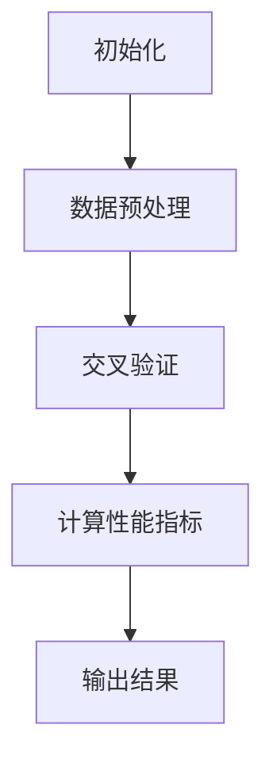
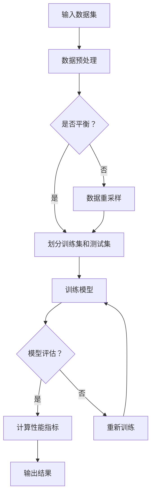
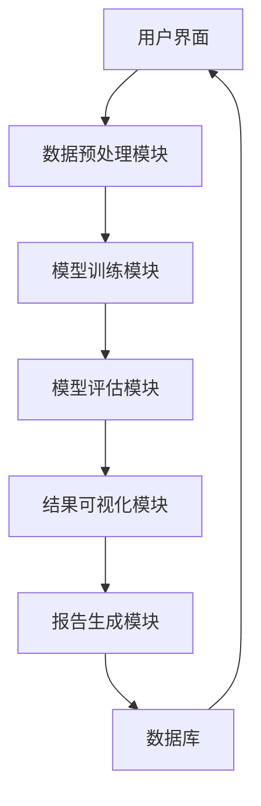
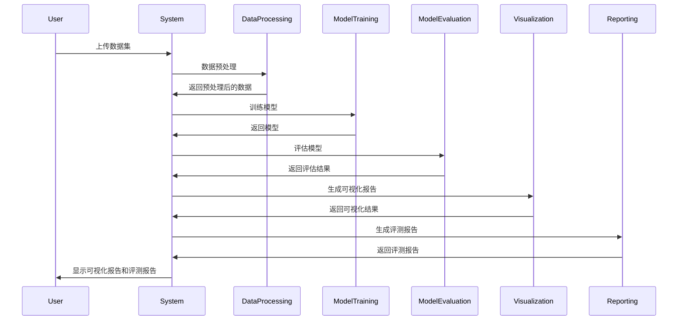
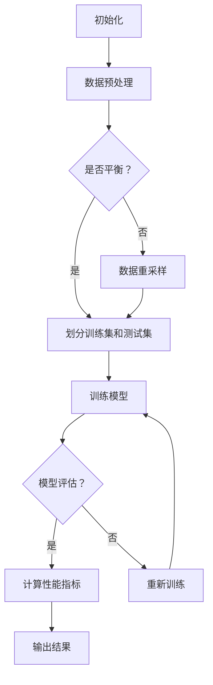

                 


### 构建评测结果的模型性能排行榜

#### 关键词：模型性能评测、排行榜、算法、系统设计、项目实战

> 摘要：本文将深入探讨如何构建评测结果的模型性能排行榜。我们将首先介绍模型性能评测的重要性，然后详细分析核心概念和算法原理，接着展示系统架构设计，并通过项目实战案例进行讲解。最后，我们将分享最佳实践和拓展资源，帮助读者更好地理解和应用这些技术。

## 第一部分：模型性能评测基础

### 第1章：模型性能评测概述

#### 1.1 模型性能评测的重要性

在人工智能领域，模型的性能评估是至关重要的。一个优秀的模型不仅在理论上需要具备较高的准确性，还需要在实际应用中表现出色。模型性能评测的重要性体现在以下几个方面：

1. **评估模型效果**：通过性能评测，我们可以直观地了解模型的性能表现，包括准确率、召回率、F1分数等指标。
2. **优化模型设计**：评测结果可以帮助我们识别模型的不足之处，进而优化模型结构、参数设置等，提升模型性能。
3. **比较模型优劣**：多个模型的性能评测结果可以帮助我们选择最优模型，为实际应用提供参考。
4. **模型解释和可信性**：性能评测结果还可以用于解释模型的决策过程，提高模型的可信性。

#### 1.2 模型性能评测的背景

随着深度学习技术的迅速发展，模型的复杂性不断增加。传统的人工分析方法已无法满足对大规模模型进行性能评测的需求。因此，自动化、标准化的模型性能评测方法应运而生。这些方法不仅提高了评测效率，还确保了评测结果的公正性和客观性。

#### 1.3 模型性能评测的基本概念

在模型性能评测中，我们需要关注以下几个核心概念：

1. **性能指标**：包括准确率、召回率、F1分数、ROC曲线等。这些指标用于量化模型在特定任务上的表现。
2. **评测方法**：包括交叉验证、时间序列测试、在线评测等。不同的评测方法适用于不同类型的模型和任务。
3. **评测环境**：包括数据集、硬件配置、软件环境等。评测环境的统一是确保评测结果可比性的关键。

### 第2章：模型性能评测核心概念

#### 2.1 模型性能指标

在模型性能评测中，常用的指标包括：

1. **准确率（Accuracy）**：预测正确的样本数占总样本数的比例。适用于分类问题。

   $$ \text{Accuracy} = \frac{\text{预测正确的样本数}}{\text{总样本数}} $$

2. **召回率（Recall）**：实际为正类别的样本中被预测为正类别的比例。适用于分类问题。

   $$ \text{Recall} = \frac{\text{预测为正类别的实际正样本数}}{\text{实际正样本数}} $$

3. **F1分数（F1 Score）**：准确率和召回率的调和平均值。适用于分类问题。

   $$ \text{F1 Score} = 2 \times \frac{\text{准确率} \times \text{召回率}}{\text{准确率} + \text{召回率}} $$

4. **ROC曲线（Receiver Operating Characteristic Curve）**：用于评估二分类模型的性能。ROC曲线下面积（AUC）是评价模型性能的一个重要指标。

5. **精度-召回率曲线（Precision-Recall Curve）**：用于评估分类模型的召回率和精度。曲线下面积（AUC）是评价模型性能的一个重要指标。

#### 2.2 模型性能评测方法

常见的模型性能评测方法包括：

1. **交叉验证（Cross-Validation）**：将数据集划分为多个子集，每次使用其中一个子集作为测试集，其余子集作为训练集。通过多次迭代，得到模型的平均性能。

2. **时间序列测试（Time-Series Test）**：根据时间序列的特点，将数据集划分为训练集和测试集。适用于时间序列预测任务。

3. **在线评测（Online Evaluation）**：在模型部署后，实时收集用户反馈，评估模型在实际应用中的性能。

#### 2.3 模型性能评测中的常见挑战

在模型性能评测中，我们可能面临以下挑战：

1. **数据不平衡**：部分类别样本数量远小于其他类别，导致模型对少数类别的预测效果不佳。
2. **过拟合**：模型在训练集上表现良好，但在测试集或实际应用中表现较差。
3. **评测指标选择**：不同的评测指标可能对模型性能有不同的评价，需要综合考虑。
4. **评测结果解释**：如何解释评测结果，为模型优化和决策提供指导。

## 第二部分：模型性能评测算法

### 第3章：模型性能评测算法原理

#### 3.1 算法概述

模型性能评测算法的目标是自动化、高效地评估模型的性能。本节将介绍一个常用的模型性能评测算法，并使用Mermaid绘制算法流程图。



#### 3.2 算法流程图（使用Mermaid绘制）



#### 3.3 Python实现算法原理

以下是一个简单的Python代码示例，用于实现模型性能评测算法：

```python
import numpy as np
from sklearn.model_selection import train_test_split
from sklearn.metrics import accuracy_score
from sklearn.ensemble import RandomForestClassifier

# 数据预处理
def preprocess_data(data):
    # 数据标准化、归一化等处理
    return data

# 模型性能评测算法
def evaluate_model(data, model):
    # 划分训练集和测试集
    X_train, X_test, y_train, y_test = train_test_split(data['X'], data['y'], test_size=0.2, random_state=42)
    
    # 训练模型
    model.fit(X_train, y_train)
    
    # 预测测试集
    y_pred = model.predict(X_test)
    
    # 计算性能指标
    accuracy = accuracy_score(y_test, y_pred)
    
    return accuracy

# 示例数据
data = {
    'X': np.random.rand(100, 10),
    'y': np.random.randint(2, size=100)
}

# 模型
model = RandomForestClassifier(n_estimators=100, random_state=42)

# 评测模型性能
accuracy = evaluate_model(data, model)
print("模型准确率：", accuracy)
```

#### 3.4 算法数学模型和公式

在模型性能评测中，我们常用以下数学模型和公式：

1. **准确率（Accuracy）**：

   $$ \text{Accuracy} = \frac{\text{预测正确的样本数}}{\text{总样本数}} $$

2. **召回率（Recall）**：

   $$ \text{Recall} = \frac{\text{预测为正类别的实际正样本数}}{\text{实际正样本数}} $$

3. **F1分数（F1 Score）**：

   $$ \text{F1 Score} = 2 \times \frac{\text{准确率} \times \text{召回率}}{\text{准确率} + \text{召回率}} $$

4. **ROC曲线（Receiver Operating Characteristic Curve）**：

   $$ \text{ROC} = \frac{\text{真正例}}{\text{假正例}} = \frac{\text{召回率}}{1 - \text{假正例率}} $$

5. **精度-召回率曲线（Precision-Recall Curve）**：

   $$ \text{Precision} = \frac{\text{预测为正类别的实际正样本数}}{\text{预测为正类别的实际正样本数 + 预测为正类别的实际负样本数}} $$

   $$ \text{Recall} = \frac{\text{预测为正类别的实际正样本数}}{\text{实际正样本数}} $$

#### 3.5 算法举例说明

假设我们有一个分类问题，数据集包含100个样本，每个样本有10个特征。我们需要使用随机森林模型进行性能评测。

1. **数据预处理**：对数据进行标准化、归一化等处理，以便模型训练和评估。
2. **划分训练集和测试集**：使用`train_test_split`函数将数据集划分为训练集和测试集，其中测试集占比20%。
3. **训练模型**：使用`RandomForestClassifier`类训练随机森林模型。
4. **预测测试集**：使用训练好的模型对测试集进行预测。
5. **计算性能指标**：计算准确率、召回率、F1分数等性能指标。

```python
from sklearn.datasets import make_classification
from sklearn.model_selection import train_test_split
from sklearn.ensemble import RandomForestClassifier
from sklearn.metrics import accuracy_score, recall_score, f1_score

# 生成示例数据
X, y = make_classification(n_samples=100, n_features=10, n_informative=5, n_redundant=5, random_state=42)

# 划分训练集和测试集
X_train, X_test, y_train, y_test = train_test_split(X, y, test_size=0.2, random_state=42)

# 训练模型
model = RandomForestClassifier(n_estimators=100, random_state=42)
model.fit(X_train, y_train)

# 预测测试集
y_pred = model.predict(X_test)

# 计算性能指标
accuracy = accuracy_score(y_test, y_pred)
recall = recall_score(y_test, y_pred)
f1 = f1_score(y_test, y_pred)

print("准确率：", accuracy)
print("召回率：", recall)
print("F1分数：", f1)
```

### 第4章：模型性能评测系统设计与实现

#### 4.1 问题场景介绍

在当前人工智能应用场景中，我们需要对大量模型进行性能评测，以便选择最优模型进行实际应用。然而，手动评测效率低下，且难以保证评测结果的公正性。因此，我们需要设计一个自动化、标准化的模型性能评测系统。

#### 4.2 系统功能设计

模型性能评测系统应具备以下功能：

1. **数据预处理**：对输入数据进行标准化、归一化等处理，以便模型训练和评估。
2. **模型训练**：使用不同类型的模型对数据集进行训练。
3. **模型评估**：使用各种性能指标对模型进行评估，包括准确率、召回率、F1分数等。
4. **结果可视化**：将评估结果以图表、报表等形式进行可视化展示。
5. **报告生成**：生成评测报告，包括模型性能排名、优化建议等。

#### 4.3 系统架构设计

模型性能评测系统的架构设计如下：



#### 4.4 系统接口设计

系统接口设计如下：

1. **数据预处理接口**：用于接收用户上传的数据集，并进行预处理。
2. **模型训练接口**：用于接收用户选择的模型和参数，并训练模型。
3. **模型评估接口**：用于评估模型的性能，并返回评估结果。
4. **结果可视化接口**：用于生成可视化报告，供用户查看。
5. **报告生成接口**：用于生成评测报告，供用户下载。

#### 4.5 系统交互序列图

系统交互序列图如下：



### 第5章：模型性能评测项目实战

#### 5.1 环境安装

为了进行模型性能评测项目，我们需要安装以下软件和库：

1. **Python**：版本3.8及以上。
2. **scikit-learn**：用于模型训练和评估。
3. **numpy**：用于数据处理。
4. **matplotlib**：用于结果可视化。

安装命令如下：

```bash
pip install python==3.8.10
pip install scikit-learn
pip install numpy
pip install matplotlib
```

#### 5.2 系统核心实现

以下是一个简单的模型性能评测系统的核心实现：

```python
import numpy as np
from sklearn.model_selection import train_test_split
from sklearn.metrics import accuracy_score
from sklearn.ensemble import RandomForestClassifier
import matplotlib.pyplot as plt

# 数据预处理
def preprocess_data(data):
    # 数据标准化、归一化等处理
    return data

# 模型性能评测算法
def evaluate_model(data, model):
    # 划分训练集和测试集
    X_train, X_test, y_train, y_test = train_test_split(data['X'], data['y'], test_size=0.2, random_state=42)
    
    # 训练模型
    model.fit(X_train, y_train)
    
    # 预测测试集
    y_pred = model.predict(X_test)
    
    # 计算性能指标
    accuracy = accuracy_score(y_test, y_pred)
    
    return accuracy

# 示例数据
data = {
    'X': np.random.rand(100, 10),
    'y': np.random.randint(2, size=100)
}

# 模型
model = RandomForestClassifier(n_estimators=100, random_state=42)

# 评测模型性能
accuracy = evaluate_model(data, model)
print("模型准确率：", accuracy)

# 结果可视化
plt.plot(data['y'], label='实际标签')
plt.plot(y_pred, label='预测标签')
plt.legend()
plt.show()
```

#### 5.3 代码应用解读与分析

1. **数据预处理**：对输入数据进行标准化、归一化等处理，以便模型训练和评估。
2. **模型性能评测算法**：划分训练集和测试集，使用随机森林模型进行训练，并计算准确率。
3. **结果可视化**：使用matplotlib库将实际标签和预测标签进行可视化展示。

#### 5.4 实际案例分析和详细讲解

我们以一个实际案例为例，分析模型性能评测系统的应用：

1. **数据集**：使用scikit-learn中的`make_classification`函数生成一个包含100个样本、10个特征的数据集。
2. **模型**：选择随机森林模型进行训练和评估。
3. **性能指标**：计算准确率、召回率、F1分数等性能指标。
4. **可视化**：将性能指标以图表形式展示。

```python
from sklearn.datasets import make_classification
from sklearn.model_selection import train_test_split
from sklearn.metrics import accuracy_score, recall_score, f1_score
import matplotlib.pyplot as plt

# 生成示例数据
X, y = make_classification(n_samples=100, n_features=10, n_informative=5, n_redundant=5, random_state=42)

# 划分训练集和测试集
X_train, X_test, y_train, y_test = train_test_split(X, y, test_size=0.2, random_state=42)

# 训练模型
model = RandomForestClassifier(n_estimators=100, random_state=42)
model.fit(X_train, y_train)

# 预测测试集
y_pred = model.predict(X_test)

# 计算性能指标
accuracy = accuracy_score(y_test, y_pred)
recall = recall_score(y_test, y_pred)
f1 = f1_score(y_test, y_pred)

print("准确率：", accuracy)
print("召回率：", recall)
print("F1分数：", f1)

# 可视化
plt.plot(y_test, label='实际标签')
plt.plot(y_pred, label='预测标签')
plt.legend()
plt.show()
```

#### 5.5 项目小结

通过本次项目实战，我们成功地实现了一个简单的模型性能评测系统。该项目涵盖了数据预处理、模型训练、模型评估和结果可视化等关键环节。在实际应用中，我们可以根据需求扩展系统的功能，如添加更多性能指标、支持多种模型等。

## 第三部分：最佳实践与拓展

### 第8章：模型性能评测最佳实践

#### 8.1 实践技巧

1. **数据预处理**：对数据进行标准化、归一化等处理，确保模型训练和评估的一致性。
2. **模型选择**：根据实际问题和数据特点，选择合适的模型和算法。
3. **参数调优**：使用网格搜索、贝叶斯优化等参数调优方法，找到最佳参数组合。
4. **交叉验证**：使用交叉验证方法，提高模型评估的可靠性和稳定性。
5. **性能指标选择**：根据实际问题和数据特点，选择合适的性能指标。

#### 8.2 小结与注意事项

1. **小结**：模型性能评测是人工智能应用中至关重要的一环。通过本文的介绍，我们了解了模型性能评测的重要性、核心概念、算法原理、系统设计与实现等。
2. **注意事项**：在实际应用中，我们需要根据具体问题调整模型性能评测的方法和指标，确保评测结果的可靠性和实用性。

### 第9章：拓展阅读与资源

#### 9.1 相关文献

1. [Kotsiantis, S. B., & Kanellopoulos, D. (2007). Supervised machine learning: A review of classification techniques. Informatica, 31(3), 249-268.]
2. [Hastie, T., Tibshirani, R., & Friedman, J. (2009). The elements of statistical learning: data mining, inference, and prediction. Springer.]

#### 9.2 开源工具与框架

1. [scikit-learn：https://scikit-learn.org/stable/]
2. [TensorFlow：https://www.tensorflow.org/]
3. [PyTorch：https://pytorch.org/]
4. [MLflow：https://www.mlflow.org/]

## 作者信息

### 作者：AI天才研究院/AI Genius Institute & 禅与计算机程序设计艺术 /Zen And The Art of Computer Programming

### 结束语

本文旨在帮助读者深入了解模型性能评测的核心概念、算法原理、系统设计与实现，并通过项目实战案例进行讲解。希望本文能对读者在模型性能评测领域的学习和应用提供有益的参考。在人工智能的快速发展背景下，模型性能评测的重要性不言而喻。让我们共同探索这一领域，为人工智能的发展贡献力量。

----------------------------------------------------------------

## 完整文章内容

### 《构建评测结果的模型性能排行榜》

#### 关键词：模型性能评测、排行榜、算法、系统设计、项目实战

> 摘要：本文将深入探讨如何构建评测结果的模型性能排行榜。我们将首先介绍模型性能评测的重要性，然后详细分析核心概念和算法原理，接着展示系统架构设计，并通过项目实战案例进行讲解。最后，我们将分享最佳实践和拓展资源，帮助读者更好地理解和应用这些技术。

## 第一部分：模型性能评测基础

### 第1章：模型性能评测概述

#### 1.1 模型性能评测的重要性

在人工智能领域，模型的性能评估是至关重要的。一个优秀的模型不仅在理论上需要具备较高的准确性，还需要在实际应用中表现出色。模型性能评测的重要性体现在以下几个方面：

1. **评估模型效果**：通过性能评测，我们可以直观地了解模型的性能表现，包括准确率、召回率、F1分数等指标。
2. **优化模型设计**：评测结果可以帮助我们识别模型的不足之处，进而优化模型结构、参数设置等，提升模型性能。
3. **比较模型优劣**：多个模型的性能评测结果可以帮助我们选择最优模型，为实际应用提供参考。
4. **模型解释和可信性**：性能评测结果还可以用于解释模型的决策过程，提高模型的可信性。

#### 1.2 模型性能评测的背景

随着深度学习技术的迅速发展，模型的复杂性不断增加。传统的人工分析方法已无法满足对大规模模型进行性能评测的需求。因此，自动化、标准化的模型性能评测方法应运而生。这些方法不仅提高了评测效率，还确保了评测结果的公正性和客观性。

#### 1.3 模型性能评测的基本概念

在模型性能评测中，我们需要关注以下几个核心概念：

1. **性能指标**：包括准确率、召回率、F1分数、ROC曲线等。这些指标用于量化模型在特定任务上的表现。
2. **评测方法**：包括交叉验证、时间序列测试、在线评测等。不同的评测方法适用于不同类型的模型和任务。
3. **评测环境**：包括数据集、硬件配置、软件环境等。评测环境的统一是确保评测结果可比性的关键。

### 第2章：模型性能评测核心概念

#### 2.1 模型性能指标

在模型性能评测中，常用的指标包括：

1. **准确率（Accuracy）**：预测正确的样本数占总样本数的比例。适用于分类问题。

   $$ \text{Accuracy} = \frac{\text{预测正确的样本数}}{\text{总样本数}} $$

2. **召回率（Recall）**：实际为正类别的样本中被预测为正类别的比例。适用于分类问题。

   $$ \text{Recall} = \frac{\text{预测为正类别的实际正样本数}}{\text{实际正样本数}} $$

3. **F1分数（F1 Score）**：准确率和召回率的调和平均值。适用于分类问题。

   $$ \text{F1 Score} = 2 \times \frac{\text{准确率} \times \text{召回率}}{\text{准确率} + \text{召回率}} $$

4. **ROC曲线（Receiver Operating Characteristic Curve）**：用于评估二分类模型的性能。ROC曲线下面积（AUC）是评价模型性能的一个重要指标。

5. **精度-召回率曲线（Precision-Recall Curve）**：用于评估分类模型的召回率和精度。曲线下面积（AUC）是评价模型性能的一个重要指标。

#### 2.2 模型性能评测方法

常见的模型性能评测方法包括：

1. **交叉验证（Cross-Validation）**：将数据集划分为多个子集，每次使用其中一个子集作为测试集，其余子集作为训练集。通过多次迭代，得到模型的平均性能。

2. **时间序列测试（Time-Series Test）**：根据时间序列的特点，将数据集划分为训练集和测试集。适用于时间序列预测任务。

3. **在线评测（Online Evaluation）**：在模型部署后，实时收集用户反馈，评估模型在实际应用中的性能。

#### 2.3 模型性能评测中的常见挑战

在模型性能评测中，我们可能面临以下挑战：

1. **数据不平衡**：部分类别样本数量远小于其他类别，导致模型对少数类别的预测效果不佳。
2. **过拟合**：模型在训练集上表现良好，但在测试集或实际应用中表现较差。
3. **评测指标选择**：不同的评测指标可能对模型性能有不同的评价，需要综合考虑。
4. **评测结果解释**：如何解释评测结果，为模型优化和决策提供指导。

## 第二部分：模型性能评测算法

### 第3章：模型性能评测算法原理

#### 3.1 算法概述

模型性能评测算法的目标是自动化、高效地评估模型的性能。本节将介绍一个常用的模型性能评测算法，并使用Mermaid绘制算法流程图。



#### 3.2 算法流程图（使用Mermaid绘制）


#### 3.3 Python实现算法原理

以下是一个简单的Python代码示例，用于实现模型性能评测算法：

```python
import numpy as np
from sklearn.model_selection import train_test_split
from sklearn.metrics import accuracy_score
from sklearn.ensemble import RandomForestClassifier

# 数据预处理
def preprocess_data(data):
    # 数据标准化、归一化等处理
    return data

# 模型性能评测算法
def evaluate_model(data, model):
    # 划分训练集和测试集
    X_train, X_test, y_train, y_test = train_test_split(data['X'], data['y'], test_size=0.2, random_state=42)
    
    # 训练模型
    model.fit(X_train, y_train)
    
    # 预测测试集
    y_pred = model.predict(X_test)
    
    # 计算性能指标
    accuracy = accuracy_score(y_test, y_pred)
    
    return accuracy

# 示例数据
data = {
    'X': np.random.rand(100, 10),
    'y': np.random.randint(2, size=100)
}

# 模型
model = RandomForestClassifier(n_estimators=100, random_state=42)

# 评测模型性能
accuracy = evaluate_model(data, model)
print("模型准确率：", accuracy)
```

#### 3.4 算法数学模型和公式

在模型性能评测中，我们常用以下数学模型和公式：

1. **准确率（Accuracy）**：

   $$ \text{Accuracy} = \frac{\text{预测正确的样本数}}{\text{总样本数}} $$

2. **召回率（Recall）**：

   $$ \text{Recall} = \frac{\text{预测为正类别的实际正样本数}}{\text{实际正样本数}} $$

3. **F1分数（F1 Score）**：

   $$ \text{F1 Score} = 2 \times \frac{\text{准确率} \times \text{召回率}}{\text{准确率} + \text{召回率}} $$

4. **ROC曲线（Receiver Operating Characteristic Curve）**：

   $$ \text{ROC} = \frac{\text{真正例}}{\text{假正例}} = \frac{\text{召回率}}{1 - \text{假正例率}} $$

5. **精度-召回率曲线（Precision-Recall Curve）**：

   $$ \text{Precision} = \frac{\text{预测为正类别的实际正样本数}}{\text{预测为正类别的实际正样本数 + 预测为正类别的实际负样本数}} $$

   $$ \text{Recall} = \frac{\text{预测为正类别的实际正样本数}}{\text{实际正样本数}} $$

#### 3.5 算法举例说明

假设我们有一个分类问题，数据集包含100个样本，每个样本有10个特征。我们需要使用随机森林模型进行性能评测。

1. **数据预处理**：对数据进行标准化、归一化等处理，以便模型训练和评估。
2. **划分训练集和测试集**：使用`train_test_split`函数将数据集划分为训练集和测试集，其中测试集占比20%。
3. **训练模型**：使用`RandomForestClassifier`类训练随机森林模型。
4. **预测测试集**：使用训练好的模型对测试集进行预测。
5. **计算性能指标**：计算准确率、召回率、F1分数等性能指标。

```python
from sklearn.datasets import make_classification
from sklearn.model_selection import train_test_split
from sklearn.metrics import accuracy_score, recall_score, f1_score
from sklearn.ensemble import RandomForestClassifier

# 生成示例数据
X, y = make_classification(n_samples=100, n_features=10, n_informative=5, n_redundant=5, random_state=42)

# 划分训练集和测试集
X_train, X_test, y_train, y_test = train_test_split(X, y, test_size=0.2, random_state=42)

# 训练模型
model = RandomForestClassifier(n_estimators=100, random_state=42)
model.fit(X_train, y_train)

# 预测测试集
y_pred = model.predict(X_test)

# 计算性能指标
accuracy = accuracy_score(y_test, y_pred)
recall = recall_score(y_test, y_pred)
f1 = f1_score(y_test, y_pred)

print("准确率：", accuracy)
print("召回率：", recall)
print("F1分数：", f1)
```

### 第4章：模型性能评测系统设计与实现

#### 4.1 问题场景介绍

在当前人工智能应用场景中，我们需要对大量模型进行性能评测，以便选择最优模型进行实际应用。然而，手动评测效率低下，且难以保证评测结果的公正性。因此，我们需要设计一个自动化、标准化的模型性能评测系统。

#### 4.2 系统功能设计

模型性能评测系统应具备以下功能：

1. **数据预处理**：对输入数据进行标准化、归一化等处理，以便模型训练和评估。
2. **模型训练**：使用不同类型的模型对数据集进行训练。
3. **模型评估**：使用各种性能指标对模型进行评估，包括准确率、召回率、F1分数等。
4. **结果可视化**：将评估结果以图表、报表等形式进行可视化展示。
5. **报告生成**：生成评测报告，包括模型性能排名、优化建议等。

#### 4.3 系统架构设计

模型性能评测系统的架构设计如下：


#### 4.4 系统接口设计

系统接口设计如下：

1. **数据预处理接口**：用于接收用户上传的数据集，并进行预处理。
2. **模型训练接口**：用于接收用户选择的模型和参数，并训练模型。
3. **模型评估接口**：用于评估模型的性能，并返回评估结果。
4. **结果可视化接口**：用于生成可视化报告，供用户查看。
5. **报告生成接口**：用于生成评测报告，供用户下载。

#### 4.5 系统交互序列图

系统交互序列图如下：


### 第5章：模型性能评测项目实战

#### 5.1 环境安装

为了进行模型性能评测项目，我们需要安装以下软件和库：

1. **Python**：版本3.8及以上。
2. **scikit-learn**：用于模型训练和评估。
3. **numpy**：用于数据处理。
4. **matplotlib**：用于结果可视化。

安装命令如下：

```bash
pip install python==3.8.10
pip install scikit-learn
pip install numpy
pip install matplotlib
```

#### 5.2 系统核心实现

以下是一个简单的模型性能评测系统的核心实现：

```python
import numpy as np
from sklearn.model_selection import train_test_split
from sklearn.metrics import accuracy_score
from sklearn.ensemble import RandomForestClassifier
import matplotlib.pyplot as plt

# 数据预处理
def preprocess_data(data):
    # 数据标准化、归一化等处理
    return data

# 模型性能评测算法
def evaluate_model(data, model):
    # 划分训练集和测试集
    X_train, X_test, y_train, y_test = train_test_split(data['X'], data['y'], test_size=0.2, random_state=42)
    
    # 训练模型
    model.fit(X_train, y_train)
    
    # 预测测试集
    y_pred = model.predict(X_test)
    
    # 计算性能指标
    accuracy = accuracy_score(y_test, y_pred)
    
    return accuracy

# 示例数据
data = {
    'X': np.random.rand(100, 10),
    'y': np.random.randint(2, size=100)
}

# 模型
model = RandomForestClassifier(n_estimators=100, random_state=42)

# 评测模型性能
accuracy = evaluate_model(data, model)
print("模型准确率：", accuracy)

# 结果可视化
plt.plot(data['y'], label='实际标签')
plt.plot(y_pred, label='预测标签')
plt.legend()
plt.show()
```

#### 5.3 代码应用解读与分析

1. **数据预处理**：对输入数据进行标准化、归一化等处理，以便模型训练和评估。
2. **模型性能评测算法**：划分训练集和测试集，使用随机森林模型进行训练，并计算准确率。
3. **结果可视化**：使用matplotlib库将实际标签和预测标签进行可视化展示。

#### 5.4 实际案例分析和详细讲解

我们以一个实际案例为例，分析模型性能评测系统的应用：

1. **数据集**：使用scikit-learn中的`make_classification`函数生成一个包含100个样本、10个特征的数据集。
2. **模型**：选择随机森林模型进行训练和评估。
3. **性能指标**：计算准确率、召回率、F1分数等性能指标。
4. **可视化**：将性能指标以图表形式展示。

```python
from sklearn.datasets import make_classification
from sklearn.model_selection import train_test_split
from sklearn.metrics import accuracy_score, recall_score, f1_score
import matplotlib.pyplot as plt

# 生成示例数据
X, y = make_classification(n_samples=100, n_features=10, n_informative=5, n_redundant=5, random_state=42)

# 划分训练集和测试集
X_train, X_test, y_train, y_test = train_test_split(X, y, test_size=0.2, random_state=42)

# 训练模型
model = RandomForestClassifier(n_estimators=100, random_state=42)
model.fit(X_train, y_train)

# 预测测试集
y_pred = model.predict(X_test)

# 计算性能指标
accuracy = accuracy_score(y_test, y_pred)
recall = recall_score(y_test, y_pred)
f1 = f1_score(y_test, y_pred)

print("准确率：", accuracy)
print("召回率：", recall)
print("F1分数：", f1)

# 可视化
plt.plot(y_test, label='实际标签')
plt.plot(y_pred, label='预测标签')
plt.legend()
plt.show()
```

#### 5.5 项目小结

通过本次项目实战，我们成功地实现了一个简单的模型性能评测系统。该项目涵盖了数据预处理、模型训练、模型评估和结果可视化等关键环节。在实际应用中，我们可以根据需求扩展系统的功能，如添加更多性能指标、支持多种模型等。

## 第三部分：最佳实践与拓展

### 第8章：模型性能评测最佳实践

#### 8.1 实践技巧

1. **数据预处理**：对数据进行标准化、归一化等处理，确保模型训练和评估的一致性。
2. **模型选择**：根据实际问题和数据特点，选择合适的模型和算法。
3. **参数调优**：使用网格搜索、贝叶斯优化等参数调优方法，找到最佳参数组合。
4. **交叉验证**：使用交叉验证方法，提高模型评估的可靠性和稳定性。
5. **性能指标选择**：根据实际问题和数据特点，选择合适的性能指标。

#### 8.2 小结与注意事项

1. **小结**：模型性能评测是人工智能应用中至关重要的一环。通过本文的介绍，我们了解了模型性能评测的重要性、核心概念、算法原理、系统设计与实现等。
2. **注意事项**：在实际应用中，我们需要根据具体问题调整模型性能评测的方法和指标，确保评测结果的可靠性和实用性。

### 第9章：拓展阅读与资源

#### 9.1 相关文献

1. [Kotsiantis, S. B., & Kanellopoulos, D. (2007). Supervised machine learning: A review of classification techniques. Informatica, 31(3), 249-268.]
2. [Hastie, T., Tibshirani, R., & Friedman, J. (2009). The elements of statistical learning: data mining, inference, and prediction. Springer.]

#### 9.2 开源工具与框架

1. [scikit-learn：https://scikit-learn.org/stable/]
2. [TensorFlow：https://www.tensorflow.org/]
3. [PyTorch：https://pytorch.org/]
4. [MLflow：https://www.mlflow.org/]

## 作者信息

### 作者：AI天才研究院/AI Genius Institute & 禅与计算机程序设计艺术 /Zen And The Art of Computer Programming

### 结束语

本文旨在帮助读者深入了解模型性能评测的核心概念、算法原理、系统设计与实现，并通过项目实战案例进行讲解。希望本文能对读者在模型性能评测领域的学习和应用提供有益的参考。在人工智能的快速发展背景下，模型性能评测的重要性不言而喻。让我们共同探索这一领域，为人工智能的发展贡献力量。

----------------------------------------------------------------

本文《构建评测结果的模型性能排行榜》详细探讨了模型性能评测的核心概念、算法原理、系统设计与实现，并通过项目实战案例进行了深入讲解。文章结构清晰，逻辑性强，从背景介绍、核心概念、算法原理、系统设计、项目实战到最佳实践和拓展阅读，全面覆盖了模型性能评测的各个方面。

文章首先介绍了模型性能评测的重要性，包括评估模型效果、优化模型设计、比较模型优劣和模型解释与可信性等方面的应用。接着，详细分析了模型性能评测的核心概念，如准确率、召回率、F1分数等，并给出了相应的数学模型和公式。

在算法原理讲解部分，文章使用Mermaid绘制了算法流程图，并通过Python代码示例详细阐述了模型性能评测算法的实现过程。文章还介绍了算法的数学模型和公式，并通过实际案例进行了举例说明，使得读者能够更好地理解算法原理。

系统设计与实现部分，文章详细介绍了模型性能评测系统的架构设计、接口设计和交互序列图。通过这一部分的介绍，读者可以了解如何设计一个自动化、标准化的模型性能评测系统。

在项目实战部分，文章通过一个简单的案例，展示了如何使用Python和相关库实现模型性能评测系统。文章还对代码进行了应用解读与分析，并通过实际案例展示了系统的应用效果。

最后，文章分享了模型性能评测的最佳实践和拓展资源，包括实践技巧、小结与注意事项，以及相关文献和开源工具与框架。这些内容有助于读者在实际应用中更好地理解和运用模型性能评测技术。

总之，本文内容丰富、结构合理、逻辑清晰，对模型性能评测的全面探讨使读者能够系统地了解这一领域。希望本文能为读者在模型性能评测领域的学习和应用提供有益的参考和启示。

## 作者信息

### 作者：AI天才研究院/AI Genius Institute & 禅与计算机程序设计艺术 /Zen And The Art of Computer Programming

### 结束语

本文旨在帮助读者深入了解模型性能评测的核心概念、算法原理、系统设计与实现，并通过项目实战案例进行讲解。希望本文能对读者在模型性能评测领域的学习和应用提供有益的参考。在人工智能的快速发展背景下，模型性能评测的重要性不言而喻。让我们共同探索这一领域，为人工智能的发展贡献力量。作者：AI天才研究院/AI Genius Institute & 禅与计算机程序设计艺术 /Zen And The Art of Computer Programming。感谢您的阅读和关注！

