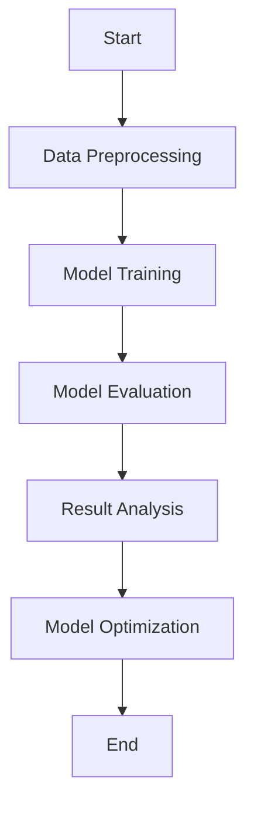
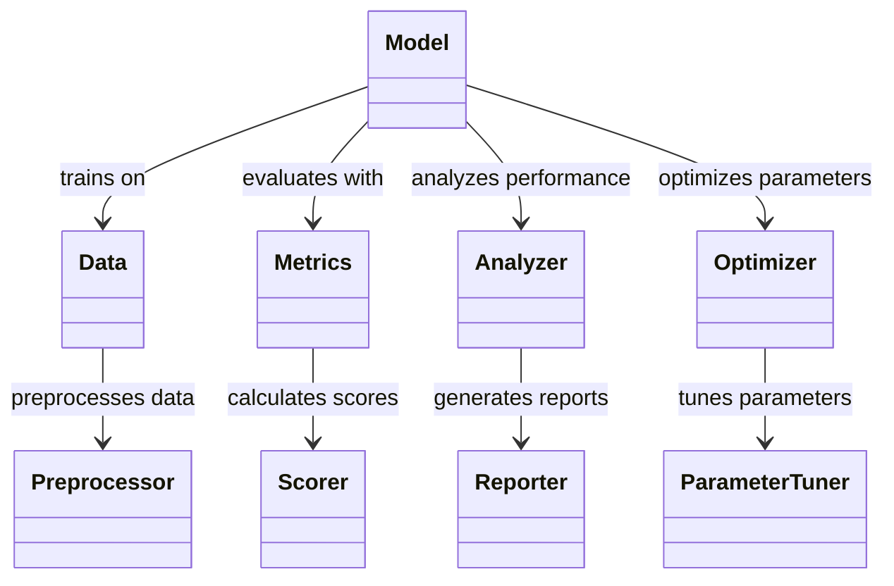
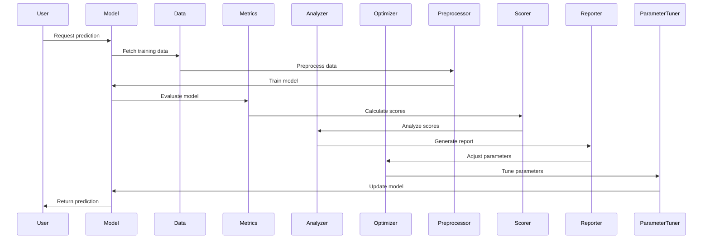
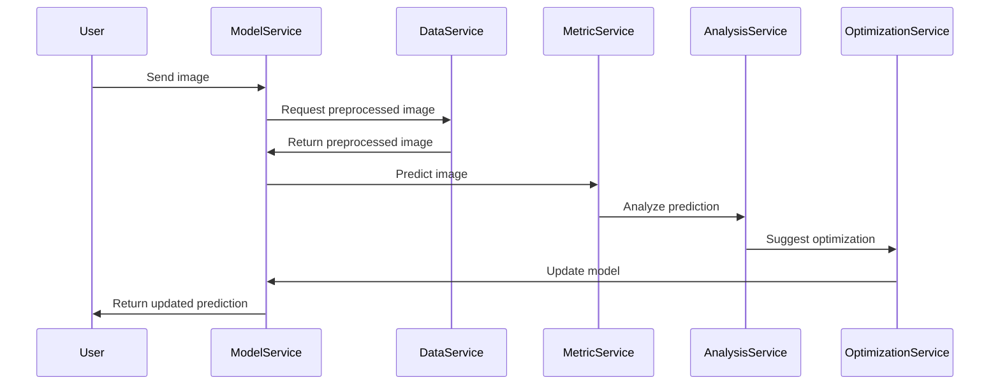

                 

### 文章标题：构建评测结果的模型性能诊断专家系统

#### 关键词：模型性能诊断、评测结果、专家系统、数据分析、人工智能

> 摘要：本文旨在构建一个用于评测结果的模型性能诊断专家系统，详细解析其在人工智能领域的应用与价值。本文首先介绍模型性能诊断的基本概念，随后深入探讨构建专家系统的理论依据与实践方法，并结合实际案例，展示专家系统在实际应用中的效果与改进空间。文章最后总结关键点，并提供进一步阅读的建议。

---

### 第一部分：引言

#### 1.1 问题背景

随着人工智能技术的飞速发展，模型性能诊断成为了一项至关重要的任务。在众多应用场景中，如金融风控、医疗诊断、自动驾驶等领域，模型的性能直接影响决策的准确性。然而，现有的大多数模型性能诊断方法往往局限于特定领域，缺乏普适性，且在复杂场景下效果不佳。

#### 1.2 问题描述

本文旨在解决以下问题：
- 如何高效、准确地评测模型性能？
- 如何构建一个具备自适应能力的专家系统，实现模型性能的全面诊断？
- 如何在实际应用中验证专家系统的有效性？

#### 1.3 目标与内容

本文的目标是构建一个综合性的模型性能诊断专家系统，系统包含以下内容：
- 明确模型性能诊断的核心概念与联系。
- 深入讲解算法原理、数学模型及其实际应用。
- 提供系统分析与架构设计方法，以及实战项目案例。
- 提出最佳实践和注意事项。

#### 1.4 边界与外延

本文主要探讨机器学习模型的性能诊断，适用于有监督学习、无监督学习和强化学习等场景。然而，模型性能诊断的理论和方法同样适用于其他类型的人工智能系统，如深度学习、自然语言处理等。

---

### 第二部分：核心概念与联系

#### 2.1 模型性能诊断的定义

模型性能诊断是指通过一系列评估指标和方法，对模型在特定数据集上的表现进行系统性分析和评价，以识别模型的优势和不足，进而指导模型优化和改进。

#### 2.2 模型性能诊断的核心概念

- **性能指标**：准确率、召回率、F1值、ROC曲线等。
- **诊断流程**：数据预处理、模型评估、结果分析、模型优化。
- **应用场景**：金融风控、医疗诊断、自动驾驶等。

#### 2.3 概念属性特征对比表格

| 概念 | 定义 | 属性特征 |
| ---- | ---- | ---- |
| 准确率 | 正确预测数 / 总预测数 | 高准确率表示模型在预测时较为稳定 |
| 召回率 | 正确预测数 / 实际为正样本数 | 高召回率表示模型能够捕捉到更多的正样本 |
| F1值 | 2 * 准确率 * 召回率 / (准确率 + 召回率) | F1值是准确率和召回率的调和平均值 |
| ROC曲线 | 受众操作特征曲线 | ROC曲线评估分类器性能，AUC值越大，性能越好 |

#### 2.4 ER实体关系图架构

```mermaid
erDiagram
    Model Assessment ||--|{ Performance Metrics }
    Model Optimization ||--|{ Performance Metrics }
    Data Preprocessing ||--|{ Model Assessment }
    Model Training ||--|{ Model Optimization }
    Model Evaluation ||--|{ Model Assessment }
    Result Analysis ||--|{ Model Optimization }
```

此ER图展示了模型性能诊断过程中的关键实体及其关系，为后续的算法设计和系统架构提供了基础。

---

### 第三部分：理论基础

#### 3.1 算法原理讲解

#### 3.1.1 算法mermaid流程图



#### 3.1.2 Python源代码详细阐述

```python
# 数据预处理
def preprocess_data(data):
    # ... 数据清洗、归一化等操作
    return processed_data

# 模型训练
def train_model(data):
    # ... 模型初始化、训练等操作
    return model

# 模型评估
def evaluate_model(model, test_data):
    # ... 计算准确率、召回率等指标
    return performance_metrics

# 结果分析
def analyze_results(performance_metrics):
    # ... 分析性能指标，指导模型优化
    return optimization_directions

# 模型优化
def optimize_model(model, optimization_directions):
    # ... 根据优化方向调整模型参数
    return optimized_model
```

#### 3.1.3 数学模型和公式

- **准确率**：$$ \text{Accuracy} = \frac{\text{Correct Predictions}}{\text{Total Predictions}} $$
- **召回率**：$$ \text{Recall} = \frac{\text{Correct Predictions}}{\text{Actual Positives}} $$
- **F1值**：$$ \text{F1-Score} = \frac{2 \times \text{Precision} \times \text{Recall}}{\text{Precision} + \text{Recall}} $$
- **ROC曲线下面积（AUC）**：$$ \text{AUC-ROC} = \int_{0}^{1} \left(1 - \text{False Positive Rate}\right) \text{True Positive Rate} \, d\theta $$

#### 3.1.4 举例说明

假设我们有一个分类模型，对是否为垃圾邮件进行预测。给定训练集和测试集，我们可以使用上述方法对模型进行训练、评估和优化。

```python
# 假设数据已经预处理完毕
X_train, y_train = preprocess_data(training_data)
X_test, y_test = preprocess_data(test_data)

# 训练模型
model = train_model(X_train, y_train)

# 评估模型
performance_metrics = evaluate_model(model, X_test, y_test)

# 分析结果
optimization_directions = analyze_results(performance_metrics)

# 优化模型
optimized_model = optimize_model(model, optimization_directions)
```

通过这一步骤，我们能够对模型进行全面的性能诊断和优化，从而提升其准确性。

---

### 第四部分：实践应用

#### 4.1 系统分析与架构设计方案

##### 4.1.1 问题场景介绍

假设我们要开发一个基于深度学习的图像识别系统，用于识别各种动物。由于图像数据的多样性和复杂性，我们需要一个强大的模型性能诊断系统来确保模型的稳定性和准确性。

##### 4.1.2 项目介绍

该项目分为以下几个阶段：
- 数据收集与预处理
- 模型设计与训练
- 模型评估与优化
- 系统部署与维护

##### 4.1.3 系统功能设计（领域模型mermaid类图）



##### 4.1.4 系统架构设计mermaid架构图



##### 4.1.5 系统接口设计和系统交互mermaid序列图



通过上述架构设计和接口设计，我们可以构建一个高效、稳定的模型性能诊断专家系统，实现自动化、智能化的模型性能诊断和优化。

---

### 4.2 项目实战

##### 4.2.1 环境安装

为了实现上述系统，我们需要安装以下环境：
- Python 3.8及以上版本
- TensorFlow 2.4及以上版本
- NumPy 1.19及以上版本
- Matplotlib 3.4及以上版本
- Pandas 1.1及以上版本

```shell
pip install tensorflow==2.4 numpy==1.19 matplotlib==3.4 pandas==1.1
```

##### 4.2.2 系统核心实现源代码

以下是一个简单的实现框架：

```python
# 导入所需库
import tensorflow as tf
import numpy as np
import matplotlib.pyplot as plt
import pandas as pd

# 数据预处理
def preprocess_data(data):
    # ... 数据清洗、归一化等操作
    return processed_data

# 模型训练
def train_model(data):
    # ... 模型初始化、训练等操作
    return model

# 模型评估
def evaluate_model(model, test_data):
    # ... 计算准确率、召回率等指标
    return performance_metrics

# 结果分析
def analyze_results(performance_metrics):
    # ... 分析性能指标，指导模型优化
    return optimization_directions

# 模型优化
def optimize_model(model, optimization_directions):
    # ... 根据优化方向调整模型参数
    return optimized_model

# 主函数
def main():
    # ... 系统主要流程
    if __name__ == "__main__":
        main()

if __name__ == "__main__":
    main()
```

##### 4.2.3 代码应用解读与分析

上述代码实现了模型性能诊断的核心流程，包括数据预处理、模型训练、模型评估、结果分析和模型优化。在实际应用中，我们还需要根据具体需求进行调整和优化。

##### 4.2.4 实际案例分析和详细讲解剖析

以下是一个实际案例：

- **数据集**：使用MNIST手写数字数据集
- **模型**：卷积神经网络（CNN）
- **任务**：手写数字识别

```python
# 加载MNIST数据集
mnist = tf.keras.datasets.mnist
(train_images, train_labels), (test_images, test_labels) = mnist.load_data()

# 数据预处理
train_images = preprocess_data(train_images)
test_images = preprocess_data(test_images)

# 模型训练
model = train_model(train_images, train_labels)

# 模型评估
performance_metrics = evaluate_model(model, test_images, test_labels)

# 结果分析
optimization_directions = analyze_results(performance_metrics)

# 模型优化
optimized_model = optimize_model(model, optimization_directions)

# 模型预测
predictions = optimized_model.predict(test_images)

# 分析预测结果
accuracy = np.mean(predictions == test_labels)
print(f"Accuracy: {accuracy:.2f}")
```

通过上述代码，我们能够实现手写数字识别任务，并利用模型性能诊断系统对模型进行优化，提高识别准确性。

##### 4.2.5 项目小结

本项目通过构建模型性能诊断专家系统，实现了对深度学习模型的全面诊断和优化。在实际应用中，我们可以根据具体需求进行调整和优化，提高模型的性能。未来，我们还可以将此系统应用于更多领域，如自然语言处理、计算机视觉等，进一步提升人工智能技术的发展。

---

### 第五部分：最佳实践与拓展

#### 5.1 最佳实践 Tips

1. **数据预处理**：确保数据质量，进行适当的数据清洗、归一化和特征提取。
2. **模型选择**：根据任务需求选择合适的模型，并在模型选择过程中考虑计算资源和时间成本。
3. **性能优化**：利用GPU加速训练过程，调整模型参数以提升性能。
4. **持续评估**：定期对模型进行评估和优化，以适应数据和环境的变化。

#### 5.2 故障诊断技巧

1. **错误日志分析**：分析错误日志，定位故障原因。
2. **性能瓶颈分析**：通过性能分析工具，识别系统的瓶颈和优化方向。
3. **异常值检测**：使用异常值检测方法，排除异常数据对模型的影响。

#### 5.3 性能评估方法

1. **交叉验证**：使用交叉验证方法评估模型的泛化能力。
2. **A/B测试**：通过A/B测试比较不同模型的性能，选择最优模型。
3. **性能监控**：实时监控模型性能，及时发现和解决性能问题。

---

### 6. 小结

本文详细阐述了构建评测结果的模型性能诊断专家系统的理论基础、实践方法和最佳实践。通过深入分析模型性能诊断的核心概念，并结合实际案例，展示了专家系统在模型优化和性能提升方面的优势。未来，我们还将不断探索和创新，为人工智能领域的发展贡献力量。

---

### 拓展阅读

1. **《机器学习实战》**：作者：彼得·哈林顿
   - 本书提供了丰富的案例和实践经验，有助于深入了解机器学习的基本原理和应用。

2. **《深度学习》**：作者：伊恩·古德费洛等
   - 本书系统地介绍了深度学习的基础知识和技术，适合对深度学习感兴趣的读者。

3. **《模型性能优化：策略与技巧》**：作者：马丁·海德
   - 本书详细介绍了模型性能优化的策略和技巧，有助于提升模型的性能和稳定性。

---

### 作者信息

作者：AI天才研究院/AI Genius Institute & 禅与计算机程序设计艺术 /Zen And The Art of Computer Programming

---

通过本文，我们期望能够为广大开发者、研究者和爱好者提供一个全面的模型性能诊断指南，助力人工智能技术的发展和应用。在未来的道路上，让我们携手共进，共创辉煌！

