                 

# 构建评测结果的深度学习分析模型

## 关键词

- 深度学习
- 评测结果分析
- 数据模型构建
- 机器学习
- 算法优化

## 摘要

本文将深入探讨如何构建一个用于分析评测结果的深度学习模型。首先，我们将回顾软件发展的历史，以及大模型在软件2.0时代的核心地位。接着，我们将详细介绍AI大模型的概念、特点和应用。然后，我们将探讨深度学习的基础理论和相关算法，如神经网络和优化方法。最后，我们将展示如何将深度学习应用于企业级应用开发，并讨论其潜在的应用前景和挑战。

### 1.1.1 从软件1.0到软件2.0的演进

#### 1.1.1.1 软件发展历程回顾

从最早的计算机编程开始，软件经历了从1.0到2.0的巨大转变。在软件1.0时代，计算机主要被用于执行简单的任务，如数据处理和科学计算。这一时期的软件主要以命令行界面为主，用户需要编写详细的指令来控制计算机的操作。软件的规模相对较小，功能也较为单一。

随着计算机技术的发展，软件进入了2.0时代。这一时代的软件开始注重用户体验，提供了更加直观的图形界面。软件的规模和复杂性大大增加，出现了大量的应用程序和操作系统。同时，软件开始与网络紧密相连，实现了远程访问和数据共享。

#### 1.1.1.2 软件与硬件的关系演变

在软件1.0时代，硬件的发展对软件的限制很大。由于硬件资源有限，软件的规模和功能受到了很大的限制。软件的开发和运行主要依赖于特定的硬件平台，软件的兼容性和可移植性较差。

随着硬件技术的进步，特别是计算机处理器性能的提升和存储容量的增加，软件与硬件的关系发生了根本性的变化。软件的开发和运行不再受限于特定的硬件平台，软件的兼容性和可移植性得到了极大的提升。

#### 1.1.1.3 软件1.0时代的主要特点

软件1.0时代的主要特点包括：

- 功能单一：软件主要用于执行特定的任务，如数据处理、科学计算等。
- 规模较小：软件的规模相对较小，功能较为单一。
- 命令行界面：用户需要通过编写详细的指令来控制计算机的操作。
- 依赖特定硬件：软件的开发和运行依赖于特定的硬件平台。

#### 1.1.1.4 软件从1.0到2.0的转型

软件从1.0到2.0的转型主要体现在以下几个方面：

- 用户体验：软件开始注重用户体验，提供了更加直观的图形界面。
- 功能丰富：软件的规模和复杂性大大增加，出现了大量的应用程序和操作系统。
- 网络化：软件开始与网络紧密相连，实现了远程访问和数据共享。
- 硬件无关：软件的开发和运行不再受限于特定的硬件平台，软件的兼容性和可移植性得到了极大的提升。

### 1.1.2 大模型在软件2.0中的核心地位

#### 1.1.2.1 软件2.0的定义

软件2.0时代，软件不再是简单的工具，而是一种服务。软件通过互联网为用户提供个性化的服务，实现了软件的智能化和动态化。软件2.0的特点包括：

- 个性化服务：软件能够根据用户的需求和行为，提供个性化的服务。
- 智能化：软件能够通过学习和预测，提供智能化的决策支持。
- 动态化：软件能够根据环境的变化，动态调整其功能和行为。

#### 1.1.2.2 大模型在软件2.0中的重要性

在软件2.0时代，大模型成为了软件的核心。大模型具有以下几个方面的特点：

- 强大的学习能力：大模型能够通过大量的数据训练，学习到复杂的模式和规律。
- 高度的泛化能力：大模型能够将学到的知识应用到新的任务和环境中。
- 丰富的应用场景：大模型可以应用于各个领域，如自然语言处理、图像识别、自动化生产等。

#### 1.1.2.3 软件2.0时代的特点

软件2.0时代的特点包括：

- 智能化：软件通过大模型，实现了智能化的决策和操作。
- 个性化：软件能够根据用户的需求和行为，提供个性化的服务。
- 动态化：软件能够根据环境的变化，动态调整其功能和行为。
- 大数据：软件2.0时代，数据的重要性达到了前所未有的高度，大模型需要依赖大量的数据来训练和优化。

### 1.1.3 企业级应用开发的新范式

#### 1.1.3.1 企业级应用开发的传统模式

传统企业级应用开发主要依赖于定制化软件，软件开发周期长，成本高，可维护性差。传统模式的主要特点包括：

- 闭环开发：软件开发过程相对封闭，缺乏灵活性和可扩展性。
- 人工定制：软件开发主要依赖于人工编写代码，效率低下。
- 独立运行：软件通常运行在特定的硬件和操作系统上，缺乏兼容性和可移植性。

#### 1.1.3.2 软件2.0时代的企业级应用开发

软件2.0时代的企业级应用开发呈现出新的范式，主要特点包括：

- 开放平台：企业级应用开发转向开放平台，提供了丰富的API和SDK，方便第三方开发和集成。
- 微服务架构：企业级应用采用微服务架构，实现了服务的拆分和模块化，提高了系统的灵活性和可维护性。
- 云原生：企业级应用采用云原生技术，实现了在云环境下的高效运行和管理。

#### 1.1.3.3 大模型在企业的应用趋势

随着大模型技术的发展，大模型在企业的应用趋势日益明显，主要体现在以下几个方面：

- 智能化生产：大模型可以用于自动化生产线的优化，提高生产效率和质量。
- 智能客服：大模型可以用于智能客服系统的建设，提高客户服务体验。
- 智能决策：大模型可以用于企业决策支持系统，提供智能化的决策建议。
- 数据分析：大模型可以用于大规模数据分析和挖掘，为企业提供有价值的信息。

## 1.2 AI大模型的定义与特点

### 1.2.1 AI大模型的定义

AI大模型是指通过大量数据训练，具有高度复杂性和强大泛化能力的神经网络模型。这些模型通常包含数亿甚至数万亿个参数，能够处理海量的数据和复杂的任务。

### 1.2.2 AI大模型的核心特点

AI大模型的核心特点包括：

- 大规模训练数据：AI大模型依赖于海量的训练数据，能够从数据中学习到复杂的模式和规律。
- 复杂的模型架构：AI大模型通常采用深度神经网络架构，具有数层甚至数十层的网络结构。
- 强大的自主学习能力：AI大模型具有自我学习的能力，能够通过不断训练和优化，提高模型的性能和效果。
- 高度的泛化能力：AI大模型能够将学到的知识应用到新的任务和环境中，具有广泛的适用性。

### 1.2.3 AI大模型与传统AI的区别

传统AI主要依赖于规则和逻辑，而AI大模型则依赖于数据和模型。具体区别如下：

- 传统AI：依赖于明确的规则和逻辑，如专家系统和决策树等。
- AI大模型：依赖于大量的数据训练和复杂的神经网络模型。
- 传统AI：通常用于简单、明确的问题，如分类和回归等。
- AI大模型：能够处理复杂、不确定的问题，如图像识别、自然语言处理等。

### 1.2.4 AI大模型的优势与挑战

AI大模型的优势包括：

- 高效：能够快速处理海量数据和复杂任务。
- 泛化：能够将学到的知识应用到新的任务和环境中。
- 自动化：能够实现自动化学习和优化。

AI大模型的挑战包括：

- 数据需求：需要大量的高质量数据来训练模型。
- 计算资源：需要大量的计算资源来训练和运行模型。
- 可解释性：模型的结果难以解释，缺乏透明性。
- 隐私和安全：数据的隐私和安全问题需要得到妥善解决。

## 1.3 主流AI大模型简介

### 1.3.1 GPT系列模型

GPT（Generative Pre-trained Transformer）系列模型是由OpenAI开发的一种基于Transformer架构的预训练语言模型。GPT系列模型具有以下几个特点：

- 预训练：GPT系列模型通过在大规模语料库上进行预训练，获得了强大的语言理解和生成能力。
- Transformer架构：GPT系列模型采用Transformer架构，具有并行计算的优势，能够处理长序列数据。
- 多样性：GPT系列模型具有丰富的变体，如GPT-2、GPT-3等，能够满足不同的应用需求。

GPT系列模型的应用场景包括：

- 自然语言生成：如文章生成、对话系统等。
- 自然语言理解：如文本分类、情感分析等。
- 机器翻译：如将一种语言翻译成另一种语言。

### 1.3.2 BERT及其变体

BERT（Bidirectional Encoder Representations from Transformers）是由Google开发的一种基于Transformer架构的预训练语言模型。BERT及其变体具有以下几个特点：

- 双向编码器：BERT采用双向编码器，能够同时考虑上下文信息，提高了模型对语言的理解能力。
- 上下文表示：BERT能够将输入的文本转化为丰富的上下文表示，为后续的任务提供高质量的输入。
- 多样性：BERT及其变体包括BERT-Base、BERT-Large等，能够适应不同的应用需求。

BERT及其变体的应用场景包括：

- 自然语言生成：如文章生成、对话系统等。
- 自然语言理解：如文本分类、情感分析等。
- 机器翻译：如将一种语言翻译成另一种语言。

### 1.3.3 其他知名大模型介绍

除了GPT系列模型和BERT及其变体，还有其他一些知名的大模型，如：

- VAE（Variational Autoencoder）：一种基于变分自编码器的生成模型，用于生成具有多样性的数据。
- Transformer：一种基于自注意力机制的神经网络模型，广泛应用于自然语言处理和图像处理等领域。
- GPT-Neo：一个开源的GPT-3替代模型，具有类似的性能和功能。

## 1.4 AI大模型在企业中的应用前景

### 1.4.1 AI大模型的潜在应用领域

AI大模型在企业中的应用前景非常广阔，以下是一些典型的应用领域：

- 自动化生产：利用AI大模型进行生产流程的优化和自动化，提高生产效率和质量。
- 智能客服：通过AI大模型实现智能客服系统，提供24/7全天候的客户服务。
- 销售与营销：利用AI大模型进行市场分析和客户行为预测，制定更有效的营销策略。
- 人力资源：利用AI大模型进行招聘、绩效评估和员工培训，提高人力资源管理效率。
- 供应链管理：利用AI大模型进行供应链的预测和优化，降低库存成本和提高物流效率。

### 1.4.2 企业采用AI大模型的优势

企业采用AI大模型具有以下几个方面的优势：

- 提高生产效率：AI大模型能够自动化生产流程，减少人为干预，提高生产效率。
- 降低运营成本：AI大模型能够优化资源配置，降低运营成本。
- 提升客户体验：AI大模型能够提供个性化的服务，提升客户体验。
- 突破创新瓶颈：AI大模型能够为企业提供新的解决方案，突破创新瓶颈。

### 1.4.3 AI大模型应用的挑战与机遇

虽然AI大模型为企业带来了巨大的机遇，但也面临着一系列的挑战：

- 技术挑战：AI大模型需要大量的计算资源和存储资源，对技术基础设施提出了较高的要求。
- 数据挑战：AI大模型需要大量的高质量数据来训练和优化，数据质量和数据隐私问题需要得到妥善解决。
- 安全挑战：AI大模型可能存在安全隐患，如数据泄露和恶意攻击等，需要采取有效的安全措施。
- 人才挑战：AI大模型需要具备相关专业知识和技能的人才来开发和应用，企业需要培养和引进这类人才。

### 1.5 本章小结

本文深入探讨了如何构建一个用于分析评测结果的深度学习模型。首先，我们回顾了软件的发展历程，介绍了软件1.0到软件2.0的转型，以及大模型在软件2.0时代的核心地位。接着，我们详细介绍了AI大模型的概念、特点和应用。然后，我们探讨了深度学习的基础理论和相关算法。最后，我们展示了如何将深度学习应用于企业级应用开发，并讨论了其潜在的应用前景和挑战。

在未来的研究中，我们将进一步探讨如何优化深度学习模型，提高其性能和效果，并探索更多的应用场景。同时，我们也将关注AI大模型在数据隐私和安全方面的挑战，提出有效的解决方案，确保AI大模型的安全可靠运行。

### 1.6 深度学习分析模型的构建步骤

#### 1.6.1 数据收集与预处理

构建深度学习分析模型的第一步是数据收集与预处理。数据的来源可以是企业内部的业务数据，如销售数据、生产数据、客户反馈数据等，也可以是公开的数据集。数据收集后，需要进行数据清洗和预处理，包括数据去重、缺失值处理、异常值处理、数据标准化等。

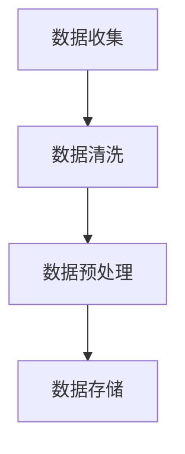

#### 1.6.2 数据分析

在完成数据预处理后，需要对数据进行分析，了解数据的基本特征和分布情况。数据分析的方法包括描述性统计分析、数据可视化、相关性分析等。通过数据分析，可以初步判断数据的质量和可用性，为后续的建模工作提供参考。

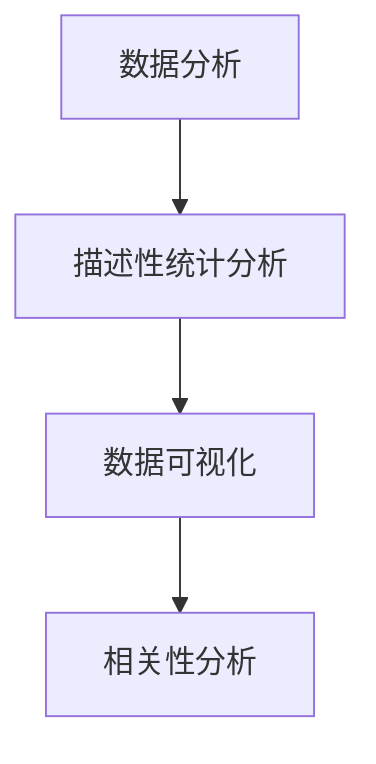

#### 1.6.3 特征工程

特征工程是深度学习模型构建的重要环节。通过特征工程，可以将原始数据转换为能够有效表示问题和提高模型性能的特征。特征工程的方法包括特征提取、特征选择、特征转换等。常用的特征提取方法有词袋模型、TF-IDF等，特征选择方法有信息增益、卡方检验等。

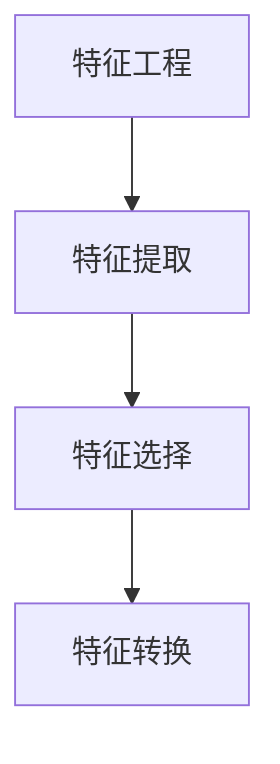

#### 1.6.4 模型选择

在完成特征工程后，需要选择合适的深度学习模型。常用的深度学习模型有神经网络、卷积神经网络（CNN）、循环神经网络（RNN）、生成对抗网络（GAN）等。选择模型时需要考虑模型的复杂度、训练时间、预测性能等因素。

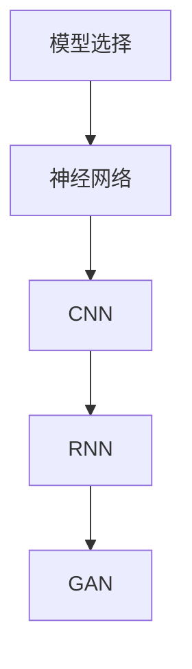

#### 1.6.5 模型训练与优化

选择模型后，需要进行模型训练和优化。模型训练的过程是通过反向传播算法，根据训练数据不断调整模型的参数，使得模型的预测结果与实际结果更加接近。模型优化包括调整学习率、使用正则化技术、增加训练轮次等。

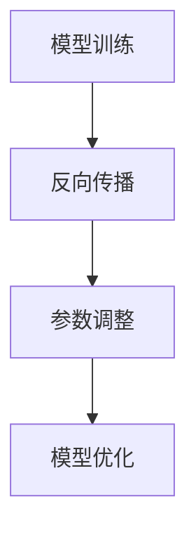

#### 1.6.6 模型评估与部署

在完成模型训练后，需要对模型进行评估，验证模型的预测性能。常用的评估指标有准确率、召回率、F1值等。评估结果满意后，可以将模型部署到实际应用场景中，如电商平台、智能客服系统等。

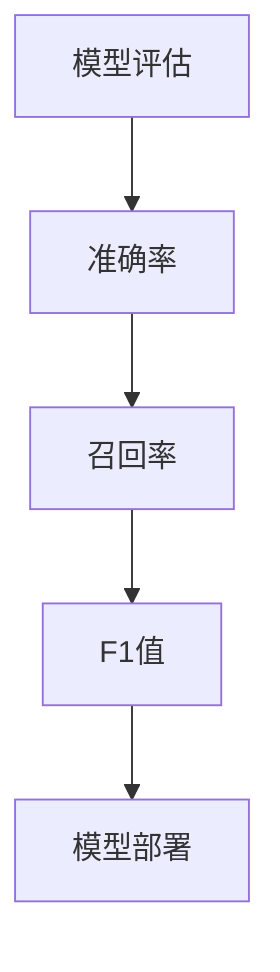

### 1.7 案例分析：构建电商平台的用户行为分析模型

为了更好地理解如何构建深度学习分析模型，我们来看一个实际的案例分析：构建电商平台的用户行为分析模型。

#### 案例背景

某电商平台希望通过对用户行为的数据分析，了解用户偏好，提高用户转化率和销售额。用户行为数据包括用户浏览历史、购买记录、评论内容等。

#### 数据收集与预处理

首先，电商平台需要收集用户行为数据，数据来源包括用户日志、数据库等。收集到的数据需要进行清洗和预处理，去除无效数据和异常值，对数据类型进行统一处理，如将文本数据转换为数值向量。

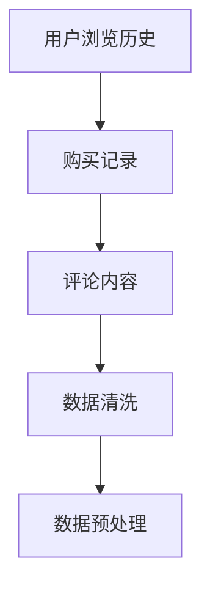

#### 数据分析

对预处理后的数据进行描述性统计分析，了解用户行为的基本特征，如用户平均浏览时长、平均购买频次、用户评论情感倾向等。

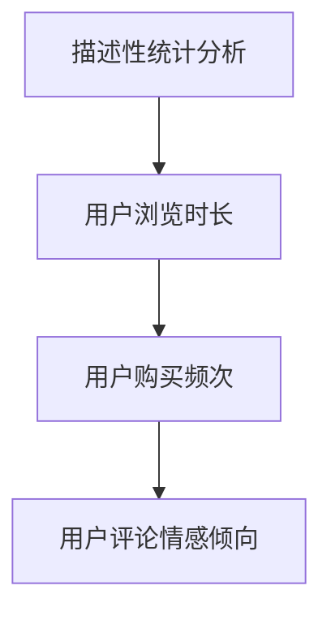

#### 特征工程

根据数据分析结果，提取关键特征，如用户浏览时长、购买频次、评论情感倾向等。对文本数据进行词袋模型或TF-IDF转换，提高特征表达能力。

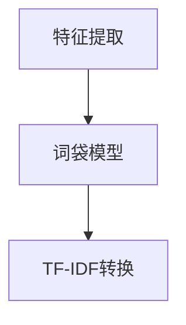

#### 模型选择

选择合适的深度学习模型，如循环神经网络（RNN）或卷积神经网络（CNN），用于用户行为分析。

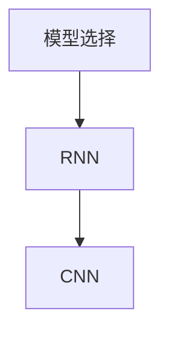

#### 模型训练与优化

使用训练数据对模型进行训练，调整学习率、批量大小等参数，优化模型性能。通过交叉验证等技术，确保模型在测试数据上的表现良好。

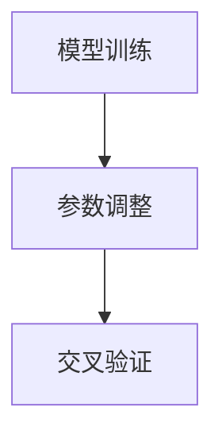

#### 模型评估与部署

对训练好的模型进行评估，使用准确率、召回率等指标衡量模型性能。评估结果满意后，将模型部署到电商平台，实时分析用户行为，提供个性化推荐。

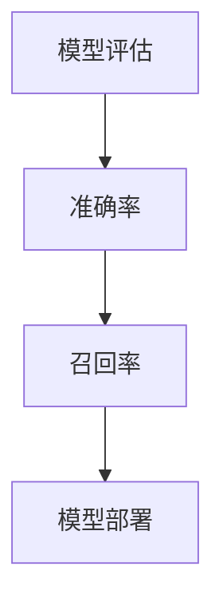

#### 案例总结

通过上述案例分析，我们可以看到构建深度学习分析模型需要经过多个环节，包括数据收集与预处理、数据分析、特征工程、模型选择、模型训练与优化、模型评估与部署等。每个环节都有其关键步骤和注意事项，需要仔细设计和实施。通过深度学习分析模型，电商平台能够更好地了解用户行为，提高用户体验和销售额。

### 1.8 最佳实践与注意事项

在构建深度学习分析模型时，以下是一些最佳实践和注意事项：

- 数据质量至关重要：数据是模型的基石，保证数据质量是构建高质量模型的关键。确保数据的完整性、准确性和一致性，及时处理数据中的异常值和缺失值。
- 特征工程的重要性：特征工程是提高模型性能的关键步骤。选择合适的特征提取方法和特征选择技术，提高特征的表达能力，有助于提升模型的预测性能。
- 模型选择与优化：选择合适的模型和优化策略对模型的性能有重要影响。根据问题的特点和数据规模，选择合适的深度学习模型，并进行参数调整和优化，以提高模型的性能和泛化能力。
- 跨学科合作：深度学习分析模型的构建涉及多个学科领域，如计算机科学、统计学、领域知识等。跨学科合作能够充分发挥各领域专家的优势，提高模型构建的效率和质量。
- 持续迭代与优化：深度学习分析模型不是一成不变的，需要根据实际应用效果和反馈进行持续迭代和优化。定期评估模型性能，调整模型结构和参数，以适应不断变化的应用场景。

通过遵循上述最佳实践和注意事项，可以构建出高质量的深度学习分析模型，为企业带来实际的价值和效益。

### 1.9 拓展阅读

对于希望进一步了解深度学习分析模型构建的读者，以下是一些推荐阅读资料：

- 《深度学习》（Goodfellow, Ian, et al.）是一本经典的深度学习教材，详细介绍了深度学习的理论基础和实用方法。
- 《Hands-On Machine Learning with Scikit-Learn, Keras, and TensorFlow》是一本实用的深度学习指南，涵盖了从数据预处理到模型训练的完整流程。
- 《Practical Deep Learning for Coders》是一本面向初学者的深度学习教材，通过实际案例和代码示例，介绍了深度学习的核心概念和应用。
- 《AI应用实践指南》是一本关于人工智能应用的综合性指南，包括深度学习、机器学习等技术的应用案例和实战技巧。

通过阅读这些资料，读者可以更深入地了解深度学习分析模型的构建方法和应用实践，提升自己的技术水平和实际能力。

### 2.1 深度学习概述

深度学习是机器学习的一个重要分支，它模仿人脑的神经网络结构，通过多层神经网络对数据进行学习，以实现复杂的数据分析和模式识别。深度学习具有以下几个显著特点：

#### 2.1.1 深度学习的定义与特点

深度学习的定义：深度学习是指通过构建具有多个隐藏层的神经网络，对数据进行层次化学习，提取数据中的特征，从而实现复杂任务的机器学习技术。

深度学习的主要特点：

1. **层次化学习**：深度学习通过多个隐藏层对数据进行逐层抽象和表示，能够从原始数据中提取更加抽象和高级的特征。
2. **非线性变换**：深度学习模型利用非线性激活函数，如ReLU、Sigmoid、Tanh等，使得模型能够捕捉数据中的复杂非线性关系。
3. **大规模训练**：深度学习模型通常需要大量的数据来进行训练，通过大规模数据训练，模型能够更好地泛化到未见过的数据。
4. **自适应学习能力**：深度学习模型具有自我学习能力，通过不断调整模型参数，能够自动优化模型性能。

#### 2.1.2 深度学习的发展历程

深度学习的发展历程可以分为以下几个阶段：

1. **早期研究**（1980s-1990s）：神经网络的研究始于20世纪40年代，但早期由于计算资源和数据集的限制，神经网络的应用范围有限。1980年代，反向传播算法的提出为深度学习的发展奠定了基础。
2. **复兴期**（2006-2012）：2006年，Hinton等人提出了深度置信网络（DBN），重新点燃了深度学习的希望。随着计算资源和算法的进步，深度学习开始获得广泛关注和应用。
3. **快速发展期**（2012至今）：2012年，AlexNet在ImageNet大赛中取得突破性成绩，标志着深度学习在图像识别领域的成功。此后，深度学习在各个领域取得了显著进展，如自然语言处理、语音识别、计算机视觉等。

#### 2.1.3 深度学习的基本架构

深度学习的基本架构通常包括以下几个主要组成部分：

1. **输入层**：输入层接收原始数据，如图像、文本、声音等。
2. **隐藏层**：隐藏层是深度学习模型的核心，通过对数据进行非线性变换和特征提取，逐步提高数据表示的复杂度。
3. **输出层**：输出层产生最终预测结果，如分类标签、回归值等。

深度学习模型可以是全连接神经网络（FCNN）、卷积神经网络（CNN）、循环神经网络（RNN）等不同类型的神经网络。其中，卷积神经网络（CNN）在图像处理领域表现出色，循环神经网络（RNN）在序列数据处理中具有优势。

### 2.2 神经网络

神经网络（Neural Network，NN）是深度学习的基础，它由大量简单神经元组成，通过模拟生物神经系统的工作原理，实现对复杂数据的处理和分析。神经网络具有以下几个基本原理：

#### 2.2.1 神经网络的基本原理

1. **神经元模型**：神经网络的基本单元是神经元，每个神经元接收多个输入信号，通过权重和偏置进行加权求和，然后通过激活函数输出一个值。神经元的模型可以表示为：
   $$
   a_j = \sigma(w_j \cdot x_j + b_j)
   $$
   其中，$a_j$是神经元输出的激活值，$w_j$是权重，$x_j$是输入值，$b_j$是偏置，$\sigma$是激活函数。

2. **激活函数**：激活函数用于引入非线性变换，常见的激活函数有Sigmoid、ReLU、Tanh等。激活函数的作用是决定神经元是否“激活”，从而影响网络的输出。

3. **前向传播与反向传播**：神经网络通过前向传播将输入数据传递到输出层，计算每个神经元的输出。然后通过反向传播算法，根据输出误差调整神经元的权重和偏置，从而优化模型性能。

#### 2.2.2 卷积神经网络（CNN）

卷积神经网络（Convolutional Neural Network，CNN）是专门为处理图像数据设计的神经网络，其核心在于卷积层和池化层。

1. **卷积层**：卷积层通过卷积运算提取图像特征。卷积运算使用卷积核（filter）在输入图像上进行滑动，计算每个局部区域的特征响应。卷积层的计算过程可以表示为：
   $$
   \text{output}(i, j) = \sum_{k} f_{ik} \cdot x_{i+k, j+k}
   $$
   其中，$f_{ik}$是卷积核，$x_{i+k, j+k}$是输入图像上的像素值。

2. **池化层**：池化层用于减小特征图的尺寸，降低计算复杂度。常见的池化操作有最大池化和平均池化。

3. **CNN在图像处理中的应用**：CNN在图像分类、目标检测、图像生成等图像处理任务中表现出色。例如，LeNet、AlexNet、VGG、ResNet等是经典的CNN模型。

#### 2.2.3 循环神经网络（RNN）

循环神经网络（Recurrent Neural Network，RNN）适用于处理序列数据，如时间序列、语音、文本等。RNN的核心在于其记忆机制，能够保留先前的状态信息。

1. **RNN的基本原理**：RNN的神经元在时间步上递归地更新状态，每个时间步的输出不仅取决于当前输入，还受到前一时间步状态的影响。RNN的递归关系可以表示为：
   $$
   h_t = \sigma(W_h \cdot [h_{t-1}, x_t] + b_h)
   $$
   其中，$h_t$是时间步$t$的隐藏状态，$W_h$是权重矩阵，$x_t$是当前输入，$b_h$是偏置。

2. **长短时记忆（LSTM）与门控循环单元（GRU）**：为了解决传统RNN在长序列数据上的梯度消失问题，引入了长短时记忆（LSTM）和门控循环单元（GRU）。LSTM和GRU通过门控机制，能够有效地控制信息的流动，保持长远的记忆。

3. **RNN在序列数据处理中的应用**：RNN在自然语言处理、语音识别、时间序列预测等序列数据处理任务中具有广泛应用。例如，RNN、LSTM、GRU等模型在机器翻译、语音识别、情感分析等任务中取得了显著效果。

### 2.3 深度学习优化方法

在深度学习模型训练过程中，优化方法用于调整模型参数，提高模型性能。以下介绍几种常用的深度学习优化方法：

#### 2.3.1 梯度下降法

梯度下降法（Gradient Descent）是最常用的优化方法之一，通过计算损失函数关于模型参数的梯度，逐步调整参数，以降低损失函数的值。

1. **梯度下降法的原理**：梯度下降法的基本原理是沿着损失函数的梯度方向进行参数更新，使模型朝着最小损失的方向前进。梯度更新公式为：
   $$
   \theta = \theta - \alpha \cdot \nabla_\theta J(\theta)
   $$
   其中，$\theta$是模型参数，$\alpha$是学习率，$J(\theta)$是损失函数。

2. **梯度下降法的局限**：梯度下降法存在一些局限，如收敛速度慢、对学习率敏感等。在深度学习模型中，由于模型参数众多，梯度计算复杂度较高，导致梯度下降法训练时间长。

#### 2.3.2 动量法

动量法（Momentum）是一种改进的梯度下降法，通过引入动量项，加速梯度下降的收敛速度。

1. **动量法的原理**：动量法的原理是将前一次的更新速度累积起来，作为当前更新的附加项，从而加速梯度的更新。动量项的更新公式为：
   $$
   v_t = \gamma \cdot v_{t-1} + \alpha \cdot \nabla_\theta J(\theta)
   $$
   其中，$v_t$是动量项，$\gamma$是动量系数。

2. **动量法的优势**：动量法能够加速收敛，减少震荡，提高模型稳定性。

#### 2.3.3 Adam优化器

Adam优化器（Adaptive Moment Estimation）是一种自适应优化方法，结合了动量法和自适应学习率的思想。

1. **Adam优化器的原理**：Adam优化器通过计算一阶矩估计（均值）和二阶矩估计（方差），自适应调整学习率。其更新公式为：
   $$
   m_t = \beta_1 \cdot m_{t-1} + (1 - \beta_1) \cdot \nabla_\theta J(\theta)
   $$
   $$
   v_t = \beta_2 \cdot v_{t-1} + (1 - \beta_2) \cdot (\nabla_\theta J(\theta))^2
   $$
   $$
   \theta_t = \theta_{t-1} - \alpha \cdot \frac{m_t}{\sqrt{v_t} + \epsilon}
   $$
   其中，$m_t$是一阶矩估计，$v_t$是二阶矩估计，$\beta_1$和$\beta_2$是超参数，$\alpha$是学习率，$\epsilon$是正数常数。

2. **Adam优化器的优势**：Adam优化器在处理稀疏数据时表现出色，能够自适应调整学习率，提高收敛速度和模型稳定性。

通过上述优化方法，我们可以有效地调整深度学习模型的参数，提高模型训练效率和性能。在实际应用中，根据具体问题和数据特点，选择合适的优化方法，可以显著提升模型的训练效果。

