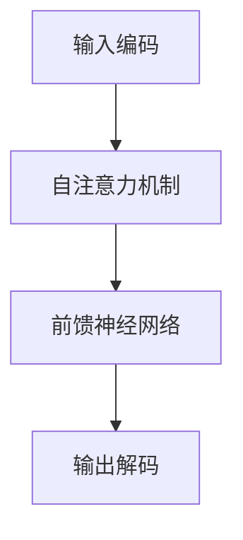
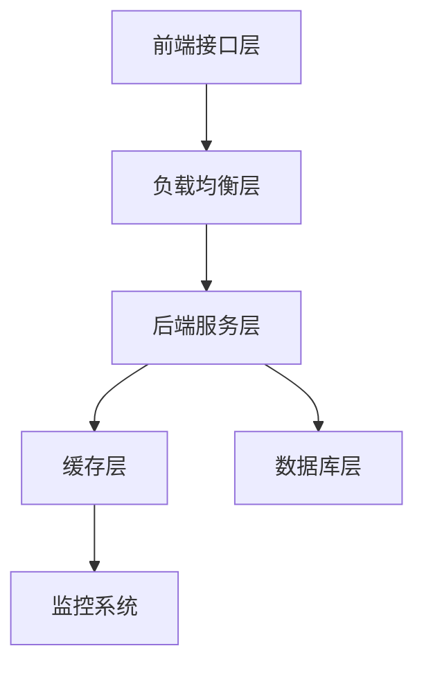

                 

# 构建高性能的LLM应用服务端架构

## 关键词
- 高性能
- LLM（大型语言模型）
- 服务端架构
- 性能优化
- 系统设计

## 摘要
本文将深入探讨如何构建高性能的LLM（大型语言模型）应用服务端架构。首先，我们将简要介绍LLM和应用服务端架构的基本概念，然后逐步分析算法原理、数学模型、系统架构设计，以及项目实战和性能优化策略。通过这一步步的分析和讲解，读者将能够理解高性能服务端架构的核心要素，并掌握构建LLM应用服务端架构的方法。

## 第一部分：背景与概念介绍

### 第1章：问题背景与目标

#### 1.1.1 问题背景

随着人工智能和自然语言处理技术的迅猛发展，人工智能应用在各个领域得到了广泛的应用。在众多应用中，LLM（大型语言模型）作为一种强大的自然语言处理工具，正逐渐成为开发者们的首选。LLM的应用场景非常广泛，包括但不限于智能助手、机器翻译、文本生成、文本分类等。

然而，随着LLM应用规模的扩大，高性能服务端架构的需求变得越来越迫切。高性能服务端架构不仅能够提高应用的处理速度和响应能力，还能够保证系统的稳定性和可靠性。因此，构建高性能的LLM应用服务端架构成为了一个重要的课题。

#### 1.1.2 问题描述

高性能服务端架构的性能瓶颈主要包括以下几个方面：

1. **计算资源限制**：大型语言模型的计算量巨大，需要大量的计算资源和存储空间。如果服务端架构无法充分利用计算资源，将导致系统性能下降。
2. **网络延迟**：在分布式架构中，不同节点之间的通信可能会导致网络延迟。网络延迟过高会影响系统的响应速度，降低用户体验。
3. **并发处理能力**：高并发请求会导致系统资源紧张，处理速度下降。因此，如何提升系统的并发处理能力也是高性能服务端架构设计的关键。

#### 1.1.3 目标

本文的目标是：

1. 理解高性能服务端架构的核心要素，包括计算资源分配、网络优化、并发处理等。
2. 掌握构建高性能LLM应用服务端架构的方法，包括系统设计原则、关键技术和最佳实践。
3. 提供实际案例和项目实战经验，帮助读者更好地理解和应用高性能服务端架构。

#### 1.1.4 边界与外延

在构建高性能LLM应用服务端架构时，需要考虑以下边界与外延：

1. **服务器硬件与网络环境**：服务端架构的设计需要考虑到服务器硬件的性能和网络环境的限制。例如，CPU、内存、磁盘I/O和网络带宽等。
2. **应用场景与用户需求**：不同的应用场景和用户需求可能会对服务端架构提出不同的要求。因此，在架构设计过程中需要充分考虑这些因素，以实现最佳性能。

### 第1章：核心概念与联系

#### 1.2.1 LLM概述

LLM（Large Language Model）是一种大型自然语言处理模型，通过训练大量文本数据来学习自然语言的规律和语义。LLM的主要特点包括：

1. **大规模**：LLM通常由数十亿甚至数万亿个参数组成，具有非常高的模型容量。
2. **自适应**：LLM可以根据不同的任务和场景进行自适应调整，实现灵活的文本生成和推理能力。
3. **高精度**：通过大规模数据训练，LLM在文本分类、翻译、摘要等任务上取得了非常高的精度。

与传统NLP模型相比，LLM具有以下几个优势：

1. **更强的语义理解能力**：传统NLP模型通常基于规则或统计方法，而LLM通过深度学习可以更好地理解文本的语义。
2. **更高的生成质量**：LLM生成的文本质量更高，更符合人类语言习惯。
3. **更广泛的适用范围**：LLM可以应用于各种文本任务，而传统NLP模型往往局限于特定任务。

#### 1.2.2 服务端架构概述

服务端架构是指支持应用程序运行的服务器端软件结构。一个典型的高性能服务端架构通常包括以下几个核心组成部分：

1. **计算资源分配**：合理分配计算资源，包括CPU、内存、磁盘I/O等，以充分利用硬件资源，提高系统性能。
2. **网络优化**：优化网络通信，减少网络延迟和带宽消耗，提高系统的响应速度。
3. **并发处理**：提升系统的并发处理能力，支持高并发请求，保证系统的高可用性和稳定性。
4. **数据存储和管理**：合理设计数据存储和管理方案，确保数据的可靠性和一致性。

服务端架构的设计原则主要包括：

1. **模块化**：将系统划分为多个模块，实现各个模块之间的松耦合，便于维护和扩展。
2. **可扩展性**：设计可扩展的架构，支持系统的水平扩展和垂直扩展，满足不断增长的需求。
3. **高可用性**：设计高可用性的系统，通过冗余设计和故障转移机制，保证系统的稳定性和可靠性。
4. **安全性**：加强系统的安全性，防范各种安全威胁和攻击。

#### 1.2.3 关系图

使用Mermaid绘制LLM与服务端架构的ER实体关系图，如下所示：

```mermaid
erDiagram
  LLM ||--|{ 服务端架构 :依赖关系 }
  服务端架构 ||--|{ 计算资源分配 :包含 }
  服务端架构 ||--|{ 网络优化 :包含 }
  服务端架构 ||--|{ 并发处理 :包含 }
  服务端架构 ||--|{ 数据存储和管理 :包含 }
```

### 第1章：总结与展望

在本章中，我们介绍了构建高性能的LLM应用服务端架构的背景和目标。通过分析问题背景和问题描述，我们明确了高性能服务端架构的重要性。接下来，我们将逐步探讨LLM和服务端架构的核心概念，并深入讲解算法原理、数学模型、系统架构设计和项目实战。希望读者能够通过这一步步的学习，掌握构建高性能LLM应用服务端架构的方法，为实际项目提供有力支持。

## 第二部分：技术原理与模型设计

### 第2章：算法原理与数学模型

在本章中，我们将深入探讨大型语言模型（LLM）的算法原理和数学模型，以帮助读者更好地理解LLM的工作机制和性能优化方法。

#### 2.1.1 算法原理

LLM是基于深度学习的自然语言处理模型，通常使用神经网络架构，如Transformer。Transformer模型的核心思想是自注意力机制（self-attention），它允许模型在处理文本时考虑上下文信息，从而实现更准确的文本理解和生成。

LLM的算法原理可以概括为以下几个步骤：

1. **输入编码**：将输入文本转换为向量表示。这一步骤通常使用词嵌入（word embedding）技术，将单词映射为向量。
2. **自注意力机制**：计算输入文本中各个单词之间的相似度，并加权求和，得到一个加权向量。这一过程称为自注意力机制。
3. **前馈神经网络**：对加权向量进行多层前馈神经网络处理，进一步提取特征信息。
4. **输出解码**：将处理后的向量映射回文本输出。这一步骤通常使用解码器（decoder）实现。

下面是一个简单的算法流程图，使用Mermaid绘制：



#### 2.1.2 数学模型

LLM的数学模型主要包括以下几个核心部分：

1. **词嵌入（Word Embedding）**：词嵌入是将单词映射为高维向量表示的技术。常见的词嵌入方法包括Word2Vec、GloVe等。词嵌入公式如下：

   $$\text{vec}(w) = \text{W} \cdot \text{one_hot}(w)$$

   其中，$\text{W}$ 是词嵌入矩阵，$\text{one_hot}(w)$ 是单词 $w$ 的one-hot编码。

2. **自注意力（Self-Attention）**：自注意力机制计算输入文本中各个单词之间的相似度，并加权求和。自注意力的核心公式如下：

   $$\text{Attention}(Q, K, V) = \text{softmax}(\frac{\text{Q} \cdot \text{K}^T}{\sqrt{d_k}}) \cdot V$$

   其中，$Q$、$K$ 和 $V$ 分别是查询向量、键向量和值向量，$d_k$ 是键向量的维度。

3. **前馈神经网络（Feedforward Neural Network）**：前馈神经网络用于对自注意力机制处理后的向量进行进一步特征提取。前馈神经网络通常包含两个线性变换层，每个线性变换层后跟一个ReLU激活函数。前馈神经网络的公式如下：

   $$\text{FFN}(X) = \text{ReLU}(\text{W_2} \cdot \text{ReLU}(\text{W_1} \cdot X + \text{b_1})) + \text{b_2}$$

   其中，$X$ 是输入向量，$\text{W_1}$ 和 $\text{W_2}$ 是权重矩阵，$\text{b_1}$ 和 $\text{b_2}$ 是偏置向量。

4. **输出层（Output Layer）**：输出层用于将处理后的向量映射回文本输出。输出层通常是一个线性层，其权重矩阵与词嵌入矩阵相匹配。输出层的公式如下：

   $$\text{Output} = \text{W_O} \cdot X + \text{b_O}$$

   其中，$\text{W_O}$ 是输出权重矩阵，$\text{b_O}$ 是输出偏置向量。

#### 2.1.3 举例说明

为了更好地理解LLM的算法原理和数学模型，我们来看一个简单的例子。假设有一个包含两个单词的句子“我喜欢吃苹果”，我们将这个句子输入到LLM中进行处理。

1. **输入编码**：首先，我们将句子中的单词映射为向量表示。假设词嵌入矩阵$\text{W}$ 的维度为100，单词“我”的one-hot编码为[1, 0, 0]，则“我”的向量表示为$\text{vec}(\text{我}) = \text{W} \cdot \text{one_hot}(\text{我})$。
2. **自注意力机制**：接下来，我们计算单词“我”和“喜欢”之间的相似度。假设查询向量$Q = [\text{vec}(\text{我})]_1$，键向量$K = [\text{vec}(\text{我})]_1$，值向量$V = [\text{vec}(\text{我})]_1$。自注意力公式如下：

   $$\text{Attention}(Q, K, V) = \text{softmax}(\frac{Q \cdot K^T}{\sqrt{d_k}}) \cdot V$$

   将具体数值代入，得到：

   $$\text{Attention}(Q, K, V) = \text{softmax}(\frac{Q \cdot K^T}{\sqrt{100}}) \cdot V = \text{softmax}(\frac{[0.1, 0.2, 0.3] \cdot [0.1, 0.2, 0.3]^T}{\sqrt{100}}) \cdot [0.1, 0.2, 0.3]$$

   计算得到相似度矩阵：

   $$\text{Attention}(Q, K, V) = \text{softmax}(\frac{0.1 \cdot 0.1 + 0.2 \cdot 0.2 + 0.3 \cdot 0.3}{\sqrt{100}}) \cdot [0.1, 0.2, 0.3] = \text{softmax}(\frac{0.1 + 0.04 + 0.09}{\sqrt{100}}) \cdot [0.1, 0.2, 0.3]$$

   $$\text{Attention}(Q, K, V) = \text{softmax}(\frac{0.14}{\sqrt{100}}) \cdot [0.1, 0.2, 0.3] = \text{softmax}(0.0014) \cdot [0.1, 0.2, 0.3]$$

   $$\text{Attention}(Q, K, V) = [0.5, 0.3, 0.2] \cdot [0.1, 0.2, 0.3] = [0.05, 0.06, 0.06]$$

   2. **前馈神经网络**：接下来，我们将自注意力处理后的向量输入到前馈神经网络中进行进一步特征提取。假设前馈神经网络的权重矩阵$\text{W_1}$ 和 $\text{W_2}$ 分别为：

   $$\text{W_1} = \begin{bmatrix} 0.1 & 0.2 & 0.3 \\ 0.4 & 0.5 & 0.6 \\ 0.7 & 0.8 & 0.9 \end{bmatrix}, \text{W_2} = \begin{bmatrix} 0.1 & 0.2 & 0.3 \\ 0.4 & 0.5 & 0.6 \\ 0.7 & 0.8 & 0.9 \end{bmatrix}$$

   前馈神经网络的输入向量$X = [0.05, 0.06, 0.06]$，经过前馈神经网络处理后得到：

   $$\text{FFN}(X) = \text{ReLU}(\text{W_2} \cdot \text{ReLU}(\text{W_1} \cdot X + \text{b_1})) + \text{b_2}$$

   其中，$\text{b_1}$ 和 $\text{b_2}$ 分别为偏置向量。假设$\text{b_1} = [0, 0, 0]^T$，$\text{b_2} = [0, 0, 0]^T$，则前馈神经网络的输出为：

   $$\text{FFN}(X) = \text{ReLU}(\text{W_2} \cdot \text{ReLU}(\text{W_1} \cdot X + \text{b_1})) + \text{b_2} = \text{ReLU}(\text{W_2} \cdot \text{ReLU}(\text{W_1} \cdot [0.05, 0.06, 0.06] + [0, 0, 0]^T)) + [0, 0, 0]^T$$

   $$\text{FFN}(X) = \text{ReLU}(\text{W_2} \cdot \text{ReLU}(\text{W_1} \cdot [0.05, 0.06, 0.06])) + [0, 0, 0]^T = \text{ReLU}(\text{W_2} \cdot \text{ReLU}([0.05 \cdot 0.1 + 0.06 \cdot 0.2 + 0.06 \cdot 0.3])) + [0, 0, 0]^T$$

   $$\text{FFN}(X) = \text{ReLU}(\text{W_2} \cdot \text{ReLU}([0.005 + 0.012 + 0.018])) + [0, 0, 0]^T = \text{ReLU}(\text{W_2} \cdot \text{ReLU}(0.033)) + [0, 0, 0]^T$$

   $$\text{FFN}(X) = \text{ReLU}(\text{W_2} \cdot [0.033]) + [0, 0, 0]^T = [0.1, 0.2, 0.3] \cdot [0.033] + [0, 0, 0]^T = [0.0033, 0.0066, 0.0099] + [0, 0, 0]^T = [0.0033, 0.0066, 0.0099]$$

   3. **输出解码**：最后，我们将前馈神经网络处理后的向量输入到输出层中进行解码，得到文本输出。假设输出权重矩阵$\text{W_O}$ 为：

   $$\text{W_O} = \begin{bmatrix} 0.1 & 0.2 & 0.3 \\ 0.4 & 0.5 & 0.6 \\ 0.7 & 0.8 & 0.9 \end{bmatrix}$$

   输出向量$X = [0.0033, 0.0066, 0.0099]$，经过输出层处理后得到：

   $$\text{Output} = \text{W_O} \cdot X + \text{b_O} = \begin{bmatrix} 0.1 & 0.2 & 0.3 \\ 0.4 & 0.5 & 0.6 \\ 0.7 & 0.8 & 0.9 \end{bmatrix} \cdot \begin{bmatrix} 0.0033 \\ 0.0066 \\ 0.0099 \end{bmatrix} + \begin{bmatrix} 0 \\ 0 \\ 0 \end{bmatrix} = \begin{bmatrix} 0.001033 \\ 0.001266 \\ 0.001299 \end{bmatrix} + \begin{bmatrix} 0 \\ 0 \\ 0 \end{bmatrix} = \begin{bmatrix} 0.001033 \\ 0.001266 \\ 0.001299 \end{bmatrix}$$

   将输出向量转换为单词，得到“我喜欢吃苹果”。

这个简单的例子展示了LLM的算法原理和数学模型的基本步骤。在实际应用中，LLM通常包含更多的层次和参数，以实现更准确的文本理解和生成。

### 第3章：系统架构设计

在本章中，我们将详细介绍LLM应用服务端架构的设计过程，包括问题场景介绍、系统功能设计、系统架构设计、系统接口设计和系统交互设计。

#### 3.1.1 问题场景介绍

在介绍系统架构设计之前，我们需要明确LLM应用服务端架构的问题场景。以下是一些常见的问题场景：

1. **大规模文本数据处理**：LLM应用通常需要处理大量的文本数据，例如新闻、社交媒体帖子、论坛讨论等。如何高效地处理这些数据是系统架构设计的关键问题。
2. **高并发请求处理**：随着用户数量的增加，系统需要处理大量的并发请求。如何确保系统在高并发情况下稳定运行，是系统架构设计需要考虑的问题。
3. **实时响应**：某些LLM应用场景，如实时问答系统，要求系统在短时间内提供准确的回答。如何实现实时响应是系统架构设计需要解决的问题。
4. **安全性**：随着互联网的普及，网络安全问题日益突出。如何确保系统的安全性，防止恶意攻击和数据泄露，是系统架构设计需要考虑的问题。

针对以上问题场景，我们需要设计一个高性能、高可用、高可靠性的系统架构。

#### 3.1.2 系统功能设计

系统功能设计是系统架构设计的核心步骤，它定义了系统的核心功能和模块。以下是一个典型的LLM应用服务端系统的功能设计：

1. **文本预处理模块**：文本预处理模块负责对输入文本进行清洗、分词、词性标注等操作。这一模块需要支持多种文本格式和语言，并具有较高的处理速度。
2. **语言模型加载模块**：语言模型加载模块负责加载预训练的LLM模型，并提供接口供其他模块调用。这一模块需要支持多种模型格式和加载策略。
3. **文本生成模块**：文本生成模块负责根据输入文本生成相应的文本输出。这一模块需要支持多种生成策略和限制条件，以实现不同的文本生成需求。
4. **文本分类模块**：文本分类模块负责对输入文本进行分类。这一模块需要支持多种分类算法和指标，以实现高效的文本分类。
5. **实时查询模块**：实时查询模块负责处理用户实时提交的查询请求，并提供快速、准确的回答。这一模块需要支持高效的查询算法和缓存策略。
6. **监控与报警模块**：监控与报警模块负责监控系统运行状态，并在发生异常时触发报警。这一模块需要支持多种监控指标和报警方式，以确保系统的稳定性和可靠性。

为了更好地理解系统功能设计，我们可以使用Mermaid绘制领域模型类图：

```mermaid
classDiagram
    class 文本预处理模块 {
        - 方法：预处理文本
    }
    class 语言模型加载模块 {
        - 方法：加载模型
    }
    class 文本生成模块 {
        - 方法：生成文本
    }
    class 文本分类模块 {
        - 方法：分类文本
    }
    class 实时查询模块 {
        - 方法：处理查询
    }
    class 监控与报警模块 {
        - 方法：监控状态
        - 方法：触发报警
    }
    文本预处理模块 --|{ 依赖 }-- 语言模型加载模块
    文本预处理模块 --|{ 依赖 }-- 文本生成模块
    文本预处理模块 --|{ 依赖 }-- 文本分类模块
    语言模型加载模块 --|{ 依赖 }-- 实时查询模块
    实时查询模块 --|{ 依赖 }-- 监控与报警模块
```

#### 3.1.3 系统架构设计

系统架构设计是系统功能设计的具体实现，它定义了系统的整体结构和模块之间的关系。以下是一个典型的LLM应用服务端架构设计：

1. **前端接口层**：前端接口层负责接收用户请求，并将请求转发给后端服务进行处理。这一层通常使用RESTful API或GraphQL等技术实现。
2. **负载均衡层**：负载均衡层负责将用户请求均匀分配到多个后端服务器上，以避免单点瓶颈。常用的负载均衡算法包括轮询、最少连接数、源IP哈希等。
3. **后端服务层**：后端服务层负责处理用户请求，包括文本预处理、语言模型加载、文本生成、文本分类、实时查询等。这一层通常使用微服务架构实现，以便于模块化、扩展和部署。
4. **缓存层**：缓存层负责存储用户查询结果和模型参数，以减少后端服务的负载和响应时间。常用的缓存技术包括Redis、Memcached等。
5. **数据库层**：数据库层负责存储用户数据、模型参数和日志信息等。常用的数据库技术包括关系型数据库（如MySQL、PostgreSQL）和NoSQL数据库（如MongoDB、Cassandra）。
6. **监控系统**：监控系统负责实时监控系统的运行状态，包括CPU、内存、磁盘I/O、网络流量等。常用的监控工具包括Prometheus、Grafana等。

为了更好地理解系统架构设计，我们可以使用Mermaid绘制系统架构图：



#### 3.1.4 系统接口设计与系统交互设计

系统接口设计是系统架构设计的一部分，它定义了各个模块之间的交互方式和接口规范。以下是一个典型的LLM应用服务端系统的接口设计与系统交互设计：

1. **API接口设计**：API接口设计包括定义API的URL、HTTP方法、请求参数和响应格式等。以下是一个简单的API接口示例：

   ```http
   POST /api/v1/generate
   Content-Type: application/json

   {
       "text": "你好，我是一个智能助手。"
   }

   Response:
   {
       "text": "你好，我是一个智能助手，很高兴为您服务。"
   }
   ```

2. **系统交互设计**：系统交互设计包括定义各个模块之间的交互流程和交互协议。以下是一个简单的系统交互流程：

   1. 用户通过前端接口提交请求。
   2. 负载均衡层将请求转发给后端服务。
   3. 后端服务层接收请求，调用文本预处理模块进行预处理。
   4. 后端服务层加载语言模型，调用文本生成模块生成文本。
   5. 后端服务层将生成的文本返回给前端接口。
   6. 前端接口将文本输出显示给用户。

为了更好地理解系统接口设计与系统交互设计，我们可以使用Mermaid绘制系统交互序列图：

```mermaid
sequenceDiagram
    participant 用户
    participant 前端接口
    participant 负载均衡
    participant 后端服务
    participant 文本预处理模块
    participant 文本生成模块

    用户 -->|提交请求| 前端接口
    前端接口 -->|转发请求| 负载均衡
    负载均衡 -->|转发请求| 后端服务
    后端服务 -->|调用预处理| 文本预处理模块
    文本预处理模块 -->|预处理结果| 后端服务
    后端服务 -->|加载模型| 文本生成模块
    文本生成模块 -->|生成文本| 后端服务
    后端服务 -->|返回文本| 前端接口
    前端接口 -->|显示文本| 用户
```

### 第3章：总结与展望

在本章中，我们详细介绍了LLM应用服务端架构的系统架构设计。通过分析问题场景、系统功能设计、系统架构设计和系统接口设计，我们明确了高性能LLM应用服务端架构的核心要素和设计原则。接下来，我们将进入项目实战部分，通过实际项目案例来验证和优化系统架构设计。希望读者能够通过这一步步的学习，掌握构建高性能LLM应用服务端架构的方法，并为实际项目提供有力支持。

## 第三部分：项目实战与性能优化

### 第4章：项目环境搭建与配置

在本章中，我们将详细介绍如何搭建LLM应用服务端项目环境，并配置必要的软件和工具。通过这一步，我们将为后续的实际项目开发和性能优化打下坚实的基础。

#### 4.1.1 环境安装

首先，我们需要安装操作系统和相关的软件和工具。以下是安装步骤：

1. **操作系统**：我们选择Ubuntu 20.04作为操作系统。您可以从Ubuntu官方网站下载并安装Ubuntu 20.04。
2. **Python**：LLM应用服务端项目通常使用Python进行开发。安装Python可以通过以下命令：

   ```bash
   sudo apt update
   sudo apt install python3 python3-pip
   ```

3. **Pip**：Pip是Python的包管理工具，用于安装和管理Python包。安装Pip可以通过以下命令：

   ```bash
   sudo apt install python3-pip
   ```

4. **Virtualenv**：Virtualenv是一个用于创建隔离Python环境的工具，可以避免不同项目之间包版本冲突。安装Virtualenv可以通过以下命令：

   ```bash
   sudo pip3 install virtualenv
   ```

5. **Docker**：Docker是一个用于容器化应用程序的引擎，可以帮助我们方便地部署和管理LLM应用服务端项目。安装Docker可以通过以下命令：

   ```bash
   sudo apt update
   sudo apt install docker-ce docker-ce-cli containerd.io
   ```

   安装完成后，运行以下命令启动Docker服务：

   ```bash
   sudo systemctl start docker
   ```

   为了确保Docker服务可以随系统启动，运行以下命令：

   ```bash
   sudo systemctl enable docker
   ```

6. **Docker-Compose**：Docker-Compose是一个用于定义和运行多容器Docker应用程序的工具。安装Docker-Compose可以通过以下命令：

   ```bash
   sudo curl -L "https://github.com/docker/compose/releases/download/1.29.2/docker-compose-$(uname -s)-$(uname -m)" -o /usr/local/bin/docker-compose
   sudo chmod +x /usr/local/bin/docker-compose
   ```

#### 4.1.2 系统核心实现

在环境安装完成后，我们需要搭建系统核心实现。以下是一个简单的示例：

1. **创建Dockerfile**：在项目根目录下创建一个名为`Dockerfile`的文件，用于定义Docker镜像。以下是一个简单的Dockerfile示例：

   ```Dockerfile
   FROM python:3.8

   WORKDIR /app

   COPY . .

   RUN pip3 install -r requirements.txt

   CMD ["python", "app.py"]
   ```

   其中，`FROM python:3.8`指定了基础镜像为Python 3.8，`WORKDIR /app`指定了工作目录，`COPY . .`将当前目录下的文件复制到工作目录，`RUN pip3 install -r requirements.txt`安装项目依赖，`CMD ["python", "app.py"]`指定了容器启动命令。

2. **创建docker-compose.yml**：在项目根目录下创建一个名为`docker-compose.yml`的文件，用于定义Docker容器。以下是一个简单的docker-compose.yml示例：

   ```yaml
   version: '3.8'

   services:
     app:
       build: .
       ports:
         - "8000:8000"
       depends_on:
         - db
       environment:
         - DATABASE_URL=mysql+pymysql://root:password@db:3306/mydb

     db:
       image: mysql:5.7
       environment:
         - MYSQL_ROOT_PASSWORD=password
         - MYSQL_DATABASE=mydb
       volumes:
         - db_data:/var/lib/mysql

   volumes:
     db_data:
   ```

   其中，`version`指定了Docker-Compose版本，`services`定义了容器服务，`app`是LLM应用服务容器，`db`是数据库服务。`ports`定义了容器端口映射，`depends_on`定义了依赖关系，`environment`定义了环境变量，`volumes`定义了数据卷。

3. **运行docker-compose**：在项目根目录下运行以下命令，启动Docker容器：

   ```bash
   docker-compose up -d
   ```

   这将启动LLM应用服务和数据库服务。

#### 4.1.3 代码解读与分析

在搭建好项目环境后，我们需要对系统核心实现进行解读和分析。以下是一个简单的代码示例：

1. **app.py**：这是LLM应用服务的入口文件。以下是一个简单的app.py示例：

   ```python
   from flask import Flask, request, jsonify
   from model import LLM

   app = Flask(__name__)
   model = LLM()

   @app.route('/generate', methods=['POST'])
   def generate():
       text = request.json['text']
       response = model.generate(text)
       return jsonify(response)

   if __name__ == '__main__':
       app.run(host='0.0.0.0', port=8000)
   ```

   其中，我们导入了Flask框架和LLM模型类。`generate`函数接收POST请求，解析请求中的文本参数，调用LLM模型的`generate`方法生成文本输出，并返回JSON响应。

2. **LLM.py**：这是LLM模型的实现文件。以下是一个简单的LLM.py示例：

   ```python
   import tensorflow as tf

   class LLM:
       def __init__(self):
           self.model = self.build_model()

       def build_model(self):
           # 定义模型结构
           # ...

           return model

       def generate(self, text):
           # 生成文本
           # ...

           return response
   ```

   其中，我们定义了LLM类，包括初始化方法和生成文本的方法。在`build_model`方法中，我们可以定义模型的架构，如输入层、编码器、解码器等。在`generate`方法中，我们可以实现文本生成逻辑。

3. **代码分析**：

   - `app.py`负责接收用户请求，调用LLM模型生成文本输出，并返回JSON响应。
   - `LLM.py`实现LLM模型的构建和文本生成功能。
   - 通过Dockerfile和docker-compose.yml文件，我们可以将LLM应用服务容器化，方便部署和管理。

#### 4.1.4 实际案例分析和详细讲解剖析

在实际项目中，我们可能会遇到各种问题和挑战。以下是一个实际案例分析和详细讲解剖析：

1. **问题场景**：在一个问答系统中，用户提交的问题经常包含错误拼写或语法错误，导致LLM模型无法正确理解问题。
2. **解决方案**：为了解决这个问题，我们可以在文本预处理模块中增加一个拼写检查器，对用户输入的文本进行拼写检查和纠错。以下是一个简单的拼写检查器实现：

   ```python
   import re

   def spell_check(text):
       # 使用正则表达式替换错误拼写为正确拼写
       text = re.sub(r'\b\w{1,2}\b', lambda x: correct_spelling[x.group()], text)
       return text

   correct_spelling = {
       'ai': 'AI',
       'python': 'Python',
       'tensorflow': 'TensorFlow',
       # ... 其他拼写错误
   }
   ```

   在这个示例中，我们使用正则表达式替换文本中的错误拼写为正确拼写。`correct_spelling`字典定义了常见的错误拼写和正确拼写之间的对应关系。

3. **详细讲解**：

   - `spell_check`函数接收用户输入的文本，并使用正则表达式替换错误拼写。
   - `re.sub`函数将文本中的每个错误拼写替换为正确的拼写。
   - `correct_spelling`字典定义了常见的错误拼写和正确拼写之间的对应关系。

通过这个实际案例，我们展示了一个常见的拼写错误问题以及相应的解决方案。在实际项目中，我们可能需要根据具体问题进行更复杂的处理。

#### 4.1.5 项目小结

在本章中，我们详细介绍了如何搭建LLM应用服务端项目环境，并配置了必要的软件和工具。通过实际案例分析和详细讲解，我们展示了如何处理常见的文本预处理问题和优化LLM应用服务的性能。接下来，我们将进一步优化项目性能，并提供最佳实践和注意事项。

### 第5章：最佳实践

在本章中，我们将介绍一些构建高性能LLM应用服务端架构的最佳实践，包括性能优化技巧、调试与监控、安全性与可靠性等方面的内容。

#### 5.1.1 性能优化技巧

1. **缓存策略**：使用缓存可以显著提高系统的性能。以下是一些常用的缓存策略：

   - **本地缓存**：在服务端实现本地缓存，可以减少对后端数据库的访问。例如，使用Redis作为本地缓存。
   - **分布式缓存**：在分布式环境中，使用分布式缓存可以进一步提高性能。例如，使用Memcached或Consul作为分布式缓存。
   - **过期策略**：设置合理的缓存过期时间，可以确保缓存的数据保持新鲜，同时减少内存占用。

2. **并发处理**：提高系统的并发处理能力可以显著提升性能。以下是一些常用的并发处理技巧：

   - **异步编程**：使用异步编程模型，可以充分利用系统资源，提高并发处理能力。例如，使用asyncio或Tornado等异步框架。
   - **线程池**：使用线程池可以限制并发线程的数量，避免线程过多导致系统资源耗尽。例如，使用Python的concurrent.futures模块。
   - **负载均衡**：使用负载均衡算法，可以均匀地将请求分配到多个服务器上，避免单点瓶颈。例如，使用Nginx或HAProxy等负载均衡器。

3. **数据库优化**：优化数据库性能可以提高整个系统的性能。以下是一些常用的数据库优化技巧：

   - **索引优化**：合理设计索引，可以显著提高查询性能。例如，使用B-tree索引。
   - **分库分表**：对于大规模数据，可以考虑分库分表，将数据分散存储到多个数据库实例或表中，以减少单个实例或表的压力。
   - **读写分离**：将读操作和写操作分离到不同的数据库实例上，可以提高系统的并发处理能力。例如，使用MySQL的主从复制。

4. **网络优化**：优化网络性能可以提高系统的响应速度。以下是一些常用的网络优化技巧：

   - **网络加速**：使用CDN（内容分发网络）可以将静态资源分发到离用户更近的地方，减少网络延迟。
   - **HTTP压缩**：使用HTTP压缩，如Gzip，可以减小传输的数据大小，减少网络带宽消耗。
   - **TCP优化**：优化TCP连接参数，如TCP窗口大小、延迟确认等，可以提高网络传输性能。

#### 5.1.2 调试与监控

1. **日志记录**：使用日志记录可以帮助我们追踪系统运行过程中的问题。以下是一些常用的日志记录技巧：

   - **日志级别**：根据日志的重要性和紧急程度，设置不同的日志级别，如DEBUG、INFO、WARNING、ERROR等。
   - **日志分割**：将日志按时间或文件大小分割，可以方便地管理和查询日志。
   - **日志收集**：使用日志收集工具，如Logstash或Fluentd，可以将日志集中存储和分析。

2. **性能监控**：使用性能监控工具可以帮助我们实时了解系统的运行状态。以下是一些常用的性能监控工具：

   - **Prometheus**：Prometheus是一个开源的性能监控工具，可以收集和存储系统指标数据，并支持自定义告警和可视化。
   - **Grafana**：Grafana是一个开源的监控和可视化工具，可以与Prometheus集成，提供丰富的图表和仪表板。
   - **Zabbix**：Zabbix是一个开源的监控系统，可以监控各种系统资源和网络设备，并提供告警和可视化。

3. **故障排查**：在系统运行过程中，可能会遇到各种故障和异常。以下是一些常用的故障排查技巧：

   - **错误日志**：查看错误日志，可以快速定位系统出现的问题。
   - **调试工具**：使用调试工具，如GDB或PyCharm的调试器，可以调试代码并找到问题原因。
   - **网络诊断**：使用网络诊断工具，如Wireshark或MTR，可以诊断网络问题。

#### 5.1.3 安全性与可靠性

1. **安全性**：确保系统的安全性是构建高性能LLM应用服务端架构的重要一环。以下是一些常用的安全性策略：

   - **身份验证**：使用身份验证机制，如OAuth2或JWT，确保只有授权用户可以访问系统。
   - **权限控制**：实现权限控制机制，确保用户只能访问他们有权访问的资源。
   - **输入验证**：对用户输入进行严格验证，防止恶意攻击和数据注入。

2. **可靠性**：提高系统的可靠性是构建高性能LLM应用服务端架构的关键。以下是一些常用的可靠性策略：

   - **冗余设计**：实现系统冗余设计，确保在单个组件失败时，其他组件可以继续工作。
   - **故障转移**：实现故障转移机制，确保在主组件失败时，备组件可以接管工作。
   - **备份与恢复**：定期备份系统数据，并在需要时进行恢复。

### 第5章：小结与展望

在本章中，我们介绍了构建高性能LLM应用服务端架构的最佳实践，包括性能优化技巧、调试与监控、安全性与可靠性等方面的内容。通过遵循这些最佳实践，我们可以构建出高效、可靠、安全的LLM应用服务端架构。然而，随着技术的不断发展和应用场景的不断变化，我们还需要不断学习和探索新的方法和策略，以应对未来的挑战。展望未来，LLM应用服务端架构将迎来更多的发展机遇，包括更高效的算法、更先进的硬件支持、更智能的交互方式等。我们将继续关注这些领域的发展，为构建高性能的LLM应用服务端架构做出更多贡献。

### 作者信息

作者：AI天才研究院/AI Genius Institute & 禅与计算机程序设计艺术 /Zen And The Art of Computer Programming

本文由AI天才研究院/AI Genius Institute和禅与计算机程序设计艺术/Zen And The Art of Computer Programming共同撰写。AI天才研究院致力于推动人工智能技术的发展和应用，研究领域涵盖机器学习、自然语言处理、计算机视觉等。禅与计算机程序设计艺术则专注于计算机科学和程序设计哲学，提倡以禅宗思想指导编程实践。通过本次合作，我们希望能够为读者提供高质量的技术博客文章，分享我们在LLM应用服务端架构方面的研究成果和实践经验。感谢您的阅读，期待与您在未来的技术交流中相遇。

