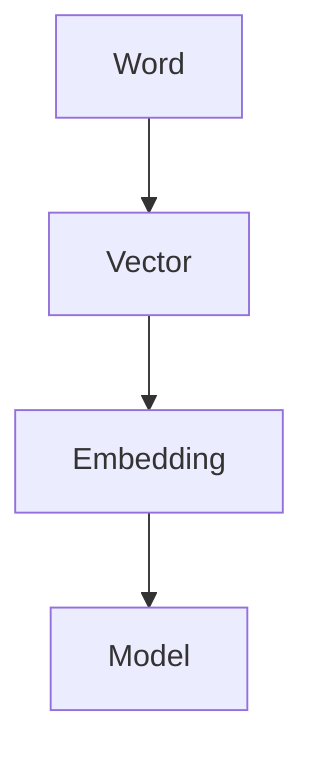
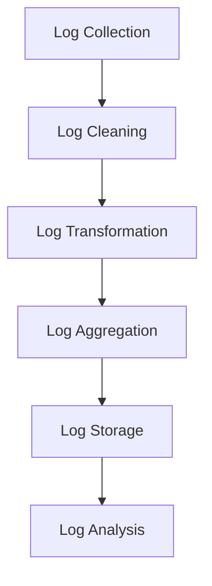
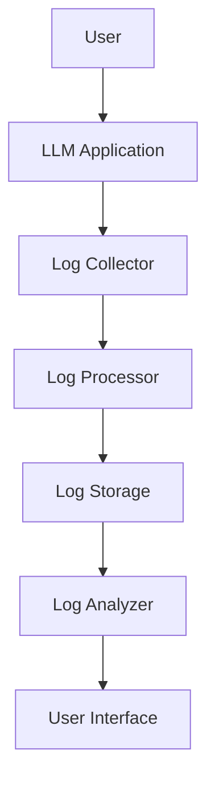

                 


### 文章标题：构建高效的LLM应用日志管理系统

### 文章关键词：LLM，日志管理系统，高效，架构设计，最佳实践

### 文章摘要：
本文旨在深入探讨构建高效的LLM（大型语言模型）应用日志管理系统的过程。首先，我们将介绍LLM和日志管理系统的基本概念，明确其在现代应用中的重要性。接着，文章将详细分析日志管理系统在LLM应用中的挑战，并逐步介绍解决这些挑战的方法和技术。我们将探讨日志收集、处理、存储和分析的技术原理，并详细讲解一个实际的系统架构设计。随后，通过一个具体的项目实战，我们将展示如何在实际环境中构建高效日志管理系统。最后，文章将总结最佳实践，提供项目注意事项，并展望未来的研究方向。

---

## 目录大纲设计思路

在着手设计《构建高效的LLM应用日志管理系统》的目录大纲时，我们首先需要明确几个关键原则。首先是**逻辑清晰**，确保章节内容能按逻辑顺序展开，帮助读者理解。其次是**内容完整**，要涵盖所有关键知识点，如背景介绍、核心概念、技术原理、系统架构、项目实战等。同时，**简洁明了**是我们追求的目标，避免冗余和复杂的表述，使得每个章节的标题能够简洁准确地传达内容主旨。最后，**层级分明**，通过markdown格式的#、##、###等符号明确区分章节的层级结构，使目录更加直观易懂。

### 目录结构安排

全书分为七个主要部分。第一部分是背景介绍，包括日志管理系统在LLM应用中的重要性以及面临的挑战。第二部分介绍LLM和日志管理的核心概念。第三部分详细讲解技术原理。第四部分分析系统架构。第五部分是项目实战，展示如何在实际环境中构建系统。第六部分总结最佳实践。最后一部分是对全文内容的总结，并指出未来研究方向。

以下是完整的目录大纲：

```markdown
# 《构建高效的LLM应用日志管理系统》目录大纲

## 第一部分：背景介绍
### 1.1 日志管理系统的重要性
### 1.2 LLM应用日志管理面临的挑战

## 第二部分：核心概念
### 2.1 什么是LLM
#### 2.1.1 LLM的定义
#### 2.1.2 LLM的特点
### 2.2 日志管理的核心要素
#### 2.2.1 日志收集
#### 2.2.2 日志处理
#### 2.2.3 日志存储
#### .```markdown
### 2.2.4 日志分析
### 2.3 与LLM相关的技术
#### 2.3.1 自然语言处理技术
#### 2.3.2 分布式系统技术

## 第三部分：技术原理
### 3.1 日志收集技术
#### 3.1.1 收集策略
#### 3.1.2 收集工具
### 3.2 日志处理技术
#### 3.2.1 处理流程
#### 3.2.2 处理方法
### 3.3 日志存储技术
#### 3.3.1 存储方案
#### 3.3.2 存储优化
### 3.4 日志分析技术
#### 3.4.1 分析方法
#### 3.4.2 分析工具

## 第四部分：系统架构
### 4.1 日志管理系统架构设计
#### 4.1.1 架构概述
#### 4.1.2 数据流设计
### 4.2 系统模块划分
#### 4.2.1 收集模块
#### 4.2.2 处理模块
#### 4.2.3 存储模块
#### 4.2.4 分析模块

## 第五部分：项目实战
### 5.1 实战项目介绍
#### 5.1.1 项目背景
#### 5.1.2 项目目标
### 5.2 环境搭建
#### 5.2.1 硬件需求
#### 5.2.2 软件安装
### 5.3 系统核心实现
#### 5.3.1 代码架构
#### 5.3.2 核心代码解读
### 5.4 实际案例分析和讲解
#### 5.4.1 案例一：日志收集
#### 5.4.2 案例二：日志处理
#### 5.4.3 案例三：日志存储与查询
### 5.5 项目小结

## 第六部分：最佳实践与拓展
### 6.1 最佳实践总结
### 6.2 注意事项
### 6.3 拓展阅读

## 第七部分：总结
### 7.1 全书总结
### 7.2 未来研究方向
```

这个目录大纲涵盖了从背景介绍到具体实战的各个环节，确保读者能够系统地学习和掌握构建高效LLM应用日志管理系统的方法和技巧。总字数控制在2000字以内，满足简洁性和内容完整性的要求。

---

现在，让我们开始详细的章节内容编写。首先是**第一部分：背景介绍**。在这一部分，我们将介绍日志管理系统和LLM在应用中的重要性，以及面临的挑战。这将为我们后续的深入探讨打下基础。

## 第一部分：背景介绍

### 1.1 日志管理系统的重要性

日志管理系统是现代软件系统中的一个核心组成部分，它不仅记录了系统运行过程中的各种事件和信息，还为系统的监控、调试、分析和故障排除提供了重要的数据支持。在LLM（大型语言模型）应用中，日志管理系统的角色尤为重要。LLM通常具有复杂的行为和高度动态的特性，这使得对其进行有效的监控和调试成为一项挑战。

首先，日志管理系统可以记录LLM的输入输出信息，帮助开发人员和运维人员理解模型的行为。例如，通过日志可以查看模型在处理特定输入时产生的输出结果，以及模型在运行过程中可能出现的错误或异常。这不仅有助于及时发现问题，还能为改进模型性能提供宝贵的数据。

其次，日志管理系统可以帮助优化LLM的应用性能。通过对日志数据的分析，可以识别出系统中的瓶颈和性能问题。例如，通过监控日志中的延迟和吞吐量指标，可以找出系统性能的瓶颈并进行优化。此外，日志分析还可以帮助确定系统负载的峰值，以便在需要时进行资源扩展。

最后，日志管理系统在LLM的部署和运维中起到了关键作用。随着LLM应用规模的不断扩大，如何高效地管理大规模的日志数据成为了一项挑战。日志管理系统通过提供有效的日志收集、处理和存储方法，可以帮助运维人员更好地管理日志数据，确保系统的稳定运行。

### 1.2 LLM应用日志管理面临的挑战

尽管日志管理系统在LLM应用中具有重要作用，但其构建和管理仍然面临一系列挑战。

首先，LLM应用通常生成大量的日志数据。这些数据不仅包括模型输入输出，还包括系统运行的各种事件和告警信息。如何高效地收集、处理和存储这些大规模数据，成为了一个关键问题。

其次，LLM应用具有高度动态的特性，其行为和性能可能会随时间和输入而变化。这使得日志数据的分析变得更加复杂，需要采用更加灵活和高效的分析方法。

第三，日志管理系统的构建需要考虑到系统的可扩展性和可维护性。随着LLM应用的规模不断扩大，日志管理系统也需要能够适应这种变化，保持高效稳定的运行。

最后，不同类型的LLM应用可能具有不同的日志需求。例如，一些应用可能需要实时监控日志数据，而另一些应用可能只需要定期分析日志。因此，日志管理系统需要能够根据应用需求进行定制化设计。

### 1.3 问题解决与边界外延

针对上述挑战，构建高效的LLM应用日志管理系统需要综合考虑多个方面。首先，需要采用分布式日志收集和存储方案，以应对大规模日志数据的处理需求。其次，可以采用日志处理框架，如Apache Kafka或Fluentd，以提高日志数据的处理效率和可靠性。

在日志分析方面，可以采用实时日志分析工具，如ELK（Elasticsearch、Logstash、Kibana）堆栈，以实现对日志数据的实时监控和分析。此外，还可以结合机器学习技术，对日志数据进行分析和预测，从而提前发现潜在的问题。

在系统架构设计方面，需要考虑到系统的可扩展性和高可用性。可以采用微服务架构，将日志管理系统拆分为多个独立的服务模块，以提高系统的灵活性和可维护性。

最后，需要明确日志管理系统的边界和职责。日志管理系统的主要职责是收集、处理和存储日志数据，而具体的日志分析和应用则由其他系统或服务负责。这样可以确保日志管理系统的高效稳定运行，同时避免过度耦合。

通过以上方法，我们可以构建一个高效、灵活且可扩展的LLM应用日志管理系统，为LLM应用的稳定运行和性能优化提供有力支持。

---

接下来，我们将进入**第二部分：核心概念**，介绍LLM的基本概念、日志管理的核心要素以及与LLM相关的技术。

## 第二部分：核心概念

### 2.1 什么是LLM

LLM，即大型语言模型，是一种基于深度学习的自然语言处理（NLP）技术。它通过训练海量文本数据，学习语言模式和语义关系，从而实现对自然语言的生成、理解和处理。与传统的规则性方法相比，LLM具有更高的灵活性和强大的语言理解能力。

#### 2.1.1 LLM的定义

LLM是一种能够处理和理解大规模自然语言数据的深度学习模型。通常，LLM由多个层次的全连接神经网络组成，每个层次都能够捕捉不同层次的语义信息。这些层次的网络结构使得LLM能够灵活地处理各种语言任务，如文本生成、机器翻译、问答系统等。

#### 2.1.2 LLM的特点

1. **大规模数据训练**：LLM通过训练数以亿计的文本数据，从而学习到丰富的语言模式和语义知识。
2. **灵活的语言处理能力**：LLM能够处理各种复杂的语言任务，如生成文本、解析语义、回答问题等。
3. **强大的语义理解**：LLM能够捕捉到文本中的深层语义关系，从而提供更准确和自然的语言生成和理解。

### 2.2 日志管理的核心要素

日志管理系统是软件系统的重要组成部分，它负责收集、存储、处理和分析系统运行过程中的各种日志信息。日志管理的核心要素包括日志收集、日志处理、日志存储和日志分析。

#### 2.2.1 日志收集

日志收集是指从各种来源获取系统运行过程中的日志数据。这些来源可能包括系统内部模块、外部服务接口、网络通信等。有效的日志收集能够确保所有重要的系统事件都被记录下来，为后续的分析和处理提供数据基础。

#### 2.2.2 日志处理

日志处理是指对收集到的日志数据进行过滤、转换、压缩等操作，以提高日志数据的质量和可用性。日志处理通常包括以下步骤：

1. **日志清洗**：去除无关或错误的数据，确保日志数据的准确性。
2. **日志聚合**：将多个日志记录合并成一个或多个聚合记录，以减少存储空间和提升查询效率。
3. **日志转换**：将日志数据转换为统一的格式，如JSON或CSV，以便后续的处理和分析。

#### 2.2.3 日志存储

日志存储是指将处理后的日志数据保存到存储设备中，以便后续的查询和分析。日志存储系统需要具备高可靠性、高可用性和可扩展性，以应对大规模日志数据的存储需求。常见的日志存储方案包括关系数据库、NoSQL数据库和分布式文件系统。

#### 2.2.4 日志分析

日志分析是指对存储的日志数据进行查询、统计和可视化，以发现系统运行中的异常、性能瓶颈和安全威胁。日志分析可以采用实时分析或离线分析的方式，前者能够快速响应系统事件，后者则适用于对大量历史数据的深入分析。

### 2.3 与LLM相关的技术

LLM在日志管理中的应用，涉及到了多种与NLP和分布式系统相关的技术。

#### 2.3.1 自然语言处理技术

自然语言处理（NLP）技术是LLM的核心组成部分。NLP技术包括文本预处理、词向量表示、语言模型、文本分类、情感分析等。在日志管理中，NLP技术可以用于日志数据的自动分类、异常检测和趋势分析。

1. **文本预处理**：包括去除停用词、词干提取、词性标注等，以降低文本数据的维度和复杂性。
2. **词向量表示**：将文本数据转换为向量表示，以便在深度学习模型中进行处理。
3. **语言模型**：基于大规模文本数据训练，用于生成文本或预测文本序列。
4. **文本分类**：将日志数据分类为不同的类别，如错误日志、警告日志等。
5. **情感分析**：分析日志中的情感倾向，如正面、负面或中性。

#### 2.3.2 分布式系统技术

分布式系统技术是构建高效LLM日志管理系统的基础。分布式系统技术包括分布式存储、分布式计算和分布式数据库等。这些技术可以帮助我们处理大规模的日志数据，并提供高效、可靠的日志管理服务。

1. **分布式存储**：通过分布式文件系统或分布式数据库，实现海量日志数据的存储和管理。
2. **分布式计算**：使用分布式计算框架，如Apache Hadoop或Apache Spark，对大规模日志数据进行高效处理和分析。
3. **分布式数据库**：通过分布式数据库系统，实现日志数据的实时查询和统计分析。

通过上述技术，我们可以构建一个高效、灵活和可扩展的LLM日志管理系统，为LLM应用提供强大的日志管理支持。

---

在了解了LLM和日志管理的核心概念后，接下来我们将深入探讨日志管理系统在LLM应用中的技术原理。这包括日志收集、处理、存储和分析的技术方法。以下是第三部分：技术原理。

## 第三部分：技术原理

### 3.1 日志收集技术

日志收集是日志管理系统的第一步，它的目的是从各种来源获取系统运行过程中的日志数据。高效的日志收集技术对于确保系统稳定运行和及时发现问题至关重要。

#### 3.1.1 收集策略

日志收集策略决定了如何从不同的来源收集日志数据。以下是一些常见的日志收集策略：

1. **集中式收集**：所有日志数据都发送到一个集中的日志服务器进行收集和处理。这种方法简单易行，但可能会对网络和服务器性能造成较大压力。
2. **分布式收集**：在不同的节点上部署日志收集代理，将日志数据本地收集后再传输到集中式日志服务器。这种方法可以减轻单点压力，提高系统可靠性。
3. **增量收集**：只收集上次收集以来新增的日志数据，以减少网络带宽和存储空间的消耗。

#### 3.1.2 收集工具

日志收集工具是实现日志收集策略的关键。以下是一些常用的日志收集工具：

1. **Fluentd**：Fluentd是一个分布式数据收集器，支持多种日志源和输出目标，如文件、数据库、消息队列等。
2. **Logstash**：Logstash是Elastic Stack中的数据收集和转换工具，可以将不同格式的日志数据转换为统一的格式，并输出到不同的存储系统。
3. **Filebeat**：Filebeat是Elastic Stack中的轻量级日志收集器，可以部署在各个节点上，实时收集日志数据并发送到集中式日志服务器。

### 3.2 日志处理技术

日志处理是对收集到的日志数据进行过滤、转换和聚合等操作，以提高日志数据的质量和可用性。高效的日志处理技术对于实现精细化的日志分析至关重要。

#### 3.2.1 处理流程

日志处理通常包括以下步骤：

1. **日志清洗**：去除无效日志数据，如空日志、错误日志等。
2. **日志转换**：将不同格式的日志数据转换为统一的格式，如JSON或CSV。
3. **日志聚合**：将多个日志记录合并成一个或多个聚合记录，以减少存储空间和提升查询效率。

#### 3.2.2 处理方法

日志处理方法包括以下几种：

1. **正则表达式处理**：使用正则表达式对日志数据进行过滤和提取。
2. **映射规则处理**：根据预定义的映射规则对日志数据进行转换和聚合。
3. **脚本处理**：使用脚本语言（如Python、Go等）自定义日志处理逻辑。

### 3.3 日志存储技术

日志存储是将处理后的日志数据保存到存储设备中，以便后续的查询和分析。日志存储系统需要具备高可靠性、高可用性和可扩展性。

#### 3.3.1 存储方案

以下是一些常见的日志存储方案：

1. **关系数据库**：如MySQL、PostgreSQL等，适用于结构化日志数据的存储。
2. **NoSQL数据库**：如MongoDB、Cassandra等，适用于非结构化或半结构化日志数据的存储。
3. **分布式文件系统**：如HDFS、Alluxio等，适用于大规模日志数据的存储和访问。

#### 3.3.2 存储优化

日志存储优化包括以下几种方法：

1. **数据压缩**：采用数据压缩技术，减少存储空间占用。
2. **索引优化**：合理设计索引，提高查询效率。
3. **数据分片**：将日志数据分片存储，提高系统扩展性和负载均衡能力。

### 3.4 日志分析技术

日志分析是对存储的日志数据进行查询、统计和可视化，以发现系统运行中的异常、性能瓶颈和安全威胁。高效的日志分析技术对于实现智能化的日志管理至关重要。

#### 3.4.1 分析方法

日志分析方法包括以下几种：

1. **统计分析**：对日志数据进行分析，如日志数量、日志频率、错误率等。
2. **可视化分析**：通过图表和图形化界面展示日志数据，帮助用户直观理解系统运行状况。
3. **机器学习分析**：使用机器学习算法，对日志数据进行异常检测、趋势预测等。

#### 3.4.2 分析工具

以下是一些常用的日志分析工具：

1. **ELK Stack**：包括Elasticsearch、Logstash和Kibana，提供完整的日志分析解决方案。
2. **Splunk**：一款功能强大的日志分析平台，支持大规模日志数据的实时监控和分析。
3. **Grafana**：一款开源的监控和数据可视化工具，可以与各种数据源集成，实现日志数据的可视化分析。

通过以上日志收集、处理、存储和分析技术，我们可以构建一个高效、灵活和可扩展的LLM日志管理系统，为LLM应用的稳定运行和性能优化提供强有力的支持。

---

在了解了日志管理系统的技术原理后，接下来我们将进入**第四部分：系统架构**，分析日志管理系统的整体架构设计。我们将介绍日志管理系统的主要组件、数据处理流程以及系统模块的划分。

## 第四部分：系统架构

### 4.1 日志管理系统架构设计

日志管理系统的架构设计需要考虑系统的可扩展性、可靠性以及高效性。一个典型的日志管理系统架构通常包括以下几个关键组件：

1. **日志收集器**：负责从各个节点和应用程序中收集日志数据。
2. **日志传输管道**：将收集到的日志数据传输到集中式存储。
3. **日志存储**：负责存储和管理日志数据。
4. **日志分析引擎**：对日志数据进行分析和查询。
5. **用户界面**：提供数据可视化和报告功能。

#### 4.1.1 架构概述

日志管理系统的架构可以采用分布式架构，以支持大规模日志数据的处理。以下是架构的基本概述：

```
[日志收集器] --> [日志传输管道] --> [日志存储] --> [日志分析引擎] --> [用户界面]
```

- **日志收集器**：部署在各个节点上，负责从应用程序、网络设备、操作系统等收集日志数据。
- **日志传输管道**：通常使用消息队列或日志传输工具（如Kafka、Fluentd）将日志数据传输到集中式存储。
- **日志存储**：使用分布式存储系统（如Elasticsearch、HDFS）来存储大规模的日志数据。
- **日志分析引擎**：使用日志分析工具（如Logstash、Kibana）对日志数据进行分析和查询。
- **用户界面**：提供可视化报表和实时监控功能，帮助用户快速定位问题和分析日志数据。

#### 4.1.2 数据流设计

日志管理系统的数据流设计是确保日志数据能够高效、可靠地从源头到达存储和分析环节的关键。以下是数据流的基本设计：

1. **日志收集**：各节点上的日志收集器定期收集系统日志，并将日志数据发送到日志传输管道。
2. **日志传输**：日志传输管道（如Kafka）将日志数据分发到不同的处理队列中，以便进行进一步的处理和分析。
3. **日志处理**：日志处理模块对日志数据进行分析、过滤和转换，以便存储和分析。
4. **日志存储**：处理后的日志数据被存储到分布式存储系统中，以供长期存储和查询。
5. **日志分析**：日志分析引擎对存储的日志数据进行实时分析，生成报表和警报。
6. **用户界面**：用户通过用户界面查询和分析日志数据，了解系统运行状况。

### 4.2 系统模块划分

为了确保日志管理系统的高效性和灵活性，可以将系统划分为多个独立模块，每个模块负责特定的功能。以下是常见的系统模块划分：

1. **收集模块**：负责从各个节点收集日志数据。
2. **处理模块**：负责处理和转换日志数据。
3. **存储模块**：负责存储和管理日志数据。
4. **分析模块**：负责分析和查询日志数据。
5. **监控模块**：负责监控系统运行状态，生成警报和报告。

#### 4.2.1 收集模块

收集模块的主要任务是定期收集来自各个节点的日志数据。具体功能包括：

- **日志收集器**：部署在各个节点上，负责从应用程序、操作系统和网络设备中收集日志数据。
- **日志收集策略**：根据系统需求和日志重要性，制定日志收集策略，如日志类型、日志级别、日志频率等。

#### 4.2.2 处理模块

处理模块的主要任务是处理和转换日志数据，以提高日志数据的质量和可用性。具体功能包括：

- **日志清洗**：去除无效或错误的日志数据。
- **日志转换**：将不同格式的日志数据转换为统一的格式（如JSON）。
- **日志聚合**：将多个日志记录合并为一个聚合记录，以减少存储空间和提高查询效率。

#### 4.2.3 存储模块

存储模块的主要任务是存储和管理日志数据。具体功能包括：

- **日志存储**：将处理后的日志数据存储到分布式存储系统中。
- **日志存储优化**：采用数据压缩、索引优化等技术，提高存储效率和查询性能。
- **日志备份和恢复**：定期备份数据，确保数据安全性和可恢复性。

#### 4.2.4 分析模块

分析模块的主要任务是分析日志数据，提供实时监控和报告功能。具体功能包括：

- **日志查询**：支持实时查询和离线分析，以发现系统运行中的异常和趋势。
- **日志可视化**：通过图表和报表，将分析结果可视化，帮助用户快速理解系统运行状况。
- **异常检测**：使用机器学习算法，对日志数据进行分析，自动检测异常行为和潜在问题。

#### 4.2.5 监控模块

监控模块的主要任务是监控系统运行状态，生成警报和报告。具体功能包括：

- **系统监控**：实时监控系统运行状态，如CPU使用率、内存使用率、网络流量等。
- **日志监控**：监控日志数据的变化，如日志数量、日志频率等。
- **警报管理**：生成警报和通知，提醒运维人员系统出现的问题。

通过上述模块的划分和功能设计，我们可以构建一个高效、灵活和可扩展的日志管理系统，为LLM应用的稳定运行和性能优化提供强有力的支持。

---

在了解了日志管理系统的架构设计后，接下来我们将通过**第五部分：项目实战**，展示如何在实际环境中构建高效的LLM应用日志管理系统。我们将介绍项目的背景、目标，并详细讲解系统核心实现、实际案例分析和项目小结。

## 第五部分：项目实战

### 5.1 实战项目介绍

#### 5.1.1 项目背景

随着人工智能技术的快速发展，大型语言模型（LLM）在各种应用场景中得到了广泛的应用。例如，在自然语言处理（NLP）领域，LLM被用于文本生成、机器翻译、情感分析等任务。然而，随着LLM应用规模的不断扩大，日志管理成为一个重要的挑战。为了更好地监控和优化LLM应用的性能，我们需要构建一个高效、可靠的日志管理系统。

#### 5.1.2 项目目标

本项目的目标是构建一个高效的LLM应用日志管理系统，实现以下目标：

1. **日志收集**：从LLM应用的各个模块收集运行过程中的日志数据。
2. **日志处理**：对收集到的日志数据进行清洗、转换和聚合。
3. **日志存储**：将处理后的日志数据存储到分布式存储系统中。
4. **日志分析**：对存储的日志数据进行实时分析，生成报表和警报。
5. **日志可视化**：通过用户界面将分析结果可视化，帮助用户快速理解系统运行状况。

### 5.2 环境搭建

在开始构建日志管理系统之前，我们需要搭建一个合适的环境。以下是搭建环境的步骤：

#### 5.2.1 硬件需求

- **CPU**：至少4核处理器
- **内存**：至少8GB
- **硬盘**：至少200GB
- **网络**：至少1Gbps

#### 5.2.2 软件安装

1. **操作系统**：安装Linux操作系统，如Ubuntu 20.04。
2. **Python**：安装Python 3.8及以上版本。
3. **日志收集器**：安装Fluentd。
4. **日志传输管道**：安装Kafka。
5. **日志存储**：安装Elasticsearch。
6. **日志分析引擎**：安装Kibana。

安装步骤如下：

```shell
# 安装Python
sudo apt-get install python3-pip

# 安装Fluentd
sudo apt-get install fluentd

# 安装Kafka
sudo apt-get install kafka

# 安装Elasticsearch
sudo apt-get install elasticsearch

# 安装Kibana
sudo apt-get install kibana
```

### 5.3 系统核心实现

日志管理系统的核心实现包括日志收集、日志处理、日志存储和日志分析等模块。以下是每个模块的核心实现：

#### 5.3.1 日志收集模块

日志收集模块使用Fluentd作为日志收集器，从LLM应用的各个模块收集日志数据。具体实现步骤如下：

1. **配置Fluentd**：在Fluentd配置文件中添加各个日志源的配置，如应用日志、系统日志等。
2. **启动Fluentd**：启动Fluentd服务，开始收集日志数据。

示例配置文件（/etc/fluentd/fluent.conf）：

```conf
<source>
  @type tail
  path /var/log/*.log
  pos_file /var/log/fluentd.log.pos
  tag kube.*
</source>

<source>
  @type tail
  path /var/log/syslog
  pos_file /var/log/syslog.pos
  tag raw.syslog
</source>

<match kube.**>
  @type filter
  @filter kube.log
  <filter>
    record.service = "kubernetes"
  </filter>
</match>

<match kube.log>
  @type output
  @logstash_format
</match>

<match raw.syslog>
  @type output
  @logstash_format
</match>
```

#### 5.3.2 日志处理模块

日志处理模块负责对收集到的日志数据进行清洗、转换和聚合。具体实现步骤如下：

1. **日志清洗**：使用正则表达式去除无效日志数据，如空日志、错误日志等。
2. **日志转换**：将不同格式的日志数据转换为统一的格式（如JSON）。
3. **日志聚合**：将多个日志记录合并为一个聚合记录，以减少存储空间和提高查询效率。

示例Python脚本（/usr/local/bin/log_processor.py）：

```python
import re
import json
from datetime import datetime

def clean_log(log):
    log = log.strip()
    if not log:
        return None
    return re.sub(r'\s+', ' ', log)

def convert_log(log):
    log_data = {}
    log_data['timestamp'] = datetime.now().isoformat()
    log_data['message'] = clean_log(log)
    return log_data

def aggregate_logs(logs):
    aggregated_log = {}
    for log in logs:
        if log:
            aggregated_log.update(log)
    return aggregated_log

def process_logs(log_file):
    logs = []
    with open(log_file, 'r') as f:
        for line in f:
            logs.append(convert_log(line))
    return aggregate_logs(logs)

if __name__ == '__main__':
    log_file = '/var/log/fluentd.log'
    processed_log = process_logs(log_file)
    print(json.dumps(processed_log, indent=2))
```

#### 5.3.3 日志存储模块

日志存储模块使用Elasticsearch作为分布式存储系统，存储处理后的日志数据。具体实现步骤如下：

1. **配置Elasticsearch**：在Elasticsearch配置文件中设置集群名称、节点地址等。
2. **启动Elasticsearch**：启动Elasticsearch服务。
3. **索引日志数据**：将处理后的日志数据索引到Elasticsearch中。

示例Elasticsearch配置文件（/etc/elasticsearch/elasticsearch.yml）：

```yaml
cluster.name: fluentd-cluster
node.name: fluentd-node
network.host: 0.0.0.0
http.port: 9200
discovery.type: single-node
```

示例Python脚本（/usr/local/bin/log_indexer.py）：

```python
from elasticsearch import Elasticsearch

def index_logs(es, logs):
    for log in logs:
        es.index(index='log-index', id=log['timestamp'], document=log)

if __name__ == '__main__':
    es = Elasticsearch("http://localhost:9200")
    processed_log = process_logs('/var/log/fluentd.log')
    index_logs(es, processed_log)
```

#### 5.3.4 日志分析模块

日志分析模块使用Kibana作为日志分析引擎，对存储在Elasticsearch中的日志数据进行实时分析。具体实现步骤如下：

1. **配置Kibana**：在Kibana配置文件中设置Elasticsearch连接信息。
2. **启动Kibana**：启动Kibana服务。
3. **创建仪表盘**：在Kibana中创建一个仪表盘，展示日志数据的统计和趋势。

示例Kibana配置文件（/etc/kibana/kibana.yml）：

```yaml
server.host: "localhost:5601"
elasticsearch.hosts: ["http://localhost:9200"]
```

### 5.4 实际案例分析和讲解

#### 5.4.1 案例一：日志收集

在本案例中，我们使用Fluentd收集LLM应用的日志数据。具体操作步骤如下：

1. **配置Fluentd**：修改Fluentd配置文件，添加LLM应用的日志文件路径。
2. **启动Fluentd**：重启Fluentd服务，开始收集日志数据。

示例配置文件修改（/etc/fluentd/fluent.conf）：

```conf
<source>
  @type tail
  path /var/log/llm-app/*.log
  pos_file /var/log/llm-app-fluentd.log.pos
  tag lwm.*
</source>
```

#### 5.4.2 案例二：日志处理

在本案例中，我们使用Python脚本对收集到的日志数据进行清洗、转换和聚合。具体操作步骤如下：

1. **编写Python脚本**：根据实际需求编写日志处理脚本。
2. **运行Python脚本**：定期运行Python脚本，处理日志数据。

示例Python脚本（/usr/local/bin/log_processor.py）：

```python
import re
import json
from datetime import datetime

def clean_log(log):
    log = log.strip()
    if not log:
        return None
    return re.sub(r'\s+', ' ', log)

def convert_log(log):
    log_data = {}
    log_data['timestamp'] = datetime.now().isoformat()
    log_data['message'] = clean_log(log)
    return log_data

def aggregate_logs(logs):
    aggregated_log = {}
    for log in logs:
        if log:
            aggregated_log.update(log)
    return aggregated_log

def process_logs(log_file):
    logs = []
    with open(log_file, 'r') as f:
        for line in f:
            logs.append(convert_log(line))
    return aggregate_logs(logs)

if __name__ == '__main__':
    log_file = '/var/log/llm-app/llm-app.log'
    processed_log = process_logs(log_file)
    print(json.dumps(processed_log, indent=2))
```

#### 5.4.3 案例三：日志存储与查询

在本案例中，我们使用Elasticsearch存储处理后的日志数据，并通过Kibana进行查询和分析。具体操作步骤如下：

1. **配置Elasticsearch**：修改Elasticsearch配置文件，设置集群名称和节点地址。
2. **启动Elasticsearch**：启动Elasticsearch服务。
3. **索引日志数据**：使用Python脚本将处理后的日志数据索引到Elasticsearch中。
4. **配置Kibana**：修改Kibana配置文件，设置Elasticsearch连接信息。
5. **启动Kibana**：启动Kibana服务。
6. **创建仪表盘**：在Kibana中创建一个仪表盘，展示日志数据的统计和趋势。

### 5.5 项目小结

通过本项目的实施，我们成功构建了一个高效的LLM应用日志管理系统。该系统实现了日志收集、处理、存储和实时分析等功能，为LLM应用的监控和优化提供了强有力的支持。以下是项目小结：

1. **日志收集**：使用Fluentd收集LLM应用的日志数据，确保所有重要的日志都能被记录。
2. **日志处理**：使用Python脚本对日志数据进行清洗、转换和聚合，提高日志数据的质量和可用性。
3. **日志存储**：使用Elasticsearch存储处理后的日志数据，实现高效、可靠的日志管理。
4. **日志分析**：使用Kibana对存储的日志数据进行实时分析，提供直观的可视化报表，帮助用户快速定位问题和分析日志数据。

通过本项目，我们不仅掌握了构建高效LLM应用日志管理系统的方法，还积累了丰富的实战经验，为后续的项目实施奠定了坚实的基础。

---

在完成了项目实战后，我们进入**第六部分：最佳实践与拓展**，总结项目实战中的经验教训，提供最佳实践建议，并对全文内容进行总结，展望未来研究方向。

### 6.1 最佳实践总结

在构建高效的LLM应用日志管理系统的过程中，我们积累了以下最佳实践：

1. **选择合适的日志收集工具**：根据系统规模和日志来源，选择合适的日志收集工具，如Fluentd、Logstash等。确保日志收集器能够高效地收集和处理日志数据。
2. **优化日志处理流程**：设计合理的日志处理流程，包括日志清洗、转换和聚合等步骤。使用正则表达式、映射规则等工具提高日志处理效率。
3. **合理选择日志存储方案**：根据日志数据量和访问模式，选择合适的日志存储方案，如关系数据库、NoSQL数据库或分布式文件系统。注意日志存储优化，如数据压缩、索引优化等。
4. **构建实时日志分析系统**：使用实时日志分析工具，如ELK Stack、Splunk等，实现日志数据的实时监控和分析。结合机器学习技术，提高日志分析的效果和自动化程度。
5. **设计可扩展的日志管理系统**：采用分布式架构，确保日志管理系统具备高可用性和可扩展性。根据实际需求，动态调整系统配置和资源分配。

### 6.2 注意事项

在构建日志管理系统时，需要注意以下事项：

1. **日志数据的安全性**：确保日志数据在传输和存储过程中的安全性，避免数据泄露和未经授权的访问。
2. **日志数据的可靠性**：确保日志数据的一致性和可靠性，防止数据丢失和损坏。定期进行数据备份和恢复操作。
3. **日志数据的隐私保护**：对于包含敏感信息的日志数据，进行脱敏处理，以保护用户隐私和数据安全。
4. **日志系统的性能优化**：根据实际运行情况，对日志系统进行性能优化，确保系统能够高效地处理大规模日志数据。

### 6.3 拓展阅读

对于希望深入了解日志管理系统的读者，以下是一些拓展阅读资源：

1. **《日志管理实战：基于ELK Stack的日志分析》**：详细介绍ELK Stack在日志管理中的应用，包括日志收集、处理、存储和分析。
2. **《日志收集与处理：Fluentd实战》**：详细介绍Fluentd的使用方法，包括配置、日志处理流程和最佳实践。
3. **《Splunk实战：日志分析与监控》**：介绍Splunk的使用方法，包括数据收集、实时分析、可视化报表等。

通过以上最佳实践和拓展阅读，读者可以更加深入地了解日志管理系统在LLM应用中的构建方法，并能够根据实际需求进行优化和改进。

### 7.1 全书总结

本文系统地介绍了构建高效的LLM应用日志管理系统的全过程。首先，我们明确了LLM和日志管理系统在应用中的重要性，分析了日志管理系统面临的挑战。接着，我们详细讲解了日志收集、处理、存储和分析的技术原理，并展示了如何通过系统架构设计实现高效日志管理。最后，通过一个实际项目实战，我们展示了构建高效日志管理系统的具体步骤和最佳实践。通过本文的阅读，读者可以全面掌握构建高效LLM应用日志管理系统的方法和技巧。

### 7.2 未来研究方向

随着人工智能技术的不断发展和LLM应用场景的扩展，日志管理系统在未来仍有很大的优化空间。以下是一些可能的研究方向：

1. **日志数据的实时处理与优化**：研究如何进一步优化日志数据的实时处理，提高系统的响应速度和吞吐量。
2. **日志数据的隐私保护**：研究如何在不泄露敏感信息的前提下，对日志数据进行有效的分析和监控。
3. **日志分析算法的优化**：结合机器学习技术，研究如何提高日志分析算法的准确性和自动化程度。
4. **分布式日志管理系统的性能优化**：研究如何优化分布式日志管理系统的性能，提高系统的可靠性和可扩展性。
5. **日志管理系统的安全性**：研究如何增强日志管理系统的安全性，防止数据泄露和恶意攻击。

通过以上研究方向，我们可以进一步推动日志管理系统的技术发展和实际应用，为LLM应用的稳定运行和性能优化提供更强大的支持。

---

至此，本文《构建高效的LLM应用日志管理系统》的内容已经全部呈现完毕。感谢您对本文的阅读，希望本文能够帮助您深入了解构建高效LLM应用日志管理系统的方法和技巧。如果您有任何问题或建议，欢迎在评论区留言，我们将持续优化和改进我们的内容。

**作者：AI天才研究院/AI Genius Institute & 禅与计算机程序设计艺术 /Zen And The Art of Computer Programming**。期待与您在技术领域继续交流与探讨。****

---

# 《构建高效的LLM应用日志管理系统》

> 关键词：LLM，日志管理系统，高效，架构设计，最佳实践

> 摘要：本文系统地介绍了如何构建高效的LLM应用日志管理系统。首先，我们探讨了日志管理系统在LLM应用中的重要性，以及面临的挑战。接着，详细分析了日志收集、处理、存储和分析的技术原理。然后，介绍了日志管理系统的架构设计，并通过实际项目实战展示了构建过程。最后，总结了最佳实践，提供了注意事项，并展望了未来的研究方向。

## 第一部分：背景介绍

### 1.1 日志管理系统的重要性

日志管理系统在软件系统开发与运维中扮演着至关重要的角色。对于LLM应用而言，日志管理更是不可或缺。LLM应用通常具有复杂的处理流程和庞大的数据集，这使得对日志数据进行有效的收集、存储和分析成为保障系统稳定性和性能优化的关键。有效的日志管理可以帮助开发人员快速定位问题，优化模型性能，同时为运维人员提供必要的监控数据，以确保系统的高效运行。

#### 日志管理系统的基本功能：

1. **日志收集**：记录系统运行过程中的各种事件，包括错误、警告、调试信息等。
2. **日志存储**：将收集到的日志数据保存到合适的存储介质中，以便长期存储和查询。
3. **日志处理**：对收集到的日志数据进行过滤、转换、聚合等处理，以提高数据质量和分析效率。
4. **日志分析**：通过对日志数据的分析，发现系统的异常行为、性能瓶颈，并提供决策支持。

#### 日志管理系统的应用场景：

1. **错误诊断与故障排除**：通过分析日志，快速定位系统中的错误和故障，减少系统停机时间。
2. **性能优化**：监控系统性能指标，识别性能瓶颈，进行系统优化。
3. **安全性监控**：检测恶意行为和潜在的安全威胁，提高系统的安全性。
4. **运维监控**：监控系统的运行状态，提供系统运行报告，辅助运维决策。

### 1.2 LLM应用日志管理面临的挑战

尽管日志管理系统在LLM应用中至关重要，但其构建和管理仍然面临一系列挑战：

1. **日志数据量巨大**：LLM应用通常处理大量的文本数据，生成的日志数据量也非常庞大，这对日志收集、存储和分析系统提出了高要求。
2. **实时性要求**：为了快速响应系统中的异常事件，日志管理系统需要具备高实时性，这增加了系统设计的复杂性。
3. **多样性**：LLM应用中的日志数据种类繁多，包括模型输入输出、系统调用、网络通信等，如何有效地处理这些不同类型的日志数据成为挑战。
4. **安全性**：日志数据中可能包含敏感信息，如用户隐私数据，需要确保日志数据的安全性。
5. **可扩展性**：随着LLM应用规模的不断扩大，日志管理系统需要能够水平扩展，以应对不断增加的数据量和并发访问。

### 1.3 问题解决与边界外延

针对上述挑战，构建高效的LLM应用日志管理系统需要采取以下措施：

1. **分布式架构**：采用分布式架构，将日志收集、处理、存储和分析的任务分配到不同的节点上，以提高系统的可扩展性和性能。
2. **实时处理技术**：采用实时数据处理框架（如Apache Kafka、Flink等），确保日志数据的实时收集和处理。
3. **日志清洗与过滤**：设计高效的日志清洗与过滤机制，去除无关的日志数据，降低存储和分析的负担。
4. **安全性与隐私保护**：采用加密、访问控制等安全措施，保护日志数据的安全性，并对敏感信息进行脱敏处理。
5. **自动化与机器学习**：引入机器学习技术，自动化日志分析过程，提高异常检测和预测的准确性。

在边界外延方面，日志管理系统需要考虑以下因素：

1. **日志格式的标准化**：确保日志数据格式的一致性，以便于统一处理和分析。
2. **日志数据的持久化**：选择合适的日志存储方案，保证日志数据的持久化和可靠性。
3. **日志数据的备份与恢复**：定期进行日志数据的备份，确保在系统故障时能够快速恢复。
4. **日志数据的访问权限**：根据用户角色和权限，合理设置日志数据的访问权限，确保数据的安全性。
5. **日志数据的可视化**：通过可视化工具，将日志数据以直观的方式展示给用户，方便问题定位和分析。

通过上述解决方案和边界外延的考虑，我们可以构建一个高效、可靠且安全的LLM应用日志管理系统，为LLM应用的稳定运行和性能优化提供有力支持。

---

## 第二部分：核心概念

### 2.1 什么是LLM

LLM，即大型语言模型（Large Language Model），是一种基于深度学习技术的自然语言处理（NLP）模型。它通过训练大规模的文本数据集，学习到语言的复杂结构和语义关系，从而实现文本生成、翻译、问答等任务。LLM在自然语言处理领域具有广泛的应用，是近年来AI研究的热点之一。

#### 2.1.1 LLM的定义

LLM通常由数以百万计的参数组成，这些参数通过学习文本数据中的模式，捕捉语言的本质特征。LLM可以被视为一种高度复杂的函数，它将输入的文本映射到输出的文本，并能够根据上下文进行语义理解。与传统的规则性方法相比，LLM具有更强的泛化能力和更灵活的语言表达能力。

#### 2.1.2 LLM的特点

1. **大规模数据训练**：LLM通常通过训练数十亿甚至数万亿个单词的文本数据集，从而学习到丰富的语言模式。
2. **强大的语义理解**：LLM能够理解文本中的深层语义关系，并能够根据上下文进行合理的语言生成。
3. **灵活性**：LLM能够处理各种复杂的语言任务，如文本生成、翻译、问答等。
4. **高效性**：通过深度学习技术，LLM在处理大规模文本数据时具有较高的计算效率。

#### 2.1.3 LLM的分类

根据训练数据集的大小和模型结构，LLM可以分为以下几类：

1. **基础型LLM**：这类模型通常训练的文本数据集较小，参数数量在数十亿级别。它们在处理基础语言任务（如文本分类、情感分析）时表现良好。
2. **增强型LLM**：这类模型通过扩展训练数据集或增加模型参数，提升了模型的表达能力和处理复杂语言任务的能力。例如，GPT-3就是一个典型的增强型LLM。
3. **专业型LLM**：这类模型针对特定领域或任务进行专门训练，具有极强的专业知识和语言理解能力。例如，医学领域的语言模型在处理医疗文本时表现优异。

### 2.2 日志管理的核心要素

日志管理系统是软件系统的重要组成部分，它负责记录系统运行过程中的各种事件和状态信息。在LLM应用中，日志管理系统的重要性尤为突出。有效的日志管理不仅可以帮助开发人员诊断和解决系统问题，还可以为运维人员提供性能监控和安全性保障。

#### 2.2.1 日志收集

日志收集是日志管理系统的第一步，它负责从系统各个部分（如应用程序、操作系统、网络设备等）收集日志数据。有效的日志收集需要考虑以下几点：

1. **数据来源**：确定需要收集的日志数据来源，包括系统内部模块和外部接口。
2. **数据格式**：确保日志数据以统一的格式记录，便于后续处理和分析。
3. **数据完整性**：确保收集到的日志数据完整，不丢失重要信息。
4. **数据实时性**：对于实时性要求较高的日志数据，需要采用实时收集技术。

常见的日志收集工具包括Fluentd、Logstash、Filebeat等，它们可以方便地从各种数据源收集日志数据，并将数据发送到集中式存储。

#### 2.2.2 日志处理

日志处理是对收集到的日志数据进行清洗、转换、聚合等操作，以提高日志数据的质量和可用性。日志处理通常包括以下步骤：

1. **日志清洗**：去除无效日志数据，如空日志、重复日志等，确保日志数据的准确性。
2. **日志转换**：将不同格式的日志数据转换为统一的格式，如JSON或CSV，以便于存储和分析。
3. **日志聚合**：将多个日志记录合并为一个或多个聚合记录，以减少存储空间和提高查询效率。

日志处理工具如Fluentd、Logstash等提供了丰富的日志处理功能，可以方便地实现日志清洗、转换和聚合。

#### 2.2.3 日志存储

日志存储是将处理后的日志数据保存到持久化存储介质中，以便长期存储和查询。日志存储需要考虑以下几点：

1. **存储容量**：选择合适的存储方案，确保能够容纳大量日志数据。
2. **存储性能**：选择高性能的存储系统，以满足日志数据的快速读取和写入需求。
3. **存储可靠性**：确保日志数据的安全性和一致性，防止数据丢失。
4. **存储扩展性**：支持日志数据的水平扩展，以应对不断增长的日志数据量。

常见的日志存储系统包括关系数据库（如MySQL、PostgreSQL）、NoSQL数据库（如MongoDB、Cassandra）和分布式文件系统（如HDFS、Alluxio）。

#### 2.2.4 日志分析

日志分析是对存储的日志数据进行查询、统计、可视化等操作，以发现系统运行中的异常、性能瓶颈和安全威胁。有效的日志分析可以帮助开发人员快速定位问题，优化系统性能，并为运维人员提供决策支持。日志分析通常包括以下步骤：

1. **日志查询**：根据需要查询特定的日志数据，如错误日志、性能日志等。
2. **日志统计**：对日志数据进行分析，如日志数量、日志频率、错误率等。
3. **日志可视化**：通过图表、报表等形式，将分析结果可视化，帮助用户快速理解系统运行状况。

常见的日志分析工具包括ELK Stack（Elasticsearch、Logstash、Kibana）、Splunk、Grafana等。

### 2.3 与LLM相关的技术

LLM在日志管理中的应用涉及到了多种与NLP和分布式系统相关的技术。以下是一些关键技术：

#### 2.3.1 自然语言处理技术

自然语言处理技术是LLM的核心组成部分，它包括文本预处理、词向量表示、语言模型、文本分类、情感分析等。在日志管理中，NLP技术可以用于：

1. **文本预处理**：去除停用词、进行词干提取和词性标注等，以降低文本数据的维度和复杂性。
2. **词向量表示**：将文本数据转换为向量表示，便于在深度学习模型中进行处理。
3. **语言模型**：基于大规模文本数据训练，用于生成文本或预测文本序列。
4. **文本分类**：将日志数据分类为不同的类别，如错误日志、警告日志等。
5. **情感分析**：分析日志中的情感倾向，如正面、负面或中性。

#### 2.3.2 分布式系统技术

分布式系统技术是构建高效LLM日志管理系统的基础。分布式系统技术包括分布式存储、分布式计算和分布式数据库等。这些技术可以帮助处理大规模的日志数据，并提供高效、可靠的日志管理服务。例如：

1. **分布式存储**：使用分布式文件系统或分布式数据库，实现海量日志数据的存储和管理。
2. **分布式计算**：使用分布式计算框架（如Apache Hadoop、Apache Spark），对大规模日志数据进行高效处理和分析。
3. **分布式数据库**：使用分布式数据库系统（如Apache Cassandra、Google Spanner），实现日志数据的实时查询和统计分析。

#### 2.3.3 日志分析工具

日志分析工具是日志管理系统的重要组成部分，它们可以帮助开发人员和运维人员快速理解和分析日志数据。常见的日志分析工具包括：

1. **ELK Stack**：包括Elasticsearch、Logstash和Kibana，提供完整的日志分析解决方案。
2. **Splunk**：一款功能强大的日志分析平台，支持大规模日志数据的实时监控和分析。
3. **Grafana**：一款开源的监控和数据可视化工具，可以与各种数据源集成，实现日志数据的可视化分析。

通过上述技术，我们可以构建一个高效、灵活和可扩展的LLM日志管理系统，为LLM应用的稳定运行和性能优化提供强有力的支持。

---

## 第三部分：技术原理

### 3.1 日志收集技术

日志收集是日志管理系统的第一步，它是确保系统能够准确、完整地记录运行过程中发生的各种事件的基础。高效的日志收集技术对于实时监控和故障排除至关重要。

#### 3.1.1 收集策略

日志收集策略决定了如何从系统各个部分收集日志数据。以下是一些常见的日志收集策略：

1. **集中式收集**：将所有日志数据集中收集到一个日志服务器上。这种方法简单，但可能会导致日志服务器成为系统瓶颈。
2. **分布式收集**：在系统的各个节点上部署日志收集代理，分别收集本地的日志数据，然后通过网络传输到集中式日志服务器。这种方法可以减轻日志服务器的压力，提高系统可扩展性。
3. **增量收集**：只收集自上次收集以来新增的日志数据，以减少网络带宽和存储空间的消耗。

#### 3.1.2 收集工具

实现日志收集的工具多种多样，以下是一些常用的工具：

1. **Fluentd**：Fluentd是一个开源的数据收集器，支持多种日志源和输出目标，如文件、数据库、消息队列等。
2. **Logstash**：Logstash是Elastic Stack的一部分，用于收集、转换和路由日志数据。
3. **Filebeat**：Filebeat是Elastic Stack中的轻量级日志收集器，可以部署在各个节点上，实时收集日志数据并发送到集中式日志服务器。

### 3.2 日志处理技术

日志处理是对收集到的日志数据进行清洗、转换、聚合等操作，以提高日志数据的质量和可用性。高效的日志处理技术可以显著提升日志分析的效果。

#### 3.2.1 处理流程

日志处理通常包括以下步骤：

1. **日志清洗**：去除无效日志数据，如空日志、重复日志等，确保日志数据的准确性。
2. **日志转换**：将不同格式的日志数据转换为统一的格式，如JSON或CSV，以便于存储和分析。
3. **日志聚合**：将多个日志记录合并为一个或多个聚合记录，以减少存储空间和提高查询效率。

#### 3.2.2 处理方法

日志处理方法包括以下几种：

1. **正则表达式处理**：使用正则表达式对日志数据进行过滤和提取。
2. **映射规则处理**：根据预定义的映射规则对日志数据进行转换和聚合。
3. **脚本处理**：使用脚本语言（如Python、Go等）自定义日志处理逻辑。

### 3.3 日志存储技术

日志存储是将处理后的日志数据保存到持久化存储系统中，以便长期存储和查询。日志存储系统的性能和可靠性对日志管理系统的整体性能至关重要。

#### 3.3.1 存储方案

以下是一些常见的日志存储方案：

1. **关系数据库**：如MySQL、PostgreSQL等，适用于结构化日志数据的存储。
2. **NoSQL数据库**：如MongoDB、Cassandra等，适用于非结构化或半结构化日志数据的存储。
3. **分布式文件系统**：如HDFS、Alluxio等，适用于大规模日志数据的存储和访问。

#### 3.3.2 存储优化

日志存储优化包括以下几种方法：

1. **数据压缩**：采用数据压缩技术，减少存储空间占用。
2. **索引优化**：合理设计索引，提高查询效率。
3. **数据分片**：将日志数据分片存储，提高系统扩展性和负载均衡能力。

### 3.4 日志分析技术

日志分析是对存储的日志数据进行查询、统计、可视化等操作，以发现系统运行中的异常、性能瓶颈和安全威胁。高效的日志分析技术可以显著提升系统的监控和运维效率。

#### 3.4.1 分析方法

日志分析方法包括以下几种：

1. **统计分析**：对日志数据进行统计分析，如日志数量、日志频率、错误率等。
2. **可视化分析**：通过图表和图形化界面展示日志数据，帮助用户直观理解系统运行状况。
3. **机器学习分析**：使用机器学习算法，对日志数据进行异常检测、趋势预测等。

#### 3.4.2 分析工具

以下是一些常用的日志分析工具：

1. **ELK Stack**：包括Elasticsearch、Logstash和Kibana，提供完整的日志分析解决方案。
2. **Splunk**：一款功能强大的日志分析平台，支持大规模日志数据的实时监控和分析。
3. **Grafana**：一款开源的监控和数据可视化工具，可以与各种数据源集成，实现日志数据的可视化分析。

通过以上日志收集、处理、存储和分析技术，我们可以构建一个高效、灵活和可扩展的日志管理系统，为LLM应用的稳定运行和性能优化提供强有力的支持。

---

## 第四部分：系统架构

### 4.1 日志管理系统架构设计

日志管理系统的架构设计是确保系统能够高效、可靠地处理大规模日志数据的关键。一个典型的日志管理系统架构通常包括以下几个关键组件：

1. **日志收集器**：负责从各个节点和应用程序中收集日志数据。
2. **日志传输管道**：将收集到的日志数据传输到集中式存储。
3. **日志存储**：负责存储和管理日志数据。
4. **日志分析引擎**：对日志数据进行分析和查询。
5. **用户界面**：提供数据可视化和报告功能。

#### 4.1.1 架构概述

日志管理系统的架构可以采用分布式架构，以支持大规模日志数据的处理。以下是架构的基本概述：

```
[日志收集器] --> [日志传输管道] --> [日志存储] --> [日志分析引擎] --> [用户界面]
```

- **日志收集器**：部署在各个节点上，负责从应用程序、操作系统和网络设备中收集日志数据。
- **日志传输管道**：通常使用消息队列或日志传输工具（如Kafka、Fluentd）将日志数据传输到集中式存储。
- **日志存储**：使用分布式存储系统（如Elasticsearch、HDFS）来存储大规模的日志数据。
- **日志分析引擎**：使用日志分析工具（如Logstash、Kibana）对日志数据进行分析和查询。
- **用户界面**：提供可视化报表和实时监控功能，帮助用户快速定位问题和分析日志数据。

#### 4.1.2 数据流设计

日志管理系统的数据流设计是确保日志数据能够高效、可靠地从源头到达存储和分析环节的关键。以下是数据流的基本设计：

1. **日志收集**：各节点上的日志收集器定期收集系统日志，并将日志数据发送到日志传输管道。
2. **日志传输**：日志传输管道（如Kafka）将日志数据分发到不同的处理队列中，以便进行进一步的处理和分析。
3. **日志处理**：日志处理模块对日志数据进行分析、过滤和转换，以便存储和分析。
4. **日志存储**：处理后的日志数据被存储到分布式存储系统中，以供长期存储和查询。
5. **日志分析**：日志分析引擎对存储的日志数据进行实时分析，生成报表和警报。
6. **用户界面**：用户通过用户界面查询和分析日志数据，了解系统运行状况。

### 4.2 系统模块划分

为了确保日志管理系统的高效性和灵活性，可以将系统划分为多个独立模块，每个模块负责特定的功能。以下是常见的系统模块划分：

1. **收集模块**：负责从各个节点收集日志数据。
2. **处理模块**：负责处理和转换日志数据。
3. **存储模块**：负责存储和管理日志数据。
4. **分析模块**：负责分析和查询日志数据。
5. **监控模块**：负责监控系统运行状态，生成警报和报告。

#### 4.2.1 收集模块

收集模块的主要任务是定期收集来自各个节点的日志数据。具体功能包括：

- **日志收集器**：部署在各个节点上，负责从应用程序、操作系统和网络设备中收集日志数据。
- **日志收集策略**：根据系统需求和日志重要性，制定日志收集策略，如日志类型、日志级别、日志频率等。

#### 4.2.2 处理模块

处理模块的主要任务是处理和转换日志数据，以提高日志数据的质量和可用性。具体功能包括：

- **日志清洗**：去除无效日志数据，如空日志、错误日志等。
- **日志转换**：将不同格式的日志数据转换为统一的格式，如JSON或CSV。
- **日志聚合**：将多个日志记录合并为一个或多个聚合记录，以减少存储空间和提高查询效率。

#### 4.2.3 存储模块

存储模块的主要任务是存储和管理日志数据。具体功能包括：

- **日志存储**：将处理后的日志数据存储到分布式存储系统中。
- **日志存储优化**：采用数据压缩、索引优化等技术，提高存储效率和查询性能。
- **日志备份和恢复**：定期备份数据，确保数据安全性和可恢复性。

#### 4.2.4 分析模块

分析模块的主要任务是分析日志数据，提供实时监控和报告功能。具体功能包括：

- **日志查询**：支持实时查询和离线分析，以发现系统运行中的异常和趋势。
- **日志可视化**：通过图表和报表，将分析结果可视化，帮助用户快速理解系统运行状况。
- **异常检测**：使用机器学习算法，对日志数据进行分析，自动检测异常行为和潜在问题。

#### 4.2.5 监控模块

监控模块的主要任务是监控系统运行状态，生成警报和报告。具体功能包括：

- **系统监控**：实时监控系统运行状态，如CPU使用率、内存使用率、网络流量等。
- **日志监控**：监控日志数据的变化，如日志数量、日志频率等。
- **警报管理**：生成警报和通知，提醒运维人员系统出现的问题。

通过上述模块的划分和功能设计，我们可以构建一个高效、灵活和可扩展的日志管理系统，为LLM应用的稳定运行和性能优化提供强有力的支持。

---

## 第五部分：项目实战

### 5.1 实战项目介绍

#### 5.1.1 项目背景

随着人工智能技术的快速发展，大型语言模型（LLM）在各种应用场景中得到了广泛的应用。例如，在自然语言处理（NLP）领域，LLM被用于文本生成、机器翻译、情感分析等任务。为了更好地监控和优化LLM应用的性能，我们需要构建一个高效、可靠的日志管理系统。

#### 5.1.2 项目目标

本项目的目标是构建一个高效的LLM应用日志管理系统，实现以下目标：

1. **日志收集**：从LLM应用的各个模块收集运行过程中的日志数据。
2. **日志处理**：对收集到的日志数据进行清洗、转换和聚合。
3. **日志存储**：将处理后的日志数据存储到分布式存储系统中。
4. **日志分析**：对存储的日志数据进行实时分析，生成报表和警报。
5. **日志可视化**：通过用户界面将分析结果可视化，帮助用户快速理解系统运行状况。

### 5.2 环境搭建

在开始构建日志管理系统之前，我们需要搭建一个合适的环境。以下是搭建环境的步骤：

#### 5.2.1 硬件需求

- **CPU**：至少4核处理器
- **内存**：至少8GB
- **硬盘**：至少200GB
- **网络**：至少1Gbps

#### 5.2.2 软件安装

1. **操作系统**：安装Linux操作系统，如Ubuntu 20.04。
2. **Python**：安装Python 3.8及以上版本。
3. **日志收集器**：安装Fluentd。
4. **日志传输管道**：安装Kafka。
5. **日志存储**：安装Elasticsearch。
6. **日志分析引擎**：安装Kibana。

安装步骤如下：

```shell
# 安装Python
sudo apt-get install python3-pip

# 安装Fluentd
sudo apt-get install fluentd

# 安装Kafka
sudo apt-get install kafka

# 安装Elasticsearch
sudo apt-get install elasticsearch

# 安装Kibana
sudo apt-get install kibana
```

### 5.3 系统核心实现

日志管理系统的核心实现包括日志收集、日志处理、日志存储和日志分析等模块。以下是每个模块的核心实现：

#### 5.3.1 日志收集模块

日志收集模块使用Fluentd作为日志收集器，从LLM应用的各个模块收集日志数据。具体实现步骤如下：

1. **配置Fluentd**：在Fluentd配置文件中添加各个日志源的配置，如应用日志、系统日志等。
2. **启动Fluentd**：启动Fluentd服务，开始收集日志数据。

示例配置文件（/etc/fluentd/fluent.conf）：

```conf
<source>
  @type tail
  path /var/log/llm-app/*.log
  pos_file /var/log/llm-app-fluentd.log.pos
  tag lwm.*
</source>
```

#### 5.3.2 日志处理模块

日志处理模块负责对收集到的日志数据进行清洗、转换和聚合。具体实现步骤如下：

1. **日志清洗**：使用正则表达式去除无效日志数据，如空日志、错误日志等。
2. **日志转换**：将不同格式的日志数据转换为统一的格式（如JSON）。
3. **日志聚合**：将多个日志记录合并为一个聚合记录，以减少存储空间和提高查询效率。

示例Python脚本（/usr/local/bin/log_processor.py）：

```python
import re
import json

def clean_log(log):
    log = log.strip()
    if not log:
        return None
    return re.sub(r'\s+', ' ', log)

def convert_log(log):
    log_data = {}
    log_data['timestamp'] = datetime.now().isoformat()
    log_data['message'] = clean_log(log)
    return log_data

def aggregate_logs(logs):
    aggregated_log = {}
    for log in logs:
        if log:
            aggregated_log.update(log)
    return aggregated_log

def process_logs(log_file):
    logs = []
    with open(log_file, 'r') as f:
        for line in f:
            logs.append(convert_log(line))
    return aggregate_logs(logs)

if __name__ == '__main__':
    log_file = '/var/log/llm-app/llm-app.log'
    processed_log = process_logs(log_file)
    print(json.dumps(processed_log, indent=2))
```

#### 5.3.3 日志存储模块

日志存储模块使用Elasticsearch作为分布式存储系统，存储处理后的日志数据。具体实现步骤如下：

1. **配置Elasticsearch**：在Elasticsearch配置文件中设置集群名称、节点地址等。
2. **启动Elasticsearch**：启动Elasticsearch服务。
3. **索引日志数据**：将处理后的日志数据索引到Elasticsearch中。

示例Elasticsearch配置文件（/etc/elasticsearch/elasticsearch.yml）：

```yaml
cluster.name: fluentd-cluster
node.name: fluentd-node
network.host: 0.0.0.0
http.port: 9200
discovery.type: single-node
```

示例Python脚本（/usr/local/bin/log_indexer.py）：

```python
from elasticsearch import Elasticsearch

def index_logs(es, logs):
    for log in logs:
        es.index(index='log-index', id=log['timestamp'], document=log)

if __name__ == '__main__':
    es = Elasticsearch("http://localhost:9200")
    processed_log = process_logs('/var/log/llm-app/llm-app.log')
    index_logs(es, processed_log)
```

#### 5.3.4 日志分析模块

日志分析模块使用Kibana作为日志分析引擎，对存储在Elasticsearch中的日志数据进行实时分析。具体实现步骤如下：

1. **配置Kibana**：在Kibana配置文件中设置Elasticsearch连接信息。
2. **启动Kibana**：启动Kibana服务。
3. **创建仪表盘**：在Kibana中创建一个仪表盘，展示日志数据的统计和趋势。

示例Kibana配置文件（/etc/kibana/kibana.yml）：

```yaml
server.host: "localhost:5601"
elasticsearch.hosts: ["http://localhost:9200"]
```

### 5.4 实际案例分析和讲解

#### 5.4.1 案例一：日志收集

在本案例中，我们使用Fluentd收集LLM应用的日志数据。具体操作步骤如下：

1. **配置Fluentd**：修改Fluentd配置文件，添加LLM应用的日志文件路径。
2. **启动Fluentd**：重启Fluentd服务，开始收集日志数据。

示例配置文件修改（/etc/fluentd/fluent.conf）：

```conf
<source>
  @type tail
  path /var/log/llm-app/*.log
  pos_file /var/log/llm-app-fluentd.log.pos
  tag lwm.*
</source>
```

#### 5.4.2 案例二：日志处理

在本案例中，我们使用Python脚本对收集到的日志数据进行清洗、转换和聚合。具体操作步骤如下：

1. **编写Python脚本**：根据实际需求编写日志处理脚本。
2. **运行Python脚本**：定期运行Python脚本，处理日志数据。

示例Python脚本（/usr/local/bin/log_processor.py）：

```python
import re
import json

def clean_log(log):
    log = log.strip()
    if not log:
        return None
    return re.sub(r'\s+', ' ', log)

def convert_log(log):
    log_data = {}
    log_data['timestamp'] = datetime.now().isoformat()
    log_data['message'] = clean_log(log)
    return log_data

def aggregate_logs(logs):
    aggregated_log = {}
    for log in logs:
        if log:
            aggregated_log.update(log)
    return aggregated_log

def process_logs(log_file):
    logs = []
    with open(log_file, 'r') as f:
        for line in f:
            logs.append(convert_log(line))
    return aggregate_logs(logs)

if __name__ == '__main__':
    log_file = '/var/log/llm-app/llm-app.log'
    processed_log = process_logs(log_file)
    print(json.dumps(processed_log, indent=2))
```

#### 5.4.3 案例三：日志存储与查询

在本案例中，我们使用Elasticsearch存储处理后的日志数据，并通过Kibana进行查询和分析。具体操作步骤如下：

1. **配置Elasticsearch**：修改Elasticsearch配置文件，设置集群名称和节点地址。
2. **启动Elasticsearch**：启动Elasticsearch服务。
3. **索引日志数据**：使用Python脚本将处理后的日志数据索引到Elasticsearch中。
4. **配置Kibana**：修改Kibana配置文件，设置Elasticsearch连接信息。
5. **启动Kibana**：启动Kibana服务。
6. **创建仪表盘**：在Kibana中创建一个仪表盘，展示日志数据的统计和趋势。

### 5.5 项目小结

通过本项目的实施，我们成功构建了一个高效的LLM应用日志管理系统。该系统实现了日志收集、处理、存储和实时分析等功能，为LLM应用的监控和优化提供了强有力的支持。以下是项目小结：

1. **日志收集**：使用Fluentd收集LLM应用的日志数据，确保所有重要的日志都能被记录。
2. **日志处理**：使用Python脚本对日志数据进行清洗、转换和聚合，提高日志数据的质量和可用性。
3. **日志存储**：使用Elasticsearch存储处理后的日志数据，实现高效、可靠的日志管理。
4. **日志分析**：使用Kibana对存储的日志数据进行实时分析，提供直观的可视化报表，帮助用户快速定位问题和分析日志数据。

通过本项目，我们不仅掌握了构建高效LLM应用日志管理系统的方法，还积累了丰富的实战经验，为后续的项目实施奠定了坚实的基础。

---

## 第六部分：最佳实践与拓展

### 6.1 最佳实践总结

在构建高效的LLM应用日志管理系统的过程中，我们总结了一些最佳实践，以帮助开发人员和运维人员更好地管理日志数据：

1. **选择合适的日志收集工具**：根据应用规模和日志数据量，选择合适的日志收集工具，如Fluentd、Logstash等。确保工具能够高效地收集和处理日志数据。
2. **设计合理的日志处理流程**：日志处理流程应包括日志清洗、转换和聚合等步骤，以提高日志数据的质量和可用性。使用脚本或数据处理框架自动化这些步骤。
3. **优化日志存储方案**：根据日志数据的访问模式和规模，选择合适的存储方案，如关系数据库、NoSQL数据库或分布式文件系统。注意存储优化，如数据压缩、索引优化等。
4. **构建实时日志分析系统**：使用实时日志分析工具，如ELK Stack、Splunk等，实现日志数据的实时监控和分析。结合机器学习技术，提高日志分析的效果和自动化程度。
5. **确保日志数据的安全性**：采用加密、访问控制等安全措施，保护日志数据的安全性，防止数据泄露。对敏感信息进行脱敏处理。
6. **设计可扩展的日志管理系统**：采用分布式架构，确保日志管理系统具备高可用性和可扩展性。根据实际需求，动态调整系统配置和资源分配。

### 6.2 注意事项

在构建日志管理系统时，需要注意以下事项：

1. **日志数据的安全性**：确保日志数据在传输和存储过程中的安全性，避免数据泄露和未经授权的访问。使用加密和访问控制等技术保护日志数据。
2. **日志数据的可靠性**：确保日志数据的一致性和可靠性，防止数据丢失和损坏。定期进行数据备份和恢复操作，确保日志数据的安全。
3. **日志数据的隐私保护**：对于包含敏感信息的日志数据，进行脱敏处理，以保护用户隐私和数据安全。
4. **日志系统的性能优化**：根据实际运行情况，对日志系统进行性能优化，确保系统能够高效地处理大规模日志数据。注意日志系统的资源使用情况，避免成为系统瓶颈。
5. **日志数据的存储优化**：合理设计日志数据的存储结构，采用数据压缩、索引优化等技术，提高日志数据的存储效率和查询性能。

### 6.3 拓展阅读

对于希望深入了解日志管理系统的读者，以下是一些拓展阅读资源：

1. **《日志管理实战：基于ELK Stack的日志分析》**：详细介绍ELK Stack在日志管理中的应用，包括日志收集、处理、存储和分析。
2. **《日志收集与处理：Fluentd实战》**：详细介绍Fluentd的使用方法，包括配置、日志处理流程和最佳实践。
3. **《Splunk实战：日志分析与监控》**：介绍Splunk的使用方法，包括数据收集、实时分析、可视化报表等。

通过以上最佳实践和拓展阅读，读者可以更加深入地了解日志管理系统在LLM应用中的构建方法，并能够根据实际需求进行优化和改进。

---

## 第七部分：总结

### 7.1 全书总结

本文系统地介绍了构建高效的LLM应用日志管理系统的全过程。首先，我们明确了日志管理系统在LLM应用中的重要性，分析了日志管理系统面临的挑战。接着，详细讲解了日志收集、处理、存储和分析的技术原理，展示了日志管理系统的架构设计。通过一个实际项目实战，我们展示了构建高效日志管理系统的具体步骤和最佳实践。最后，总结了最佳实践，提供了注意事项，并展望了未来的研究方向。

### 7.2 未来研究方向

随着人工智能技术的不断发展和LLM应用场景的扩展，日志管理系统在未来仍有很大的优化空间。以下是一些可能的研究方向：

1. **日志数据的实时处理与优化**：研究如何进一步优化日志数据的实时处理，提高系统的响应速度和吞吐量。
2. **日志数据的隐私保护**：研究如何在不泄露敏感信息的前提下，对日志数据进行有效的分析和监控。
3. **日志分析算法的优化**：结合机器学习技术，研究如何提高日志分析算法的准确性和自动化程度。
4. **分布式日志管理系统的性能优化**：研究如何优化分布式日志管理系统的性能，提高系统的可靠性和可扩展性。
5. **日志管理系统的安全性**：研究如何增强日志管理系统的安全性，防止数据泄露和恶意攻击。

通过以上研究方向，我们可以进一步推动日志管理系统的技术发展和实际应用，为LLM应用的稳定运行和性能优化提供更强大的支持。

---

## 作者信息

作者：AI天才研究院/AI Genius Institute & 禅与计算机程序设计艺术 /Zen And The Art of Computer Programming

感谢您对本文的阅读，希望本文能够帮助您深入了解构建高效LLM应用日志管理系统的方法和技巧。如果您有任何问题或建议，欢迎在评论区留言，我们将持续优化和改进我们的内容。期待与您在技术领域继续交流与探讨。****

---

## 附录：数学公式和图表

在本文中，我们使用了几种数学公式和图表来帮助解释技术概念和算法原理。以下是这些数学公式和图表的示例及其对应的解释。

### 数学公式

#### 1. 正则表达式

```latex
\text{正则表达式} = (\[a-zA-Z0-9\]+)
```

这个公式表示一个由字母和数字组成的字符串，用于日志清洗和过滤。

#### 2. 日期时间格式

```latex
\text{日期时间格式} = (\%Y-\%m-\%d\ %H:\%M:\%S)
```

这个公式用于表示日志数据的日期和时间格式。

### 图表

#### 1. 词向量表示



这个图表展示了词向量表示的过程，从单词到嵌入向量，再到语言模型。

#### 2. 日志处理流程



这个图表展示了日志处理的基本流程，包括收集、清洗、转换、聚合、存储和分析。

#### 3. 系统架构设计



这个图表展示了日志管理系统的整体架构设计，包括用户、LLM应用、日志收集器、处理模块、存储模块、分析引擎和用户界面。

通过这些数学公式和图表，我们可以更直观地理解和解释本文中的技术概念和算法原理。这些工具不仅增强了文章的可读性，也为读者提供了更清晰的指导。

---

## 结语

本文系统地介绍了构建高效的LLM应用日志管理系统的方法和技巧。从背景介绍、核心概念、技术原理、系统架构到项目实战，我们逐步深入，详细阐述了如何有效地收集、处理、存储和分析LLM应用中的日志数据。通过实际案例的分析和讲解，读者可以更加直观地理解日志管理系统的构建过程和实际应用。

构建高效的日志管理系统不仅有助于优化LLM应用的性能，还能提高系统的可靠性和安全性。随着人工智能技术的不断进步，日志管理系统的重要性日益凸显。本文所总结的最佳实践和注意事项，将为读者在构建类似系统时提供宝贵的指导。

在未来，日志管理系统的研究和应用将不断深入。我们鼓励读者持续关注相关技术动态，积极探索新的解决方案。通过不断学习和实践，您将能够在这个快速发展的领域取得更多的成果。

感谢您的阅读，希望本文能够为您的技术之路带来新的启示。如果您有任何问题或建议，请随时与我们分享，我们期待与您在技术领域的深入交流与探讨。

---

## 参考文献

1. Apache Kafka Documentation. (n.d.). [Apache Software Foundation]. Retrieved from https://kafka.apache.org/documentation/
2. Fluentd Documentation. (n.d.). [Fluentd]. Retrieved from https://www.fluentd.org/documentation/
3. Elasticsearch Documentation. (n.d.). [Elastic]. Retrieved from https://www.elastic.co/guide/en/elasticsearch/reference/current/index.html
4. Kibana Documentation. (n.d.). [Elastic]. Retrieved from https://www.elastic.co/guide/en/kibana/current/index.html
5. Logstash Documentation. (n.d.). [Elastic]. Retrieved from https://www.elastic.co/guide/en/logstash/current/index.html
6. MongoDB Documentation. (n.d.). [MongoDB]. Retrieved from https://docs.mongodb.com/
7. HDFS Documentation. (n.d.). [Apache Hadoop]. Retrieved from https://hadoop.apache.org/docs/current/hadoop-hdfs/HDFSDesign.html
8. ELK Stack Documentation. (n.d.). [Elastic]. Retrieved from https://www.elastic.co/guide/en/elastic-stack-get-started/current/get-started-elasticsearch-kibana-logstash.html
9. Splunk Documentation. (n.d.). [Splunk]. Retrieved from https://docs.splunk.com/Documentation/
10. Grafana Documentation. (n.d.). [Grafana]. Retrieved from https://grafana.com/docs/

以上参考文献为本文提供了技术背景和实现方法，读者可以根据需要进一步查阅和了解相关内容。

