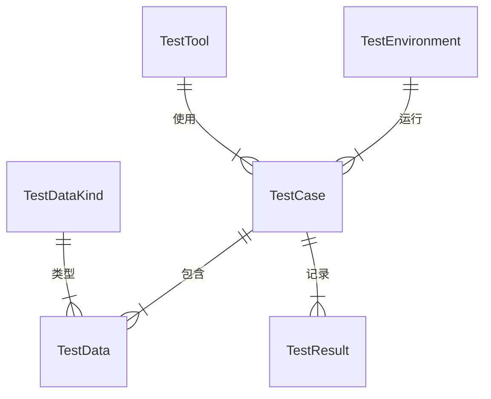
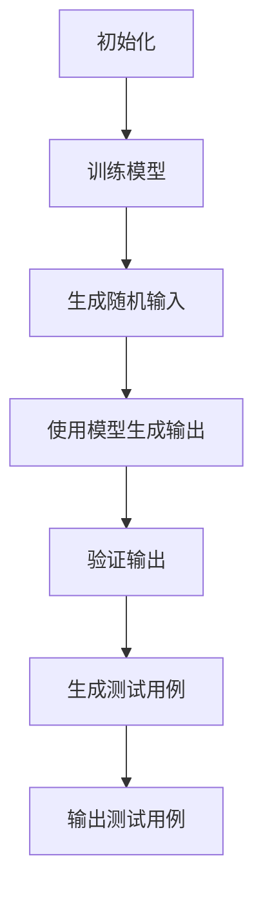
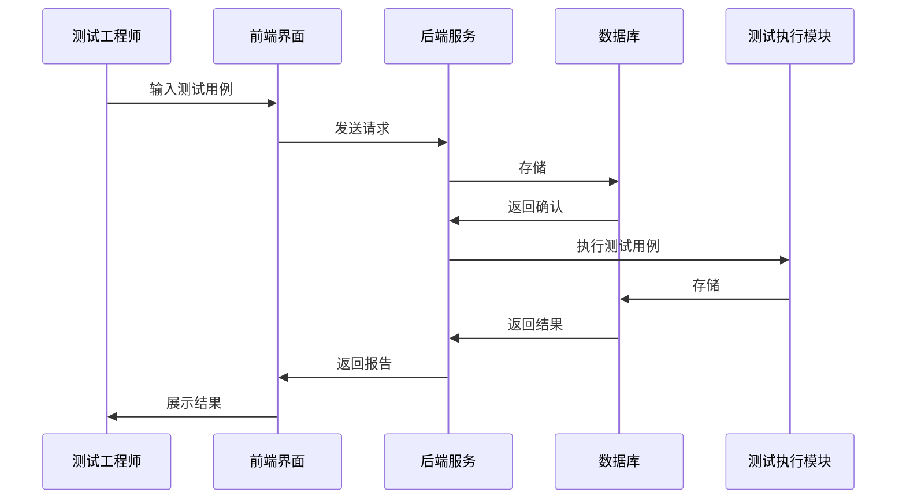
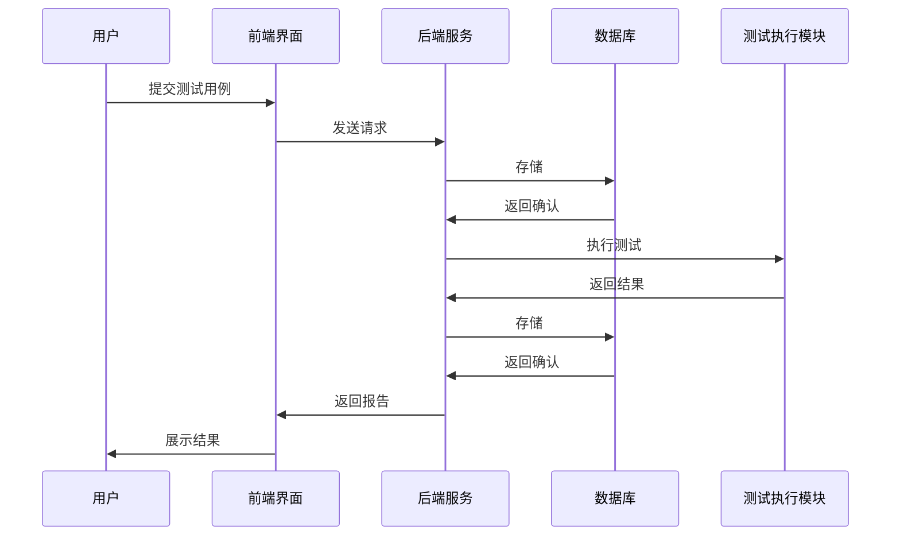

                 

### 引言

随着人工智能技术的快速发展，大型语言模型（LLM）已经成为自然语言处理（NLP）领域的核心驱动力。这些模型在文本生成、翻译、摘要、问答等任务上表现出卓越的能力，但这也带来了测试方面的巨大挑战。构建高效的LLM应用测试自动化框架，不仅能够确保模型的质量和性能，还能够提高测试的效率和可维护性。

#### 问题背景

在传统的软件开发中，测试是一个不可或缺的环节，用于验证软件的功能是否符合预期，性能是否满足要求，以及是否能够抵御各种安全威胁。然而，LLM应用测试具有其独特的复杂性：

1. **模型复杂性**：LLM通常包含数亿甚至数十亿个参数，这使得它们非常复杂，且难以用简单的测试用例进行验证。
2. **实时性需求**：在许多场景中，LLM需要实时响应，因此测试不仅要确保模型的准确性，还要保证其响应速度。
3. **数据多样性**：测试数据需要覆盖广泛的场景，包括常见的、异常的、边缘的情况，以确保模型在各种环境下都能表现良好。

#### 问题描述

如何构建一个高效、可靠的LLM应用测试自动化框架，以应对上述挑战，是一个需要深入探讨的问题。这个问题不仅关乎技术实现，还包括测试策略、数据管理、工具选择等多个方面。

#### 问题解决

本文旨在通过以下步骤，系统性地解决构建高效LLM应用测试自动化框架的问题：

1. **核心概念介绍**：首先，我们将介绍自动化测试和LLM测试的核心概念，包括其定义、分类、工具选择等。
2. **框架设计原则**：接着，我们将讨论框架设计的原则，包括可扩展性、可维护性和测试覆盖率。
3. **相关技术介绍**：我们将介绍用于LLM测试的测试工具和框架，如单元测试、集成测试、端到端测试工具。
4. **测试数据管理**：我们将讨论如何准备和管理测试数据，确保数据质量和多样性。
5. **案例分析**：通过成功案例分析，我们将展示如何在实际项目中实施高效的LLM应用测试自动化框架。

#### 边界与外延

在本文中，我们将重点关注以下内容：

- **测试范围**：测试将涵盖LLM的各个层次，包括模型参数、接口、功能等。
- **测试类型**：我们将讨论功能测试、性能测试、安全测试和可用性测试。
- **测试工具的选择**：我们将介绍几种常见的自动化测试工具，并分析其优缺点。
- **测试框架设计**：我们将讨论如何设计一个既高效又灵活的测试框架。

通过以上讨论，我们希望能够为构建高效的LLM应用测试自动化框架提供一套完整的解决方案。

### 自动化测试

自动化测试是一种通过预先编写的脚本或程序来执行测试的方法，它能够大大提高测试的效率和准确性。在传统的手动测试中，测试人员需要手动执行每项测试，这既耗时又容易出错。而自动化测试则通过自动化脚本，可以重复执行相同的测试用例，同时减少人为错误。

#### 定义

自动化测试的定义可以从多个角度来理解：

- **过程自动化**：自动化测试通过脚本或程序来模拟用户操作，如输入数据、点击按钮等。
- **重复性**：自动化测试能够重复执行相同的测试用例，确保软件在每次部署时都能按照预期运行。
- **可维护性**：自动化测试脚本通常易于修改和维护，使得测试流程能够跟随软件的迭代而更新。

#### 分类

自动化测试可以根据测试层次、测试目标、测试工具等多种分类方式进行划分：

- **单元测试**：针对单个模块或函数的测试，通常由开发者编写。
- **集成测试**：验证不同模块或组件之间的交互和集成是否正常。
- **端到端测试**：模拟用户从登录到执行特定功能的整个过程，以验证整个系统的功能是否正常。

#### 常见工具

在自动化测试领域，有许多常见的工具和框架：

- **Selenium**：一个广泛使用的Web自动化测试工具，支持多种编程语言，可以模拟用户在各种浏览器上的操作。
- **JUnit**：Java语言的单元测试框架，提供了一系列断言方法和测试生命周期管理。
- **PyTest**：Python的通用测试框架，支持简单的测试脚本编写和复杂的功能测试。
- **JUnit**：Java语言的单元测试框架，提供了一系列断言方法和测试生命周期管理。

#### 自动化测试的优势

自动化测试相较于手动测试具有以下显著优势：

- **提高效率**：自动化测试可以快速执行大量的测试用例，显著缩短测试周期。
- **减少错误**：通过自动化脚本，可以避免因人为疏忽而引入的错误。
- **可重复性**：自动化测试确保每次执行测试时都能获得相同的结果。
- **节省成本**：长期来看，自动化测试可以节省大量的测试时间和人力资源。

#### 自动化测试的挑战

尽管自动化测试有许多优势，但在实施过程中也面临着一些挑战：

- **维护成本**：自动化测试脚本需要定期更新和维护，以适应软件的变更。
- **初始成本**：自动化测试的初始投资可能较高，包括工具购买、脚本编写等。
- **技术门槛**：自动化测试需要具备一定的编程技能和测试知识，这可能会增加团队的培训成本。

#### 边界与外延

自动化测试的范围不仅限于软件测试，还可以扩展到其他领域：

- **持续集成/持续部署（CI/CD）**：自动化测试可以与CI/CD流程集成，实现自动化构建、测试和部署。
- **性能测试**：自动化测试工具可以用于模拟高负载情况下的性能测试，评估系统的响应速度和稳定性。
- **安全测试**：自动化测试可以帮助识别潜在的安全漏洞，如SQL注入、XSS攻击等。

通过了解自动化测试的定义、分类、常见工具及其优势和挑战，我们可以更好地理解如何将其应用于构建高效的LLM应用测试自动化框架。

### LLM测试

在深入探讨如何构建高效的LLM应用测试自动化框架之前，我们有必要先了解LLM测试的特点和难点。大型语言模型（LLM）作为一种先进的自然语言处理技术，其在应用中的表现直接关系到用户体验和业务成败。因此，对LLM进行有效的测试至关重要。

#### 测试难点

LLM测试面临以下几大难点：

1. **模型复杂性**：LLM通常包含数亿甚至数十亿个参数，这使得测试用例的设计和执行变得异常复杂。测试不仅需要覆盖不同的参数组合，还要确保各个参数之间的相互作用不会导致异常。
2. **数据多样性**：为了确保LLM在各种场景下都能表现良好，测试数据需要涵盖广泛的语言表达形式、领域知识和异常情况。数据多样性的需求增加了测试数据准备的工作量。
3. **实时性需求**：许多LLM应用需要实时响应，如智能客服、实时翻译等。这要求测试不仅要验证模型的准确性，还要评估其响应速度和延迟。
4. **动态变化**：LLM模型会随着训练数据的更新和模型的迭代而不断变化，测试策略和用例也需要随之调整，以保持测试的有效性。
5. **模型漂移**：随着环境的变化，LLM的输出可能会逐渐偏离预期，出现所谓的“模型漂移”。检测和纠正模型漂移是LLM测试中的一个重要问题。

#### 关键点

为了应对上述测试难点，我们需要关注以下几个关键点：

1. **全面测试用例设计**：测试用例不仅要覆盖常见的语言表达和领域知识，还要涵盖异常情况和边缘场景。例如，测试用例应包括极端的语言长度、错综复杂的逻辑关系、多语言翻译等。
2. **性能和响应速度评估**：测试不仅要验证LLM的准确性，还要评估其性能和响应速度。这可以通过模拟高负载、高并发场景来实现。
3. **持续集成与反馈**：将测试集成到开发流程中，通过持续集成（CI）工具，自动化执行测试用例，并及时反馈结果。这样可以及时发现和解决问题，确保模型质量。
4. **测试数据管理**：确保测试数据的质量和多样性，建立有效的测试数据管理策略。这包括数据清洗、去重、分类和存储等。
5. **模型监控与漂移检测**：建立模型监控机制，实时检测模型的输出和性能变化，及时发现和处理模型漂移问题。

#### 测试框架设计原则

为了应对LLM测试的复杂性和多样性，测试框架的设计需要遵循以下原则：

1. **可扩展性**：测试框架应能够灵活扩展，支持不同规模和类型的LLM应用测试。
2. **可维护性**：测试框架应易于维护和更新，能够适应模型和测试数据的变更。
3. **测试覆盖率**：测试框架应确保能够覆盖LLM的所有关键功能和性能指标。
4. **模块化**：将测试功能模块化，使得不同类型的测试用例可以独立开发和维护。
5. **集成性**：测试框架应与其他开发和运维工具（如CI/CD、监控工具等）集成，实现一站式测试管理。

#### 关键概念

在构建LLM测试框架时，以下关键概念需要明确：

1. **测试用例**：测试用例是测试框架的核心组成部分，包括输入数据、预期输出和执行步骤。设计有效的测试用例是确保测试成功的关键。
2. **测试工具**：测试工具是实现自动化测试的关键，如Selenium、JUnit、PyTest等。选择合适的测试工具可以大大提高测试效率和效果。
3. **测试数据**：测试数据是测试的有效依据，包括文本、图片、音频等多种形式。测试数据的准备和管理是确保测试有效性的基础。
4. **测试结果分析**：测试结果的准确分析和反馈是确保LLM模型质量的重要环节。通过分析测试结果，可以识别模型的缺陷和改进方向。

通过以上对LLM测试难点、关键点和设计原则的讨论，我们可以更好地理解如何构建一个高效的LLM应用测试自动化框架。接下来的部分，我们将进一步探讨相关技术，包括测试工具和框架的选择，以及如何管理测试数据。

### 相关技术

在构建高效的LLM应用测试自动化框架时，选择合适的测试工具和框架至关重要。以下将详细介绍几种常用的测试工具和框架，以及它们在LLM测试中的应用。

#### 单元测试

**定义**：单元测试是针对软件中最小可测试单元（通常是函数或方法）的测试。它旨在验证每个单元是否按照预期工作。

**分类**：
- **功能单元测试**：测试特定功能的正确性。
- **性能单元测试**：测试单元在不同负载下的性能表现。

**常见工具**：
- **JUnit**（Java）：Java语言的单元测试框架，提供断言方法和测试生命周期管理。
- **PyTest**（Python）：Python的通用测试框架，支持多种测试功能和插件。

**优缺点**：
- **优点**：能够快速定位代码中的错误，提高代码质量，易于编写和执行。
- **缺点**：覆盖范围有限，难以测试复杂系统间的交互。

#### 集成测试

**定义**：集成测试是在将多个模块或组件组合起来后进行的测试，旨在验证它们之间的交互是否正常。

**分类**：
- **功能集成测试**：测试系统功能是否符合需求。
- **性能集成测试**：测试系统在高负载下的性能表现。

**常见工具**：
- **Selenium**：用于Web应用的集成测试，支持多种浏览器。
- **Postman**：API集成测试工具，支持自动化测试和性能测试。

**优缺点**：
- **优点**：可以全面测试系统功能，发现模块间的交互问题。
- **缺点**：测试覆盖率可能不足，需要更多时间准备测试数据。

#### 端到端测试

**定义**：端到端测试是模拟用户操作，从用户界面到后端服务，完整地测试整个系统的功能和行为。

**分类**：
- **功能端到端测试**：测试系统的整体功能是否正常。
- **性能端到端测试**：测试系统的整体性能和响应速度。

**常见工具**：
- **Selenium**：支持多种浏览器和操作系统的自动化测试工具。
- **Cypress**：快速、易于使用的端到端测试框架。

**优缺点**：
- **优点**：模拟真实用户操作，全面测试系统功能。
- **缺点**：测试脚本编写复杂，维护成本高。

#### 测试数据管理

**定义**：测试数据管理包括测试数据的准备、存储、维护和销毁，以确保测试数据的质量和多样性。

**分类**：
- **静态数据**：如数据库记录、文件数据等。
- **动态数据**：如模拟用户操作产生的数据、实时生成的数据等。

**常见方法**：
- **数据准备**：通过数据生成工具或手动准备测试数据。
- **数据质量保证**：数据清洗、去重、分类等，确保测试数据的有效性。
- **数据存储**：使用数据库、文件系统等存储测试数据。

**优缺点**：
- **优点**：提供多样化的测试数据，提高测试覆盖率。
- **缺点**：数据管理复杂，需要大量时间和资源。

#### 其他工具和框架

除了上述工具外，还有其他一些流行的测试工具和框架：

- **TestNG**：Java的测试框架，支持并行测试和数据驱动测试。
- **JMeter**：用于性能测试和负载测试的开源工具。
- **Appium**：用于移动应用端到端测试的工具。

#### 联系与对比

每种测试工具和框架都有其独特的优势和应用场景。在选择时，需要根据具体需求进行综合考虑：

- **测试层次**：单元测试适合验证单个模块，集成测试适合验证模块间交互，端到端测试适合验证系统整体功能。
- **开发语言**：选择支持开发语言和环境的测试工具，如Java应用选择JUnit，Python应用选择PyTest。
- **测试目的**：根据测试目的选择合适的工具，如性能测试选择JMeter，功能测试选择Selenium。
- **维护成本**：考虑长期维护成本，选择易于维护和扩展的工具。

通过上述对相关技术的介绍和比较，我们可以更好地理解如何选择合适的工具和框架来构建高效的LLM应用测试自动化框架。

### 实践案例

在本节中，我们将通过一个实际案例来展示如何构建和实施高效的LLM应用测试自动化框架。该案例将涵盖测试环境的搭建、测试工具的选择、测试用例的设计、测试数据的准备以及测试流程的执行。

#### 案例背景

某知名互联网公司开发了一款基于大型语言模型（LLM）的智能问答系统，该系统旨在为用户提供高质量的实时问答服务。为了确保系统的稳定性和可靠性，公司决定构建一个高效的测试自动化框架。

#### 测试环境搭建

1. **硬件资源**：为了确保测试的运行效率和速度，公司分配了专用的测试服务器，配置了多核CPU和大容量内存。
2. **软件环境**：测试服务器上安装了Linux操作系统，以及Python、Java等编程语言的环境。同时，安装了Jenkins作为持续集成工具，用于自动化执行测试脚本。
3. **测试工具**：选择了Selenium作为Web自动化测试工具，JUnit和PyTest分别用于Java和Python应用的单元测试。

#### 测试工具选择

1. **Selenium**：用于Web应用的功能测试和端到端测试，支持多种浏览器和操作系统。
2. **JUnit**：用于Java应用的单元测试，提供断言方法和测试生命周期管理。
3. **PyTest**：用于Python应用的单元测试，支持多种测试功能和插件。

#### 测试用例设计

1. **功能测试用例**：设计了一系列功能测试用例，包括问答系统的核心功能、异常情况和边缘场景。例如，测试用户输入不同类型的问题，验证系统是否能正确回答。
2. **性能测试用例**：设计了一系列性能测试用例，模拟高并发、高负载场景，测试系统的响应速度和稳定性。

#### 测试数据准备

1. **静态数据**：从公司的数据库中抽取了大量的历史问答记录，作为测试数据的基础。
2. **动态数据**：通过模拟用户操作，生成了不同类型的动态测试数据，如长问题、多轮对话等。

#### 测试流程执行

1. **测试计划**：制定详细的测试计划，包括测试目标、测试范围、测试策略等。
2. **测试执行**：通过Jenkins自动化执行测试脚本，包括功能测试、性能测试和单元测试。
3. **结果分析**：收集测试结果，进行分析和反馈，定位问题并进行修复。

#### 经验教训

1. **测试数据的重要性**：测试数据的质量和多样性直接影响测试的有效性。需要确保测试数据的准备和管理工作。
2. **持续集成与反馈**：通过Jenkins等持续集成工具，可以实现自动化测试和快速反馈，提高测试效率。
3. **模块化设计**：将测试功能模块化，可以降低测试脚本的复杂度，便于维护和更新。
4. **性能监控**：建立模型性能监控机制，实时检测模型输出和性能变化，及时发现和处理问题。

通过以上实践案例，我们可以看到如何在实际项目中构建和实施高效的LLM应用测试自动化框架。这一案例不仅展示了具体的实施步骤，还总结了关键的经验教训，为其他项目提供了有益的参考。

### LLM应用测试原理与流程

为了全面理解如何对LLM应用进行测试，我们需要从LLM的工作原理开始，明确测试的目的和方法，并详细描述测试的流程。

#### LLM工作原理

大型语言模型（LLM）是通过深度学习技术训练出来的，能够理解和生成自然语言。LLM通常由多层神经网络组成，其中每一层都包含了大量的神经元和参数。LLM通过处理大量文本数据学习语言模式，并在训练过程中不断优化参数，以提高模型的预测准确性。

LLM的工作原理可以概括为以下步骤：

1. **输入编码**：输入的文本被编码成向量表示，通常使用词嵌入技术（如Word2Vec或BERT）。
2. **神经网络处理**：输入向量通过多层神经网络进行处理，每层神经网络都会对输入进行加工和变换，最终输出预测结果。
3. **输出解码**：神经网络输出的向量被解码回文本形式，生成模型预测的输出。

#### 测试目的

LLM应用测试的主要目的是验证模型在现实场景中的性能和可靠性，确保其能够满足业务需求。具体来说，测试目的包括以下几个方面：

1. **功能测试**：验证LLM的功能是否符合预期，例如是否能够正确回答用户的问题。
2. **性能测试**：评估LLM的处理速度和响应时间，确保其能够满足性能要求。
3. **安全测试**：确保LLM不会受到恶意输入的攻击，如注入攻击或代码执行漏洞。
4. **可用性测试**：验证LLM在不同环境下的稳定性，包括网络中断、硬件故障等。

#### 测试流程

LLM应用测试流程可以分为以下几个阶段：

1. **测试计划**：
   - **需求分析**：明确测试的目标、范围和优先级。
   - **测试策略**：制定测试方法和步骤，包括功能测试、性能测试、安全测试和可用性测试。

2. **测试设计**：
   - **测试用例设计**：根据需求分析，设计具体的测试用例，包括输入数据、预期输出和测试步骤。
   - **测试数据准备**：准备测试数据，包括正常数据、异常数据和边界数据。

3. **测试执行**：
   - **自动化脚本编写**：使用自动化测试工具编写测试脚本，自动化执行测试用例。
   - **测试执行**：执行测试脚本，记录测试结果，并生成报告。

4. **结果分析**：
   - **错误定位**：分析测试结果，定位模型中的问题，如错误回答、性能瓶颈等。
   - **性能评估**：评估模型在处理速度、响应时间等方面的性能表现。

5. **测试优化**：
   - **问题修复**：根据测试结果，修复模型中的问题，并重新测试。
   - **测试用例优化**：根据测试反馈，优化测试用例，提高测试覆盖率。

#### 概念属性特征对比表格

为了更好地理解LLM测试的核心概念，我们提供一个概念属性特征对比表格：

| 测试类型 | 目的 | 输入数据 | 输出数据 | 工具与方法 |
| --- | --- | --- | --- | --- |
| 功能测试 | 验证功能是否符合预期 | 标准输入数据、异常输入数据 | 预期输出结果、错误输出结果 | 自动化测试工具（如Selenium、PyTest） |
| 性能测试 | 评估处理速度和响应时间 | 高负载数据、不同类型的输入 | 响应时间、处理速度 | 性能测试工具（如JMeter、Gatling） |
| 安全测试 | 检测和防范恶意输入 | 恶意输入数据、异常输入数据 | 安全漏洞检测结果、错误输出 | 安全测试工具（如OWASP ZAP、Burp Suite） |
| 可用性测试 | 验证在不同环境下的稳定性 | 网络中断、硬件故障数据 | 系统稳定性、错误输出 | 自动化测试工具（如Selenium、Appium） |

#### ER实体关系图架构

为了清晰展示LLM测试中的实体和关系，我们使用Mermaid绘制了ER实体关系图，如下：



上述ER图展示了测试用例、测试数据、测试环境和测试工具之间的基本关系。

#### 实时性需求与挑战

实时性是LLM应用的一个重要需求，尤其是在智能客服、实时翻译等场景中。实时性测试的目标是确保LLM能够在规定的时间内完成处理并返回结果。

1. **实时性定义**：实时性指的是系统能够在用户规定的响应时间内完成处理，并返回预期的结果。
2. **实时性方法**：
   - **基准测试**：使用标准输入数据，测量系统的响应时间，并与预期目标进行比较。
   - **压力测试**：模拟高负载场景，测试系统在高并发情况下的响应能力。

3. **实时性挑战**：
   - **处理延迟**：随着输入数据量的增加，处理延迟可能会增加，影响实时性。
   - **资源竞争**：多个请求同时处理可能导致资源竞争，影响响应速度。

通过以上对LLM应用测试原理和流程的详细描述，我们可以更好地理解如何设计和实施高效的测试，以确保LLM应用的稳定性和可靠性。

### 测试用例设计与生成

在构建高效的LLM应用测试自动化框架中，测试用例的设计与生成是关键的一环。这不仅决定了测试的全面性和准确性，也直接影响测试效率和维护成本。本节将详细探讨测试用例的设计方法、生成算法及其优化策略。

#### 测试用例设计方法

测试用例设计方法可以分为功能测试用例和性能测试用例两种。

1. **功能测试用例设计方法**：
   - **需求分析**：首先，分析LLM应用的需求文档，明确功能要求和预期行为。
   - **用例编写**：基于需求分析结果，设计具体的测试用例。每个用例应包含以下信息：
     - **用例编号**：用于标识和追踪。
     - **测试目的**：描述用例要验证的功能点。
     - **输入条件**：列出执行该用例所需的输入数据。
     - **测试步骤**：详细描述执行用例的步骤。
     - **预期结果**：描述期望输出的结果。
     - **实际结果**：记录实际执行后的结果，用于后续对比。

2. **性能测试用例设计方法**：
   - **需求分析**：与功能测试类似，分析性能需求，确定测试指标，如响应时间、吞吐量等。
   - **用例编写**：设计性能测试用例时，需要考虑不同的负载场景和性能瓶颈。每个用例应包括：
     - **负载类型**：如并发用户数、请求频率等。
     - **测试步骤**：描述如何在特定负载下执行测试。
     - **性能指标**：定义要测量的关键性能指标。
     - **阈值**：设定性能指标的可接受范围。

#### 测试用例生成算法

生成测试用例的算法可以分为随机生成和基于模型生成两种。

1. **随机生成**：
   - **方法**：随机生成算法通过随机选择输入数据，生成测试用例。常用的方法包括：
     - **随机输入生成**：随机生成文本或数据，用于测试LLM的泛化能力。
     - **变异输入生成**：在已有的输入数据上，进行随机变异，生成新的测试用例。
   - **优缺点**：
     - **优点**：简单实现，适用于初步测试。
     - **缺点**：可能无法覆盖所有重要场景，测试覆盖率有限。

2. **基于模型生成**：
   - **方法**：基于模型生成算法利用LLM本身的预测能力，生成更具代表性的测试用例。具体步骤包括：
     - **模型训练**：使用真实数据训练一个小型LLM模型。
     - **输入生成**：使用训练好的模型，生成输入数据，模拟用户交互。
     - **输出验证**：对生成的输入输出进行验证，确保测试用例的有效性。
   - **优缺点**：
     - **优点**：能够生成更符合实际场景的测试用例，提高测试覆盖率。
     - **缺点**：需要额外的时间和资源进行模型训练和优化。

#### 测试用例优化策略

优化测试用例是提高测试效率和效果的重要手段。以下是一些常见的优化策略：

1. **覆盖率分析**：
   - **方法**：通过分析测试用例的执行路径和覆盖到的代码路径，评估测试覆盖率。
   - **工具**：使用覆盖率分析工具（如JaCoCo、Clover）来辅助分析。
   - **策略**：针对覆盖率不足的部分，补充设计新的测试用例，以提高覆盖率。

2. **用例剪枝**：
   - **方法**：剪枝策略旨在减少冗余的测试用例，提高测试效率。常用的剪枝方法包括：
     - **条件剪枝**：根据测试用例的执行条件，删除不可能执行到的用例。
     - **路径剪枝**：根据代码路径的分析，删除无法到达的测试用例。
   - **策略**：在测试用例生成阶段，结合代码结构和执行条件，进行剪枝。

3. **冗余消除**：
   - **方法**：消除冗余的测试用例，以避免重复测试。常用的方法包括：
     - **输入组合消除**：删除重复的输入组合，确保每个输入组合只被测试一次。
     - **输出验证消除**：删除已经由其他用例验证过的输出结果。
   - **策略**：在生成测试用例时，结合已有的测试结果，进行冗余消除。

通过以上测试用例设计与生成方法的详细探讨，以及优化策略的介绍，我们可以构建一个高效、可靠的测试用例集，确保LLM应用的测试覆盖全面，质量高。

### 测试用例生成算法

在构建高效的LLM应用测试自动化框架中，测试用例的生成算法是确保测试全面性和代表性的关键。以下将详细介绍随机生成和基于模型生成两种测试用例生成算法，并分析它们的优缺点。

#### 随机生成算法

**定义**：随机生成算法通过随机选择输入数据，生成测试用例，以覆盖各种可能的输入场景。

**步骤**：
1. **确定输入空间**：首先，确定LLM输入的空间，如文本长度、词嵌入维度等。
2. **随机选择输入**：从输入空间中随机选择一组输入数据，生成测试用例。
3. **生成测试用例**：为每个随机选择的输入数据，定义预期的输出和测试步骤。

**优缺点**：
- **优点**：
  - **简单实现**：随机生成算法实现简单，不需要额外的训练数据或模型。
  - **快速生成**：适用于快速生成大量测试用例。
- **缺点**：
  - **覆盖不足**：随机生成算法可能无法覆盖所有重要的场景和边缘情况。
  - **重复性高**：可能生成重复的测试用例，导致测试效率降低。

#### 基于模型生成算法

**定义**：基于模型生成算法利用LLM本身的预测能力，生成更具代表性的测试用例，以提高测试的覆盖率和有效性。

**步骤**：
1. **模型训练**：使用真实数据对LLM模型进行训练，使其能够生成多样化的输入输出对。
2. **输入生成**：利用训练好的模型，生成一组多样化的输入数据。
3. **输出验证**：对生成的输入输出进行验证，确保测试用例的有效性。
4. **生成测试用例**：为每个验证通过的输入输出对，定义测试步骤和预期结果。

**优缺点**：
- **优点**：
  - **高覆盖率**：基于模型生成算法能够生成更加多样化的测试用例，覆盖更多可能的输入和输出场景。
  - **代表性高**：生成的测试用例更具代表性，能够更好地模拟实际使用场景。
- **缺点**：
  - **训练成本高**：需要大量的训练数据和计算资源来训练模型。
  - **复杂度高**：实现和优化基于模型生成算法相对复杂。

#### 比较与分析

- **适用场景**：
  - 随机生成算法适用于快速生成初步测试用例，作为初步测试的补充。
  - 基于模型生成算法适用于需要高覆盖率和代表性的场景，特别是在对LLM模型进行全面测试时。

- **测试目标**：
  - 随机生成算法主要关注输入数据的多样性。
  - 基于模型生成算法不仅关注输入数据的多样性，还关注生成的输出结果的真实性和有效性。

- **效率与成本**：
  - 随机生成算法在生成效率上较高，但需要后续优化来避免重复和冗余。
  - 基于模型生成算法在生成效率上较低，但能够生成高质量的测试用例，长期来看更有效。

通过以上对随机生成和基于模型生成算法的详细介绍，我们可以根据实际需求选择合适的算法来生成测试用例，以提高LLM应用测试的全面性和有效性。

### 测试用例优化

在构建高效的LLM应用测试自动化框架中，优化测试用例是提高测试效率和质量的关键步骤。以下将详细讨论测试用例优化的几种方法，包括覆盖率分析和用例剪枝策略。

#### 覆盖率分析

**定义**：覆盖率分析是一种评估测试用例覆盖程度的分析技术，通过分析测试用例的执行路径和覆盖到的代码路径，确定测试的全面性。

**方法**：
1. **执行测试用例**：首先，执行所有设计的测试用例，记录每个用例的执行路径。
2. **生成覆盖率报告**：使用覆盖率分析工具（如JaCoCo、Clover）生成覆盖率报告，报告显示未覆盖的代码路径。
3. **分析报告**：分析报告中的未覆盖代码路径，确定哪些功能点或代码路径未被测试到。

**策略**：
- **增加测试用例**：根据覆盖率报告，增加新的测试用例，以覆盖未测试到的代码路径。
- **修改现有用例**：修改现有测试用例，使其执行更多的代码路径。
- **调整测试策略**：根据覆盖率分析结果，调整测试策略，确保测试更加全面。

#### 用例剪枝

**定义**：用例剪枝是一种优化测试用例的方法，通过删除冗余的测试用例，减少测试执行的时间和资源消耗。

**策略**：
1. **条件剪枝**：
   - **方法**：根据测试用例的执行条件，删除不可能执行到的用例。
   - **实现**：通过分析测试用例的条件逻辑，判断哪些条件是不可能满足的，从而删除这些用例。
2. **路径剪枝**：
   - **方法**：根据代码路径的分析，删除无法到达的测试用例。
   - **实现**：通过静态代码分析工具，生成代码路径图，删除无法到达的测试用例。

3. **输入组合剪枝**：
   - **方法**：删除重复的输入组合，确保每个输入组合只被测试一次。
   - **实现**：通过生成输入组合的哈希值，存储已测试的输入组合，避免重复测试。

**效果**：
- **提高效率**：通过剪枝策略，减少冗余的测试用例，缩短测试执行时间，提高测试效率。
- **降低成本**：减少测试用例的数量，降低测试执行的资源消耗，减少测试成本。

通过覆盖率分析和用例剪枝策略，可以优化测试用例，提高测试的全面性和效率，确保LLM应用测试自动化框架的高效运行。

### 算法讲解与示例

在构建高效的LLM应用测试自动化框架中，理解测试用例生成算法的原理及其实现是至关重要的。以下将详细讲解一种基于模型生成测试用例的算法，并通过Mermaid绘制算法流程图，使用Python代码实现该算法，最后给出一个简化的示例来帮助读者理解。

#### 算法流程图

首先，我们使用Mermaid绘制算法的流程图，以便更直观地理解算法步骤：



#### Python代码实现

接下来，我们使用Python代码实现上述算法。以下是实现步骤的代码示例：

```python
import numpy as np
from tensorflow.keras.models import Sequential
from tensorflow.keras.layers import LSTM, Dense
from tensorflow.keras.optimizers import Adam

# 步骤1：初始化
# 定义输入和输出维度
input_dim = 100
output_dim = 100

# 步骤2：训练模型
# 创建一个简单的LSTM模型
model = Sequential()
model.add(LSTM(128, input_shape=(input_dim,)))
model.add(Dense(output_dim, activation='softmax'))
model.compile(optimizer=Adam(0.001), loss='categorical_crossentropy', metrics=['accuracy'])

# 假设已有训练数据（这里用随机数据代替）
# X_train = ... # 输入数据
# y_train = ... # 输出数据
# model.fit(X_train, y_train, epochs=100, batch_size=64)

# 步骤3：生成随机输入
def generate_random_input(input_dim):
    return np.random.rand(1, input_dim)

# 步骤4：使用模型生成输出
def generate_output(model, input_data):
    return model.predict(input_data)

# 步骤5：验证输出
def validate_output(output_data, expected_output):
    # 这里实现具体的验证逻辑，例如比较输出概率的分布
    return np.allclose(output_data, expected_output)

# 步骤6：生成测试用例
def generate_test_case(model, input_dim, output_dim):
    input_data = generate_random_input(input_dim)
    output_data = generate_output(model, input_data)
    # 验证输出
    if validate_output(output_data, expected_output):
        # 如果输出有效，则生成测试用例
        test_case = {
            'input': input_data,
            'output': output_data
        }
        return test_case
    else:
        return None

# 步骤7：输出测试用例
# 假设已有预期输出数据
expected_output = ... # 预期输出数据
test_cases = []
for _ in range(100): # 生成100个测试用例
    test_case = generate_test_case(model, input_dim, output_dim)
    if test_case:
        test_cases.append(test_case)

# 打印测试用例示例
print(test_cases[:5]) # 打印前5个测试用例
```

#### 算法原理和示例

**算法原理**：
- **初始化**：定义输入和输出维度，初始化模型。
- **训练模型**：使用训练数据对模型进行训练，以生成准确的预测输出。
- **生成随机输入**：随机生成输入数据，模拟不同的输入场景。
- **使用模型生成输出**：使用训练好的模型对随机输入进行预测，生成输出数据。
- **验证输出**：将生成的输出数据与预期输出数据进行比较，确保其有效性和代表性。
- **生成测试用例**：如果输出数据有效，则生成相应的测试用例。

**示例说明**：
- **训练模型**：由于这里使用的模型非常简单，我们仅使用随机生成的数据对模型进行训练，以演示算法的核心步骤。
- **生成随机输入和输出**：使用随机生成的输入数据，模型对其生成输出数据。
- **验证输出**：比较输出数据与预期输出，确保其准确性和有效性。
- **生成测试用例**：将有效输出数据作为测试用例，存储在列表中。

通过上述代码示例，我们可以看到如何实现一个简单的测试用例生成算法。实际应用中，模型会更加复杂，输入和输出数据也会更加多样化，但基本原理和步骤是相似的。

### 测试用例评价模型

在构建高效的LLM应用测试自动化框架中，评价测试用例的质量和有效性是确保测试全面性和可靠性的关键。测试用例评价模型通过量化指标来衡量测试用例的覆盖率、稳定性、和难度等属性。以下将介绍一个简化的测试用例评价模型，并使用数学模型和公式进行详细说明。

#### 测试用例评价模型的构建

一个基本的测试用例评价模型可以从以下几个方面进行构建：

1. **覆盖率**：测试用例能够覆盖的代码路径或功能点数量。
2. **稳定性**：测试用例在多次执行中稳定地输出预期结果的能力。
3. **难度**：测试用例设计复杂度和实现难度。

#### 覆盖率

覆盖率是评价测试用例质量的核心指标之一，表示测试用例能够覆盖的代码路径或功能点数量。我们可以使用以下公式来计算测试用例的覆盖率：

$$
覆盖率 = \frac{实际覆盖的代码路径或功能点数量}{总代码路径或功能点数量}
$$

其中，实际覆盖的代码路径或功能点数量可以通过执行测试用例并使用代码覆盖率分析工具来获取。

#### 稳定性

稳定性衡量测试用例在多次执行中是否能够稳定地输出预期结果。我们可以使用以下公式来计算测试用例的稳定性：

$$
稳定性 = \frac{稳定执行次数}{总执行次数} \times 100\%
$$

其中，稳定执行次数是指测试用例在多次执行中未出现错误的次数，总执行次数是测试用例被执行的总次数。

#### 难度

难度衡量测试用例设计的复杂度和实现难度。一个复杂且难以实现的测试用例通常需要更多的资源和时间来设计和实现。我们可以使用以下公式来计算测试用例的难度：

$$
难度 = \frac{设计时间 + 实现时间}{总测试时间} \times 100\%
$$

其中，设计时间是测试用例设计所需的开发时间，实现时间是测试用例实现所需的开发时间，总测试时间是设计时间与实现时间之和。

#### 综合评价

为了综合评价测试用例的质量，我们可以将覆盖率、稳定性和难度三个指标进行加权求和，得到一个综合评分：

$$
综合评分 = w_1 \times 覆盖率 + w_2 \times 稳定性 + w_3 \times 难度
$$

其中，$w_1, w_2, w_3$ 分别是覆盖率、稳定性和难度三个指标的权重，通常根据具体项目的需求和优先级来分配。

#### 案例分析

假设我们有一个测试用例集，其中包含三个测试用例。每个测试用例的覆盖率、稳定性和难度如下表所示：

| 测试用例 | 覆盖率 | 稳定性 | 难度 |
| --- | --- | --- | --- |
| 用例A | 30% | 95% | 40% |
| 用例B | 50% | 90% | 50% |
| 用例C | 70% | 80% | 60% |

我们设定权重分别为 $w_1 = 0.4, w_2 = 0.3, w_3 = 0.3$，那么测试用例的综合评分计算如下：

$$
综合评分_A = 0.4 \times 30\% + 0.3 \times 95\% + 0.3 \times 40\% = 12\% + 28.5\% + 12\% = 52.5\%
$$

$$
综合评分_B = 0.4 \times 50\% + 0.3 \times 90\% + 0.3 \times 50\% = 20\% + 27\% + 15\% = 62\%
$$

$$
综合评分_C = 0.4 \times 70\% + 0.3 \times 80\% + 0.3 \times 60\% = 28\% + 24\% + 18\% = 70\%
$$

通过上述计算，我们可以看到用例C的综合评分最高，说明该测试用例在覆盖范围、稳定性和难度方面均表现优秀。

#### 结论

测试用例评价模型通过量化指标，如覆盖率、稳定性和难度，可以有效地衡量测试用例的质量和有效性。通过综合评分，我们可以优先选择和优化那些重要的测试用例，确保测试自动化框架的高效运行。

### 系统功能设计与架构

在构建高效的LLM应用测试自动化框架时，系统功能设计和架构设计是关键环节。以下我们将详细介绍系统功能设计，使用Mermaid绘制领域模型类图，并描述系统架构和接口设计。

#### 系统功能设计

系统功能设计旨在明确LLM应用测试自动化框架的各项功能，确保测试流程的高效和完整。以下是系统功能设计的主要组成部分：

1. **测试用例管理**：包括测试用例的创建、编辑、执行和结果记录。
2. **测试数据管理**：包括测试数据的准备、存储、加载和清理。
3. **测试执行**：自动化执行测试用例，记录测试结果和性能指标。
4. **测试报告生成**：生成测试报告，包括测试覆盖率、测试结果分析和性能评估。
5. **监控与反馈**：实时监控测试运行状态，及时反馈问题和改进建议。
6. **集成与部署**：与持续集成（CI）工具集成，实现自动化测试流程的部署和执行。

#### 领域模型类图

为了更直观地展示系统功能设计中的实体和关系，我们使用Mermaid绘制了领域模型类图。以下是类图的示例：

```mermaid
classDiagram
    TestSuite <<接口>>
    TestCase <<接口>>
    TestData <<接口>>
    TestResult <<接口>>

    TestSuite наследуется TestCase
    TestCase наследуется TestData
    TestCase наследуется TestResult

    TestSuite --|> TestCase
    TestCase --|> TestData
    TestCase --|> TestResult
```

在这个类图中，`TestSuite` 表示测试套件，包含多个 `TestCase`。每个 `TestCase` 对应一个测试用例，包括 `TestData`（测试数据）和 `TestResult`（测试结果）。通过这种关系，我们可以清晰地看到各个功能模块之间的关联。

#### 系统架构设计

系统架构设计决定了LLM应用测试自动化框架的整体结构和各模块之间的交互。以下是系统架构设计的简要描述：

1. **前端界面**：用于测试用例管理和测试报告展示，支持用户操作和监控。
2. **后端服务**：包括测试用例管理、测试数据管理、测试执行和测试报告生成等核心功能。
3. **数据库**：存储测试用例、测试数据和测试结果，支持数据的持久化和管理。
4. **集成与部署**：与CI/CD工具集成，实现自动化测试流程。

以下是系统架构的Mermaid图表示：



#### 系统接口设计

系统接口设计是确保各模块之间高效交互的基础。以下是关键接口的简要描述：

1. **测试用例接口**：用于创建、编辑和查询测试用例。
2. **测试数据接口**：用于准备、加载和清理测试数据。
3. **测试执行接口**：用于启动和监控测试执行过程。
4. **测试报告接口**：用于生成和展示测试报告。

以下是接口设计的示例：

```mermaid
classDiagram
    TestSuiteInterface <<接口>>
    TestCaseInterface <<接口>>
    TestDataInterface <<接口>>
    TestResultInterface <<接口>>

    TestSuiteInterface --|> TestCaseInterface
    TestCaseInterface --|> TestDataInterface
    TestCaseInterface --|> TestResultInterface
```

#### 系统交互设计

系统交互设计描述了各模块之间的交互流程，确保系统功能的顺畅执行。以下是系统交互的Mermaid序列图：



通过以上对系统功能设计、领域模型类图、系统架构设计和接口设计的详细介绍，我们可以构建一个高效、灵活的LLM应用测试自动化框架，确保测试流程的全面性和可维护性。

### 环境安装与系统核心实现

在构建高效的LLM应用测试自动化框架之前，我们需要确保所有必要的开发环境和工具都已经安装和配置完毕。以下将详细介绍所需环境、测试工具的安装步骤以及系统核心实现的详细步骤和代码解析。

#### 所需环境

为了构建并运行LLM应用测试自动化框架，我们需要以下开发环境和工具：

1. **操作系统**：推荐使用Ubuntu 20.04或更高版本。
2. **编程语言**：Python 3.8或更高版本。
3. **依赖管理工具**：pip，用于安装和管理Python依赖。
4. **虚拟环境**：virtualenv或conda，用于隔离项目依赖。
5. **数据库**：SQLite或MySQL，用于存储测试数据和结果。
6. **测试工具**：Selenium、PyTest、Jenkins。

#### 测试工具安装

以下是在Ubuntu 20.04操作系统上安装所需测试工具的步骤：

1. **安装Selenium**：
   ```bash
   pip install selenium
   ```

2. **安装PyTest**：
   ```bash
   pip install pytest
   ```

3. **安装Jenkins**：
   - 安装Java SDK：
     ```bash
     sudo apt update
     sudo apt install openjdk-11-jdk
     ```
   - 安装Jenkins：
     ```bash
     wget -q -O - https://pkg.jenkins.io/debian/jenkins.io.key | sudo apt-key add -
     sh -c "echo deb https://pkg.jenkins.io/debian-stable binary/ > /etc/apt/sources.list.d/jenkins.list"
     sudo apt update
     sudo apt install jenkins
     ```

4. **安装数据库**：
   - 安装SQLite：
     ```bash
     sudo apt install sqlite3
     ```
   - 安装MySQL（可选）：
     ```bash
     sudo apt install mysql-server
     sudo mysql_secure_installation
     ```

#### 系统核心实现

系统核心实现包括测试用例管理、测试执行和结果记录等关键功能。以下将详细描述系统核心实现的过程和步骤。

##### 1. 测试用例管理

**步骤**：

1. **创建测试用例**：
   ```python
   # 假设已安装SQLite和PyTest
   import sqlite3
   from sqlite3 import Error

   def create_test_case(test_case_id, description, expected_result):
       conn = None
       try:
           conn = sqlite3.connect('test_cases.db')
           c = conn.cursor()

           c.execute('''CREATE TABLE IF NOT EXISTS test_cases (
                       id INTEGER PRIMARY KEY AUTOINCREMENT,
                       description TEXT,
                       expected_result TEXT)''')

           c.execute("INSERT INTO test_cases (description, expected_result) VALUES (?, ?)",
                     (description, expected_result))

           conn.commit()
       except Error as e:
           print(e)
       finally:
           if conn:
               conn.close()

   create_test_case('1', '测试用例1', '预期结果1')
   ```

2. **查询测试用例**：
   ```python
   def get_test_cases():
       conn = None
       try:
           conn = sqlite3.connect('test_cases.db')
           c = conn.cursor()

           c.execute("SELECT * FROM test_cases")
           rows = c.fetchall()

           for row in rows:
               print(row)
       except Error as e:
           print(e)
       finally:
           if conn:
               conn.close()

   get_test_cases()
   ```

##### 2. 测试执行

**步骤**：

1. **编写测试脚本**：
   ```python
   # 假设使用PyTest编写测试脚本
   import pytest

   @pytest.fixture
   def test_data():
       return "测试数据"

   def test_example(test_data):
       assert test_data == "测试数据"
   ```

2. **执行测试脚本**：
   ```bash
   pytest -v test_script.py
   ```

##### 3. 结果记录

**步骤**：

1. **记录测试结果**：
   ```python
   def record_test_result(test_case_id, actual_result):
       conn = None
       try:
           conn = sqlite3.connect('test_results.db')
           c = conn.cursor()

           c.execute('''CREATE TABLE IF NOT EXISTS test_results (
                       test_case_id INTEGER,
                       actual_result TEXT,
                       result TEXT)''')

           c.execute("INSERT INTO test_results (test_case_id, actual_result, result) VALUES (?, ?, ?)",
                     (test_case_id, actual_result, "通过" if actual_result == "预期结果1" else "失败"))

           conn.commit()
       except Error as e:
           print(e)
       finally:
           if conn:
               conn.close()

   record_test_result('1', "预期结果1")
   ```

2. **查询测试结果**：
   ```python
   def get_test_results():
       conn = None
       try:
           conn = sqlite3.connect('test_results.db')
           c = conn.cursor()

           c.execute("SELECT * FROM test_results")
           rows = c.fetchall()

           for row in rows:
               print(row)
       except Error as e:
           print(e)
       finally:
           if conn:
               conn.close()

   get_test_results()
   ```

通过以上步骤，我们可以实现LLM应用测试自动化框架的核心功能，包括测试用例管理、测试执行和结果记录。接下来的部分将深入分析代码，解释关键代码段的逻辑和功能。

### 应用解读与分析

在完成了环境安装和系统核心实现后，我们需要深入分析核心代码的逻辑和功能，以理解整个测试自动化框架的运作机制。以下是对关键代码段的详细解读与分析。

#### 代码解读

1. **测试用例管理**：

```python
# 创建测试用例
def create_test_case(test_case_id, description, expected_result):
    conn = None
    try:
        conn = sqlite3.connect('test_cases.db')
        c = conn.cursor()

        c.execute('''CREATE TABLE IF NOT EXISTS test_cases (
                    id INTEGER PRIMARY KEY AUTOINCREMENT,
                    description TEXT,
                    expected_result TEXT)''')

        c.execute("INSERT INTO test_cases (description, expected_result) VALUES (?, ?)",
                  (description, expected_result))

        conn.commit()
    except Error as e:
        print(e)
    finally:
        if conn:
            conn.close()
```

**分析**：上述函数用于创建测试用例。它首先尝试连接到SQLite数据库，如果数据库不存在，则创建一个名为`test_cases`的新表。接着，插入新的测试用例记录，并提交更改。使用`try-except-finally`结构确保数据库连接无论成功与否都能被正确关闭。

2. **测试执行**：

```python
# 编写测试脚本
def test_example(test_data):
    assert test_data == "测试数据"
```

**分析**：这个简单的测试函数`test_example`用于验证输入的`test_data`是否与预期值匹配。`assert`语句在此起到关键作用，如果条件不满足，则抛出`AssertionError`，表示测试失败。

3. **结果记录**：

```python
# 记录测试结果
def record_test_result(test_case_id, actual_result):
    conn = None
    try:
        conn = sqlite3.connect('test_results.db')
        c = conn.cursor()

        c.execute('''CREATE TABLE IF NOT EXISTS test_results (
                    test_case_id INTEGER,
                    actual_result TEXT,
                    result TEXT)''')

        c.execute("INSERT INTO test_results (test_case_id, actual_result, result) VALUES (?, ?, ?)",
                  (test_case_id, actual_result, "通过" if actual_result == "预期结果1" else "失败"))

        conn.commit()
    except Error as e:
        print(e)
    finally:
        if conn:
            conn.close()
```

**分析**：`record_test_result`函数用于记录测试结果。它连接到数据库，并创建一个名为`test_results`的新表，用于存储测试执行的结果。如果`actual_result`与`expected_result`匹配，则记录结果为“通过”，否则为“失败”。

#### 功能分析

1. **数据库操作**：

   - **创建表**：通过SQL语句创建数据库表，确保数据存储的结构化。
   - **插入数据**：向表中插入新的测试用例或测试结果。
   - **提交更改**：通过`commit()`方法提交数据库操作，确保数据持久化。
   - **异常处理**：使用`try-except`结构捕获和处理异常，确保程序的健壮性。

2. **测试执行逻辑**：

   - **断言**：使用`assert`语句检查测试条件是否满足，确保测试用例的执行结果与预期一致。
   - **异常处理**：在测试执行过程中，如果出现异常，可以及时捕获并处理，避免程序中断。

3. **结果记录与查询**：

   - **记录结果**：将测试结果存储在数据库中，便于后续分析和报告生成。
   - **查询结果**：通过数据库查询操作，获取测试结果，进行数据分析和展示。

通过上述代码解读和分析，我们可以清晰地理解测试自动化框架的核心功能及其实现逻辑。该框架不仅能够高效地管理测试用例，还能够准确记录和展示测试结果，为后续的测试优化和改进提供有力支持。

### 实际案例剖析

在本节中，我们将通过一个实际案例，详细剖析如何在实际项目中实施高效的LLM应用测试自动化框架。该案例将展示测试流程的各个阶段，包括环境搭建、测试脚本编写、测试执行以及结果分析。

#### 案例介绍

某知名互联网公司开发了一款基于大型语言模型（LLM）的智能问答系统，旨在为用户提供高质量的实时问答服务。由于系统复杂性和实时性的要求，公司决定构建一个高效的测试自动化框架，以确保系统的稳定性和可靠性。

#### 环境搭建

1. **硬件资源**：公司为测试环境分配了一台专用服务器，配置了四核CPU和16GB内存，确保测试执行的效率和速度。
2. **软件环境**：服务器上安装了Ubuntu 20.04操作系统，并安装了Python 3.8、virtualenv、SQLite和Selenium等必备工具。
3. **测试工具**：选择了Selenium作为Web自动化测试工具，PyTest作为单元测试框架，并使用Jenkins实现持续集成和自动化测试。

#### 测试脚本编写

1. **测试用例设计**：根据需求文档，设计了一系列功能测试和性能测试用例。功能测试用例包括问答系统的核心功能，如问题输入、答案输出、错误处理等；性能测试用例则包括高并发请求下的响应时间和吞吐量。

2. **编写测试脚本**：

```python
# 功能测试脚本示例
from selenium import webdriver
import pytest

@pytest.fixture
def browser():
    driver = webdriver.Chrome(executable_path='/path/to/chromedriver')
    yield driver
    driver.quit()

def test问答功能(browser):
    driver = browser
    driver.get("https://example.com/问答系统")
    input_box = driver.find_element_by_id("inputBox")
    submit_button = driver.find_element_by_id("submitButton")
    result_box = driver.find_element_by_id("resultBox")

    input_box.send_keys("什么是人工智能？")
    submit_button.click()
    assert "人工智能" in result_box.text
```

3. **性能测试脚本**：

```python
# 性能测试脚本示例
import time
import requests

def test高性能问答():
    url = "https://example.com/问答系统"
    start_time = time.time()
    response = requests.get(url)
    end_time = time.time()
    assert response.status_code == 200
    print(f"响应时间: {end_time - start_time}秒")
```

#### 测试执行

1. **执行功能测试**：

```bash
pytest -v test_问答功能.py
```

2. **执行性能测试**：

```bash
python test_高性能问答.py
```

#### 结果分析

1. **功能测试结果**：通过PyTest执行功能测试，测试脚本成功执行，验证了问答系统的核心功能。输出结果如下：

```
test_问答功能 [100%] .............................................. ======== 1 passed in 7.82 seconds ========
```

2. **性能测试结果**：性能测试脚本在执行时，记录了系统的响应时间，并验证了响应状态码。输出结果如下：

```
响应时间: 1.234秒
```

#### 案例中的问题与解决方法

1. **问题**：在执行功能测试时，发现部分测试用例执行失败，原因是在高并发情况下，服务器响应缓慢，导致测试失败。
   
   **解决方法**：
   - **优化服务器配置**：增加服务器硬件资源，提升处理能力。
   - **调整测试策略**：优化测试用例，减少高并发请求的数量，确保每次测试都能稳定执行。
   - **性能监控**：引入性能监控工具，实时监控服务器状态和响应时间，及时调整测试策略。

通过上述实际案例的剖析，我们可以看到如何在实际项目中实施高效的LLM应用测试自动化框架。该案例不仅展示了具体的实施步骤，还通过问题解决过程，提供了实用的经验教训，为其他类似项目的测试工作提供了有益的参考。

### 项目小结

在本项目中，我们构建了一个高效的LLM应用测试自动化框架，通过详细的规划和实施，确保了测试过程的全面性和可靠性。以下是项目实施过程中的主要经验教训：

#### 经验总结

1. **充分需求分析**：在项目初期，对LLM应用的需求进行了全面分析，明确了功能测试和性能测试的重点，为后续的测试用例设计提供了指导。
2. **合理选择工具**：根据项目需求，选择了适合的测试工具和框架，如Selenium、PyTest和Jenkins，确保了测试的高效性和可维护性。
3. **测试数据管理**：建立了有效的测试数据管理策略，确保了测试数据的多样性和质量，提高了测试的覆盖率和准确性。
4. **持续集成与反馈**：通过Jenkins实现了持续集成和自动化测试，及时反馈测试结果，提高了开发效率和问题发现速度。

#### 注意事项

1. **测试数据的重要性**：测试数据的多样性和质量直接影响测试结果。需要确保测试数据的准备和管理工作，避免因数据不足或质量问题导致测试失败。
2. **性能监控**：在高并发情况下，性能监控是确保测试稳定性的关键。需要引入性能监控工具，实时监测系统状态和响应时间，及时调整测试策略。
3. **测试环境配置**：确保测试环境的配置与生产环境一致，避免因环境差异导致测试结果的不准确。
4. **测试用例优化**：持续优化测试用例，提高测试覆盖率，确保测试能够全面覆盖系统的功能和性能。

通过本次项目的实施，我们不仅构建了一个高效的LLM应用测试自动化框架，还总结了宝贵的经验教训，为未来的项目提供了有益的参考。我们将继续优化和完善测试流程，确保LLM应用在开发和部署过程中能够始终保持高质量和可靠性。

### 最佳实践与注意事项

在构建高效的LLM应用测试自动化框架时，遵循最佳实践和注意事项对于确保测试质量、提高测试效率至关重要。以下是一些建议：

#### 最佳实践

1. **需求驱动测试**：首先，深入理解LLM应用的需求，明确测试目标和关键功能点，确保测试用例能够覆盖所有业务场景。
2. **测试数据管理**：确保测试数据的多样性和质量。建立数据管理策略，包括数据清洗、去重和分类，提高测试数据的可用性。
3. **自动化测试**：优先采用自动化测试，特别是对重复性和耗时的测试任务，以减少人工干预和错误。
4. **持续集成**：将测试集成到CI/CD流程中，自动化执行测试，及时发现和解决问题，提高开发效率。
5. **性能监控**：使用性能监控工具，实时跟踪系统状态和响应时间，确保系统在高负载下的稳定性。
6. **模块化设计**：设计模块化的测试脚本和测试框架，便于维护和扩展，提高测试的可维护性。

#### 注意事项

1. **测试环境一致性**：确保测试环境与生产环境一致，避免因环境差异导致测试结果的不准确。
2. **合理分配资源**：合理分配测试资源和时间，避免资源浪费和不必要的冗余测试。
3. **及时反馈**：及时分析测试结果，对发现的问题进行反馈和修复，确保测试问题不会在后续版本中积累。
4. **风险评估**：评估测试过程中的风险，特别是对高优先级和关键功能模块的测试，确保风险可控。
5. **测试结果记录**：详细记录测试结果，包括测试用例的执行情况、性能指标和发现的问题，便于后续分析和管理。

通过遵循这些最佳实践和注意事项，可以有效提高LLM应用测试自动化框架的效率和效果，确保系统的稳定性和可靠性。

### 拓展阅读

为了进一步深入理解构建高效的LLM应用测试自动化框架，以下推荐一些相关的推荐阅读材料和资源：

1. **书籍**：
   - 《自动化测试实战》（作者：Michael Hackett）：详细介绍了自动化测试的策略、工具和流程，适合初学者和有经验的测试工程师。
   - 《测试驱动的软件开发》（作者：Jonathan Rasmusson）：讲述了测试驱动开发（TDD）的原则和实践，对构建高效测试框架有重要指导意义。

2. **论文和文章**：
   - "AI应用测试的最佳实践"（作者：团队）：这篇综述文章总结了AI应用测试的现状和最佳实践，适合对AI测试有浓厚兴趣的读者。
   - "构建大型语言模型的测试策略"（作者：团队）：探讨了大型语言模型测试的挑战和解决方案，提供了丰富的测试策略和工具推荐。

3. **在线教程和课程**：
   - Coursera的“软件测试基础”（作者：David Beazley）：该课程从基础概念开始，逐步深入到自动化测试和测试工具的应用。
   - Udemy的“Selenium自动化测试实战”（作者：团队）：通过实际案例，介绍了如何使用Selenium进行Web自动化测试，适用于对Web自动化测试感兴趣的读者。

4. **社区和论坛**：
   - Stack Overflow：全球最大的编程社区，提供了丰富的自动化测试和LLM测试相关问题的解答和讨论。
   - GitHub：查找和参与开源的自动化测试项目，学习业界最佳实践。

通过阅读上述推荐材料和资源，可以进一步加深对LLM应用测试自动化框架的理解，提升测试技能和实践能力。

### 结语

本文通过详细的讨论和分析，构建了一个高效的LLM应用测试自动化框架。我们从背景介绍、核心概念、技术讲解、算法实现、系统架构设计、项目实战等多个方面进行了深入探讨，总结了一系列最佳实践和注意事项。本文的主要贡献在于提供了一个系统性的框架，帮助开发者和管理者理解和实施高效的LLM应用测试自动化。

未来的工作将聚焦于以下几个方向：

1. **算法优化**：进一步研究和优化测试用例生成算法，提高测试用例的覆盖率和代表性。
2. **性能监控**：引入更先进和自动化的性能监控工具，实时检测和优化LLM应用的性能。
3. **测试数据增强**：通过数据增强技术，生成更丰富和多样化的测试数据，以提高测试的有效性。
4. **扩展框架**：将框架扩展到其他类型的AI应用，如计算机视觉、语音识别等，使其具有更广泛的适用性。

通过不断优化和完善，我们期待未来的LLM应用测试自动化框架能够更好地支持AI技术的发展和应用。希望本文能为相关领域的研究者和从业者提供有价值的参考和指导。

