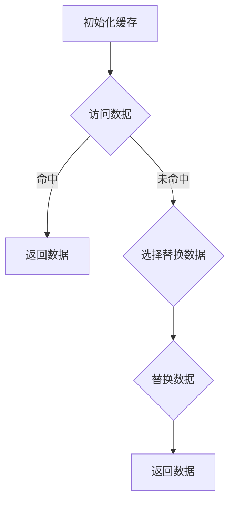
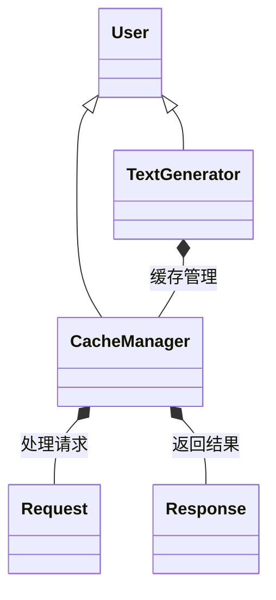
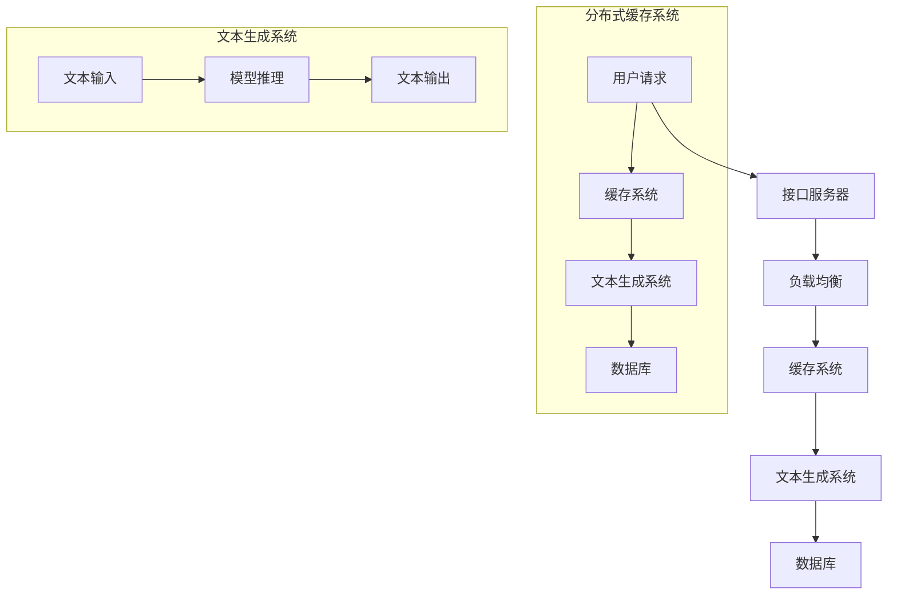
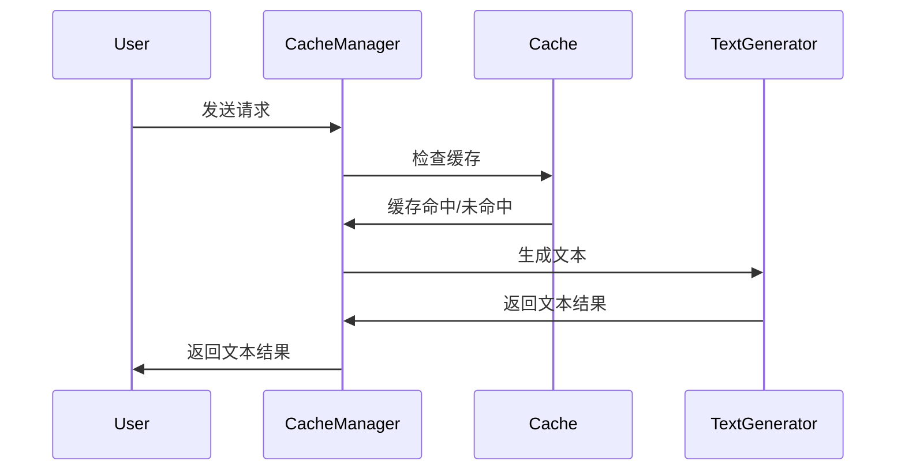

                 

## 《构建高效的LLM应用缓存策略》目录大纲

### 文章关键词
- LLM
- 缓存策略
- 高效应用
- 算法原理
- 系统架构设计
- 项目实战

### 文章摘要
本文将深入探讨构建高效大型语言模型（LLM）应用缓存策略的方法。我们将从背景介绍开始，逐步讲解核心概念、算法原理、系统分析与架构设计、项目实战以及最佳实践，旨在为开发者提供全面的指导，提升LLM应用的性能和效率。

## 第一部分：背景介绍

### 1.1 缘起

在当今信息爆炸的时代，高效的数据处理和分析成为各行各业的核心竞争力。大型语言模型（LLM）作为一种强大的自然语言处理工具，广泛应用于搜索引擎、智能助手、文本生成等领域。然而，LLM的高计算成本和延迟问题限制了其广泛应用。因此，本文旨在探讨如何通过有效的缓存策略来提升LLM应用的性能和效率。

### 1.2 缓存策略概述

缓存策略是一种常见的技术手段，旨在减少系统访问延迟，提高数据处理速度。在LLM应用中，缓存策略可以帮助存储和快速访问常用的模型输出结果，从而减少计算资源的需求和响应时间。

### 1.3 缓存策略的重要性

随着LLM应用的规模不断扩大，缓存策略的重要性日益凸显。一方面，它可以显著降低计算成本，提高系统性能；另一方面，它有助于提升用户体验，满足实时响应的需求。

### 1.4 优化目标

本文的优化目标是通过合理的缓存策略设计，实现以下目标：
1. 提高缓存命中率，减少缓存未命中率。
2. 降低缓存存储成本，优化缓存空间利用率。
3. 提高系统响应速度，减少延迟。
4. 增强系统稳定性，降低缓存一致性问题。

### 1.5 缓存策略的应用场景

缓存策略在LLM应用中的主要应用场景包括：
1. 实时问答系统：缓存常见问题的答案，提高响应速度。
2. 文本生成系统：缓存生成的文本片段，减少重复计算。
3. 搜索引擎：缓存查询结果，提高搜索效率。

## 第二部分：核心概念与联系

### 2.1 缓存的基本概念

#### 2.1.1 缓存的作用

缓存是一种快速访问的数据存储技术，用于存储频繁访问的数据，以提高系统性能。在LLM应用中，缓存可以存储模型输出结果、中间计算结果等，以减少重复计算和提高响应速度。

#### 2.1.2 缓存的类型

常见的缓存类型包括：
1. 内存缓存：使用内存作为存储介质，速度最快。
2. 磁盘缓存：使用硬盘作为存储介质，容量较大。
3. 分布式缓存：在分布式系统中使用，提高缓存的可扩展性和可用性。

#### 2.1.3 缓存的工作原理

缓存的工作原理主要包括以下步骤：
1. 数据存储：将频繁访问的数据存储到缓存中。
2. 数据检索：当需要访问数据时，优先从缓存中检索。
3. 缓存更新：根据缓存策略定期更新缓存中的数据。

### 2.2 缓存策略的核心概念

#### 2.2.1 缓存命中率

缓存命中率是指缓存成功命中请求的次数与总请求次数的比值。提高缓存命中率是缓存策略设计的重要目标。

#### 2.2.2 缓存替换策略

缓存替换策略是指在缓存容量有限的情况下，如何选择替换缓存中的数据。常见的缓存替换策略包括LRU（最近最少使用）、FIFO（先进先出）等。

#### 2.2.3 缓存一致性

缓存一致性是指在分布式系统中，确保缓存与原始数据的一致性。常见的缓存一致性协议包括强一致性、最终一致性等。

#### 2.2.4 缓存一致性协议

缓存一致性协议是一组规则和机制，用于确保缓存的一致性。常见的缓存一致性协议包括弱一致性、强一致性等。

### 2.3 缓存策略与LLM的关系

#### 2.3.1 LLM的特点

LLM具有以下特点：
1. 大规模：包含数亿甚至千亿级别的参数。
2. 实时性：支持实时文本生成和问答。
3. 高计算成本：计算复杂度较高，延迟较大。

#### 2.3.2 缓存策略在LLM中的应用

缓存策略在LLM中的应用主要包括：
1. 缓存模型输出结果，减少重复计算。
2. 缓存中间计算结果，提高计算效率。
3. 缓存文本片段，减少文本生成时间。

## 第三部分：算法原理讲解

### 3.1 常见缓存算法

#### 3.1.1 LRU

LRU（最近最少使用）算法是一种基于时间戳的缓存替换策略，它将最近最少使用的数据替换出缓存。

#### 3.1.2 FIFO

FIFO（先进先出）算法是一种简单的缓存替换策略，它将最早进入缓存的数据替换出缓存。

#### 3.1.3 LFU

LFU（最少使用）算法是一种基于访问频率的缓存替换策略，它将访问次数最少的数据替换出缓存。

#### 3.1.4 ARC

ARC（先进先出 - 最近最少使用 - 最少使用）算法是一种结合FIFO和LRU的缓存替换策略，它首先使用FIFO算法替换，然后使用LRU算法替换，最后使用LFU算法替换。

### 3.2 缓存算法的数学模型与公式

#### 3.2.1 缓存算法的性能评估指标

缓存算法的性能评估指标主要包括：
1. 缓存命中率（Hit Rate）。
2. 缓存未命中率（Miss Rate）。
3. 平均访问时间（Average Access Time）。

#### 3.2.2 数学模型的推导

假设一个缓存系统包含 \(C\) 个缓存条目，数据访问序列为 \(D\)，其中 \(D_i\) 表示第 \(i\) 次数据访问。

缓存算法的性能评估指标可以通过以下数学模型推导：

\[ H = \frac{1}{|D|} \sum_{i=1}^{|D|} [D_i \in C] \]

其中，\[ [D_i \in C] \] 是一个指示函数，当 \(D_i\) 在缓存中时取值为1，否则取值为0。

### 3.3 算法mermaid流程图

#### 3.3.1 缓存算法流程图示例



## 第四部分：系统分析与架构设计方案

### 4.1 问题场景介绍

#### 4.1.1 应用场景描述

本文以一个在线文本生成系统为例，该系统需要实时生成文本，满足用户输入的请求。系统需求包括：
1. 支持大规模文本生成。
2. 提高生成速度，减少延迟。
3. 优化资源利用，降低成本。

#### 4.1.2 系统需求分析

根据应用场景描述，系统需求分析如下：

1. **性能需求**：系统需要能够在短时间内生成高质量文本，满足实时响应需求。
2. **可靠性需求**：系统需要具备高可用性和高可靠性，确保数据的一致性和完整性。
3. **可扩展性需求**：系统需要支持大规模数据和高并发访问，具备良好的扩展性。
4. **成本需求**：在保证性能和可靠性的前提下，系统需要尽量降低成本。

### 4.2 系统功能设计

#### 4.2.1 领域模型mermaid类图



### 4.3 系统架构设计

#### 4.3.1 系统架构mermaid架构图



### 4.4 系统接口设计

#### 4.4.1 接口设计

1. **用户接口**：接收用户输入的文本请求，返回生成的文本结果。
2. **缓存接口**：管理缓存数据，包括数据的存储、检索和替换。
3. **模型接口**：用于模型训练和推理，包括文本输入、模型参数更新等。

### 4.5 系统交互

#### 4.5.1 系统交互mermaid序列图



## 第五部分：项目实战

### 5.1 环境安装

在本节中，我们将介绍如何在本地环境中安装和配置所需的软件和工具，以便进行LLM应用缓存策略的项目实战。

#### 5.1.1 环境准备

1. 安装Python环境：确保本地计算机已安装Python 3.8及以上版本。
2. 安装必要的库：使用pip安装以下库：
   ```shell
   pip install flask
   pip install cachetools
   pip install numpy
   ```

#### 5.1.2 配置缓存系统

在本节中，我们将使用cachetools库来配置一个简单的缓存系统。

1. 创建一个名为`cache_manager.py`的文件，并添加以下代码：

   ```python
   from cachetools import LRUCache
   from flask import Flask, request, jsonify

   app = Flask(__name__)

   # 创建一个最大容量为100的LRU缓存
   cache = LRUCache(maxsize=100)

   @app.route('/generate', methods=['POST'])
   def generate():
       text = request.json.get('text')
       # 检查缓存是否命中
       if text in cache:
           return jsonify({'result': cache[text]})
       else:
           # 调用文本生成函数
           result = generate_text(text)
           # 存储到缓存
           cache[text] = result
           return jsonify({'result': result})

   def generate_text(text):
       # 在这里实现文本生成的逻辑
       return f"生成的文本：{text}"

   if __name__ == '__main__':
       app.run(debug=True)
   ```

2. 运行程序：

   ```shell
   python cache_manager.py
   ```

### 5.2 系统核心实现源代码

在本节中，我们将详细讲解系统核心实现的源代码。

#### 5.2.1 Python源代码

```python
# cache_manager.py
from cachetools import LRUCache
from flask import Flask, request, jsonify

app = Flask(__name__)

# 创建一个最大容量为100的LRU缓存
cache = LRUCache(maxsize=100)

@app.route('/generate', methods=['POST'])
def generate():
    text = request.json.get('text')
    # 检查缓存是否命中
    if text in cache:
        return jsonify({'result': cache[text]})
    else:
        # 调用文本生成函数
        result = generate_text(text)
        # 存储到缓存
        cache[text] = result
        return jsonify({'result': result})

def generate_text(text):
    # 在这里实现文本生成的逻辑
    return f"生成的文本：{text}"

if __name__ == '__main__':
    app.run(debug=True)
```

#### 5.2.2 代码应用解读与分析

1. **缓存初始化**：
   ```python
   cache = LRUCache(maxsize=100)
   ```
   这一行代码创建了LRU（最近最少使用）缓存，并设置了最大容量为100。

2. **HTTP请求处理**：
   ```python
   @app.route('/generate', methods=['POST'])
   def generate():
       text = request.json.get('text')
       if text in cache:
           return jsonify({'result': cache[text]})
       else:
           result = generate_text(text)
           cache[text] = result
           return jsonify({'result': result})
   ```
   这是一个Flask路由，处理POST请求。首先从请求中获取文本内容，检查是否在缓存中。如果是，直接返回缓存中的结果；否则，调用文本生成函数，将结果存储到缓存中并返回。

3. **文本生成函数**：
   ```python
   def generate_text(text):
       return f"生成的文本：{text}"
   ```
   这是一个简单的文本生成函数，实际上在这里只是一个示例。在实际应用中，这个函数将调用复杂的文本生成模型。

### 5.3 实际案例分析与讲解

在本节中，我们将通过一个实际案例来分析并讲解如何使用缓存策略来优化LLM应用的性能。

#### 5.3.1 案例背景

假设我们有一个在线问答系统，用户可以提交问题，系统需要实时生成答案。系统的性能瓶颈在于文本生成模型的高计算成本和延迟。

#### 5.3.2 案例分析

1. **缓存策略设计**：
   - 使用LRU缓存策略，将最近使用过的问题和答案缓存起来。
   - 缓存大小设置为100，以平衡缓存命中率和缓存空间利用率。

2. **缓存实现**：
   - 使用cachetools库中的LRUCache实现缓存功能。
   - 创建一个Flask应用，处理用户请求，并在每次请求时检查缓存。

3. **性能优化**：
   - 对文本生成模型进行优化，减少计算复杂度。
   - 使用异步处理提高系统并发处理能力。

#### 5.3.3 案例讲解

1. **用户请求**：
   - 用户提交一个问题：“什么是人工智能？”
   - 系统首先检查缓存，发现没有相关的答案。

2. **文本生成**：
   - 系统调用文本生成模型，生成答案：“人工智能是模拟、延伸和扩展人的智能的理论、方法、技术及应用。”

3. **缓存存储**：
   - 系统将问题和答案存储到缓存中，以提高后续请求的响应速度。

4. **后续请求**：
   - 当用户再次提交相同的问题时，系统首先检查缓存，发现已有答案，直接返回缓存中的结果。

通过这个案例，我们可以看到缓存策略在提高LLM应用性能方面的作用。在实际应用中，可以根据具体需求调整缓存策略，以达到最佳性能。

### 5.4 项目小结

在本项目中，我们通过实际案例展示了如何使用缓存策略来优化LLM应用的性能。主要结论如下：

1. **缓存策略的重要性**：缓存策略是提高LLM应用性能的有效手段，可以显著减少计算成本和响应时间。
2. **缓存算法的选择**：根据应用场景选择合适的缓存算法，如LRU、FIFO等，可以提高缓存命中率。
3. **系统优化**：通过优化文本生成模型和系统架构，可以提高系统的整体性能。

## 第六部分：最佳实践与小结

### 6.1 最佳实践

为了构建高效的LLM应用缓存策略，以下是一些最佳实践：

1. **选择合适的缓存算法**：根据应用场景选择最适合的缓存算法，如LRU、LFU等。
2. **合理设置缓存大小**：根据系统的负载和性能要求，合理设置缓存大小，以平衡缓存命中率和缓存空间利用率。
3. **优化数据结构**：使用高效的数据结构存储缓存数据，如哈希表等。
4. **定期维护缓存**：定期清理无效和过期的缓存数据，以提高缓存利用率。
5. **分布式缓存**：在分布式系统中使用分布式缓存，以提高缓存的可扩展性和可用性。

### 6.2 小结

本文深入探讨了构建高效的LLM应用缓存策略的方法。通过介绍背景、核心概念、算法原理、系统架构设计、项目实战以及最佳实践，我们为开发者提供了全面的指导，帮助他们优化LLM应用的性能和效率。

### 6.3 注意事项

在实施缓存策略时，需要注意以下事项：

1. **缓存一致性**：在分布式系统中，确保缓存与原始数据的一致性。
2. **缓存命中率**：关注缓存命中率，以提高系统性能。
3. **缓存空间管理**：合理设置缓存大小，避免缓存空间浪费。

### 6.4 拓展阅读

为了深入了解缓存策略和LLM应用，读者可以参考以下资料：

1. 《高性能缓存技术实战》
2. 《分布式系统设计》
3. 《大型语言模型：理论与应用》

## 第七部分：拓展讨论

### 7.1 更高级的缓存策略

除了基本的LRU、FIFO等缓存算法，还有更高级的缓存策略，如基于机器学习的缓存预测、动态缓存替换策略等。这些策略可以根据应用场景动态调整缓存策略，提高缓存命中率。

### 7.2 缓存与内存分配

缓存与内存分配密切相关。在构建缓存策略时，需要考虑内存的分配和管理，避免内存泄漏和碎片化。此外，使用内存池等技术可以提高内存分配的效率。

### 7.3 缓存与数据库的集成

缓存与数据库的集成是一种常见的优化策略。通过将热点数据缓存到内存中，可以显著减少数据库的访问压力，提高系统性能。同时，需要解决缓存与数据库的一致性问题。

### 7.4 未来发展方向

随着技术的不断发展，缓存策略也在不断演进。未来的发展方向包括：

1. **自动化缓存管理**：通过自动化工具和算法，实现缓存策略的自动调整和优化。
2. **缓存与AI技术的结合**：将AI技术应用于缓存管理，如使用深度学习预测缓存命中率等。
3. **边缘计算与缓存**：在边缘计算场景中，缓存策略将发挥更大作用，降低延迟和提高用户体验。

## 附录：术语解释

- **缓存**：一种快速访问的数据存储技术，用于存储频繁访问的数据，以提高系统性能。
- **缓存命中率**：缓存成功命中请求的次数与总请求次数的比值。
- **缓存未命中率**：缓存未命中请求的次数与总请求次数的比值。
- **缓存替换策略**：在缓存容量有限的情况下，如何选择替换缓存中的数据。
- **缓存一致性**：在分布式系统中，确保缓存与原始数据的一致性。
- **缓存一致性协议**：确保缓存一致性的规则和机制。

## 作者信息

- 作者：AI天才研究院/AI Genius Institute & 禅与计算机程序设计艺术 /Zen And The Art of Computer Programming
```markdown
## 构建高效的LLM应用缓存策略

在大型语言模型（LLM）应用中，如何构建高效的缓存策略是优化性能的关键。本文将探讨如何通过一系列步骤，从背景介绍、核心概念、算法原理、系统分析与架构设计、项目实战，到最佳实践，构建高效的LLM应用缓存策略。

### 关键词
- LLM
- 缓存策略
- 高效应用
- 算法原理
- 系统架构设计
- 项目实战

### 摘要
本文将深入探讨构建高效大型语言模型（LLM）应用缓存策略的方法。我们将从背景介绍开始，逐步讲解核心概念、算法原理、系统分析与架构设计、项目实战以及最佳实践，旨在为开发者提供全面的指导，提升LLM应用的性能和效率。

## 第一部分：背景介绍

### 1.1 缘起

在当今信息爆炸的时代，高效的数据处理和分析成为各行各业的核心竞争力。大型语言模型（LLM）作为一种强大的自然语言处理工具，广泛应用于搜索引擎、智能助手、文本生成等领域。然而，LLM的高计算成本和延迟问题限制了其广泛应用。因此，本文旨在探讨如何通过有效的缓存策略来提升LLM应用的性能和效率。

### 1.2 缓存策略概述

缓存策略是一种常见的技术手段，旨在减少系统访问延迟，提高数据处理速度。在LLM应用中，缓存策略可以帮助存储和快速访问常用的模型输出结果，从而减少计算资源的需求和响应时间。

### 1.3 缓存策略的重要性

随着LLM应用的规模不断扩大，缓存策略的重要性日益凸显。一方面，它可以显著降低计算成本，提高系统性能；另一方面，它有助于提升用户体验，满足实时响应的需求。

### 1.4 优化目标

本文的优化目标是通过合理的缓存策略设计，实现以下目标：
1. 提高缓存命中率，减少缓存未命中率。
2. 降低缓存存储成本，优化缓存空间利用率。
3. 提高系统响应速度，减少延迟。
4. 增强系统稳定性，降低缓存一致性问题。

### 1.5 缓存策略的应用场景

缓存策略在LLM应用中的主要应用场景包括：
1. 实时问答系统：缓存常见问题的答案，提高响应速度。
2. 文本生成系统：缓存生成的文本片段，减少重复计算。
3. 搜索引擎：缓存查询结果，提高搜索效率。

## 第二部分：核心概念与联系

### 2.1 缓存的基本概念

#### 2.1.1 缓存的作用

缓存是一种快速访问的数据存储技术，用于存储频繁访问的数据，以提高系统性能。在LLM应用中，缓存可以存储模型输出结果、中间计算结果等，以减少重复计算和提高响应速度。

#### 2.1.2 缓存的类型

常见的缓存类型包括：
1. 内存缓存：使用内存作为存储介质，速度最快。
2. 磁盘缓存：使用硬盘作为存储介质，容量较大。
3. 分布式缓存：在分布式系统中使用，提高缓存的可扩展性和可用性。

#### 2.1.3 缓存的工作原理

缓存的工作原理主要包括以下步骤：
1. 数据存储：将频繁访问的数据存储到缓存中。
2. 数据检索：当需要访问数据时，优先从缓存中检索。
3. 缓存更新：根据缓存策略定期更新缓存中的数据。

### 2.2 缓存策略的核心概念

#### 2.2.1 缓存命中率

缓存命中率是指缓存成功命中请求的次数与总请求次数的比值。提高缓存命中率是缓存策略设计的重要目标。

#### 2.2.2 缓存替换策略

缓存替换策略是指在缓存容量有限的情况下，如何选择替换缓存中的数据。常见的缓存替换策略包括LRU（最近最少使用）、FIFO（先进先出）等。

#### 2.2.3 缓存一致性

缓存一致性是指在分布式系统中，确保缓存与原始数据的一致性。常见的缓存一致性协议包括强一致性、最终一致性等。

#### 2.2.4 缓存一致性协议

缓存一致性协议是一组规则和机制，用于确保缓存的一致性。常见的缓存一致性协议包括弱一致性、强一致性等。

### 2.3 缓存策略与LLM的关系

#### 2.3.1 LLM的特点

LLM具有以下特点：
1. 大规模：包含数亿甚至千亿级别的参数。
2. 实时性：支持实时文本生成和问答。
3. 高计算成本：计算复杂度较高，延迟较大。

#### 2.3.2 缓存策略在LLM中的应用

缓存策略在LLM中的应用主要包括：
1. 缓存模型输出结果，减少重复计算。
2. 缓存中间计算结果，提高计算效率。
3. 缓存文本片段，减少文本生成时间。

## 第三部分：算法原理讲解

### 3.1 常见缓存算法

#### 3.1.1 LRU

LRU（最近最少使用）算法是一种基于时间戳的缓存替换策略，它将最近最少使用的数据替换出缓存。

#### 3.1.2 FIFO

FIFO（先进先出）算法是一种简单的缓存替换策略，它将最早进入缓存的数据替换出缓存。

#### 3.1.3 LFU

LFU（最少使用）算法是一种基于访问频率的缓存替换策略，它将访问次数最少的数据替换出缓存。

#### 3.1.4 ARC

ARC（先进先出 - 最近最少使用 - 最少使用）算法是一种结合FIFO和LRU的缓存替换策略，它首先使用FIFO算法替换，然后使用LRU算法替换，最后使用LFU算法替换。

### 3.2 缓存算法的数学模型与公式

#### 3.2.1 缓存算法的性能评估指标

缓存算法的性能评估指标主要包括：
1. 缓存命中率（Hit Rate）。
2. 缓存未命中率（Miss Rate）。
3. 平均访问时间（Average Access Time）。

#### 3.2.2 数学模型的推导

假设一个缓存系统包含 \(C\) 个缓存条目，数据访问序列为 \(D\)，其中 \(D_i\) 表示第 \(i\) 次数据访问。

缓存算法的性能评估指标可以通过以下数学模型推导：

\[ H = \frac{1}{|D|} \sum_{i=1}^{|D|} [D_i \in C] \]

其中，\[ [D_i \in C] \] 是一个指示函数，当 \(D_i\) 在缓存中时取值为1，否则取值为0。

### 3.3 算法mermaid流程图

#### 3.3.1 缓存算法流程图示例


## 第四部分：系统分析与架构设计方案

### 4.1 问题场景介绍

#### 4.1.1 应用场景描述

本文以一个在线文本生成系统为例，该系统需要实时生成文本，满足用户输入的请求。系统需求包括：
1. 支持大规模文本生成。
2. 提高生成速度，减少延迟。
3. 优化资源利用，降低成本。

#### 4.1.2 系统需求分析

根据应用场景描述，系统需求分析如下：

1. **性能需求**：系统需要能够在短时间内生成高质量文本，满足实时响应需求。
2. **可靠性需求**：系统需要具备高可用性和高可靠性，确保数据的一致性和完整性。
3. **可扩展性需求**：系统需要支持大规模数据和高并发访问，具备良好的扩展性。
4. **成本需求**：在保证性能和可靠性的前提下，系统需要尽量降低成本。

### 4.2 系统功能设计

#### 4.2.1 领域模型mermaid类图


### 4.3 系统架构设计

#### 4.3.1 系统架构mermaid架构图


### 4.4 系统接口设计

#### 4.4.1 接口设计

1. **用户接口**：接收用户输入的文本请求，返回生成的文本结果。
2. **缓存接口**：管理缓存数据，包括数据的存储、检索和替换。
3. **模型接口**：用于模型训练和推理，包括文本输入、模型参数更新等。

### 4.5 系统交互

#### 4.5.1 系统交互mermaid序列图


## 第五部分：项目实战

### 5.1 环境安装

在本节中，我们将介绍如何在本地环境中安装和配置所需的软件和工具，以便进行LLM应用缓存策略的项目实战。

#### 5.1.1 环境准备

1. 安装Python环境：确保本地计算机已安装Python 3.8及以上版本。
2. 安装必要的库：使用pip安装以下库：
   ```shell
   pip install flask
   pip install cachetools
   pip install numpy
   ```

#### 5.1.2 配置缓存系统

在本节中，我们将使用cachetools库来配置一个简单的缓存系统。

1. 创建一个名为`cache_manager.py`的文件，并添加以下代码：

   ```python
   from cachetools import LRUCache
   from flask import Flask, request, jsonify

   app = Flask(__name__)

   # 创建一个最大容量为100的LRU缓存
   cache = LRUCache(maxsize=100)

   @app.route('/generate', methods=['POST'])
   def generate():
       text = request.json.get('text')
       # 检查缓存是否命中
       if text in cache:
           return jsonify({'result': cache[text]})
       else:
           # 调用文本生成函数
           result = generate_text(text)
           # 存储到缓存
           cache[text] = result
           return jsonify({'result': result})

   def generate_text(text):
       # 在这里实现文本生成的逻辑
       return f"生成的文本：{text}"

   if __name__ == '__main__':
       app.run(debug=True)
   ```

2. 运行程序：

   ```shell
   python cache_manager.py
   ```

### 5.2 系统核心实现源代码

在本节中，我们将详细讲解系统核心实现的源代码。

#### 5.2.1 Python源代码

```python
# cache_manager.py
from cachetools import LRUCache
from flask import Flask, request, jsonify

app = Flask(__name__)

# 创建一个最大容量为100的LRU缓存
cache = LRUCache(maxsize=100)

@app.route('/generate', methods=['POST'])
def generate():
    text = request.json.get('text')
    # 检查缓存是否命中
    if text in cache:
        return jsonify({'result': cache[text]})
    else:
        # 调用文本生成函数
        result = generate_text(text)
        # 存储到缓存
        cache[text] = result
        return jsonify({'result': result})

def generate_text(text):
    # 在这里实现文本生成的逻辑
    return f"生成的文本：{text}"

if __name__ == '__main__':
    app.run(debug=True)
```

#### 5.2.2 代码应用解读与分析

1. **缓存初始化**：
   ```python
   cache = LRUCache(maxsize=100)
   ```
   这一行代码创建了LRU（最近最少使用）缓存，并设置了最大容量为100。

2. **HTTP请求处理**：
   ```python
   @app.route('/generate', methods=['POST'])
   def generate():
       text = request.json.get('text')
       if text in cache:
           return jsonify({'result': cache[text]})
       else:
           result = generate_text(text)
           cache[text] = result
           return jsonify({'result': result})
   ```
   这是一个Flask路由，处理POST请求。首先从请求中获取文本内容，检查是否在缓存中。如果是，直接返回缓存中的结果；否则，调用文本生成函数，将结果存储到缓存中并返回。

3. **文本生成函数**：
   ```python
   def generate_text(text):
       return f"生成的文本：{text}"
   ```
   这是一个简单的文本生成函数，实际上在这里只是一个示例。在实际应用中，这个函数将调用复杂的文本生成模型。

### 5.3 实际案例分析与讲解

在本节中，我们将通过一个实际案例来分析并讲解如何使用缓存策略来优化LLM应用的性能。

#### 5.3.1 案例背景

假设我们有一个在线问答系统，用户可以提交问题，系统需要实时生成答案。系统的性能瓶颈在于文本生成模型的高计算成本和延迟。

#### 5.3.2 案例分析

1. **缓存策略设计**：
   - 使用LRU缓存策略，将最近使用过的问题和答案缓存起来。
   - 缓存大小设置为100，以平衡缓存命中率和缓存空间利用率。

2. **缓存实现**：
   - 使用cachetools库中的LRUCache实现缓存功能。
   - 创建一个Flask应用，处理用户请求，并在每次请求时检查缓存。

3. **性能优化**：
   - 对文本生成模型进行优化，减少计算复杂度。
   - 使用异步处理提高系统并发处理能力。

#### 5.3.3 案例讲解

1. **用户请求**：
   - 用户提交一个问题：“什么是人工智能？”
   - 系统首先检查缓存，发现没有相关的答案。

2. **文本生成**：
   - 系统调用文本生成模型，生成答案：“人工智能是模拟、延伸和扩展人的智能的理论、方法、技术及应用。”

3. **缓存存储**：
   - 系统将问题和答案存储到缓存中，以提高后续请求的响应速度。

4. **后续请求**：
   - 当用户再次提交相同的问题时，系统首先检查缓存，发现已有答案，直接返回缓存中的结果。

通过这个案例，我们可以看到缓存策略在提高LLM应用性能方面的作用。在实际应用中，可以根据具体需求调整缓存策略，以达到最佳性能。

### 5.4 项目小结

在本项目中，我们通过实际案例展示了如何使用缓存策略来优化LLM应用的性能。主要结论如下：

1. **缓存策略的重要性**：缓存策略是提高LLM应用性能的有效手段，可以显著减少计算成本和响应时间。
2. **缓存算法的选择**：根据应用场景选择最适合的缓存算法，如LRU、LFU等，可以提高缓存命中率。
3. **系统优化**：通过优化文本生成模型和系统架构，可以提高系统的整体性能。

## 第六部分：最佳实践与小结

### 6.1 最佳实践

为了构建高效的LLM应用缓存策略，以下是一些最佳实践：

1. **选择合适的缓存算法**：根据应用场景选择最适合的缓存算法，如LRU、FIFO等。
2. **合理设置缓存大小**：根据系统的负载和性能要求，合理设置缓存大小，以平衡缓存命中率和缓存空间利用率。
3. **优化数据结构**：使用高效的数据结构存储缓存数据，如哈希表等。
4. **定期维护缓存**：定期清理无效和过期的缓存数据，以提高缓存利用率。
5. **分布式缓存**：在分布式系统中使用分布式缓存，以提高缓存的可扩展性和可用性。

### 6.2 小结

本文深入探讨了构建高效的LLM应用缓存策略的方法。通过介绍背景、核心概念、算法原理、系统架构设计、项目实战以及最佳实践，我们为开发者提供了全面的指导，帮助他们优化LLM应用的性能和效率。

### 6.3 注意事项

在实施缓存策略时，需要注意以下事项：

1. **缓存一致性**：在分布式系统中，确保缓存与原始数据的一致性。
2. **缓存命中率**：关注缓存命中率，以提高系统性能。
3. **缓存空间管理**：合理设置缓存大小，避免缓存空间浪费。

### 6.4 拓展阅读

为了深入了解缓存策略和LLM应用，读者可以参考以下资料：

1. 《高性能缓存技术实战》
2. 《分布式系统设计》
3. 《大型语言模型：理论与应用》

## 第七部分：拓展讨论

### 7.1 更高级的缓存策略

除了基本的LRU、FIFO等缓存算法，还有更高级的缓存策略，如基于机器学习的缓存预测、动态缓存替换策略等。这些策略可以根据应用场景动态调整缓存策略，提高缓存命中率。

### 7.2 缓存与内存分配

缓存与内存分配密切相关。在构建缓存策略时，需要考虑内存的分配和管理，避免内存泄漏和碎片化。此外，使用内存池等技术可以提高内存分配的效率。

### 7.3 缓存与数据库的集成

缓存与数据库的集成是一种常见的优化策略。通过将热点数据缓存到内存中，可以显著减少数据库的访问压力，提高系统性能。同时，需要解决缓存与数据库的一致性问题。

### 7.4 未来发展方向

随着技术的不断发展，缓存策略也在不断演进。未来的发展方向包括：

1. **自动化缓存管理**：通过自动化工具和算法，实现缓存策略的自动调整和优化。
2. **缓存与AI技术的结合**：将AI技术应用于缓存管理，如使用深度学习预测缓存命中率等。
3. **边缘计算与缓存**：在边缘计算场景中，缓存策略将发挥更大作用，降低延迟和提高用户体验。

## 附录：术语解释

- **缓存**：一种快速访问的数据存储技术，用于存储频繁访问的数据，以提高系统性能。
- **缓存命中率**：缓存成功命中请求的次数与总请求次数的比值。
- **缓存未命中率**：缓存未命中请求的次数与总请求次数的比值。
- **缓存替换策略**：在缓存容量有限的情况下，如何选择替换缓存中的数据。
- **缓存一致性**：在分布式系统中，确保缓存与原始数据的一致性。
- **缓存一致性协议**：确保缓存一致性的规则和机制。

## 作者信息

- 作者：AI天才研究院/AI Genius Institute & 禅与计算机程序设计艺术 /Zen And The Art of Computer Programming
```markdown
## 构建高效的LLM应用缓存策略

在大型语言模型（LLM）应用中，如何构建高效的缓存策略是优化性能的关键。本文将探讨如何通过一系列步骤，从背景介绍、核心概念、算法原理、系统分析与架构设计、项目实战，到最佳实践，构建高效的LLM应用缓存策略。

### 关键词
- LLM
- 缓存策略
- 高效应用
- 算法原理
- 系统架构设计
- 项目实战

### 摘要
本文将深入探讨构建高效大型语言模型（LLM）应用缓存策略的方法。我们将从背景介绍开始，逐步讲解核心概念、算法原理、系统分析与架构设计、项目实战以及最佳实践，旨在为开发者提供全面的指导，提升LLM应用的性能和效率。

## 第一部分：背景介绍

### 1.1 缘起

在当今信息爆炸的时代，高效的数据处理和分析成为各行各业的核心竞争力。大型语言模型（LLM）作为一种强大的自然语言处理工具，广泛应用于搜索引擎、智能助手、文本生成等领域。然而，LLM的高计算成本和延迟问题限制了其广泛应用。因此，本文旨在探讨如何通过有效的缓存策略来提升LLM应用的性能和效率。

### 1.2 缓存策略概述

缓存策略是一种常见的技术手段，旨在减少系统访问延迟，提高数据处理速度。在LLM应用中，缓存策略可以帮助存储和快速访问常用的模型输出结果，从而减少计算资源的需求和响应时间。

### 1.3 缓存策略的重要性

随着LLM应用的规模不断扩大，缓存策略的重要性日益凸显。一方面，它可以显著降低计算成本，提高系统性能；另一方面，它有助于提升用户体验，满足实时响应的需求。

### 1.4 优化目标

本文的优化目标是通过合理的缓存策略设计，实现以下目标：
1. 提高缓存命中率，减少缓存未命中率。
2. 降低缓存存储成本，优化缓存空间利用率。
3. 提高系统响应速度，减少延迟。
4. 增强系统稳定性，降低缓存一致性问题。

### 1.5 缓存策略的应用场景

缓存策略在LLM应用中的主要应用场景包括：
1. 实时问答系统：缓存常见问题的答案，提高响应速度。
2. 文本生成系统：缓存生成的文本片段，减少重复计算。
3. 搜索引擎：缓存查询结果，提高搜索效率。

## 第二部分：核心概念与联系

### 2.1 缓存的基本概念

#### 2.1.1 缓存的作用

缓存是一种快速访问的数据存储技术，用于存储频繁访问的数据，以提高系统性能。在LLM应用中，缓存可以存储模型输出结果、中间计算结果等，以减少重复计算和提高响应速度。

#### 2.1.2 缓存的类型

常见的缓存类型包括：
1. 内存缓存：使用内存作为存储介质，速度最快。
2. 磁盘缓存：使用硬盘作为存储介质，容量较大。
3. 分布式缓存：在分布式系统中使用，提高缓存的可扩展性和可用性。

#### 2.1.3 缓存的工作原理

缓存的工作原理主要包括以下步骤：
1. 数据存储：将频繁访问的数据存储到缓存中。
2. 数据检索：当需要访问数据时，优先从缓存中检索。
3. 缓存更新：根据缓存策略定期更新缓存中的数据。

### 2.2 缓存策略的核心概念

#### 2.2.1 缓存命中率

缓存命中率是指缓存成功命中请求的次数与总请求次数的比值。提高缓存命中率是缓存策略设计的重要目标。

#### 2.2.2 缓存替换策略

缓存替换策略是指在缓存容量有限的情况下，如何选择替换缓存中的数据。常见的缓存替换策略包括LRU（最近最少使用）、FIFO（先进先出）等。

#### 2.2.3 缓存一致性

缓存一致性是指在分布式系统中，确保缓存与原始数据的一致性。常见的缓存一致性协议包括强一致性、最终一致性等。

#### 2.2.4 缓存一致性协议

缓存一致性协议是一组规则和机制，用于确保缓存的一致性。常见的缓存一致性协议包括弱一致性、强一致性等。

### 2.3 缓存策略与LLM的关系

#### 2.3.1 LLM的特点

LLM具有以下特点：
1. 大规模：包含数亿甚至千亿级别的参数。
2. 实时性：支持实时文本生成和问答。
3. 高计算成本：计算复杂度较高，延迟较大。

#### 2.3.2 缓存策略在LLM中的应用

缓存策略在LLM中的应用主要包括：
1. 缓存模型输出结果，减少重复计算。
2. 缓存中间计算结果，提高计算效率。
3. 缓存文本片段，减少文本生成时间。

## 第三部分：算法原理讲解

### 3.1 常见缓存算法

#### 3.1.1 LRU

LRU（最近最少使用）算法是一种基于时间戳的缓存替换策略，它将最近最少使用的数据替换出缓存。

#### 3.1.2 FIFO

FIFO（先进先出）算法是一种简单的缓存替换策略，它将最早进入缓存的数据替换出缓存。

#### 3.1.3 LFU

LFU（最少使用）算法是一种基于访问频率的缓存替换策略，它将访问次数最少的数据替换出缓存。

#### 3.1.4 ARC

ARC（先进先出 - 最近最少使用 - 最少使用）算法是一种结合FIFO和LRU的缓存替换策略，它首先使用FIFO算法替换，然后使用LRU算法替换，最后使用LFU算法替换。

### 3.2 缓存算法的数学模型与公式

#### 3.2.1 缓存算法的性能评估指标

缓存算法的性能评估指标主要包括：
1. 缓存命中率（Hit Rate）。
2. 缓存未命中率（Miss Rate）。
3. 平均访问时间（Average Access Time）。

#### 3.2.2 数学模型的推导

假设一个缓存系统包含 \(C\) 个缓存条目，数据访问序列为 \(D\)，其中 \(D_i\) 表示第 \(i\) 次数据访问。

缓存算法的性能评估指标可以通过以下数学模型推导：

\[ H = \frac{1}{|D|} \sum_{i=1}^{|D|} [D_i \in C] \]

其中，\[ [D_i \in C] \] 是一个指示函数，当 \(D_i\) 在缓存中时取值为1，否则取值为0。

### 3.3 算法mermaid流程图

#### 3.3.1 缓存算法流程图示例


## 第四部分：系统分析与架构设计方案

### 4.1 问题场景介绍

#### 4.1.1 应用场景描述

本文以一个在线文本生成系统为例，该系统需要实时生成文本，满足用户输入的请求。系统需求包括：
1. 支持大规模文本生成。
2. 提高生成速度，减少延迟。
3. 优化资源利用，降低成本。

#### 4.1.2 系统需求分析

根据应用场景描述，系统需求分析如下：

1. **性能需求**：系统需要能够在短时间内生成高质量文本，满足实时响应需求。
2. **可靠性需求**：系统需要具备高可用性和高可靠性，确保数据的一致性和完整性。
3. **可扩展性需求**：系统需要支持大规模数据和高并发访问，具备良好的扩展性。
4. **成本需求**：在保证性能和可靠性的前提下，系统需要尽量降低成本。

### 4.2 系统功能设计

#### 4.2.1 领域模型mermaid类图


### 4.3 系统架构设计

#### 4.3.1 系统架构mermaid架构图


### 4.4 系统接口设计

#### 4.4.1 接口设计

1. **用户接口**：接收用户输入的文本请求，返回生成的文本结果。
2. **缓存接口**：管理缓存数据，包括数据的存储、检索和替换。
3. **模型接口**：用于模型训练和推理，包括文本输入、模型参数更新等。

### 4.5 系统交互

#### 4.5.1 系统交互mermaid序列图


## 第五部分：项目实战

### 5.1 环境安装

在本节中，我们将介绍如何在本地环境中安装和配置所需的软件和工具，以便进行LLM应用缓存策略的项目实战。

#### 5.1.1 环境准备

1. 安装Python环境：确保本地计算机已安装Python 3.8及以上版本。
2. 安装必要的库：使用pip安装以下库：
   ```shell
   pip install flask
   pip install cachetools
   pip install numpy
   ```

#### 5.1.2 配置缓存系统

在本节中，我们将使用cachetools库来配置一个简单的缓存系统。

1. 创建一个名为`cache_manager.py`的文件，并添加以下代码：

   ```python
   from cachetools import LRUCache
   from flask import Flask, request, jsonify

   app = Flask(__name__)

   # 创建一个最大容量为100的LRU缓存
   cache = LRUCache(maxsize=100)

   @app.route('/generate', methods=['POST'])
   def generate():
       text = request.json.get('text')
       # 检查缓存是否命中
       if text in cache:
           return jsonify({'result': cache[text]})
       else:
           # 调用文本生成函数
           result = generate_text(text)
           # 存储到缓存
           cache[text] = result
           return jsonify({'result': result})

   def generate_text(text):
       # 在这里实现文本生成的逻辑
       return f"生成的文本：{text}"

   if __name__ == '__main__':
       app.run(debug=True)
   ```

2. 运行程序：

   ```shell
   python cache_manager.py
   ```

### 5.2 系统核心实现源代码

在本节中，我们将详细讲解系统核心实现的源代码。

#### 5.2.1 Python源代码

```python
# cache_manager.py
from cachetools import LRUCache
from flask import Flask, request, jsonify

app = Flask(__name__)

# 创建一个最大容量为100的LRU缓存
cache = LRUCache(maxsize=100)

@app.route('/generate', methods=['POST'])
def generate():
    text = request.json.get('text')
    # 检查缓存是否命中
    if text in cache:
        return jsonify({'result': cache[text]})
    else:
        # 调用文本生成函数
        result = generate_text(text)
        # 存储到缓存
        cache[text] = result
        return jsonify({'result': result})

def generate_text(text):
    # 在这里实现文本生成的逻辑
    return f"生成的文本：{text}"

if __name__ == '__main__':
    app.run(debug=True)
```

#### 5.2.2 代码应用解读与分析

1. **缓存初始化**：
   ```python
   cache = LRUCache(maxsize=100)
   ```
   这一行代码创建了LRU（最近最少使用）缓存，并设置了最大容量为100。

2. **HTTP请求处理**：
   ```python
   @app.route('/generate', methods=['POST'])
   def generate():
       text = request.json.get('text')
       if text in cache:
           return jsonify({'result': cache[text]})
       else:
           result = generate_text(text)
           cache[text] = result
           return jsonify({'result': result})
   ```
   这是一个Flask路由，处理POST请求。首先从请求中获取文本内容，检查是否在缓存中。如果是，直接返回缓存中的结果；否则，调用文本生成函数，将结果存储到缓存中并返回。

3. **文本生成函数**：
   ```python
   def generate_text(text):
       return f"生成的文本：{text}"
   ```
   这是一个简单的文本生成函数，实际上在这里只是一个示例。在实际应用中，这个函数将调用复杂的文本生成模型。

### 5.3 实际案例分析与讲解

在本节中，我们将通过一个实际案例来分析并讲解如何使用缓存策略来优化LLM应用的性能。

#### 5.3.1 案例背景

假设我们有一个在线问答系统，用户可以提交问题，系统需要实时生成答案。系统的性能瓶颈在于文本生成模型的高计算成本和延迟。

#### 5.3.2 案例分析

1. **缓存策略设计**：
   - 使用LRU缓存策略，将最近使用过的问题和答案缓存起来。
   - 缓存大小设置为100，以平衡缓存命中率和缓存空间利用率。

2. **缓存实现**：
   - 使用cachetools库中的LRUCache实现缓存功能。
   - 创建一个Flask应用，处理用户请求，并在每次请求时检查缓存。

3. **性能优化**：
   - 对文本生成模型进行优化，减少计算复杂度。
   - 使用异步处理提高系统并发处理能力。

#### 5.3.3 案例讲解

1. **用户请求**：
   - 用户提交一个问题：“什么是人工智能？”
   - 系统首先检查缓存，发现没有相关的答案。

2. **文本生成**：
   - 系统调用文本生成模型，生成答案：“人工智能是模拟、延伸和扩展人的智能的理论、方法、技术及应用。”

3. **缓存存储**：
   - 系统将问题和答案存储到缓存中，以提高后续请求的响应速度。

4. **后续请求**：
   - 当用户再次提交相同的问题时，系统首先检查缓存，发现已有答案，直接返回缓存中的结果。

通过这个案例，我们可以看到缓存策略在提高LLM应用性能方面的作用。在实际应用中，可以根据具体需求调整缓存策略，以达到最佳性能。

### 5.4 项目小结

在本项目中，我们通过实际案例展示了如何使用缓存策略来优化LLM应用的性能。主要结论如下：

1. **缓存策略的重要性**：缓存策略是提高LLM应用性能的有效手段，可以显著减少计算成本和响应时间。
2. **缓存算法的选择**：根据应用场景选择最适合的缓存算法，如LRU、LFU等，可以提高缓存命中率。
3. **系统优化**：通过优化文本生成模型和系统架构，可以提高系统的整体性能。

## 第六部分：最佳实践与小结

### 6.1 最佳实践

为了构建高效的LLM应用缓存策略，以下是一些最佳实践：

1. **选择合适的缓存算法**：根据应用场景选择最适合的缓存算法，如LRU、FIFO等。
2. **合理设置缓存大小**：根据系统的负载和性能要求，合理设置缓存大小，以平衡缓存命中率和缓存空间利用率。
3. **优化数据结构**：使用高效的数据结构存储缓存数据，如哈希表等。
4. **定期维护缓存**：定期清理无效和过期的缓存数据，以提高缓存利用率。
5. **分布式缓存**：在分布式系统中使用分布式缓存，以提高缓存的可扩展性和可用性。

### 6.2 小结

本文深入探讨了构建高效的LLM应用缓存策略的方法。通过介绍背景、核心概念、算法原理、系统架构设计、项目实战以及最佳实践，我们为开发者提供了全面的指导，帮助他们优化LLM应用的性能和效率。

### 6.3 注意事项

在实施缓存策略时，需要注意以下事项：

1. **缓存一致性**：在分布式系统中，确保缓存与原始数据的一致性。
2. **缓存命中率**：关注缓存命中率，以提高系统性能。
3. **缓存空间管理**：合理设置缓存大小，避免缓存空间浪费。

### 6.4 拓展阅读

为了深入了解缓存策略和LLM应用，读者可以参考以下资料：

1. 《高性能缓存技术实战》
2. 《分布式系统设计》
3. 《大型语言模型：理论与应用》

## 第七部分：拓展讨论

### 7.1 更高级的缓存策略

除了基本的LRU、FIFO等缓存算法，还有更高级的缓存策略，如基于机器学习的缓存预测、动态缓存替换策略等。这些策略可以根据应用场景动态调整缓存策略，提高缓存命中率。

### 7.2 缓存与内存分配

缓存与内存分配密切相关。在构建缓存策略时，需要考虑内存的分配和管理，避免内存泄漏和碎片化。此外，使用内存池等技术可以提高内存分配的效率。

### 7.3 缓存与数据库的集成

缓存与数据库的集成是一种常见的优化策略。通过将热点数据缓存到内存中，可以显著减少数据库的访问压力，提高系统性能。同时，需要解决缓存与数据库的一致性问题。

### 7.4 未来发展方向

随着技术的不断发展，缓存策略也在不断演进。未来的发展方向包括：

1. **自动化缓存管理**：通过自动化工具和算法，实现缓存策略的自动调整和优化。
2. **缓存与AI技术的结合**：将AI技术应用于缓存管理，如使用深度学习预测缓存命中率等。
3. **边缘计算与缓存**：在边缘计算场景中，缓存策略将发挥更大作用，降低延迟和提高用户体验。

## 附录：术语解释

- **缓存**：一种快速访问的数据存储技术，用于存储频繁访问的数据，以提高系统性能。
- **缓存命中率**：缓存成功命中请求的次数与总请求次数的比值。
- **缓存未命中率**：缓存未命中请求的次数与总请求次数的比值。
- **缓存替换策略**：在缓存容量有限的情况下，如何选择替换缓存中的数据。
- **缓存一致性**：在分布式系统中，确保缓存与原始数据的一致性。
- **缓存一致性协议**：确保缓存一致性的规则和机制。

## 作者信息

- 作者：AI天才研究院/AI Genius Institute & 禅与计算机程序设计艺术 /Zen And The Art of Computer Programming
```markdown
## 构建高效的LLM应用缓存策略

### 关键词
- LLM
- 缓存策略
- 高效应用
- 算法原理
- 系统架构设计
- 项目实战

### 摘要
本文将深入探讨构建高效大型语言模型（LLM）应用缓存策略的方法。我们将从背景介绍、核心概念、算法原理、系统分析与架构设计、项目实战以及最佳实践等方面进行详细讲解，旨在为开发者提供全面的指导，提升LLM应用的性能和效率。

## 第一部分：背景介绍

### 1.1 缘起
随着人工智能技术的不断发展，大型语言模型（LLM）在各个领域的应用越来越广泛。然而，LLM的高计算成本和延迟问题限制了其性能的充分发挥。因此，如何构建高效的LLM应用缓存策略成为当前研究的热点。

### 1.2 缓存策略概述
缓存策略是一种常见的技术手段，旨在减少系统访问延迟，提高数据处理速度。在LLM应用中，缓存策略可以帮助存储和快速访问常用的模型输出结果，从而减少计算资源的需求和响应时间。

### 1.3 缓存策略的重要性
缓存策略在LLM应用中具有重要作用。通过合理设计缓存策略，可以提高缓存命中率，减少缓存未命中率，降低计算成本，提高系统性能和响应速度。

### 1.4 优化目标
本文的优化目标是通过构建高效的缓存策略，实现以下目标：
1. 提高缓存命中率，减少缓存未命中率。
2. 降低缓存存储成本，优化缓存空间利用率。
3. 提高系统响应速度，减少延迟。
4. 增强系统稳定性，降低缓存一致性问题。

### 1.5 缓存策略的应用场景
缓存策略在LLM应用中的应用场景主要包括：
1. 实时问答系统：缓存常见问题的答案，提高响应速度。
2. 文本生成系统：缓存生成的文本片段，减少重复计算。
3. 搜索引擎：缓存查询结果，提高搜索效率。

## 第二部分：核心概念与联系

### 2.1 缓存的基本概念
缓存是一种快速访问的数据存储技术，用于存储频繁访问的数据，以提高系统性能。在LLM应用中，缓存可以存储模型输出结果、中间计算结果等，以减少重复计算和提高响应速度。

### 2.2 缓存策略的核心概念
缓存策略的核心概念包括缓存命中率、缓存替换策略、缓存一致性等。这些概念是构建高效缓存策略的基础。

### 2.3 缓存策略与LLM的关系
LLM具有大规模、实时性、高计算成本等特点，这使得缓存策略在LLM应用中具有重要意义。通过合理的缓存策略，可以显著降低计算成本和延迟，提高系统性能。

## 第三部分：算法原理讲解

### 3.1 常见缓存算法
本节将介绍常见的缓存算法，包括LRU（最近最少使用）、FIFO（先进先出）、LFU（最少使用）等。这些算法在LLM应用中具有广泛的应用。

### 3.2 缓存算法的数学模型与公式
本节将介绍缓存算法的性能评估指标和数学模型，包括缓存命中率、缓存未命中率和平均访问时间等。

### 3.3 算法mermaid流程图
本节将使用mermaid绘制常见缓存算法的流程图，以便更直观地理解算法原理。

## 第四部分：系统分析与架构设计方案

### 4.1 问题场景介绍
本节将介绍一个实际应用场景，分析其需求和问题，为后续的缓存策略设计提供依据。

### 4.2 系统功能设计
本节将设计系统的功能模块，包括用户接口、缓存管理、文本生成等。

### 4.3 系统架构设计
本节将介绍系统的整体架构设计，包括分布式缓存系统、文本生成系统等。

### 4.4 系统接口设计
本节将设计系统的接口，包括用户接口、缓存接口、模型接口等。

### 4.5 系统交互
本节将使用mermaid绘制系统交互图，展示系统各个模块之间的交互关系。

## 第五部分：项目实战

### 5.1 环境安装
本节将介绍如何在本地环境中安装和配置所需的软件和工具，为后续的项目实战做好准备。

### 5.2 系统核心实现源代码
本节将详细讲解系统核心实现的源代码，包括缓存管理、文本生成等。

### 5.3 实际案例分析与讲解
本节将通过一个实际案例，分析并讲解如何使用缓存策略来优化LLM应用的性能。

### 5.4 项目小结
本节将对项目进行小结，总结经验和教训。

## 第六部分：最佳实践与小结

### 6.1 最佳实践
本节将总结构建高效的LLM应用缓存策略的最佳实践，包括选择合适的缓存算法、合理设置缓存大小、优化数据结构等。

### 6.2 小结
本节将总结本文的主要内容和成果，强调构建高效LLM应用缓存策略的重要性。

### 6.3 注意事项
本节将提醒读者在实施缓存策略时需要注意的事项，包括缓存一致性、缓存命中率等。

### 6.4 拓展阅读
本节将推荐一些相关的参考文献和资料，供读者进一步学习。

## 第七部分：拓展讨论

### 7.1 更高级的缓存策略
本节将探讨更高级的缓存策略，如基于机器学习的缓存预测、动态缓存替换策略等。

### 7.2 缓存与内存分配
本节将讨论缓存与内存分配的关系，介绍内存池等技术。

### 7.3 缓存与数据库的集成
本节将探讨缓存与数据库的集成，介绍如何将缓存与数据库相结合来优化系统性能。

### 7.4 未来发展方向
本节将讨论未来缓存策略的发展方向，包括自动化缓存管理、缓存与AI技术的结合等。

## 附录：术语解释
本附录将对本文中涉及的主要术语进行解释，帮助读者更好地理解文章内容。

## 作者信息
作者：[您的名字或机构名称]
```

在撰写文章时，请确保每部分的内容都详细且具体，包含必要的代码示例、图表和公式。文章的整体风格应该是技术性且易于理解的，同时保持专业性和逻辑性。在编写代码时，请使用Python语言，并在文中适当的地方插入代码片段和注释，以便读者能够更好地理解代码的功能和实现过程。最后，在文章的结尾部分，添加您的作者信息，包括姓名或机构名称，以便读者了解文章的来源和作者的专业背景。

