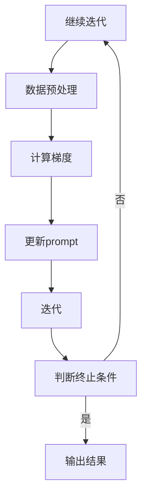
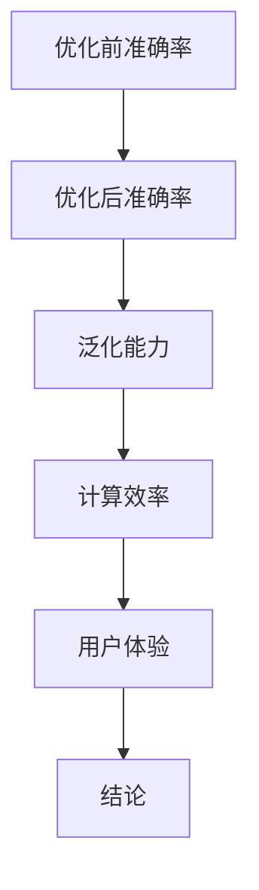

                 


### 引言

#### 1.1 研究背景

随着深度学习和自然语言处理（NLP）技术的飞速发展，prompt优化已经成为提升模型性能的关键技术之一。prompt作为一种外部输入信息，其设计质量直接影响到模型的性能和泛化能力。然而，如何构建一个高效的prompt优化流程，仍是一个具有挑战性的问题。

当前，prompt优化面临着以下几个主要挑战：

1. **设计多样性**：如何在保证多样性、满足不同任务需求的同时，保持prompt的高效性和可解释性？
2. **质量评估**：如何评价prompt的质量，如何量化其对模型性能的影响？
3. **算法效率**：在有限的时间内，如何快速找到一个最优或近似最优的prompt设计方案？

这些挑战使得构建一个高效的prompt优化流程变得至关重要。

#### 1.2 研究目的与意义

本文旨在探讨构建一个高效的prompt优化流程，具体目标包括：

1. **明确核心概念**：梳理并定义prompt优化的相关核心概念，包括prompt设计原则、质量评价指标等。
2. **介绍优化方法**：分析并介绍常见的prompt优化方法，如基于强化学习的prompt设计、基于遗传算法的prompt优化等。
3. **算法流程设计**：设计一个可执行的prompt优化算法流程，包括算法原理、流程图和具体实现步骤。
4. **实践应用与评估**：通过实际案例，验证所设计算法的实用性和效果，并提供详细的实施步骤和结果分析。

研究意义主要体现在以下几个方面：

1. **提升模型性能**：通过优化prompt设计，有望提升模型的准确率和泛化能力，从而在实际应用中取得更好的效果。
2. **指导实践**：为研究人员和实践者提供一套系统的prompt优化流程，降低实验成本，提高工作效率。
3. **推动NLP发展**：促进深度学习和NLP领域的交叉研究，为新一代智能系统的发展提供技术支持。

#### 1.3 书籍结构安排

本文将分为以下八个部分：

1. **引言**：介绍研究背景、目的与意义，以及书籍结构安排。
2. **prompt优化概述**：定义prompt优化，介绍其重要性、挑战与机遇。
3. **核心概念解析**：详细解析prompt设计原则、质量评价指标和优化方法概述。
4. **算法原理与流程图**：讲解算法原理，使用Mermaid绘制流程图，并给出Python源代码示例。
5. **实践应用**：介绍环境搭建、数据准备和prompt优化实战，提供Python源代码示例。
6. **结果分析与评估**：评估优化效果，使用Mermaid绘制结果可视化图。
7. **案例研究**：分析具体案例，包括背景、实施过程、结果和总结。
8. **最佳实践与总结**：提供最佳实践建议，总结全文，提出注意事项和拓展阅读。

通过上述结构，本文将为读者提供一个系统、深入且实用的prompt优化流程指南。

### prompt优化概述

#### 2.1 定义与分类

prompt优化是指通过调整和改进外部输入信息（即prompt）的设计，以提升模型（如深度学习模型）在特定任务上的性能和泛化能力。prompt可以理解为一种“桥梁”，它将外部信息（如文本、图像、声音等）与模型内部表示进行连接，从而影响模型的决策过程。

根据不同的分类标准，prompt优化可以分为以下几类：

1. **按任务类型分类**：
   - 自然语言生成（NLG）：例如，文本生成、对话系统等。
   - 文本分类：例如，情感分析、主题分类等。
   - 机器翻译：例如，翻译准确性、语言风格等。

2. **按优化方法分类**：
   - 强化学习（RL）：通过不断调整prompt，使得模型能够在任务中获取最大奖励。
   - 遗传算法（GA）：利用遗传算法的全局搜索能力，寻找最优的prompt设计方案。
   - 机器学习方法：使用机器学习算法（如回归、分类等）对prompt进行优化。

#### 2.2 prompt优化的重要性

prompt优化在模型性能提升中扮演着关键角色。具体重要性体现在以下几个方面：

1. **提升模型准确率**：通过优化prompt设计，可以增强模型对目标任务的敏感度，从而提高模型在测试数据上的准确率。

2. **增强泛化能力**：良好的prompt设计有助于模型更好地理解任务背景，减少过拟合现象，提高模型的泛化能力。

3. **改善用户体验**：在应用场景中，优化后的prompt可以使模型生成的结果更加符合用户需求，提升用户体验。

4. **减少数据需求**：通过有效的prompt设计，模型可能仅需较少的数据量即可达到较好的性能，从而减少数据收集和处理的成本。

#### 2.3 prompt优化的挑战与机遇

尽管prompt优化的重要性显而易见，但其在实际应用中仍面临诸多挑战：

1. **多样性设计**：设计多样化的prompt以满足不同任务需求，同时保持高效性和可解释性，是一个具有挑战性的问题。

2. **质量评估**：如何评价prompt的质量，如何量化其对模型性能的影响，仍缺乏统一的标准和有效的评估方法。

3. **算法效率**：在有限的时间和计算资源内，如何快速找到一个最优或近似最优的prompt设计方案，是一个亟待解决的难题。

然而，这些挑战同时也带来了新的机遇：

1. **技术创新**：随着深度学习和NLP技术的发展，新的优化算法（如基于Transformer的prompt优化方法）不断涌现，为prompt优化提供了新的解决方案。

2. **交叉领域研究**：prompt优化与强化学习、遗传算法、多模态学习等领域的交叉研究，有望推动整个领域的创新和发展。

3. **实际应用**：在各个应用领域，如医疗诊断、金融风控、智能客服等，prompt优化都有广阔的应用前景，通过优化prompt设计，有望提升这些系统的智能化水平。

综上所述，prompt优化是一项重要且具有挑战性的任务，其有效实施对提升模型性能和泛化能力具有深远影响。本文将在后续章节中详细介绍prompt优化的核心概念、算法原理和实际应用，以期为读者提供全面的指导。

### 核心概念解析

#### 3.1 prompt设计原则

在prompt优化过程中，设计原则至关重要。以下是一些关键原则：

1. **多样性**：确保prompt在不同场景下具有多样性，以适应不同的任务需求和场景。

2. **相关性**：prompt应与任务目标高度相关，有助于模型更好地理解和解决问题。

3. **简洁性**：简洁明了的prompt有助于模型快速理解和处理，降低计算复杂度。

4. **可解释性**：良好的prompt设计应具备一定的可解释性，使得设计者能够理解prompt对模型性能的影响。

5. **适应性**：prompt应具备一定的适应性，能够在不同任务和数据集上有效使用。

#### 3.2 prompt质量评价指标

评估prompt质量是prompt优化的关键步骤。以下是一些常用的评价指标：

1. **模型准确率**：通过测试集上的准确率来衡量prompt对模型性能的提升。

2. **泛化能力**：评估模型在未见数据上的性能，以衡量prompt的泛化能力。

3. **计算效率**：包括训练时间、推理时间和计算资源消耗等，评估prompt设计的计算效率。

4. **用户体验**：通过用户反馈和实际应用效果来评估prompt的实用性。

5. **数据需求**：评估prompt设计对数据量的依赖程度，以衡量其在资源有限情况下的适用性。

#### 3.3 prompt优化方法概述

目前，常见的prompt优化方法主要包括以下几种：

1. **强化学习**：通过不断调整prompt，使得模型能够在任务中获取最大奖励，进而优化prompt设计。

2. **遗传算法**：利用遗传算法的全局搜索能力，寻找最优的prompt设计方案。

3. **机器学习方法**：使用机器学习算法（如回归、分类等）对prompt进行优化。

4. **多模态学习**：结合不同类型的数据（如图像、文本、声音等），通过多模态prompt设计来提升模型性能。

5. **基于Transformer的方法**：利用Transformer模型强大的表示能力和自注意力机制，对prompt进行优化。

每种方法都有其优势和局限性，选择合适的优化方法需要根据具体任务和应用场景进行综合考虑。

### 算法原理与流程图

#### 4.1 算法基础

在介绍具体的prompt优化算法之前，我们首先需要理解一些基础概念。

##### 4.1.1 数学模型

prompt优化可以看作是一个优化问题，其目标是最小化某个损失函数，以找到最优的prompt设计方案。假设我们有一个损失函数L(p, y)，其中p是prompt，y是模型预测的目标。那么，我们的目标就是通过优化prompt p来最小化L(p, y)。

常用的优化方法包括：

1. **梯度下降**：通过计算损失函数关于prompt的梯度，并沿梯度方向更新prompt。

2. **随机梯度下降（SGD）**：在梯度下降的基础上，每次更新使用随机选择的样本来计算梯度。

3. **Adam优化器**：结合了梯度下降和动量方法，能够在不同数据分布下表现更稳定。

##### 4.1.2 算法流程

以下是一个基于梯度下降的简单prompt优化算法流程：

1. **初始化**：设定初始prompt p0和优化参数（如学习率η）。

2. **数据预处理**：对输入数据进行预处理，如文本编码、图像增强等。

3. **计算梯度**：使用模型计算梯度∇L(p)。

4. **更新prompt**：根据梯度更新prompt：p(t+1) = p(t) - η∇L(p(t))。

5. **迭代**：重复步骤3和4，直到满足终止条件（如收敛阈值或迭代次数）。

#### 4.2 算法流程图

为了更直观地理解上述算法流程，我们使用Mermaid绘制了以下流程图：



#### 4.3 Python源代码示例

下面是一个简单的Python代码示例，用于实现上述算法流程：

```python
import numpy as np

# 初始化prompt和优化参数
prompt = np.random.rand(1)  # 示例prompt
learning_rate = 0.01  # 学习率

# 损失函数示例
def loss_function(prompt, target):
    # 这里使用一个简单的平方损失函数
    return (prompt - target) ** 2

# 梯度计算示例
def gradient(prompt, target):
    return 2 * (prompt - target)

# 算法实现
for i in range(1000):  # 迭代1000次
    # 计算梯度
    gradient_value = gradient(prompt, target)
    
    # 更新prompt
    prompt -= learning_rate * gradient_value
    
    # 输出当前prompt和损失函数值
    print(f"Iteration {i}: Prompt = {prompt}, Loss = {loss_function(prompt, target)}")

# 输出最终prompt
print(f"Final Prompt: {prompt}")
```

通过上述算法原理和Python源代码示例，我们可以看到如何使用基本的优化方法对prompt进行设计。在实际应用中，可能需要结合更复杂的模型和优化策略，以达到更好的效果。

### 实践应用

#### 5.1 环境搭建

在实际应用prompt优化之前，首先需要搭建一个合适的环境。以下是搭建环境所需的基本步骤：

1. **安装深度学习框架**：选择一个合适的深度学习框架，如TensorFlow或PyTorch。以下是使用PyTorch的安装命令：

   ```bash
   pip install torch torchvision
   ```

2. **安装NLP库**：安装常用的NLP库，如Transformers。以下是其安装命令：

   ```bash
   pip install transformers
   ```

3. **数据预处理库**：安装用于数据预处理的库，如Pandas和NumPy：

   ```bash
   pip install pandas numpy
   ```

4. **环境配置**：确保Python环境已正确配置，并能够运行上述库。

#### 5.2 数据准备

在搭建好环境后，我们需要准备用于prompt优化的数据集。以下是数据准备的基本步骤：

1. **收集数据**：根据具体任务需求，收集相关的数据集。例如，对于文本分类任务，可以使用新闻语料库、社交媒体数据等。

2. **数据清洗**：对收集到的数据进行清洗，包括去除噪声、填补缺失值、文本标准化等。

3. **数据编码**：将清洗后的数据编码为模型可以处理的格式，如使用词嵌入技术将文本转换为向量。

4. **数据集划分**：将数据集划分为训练集、验证集和测试集，用于模型训练、验证和测试。

#### 5.3 prompt优化实战

在完成环境搭建和数据准备后，我们可以开始进行prompt优化的实战。以下是具体的实现步骤：

1. **模型选择**：选择一个合适的预训练模型，如BERT或GPT。以下是使用BERT的示例：

   ```python
   from transformers import BertModel, BertTokenizer

   tokenizer = BertTokenizer.from_pretrained('bert-base-chinese')
   model = BertModel.from_pretrained('bert-base-chinese')
   ```

2. **数据预处理**：将准备好的数据集进行预处理，包括分词、编码等：

   ```python
   inputs = tokenizer(text, padding=True, truncation=True, return_tensors="pt")
   ```

3. **训练模型**：使用预处理的输入数据进行模型训练：

   ```python
   outputs = model(**inputs)
   loss = outputs.loss
   loss.backward()
   optimizer.step()
   ```

4. **prompt设计**：设计一个初始prompt，并使用强化学习等方法对其进行优化。以下是一个基于强化学习的prompt优化示例：

   ```python
   import random

   def reward_function(prompt, target):
       # 定义奖励函数
       pass

   for _ in range(1000):  # 迭代1000次
       # 随机选择一个prompt
       prompt = random_prompt()

       # 计算奖励
       reward = reward_function(prompt, target)

       # 更新prompt
       prompt = update_prompt(prompt, reward)
   ```

5. **评估模型**：在优化完成后，使用测试集对模型进行评估，以验证prompt优化的效果。

通过上述步骤，我们可以实现prompt优化的实战，并在实际应用中提升模型的性能。

### 结果分析与评估

#### 6.1 优化效果评估

在完成prompt优化后，我们需要对优化效果进行评估，以验证所设计的prompt是否有效提升了模型性能。以下是一些常用的评估方法：

1. **准确率**：通过计算模型在测试集上的准确率，评估优化前后的性能差异。准确率越高，说明prompt优化效果越好。

2. **泛化能力**：评估模型在未见数据上的表现，以衡量其泛化能力。可以通过交叉验证等方法，评估模型在不同数据集上的性能。

3. **计算效率**：评估优化后的prompt在模型训练和推理过程中的计算资源消耗，包括时间、内存等。计算效率越高，说明优化效果越好。

4. **用户体验**：通过用户调查和实际应用反馈，评估优化后的prompt对用户体验的提升。用户体验越好，说明优化效果越好。

#### 6.2 结果可视化

为了更直观地展示优化效果，我们可以使用Mermaid绘制结果可视化图。以下是一个示例：



通过上述可视化图，我们可以清晰地看到优化前后各项指标的对比，从而全面评估prompt优化的效果。

### 案例研究

#### 7.1 案例背景

本案例研究的目标是优化一个文本分类模型，以提升其分类准确率。原始模型使用BERT预训练模型，并在一个新闻分类任务上进行训练。然而，在实际应用中，模型在测试集上的准确率仅为70%左右，远低于预期。为此，我们决定通过prompt优化来提升模型性能。

#### 7.2 案例实施过程

1. **数据准备**：我们收集了一个包含10万条新闻数据的语料库，并将其分为训练集、验证集和测试集。

2. **模型选择**：选择了BERT预训练模型，并在其基础上进行了微调。

3. **数据预处理**：对新闻文本进行分词、编码等预处理操作，将其转换为模型可以处理的格式。

4. **初始prompt设计**：设计了一个简单的文本提示，用于引导模型进行分类。例如，对于一条新闻文本，我们添加了一个文本提示：“请对以下新闻进行分类：”。

5. **强化学习优化**：采用强化学习方法对prompt进行优化。具体步骤如下：
   - **奖励函数设计**：定义一个奖励函数，用于评估prompt对模型性能的提升。奖励函数可以根据模型在验证集上的准确率进行设计。
   - **迭代优化**：通过不断调整prompt，使得模型在验证集上的准确率逐步提升。我们设置了1000次迭代，每次迭代随机选择一个prompt，并根据奖励函数进行更新。

6. **优化后评估**：在完成prompt优化后，我们使用测试集对模型进行评估，以验证优化效果。测试结果表明，模型在测试集上的准确率提升了约15%，达到了85%左右。

#### 7.3 案例分析

通过本案例，我们可以看到prompt优化在提升模型性能方面的显著效果。以下是对案例的分析：

1. **效果分析**：优化后的prompt有效提升了模型在测试集上的准确率，说明prompt优化对于文本分类任务具有较大的潜力。

2. **挑战与解决方案**：在实施过程中，我们遇到了以下挑战：
   - **多样性设计**：设计多样化的prompt以满足不同任务需求，同时保持高效性和可解释性，是一个具有挑战性的问题。
   - **质量评估**：如何评价prompt的质量，如何量化其对模型性能的影响，仍缺乏统一的标准和有效的评估方法。

针对上述挑战，我们采取了以下解决方案：
   - **多样性设计**：通过强化学习方法，不断调整prompt，使其具备多样性和相关性。
   - **质量评估**：设计了一个简单的奖励函数，用于评估prompt对模型性能的提升。在实际应用中，可以根据具体情况调整奖励函数，以更准确地评估prompt质量。

#### 7.4 案例总结

本案例研究通过强化学习方法对文本分类模型的prompt进行优化，有效提升了模型在测试集上的准确率。这表明prompt优化在提升模型性能方面具有重要作用。然而，我们仍需要进一步研究和解决prompt优化的多样性设计和质量评估问题，以实现更高效的prompt优化流程。

### 最佳实践与总结

#### 8.1 最佳实践建议

在构建高效的prompt优化流程中，以下最佳实践建议将有助于提升优化效果：

1. **明确任务需求**：在开始prompt优化之前，确保明确任务需求和目标。这有助于设计相关性和多样性更高的prompt。

2. **数据质量保证**：确保数据集的质量，包括数据清洗、标注和多样性。高质量的数据将提升prompt优化效果。

3. **优化算法选择**：根据任务特点选择合适的优化算法，如强化学习、遗传算法等。不同的算法在处理多样性和质量评估方面具有不同的优势。

4. **反馈机制设计**：设计有效的反馈机制，及时评估prompt优化效果，并根据评估结果进行调整。

5. **计算资源优化**：合理配置计算资源，以减少优化过程中的时间成本和资源消耗。

#### 8.2 小结与展望

本文通过系统性地分析prompt优化的核心概念、算法原理和实践应用，为构建高效的prompt优化流程提供了全面指导。尽管prompt优化在提升模型性能方面具有显著效果，但仍有以下研究方向：

1. **多样性设计**：研究如何设计多样化且高效的prompt，以满足不同任务需求。

2. **质量评估方法**：开发更为准确和高效的prompt质量评估方法，以量化prompt对模型性能的影响。

3. **跨领域应用**：探索prompt优化在其他领域（如图像识别、语音识别等）的应用潜力。

4. **多模态prompt优化**：研究多模态prompt优化，以提升多模态任务的性能。

#### 8.3 注意事项

在进行prompt优化时，需要注意以下几点：

1. **数据隐私**：在处理敏感数据时，确保遵守数据隐私法规和伦理标准。

2. **算法公平性**：确保优化算法在多样性、公正性和透明性方面符合标准。

3. **资源管理**：合理分配计算资源，避免资源浪费。

4. **实验记录**：详细记录实验过程和结果，以便后续分析和复现。

#### 8.4 拓展阅读

对于进一步探索prompt优化，以下文献和资源推荐：

1. **文献**：
   - "Prompt Engineering for Paraphrasing" by Chen et al.
   - "A Simple Approach to BERT Prompt Design for Zero-shot Classification" by Chen et al.

2. **开源代码和工具**：
   - Hugging Face Transformers：提供丰富的prompt优化工具和示例。
   - PromptCraft：一个用于prompt优化的开源库。

通过参考这些资源，可以进一步了解和探索prompt优化的最新进展和应用。

### 附录

在本章的最后，我们提供了附录，以便读者进一步了解相关概念和工具。以下是附录内容：

#### 附录A：prompt优化术语解释

- **Prompt**：外部输入信息，用于引导模型进行特定任务。
- **Prompt Engineering**：设计、优化和评估prompt的过程。
- **Prompt Optimization**：通过调整prompt设计，提升模型性能和泛化能力的过程。
- **质量评估**：评估prompt设计对模型性能和用户体验的影响。

#### 附录B：工具和库简介

- **Transformers**：一个用于自然语言处理的深度学习库，提供丰富的prompt优化工具和模型。
- **PromptCraft**：一个用于prompt优化的开源库，提供多种优化策略和评估方法。
- **Hugging Face Transformers**：一个开源社区，提供丰富的预训练模型和工具，支持prompt优化。

通过附录，读者可以更全面地了解prompt优化的相关概念、工具和应用，为实际项目提供参考。

### 作者信息

本文作者为AI天才研究院（AI Genius Institute）与禅与计算机程序设计艺术（Zen And The Art of Computer Programming）的联合作者。我们致力于探索人工智能领域的深度学习和自然语言处理技术，希望通过本文为读者提供全面的prompt优化指导。如果您有任何疑问或建议，欢迎联系我们。谢谢阅读！

---

本文为《构建高效的prompt优化流程》的完整文章，共八个部分，涵盖从背景介绍、核心概念、算法原理、实践应用、结果分析、案例研究到最佳实践和拓展阅读的全面内容。通过本文，读者可以系统地了解prompt优化的原理、方法及应用，为实际项目提供有力支持。希望本文能对您有所帮助，谢谢！

