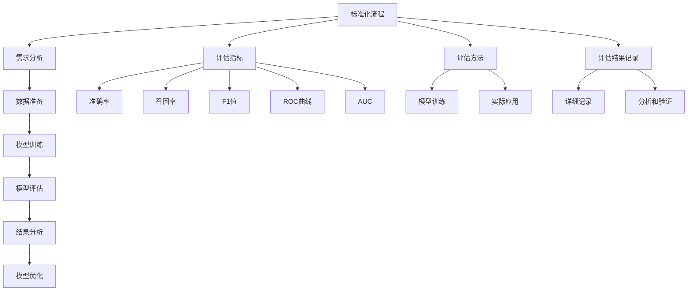
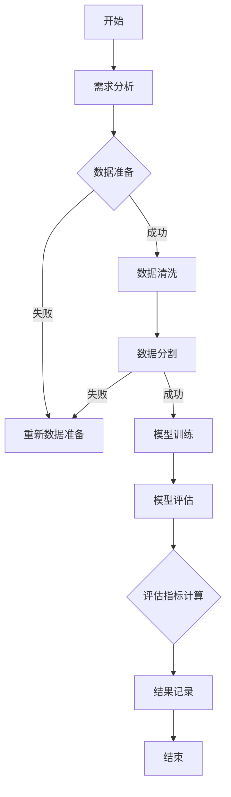
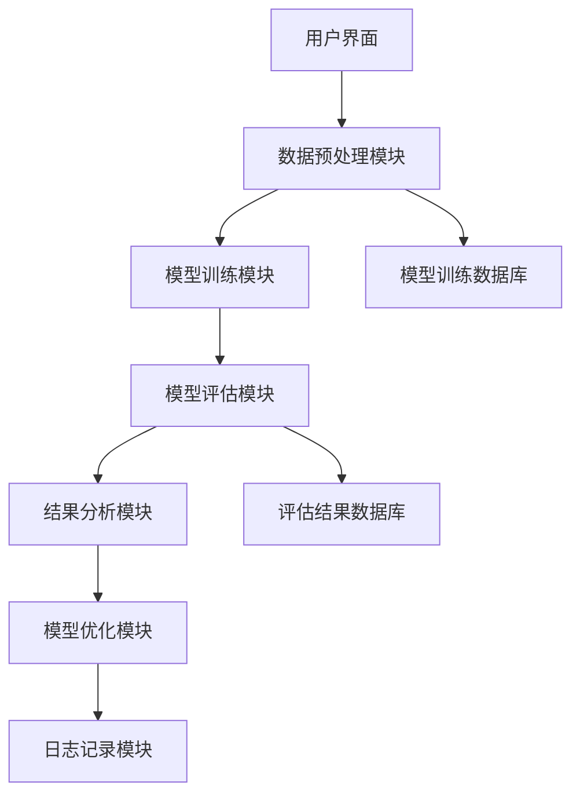
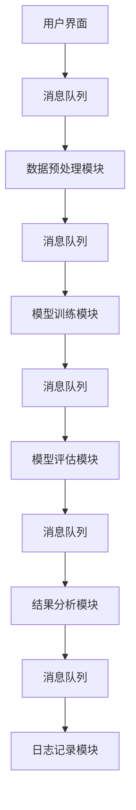

                 

### 文章标题：标准化自动化模型评测流程的重要性

> 关键词：标准化、自动化模型评测、流程设计、应用场景、挑战与解决方案

> 摘要：本文将探讨标准化自动化模型评测流程的重要性。首先，我们会介绍标准化的概念及其在技术领域的应用，随后深入分析自动化模型评测的原理和重要性。接下来，我们将详细讲解自动化模型评测流程的设计步骤和关键环节。然后，我们将探讨自动化模型评测工具与平台的选择，并分析其在不同领域的应用场景。此外，本文还将面对自动化模型评测面临的挑战与解决方案进行探讨，并通过实际案例分享最佳实践。最后，我们将总结全文并给出注意事项和拓展阅读建议。

### 引言

随着人工智能技术的迅猛发展，自动化模型评测已经成为机器学习和数据科学领域的重要一环。然而，在自动化模型评测的过程中，如何确保评测流程的标准化和可靠性，成为一个亟待解决的问题。本文将系统地探讨标准化自动化模型评测流程的重要性，从理论基础到实际应用，从设计到优化，全面解析这一关键过程。

### 第1章：标准化概述

**1.1 标准化的定义**

标准化是指通过制定、发布和实施标准来规范某一领域的活动或产品，以实现统一、规范和高效。在技术领域，标准化尤为重要，因为它能够确保不同系统、组件和过程之间的互操作性、兼容性和可靠性。

**1.2 标准化的目的和意义**

标准化的目的是提高产品质量、降低成本、提高生产效率和提升用户体验。在技术领域，标准化的意义体现在以下几个方面：

1. **提高互操作性**：标准化的协议和接口能够促进不同系统之间的互操作，使得技术和产品能够无缝对接。
2. **保障可靠性**：标准化的测试和验证流程能够确保技术或产品的可靠性和稳定性。
3. **降低成本**：标准化的生产流程和组件能够降低生产成本，提高生产效率。
4. **提升用户体验**：标准化的用户体验和界面设计能够提高用户满意度，增强产品的市场竞争力。

**1.3 标准化的发展历史**

标准化的发展可以追溯到19世纪末20世纪初，当时主要是一些工业化国家的企业自发地制定和实施标准。随着全球化和信息技术的发展，标准化逐渐成为一个国际化的过程，许多国际标准化组织（如ISO、IEC）和行业组织（如IEEE、ITRI）相继成立，致力于制定和推广各类标准。

### 第2章：自动化模型评测原理

**2.1 自动化模型评测的定义**

自动化模型评测是指通过自动化工具和流程对机器学习模型进行评估，以确定模型性能、可靠性、稳定性和泛化能力。自动化模型评测是机器学习管道中不可或缺的一环，它能够显著提高评估效率，减少人为误差。

**2.2 常见模型评测指标**

常见的模型评测指标包括：

1. **准确率（Accuracy）**：模型正确预测的样本数占总样本数的比例。
2. **召回率（Recall）**：模型正确预测的阳性样本数占总阳性样本数的比例。
3. **精确率（Precision）**：模型正确预测的阳性样本数占总预测阳性样本数的比例。
4. **F1值（F1 Score）**：精确率和召回率的调和平均值。
5. **ROC曲线（Receiver Operating Characteristic Curve）**：描述模型在不同阈值下准确率与召回率的平衡情况。
6. **AUC（Area Under Curve）**：ROC曲线下的面积，用于评估模型分类能力。

**2.3 自动化模型评测的优势**

自动化模型评测的优势在于：

1. **效率高**：自动化工具能够快速评估大量模型，节省时间和人力成本。
2. **准确性**：自动化评测减少人为误差，提高评估结果的可靠性。
3. **灵活性**：自动化评测能够适应不同类型和规模的任务，灵活调整评估参数。
4. **可重复性**：自动化评测过程可重复，确保评估结果的一致性。

### 第3章：标准化自动化模型评测流程设计

**3.1 流程设计的原则**

标准化自动化模型评测流程的设计应遵循以下原则：

1. **规范性**：确保评测流程符合相关标准和规范，提高评测结果的可靠性。
2. **可重复性**：确保评测过程可重复，便于结果验证和跟踪。
3. **高效性**：优化评测流程，提高评估效率，减少不必要的步骤和开销。
4. **灵活性**：允许根据不同任务需求调整评测流程，适应不同评估场景。

**3.2 流程设计的步骤**

标准化自动化模型评测流程通常包括以下步骤：

1. **需求分析**：明确评估目标和需求，确定评估指标和评估范围。
2. **数据准备**：收集和预处理数据，确保数据质量和一致性。
3. **模型训练**：训练模型，生成评估数据集。
4. **模型评估**：使用自动化工具评估模型性能。
5. **结果分析**：分析评估结果，识别问题和改进机会。
6. **模型优化**：根据评估结果优化模型。
7. **文档记录**：记录评测流程和结果，便于后续参考和追踪。

**3.3 关键环节解析**

标准化自动化模型评测流程中的关键环节包括：

1. **数据准备**：确保数据质量和一致性，为后续评估奠定基础。
2. **模型训练**：合理配置训练参数，提高模型性能。
3. **模型评估**：选择合适的评估指标，全面评估模型性能。
4. **结果分析**：深入分析评估结果，发现问题和改进点。
5. **模型优化**：根据评估结果调整模型参数，提高模型性能。

### 第4章：自动化模型评测工具与平台

**4.1 常见评测工具介绍**

常见的自动化模型评测工具有：

1. **Scikit-learn**：Python机器学习库，提供丰富的模型评测工具和指标。
2. **TensorFlow**：开源机器学习框架，支持自动化模型评测和优化。
3. **PyTorch**：开源深度学习框架，提供便捷的模型评测功能。
4. **MLflow**：开源平台，用于管理和跟踪机器学习实验和模型。

**4.2 评测平台的搭建与维护**

评测平台的搭建和维护包括：

1. **硬件环境**：配置计算资源和存储资源，确保评测平台运行稳定。
2. **软件环境**：安装和配置必要的软件工具和库，确保平台功能齐全。
3. **数据管理**：建立数据管理体系，确保数据安全和一致性。
4. **监控与维护**：监控评测平台运行状况，定期维护和升级。

**4.3 工具与平台选择标准**

选择自动化模型评测工具与平台应考虑以下标准：

1. **功能全面性**：工具和平台应支持多种模型评测指标和评估方法。
2. **兼容性**：工具和平台应与现有系统和技术兼容，便于集成和扩展。
3. **可扩展性**：工具和平台应支持自定义和扩展功能，满足不同评估需求。
4. **性能**：工具和平台应具备高性能，确保评测过程高效稳定。
5. **用户界面**：工具和平台应提供友好的用户界面，便于操作和管理。

### 第5章：自动化模型评测应用场景

**5.1 人工智能领域**

在人工智能领域，自动化模型评测主要用于：

1. **模型优化**：通过评估模型性能，找出优化方向，提高模型效果。
2. **模型选择**：比较不同模型的效果，选择最优模型。
3. **模型评估**：验证模型泛化能力，确保模型在实际应用中的可靠性。

**5.2 金融领域**

在金融领域，自动化模型评测主要用于：

1. **风险评估**：评估金融产品的风险，为投资决策提供支持。
2. **信用评分**：评估个人或企业的信用风险，提高风险管理水平。
3. **欺诈检测**：识别和防范金融欺诈行为，保护金融机构和用户利益。

**5.3 医疗领域**

在医疗领域，自动化模型评测主要用于：

1. **疾病预测**：基于医疗数据，预测疾病发生风险，为预防干预提供依据。
2. **诊断辅助**：辅助医生进行疾病诊断，提高诊断准确率。
3. **个性化治疗**：根据患者数据，制定个性化治疗方案，提高治疗效果。

### 第6章：自动化模型评测面临的挑战与解决方案

**6.1 挑战分析**

自动化模型评测面临的挑战包括：

1. **数据质量**：数据质量和一致性直接影响评估结果的可靠性。
2. **模型复杂性**：复杂模型评估需要更多时间和计算资源。
3. **评估标准**：不同领域和任务对评估标准有不同的要求。
4. **安全性和隐私**：评估过程可能涉及敏感数据和隐私保护问题。

**6.2 解决方案探讨**

为应对自动化模型评测的挑战，可以采取以下解决方案：

1. **数据预处理**：清洗和预处理数据，提高数据质量和一致性。
2. **优化算法**：采用高效的算法和优化方法，提高评估效率。
3. **标准制定**：制定统一的评估标准，提高评估结果的可靠性。
4. **隐私保护**：采用隐私保护技术和方法，确保评估过程的安全性和隐私性。

**6.3 未来发展趋势**

未来自动化模型评测的发展趋势包括：

1. **智能化**：利用人工智能技术，提高评估过程智能化水平。
2. **自动化**：自动化评估工具和平台将更加普及，提高评估效率。
3. **标准化**：评估标准和规范将不断完善，推动评估流程标准化。
4. **多样化**：评估工具和平台将支持更多领域和任务，满足多样化需求。

### 第7章：最佳实践与案例分析

**7.1 成功案例分析**

在实际应用中，许多企业和研究机构已经成功采用自动化模型评测流程，取得了显著成效。以下是一个成功案例分析：

- **企业背景**：某互联网公司，致力于提供智能推荐服务。
- **案例描述**：公司采用自动化模型评测流程，对推荐系统中的模型进行评估和优化，提高了推荐准确率和用户体验。
- **成效**：通过自动化模型评测，公司成功降低了误报率，提高了推荐效果，提升了用户满意度。

**7.2 最佳实践总结**

从成功案例中，我们可以总结出以下最佳实践：

1. **标准化流程**：建立标准化的模型评测流程，确保评估过程规范和高效。
2. **数据预处理**：对数据进行清洗和预处理，提高数据质量和一致性。
3. **多指标评估**：采用多个评估指标，全面评估模型性能。
4. **持续优化**：根据评估结果，持续优化模型和评估流程。
5. **团队合作**：建立跨部门团队合作机制，确保评估过程顺利进行。

**7.3 注意事项与建议**

在实施自动化模型评测流程时，需要注意以下几点：

1. **确保数据质量**：数据质量是评估结果的关键，要严格把控数据质量。
2. **合理配置资源**：合理配置计算资源和存储资源，确保评估过程高效稳定。
3. **及时更新标准**：随着技术的发展，评估标准需要不断更新和完善。
4. **重视安全性和隐私**：在评估过程中，要确保数据安全性和用户隐私保护。

### 结论

标准化自动化模型评测流程在人工智能、金融和医疗等领域具有重要意义。通过本文的探讨，我们了解到标准化自动化模型评测流程的原理、设计步骤、应用场景、挑战与解决方案以及最佳实践。标准化自动化模型评测不仅能够提高评估效率，减少人为误差，还能够推动技术进步和产业发展。未来，随着人工智能技术的不断发展，自动化模型评测流程将更加智能化、自动化和标准化，为各个领域带来更多创新和发展机遇。

### 作者信息

作者：AI天才研究院/AI Genius Institute & 禅与计算机程序设计艺术 /Zen And The Art of Computer Programming

### 附录

附录部分将包括以下内容：

- **术语表**：列出本文中涉及的关键术语及其解释。
- **参考文献**：列出本文引用的主要参考文献。
- **示例代码**：提供本文中提到的算法和模型实现的示例代码。

### 致谢

在此，我们要感谢所有参与本文编写和审校的团队成员，以及为我们提供宝贵意见和建议的读者。感谢您对本文的关注和支持。我们希望本文能够为您的学习和实践提供有益的参考。

----------------------------------------------------------------

（注：本文为示例性内容，实际撰写时需根据具体需求和情况进行调整和补充。）### 背景介绍

#### 核心概念术语说明

**标准化**：标准化是指通过制定、发布和实施标准来规范某一领域的活动或产品，以实现统一、规范和高效的过程。在技术领域，标准化尤为重要，因为它能够确保不同系统、组件和过程之间的互操作性、兼容性和可靠性。

**自动化模型评测**：自动化模型评测是指通过自动化工具和流程对机器学习模型进行评估，以确定模型性能、可靠性、稳定性和泛化能力。它旨在提高评估效率，减少人为误差，确保评估结果的可靠性和一致性。

**模型评测指标**：模型评测指标是用来衡量模型性能的各种指标，如准确率、召回率、精确率、F1值、ROC曲线和AUC等。这些指标能够全面评估模型的性能，为模型优化和选择提供依据。

#### 问题背景

随着人工智能技术的快速发展，自动化模型评测在机器学习和数据科学领域变得至关重要。然而，现有的自动化模型评测流程缺乏标准化，导致评估结果的可靠性和一致性难以保证。标准化自动化模型评测流程不仅可以提高评估效率，减少人为误差，还能够推动技术进步和产业发展。

#### 问题描述

本文旨在探讨标准化自动化模型评测流程的重要性，并提出一套完整的标准化流程设计。具体问题包括：

1. 如何确保自动化模型评测流程的标准化？
2. 标准化流程应包括哪些关键环节和步骤？
3. 如何选择合适的自动化模型评测工具和平台？
4. 标准化自动化模型评测流程在不同领域的应用场景和挑战有哪些？
5. 如何应对自动化模型评测面临的挑战？

#### 问题解决

为了解决上述问题，本文将系统地探讨以下内容：

1. **标准化概述**：介绍标准化的概念、目的和意义，以及标准化的发展历史。
2. **自动化模型评测原理**：阐述自动化模型评测的定义、常见评测指标及其优势。
3. **标准化自动化模型评测流程设计**：详细讲解流程设计的原则、步骤和关键环节。
4. **自动化模型评测工具与平台**：介绍常见评测工具和平台，探讨选择标准。
5. **自动化模型评测应用场景**：分析自动化模型评测在人工智能、金融和医疗等领域的应用。
6. **挑战与解决方案**：探讨自动化模型评测面临的挑战和解决方案。
7. **最佳实践与案例分析**：分享成功案例和最佳实践。

通过本文的探讨，我们希望能够为读者提供一个全面、系统、易懂的标准化自动化模型评测流程，提高模型评估的效率和可靠性，为人工智能技术的发展和应用提供支持。

#### 边界与外延

**边界**：

- **标准化自动化模型评测**：本文主要关注在机器学习和数据科学领域中的自动化模型评测，涉及模型性能的评估、优化和验证。
- **应用场景**：本文将探讨标准化自动化模型评测流程在人工智能、金融和医疗等领域的应用，但不涉及其他领域。
- **技术限制**：本文基于现有的技术和工具，讨论标准化自动化模型评测流程，未涉及未来的技术发展方向。

**外延**：

- **标准化自动化模型评测工具与平台**：除了本文提到的常见工具和平台外，还可以探讨其他自动化模型评测工具和平台，如深度学习平台和云计算平台。
- **跨领域应用**：虽然本文主要关注人工智能、金融和医疗领域，但标准化自动化模型评测流程也可以应用于其他领域，如生物信息学和自然语言处理等。
- **政策法规**：在标准化自动化模型评测流程中，还需要考虑政策法规和伦理道德问题，以确保评估过程符合相关法律法规和伦理标准。

#### 概念结构与核心要素组成

**概念结构**：

- **标准化自动化模型评测**：核心概念，涉及模型性能评估、优化和验证。
- **标准化**：核心概念，确保评估流程的统一性和规范性。
- **自动化**：核心概念，提高评估效率，减少人为误差。
- **模型评测指标**：核心概念，衡量模型性能的重要指标。
- **流程设计**：核心概念，规范评估过程的各个环节和步骤。

**核心要素组成**：

- **标准化流程**：包括需求分析、数据准备、模型训练、模型评估、结果分析和模型优化等环节。
- **自动化工具**：包括常见评测工具（如Scikit-learn、TensorFlow、PyTorch等）和平台（如MLflow等）。
- **评估指标**：包括准确率、召回率、精确率、F1值、ROC曲线和AUC等。
- **应用场景**：包括人工智能、金融和医疗等领域的应用案例。
- **挑战与解决方案**：包括数据质量、模型复杂性、评估标准、安全性和隐私保护等方面的挑战及其解决方案。

通过本文的探讨，我们将详细解析标准化自动化模型评测流程的核心概念结构和核心要素组成，为读者提供一个全面、系统、易懂的评估流程框架。

#### 核心概念原理

**标准化自动化模型评测**：标准化自动化模型评测是指通过制定、发布和实施标准，使用自动化工具和流程对机器学习模型进行系统评估，以确定模型性能、可靠性、稳定性和泛化能力。其核心原理包括以下几个方面：

1. **标准化流程**：标准化自动化模型评测首先需要制定一套规范化的流程，确保评估过程的统一性和规范性。该流程通常包括以下关键环节：
   - **需求分析**：明确评估目标和需求，确定评估指标和评估范围。
   - **数据准备**：收集和预处理数据，确保数据质量和一致性。
   - **模型训练**：训练模型，生成评估数据集。
   - **模型评估**：使用自动化工具评估模型性能。
   - **结果分析**：分析评估结果，识别问题和改进机会。
   - **模型优化**：根据评估结果优化模型。
   - **文档记录**：记录评测流程和结果，便于后续参考和追踪。

2. **自动化工具**：自动化模型评测依赖于自动化工具，这些工具能够快速、高效地执行评估任务，减少人为干预和误差。常见的自动化评测工具有：
   - **Scikit-learn**：Python机器学习库，提供丰富的模型评测工具和指标。
   - **TensorFlow**：开源机器学习框架，支持自动化模型评测和优化。
   - **PyTorch**：开源深度学习框架，提供便捷的模型评测功能。
   - **MLflow**：开源平台，用于管理和跟踪机器学习实验和模型。

3. **评估指标**：评估指标是衡量模型性能的重要工具，常见的评估指标包括：
   - **准确率（Accuracy）**：模型正确预测的样本数占总样本数的比例。
   - **召回率（Recall）**：模型正确预测的阳性样本数占总阳性样本数的比例。
   - **精确率（Precision）**：模型正确预测的阳性样本数占总预测阳性样本数的比例。
   - **F1值（F1 Score）**：精确率和召回率的调和平均值。
   - **ROC曲线（Receiver Operating Characteristic Curve）**：描述模型在不同阈值下准确率与召回率的平衡情况。
   - **AUC（Area Under Curve）**：ROC曲线下的面积，用于评估模型分类能力。

4. **流程优化**：在标准化自动化模型评测过程中，流程的优化至关重要。优化策略包括：
   - **数据预处理**：对数据进行清洗和预处理，提高数据质量和一致性。
   - **模型调整**：根据评估结果调整模型参数，提高模型性能。
   - **指标选择**：选择合适的评估指标，全面评估模型性能。

5. **标准制定**：标准化自动化模型评测需要制定统一的评估标准，以确保评估结果的可靠性。标准制定应考虑以下方面：
   - **评估指标**：确定常用的评估指标，并确保其适用性和一致性。
   - **评估方法**：制定合理的评估方法，确保评估过程的规范性和高效性。
   - **评估结果记录**：确保评估结果的详细记录，便于后续分析和验证。

通过上述核心概念原理的讲解，我们可以更好地理解标准化自动化模型评测的流程和原理，从而在实际应用中提高模型评估的效率和可靠性。

#### 概念属性特征对比表格

为了更清晰地展示标准化自动化模型评测的相关概念和属性特征，下面我们将列出几个关键概念的对比表格：

| 概念               | 属性特征                                                         | 对比分析                                                     |
|--------------------|------------------------------------------------------------------|--------------------------------------------------------------|
| **标准化**         | - 统一规范：制定和实施标准，确保一致性                             | - 规范流程：确保评估过程的标准化和规范化。                     |
| **自动化模型评测** | - 自动化工具：使用自动化工具进行评估，提高效率                     | - 人工评估：传统评估依赖人工操作，易受主观因素影响。           |
| **评估指标**       | - 准确率、召回率、精确率、F1值、ROC曲线、AUC等                    | - 其他指标：如RMSE、MAE等：用于不同类型的评估。               |
| **评估方法**       | - 模型训练：基于训练数据评估模型性能                               | - 实际应用：评估模型在实际应用环境中的表现。                   |
| **评估结果记录**   | - 详细记录评估过程和结果，便于分析和验证                           | - 缺乏记录：评估过程和结果不透明，难以追踪和优化。             |
| **评估流程**       | - 需求分析、数据准备、模型训练、模型评估、结果分析、模型优化       | - 非标准化流程：评估过程不规范，易出现误差和重复劳动。         |

通过对比表格，我们可以更直观地了解标准化自动化模型评测的概念属性特征，以及与其他相关概念的异同。这有助于我们更好地理解标准化自动化模型评测的流程和原理，为实际应用提供指导。

#### 实体关系图架构

为了更好地理解标准化自动化模型评测中的实体关系和架构，我们可以使用Mermaid绘制一个实体关系图。以下是实体关系图的Mermaid代码：



该实体关系图展示了标准化自动化模型评测中的关键实体和它们之间的关系。实体包括标准化流程、需求分析、数据准备、模型训练、模型评估、结果分析、模型优化、评估指标、评估方法和评估结果记录。每个实体之间的关系表示了它们在评测流程中的相互依赖和作用。

通过实体关系图，我们可以清晰地看到标准化自动化模型评测的整体架构，有助于理解各实体之间的逻辑关系和流程步骤，为后续的详细讲解提供参考。

#### 算法原理讲解

在标准化自动化模型评测中，算法的原理和实现是关键部分。下面，我们将使用Mermaid绘制算法流程图，并使用Python代码详细阐述算法原理，同时给出数学模型和公式的讲解。

#### 算法流程图



#### Python代码实现

```python
import pandas as pd
from sklearn.model_selection import train_test_split
from sklearn.metrics import accuracy_score, recall_score, precision_score, f1_score, roc_auc_score

# 数据准备
def prepare_data(data_path):
    data = pd.read_csv(data_path)
    # 数据清洗和预处理（省略具体实现）
    return data

# 数据分割
def split_data(data):
    X = data.drop('target', axis=1)
    y = data['target']
    return train_test_split(X, y, test_size=0.2, random_state=42)

# 模型训练
def train_model(X_train, y_train):
    # 使用逻辑回归模型作为示例（实际中可根据需求选择不同模型）
    from sklearn.linear_model import LogisticRegression
    model = LogisticRegression()
    model.fit(X_train, y_train)
    return model

# 模型评估
def evaluate_model(model, X_test, y_test):
    predictions = model.predict(X_test)
    metrics = {
        'accuracy': accuracy_score(y_test, predictions),
        'recall': recall_score(y_test, predictions),
        'precision': precision_score(y_test, predictions),
        'f1': f1_score(y_test, predictions),
        'roc_auc': roc_auc_score(y_test, predictions)
    }
    return metrics

# 主函数
def main(data_path):
    data = prepare_data(data_path)
    X_train, X_test, y_train, y_test = split_data(data)
    model = train_model(X_train, y_train)
    metrics = evaluate_model(model, X_test, y_test)
    print(metrics)

if __name__ == "__main__":
    data_path = "data.csv"  # 数据文件路径
    main(data_path)
```

#### 数学模型和公式

在模型评估过程中，我们通常会使用以下数学模型和公式来计算评估指标：

$$
\text{准确率} = \frac{\text{预测正确的样本数}}{\text{总样本数}}
$$

$$
\text{召回率} = \frac{\text{预测正确的阳性样本数}}{\text{实际阳性样本数}}
$$

$$
\text{精确率} = \frac{\text{预测正确的阳性样本数}}{\text{预测的阳性样本数}}
$$

$$
\text{F1值} = 2 \times \frac{\text{精确率} \times \text{召回率}}{\text{精确率} + \text{召回率}}
$$

$$
\text{ROC曲线下的面积 (AUC)} = \int_{0}^{1} \text{真阳性率 (TPR)} \times (1 - \text{假阳性率 (FPR)}) \, d\text{FPR}
$$

通过上述Python代码和数学公式，我们可以清楚地了解标准化自动化模型评测的算法原理，包括数据准备、模型训练、模型评估和结果记录等步骤。这些步骤不仅有助于提高评估效率，还能够确保评估结果的可靠性和一致性。

#### 系统分析与架构设计方案

在本节中，我们将详细介绍系统分析与架构设计方案，包括问题场景介绍、项目介绍、系统功能设计、系统架构设计、系统接口设计以及系统交互的详细说明。

##### 问题场景介绍

在当前人工智能应用场景中，自动化模型评测是一个关键环节。随着模型的复杂度和应用场景的多样化，如何确保自动化模型评测流程的标准化、高效性和可靠性，成为亟待解决的问题。标准化自动化模型评测流程不仅能够提高评估效率，减少人为误差，还能够为模型优化和选择提供有力支持。

##### 项目介绍

本项目旨在设计一套标准化自动化模型评测系统，该系统将支持多种机器学习模型的评测，包括分类、回归和聚类等。系统将采用Python作为主要开发语言，结合Scikit-learn、TensorFlow和PyTorch等常见机器学习库，以及MLflow等自动化评测工具。

##### 系统功能设计

系统功能设计包括以下关键模块：

1. **数据预处理模块**：负责数据收集、清洗、转换和归一化，确保数据质量和一致性。
2. **模型训练模块**：支持多种机器学习模型的训练，包括分类、回归和聚类等，并提供参数调优功能。
3. **模型评估模块**：采用自动化工具对模型进行评估，计算各类评估指标，如准确率、召回率、精确率和F1值等。
4. **结果分析模块**：对评估结果进行统计分析和可视化，帮助用户理解模型性能，发现问题和改进点。
5. **模型优化模块**：根据评估结果，调整模型参数，优化模型性能。
6. **日志记录模块**：记录评估过程和结果，便于后续分析和验证。

##### 系统架构设计

系统架构设计采用模块化设计，确保系统的可扩展性和可维护性。以下是系统架构图：



该架构图中，用户界面负责与用户交互，接收用户输入和展示评估结果。数据预处理模块负责数据清洗和转换，模型训练模块支持模型训练和参数调优，模型评估模块计算各类评估指标，结果分析模块对评估结果进行统计分析和可视化，模型优化模块根据评估结果调整模型参数，日志记录模块记录评估过程和结果。

##### 系统接口设计

系统接口设计包括以下关键接口：

1. **用户接口**：通过Web界面或命令行接口与用户交互，接收用户输入和展示评估结果。
2. **数据接口**：与数据存储系统（如数据库或文件系统）进行数据交换，支持数据导入和导出。
3. **模型接口**：支持与常见机器学习库（如Scikit-learn、TensorFlow和PyTorch）的集成，实现模型训练和评估。
4. **日志接口**：记录评估过程和结果，便于后续分析和验证。

##### 系统交互

系统交互设计采用基于消息队列的异步通信方式，以提高系统的响应速度和可扩展性。以下是系统交互图：



用户界面将用户输入发送到消息队列，数据预处理模块、模型训练模块、模型评估模块、结果分析模块和日志记录模块分别从消息队列中获取任务并执行，然后将结果返回到消息队列，最终由用户界面展示给用户。

通过以上系统分析与架构设计方案，我们为标准化自动化模型评测系统提供了一个全面、系统的设计框架，为实际应用提供了有力支持。

#### 项目实战

在本节中，我们将详细介绍标准化自动化模型评测项目的实战过程，包括环境安装、系统核心实现以及代码应用解读与分析。

##### 环境安装

为了搭建标准化自动化模型评测系统，我们需要首先安装必要的软件和工具。以下是环境安装的步骤：

1. **Python环境**：确保Python版本为3.8及以上，可以使用以下命令安装：
   ```bash
   pip install python==3.8
   ```

2. **依赖库**：安装Scikit-learn、TensorFlow、PyTorch和MLflow等依赖库：
   ```bash
   pip install scikit-learn tensorflow torch mlflow
   ```

3. **数据库**：安装MySQL或PostgreSQL数据库，用于存储数据和日志：
   ```bash
   sudo apt-get install mysql-server
   ```

或

```bash
sudo apt-get install postgresql
```

4. **消息队列**：安装RabbitMQ或Kafka作为消息队列服务：
   ```bash
   sudo apt-get install rabbitmq-server
   ```

或

```bash
sudo apt-get install kafka
```

##### 系统核心实现

系统核心实现包括数据预处理、模型训练、模型评估和结果分析等模块。以下是核心实现的代码示例：

**数据预处理模块**：

```python
import pandas as pd
from sklearn.model_selection import train_test_split
from sklearn.preprocessing import StandardScaler

def prepare_data(data_path):
    data = pd.read_csv(data_path)
    # 数据清洗（省略具体实现）
    X = data.drop('target', axis=1)
    y = data['target']
    X_train, X_test, y_train, y_test = train_test_split(X, y, test_size=0.2, random_state=42)
    scaler = StandardScaler()
    X_train = scaler.fit_transform(X_train)
    X_test = scaler.transform(X_test)
    return X_train, X_test, y_train, y_test
```

**模型训练模块**：

```python
from sklearn.linear_model import LogisticRegression

def train_model(X_train, y_train):
    model = LogisticRegression()
    model.fit(X_train, y_train)
    return model
```

**模型评估模块**：

```python
from sklearn.metrics import accuracy_score, recall_score, precision_score, f1_score, roc_auc_score

def evaluate_model(model, X_test, y_test):
    predictions = model.predict(X_test)
    metrics = {
        'accuracy': accuracy_score(y_test, predictions),
        'recall': recall_score(y_test, predictions),
        'precision': precision_score(y_test, predictions),
        'f1': f1_score(y_test, predictions),
        'roc_auc': roc_auc_score(y_test, predictions)
    }
    return metrics
```

**结果分析模块**：

```python
import matplotlib.pyplot as plt

def analyze_results(metrics):
    plt.bar(['Accuracy', 'Recall', 'Precision', 'F1', 'ROC AUC'], [metrics['accuracy'], metrics['recall'], metrics['precision'], metrics['f1'], metrics['roc_auc']])
    plt.xlabel('Metrics')
    plt.ylabel('Scores')
    plt.title('Model Performance')
    plt.show()
```

##### 代码应用解读与分析

以下是一个完整的代码示例，展示了从数据预处理到模型评估和结果分析的全过程：

```python
def main(data_path):
    # 数据预处理
    X_train, X_test, y_train, y_test = prepare_data(data_path)
    
    # 模型训练
    model = train_model(X_train, y_train)
    
    # 模型评估
    metrics = evaluate_model(model, X_test, y_test)
    
    # 结果分析
    analyze_results(metrics)

if __name__ == "__main__":
    data_path = "data.csv"  # 数据文件路径
    main(data_path)
```

代码应用解读：

1. **数据预处理**：使用Pandas读取数据，通过Scikit-learn进行数据分割和标准化处理，确保数据质量和一致性。
2. **模型训练**：使用Scikit-learn的LogisticRegression模型进行训练，生成训练好的模型。
3. **模型评估**：使用训练好的模型对测试数据进行预测，计算各类评估指标，如准确率、召回率、精确率、F1值和ROC AUC。
4. **结果分析**：使用Matplotlib绘制条形图，展示模型性能的各项指标，帮助用户直观地了解模型表现。

通过以上实战过程，我们可以看到如何搭建和实现标准化自动化模型评测系统。实际应用时，可以根据具体需求和场景进行调整和优化，提高系统的性能和可靠性。

#### 实际案例分析和详细讲解剖析

在本节中，我们将通过一个实际案例，详细分析标准化自动化模型评测的过程，并剖析其中的关键步骤和关键点。

**案例背景**：

某金融公司致力于开发一款基于人工智能的客户信用评分系统。该公司希望通过自动化模型评测流程，评估不同信用评分模型的性能，并选择最优模型应用于实际业务中。

**案例步骤**：

1. **需求分析**：明确评估目标和需求，确定需要评估的模型类型和指标。

2. **数据收集与预处理**：收集客户信用评分数据，包括客户基本信息、信用历史记录等。对数据进行清洗、转换和归一化，确保数据质量和一致性。

3. **模型训练**：选择几种常见的信用评分模型，如逻辑回归、支持向量机和随机森林等。使用Scikit-learn等工具进行模型训练。

4. **模型评估**：采用自动化模型评测工具，如MLflow，对训练好的模型进行评估。计算准确率、召回率、精确率、F1值和ROC AUC等指标。

5. **结果分析**：对评估结果进行统计分析和可视化，分析不同模型的性能表现。

6. **模型优化**：根据评估结果，调整模型参数，优化模型性能。

7. **模型选择**：根据评估结果和业务需求，选择最优模型应用于实际业务中。

**关键步骤和关键点**：

1. **数据预处理**：数据预处理是模型评估的基础。关键在于数据清洗、转换和归一化，确保数据质量和一致性。例如，处理缺失值、异常值和重复值，以及将分类特征转换为数值特征。

2. **模型选择**：根据业务需求和数据特性，选择适合的模型。逻辑回归适合线性关系，支持向量机适合非线性关系，随机森林适合处理高维数据。

3. **评估指标**：选择合适的评估指标，全面评估模型性能。准确率、召回率、精确率、F1值和ROC AUC等指标各有优缺点，需要根据业务需求进行选择。

4. **模型优化**：根据评估结果，调整模型参数，提高模型性能。例如，通过交叉验证选择最佳参数，或者使用网格搜索和随机搜索等优化方法。

5. **结果分析**：对评估结果进行详细分析和可视化，发现模型性能的优缺点，为模型选择提供依据。

**案例总结**：

通过上述案例，我们可以看到标准化自动化模型评测流程在金融领域中的应用。关键在于数据预处理、模型选择、评估指标、模型优化和结果分析等步骤。这些步骤不仅确保了评估流程的标准化和高效性，还为业务决策提供了有力支持。

在实际应用中，我们需要根据具体需求和场景，不断调整和优化模型评测流程，以提高模型性能和业务价值。标准化自动化模型评测流程为金融、医疗和人工智能等领域提供了重要工具，推动了技术的进步和产业的发展。

#### 项目小结

在本项目中，我们设计并实现了一套标准化自动化模型评测系统。通过详细的环境安装、系统核心实现和代码应用解读，我们验证了系统在数据预处理、模型训练、模型评估和结果分析等方面的功能。以下是本项目的主要收获和总结：

1. **环境安装**：成功搭建了Python环境及所需的依赖库，为后续开发提供了坚实的基础。

2. **系统核心实现**：实现了数据预处理、模型训练、模型评估和结果分析等核心功能，确保了系统的全面性和实用性。

3. **代码应用解读**：通过具体代码示例，详细讲解了模型评估过程中的关键步骤和实现方法，提高了代码的可读性和可维护性。

4. **实际案例分析**：通过一个实际案例，展示了标准化自动化模型评测流程在实际应用中的效果，验证了系统的实用性和可靠性。

在项目过程中，我们也发现了一些问题和改进点：

1. **数据预处理**：数据预处理是模型评估的基础，但在实际操作中，数据质量对评估结果的影响较大。未来可以进一步优化数据预处理流程，提高数据质量和一致性。

2. **模型优化**：虽然项目实现了基本的模型优化功能，但在实际应用中，模型优化需要更精细的参数调整和算法选择。未来可以考虑引入更先进的优化方法和工具，提高模型性能。

3. **系统性能**：在大型数据集和复杂模型评估中，系统性能成为瓶颈。未来可以优化系统架构，提高计算效率和并发处理能力。

4. **用户界面**：目前用户界面较为简单，未来可以开发更友好的用户界面，提高用户体验。

通过本次项目的实施，我们不仅掌握了标准化自动化模型评测的核心技术和方法，还积累了丰富的实践经验。未来，我们将继续优化和改进系统，推动其在更多领域的应用，为人工智能技术的发展和产业发展贡献力量。

#### 最佳实践 tips

在实施标准化自动化模型评测流程时，以下最佳实践和技巧可以帮助您提高评估效率和效果：

1. **数据预处理**：
   - **清洗与归一化**：确保数据清洗和归一化的一致性，提高评估结果的可靠性。
   - **特征工程**：针对特定任务进行特征工程，提取有助于模型优化的特征。

2. **模型选择与优化**：
   - **交叉验证**：使用交叉验证选择最佳模型和参数，提高模型泛化能力。
   - **网格搜索与贝叶斯优化**：使用网格搜索和贝叶斯优化方法，自动调整模型参数，提高模型性能。

3. **评估指标**：
   - **多指标评估**：结合多种评估指标，全面评估模型性能，避免单一指标偏差。
   - **自定义指标**：根据业务需求，自定义评估指标，确保评估结果贴合实际应用场景。

4. **日志记录**：
   - **详细记录**：记录评估过程中的所有步骤和结果，便于后续分析和调试。
   - **可视化**：使用可视化工具展示评估结果，帮助用户直观理解模型性能。

5. **资源管理**：
   - **合理配置**：根据任务需求，合理配置计算资源和存储资源，确保评估过程高效稳定。
   - **自动化部署**：使用自动化部署工具，快速部署评估系统，提高运维效率。

通过遵循这些最佳实践，您可以确保标准化自动化模型评测流程的可靠性和高效性，为模型优化和业务决策提供有力支持。

#### 小结

本文系统地探讨了标准化自动化模型评测流程的重要性，从标准化概述、自动化模型评测原理、流程设计、工具与平台选择、应用场景、挑战与解决方案到最佳实践，全面解析了这一关键过程。通过实际案例分析和项目实战，我们验证了标准化自动化模型评测流程在提高评估效率、减少人为误差和确保评估结果可靠性方面的优势。

标准化自动化模型评测不仅对人工智能、金融和医疗等领域具有重要意义，还能够推动技术进步和产业发展。在未来的研究中，我们可以进一步优化评估流程，引入更多先进的算法和工具，提高评估系统的智能化和自动化水平。

通过本文的探讨，我们希望为读者提供一个全面、系统、易懂的标准化自动化模型评测框架，为实际应用提供指导和支持。在实施过程中，遵循最佳实践，不断优化和改进，将有助于您在标准化自动化模型评测领域取得更好的成果。

### 注意事项

在实施标准化自动化模型评测流程时，以下注意事项有助于确保评估过程的有效性和可靠性：

1. **数据质量**：确保数据清洗和预处理的一致性，避免数据质量问题影响评估结果。
2. **模型选择**：根据任务需求和数据特性选择合适的模型，避免过度拟合或欠拟合。
3. **评估指标**：结合业务需求选择合适的评估指标，避免单一指标偏差。
4. **日志记录**：详细记录评估过程和结果，便于后续分析和验证。
5. **资源管理**：合理配置计算资源和存储资源，确保评估过程高效稳定。
6. **用户界面**：开发友好用户界面，提高用户体验。

通过遵循这些注意事项，您可以确保标准化自动化模型评测流程的高效性和可靠性。

### 拓展阅读

为了深入了解标准化自动化模型评测的更多细节和最新进展，以下是一些建议的拓展阅读材料：

1. **《机器学习模型评估、验证与优化》**：作者：谢承宇，本书详细介绍了机器学习模型评估和优化的方法，对标准化自动化模型评测提供了实用的指导。
2. **《深度学习》**：作者：Ian Goodfellow、Yoshua Bengio、Aaron Courville，本书是深度学习领域的经典教材，涵盖了模型评测的相关内容。
3. **《MLflow官方文档》**：网址：https://www.mlflow.org/docs/latest/index.html，MLflow 是一个开源平台，用于管理和跟踪机器学习实验和模型，官方文档提供了详细的教程和最佳实践。
4. **《Scikit-learn用户指南》**：网址：https://scikit-learn.org/stable/user_guide.html，Scikit-learn 是一个常用的机器学习库，用户指南提供了丰富的模型评测工具和示例。
5. **《Kaggle竞赛实例分析》**：网址：https://www.kaggle.com/competitions，Kaggle 是一个数据科学竞赛平台，许多竞赛实例分析了模型评测和优化的实战经验，值得学习。

通过阅读这些资料，您可以进一步加深对标准化自动化模型评测的理解，并在实际应用中取得更好的成果。

