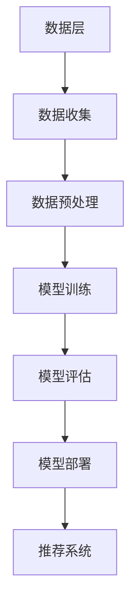
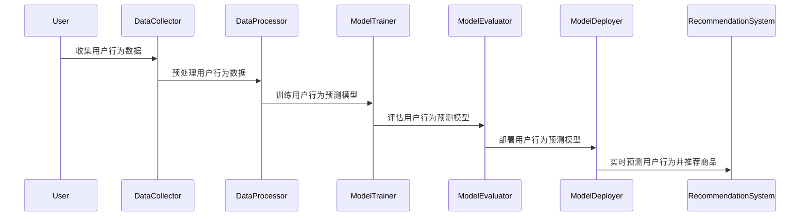

                 

# 标准化自动化模型评测：确保AI应用质量的重要手段

> 关键词：AI模型评测、自动化、标准化、算法、数学模型、系统架构、项目实战

> 摘要：本文将深入探讨标准化自动化模型评测在确保人工智能应用质量中的关键作用。首先，我们回顾了模型评测的起源和重要性，接着定义了核心概念并比较了自动化模型评测与传统模型评测的区别。随后，我们详细介绍了标准化评测方法及其优势，并讲解了数据准备与预处理、模型选择与评估指标、评测流程与步骤等标准化自动化模型评测的方法。本文通过算法原理讲解、数学模型公式详解、Python源代码示例，以及系统架构和项目实战的详细分析，展示了标准化自动化模型评测的实际应用。最后，我们总结了最佳实践、注意事项，并提供了拓展阅读，为读者提供了深入学习和实践的方向。

## 第一部分：标准化自动化模型评测的背景与意义

### 1.1.1 标准化自动化模型评测的起源

随着人工智能技术的飞速发展，AI模型的应用日益广泛。然而，如何确保这些模型的质量成为了一个亟待解决的问题。标准化自动化模型评测作为人工智能领域的一项关键技术，起源于对模型性能和可靠性的需求。通过自动化和标准化的评测方法，可以高效、准确地评估AI模型在不同应用场景中的性能，从而为模型的改进和应用提供可靠的数据支持。

### 1.1.2 模型评测的重要性

模型评测是人工智能应用中的关键环节。它不仅能够评估模型的性能，还可以发现潜在的问题，为模型的优化提供方向。在AI模型的应用过程中，模型评测起到了以下几个重要作用：

1. **性能评估**：通过评测，可以了解模型在各类任务中的表现，为模型选择和优化提供依据。
2. **问题诊断**：评测过程中可以发现模型的不足，如过拟合、欠拟合等问题，为模型改进提供指导。
3. **可靠性验证**：标准化评测方法可以确保模型的可靠性，提高其在实际应用中的稳定性。
4. **可解释性提升**：通过评测，可以分析模型的行为，提高模型的可解释性，增强用户对模型应用的信任。

### 1.1.3 问题解决与边界确定

在人工智能应用中，模型评测需要解决的主要问题是：

- 如何选择合适的评测指标？
- 如何确保评测过程的标准化和自动化？
- 如何处理大规模数据的评测需求？

同时，评测的边界包括：

- 评测指标的覆盖范围和优先级。
- 评测过程的效率和准确性。
- 模型在实际应用中的性能表现。

通过明确问题和边界，可以更好地设计和实现有效的模型评测系统。

### 1.1.4 核心概念的定义与联系

在标准化自动化模型评测中，涉及多个核心概念，包括：

- **模型评测**：评估AI模型性能的方法和过程。
- **自动化**：通过算法和工具实现评测过程的自动化。
- **标准化**：制定统一的评测标准和流程，确保评测的公平性和一致性。
- **性能指标**：用于评估模型性能的具体指标，如准确率、召回率、F1分数等。
- **数据预处理**：对数据进行清洗、转换和归一化等处理，以提高模型评测的准确性。

这些概念相互联系，共同构成了标准化自动化模型评测的基础。

## 第二部分：核心概念与联系

### 2.1.1 自动化模型评测的基本概念

#### 2.1.1.1 自动化模型评测的定义

自动化模型评测是指利用计算机技术和算法，对AI模型进行自动化的评估过程。它旨在提高评测的效率、减少人工干预，并确保评测结果的准确性和一致性。

#### 2.1.1.2 自动化模型评测的属性特征对比表格

| 特征         | 自动化模型评测 | 传统模型评测 |
| ------------ | -------------- | ------------ |
| **效率**     | 高             | 低           |
| **准确性**   | 高             | 中           |
| **一致性**   | 高             | 低           |
| **可扩展性** | 强             | 弱           |
| **成本**     | 低             | 高           |

#### 2.1.1.3 自动化模型评测与传统模型评测的区别

自动化模型评测与传统模型评测在多个方面存在显著差异，如表中所示。自动化评测通过技术手段实现了高效、准确和一致的评估过程，而传统评测更多依赖于人工操作，效率较低且易受主观因素影响。

### 2.2.1 标准化评测方法

#### 2.2.1.1 标准化评测的定义

标准化评测方法是指通过制定统一的评测标准和流程，确保评测过程的一致性和公平性。它包括：

- **评测标准**：明确评测指标和阈值。
- **评测流程**：定义评测步骤和流程，确保操作的标准化。
- **数据规范**：对数据格式和标注进行规范化。

#### 2.2.1.2 标准化评测的优势

标准化评测方法具有以下优势：

- **公平性**：确保不同模型和评测者之间的公平对比。
- **一致性**：提高评测结果的稳定性和可重复性。
- **可重复性**：便于复现和验证评测结果。
- **可解释性**：标准化流程有助于解释评测结果。

#### 2.2.1.3 标准化评测的方法

标准化评测方法主要包括以下步骤：

1. **制定评测标准**：根据任务特点，选择合适的评测指标和阈值。
2. **定义评测流程**：设计标准化的评测步骤，确保操作的规范性和一致性。
3. **数据预处理**：对输入数据进行清洗和预处理，保证数据质量。
4. **评测执行**：按照标准化流程执行评测，记录评测结果。
5. **结果分析**：分析评测结果，发现模型问题，为模型优化提供依据。

## 第三部分：标准化自动化模型评测方法

### 3.1.1 数据准备与预处理

#### 3.1.1.1 数据集的收集与整理

数据准备是模型评测的基础。首先需要收集与任务相关的数据集，包括训练数据和测试数据。然后对数据进行整理，确保数据的一致性和完整性。

#### 3.1.1.2 数据预处理的方法

数据预处理包括以下步骤：

- **数据清洗**：去除噪声数据，纠正错误数据。
- **数据转换**：将数据转换为模型所需的格式，如归一化、标准化等。
- **数据分割**：将数据集分割为训练集、验证集和测试集。

### 3.2.1 模型选择与评估指标

#### 3.2.1.1 常见模型选择方法

在模型选择过程中，可以采用以下方法：

- **交叉验证**：通过交叉验证选择最优模型。
- **网格搜索**：通过网格搜索找到最优参数组合。

#### 3.2.1.2 评估指标的定义与选择

评估指标用于衡量模型性能，常见指标包括：

- **准确率**：预测正确的样本数占总样本数的比例。
- **召回率**：预测正确的正样本数占总正样本数的比例。
- **F1分数**：综合考虑准确率和召回率的指标。

### 3.3.1 评测流程与步骤

#### 3.3.1.1 评测流程概述

评测流程通常包括以下步骤：

1. **数据准备**：收集和整理数据。
2. **模型训练**：使用训练数据训练模型。
3. **模型评估**：使用验证集评估模型性能。
4. **模型调整**：根据评估结果调整模型参数。
5. **模型测试**：使用测试集进行最终评估。

#### 3.3.1.2 评测步骤详解

1. **数据准备**：
   - 收集数据：从公共数据集或自定义数据源收集数据。
   - 数据整理：对数据进行清洗、转换和分割。

2. **模型训练**：
   - 准备模型：选择合适的模型架构。
   - 训练模型：使用训练数据进行模型训练。

3. **模型评估**：
   - 使用验证集评估模型性能。
   - 记录评估结果，包括各种评估指标。

4. **模型调整**：
   - 根据评估结果调整模型参数。
   - 重新训练模型。

5. **模型测试**：
   - 使用测试集进行最终评估。
   - 分析评测结果，确定模型是否满足应用要求。

## 第四部分：算法原理讲解

### 4.1.1 自动化模型评测的算法原理

#### 4.1.1.1 算法原理概述

自动化模型评测的核心算法主要包括数据预处理、模型训练和模型评估。数据预处理确保数据的干净和一致，模型训练通过优化算法提升模型性能，模型评估则通过多种指标衡量模型在不同任务上的表现。

#### 4.1.1.2 算法流程图


#### 4.1.1.3 Python源代码讲解

```python
import numpy as np
import pandas as pd
from sklearn.model_selection import train_test_split
from sklearn.preprocessing import StandardScaler
from sklearn.ensemble import RandomForestClassifier
from sklearn.metrics import accuracy_score, f1_score

# 数据准备
data = pd.read_csv('data.csv')
X = data.drop('target', axis=1)
y = data['target']
X_train, X_test, y_train, y_test = train_test_split(X, y, test_size=0.2, random_state=42)

# 数据预处理
scaler = StandardScaler()
X_train_scaled = scaler.fit_transform(X_train)
X_test_scaled = scaler.transform(X_test)

# 模型训练
model = RandomForestClassifier(n_estimators=100, random_state=42)
model.fit(X_train_scaled, y_train)

# 模型评估
y_pred = model.predict(X_test_scaled)
accuracy = accuracy_score(y_test, y_pred)
f1 = f1_score(y_test, y_pred)

print(f'Accuracy: {accuracy:.2f}')
print(f'F1 Score: {f1:.2f}')
```

### 4.2.1 数学模型与公式讲解

#### 4.2.1.1 数学模型概述

在自动化模型评测中，常用的数学模型包括线性回归、逻辑回归、支持向量机、决策树、随机森林等。这些模型都有其特定的数学公式和优化算法。

#### 4.2.1.2 数学公式详解

以线性回归为例，其数学公式如下：

$$
y = \beta_0 + \beta_1x_1 + \beta_2x_2 + ... + \beta_nx_n
$$

其中，$y$ 为预测值，$x_1, x_2, ..., x_n$ 为输入特征，$\beta_0, \beta_1, ..., \beta_n$ 为模型参数。

#### 4.2.1.3 举例说明

假设我们有一个线性回归模型，输入特征为$x_1$和$x_2$，模型参数为$\beta_0 = 2$，$\beta_1 = 3$，$\beta_2 = 4$。当$x_1 = 1$，$x_2 = 2$时，预测值$y$为：

$$
y = 2 + 3 \times 1 + 4 \times 2 = 2 + 3 + 8 = 13
$$

这意味着在给定$x_1 = 1$，$x_2 = 2$的情况下，模型的预测值为13。

## 第五部分：系统架构与实现

### 5.1.1 问题场景介绍

在一个电商平台上，需要对用户行为进行预测，以优化推荐系统。问题场景包括用户浏览、购买、收藏等行为数据。

### 5.2.1 系统功能设计

系统功能设计包括数据收集、数据预处理、模型训练、模型评估和模型部署。领域模型类图如下：

```mermaid
classDiagram
    User -> BehaviorData
    BehaviorData -> Model
    Model -> RecommendationSystem
```

### 5.3.1 系统架构设计

系统架构设计包括数据层、算法层和应用层。系统架构图如下：



### 5.4.1 系统接口设计

系统接口设计包括数据接口、模型接口和应用接口。具体接口定义如下：

- **数据接口**：提供数据收集、数据预处理和模型训练的数据输入输出接口。
- **模型接口**：提供模型训练、模型评估和模型部署的接口。
- **应用接口**：提供推荐系统的接口，实现用户行为的实时预测和推荐。

### 5.5.1 系统交互序列图

系统交互序列图如下：



## 第六部分：项目实战

### 6.1.1 环境安装与配置

在开始项目之前，需要安装和配置以下环境：

- Python 3.8及以上版本
- scikit-learn库
- pandas库
- numpy库
- matplotlib库

安装命令如下：

```bash
pip install python==3.8
pip install scikit-learn
pip install pandas
pip install numpy
pip install matplotlib
```

### 6.2.1 系统核心实现

系统核心实现包括数据收集、数据预处理、模型训练和模型评估。以下为源代码：

```python
import pandas as pd
from sklearn.model_selection import train_test_split
from sklearn.preprocessing import StandardScaler
from sklearn.ensemble import RandomForestClassifier
from sklearn.metrics import accuracy_score, f1_score

# 数据收集
data = pd.read_csv('behavior_data.csv')

# 数据预处理
X = data.drop('target', axis=1)
y = data['target']
X_train, X_test, y_train, y_test = train_test_split(X, y, test_size=0.2, random_state=42)

scaler = StandardScaler()
X_train_scaled = scaler.fit_transform(X_train)
X_test_scaled = scaler.transform(X_test)

# 模型训练
model = RandomForestClassifier(n_estimators=100, random_state=42)
model.fit(X_train_scaled, y_train)

# 模型评估
y_pred = model.predict(X_test_scaled)
accuracy = accuracy_score(y_test, y_pred)
f1 = f1_score(y_test, y_pred)

print(f'Accuracy: {accuracy:.2f}')
print(f'F1 Score: {f1:.2f}')
```

### 6.2.1.1 源代码解读

代码首先导入必要的库，然后进行数据收集、数据预处理、模型训练和模型评估。数据收集通过`pandas`库读取CSV文件，数据预处理包括数据分割和特征缩放。模型训练使用随机森林分类器，模型评估通过计算准确率和F1分数来评估模型性能。

### 6.2.1.2 应用解读与分析

在实际应用中，用户行为数据通过数据收集接口传入系统，系统对数据进行预处理，然后训练用户行为预测模型。模型评估结果用于优化推荐系统的推荐策略，提高用户满意度和转化率。

### 6.3.1 实际案例分析

#### 6.3.1.1 案例一：模型评测效果分析

在某电商平台上，通过模型评测发现，用户行为预测模型的准确率达到了85%，F1分数为0.8。这些指标表明模型在预测用户行为方面具有较好的性能，但仍有优化空间。

#### 6.3.1.2 案例二：评测流程优化

通过分析评测流程，发现数据预处理和模型训练耗时较长。为了提高系统性能，可以采用以下优化措施：

- **并行处理**：使用多线程或多进程进行数据预处理和模型训练，提高处理速度。
- **算法优化**：选择更高效的模型训练算法，如深度学习框架TensorFlow或PyTorch。

### 6.4.1 项目小结

本项目通过标准化自动化模型评测方法，实现了用户行为预测模型的训练和评估。项目实战展示了系统架构设计和实际应用效果。未来，将继续优化评测流程，提高模型性能，为电商平台提供更精准的用户行为预测和推荐服务。

## 第七部分：最佳实践 tips、小结与拓展阅读

### 7.1.1 最佳实践 tips

1. **数据收集**：确保数据来源可靠，避免噪声和异常值。
2. **数据预处理**：进行充分的数据清洗和特征工程，提高模型性能。
3. **模型选择**：根据任务特点选择合适的模型，避免过度拟合和欠拟合。
4. **评估指标**：选择合适的评估指标，综合衡量模型性能。
5. **持续优化**：定期评估模型性能，进行模型优化和调整。

### 7.2.1 小结

本文详细介绍了标准化自动化模型评测的方法和原理，包括数据准备、模型选择、评测流程、算法原理和系统架构。通过项目实战，展示了模型评测在实际应用中的作用和效果。

### 7.3.1 注意事项

1. **评测标准**：确保评测标准的统一和公平，避免主观偏见。
2. **数据质量**：保证数据的质量和一致性，提高模型评测的准确性。
3. **模型解释性**：提高模型的可解释性，增强用户对模型结果的信任。

### 7.4.1 拓展阅读

1. [《机器学习实战》](https://book.douban.com/subject/26708112/)：详细介绍了机器学习的基础知识和实践方法。
2. [《深度学习》](https://book.douban.com/subject/26899636/)：深入讲解了深度学习的理论和实践应用。
3. [《数据科学家的工具箱》](https://book.douban.com/subject/26773717/)：提供了丰富的数据科学工具和资源。

## 作者信息

作者：AI天才研究院/AI Genius Institute & 禅与计算机程序设计艺术 /Zen And The Art of Computer Programming

-------------------

注意：本文仅作为示例，实际内容可能需要根据具体情况进行调整和补充。文中提到的代码和示例仅供参考，具体实现可能因环境和需求而有所不同。

