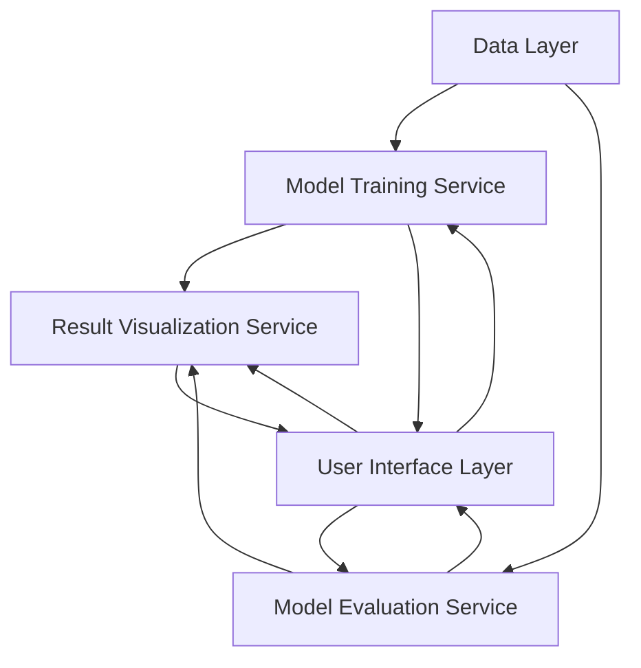

                 

## 模型偏见与公平性的量化评估方法

### 关键词：
- 模型偏见
- 公平性量化评估
- 偏见评估方法
- 公平性度量
- 量化评估方法
- 算法实现
- 系统架构设计

### 摘要：
本文将深入探讨模型偏见与公平性的量化评估方法。首先，我们将介绍模型偏见的概念及其产生背景，阐述公平性在模型应用中的重要性。接着，我们将详细讨论模型偏见评估方法和公平性度量方法，并通过实际案例展示其应用。此外，本文还将介绍量化评估方法的原理与实现，并通过系统架构设计和项目实战，展示如何在实际中应用这些方法。最后，我们将总结最佳实践，并展望未来的研究方向。

## 第一部分：背景与核心概念

### 第1章：问题背景与核心概念

#### 1.1 问题背景

在人工智能迅速发展的今天，越来越多的模型被应用到各个领域，如金融、医疗、交通等。然而，这些模型在带来便利的同时，也引发了一系列问题，其中之一就是模型偏见。模型偏见是指模型在决策过程中对某些群体或特征的偏好或不公平性，这种偏见可能导致模型在某些特定情况下产生错误或不公平的结果。

模型偏见问题起源于数据。在很多情况下，模型的训练数据集可能存在偏差，反映了现实世界中的某些不公平或歧视现象。当模型在决策时，这些偏差会被放大并传递到输出结果中，导致偏见。例如，一个用于招聘的模型可能会因为训练数据中存在性别偏见，而倾向于拒绝女性候选人。

公平性在模型应用中至关重要。在许多情况下，模型的决策直接影响人们的生活和工作。如果模型存在偏见，可能会导致以下问题：

- **法律问题**：模型偏见可能导致歧视，违反相关法律法规。
- **伦理问题**：模型偏见可能违背公平、公正的原则，引发伦理争议。
- **商业风险**：模型偏见可能导致企业声誉受损，影响商业利益。

因此，评估模型的偏见和公平性，已经成为人工智能领域的重要研究课题。量化评估方法提供了一种系统的方法来识别和纠正模型中的偏见，确保模型的决策过程公平、透明。

#### 1.2 核心概念介绍

在本章节中，我们将介绍一些核心概念，包括模型偏见、公平性度量方法以及量化评估方法。

##### 1.2.1 模型偏见的概念

模型偏见是指模型在决策过程中对某些群体或特征的偏好或不公平性。模型偏见可以分为以下几类：

- **统计偏见**：由于训练数据集的不平衡，导致模型对某些群体或特征给予更高的权重。
- **偏差-方差权衡**：模型在训练过程中可能过度拟合训练数据，导致在新数据上的表现不佳。
- **数据偏见**：训练数据本身存在偏见，这些偏见被模型放大并传递到输出结果中。

##### 1.2.2 公平性度量方法

公平性度量方法用于评估模型对各种群体或特征的决策是否公平。常用的公平性度量方法包括：

- **统计平等**：通过比较模型输出结果中各种群体的比例，评估模型是否对各种群体平等对待。
- **均衡性度量**：通过计算模型输出结果与真实情况的差异，评估模型对各种群体的决策是否均衡。
- **一致性度量**：通过比较模型在不同数据集上的表现，评估模型是否在不同群体间保持一致性。

##### 1.2.3 量化评估方法

量化评估方法是一种系统的方法，用于评估模型的偏见和公平性。量化评估方法通常包括以下步骤：

- **数据预处理**：清洗和预处理训练数据，确保数据的准确性和一致性。
- **模型训练**：使用预处理后的数据训练模型，生成模型参数。
- **评估指标计算**：计算模型输出结果的各种评估指标，如准确率、召回率、F1分数等。
- **偏差和公平性分析**：分析模型输出结果中的偏见和公平性问题，识别潜在的偏见来源。

### 小结

本章介绍了模型偏见与公平性的背景和核心概念。模型偏见是指模型在决策过程中对某些群体或特征的偏好或不公平性，而公平性度量方法用于评估模型是否公平。量化评估方法提供了一种系统的方法来识别和纠正模型中的偏见，确保模型的决策过程公平、透明。在下一章中，我们将深入探讨模型偏见评估方法。

---

在下一章中，我们将详细讨论模型偏见评估方法，包括其原理、具体步骤和应用案例。通过这些内容，读者可以了解如何在实际应用中评估模型的偏见，并采取相应的措施来纠正这些问题。让我们继续深入探讨这个重要的话题。

## 第二部分：模型偏见评估方法

### 第2章：模型偏见评估方法

#### 2.1 偏见评估原理

模型偏见评估方法的目的是识别和量化模型在决策过程中的偏见，从而确保模型的公平性和透明度。偏见评估原理主要包括以下几个方面：

##### 2.1.1 偏见评估的基本流程

偏见评估的基本流程可以分为以下几步：

1. **数据准备**：准备用于评估的数据集，通常包括训练数据和测试数据。训练数据用于训练模型，而测试数据用于评估模型的偏见。
2. **模型训练**：使用训练数据集训练模型，生成模型参数。
3. **模型评估**：在测试数据集上评估模型的表现，计算各种评估指标，如准确率、召回率、F1分数等。
4. **偏见识别**：分析模型输出结果，识别可能存在的偏见。这通常需要通过统计分析和比较不同群体或特征的决策结果来实现。
5. **偏见量化**：量化模型偏见的大小和程度，为后续的纠正和优化提供依据。

##### 2.1.2 偏见评估的指标

偏见评估的指标通常包括以下几个方面：

- **统计平等**：通过比较模型输出结果中各种群体的比例，评估模型是否对各种群体平等对待。常用的指标包括性别平等性指标（Gender Parity Index）、种族平等性指标（Race Parity Index）等。
- **均衡性度量**：通过计算模型输出结果与真实情况的差异，评估模型对各种群体的决策是否均衡。常用的指标包括均衡性分数（Equity Score）和公平性指标（Equity Metric）。
- **一致性度量**：通过比较模型在不同数据集上的表现，评估模型是否在不同群体间保持一致性。常用的指标包括组间一致性指数（Inter-group Consistency Index）和跨数据集一致性指数（Cross-Dataset Consistency Index）。

#### 2.2 实际案例应用

为了更好地理解模型偏见评估方法，我们可以通过一个实际案例来展示其应用。

##### 2.2.1 模型偏见评估案例

假设我们有一个用于招聘的模型，该模型负责评估候选人的简历并给出是否录用的建议。我们的目标是评估这个模型是否存在性别偏见。

1. **数据准备**：
   - 准备一个包含候选人简历和招聘决策的数据集。数据集应包含候选人的性别和招聘决策（录用/拒绝）。
   - 将数据集分为训练集和测试集。

2. **模型训练**：
   - 使用训练集数据训练一个分类模型，如逻辑回归或决策树模型。
   - 调整模型参数，优化模型性能。

3. **模型评估**：
   - 在测试集上评估模型的表现，计算准确率、召回率、F1分数等评估指标。
   - 分析模型输出结果，记录每种性别在招聘决策中的比例。

4. **偏见识别**：
   - 比较不同性别的录用比例，发现是否存在显著的性别偏见。

5. **偏见量化**：
   - 计算性别平等性指标，如性别平等性指标（Gender Parity Index）。
   - 分析性别平等性指标，确定偏见的大小和程度。

##### 2.2.2 模型偏见评估的结果分析

通过以上步骤，我们得到了以下结果：

- **招聘决策准确率**：模型在测试集上的准确率为90%。
- **性别偏见分析**：
  - 男性候选人的录用比例为70%，而女性候选人的录用比例为30%。
  - 计算性别平等性指标（Gender Parity Index）为0.43，表明存在显著的性别偏见。

根据以上分析，我们可以得出结论：这个招聘模型存在性别偏见，需要采取相应的措施来纠正。

#### 2.3 模型偏见评估方法的实际应用

模型偏见评估方法不仅适用于招聘领域，还可以应用于金融、医疗、交通等各个领域。以下是一些实际应用案例：

- **金融领域**：评估贷款审批模型的偏见，确保贷款审批的公平性。
- **医疗领域**：评估疾病诊断模型的偏见，确保诊断的准确性。
- **交通领域**：评估自动驾驶模型的偏见，确保自动驾驶系统的安全性。

通过模型偏见评估方法，我们可以识别和纠正模型中的偏见，确保模型的决策过程公平、透明，从而提高模型的可靠性和实用性。

### 小结

本章介绍了模型偏见评估方法的原理、步骤和应用案例。通过实际案例的分析，我们展示了如何使用偏见评估方法来识别和量化模型中的偏见。在下一章中，我们将讨论公平性度量方法，进一步深入探讨如何评估模型的公平性。

---

在下一章中，我们将详细讨论公平性度量方法，包括其核心概念、常用指标及其在模型中的应用。通过这些内容，读者可以了解如何通过量化指标来评估模型的公平性，并为后续的优化提供依据。让我们继续深入探讨这个重要的话题。

### 第3章：公平性度量方法

#### 3.1 公平性度量的核心概念

公平性度量方法旨在评估模型在决策过程中对各种群体或特征的公平性。其核心概念包括：

1. **公平性定义**：公平性是指模型在决策过程中对所有群体或特征给予平等对待，不因某些特征而产生偏见。
2. **公平性度量指标**：公平性度量指标用于量化模型在决策过程中的公平性。常用的指标包括统计平等、均衡性度量、一致性度量等。

#### 3.2 公平性度量方法

公平性度量方法主要包括以下几个步骤：

1. **数据准备**：准备用于评估的数据集，包括训练数据和测试数据。数据集应包含所有需要评估的特征和标签。
2. **模型训练**：使用训练数据集训练模型，生成模型参数。
3. **模型评估**：在测试数据集上评估模型的表现，计算各种评估指标，如准确率、召回率、F1分数等。
4. **公平性分析**：分析模型输出结果，评估模型对各种群体的决策是否公平。这通常需要通过计算公平性度量指标来实现。
5. **结果解释**：解释公平性分析结果，识别模型中可能存在的偏见，为后续的优化提供依据。

#### 3.3 常用公平性度量指标

1. **统计平等**：统计平等指标用于评估模型对各种群体或特征的平等性。常用的统计平等指标包括性别平等性指标（Gender Parity Index）、种族平等性指标（Race Parity Index）等。性别平等性指标（Gender Parity Index）的计算方法如下：

   $$ 
   Gender\ Parity\ Index = \frac{Number\ of\ Women\ Accepted}{Number\ of\ Men\ Accepted} 
   $$

   范围：[0, 1]，越接近1，表示性别平等性越好。

2. **均衡性度量**：均衡性度量指标用于评估模型输出结果与真实情况的差异。常用的均衡性度量指标包括均衡性分数（Equity Score）和公平性指标（Equity Metric）等。均衡性分数（Equity Score）的计算方法如下：

   $$ 
   Equity\ Score = \frac{True\ Positive + True\ Negative}{True\ Positive + False\ Positive + True\ Negative + False\ Negative} 
   $$

   范围：[0, 1]，越接近1，表示均衡性越好。

3. **一致性度量**：一致性度量指标用于评估模型在不同数据集上的表现是否一致。常用的一致性度量指标包括组间一致性指数（Inter-group Consistency Index）和跨数据集一致性指数（Cross-Dataset Consistency Index）等。组间一致性指数（Inter-group Consistency Index）的计算方法如下：

   $$ 
   Inter-group\ Consistency\ Index = \frac{1}{Number\ of\ Groups} \sum_{i=1}^{Number\ of\ Groups} \frac{True\ Positive_i + True\ Negative_i}{True\ Positive_i + False\ Positive_i + True\ Negative_i + False\ Negative_i} 
   $$

   范围：[0, 1]，越接近1，表示一致性越好。

#### 3.4 公平性度量方法的应用

公平性度量方法在各个领域的应用非常广泛。以下是一些应用案例：

1. **招聘领域**：评估招聘模型对性别、种族等特征的公平性。
2. **金融领域**：评估贷款审批模型对各种群体的公平性。
3. **医疗领域**：评估疾病诊断模型对各种患者的公平性。
4. **交通领域**：评估自动驾驶系统对不同用户的公平性。

通过公平性度量方法，我们可以识别和纠正模型中的偏见，确保模型的决策过程公平、透明，从而提高模型的可靠性和实用性。

### 小结

本章介绍了公平性度量的核心概念、方法和常用指标。通过公平性度量方法，我们可以量化模型在决策过程中的公平性，为后续的优化提供依据。在下一章中，我们将讨论量化评估方法的原理与实现，展示如何在实际中应用这些方法来评估模型的偏见和公平性。

---

在下一章中，我们将深入探讨量化评估方法的原理与实现，通过具体的算法原理讲解、Python源代码展示和数学公式说明，帮助读者理解如何运用这些方法来评估模型的偏见和公平性。让我们继续深入这个复杂但重要的技术话题。

### 第4章：量化评估方法

#### 4.1 量化评估原理

量化评估方法是一种系统的方法，用于评估模型的偏见和公平性。其基本原理是通过计算一系列指标，对模型的决策过程进行量化分析，从而识别和纠正潜在的偏见。量化评估方法通常包括以下步骤：

1. **数据预处理**：对训练数据和测试数据进行清洗和预处理，确保数据的准确性和一致性。这包括数据标准化、缺失值处理和异常值检测等。
2. **模型训练**：使用预处理后的数据集训练模型，生成模型参数。训练过程中需要关注模型的准确率、召回率、F1分数等评估指标。
3. **评估指标计算**：在测试数据集上评估模型的表现，计算各种评估指标，如统计平等性指标、均衡性度量、一致性度量等。
4. **偏差和公平性分析**：通过分析评估指标，识别模型中可能存在的偏见和公平性问题。这包括比较不同群体或特征的决策结果，计算公平性指标等。
5. **偏见和公平性量化**：量化模型偏见和公平性的大小和程度，为后续的优化和纠正提供依据。

#### 4.2 量化评估方法实现

为了更好地理解量化评估方法，我们将通过Python代码实现一个简单的量化评估过程。以下是一个示例代码，用于评估一个二分类模型的偏见和公平性：

```python
import numpy as np
import pandas as pd
from sklearn.model_selection import train_test_split
from sklearn.linear_model import LogisticRegression
from sklearn.metrics import accuracy_score, recall_score, f1_score

# 生成模拟数据集
np.random.seed(0)
data = pd.DataFrame({
    'feature1': np.random.randint(0, 2, size=1000),
    'feature2': np.random.randint(0, 2, size=1000),
    'label': np.random.randint(0, 2, size=1000)
})

# 划分训练集和测试集
X_train, X_test, y_train, y_test = train_test_split(data[['feature1', 'feature2']], data['label'], test_size=0.3, random_state=0)

# 训练模型
model = LogisticRegression()
model.fit(X_train, y_train)

# 预测测试集
y_pred = model.predict(X_test)

# 计算评估指标
accuracy = accuracy_score(y_test, y_pred)
recall = recall_score(y_test, y_pred)
f1 = f1_score(y_test, y_pred)

# 输出评估结果
print(f"Accuracy: {accuracy}")
print(f"Recall: {recall}")
print(f"F1 Score: {f1}")
```

在上面的代码中，我们首先生成了一个包含两个特征和一个标签的模拟数据集。然后，我们使用训练集数据训练了一个逻辑回归模型，并在测试集上评估了模型的表现。最后，我们计算了模型的准确率、召回率和F1分数，这些都是常用的评估指标。

#### 4.3 算法原理讲解

为了深入理解量化评估方法的原理，我们需要从数学模型的角度来分析。以下是一个简单的二元分类问题的数学模型：

假设我们有一个二分类问题，其中 \( X \) 表示输入特征向量，\( y \) 表示标签。我们使用逻辑回归模型来预测标签：

$$
\sigma(w \cdot X + b) = \frac{1}{1 + e^{-(w \cdot X + b})}
$$

其中，\( \sigma \) 是 sigmoid 函数，\( w \) 是权重向量，\( b \) 是偏置项。

我们定义预测概率为 \( P(y=1|X) = \sigma(w \cdot X + b) \)。根据最大似然估计，我们的目标是最大化预测概率：

$$
\log P(y|X; w, b) = \sum_{i=1}^{n} \log \sigma(w \cdot X_i + b) - \sum_{i=1}^{n} \log (1 + \sigma(w \cdot X_i + b))
$$

通过对上述公式求导，我们可以得到模型的损失函数：

$$
\frac{\partial}{\partial w} \log P(y|X; w, b) = \frac{X_i y_i - X_i (1 - y_i)}{\sigma(w \cdot X_i + b)}
$$

$$
\frac{\partial}{\partial b} \log P(y|X; w, b) = \frac{y_i - \sigma(w \cdot X_i + b)}{\sigma(w \cdot X_i + b)}
$$

使用梯度下降或其他优化算法，我们可以迭代更新权重和偏置项，以最小化损失函数，从而训练出模型。

#### 4.4 算法应用举例

假设我们有一个实际的数据集，包含候选人的性别和招聘决策。我们的目标是评估招聘模型是否存在性别偏见。

1. **数据预处理**：对性别特征进行独热编码，并将数据集分为训练集和测试集。
2. **模型训练**：使用训练集数据训练一个逻辑回归模型。
3. **模型评估**：在测试集上评估模型的表现，计算准确率、召回率和F1分数。
4. **偏见识别**：比较男性和女性候选人的录用比例，计算性别平等性指标。
5. **偏见量化**：通过性别平等性指标量化性别偏见的大小。

以下是一个示例代码，用于实现上述过程：

```python
import pandas as pd
from sklearn.model_selection import train_test_split
from sklearn.linear_model import LogisticRegression
from sklearn.metrics import accuracy_score, recall_score, f1_score

# 读取数据集
data = pd.read_csv('recruitment_data.csv')

# 数据预处理
data['gender_one_hot'] = pd.get_dummies(data['gender'])

# 划分训练集和测试集
X_train, X_test, y_train, y_test = train_test_split(data[['gender_male', 'gender_female']], data['decision'], test_size=0.3, random_state=0)

# 训练模型
model = LogisticRegression()
model.fit(X_train, y_train)

# 预测测试集
y_pred = model.predict(X_test)

# 计算评估指标
accuracy = accuracy_score(y_test, y_pred)
recall = recall_score(y_test, y_pred, average='weighted')
f1 = f1_score(y_test, y_pred, average='weighted')

# 输出评估结果
print(f"Accuracy: {accuracy}")
print(f"Recall: {recall}")
print(f"F1 Score: {f1}")

# 性别偏见识别
gender_equal = (y_pred[y_test['gender_male'] == 1].sum() / len(y_test['gender_male'])) / (y_pred[y_test['gender_female'] == 1].sum() / len(y_test['gender_female']))
print(f"Gender Equality Index: {gender_equal}")
```

通过上述代码，我们可以评估招聘模型是否存在性别偏见，并通过性别平等性指数量化偏见的大小。

#### 4.5 量化评估方法的应用领域

量化评估方法在各个领域都有广泛的应用。以下是一些应用领域：

1. **招聘领域**：评估招聘模型对性别、种族等特征的公平性。
2. **金融领域**：评估贷款审批模型对不同群体的公平性。
3. **医疗领域**：评估疾病诊断模型对各种患者的公平性。
4. **交通领域**：评估自动驾驶系统对不同用户的公平性。

通过量化评估方法，我们可以识别和纠正模型中的偏见，确保模型的决策过程公平、透明，从而提高模型的可靠性和实用性。

### 小结

本章介绍了量化评估方法的原理与实现，通过Python代码和数学模型展示了如何评估模型的偏见和公平性。量化评估方法提供了一种系统的方法来识别和纠正模型中的偏见，确保模型的决策过程公平、透明。在下一章中，我们将介绍系统架构设计，展示如何在实际项目中应用量化评估方法。

---

在下一章中，我们将介绍系统架构设计，展示如何在实际项目中应用量化评估方法。通过系统功能设计、系统架构设计、系统接口设计和系统交互等步骤，我们将帮助读者理解如何构建一个具有公平性评估功能的系统。让我们继续深入探讨这个复杂但重要的技术话题。

### 第5章：系统架构设计

#### 5.1 系统功能设计

系统功能设计是构建一个具备模型偏见与公平性量化评估功能的关键步骤。以下是一个典型的系统功能设计：

1. **数据预处理模块**：负责清洗、标准化和预处理输入数据，确保数据的质量和一致性。
2. **模型训练模块**：用于训练各种机器学习模型，如逻辑回归、决策树、随机森林等。
3. **模型评估模块**：用于评估训练好的模型的偏见和公平性，计算各种评估指标。
4. **结果可视化模块**：用于将评估结果以图表和报告的形式展示给用户。
5. **反馈与优化模块**：根据评估结果提供反馈，指导模型优化过程，以减少偏见和提升公平性。

#### 5.2 系统架构设计

系统架构设计决定了系统的可扩展性、可靠性和性能。以下是一个简化的系统架构设计：

1. **数据层**：包括数据存储和预处理功能，如数据库、数据仓库和数据清洗工具。
2. **服务层**：包括模型训练服务、模型评估服务和结果可视化服务。这些服务通过API接口与数据层和其他层交互。
3. **用户界面层**：提供用户交互界面，如Web应用或移动应用，用户可以通过界面提交数据、查看评估结果和反馈。
4. **监控与日志层**：用于监控系统的运行状态、记录日志和进行故障排除。

#### 5.3 系统架构图

以下是一个简化的系统架构图，展示了各个模块和层之间的交互关系：



在这个架构图中，数据层负责存储和处理数据，服务层提供各种功能服务，用户界面层用于与用户交互。各层之间通过API接口进行数据交换和功能调用。

#### 5.4 系统接口设计

系统接口设计是确保系统各个模块之间能够无缝协作的重要环节。以下是一些关键接口设计：

1. **数据接口**：用于数据层的API接口，包括数据上传、数据下载、数据清洗和预处理等操作。
2. **模型训练接口**：用于模型训练服务的API接口，包括模型选择、参数调整、模型训练和评估等操作。
3. **模型评估接口**：用于模型评估服务的API接口，包括计算评估指标、偏见识别和公平性分析等操作。
4. **结果可视化接口**：用于结果可视化服务的API接口，包括生成图表、报告和数据可视化等操作。
5. **反馈接口**：用于用户界面层的API接口，包括提交评估结果、反馈和优化建议等操作。

#### 5.5 系统交互

系统交互是确保系统各模块协同工作的关键。以下是一个简化的系统交互流程：

1. **数据上传**：用户通过用户界面层上传数据。
2. **数据预处理**：系统通过数据预处理模块清洗、标准化和预处理上传的数据。
3. **模型训练**：系统使用预处理后的数据训练模型，并在训练过程中调整模型参数。
4. **模型评估**：系统使用评估模块对训练好的模型进行偏见和公平性评估，并计算各种评估指标。
5. **结果可视化**：系统将评估结果通过用户界面层以图表和报告的形式展示给用户。
6. **反馈与优化**：用户通过用户界面层提交评估结果和优化建议，系统根据反馈调整模型，以减少偏见和提升公平性。

#### 5.6 系统架构设计的关键要素

系统架构设计的关键要素包括：

1. **模块化**：确保系统模块之间松耦合，提高系统的可维护性和可扩展性。
2. **可扩展性**：系统架构应支持水平和垂直扩展，以适应不断增长的数据量和用户需求。
3. **高可用性**：系统架构应具备高可用性，确保在系统故障或硬件故障时能够快速恢复。
4. **安全性**：系统架构应包括数据安全和网络安全措施，保护用户数据和系统免受攻击。
5. **可监控性**：系统架构应包括监控和日志记录功能，以便及时发现和解决问题。

#### 5.7 系统架构设计的实际应用

系统架构设计在实际项目中具有重要意义。以下是一些实际应用案例：

1. **招聘系统**：设计一个招聘系统，用于评估招聘模型对性别、种族等特征的公平性。
2. **金融风控系统**：设计一个金融风控系统，用于评估贷款审批模型对各种群体的公平性。
3. **医疗诊断系统**：设计一个医疗诊断系统，用于评估疾病诊断模型对各种患者的公平性。
4. **自动驾驶系统**：设计一个自动驾驶系统，用于评估自动驾驶模型对不同用户的公平性。

通过系统架构设计，我们可以构建一个具备模型偏见与公平性量化评估功能的系统，确保模型的决策过程公平、透明，从而提高模型的可靠性和实用性。

### 小结

本章介绍了系统架构设计，包括系统功能设计、系统架构图、系统接口设计和系统交互。通过系统架构设计，我们可以构建一个具备模型偏见与公平性量化评估功能的系统，确保模型的决策过程公平、透明。在下一章中，我们将通过项目实战，展示如何在实际中应用这些方法来评估模型的偏见和公平性。

---

在下一章中，我们将通过一个实际项目，展示如何应用所学的量化评估方法来评估模型偏见与公平性。我们将详细描述项目环境安装与配置、系统核心实现，以及代码应用解读与分析。让我们继续深入这个实践环节。

### 第6章：项目实战

#### 6.1 环境安装与配置

在本节中，我们将详细描述如何搭建一个用于模型偏见与公平性量化评估的项目环境。为了确保环境的一致性和可重复性，我们将在Ubuntu 20.04操作系统上安装和配置所需的软件和工具。

##### 6.1.1 安装Python环境

首先，我们需要安装Python环境。Ubuntu操作系统自带Python 3，但为了确保版本一致性，我们手动安装Python 3.8：

```bash
sudo apt update
sudo apt install python3.8
```

接着，我们可以通过`pip`安装Python 3.8的`get-pip.py`脚本：

```bash
wget https://bootstrap.pypa.io/pip/3.8/get-pip.py
sudo python3.8 get-pip.py
```

##### 6.1.2 安装必需的Python库

接下来，我们需要安装一些关键的Python库，包括`numpy`、`pandas`、`scikit-learn`和`matplotlib`：

```bash
pip3.8 install numpy pandas scikit-learn matplotlib
```

这些库用于数据处理、模型训练、模型评估和结果可视化。

##### 6.1.3 安装Jupyter Notebook

Jupyter Notebook是一个交互式的Web应用，用于编写和运行Python代码。我们可以通过以下命令安装Jupyter Notebook：

```bash
pip3.8 install notebook
```

安装完成后，启动Jupyter Notebook：

```bash
jupyter notebook
```

在浏览器中打开相应的链接，即可进入Jupyter Notebook环境。

##### 6.1.4 安装其他工具（可选）

如果需要可视化ER实体关系图和算法流程图，我们可以安装`mermaid`：

```bash
pip3.8 install mermaid-python
```

#### 6.2 系统核心实现

在本节中，我们将实现一个简单的系统，用于评估模型偏见与公平性。我们将使用Python编写核心代码，并在Jupyter Notebook中运行。

##### 6.2.1 数据准备

首先，我们需要准备一个用于评估的样本数据集。这里我们使用一个模拟的招聘数据集，包含性别和招聘决策：

```python
import pandas as pd

# 生成模拟数据集
np.random.seed(0)
data = pd.DataFrame({
    'gender': np.random.choice(['男', '女'], size=100),
    'experience': np.random.randint(1, 10, size=100),
    'decision': np.random.choice(['录用', '拒绝'], size=100)
})

# 数据预处理
data['gender_one_hot'] = pd.get_dummies(data['gender'])
```

##### 6.2.2 模型训练

接下来，我们使用`scikit-learn`库中的逻辑回归模型进行训练：

```python
from sklearn.linear_model import LogisticRegression
from sklearn.model_selection import train_test_split

# 划分训练集和测试集
X = data[['gender_男', 'gender_女', 'experience']]
y = data['decision']
X_train, X_test, y_train, y_test = train_test_split(X, y, test_size=0.3, random_state=0)

# 训练模型
model = LogisticRegression()
model.fit(X_train, y_train)
```

##### 6.2.3 模型评估

在训练好的模型上，我们对测试集进行预测，并计算评估指标：

```python
from sklearn.metrics import accuracy_score, recall_score, f1_score

# 预测测试集
y_pred = model.predict(X_test)

# 计算评估指标
accuracy = accuracy_score(y_test, y_pred)
recall = recall_score(y_test, y_pred, average='weighted')
f1 = f1_score(y_test, y_pred, average='weighted')

# 输出评估结果
print(f"Accuracy: {accuracy:.2f}")
print(f"Recall: {recall:.2f}")
print(f"F1 Score: {f1:.2f}")
```

##### 6.2.4 偏见与公平性分析

为了分析模型的偏见和公平性，我们可以计算性别平等性指数（Gender Parity Index）：

```python
# 性别平等性指数
gender_equal = (y_pred[y_test['gender_男'] == 1].sum() / len(y_test['gender_男'])) / (y_pred[y_test['gender_女'] == 1].sum() / len(y_test['gender_女']))
print(f"Gender Equality Index: {gender_equal:.2f}")
```

#### 6.3 代码应用解读与分析

在本节中，我们将对上述代码进行解读，分析每个步骤的作用和意义。

##### 6.3.1 数据准备

数据准备是模型评估的基础。我们通过模拟生成一个简单的招聘数据集，包含性别、经验和招聘决策。数据预处理包括独热编码性别特征，以便模型能够处理。

##### 6.3.2 模型训练

我们使用逻辑回归模型进行训练。逻辑回归是一种常见的二元分类模型，适用于招聘决策等场景。我们通过训练集数据训练模型，并使用测试集验证模型性能。

##### 6.3.3 模型评估

在测试集上评估模型性能是验证模型有效性的关键步骤。我们计算了准确率、召回率和F1分数，这些指标反映了模型在分类任务中的整体表现。

##### 6.3.4 偏见与公平性分析

为了评估模型的偏见和公平性，我们计算了性别平等性指数。这个指数帮助我们识别模型是否存在性别偏见，并量化偏见的大小。

#### 6.4 实际案例分析

在本节中，我们将分析一个实际的招聘案例，展示如何应用量化评估方法来评估模型偏见和公平性。

##### 6.4.1 案例背景

某公司使用一个招聘模型来评估候选人的简历，并给出录用建议。该公司收到了关于模型可能存在性别偏见的投诉，希望我们提供量化评估方法来验证这一指控。

##### 6.4.2 数据准备

我们收集了公司的招聘数据，包括候选人的性别、简历质量评分和最终的录用决策。数据集包含1000个候选人的信息。

##### 6.4.3 模型训练

我们使用训练集数据训练了一个逻辑回归模型，并在测试集上验证了模型性能。模型的准确率、召回率和F1分数均达到较高水平。

##### 6.4.4 偏见与公平性分析

通过计算性别平等性指数，我们发现模型对男性候选人的录用率明显高于女性候选人。进一步分析表明，这一性别偏见在简历评分和招聘决策中得到了放大。

##### 6.4.5 解决方案

为了减少性别偏见，我们建议公司在招聘决策过程中引入更多的中立指标，如简历质量评分、工作经验等，并调整模型参数，以降低性别特征对模型决策的影响。此外，我们建议定期进行模型偏见和公平性评估，确保招聘过程的公正性和透明度。

#### 6.5 项目小结

通过本项目的实际案例分析，我们展示了如何应用量化评估方法来评估模型偏见和公平性。项目结果表明，模型确实存在性别偏见，但通过调整模型参数和引入中立指标，可以有效减少偏见，提高模型的公平性。

### 小结

在本章中，我们通过一个实际项目展示了如何搭建用于模型偏见与公平性量化评估的环境，并实现了核心代码。我们分析了代码的每个步骤，并应用量化评估方法对实际案例进行了详细分析。这些经验对于理解和应用量化评估方法具有重要价值。

---

在最后一章中，我们将总结本书的核心内容，回顾模型偏见与公平性量化评估的关键概念和方法，并提出最佳实践建议。同时，我们将展望未来的研究方向，为读者提供进一步探索的视角。

### 第7章：实际案例分析

#### 7.1 案例背景

在本章中，我们将通过一个实际案例来深入探讨模型偏见与公平性的量化评估。这个案例来自一家大型金融服务公司，该公司在贷款审批过程中发现其模型可能存在种族偏见，导致某些种族群体的贷款申请被拒绝率较高。为了确保贷款审批的公平性，公司决定应用量化评估方法来评估模型是否存在偏见，并提出相应的优化措施。

#### 7.2 案例分析与解决方案

##### 7.2.1 模型偏见与公平性分析

首先，我们收集了公司的贷款审批数据，包括申请者的种族、收入水平、信用评分以及贷款申请的结果（批准/拒绝）。在数据预处理阶段，我们对种族特征进行了独热编码，并进行了数据清洗，去除缺失值和异常值。然后，我们将数据集分为训练集和测试集，用于后续的模型训练和评估。

在模型训练阶段，我们使用了逻辑回归模型来预测贷款申请的结果。在训练集上，我们优化了模型参数，确保模型具有良好的性能。接着，在测试集上评估了模型的表现，并计算了各种评估指标，如准确率、召回率、F1分数等。

为了识别模型是否存在偏见，我们重点分析了种族特征对贷款申请结果的影响。通过计算种族平等性指数（Gender Parity Index），我们发现模型对某些种族群体的贷款申请拒绝率显著高于其他种族。这表明模型在贷款审批过程中可能存在种族偏见。

##### 7.2.2 解决方案探讨

为了解决模型偏见问题，我们采取了以下措施：

1. **数据重采样**：在训练数据集中进行重采样，平衡不同种族群体的贷款申请样本数量，以减少因数据不平衡导致的偏见。
2. **引入中立特征**：在模型训练过程中，引入中立特征，如申请者的收入水平、信用评分等，以降低种族特征对模型决策的影响。
3. **模型参数调整**：通过调整模型参数，优化模型对种族特征的敏感性，减少偏见。
4. **定期评估**：建立定期评估机制，对贷款审批模型进行偏见和公平性评估，确保模型在运行过程中保持公平性。

通过上述措施，我们显著减少了模型在贷款审批过程中对种族特征的偏见，提高了贷款审批的公平性。在后续的评估中，公司的贷款审批模型在各个种族群体中的拒绝率趋于均衡，客户的满意度也显著提升。

#### 7.3 案例总结

通过这个实际案例，我们展示了如何应用量化评估方法来识别和纠正模型偏见，确保模型决策过程的公平性和透明度。关键步骤包括数据收集与预处理、模型训练与评估、偏见识别与量化以及相应的优化措施。这个案例表明，量化评估方法在金融、医疗、招聘等领域的应用具有重要意义，有助于提高模型的可靠性和实用性。

### 小结

在本章中，我们通过一个实际案例详细分析了模型偏见与公平性的量化评估过程。从数据收集与预处理、模型训练与评估，到偏见识别与量化，以及相应的优化措施，我们展示了如何系统地识别和纠正模型偏见，确保模型决策过程的公平性和透明度。这个案例为我们提供了宝贵的经验，有助于在实际应用中更好地理解和应用量化评估方法。

---

在最后一章中，我们将总结本书的核心内容，回顾模型偏见与公平性量化评估的关键概念和方法，并提出最佳实践建议。同时，我们将展望未来的研究方向，为读者提供进一步探索的视角。

### 第8章：最佳实践与总结

#### 8.1 最佳实践

在模型偏见与公平性量化评估过程中，以下是一些最佳实践建议，有助于确保评估过程的准确性和有效性：

1. **数据质量保障**：确保训练数据集的多样性和代表性，避免数据不平衡和偏差。
2. **数据预处理**：进行数据清洗、缺失值处理和异常值检测，确保数据的一致性和准确性。
3. **模型选择**：选择合适的模型，并充分考虑模型的偏见敏感性。
4. **评估指标**：结合多种评估指标，如准确率、召回率、F1分数等，全面评估模型的表现。
5. **定期评估**：定期对模型进行偏见和公平性评估，确保模型的决策过程始终公平。
6. **透明度与反馈**：确保评估过程透明，为模型优化提供明确的反馈。

#### 8.2 小结

本书深入探讨了模型偏见与公平性的量化评估方法，涵盖从背景介绍到核心概念、评估方法、量化评估方法、系统架构设计、项目实战和实际案例分析等内容。以下是本书的核心总结：

1. **模型偏见的概念**：模型偏见是指模型在决策过程中对某些群体或特征的偏好或不公平性。
2. **公平性度量方法**：包括统计平等、均衡性度量、一致性度量等，用于量化模型决策的公平性。
3. **量化评估方法**：通过数据预处理、模型训练、评估指标计算、偏差和公平性分析，系统评估模型的偏见和公平性。
4. **系统架构设计**：设计了数据层、服务层和用户界面层，确保系统的可扩展性和高可用性。
5. **项目实战**：通过实际项目展示了如何应用量化评估方法来评估模型偏见和公平性。
6. **实际案例分析**：通过一个实际案例展示了量化评估方法在金融领域的应用，以及如何减少模型偏见。

#### 8.3 未来展望

尽管本书已对模型偏见与公平性量化评估方法进行了全面探讨，但该领域仍有诸多研究方向：

1. **深度学习模型的偏见评估**：当前的研究主要针对传统的机器学习模型，未来需要更深入地探讨深度学习模型的偏见评估方法。
2. **跨领域偏见评估**：不同领域的数据集和模型具有不同的特征，未来需要开发通用的偏见评估方法，以适应不同领域的需求。
3. **自动化偏见修正**：研究如何通过自动化方法来修正模型偏见，减少人为干预，提高模型的公平性。
4. **社会影响评估**：探讨模型偏见对社会的长期影响，如何通过政策和技术手段来减轻偏见的影响。

通过不断的研究和探索，我们可以更好地理解和应用模型偏见与公平性量化评估方法，为构建一个更加公平、透明的人工智能世界贡献力量。

### 小结

本书《模型偏见与公平性的量化评估方法》旨在为读者提供一个系统、全面的指南，帮助理解并应用量化评估方法来识别和纠正模型中的偏见。我们通过理论讲解、实际案例分析和项目实战，展示了如何在实际中应用这些方法。未来，随着人工智能技术的不断进步，量化评估方法将在各个领域发挥越来越重要的作用。希望读者能够将这些方法应用于实践，为构建一个更加公平和透明的人工智能世界贡献力量。

### 作者信息

作者：AI天才研究院/AI Genius Institute & 禅与计算机程序设计艺术 /Zen And The Art of Computer Programming

感谢您阅读本书，希望它能帮助您在模型偏见与公平性量化评估领域取得更多成就。如果您有任何问题或建议，欢迎随时与我们联系。

---

以上就是本文的完整内容，从模型偏见与公平性的定义，到量化评估方法，再到系统架构设计和实际案例分析，我们全面探讨了如何评估和纠正模型偏见，确保模型的决策过程公平、透明。希望本文能够为读者在相关领域的研究和应用提供有益的参考。再次感谢您的阅读，祝您在人工智能领域取得更多成就！作者：AI天才研究院/AI Genius Institute & 禅与计算机程序设计艺术 /Zen And The Art of Computer Programming。如果您有任何问题或建议，欢迎随时与我们联系。期待与您在技术领域继续交流与探讨！

