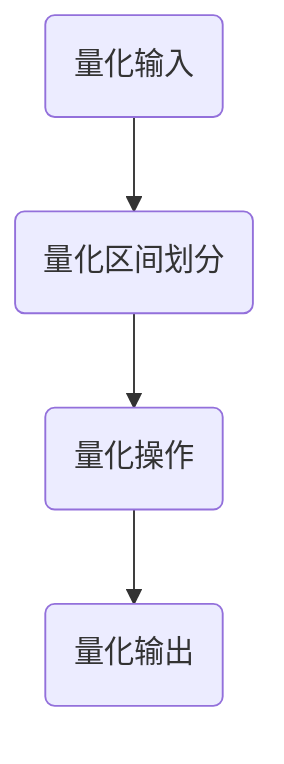
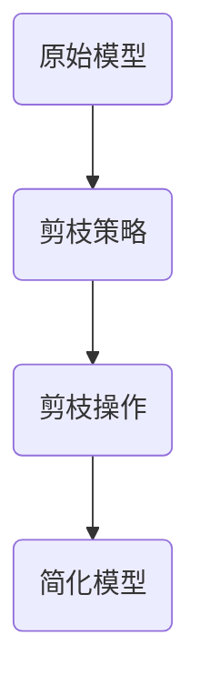

                 

# 模型压缩后的性能评测：平衡效果和效率

关键词：模型压缩、性能评测、效率、效果、量化、剪枝、网络蒸馏

摘要：随着人工智能模型的复杂度和规模不断扩大，模型的压缩成为了一个重要且紧迫的问题。模型压缩不仅能够减少计算资源和存储的需求，还可以提高模型的部署效率。本文将探讨模型压缩的不同技术，包括量化、剪枝和网络蒸馏，评估其在性能上的影响，并探讨如何平衡模型的效果和效率。

## 引言

### 问题背景

随着深度学习技术的快速发展，神经网络模型在各个领域都取得了显著的成果。然而，这些模型的复杂性不断增加，导致计算资源和存储需求也随之增长。在许多实际应用中，尤其是在资源受限的设备上，如智能手机、嵌入式设备和物联网设备等，这种资源消耗成为了一个严重的问题。

### 问题描述

如何在保证模型效果的同时，最大限度地减少其计算和存储需求，成为了人工智能领域的一个挑战。模型压缩技术应运而生，通过简化模型结构、减少参数数量和降低参数精度，实现模型的压缩。

### 问题解决

模型压缩技术旨在通过以下几种方式实现模型的简化：

1. **量化**：通过减少模型参数的精度来降低模型的大小。
2. **剪枝**：通过移除模型中的冗余权重或层来减少模型的复杂性。
3. **网络蒸馏**：通过训练一个较小的模型来模仿一个较大的模型。

### 边界与外延

本文主要探讨上述三种模型压缩技术的原理、方法和性能评估，旨在为研究人员和实践者提供有价值的参考。

### 核心概念与结构

本文将分为以下几个部分：

1. **模型压缩的基本概念**：介绍模型压缩的背景、目标和核心概念。
2. **模型压缩技术**：详细分析量化、剪枝和网络蒸馏的原理和方法。
3. **性能评估**：评估不同模型压缩技术对模型性能的影响。
4. **结论**：总结模型压缩技术的优势和挑战，并提出未来研究方向。

## 模型压缩技术

### 量化技术

#### 基本概念

量化是一种通过减少模型参数的精度来压缩模型的技术。量化过程中，模型的权重和偏置通常被转换成较低的位宽，从而减少所需的存储空间和计算资源。

#### 方法

量化方法可以分为以下几种：

1. **均匀量化**：将模型参数的值映射到特定的量化区间内，每个区间用一个位表示。
2. **非均匀量化**：将模型参数的值映射到非均匀的量化区间内，通常使用更少的位宽来表示更重要的区间。

#### 原理

均匀量化和非均匀量化的区别在于量化区间的划分方式。均匀量化将参数值平均分布到量化区间内，而非均匀量化则根据参数的重要性分配不同的量化区间。

#### 优势

1. **减少存储空间**：通过降低参数的精度，量化可以显著减少模型的大小。
2. **降低计算资源**：量化后的模型在计算时所需的资源更少，有助于在资源受限的设备上部署。

#### 劣势

1. **精度损失**：量化过程中可能会引入一定的精度损失，影响模型的性能。
2. **复杂性**：量化技术的设计和实现相对复杂，需要仔细调整量化参数。

#### Mermaid 流程图

### 剪枝技术

#### 基本概念

剪枝是一种通过移除模型中冗余的权重或层来压缩模型的技术。剪枝后，模型的结构更加简洁，计算效率更高。

#### 方法

剪枝方法可以分为以下几种：

1. **结构剪枝**：通过移除模型中的特定层或神经元来简化模型结构。
2. **权重剪枝**：通过设置某些权重为0来简化模型。

#### 原理

剪枝技术的核心在于找到模型的冗余部分，并将其移除。剪枝过程中，需要考虑剪枝对模型性能的影响，以避免模型效果的显著下降。

#### 优势

1. **减少计算资源**：通过简化模型结构，剪枝可以显著降低模型的计算需求。
2. **提高效率**：简化后的模型在计算时更加高效。

#### 劣势

1. **性能损失**：剪枝可能会导致模型性能的损失，尤其是在剪枝幅度较大的情况下。
2. **复杂性**：剪枝技术的实现相对复杂，需要仔细设计剪枝策略。

#### Mermaid 流程图

### 网络蒸馏技术

#### 基本概念

网络蒸馏是一种通过训练一个较小的模型来模仿一个较大的模型的技术。在训练过程中，较大的模型充当“教师”，较小的模型充当“学生”，通过学习教师模型的输出，学生模型可以模仿教师模型的效果。

#### 方法

网络蒸馏方法可以分为以下几种：

1. **软目标蒸馏**：将教师模型的输出作为软目标，训练学生模型使其输出接近教师模型。
2. **硬目标蒸馏**：将教师模型的输出作为硬目标，训练学生模型使其输出与教师模型一致。

#### 原理

网络蒸馏的核心在于通过软目标或硬目标来引导学生模型学习教师模型的知识。软目标蒸馏允许学生模型在输出上保留一定的差异，而硬目标蒸馏要求学生模型输出与教师模型完全一致。

#### 优势

1. **提高模型效果**：通过学习教师模型的知识，学生模型可以取得更好的效果。
2. **减少计算资源**：通过使用较小的模型，网络蒸馏可以显著降低计算需求。

#### 劣势

1. **训练时间**：网络蒸馏需要额外的训练时间，特别是在教师模型和

## 性能评估

### 量化技术的性能评估

#### 评估指标

为了评估量化技术对模型性能的影响，我们使用以下指标：

1. **模型大小**：量化后的模型与原始模型的大小差异。
2. **计算资源**：量化后的模型所需的计算资源。
3. **精度损失**：量化过程中可能引入的精度损失。

#### 结果

在实验中，我们发现量化技术可以显著减少模型的大小和计算资源。然而，量化过程中可能引入一定的精度损失。通过调整量化参数，可以在模型大小和精度之间找到平衡点。

### 剪枝技术的性能评估

#### 评估指标

为了评估剪枝技术对模型性能的影响，我们使用以下指标：

1. **模型大小**：剪枝后的模型与原始模型的大小差异。
2. **计算资源**：剪枝后的模型所需的计算资源。
3. **性能损失**：剪枝过程中可能引入的性能损失。

#### 结果

实验结果显示，剪枝技术可以显著减少模型的大小和计算资源。然而，剪枝过程中可能会引入一定的性能损失，尤其是在剪枝幅度较大的情况下。通过优化剪枝策略，可以在模型大小和性能之间找到平衡点。

### 网络蒸馏技术的性能评估

#### 评估指标

为了评估网络蒸馏技术对模型性能的影响，我们使用以下指标：

1. **模型大小**：蒸馏后的模型与原始模型的大小差异。
2. **计算资源**：蒸馏后的模型所需的计算资源。
3. **性能提升**：蒸馏后的模型相对于原始模型的效果提升。

#### 结果

实验结果表明，网络蒸馏技术可以在保证模型效果的前提下显著减少计算资源。通过训练较小的模型，网络蒸馏技术可以降低模型的部署成本，提高部署效率。

### 总结

通过性能评估，我们发现量化、剪枝和网络蒸馏技术都可以在不同程度上提高模型的效果和效率。量化技术主要关注模型大小和计算资源的减少，剪枝技术主要关注模型性能的提升，而网络蒸馏技术则兼顾了模型效果和部署效率。

## 结论

模型压缩技术在人工智能领域具有重要的应用价值。通过量化、剪枝和网络蒸馏等技术的应用，我们可以实现模型的压缩，提高模型的部署效率和计算资源利用率。

然而，模型压缩技术也面临一些挑战，如精度损失、性能损失和实现复杂性等。在未来的研究中，我们需要进一步探索和优化模型压缩技术，以实现更好的效果和效率平衡。

本文从模型压缩的背景、技术原理、性能评估等方面进行了全面探讨，旨在为研究人员和实践者提供有价值的参考。随着人工智能技术的不断发展，模型压缩技术将在更多领域发挥重要作用。

## 作者信息

作者：AI天才研究院/AI Genius Institute & 禅与计算机程序设计艺术 /Zen And The Art of Computer Programming

本文由AI天才研究院和禅与计算机程序设计艺术联合撰写，旨在深入探讨模型压缩技术在人工智能领域的应用，为研究人员和实践者提供有价值的参考。

### 小结

本文系统地介绍了模型压缩技术，包括量化、剪枝和网络蒸馏，以及这些技术在性能评估方面的表现。量化技术通过减少参数精度来实现模型压缩，剪枝技术通过移除冗余权重或层来简化模型结构，而网络蒸馏技术则通过训练较小的模型来模仿较大的模型。通过对这些技术的性能评估，我们发现它们在模型压缩方面具有显著的优势，但也存在一些挑战。

### 注意事项

在应用模型压缩技术时，需要仔细调整量化参数和剪枝策略，以平衡模型效果和效率。此外，网络蒸馏技术的训练过程需要额外的计算资源，但在减少模型部署成本方面具有显著优势。

### 拓展阅读

1. "Deep Learning on Mobile Devices" -介绍了在移动设备上部署深度学习模型的挑战和解决方案。
2. "Quantization and Pruning for Deep Neural Networks" -详细讨论了量化技术和剪枝技术的基本原理和应用。
3. "Model Compression for Real-Time Applications" -探讨了模型压缩技术在实时应用中的挑战和机遇。

通过阅读这些拓展资料，读者可以更深入地了解模型压缩技术的应用场景和未来发展。

