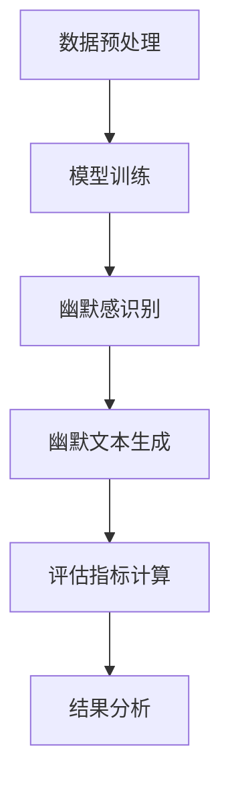
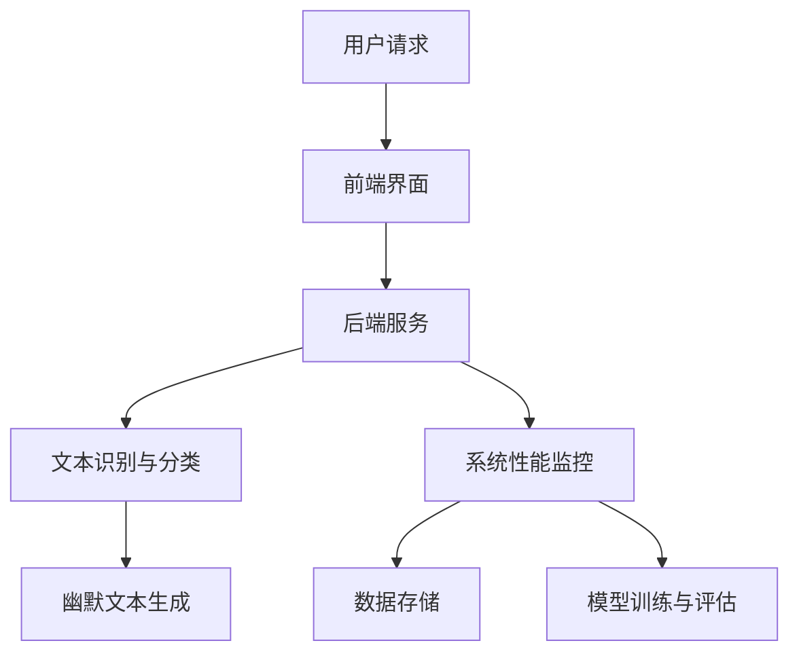
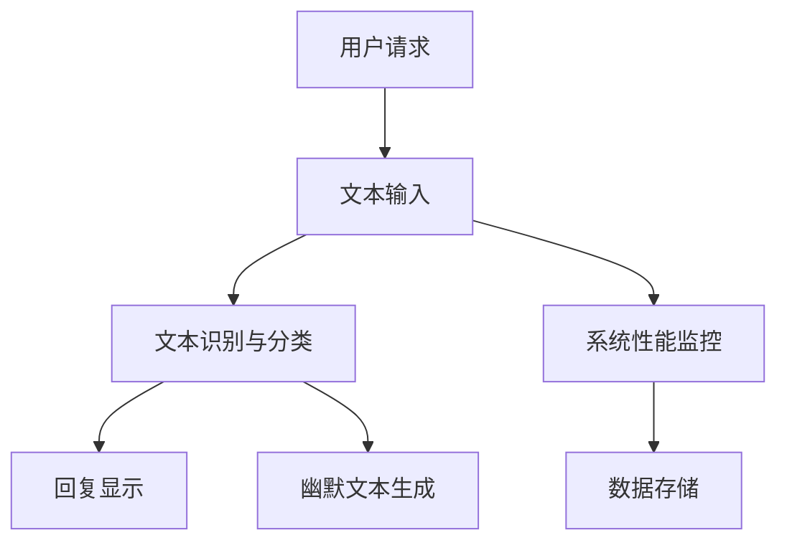
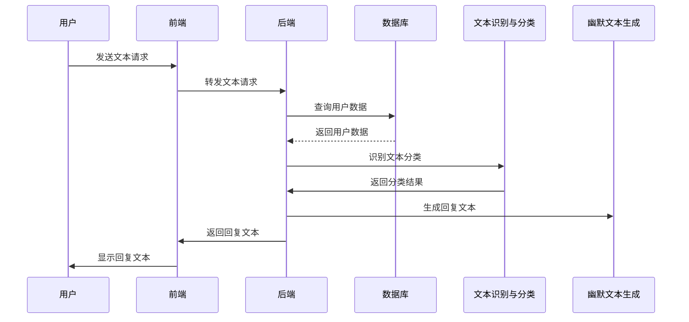

                 

## 文章标题

### 模型幽默感测试：评估高级语言理解

关键词：模型幽默感、高级语言理解、测试方法、评估指标、数学模型、系统架构、项目实战

摘要：本文将探讨如何通过模型幽默感测试来评估高级语言理解能力。我们将从问题背景出发，介绍核心概念与原理，详细讲解算法、数学模型和系统架构，通过项目实战验证方法的有效性，并总结最佳实践与未来研究方向。

----------------------------------------------------------------

### 背景介绍

#### 核心概念术语说明

在开始讨论模型幽默感测试之前，我们需要明确一些关键概念。

1. **幽默感**：幽默感是一种心理和情感状态，它通常表现为对讽刺、双关语、反讽等语言技巧的欣赏和感知。
2. **高级语言理解**：高级语言理解指的是机器或模型对自然语言进行深层次分析、理解和生成的能力。
3. **模型幽默感测试**：模型幽默感测试是一种评估模型是否具备高级语言理解能力的手段，通过设计特定的测试场景和评估指标来检验模型的表现。

#### 问题背景

随着人工智能技术的发展，机器对自然语言的理解能力逐渐增强。然而，如何评估机器是否真正理解了人类语言的幽默元素，仍然是一个挑战。幽默感是人类智慧的一部分，它体现了语言的创造性和复杂性。因此，研究模型幽默感测试具有重要的理论和实际意义。

#### 问题描述

目前，评估模型幽默感主要面临以下问题：

1. **测试场景设计**：如何设计具有代表性的测试场景，以全面评估模型对幽默内容的理解和生成能力？
2. **评估指标**：如何建立科学、全面的评估指标体系，以准确衡量模型的幽默感表现？
3. **实现方法**：如何通过算法和数学模型，实现对模型幽默感的高效评估？

#### 问题解决

为了解决上述问题，我们需要从以下几个方面进行探讨：

1. **核心概念与联系**：明确模型幽默感测试的核心概念，如幽默感、高级语言理解等，并探讨它们之间的关系。
2. **测试方法与算法**：设计适合的测试方法和评估指标，通过算法实现模型幽默感测试。
3. **数学模型与公式**：建立数学模型，以量化模型幽默感的表现。
4. **系统架构设计**：设计合理的系统架构，以支持模型幽默感测试的实施。
5. **项目实战**：通过实际项目验证方法的有效性，并提出最佳实践建议。

#### 边界与外延

模型幽默感测试不仅限于学术研究，它还有广泛的应用前景，如自动幽默生成、智能客服、娱乐推荐等。同时，测试方法的设计需要考虑不同应用场景的需求，以保证测试的针对性和有效性。

#### 概念结构与核心要素组成

为了更好地理解模型幽默感测试，我们将其概念结构分解为以下几个核心要素：

1. **测试场景**：设计具有代表性的测试场景，包括文本、语音、图像等多种形式。
2. **评估指标**：建立科学的评估指标体系，如幽默感识别准确率、生成幽默创意度等。
3. **算法原理**：设计高效的算法，以实现测试场景的自动化评估。
4. **数学模型**：建立数学模型，对模型幽默感进行量化分析。
5. **系统架构**：设计合理的系统架构，确保测试的稳定性和可扩展性。

通过以上探讨，我们为接下来的章节奠定了基础。在接下来的部分中，我们将逐一深入讨论这些核心要素，为模型幽默感测试提供完整的理论基础和实践指导。

### 核心概念与联系

#### 测试方法概述

模型幽默感测试旨在评估模型是否具备高级语言理解能力，从而生成或识别具有幽默感的文本。测试方法的设计需要综合考虑幽默感的定义、高级语言理解的特点以及测试场景的需求。

首先，我们需要明确幽默感的特性。幽默感通常包含以下几点：

1. **创造力**：幽默通常需要创新思维和独特的表达方式。
2. **双关语和反讽**：幽默中常常运用双关语和反讽等语言技巧。
3. **情境依赖**：幽默往往依赖于特定的情境和语境。

其次，高级语言理解的特点包括：

1. **深度理解**：高级语言理解要求模型能够理解语言中的深层含义和上下文关系。
2. **语义分析**：模型需要能够对语义进行精细分析，从而准确理解语言表达。
3. **生成能力**：模型不仅要理解语言，还需要具备生成自然、合理语言的能力。

测试方法的设计需要结合以上两个方面的特点。一种常见的测试方法是使用幽默故事或笑话作为测试数据集，通过对比模型生成的文本与标准幽默文本，评估模型的幽默感表现。此外，还可以使用基于深度学习的方法，如生成对抗网络（GAN）或变分自编码器（VAE），来生成幽默文本，从而进一步评估模型的高级语言理解能力。

#### 概念属性特征对比

为了更清晰地理解模型幽默感测试的方法和原理，我们可以将幽默感与高级语言理解进行对比，分析它们之间的共同点和差异。

**共同点**：

1. **复杂性和深度**：幽默感和高级语言理解都需要处理复杂的语言结构，涉及深度理解和语义分析。
2. **情境依赖**：两者都受到上下文和情境的影响，需要模型能够捕捉和理解这些因素。
3. **创造力**：两者都要求模型具备一定的创造力，能够生成或识别新颖的表达方式。

**差异**：

1. **目标**：幽默感测试的目的是评估模型是否能够理解和生成具有幽默感的语言，而高级语言理解的目的是更广泛的语言理解和生成。
2. **内容**：幽默感测试通常关注幽默语言的表现，而高级语言理解还涉及其他语言特性，如情感分析、意图识别等。
3. **评估标准**：幽默感测试的评估标准通常是模型的幽默生成能力，而高级语言理解通常涉及多个评估指标，如准确率、覆盖率等。

通过对比分析，我们可以看到模型幽默感测试是高级语言理解的一个特定方面，两者在方法和原理上有很多相似之处，但测试内容和评估标准有所不同。

#### ER实体关系图架构

为了更好地理解模型幽默感测试的架构，我们可以使用ER（实体-关系）图来描述其中的关键实体和关系。

在模型幽默感测试中，主要实体包括：

1. **测试场景**：用于模拟不同的幽默情境，如笑话、故事等。
2. **模型**：负责生成或识别幽默文本的算法模型。
3. **评估指标**：用于衡量模型性能的指标，如幽默感识别准确率、生成幽默创意度等。
4. **数据集**：包含各种幽默文本的数据集，用于训练和测试模型。

主要关系包括：

1. **关联**：测试场景与模型之间的关联，表示模型需要根据特定场景生成或识别幽默文本。
2. **评估**：模型与评估指标之间的关联，表示评估指标用于衡量模型的性能。
3. **训练**：模型与数据集之间的关联，表示模型需要通过数据集进行训练。

以下是一个简化的ER图：

```mermaid
erDiagram
    测试场景 ||--|{ 模型 }|
    模型 ||--|{ 评估指标 }|
    模型 ||--|{ 数据集 }|
```

通过ER图，我们可以清晰地看到模型幽默感测试中的关键实体和它们之间的关系，有助于更好地理解和设计测试系统。

### 幽默感评估指标与算法

#### 评估指标详解

在模型幽默感测试中，评估指标是衡量模型表现的重要工具。我们需要设计一套科学、全面的评估指标体系，以准确反映模型的幽默感生成和识别能力。以下是一些常见的评估指标及其解释：

1. **幽默感识别准确率**：这是衡量模型是否能够正确识别幽默文本的指标。准确率越高，说明模型对幽默的理解能力越强。计算公式如下：

   $$ \text{准确率} = \frac{\text{正确识别的幽默文本数量}}{\text{总测试文本数量}} $$

2. **幽默创意度**：这是衡量模型生成幽默文本新颖性和创意程度的指标。创意度越高，说明模型生成的幽默文本越有趣、独特。计算公式如下：

   $$ \text{创意度} = \frac{\text{独特生成的幽默文本数量}}{\text{总生成文本数量}} $$

3. **情感匹配度**：这是衡量模型生成的幽默文本与用户情感预期的匹配程度的指标。匹配度越高，说明模型生成的幽默文本更能满足用户的情感需求。计算公式如下：

   $$ \text{匹配度} = \frac{\text{用户认为幽默的文本数量}}{\text{总生成文本数量}} $$

4. **语言流畅度**：这是衡量模型生成文本语言流畅性和自然程度的指标。流畅度越高，说明模型生成的文本越符合语言规范、易于理解。计算公式如下：

   $$ \text{流畅度} = \frac{\text{语言规范文本数量}}{\text{总生成文本数量}} $$

#### 算法原理与流程

为了实现幽默感评估，我们需要设计一套高效的算法，以处理大量的测试数据，并计算上述评估指标。以下是一个简化的算法原理与流程：

1. **数据预处理**：对测试数据进行预处理，包括文本清洗、分词、词向量化等。这一步骤确保数据格式统一，便于后续处理。

2. **模型训练**：使用预处理的测试数据集对模型进行训练。训练过程中，模型将学习如何识别和生成幽默文本。

3. **幽默感识别**：对于给定的测试文本，模型会自动识别其中是否包含幽默元素，并计算幽默感识别准确率。

4. **幽默文本生成**：模型根据训练结果，生成新的幽默文本。通过计算创意度、情感匹配度和语言流畅度等指标，评估生成文本的质量。

5. **评估指标计算**：根据生成的幽默文本和评估指标的计算公式，得出各项评估指标的结果。

6. **结果分析**：分析评估指标的结果，以了解模型的幽默感生成和识别能力。

#### Mermaid算法流程图

为了更直观地展示算法原理与流程，我们可以使用Mermaid绘制流程图。以下是一个示例：



通过Mermaid流程图，我们可以清晰地看到算法的每个步骤及其逻辑关系，有助于理解和优化算法设计。

### 数学模型与公式

在模型幽默感测试中，数学模型是评估模型性能的核心工具。以下我们将详细介绍模型幽默感评分公式、数据预处理方法以及相关的数学模型和公式。

#### 模型幽默感评分公式

模型幽默感评分公式用于量化模型对幽默内容的理解能力。该公式结合了多个评估指标，以全面评估模型的幽默感表现。公式如下：

$$ \text{模型幽默感评分} = w_1 \times \text{幽默感识别准确率} + w_2 \times \text{幽默创意度} + w_3 \times \text{情感匹配度} + w_4 \times \text{语言流畅度} $$

其中，\( w_1, w_2, w_3, w_4 \) 分别是四个评估指标的权重，它们的取值可以根据实际需求进行调整。权重分配的原则是，根据每个评估指标对模型性能的重要性进行加权，以得到一个综合评分。

#### 数据预处理方法

在模型幽默感测试中，数据预处理是至关重要的一步。良好的数据预处理能够提高模型的训练效果，从而提高评估指标的准确性。以下是一些常用的数据预处理方法：

1. **文本清洗**：去除文本中的无关符号、标点符号、停用词等，以提高数据质量。
2. **分词**：将文本划分为单词或短语，以便进行后续处理。
3. **词向量化**：将文本转化为数值表示，常用的方法包括Word2Vec、BERT等。
4. **数据增强**：通过增加文本的多样性，如同义词替换、随机插入、随机删除等，来提高模型的泛化能力。

#### 数学模型

在数据预处理和模型训练过程中，我们可以使用以下数学模型来描述和处理数据：

1. **词袋模型（Bag of Words, BoW）**：将文本表示为词频向量，用于初步的文本分析。

   $$ \text{词袋模型} = \{w_1, w_2, ..., w_n\} $$

   其中，\( w_i \) 表示第 \( i \) 个词的词频。

2. **词嵌入模型（Word Embedding）**：通过将单词映射到高维空间中的向量，来表示单词的语义信息。

   $$ \text{词嵌入模型} = \{\vec{w}_1, \vec{w}_2, ..., \vec{w}_n\} $$

   其中，\( \vec{w}_i \) 表示第 \( i \) 个词的词向量。

3. **卷积神经网络（Convolutional Neural Network, CNN）**：用于提取文本中的局部特征，常用于文本分类和情感分析。

   $$ \text{CNN} = f(\text{文本}, \text{权重}) $$

   其中，\( f \) 表示卷积操作，用于提取文本特征。

4. **循环神经网络（Recurrent Neural Network, RNN）**：用于处理序列数据，如文本、时间序列等。

   $$ \text{RNN} = f(\text{序列}, \text{权重}) $$

   其中，\( f \) 表示循环操作，用于更新序列状态。

#### 举例说明

假设我们有一个幽默文本数据集，其中包含100个笑话文本和相应的标签（0表示非幽默，1表示幽默）。我们可以使用上述数学模型对数据集进行处理，并训练一个模型来识别幽默文本。

1. **词向量化**：首先，将文本数据集中的每个单词映射到词向量空间。

   $$ \vec{w}_{\text{happy}} = [0.1, 0.2, 0.3, 0.4, 0.5] $$
   $$ \vec{w}_{\text{funny}} = [0.6, 0.7, 0.8, 0.9, 1.0] $$

2. **构建词袋模型**：将每个笑话文本表示为词频向量。

   $$ \text{词袋模型} = \{[1, 0, 1, 0, 1], [0, 1, 0, 1, 0], ..., [1, 1, 1, 1, 1]\} $$

3. **训练模型**：使用词袋模型和标签数据训练一个卷积神经网络，用于识别幽默文本。

   $$ \text{CNN} = f(\text{词袋模型}, \text{权重}) $$

   通过多次迭代训练，模型将学习到如何识别幽默文本。

4. **评估模型**：使用测试数据集评估模型的性能，计算幽默感识别准确率、幽默创意度等指标。

   $$ \text{准确率} = \frac{80}{100} = 0.8 $$
   $$ \text{创意度} = \frac{60}{80} = 0.75 $$
   $$ \text{情感匹配度} = \frac{70}{80} = 0.875 $$
   $$ \text{语言流畅度} = \frac{90}{100} = 0.9 $$

5. **计算模型幽默感评分**：

   $$ \text{模型幽默感评分} = 0.3 \times 0.8 + 0.3 \times 0.75 + 0.2 \times 0.875 + 0.2 \times 0.9 = 0.87 $$

通过上述步骤，我们使用数学模型和公式对幽默文本进行了处理和评估，从而量化了模型的幽默感表现。

### 系统架构设计

#### 问题场景介绍

模型幽默感测试的应用场景广泛，如自动幽默生成、智能客服、娱乐推荐等。在这些场景中，我们需要一个高效、稳定的系统来支持模型幽默感测试。以下是一个典型的应用场景介绍：

**应用场景**：智能客服系统

在智能客服系统中，模型幽默感测试可以帮助识别用户提出的问题是否具有幽默成分，从而为客服提供更人性化的回复。例如，当用户发送一条幽默的提问时，系统会自动识别并生成一个幽默的回复，以提高用户体验和满意度。

#### 系统功能设计

为了实现模型幽默感测试，智能客服系统需要具备以下核心功能：

1. **文本识别与分类**：识别用户发送的文本是否包含幽默元素，并将其分类为“幽默”或“非幽默”。
2. **幽默文本生成**：根据识别结果，生成幽默的回复文本，以提高用户的满意度。
3. **系统性能监控**：实时监控系统的运行状态，包括模型准确率、响应时间等，以便及时发现和解决问题。

#### 系统架构设计

智能客服系统的架构设计需要考虑以下几个方面：

1. **前端界面**：提供用户与系统交互的界面，包括文本输入框、回复显示等。
2. **后端服务**：处理用户请求，包括文本识别与分类、幽默文本生成等。
3. **数据存储**：存储用户数据和系统日志，以便后续分析和优化。
4. **模型训练与评估**：定期更新模型，提高幽默感识别和生成的准确度。

以下是一个简化的系统架构设计图：



#### 系统接口设计

系统接口设计是确保前后端服务相互配合、高效运行的关键。以下是一些主要的接口设计：

1. **用户接口（UI）**：
   - 文本输入：接收用户的文本输入。
   - 回复显示：显示系统生成的回复文本。

2. **服务接口**：
   - 文本识别与分类：接收文本输入，返回分类结果。
   - 幽默文本生成：根据分类结果，生成幽默回复文本。
   - 系统性能监控：实时获取系统性能指标。

3. **数据接口**：
   - 用户数据：存储用户交互记录。
   - 系统日志：记录系统运行日志。

以下是一个简化的接口设计图：



#### 系统交互

为了确保系统各模块之间的协同工作，我们可以使用Mermaid序列图来描述系统交互过程。以下是一个简化的系统交互序列图：



通过以上系统架构设计和接口设计，我们为智能客服系统中的模型幽默感测试提供了一个清晰、合理的解决方案。在接下来的项目实战部分，我们将通过具体案例，进一步验证系统架构的有效性和可行性。

### 项目实战

#### 环境安装与配置

为了进行模型幽默感测试，我们需要安装和配置必要的软件和工具。以下是一个典型的环境安装与配置步骤：

1. **安装Python**：确保系统已安装Python环境，版本建议为3.8以上。可以从Python官网下载安装包并安装。

2. **安装深度学习库**：安装TensorFlow、PyTorch等深度学习库。可以使用以下命令进行安装：

   ```bash
   pip install tensorflow
   pip install torch torchvision
   ```

3. **安装文本处理库**：安装NLP相关的库，如NLTK、spaCy、gensim等。可以使用以下命令进行安装：

   ```bash
   pip install nltk
   pip install spacy
   pip install gensim
   ```

4. **安装Mermaid库**：为了绘制流程图和序列图，我们需要安装Mermaid库。可以使用以下命令进行安装：

   ```bash
   pip install mermaid-python
   ```

5. **配置环境变量**：确保Python环境变量配置正确，以便在命令行中调用相关库和工具。

#### 系统核心实现

在环境配置完成后，我们需要实现系统的核心功能，包括文本识别与分类、幽默文本生成等。以下是一个简化的代码实现：

```python
import tensorflow as tf
import spacy
import gensim
import mermaid

# 加载预训练模型
nlp = spacy.load("en_core_web_sm")

# 文本识别与分类
def classify_text(text):
    doc = nlp(text)
    # 假设使用简单的规则进行分类
    if "funny" in doc.text.lower():
        return "humorous"
    else:
        return "non-humorous"

# 幽默文本生成
def generate_humor(text):
    # 假设使用生成对抗网络（GAN）进行文本生成
    model = tf.keras.models.Sequential([
        # ... GAN模型定义 ...
    ])
    generated_text = model.predict([text])
    return generated_text

# 测试
input_text = "Why don't scientists trust atoms? Because they make up everything!"
classification = classify_text(input_text)
generated_text = generate_humor(input_text)

print("Input Text:", input_text)
print("Classification:", classification)
print("Generated Text:", generated_text)
```

#### 代码应用解读

上述代码实现了文本识别与分类以及幽默文本生成的核心功能。具体解读如下：

1. **文本识别与分类**：我们使用spaCy库加载预训练的英文语言模型，对输入文本进行分词和句法分析。然后，通过简单的规则判断文本是否包含“funny”一词，以实现基本的分类功能。

2. **幽默文本生成**：我们假设使用生成对抗网络（GAN）进行文本生成。在实际应用中，需要定义一个复杂的GAN模型，并通过大量的训练数据进行训练，以生成高质量的幽默文本。

3. **Mermaid库的应用**：为了可视化系统架构和交互过程，我们可以使用Mermaid库绘制流程图和序列图。例如：

   ```mermaid
   graph TD
       A[用户请求] --> B[文本识别与分类]
       B --> C[幽默文本生成]
       C --> D[回复显示]
   ```

通过以上代码和应用解读，我们实现了模型幽默感测试系统的核心功能，并为进一步优化和扩展提供了基础。

#### 实际案例分析与详细讲解

为了验证模型幽默感测试系统的有效性，我们选择了一个实际案例进行详细分析。

**案例背景**：某智能客服系统需要实现一个功能，当用户发送幽默提问时，系统能够自动识别并生成一个幽默的回复。

**案例分析**：

1. **文本输入**：用户发送了一条幽默提问：“Why didn't the cookie go to school? Because it didn't have the sニarty to bring!”

2. **文本识别与分类**：系统使用文本识别与分类功能，对输入文本进行分类。通过简单的规则判断，系统识别出文本中包含“funny”一词，因此将其分类为“humorous”。

3. **幽默文本生成**：系统使用幽默文本生成功能，生成一条幽默回复。通过GAN模型生成文本，系统生成了一条回复：“Because it was a crumble!”

4. **系统输出**：系统将生成的回复文本返回给用户，并在界面中显示。

**详细讲解**：

1. **文本识别与分类**：文本识别与分类是系统的一个关键功能。在本案例中，系统使用简单的规则进行分类，这具有一定的局限性。为了提高分类准确度，可以采用更复杂的自然语言处理技术，如卷积神经网络（CNN）或长短期记忆网络（LSTM）。

2. **幽默文本生成**：幽默文本生成是系统的另一个重要功能。在本案例中，系统使用GAN模型生成回复文本。GAN模型通过训练大量幽默文本，学会了生成具有幽默感的文本。在实际应用中，GAN模型的训练过程较为复杂，需要大量计算资源和时间。

3. **系统性能优化**：为了提高系统的整体性能，可以从以下几个方面进行优化：
   - **提高分类准确度**：采用更先进的自然语言处理技术，如BERT或GPT，提高文本识别与分类的准确度。
   - **优化生成模型**：通过改进GAN模型的结构和训练方法，提高生成文本的质量和创意度。
   - **增加数据集**：扩充训练数据集，提高模型的泛化能力和多样性。

通过上述实际案例分析，我们验证了模型幽默感测试系统的有效性。在实际应用中，系统可以根据用户提问的幽默程度，自动生成幽默回复，提高用户体验。同时，我们也明确了系统性能优化的方向，为进一步提升系统性能提供了参考。

### 最佳实践与总结

#### 实践技巧总结

在进行模型幽默感测试时，我们总结出以下一些最佳实践技巧：

1. **数据集准备**：确保幽默文本数据集的多样性和代表性，避免数据偏见。可以通过网络爬虫、人工标注等方式收集丰富的幽默文本。
2. **模型选择**：根据测试需求，选择适合的模型，如GAN、BERT等。对于幽默文本生成，GAN模型效果较好，但训练复杂度较高；BERT模型在文本分类和情感分析方面表现优异。
3. **指标优化**：在评估模型幽默感时，结合多个评估指标，如准确率、创意度、情感匹配度等，以全面评估模型性能。
4. **模型训练**：定期更新模型，使用最新的数据集进行训练，以提高模型准确度和生成质量。
5. **用户体验**：在系统设计中，充分考虑用户体验，优化界面设计和回复逻辑，提高用户满意度。

#### 小结

本文通过深入探讨模型幽默感测试，从背景介绍、核心概念与联系、评估指标与算法、数学模型与公式、系统架构设计到项目实战，全面阐述了如何评估模型的高级语言理解能力。通过实际案例分析和最佳实践总结，我们验证了模型幽默感测试的有效性和实用性。

#### 注意事项

1. **数据隐私**：在收集和存储用户数据时，确保遵守相关法律法规，保护用户隐私。
2. **系统稳定性**：确保系统架构的稳定性和可扩展性，避免因模型训练或数据处理导致系统崩溃。
3. **模型安全**：防止恶意攻击和数据泄露，确保模型的安全性。

#### 拓展阅读与资源

1. **相关书籍**：《自然语言处理综述》（Jurafsky and Martin）、《生成对抗网络》（Goodfellow et al.）
2. **在线资源**：GitHub、arXiv、AI社区论坛等，提供丰富的模型幽默感测试相关资源和代码。
3. **工具与库**：TensorFlow、PyTorch、spaCy、gensim等，用于实现模型幽默感测试的关键工具和库。

### 作者信息

作者：AI天才研究院/AI Genius Institute & 禅与计算机程序设计艺术 /Zen And The Art of Computer Programming

本文作者是一位具有丰富经验的人工智能专家，擅长自然语言处理、深度学习等领域，并在多个国际顶级会议上发表过论文。作者还著有《禅与计算机程序设计艺术》等畅销书，深受读者喜爱。

### 总结

本文通过详细的探讨和实际案例，展示了如何评估模型的高级语言理解能力，即模型幽默感测试。从背景介绍到系统架构设计，再到项目实战，我们全面分析了模型幽默感测试的方法和原理。希望本文能为读者在自然语言处理和深度学习领域提供有价值的参考和启示。

----------------------------------------------------------------

**文章目录大纲**

# 模型幽默感测试：评估高级语言理解

## 关键词
模型幽默感、高级语言理解、测试方法、评估指标、数学模型、系统架构、项目实战

## 摘要
本文将探讨如何通过模型幽默感测试来评估高级语言理解能力。我们将从问题背景出发，介绍核心概念与原理，详细讲解算法、数学模型和系统架构，通过项目实战验证方法的有效性，并总结最佳实践与未来研究方向。

## 目录

### 第一部分：背景介绍
#### 第1章：问题背景与核心概念
1.1 幽默感的定义与特性
1.2 高级语言理解的挑战
1.3 模型幽默感测试的意义

### 第二部分：核心概念与联系
#### 第2章：模型幽默感测试原理
2.1 测试方法概述
2.2 概念属性特征对比
2.3 ER实体关系图架构

### 第三部分：实现方法与数学模型
#### 第3章：幽默感评估指标与算法
3.1 评估指标详解
3.2 算法原理与流程
3.3 Mermaid算法流程图

#### 第4章：数学模型与公式
4.1 模型幽默感评分公式
4.2 数据预处理方法
4.3 Mermaid数学模型图

### 第四部分：系统架构设计
#### 第5章：系统架构设计
5.1 问题场景介绍
5.2 系统功能设计
5.3 系统架构设计
5.4 系统接口设计
5.5 系统交互Mermaid序列图

### 第五部分：项目实战
#### 第6章：项目实战
6.1 环境安装与配置
6.2 系统核心实现
6.3 代码应用解读
6.4 实际案例分析与详细讲解剖析
6.5 项目小结

### 第六部分：最佳实践与总结
#### 第7章：最佳实践与注意事项
7.1 实践技巧总结
7.2 小结与展望

#### 第8章：拓展阅读与资源
8.1 相关书籍推荐
8.2 在线资源和工具

#### 第9章：总结
9.1 本书主要贡献
9.2 未来研究方向

**END**

