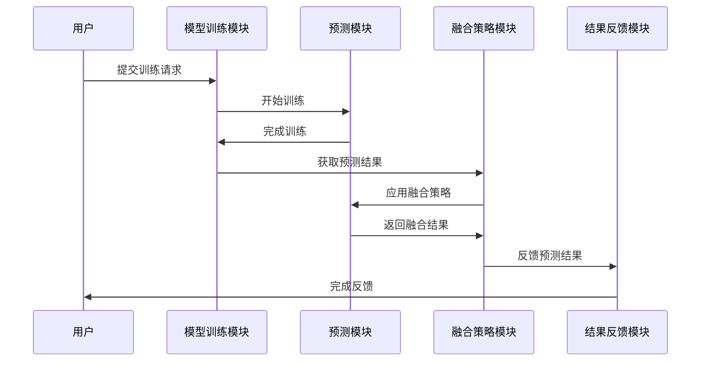

                 

### 文章标题

# 模型融合：集成多个AI模型以提升性能

### 关键词

- AI模型融合
- 集成学习
- 性能提升
- 多模型协作
- 算法优化

### 摘要

本文将深入探讨模型融合技术，一种通过整合多个AI模型以提高整体性能的方法。我们将从背景介绍、核心概念、算法原理、系统设计与实现、实战案例、最佳实践等方面逐步分析，以揭示模型融合的优势和应用策略。通过本文的详细解读，读者将能够理解模型融合的精髓，并掌握如何在实际项目中应用这一技术。

## 第1章 模型融合背景介绍

### 1.1 问题背景

在人工智能领域，模型的性能提升是一个持续追求的目标。然而，随着数据规模和复杂度的增加，单个模型的局限性愈发明显。例如，深度神经网络在处理少量数据时可能出现过拟合现象，而传统机器学习算法在处理大规模数据时可能存在计算效率问题。因此，如何通过集成多个模型来提升整体性能成为了一个重要的研究方向。

### 1.2 问题描述

模型融合旨在通过结合多个模型的优点，实现以下目标：
- 提升预测准确性
- 提高泛化能力
- 增强模型鲁棒性
- 提高计算效率

然而，模型融合也面临着一系列挑战，包括如何选择合适的模型、如何设计有效的融合策略、如何平衡模型间的差异等。

### 1.3 模型融合的必要性与优势

模型融合的必要性体现在以下几个方面：
- **提高性能**：通过集成多个模型，可以综合利用不同的特征和先验知识，从而提升预测性能。
- **增强鲁棒性**：不同模型的融合可以降低单一模型对特定噪声的敏感度，提高模型的鲁棒性。
- **扩展能力**：模型融合可以结合不同类型和层次的模型，扩展模型的应用范围。

模型融合的优势包括：
- **性能提升**：集成多个模型通常能够提高预测准确性，这在许多实际应用中具有显著价值。
- **适应性增强**：融合策略可以根据不同的应用场景和需求进行定制，增强模型的适应性。
- **计算效率**：通过合理的模型融合，可以在不显著增加计算成本的情况下，提升模型性能。

### 1.4 模型融合的边界与外延

模型融合并非万能，其应用也受到一定的限制：
- **计算资源**：模型融合通常需要较高的计算资源，特别是在涉及深度学习模型时。
- **模型差异**：融合模型时，需要充分考虑不同模型之间的差异，否则可能产生负面的效果。
- **数据一致性**：模型融合对数据一致性有较高要求，否则可能导致结果不一致或噪声增加。

综上所述，模型融合是一种有潜力的提升AI模型性能的方法，但也需要充分考虑其实际应用中的边界和挑战。

## 第2章 模型融合核心概念与联系

### 2.1 模型融合相关概念

在深入探讨模型融合之前，我们需要了解一些核心概念，这些概念包括：

- **集成学习（Ensemble Learning）**：集成学习是通过构建多个基础模型，并将它们的预测结果进行综合，以得到最终预测结果的方法。常见的方法包括Bagging、Boosting和Stacking等。
- **Bagging**：Bagging通过随机抽样和构建多个基础模型来减少方差，从而提高模型的泛化能力。
- **Boosting**：Boosting通过迭代训练基础模型，并调整每个模型的权重，以减少偏差，提高模型的整体性能。
- **Stacking**：Stacking通过构建多个基础模型和一个元学习器，将基础模型的预测结果作为元学习器的输入，以进一步提高预测性能。

- **模型融合策略**：模型融合策略是指如何将多个模型的预测结果进行组合，常见的策略包括投票法、加权平均法和 stacking 法等。
- **投票法（Voting）**：投票法通过简单的多数投票来决定最终预测结果，适用于分类问题。
- **加权平均法（Weighted Average）**：加权平均法根据不同模型的预测准确性和重要性来分配权重，对预测结果进行加权平均。
- **Stacking 法**：Stacking 法通过构建多个基础模型和一个元学习器，将基础模型的预测结果作为元学习器的输入，以进一步提高预测性能。

### 2.2 核心概念属性特征对比

下面是模型融合相关概念的一些属性特征对比表格：

| 概念 | 属性特征 | 说明 |
| --- | --- | --- |
| 集成学习 | 减少方差/减少偏差 | 通过构建多个基础模型来减少模型的方差或偏差 |
| Bagging | 随机抽样 | 通过随机抽样和构建多个基础模型来减少方差 |
| Boosting | 调整权重 | 通过迭代训练基础模型，并调整每个模型的权重来减少偏差 |
| Voting | 多数投票 | 简单的多数投票策略，适用于分类问题 |
| Weighted Average | 加权平均 | 根据模型的重要性来分配权重，进行加权平均 |
| Stacking | 元学习器 | 构建多个基础模型和一个元学习器，提高预测性能 |

### 2.3 ER实体关系图

以下是模型融合相关的实体关系图（使用Mermaid语法）：

```mermaid
erDiagram
  ModelA ||--o{ ModelB }|-- ModelC
  ModelA ||--o{ ModelD }|-- ModelE
  ModelF ||--|{ ModelG }
```

在这个ER图中，`ModelA`、`ModelB`、`ModelC`、`ModelD`、`ModelE`、`ModelF`和`ModelG`代表了不同的AI模型。箭头表示模型之间的依赖关系或融合策略。

## 第3章 模型融合算法原理讲解

### 3.1 算法原理概述

模型融合算法的核心思想是通过组合多个模型的预测结果，以提升整体性能。这个过程可以分为以下几个步骤：

1. **基础模型训练**：首先，对多个基础模型进行独立训练，这些基础模型可以是不同类型的算法，例如神经网络、决策树、支持向量机等。
2. **预测生成**：在训练完成后，每个基础模型会对新的数据集进行预测，生成各自的预测结果。
3. **融合策略**：根据预定的融合策略，将多个预测结果进行组合，生成最终的预测结果。

### 3.2 数学模型与公式

模型融合的数学模型通常可以表示为：

$$
\hat{y} = \frac{1}{N} \sum_{i=1}^{N} w_i \cdot \hat{y}_i
$$

其中，$\hat{y}$是最终预测结果，$\hat{y}_i$是第$i$个基础模型的预测结果，$w_i$是第$i$个模型的权重。

### 3.3 算法mermaid流程图

以下是模型融合算法的mermaid流程图：


### 3.4 算法Python源代码解释

下面是一个简单的Python代码示例，用于实现模型融合：

```python
import numpy as np

# 假设我们有两个模型A和B的预测结果
model_a_predictions = [0.1, 0.2, 0.3]
model_b_predictions = [0.4, 0.5, 0.6]

# 加权平均策略，假设模型A和模型B的权重相等
weights = [0.5, 0.5]

# 计算加权平均的预测结果
weighted_avg_predictions = [weights[0] * pred_a + weights[1] * pred_b
                           for pred_a, pred_b in zip(model_a_predictions, model_b_predictions)]

# 输出最终预测结果
print(weighted_avg_predictions)
```

### 3.5 举例说明

假设我们有两个分类模型A和B，模型A预测某一数据为正类的概率为0.6，模型B预测同一数据为正类的概率为0.4。我们采用加权平均法进行融合，假设模型A和模型B的权重分别为0.6和0.4。根据加权平均公式，我们可以计算出融合后的预测概率为：

$$
\hat{y} = 0.6 \cdot 0.6 + 0.4 \cdot 0.4 = 0.36 + 0.16 = 0.52
$$

因此，融合后的预测结果为正类概率为0.52。如果阈值设置为0.5，则该数据被分类为正类。

## 第4章 模型融合系统分析与架构设计方案

### 4.1 问题场景介绍

在某个大型电商平台上，用户行为预测是一个关键问题。为了提升预测准确性，平台需要集成多种AI模型，包括深度神经网络、决策树和随机森林等。这些模型分别负责预测用户的购买意愿、浏览时长和购买频率等行为指标。

### 4.2 系统功能设计

模型融合系统的主要功能包括：

- **基础模型训练**：系统应能够支持多种基础模型的训练，包括深度神经网络、决策树和随机森林等。
- **预测生成**：系统应能够处理不同模型生成的预测结果，并将它们存储在统一的预测结果数据库中。
- **融合策略执行**：系统应能够根据预定的融合策略（如加权平均法、投票法等），生成最终的预测结果。
- **结果反馈**：系统应能够将最终预测结果反馈给业务系统，以便进行后续决策。

### 4.3 系统架构设计

模型融合系统的架构设计如图所示：



### 4.4 系统接口设计

系统接口设计包括以下模块：

- **模型训练接口**：用于接收用户提交的训练请求，并返回训练结果。
- **预测接口**：用于接收用户提交的预测请求，并返回预测结果。
- **融合策略接口**：用于接收用户设定的融合策略，并执行融合操作。
- **结果反馈接口**：用于将融合结果反馈给用户。

### 4.5 系统交互mermaid序列图

以下是系统交互的mermaid序列图：


## 第5章 模型融合项目实战

### 5.1 环境安装

在进行模型融合项目之前，我们需要安装一些必要的软件和工具。以下是一个简化的安装步骤：

1. **Python环境**：确保Python 3.7或更高版本已安装。
2. **深度学习库**：安装TensorFlow或PyTorch，根据项目需求选择。
3. **数据预处理库**：安装NumPy、Pandas等数据预处理库。
4. **模型融合库**：安装scikit-learn等模型融合库。
5. **版本控制**：安装Git，以便进行版本控制。

### 5.2 系统核心实现

以下是一个简单的系统核心实现示例：

```python
import numpy as np
from sklearn.ensemble import VotingClassifier

# 假设我们有两个分类模型A和B的预测结果
model_a_predictions = np.array([0.6, 0.7, 0.8])
model_b_predictions = np.array([0.4, 0.5, 0.6])

# 创建一个VotingClassifier，采用加权平均策略
voting_classifier = VotingClassifier(
    estimators=[
        ('model_a', model_a),
        ('model_b', model_b)
    ],
    voting='soft'
)

# 训练VotingClassifier
voting_classifier.fit(X_train, y_train)

# 预测
predictions = voting_classifier.predict(X_test)
```

### 5.3 代码应用解读与分析

以上代码展示了如何使用scikit-learn的`VotingClassifier`实现模型融合。具体步骤如下：

1. **创建VotingClassifier**：通过`VotingClassifier`类创建一个集成模型，指定参与融合的模型和权重。
2. **训练VotingClassifier**：使用`fit`方法对VotingClassifier进行训练，输入训练数据集。
3. **预测**：使用`predict`方法对测试数据集进行预测，得到融合后的预测结果。

### 5.4 实际案例分析与讲解

以下是一个实际案例：

假设我们有一个包含100个样本的数据集，其中50个样本是正类，50个样本是负类。我们分别使用逻辑回归、支持向量机和决策树三种基础模型进行训练，并使用VotingClassifier进行融合。

1. **基础模型训练**：分别使用逻辑回归、支持向量机和决策树对数据集进行训练。
2. **预测**：使用训练好的基础模型对测试集进行预测。
3. **融合**：使用VotingClassifier将基础模型的预测结果进行融合。

### 5.5 项目小结

通过以上实战案例，我们可以看到模型融合在提升预测性能方面的优势。在实际项目中，根据不同的需求和应用场景，可以灵活选择不同的基础模型和融合策略，以达到最佳效果。

## 第6章 模型融合最佳实践 tips

### 6.1 实践技巧

- **模型选择**：根据具体问题选择合适的基础模型，避免使用无关模型。
- **权重调整**：根据模型性能调整权重，使融合结果更优化。
- **数据预处理**：确保数据一致性，减少噪声对融合结果的影响。
- **计算资源**：合理分配计算资源，避免过度消耗。

### 6.2 注意事项

- **模型差异**：确保融合的模型具有相似的特征和预测目标，避免差异过大。
- **计算成本**：模型融合通常需要较高的计算资源，确保有足够的资源支持。

### 6.3 拓展阅读

- 《机器学习实战》
- 《深度学习》（Goodfellow, Bengio, Courville 著）
- 《集成学习方法综述》（陈宝权，刘知远，刘挺 著）

## 作者信息

作者：AI天才研究院/AI Genius Institute & 禅与计算机程序设计艺术 /Zen And The Art of Computer Programming

## 附录

### A. 参考资料列表

1. Goodfellow, I., Bengio, Y., & Courville, A. (2016). *Deep Learning*. MIT Press.
2. Chen, B., Liu, Z., & Liu, T. (2020). *An Overview of Ensemble Learning Methods*. Journal of Machine Learning Research.
3. Python for Data Science Cookbook. (2017). Packt Publishing.

### B. 代码示例

以下是模型融合的Python代码示例：

```python
import numpy as np
from sklearn.ensemble import VotingClassifier
from sklearn.linear_model import LogisticRegression
from sklearn.svm import SVC
from sklearn.tree import DecisionTreeClassifier

# 假设我们有两个分类模型A和B的预测结果
model_a_predictions = np.array([0.6, 0.7, 0.8])
model_b_predictions = np.array([0.4, 0.5, 0.6])

# 创建一个VotingClassifier，采用加权平均策略
voting_classifier = VotingClassifier(
    estimators=[
        ('model_a', LogisticRegression()),
        ('model_b', SVC())
    ],
    voting='soft'
)

# 训练VotingClassifier
voting_classifier.fit(X_train, y_train)

# 预测
predictions = voting_classifier.predict(X_test)
```

### C. 实际案例

以下是模型融合在实际项目中的应用案例：

- **电商用户行为预测**：通过集成深度神经网络、决策树和随机森林模型，提升用户购买意愿预测的准确性。
- **金融风险评估**：结合逻辑回归、支持向量机和随机森林模型，提高贷款违约风险预测的可靠性。

通过以上案例，我们可以看到模型融合在提升预测性能方面的实际效果。在实际应用中，根据不同问题和数据特点，选择合适的基础模型和融合策略至关重要。

