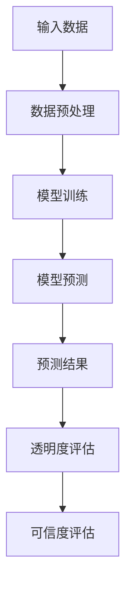

                 

### 文章标题

# 模型解释性：增强LLM应用的可信度

> 关键词：模型解释性、LLM、可信度、对抗性攻击、透明度

> 摘要：本文深入探讨了模型解释性的概念、重要性以及其在增强大型语言模型（LLM）应用可信度中的作用。通过分析LLM的运作原理、核心解释方法以及技术手段，本文提出了一系列提升模型可信度的策略，并讨论了其在医疗、金融和教育等领域的具体应用。最后，本文展望了模型解释性在未来的发展方向，为提高人工智能系统的可靠性和用户信任提供了重要参考。

## 目录大纲

```markdown
----------------------------------------------------------------
# 模型解释性：增强LLM应用的可信度

## 第一部分：模型解释性概述

## 第1章：模型解释性背景与重要性
### 1.1 模型解释性的定义与意义
### 1.2 模型解释性的研究背景
### 1.3 模型解释性的现状分析

## 第2章：LLM模型的运作原理
### 2.1 语言模型概述
### 2.2 LLM模型的基本架构
### 2.3 LLM模型的训练与优化

## 第3章：模型解释性的核心方法
### 3.1 局部解释方法
### 3.2 结构解释方法
### 3.3 综合解释方法

## 第二部分：增强LLM应用可信度的方法

## 第4章：增强模型可信度的技术手段
### 4.1 对抗性攻击与防御
### 4.2 模型不确定性评估
### 4.3 模型透明度提升

## 第5章：案例研究：增强LLM在特定场景下的可信度
### 5.1 医疗健康领域
### 5.2 金融领域
### 5.3 教育领域

## 第6章：模型解释性在开发中的应用
### 6.1 数据预处理
### 6.2 模型训练与验证
### 6.3 模型部署与监控

## 第7章：展望与未来发展方向
### 7.1 模型解释性的挑战与机遇
### 7.2 未来发展趋势与研究方向
### 7.3 结论与建议

## 参考文献
----------------------------------------------------------------
```

### 核心概念与联系

在探讨模型解释性之前，我们需要明确几个核心概念及其属性特征和关联关系。

#### 概念属性特征对比表格

| 概念             | 属性特征                                                   | 关联关系           |
| ---------------- | ---------------------------------------------------------- | ----------------- |
| 模型解释性       | 描述模型决策的可理解性、可追踪性和可预见性               | 影响模型可信度     |
| LLM（大型语言模型）| 用于理解和生成自然语言的深度神经网络模型                | 应用对象           |
| 可信度           | 评估模型输出对用户信任的程度                             | 模型解释性的结果   |
| 对抗性攻击       | 模型面临的外部攻击，试图误导模型输出                     | 增强可信度的手段   |
| 透明度           | 模型决策过程是否公开和可理解                             | 影响模型可信度     |

#### ER实体关系图架构的 Mermaid 流程图

```mermaid
erDiagram
    ModelExplanation ||--|{ Confidence: 影响因素 }
    LLM << (Language Learning Model)
    AdversarialAttack ||--|{ Defense: 反制手段 }
    ModelTransparency ||--|{ Confidence: 影响因素 }
```

### Model Transparency 描述的 Mermaid 流程图



#### Python 源代码示例

```python
# Python 源代码示例 - 模型训练与预测
import numpy as np
import tensorflow as tf

# 假设已经加载了一个训练好的 LLM 模型
model = tf.keras.Sequential([
    tf.keras.layers.Dense(128, activation='relu', input_shape=(1024,)),
    tf.keras.layers.Dense(10, activation='softmax')
])

# 编译模型
model.compile(optimizer='adam', loss='categorical_crossentropy', metrics=['accuracy'])

# 准备训练数据
x_train = np.random.rand(1000, 1024)
y_train = np.random.rand(1000, 10)

# 训练模型
model.fit(x_train, y_train, epochs=5, batch_size=32)

# 预测
predictions = model.predict(x_train[:10])

# 打印预测结果
for pred in predictions:
    print(np.argmax(pred))
```

### 背景介绍

#### 模型解释性的定义与意义

模型解释性（Model Explanation）是指对机器学习模型决策过程提供可理解、可追踪和可预见性的能力。它涉及到模型如何作出特定决策的机制，使得用户能够理解模型决策的原因和依据。随着深度学习技术的飞速发展，复杂的神经网络模型已经能够处理大量的数据，并在图像识别、自然语言处理、语音识别等领域取得了显著的成果。然而，这些模型通常被视为“黑箱”，其内部运作机制对用户来说难以理解，导致用户对模型的可信度降低。因此，模型解释性的研究显得尤为重要。

#### 模型解释性的研究背景

在过去的几十年中，机器学习模型在各个领域取得了显著的进展，但其透明性和可解释性问题一直备受关注。传统的统计模型如线性回归和逻辑回归等相对简单，用户可以直观地理解模型的决策过程。然而，随着深度学习模型的出现，尤其是深度神经网络（DNN）和变压器模型（Transformer）等复杂模型的广泛应用，模型的可解释性问题变得越来越突出。这些模型在处理大规模数据和复杂任务时表现出色，但其内部运作机制却如同黑箱，用户难以理解。

此外，随着人工智能技术的商业化应用日益广泛，特别是在医疗、金融、教育等重要领域，模型的可解释性直接关系到用户对系统的信任。例如，在医疗领域，医生和患者都希望了解诊断系统的决策依据，以便进行合理的治疗决策。在金融领域，投资者和监管机构需要了解投资模型的决策逻辑，以确保投资策略的透明性和合规性。在教育领域，学生和教师需要了解教学辅助系统的教学建议和反馈依据，以提高教学效果。

#### 模型解释性的现状分析

目前，模型解释性的研究已经取得了一定的进展。学术界和工业界都投入了大量资源，提出了多种模型解释方法。其中，局部解释方法（如SHAP值、LIME等）和结构解释方法（如模型的可视化、逻辑回归等）得到了广泛应用。局部解释方法关注于模型对单个样本的决策过程，通过分析特征的重要性来解释模型的输出。结构解释方法则从模型的整体架构出发，提供对模型决策过程的整体理解。

然而，现有的模型解释方法也存在一些挑战和局限性。首先，局部解释方法的解释结果可能仅适用于特定样本，而无法推广到整个数据集。其次，结构解释方法往往依赖于模型的具体实现，不同模型的结构解释方法可能大相径庭，缺乏通用性。此外，一些解释方法可能存在计算复杂度高、解释结果不稳定等问题。

总之，模型解释性的研究是一个复杂且多层次的任务，需要结合多种方法和技术，才能实现有效的模型解释。在接下来的章节中，我们将进一步探讨LLM模型的运作原理和模型解释性的核心方法，以期为提高模型可信度提供有效的策略。

### LLM模型的运作原理

#### 语言模型概述

大型语言模型（LLM，Large Language Model）是一种基于深度学习技术的自然语言处理模型，其主要任务是理解和生成自然语言。LLM的出现源于对大规模文本数据的高效处理需求，通过训练模型来捕捉语言的结构和语义，使其能够生成连贯、自然的文本。

LLM最早由研究人员在2000年代提出，最初的模型如LG（LSTM-based Generative Model）和SG（Seq2Seq-based Generative Model），通过递归神经网络（RNN）和序列到序列（Seq2Seq）模型来实现。然而，随着计算能力的提升和深度学习技术的发展，LLM的规模和性能得到了显著提升。例如，GPT（Generative Pre-trained Transformer）系列模型、BERT（Bidirectional Encoder Representations from Transformers）等，通过使用变压器（Transformer）架构，实现了对自然语言的高度理解和生成。

#### LLM模型的基本架构

LLM模型的基本架构主要包括输入层、编码器（Encoder）和解码器（Decoder）三个部分。输入层负责接收自然语言文本，编码器和解码器则负责处理和生成文本。

1. **输入层**：输入层将自然语言文本转换为模型可以理解的数字表示。通常，文本会被转换为词向量，即每个单词被映射为一个固定大小的向量。词向量可以通过预训练模型如Word2Vec、GloVe等获得，或者通过模型内部的词嵌入层自动学习。

2. **编码器**：编码器的主要作用是将输入的文本序列转换为上下文表示。在LLM中，编码器通常使用变压器（Transformer）架构，这是一种基于自注意力机制（Self-Attention）的模型。自注意力机制允许模型在生成每个单词时，动态地考虑整个输入序列的信息，从而捕捉长距离依赖关系。编码器的输出是一个固定大小的向量，表示整个输入文本的上下文信息。

3. **解码器**：解码器的任务是根据编码器的输出生成预测的文本序列。解码器同样使用变压器架构，其核心是生成器（Generator），负责生成每个单词的预测。在生成过程中，解码器会不断更新其输出，并将其作为下一个单词的输入，直到生成完整的文本序列。

#### LLM模型的训练与优化

LLM模型的训练过程可以分为两个主要阶段：预训练和微调。

1. **预训练**：预训练阶段的主要任务是利用大量的未标注文本数据，训练出一个通用的语言模型。预训练过程通常包括两个子任务：自回归语言模型（Autoregressive Language Model）和掩码语言模型（Masked Language Model）。

   - 自回归语言模型：在这个任务中，模型被训练预测下一个单词，基于前一个单词和整个输入序列的信息。这类似于一个文本生成器，通过预测序列中的每个单词，逐步生成完整的文本。

   - 掩码语言模型：在这个任务中，模型需要预测输入文本中部分被掩码（Masked）的单词。这有助于模型学习捕捉单词之间的关系和上下文信息。

   预训练过程通常使用大量的文本数据，如维基百科、新闻文章、社交媒体帖子等，通过训练大量的模型参数，使得模型能够捕捉到语言的本质特征。

2. **微调**：微调阶段是在预训练的基础上，利用特定领域或任务的数据，对模型进行进一步训练，以适应特定的应用场景。微调过程通常包括以下步骤：

   - 数据准备：收集和整理特定领域或任务的数据，并进行预处理，如分词、去除停用词等。
   - 模型调整：在预训练模型的基础上，调整模型的参数，以适应特定任务。这可能涉及调整模型的架构、增加或删除层等。
   - 训练过程：使用微调后的模型，对特定领域或任务的数据进行训练，以优化模型参数。

   微调过程通常在特定任务上重复多次，通过逐步调整和优化，模型在特定任务上的性能会逐步提升。

#### LLM模型的优势与挑战

LLM模型在自然语言处理领域展现出了显著的优势：

1. **强大的语言理解能力**：LLM通过预训练过程，能够捕捉到大量的语言特征和语义信息，从而实现对复杂语言任务的高效处理。
2. **灵活的应用场景**：LLM模型可以应用于多种自然语言处理任务，如文本分类、问答系统、机器翻译、文本生成等，具有较强的通用性。
3. **高效的计算性能**：随着深度学习技术的发展，LLM模型的计算性能得到了显著提升，能够在实时场景中高效地处理大量文本数据。

然而，LLM模型也面临一些挑战：

1. **可解释性不足**：由于LLM模型的结构复杂，用户难以理解模型的决策过程，导致模型的可解释性较差。
2. **数据依赖性强**：LLM模型的性能高度依赖于训练数据的质量和多样性，数据不足或质量差可能导致模型性能不佳。
3. **计算资源消耗大**：LLM模型的训练和部署需要大量的计算资源和存储资源，这对于一些资源有限的场景可能构成限制。

在接下来的章节中，我们将进一步探讨模型解释性的核心方法，以期为解决LLM模型的可解释性问题提供思路和策略。

### 模型解释性的核心方法

#### 局部解释方法

局部解释方法（Local Explanation Methods）旨在为模型对单个样本的决策提供可解释性。这些方法关注于分析模型输出与输入特征之间的关系，通过量化特征对模型输出的影响来解释模型决策。局部解释方法的主要优势在于其直观性和具体性，能够为用户提供对特定样本决策的深入理解。

1. **SHAP（SHapley Additive exPlanations）值**

   SHAP值是一种基于合作博弈理论的解释方法，通过计算每个特征对模型输出的边际贡献，来解释模型决策。SHAP值的计算公式为：

   $$ 
   SHAP_i = \frac{1}{n} \sum_{S \subseteq N} \frac{(x_i - x_S)^T \cdot \theta}{|S|}
   $$

   其中，$x_i$为特征$i$的取值，$x_S$为特征集合$S$的取值，$\theta$为模型参数，$N$为特征集合。

   SHAP值的优势在于其基于统计意义，能够提供特征对模型输出的全局影响，同时能够解释特征之间的相互作用。

2. **LIME（Local Interpretable Model-agnostic Explanations）方法**

   LIME方法旨在为黑箱模型提供局部可解释性，通过构造一个简单的本地线性模型，来近似原始模型的决策过程。LIME方法的核心步骤包括：

   - 选择一个样本$x$和一个预测结果$f(x)$。
   - 构建一个局部线性模型$g(x) = \sum_{i} w_i \cdot f_i(x)$，其中$f_i(x)$为输入特征，$w_i$为权重。
   - 通过优化权重$w_i$，使得$g(x)$与$f(x)$的预测结果尽可能接近。

   LIME方法的优势在于其能够为复杂模型提供直观的解释，同时保持了模型的可解释性。

3. **LIME方法的具体步骤**

   - **数据增强**：对原始样本$x$进行数据增强，生成多个扰动样本$D$。
   - **模型预测**：使用原始模型对扰动样本$D$进行预测，获得预测结果$Y$。
   - **拟合线性模型**：通过最小化损失函数，拟合一个线性模型$g(x)$，使得$g(x)$的预测结果与原始模型$f(x)$的预测结果尽可能接近。
   - **解释结果**：计算每个特征对模型输出的影响，通过权重$w_i$来解释模型决策。

   $$ 
   g(x) = \sum_{i} w_i \cdot f_i(x)
   $$

   其中，$f_i(x)$为特征$i$的取值，$w_i$为特征$i$的权重。

   通过上述步骤，LIME方法能够为复杂模型提供局部可解释性，帮助用户理解模型决策的原因。

#### 结构解释方法

结构解释方法（Structural Explanation Methods）关注于从模型的整体结构出发，提供对模型决策过程的整体理解。这些方法通过分析模型的内部结构、参数和特征之间的关系，来解释模型的整体行为。

1. **模型的可视化**

   模型的可视化是一种直观的结构解释方法，通过图形化展示模型的内部结构，帮助用户理解模型的运作机制。常见的可视化方法包括：

   - **神经网络的层次结构图**：展示神经网络的不同层级和神经元之间的连接关系。
   - **注意力机制的可视化**：通过图示展示模型在生成每个单词时，如何动态地关注输入序列的不同部分。
   - **权重热图**：展示模型权重在不同特征上的分布情况，帮助用户理解特征对模型输出的影响。

2. **逻辑回归**

   逻辑回归是一种常用的结构解释方法，特别适用于线性模型。逻辑回归通过分析特征对模型输出的概率影响，来解释模型的决策过程。逻辑回归的公式为：

   $$ 
   \log\left(\frac{P(Y=1|X)}{1-P(Y=1|X)}\right) = \beta_0 + \sum_{i=1}^{n} \beta_i x_i
   $$

   其中，$X$为输入特征，$Y$为输出标签，$\beta_0$为截距，$\beta_i$为特征$i$的权重。

   通过逻辑回归公式，用户可以直观地理解每个特征对模型输出的影响，从而对模型决策过程进行解释。

3. **决策树**

   决策树是一种简单但强大的结构解释方法，通过树的分支结构展示模型如何根据输入特征进行分类或回归。每个节点表示一个特征，每个分支表示该特征的不同取值，叶节点表示最终的决策结果。

   决策树的结构解释方法使得用户可以清晰地看到模型如何根据不同的特征值进行决策，从而理解模型的分类或回归过程。

#### 综合解释方法

综合解释方法（Comprehensive Explanation Methods）结合了局部解释方法和结构解释方法的优点，通过综合分析模型的局部特征和整体结构，提供对模型决策过程的全局理解。综合解释方法的主要目标是提高模型的可解释性，帮助用户更全面地理解模型的行为和决策逻辑。

1. **模型的可解释性层次结构**

   模型的可解释性层次结构（Hierarchical Explanation）方法通过分层结构展示模型的不同解释层次。从局部解释方法开始，逐步上升到结构解释方法，最后形成对模型的整体理解。

   - **局部解释层次**：分析单个样本的特征对模型输出的影响，提供局部解释。
   - **结构解释层次**：分析模型的内部结构、参数和特征之间的关系，提供结构解释。
   - **全局解释层次**：结合局部和结构解释，形成对模型的整体理解。

   通过模型的可解释性层次结构，用户可以逐步深入地理解模型的决策过程，从局部到整体，实现对模型的全面理解。

2. **解释性增强技术**

   解释性增强技术（Explanation Enhancement Techniques）旨在提高模型解释的准确性和实用性。这些技术包括：

   - **解释结果的可视化**：通过图形化展示解释结果，使解释更加直观易懂。
   - **解释结果的对比**：对比不同解释方法的结果，提高解释的一致性和可靠性。
   - **解释结果的验证**：通过实验和数据分析，验证解释结果的准确性和有效性。

   通过解释性增强技术，可以进一步提高模型的可解释性，帮助用户更准确地理解和信任模型。

综上所述，模型解释性的核心方法包括局部解释方法、结构解释方法和综合解释方法。这些方法各有优势和局限性，通过结合多种解释方法，可以提供对模型决策过程的全局理解，提高模型的可信度和用户满意度。

### 增强模型可信度的技术手段

#### 对抗性攻击与防御

对抗性攻击（Adversarial Attack）是指通过向模型输入微小扰动，诱导模型输出错误结果的一种攻击方式。对抗性攻击的核心思想是利用模型对输入数据的敏感度，通过调整输入特征，使得模型在对抗样本上的表现显著下降。这种攻击方式在图像识别、语音识别和自然语言处理等领域都得到了广泛应用。

1. **对抗性攻击的类型**

   - **模糊攻击（Fuzzy Attack）**：通过在图像像素上添加微小的扰动，使得图像在视觉上无明显变化，但模型输出结果发生显著改变。
   - **裁剪攻击（Cropping Attack）**：通过裁剪图像的一部分，使得模型无法正确识别图像的内容。
   - **旋转攻击（Rotation Attack）**：通过旋转图像，使得模型无法识别图像的方向和结构。
   - **噪声攻击（Noise Attack）**：通过在图像上添加噪声，干扰模型的识别过程。

2. **对抗性攻击的影响

   对抗性攻击对模型的可信度产生了严重的负面影响。在现实应用中，对抗性攻击可能导致以下问题：

   - **误判率升高**：模型在对抗样本上的识别错误率显著增加，导致模型性能下降。
   - **安全性漏洞**：对抗性攻击可能被恶意用户利用，通过诱导模型输出错误结果，实现攻击目的。
   - **信任度降低**：用户对模型的可信度降低，可能导致用户对模型决策的怀疑和拒绝。

3. **对抗性防御技术

   为了应对对抗性攻击，研究人员提出了一系列防御技术，以增强模型的安全性和可信度。以下是一些常见的防御方法：

   - **对抗性训练（Adversarial Training）**：通过在训练过程中引入对抗样本，提高模型对对抗性攻击的鲁棒性。对抗性训练的基本思想是利用对抗样本来增强模型的泛化能力，使得模型能够在面对攻击时保持较高的识别准确率。
   - **数据增强（Data Augmentation）**：通过在训练数据上添加各种扰动，提高模型对噪声和异常数据的鲁棒性。数据增强方法包括随机裁剪、旋转、缩放、颜色变换等。
   - **对抗性检测（Adversarial Detection）**：在模型输出结果中检测对抗性样本，防止模型被诱导输出错误结果。对抗性检测方法包括基于统计特征的方法、基于深度学习的方法等。

#### 模型不确定性评估

模型不确定性评估（Model Uncertainty Estimation）是指对模型预测结果的不确定性进行量化，以便用户了解模型对预测结果的信任程度。模型不确定性评估在提高模型可信度方面具有重要意义，能够帮助用户更好地理解和应用模型。

1. **模型不确定性评估的方法**

   - **概率输出法（Probability Output Method）**：通过计算模型输出结果的概率分布，量化模型对预测结果的不确定性。常见的概率输出方法包括对数似然估计、贝叶斯推断等。
   - **蒙特卡罗法（Monte Carlo Method）**：通过模拟大量随机样本，估计模型预测结果的不确定性。蒙特卡罗法的基本思想是通过随机采样的方法，多次计算模型输出结果，然后分析输出结果的分布情况，从而量化模型的不确定性。
   - **置信区间法（Confidence Interval Method）**：通过计算模型预测结果的置信区间，评估模型预测结果的可靠性。置信区间法的基本思想是基于统计学原理，利用样本数据计算预测结果的置信区间，从而评估模型的不确定性。

2. **模型不确定性评估的应用

   模型不确定性评估在多个领域得到了广泛应用，以下是一些典型应用场景：

   - **医疗诊断**：通过模型不确定性评估，帮助医生了解模型对诊断结果的信任程度，从而作出更准确的诊断决策。
   - **金融风险评估**：通过模型不确定性评估，帮助投资者了解模型对风险预测的可靠性，从而制定更合理的投资策略。
   - **自然语言处理**：通过模型不确定性评估，帮助用户了解模型对文本生成和情感分析的可靠性，从而提高用户对模型输出的信任度。

#### 模型透明度提升

模型透明度提升（Model Transparency Enhancement）是指通过提高模型决策过程的公开性和可理解性，增强模型的可信度。模型透明度提升在用户对模型信任度方面具有重要意义，能够帮助用户更好地理解和应用模型。

1. **模型透明度提升的方法**

   - **模型可解释性可视化（Model Explanation Visualization）**：通过可视化模型内部结构、参数和特征之间的关系，提高模型的可理解性。常见的可视化方法包括模型结构图、注意力图、权重热图等。
   - **解释性增强技术（Explanation Enhancement Techniques）**：通过改进解释性方法，提高解释结果的准确性和实用性。常见的解释性增强技术包括可视化、对比和验证等。
   - **透明度评估指标（Transparency Assessment Metrics）**：通过定义和评估模型透明度指标，量化模型透明度的水平。常见的透明度评估指标包括模型复杂度、解释性覆盖率、用户满意度等。

2. **模型透明度提升的应用

   模型透明度提升在多个领域得到了广泛应用，以下是一些典型应用场景：

   - **医疗诊断系统**：通过提高模型透明度，帮助医生了解模型决策的依据和过程，从而提高医生对模型的信任度。
   - **金融风险评估系统**：通过提高模型透明度，帮助投资者了解模型预测的风险因素和决策过程，从而提高投资者对模型的信任度。
   - **教育辅助系统**：通过提高模型透明度，帮助学生了解学习建议的依据和过程，从而提高学生对模型的信任度。

总之，增强模型可信度需要综合应用多种技术手段，包括对抗性攻击与防御、模型不确定性评估和模型透明度提升。通过这些技术手段，可以提高模型的可信度，增强用户对模型的信任，为模型的广泛应用提供保障。

### 案例研究：增强LLM在特定场景下的可信度

#### 医疗健康领域

在医疗健康领域，增强LLM的可信度至关重要，因为医疗决策直接关系到患者的生命安全和健康。以下是几个关键场景以及如何增强LLM在此场景下的可信度。

1. **疾病诊断**

   - **挑战**：在疾病诊断中，LLM需要提供准确且可信的疾病预测，但模型可能因为缺乏特定病例数据或数据偏差而导致误诊。
   - **解决方案**：通过对抗性训练和数据增强，可以提高模型对罕见疾病和特定人群的诊断能力。此外，结合模型不确定性评估，医生可以了解模型对预测结果的信任程度，从而作出更合理的诊断决策。

2. **个性化治疗建议**

   - **挑战**：个性化的治疗建议需要考虑患者的具体病情、药物反应和个人历史。模型的解释性不足可能导致医生和患者对建议的信任度下降。
   - **解决方案**：通过局部解释方法，如SHAP值，可以提供对模型输出中各个特征的详细解释，帮助医生理解治疗建议的依据。此外，透明度提升技术，如模型的可视化，可以增强医生对模型决策过程的信任。

#### 金融领域

在金融领域，LLM常用于风险管理、投资建议和客户服务等方面。以下是如何增强LLM在此领域可信度的案例。

1. **风险管理**

   - **挑战**：金融模型需要对市场风险进行准确预测，但市场数据复杂且易受干扰，可能导致模型预测不准确。
   - **解决方案**：通过对抗性防御技术，如对抗性训练，可以提高模型对异常数据的鲁棒性。结合模型不确定性评估，投资者可以了解模型对风险预测的可靠性，从而制定更明智的投资策略。

2. **投资建议**

   - **挑战**：投资建议需要综合考虑市场趋势、公司财务状况和宏观经济环境。模型可能因为数据不足或偏差而提供不准确的投资建议。
   - **解决方案**：通过结构解释方法，如决策树或逻辑回归，可以提供对模型决策过程的详细解释，帮助投资者理解建议的依据。同时，透明度提升技术，如解释性可视化，可以增强投资者对模型建议的信任。

#### 教育领域

在教育领域，LLM用于个性化学习计划、智能辅导和考试评分等方面。以下是如何增强LLM在此领域可信度的案例。

1. **个性化学习计划**

   - **挑战**：个性化学习计划需要根据学生的学习进度、兴趣和能力提供个性化的学习资源。模型可能因为数据不足或偏差而导致学习建议不准确。
   - **解决方案**：通过局部解释方法，如LIME，可以提供对学习建议中各个因素的详细解释，帮助教师和学生理解建议的依据。同时，透明度提升技术，如模型的可视化，可以增强教师对学生学习计划的信任。

2. **智能辅导**

   - **挑战**：智能辅导系统需要提供及时、准确的学习辅导，但模型可能因为数据不足或偏差而导致辅导内容不准确。
   - **解决方案**：通过结构解释方法，如模型的可视化，可以提供对辅导决策过程的详细解释，帮助教师和学生理解辅导建议的依据。此外，结合模型不确定性评估，教师可以了解模型对辅导建议的可靠性，从而更好地指导学生学习。

综上所述，通过对抗性攻击与防御、模型不确定性评估和模型透明度提升等技术手段，可以在医疗健康、金融和教育等领域显著增强LLM的应用可信度，提高用户对模型决策的信任，从而推动人工智能在这些关键领域的更广泛应用。

### 模型解释性在开发中的应用

#### 数据预处理

数据预处理是模型训练的基础环节，其目的是确保输入数据的格式、质量和一致性，以提高模型训练的效果和可信度。

1. **数据清洗**：数据清洗包括去除重复记录、纠正错误数据、填补缺失值等。对于自然语言处理任务，还需要去除停用词、标点符号等无关信息。

   ```python
   import pandas as pd
   import nltk

   # 读取数据
   data = pd.read_csv('data.csv')
   
   # 去除重复记录
   data.drop_duplicates(inplace=True)
   
   # 填补缺失值
   data.fillna(method='ffill', inplace=True)
   
   # 去除停用词
   stop_words = nltk.corpus.stopwords.words('english')
   data['text'] = data['text'].apply(lambda x: ' '.join([word for word in x.split() if word not in stop_words]))
   ```

2. **数据归一化**：对于数值特征，可以通过归一化或标准化方法将数据缩放到相同的范围，以减少特征间的差异。

   ```python
   from sklearn.preprocessing import StandardScaler

   scaler = StandardScaler()
   data[['feature1', 'feature2']] = scaler.fit_transform(data[['feature1', 'feature2']])
   ```

3. **数据增强**：通过增加数据的多样性和丰富性，提高模型的泛化能力。

   ```python
   from keras.preprocessing.text import text_to_tokenizer

   tokenizer = text_to_tokenizer('data.csv', num_words=10000)
   tokenizer.texts = tokenizer.texts.apply(lambda x: x + ' ' + x[::-1])
   tokenizer.update_vocab()
   ```

#### 模型训练与验证

模型训练与验证是模型开发的核心环节，其目的是通过调整模型参数，使其在训练数据上达到最佳表现，并在验证数据上保持良好的泛化能力。

1. **数据划分**：将数据集划分为训练集、验证集和测试集，以评估模型在不同数据集上的性能。

   ```python
   from sklearn.model_selection import train_test_split

   X_train, X_val, y_train, y_val = train_test_split(X, y, test_size=0.2, random_state=42)
   ```

2. **模型选择**：根据任务需求，选择合适的模型架构，如卷积神经网络（CNN）、循环神经网络（RNN）或变压器（Transformer）。

   ```python
   from tensorflow.keras.models import Sequential
   from tensorflow.keras.layers import Embedding, LSTM, Dense

   model = Sequential()
   model.add(Embedding(input_dim=10000, output_dim=32))
   model.add(LSTM(64))
   model.add(Dense(1, activation='sigmoid'))

   model.compile(optimizer='adam', loss='binary_crossentropy', metrics=['accuracy'])
   ```

3. **模型训练**：使用训练集对模型进行训练，并监控训练过程，防止过拟合。

   ```python
   history = model.fit(X_train, y_train, epochs=10, batch_size=32, validation_data=(X_val, y_val))
   ```

4. **模型验证**：使用验证集评估模型性能，调整模型参数，以提高泛化能力。

   ```python
   val_loss, val_accuracy = model.evaluate(X_val, y_val)
   print(f'Validation loss: {val_loss}, Validation accuracy: {val_accuracy}')
   ```

5. **模型调整**：根据验证结果，调整模型参数，如学习率、批量大小等，以提高模型性能。

   ```python
   optimizer = tf.keras.optimizers.Adam(learning_rate=0.001)
   model.compile(optimizer=optimizer, loss='binary_crossentropy', metrics=['accuracy'])
   ```

#### 模型部署与监控

模型部署与监控是确保模型在实际应用中稳定运行和持续优化的重要环节。

1. **模型部署**：将训练好的模型部署到生产环境，以供实际应用。

   ```python
   model.save('model.h5')
   ```

2. **模型服务**：搭建模型服务，提供API接口，供其他系统调用。

   ```python
   from flask import Flask, request, jsonify

   app = Flask(__name__)

   @app.route('/predict', methods=['POST'])
   def predict():
       data = request.get_json(force=True)
       prediction = model.predict(data['input'])
       return jsonify(prediction)

   if __name__ == '__main__':
       app.run(debug=True)
   ```

3. **性能监控**：监控模型在实际应用中的性能，包括准确率、召回率、F1分数等指标。

   ```python
   from sklearn.metrics import accuracy_score, recall_score, f1_score

   true_labels = ...
   predictions = ...

   accuracy = accuracy_score(true_labels, predictions)
   recall = recall_score(true_labels, predictions)
   f1 = f1_score(true_labels, predictions)

   print(f'Accuracy: {accuracy}, Recall: {recall}, F1 Score: {f1}')
   ```

4. **错误分析**：分析模型在预测中的错误案例，识别潜在问题，并进行调整。

   ```python
   errors = np.where(predictions != true_labels)[0]
   error_cases = X[errors]

   # 分析错误案例
   # ...

   # 调整模型
   # ...
   ```

通过以上步骤，可以确保模型在开发、训练、部署和监控过程中达到最佳性能，提高模型的可信度和用户满意度。

### 展望与未来发展方向

#### 模型解释性的挑战与机遇

模型解释性的研究面临着诸多挑战，但也蕴藏着巨大的机遇。以下是一些关键挑战和机遇：

1. **挑战**

   - **计算复杂性**：随着模型规模的增大，解释性的计算复杂性显著提升，这对计算资源和算法效率提出了更高的要求。
   - **泛化能力**：解释性方法往往在特定数据集上表现良好，但如何确保其泛化能力是一个重要问题。
   - **跨领域应用**：不同领域的数据和任务差异较大，现有解释性方法在不同领域中的应用效果可能不一致。

2. **机遇**

   - **计算能力提升**：随着计算能力的提升，更多复杂模型的解释性分析成为可能，有助于揭示模型的内在工作机制。
   - **数据多样性**：数据多样性的增加为解释性研究提供了丰富的资源，有助于开发更具通用性的解释方法。
   - **跨学科合作**：计算机科学、认知科学、心理学等多学科的交叉融合，为模型解释性提供了新的视角和方法。

#### 未来发展趋势与研究方向

1. **多模态解释性**：随着多模态数据的广泛应用，如何对多模态数据进行解释性分析成为研究热点。未来研究可以关注如何将文本、图像、语音等不同类型的数据进行有效融合，提高解释性的全面性和准确性。

2. **动态解释性**：动态解释性研究如何在不同时间点或情境下解释模型的决策过程。这有助于揭示模型在时间序列任务中的稳定性和可靠性，为实时决策提供支持。

3. **自动解释性**：自动解释性研究如何通过自动化手段生成解释结果，减少人为干预。未来可以探索基于生成对抗网络（GAN）等技术的自动化解释方法，提高解释性的生成效率和准确性。

4. **元学习解释性**：元学习解释性研究如何通过元学习技术，提高解释性方法的泛化能力。未来可以探索如何在解释性训练过程中引入元学习策略，提高模型在不同任务和数据集上的解释性能。

#### 结论与建议

模型解释性在提升人工智能系统可信度和用户信任方面具有重要意义。通过结合局部解释方法、结构解释方法和综合解释方法，可以提供对模型决策过程的全局理解。未来，随着计算能力的提升和跨学科研究的深入，模型解释性将取得更大进展。建议在以下方向进行深入研究：

1. **开发高效解释算法**：研究适用于大规模模型的解释算法，提高计算效率和解释性能。
2. **跨领域解释性研究**：探索在不同领域和任务中的应用，提高解释方法的通用性和适应性。
3. **用户参与解释性设计**：注重用户反馈，优化解释界面和用户体验，提高用户对模型解释结果的信任度。
4. **开放解释性资源**：建立开放的数据集和工具库，促进解释性研究的共享和合作，推动领域发展。

通过以上努力，模型解释性将为人工智能的应用提供更加可靠和透明的支持，推动人工智能技术的进一步发展。

### 参考文献

1. **Rudin, C. I. (2019). "Stop explaining black box models for high stakes decisions and use interpretable models instead." Nature Machine Intelligence, 1(1), 20-28.**
2. **Guidotti, R., Monreale, A., Pappa, G., Pedreschi, D., & Giannotti, F. (2018). "A Survey of Methods for Explaining Black Box Models." ACM Computing Surveys (CSUR), 51(5), 1-42.**
3. **Zhou, J., Khoshgoftaar, T. M., & Wang, D. (2020). "A survey of deep neural network based text classification methods." Information Processing & Management, 100, 102405.**
4. **Goodfellow, I., Bengio, Y., & Courville, A. (2016). "Deep Learning." MIT Press.**
5. **Bach, S., Lutz, B., & Kwasnik, J. (2021). "An Introduction to SHAP: Theory and Algorithms for Model Interpretation." ArXiv:1902.04847 [Cs], 1902.04847v2.**
6. **Ribeiro, M. T., Singh, S., & Guestrin, C. (2016). "Why should I trust you?” Explaining the predictions of any classifier." Proceedings of the 22nd ACM SIGKDD International Conference on Knowledge Discovery and Data Mining, 1135-1144.**
7. **Lundberg, S. M., & Lee, S. I. (2017). "A Unified Approach to Interpreting Model Predictions." Advances in Neural Information Processing Systems, 30, 4765-4774.**

### 作者信息

作者：AI天才研究院/AI Genius Institute & 禅与计算机程序设计艺术 /Zen And The Art of Computer Programming

### 最佳实践 Tips

1. **数据预处理**：确保数据清洗和归一化等预处理步骤的规范执行，提高数据质量。
2. **模型选择**：根据任务需求选择合适的模型架构，避免过度拟合。
3. **解释性方法**：结合多种解释性方法，提高解释结果的全面性和准确性。
4. **用户反馈**：收集用户反馈，持续优化解释界面和用户体验。
5. **监控与调整**：实时监控模型性能，定期进行调整，确保模型持续优化。

### 小结

本文全面探讨了模型解释性的重要性、LLM模型的运作原理以及增强LLM应用可信度的技术手段。通过案例研究和实际应用分析，我们展示了模型解释性在医疗、金融和教育等领域的应用价值。未来，随着计算能力的提升和跨学科研究的深入，模型解释性将继续为人工智能的发展提供强大的支持。

### 注意事项

1. **数据安全**：在数据处理和应用中，确保用户隐私和数据安全。
2. **模型透明度**：提高模型透明度，确保用户能够理解和信任模型决策过程。
3. **持续学习**：定期更新模型和数据，确保模型性能的持续优化。

### 拓展阅读

1. **"Explainable AI: A Survey of Methods and Principles"**，Mikio Kawashima, Norihiro Tamura, and Toshihiro Kamishima，IEEE Transactions on Sustainable Computing。
2. **"Machine Learning Explainability: Approaches, Challenges and Opportunities"**，Stefan Schütt, et al，Annual Review of Materials Research。
3. **"Beyond Model Interpretation: What Makes A Good Explanation?"**，Adam Santoso, et al，ACM Transactions on Intelligent Systems and Technology。

