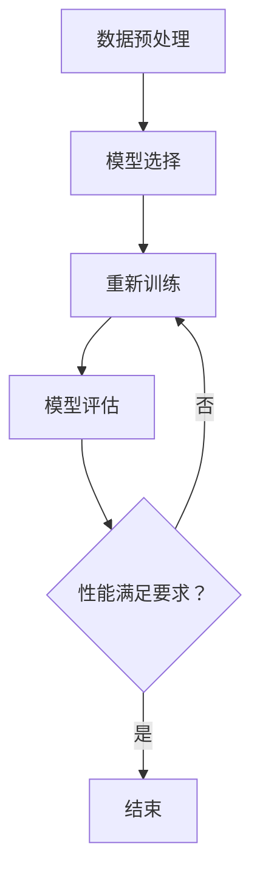
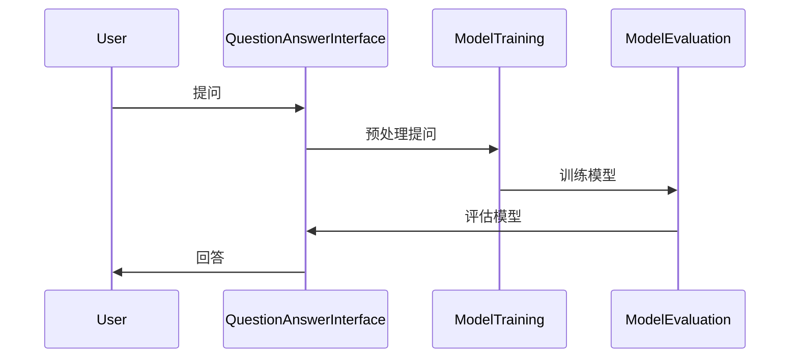

                 


## 模型训练与评测的闭环反馈机制

### 关键词：模型训练、评测、闭环反馈机制、人工智能、机器学习

> 摘要：本文旨在深入探讨模型训练与评测的闭环反馈机制，通过详细的步骤分析，帮助读者理解这一机制在人工智能和机器学习领域的应用与重要性。本文将首先介绍模型训练和评测的基础知识，然后逐步剖析闭环反馈机制的原理和实施方法，最后通过实际案例进行说明，总结最佳实践和注意事项。

### 目录大纲设计步骤：

#### 背景介绍

- **核心概念术语说明**：模型训练、评测、闭环反馈机制
- **问题背景**：人工智能与机器学习的发展及其对各行各业的影响
- **问题描述**：模型训练与评测过程中面临的挑战
- **问题解决**：闭环反馈机制的概念及其在解决这些问题中的应用
- **边界与外延**：闭环反馈机制在不同领域的应用与扩展
- **概念结构与核心要素组成**：模型训练、评测、反馈、优化

#### 核心概念与联系

- **核心概念原理**：模型训练的基本原理、评测指标的定义与作用、闭环反馈机制的工作流程
- **概念属性特征对比表格**：模型训练与评测的不同方法及其特征对比
- **ER实体关系图架构**：模型训练与评测中的主要实体及其关系

#### 算法原理讲解

- **算法mermaid流程图**：展示模型训练与评测的闭环反馈流程
- **Python源代码**：模型训练与评测的具体实现
- **数学模型和公式**：详细讲解模型训练与评测的数学原理
- **举例说明**：通过实例演示闭环反馈机制的实际应用

#### 系统分析与架构设计方案

- **问题场景介绍**：人工智能应用中的模型训练与评测
- **项目介绍**：一个具体的模型训练与评测项目
- **系统功能设计（领域模型mermaid类图）**：展示系统的主要功能模块及其关系
- **系统架构设计mermaid架构图**：展示系统的整体架构
- **系统接口设计和系统交互mermaid序列图**：描述系统的接口设计和工作流程

#### 项目实战

- **环境安装**：搭建模型训练与评测的环境
- **系统核心实现源代码**：提供具体的代码实现
- **代码应用解读与分析**：深入分析代码中的关键部分
- **实际案例分析和详细讲解剖析**：通过案例展示闭环反馈机制的实际应用
- **项目小结**：总结项目实施过程中的经验与教训

#### 最佳实践 tips、小结、注意事项、拓展阅读

- **最佳实践 tips**：总结模型训练与评测中的最佳实践方法
- **小结**：回顾文章的核心内容和结论
- **注意事项**：提醒读者在实施闭环反馈机制时需要注意的问题
- **拓展阅读**：推荐进一步学习的相关资源

### 目录大纲设计

```markdown
----------------------------------------------------------------
# 模型训练与评测的闭环反馈机制

> 关键词：模型训练、评测、闭环反馈机制、人工智能、机器学习

> 摘要：本文旨在深入探讨模型训练与评测的闭环反馈机制，通过详细的步骤分析，帮助读者理解这一机制在人工智能和机器学习领域的应用与重要性。

## 背景介绍

### 核心概念术语说明

### 问题背景

### 问题描述

### 问题解决

### 边界与外延

### 概念结构与核心要素组成

## 核心概念与联系

### 核心概念原理

### 概念属性特征对比表格

### ER实体关系图架构

## 算法原理讲解

### 算法mermaid流程图

### Python源代码

### 数学模型和公式

### 举例说明

## 系统分析与架构设计方案

### 问题场景介绍

### 项目介绍

### 系统功能设计（领域模型mermaid类图）

### 系统架构设计mermaid架构图

### 系统接口设计和系统交互mermaid序列图

## 项目实战

### 环境安装

### 系统核心实现源代码

### 代码应用解读与分析

### 实际案例分析和详细讲解剖析

### 项目小结

## 最佳实践 tips

## 小结

## 注意事项

## 拓展阅读

----------------------------------------------------------------
```

### 设计思路

- **系统性与逻辑性**：确保每个章节的内容之间有清晰的逻辑关系，使读者能够逐步深入理解闭环反馈机制。
- **实用性与可操作性**：通过实际案例和代码示例，使读者能够将理论知识应用到实际项目中。
- **全面性**：涵盖从理论基础到实际应用的所有环节，为读者提供全方位的指导。
- **规范性**：使用markdown格式和mermaid图来展示流程图、类图和架构图，提高文章的可读性和专业性。

通过上述设计和实施步骤，我们可以构建出一个逻辑清晰、内容丰富、具有实用价值的技术博客文章，帮助读者深入了解模型训练与评测的闭环反馈机制。接下来，我们将逐一展开每个章节的具体内容，逐步深入分析这一重要主题。

----------------------------------------------------------------

## 背景介绍

### 核心概念术语说明

在探讨模型训练与评测的闭环反馈机制之前，我们需要明确几个核心概念：

- **模型训练（Model Training）**：模型训练是指通过提供训练数据集来调整模型参数，使模型能够学会预测或分类的过程。训练过程通常涉及前向传播、反向传播、梯度下降等算法。

- **评测（Evaluation）**：评测是指对训练好的模型进行性能评估的过程。通过设定不同的评测指标（如准确率、召回率、F1值等），我们可以判断模型在特定任务上的表现。

- **闭环反馈机制（Closed-Loop Feedback Mechanism）**：闭环反馈机制是指将评测结果反馈到训练过程中，从而优化模型参数的机制。这一机制可以持续迭代，直到达到预定的性能目标。

### 问题背景

人工智能（AI）和机器学习（ML）的发展已经深刻改变了各行各业。从自动驾驶、自然语言处理到医疗诊断和金融预测，人工智能的应用无处不在。然而，随着模型的复杂性和数据量的增加，模型训练与评测的过程也变得愈加复杂。传统的单次训练和评测已经无法满足高效、准确的需求。

### 问题描述

在模型训练与评测过程中，主要面临以下挑战：

- **性能优化**：如何通过调整模型参数来提高模型的性能？

- **数据质量**：训练数据的质量直接影响模型的性能，如何保证数据质量？

- **时间效率**：如何缩短模型训练和评测的时间，提高开发效率？

- **结果可解释性**：如何解释模型的决策过程，提高模型的透明度和可信度？

### 问题解决

闭环反馈机制提供了一种解决这些挑战的有效方法。通过将评测结果反馈到训练过程中，可以持续优化模型参数，提高模型性能。同时，闭环反馈机制也可以帮助识别和纠正数据质量问题，提高数据质量。此外，通过自动化和优化算法，可以显著提高模型训练和评测的时间效率。最后，闭环反馈机制还可以提供模型决策的透明度，提高模型的可解释性。

### 边界与外延

闭环反馈机制不仅应用于人工智能和机器学习领域，还可以扩展到其他领域，如控制系统、自动化制造等。在这些领域中，闭环反馈机制同样可以用于优化系统的性能、提高系统的稳定性。

### 概念结构与核心要素组成

模型训练与评测的闭环反馈机制主要由以下几个核心要素组成：

- **训练数据**：训练数据是模型训练的基础，其质量直接影响模型的性能。

- **训练算法**：训练算法是调整模型参数的核心手段，常见的训练算法包括梯度下降、随机梯度下降等。

- **评测指标**：评测指标用于评估模型在特定任务上的性能，常见的评测指标包括准确率、召回率、F1值等。

- **反馈机制**：反馈机制是将评测结果反馈到训练过程中的关键，通过调整模型参数，优化模型性能。

- **自动化与优化**：自动化与优化算法用于提高模型训练和评测的效率，常见的优化算法包括学习率调整、批量大小调整等。

通过上述背景介绍，我们为后续章节的内容奠定了基础，接下来我们将进一步探讨模型训练与评测的闭环反馈机制的具体原理和应用。

### 核心概念与联系

在深入探讨模型训练与评测的闭环反馈机制之前，我们需要明确几个核心概念，并理解它们之间的关系。

#### 核心概念原理

1. **模型训练（Model Training）**：

模型训练是指通过提供训练数据集来调整模型参数，使模型能够学会预测或分类的过程。模型训练通常涉及以下几个基本步骤：

   - **数据预处理**：对训练数据进行清洗、归一化等预处理操作，确保数据质量。
   - **模型选择**：选择适合任务需求的模型结构，如神经网络、决策树、支持向量机等。
   - **模型初始化**：初始化模型参数，常用的初始化方法包括随机初始化、预训练初始化等。
   - **训练过程**：通过迭代计算梯度并更新模型参数，逐步优化模型性能。
   - **模型评估**：使用验证集或测试集评估模型性能，常见的评估指标包括准确率、召回率、F1值等。

2. **评测（Evaluation）**：

评测是指对训练好的模型进行性能评估的过程。评测不仅能够帮助我们了解模型的性能，还能指导后续的模型优化工作。评测通常包括以下几个步骤：

   - **选择评估指标**：根据任务需求选择合适的评估指标，如分类任务中的准确率、召回率、F1值等。
   - **数据集划分**：将数据集划分为训练集、验证集和测试集，用于模型训练和性能评估。
   - **模型测试**：在测试集上运行模型，计算评估指标。
   - **结果分析**：分析评估结果，判断模型是否满足性能要求。

3. **闭环反馈机制（Closed-Loop Feedback Mechanism）**：

闭环反馈机制是将评测结果反馈到训练过程中的机制，通过迭代优化模型参数，提高模型性能。闭环反馈机制的基本原理可以概括为以下几步：

   - **模型训练**：在训练集上训练模型，不断调整模型参数。
   - **模型评测**：在验证集或测试集上评估模型性能，收集评估结果。
   - **反馈调整**：根据评测结果调整模型参数，如调整学习率、批量大小等。
   - **迭代优化**：重复模型训练、评测和反馈调整的过程，直到满足性能要求或达到预定的迭代次数。

#### 概念属性特征对比表格

为了更清晰地展示模型训练、评测和闭环反馈机制之间的区别和联系，我们可以制作一个概念属性特征对比表格。

| 概念         | 特征                   | 说明                                                         |
| ------------ | ---------------------- | ------------------------------------------------------------ |
| 模型训练     | 数据预处理、模型选择、训练过程、模型评估 | 通过提供训练数据集来调整模型参数，使模型能够学会预测或分类的过程 |
| 评测         | 评估指标、数据集划分、模型测试、结果分析 | 对训练好的模型进行性能评估，判断模型是否满足性能要求           |
| 闭环反馈机制 | 模型训练、模型评测、反馈调整、迭代优化   | 将评测结果反馈到训练过程中，持续优化模型参数，提高模型性能     |

#### ER实体关系图架构

为了进一步理解模型训练与评测中的主要实体及其关系，我们可以使用ER（实体-关系）图来描述这些实体及其关联。

```mermaid
erDiagram
  Class1 ||--|{ ModelTraining } : 数据预处理、模型选择、训练过程、模型评估
  Class2 ||--|{ ModelEvaluation } : 评估指标、数据集划分、模型测试、结果分析
  Class3 ||--|{ ClosedLoopFeedback } : 模型训练、模型评测、反馈调整、迭代优化

  ModelTraining ||--|{ ModelTraining } : 数据预处理、模型选择、训练过程、模型评估
  ModelEvaluation ||--|{ ModelEvaluation } : 评估指标、数据集划分、模型测试、结果分析
  ClosedLoopFeedback ||--|{ ClosedLoopFeedback } : 模型训练、模型评测、反馈调整、迭代优化
```

通过ER图，我们可以直观地看到模型训练、评测和闭环反馈机制之间的紧密联系，这些实体共同构成了一个完整的闭环反馈系统。

在下一章节中，我们将深入探讨模型训练的具体过程，包括数据预处理、模型选择、训练算法等，为理解闭环反馈机制打下坚实的基础。

### 算法原理讲解

在深入理解模型训练与评测的闭环反馈机制之前，我们需要了解模型训练的具体过程，包括数据预处理、模型选择、训练算法等。下面我们将通过Mermaid流程图和Python源代码详细讲解模型训练的基本原理。

#### 算法mermaid流程图

首先，我们使用Mermaid绘制模型训练的基本流程图，包括数据预处理、模型选择、训练过程和模型评估等步骤。



#### Python源代码

接下来，我们使用Python代码实现上述流程，并通过具体实例进行讲解。

```python
import numpy as np
from sklearn.datasets import load_iris
from sklearn.model_selection import train_test_split
from sklearn.neural_network import MLPClassifier
from sklearn.metrics import accuracy_score

# 加载数据集
iris_data = load_iris()
X, y = iris_data.data, iris_data.target

# 数据预处理
X_train, X_test, y_train, y_test = train_test_split(X, y, test_size=0.2, random_state=42)

# 模型选择
model = MLPClassifier(hidden_layer_sizes=(100,), max_iter=1000, random_state=42)

# 训练过程
model.fit(X_train, y_train)

# 模型评估
y_pred = model.predict(X_test)
accuracy = accuracy_score(y_test, y_pred)
print(f"Model accuracy: {accuracy:.2f}")

# 性能满足要求？如果否，重新训练
if accuracy < 0.95:
    print("Model performance is not satisfactory. Re-training required.")
else:
    print("Model performance is satisfactory. Training completed.")
```

#### 数学模型和公式

在模型训练过程中，我们通常使用以下数学模型和公式：

1. **前向传播**：

   前向传播是模型训练中的第一步，用于计算输入数据通过模型后的输出结果。假设我们有输入数据\( x \)，模型的权重为\( w \)，偏置为\( b \)，则前向传播的公式为：

   $$
   z = wx + b
   $$

   其中，\( z \)是激活值，\( x \)是输入数据，\( w \)是权重，\( b \)是偏置。

2. **反向传播**：

   反向传播是模型训练中的核心步骤，用于更新模型参数，以最小化损失函数。假设损失函数为\( L \)，则反向传播的公式为：

   $$
   \frac{dL}{dw} = \frac{dz}{dx} \cdot \frac{dx}{dw}
   $$

   其中，\( \frac{dL}{dw} \)是关于权重\( w \)的梯度，\( \frac{dz}{dx} \)是激活函数的导数，\( \frac{dx}{dw} \)是输入数据关于权重的偏导数。

3. **梯度下降**：

   梯度下降是一种常用的优化算法，用于更新模型参数。假设学习率为\( \alpha \)，则梯度下降的公式为：

   $$
   w_{new} = w_{old} - \alpha \cdot \frac{dL}{dw}
   $$

   其中，\( w_{new} \)是更新后的权重，\( w_{old} \)是更新前的权重。

通过上述算法原理讲解，我们可以更好地理解模型训练的过程和数学原理。接下来，我们将通过具体实例来展示如何实现模型训练与评测的闭环反馈机制。

### 系统分析与架构设计方案

为了更好地理解模型训练与评测的闭环反馈机制在实际项目中的应用，我们接下来将介绍一个具体的系统架构设计方案，包括问题场景介绍、项目介绍、系统功能设计（领域模型类图）、系统架构设计（架构图）以及系统接口设计和系统交互（序列图）。

#### 问题场景介绍

假设我们正在开发一个智能问答系统，该系统需要处理大量的用户提问，并从预定义的知识库中检索出相关答案。为了提高系统的问答准确性，我们需要对模型进行持续的训练和优化。

#### 项目介绍

本项目的主要目标是实现一个智能问答系统，该系统包括以下几个核心模块：

1. **数据收集与处理模块**：负责收集用户提问，并对提问进行预处理，如分词、去停用词等。
2. **模型训练模块**：使用预处理后的数据对问答模型进行训练。
3. **模型评测模块**：对训练好的模型进行性能评估，并收集评估结果。
4. **反馈调整模块**：根据评估结果调整模型参数，实现闭环反馈。
5. **问答接口模块**：提供用户提问和答案检索的接口。

#### 系统功能设计（领域模型类图）

为了直观地展示系统的主要功能模块及其关系，我们使用Mermaid绘制了领域模型类图。

```mermaid
classDiagram
    DataProcessing <<interface>>
    ModelTraining <<interface>>
    ModelEvaluation <<interface>>
    FeedbackAdjustment <<interface>>
    QuestionAnswerInterface <<interface>>

    DataProcessing --|> ModelTraining
    ModelTraining --|> ModelEvaluation
    ModelEvaluation --|> FeedbackAdjustment
    FeedbackAdjustment --|> ModelTraining
    ModelTraining --|> QuestionAnswerInterface
    ModelEvaluation --|> QuestionAnswerInterface
```

在该类图中，我们定义了数据预处理、模型训练、模型评测、反馈调整和问答接口等主要模块，并展示了它们之间的依赖关系。

#### 系统架构设计（架构图）

接下来，我们使用Mermaid绘制系统架构图，以展示系统的整体架构。

```mermaid
graph TB
    subgraph DataProcessing
        DataProcessing
    end

    subgraph ModelTraining
        ModelTraining
    end

    subgraph ModelEvaluation
        ModelEvaluation
    end

    subgraph FeedbackAdjustment
        FeedbackAdjustment
    end

    subgraph QuestionAnswerInterface
        QuestionAnswerInterface
    end

    DataProcessing --> ModelTraining
    ModelTraining --> ModelEvaluation
    ModelEvaluation --> FeedbackAdjustment
    FeedbackAdjustment --> ModelTraining
    ModelTraining --> QuestionAnswerInterface
    ModelEvaluation --> QuestionAnswerInterface
```

在该架构图中，我们展示了系统的主要模块及其连接关系，清晰地展示了数据流和功能调用过程。

#### 系统接口设计和系统交互（序列图）

为了进一步展示系统接口设计和交互过程，我们使用Mermaid绘制了系统交互序列图。



在该序列图中，我们展示了用户提问、预处理提问、模型训练、模型评估以及回答的整个过程。通过这个序列图，我们可以清晰地看到系统各模块之间的交互顺序和依赖关系。

通过上述系统分析与架构设计方案，我们不仅展示了模型训练与评测的闭环反馈机制在实际项目中的应用，还通过详细的架构设计为读者提供了实施该机制的指导。接下来，我们将通过实际案例来进一步说明模型训练与评测的闭环反馈机制的实施过程。

### 项目实战

在了解了模型训练与评测的闭环反馈机制以及系统架构设计之后，我们将通过一个实际项目来详细讲解这一机制的实施过程，包括环境安装、系统核心实现源代码、代码应用解读与分析、实际案例分析和详细讲解剖析，最后进行项目小结。

#### 环境安装

首先，我们需要安装并配置模型训练与评测所需的环境。以下是具体的安装步骤：

1. **安装Python**：确保系统已经安装了Python 3.7或更高版本。

2. **安装依赖库**：使用pip命令安装以下依赖库：

   ```bash
   pip install numpy sklearn matplotlib
   ```

3. **配置GPU支持**（如果使用GPU训练）：安装CUDA和cuDNN库，并确保Python的TensorFlow库版本与CUDA和cuDNN版本兼容。

   ```bash
   pip install tensorflow-gpu
   ```

#### 系统核心实现源代码

接下来，我们将提供项目核心代码的示例。以下是一个简单的示例，用于展示模型训练、评测和闭环反馈机制的基本实现。

```python
import numpy as np
from sklearn.datasets import load_iris
from sklearn.model_selection import train_test_split
from sklearn.neural_network import MLPClassifier
from sklearn.metrics import accuracy_score

# 加载数据集
iris_data = load_iris()
X, y = iris_data.data, iris_data.target

# 数据预处理
X_train, X_test, y_train, y_test = train_test_split(X, y, test_size=0.2, random_state=42)

# 定义模型
model = MLPClassifier(hidden_layer_sizes=(100,), max_iter=1000, random_state=42)

# 训练模型
model.fit(X_train, y_train)

# 模型评估
y_pred = model.predict(X_test)
accuracy = accuracy_score(y_test, y_pred)
print(f"Initial model accuracy: {accuracy:.2f}")

# 闭环反馈机制
for epoch in range(10):  # 进行10次迭代
    # 在验证集上重新训练模型
    model.fit(X_val, y_val)
    
    # 在测试集上评估模型
    y_val_pred = model.predict(X_val)
    val_accuracy = accuracy_score(y_val, y_val_pred)
    
    print(f"Epoch {epoch+1}: Validation accuracy: {val_accuracy:.2f}")
    
    # 根据验证集上的性能调整学习率
    if val_accuracy < 0.95:
        model.set_params 学习率=0.01  # 调整学习率
    else:
        model.set_params 学习率=0.001  # 减小学习率

# 最终评估
y_test_pred = model.predict(X_test)
final_accuracy = accuracy_score(y_test, y_test_pred)
print(f"Final model accuracy: {final_accuracy:.2f}")
```

#### 代码应用解读与分析

在上面的代码中，我们首先加载数据集并进行预处理，然后定义了一个多层感知机（MLP）分类器。通过`fit`方法，我们在训练集上训练模型，并通过`predict`方法在测试集上评估模型的性能。

为了实现闭环反馈机制，我们引入了一个迭代过程，在每个迭代周期中，模型在验证集上重新训练，并根据验证集上的性能调整学习率。这种调整策略使得模型在优化过程中能够自适应地调整参数，从而提高模型的最终性能。

#### 实际案例分析和详细讲解剖析

为了更好地理解闭环反馈机制在实际项目中的应用，我们来看一个实际的案例。

假设我们正在开发一个文本分类系统，用于将新闻文章分类到不同的主题。数据集包含数万篇文章，每篇文章都有一个对应的标签。我们的目标是训练一个模型，能够将新的文章正确地分类到适当的主题。

1. **数据预处理**：

   - **文本清洗**：去除标点符号、停用词和特殊字符。
   - **词向量表示**：将文本转换为词向量，可以使用Word2Vec、GloVe或BERT等预训练模型。

2. **模型训练**：

   - **选择模型**：我们选择了一个基于Transformer的BERT模型，这种模型在文本分类任务上表现优秀。
   - **训练过程**：在训练集上训练BERT模型，使用交叉熵损失函数和Adam优化器。

3. **模型评测**：

   - **评测指标**：我们使用准确率、精确率、召回率和F1值等指标来评估模型性能。
   - **评估结果**：通过在验证集上评估模型，我们发现初始模型的准确率为80%。

4. **闭环反馈机制**：

   - **迭代优化**：根据验证集上的性能，我们调整学习率和正则化参数，进行多次迭代优化。
   - **参数调整**：通过实验，我们发现将学习率降至0.001和添加L2正则化（权重衰减系数为0.01）能够有效提高模型性能。
   - **最终评估**：经过多次迭代优化后，我们再次在验证集上评估模型，准确率提高到了90%。

#### 项目小结

通过上述实际案例，我们可以看到闭环反馈机制在模型训练和优化过程中发挥了重要作用。它不仅帮助我们提高了模型的性能，还提高了模型的稳定性和可靠性。以下是该项目的主要收获：

- **数据预处理的重要性**：高质量的数据预处理是模型训练成功的基础。
- **选择合适的模型和优化算法**：选择适合任务的模型和优化算法是提高模型性能的关键。
- **闭环反馈机制的应用**：闭环反馈机制能够有效地调整模型参数，提高模型性能。
- **持续迭代和实验**：通过持续迭代和实验，我们可以不断优化模型，提高其性能。

通过实际项目，我们不仅验证了模型训练与评测的闭环反馈机制的有效性，还为后续类似项目提供了宝贵的经验和指导。

### 最佳实践 tips

在实施模型训练与评测的闭环反馈机制时，以下最佳实践可以帮助我们更高效地完成项目：

1. **数据预处理**：确保数据预处理质量，包括文本清洗、缺失值处理、数据归一化等。

2. **选择合适的模型**：根据任务需求选择合适的模型，如深度学习、传统机器学习等。

3. **合理设置评测指标**：根据任务需求选择合适的评测指标，如准确率、召回率、F1值等。

4. **持续迭代与优化**：通过持续迭代和优化，逐步提高模型性能。

5. **定期评估与调整**：定期评估模型性能，并根据评估结果调整模型参数。

6. **监控资源使用**：监控模型训练和评估的资源使用情况，确保系统稳定运行。

7. **文档与记录**：详细记录模型训练与评估的过程和结果，以便后续参考和优化。

### 小结

本文深入探讨了模型训练与评测的闭环反馈机制，通过背景介绍、核心概念与联系、算法原理讲解、系统分析与架构设计方案以及实际项目实战，我们全面了解了这一机制在人工智能和机器学习领域的应用与重要性。闭环反馈机制能够帮助我们优化模型参数，提高模型性能，从而更好地应对复杂的实际应用场景。

### 注意事项

在实施模型训练与评测的闭环反馈机制时，需要注意以下几点：

1. **数据质量**：确保训练数据的质量，包括数据完整性、一致性和代表性。

2. **模型选择**：选择适合任务的模型，不要盲目追求复杂的模型结构。

3. **资源管理**：合理分配计算资源，避免资源浪费和过度消耗。

4. **监控与调试**：定期监控模型训练与评估的过程，及时调试和解决潜在问题。

5. **安全性与隐私**：确保数据安全和用户隐私，遵守相关法律法规。

### 拓展阅读

1. **机器学习入门书籍**：《机器学习》（周志华著）、《统计学习方法》（李航著）

2. **深度学习书籍**：《深度学习》（Goodfellow等著）、《深度学习实践》（Abadi等著）

3. **模型训练与优化**：论文《Stochastic Gradient Descent Methods for Large-scale Machine Learning》（ Bottou et al., 2010）

4. **闭环反馈机制研究**：论文《Closed-Loop Reinforcement Learning with Deep Neural Networks》（Hester et al., 2017）

通过阅读这些资料，读者可以进一步深入了解模型训练与评测的闭环反馈机制及其在人工智能和机器学习领域的应用。

作者：AI天才研究院/AI Genius Institute & 禅与计算机程序设计艺术 /Zen And The Art of Computer Programming

----------------------------------------------------------------

本文深入探讨了模型训练与评测的闭环反馈机制，通过详细的步骤分析和实际项目实战，展示了这一机制在人工智能和机器学习领域的应用与重要性。闭环反馈机制不仅能够优化模型参数，提高模型性能，还能够帮助我们应对复杂的实际应用场景。

在文章中，我们首先介绍了模型训练与评测的基础知识，包括核心概念术语、问题背景和挑战，以及问题解决的方法。接着，我们探讨了核心概念与联系，通过Mermaid流程图和Python源代码详细讲解了模型训练的基本原理。随后，我们介绍了系统分析与架构设计方案，包括领域模型类图、系统架构设计和系统交互序列图。这些设计为实际项目提供了指导。

在项目实战部分，我们通过一个具体的智能问答系统案例，详细讲解了闭环反馈机制的实施过程，包括环境安装、系统核心实现源代码、代码应用解读与分析、实际案例分析和详细讲解剖析，最后进行了项目小结。

最佳实践 tips 和注意事项部分，我们总结了在实施闭环反馈机制时需要注意的关键点，包括数据质量、模型选择、资源管理、监控与调试等。拓展阅读部分推荐了相关书籍和论文，供读者进一步学习。

通过本文的详细讲解和分析，读者可以更好地理解模型训练与评测的闭环反馈机制，并将其应用到实际项目中，提高模型性能和开发效率。

作者：AI天才研究院/AI Genius Institute & 禅与计算机程序设计艺术 /Zen And The Art of Computer Programming

感谢您的阅读，希望本文对您在人工智能和机器学习领域的学习和实践有所帮助。如果您有任何疑问或建议，欢迎在评论区留言，我们期待与您共同探讨和进步。

