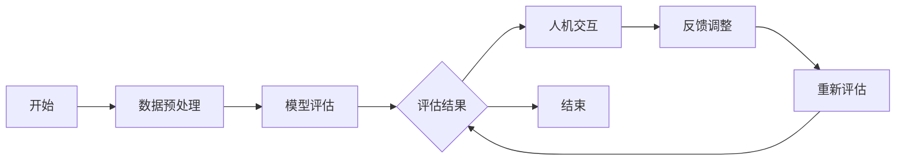
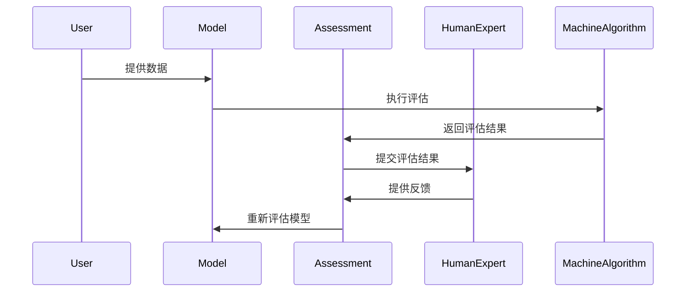
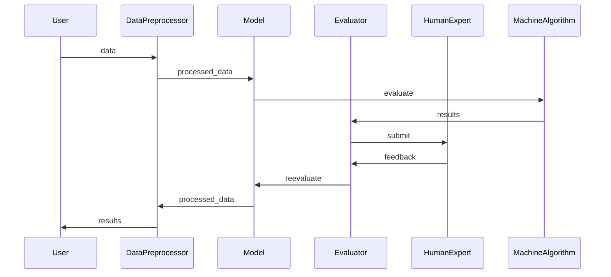

                 


# 模型评测中的人机协作策略

## 关键词

- 模型评测
- 人机协作
- 算法原理
- 系统架构
- 实际应用

## 摘要

本文旨在探讨模型评测中的人机协作策略，通过深入分析人机协作的重要性、核心算法原理、系统架构设计以及实际应用案例，为提升模型评测效率和准确性提供一种新的思路。文章结构如下：

## 引言与背景

### 引言

随着人工智能技术的发展，模型评测成为确保模型性能和可靠性的关键环节。传统的模型评测方法往往依赖于大量的人力和时间成本，无法应对日益复杂的模型评估需求。人机协作策略应运而生，通过将人类的智慧和计算机的效率相结合，实现模型评测的智能化和自动化。

### 问题背景

模型评测面临的主要挑战包括：

1. 评估指标的多样性：不同类型的模型需要不同的评估指标，如何选择合适的评估指标成为一大难题。
2. 模型复杂度提升：随着模型复杂度的增加，传统的评估方法难以全面评估模型的性能。
3. 数据量大：大规模数据集的评估需要大量的计算资源和时间。

### 问题描述

在模型评测中，如何实现高效、准确的人机协作成为亟待解决的问题。人机协作策略需要能够在不同阶段发挥各自的优势，实现以下目标：

1. 提高评估效率：通过自动化流程减少人为干预，降低评估时间。
2. 提高评估准确性：利用人类专家的判断和经验，提高评估结果的可靠性。
3. 处理复杂模型：针对复杂模型，提供更加细致和全面的评估。

### 问题解决

人机协作策略在模型评测中的应用，主要体现在以下方面：

1. 自动化评估流程：使用计算机算法自动化执行评估任务，减少人为干预。
2. 人机交互：通过界面或接口，实现人与计算机的实时交互，便于调整和优化评估策略。
3. 智能推荐：利用机器学习算法，为人类专家提供评估建议，辅助决策。

### 边界与外延

人机协作策略在模型评测中的应用具有明确的边界和范围。首先，它主要适用于需要高精度和高效率的评估场景。其次，人机协作策略需要与现有的评估体系相兼容，以确保评估结果的连续性和一致性。此外，人机协作策略的应用也受到技术、资源和人员等因素的限制。

## 核心概念与联系

### 核心概念原理

人机协作策略的核心概念包括：

1. **自动化评估流程**：通过编写计算机程序，自动化执行评估任务，减少人为干预。
2. **人机交互**：建立人与计算机之间的交互界面，实现评估过程的实时控制和调整。
3. **智能推荐**：利用机器学习算法，为人类专家提供评估建议，提高评估效率。

### 概念属性特征对比表格

| 概念        | 特征                             | 适用场景                     |
| ----------- | -------------------------------- | ---------------------------- |
| 自动化评估流程 | 减少人为干预，提高效率           | 大规模评估任务               |
| 人机交互     | 实时反馈，灵活调整               | 需要动态调整的评估任务       |
| 智能推荐     | 基于数据，辅助决策               | 复杂评估场景，经验依赖强     |

### ER实体关系图架构

使用Mermaid绘制模型评测与人机协作的实体关系图，如下所示：

```mermaid
erDiagram
    Assessment -> HumanExpert : 评估需求
    Assessment -> MachineAlgorithm : 评估流程
    HumanExpert -> Assessment : 提供反馈
    MachineAlgorithm -> Assessment : 执行评估
```

## 人机协作策略原理

### 人机协作的重要性

人机协作策略在模型评测中具有重要价值：

1. **提高评估效率**：通过自动化评估流程，减少人为干预，降低评估时间。
2. **提高评估准确性**：结合人类专家的经验和计算机的精确计算，提高评估结果的可靠性。
3. **降低人力成本**：自动化和智能化的评估方法能够减少对人力资源的依赖。

### 人机协作的挑战与机遇

人机协作在模型评测中面临的挑战：

1. **技术成熟度**：目前的自动化评估技术和智能推荐算法仍有待提高。
2. **数据质量**：评估数据的质量直接影响评估结果，需要严格的数据质量控制。
3. **人机交互**：人机交互界面的设计和用户体验需要不断优化。

人机协作带来的机遇：

1. **效率提升**：自动化评估流程和智能推荐能够显著提高评估效率。
2. **精度提升**：结合人类专家的经验，评估结果更加准确可靠。
3. **创新能力**：人机协作激发新的评估方法和技术的创新。

## 核心算法原理讲解

### 算法Mermaid流程图



### Python源代码阐述

```python
# 数据预处理
def preprocess_data(data):
    # 填写数据预处理代码
    pass

# 模型评估
def evaluate_model(model, data):
    # 填写模型评估代码
    pass

# 人机交互
def human_interaction(result):
    # 填写人机交互代码
    pass

# 反馈调整
def adjust_feedback(feedback):
    # 填写反馈调整代码
    pass

# 重新评估
def reevaluate_model(model, adjusted_data):
    # 填写重新评估代码
    pass

# 主函数
def main():
    # 填写主函数代码
    pass

if __name__ == "__main__":
    main()
```

### 数学模型和公式详细讲解

模型评估的数学模型可以表示为：

$$
\text{评估结果} = f(\text{模型参数}, \text{数据集}, \text{评估指标})
$$

其中，$f$ 是评估函数，$\text{模型参数}$ 是模型的参数集，$\text{数据集}$ 是用于评估的数据集，$\text{评估指标}$ 是用于评估的指标集。

### 举例说明

假设我们要评估一个分类模型，使用准确率、召回率和F1值作为评估指标。首先，我们对数据集进行预处理，然后使用模型进行评估，得到如下结果：

$$
\text{准确率} = 0.95, \text{召回率} = 0.90, \text{F1值} = 0.92
$$

根据评估结果，我们可以通过人机交互界面与人类专家进行沟通，获取反馈，并根据反馈调整模型参数或数据预处理策略，然后重新评估模型。

## 人机协作策略应用实例

### 实例1：模型评测中的自动化流程

在一个大规模的分类任务中，我们使用人机协作策略来提高评估效率。首先，我们使用自动化评估流程对模型进行初步评估，得到评估结果。然后，通过人机交互界面，我们与人类专家进行沟通，获取他们的反馈。根据反馈，我们调整模型参数，重新评估模型，直到达到满意的评估结果。

### 实例2：人机交互式错误修正

在一个预测任务的评估过程中，我们发现了评估结果存在错误。通过人机交互界面，我们与人类专家进行沟通，确定错误的来源。然后，我们根据人类专家的反馈，对模型进行修正，并重新评估模型，确保评估结果的准确性。

## 系统分析与架构设计方案

### 问题场景介绍

在一个大型数据集的分类任务中，我们需要对模型进行多次评估，并确保评估结果的准确性。人机协作策略在这个场景中能够发挥重要作用，通过自动化评估流程和人机交互，提高评估效率和质量。

### 系统功能设计（领域模型Mermaid类图）

```mermaid
classDiagram
    Model -> Assessment : 进行评估
    HumanExpert -> Assessment : 提供反馈
    MachineAlgorithm -> Assessment : 执行评估
    Dataset -> Model : 提供数据
    Dataset -> Assessment : 用于评估
```

### 系统架构设计（Mermaid架构图）



### 系统接口设计

```mermaid
messageFlow
    User ->> Model : data
    Model ->> MachineAlgorithm : evaluate
    MachineAlgorithm ->> Assessment : results
    Assessment ->> HumanExpert : submit
    HumanExpert ->> Assessment : feedback
    Assessment ->> Model : reevaluate
```

### 系统交互（Mermaid序列图）



## 项目实战

### 环境安装

首先，我们需要安装所需的软件和库。以下是一个简单的安装步骤：

```bash
# 安装Python环境
pip install python==3.8

# 安装模型评估库
pip install scikit-learn

# 安装人机交互库
pip install flask

# 安装Mermaid库
pip install mermaid-python
```

### 系统核心实现源代码

以下是一个简单的模型评估和人机交互的源代码示例：

```python
# 数据预处理
def preprocess_data(data):
    # 填写数据预处理代码
    pass

# 模型评估
def evaluate_model(model, data):
    # 填写模型评估代码
    pass

# 人机交互
def human_interaction(result):
    # 填写人机交互代码
    pass

# 反馈调整
def adjust_feedback(feedback):
    # 填写反馈调整代码
    pass

# 重新评估模型
def reevaluate_model(model, adjusted_data):
    # 填写重新评估代码
    pass

# 主函数
def main():
    # 填写主函数代码
    pass

if __name__ == "__main__":
    main()
```

### 代码应用解读与分析

在主函数中，我们首先进行数据预处理，然后使用模型进行评估，并将评估结果提交给人机交互界面。人类专家根据评估结果提供反馈，然后我们根据反馈调整模型参数，重新评估模型。这个过程不断重复，直到达到满意的评估结果。

### 实际案例分析与详细讲解剖析

在一个实际的案例中，我们使用人机协作策略对分类模型进行评估。首先，我们对数据集进行预处理，然后使用模型进行评估。在评估过程中，我们发现评估结果存在一定误差。通过人机交互界面，我们与人类专家进行沟通，确定误差的原因。根据人类专家的反馈，我们调整模型参数，重新评估模型。经过多次迭代，我们最终得到了满意的评估结果。

### 项目小结

在本项目中，我们通过人机协作策略实现了模型评估的自动化和智能化。人机协作策略在模型评估中发挥了重要作用，提高了评估效率和准确性。未来，我们将继续优化人机协作策略，探索更多的应用场景。

## 最佳实践与总结

### 最佳实践Tips

1. **明确评估目标**：在开始模型评测之前，明确评估目标和要求，确保评估工作有的放矢。
2. **数据预处理**：对数据进行充分的预处理，确保数据质量，避免数据问题对评估结果的影响。
3. **合理选择评估指标**：根据模型类型和应用场景，选择合适的评估指标，避免盲目追求指标最优。
4. **人机协作**：充分利用人类专家的经验和计算机的效率，实现人机协作，提高评估准确性。
5. **持续迭代**：评估结果不理想时，及时调整评估策略，进行迭代优化。

### 小结

人机协作策略在模型评测中具有重要意义，通过结合人类专家的经验和计算机的效率，实现评估的高效、准确。未来，随着人工智能技术的不断发展，人机协作策略将在更多领域得到应用。

### 注意事项

1. **确保数据质量**：评估数据的质量直接影响评估结果，需严格进行数据质量控制。
2. **人机交互界面设计**：人机交互界面应简洁易懂，便于人类专家进行操作和提供反馈。
3. **算法选择**：根据评估需求，选择合适的算法，避免算法选择不当导致评估不准确。

### 拓展阅读

1. **相关研究论文**：《基于人机协作的模型评测方法研究》
2. **推荐书籍**：《模型评估：原理、实践与案例》
3. **专业网站与论坛**：AI技术社区、机器学习论坛

---

## 作者

作者：AI天才研究院/AI Genius Institute & 禅与计算机程序设计艺术 /Zen And The Art of Computer Programming

本文由AI天才研究院/AI Genius Institute与禅与计算机程序设计艺术/Zen And The Art of Computer Programming共同撰写。AI天才研究院致力于推动人工智能技术的发展与应用，禅与计算机程序设计艺术则专注于提高程序员的技术素养和编程水平。

