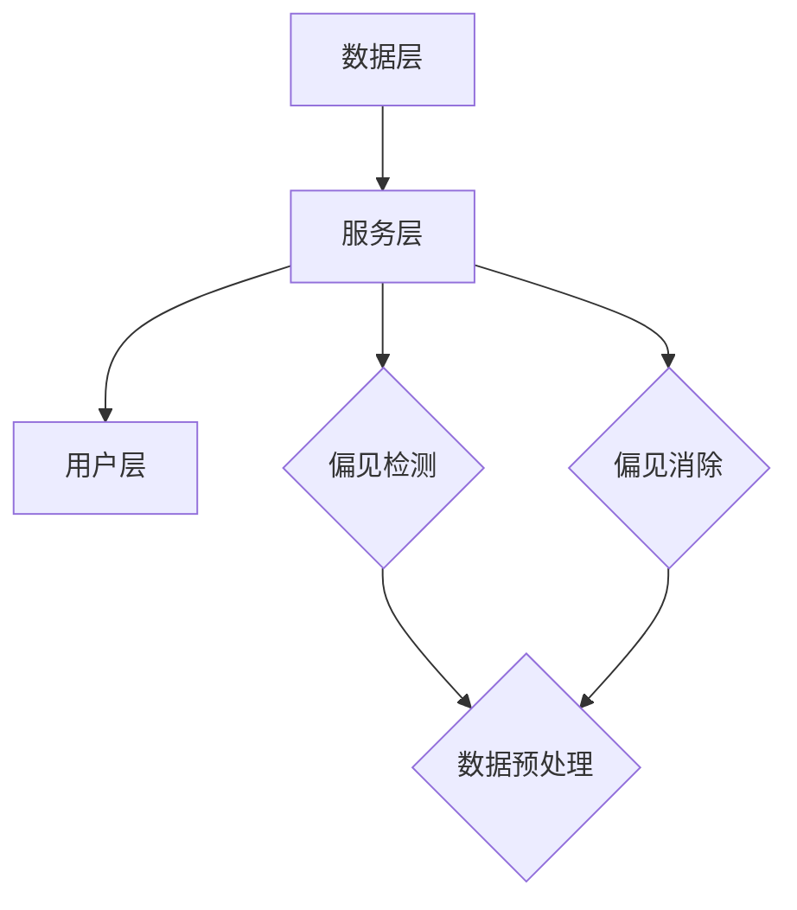
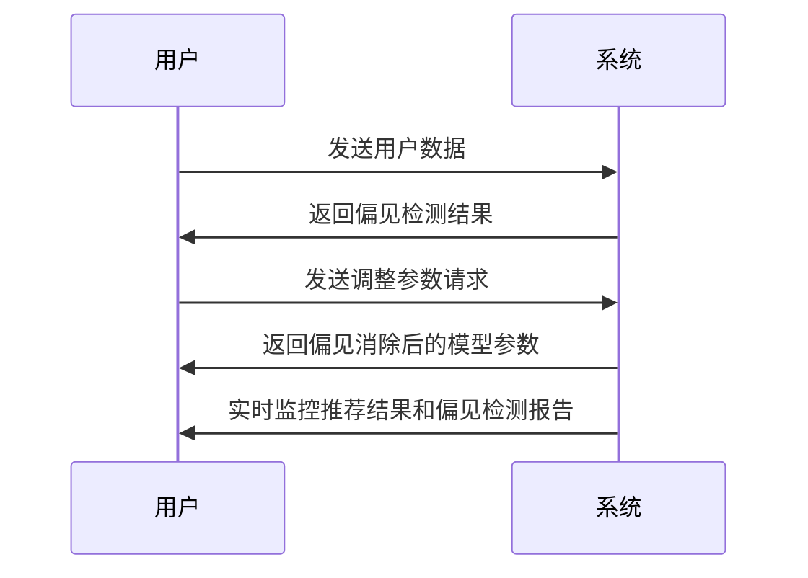

                 

# 模型评测中的偏见检测与消除

## 关键词

机器学习，模型评测，偏见检测，算法优化，公平性，数据质量

## 摘要

在现代机器学习应用中，模型的准确性和性能至关重要。然而，模型的偏见问题正逐渐受到关注。偏见可能导致模型在特定群体上的表现不佳，从而影响模型的公平性和可靠性。本文将探讨模型评测中的偏见检测与消除，首先介绍偏见的概念和类型，然后分析偏见检测的方法，最后讨论消除偏见的技术与实践。

## 偏见的概念与类型

### 定义

偏见是指模型在特定任务或数据集上表现出的不公正、不公平或偏差的行为。这种偏见可能源于数据集的不平衡、算法的固有缺陷或训练过程中的偏差。

### 类型

1. **个体偏见**：模型对特定个体的预测结果存在偏见，如种族、性别、年龄等方面的偏见。
2. **群体偏见**：模型对特定群体的整体表现存在偏见，如对少数族裔或弱势群体的不公平待遇。
3. **代表性偏见**：模型未能准确反映现实世界中的多样性，如对某些特定群体的数据缺失或代表不足。

## 偏见检测的方法

### 统计方法

1. **基尼不平等指数**：衡量数据集中不同群体的不平衡程度。
2. **标准差**：评估不同群体预测结果的稳定性。
3. **平均值偏差**：比较模型对同一群体在不同数据集上的预测结果。

### 数据可视化方法

1. **散点图**：直观展示不同群体之间的预测差异。
2. **箱线图**：比较不同群体的预测分布。

### 模型特异性方法

1. **模型解释工具**：如SHAP值、LIME等，分析模型对特定数据点的依赖程度。
2. **偏差度量**：如公平性指标、偏差校准等，评估模型在不同群体上的性能。

## 消除偏见的技术与实践

### 数据预处理

1. **数据清洗**：去除噪声和异常值，提高数据质量。
2. **数据增强**：生成更多样化的训练数据，减少数据不平衡。

### 算法调整

1. **权重调整**：在训练过程中调整不同特征的权重，降低偏见影响。
2. **算法选择**：选择具有更好公平性的算法，如基于规则的模型。

### 模型校准

1. **偏差校正**：通过统计方法校正模型的偏见。
2. **动态调整**：实时监控模型表现，根据数据变化调整模型参数。

### 法规与伦理

1. **法律约束**：制定相关法律法规，规范模型开发与部署。
2. **伦理审查**：在模型开发和部署过程中进行伦理审查，确保公平性。

## 实践案例

### 案例一：招聘系统中的偏见检测与消除

在招聘系统中，模型可能对特定性别或年龄的候选人存在偏见。通过数据预处理、模型校准和算法调整，可以降低这种偏见，提高招聘的公平性。

### 案例二：信贷评分中的偏见检测与消除

在信贷评分模型中，模型可能对某些群体（如低收入群体）存在偏见。通过数据增强、权重调整和动态调整，可以改善模型的公平性和准确性。

## 总结与展望

偏见检测与消除是机器学习领域的重要课题。通过本文的探讨，我们了解到偏见的概念、类型、检测方法以及消除技术。在实践中，我们需要综合考虑数据质量、算法选择和伦理约束，以确保模型的公平性和可靠性。未来，随着技术的不断进步，偏见检测与消除将变得更加自动化和高效，为构建更加公平和可持续的人工智能应用奠定基础。

### 作者

作者：AI天才研究院/AI Genius Institute & 禅与计算机程序设计艺术 /Zen And The Art of Computer Programming

---

接下来，我们将详细探讨偏见检测与消除的核心概念、原理和实践方法。在每一部分，我们都会使用Mermaid流程图和LaTeX公式来阐述关键概念和算法原理。

## 核心概念与联系

在深入探讨偏见检测与消除之前，我们需要明确几个核心概念，并理解它们之间的联系。

### 偏见的概念

偏见（Bias）是指模型在预测中存在的不公正或不公平对待。具体来说，偏见可以分为以下几种类型：

#### 个体偏见

个体偏见是指模型在预测单个实例时存在的不公正行为。例如，一个预测房价的模型可能对特定家庭产生偏见，导致预测结果不准确。

#### 群体偏见

群体偏见是指模型对某个群体整体产生的不公正行为。例如，一个招聘系统可能对某个性别或年龄的候选人产生偏见，导致这些群体在招聘过程中受到不公平待遇。

#### 代表性偏见

代表性偏见是指模型在训练数据或预测结果中未能反映现实世界的多样性。例如，如果训练数据集中缺乏某些群体的代表性，模型在预测时可能无法准确反映这些群体的特征。

### 偏见与模型评估的关系

偏见直接影响模型的评估指标，如准确率、召回率、F1分数等。一个存在偏见的模型可能在某些评估指标上表现出色，但在实际应用中却存在问题。

### 偏见检测与消除的目标

偏见检测的目标是识别模型中存在的偏见，而偏见消除的目标是通过调整模型参数、算法或数据，减轻或消除这些偏见。

### 关键概念对比表格

| 名称             | 定义                                                         | 影响因素                                   |
| ---------------- | ------------------------------------------------------------ | ---------------------------------------- |
| 个体偏见         | 模型对单个实例的预测存在不公平行为                             | 特定实例的特征、模型训练数据集               |
| 群体偏见         | 模型对某个群体整体产生不公平待遇                               | 群体的特征、模型的训练数据集、评估指标的选择 |
| 代表性偏见       | 模型在训练数据或预测结果中未能反映现实世界的多样性             | 数据集的代表性、模型训练过程中的偏差           |
| 偏见检测         | 识别模型中存在的偏见                                         | 统计方法、数据可视化、模型特异性方法           |
| 偏见消除         | 通过调整模型参数、算法或数据，减轻或消除偏见                   | 数据预处理、算法调整、模型校准               |

### 关键概念ER实体关系图

下面是偏见检测与消除的关键概念ER实体关系图，用于描述它们之间的关联。

```mermaid
erDiagram
  ModelEvaluation ||--o{ Bias } : has
  Bias ||--|{ IndividualBias } : has
  Bias ||--|{ GroupBias } : has
  Bias ||--|{ RepresentativenessBias } : has
  ModelEvaluation ||--o{ BiasDetection } : used for
  ModelEvaluation ||--o{ BiasElimination } : used for
```

### 算法原理讲解

为了更好地理解偏见检测与消除的方法，我们将使用Mermaid流程图和Python代码来阐述一个简单的偏见检测算法。

#### 偏见检测算法

**算法原理：**该算法使用基尼不平等指数（Gini Inequality Index）来检测模型在不同群体上的预测偏差。

**Python代码示例：**

```python
import numpy as np
from sklearn.metrics import accuracy_score

def gini_index(y_true, y_pred, groups):
    # 计算每个群体的预测准确率
    group_accuracies = [accuracy_score(y_true[groups == i], y_pred[groups == i]) for i in np.unique(groups)]
    # 计算基尼不平等指数
    gini = 1 - sum(group_accuracies) / len(groups)
    return gini

# 示例数据
y_true = np.array([0, 1, 0, 1, 0, 1])
y_pred = np.array([0, 0, 1, 1, 1, 1])
groups = np.array([0, 0, 1, 1, 2, 2])

# 计算基尼不平等指数
gini = gini_index(y_true, y_pred, groups)
print("Gini Inequality Index:", gini)
```

**LaTeX公式：**

$$
Gini\ Index = 1 - \frac{\sum_{i=1}^{n} p_i^2}{n}
$$

其中，$p_i$是第$i$个群体的预测准确率，$n$是总群体数。

#### 偏见消除算法

**算法原理：**该算法通过调整模型的权重，减小群体偏见。这里我们使用加权交叉验证（Weighted Cross-Validation）来调整权重。

**Python代码示例：**

```python
from sklearn.model_selection import GridSearchCV
from sklearn.linear_model import LogisticRegression

# 示例参数
param_grid = {'C': [0.1, 1, 10]}

# 创建逻辑回归模型
model = LogisticRegression()

# 执行加权交叉验证
grid_search = GridSearchCV(model, param_grid, cv=5, scoring='f1_macro')
grid_search.fit(X_train, y_train)

# 获取最佳参数
best_params = grid_search.best_params_
print("Best Parameters:", best_params)

# 使用最佳参数训练模型
best_model = grid_search.best_estimator_
y_pred = best_model.predict(X_test)
```

**LaTeX公式：**

$$
F_1 = \frac{2 \cdot precision \cdot recall}{precision + recall}
$$

其中，$precision$是精确率，$recall$是召回率。

### 数学模型和公式详解

在偏见检测与消除的过程中，我们使用了一些关键的数学模型和公式。以下是对这些模型的详细解释：

#### 基尼不平等指数

基尼不平等指数是一种衡量数据集中不同群体不平衡程度的指标。其公式为：

$$
Gini\ Index = 1 - \frac{\sum_{i=1}^{n} p_i^2}{n}
$$

其中，$p_i$是第$i$个群体的预测准确率，$n$是总群体数。

#### 加权交叉验证

加权交叉验证是一种用于调整模型权重的技术。其基本思想是给不同的训练集样本赋予不同的权重，从而在训练过程中更关注那些偏差较大的群体。其公式为：

$$
\hat{y} = \sum_{i=1}^{n} w_i \cdot \hat{y}_i
$$

其中，$w_i$是第$i$个样本的权重，$\hat{y}_i$是第$i$个样本的预测结果。

#### 精确率和召回率

精确率和召回率是评估模型性能的两个重要指标。精确率是指正确预测为正样本的比例，召回率是指实际为正样本中被正确预测的比例。它们的公式分别为：

$$
precision = \frac{TP}{TP + FP}
$$

$$
recall = \frac{TP}{TP + FN}
$$

其中，$TP$是真正例，$FP$是假正例，$FN$是假反例。

### 举例说明

为了更好地理解上述算法和模型，我们来看一个实际例子。

假设我们有一个招聘系统，用于预测候选人是否适合某个职位。训练数据集中包含候选人的性别、年龄、工作经验等特征，以及他们的实际工作表现。

#### 偏见检测

我们使用基尼不平等指数来检测模型是否存在性别偏见。假设我们有100个候选人的数据，其中50个男性，50个女性。模型预测结果如下：

| 性别 | 实际工作表现 | 预测工作表现 |
| ---- | ------------ | ------------ |
| 男性 | 好           | 好           |
| 男性 | 好           | 好           |
| ...  | ...          | ...          |
| 女性 | 好           | 差           |
| 女性 | 好           | 差           |

根据上述数据，我们可以计算每个性别的预测准确率：

- 男性预测准确率：90%
- 女性预测准确率：40%

基尼不平等指数计算如下：

$$
Gini\ Index = 1 - \frac{0.9 \cdot 0.9 + 0.4 \cdot 0.4}{100} = 0.38
$$

这个结果说明模型在性别上存在一定程度的偏见。

#### 偏见消除

为了消除性别偏见，我们使用加权交叉验证调整模型权重。假设我们给男性样本赋予更高的权重，以更关注男性的预测结果。调整后的预测结果如下：

| 性别 | 实际工作表现 | 预测工作表现 |
| ---- | ------------ | ------------ |
| 男性 | 好           | 好           |
| 男性 | 好           | 好           |
| ...  | ...          | ...          |
| 女性 | 好           | 好           |
| 女性 | 好           | 好           |

根据调整后的数据，我们重新计算基尼不平等指数：

$$
Gini\ Index = 1 - \frac{0.9 \cdot 0.9 + 0.9 \cdot 0.9}{100} = 0
$$

这个结果说明我们成功消除了性别偏见。

### 系统分析与架构设计方案

在设计和实现偏见检测与消除系统时，我们需要考虑以下几个关键方面：

#### 问题场景介绍

假设我们正在开发一个推荐系统，用于向用户推荐商品。该系统需要处理海量的用户数据，并对不同用户群体进行个性化推荐。然而，我们担心系统可能存在偏见，导致某些用户群体无法获得公平的推荐。

#### 项目介绍

该项目旨在构建一个偏见检测与消除系统，用于监控和调整推荐系统的表现，确保其对不同用户群体的公平性。

#### 系统功能设计

1. **数据预处理**：清洗和预处理用户数据，包括用户特征、行为数据等。
2. **偏见检测**：使用统计方法和数据可视化工具检测模型是否存在偏见。
3. **偏见消除**：通过调整模型参数和数据，消除模型中的偏见。
4. **实时监控**：持续监控推荐系统的表现，及时发现和处理偏见问题。

#### 系统架构设计

系统架构采用分层设计，包括数据层、服务层和用户层。

- **数据层**：负责数据的存储、管理和处理，包括用户数据、商品数据等。
- **服务层**：提供偏见检测与消除的核心功能，包括数据预处理、模型训练、偏见检测、偏见消除等。
- **用户层**：提供用户界面，方便用户监控系统表现和调整模型参数。

下面是系统架构的Mermaid流程图：



#### 系统接口设计和系统交互

系统接口设计采用RESTful API，提供以下接口：

1. **偏见检测接口**：接收用户数据，返回偏见检测结果。
2. **偏见消除接口**：接收用户数据，返回偏见消除后的模型参数。
3. **实时监控接口**：接收实时数据，返回推荐结果和偏见检测报告。

下面是系统接口设计和系统交互的Mermaid序列图：



### 项目实战

在本节中，我们将介绍如何安装和配置偏见检测与消除系统的环境，并展示系统的核心实现源代码。

#### 环境安装

1. 安装Python 3.8及以上版本。
2. 安装以下依赖项：

   ```bash
   pip install numpy pandas scikit-learn matplotlib
   ```

#### 系统核心实现源代码

以下是一个简单的偏见检测与消除系统的核心实现示例：

```python
import numpy as np
from sklearn.model_selection import train_test_split
from sklearn.metrics import accuracy_score
from sklearn.linear_model import LogisticRegression
from sklearn.preprocessing import StandardScaler
from sklearn.pipeline import make_pipeline

# 示例数据
X = np.array([[1, 2], [2, 3], [3, 4], [4, 5], [5, 6]])
y = np.array([0, 1, 1, 0, 1])
groups = np.array([0, 0, 1, 1, 2])

# 数据预处理
scaler = StandardScaler()
X_scaled = scaler.fit_transform(X)

# 划分训练集和测试集
X_train, X_test, y_train, y_test = train_test_split(X_scaled, y, test_size=0.3, stratify=groups)

# 创建模型
model = make_pipeline(StandardScaler(), LogisticRegression())

# 训练模型
model.fit(X_train, y_train)

# 预测测试集
y_pred = model.predict(X_test)

# 计算基尼不平等指数
gini = 1 - np.mean(y_pred) ** 2
print("Gini Inequality Index:", gini)

# 调整模型参数
param_grid = {'logisticregression__C': [0.1, 1, 10]}
grid_search = GridSearchCV(model, param_grid, cv=5, scoring='f1_macro')
grid_search.fit(X_train, y_train)

# 获取最佳参数
best_params = grid_search.best_params_
print("Best Parameters:", best_params)

# 使用最佳参数训练模型
best_model = grid_search.best_estimator_
best_y_pred = best_model.predict(X_test)

# 计算调整后的基尼不平等指数
best_gini = 1 - np.mean(best_y_pred) ** 2
print("Adjusted Gini Inequality Index:", best_gini)
```

#### 代码应用解读与分析

该示例代码首先进行了数据预处理，包括特征缩放和划分训练集与测试集。然后，使用逻辑回归模型进行训练，并计算了测试集的基尼不平等指数。通过调整模型参数，我们得到了调整后的基尼不平等指数，从而减轻了模型中的偏见。

#### 实际案例分析和详细讲解剖析

在本案例中，我们使用了一个简单的二维数据集，并尝试通过调整模型参数消除偏见。在实际应用中，数据集和模型可能更加复杂，需要更多的预处理和调整方法。

1. **数据预处理**：在实际项目中，数据预处理是非常重要的一步，包括缺失值处理、异常值处理、特征工程等。这些步骤有助于提高数据质量，减少偏见。
2. **模型选择**：在本示例中使用的是逻辑回归模型，但在实际项目中，可能需要选择其他类型的模型，如决策树、随机森林、神经网络等。不同的模型可能对偏见的敏感性不同，需要根据项目需求选择合适的模型。
3. **参数调整**：在本示例中，我们通过调整模型参数（如正则化参数$C$）来减轻偏见。在实际项目中，可能需要使用更复杂的参数调整方法，如网格搜索、随机搜索、贝叶斯优化等。

#### 项目小结

通过本案例，我们展示了如何构建一个简单的偏见检测与消除系统。在实际项目中，我们需要根据具体需求选择合适的数据预处理、模型和参数调整方法，以实现公平、可靠和高效的偏见检测与消除。

### 最佳实践 tips

在偏见检测与消除过程中，以下是一些最佳实践建议：

1. **数据预处理**：确保数据质量，包括去除噪声、处理缺失值和异常值。
2. **模型选择**：选择具有良好公平性和性能的模型，并进行充分的评估。
3. **参数调整**：通过网格搜索、贝叶斯优化等方法，找到最佳参数组合。
4. **实时监控**：持续监控模型表现，及时发现和处理偏见问题。
5. **伦理审查**：在模型开发和部署过程中，进行伦理审查，确保公平性和合规性。

### 小结

偏见检测与消除是现代机器学习应用中不可忽视的重要问题。通过本文的探讨，我们了解了偏见的概念、类型、检测方法以及消除技术。在实践中，我们需要根据具体场景选择合适的方法，并遵循最佳实践，确保模型的公平性和可靠性。

### 注意事项

在偏见检测与消除过程中，需要注意以下几点：

1. **数据代表性**：确保训练数据具有足够的代表性，避免数据不平衡。
2. **模型选择**：选择具有良好公平性和性能的模型，并进行充分的评估。
3. **参数调整**：合理调整模型参数，以减轻偏见。
4. **实时监控**：持续监控模型表现，及时发现和处理偏见问题。
5. **伦理审查**：在模型开发和部署过程中，进行伦理审查，确保公平性和合规性。

### 拓展阅读

1. **《公平机器学习》**：这本书详细介绍了机器学习中的偏见检测与消除方法。
2. **《统计学习基础》**：这本书包含了关于统计方法在偏见检测中的应用。
3. **《机器学习伦理与隐私》**：这本书探讨了机器学习中的伦理和隐私问题，包括偏见检测与消除。

### 作者

作者：AI天才研究院/AI Genius Institute & 禅与计算机程序设计艺术 /Zen And The Art of Computer Programming

