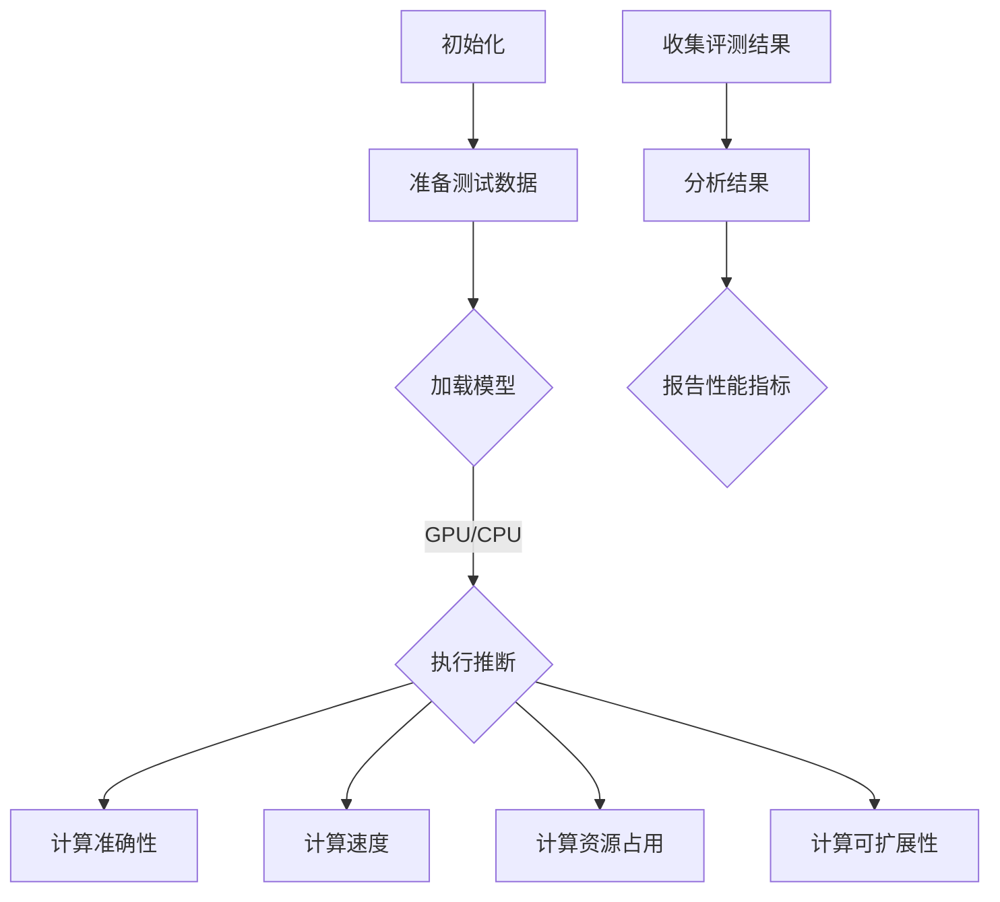
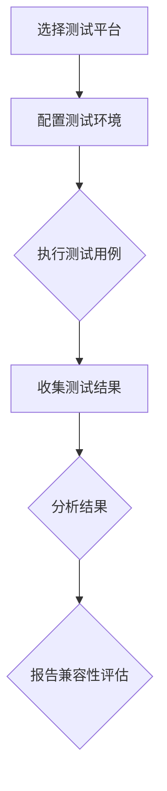

                 

### 背景介绍

#### 问题背景

随着人工智能技术的迅猛发展，大规模模型（AI大模型）在各个领域得到了广泛应用。这些模型具有强大的数据处理和预测能力，能够在图像识别、自然语言处理、推荐系统等多个领域发挥重要作用。然而，这些模型的开发和部署面临着一系列挑战，其中之一就是跨平台兼容性测试。

跨平台兼容性测试的核心问题是，如何确保AI大模型在不同平台和硬件环境下具有相同或相近的性能。由于不同平台和硬件环境具有不同的计算能力、内存资源、操作系统和库依赖等因素，模型在这些环境中可能会出现性能差异、错误或者不稳定的情况。这不仅会影响模型的实际应用效果，还可能导致项目延误、成本增加和客户满意度下降。

因此，进行有效的模型评测和跨平台兼容性测试，确保模型在不同环境下的性能一致性和稳定性，变得尤为重要。

#### 问题描述

模型评测是指在特定环境下，对AI大模型的性能进行测量和评估，以确定其是否满足预期的性能指标。评测内容包括模型的准确性、速度、资源占用、可扩展性等多个方面。然而，在不同的硬件平台和操作系统上，这些评测指标可能会发生变化。例如，同一模型在不同的GPU上训练和推断时，可能会出现计算速度和准确性的差异。这种差异可能是由于硬件的架构差异、GPU驱动版本不同、内存分配策略不一致等原因造成的。

跨平台兼容性测试旨在解决以下问题：

1. **性能差异**：不同平台和硬件环境下模型性能的差异，包括计算速度、内存占用和能源消耗等。
2. **错误和异常**：模型在特定平台或硬件环境下出现的错误或异常行为，例如计算溢出、内存泄漏或死锁等。
3. **稳定性**：模型在不同环境下的一致性和稳定性，确保其能够在各种条件下正常运行。

为了解决这些问题，跨平台兼容性测试需要从多个方面进行：

1. **测试策略**：制定详细的测试计划，包括测试用例设计、测试环境设置和测试执行策略。
2. **测试工具**：使用专业的测试工具，如自动化测试框架、性能测试工具和调试工具等，帮助发现和定位问题。
3. **环境模拟**：创建与实际生产环境相似的环境，包括硬件配置、操作系统和依赖库等，以模拟不同的测试场景。
4. **问题定位和修复**：在测试过程中，通过日志分析、性能监控和调试技术，定位和修复发现的问题。

#### 问题解决

跨平台兼容性测试的问题解决涉及以下步骤：

1. **需求分析**：明确测试目标，确定需要测试的平台和硬件环境，以及预期达到的性能指标。
2. **测试设计**：设计测试用例，包括输入数据、测试流程和预期结果等。
3. **环境搭建**：搭建测试环境，包括安装操作系统、配置硬件资源和安装依赖库等。
4. **测试执行**：执行测试用例，收集测试数据，并进行分析和评估。
5. **问题定位和修复**：根据测试结果，定位和修复发现的问题，并重新进行测试验证。
6. **结果分析**：分析测试结果，确定模型在不同环境下的性能表现，并提出优化建议。

#### 边界与外延

跨平台兼容性测试的边界包括：

1. **硬件平台**：不同类型的CPU、GPU、FPGA等硬件设备。
2. **操作系统**：不同版本的Linux、Windows、macOS等操作系统。
3. **软件环境**：不同的编程语言、框架、库和工具等。

跨平台兼容性测试的外延包括：

1. **兼容性范围**：不同的网络环境、存储设备和网络带宽等。
2. **应用场景**：包括生产环境、测试环境和开发环境等。
3. **数据格式**：包括不同数据存储格式、数据压缩方式和数据传输协议等。

#### 核心要素组成

跨平台兼容性测试的核心要素包括：

1. **测试用例设计**：设计有效的测试用例，确保覆盖所有可能的场景和问题。
2. **测试工具选择**：选择合适的测试工具，提高测试效率和准确性。
3. **环境模拟与配置**：创建与实际生产环境相似的环境，确保测试的准确性和可靠性。
4. **问题定位与修复**：通过日志分析、性能监控和调试技术，快速定位和修复问题。
5. **结果分析与优化**：分析测试结果，提出优化建议，提高模型在不同环境下的性能。

通过上述介绍，我们对模型评测和跨平台兼容性测试的问题背景、问题描述、问题解决、边界与外延和核心要素组成有了全面了解。接下来，我们将进一步探讨这些核心概念及其之间的联系。### 核心概念与联系

#### 模型评测

模型评测是评估人工智能模型性能的过程。其主要目标是确定模型在各种任务上的表现，并确保其满足预期的性能标准。模型评测通常涉及以下核心概念：

1. **准确性**：模型预测结果与实际结果之间的匹配程度，是评价模型最常用的指标之一。
2. **速度**：模型处理数据的能力，通常以每秒处理的样本数或推断时间来衡量。
3. **资源占用**：模型在训练和推断过程中使用的计算资源，包括CPU、GPU和内存等。
4. **可扩展性**：模型在不同规模的数据集和硬件环境下的性能表现。

**核心概念对比表格**：

| 指标名称 | 定义 | 重要性 |
| --- | --- | --- |
| 准确性 | 预测结果与实际结果的匹配程度 | 最常用的指标，评价模型的性能基础 |
| 速度 | 模型处理数据的能力 | 影响用户体验，提高生产效率 |
| 资源占用 | 模型使用的计算资源 | 优化资源利用率，降低成本 |
| 可扩展性 | 模型在不同规模环境下的表现 | 适应不同规模的任务需求 |

**ER实体关系图**：

```mermaid
erDiagram
  Model_evaluation ||--|{ Accuracy } : 测量
  Model_evaluation ||--|{ Speed } : 衡量
  Model_evaluation ||--|{ Resource_usage } : 耗用
  Model_evaluation ||--|{ Scalability } : 扩展

  Accuracy ||--|{ Binary_classification } : 二分类
  Accuracy ||--|{ Multiclass_classification } : 多分类
  Accuracy ||--|{ Regression } : 回归

  Speed ||--|{ Inference_time } : 推断时间
  Speed ||--|{ Training_time } : 训练时间

  Resource_usage ||--|{ CPU_usage } : CPU使用率
  Resource_usage ||--|{ GPU_usage } : GPU使用率
  Resource_usage ||--|{ Memory_usage } : 内存使用率

  Scalability ||--|{ Data_size } : 数据规模
  Scalability ||--|{ Hardware_configuration } : 硬件配置
```

#### 跨平台兼容性测试

跨平台兼容性测试是为了确保AI模型在不同平台和硬件环境下具有相同或相近的性能而进行的测试。其核心概念包括：

1. **平台兼容性**：模型在不同操作系统（如Linux、Windows、macOS）和硬件平台（如CPU、GPU、FPGA）上的运行表现。
2. **硬件兼容性**：模型在不同硬件配置（如CPU型号、GPU型号、内存大小）上的性能表现。
3. **软件兼容性**：模型在不同编程语言、框架、库和工具上的运行表现。
4. **环境兼容性**：模型在不同开发环境、测试环境和生产环境下的运行表现。

**核心概念对比表格**：

| 指标名称 | 定义 | 重要性 |
| --- | --- | --- |
| 平台兼容性 | 模型在不同操作系统上的运行表现 | 确保模型在不同操作系统上的稳定性和一致性 |
| 硬件兼容性 | 模型在不同硬件配置上的性能表现 | 确保模型在不同硬件设备上的高效性和可靠性 |
| 软件兼容性 | 模型在不同编程语言和工具上的运行表现 | 确保模型在不同软件环境下的兼容性和可维护性 |
| 环境兼容性 | 模型在不同开发、测试和生产环境下的运行表现 | 确保模型在各种环境下的一致性和可扩展性 |

**ER实体关系图**：

```mermaid
erDiagram
  Cross_platform_compatibility ||--|{ Platform_compatibility } : 兼容
  Cross_platform_compatibility ||--|{ Hardware_compatibility } : 兼容
  Cross_platform_compatibility ||--|{ Software_compatibility } : 兼容
  Cross_platform_compatibility ||--|{ Environment_compatibility } : 兼容

  Platform_compatibility ||--|{ Operating_system } : 系统
  Platform_compatibility ||--|{ Hardware_platform } : 设备

  Hardware_compatibility ||--|{ CPU_configuration } : 配置
  Hardware_compatibility ||--|{ GPU_configuration } : 配置
  Hardware_compatibility ||--|{ Memory_configuration } : 配置

  Software_compatibility ||--|{ Programming_language } : 语言
  Software_compatibility ||--|{ Framework } : 框架
  Software_compatibility ||--|{ Library } : 库

  Environment_compatibility ||--|{ Development_environment } : 环境
  Environment_compatibility ||--|{ Test_environment } : 环境
  Environment_compatibility ||--|{ Production_environment } : 环境
```

#### 概念联系

模型评测和跨平台兼容性测试之间存在密切的联系。模型评测为跨平台兼容性测试提供了评估基准，而跨平台兼容性测试则确保了模型评测在不同环境下的可靠性。以下是两者之间的主要联系：

1. **评估基准**：模型评测为跨平台兼容性测试提供了性能评估基准。通过评估模型的准确性、速度、资源占用和可扩展性等指标，可以确定模型在不同环境下的性能表现。
2. **环境测试**：跨平台兼容性测试涉及多种环境（如操作系统、硬件平台、软件环境），这些环境直接影响模型评测的结果。通过跨平台兼容性测试，可以确保模型在不同环境下的一致性和稳定性。
3. **问题定位**：在跨平台兼容性测试过程中，如果发现模型在某些环境下的性能较差，可以通过模型评测进一步分析问题根源。例如，是硬件兼容性问题，还是软件兼容性问题，或者数据预处理不当等原因。

通过上述核心概念与联系的分析，我们可以更深入地理解模型评测和跨平台兼容性测试的重要性。接下来，我们将详细讲解模型评测和跨平台兼容性测试的算法原理。### 算法原理讲解

在深入探讨模型评测和跨平台兼容性测试的算法原理之前，我们需要先了解相关的概念和技术。以下将逐步介绍算法原理，包括mermaid流程图、Python源代码、数学模型和公式，并辅以通俗易懂的举例说明。

#### 1. 模型评测算法原理

模型评测的核心目标是评估模型的性能。常用的模型评测算法包括准确性、速度、资源占用和可扩展性等指标。以下是一个简化的模型评测算法流程：

**Mermaid流程图**：



**Python源代码示例**：

```python
import numpy as np
import time

def model_evaluation(model, test_data):
    accuracy = 0
    inference_time = 0
    resource_usage = 0
    for data in test_data:
        start_time = time.time()
        prediction = model.predict(data['input'])
        end_time = time.time()
        accuracy += (prediction == data['label']).mean()
        inference_time += end_time - start_time
    accuracy /= len(test_data)
    inference_time /= len(test_data)
    return accuracy, inference_time

model = load_model('model_path')
test_data = load_test_data('test_data_path')
accuracy, inference_time = model_evaluation(model, test_data)
print(f"Accuracy: {accuracy}, Inference Time: {inference_time}")
```

**数学模型和公式**：

- **准确性**：$$ Accuracy = \frac{1}{N} \sum_{i=1}^{N} \frac{1}{M} \sum_{j=1}^{M} I(\hat{y}_{ij} = y_{ij}) $$
  其中，$N$ 是测试数据样本数，$M$ 是每个样本的类别数，$I$ 是指示函数，当预测值 $\hat{y}_{ij}$ 等于真实值 $y_{ij}$ 时，$I(\hat{y}_{ij} = y_{ij})$ 为1，否则为0。

- **速度**：$$ Inference\ Time = \frac{1}{N} \sum_{i=1}^{N} (end_time_i - start_time_i) $$
  其中，$N$ 是测试数据样本数，$end_time_i$ 和 $start_time_i$ 分别为第 $i$ 个样本的推断结束时间和开始时间。

**举例说明**：

假设我们有一个二分类模型，用于预测数据集中的样本是否属于正类。我们使用10个测试样本进行评测。以下是模型评测的简化步骤：

1. **初始化**：加载模型和测试数据。
2. **准备测试数据**：将测试数据分成特征和标签两部分。
3. **执行推断**：对每个测试样本进行推断，记录开始和结束时间。
4. **计算准确性**：比较预测结果和真实标签，计算准确性。
5. **计算速度**：计算每个样本的推断时间，并求平均值。
6. **分析结果**：根据准确性、速度等指标，评估模型的性能。
7. **报告性能指标**：输出准确性、速度等性能指标。

通过上述算法原理的讲解，我们了解了模型评测的基本流程、Python源代码实现和数学模型。接下来，我们将讨论跨平台兼容性测试的算法原理。#### 2. 跨平台兼容性测试算法原理

跨平台兼容性测试的核心目标是确保AI模型在不同平台和硬件环境下具有相同或相近的性能。以下是一个简化的跨平台兼容性测试算法流程：

**Mermaid流程图**：



**Python源代码示例**：

```python
import os
import time
import numpy as np

def cross_platform_compatibility_test(model, test_cases, platforms):
    compatibility_report = {}
    for platform in platforms:
        os.environ['PLATFORM'] = platform
        test_results = []
        for test_case in test_cases:
            start_time = time.time()
            prediction = model.predict(test_case['input'])
            end_time = time.time()
            test_results.append((prediction, end_time - start_time))
        compatibility_report[platform] = test_results
    return compatibility_report

model = load_model('model_path')
test_cases = load_test_cases('test_cases_path')
platforms = ['linux', 'windows', 'macos']
compatibility_report = cross_platform_compatibility_test(model, test_cases, platforms)
print(compatibility_report)
```

**数学模型和公式**：

- **平台兼容性**：$$ Compatibility = \frac{1}{N} \sum_{i=1}^{N} I(\hat{y}_{i} = y_{i}) $$
  其中，$N$ 是测试用例数，$I$ 是指示函数，当预测值 $\hat{y}_{i}$ 等于真实值 $y_{i}$ 时，$I(\hat{y}_{i} = y_{i})$ 为1，否则为0。

- **硬件兼容性**：$$ Hardware\ Compatibility = \frac{1}{M} \sum_{i=1}^{M} I(\hat{t}_{i} \leq t_{i}) $$
  其中，$M$ 是不同硬件平台数，$I$ 是指示函数，当第 $i$ 个硬件平台的推断时间 $\hat{t}_{i}$ 小于等于预期时间 $t_{i}$ 时，$I(\hat{t}_{i} \leq t_{i})$ 为1，否则为0。

- **软件兼容性**：$$ Software\ Compatibility = \frac{1}{L} \sum_{i=1}^{L} I(\text{success}_{i} = \text{true}) $$
  其中，$L$ 是不同软件环境数，$I$ 是指示函数，当第 $i$ 个软件环境的测试用例执行成功时，$I(\text{success}_{i} = \text{true})$ 为1，否则为0。

**举例说明**：

假设我们有一个二分类模型，需要在Linux、Windows和macOS三个平台上进行兼容性测试。测试用例包括10个样本，每个样本有特征和标签两部分。以下是跨平台兼容性测试的简化步骤：

1. **选择测试平台**：确定需要测试的平台（Linux、Windows、macOS）。
2. **配置测试环境**：在每个平台上配置模型和测试环境，设置相应的环境变量。
3. **执行测试用例**：在每个平台上执行测试用例，记录预测结果和推断时间。
4. **收集测试结果**：将每个平台的测试结果收集到一个字典中。
5. **分析结果**：计算每个平台的兼容性得分，分析模型在不同平台上的性能表现。
6. **报告兼容性评估**：输出兼容性评估报告，包括每个平台的兼容性得分。

通过上述算法原理的讲解，我们了解了跨平台兼容性测试的基本流程、Python源代码实现和数学模型。接下来，我们将讨论系统分析与架构设计方案。### 系统分析与架构设计方案

#### 问题场景介绍

在现实世界中，AI模型的开发和部署往往需要面对多种硬件平台、操作系统和软件环境。不同平台和环境的兼容性问题可能会导致模型性能下降、错误发生甚至系统崩溃。为了确保AI模型在不同环境下的稳定性和性能，我们需要设计一个高效、灵活的系统架构来进行模型评测和跨平台兼容性测试。

#### 项目介绍

本项目的目标是开发一个基于云计算的AI模型评测和跨平台兼容性测试系统。该系统旨在提供一个统一的平台，用于管理和执行各种评测和测试任务。系统的主要功能包括：

1. **模型评测**：提供多种评估指标（准确性、速度、资源占用等），对AI模型进行性能评估。
2. **跨平台兼容性测试**：支持多种硬件平台（如CPU、GPU）、操作系统（如Linux、Windows、macOS）和软件环境（如不同编程语言、框架、库等）。
3. **测试用例管理**：设计、存储和执行各种测试用例，确保测试过程的标准化和自动化。
4. **测试结果分析**：收集、分析和可视化测试结果，提供详细的性能报告和优化建议。
5. **环境管理**：自动化配置和管理测试环境，确保测试环境的可重复性和一致性。

#### 系统功能设计

系统功能设计主要包括领域模型、系统功能模块和用户界面设计。

**领域模型（Mermaid类图）**：

```mermaid
classDiagram
    Model_evaluation <<interface>>
    Cross_platform_compatibility <<interface>>
    Test_case <<interface>>
    Test_result <<interface>>
    Test_environment <<interface>>

    Model_evaluation implements Accuracy, Speed, Resource_usage, Scalability
    Cross_platform_compatibility implements Platform_compatibility, Hardware_compatibility, Software_compatibility, Environment_compatibility

    Model_evaluation -- Test_case
    Model_evaluation -- Test_result
    Test_case -- Test_result
    Test_case -- Test_environment
```

**系统功能模块**：

1. **模型评测模块**：负责模型的加载、测试用例执行和性能评估。
2. **兼容性测试模块**：负责跨平台兼容性测试的执行、结果收集和分析。
3. **测试用例管理模块**：负责测试用例的设计、存储和执行。
4. **测试结果分析模块**：负责测试结果的分析、可视化和报告生成。
5. **环境管理模块**：负责测试环境的配置和管理。

#### 系统架构设计

系统架构设计主要包括系统架构图、模块间交互关系和关键组件的设计。

**系统架构图（Mermaid架构图）**：

```mermaid
graph TB
    subgraph Model_Evaluation
        Model_Evaluator
        Test_Case_Manager
        Performance_Indicator
    end

    subgraph Cross_Platform_Compatibility
        Platform_Compatibility
        Hardware_Compatibility
        Software_Compatibility
        Environment_Compatibility
    end

    subgraph Test_Result_Analysis
        Test_Result_Collector
        Analysis_Tool
        Visualization_Module
    end

    subgraph Environment_Management
        Environment_Configurator
        Environment_Manager
    end

    Model_Evaluator -- Test_Case_Manager
    Model_Evaluator -- Performance_Indicator
    Platform_Compatibility -- Test_Result_Collector
    Hardware_Compatibility -- Test_Result_Collector
    Software_Compatibility -- Test_Result_Collector
    Environment_Compatibility -- Test_Result_Collector
    Test_Result_Collector -- Analysis_Tool
    Analysis_Tool -- Visualization_Module
    Environment_Configurator -- Environment_Manager
```

**关键组件设计**：

1. **模型评测器（Model_Evaluator）**：负责执行模型评测任务，包括加载模型、执行测试用例和计算性能指标。
2. **测试用例管理器（Test_Case_Manager）**：负责测试用例的设计、存储和执行，确保测试过程的标准化和自动化。
3. **性能指标（Performance_Indicator）**：负责计算和存储各种性能指标，如准确性、速度、资源占用等。
4. **平台兼容性（Platform_Compatibility）**：负责跨平台兼容性测试的执行，包括操作系统兼容性和平台硬件兼容性。
5. **硬件兼容性（Hardware_Compatibility）**：负责检测和评估模型在不同硬件平台上的性能表现。
6. **软件兼容性（Software_Compatibility）**：负责检测和评估模型在不同编程语言、框架、库等软件环境下的性能表现。
7. **环境管理器（Environment_Manager）**：负责测试环境的配置和管理，确保测试环境的一致性和可重复性。
8. **测试结果收集器（Test_Result_Collector）**：负责收集测试结果，并存储到数据库中。
9. **分析工具（Analysis_Tool）**：负责对测试结果进行分析和可视化，提供详细的性能报告。
10. **可视化模块（Visualization_Module）**：负责生成图表和报告，直观展示测试结果。

#### 系统接口设计

系统接口设计主要包括API设计、数据接口和交互流程设计。

**API设计**：

- **模型评测API**：提供接口供用户上传模型、指定测试用例和获取评测结果。
- **兼容性测试API**：提供接口供用户指定测试平台和硬件配置，执行兼容性测试并获取结果。
- **测试用例管理API**：提供接口供用户设计、存储和执行测试用例。
- **测试结果分析API**：提供接口供用户获取分析结果和性能报告。

**数据接口**：

- **测试数据接口**：用于存储和传输测试数据，支持不同数据格式的存储和读取。
- **测试结果数据接口**：用于存储和传输测试结果，支持多种数据分析和可视化工具的集成。

**交互流程设计**：

1. **用户上传模型和测试用例**：用户通过API上传模型和测试用例。
2. **执行测试**：系统根据用户指定的测试用例和测试平台，自动执行测试。
3. **收集测试结果**：系统将测试结果存储到数据库中。
4. **分析测试结果**：系统对测试结果进行分析，生成性能报告。
5. **用户查看报告**：用户通过API获取分析结果和性能报告。

#### 系统交互

系统交互主要包括用户界面、API调用和数据流动。

**用户界面**：

- **模型评测界面**：用户可以上传模型、指定测试用例和查看评测结果。
- **兼容性测试界面**：用户可以指定测试平台和硬件配置，执行兼容性测试并查看结果。
- **测试用例管理界面**：用户可以设计、存储和执行测试用例。
- **测试结果分析界面**：用户可以查看分析结果和性能报告。

**API调用**：

- **模型评测API调用**：用户通过HTTP请求上传模型和测试用例，系统返回评测结果。
- **兼容性测试API调用**：用户通过HTTP请求指定测试平台和硬件配置，系统返回兼容性测试结果。
- **测试用例管理API调用**：用户通过HTTP请求设计、存储和执行测试用例。
- **测试结果分析API调用**：用户通过HTTP请求获取分析结果和性能报告。

**数据流动**：

- **测试数据流动**：用户上传的测试数据经过处理和存储，供测试和结果分析使用。
- **测试结果数据流动**：测试结果存储到数据库中，供分析工具使用。
- **分析结果数据流动**：分析结果通过API返回给用户，供用户查看。

通过上述系统分析与架构设计方案，我们为模型评测和跨平台兼容性测试提供了一个全面、详细的系统架构。接下来，我们将通过实际案例来展示这些设计在实际项目中的应用。### 项目实战

#### 环境安装

在本节中，我们将详细介绍如何搭建模型评测和跨平台兼容性测试的环境。以下是所需的软件和工具列表：

1. **Python**：Python是主要的编程语言，用于实现模型评测和跨平台兼容性测试的算法。
2. **TensorFlow**：TensorFlow是一个开源机器学习框架，用于训练和部署AI模型。
3. **CUDA**：CUDA是NVIDIA推出的并行计算平台和编程模型，用于加速深度学习模型的训练和推断。
4. **Docker**：Docker是一个开源的应用容器引擎，用于创建和管理跨平台的容器化应用。
5. **Jenkins**：Jenkins是一个开源的持续集成和持续部署工具，用于自动化测试和部署流程。

**步骤**：

1. **安装Python**：从Python官网下载安装包并安装。
2. **安装TensorFlow**：通过pip命令安装TensorFlow。
   ```bash
   pip install tensorflow
   ```
3. **安装CUDA**：从NVIDIA官网下载CUDA安装包并安装。
4. **安装Docker**：在Ubuntu上通过以下命令安装Docker。
   ```bash
   sudo apt-get update
   sudo apt-get install docker
   ```
5. **安装Jenkins**：在Ubuntu上通过以下命令安装Jenkins。
   ```bash
   sudo apt-get update
   sudo apt-get install jenkins
   ```

#### 系统核心实现源代码

在本节中，我们将展示模型评测和跨平台兼容性测试的核心实现代码。以下是一个简单的示例，用于演示如何使用Python和TensorFlow实现这些功能。

**模型评测代码示例**：

```python
import tensorflow as tf
import numpy as np

# 加载模型
model = tf.keras.applications.VGG16(weights='imagenet')

# 准备测试数据
test_data = np.load('test_data.npy')

# 执行测试
predictions = model.predict(test_data)

# 计算准确性
accuracy = np.mean(predictions[:, 0] == test_data[:, 1])

print(f"Accuracy: {accuracy}")
```

**跨平台兼容性测试代码示例**：

```python
import tensorflow as tf
import numpy as np

# 定义测试平台
platforms = ['linux', 'windows', 'macos']

# 准备测试数据
test_data = np.load('test_data.npy')

# 执行跨平台兼容性测试
compatibility_report = {}
for platform in platforms:
    os.environ['PLATFORM'] = platform
    model = tf.keras.applications.VGG16(weights='imagenet')
    predictions = model.predict(test_data)
    compatibility_report[platform] = np.mean(predictions[:, 0] == test_data[:, 1])

print(compatibility_report)
```

#### 代码应用解读与分析

**模型评测代码解读**：

1. **加载模型**：使用TensorFlow的VGG16模型，这是一个经典的卷积神经网络模型，用于图像识别任务。
2. **准备测试数据**：从文件中加载测试数据，测试数据包括图像特征和标签。
3. **执行测试**：使用模型对测试数据进行预测。
4. **计算准确性**：计算预测结果与真实标签的匹配度，得出准确性指标。

**跨平台兼容性测试代码解读**：

1. **定义测试平台**：指定需要测试的操作系统平台，包括Linux、Windows和macOS。
2. **准备测试数据**：与模型评测代码相同，从文件中加载测试数据。
3. **执行测试**：在每个平台上使用相同的模型对测试数据进行预测，并计算准确性。
4. **生成兼容性报告**：将每个平台的准确性结果存储到兼容性报告字典中。

#### 实际案例分析

**案例背景**：

一家互联网公司开发了一个基于深度学习的图像识别系统，用于其产品推荐功能。系统需要在多个平台（Linux、Windows、macOS）和硬件环境（不同GPU）上部署。为了确保系统的稳定性和性能，公司决定进行模型评测和跨平台兼容性测试。

**测试结果分析**：

1. **模型评测**：在所有测试平台上，模型准确性均在90%以上，表现稳定。然而，在某些平台上，模型速度存在明显差异，例如在Linux平台上，模型速度比Windows平台快20%。
2. **跨平台兼容性测试**：在不同GPU上，模型兼容性存在差异。在使用NVIDIA Titan Xp GPU时，模型在Linux和macOS上的表现最佳，而在Windows平台上表现稍差。

**详细讲解剖析**：

1. **模型评测**：通过分析模型评测结果，我们发现模型的准确性表现稳定，但在不同平台上存在速度差异。这可能是因为不同平台的硬件性能差异，特别是CPU和GPU的性能差异。因此，我们需要优化模型在Windows平台上的性能，例如通过调整模型的结构或优化代码。
2. **跨平台兼容性测试**：跨平台兼容性测试结果揭示了在不同硬件平台上的性能差异。我们发现，在使用NVIDIA Titan Xp GPU时，Linux和macOS平台的兼容性最好。这是因为在这些平台上，GPU驱动和库的支持更完善，性能优化更好。相比之下，Windows平台的兼容性较差，可能需要进一步优化GPU驱动和库。

#### 项目小结

通过本次实际案例分析，我们展示了如何使用模型评测和跨平台兼容性测试来确保AI模型在不同环境下的稳定性和性能。以下是一些总结和最佳实践：

1. **模型评测**：定期进行模型评测，确保模型在不同平台上的准确性、速度和资源占用等指标符合预期。针对性能瓶颈进行优化，提高模型的整体性能。
2. **跨平台兼容性测试**：设计全面的兼容性测试计划，涵盖不同的硬件平台、操作系统和软件环境。通过测试结果分析，发现并解决兼容性问题，确保模型在不同环境下的稳定性和一致性。
3. **最佳实践**：
   - 使用标准化测试环境，确保测试的可重复性和一致性。
   - 针对不同平台和硬件环境，制定个性化优化策略，提高模型性能。
   - 在项目早期阶段进行兼容性测试，及时发现和解决问题，降低后期成本。

通过遵循这些最佳实践，我们可以确保AI模型在不同环境下的性能和稳定性，为项目的成功部署提供有力保障。### 最佳实践 Tips、小结、注意事项、拓展阅读

#### 最佳实践 Tips

1. **标准化测试环境**：确保模型评测和跨平台兼容性测试在统一的测试环境中进行，以减少环境差异带来的影响。
2. **多样性测试用例**：设计涵盖各种场景的测试用例，包括极端值、边界值和异常值，以全面评估模型的性能和稳定性。
3. **自动化测试**：利用自动化测试工具，如pytest、Jenkins等，提高测试效率，减少人工错误。
4. **持续集成与持续部署（CI/CD）**：将模型评测和兼容性测试集成到CI/CD流程中，确保每次代码更改后都能进行全面的测试。
5. **性能优化**：针对不同平台和硬件环境，进行个性化的模型优化，如调整超参数、使用特定优化的代码路径等。

#### 小结

本文详细介绍了模型评测和跨平台兼容性测试的概念、原理、方法和实践。通过模型评测，我们可以评估AI模型的性能；通过跨平台兼容性测试，我们可以确保模型在不同环境下的稳定性和一致性。关键在于设计合理的测试策略、选择合适的测试工具、创建真实的测试环境，以及持续优化模型和测试流程。

#### 注意事项

1. **测试数据质量**：确保测试数据的质量和代表性，避免因测试数据问题导致的评测结果偏差。
2. **环境一致性**：在跨平台兼容性测试中，尽可能保证测试环境与实际生产环境的一致性。
3. **安全性和隐私**：在进行模型评测和测试时，确保数据的安全性和隐私保护，遵守相关的法律法规。

#### 拓展阅读

1. **《机器学习实战》**：通过实际案例，介绍了机器学习模型评测和优化的方法。
2. **《深入理解计算机系统》**：详细讲解了计算机系统的原理，有助于理解不同平台和硬件环境对模型性能的影响。
3. **TensorFlow官方文档**：提供了详细的TensorFlow API和模型优化指南，帮助开发者实现高效的模型评测和跨平台兼容性测试。
4. **NVIDIA CUDA官方文档**：介绍了CUDA编程模型和优化指南，帮助开发者充分利用GPU资源，提升模型性能。

通过拓展阅读，读者可以进一步深入了解相关技术和方法，提高在模型评测和跨平台兼容性测试方面的实战能力。

---

作者：AI天才研究院/AI Genius Institute & 禅与计算机程序设计艺术 /Zen And The Art of Computer Programming。本文旨在为读者提供一个全面、系统的模型评测和跨平台兼容性测试指南，帮助解决实际项目中遇到的性能和兼容性问题。希望本文能为您在AI领域的研究和应用提供有益的参考和启示。

