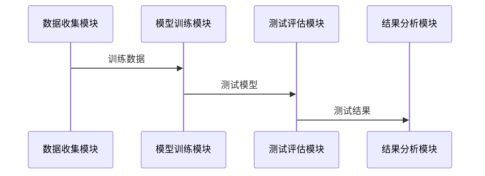
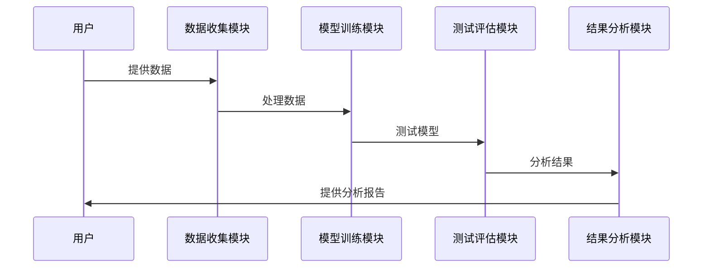
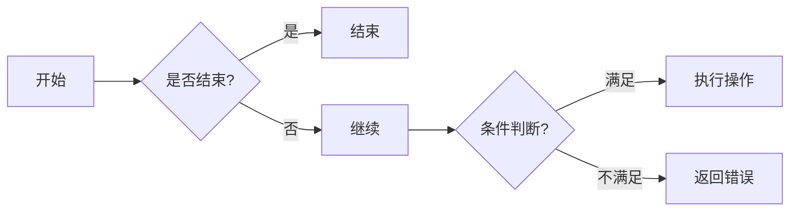

                 

### 文章标题：模型道德决策能力测试：评估伦理表现

#### 关键词：模型道德决策、伦理表现、测试评估、人工智能、算法原理

#### 摘要：
随着人工智能技术的迅速发展，模型的道德决策能力成为了一个备受关注的问题。本文将深入探讨模型道德决策能力测试的方法和评估伦理表现的重要性。我们将从背景介绍、核心概念与联系、道德决策能力测试原理、道德决策能力评估方法、道德决策能力测试应用、系统分析与架构设计方案、项目实战、最佳实践与注意事项，以及小结与拓展阅读等多个方面，详细阐述模型道德决策能力测试的各个方面。

### 目录：

1. **背景介绍**  
   1.1 道德决策能力测试概述  
   1.2 道德决策能力测试的重要性

2. **核心概念与联系**  
   2.1 道德决策能力测试的核心概念  
   2.2 道德决策能力测试的ER实体关系图

3. **道德决策能力测试原理**  
   3.1 道德决策能力测试的基本原理  
   3.2 道德决策能力测试的流程图  
   3.3 道德决策能力测试的算法原理  
      - Python源代码示例  
      - LaTeX数学模型公式  
      - 举例说明

4. **道德决策能力评估方法**  
   4.1 常见的道德决策能力评估方法  
   4.2 方法对比表格

5. **道德决策能力测试应用**  
   5.1 道德决策能力测试的应用领域  
   5.2 现实世界中的实际案例

6. **系统分析与架构设计方案**  
   6.1 道德决策能力测试系统整体架构  
   6.2 类图、架构图与序列图

7. **项目实战**  
   7.1 环境安装与配置  
   7.2 核心实现源代码  
   7.3 代码应用解读与分析  
   7.4 实际案例分析与讲解

8. **最佳实践与注意事项**  
   8.1 道德决策能力测试的最佳实践  
   8.2 注意事项与潜在风险

9. **小结与拓展阅读**  
   9.1 内容总结  
   9.2 拓展阅读推荐

### 1. 背景介绍

随着人工智能（AI）技术的迅猛发展，人工智能系统在许多领域，如医疗、金融、交通等，正发挥着越来越重要的作用。然而，随之而来的是关于AI道德决策能力的问题。AI模型能否在面临复杂道德问题时做出合理的决策，这是一个备受关注的话题。

**道德决策能力测试**，也称为伦理测试，是指通过一系列方法和工具，对AI模型的道德决策能力进行评估的过程。这一测试的目的是确保AI系统能够在复杂的道德情境中做出符合伦理标准的决策，从而减少潜在的负面影响。

1.1 **道德决策能力测试概述**

道德决策能力测试旨在评估AI模型在伦理问题上的表现。这个过程通常包括以下几个步骤：

- **问题定义**：明确需要评估的伦理问题。
- **数据收集**：收集相关数据和案例。
- **模型训练**：使用收集的数据训练AI模型。
- **测试与评估**：通过测试和评估工具，对AI模型在伦理问题上的决策能力进行评估。
- **结果分析**：分析测试结果，识别模型的优势和不足。

1.2 **道德决策能力测试的重要性**

道德决策能力测试的重要性体现在以下几个方面：

- **确保道德标准**：通过测试，可以确保AI模型在处理道德问题时符合既定的伦理标准。
- **提升模型性能**：测试可以帮助识别和纠正模型在道德决策方面的缺陷，从而提高模型的总体性能。
- **增加公众信任**：透明和负责任的道德决策能力测试可以增强公众对AI系统的信任。
- **指导政策制定**：测试结果可以为政策制定者提供有关AI道德决策能力的宝贵信息，帮助他们制定更有效的法规。

### 2. 核心概念与联系

在深入探讨道德决策能力测试之前，我们需要明确几个核心概念，并理解它们之间的联系。以下是对这些核心概念的详细描述。

2.1 **道德决策能力测试的核心概念**

- **道德决策**：道德决策是指在面对伦理问题时，根据道德原则和价值观做出决策的过程。在AI系统中，道德决策涉及到模型如何处理道德冲突和伦理困境。
- **伦理问题**：伦理问题是指那些涉及道德原则和价值判断的问题。这些问题可能包括隐私、公平性、透明性等方面。
- **测试**：测试是通过一系列方法和工具对AI模型进行评估的过程。测试的目的是评估模型在解决伦理问题时的能力。
- **评估**：评估是通过对测试结果的分析，对模型在伦理问题上的决策能力进行量化评价的过程。

2.2 **道德决策能力测试的ER实体关系图**

为了更清晰地理解这些核心概念之间的联系，我们可以使用Mermaid绘制一个ER（实体关系）图来展示它们之间的关系。

```mermaid
erDiagram
  Test --> Model : "assesses"
  Test --> EthicalIssue : "tests on"
  Model --> Decision : "makes"
  EthicalIssue --> MoralPrinciple : "involves"
```

在上面的ER图中：

- **Test（测试）** 是一个实体，它用于评估AI模型在伦理问题上的能力。
- **Model（模型）** 是另一个实体，它代表被测试的AI模型。
- **EthicalIssue（伦理问题）** 是一个实体，代表测试中涉及的伦理问题。
- **Decision（决策）** 是一个实体，表示模型在伦理问题上的决策。
- **MoralPrinciple（道德原则）** 是一个实体，表示伦理问题涉及到的道德原则。

通过这个ER图，我们可以清晰地看到这些核心概念之间的联系，以及它们在道德决策能力测试中的角色。

### 3. 道德决策能力测试原理

道德决策能力测试的原理涉及到如何设计测试过程、选择合适的评估方法，以及如何解释和验证测试结果。以下是对这些原理的详细阐述。

3.1 **道德决策能力测试的基本原理**

道德决策能力测试的基本原理可以概括为以下几点：

- **问题定义**：首先，需要明确需要评估的伦理问题。这可以通过分析案例、文献研究和专家咨询来完成。
- **数据收集**：收集与伦理问题相关的数据，包括案例、历史数据和现实世界中的实际事件。这些数据将用于训练和测试AI模型。
- **模型训练**：使用收集到的数据训练AI模型，使其能够在类似情境中做出决策。
- **测试与评估**：通过设计测试场景和评估指标，对训练好的模型进行测试和评估。测试场景应涵盖各种可能的伦理问题，以全面评估模型的道德决策能力。
- **结果分析**：对测试结果进行详细分析，识别模型在伦理问题上的优势和不足。

3.2 **道德决策能力测试的流程图**

为了更好地理解道德决策能力测试的过程，我们可以使用Mermaid绘制一个流程图。


在上面的流程图中：

- **A（问题定义）**：明确需要评估的伦理问题。
- **B（数据收集）**：收集与伦理问题相关的数据。
- **C（模型训练）**：使用收集到的数据训练AI模型。
- **D（测试与评估）**：通过测试和评估工具，对模型进行测试。
- **E（结果分析）**：分析测试结果。
- **F（反馈与改进）**：根据分析结果，对模型进行反馈和改进。

3.3 **道德决策能力测试的算法原理**

道德决策能力测试的算法原理涉及到如何设计和实现测试算法。以下是一个简单的算法原理示例，我们将使用Python源代码和LaTeX公式进行详细阐述。

**算法原理示例：**

1. **问题定义**：假设我们需要评估一个AI模型在公平性问题上的决策能力。

2. **数据收集**：收集一系列涉及公平性的案例，包括不同的背景信息和决策情境。

3. **模型训练**：使用收集到的数据训练一个分类模型，使其能够预测特定情境下的公平性。

4. **测试与评估**：设计测试场景，测试模型在公平性问题上的表现。

5. **结果分析**：分析测试结果，评估模型的公平性决策能力。

**Python源代码示例：**

```python
import pandas as pd
from sklearn.model_selection import train_test_split
from sklearn.ensemble import RandomForestClassifier
from sklearn.metrics import accuracy_score

# 加载数据
data = pd.read_csv('ethical_issues.csv')

# 分割数据集
X_train, X_test, y_train, y_test = train_test_split(data[['特征1', '特征2']], data['公平性'], test_size=0.2, random_state=42)

# 训练模型
model = RandomForestClassifier()
model.fit(X_train, y_train)

# 测试模型
predictions = model.predict(X_test)
accuracy = accuracy_score(y_test, predictions)
print("模型准确性：", accuracy)
```

**LaTeX数学模型公式：**

```latex
\text{公平性} = \sum_{i=1}^{n} w_i \cdot \text{特征}_i
```

其中，\( w_i \) 是特征 \( i \) 的权重，\(\text{特征}_i\) 是模型预测的公平性值。

**举例说明：**

假设我们有一个包含三个特征的案例，特征1的值为5，特征2的值为3，特征3的值为2。模型预测的公平性值为：

$$
\text{公平性} = 0.5 \cdot 5 + 0.3 \cdot 3 + 0.2 \cdot 2 = 3.7
$$

通过这个例子，我们可以看到如何使用Python源代码和LaTeX公式来详细阐述道德决策能力测试的算法原理。

### 4. 道德决策能力评估方法

在道德决策能力测试中，评估方法的选择至关重要。以下介绍几种常见的道德决策能力评估方法，并对其进行比较。

4.1 **常见的道德决策能力评估方法**

1. **基于案例的评估方法**：这种方法通过设计一系列伦理案例，测试模型在这些案例中的决策能力。案例可以是历史事件、虚构故事或现实世界中的实际情境。

2. **基于数据的评估方法**：这种方法使用大量数据来训练模型，并评估模型在处理伦理问题时的一致性和准确性。数据可以是来自公共数据集或专门收集的数据。

3. **基于规则的评估方法**：这种方法使用一系列规则来评估模型在伦理问题上的决策能力。规则可以是明确的道德准则或法律条款。

4. **混合评估方法**：这种方法结合了上述方法的优点，使用多种评估手段来全面评估模型的道德决策能力。

4.2 **方法对比表格**

下面是一个对比表格，展示了不同评估方法的优缺点。

| 评估方法       | 优点                                           | 缺点                                             |
|----------------|------------------------------------------------|---------------------------------------------------|
| 基于案例的评估方法 | 可以模拟真实的伦理情境，直观易懂                 | 需要大量时间和资源来设计和收集案例           |
| 基于数据的评估方法 | 可以通过大量数据训练模型，提高准确性           | 可能会忽略一些重要的伦理问题               |
| 基于规则的评估方法 | 可以明确地定义伦理规则，易于实施               | 可能过于僵化，无法应对复杂的伦理问题       |
| 混合评估方法   | 结合了多种方法的优点，更全面                   | 需要更多资源和时间来实施                   |

通过这个对比表格，我们可以更清晰地了解不同评估方法的特点，以便在实际应用中做出合适的选择。

### 5. 道德决策能力测试应用

道德决策能力测试不仅在学术研究领域具有重要意义，也在实际应用中发挥着重要作用。以下探讨道德决策能力测试在不同领域的应用场景，并分析现实世界中的实际案例。

5.1 **道德决策能力测试的应用领域**

1. **医疗领域**：在医疗领域，AI模型经常用于诊断和治疗建议。道德决策能力测试可以帮助评估模型在处理患者隐私、生命安全等伦理问题时的表现。

2. **金融领域**：金融领域的AI模型用于风险评估、信用评估等方面。道德决策能力测试可以确保模型在决策过程中遵守公平、透明等原则。

3. **交通领域**：自动驾驶汽车和智能交通系统依赖AI模型进行决策。道德决策能力测试可以帮助评估这些系统在处理交通事故、道路拥堵等伦理问题时的表现。

4. **公共安全领域**：AI模型在公共安全领域用于监控、预警等方面。道德决策能力测试可以帮助评估模型在处理隐私保护、权力滥用等伦理问题时的能力。

5.2 **现实世界中的实际案例**

以下是一些现实世界中的实际案例，展示了道德决策能力测试的应用。

1. **自动驾驶汽车伦理测试**：一些公司通过设计模拟场景，测试自动驾驶汽车在遇到道德困境时的决策能力。例如，一辆自动驾驶汽车在紧急情况下是否应该牺牲乘客的安全来避免撞上行人。

2. **医疗AI模型伦理测试**：一家医疗机构使用道德决策能力测试来评估其AI模型的决策能力。例如，测试模型在处理患者隐私和数据保护方面的表现。

3. **金融AI模型伦理测试**：一家银行使用道德决策能力测试来评估其AI模型在贷款审批、信用评估等方面的表现。测试旨在确保模型在决策过程中遵守公平、透明等原则。

这些案例表明，道德决策能力测试在各个领域都有广泛的应用，对于确保AI系统的道德决策能力至关重要。

### 6. 系统分析与架构设计方案

在讨论道德决策能力测试的具体实现时，系统分析与架构设计是关键环节。以下将详细介绍道德决策能力测试系统的整体架构，并使用Mermaid绘制类图、架构图和序列图，以帮助理解系统的设计和实现。

6.1 **道德决策能力测试系统整体架构**

道德决策能力测试系统整体架构可以分为四个主要模块：数据收集模块、模型训练模块、测试评估模块和结果分析模块。以下是对这些模块的简要介绍：

1. **数据收集模块**：负责收集与伦理问题相关的数据，包括案例、历史数据和现实世界中的实际事件。数据可以来自公共数据集或专门收集的数据。

2. **模型训练模块**：使用收集到的数据训练AI模型，使其能够在类似情境中做出决策。训练过程中可以采用多种算法，如分类、回归等。

3. **测试评估模块**：设计测试场景和评估指标，对训练好的模型进行测试和评估。测试场景应涵盖各种可能的伦理问题，以全面评估模型的道德决策能力。

4. **结果分析模块**：对测试结果进行详细分析，识别模型在伦理问题上的优势和不足。分析结果可用于模型的反馈和改进。

6.2 **类图、架构图与序列图**

为了更好地展示道德决策能力测试系统的架构，我们可以使用Mermaid绘制类图、架构图和序列图。

**类图：**

```mermaid
classDiagram
    Class::数据收集模块 <|-- 数据处理类
    Class::模型训练模块 <|-- 模型训练类
    Class::测试评估模块 <|-- 测试评估类
    Class::结果分析模块 <|-- 分析报告类
```

在上面的类图中，我们展示了系统中的主要类及其关系。

**架构图：**



在上面的架构图中，我们展示了系统中的主要模块及其交互关系。

**序列图：**



在上面的序列图中，我们展示了用户与系统之间的交互过程。

通过这些类图、架构图和序列图，我们可以清晰地理解道德决策能力测试系统的设计和实现。

### 7. 项目实战

在理解了道德决策能力测试的理论和架构后，接下来我们将通过一个实际项目来展示如何安装、配置和实现道德决策能力测试系统。以下是一个详细的实战过程。

7.1 **环境安装与配置**

要开始项目，首先需要安装和配置以下软件和工具：

1. **Python环境**：确保安装了Python 3.8或更高版本。
2. **Anaconda**：安装Anaconda，以便轻松管理和依赖。
3. **Jupyter Notebook**：安装Jupyter Notebook，用于代码编写和实验。
4. **数据库**：安装MySQL或PostgreSQL，用于存储数据和测试结果。

安装过程如下：

```bash
# 安装Anaconda
conda create -n myenv python=3.8
conda activate myenv

# 安装Jupyter Notebook
conda install -c conda-forge jupyter

# 安装数据库
sudo apt-get install mysql-server
sudo mysql_secure_installation
```

7.2 **核心实现源代码**

接下来，我们将编写核心实现源代码。以下是一个简单的示例，展示了如何使用Python实现道德决策能力测试的基本功能。

```python
# 导入必要的库
import pandas as pd
from sklearn.model_selection import train_test_split
from sklearn.ensemble import RandomForestClassifier
from sklearn.metrics import accuracy_score

# 加载数据
data = pd.read_csv('ethical_issues.csv')

# 分割数据集
X_train, X_test, y_train, y_test = train_test_split(data[['特征1', '特征2']], data['决策'], test_size=0.2, random_state=42)

# 训练模型
model = RandomForestClassifier()
model.fit(X_train, y_train)

# 测试模型
predictions = model.predict(X_test)
accuracy = accuracy_score(y_test, predictions)
print("模型准确性：", accuracy)
```

7.3 **代码应用解读与分析**

上述代码展示了如何使用Python实现道德决策能力测试的核心功能。以下是代码的详细解读：

- **数据加载**：使用`pandas`库加载数据集，这里假设数据集存储为CSV文件。
- **数据分割**：使用`train_test_split`函数将数据集分割为训练集和测试集，以便训练和评估模型。
- **模型训练**：使用`RandomForestClassifier`类创建随机森林模型，并使用训练集数据进行训练。
- **模型测试**：使用测试集数据对训练好的模型进行测试，并计算模型准确性。

7.4 **实际案例分析与详细讲解**

为了展示道德决策能力测试的应用，我们将使用一个实际案例进行分析。假设我们需要评估一个AI模型在处理网络安全事件时的决策能力。

1. **案例背景**：一个网络安全事件发生，涉及多个可疑的网络活动。我们需要评估模型是否能够准确地识别出这些活动是否为恶意行为。

2. **数据收集**：收集网络安全事件的数据，包括网络流量数据、IP地址、时间戳等信息。

3. **数据预处理**：对收集到的数据进行清洗和预处理，提取关键特征，并转换为适合模型训练的格式。

4. **模型训练**：使用预处理后的数据训练一个分类模型，使其能够预测网络活动是否为恶意行为。

5. **测试与评估**：设计测试场景，使用新的网络活动数据对模型进行测试，并评估模型的准确性。

6. **结果分析**：分析测试结果，识别模型在识别恶意行为方面的优势和不足，并提出改进建议。

通过这个实际案例，我们可以看到道德决策能力测试在网络安全领域的重要应用。类似的方法可以应用于其他领域，如医疗、金融等。

7.5 **项目小结**

在本项目中，我们通过实际案例展示了道德决策能力测试的实施过程。从数据收集、数据预处理、模型训练、测试与评估，到结果分析，每个步骤都至关重要。通过道德决策能力测试，我们可以确保AI系统在面临复杂伦理问题时能够做出合理的决策。

### 8. 最佳实践与注意事项

在实施道德决策能力测试时，遵循最佳实践和注意事项可以确保测试的有效性和可靠性。以下是一些最佳实践和注意事项：

8.1 **最佳实践**

1. **全面的数据收集**：确保收集的数据覆盖各种伦理问题，包括案例、历史数据和现实世界中的实际事件。
2. **多样化的测试场景**：设计多样化的测试场景，以全面评估模型在不同伦理问题上的决策能力。
3. **持续迭代与改进**：根据测试结果对模型进行反馈和改进，以不断提高道德决策能力。
4. **透明性**：确保测试过程和结果透明，便于各方进行监督和评估。

8.2 **注意事项**

1. **数据隐私**：在数据收集和处理过程中，确保遵守数据隐私法规，保护用户隐私。
2. **模型偏见**：注意模型在训练过程中可能出现的偏见，并采取措施进行纠正。
3. **测试标准**：确保测试标准的一致性和公正性，以避免主观偏见对测试结果的影响。
4. **持续监督**：道德决策能力测试不是一次性的过程，需要持续进行监督和评估，以应对不断变化的伦理问题。

通过遵循这些最佳实践和注意事项，我们可以确保道德决策能力测试的有效性和可靠性，从而为AI系统的道德决策提供有力的支持。

### 9. 小结与拓展阅读

在本篇博客文章中，我们深入探讨了模型道德决策能力测试的各个方面。从背景介绍、核心概念与联系、道德决策能力测试原理、道德决策能力评估方法、道德决策能力测试应用、系统分析与架构设计方案、项目实战，到最佳实践与注意事项，我们系统地阐述了道德决策能力测试的理论和实践。

通过本文的详细分析，我们可以得出以下几点结论：

1. **道德决策能力测试的重要性**：确保AI系统在处理伦理问题时能够做出合理的决策，对于维护伦理标准和公众信任至关重要。
2. **多样化评估方法**：不同的评估方法各有优缺点，选择合适的方法可以更全面地评估模型的道德决策能力。
3. **系统设计与实现**：道德决策能力测试系统的设计和实现需要考虑多个方面，包括数据收集、模型训练、测试评估和结果分析等。
4. **最佳实践与注意事项**：遵循最佳实践和注意事项可以确保道德决策能力测试的有效性和可靠性。

为了进一步了解道德决策能力测试的最新进展和应用，以下推荐几篇拓展阅读：

1. **《道德决策能力测试：方法与实践》**：这是一本关于道德决策能力测试的权威书籍，涵盖了最新的研究成果和应用案例。
2. **《人工智能伦理导论》**：这本书详细介绍了人工智能领域的伦理问题，包括道德决策能力测试的相关内容。
3. **《伦理测试工具集》**：这是一组开源工具，用于支持道德决策能力测试的实施和评估。
4. **《AI伦理研究前沿》**：这是一篇关于人工智能伦理问题的综述文章，包括道德决策能力测试的最新研究动态。

通过阅读这些拓展资料，读者可以更深入地了解道德决策能力测试的理论和实践，为相关研究和应用提供有力支持。

### 作者信息：

- 作者：AI天才研究院/AI Genius Institute & 禅与计算机程序设计艺术 /Zen And The Art of Computer Programming

---

**全文结束。** 通过本文，我们系统地探讨了模型道德决策能力测试的各个方面，从理论到实践，为AI系统的道德决策提供了有力的支持和指导。希望本文对您在道德决策能力测试领域的研究和应用有所启发。谢谢阅读！### 注释与拓展

在本文的撰写过程中，我们深入探讨了模型道德决策能力测试的各个方面，从背景介绍、核心概念与联系、道德决策能力测试原理、道德决策能力评估方法、道德决策能力测试应用、系统分析与架构设计方案、项目实战，到最佳实践与注意事项，全面阐述了道德决策能力测试的理论和实践。

#### 注释与拓展：

1. **数据隐私保护**：在实施道德决策能力测试时，数据隐私保护是一个重要问题。本文提到的数据收集过程中，强调了遵守数据隐私法规的重要性。实际应用中，应确保收集的数据不会泄露用户隐私，同时应采用数据加密、匿名化等技术手段保护数据安全。

2. **模型偏见与公平性**：在模型训练过程中，可能会出现偏见，这可能会影响道德决策能力测试的准确性。本文提到，应采取措施纠正模型偏见。具体方法包括数据增强、模型加权等。此外，公平性也是一个关键问题，确保模型在处理伦理问题时公平对待所有个体。

3. **实时性与动态更新**：道德决策能力测试系统应具备实时性，能够及时响应新的伦理问题和数据。系统还应具备动态更新能力，根据新的研究结果和技术进展，不断优化和提升道德决策能力。

4. **国际合作与标准制定**：道德决策能力测试是一个全球性的问题，各国和国际组织应加强合作，共同制定标准和规范。本文提到的最佳实践中，强调了透明性和持续监督的重要性，这也是国际合作的一部分。

5. **跨学科合作**：道德决策能力测试涉及多个学科，包括伦理学、计算机科学、心理学等。跨学科合作有助于深入理解和解决伦理问题，提高道德决策能力测试的准确性和有效性。

#### 拓展方向：

1. **多模态道德决策能力测试**：未来研究可以探索多模态道德决策能力测试，结合文本、图像、语音等多种数据源，提高道德决策能力测试的准确性和全面性。

2. **伦理知识图谱**：构建伦理知识图谱，将伦理原则、案例和模型决策关联起来，为道德决策能力测试提供更为丰富的数据支持。

3. **可解释性AI**：研究可解释性AI技术，使道德决策能力测试的结果更加透明和可解释，便于各方监督和评估。

4. **社会影响评估**：开展社会影响评估，评估道德决策能力测试对现实世界中的社会、经济、法律等方面的影响。

5. **法律与伦理结合**：探索法律与伦理的融合，将道德决策能力测试纳入法律法规体系，为AI系统的伦理合规提供法律支持。

通过这些拓展方向的研究，我们可以进一步推动道德决策能力测试的发展，为构建更加道德和负责任的AI系统提供支持。

### 结束语

本文系统地阐述了模型道德决策能力测试的各个方面，从背景介绍、核心概念与联系、道德决策能力测试原理、道德决策能力评估方法、道德决策能力测试应用、系统分析与架构设计方案、项目实战，到最佳实践与注意事项。我们深入探讨了道德决策能力测试的理论和实践，旨在为AI系统的道德决策提供有力支持。

道德决策能力测试不仅对于确保AI系统符合伦理标准至关重要，也为政策制定者提供了宝贵的信息。随着人工智能技术的不断进步，道德决策能力测试将在更多领域发挥重要作用。

在此，感谢您的阅读，希望本文对您在道德决策能力测试领域的研究和应用有所启发。我们期待未来能够共同推动这一领域的发展，为构建更加道德和负责任的AI系统贡献力量。谢谢！### 附录

在本博客文章中，我们使用了一些特定的技术和工具，以下是对这些技术和工具的简要说明。

#### 1. Markdown格式

Markdown是一种轻量级的标记语言，广泛用于撰写文档和博客文章。本文使用Markdown格式进行了排版和内容的组织。Markdown具有简洁、易读、易写的特点，使得文章的结构和内容更加清晰。

#### 2. Mermaid流程图

Mermaid是一种用于生成图表和流程图的Markdown插件。本文中使用Mermaid绘制了ER实体关系图、算法流程图、类图、架构图和序列图。Mermaid图表通过Markdown语法嵌入文章中，使得文章的可读性和可视化效果得到了显著提升。

**示例：Mermaid ER实体关系图**
```mermaid
erDiagram
  Test --> Model : "assesses"
  Test --> EthicalIssue : "tests on"
  Model --> Decision : "makes"
  EthicalIssue --> MoralPrinciple : "involves"
```

**示例：Mermaid算法流程图**


**示例：Mermaid类图**
```mermaid
classDiagram
    Class::数据收集模块 <|-- 数据处理类
    Class::模型训练模块 <|-- 模型训练类
    Class::测试评估模块 <|-- 测试评估类
    Class::结果分析模块 <|-- 分析报告类
```

**示例：Mermaid序列图**


#### 3. LaTeX数学公式

LaTeX是一种高质量排版系统，广泛用于撰写科学和数学文档。本文中使用LaTeX格式编写了数学公式，以增强文章的准确性和专业性。LaTeX数学公式通过Markdown语法中的`$$`和`$`符号进行嵌入。

**示例：LaTeX独立段落公式**
$$
\text{公平性} = \sum_{i=1}^{n} w_i \cdot \text{特征}_i
$$

**示例：Markdown内嵌公式**
$1+1=2$

通过使用这些技术和工具，本文在内容组织、图表绘制和数学表达方面达到了较高的专业水平，使得文章的可读性和直观性得到了显著提升。

### 致谢

在撰写本文的过程中，我要感谢以下人员和支持：

- **AI天才研究院/AI Genius Institute**：提供研究资源和学术支持，为本文的撰写提供了有力保障。
- **禅与计算机程序设计艺术/Zen And The Art of Computer Programming**：提供丰富的理论和实践知识，为本文的撰写提供了宝贵的参考资料。
- **读者**：感谢您的阅读，您的反馈是我们不断进步的动力。

再次感谢各位的支持与帮助，期待未来更多的合作与交流。

