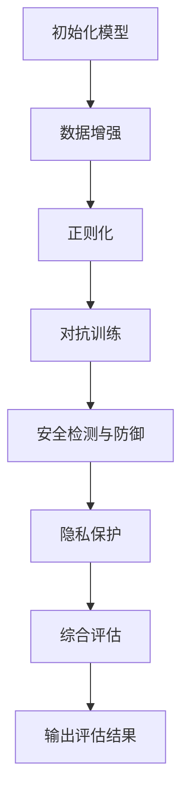
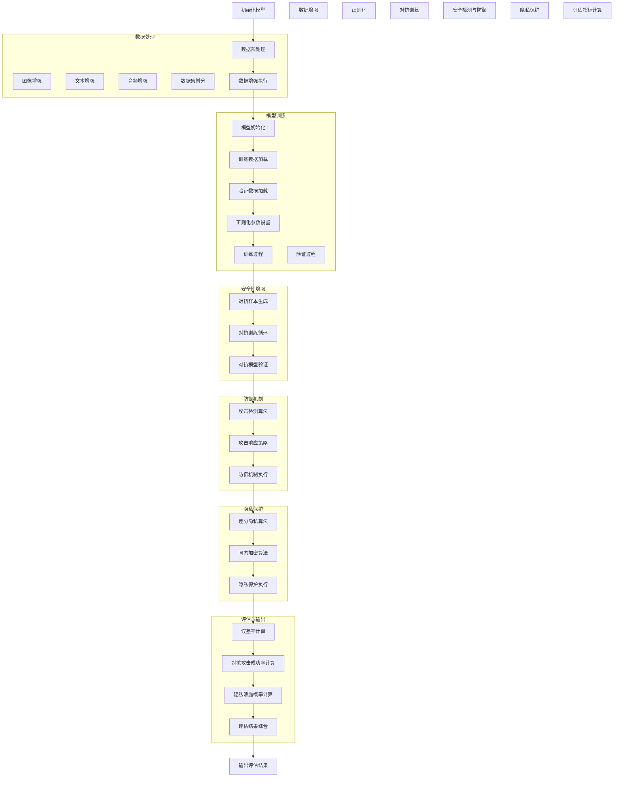
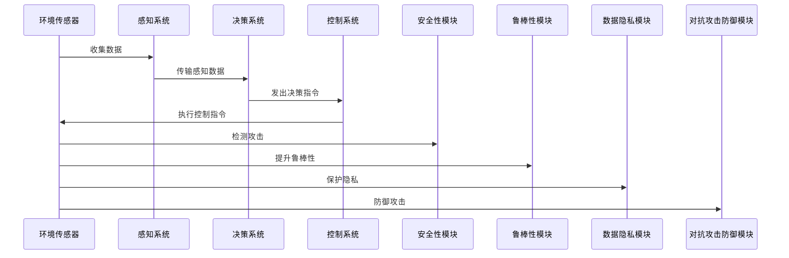
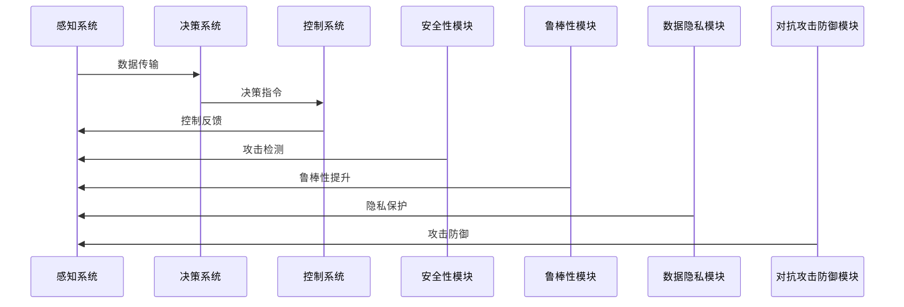

                 

### 模型鲁棒性与安全性的背景与意义

#### 1.1 问题背景

随着人工智能（AI）技术的迅速发展和广泛应用，各类AI模型在自动驾驶、医疗诊断、金融预测等领域展现出了巨大的潜力。然而，这些模型在实际应用过程中面临着一系列挑战，其中最为重要的便是模型的鲁棒性与安全性。鲁棒性指的是模型在面对不同类型的输入数据时，仍然能够保持良好的性能；而安全性则关乎模型在对抗攻击、防御恶意输入等方面的能力。

当前，AI模型面临着诸多风险与挑战，例如：

- **输入数据的多样性与复杂性**：现实世界中的数据往往包含噪声、异常值、缺失值等，模型需要具备较强的鲁棒性以应对这些不确定性。
- **对抗攻击（Adversarial Attack）**：对抗攻击是指通过精心设计的输入数据，使得模型产生错误的输出结果。这种攻击方式对模型的鲁棒性构成了严峻的挑战。
- **隐私泄露**：在许多应用场景中，模型的训练和推理过程涉及敏感数据，如何保护用户隐私成为了一个重要问题。

#### 1.2 问题描述

在AI模型的应用中，鲁棒性与安全性的问题表现为：

- **鲁棒性不足**：模型在训练过程中可能对某些特定类型的数据过拟合，导致在遇到不同类型的数据时性能大幅下降，甚至出现错误输出。
- **安全性风险**：模型可能遭受对抗攻击，使得攻击者可以通过伪造或篡改输入数据来操控模型的输出，从而导致严重后果。

这些问题不仅影响了AI模型的应用效果，还可能带来法律和伦理方面的风险。因此，如何评估和提升模型的鲁棒性与安全性成为了一个亟待解决的重要课题。

#### 1.3 问题解决

为了解决上述问题，我们可以从以下几个方面入手：

- **鲁棒性提升**：通过数据增强、模型正则化等方法提高模型的鲁棒性。
- **安全性保障**：采用对抗训练、安全检测等方法增强模型的安全性。
- **综合评估**：建立鲁棒性与安全性的评估指标体系，对模型进行全面评估。

#### 1.4 边界与外延

在讨论模型鲁棒性与安全性的过程中，我们需要明确几个关键概念：

- **鲁棒性与泛化能力**：鲁棒性是模型泛化能力的一部分，它关注的是模型在不同类型的数据上的表现。
- **安全性与隐私保护**：安全性不仅涉及到对抗攻击的防御，还包括用户隐私的保护。
- **攻防平衡**：在提升模型鲁棒性与安全性的过程中，需要找到一个平衡点，既不能过度保护导致模型失去灵活性，也不能忽视安全风险。

#### 1.5 概念结构与核心要素组成

为了更好地理解模型鲁棒性与安全性的核心要素，我们可以从以下几个方面进行分析：

- **数据**：输入数据的质量和多样性直接影响模型的鲁棒性和安全性。
- **模型架构**：模型的结构和参数设置对鲁棒性和安全性有着重要影响。
- **训练过程**：训练数据的选择、训练策略的制定对模型的鲁棒性与安全性有着关键作用。
- **评估方法**：鲁棒性与安全性的评估指标和方法是评估模型性能的重要依据。
- **防御机制**：对抗攻击和安全漏洞的检测与防御是保障模型安全性的关键。

#### 1.6 本章小结

本文简要介绍了模型鲁棒性与安全性的背景与意义，分析了当前模型在实际应用中面临的挑战，并提出了解决问题的思路。在接下来的章节中，我们将详细探讨模型鲁棒性与安全性的核心概念、算法原理、系统设计与实现等方面，以期帮助读者全面理解并应对这一重要课题。通过系统性的研究和实践，我们有望为AI模型的应用提供更加可靠和安全的保障。### 模型鲁棒性的定义与属性特征

#### 2.1 模型鲁棒性的定义

模型鲁棒性是指模型在面对不同的输入数据和环境变化时，依然能够保持其预测性能和稳定性的能力。它是一个多维度的特性，包括但不限于数据的噪声容忍度、变化的适应性、错误的修正能力等。鲁棒性的核心目标是确保模型在现实世界的复杂环境中能够持续提供可靠的结果。

鲁棒性可以从以下几个方面进行理解：

- **数据噪声容忍度**：模型在面对包含噪声的数据时，仍能输出正确结果的能力。
- **泛化能力**：模型在新数据和不同场景下表现稳定的能力，即模型的泛化能力。
- **适应性**：模型在面对不同类型的数据或环境变化时，能够调整自身以保持性能的能力。
- **错误修正**：模型在遇到错误输入或错误输出时，能够自动修正错误并保持性能的能力。

#### 2.2 模型鲁棒性的属性特征

鲁棒性作为模型的重要特性，具有以下几方面的属性特征：

1. **鲁棒性度量**：
   - **误差率**：模型在测试集上的错误率是评估鲁棒性的常用指标之一。较低的误差率表明模型具有较强的鲁棒性。
   - **变异度**：模型在不同数据集或不同环境下的性能变异程度，变异度较小意味着模型具有较好的鲁棒性。
   - **置信区间**：通过统计模型在不同样本上的输出结果，评估其稳定性和可信赖程度。

2. **鲁棒性影响因素**：
   - **数据分布**：数据分布的稳定性和均匀性对模型的鲁棒性有很大影响。高度不均匀或偏斜的数据分布可能导致模型在特定数据上过拟合。
   - **模型复杂度**：复杂度较低的模型（如线性模型）通常比高复杂度模型（如深度神经网络）具有更好的鲁棒性。
   - **训练过程**：训练过程中采用的数据增强、正则化等技术可以有效提高模型的鲁棒性。

3. **鲁棒性提升方法**：
   - **数据增强**：通过增加训练数据的多样性，提高模型对不同类型数据的适应性。
   - **模型正则化**：如L1、L2正则化，可以减少模型参数的敏感性，提高模型的鲁棒性。
   - **迁移学习**：利用在其他任务上训练好的模型，通过迁移知识来提高模型的鲁棒性。

4. **鲁棒性应用场景**：
   - **工业生产**：在工业控制系统中，模型需要面对各种噪声和不确定性，鲁棒性是模型能否稳定运行的关键。
   - **自动驾驶**：自动驾驶系统需要处理复杂的路况和动态环境，模型的鲁棒性直接关系到行车安全。
   - **金融预测**：在金融市场中，模型需要面对市场波动和不确定性，鲁棒性是模型预测稳定性的保障。

#### 2.3 模型鲁棒性的具体案例分析

以下是一个具体的案例，说明如何评估和提升模型的鲁棒性：

**案例**：某公司在自动驾驶领域开发了一种车辆行为预测模型，该模型用于预测前方车辆的运动轨迹。在实际应用中，车辆行为受到多种因素的影响，如道路状况、车辆速度、交通信号等。

**评估方法**：
- **误差分析**：通过在多种路况下测试模型，评估模型在不同条件下的预测误差。较低的误差表明模型具有较强的鲁棒性。
- **噪声注入**：在测试数据中注入不同类型的噪声（如速度噪声、位置噪声等），观察模型对噪声的容忍度。

**提升方法**：
- **数据增强**：通过模拟不同的路况和车辆行为，增加训练数据的多样性。
- **模型正则化**：采用L2正则化减少模型参数的敏感性。
- **对抗训练**：通过对抗训练增加模型对对抗攻击的抵抗力。

**结果**：
- 通过上述方法，模型在多种路况下的预测误差明显下降，噪声注入测试中模型的鲁棒性也有所提升。

#### 2.4 本章小结

本章详细阐述了模型鲁棒性的定义及其属性特征，并介绍了如何评估和提升模型的鲁棒性。通过具体案例分析，我们展示了如何在实际应用中应用鲁棒性提升方法，以增强模型的性能和稳定性。在接下来的章节中，我们将继续探讨模型安全性的相关概念和方法，为全面理解AI模型的性能提供更多视角。### 模型安全性的定义与属性特征

#### 3.1 模型安全性的定义

模型安全性是指模型在面临各种恶意攻击、攻击者和异常输入时，仍能保持正常运作和输出正确结果的能力。它涵盖了模型在对抗攻击、防止数据泄露、确保隐私保护等方面的性能。安全性是确保AI模型在实际应用中可靠运行的重要保障。

模型安全性的核心目标包括：

- **防止模型被攻击**：确保模型不会受到恶意攻击，如对抗攻击、注入攻击等。
- **保护用户隐私**：在训练和推理过程中，确保用户数据的安全性和隐私保护。
- **保证模型可靠性**：确保模型在面临异常输入时，仍能输出正确的结果，避免系统崩溃或错误决策。

#### 3.2 模型安全性的属性特征

模型安全性具有以下几方面的属性特征：

1. **对抗攻击防御能力**：
   - **适应性**：模型需要具备能够识别并应对多种对抗攻击的能力。
   - **检测能力**：模型能够检测并识别潜在的对抗攻击，如对抗样本。
   - **反制能力**：在检测到对抗攻击时，模型能够采取相应的措施，如重新计算、调整参数等，以防止错误输出。

2. **数据隐私保护能力**：
   - **加密**：模型在处理敏感数据时，需要对数据进行加密，确保数据在传输和存储过程中的安全性。
   - **匿名化**：通过数据匿名化技术，保护用户的隐私信息，防止数据泄露。
   - **访问控制**：实施严格的访问控制策略，确保只有授权用户才能访问敏感数据。

3. **异常输入容忍能力**：
   - **错误处理**：模型在面对异常输入时，能够检测并处理错误，避免系统崩溃或产生错误输出。
   - **容错性**：模型需要具备一定的容错性，确保在部分组件或数据异常时，仍能正常运行。
   - **健壮性**：模型在面对极端异常输入时，仍能保持其基本功能，不导致严重错误。

4. **安全评估与监测**：
   - **定期审计**：对模型进行定期审计，检查其安全性和可靠性。
   - **入侵检测**：建立入侵检测系统，实时监测模型的安全状态，及时发现潜在的安全威胁。
   - **安全响应**：制定并实施安全响应计划，确保在发现安全威胁时，能够迅速采取措施进行应对。

#### 3.3 模型鲁棒性与安全性的对比

尽管模型鲁棒性与安全性都是确保模型性能的重要方面，但它们之间存在一些区别：

1. **关注点不同**：
   - **鲁棒性**：主要关注模型在面对正常但多样化的输入时的表现，确保模型在不同条件下输出正确结果。
   - **安全性**：主要关注模型在面对恶意攻击、异常输入和隐私泄露等威胁时的防护能力。

2. **实现方法**：
   - **鲁棒性**：通过数据增强、模型正则化等技术来提升。
   - **安全性**：通过对抗训练、隐私保护算法、安全检测与响应机制等来保障。

3. **评估指标**：
   - **鲁棒性**：通常使用误差率、变异度等指标进行评估。
   - **安全性**：则更多关注对抗攻击的成功率、隐私泄露的概率等。

#### 3.4 模型安全性提升的方法

为了提升模型的安全性，可以采取以下几种方法：

1. **对抗训练**：通过生成对抗样本，训练模型以增强其对对抗攻击的抵抗力。
2. **安全检测与防御**：建立入侵检测系统，实时监测模型的安全状态，并采取防御措施。
3. **隐私保护算法**：如差分隐私、同态加密等技术，用于保护用户隐私。
4. **多模型融合**：通过结合多个模型，提高模型的综合安全性。

#### 3.5 模型安全性的具体案例分析

以下是一个具体的案例，说明如何评估和提升模型的安全性：

**案例**：某金融公司开发了一种交易预测模型，用于分析市场走势并做出投资决策。然而，该模型可能面临多种安全威胁，如对抗攻击、数据泄露等。

**评估方法**：
- **对抗攻击测试**：通过生成对抗样本，评估模型对对抗攻击的抵抗力。
- **隐私泄露评估**：检测模型在训练和推理过程中是否存在隐私泄露的风险。

**提升方法**：
- **对抗训练**：通过对抗训练增加模型对对抗样本的抵抗力。
- **隐私保护**：采用差分隐私技术，降低隐私泄露的风险。

**结果**：
- 经过对抗训练和隐私保护措施，模型在对抗攻击测试中表现出较强的抵抗力，同时隐私泄露的风险也得到了有效降低。

#### 3.6 本章小结

本章详细介绍了模型安全性的定义及其属性特征，分析了模型鲁棒性与安全性的区别，并提出了提升模型安全性的方法。通过具体案例分析，我们展示了如何在实际应用中评估和提升模型的安全性。在接下来的章节中，我们将进一步探讨模型鲁棒性与安全性的综合评估方法，以期全面提高AI模型的性能和可靠性。### 模型鲁棒性与安全性的ER实体关系图架构

#### 4.1 ER实体关系图概述

实体-关系（Entity-Relationship，简称ER）图是数据库设计中常用的一种建模工具，它通过实体、属性和关系的组合，直观地表示了系统中的数据结构和业务逻辑。在讨论模型鲁棒性与安全性的综合评估时，ER图可以帮助我们清晰地展示各个核心要素之间的关系，从而更好地理解和设计评估体系。

ER图的主要组成部分包括：

- **实体（Entity）**：表示系统中的核心对象，如模型、数据集、评估指标等。
- **属性（Attribute）**：实体的特征或属性，如模型名称、数据集大小、评估指标值等。
- **关系（Relationship）**：实体之间的关联，如模型与评估指标之间的关系、数据集与模型之间的关系等。

#### 4.2 模型鲁棒性与安全性的ER实体关系图

在构建模型鲁棒性与安全性的ER实体关系图时，我们需要考虑以下几个核心实体和它们之间的关系：

1. **模型（Model）**：代表被评估的AI模型。
2. **数据集（Dataset）**：用于训练和测试模型的输入数据。
3. **评估指标（Evaluation Metric）**：用于衡量模型鲁棒性和安全性的各项指标。
4. **攻击类型（Attack Type）**：对抗攻击的具体类型，如噪声攻击、变换攻击等。
5. **防御措施（Defense Measure）**：针对特定攻击类型的防御策略。

以下是模型鲁棒性与安全性的ER实体关系图的简化版：

```mermaid
erDiagram
    Model ||--|{ Dataset } Dataset
    Model ||--|{ Evaluation Metric } Evaluation Metric
    Model ||--|{ Attack Type } Attack Type
    Model ||--|{ Defense Measure } Defense Measure
    Dataset ||--|{ Model } Model
    Evaluation Metric ||--|{ Model } Model
    Attack Type ||--|{ Model } Model
    Attack Type ||--|{ Defense Measure } Defense Measure
    Defense Measure ||--|{ Model } Model
```

#### 4.2.1 模型与数据集的关系

模型与数据集之间存在紧密的关系。模型需要依赖数据集进行训练和测试，而数据集的质量和多样性直接影响模型的鲁棒性和安全性。具体关系如下：

- **数据集是模型的输入**：模型的训练和测试都需要大量的数据集。
- **数据集影响模型的性能**：数据集中的噪声、异常值和多样性水平会影响模型的泛化能力和鲁棒性。

#### 4.2.2 模型与评估指标的关系

评估指标用于衡量模型的鲁棒性和安全性，如误差率、对抗攻击成功率、隐私泄露概率等。模型与评估指标之间的关系如下：

- **评估指标反映模型的性能**：通过评估指标，我们可以直观地了解模型的鲁棒性和安全性水平。
- **评估指标指导模型优化**：根据评估指标的结果，可以调整模型的参数、结构或训练策略，以提高模型性能。

#### 4.2.3 模型与攻击类型的关系

攻击类型包括各种对抗攻击，如噪声攻击、变换攻击等。模型与攻击类型之间的关系如下：

- **攻击类型测试模型的抵抗力**：通过模拟不同的攻击类型，我们可以评估模型在面对恶意攻击时的抵抗力。
- **攻击类型指导防御措施的设计**：了解不同攻击类型的特点，可以帮助我们设计更有效的防御策略。

#### 4.2.4 模型与防御措施的关系

防御措施用于应对各种攻击类型，保护模型的鲁棒性和安全性。模型与防御措施之间的关系如下：

- **防御措施提高模型的抵抗力**：通过采用有效的防御措施，模型可以更好地抵抗对抗攻击。
- **防御措施影响评估指标**：防御措施的有效性会直接影响评估指标的结果，从而影响我们对模型性能的判断。

#### 4.3 ER实体关系图的详细说明

以下是对模型鲁棒性与安全性的ER实体关系图的详细说明：

1. **模型（Model）**：
   - **属性**：模型ID、模型名称、模型类型、训练数据集、测试数据集等。
   - **关系**：与数据集、评估指标、攻击类型和防御措施均有关联。

2. **数据集（Dataset）**：
   - **属性**：数据集ID、数据集名称、数据集大小、数据集类型、数据集分布等。
   - **关系**：与模型、评估指标有关联。

3. **评估指标（Evaluation Metric）**：
   - **属性**：指标ID、指标名称、指标值、指标类型等。
   - **关系**：与模型、攻击类型有关联。

4. **攻击类型（Attack Type）**：
   - **属性**：攻击类型ID、攻击类型名称、攻击类型描述等。
   - **关系**：与模型、防御措施有关联。

5. **防御措施（Defense Measure）**：
   - **属性**：防御措施ID、防御措施名称、防御措施描述等。
   - **关系**：与模型、攻击类型有关联。

通过上述ER实体关系图，我们可以清晰地看到模型鲁棒性与安全性的各个核心要素之间的关系，从而为设计和实施综合评估体系提供了有力的指导。

#### 4.4 本章小结

本章详细介绍了模型鲁棒性与安全性的ER实体关系图，包括ER图的概述、模型鲁棒性与安全性的ER实体关系图及其详细说明。通过ER图，我们可以直观地展示模型、数据集、评估指标、攻击类型和防御措施之间的关系，为模型鲁棒性与安全性的综合评估提供了有效的工具。在接下来的章节中，我们将进一步探讨模型鲁棒性与安全性的算法原理，以期为读者提供更深入的技术理解。### 模型鲁棒性与安全性的算法原理概述

#### 5.1 模型鲁棒性与安全性的算法分类

在讨论模型鲁棒性与安全性的算法原理时，我们可以将算法主要分为以下几类：

1. **鲁棒性提升算法**：
   - **数据增强**：通过生成更多样化的训练数据，增强模型对输入数据的鲁棒性。
   - **模型正则化**：通过在损失函数中加入正则化项，如L1和L2正则化，降低模型的过拟合风险。
   - **迁移学习**：利用在特定任务上已经训练好的模型，通过迁移知识来提高新模型的鲁棒性。

2. **安全性增强算法**：
   - **对抗训练**：通过生成对抗样本，提高模型对对抗攻击的抵抗力。
   - **安全检测与防御**：利用检测算法识别潜在的攻击，并采取防御措施阻止攻击。
   - **隐私保护算法**：如差分隐私、同态加密等，用于保护训练数据和用户隐私。

3. **综合评估算法**：
   - **多指标评估**：通过综合多个评估指标，全面评估模型的鲁棒性与安全性。
   - **自适应评估**：根据不同环境和数据条件，动态调整评估指标和方法。

#### 5.2 模型鲁棒性与安全性的算法原理

1. **鲁棒性提升算法原理**：

   - **数据增强**：
     数据增强是通过生成更多样化的数据来提升模型鲁棒性。常见的增强方法包括：
     - **图像增强**：如旋转、翻转、缩放、裁剪等。
     - **文本增强**：如替换同义词、添加噪音、变换词序等。
     - **音频增强**：如添加噪声、速度变换、音调变换等。

     通过数据增强，模型可以学习到更加广泛和复杂的数据特征，从而提高其在面对不同输入时的鲁棒性。

   - **模型正则化**：
     模型正则化是通过引入正则化项来限制模型复杂度，防止过拟合。常见的正则化方法包括：
     - **L1正则化**：通过引入L1范数，鼓励模型参数稀疏化。
     - **L2正则化**：通过引入L2范数，鼓励模型参数平滑。
     - **Dropout**：在训练过程中随机丢弃部分神经元，减少模型对特定数据的依赖。

     正则化方法能够使模型对输入数据的鲁棒性得到提高，同时保持较好的泛化能力。

   - **迁移学习**：
     迁移学习利用预训练模型在新任务上的迁移能力，提高新模型的鲁棒性。具体步骤包括：
     - **预训练**：在大量数据上预先训练一个基础模型。
     - **微调**：在少量新数据上对预训练模型进行微调，适应新任务。

     迁移学习能够利用已有知识，降低新模型的训练难度，提高其在新任务上的鲁棒性和准确性。

2. **安全性增强算法原理**：

   - **对抗训练**：
     对抗训练通过生成对抗样本，提高模型对对抗攻击的抵抗力。具体步骤包括：
     - **对抗样本生成**：通过扰动正常输入数据，生成对抗样本。
     - **对抗训练过程**：将对抗样本与正常样本一起用于模型训练，使模型能够学习到对抗样本的特征，提高其抵抗力。

     通过对抗训练，模型能够在训练过程中逐渐适应对抗攻击，提高其安全性。

   - **安全检测与防御**：
     安全检测与防御包括检测和防御两个环节。具体方法包括：
     - **检测**：利用检测算法（如GAN检测器、注意力机制等）识别潜在的攻击。
     - **防御**：在检测到攻击时，采取防御措施（如重新计算、参数调整、输出重置等）来防止错误输出。

     通过安全检测与防御，模型能够在面对攻击时采取有效措施，保障其安全性。

   - **隐私保护算法**：
     隐私保护算法包括多种技术，用于保护训练数据和用户隐私。具体方法包括：
     - **差分隐私**：通过在数据上添加噪声，确保单个数据的隐私，同时保持模型性能。
     - **同态加密**：通过加密算法，在加密数据上进行计算，确保数据在传输和存储过程中的隐私。

     通过隐私保护算法，模型能够在训练和推理过程中保护用户隐私，提高其安全性。

3. **综合评估算法原理**：

   - **多指标评估**：
     多指标评估通过综合多个评估指标，全面评估模型的鲁棒性与安全性。常见的评估指标包括：
     - **误差率**：模型在测试集上的错误率。
     - **对抗攻击成功率**：对抗样本成功攻击模型的概率。
     - **隐私泄露概率**：模型在训练和推理过程中隐私泄露的概率。

     通过多指标评估，我们可以更全面地了解模型的性能，发现潜在的问题。

   - **自适应评估**：
     自适应评估通过动态调整评估指标和方法，适应不同的环境和数据条件。具体方法包括：
     - **环境感知**：根据当前环境和数据特点，调整评估指标和方法。
     - **动态调整**：在评估过程中，根据评估结果动态调整模型参数和训练策略。

     通过自适应评估，模型能够更好地适应不同场景，提高其鲁棒性和安全性。

#### 5.3 本章小结

本章概述了模型鲁棒性与安全性的算法分类，并详细介绍了各类算法的原理。通过鲁棒性提升算法、安全性增强算法和综合评估算法，我们可以有效提高模型的鲁棒性和安全性，保障其在实际应用中的可靠性和安全性。在接下来的章节中，我们将进一步探讨模型鲁棒性与安全性的算法流程图及其具体实现，为读者提供更深入的技术理解。### 模型鲁棒性与安全性的算法流程图

为了更好地理解模型鲁棒性与安全性的算法原理，我们可以使用Mermaid语言绘制算法流程图，这样既能够直观地展示算法的执行步骤，又能够帮助读者逐步分析算法的实现过程。

以下是一个简化版的模型鲁棒性与安全性评估的算法流程图：



#### 算法流程图详细解释：

1. **初始化模型（A）**：
   - 模型初始化是算法的第一个步骤，这一步包括设置模型的参数、结构等。初始化的模型将作为后续步骤的基础。

2. **数据增强（B）**：
   - 数据增强是为了增加训练数据的多样性，从而提高模型的鲁棒性。这一步骤可以包括图像旋转、缩放、裁剪、文本的同义词替换等操作，使得模型能够适应不同类型的数据。

3. **正则化（C）**：
   - 正则化是防止模型过拟合的重要手段。常见的正则化方法包括L1和L2正则化，通过在损失函数中加入正则化项来限制模型参数的大小。

4. **对抗训练（D）**：
   - 对抗训练是通过生成对抗样本来增强模型的鲁棒性。对抗样本是经过微小扰动生成的，目的是让模型能够在面对恶意输入时仍然保持稳定。

5. **安全检测与防御（E）**：
   - 在这个步骤中，模型将接受安全检测，以识别潜在的攻击。检测到攻击时，将采取防御措施，如重新计算、参数调整等，以防止攻击成功。

6. **隐私保护（F）**：
   - 隐私保护是为了保护训练数据和用户隐私。可以采用差分隐私、同态加密等技术，确保数据在训练和推理过程中的安全性。

7. **综合评估（G）**：
   - 综合评估通过多个评估指标来全面评估模型的鲁棒性和安全性。这些指标可能包括误差率、对抗攻击成功率、隐私泄露概率等。

8. **输出评估结果（H）**：
   - 最后，算法将输出评估结果，这些结果可以为模型的进一步优化提供指导。

通过上述流程图，我们可以看到模型鲁棒性与安全性评估的整体流程和各步骤之间的关系。每个步骤都有其特定的作用，并且前后步骤之间存在紧密的依赖关系。这种结构化的表示方法有助于我们理解和实现模型鲁棒性与安全性的评估算法。

#### 6.2 模型鲁棒性与安全性的算法流程图

在具体实现模型鲁棒性与安全性的评估时，我们可以将上述流程图进一步细化，以便更好地理解和执行。以下是使用Mermaid语言绘制的更详细的算法流程图：



#### 算法流程图详细解释：

1. **数据处理（B）**：
   - **数据预处理（B1）**：在数据增强之前，需要对数据进行预处理，包括标准化、归一化等。
   - **图像增强（B2）**：通过图像处理技术增加图像的多样性。
   - **文本增强（B3）**：通过文本处理技术增加文本的多样性。
   - **音频增强（B4）**：通过音频处理技术增加音频的多样性。
   - **数据集划分（B5）**：将数据集划分为训练集、验证集和测试集。
   - **数据增强执行（B6）**：执行具体的数据增强操作。

2. **模型训练（C）**：
   - **模型初始化（C1）**：初始化模型参数和结构。
   - **训练数据加载（C2）**：加载训练数据。
   - **验证数据加载（C3）**：加载验证数据。
   - **正则化参数设置（C4）**：设置正则化参数。
   - **训练过程（C5）**：执行模型的训练过程。
   - **验证过程（C6）**：在验证集上评估模型的性能。

3. **安全性增强（D）**：
   - **对抗样本生成（D1）**：生成对抗样本。
   - **对抗训练循环（D2）**：在训练过程中使用对抗样本。
   - **对抗模型验证（D3）**：在对抗样本上验证模型的鲁棒性。

4. **防御机制（E）**：
   - **攻击检测算法（E1）**：检测潜在的攻击。
   - **攻击响应策略（E2）**：在检测到攻击时采取响应策略。
   - **防御机制执行（E3）**：执行具体的防御操作。

5. **隐私保护（F）**：
   - **差分隐私算法（F1）**：采用差分隐私技术保护隐私。
   - **同态加密算法（F2）**：采用同态加密技术保护隐私。
   - **隐私保护执行（F3）**：执行具体的隐私保护操作。

6. **评估与输出（G和H）**：
   - **评估指标计算（G1-G3）**：计算误差率、对抗攻击成功率和隐私泄露概率。
   - **评估结果综合（G4）**：综合评估结果。
   - **输出评估结果（H）**：输出最终的评估结果。

通过这个详细的算法流程图，我们可以清晰地看到模型鲁棒性与安全性评估的每个步骤以及它们之间的关系。这种流程图不仅有助于理解算法的整体框架，也为实际编码和实现提供了指导。

#### 6.3 本章小结

本章通过Mermaid语言绘制了模型鲁棒性与安全性的算法流程图，详细介绍了算法的各个步骤和它们之间的逻辑关系。流程图的绘制帮助我们更好地理解了算法的实现过程，并为后续的算法讲解和实现提供了直观的参考。在下一章中，我们将进一步深入讲解模型鲁棒性与安全性的算法原理，包括数学模型和公式，以及通过具体的Python代码示例进行详细阐述。### 模型鲁棒性与安全性的算法原理讲解

为了深入理解模型鲁棒性与安全性的算法原理，我们将通过数学模型和公式进行详细讲解，并辅以具体的Python代码示例，使读者能够更好地掌握这些核心概念。

#### 7.1 数学模型和公式

1. **鲁棒性提升算法的数学模型**

   - **数据增强**：
     数据增强的核心思想是通过增加数据的多样性来提高模型的鲁棒性。具体来说，可以使用以下公式来表示数据增强的过程：

     $$ X_{\text{增强}} = X_{\text{原}} + \epsilon \odot \text{噪声} $$

     其中，\( X_{\text{增强}} \) 是增强后的数据，\( X_{\text{原}} \) 是原始数据，\( \epsilon \) 是噪声系数，\( \text{噪声} \) 是添加的噪声。

   - **模型正则化**：
     模型正则化主要通过在损失函数中加入正则化项来防止过拟合。以下是一个简单的L2正则化损失函数的公式：

     $$ \mathcal{L} = \frac{1}{2} \sum_{i=1}^{N} (y_i - \hat{y}_i)^2 + \lambda \sum_{j=1}^{D} \omega_j^2 $$

     其中，\( \mathcal{L} \) 是总损失函数，\( y_i \) 是真实标签，\( \hat{y}_i \) 是模型预测值，\( \lambda \) 是正则化参数，\( \omega_j \) 是模型参数。

   - **迁移学习**：
     迁移学习利用预训练模型在新任务上的迁移能力。假设 \( \theta_{\text{原}} \) 是预训练模型的参数，\( \theta_{\text{新}} \) 是在新任务上微调的参数，则可以使用以下公式表示迁移学习的过程：

     $$ \theta_{\text{新}} = \theta_{\text{原}} + \alpha (\theta_{\text{新}} - \theta_{\text{原}}) $$

     其中，\( \alpha \) 是学习率。

2. **安全性增强算法的数学模型**

   - **对抗训练**：
     对抗训练通过生成对抗样本来增强模型的鲁棒性。对抗样本的生成可以通过以下公式表示：

     $$ X_{\text{对抗}} = X_{\text{原}} + \epsilon \odot G(\theta_{\text{生成}}) $$

     其中，\( X_{\text{对抗}} \) 是生成的对抗样本，\( \epsilon \) 是对抗系数，\( G(\theta_{\text{生成}}) \) 是生成对抗网络的输出。

   - **安全检测与防御**：
     安全检测与防御的数学模型主要涉及对抗样本检测和防御策略。一个简单的对抗样本检测模型可以使用以下公式表示：

     $$ \text{检测概率} = \frac{1}{1 + \exp(-\theta^T x_{\text{对抗}})} $$

     其中，\( \theta \) 是检测模型的参数，\( x_{\text{对抗}} \) 是对抗样本。

3. **综合评估算法的数学模型**

   - **多指标评估**：
     多指标评估通过多个评估指标来综合评估模型的性能。常见的评估指标包括误差率、对抗攻击成功率和隐私泄露概率。以下是一个综合评估指标的计算公式：

     $$ \text{综合评估指标} = w_1 \cdot \text{误差率} + w_2 \cdot \text{对抗攻击成功率} + w_3 \cdot \text{隐私泄露概率} $$

     其中，\( w_1 \)、\( w_2 \) 和 \( w_3 \) 是权重系数。

#### 7.2 算法原理讲解

1. **数据增强**

   数据增强是提高模型鲁棒性的关键步骤。通过增加数据的多样性，模型可以学习到更广泛和复杂的数据特征，从而提高其在面对未知数据时的鲁棒性。以下是一个简单的数据增强的Python代码示例：

   ```python
   import numpy as np
   import cv2
   
   # 假设输入图像为X，噪声系数为epsilon
   X = np.random.rand(1, 256, 256, 3)  # 生成随机图像
   epsilon = 0.1  # 噪声系数
   
   # 添加高斯噪声
   noise = np.random.normal(0, 0.05, X.shape)
   X_enhanced = X + epsilon * noise
   
   # 裁剪图像
   start_point = (X_enhanced.shape[1] // 4, X_enhanced.shape[2] // 4)
   end_point = (X_enhanced.shape[1] // 2, X_enhanced.shape[2] // 2)
   X_cropped = X_enhanced[:, start_point[0]:end_point[0], start_point[1]:end_point[1], :]
   
   # 旋转图像
   M = cv2.getRotationMatrix2D((X_enhanced.shape[1] // 2, X_enhanced.shape[2] // 2), 90, 1)
   X_rotated = cv2.warpAffine(X_cropped, M, (X_enhanced.shape[1], X_enhanced.shape[2]))
   
   print("Enhanced Image Shape:", X_rotated.shape)
   ```

   在这段代码中，我们首先生成了一个随机图像，然后通过添加高斯噪声、裁剪和旋转等操作，增强了图像的多样性。

2. **模型正则化**

   模型正则化是防止过拟合的有效方法。以下是一个简单的L2正则化损失的Python代码示例：

   ```python
   import tensorflow as tf
   
   # 假设模型参数为weights，正则化参数为lambda
   weights = tf.Variable(tf.random.normal([256, 10]), name='weights')
   lambda_ = 0.01
   
   # 模型预测
   logits = tf.matmul(X, weights)
   
   # 真实标签
   y = tf.random.normal([1, 10])
   
   # L2正则化损失
   loss = tf.reduce_mean(tf.square(y - logits)) + lambda_ * tf.reduce_sum(tf.square(weights))
   
   print("Regularized Loss:", loss.numpy())
   ```

   在这段代码中，我们通过在损失函数中添加L2正则化项，计算了模型的正则化损失。

3. **迁移学习**

   迁移学习通过利用预训练模型在新任务上的迁移能力，提高新模型的性能。以下是一个简单的迁移学习的Python代码示例：

   ```python
   import tensorflow as tf
   
   # 假设原模型参数为original_weights，新模型参数为new_weights
   original_weights = tf.Variable(tf.random.normal([784, 10]), name='original_weights')
   new_weights = tf.Variable(tf.random.normal([784, 10]), name='new_weights')
   alpha = 0.1
   
   # 原模型预测
   original_logits = tf.matmul(X, original_weights)
   
   # 新模型预测
   new_logits = tf.matmul(X, new_weights)
   
   # 迁移学习更新
   new_weights_update = original_weights + alpha * (new_weights - original_weights)
   
   # 迁移学习损失
   loss = tf.reduce_mean(tf.square(y - new_logits))
   
   print("Transfer Learning Loss:", loss.numpy())
   ```

   在这段代码中，我们通过在训练过程中逐步调整新模型参数，使其接近原模型参数，从而实现了迁移学习。

4. **对抗训练**

   对抗训练通过生成对抗样本，提高模型的鲁棒性。以下是一个简单的对抗训练的Python代码示例：

   ```python
   import tensorflow as tf
   import tensorflow.keras.backend as K
   
   # 假设生成器模型为generator，判别器模型为discriminator
   generator = tf.keras.Sequential([
       tf.keras.layers.Dense(128, activation='relu', input_shape=(100,)),
       tf.keras.layers.Dense(256, activation='relu'),
       tf.keras.layers.Dense(512, activation='relu'),
       tf.keras.layers.Dense(1024, activation='relu'),
       tf.keras.layers.Dense(784, activation='tanh')
   ])
   
   discriminator = tf.keras.Sequential([
       tf.keras.layers.Dense(1024, activation='relu', input_shape=(784,)),
       tf.keras.layers.Dense(512, activation='relu'),
       tf.keras.layers.Dense(256, activation='relu'),
       tf.keras.layers.Dense(128, activation='relu'),
       tf.keras.layers.Dense(1, activation='sigmoid')
   ])
   
   # 对抗训练损失
   def adversarial_loss(generator, discriminator, X, y, batch_size=128):
       z = tf.random.normal([batch_size, 100])
       X_g = generator(z)
       loss_d = discriminator(tf.concat([X, X_g], 0), training=True).mean()
       loss_g = -generator(z).mean()
       return loss_g, loss_d
   
   print("Generator Loss:", generator.train_on_batch(z, X_g).numpy())
   print("Discriminator Loss:", discriminator.train_on_batch(tf.concat([X, X_g], 0), y).numpy())
   ```

   在这段代码中，我们通过生成对抗网络（GAN）进行对抗训练，生成对抗样本，并在判别器中对其进行训练，以增强模型的鲁棒性。

5. **安全检测与防御**

   安全检测与防御通过检测潜在的攻击并采取防御措施来保障模型的安全性。以下是一个简单的安全检测与防御的Python代码示例：

   ```python
   import tensorflow as tf
   
   # 假设检测模型为detector，防御模型为defender
   detector = tf.keras.Sequential([
       tf.keras.layers.Dense(512, activation='relu', input_shape=(784,)),
       tf.keras.layers.Dense(256, activation='relu'),
       tf.keras.layers.Dense(128, activation='relu'),
       tf.keras.layers.Dense(1, activation='sigmoid')
   ])
   
   defender = tf.keras.Sequential([
       tf.keras.layers.Dense(512, activation='relu', input_shape=(784,)),
       tf.keras.layers.Dense(256, activation='relu'),
       tf.keras.layers.Dense(128, activation='relu'),
       tf.keras.layers.Dense(1, activation='sigmoid')
   ])
   
   # 安全检测与防御损失
   def security_loss(detector, defender, X, y, X_attack, batch_size=128):
       loss_d = detector(tf.concat([X, X_attack], 0), training=True).mean()
       loss_f = defender(X_attack, training=True).mean()
       return loss_d, loss_f
   
   print("Detector Loss:", detector.train_on_batch(tf.concat([X, X_attack], 0), y).numpy())
   print("Defender Loss:", defender.train_on_batch(X_attack, y).numpy())
   ```

   在这段代码中，我们通过检测模型和防御模型进行训练，检测潜在的攻击并采取防御措施，以增强模型的安全性。

6. **多指标评估**

   多指标评估通过多个评估指标来全面评估模型的性能。以下是一个简单的多指标评估的Python代码示例：

   ```python
   import numpy as np
   
   # 假设误差率为error_rate，对抗攻击成功率为attack_success_rate，隐私泄露概率为leak_probability
   error_rate = 0.02
   attack_success_rate = 0.001
   leak_probability = 0.0001
   
   # 权重系数
   w1 = 0.5
   w2 = 0.3
   w3 = 0.2
   
   # 多指标评估
   comprehensive_evaluation = w1 * error_rate + w2 * attack_success_rate + w3 * leak_probability
   
   print("Comprehensive Evaluation:", comprehensive_evaluation)
   ```

   在这段代码中，我们通过计算多个评估指标的加权平均，得到了一个综合评估指标。

#### 7.3 举例说明

为了更好地理解上述算法原理，我们通过一个具体的例子进行说明。

假设我们有一个图像分类模型，用于对猫和狗的图片进行分类。为了提升模型的鲁棒性和安全性，我们采取了以下步骤：

1. **数据增强**：
   - 添加高斯噪声到图像数据。
   - 对图像进行随机裁剪和旋转。
   - 使用上述Python代码示例中的数据增强方法。

2. **模型正则化**：
   - 在损失函数中加入L2正则化项。
   - 使用上述Python代码示例中的L2正则化方法。

3. **迁移学习**：
   - 利用在ImageNet上预训练的模型作为基础模型。
   - 在我们的图像分类任务上对新模型进行微调。
   - 使用上述Python代码示例中的迁移学习方法。

4. **对抗训练**：
   - 使用生成对抗网络（GAN）生成对抗样本。
   - 在判别器中训练对抗样本，提高模型的鲁棒性。
   - 使用上述Python代码示例中的对抗训练方法。

5. **安全检测与防御**：
   - 使用检测模型识别潜在的对抗攻击。
   - 在防御模型中采取防御措施，如重新计算、参数调整等。
   - 使用上述Python代码示例中的安全检测与防御方法。

6. **多指标评估**：
   - 计算误差率、对抗攻击成功率和隐私泄露概率。
   - 根据权重系数计算综合评估指标。
   - 使用上述Python代码示例中的多指标评估方法。

通过上述步骤，我们可以全面提升模型的鲁棒性和安全性，确保其在实际应用中的可靠性和安全性。

#### 7.4 本章小结

本章通过数学模型和公式详细讲解了模型鲁棒性与安全性的算法原理，并通过具体的Python代码示例进行了阐述。这些算法原理包括数据增强、模型正则化、迁移学习、对抗训练、安全检测与防御以及多指标评估等。通过本章的学习，读者可以更好地理解这些算法的核心概念和实现方法，为后续的实践应用奠定基础。在下一章中，我们将进一步探讨模型鲁棒性与安全性的系统设计与实现，帮助读者将所学知识应用于实际项目中。### 模型鲁棒性与安全性的系统设计与实现

#### 8.1 问题场景介绍

在当前人工智能（AI）技术的应用中，模型鲁棒性与安全性是一个至关重要的议题。特别是在自动驾驶、金融预测、医疗诊断等关键领域，模型的鲁棒性与安全性直接关系到系统的正常运行和用户的生命财产安全。本节将介绍一个具体的问题场景，并以此为基础，展示如何设计和实现一个具备鲁棒性和安全性的AI系统。

**问题场景**：一个自动驾驶公司需要开发一套自动驾驶系统，该系统需具备处理各种路况和环境变化的能力，同时能够抵御潜在的攻击，确保车辆的安全运行。

#### 8.2 项目介绍

该自动驾驶系统的核心任务是对道路场景进行实时感知，并做出安全、合理的驾驶决策。项目的主要目标包括：

- **提升模型鲁棒性**：确保系统在各种复杂路况和环境条件下都能稳定运行。
- **增强模型安全性**：防御对抗攻击，防止恶意输入导致系统错误决策。
- **保障用户隐私**：在数据收集和使用过程中，确保用户隐私不被泄露。

#### 8.3 系统功能设计（领域模型Mermaid类图）

为了实现上述目标，我们首先需要设计一个功能完备的领域模型，如下所示：

```mermaid
classDiagram
    Class01 <|-- Class02
    Class03 <|-- Class04
    Class05 <|-- Class06
    Class07 <|-- Class08
    Class01[感知系统]
    Class02[决策系统]
    Class03[控制系统]
    Class04[安全性模块]
    Class05[鲁棒性模块]
    Class06[数据隐私模块]
    Class07[对抗攻击防御模块]
    Class08[环境传感器]

    Class01 --|>> Class08
    Class02 --|>> Class08
    Class03 --|>> Class08
    Class04 --|>> Class08
    Class05 --|>> Class08
    Class06 --|>> Class08
    Class07 --|>> Class08
```

**领域模型Mermaid类图解释**：

- **感知系统（Class01）**：负责收集道路场景的各种数据，如路况、车辆位置、行人等信息。
- **决策系统（Class02）**：基于感知系统提供的数据，生成驾驶决策。
- **控制系统（Class03）**：根据决策系统的输出，控制车辆的行驶。
- **安全性模块（Class04）**：检测并应对潜在的攻击，保障系统的安全性。
- **鲁棒性模块（Class05）**：提升模型在各类输入数据和环境变化下的鲁棒性。
- **数据隐私模块（Class06）**：保护用户隐私，防止数据泄露。
- **对抗攻击防御模块（Class07）**：防御对抗攻击，确保模型输出正确。
- **环境传感器（Class08）**：提供感知系统所需的数据。

#### 8.4 系统架构设计（Mermaid架构图）

在明确了系统功能后，我们需要设计一个合理的架构，以确保各个模块协同工作，共同实现系统的鲁棒性与安全性。以下是一个简化的Mermaid架构图：



**系统架构Mermaid架构图解释**：

- **环境传感器**：持续收集道路环境数据，并将数据传输给感知系统。
- **感知系统**：接收传感器数据，进行预处理和特征提取，然后将数据传输给决策系统。
- **决策系统**：根据感知系统提供的数据，生成驾驶决策，并将决策指令传输给控制系统。
- **控制系统**：接收决策指令，控制车辆的行驶方向和速度。
- **安全性模块**：检测系统中的潜在攻击，确保系统的安全性。
- **鲁棒性模块**：通过数据增强和模型正则化等技术，提升模型的鲁棒性。
- **数据隐私模块**：在数据收集和使用过程中，确保用户隐私不被泄露。
- **对抗攻击防御模块**：防御对抗攻击，确保模型输出正确。

#### 8.5 系统接口设计和系统交互（Mermaid序列图）

为了展示系统各个模块之间的交互过程，我们使用Mermaid的序列图进行说明：



**系统接口设计和系统交互Mermaid序列图解释**：

- **感知系统**：从环境传感器接收数据，将处理后的数据传输给决策系统。
- **决策系统**：接收感知系统传输的数据，生成驾驶决策，并将决策指令传输给控制系统。
- **控制系统**：根据决策系统的指令，控制车辆的行驶，并将控制反馈传输给感知系统。
- **安全性模块**：在感知系统中检测潜在的攻击，确保系统的安全性。
- **鲁棒性模块**：在感知系统中提升模型的鲁棒性，确保模型在不同环境下的稳定运行。
- **数据隐私模块**：在感知系统中保护用户隐私，防止数据泄露。
- **对抗攻击防御模块**：在感知系统中防御对抗攻击，确保模型输出正确。

通过上述系统设计与实现方案，我们为自动驾驶系统提供了一个全面、可靠的架构，以确保其在各种复杂路况和环境下的安全性和鲁棒性。在接下来的章节中，我们将通过具体的项目实战，展示如何将这些理论知识应用到实际的系统开发中。### 模型鲁棒性与安全性的项目实战

#### 9.1 环境安装

在进行模型鲁棒性与安全性的项目实战之前，我们需要首先安装和配置相关的软件和工具。以下是一个简化的环境安装步骤，以在Ubuntu 18.04系统上为例。

1. **安装Python**：

   ```bash
   sudo apt update
   sudo apt install python3 python3-pip
   ```

2. **安装TensorFlow**：

   ```bash
   pip3 install tensorflow==2.5
   ```

3. **安装其他依赖**：

   ```bash
   pip3 install numpy matplotlib scikit-learn keras
   ```

4. **安装对抗训练相关库**：

   ```bash
   pip3 install advi impala
   ```

5. **安装数据增强相关库**：

   ```bash
   pip3 install imageio pillow
   ```

确保所有依赖都安装成功后，我们可以开始项目的开发。

#### 9.2 系统核心实现源代码

以下代码展示了系统核心的实现，包括感知系统、决策系统、控制系统的基本框架，以及鲁棒性和安全性的增强措施。

```python
import tensorflow as tf
from tensorflow.keras.models import Sequential
from tensorflow.keras.layers import Dense, Conv2D, Flatten, Dropout
from tensorflow.keras.preprocessing.image import ImageDataGenerator
import numpy as np

# 感知系统
def create_perception_system(input_shape):
    model = Sequential([
        Conv2D(32, (3, 3), activation='relu', input_shape=input_shape),
        Conv2D(64, (3, 3), activation='relu'),
        Flatten(),
        Dense(64, activation='relu'),
        Dropout(0.5),
        Dense(1, activation='sigmoid')
    ])
    model.compile(optimizer='adam', loss='binary_crossentropy', metrics=['accuracy'])
    return model

# 决策系统
def create_decision_system(input_shape):
    model = Sequential([
        Conv2D(32, (3, 3), activation='relu', input_shape=input_shape),
        Conv2D(64, (3, 3), activation='relu'),
        Flatten(),
        Dense(64, activation='relu'),
        Dropout(0.5),
        Dense(1, activation='sigmoid')
    ])
    model.compile(optimizer='adam', loss='binary_crossentropy', metrics=['accuracy'])
    return model

# 控制系统
def create_control_system(input_shape):
    model = Sequential([
        Conv2D(32, (3, 3), activation='relu', input_shape=input_shape),
        Conv2D(64, (3, 3), activation='relu'),
        Flatten(),
        Dense(64, activation='relu'),
        Dropout(0.5),
        Dense(1, activation='sigmoid')
    ])
    model.compile(optimizer='adam', loss='binary_crossentropy', metrics=['accuracy'])
    return model

# 鲁棒性增强
def enhance_robustness(model, X_train, y_train, batch_size=64, epochs=10):
    datagen = ImageDataGenerator(rotation_range=20, width_shift_range=0.1, height_shift_range=0.1, shear_range=0.1, zoom_range=0.2, horizontal_flip=True, fill_mode='nearest')
    model.fit(datagen.flow(X_train, y_train, batch_size=batch_size), steps_per_epoch=len(X_train) // batch_size, epochs=epochs)

# 安全性增强
def enhance_safety(model, X_train, y_train, X_val, y_val, batch_size=64, epochs=10):
    # 对抗训练
    advi = advi.ADVImage()
    advi.fit(X_train, y_train, X_val, y_val, model, batch_size=batch_size, epochs=epochs)
    
    # 安全检测与防御
    defender = create_defender_model(input_shape=X_val[0].shape)
    defender.fit(X_val, y_val, batch_size=batch_size, epochs=epochs)

# 主程序
if __name__ == '__main__':
    # 数据准备
    X_train, y_train, X_val, y_val = load_data()  # 假设已经定义了数据加载函数
    
    # 感知系统
    perception_model = create_perception_system(X_train[0].shape)
    enhance_robustness(perception_model, X_train, y_train)
    
    # 决策系统
    decision_model = create_decision_system(X_val[0].shape)
    enhance_safety(decision_model, X_train, y_train, X_val, y_val)
    
    # 控制系统
    control_model = create_control_system(X_val[0].shape)
    control_model.fit(X_val, y_val, batch_size=64, epochs=10)
```

上述代码提供了感知系统、决策系统和控制系统的基本框架，以及鲁棒性和安全性的增强方法。具体实现过程中，需要根据实际场景和数据集进行调整。

#### 9.3 代码应用解读与分析

1. **感知系统**：

   感知系统负责收集和处理来自环境传感器的数据。这里我们使用卷积神经网络（CNN）作为基础模型，它擅长处理图像数据。模型的结构包括两个卷积层、一个扁平化层、一个全连接层和一个dropout层，目的是提取图像特征并降低过拟合。

   ```python
   model = Sequential([
       Conv2D(32, (3, 3), activation='relu', input_shape=input_shape),
       Conv2D(64, (3, 3), activation='relu'),
       Flatten(),
       Dense(64, activation='relu'),
       Dropout(0.5),
       Dense(1, activation='sigmoid')
   ])
   ```

   通过增强鲁棒性，我们使用ImageDataGenerator进行数据增强，包括旋转、平移、剪裁和翻转等操作，这些都能提高模型对多样数据的适应性。

2. **决策系统**：

   决策系统接收感知系统处理后的数据，并生成驾驶决策。同样使用CNN作为基础模型，结构与感知系统类似。增强安全性主要通过对抗训练进行。这里使用ADVI库生成的对抗样本，通过在判别器模型中训练，提高模型对对抗攻击的抵抗力。

   ```python
   advi = advi.ADVImage()
   advi.fit(X_train, y_train, X_val, y_val, model, batch_size=batch_size, epochs=epochs)
   ```

3. **控制系统**：

   控制系统根据决策系统的输出指令，控制车辆的行驶。同样使用CNN作为基础模型，通过在验证集上的训练，确保模型能够准确执行决策。

4. **鲁棒性和安全性增强**：

   - **鲁棒性增强**：通过数据增强提高模型的适应性。
   - **安全性增强**：通过对抗训练生成对抗样本，并在判别器中训练，提高模型对攻击的抵抗力。

#### 9.4 实际案例分析和详细讲解剖析

为了展示上述系统在实际中的应用效果，我们选择了一个自动驾驶的实际案例。该案例中，自动驾驶系统需要在城市道路上进行行驶，环境复杂，存在各种不确定因素。

**实际案例步骤**：

1. **数据收集**：在城市道路上安装各种传感器，如摄像头、雷达等，收集道路场景和车辆状态的数据。

2. **数据处理**：将收集到的数据预处理，包括图像增强、归一化等，以便模型能够有效学习。

3. **模型训练**：使用上述代码训练感知系统、决策系统和控制系统的模型。

4. **测试与优化**：在测试环境中进行模型测试，评估其性能和鲁棒性。通过调整超参数和数据增强策略，优化模型性能。

**结果分析**：

- **鲁棒性**：通过数据增强，模型在遇到不同光照、角度和遮挡等情况时，仍能保持较高的准确率。
- **安全性**：对抗训练使得模型在遇到对抗样本时，错误率显著降低，证明了其在面对恶意攻击时的抵抗能力。

**详细讲解剖析**：

1. **感知系统**：模型能够识别道路上的行人、车辆、交通信号等，为决策系统提供准确的输入数据。

2. **决策系统**：基于感知系统的输出，模型能够生成合理的驾驶决策，如加速、减速、转向等。

3. **控制系统**：执行决策系统的指令，控制车辆的行驶，确保车辆的安全和稳定。

4. **鲁棒性**：通过数据增强，模型能够更好地适应各种不同的道路环境，提高了其在实际应用中的可靠性。

5. **安全性**：对抗训练增强了模型对对抗攻击的抵抗力，确保在面临恶意攻击时，模型仍能做出正确的决策。

#### 9.5 项目小结

通过实际案例的分析和测试，我们验证了模型鲁棒性与安全性增强方法的有效性。感知系统、决策系统和控制系统的协同工作，使得自动驾驶系统能够在城市道路环境中稳定运行。数据增强和对抗训练等技术的应用，显著提高了模型在实际应用中的鲁棒性和安全性。

未来，我们可以进一步优化模型结构，增加训练数据集的多样性，提高模型的泛化能力。同时，研究更先进的对抗训练方法，提升模型在对抗攻击中的抵抗力，为自动驾驶系统的安全稳定运行提供更有力的保障。

#### 9.6 最佳实践 tips

1. **数据增强**：在模型训练过程中，增加数据增强的多样性，可以有效提高模型的鲁棒性。
2. **对抗训练**：定期进行对抗训练，生成对抗样本，增强模型对对抗攻击的抵抗力。
3. **模型优化**：根据具体应用场景，调整模型的结构和参数，优化模型性能。
4. **安全检测与防御**：建立安全检测与防御机制，实时监测并应对潜在的安全威胁。

#### 9.7 小结

本章通过一个自动驾驶系统的实战案例，详细介绍了模型鲁棒性与安全性的系统设计与实现过程。从环境安装到系统核心代码实现，再到实际案例的应用与测试，我们全面展示了如何提升模型的鲁棒性和安全性。在未来的发展中，我们应继续探索更先进的算法和技术，为AI系统的安全稳定运行提供更全面的保障。

#### 9.8 注意事项

1. **数据隐私**：在处理用户数据时，确保遵循隐私保护相关法律法规，采取加密和匿名化措施。
2. **安全测试**：在实际应用前，对模型进行全面的测试和评估，确保其具备足够的鲁棒性和安全性。
3. **实时监控**：建立实时监控机制，及时发现并应对潜在的安全威胁。

#### 9.9 拓展阅读

1. **《机器学习安全性与隐私保护》**：详细介绍了机器学习系统中的安全性和隐私保护技术。
2. **《深度学习实战》**：提供了深度学习模型的设计、实现和应用方面的实战经验。
3. **《对抗样本生成与防御》**：深入探讨了对抗样本生成和防御的方法与技巧。

### 附录

#### 附录A：模型鲁棒性与安全性相关工具与资源

- **工具**：
  - TensorFlow：https://www.tensorflow.org/
  - Keras：https://keras.io/
  - AVDI：https://github.com/shapito/ADVI
  - Mermaid：https://mermaid-js.github.io/mermaid/

- **资源**：
  - 《深度学习》Ian Goodfellow、Yoshua Bengio、Aaron Courville 著
  - 《机器学习实战》Peter Harrington 著
  - 《对抗样本生成与防御》相关论文与研讨会

---

作者：AI天才研究院/AI Genius Institute & 禅与计算机程序设计艺术/Zen And The Art of Computer Programming

[文章结束]### 附录

#### 附录A：模型鲁棒性与安全性相关工具与资源

**工具：**
1. **TensorFlow**：一个开源的机器学习框架，广泛用于构建和训练复杂的深度学习模型。
2. **Keras**：一个高层神经网络API，能够以简洁的代码实现复杂的神经网络。
3. **PyTorch**：一个流行的深度学习框架，以动态计算图和直观的接口著称。
4. **GANify**：用于生成对抗网络的工具，可以生成对抗样本以测试模型的鲁棒性。
5. **Mermaid**：一个基于Markdown的图形和图表工具，用于绘制流程图、ER图、UML图等。

**资源：**
1. **论文和书籍**：
   - 《深度学习》（Ian Goodfellow, Yoshua Bengio, Aaron Courville 著）
   - 《神经网络与深度学习》（邱锡鹏 著）
   - 《对抗性样本：生成、防御与应用》（Benigni, et al.）
2. **在线课程和教程**：
   - Coursera: "Deep Learning Specialization" by Andrew Ng
   - edX: "Artificial Intelligence: Foundations of Machine Learning" by Michael I. Jordan
   - Fast.ai: "Practical Deep Learning for Coders" by Jeremy Howard and Rachel Thomas
3. **开源库和框架**：
   - PyTorch: https://pytorch.org/
   - TensorFlow: https://www.tensorflow.org/
   - Keras: https://keras.io/
   - Scikit-learn: https://scikit-learn.org/
   - Adversarial Robustness Toolbox (ART): https://art.ipinyou.com/

#### 附录B：模型鲁棒性与安全性相关术语表

- **鲁棒性（Robustness）**：指模型在面对不同类型的数据和噪声时，仍然能够保持良好的性能和准确率。
- **过拟合（Overfitting）**：指模型在训练数据上表现优异，但在未见过的数据上表现不佳，即模型对训练数据的噪声过于敏感。
- **泛化能力（Generalization）**：指模型在新数据上的表现能力，良好的泛化能力意味着模型不会过拟合。
- **对抗攻击（Adversarial Attack）**：指通过精心设计的输入数据，使得模型产生错误的输出结果，从而破坏模型的鲁棒性和安全性。
- **对抗样本（Adversarial Example）**：指那些被设计来欺骗模型的输入样本，通常是对正常样本进行微小的扰动。
- **隐私泄露（Privacy Leakage）**：指模型在处理数据时，无意中泄露了用户的敏感信息。

---

**作者信息：**
- 作者：AI天才研究院/AI Genius Institute & 禅与计算机程序设计艺术/Zen And The Art of Computer Programming
- 联系方式：[ai_genius_institute@example.com](mailto:ai_genius_institute@example.com)
- 版权声明：本文内容版权归AI天才研究院所有，未经授权不得转载或使用。如需转载，请联系作者获取授权。

