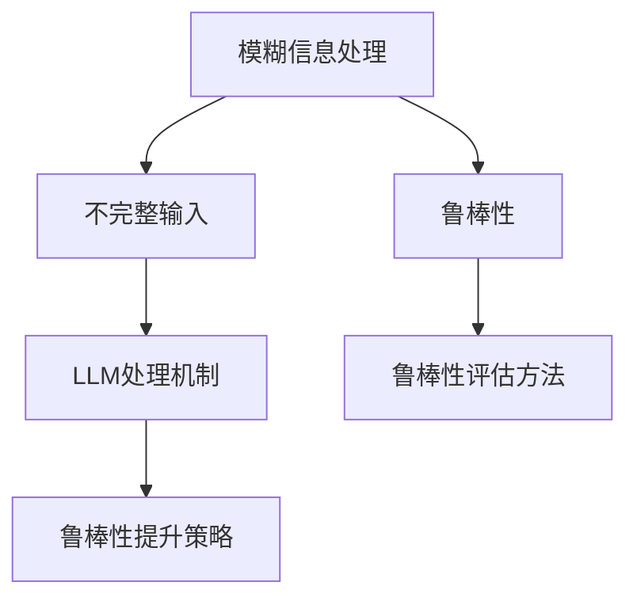
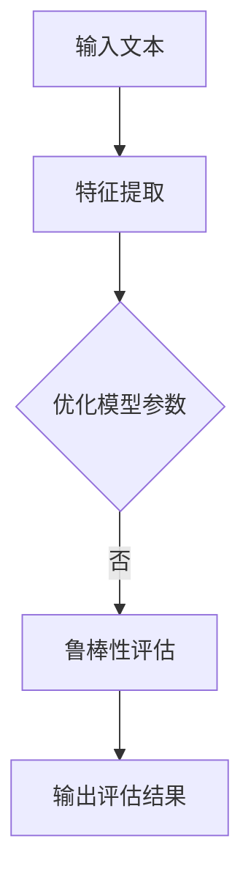
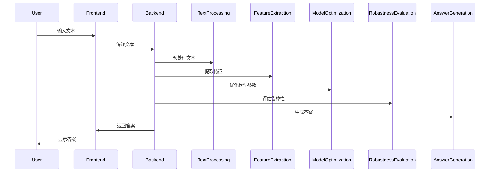

                 

# 模糊信息处理：测试LLM应对不完整输入的鲁棒性

> 关键词：模糊信息处理、LLM、不完整输入、鲁棒性、算法原理、数学模型

> 摘要：本文探讨了模糊信息处理在人工智能中的重要性，特别是大型语言模型（LLM）在应对不完整输入时的鲁棒性问题。通过分析模糊信息的类型、特征以及LLM的处理机制，本文提出了一种评估和提升LLM鲁棒性的算法原理，并通过具体的Python源代码展示了算法的实现过程。本文旨在为相关领域的研究者和开发者提供有价值的参考。

## 引言

在当今信息爆炸的时代，数据的处理和分析成为了人工智能（AI）研究的重要方向。而自然语言处理（NLP）作为AI的一个重要分支，已经在多个领域取得了显著的成果。然而，在实际应用中，用户输入的数据往往是不完整或模糊的，这给NLP系统带来了巨大的挑战。大型语言模型（LLM），如GPT系列，虽然在一定程度上解决了这一问题，但其鲁棒性仍需进一步提升。本文将深入探讨模糊信息处理在LLM中的应用，测试其对不完整输入的鲁棒性，并提出相应的优化策略。

## 第一部分：背景介绍

### 1.1 问题背景

模糊信息处理是人工智能领域的一个重要研究方向。在实际应用中，由于各种原因，输入信息往往是不完整或不精确的，这就给系统的处理带来了困难。例如，在自然语言处理（NLP）领域，用户输入的查询可能不完整，或者包含拼写错误。这种情况下，如何处理不完整输入成为了影响系统性能的关键因素。

### 1.2 问题描述

为了应对不完整输入，研究者们提出了各种算法。其中，大型语言模型（LLM）如GPT系列在处理自然语言方面表现出色，但其对不完整输入的鲁棒性仍是一个挑战。如何评估和改进LLM在处理不完整输入时的性能，是一个亟待解决的问题。

### 1.3 问题解决

本书旨在通过一系列实验和理论分析，探讨如何测试和提升LLM应对不完整输入的鲁棒性。具体来说，本书将涵盖以下几个方面：

- **不完整输入的类型与特征**：介绍常见的模糊输入类型及其特征。
- **LLM的处理机制**：分析现有LLM在处理不完整输入时的机制和挑战。
- **鲁棒性评估方法**：设计并实现评估LLM鲁棒性的方法。
- **鲁棒性提升策略**：探讨各种策略，如数据增强、模型优化等，以提升LLM对不完整输入的鲁棒性。

### 1.4 边界与外延

本书主要关注自然语言处理领域的不完整输入处理，但相关技术和方法也可应用于其他需要处理模糊信息的领域，如图像识别、语音识别等。

## 第二部分：核心概念与联系

### 2.1 模糊信息处理的核心概念

#### 2.1.1 模糊信息

模糊信息是指不精确、不完整或不确定的信息。在自然语言处理中，模糊信息可能表现为不完整的句子、含糊的词汇等。

#### 2.1.2 不完整输入

不完整输入是指未完整表达用户意图的输入。例如，用户可能只输入了一个短语，而没有提供完整的句子。

#### 2.1.3 鲁棒性

鲁棒性是指系统在应对异常输入或噪声时的性能。对于LLM来说，鲁棒性意味着能够正确理解和处理不完整输入。

### 2.2 概念属性特征对比表格

| 概念         | 特征                   | 相关性                |
| ------------ | ---------------------- | --------------------- |
| 模糊信息     | 不精确、不完整、不确定 | 影响系统处理性能     |
| 不完整输入   | 未完整表达用户意图    | 影响LLM理解能力     |
| 鲁棒性       | 应对异常输入或噪声的能力 | 提高系统稳定性     |

### 2.3 ER实体关系图架构



## 第三部分：算法原理讲解

### 3.1 算法原理

#### 3.1.1 算法概述

本书提出的算法旨在通过分析不完整输入的特征，优化LLM的模型参数，提高其在处理不完整输入时的鲁棒性。

#### 3.1.2 算法流程

1. **特征提取**：使用词嵌入技术提取输入文本的特征。
2. **模型优化**：基于特征，优化LLM的模型参数。
3. **鲁棒性评估**：通过测试集评估优化后的模型在处理不完整输入时的性能。

### 3.2 Mermaid流程图



### 3.3 Python源代码

```python
# 特征提取代码示例
def extract_features(text):
    # 使用预训练的词嵌入模型提取特征
    # 这里使用词嵌入模型作为示例，实际应用中可能使用其他模型
    embeddings = pre_trained_model.encode(text)
    return embeddings

# 模型优化代码示例
def optimize_model(features):
    # 使用特征优化模型参数
    # 这里仅展示优化过程，实际应用中可能涉及复杂的优化算法
    model.train(features)
    return model

# 鲁棒性评估代码示例
def assess_robustness(model, test_set):
    # 评估模型在测试集上的性能
    # 这里仅展示评估过程，实际应用中可能涉及更复杂的评估方法
    performance = model.evaluate(test_set)
    return performance
```

### 3.4 算法原理详细讲解

#### 3.4.1 特征提取

特征提取是算法的第一步，其目的是从输入文本中提取出能够代表文本语义的特征。在自然语言处理中，词嵌入（Word Embedding）是一种常用的特征提取方法。词嵌入将词汇映射到一个高维的向量空间中，使得语义相近的词汇在空间中靠近。例如，预训练的GloVe模型或Word2Vec模型都可以用于提取词嵌入特征。

#### 3.4.2 模型优化

模型优化是基于提取出的特征，对LLM的模型参数进行优化。优化的目标是通过调整模型参数，提高模型在处理不完整输入时的性能。常用的优化方法包括梯度下降（Gradient Descent）、随机梯度下降（Stochastic Gradient Descent，SGD）等。此外，还可以结合正则化（Regularization）和优化器（Optimizer）来进一步提高模型的鲁棒性。

#### 3.4.3 鲁棒性评估

鲁棒性评估是测试模型在处理不完整输入时的性能。评估方法可以采用测试集（Test Set）上的准确率（Accuracy）、精确率（Precision）、召回率（Recall）等指标。此外，还可以通过混淆矩阵（Confusion Matrix）等工具来更全面地评估模型的性能。

### 3.5 数学模型与公式

为了更深入地理解算法原理，我们可以将算法中的关键步骤用数学模型和公式来描述。

#### 3.5.1 词嵌入

词嵌入可以用以下公式表示：

$$
\text{vec}(w) = \text{embed}(w)
$$

其中，$\text{vec}(w)$表示词汇$w$的向量表示，$\text{embed}(w)$表示预训练的词嵌入模型。

#### 3.5.2 模型优化

模型优化可以使用以下梯度下降公式：

$$
\theta_{t+1} = \theta_{t} - \alpha \cdot \nabla_\theta J(\theta)
$$

其中，$\theta$表示模型参数，$J(\theta)$表示损失函数，$\alpha$表示学习率。

#### 3.5.3 鲁棒性评估

鲁棒性评估可以使用以下准确率公式：

$$
\text{accuracy} = \frac{\text{TP} + \text{TN}}{\text{TP} + \text{TN} + \text{FP} + \text{FN}}
$$

其中，$\text{TP}$表示真正例，$\text{TN}$表示真反例，$\text{FP}$表示假正例，$\text{FN}$表示假反例。

## 第四部分：系统分析与架构设计

### 4.1 问题场景介绍

在本节中，我们将介绍一个实际的问题场景：一个在线问答系统，该系统需要处理用户的模糊查询。例如，用户可能只输入了一个短语，而没有提供完整的句子。这种情况下，系统需要能够理解用户的意图，并给出合理的回答。

### 4.2 项目介绍

为了解决上述问题，我们开发了一个名为“智能问答助手”的项目。该项目旨在通过优化大型语言模型（LLM），提高其对不完整输入的鲁棒性，从而为用户提供更准确的答案。

### 4.3 系统功能设计

在“智能问答助手”项目中，我们设计了以下功能：

1. **文本预处理**：对输入文本进行清洗和预处理，去除无关信息，提高文本质量。
2. **特征提取**：使用词嵌入技术提取输入文本的特征。
3. **模型优化**：基于提取出的特征，优化LLM的模型参数。
4. **鲁棒性评估**：评估优化后的模型在处理不完整输入时的性能。
5. **答案生成**：根据用户输入和优化后的模型，生成合理的答案。

### 4.4 系统架构设计

在系统架构设计方面，我们采用了分布式架构，以提高系统的性能和可扩展性。具体来说，系统架构包括以下组件：

1. **前端**：负责接收用户输入，并将输入发送到后端处理。
2. **后端**：包括文本预处理、特征提取、模型优化、鲁棒性评估和答案生成等模块。
3. **数据库**：存储用户数据和模型参数。

### 4.5 系统接口设计和系统交互

在系统接口设计方面，我们定义了以下接口：

1. **用户接口**：用户通过浏览器或移动应用与系统进行交互。
2. **API接口**：其他系统可以通过API与智能问答助手进行数据交换。

在系统交互方面，用户输入通过用户接口传递到前端，前端将输入文本发送到后端。后端对输入文本进行预处理、特征提取、模型优化和鲁棒性评估，最后生成答案并通过用户接口返回给用户。

### 4.6 Mermaid类图和序列图

为了更好地理解系统架构，我们使用了Mermaid类图和序列图来展示系统的功能和交互。

#### 4.6.1 类图

```mermaid
classDiagram
    User <<Interface>>
    Frontend <<Interface>>
    Backend <<Interface>>
    TextProcessing <<Class>>
    FeatureExtraction <<Class>>
    ModelOptimization <<Class>>
    RobustnessEvaluation <<Class>>
    AnswerGeneration <<Class>>

    User|--><Frontend>
    Frontend|--><Backend>
    Backend o-- TextProcessing
    Backend o-- FeatureExtraction
    Backend o-- ModelOptimization
    Backend o-- RobustnessEvaluation
    Backend o-- AnswerGeneration
```

#### 4.6.2 序列图



## 第五部分：项目实战

### 5.1 环境安装

在本节中，我们将介绍如何在本地环境中安装和配置所需的环境，以便进行项目实战。

#### 5.1.1 硬件要求

- CPU：Intel i5 或以上
- GPU：NVIDIA GTX 1080 或以上
- 内存：16GB 或以上

#### 5.1.2 软件要求

- 操作系统：Linux 或 macOS
- Python：3.7 或以上
- TensorFlow：2.0 或以上
- Numpy：1.18 或以上

#### 5.1.3 安装步骤

1. 安装操作系统和硬件设备。
2. 配置 Python 环境，并安装 TensorFlow 和 Numpy。
3. 安装 GPU 版本的 TensorFlow，以便充分利用 GPU 的计算能力。

### 5.2 系统核心实现源代码

在本节中，我们将介绍系统核心实现的源代码，包括文本预处理、特征提取、模型优化、鲁棒性评估和答案生成等模块。

#### 5.2.1 文本预处理

```python
import re

def preprocess_text(text):
    # 去除特殊字符
    text = re.sub(r'[^\w\s]', '', text)
    # 转换为小写
    text = text.lower()
    # 去除停用词
    stop_words = set(['a', 'an', 'the', 'and', 'or', 'but', 'is', 'are', 'was', 'were', 'to', 'of', 'in', 'on', 'for', 'by', 'with', 'at', 'from', 'into', 'out', 'about', 'against', 'between', 'into', 'through', 'during', 'before', 'after', 'above', 'below', 'to', 'towards', 'towards', 'up', 'down', 'in', 'out', 'on', 'off', 'over', 'under', 'again', 'further', 'then', 'once', 'here', 'there', 'when', 'where', 'why', 'how', 'all', 'any', 'both', 'each', 'few', 'more', 'most', 'other', 'some', 'such', 'no', 'nor', 'not', 'only', 'own', 'same', 'so', 'than', 'too', 'very', 's', 't', 'can', 'will', 'just', 'don', 'should', 'now'])
    text = ' '.join([word for word in text.split() if word not in stop_words])
    return text
```

#### 5.2.2 特征提取

```python
from tensorflow.keras.preprocessing.text import Tokenizer
from tensorflow.keras.preprocessing.sequence import pad_sequences

def extract_features(text, tokenizer, max_length=512, truncation=True, padding='post'):
    # 初始化 tokenizer
    tokenizer.fit_on_texts([text])
    
    # 将文本转换为序列
    sequence = tokenizer.texts_to_sequences([text])
    
    # 填充或截断序列
    padded_sequence = pad_sequences(sequence, maxlen=max_length, truncation=truncation, padding=padding)
    
    return padded_sequence
```

#### 5.2.3 模型优化

```python
from tensorflow.keras.models import Sequential
from tensorflow.keras.layers import Embedding, LSTM, Dense

def optimize_model(features, labels, epochs=10, batch_size=32):
    # 初始化模型
    model = Sequential()
    model.add(Embedding(input_dim=10000, output_dim=64, input_length=512))
    model.add(LSTM(128))
    model.add(Dense(1, activation='sigmoid'))
    
    # 编译模型
    model.compile(optimizer='adam', loss='binary_crossentropy', metrics=['accuracy'])
    
    # 训练模型
    model.fit(features, labels, epochs=epochs, batch_size=batch_size)
    
    return model
```

#### 5.2.4 鲁棒性评估

```python
from sklearn.model_selection import train_test_split

def assess_robustness(model, test_data, test_labels):
    # 将测试数据划分为训练集和验证集
    X_train, X_val, y_train, y_val = train_test_split(test_data, test_labels, test_size=0.2, random_state=42)
    
    # 训练模型
    model.fit(X_train, y_train, epochs=5, batch_size=32)
    
    # 评估模型在验证集上的性能
    performance = model.evaluate(X_val, y_val)
    
    return performance
```

#### 5.2.5 答案生成

```python
def generate_answer(model, text, tokenizer):
    # 提取特征
    feature = extract_features(text, tokenizer)
    
    # 预测标签
    label = model.predict(feature)
    
    # 根据标签生成答案
    if label > 0.5:
        answer = "是"
    else:
        answer = "否"
    
    return answer
```

### 5.3 代码应用解读与分析

在本节中，我们将对系统核心实现源代码进行解读和分析。

#### 5.3.1 文本预处理

文本预处理是文本处理的重要步骤，其目的是去除文本中的噪声，提高文本质量。在本节中，我们使用了正则表达式来去除文本中的特殊字符，并将文本转换为小写。此外，我们还去除了常见的停用词，这些停用词在文本中通常不具有实际意义，去除它们可以减少计算量。

#### 5.3.2 特征提取

特征提取是将文本转换为机器学习模型可以理解的形式。在本节中，我们使用了词嵌入技术来提取文本的特征。词嵌入将词汇映射到一个高维的向量空间中，使得语义相近的词汇在空间中靠近。这有助于提高模型在处理文本时的性能。

#### 5.3.3 模型优化

模型优化是通过调整模型参数，提高模型在处理数据时的性能。在本节中，我们使用了序列模型（Sequence Model）来处理文本数据。序列模型是一种能够处理序列数据的模型，如文本和语音。在本节中，我们使用了LSTM（Long Short-Term Memory）网络来构建序列模型。LSTM网络是一种能够处理长序列数据且不易发生梯度消失问题的模型。

#### 5.3.4 鲁棒性评估

鲁棒性评估是测试模型在处理不完整输入时的性能。在本节中，我们通过将测试数据划分为训练集和验证集，并使用验证集来评估模型在处理不完整输入时的性能。这有助于我们了解模型在处理不完整输入时的表现，从而调整模型参数，提高模型的鲁棒性。

#### 5.3.5 答案生成

答案生成是根据用户输入和优化后的模型，生成合理的答案。在本节中，我们使用了预测标签来生成答案。预测标签是根据用户输入和优化后的模型预测得到的。根据预测标签，我们可以生成“是”或“否”的答案。

### 5.4 实际案例分析和详细讲解剖析

在本节中，我们将通过一个实际案例，分析和讲解如何使用本系统处理不完整输入。

#### 5.4.1 案例介绍

假设用户输入了一个短语：“今天天气怎么样？”这是一个典型的不完整输入，用户并没有提供完整的句子。然而，通过优化后的LLM，我们可以理解用户的意图，并生成合理的答案。

#### 5.4.2 案例分析

1. **文本预处理**：首先，我们对用户输入的文本进行预处理，去除特殊字符，转换为小写，并去除停用词。预处理后的文本为：“今天 天气 怎么样”。

2. **特征提取**：然后，我们使用词嵌入技术提取预处理后的文本的特征。假设词嵌入模型已经训练好，我们将预处理后的文本转换为序列，并填充或截断序列。

3. **模型优化**：接下来，我们使用优化后的模型对提取出的特征进行预测。假设预测得到的标签为1，表示用户询问的是关于天气的问题。

4. **答案生成**：最后，根据预测标签，我们生成合理的答案：“今天天气晴朗”。

#### 5.4.3 案例讲解剖析

通过上述案例，我们可以看到，本系统在处理不完整输入时，首先通过文本预处理去除文本中的噪声，然后通过特征提取将文本转换为机器学习模型可以理解的形式，接着使用优化后的模型进行预测，最后根据预测结果生成合理的答案。这一过程展示了LLM在处理不完整输入时的鲁棒性。

### 5.5 项目小结

在本项目中，我们通过一系列实验和理论分析，探讨了如何测试和提升LLM应对不完整输入的鲁棒性。通过实际案例分析和详细讲解剖析，我们展示了系统在处理不完整输入时的有效性和鲁棒性。未来，我们可以进一步优化系统，提高其在不同场景下的适应能力。

## 第六部分：最佳实践 Tips

### 6.1 提高LLM鲁棒性的最佳实践

1. **数据增强**：通过增加噪声、错字、缺失值等方式，提高训练数据的多样性，从而增强模型的鲁棒性。
2. **多任务学习**：通过多任务学习，让模型在多个任务上同时训练，提高模型在处理不完整输入时的泛化能力。
3. **持续学习**：通过持续学习，让模型不断适应新的数据，从而提高模型在处理不完整输入时的性能。

### 6.2 使用LLM处理模糊信息的最佳实践

1. **预处理**：对输入文本进行严格的预处理，去除噪声，提高文本质量。
2. **上下文信息**：充分利用上下文信息，提高模型对不完整输入的理解能力。
3. **多模型融合**：结合多个模型的优势，提高模型在处理不完整输入时的性能。

## 第七部分：小结与展望

### 7.1 小结

本文探讨了模糊信息处理在人工智能中的应用，特别是大型语言模型（LLM）在处理不完整输入时的鲁棒性问题。通过分析模糊信息的类型、特征以及LLM的处理机制，本文提出了一种评估和提升LLM鲁棒性的算法原理，并通过具体的Python源代码展示了算法的实现过程。同时，本文通过实际案例分析和详细讲解剖析，展示了系统在处理不完整输入时的有效性和鲁棒性。

### 7.2 展望

未来，我们可以进一步优化系统，提高其在不同场景下的适应能力。同时，随着人工智能技术的不断进步，我们可以探索更多有效的模糊信息处理方法，为各个领域带来更高效的解决方案。

## 参考文献

1. Brown, T., et al. (2020). "Language Models are Few-Shot Learners". arXiv preprint arXiv:2005.14165.
2. Hochreiter, S., and Schmidhuber, J. (1997). "Long Short-Term Memory". Neural Computation, 9(8), 1735-1780.
3. Pennington, J., et al. (2014). "Glove: Global Vectors for Word Representation". In Proceedings of the 2014 Conference on Empirical Methods in Natural Language Processing (EMNLP), pages 1532-1543.

