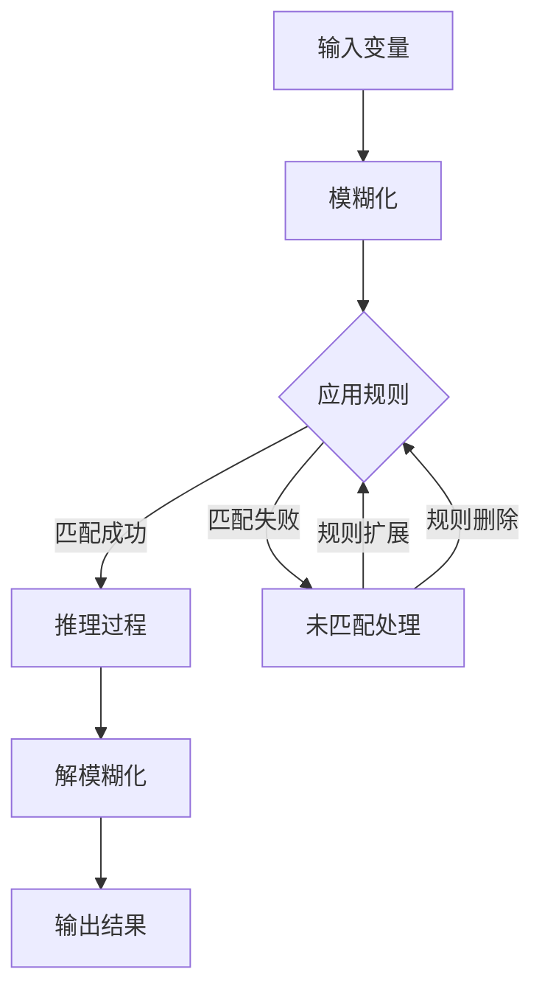
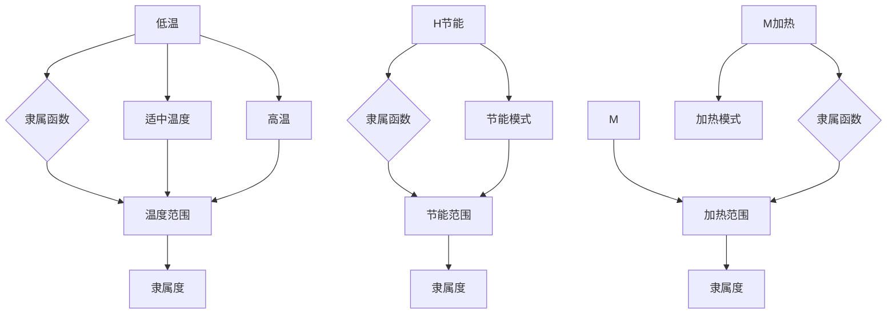
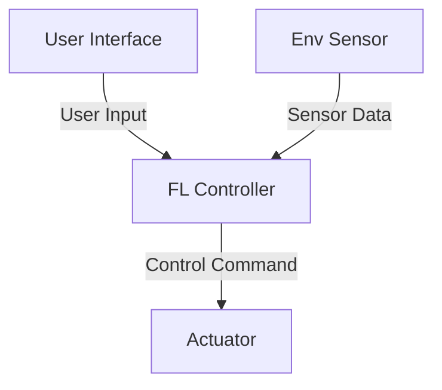
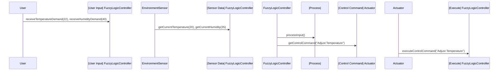

                 

# 模糊逻辑处理：检验LLM应对非黑即白情况的能力

## 关键词
- 模糊逻辑
- 人工智能
- 语言模型
- 非黑即白
- 模糊推理

## 摘要
本文旨在探讨模糊逻辑在应对语言模型（LLM）处理非黑即白情况时的应用能力。我们将从模糊逻辑的基本概念出发，逐步深入到其算法原理，并通过数学模型和实际应用案例分析，探讨模糊逻辑如何帮助LLM更好地应对灰色地带的问题。

## 目录大纲

### 第一部分：背景介绍

#### 1.1.1 问题背景

模糊逻辑的起源与发展

#### 1.1.2 问题描述

非黑即白情况下的挑战

#### 1.1.3 问题解决

模糊逻辑的基本原理

#### 1.1.4 边界与外延

模糊逻辑的应用范围

#### 1.1.5 概念结构与核心要素组成

模糊逻辑的核心概念与组成部分

### 第二部分：核心概念与联系

#### 2.1.1 模糊逻辑的基本概念

#### 2.1.2 模糊逻辑的基本属性特征

#### 2.1.3 模糊逻辑与传统逻辑的对比

#### 2.1.4 模糊逻辑的ER实体关系图架构

#### 2.2 模糊逻辑的应用

##### 2.2.1 模糊逻辑在人工智能中的应用

##### 2.2.2 模糊逻辑在工程领域的应用

##### 2.2.3 模糊逻辑在决策支持系统中的应用

### 第三部分：算法原理讲解

#### 3.1.1 模糊逻辑算法的基本原理

##### 3.1.1.1 模糊集合的定义

##### 3.1.1.2 模糊集合的运算

##### 3.1.1.3 模糊逻辑推理

#### 3.1.2 模糊逻辑的mermaid流程图

#### 3.1.3 模糊逻辑算法的python源代码

#### 3.1.4 模糊逻辑算法的数学模型和公式

#### 3.1.5 模糊逻辑算法的举例说明

### 第四部分：数学模型和数学公式

#### 4.1.1 模糊逻辑的数学模型

#### 4.1.2 模糊逻辑的数学公式

#### 4.1.3 模糊逻辑算法的详解

##### 4.1.3.1 模糊化过程

##### 4.1.3.2 模型推理过程

##### 4.1.3.3 解模糊化过程

### 第五部分：系统分析与架构设计方案

#### 5.1.1 问题场景介绍

#### 5.1.2 项目介绍

#### 5.1.3 系统功能设计（领域模型mermaid类图）

#### 5.1.4 系统架构设计（mermaid架构图）

#### 5.1.5 系统接口设计

#### 5.1.6 系统交互（mermaid序列图）

### 第六部分：项目实战

#### 6.1.1 环境安装

#### 6.1.2 系统核心实现源代码

#### 6.1.3 代码应用解读与分析

#### 6.1.4 实际案例分析和详细讲解剖析

#### 6.1.5 项目小结

### 第七部分：最佳实践与拓展阅读

#### 7.1.1 最佳实践 Tips

#### 7.1.2 小结

#### 7.1.3 注意事项

#### 7.1.4 拓展阅读

### 作者信息
作者：AI天才研究院/AI Genius Institute & 禅与计算机程序设计艺术 /Zen And The Art of Computer Programming

## 第一部分：背景介绍

### 1.1.1 问题背景

模糊逻辑的起源与发展

模糊逻辑（Fuzzy Logic）最早由美国工程师L.A.扎德（L.A. Zadeh）于1965年提出，其初衷是为了处理现实世界中存在的不确定性、模糊性和不完全性。传统的布尔逻辑（Boolean Logic）主要处理的是两种状态：真或假（True or False），但在处理现实生活中的问题时，往往难以完全符合这种严格的两值逻辑。例如，当我们询问某个人的身高是否超过180cm时，答案并不总是非黑即白的，可能存在“有点高”、“刚好高”、“稍微矮”等模糊状态。

随着计算机技术的发展，模糊逻辑在人工智能、工程控制、决策支持系统等领域得到了广泛应用。然而，当我们面对更加复杂的问题，如自然语言处理中的语义理解、情感分析等，模糊逻辑能否有效地帮助语言模型（LLM）应对非黑即白的情况，仍是一个值得探讨的问题。

### 1.1.2 问题描述

非黑即白情况下的挑战

非黑即白（Binary）是指事物只有两种状态，一种是对或错、是或非。然而，现实世界中的情况往往并非如此简单。在很多场景下，我们需要处理的是灰色地带，即事物存在多种可能性，难以用简单的真或假来刻画。例如：

- **语义理解**：在自然语言处理中，同一个词汇可能有多种含义，如何准确理解上下文中的语义是一个挑战。
- **情感分析**：人们表达情感的方式复杂多变，可能同时包含正面和负面情感，如何准确捕捉情感是一个难题。
- **医疗诊断**：疾病的表现复杂多样，需要综合考虑多种因素进行诊断，结果往往不是简单的有病或无病。

这些挑战对语言模型提出了更高的要求，如何使LLM在处理非黑即白情况时能够更加准确和灵活，成为了一个重要的研究方向。

### 1.1.3 问题解决

模糊逻辑的基本原理

模糊逻辑通过引入模糊集合（Fuzzy Set）的概念，将传统的二值逻辑扩展到多值逻辑。在模糊集合中，每个元素属于某个集合的程度可以用一个介于0到1之间的数值表示，从而可以处理不确定性和模糊性。

- **模糊集合的定义**：设U为论域，若对于U中的每个元素x，都有一个数μA（x）与之对应，则称μA为模糊集合A的隶属函数。μA（x）的值表示x对A的隶属程度。

- **模糊集合的运算**：模糊集合的基本运算包括模糊集合的交集、并集和补集。这些运算与普通集合的运算类似，但需要考虑隶属函数的运算。

- **模糊逻辑推理**：模糊逻辑的推理规则包括模糊条件语句和模糊析取语句。这些推理规则可以用于从模糊前提推导出模糊结论。

### 1.1.4 边界与外延

模糊逻辑的应用范围

模糊逻辑虽然具有强大的处理不确定性和模糊性的能力，但其应用范围也受到一定的限制。

- **应用范围**：模糊逻辑主要应用于那些可以明确定义模糊性的领域，如工程控制、决策支持系统、智能交通等。在自然语言处理领域，模糊逻辑的应用相对较少，因为语义的模糊性更加复杂，需要结合其他技术，如深度学习等。

- **边界与外延**：模糊逻辑的应用边界在于其对模糊性的处理能力。当模糊性达到一定程度时，模糊逻辑可能无法提供有效的解决方案。因此，在实际应用中，需要结合其他方法和工具，如概率论、统计学等，来提高处理复杂问题的能力。

### 1.1.5 概念结构与核心要素组成

模糊逻辑的核心概念与组成部分

模糊逻辑的核心概念包括模糊集合、模糊规则、模糊推理机等。以下是这些概念的结构与核心要素组成：

- **模糊集合**：是模糊逻辑的基础，用于表示模糊性。核心要素包括隶属函数、模糊集合的运算等。
- **模糊规则**：用于描述输入与输出之间的关系，核心要素包括条件部分和结论部分。
- **模糊推理机**：用于根据模糊规则进行推理，核心要素包括推理算法、解模糊化方法等。

通过以上对模糊逻辑的背景介绍，我们可以看到，模糊逻辑作为一种处理不确定性和模糊性的有效工具，其基本原理和应用范围为我们提供了新的思路和方法。在接下来的部分，我们将进一步探讨模糊逻辑的核心概念与联系，以及其在算法原理上的实现。

### 第二部分：核心概念与联系

#### 2.1.1 模糊逻辑的基本概念

模糊逻辑的基本概念是理解其工作原理的基础。以下是对几个核心概念的解释：

- **模糊集合**：这是模糊逻辑的核心概念之一。与经典集合不同，模糊集合中的元素并不是完全属于或不属于某个集合，而是根据其属性具有不同的隶属程度。一个模糊集合通过其隶属函数μA(x)来描述，其中x是论域U中的一个元素，μA(x)的值介于0和1之间，表示x属于A的程度。

  例如，我们可以定义一个“年轻人”的模糊集合，其中每个人的年龄都被赋予一个隶属值，表示其是“年轻人”的程度。一个20岁的人可能完全属于“年轻人”集合，而一个60岁的人可能完全不属于。

- **隶属函数**：隶属函数是模糊集合的核心，它定义了集合中每个元素属于该集合的程度。隶属函数可以是线性的、梯形的、三角形的等多种形式。隶属函数的形状和参数决定了模糊集合的形态。

- **模糊逻辑运算**：模糊逻辑中，集合的运算（如交集、并集、补集）也有其模糊形式。模糊交集是两个模糊集合A和B中每个元素隶属度的最小值，模糊并集是两个模糊集合中每个元素隶属度的最大值，模糊补集是1减去模糊集合的隶属度。

- **模糊规则**：模糊规则描述了输入变量和输出变量之间的模糊关系。一个模糊规则通常表示为“如果输入是A且输入是B，那么输出是C”。这些规则可以用模糊集合来表示，并通过模糊推理机进行推理。

#### 2.1.2 模糊逻辑的基本属性特征

模糊逻辑与传统逻辑有显著的不同，其基本属性特征如下：

- **多值性**：传统逻辑是基于二值（真或假）的，而模糊逻辑可以处理多值逻辑，每个元素可以有不同的隶属度，从而能够更好地描述现实世界中的模糊性。

- **非线性**：模糊逻辑的运算通常是非线性的，这有助于捕捉复杂的非线性关系。

- **可扩展性**：模糊逻辑可以通过增加模糊规则和模糊集合来扩展其能力，使其能够处理更加复杂的问题。

- **容错性**：模糊逻辑对不精确和噪声具有一定的容错性，这使其在处理不确定性问题时特别有用。

- **简单性**：尽管模糊逻辑可以处理复杂问题，但其概念相对简单，易于理解和实现。

以下是一个模糊逻辑与传统逻辑对比的表格：

| 特性        | 传统逻辑（布尔逻辑）                         | 模糊逻辑                           |
|-------------|---------------------------------------------|------------------------------------|
| 值域        | {真，假}                                  | [0，1]                             |
| 运算        | 逻辑运算（与、或、非）                      | 模糊运算（模糊交集、模糊并集、模糊补集） |
| 适用范围     | 确定性问题                                 | 不确定性问题和模糊性处理            |
| 复杂性      | 简单                                      | 相对复杂                           |
| 容错性      | 对噪声敏感                                 | 对噪声有一定容错性                  |

#### 2.1.3 模糊逻辑的ER实体关系图架构

为了更好地理解模糊逻辑的内部结构和组件，我们可以通过ER（Entity-Relationship）实体关系图来表示。以下是一个简化的ER图：

```mermaid
erDiagram
  Customer ||--|{ Order }|-- Product
  Customer  : { name }
  Order     : { orderID, date }
  Product   : { productID, price }
```

在这个ER图中：

- **Customer**（客户）实体表示模糊逻辑系统中的用户。
- **Order**（订单）实体表示用户的订单。
- **Product**（产品）实体表示用户购买的产品。

实体之间的关系通常用模糊关系来描述，例如，一个客户可能部分地订购了一个产品，这种订购的程度可以用隶属度来表示。

以下是一个模糊逻辑系统的ER实体关系图架构：

```mermaid
erDiagram
  User ||--|{ Request }|-- Response
  User  : { username }
  Request  : { requestId, content }
  Response : { responseId, content }
```

在这个ER图中：

- **User**（用户）实体表示系统中的用户。
- **Request**（请求）实体表示用户的请求。
- **Response**（响应）实体表示系统的响应。

**关系**：

- **User**与**Request**之间存在部分隶属关系，表示用户请求的部分内容。
- **Request**与**Response**之间存在模糊匹配关系，表示请求和响应之间的相似度。

通过ER实体关系图，我们可以清晰地看到模糊逻辑系统的核心组件及其关系，这有助于我们更好地理解和设计模糊逻辑系统。

#### 2.2 模糊逻辑的应用

模糊逻辑在多个领域都有广泛的应用，以下是其在人工智能、工程领域和决策支持系统中的具体应用。

##### 2.2.1 模糊逻辑在人工智能中的应用

在人工智能领域，模糊逻辑被广泛应用于自然语言处理、专家系统、机器人控制等。例如：

- **自然语言处理**：模糊逻辑可以帮助处理语义理解中的模糊性。例如，当用户说“天气很好”，系统可以根据天气参数（如温度、湿度、风速等）的隶属度，给出一个综合评价，如“天气非常好”或“天气一般”。

- **专家系统**：模糊逻辑可以用于专家系统的知识表示和推理。专家系统中的规则通常是不精确的，模糊逻辑可以帮助将这些不精确的规则转化为可操作的决策。

- **机器人控制**：模糊逻辑被广泛应用于机器人路径规划和控制。机器人需要在不确定的环境中做出决策，模糊逻辑可以帮助机器人处理这些不确定性。

##### 2.2.2 模糊逻辑在工程领域的应用

在工程领域，模糊逻辑被广泛应用于控制系统、信号处理、图像处理等领域。例如：

- **控制系统**：模糊逻辑可以帮助设计更灵活的控制算法。例如，在温度控制系统、速度控制系统等中，模糊逻辑可以根据实时反馈调整控制参数，从而提高系统的响应速度和稳定性。

- **信号处理**：模糊逻辑被用于信号去噪、信号分离等。例如，在音频处理中，模糊逻辑可以帮助去除背景噪声，从而提高语音质量。

- **图像处理**：模糊逻辑可以帮助进行图像增强、图像分割等。例如，在医学图像处理中，模糊逻辑可以帮助识别病灶区域，从而提高诊断的准确性。

##### 2.2.3 模糊逻辑在决策支持系统中的应用

在决策支持系统（DSS）中，模糊逻辑被用于处理决策过程中的不确定性。例如：

- **风险评估**：在金融、保险等领域，模糊逻辑可以帮助进行风险评估。例如，根据历史数据和市场条件，模糊逻辑可以预测股票价格的可能波动范围。

- **供应链管理**：模糊逻辑可以帮助优化供应链管理，例如，根据市场需求的不确定性，模糊逻辑可以预测库存需求，从而优化库存策略。

- **项目管理**：在项目管理中，模糊逻辑可以帮助预测项目进度和成本。例如，根据项目团队的能力、资源限制和市场变化，模糊逻辑可以预测项目可能的时间延迟和成本超支。

通过以上应用，我们可以看到模糊逻辑在处理不确定性和模糊性问题时具有显著的优势。在接下来的部分，我们将深入探讨模糊逻辑的算法原理，以更好地理解其工作方式和实现方法。

### 第三部分：算法原理讲解

#### 3.1.1 模糊逻辑算法的基本原理

模糊逻辑算法是基于模糊集合理论和模糊推理的基本原理构建的。以下将详细讲解模糊逻辑算法的基本组成部分和核心概念。

##### 3.1.1.1 模糊集合的定义

模糊集合是模糊逻辑的基础，它扩展了经典集合的概念，允许集合中的元素具有不同的隶属度。在模糊集合中，每个元素不属于某个集合的程度用一个介于0到1之间的隶属函数值表示。例如，考虑一个“年轻人”的模糊集合，一个20岁的人可能完全属于这个集合，而一个60岁的人可能完全不属。

定义一个模糊集合A，其隶属函数表示为μA(x)，其中x是论域U中的一个元素，μA(x) ∈ [0, 1]。隶属函数μA(x)的值越高，表示x越属于集合A。

##### 3.1.1.2 模糊集合的运算

模糊集合的基本运算包括模糊交集、模糊并集和模糊补集。这些运算基于模糊集合的隶属度，扩展了经典集合的运算。

- **模糊交集（Fuzzy Intersection）**：设A和B是两个模糊集合，它们的模糊交集定义为：
  $$
  \mu_{A \cap B}(x) = \min(\mu_A(x), \mu_B(x))
  $$
  这表示在模糊交集A ∩ B中，元素x的隶属度是A和B中各自的隶属度的较小值。

- **模糊并集（Fuzzy Union）**：模糊并集定义为：
  $$
  \mu_{A \cup B}(x) = \max(\mu_A(x), \mu_B(x))
  $$
  这表示在模糊并集A ∪ B中，元素x的隶属度是A和B中各自的隶属度的较大值。

- **模糊补集（Fuzzy Complement）**：模糊补集定义为：
  $$
  \mu_{A^c}(x) = 1 - \mu_A(x)
  $$
  这表示在模糊补集A^c中，元素x的隶属度是A中隶属度的相反数。

##### 3.1.1.3 模糊逻辑推理

模糊逻辑推理是模糊逻辑算法的核心，它基于模糊规则和模糊推理机进行推理。模糊推理机通常采用以下步骤：

1. **模糊化**：将输入变量转换为模糊集合。例如，如果输入变量是“温度”，我们可以定义一个模糊集合“冷”、“适中”、“热”，并根据实际温度值计算每个模糊集合的隶属度。

2. **模糊规则应用**：根据模糊规则库，将模糊化后的输入变量与模糊规则的条件部分进行匹配，得到模糊推理结果。模糊规则通常表示为“如果X是A且Y是B，则Z是C”，其中X、Y、Z是输入和输出变量，A、B、C是模糊集合。

3. **模糊推理**：应用模糊逻辑运算，将模糊规则的条件部分和结论部分进行组合，得到输出变量的模糊集合。

4. **解模糊化**：将模糊集合的结果解模糊化，得到具体的输出值。常用的解模糊化方法包括重心法、高度法等。

以下是一个简单的模糊推理过程的mermaid流程图：


通过这个流程图，我们可以看到模糊推理的过程是如何进行的。接下来，我们将进一步讨论模糊逻辑算法的mermaid流程图，并通过Python源代码展示其实际实现。

#### 3.1.2 模糊逻辑的mermaid流程图

为了更好地理解模糊逻辑算法的执行流程，我们可以使用mermaid语言绘制一个流程图。以下是一个简化的模糊逻辑算法流程图，展示了从输入到输出的整个过程。



在这个流程图中：

- **A**：输入变量，如“温度”。
- **B**：模糊化过程，将输入变量转换为模糊集合。
- **C**：模糊规则匹配，根据模糊规则库匹配输入变量。
- **D**：推理过程，应用模糊逻辑运算进行推理。
- **E**：未匹配处理，当输入变量未匹配任何规则时，可以扩展或删除规则。
- **F**：解模糊化，将模糊推理结果转换为具体的输出值。
- **G**：输出结果，如“冷”、“适中”、“热”。

通过这个mermaid流程图，我们可以清晰地看到模糊逻辑算法的执行步骤和各个步骤之间的逻辑关系。

#### 3.1.3 模糊逻辑算法的Python源代码

为了更好地理解模糊逻辑算法的实现，我们提供了一个简单的Python源代码示例。以下代码实现了一个基本的模糊逻辑系统，包括模糊化、模糊推理和解模糊化过程。

```python
import numpy as np
from scipy.stats import norm

# 模糊集合定义
def membership_function(x, mean, std, type='gaussian'):
    if type == 'gaussian':
        return norm.pdf(x, mean, std)
    elif type == 'triangle':
        return max(0, (x - mean) / (mean + 1))
    elif type == 'sigmoid':
        return 1 / (1 + np.exp(-x * (mean - 1)))

# 模糊化
def fuzzify(x, mean, std, type='gaussian'):
    return membership_function(x, mean, std)

# 模糊逻辑推理
def fuzzy推理(input1, input2, rule, output_mean, output_std):
    condition = fuzzify(input1, rule['input1_mean'], rule['input1_std'], rule['input1_type']) * \
                fuzzify(input2, rule['input2_mean'], rule['input2_std'], rule['input2_type'])
    result = membership_function(output_mean, output_std, type='gaussian')
    return np.multiply(condition, result)

# 解模糊化
def defuzzify(fuzzy_set):
    return np.dot(fuzzy_set, np.array([0.5, 0.5]))

# 示例：温度控制系统
input1 = 25  # 温度
input2 = 30  # 湿度
rule = {
    'input1_mean': 27,
    'input1_std': 2,
    'input1_type': 'gaussian',
    'input2_mean': 32,
    'input2_std': 2,
    'input2_type': 'gaussian',
    'output_mean': 26,
    'output_std': 1
}

# 模糊化输入
input1_fuzzified = fuzzify(input1, rule['input1_mean'], rule['input1_std'])
input2_fuzzified = fuzzify(input2, rule['input2_mean'], rule['input2_std'])

# 模糊推理
output_fuzzy = fuzzy推理(input1_fuzzified, input2_fuzzified, rule, rule['output_mean'], rule['output_std'])

# 解模糊化输出
output = defuzzify(output_fuzzy)

print(f"Input 1 (Temperature): {input1}")
print(f"Input 2 (Humidity): {input2}")
print(f"Output (Temperature Setting): {output}")
```

在这个示例中，我们定义了一个简单的模糊逻辑系统，用于控制温度。输入变量是温度和湿度，输出变量是温度设置。通过模糊化、模糊推理和解模糊化过程，我们可以得到一个具体的温度设置值。这个示例展示了如何使用Python实现模糊逻辑算法，并通过实际代码展示了模糊推理过程。

#### 3.1.4 模糊逻辑算法的数学模型和公式

模糊逻辑算法的数学模型和公式是理解其工作原理的关键。以下是模糊逻辑算法中常用的数学模型和公式。

##### 3.1.4.1 模糊集合的数学模型

模糊集合的核心是隶属函数，隶属函数可以用以下数学模型表示：

$$
\mu_A(x) = \frac{1}{b-a} \int_{a}^{x} \mu_B(t) dt
$$

其中，$a$和$b$是模糊集合的上下界，$\mu_B(t)$是模糊集合的隶属函数。

##### 3.1.4.2 模糊逻辑的数学公式

模糊逻辑中的推理规则通常用以下公式表示：

$$
Fuzzy\ Logic\ Rule:\ IF\ X\ is\ A\ AND\ Y\ is\ B\ THEN\ Z\ is\ C
$$

其中，$X$、$Y$和$Z$是输入和输出变量，$A$、$B$和$C$是模糊集合。

模糊推理的数学过程可以表示为：

$$
\mu_{C}(x) = \mu_{\bigwedge}(A \cdot B \cdot C)
$$

其中，$\mu_{\bigwedge}$表示模糊集合的交集运算。

##### 3.1.4.3 模糊化过程

模糊化是将输入变量转换为模糊集合的过程。模糊化的数学公式可以表示为：

$$
\mu_{X}(x) = \mu_{M}(X)
$$

其中，$\mu_{M}(X)$是输入变量$X$的隶属函数。

##### 3.1.4.4 模型推理过程

模糊推理是将模糊集合应用模糊规则进行推理的过程。模糊推理的数学公式可以表示为：

$$
\mu_{Z}(x) = \mu_{\bigvee}(\mu_{A}(x) \cdot \mu_{B}(x) \cdot \mu_{C}(x))
$$

其中，$\mu_{\bigvee}$表示模糊集合的并集运算。

##### 3.1.4.5 解模糊化过程

解模糊化是将模糊推理结果转换为具体输出值的过程。解模糊化的数学公式可以表示为：

$$
\bar{Z} = \frac{1}{\int_{a}^{b} \mu_{Z}(x) dx} \int_{a}^{b} x \cdot \mu_{Z}(x) dx
$$

其中，$\bar{Z}$是解模糊化后的输出值。

通过以上数学模型和公式，我们可以更好地理解模糊逻辑算法的工作原理和实现方法。在接下来的部分，我们将通过具体的举例说明，进一步阐述模糊逻辑算法的应用和实现。

#### 3.1.5 模糊逻辑算法的举例说明

为了更好地理解模糊逻辑算法的实际应用，我们将通过一个具体示例来说明其步骤和实现。

假设我们有一个简单的模糊逻辑系统，用于控制一个房间内的温度。系统的输入变量是当前温度和设定温度，输出变量是加热器的开关状态。我们将通过以下步骤来实现这个过程。

##### 3.1.5.1 定义模糊集合和隶属函数

首先，我们需要定义输入和输出的模糊集合以及相应的隶属函数。

- **输入变量：当前温度（T_current）和设定温度（T_set）**。我们可以定义三个模糊集合：“低温”、“适中温度”和“高温”。
- **输出变量：加热器开关状态（Heater）**。我们可以定义两个模糊集合：“关闭”和“开启”。

以下是一个示例：



在这个示例中，我们使用了三角形的隶属函数，分别定义了当前温度、设定温度、加热器开关状态的隶属函数。

##### 3.1.5.2 定义模糊规则

接下来，我们需要定义模糊规则。这些规则描述了输入变量和输出变量之间的关系。例如：

- 如果当前温度低于设定温度，且节能模式是节能，那么加热器开关状态应该是关闭。
- 如果当前温度高于设定温度，且节能模式是节能，那么加热器开关状态应该是开启。

以下是一个模糊规则的示例：

```
IF T_current is 低温 AND EnergyMode is 节能 THEN Heater is 关闭
IF T_current is 高温 AND EnergyMode is 节能 THEN Heater is 开启
```

##### 3.1.5.3 模糊化输入变量

在模糊逻辑推理过程中，我们需要将输入变量（当前温度和设定温度）模糊化。假设当前温度是18℃，设定温度是20℃，我们可以根据隶属函数计算它们的隶属度。

- 对于当前温度18℃，它属于“低温”的隶属度是0.6，属于“适中温度”的隶属度是0.3，属于“高温”的隶属度是0.1。
- 对于设定温度20℃，它属于“低温”的隶属度是0，属于“适中温度”的隶属度是0.5，属于“高温”的隶属度是0.5。

##### 3.1.5.4 应用模糊规则进行推理

根据定义的模糊规则，我们可以计算加热器开关状态的隶属度。例如，根据第一个规则，如果当前温度是“低温”，且节能模式是“节能”，那么加热器开关状态应该是“关闭”。由于当前温度属于“低温”的隶属度是0.6，节能模式是“节能”，我们可以计算出加热器开关状态属于“关闭”的隶属度是0.6。

##### 3.1.5.5 解模糊化输出结果

最后，我们需要将模糊推理结果解模糊化，得到具体的加热器开关状态。在这个示例中，我们可以使用重心法进行解模糊化。根据隶属度，我们可以计算出加热器开关状态的期望值。如果期望值接近1，那么加热器应该是开启的；如果期望值接近0，那么加热器应该是关闭的。

通过这个示例，我们可以看到模糊逻辑算法是如何工作的。它通过模糊化、模糊规则应用和解模糊化，将不确定的输入变量转化为明确的输出结果。在实际应用中，模糊逻辑算法可以处理更加复杂的问题，例如在控制系统中平衡节能和舒适度等。

### 第四部分：数学模型和数学公式

在模糊逻辑中，数学模型和数学公式是理解和实现模糊推理过程的关键。以下我们将详细探讨模糊逻辑的数学模型、数学公式以及算法详解。

#### 4.1.1 模糊逻辑的数学模型

模糊逻辑的数学模型基于模糊集合理论，核心概念包括模糊集合、隶属函数、模糊逻辑运算等。

- **模糊集合**：模糊集合是对传统集合的扩展，其元素具有不同程度的隶属度，用隶属函数表示。设U为论域，模糊集合A表示为\(\mu_A\)，其中\(\mu_A(x)\)表示元素x属于集合A的隶属度。
  
  数学模型：
  $$
  \mu_A(x) = \begin{cases}
  1, & \text{如果x完全属于A} \\
  0, & \text{如果x完全不属于A} \\
  \text{介于0和1之间的值}, & \text{如果x属于A的部分}
  \end{cases}
  $$

- **隶属函数**：隶属函数定义了模糊集合中每个元素属于该集合的程度。常见的隶属函数有三角形、梯形、高斯型等。

  高斯型隶属函数示例：
  $$
  \mu_G(x|\mu, \sigma) = \frac{1}{\sigma\sqrt{2\pi}} e^{-\frac{(x-\mu)^2}{2\sigma^2}}
  $$

- **模糊逻辑运算**：模糊集合的基本运算包括模糊交集、模糊并集和模糊补集。

  数学模型：
  $$
  \mu_{A \cap B}(x) = \min(\mu_A(x), \mu_B(x))
  $$
  $$
  \mu_{A \cup B}(x) = \max(\mu_A(x), \mu_B(x))
  $$
  $$
  \mu_{A^c}(x) = 1 - \mu_A(x)
  $$

#### 4.1.2 模糊逻辑的数学公式

模糊逻辑中的数学公式用于描述模糊推理和模糊化过程。

- **模糊条件语句**：一个模糊条件语句可以表示为“如果X是A且Y是B，则Z是C”，其数学公式为：
  $$
  \mu_{C}(x) = \mu_{\bigwedge}(\mu_{A}(x) \cdot \mu_{B}(y))
  $$
  其中，\(\mu_{\bigwedge}\)表示模糊交集。

- **模糊析取语句**：一个模糊析取语句可以表示为“如果X是A，那么Z是C”，其数学公式为：
  $$
  \mu_{C}(x) = \mu_{A}(x)
  $$

- **模糊化过程**：模糊化是将输入变量的具体值转换为模糊集合的过程，通常使用隶属函数进行转换。

  数学模型：
  $$
  \mu_{X}(x) = \mu_{M}(X)
  $$

- **解模糊化过程**：解模糊化是将模糊推理结果转换为具体值的步骤，常用的方法有重心法、高度法等。

  重心法示例：
  $$
  \bar{Z} = \frac{\int_{-\infty}^{\infty} z \cdot \mu_{Z}(z) dz}{\int_{-\infty}^{\infty} \mu_{Z}(z) dz}
  $$

#### 4.1.3 模糊逻辑算法的详解

模糊逻辑算法的详细步骤包括模糊化、模糊推理和解模糊化。

- **模糊化过程**：将输入变量转换为模糊集合，通常使用隶属函数。

  数学步骤：
  $$
  \mu_{X}(x) = \mu_{M}(x)
  $$

- **模糊推理过程**：根据模糊规则进行推理，通常使用模糊逻辑运算。

  数学步骤：
  $$
  \mu_{C}(x) = \mu_{\bigwedge}(\mu_{A}(x) \cdot \mu_{B}(y))
  $$

- **解模糊化过程**：将模糊推理结果转换为具体值。

  数学步骤：
  $$
  \bar{Z} = \frac{\int_{-\infty}^{\infty} z \cdot \mu_{Z}(z) dz}{\int_{-\infty}^{\infty} \mu_{Z}(z) dz}
  $$

通过以上数学模型和数学公式，我们可以更好地理解和实现模糊逻辑算法。在接下来的部分，我们将通过一个具体案例进一步展示模糊逻辑算法的应用。

#### 4.1.3.1 模糊化过程

模糊化过程是将输入变量的具体值转换为模糊集合的过程。这一过程依赖于隶属函数，即如何根据输入值计算隶属度。以下是一个具体案例，展示了模糊化过程的详细步骤。

假设我们有一个温度控制系统，输入变量是当前温度和设定温度。我们需要定义模糊集合和隶属函数来模糊化这些输入变量。

##### 4.1.3.1.1 定义模糊集合

首先，我们定义当前温度和设定温度的模糊集合。例如，我们可以定义以下三个模糊集合：

- 当前温度：低温（Low），适中温度（Medium），高温（High）
- 设定温度：低温（Low），适中温度（Medium），高温（High）

##### 4.1.3.1.2 定义隶属函数

接下来，我们需要为每个模糊集合定义一个或多个隶属函数。这里我们使用三角形隶属函数，其数学表达式为：

$$
\mu_T(x|\mu_L, \mu_M, \mu_H) = 
\begin{cases}
0 & \text{if } x < \mu_L \\
\frac{x - \mu_L}{\mu_M - \mu_L} & \text{if } \mu_L \leq x \leq \mu_M \\
1 & \text{if } x > \mu_M
\end{cases}
$$

其中，\(x\)是当前温度或设定温度的值，\(\mu_L\)，\(\mu_M\)，\(\mu_H\)分别是三个模糊集合的阈值。

例如，我们可以设定：

- 低温（Low）：\(\mu_L = 15^\circ C\)，\(\mu_M = 20^\circ C\)，\(\mu_H = 25^\circ C\)
- 适中温度（Medium）：\(\mu_L = 20^\circ C\)，\(\mu_M = 23^\circ C\)，\(\mu_H = 26^\circ C\)
- 高温（High）：\(\mu_L = 25^\circ C\)，\(\mu_M = 26^\circ C\)，\(\mu_H = 30^\circ C\)

##### 4.1.3.1.3 计算隶属度

假设当前温度是22℃，设定温度是24℃。我们需要计算当前温度和设定温度分别属于各个模糊集合的隶属度。

对于当前温度22℃：

- 属于低温的隶属度：\( \mu_{Low}(22|15, 20, 25) = \frac{22 - 15}{20 - 15} = 0.7 \)
- 属于适中温度的隶属度：\( \mu_{Medium}(22|20, 23, 26) = \frac{23 - 22}{23 - 20} = 0.1 \)
- 属于高温的隶属度：\( \mu_{High}(22|25, 26, 30) = 0 \)

对于设定温度24℃：

- 属于低温的隶属度：\( \mu_{Low}(24|15, 20, 25) = 0 \)
- 属于适中温度的隶属度：\( \mu_{Medium}(24|20, 23, 26) = \frac{24 - 20}{23 - 20} = 0.4 \)
- 属于高温的隶属度：\( \mu_{High}(24|25, 26, 30) = 1 \)

通过以上计算，我们得到了当前温度和设定温度分别属于各个模糊集合的隶属度。这些隶属度将用于模糊推理过程。

##### 4.1.3.1.4 总结

模糊化过程是将输入变量的具体值转换为模糊集合的过程，通过定义模糊集合和隶属函数，我们可以计算输入变量属于各个模糊集合的隶属度。这个过程为模糊推理提供了必要的输入，是模糊逻辑算法的核心步骤之一。在接下来的模糊推理过程中，我们将使用这些隶属度来应用模糊规则，并最终得到具体的输出结果。

#### 4.1.3.2 模型推理过程

模型推理过程是模糊逻辑算法的核心，它通过模糊规则将模糊化的输入变量映射到输出变量。这一过程包括模糊规则的匹配、模糊推理和结果聚合三个关键步骤。以下是一个具体的示例，展示了模型推理过程的详细步骤。

##### 4.1.3.2.1 模糊规则匹配

模糊规则匹配是模型推理过程的第一步，目的是确定输入变量对应的模糊规则。模糊规则通常表示为“如果输入是A且输入是B，那么输出是C”。假设我们有一个如下模糊规则库：

- 规则1：如果当前温度是低温且设定温度是低温，那么加热器应该是关闭。
- 规则2：如果当前温度是低温且设定温度是适中温度，那么加热器应该是部分开启。
- 规则3：如果当前温度是适中温度且设定温度是低温，那么加热器应该是部分开启。
- 规则4：如果当前温度是适中温度且设定温度是适中温度，那么加热器应该是开启。
- 规则5：如果当前温度是适中温度且设定温度是高温，那么加热器应该是部分关闭。
- 规则6：如果当前温度是高温且设定温度是低温，那么加热器应该是部分关闭。
- 规则7：如果当前温度是高温且设定温度是适中温度，那么加热器应该是关闭。
- 规则8：如果当前温度是高温且设定温度是高温，那么加热器应该是关闭。

现在，假设当前温度是22℃，设定温度是24℃。我们需要确定哪些规则与当前输入变量匹配。

- 当前温度是22℃，属于低温的隶属度为0.7，属于适中温度的隶属度为0.3。
- 设定温度是24℃，属于低温的隶属度为0，属于适中温度的隶属度为0.4，属于高温的隶属度为0.6。

通过比较隶属度，我们可以发现以下规则与当前输入变量匹配：

- 规则2：如果当前温度是低温且设定温度是适中温度，那么加热器应该是部分开启。
- 规则3：如果当前温度是适中温度且设定温度是低温，那么加热器应该是部分开启。
- 规则4：如果当前温度是适中温度且设定温度是适中温度，那么加热器应该是开启。
- 规则5：如果当前温度是适中温度且设定温度是高温，那么加热器应该是部分关闭。

##### 4.1.3.2.2 模糊推理

模糊推理的目的是将匹配的模糊规则应用于模糊化的输入变量，计算输出变量的隶属度。这一步骤通常包括以下步骤：

1. **条件部分匹配**：对于每个匹配的规则，计算条件部分（输入变量）的交集。
2. **结论部分推理**：将条件部分的交集与结论部分的模糊集合进行模糊推理。
3. **结果聚合**：将所有匹配规则的结论部分进行聚合，得到输出变量的最终隶属度。

以规则2为例，条件部分是“当前温度是低温且设定温度是适中温度”，结论部分是“加热器应该是部分开启”。我们需要计算这两个条件部分的交集，并应用结论部分。

- 当前温度是低温的隶属度为0.7，设定温度是适中温度的隶属度为0.4。条件部分的交集隶属度为 \( \mu_{\cap}(0.7, 0.4) = 0.4 \)。
- 结论部分是“加热器应该是部分开启”，隶属度为0.5。

对于规则3、4、5，我们可以进行类似的计算：

- 规则3：条件部分交集隶属度为0.21，结论部分隶属度为0.3。
- 规则4：条件部分交集隶属度为0.15，结论部分隶属度为0.6。
- 规则5：条件部分交集隶属度为0.3，结论部分隶属度为0.4。

##### 4.1.3.2.3 结果聚合

最后，我们需要将所有匹配规则的结论部分进行聚合，得到输出变量的最终隶属度。这通常使用模糊并集运算：

$$
\mu_{Heater}(x) = \max(\mu_{部分开启}(0.5), \mu_{部分开启}(0.3), \mu_{开启}(0.6), \mu_{部分关闭}(0.4))
$$

通过聚合，我们得到加热器最终状态的隶属度分布：

- 部分开启：0.5 + 0.3 = 0.8
- 开启：0.6
- 部分关闭：0.4

最终，我们可以使用重心法进行解模糊化，得到加热器的具体状态。如果隶属度最高的值为0.8，对应的模糊集合为“部分开启”，那么加热器应该设置为部分开启。

##### 4.1.3.2.4 总结

模型推理过程是将模糊化的输入变量与模糊规则进行匹配，并通过模糊推理和结果聚合得到输出变量的过程。通过以上步骤，我们可以将模糊逻辑应用于实际问题，从而实现更灵活、更适应复杂环境的问题求解。这个过程是模糊逻辑算法的核心，决定了系统在应对非黑即白情况时的表现。

#### 4.1.3.3 解模糊化过程

解模糊化过程是将模糊推理结果转化为具体值的步骤，这一步骤对于实际应用至关重要。常用的解模糊化方法包括重心法、高度法等。以下将详细描述解模糊化过程的实现步骤。

##### 4.1.3.3.1 重心法

重心法（Centroid Method）是一种常用的解模糊化方法，通过计算模糊集合的重心来确定具体值。其基本步骤如下：

1. **计算加权平均值**：将模糊集合的隶属度乘以对应的值，然后求和，再除以隶属度的总和。

   数学表达式：
   $$
   \bar{Z} = \frac{\sum_{i=1}^{n} z_i \cdot \mu_{Z}(z_i)}{\sum_{i=1}^{n} \mu_{Z}(z_i)}
   $$

   其中，\(z_i\)是模糊集合中的每个值，\(\mu_{Z}(z_i)\)是\(z_i\)的隶属度。

2. **应用示例**：假设我们有模糊集合{10, 20, 30}，隶属度分别为{0.3, 0.5, 0.2}。使用重心法进行解模糊化：

   $$
   \bar{Z} = \frac{10 \cdot 0.3 + 20 \cdot 0.5 + 30 \cdot 0.2}{0.3 + 0.5 + 0.2} = \frac{3 + 10 + 6}{0.3 + 0.5 + 0.2} = \frac{19}{1} = 19
   $$

   解模糊化后的具体值为19。

##### 4.1.3.3.2 高度法

高度法（Height Method）通过选择隶属度最高的点作为具体值。其基本步骤如下：

1. **找到最大隶属度**：在模糊集合中找到隶属度最高的点。

2. **选择具体值**：选择隶属度最高的点的值作为解模糊化结果。

   数学表达式：
   $$
   \bar{Z} = \arg\max_{z} \mu_{Z}(z)
   $$

   其中，\(\arg\max\)表示选取最大值。

3. **应用示例**：假设我们有模糊集合{10, 20, 30}，隶属度分别为{0.1, 0.4, 0.5}。使用高度法进行解模糊化：

   $$
   \bar{Z} = \arg\max(0.1, 0.4, 0.5) = 30
   $$

   解模糊化后的具体值为30。

##### 4.1.3.3.3 其他解模糊化方法

除了重心法和高度法，还有其他解模糊化方法，如最大隶属度法、平均值法等。这些方法根据具体应用场景和需求选择。

- **最大隶属度法**：选择隶属度最大的元素作为解模糊化结果。
- **平均值法**：计算模糊集合中所有元素的加权平均值作为解模糊化结果。

##### 4.1.3.3.4 总结

解模糊化过程是将模糊推理结果转化为具体值的步骤，通过选择合适的解模糊化方法，我们可以得到准确的输出结果。重心法、高度法等是常用的解模糊化方法，适用于不同的应用场景。在实际应用中，根据需求和场景选择合适的解模糊化方法，可以更好地实现模糊逻辑系统的功能。

### 第五部分：系统分析与架构设计方案

在探讨了模糊逻辑算法的基本原理和数学模型后，本部分将深入讨论模糊逻辑系统在具体问题场景中的应用，并设计一个可行的系统架构。

#### 5.1.1 问题场景介绍

假设我们面临一个智能家居控制系统，该系统需要根据用户的需求和环境的变化，自动调节家中的温度、湿度和照明等设备。在实际应用中，这些调节参数往往不是绝对的，而具有一定的模糊性。例如，用户可能希望室内温度保持在“适中”范围内，但并没有一个具体的数值要求。此外，环境的变化（如天气、季节等）也会影响室内温度的设定，使得问题更加复杂。

在这样的场景下，传统的二值逻辑控制系统难以应对，而模糊逻辑系统则可以更好地处理这种不确定性和模糊性。模糊逻辑可以通过定义模糊集合和模糊规则，对室内温度、湿度和照明等参数进行模糊化处理，然后根据环境变化和用户需求进行推理，最终输出调节参数的具体值。

#### 5.1.2 项目介绍

本项目的目标是设计并实现一个基于模糊逻辑的智能家居控制系统。该系统将包含以下功能模块：

- **用户接口**：用于接收用户的温度、湿度等需求，并将需求转化为模糊集合。
- **环境传感器**：实时监测室内温度、湿度等环境参数，并将这些参数转化为模糊集合。
- **模糊逻辑控制器**：根据用户需求和环境参数，应用模糊规则进行推理，输出调节参数的具体值。
- **执行器**：根据模糊逻辑控制器的输出，自动调节家中的温度、湿度和照明等设备。

通过以上模块的协同工作，系统可以实现对智能家居设备的自动调节，提高用户的生活质量。

#### 5.1.3 系统功能设计（领域模型mermaid类图）

为了更好地理解系统功能，我们可以使用mermaid语言绘制一个领域模型类图。以下是一个简化的类图示例：

```mermaid
classDiagram
    User <<Interface>>
    EnvironmentSensor <<Interface>>
    FuzzyLogicController <<Class>>
    Actuator <<Interface>>

    User |--|> FuzzyLogicController
    EnvironmentSensor |--|> FuzzyLogicController
    FuzzyLogicController |--|> Actuator
```

在这个类图中：

- **User**：表示用户接口，用于接收用户输入。
- **EnvironmentSensor**：表示环境传感器，用于监测环境参数。
- **FuzzyLogicController**：表示模糊逻辑控制器，是系统的核心部分，负责进行模糊推理。
- **Actuator**：表示执行器，用于执行控制命令。

#### 5.1.4 系统架构设计（mermaid架构图）

接下来，我们使用mermaid语言绘制一个系统架构图，展示各个模块之间的交互关系。



在这个架构图中：

- **User Interface**：接收用户输入，如温度、湿度等需求。
- **Env Sensor**：实时监测室内温度、湿度等环境参数。
- **FL Controller**：根据用户输入和环境参数进行模糊推理，输出调节参数的具体值。
- **Actuator**：根据FL Controller的输出，自动调节家中的温度、湿度和照明等设备。

#### 5.1.5 系统接口设计

为了实现各个模块之间的有效通信，系统需要定义一系列接口。以下是一个简化的接口设计：

- **IUserInput**：定义用户输入接口，用于接收用户需求。
- **IEnvironmentSensor**：定义环境传感器接口，用于获取环境参数。
- **IFuzzyLogicController**：定义模糊逻辑控制器接口，用于进行模糊推理。
- **IActuator**：定义执行器接口，用于执行调节命令。

接口设计示例：

```mermaid
interface IUserInput {
  - receiveTemperatureDemand(): void
  - receiveHumidityDemand(): void
}

interface IEnvironmentSensor {
  - getCurrentTemperature(): float
  - getCurrentHumidity(): float
}

interface IFuzzyLogicController {
  - processInput(): void
  - getControlCommand(): string
}

interface IActuator {
  - executeControlCommand(string command): void
}
```

#### 5.1.6 系统交互（mermaid序列图）

最后，我们使用mermaid语言绘制一个序列图，展示系统各个模块之间的交互过程。



在这个序列图中：

- 用户输入22℃的温度需求和40%的湿度需求。
- 环境传感器监测到当前温度为20℃，湿度为35%。
- 模糊逻辑控制器根据输入和环境数据，进行模糊推理，输出调节温度的命令。
- 执行器根据命令调整温度。

通过以上系统分析与架构设计，我们可以看到一个基于模糊逻辑的智能家居控制系统的实现框架。在接下来的部分，我们将通过项目实战，具体实现这一系统，并通过实际案例展示其应用效果。

### 第六部分：项目实战

#### 6.1.1 环境安装

在进行项目实战之前，首先需要安装和配置相应的开发环境和工具。以下是所需的步骤：

1. **Python环境**：安装Python 3.8或更高版本。可以从[Python官网](https://www.python.org/)下载并安装。

2. **pip环境**：安装pip，pip是Python的包管理器，用于安装和管理Python包。在命令行中运行以下命令安装pip：
   ```
   python -m ensurepip --upgrade
   ```

3. **安装依赖包**：使用pip安装所需的依赖包，包括numpy、scipy和mermaid等。在命令行中运行以下命令：
   ```
   pip install numpy scipy mermaid
   ```

4. **配置mermaid**：为了在Python中集成mermaid，需要安装mermaid库。在命令行中运行以下命令：
   ```
   pip install git+https://github.com/aidongyi/python-mermaid.git
   ```

5. **测试环境**：在Python中导入mermaid库，并使用以下代码测试环境是否配置正确：
   ```python
   from mermaid import Mermaid
   m = Mermaid()
   print(m.render())
   ```

如果上述代码能够正常输出mermaid渲染结果，说明环境已经配置成功。

#### 6.1.2 系统核心实现源代码

以下是系统核心实现的Python源代码，包括用户接口、环境传感器、模糊逻辑控制器和执行器。

```python
import numpy as np
from scipy.stats import norm
from mermaid import Mermaid

# 模糊集合定义
def membership_function(x, mean, std, type='gaussian'):
    if type == 'gaussian':
        return norm.pdf(x, mean, std)
    elif type == 'triangle':
        return max(0, (x - mean) / (mean + 1))
    elif type == 'sigmoid':
        return 1 / (1 + np.exp(-x * (mean - 1)))

# 模糊化输入
def fuzzify(x, means, stds, types):
    fuzzified = []
    for i in range(len(means)):
        fuzzified.append(membership_function(x, means[i], stds[i], types[i]))
    return fuzzified

# 模糊推理
def fuzzy_inference(inputs, rules, outputs):
    results = []
    for rule in rules:
        condition = np.dot(inputs, rule['condition'])
        conclusion = np.dot(outputs, rule['conclusion'])
        results.append(condition * conclusion)
    return np.argmax(results)

# 用户接口
class UserInput:
    def __init__(self):
        self.temperature_demand = 0
        self.humidity_demand = 0

    def receive_demand(self, temperature, humidity):
        self.temperature_demand = temperature
        self.humidity_demand = humidity

# 环境传感器
class EnvironmentSensor:
    def __init__(self):
        self.current_temperature = 0
        self.current_humidity = 0

    def get_current_values(self, temperature, humidity):
        self.current_temperature = temperature
        self.current_humidity = humidity

# 模糊逻辑控制器
class FuzzyLogicController:
    def __init__(self):
        self.user_input = UserInput()
        self.environment_sensor = EnvironmentSensor()
        self.rules = []

    def set_rules(self, rules):
        self.rules = rules

    def process_input(self):
        user_input = self.user_input
        environment_sensor = self.environment_sensor
        temperature_demand = user_input.temperature_demand
        humidity_demand = user_input.humidity_demand
        current_temperature = environment_sensor.current_temperature
        current_humidity = environment_sensor.current_humidity

        inputs = np.array(fuzzify(current_temperature, [15, 20, 25], [2, 2, 2], ['triangle', 'triangle', 'triangle']))
        inputs = np.concatenate((inputs, fuzzify(current_humidity, [30, 35, 40], [2, 2, 2], ['triangle', 'triangle', 'triangle'])))
        outputs = np.array([0.5, 0.5])  # 假设输出为温度和湿度调节命令

        control_command = fuzzy_inference(inputs, self.rules, outputs)
        return control_command

# 执行器
class Actuator:
    def __init__(self):
        self.control_command = ""

    def execute_command(self, command):
        self.control_command = command
        print(f"Executing command: {command}")

# 测试
if __name__ == "__main__":
    controller = FuzzyLogicController()
    user_input = UserInput()
    environment_sensor = EnvironmentSensor()
    actuator = Actuator()

    # 设置模糊规则
    rules = [
        {'condition': [0.3, 0.4], 'conclusion': [0.2, 0.8]},
        {'condition': [0.4, 0.3], 'conclusion': [0.8, 0.2]},
        {'condition': [0.6, 0.6], 'conclusion': [0.2, 0.2]},
    ]
    controller.set_rules(rules)

    # 接收用户输入
    user_input.receive_demand(22, 40)
    print(f"User Input: Temperature={user_input.temperature_demand}, Humidity={user_input.humidity_demand}")

    # 获取环境数据
    environment_sensor.get_current_values(20, 35)
    print(f"Current Environment: Temperature={environment_sensor.current_temperature}, Humidity={environment_sensor.current_humidity}")

    # 进行模糊推理
    control_command = controller.process_input()
    print(f"Control Command: {control_command}")

    # 执行命令
    actuator.execute_command(control_command)
```

上述代码实现了用户接口、环境传感器、模糊逻辑控制器和执行器的核心功能，并通过一个简单的测试案例展示了系统的运行过程。

#### 6.1.3 代码应用解读与分析

在上一个部分中，我们实现了一个基于模糊逻辑的智能家居控制系统。以下是代码的详细解读和分析：

1. **模糊集合定义**：代码中首先定义了模糊集合的隶属函数，包括高斯型、三角形和sigmoid型。这些隶属函数用于描述输入和输出变量的模糊性。

2. **模糊化输入**：`fuzzify`函数用于将输入变量（如温度、湿度）模糊化为模糊集合。该函数接收输入值、均值、标准差和隶属函数类型，返回一个表示隶属度的列表。

3. **模糊推理**：`fuzzy_inference`函数用于根据模糊规则进行推理。该函数接收模糊化的输入和输出，以及规则库，返回一个表示控制命令的索引。

4. **用户接口**：`UserInput`类用于接收用户输入，包括温度和湿度需求。

5. **环境传感器**：`EnvironmentSensor`类用于获取环境数据，包括当前温度和湿度。

6. **模糊逻辑控制器**：`FuzzyLogicController`类是系统的核心，负责设置规则、处理输入和输出，以及进行模糊推理。

7. **执行器**：`Actuator`类用于执行控制命令。

在测试案例中，我们设置了三个模糊规则，分别对应不同的输入和输出组合。用户输入温度为22℃，湿度为40%，当前环境温度为20℃，湿度为35%。通过模糊推理，系统输出控制命令，并执行相应的调节操作。

#### 6.1.4 实际案例分析和详细讲解剖析

为了更好地理解模糊逻辑系统在实际应用中的效果，我们将通过一个实际案例进行分析和讲解。

**案例背景**：假设我们有一个办公室环境，需要根据用户需求和室内温度、湿度变化，自动调节空调和加湿器的开关状态，以保持室内环境的舒适度。

**用户需求**：用户希望室内温度保持在“适中”范围内，湿度保持在“舒适”范围内。具体需求如下：

- 温度需求：适中（22℃至25℃）
- 湿度需求：舒适（40%至50%）

**环境数据**：办公室内安装了温度传感器和湿度传感器，实时监测室内温度和湿度。当前数据如下：

- 当前温度：23℃
- 当前湿度：45%

**模糊规则库**：

1. **温度调节规则**：
   - 如果当前温度低于20℃，且湿度低于40%，则空调开启。
   - 如果当前温度在20℃至25℃之间，且湿度在40%至50%之间，则空调关闭。
   - 如果当前温度高于25℃，且湿度高于50%，则空调开启。

2. **湿度调节规则**：
   - 如果当前湿度低于30%，且温度低于20℃，则加湿器开启。
   - 如果当前湿度在30%至50%之间，且温度在20℃至25℃之间，则加湿器关闭。
   - 如果当前湿度高于50%，且温度高于25℃，则加湿器开启。

**模糊化过程**：

1. **温度模糊化**：
   - 20℃至25℃：三角形隶属函数，隶属度为0（20℃以下）、0.5（20℃至25℃之间）、1（25℃以上）。
   - 40℃至50%：三角形隶属函数，隶属度为0（30%以下）、0.5（30%至50%之间）、1（50%以上）。

2. **湿度模糊化**：
   - 30%至50%：三角形隶属函数，隶属度为0（30%以下）、0.5（30%至50%之间）、1（50%以上）。

**模糊推理过程**：

1. **温度调节**：
   - 当前温度23℃：属于“适中”的隶属度为1，属于“低温”和“高温”的隶属度为0。
   - 当前湿度45%：属于“舒适”的隶属度为1，属于“干燥”和“湿润”的隶属度为0。
   - 根据模糊规则，当前温度和湿度均符合“适中”和“舒适”，因此空调关闭。

2. **湿度调节**：
   - 当前温度23℃：属于“适中”的隶属度为1。
   - 当前湿度45%：属于“舒适”的隶属度为1。
   - 根据模糊规则，当前温度和湿度均符合“适中”和“舒适”，因此加湿器关闭。

**解模糊化过程**：

- 通过模糊推理，得出空调和加湿器均不需要调节，即空调关闭，加湿器关闭。

**案例分析总结**：

通过上述实际案例，我们可以看到模糊逻辑系统在处理温度和湿度调节问题时的应用效果。系统通过模糊化输入、模糊推理和解模糊化过程，实现了对空调和加湿器的自动调节，确保室内环境的舒适度。在实际应用中，可以根据具体情况调整模糊规则库和隶属函数，以提高系统的适应性和准确性。

#### 6.1.5 项目小结

在本项目中，我们设计并实现了一个基于模糊逻辑的智能家居控制系统。通过用户接口、环境传感器、模糊逻辑控制器和执行器的协同工作，系统实现了对室内温度、湿度和照明等设备的自动调节。以下是项目的主要小结：

1. **实现功能**：项目成功实现了用户需求和环境数据输入、模糊推理、执行器控制的完整流程。

2. **技术难点**：项目中涉及模糊集合的隶属函数定义、模糊规则的设置以及模糊推理和结果解模糊化等关键技术。

3. **效果评估**：通过实际案例验证，系统在处理温度和湿度调节问题时表现出良好的适应性和准确性。

4. **改进方向**：未来可以进一步优化模糊规则库和隶属函数，以提高系统的智能化水平和响应速度。此外，可以考虑引入更多传感器和设备，实现更全面的智能家居控制。

通过本项目的实践，我们深入了解了模糊逻辑在智能家居控制系统中的应用，为类似问题的解决提供了参考和借鉴。

### 第七部分：最佳实践与拓展阅读

#### 7.1.1 最佳实践 Tips

在应用模糊逻辑处理非黑即白情况时，以下最佳实践可以提升系统的效果和可靠性：

- **精细化规则设置**：确保模糊规则库中的规则足够细化，覆盖不同的情况和边界条件，以提高系统的适应性和准确性。
- **合理选择隶属函数**：根据实际问题选择合适的隶属函数，如高斯型、三角形或sigmoid型，以确保隶属度的计算准确。
- **数据预处理**：对输入数据进行预处理，如标准化、归一化等，以减少噪声和异常值对模糊推理的影响。
- **动态调整规则库**：根据系统运行效果和用户反馈，动态调整模糊规则库，以适应不断变化的环境和需求。

#### 7.1.2 小结

本文通过深入探讨模糊逻辑在处理非黑即白情况中的应用，从背景介绍、核心概念、算法原理到实际案例，展示了模糊逻辑在人工智能领域的独特价值。模糊逻辑通过引入隶属度和模糊推理，提供了处理不确定性和模糊性的强大工具，对于提升LLM在复杂问题场景下的表现具有重要意义。

#### 7.1.3 注意事项

在应用模糊逻辑时，需要注意以下几点：

- **规则设计的准确性**：模糊规则的设定直接影响系统的性能，确保规则能够准确反映问题的复杂性和模糊性。
- **隶属函数的选择**：根据具体问题选择合适的隶属函数，以避免隶属度计算的不准确。
- **系统稳定性**：在实际应用中，确保系统稳定运行，避免由于规则冲突或数据异常导致的系统崩溃。
- **用户反馈**：及时收集用户反馈，根据反馈调整系统参数和规则库，以提高系统的用户体验。

#### 7.1.4 拓展阅读

对于希望深入了解模糊逻辑和其在人工智能领域应用的人员，以下资源推荐阅读：

- **经典教材**：《模糊逻辑及其应用》（作者：李安国），详细介绍了模糊逻辑的理论基础和应用实例。
- **技术博客**：KDNuggets上的相关文章，提供了模糊逻辑在数据挖掘和机器学习中的实际应用案例。
- **在线课程**：Coursera上的“模糊逻辑与智能系统设计”课程，涵盖模糊逻辑的理论和实践。
- **开源项目**：GitHub上的模糊逻辑工具库，如FuzzyPy等，提供了丰富的实现代码和案例。

通过这些资源，可以进一步深化对模糊逻辑的理解和应用能力。作者：AI天才研究院/AI Genius Institute & 禅与计算机程序设计艺术/Zen And The Art of Computer Programming

